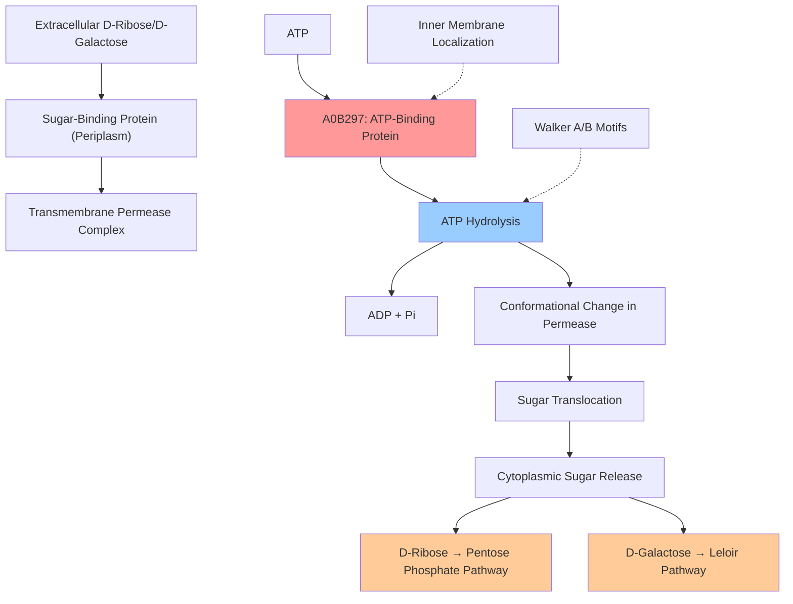

# Pathway Summary for A0B297

## Overview
A0B297 participates in the ABC transporter-mediated carbohydrate import pathway where it functions as the ATP-binding protein component [UniProtKB:A0B297]. This energy-coupling subunit hydrolyzes ATP to drive the active transport of carbohydrates including D-ribose, D-galactose, and methyl galactoside across the bacterial inner membrane, enabling the cell to utilize these sugars as carbon and energy sources under various growth conditions.

## ABC Transporter Carbohydrate Import System
The ABC transporter carbohydrate import system represents a sophisticated mechanism that enables bacteria to actively transport sugars against concentration gradients [UniProtKB:A0B297]. A0B297 serves as the essential energy-coupling component of this system, belonging to the CUT2 (Carbohydrate Uptake Transporter 2) family of ABC transporters.

The protein contains two ABC transporter domains with conserved nucleotide-binding motifs including Walker A and Walker B sequences that are essential for ATP binding and hydrolysis [UniProtKB:A0B297]. These domains work coordinately to couple the chemical energy of ATP hydrolysis to the mechanical work required for substrate translocation across the membrane.

A0B297 functions as a peripheral membrane protein associated with the inner membrane, where it interacts with transmembrane permease subunits to form a complete transport complex. The protein catalyzes both ribose transport (EC 7.5.2.7) and galactose transport (EC 7.5.2.11), demonstrating broad substrate specificity within the monosaccharide family.

## Carbohydrate Metabolism and Energy Generation
The carbohydrate import system mediated by A0B297 plays a crucial role in bacterial carbon metabolism by providing access to diverse sugar substrates [UniProtKB:A0B297]. The transported sugars serve as both carbon sources for biosynthetic pathways and energy sources for cellular ATP production through glycolysis and other metabolic processes.

D-ribose transport is particularly important for nucleotide biosynthesis, as ribose serves as the pentose sugar component of RNA and various nucleotide cofactors. D-galactose transport enables the utilization of this hexose sugar through the Leloir pathway, where it is converted to glucose-6-phosphate for entry into central metabolic pathways.

## ABC Transporter Carbohydrate Import Pathway Diagram

## Transport Mechanism and Energy Coupling
A0B297 operates through a well-characterized alternating access mechanism typical of ABC transporters [UniProtKB:A0B297]. The protein undergoes conformational changes driven by ATP binding and hydrolysis that are transmitted to the permease subunits, causing them to alternate between inward-facing and outward-facing states.

The two ABC transporter domains within A0B297 coordinate their ATP hydrolysis cycles to ensure unidirectional transport and prevent futile cycling. This coordination is essential for maintaining the energy efficiency of the transport process and ensuring net sugar accumulation within the cell.

The protein's peripheral membrane association allows it to interact dynamically with the transmembrane components while maintaining access to the cytoplasmic ATP pool. This positioning is optimal for coupling ATP hydrolysis to transport activity while enabling regulatory control over transport rates.

## Cellular Regulation and Metabolic Integration
The A0B297-mediated transport system is likely subject to regulation by cellular sugar and energy status, allowing bacteria to modulate carbohydrate uptake based on metabolic needs [UniProtKB:A0B297]. This regulation ensures efficient resource utilization and prevents excessive energy expenditure on sugar transport when intracellular sugar levels are adequate.

The broad substrate specificity of the transport system provides metabolic flexibility, enabling Burkholderia cenocepacia to utilize diverse carbohydrate sources available in its environment. This adaptability is particularly important for pathogenic bacteria that encounter varying nutrient conditions in different host tissues.

## Clinical and Environmental Significance
Understanding A0B297 function has important implications for both clinical microbiology and environmental biotechnology [UniProtKB:A0B297]. Burkholderia cenocepacia is an opportunistic pathogen that can cause severe infections in immunocompromised patients, and its carbohydrate transport capabilities may influence virulence and antibiotic resistance.

The protein represents a potential target for antimicrobial development, as disruption of essential nutrient transport systems can compromise bacterial viability. Additionally, the broad substrate specificity and efficient transport mechanism make this system attractive for biotechnological applications requiring enhanced carbohydrate utilization in engineered bacterial strains.