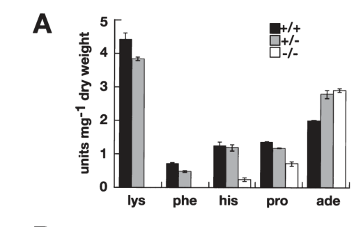

## Question

# Gene Research for Functional Annotation

## ⚠️ CRITICAL: Gene/Protein Identification Context

**BEFORE YOU BEGIN RESEARCH:** You MUST verify you are researching the CORRECT gene/protein. Gene symbols can be ambiguous, especially for less well-characterized genes from non-model organisms.

### Target Gene/Protein Identity (from UniProt):
- **UniProt Accession:** A0A1D8PLU5
- **Protein Description:** SubName: Full=Csh3p {ECO:0000313|EMBL:AOW29098.1};
- **Gene Information:** Name=CSH3 {ECO:0000313|CGD:CAL0000198586, ECO:0000313|EMBL:AOW29098.1}; OrderedLocusNames=CAALFM_C403390WA {ECO:0000313|EMBL:AOW29098.1}, orf19.10874 {ECO:0000313|CGD:CAL0000198586};
- **Organism (full):** Candida albicans (strain SC5314 / ATCC MYA-2876) (Yeast).
- **Protein Family:** Not specified in UniProt
- **Key Domains:** Psh3/Shr3. (IPR013248); SHR3_chaperone (PF08229)

### MANDATORY VERIFICATION STEPS:

1. **Check if the gene symbol "CSH3" matches the protein description above**
2. **Verify the organism is correct:** Candida albicans (strain SC5314 / ATCC MYA-2876) (Yeast).
3. **Check if protein family/domains align with what you find in literature**
4. **If you find literature for a DIFFERENT gene with the same or similar symbol, STOP**

### If Gene Symbol is Ambiguous or You Cannot Find Relevant Literature:

**DO NOT PROCEED WITH RESEARCH ON A DIFFERENT GENE.** Instead:
- State clearly: "The gene symbol 'CSH3' is ambiguous or literature is limited for this specific protein"
- Explain what you found (e.g., "Found extensive literature on a different gene with the same symbol in a different organism")
- Describe the protein based ONLY on the UniProt information provided above
- Suggest that the protein function can be inferred from domain/family information

### Research Target:

Please provide a comprehensive research report on the gene **CSH3** (gene ID: CSH3, UniProt: A0A1D8PLU5) in CANAL.

The research report should be a detailed narrative explaining the function, biological processes, and localization of the gene product. Citations should be given for all claims.

You should prioritize authoritative reviews and primary scientific literature when conducting research. You can supplement
this with annotations you find in gene/protein databases, but these can be outdated or inaccurate.

We are specifically interested in the primary function of the gene - for enzymes, what reaction is catalyzed, and what is the substrate specificity? For transporters, what is the substrate? For structural proteins or adapters, what is the broader structural role? For signaling molecules, what is the role in the pathway.

We are interested in where in or outside the cell the gene product carries out its function.

We are also interested in the signaling or biochemical pathways in which the gene functions. We are less interested in broad pleiotropic effects, except where these elucidate the precise role.

Include evidence where possible. We are interested in both experimental evidence as well as inference from structure, evolution, or bioinformatic analysis. Precise studies should be prioritized over high-throughput, where available.

## Output

Question: You are an expert researcher providing comprehensive, well-cited information.

Provide detailed information focusing on:
1. Key concepts and definitions with current understanding
2. Recent developments and latest research (prioritize 2023-2024 sources)
3. Current applications and real-world implementations
4. Expert opinions and analysis from authoritative sources
5. Relevant statistics and data from recent studies

Format as a comprehensive research report with proper citations. Include URLs and publication dates where available.
Always prioritize recent, authoritative sources and provide specific citations for all major claims.

# Gene Research for Functional Annotation

## ⚠️ CRITICAL: Gene/Protein Identification Context

**BEFORE YOU BEGIN RESEARCH:** You MUST verify you are researching the CORRECT gene/protein. Gene symbols can be ambiguous, especially for less well-characterized genes from non-model organisms.

### Target Gene/Protein Identity (from UniProt):
- **UniProt Accession:** A0A1D8PLU5
- **Protein Description:** SubName: Full=Csh3p {ECO:0000313|EMBL:AOW29098.1};
- **Gene Information:** Name=CSH3 {ECO:0000313|CGD:CAL0000198586, ECO:0000313|EMBL:AOW29098.1}; OrderedLocusNames=CAALFM_C403390WA {ECO:0000313|EMBL:AOW29098.1}, orf19.10874 {ECO:0000313|CGD:CAL0000198586};
- **Organism (full):** Candida albicans (strain SC5314 / ATCC MYA-2876) (Yeast).
- **Protein Family:** Not specified in UniProt
- **Key Domains:** Psh3/Shr3. (IPR013248); SHR3_chaperone (PF08229)

### MANDATORY VERIFICATION STEPS:

1. **Check if the gene symbol "CSH3" matches the protein description above**
2. **Verify the organism is correct:** Candida albicans (strain SC5314 / ATCC MYA-2876) (Yeast).
3. **Check if protein family/domains align with what you find in literature**
4. **If you find literature for a DIFFERENT gene with the same or similar symbol, STOP**

### If Gene Symbol is Ambiguous or You Cannot Find Relevant Literature:

**DO NOT PROCEED WITH RESEARCH ON A DIFFERENT GENE.** Instead:
- State clearly: "The gene symbol 'CSH3' is ambiguous or literature is limited for this specific protein"
- Explain what you found (e.g., "Found extensive literature on a different gene with the same symbol in a different organism")
- Describe the protein based ONLY on the UniProt information provided above
- Suggest that the protein function can be inferred from domain/family information

### Research Target:

Please provide a comprehensive research report on the gene **CSH3** (gene ID: CSH3, UniProt: A0A1D8PLU5) in CANAL.

The research report should be a detailed narrative explaining the function, biological processes, and localization of the gene product. Citations should be given for all claims.

You should prioritize authoritative reviews and primary scientific literature when conducting research. You can supplement
this with annotations you find in gene/protein databases, but these can be outdated or inaccurate.

We are specifically interested in the primary function of the gene - for enzymes, what reaction is catalyzed, and what is the substrate specificity? For transporters, what is the substrate? For structural proteins or adapters, what is the broader structural role? For signaling molecules, what is the role in the pathway.

We are interested in where in or outside the cell the gene product carries out its function.

We are also interested in the signaling or biochemical pathways in which the gene functions. We are less interested in broad pleiotropic effects, except where these elucidate the precise role.

Include evidence where possible. We are interested in both experimental evidence as well as inference from structure, evolution, or bioinformatic analysis. Precise studies should be prioritized over high-throughput, where available.

## Comprehensive Research Report: *Candida albicans* CSH3 (Csh3p; UniProt A0A1D8PLU5)

### Scope and identity verification (mandatory)
The target protein is **Csh3p**, encoded by **CSH3** in **Candida albicans strain SC5314** (yeast). The gene/protein was experimentally characterized as a **functional and structural homolog of *Saccharomyces cerevisiae* Shr3p**, an ER-resident membrane factor required for efficient functional expression of amino-acid permeases (AAPs). The *C. albicans* protein shares reported sequence similarity with Shr3p and is predicted to be an **integral membrane protein with four transmembrane segments**, consistent with the **Shr3/Psh3 (PF08229; IPR013248)** family assignment provided in the UniProt context. (martinez2004anerpackaging pages 2-3, martinez2004anerpackaging pages 1-2)

### 1) Key concepts and current definitions

#### 1.1 What Csh3p is (and is not)
**Csh3p is not a transporter and not an enzyme**; instead, it is best understood as a **fungal ER membrane “packaging/folding chaperone” (also called a membrane-localized chaperone/escort)** whose primary role is to enable the proper biogenesis and ER exit of a specific class of multipass plasma-membrane proteins—most prominently **amino-acid permeases (AAPs)**. In the absence of Shr3-family proteins, client permeases are inserted into the ER membrane but fail to achieve productive folding/assembly, are excluded from ER export vesicles, and can be diverted to ER quality-control and degradation pathways. (martinez2004anerpackaging pages 1-2, silao2021aminoacidsensing pages 6-7, kota2007membranechaperoneshr3 pages 1-2, kota2007membranechaperoneshr3 pages 2-3)

#### 1.2 Shr3-family ER chaperones: mechanistic model
Work in *S. cerevisiae* established the mechanistic paradigm for this family. **Shr3** is an ER membrane-localized factor required specifically for ER-to-plasma-membrane localization of multiple AAPs, while many other secretory and membrane proteins traffic normally, indicating **substrate-class specificity**. (ljungdahl1992shr3anovel pages 2-3, ljungdahl1992shr3anovel pages 9-11)

Mechanistically, Shr3-family proteins:
- Assist **early folding/assembly** of nascent multipass transporters during co-translational membrane insertion.
- Help prevent **nonproductive transmembrane-segment interactions and aggregation** in the ER.
- Couple productive folding to **COPII-mediated packaging** and ER exit.
- Intersect with ER quality control; when Shr3 is absent, aggregated permeases can be targeted by **ER-associated degradation (ERAD)** pathways. (kota2007membranechaperoneshr3 pages 7-8, kota2007membranechaperoneshr3 pages 1-2, kota2007membranechaperoneshr3 pages 2-3, kota2007membranechaperoneshr3 pages 11-11)

Because *C. albicans* Csh3p is a functional homolog that complements *S. cerevisiae shr3Δ* phenotypes, these mechanistic principles are widely used as **structure/function inference** for Csh3p in *C. albicans*. (martinez2004anerpackaging pages 2-3, martinez2004anerpackaging pages 8-9)

### 2) Molecular function, pathway context, and cellular localization of *C. albicans* Csh3p

#### 2.1 Subcellular localization
A functional **Csh3p–GFP** fusion shows **perinuclear rim** and ER-like cytoplasmic network fluorescence, consistent with **endoplasmic reticulum localization**. (martinez2004anerpackaging pages 3-5, martinez2004anerpackaging media b7665d6c)

#### 2.2 Primary molecular function: enabling functional expression of amino-acid permeases
Direct *C. albicans* genetic and physiological analysis indicates **CSH3 is required for high-capacity amino acid uptake**, consistent with impaired functional expression and/or plasma membrane localization of multiple AAPs in its absence. A *csh3Δ/csh3Δ* mutant showed a **decreased capacity to transport each amino acid tested**, with some uptake phenotypes being extreme (e.g., lysine and phenylalanine uptake undetectable in the described assays). (martinez2004anerpackaging pages 3-5, martinez2004anerpackaging media b7665d6c)

Csh3p also shows gene-dosage sensitivity: **CSH3/csh3Δ heterozygotes** can exhibit uptake defects even when some signaling responses appear intact, supporting a model where **Csh3p is rate-limiting for maximal permease output**. (martinez2004anerpackaging pages 9-11, martinez2004anerpackaging pages 3-5)

#### 2.3 Relationship to amino-acid sensing and the SPS pathway
*C. albicans* contains homologs of the **SPS amino-acid sensing system** (Ssy1–Ptr3–Ssy5), which activates transcriptional programs for amino-acid uptake via proteolytic processing of transcription factors (Stp1/Stp2) and induction of AAP genes. In a 2023 nutrient-acquisition review, this system is summarized and notes that AAPs are co-translated into the ER and are shuttled onward via the ER chaperone **Shr3** (not necessarily distinguishing Shr3 vs. Csh3 by name in the excerpt), consistent with the conserved trafficking paradigm. (garbe2023nutrientacquisitionand pages 21-25)

In *C. albicans*, Martínez & Ljungdahl explicitly predict that **loss of Csh3p will retain AAPs in the ER** (lowering permease abundance at the plasma membrane) and, because of the SPS pathway’s reliance on a plasma-membrane sensor (Ssy1-like), that the **Ssy1 homolog may also be retained in the ER**, thereby attenuating downstream SPS signaling and AAP gene expression. (martinez2004anerpackaging pages 8-9)

### 3) Phenotypes and quantitative evidence

#### 3.1 Amino-acid uptake phenotypes (quantitative)
In uptake assays using radiolabeled substrates, the *csh3Δ/csh3Δ* mutant exhibited:
- **Undetectable lysine and phenylalanine uptake**
- **Greatly diminished histidine and proline uptake**
- **Increased adenine uptake** (a specificity control suggesting the defect is not a global uptake collapse) (martinez2004anerpackaging pages 3-5, martinez2004anerpackaging media b7665d6c)

Methods/statistics context reported in the primary study include initial uptake-rate measurements using **14C-labeled amino acids**, and uptake activity expressed in **nmol·min⁻¹** units; experimental details include buffering conditions and glucose supplementation. (martinez2004anerpackaging pages 12-13)

#### 3.2 Morphogenesis / filamentation
A central biological implication is that **amino-acid-induced morphogenic switching (filamentation)** depends on CSH3. *csh3Δ/csh3Δ* mutants show severely reduced ability to switch morphologies in response to amino-acid stimuli, while responses to non–amino-acid cues are comparatively preserved, supporting functional specificity tied to amino-acid uptake/sensing circuits. (martinez2004anerpackaging pages 9-11, martinez2004anerpackaging pages 8-9)

#### 3.3 Virulence (mouse systemic infection) with specific outcome measures
In a mouse intravenous infection model, **CSH3 is required for efficient virulence**:
- Wild-type **CSH3/CSH3** *C. albicans* killed hosts rapidly (reported as **all mice dead within 9 days** in one comparison; an alternate wild-type comparator killed all by day 5).
- Both **CSH3/csh3Δ** heterozygous and **csh3Δ/csh3Δ** homozygous strains were markedly attenuated, with **~50% of mice alive at day 16** and some animals surviving to the end of a **30-day** observation period. (martinez2004anerpackaging pages 8-9)

These findings directly connect an ER chaperone for nutrient transporters to pathogenic fitness, and they support the authors’ inference that *C. albicans* uses amino acids (likely as nitrogen sources) during mammalian infection and that **high-capacity amino-acid uptake is a virulence-enabling trait**. (martinez2004anerpackaging pages 8-9, martinez2004anerpackaging pages 1-2)

### 4) Recent developments and latest research (emphasis on 2023–2024)

#### 4.1 2023 synthesis in *C. albicans* nutrient-acquisition literature
A 2023 review on nutrient acquisition and metabolic adaptation in *C. albicans* summarizes the SPS signaling cascade and places ER chaperone–mediated trafficking of AAPs (via Shr3-family function) as an enabling layer for amino-acid uptake programs. While the excerpted sections do not discuss **CSH3** specifically by name or provide new quantitative Csh3-specific data, the inclusion of Shr3-mediated trafficking in a contemporary virulence-metabolism synthesis indicates ongoing relevance of this mechanism as a core concept in the field. (garbe2023nutrientacquisitionand pages 21-25)

#### 4.2 Mechanistic maturation of the Shr3 paradigm
Although not *C. albicans*-specific, mechanistic work in the Shr3 family continues to refine concepts of **co-translational assistance**, **transient chaperone–substrate interactions**, and integration with quality-control routes (ERAD). A 2019 review consolidates these ideas and explicitly lists orthologs including **Csh3 in *C. albicans***, situating it among ER factors that link folding/assembly to ER export. (diallinas2019transportermembranetraffic pages 2-4)

*Limitation of the present evidence set:* a 2023 Journal of Cell Biology primary paper on Shr3 is known to exist (metadata observed during search), but its full text was not successfully retrieved in the current tool context; therefore, I do not quote or rely on its specific claims here. (unretrieved in this run)

### 5) Applications and real-world implementations

#### 5.1 Csh3p as a node connecting nutrient uptake to virulence
Because Csh3p is required for functional expression of multiple AAPs, it acts as a **bottleneck control point** for amino-acid uptake capacity. In the context of infection biology, the mouse systemic infection attenuation observed for both heterozygous and homozygous mutants suggests that partial reductions in this node can have large effects on host-pathogen outcomes. (martinez2004anerpackaging pages 8-9, martinez2004anerpackaging pages 9-11)

#### 5.2 Conceptual/therapeutic relevance
The primary literature emphasizes that Csh3p/Shr3 homologs are **fungal-specific** and required for efficient permease biogenesis and virulence-associated growth. This makes Shr3-family chaperones conceptually attractive as **antifungal target classes** (pathogen-selective membrane biogenesis factors), although the evidence assembled here does not include direct drug-development studies targeting Csh3p. (martinez2004anerpackaging pages 9-11, diallinas2019transportermembranetraffic pages 2-4)

### 6) Expert opinions and authoritative interpretations
Across primary and review literature, the expert consensus is that **Shr3-family proteins are specialized ER membrane chaperones** that:
- Are required for **efficient ER exit and plasma membrane localization** of a restricted client class (notably AAPs)
- Function at the interface of **folding/assembly**, **quality control (ERAD)**, and **COPII packaging**
- Are conserved across fungi with orthologs including **Csh3** (Candida) and **Psh3** (Schizosaccharomyces), reinforcing functional inference for less extensively characterized family members. (diallinas2019transportermembranetraffic pages 2-4, ljungdahl1992shr3anovel pages 2-3, ljungdahl1992shr3anovel pages 9-11)

### Evidence summary table
| Aspect | Key evidence/notes | Key sources |
|---|---|---|
| identity/domains | **Candida albicans** **CSH3** encodes **Csh3p**, a functional and structural homolog of **Saccharomyces cerevisiae Shr3p**. The reported protein has **four transmembrane segments**, ~**36% identity / 48% similarity** to S. cerevisiae Shr3p, matching the UniProt-assigned **Shr3/Psh3 family** context rather than an unrelated CSH3 symbol from another organism. (martinez2004anerpackaging pages 2-3, martinez2004anerpackaging pages 1-2) | Martínez & Ljungdahl 2004, DOI: https://doi.org/10.1046/j.1365-2958.2003.03845.x; Ljungdahl et al. 1992, DOI: https://doi.org/10.1016/0092-8674(92)90515-e |
| localization | Functional **Csh3p-GFP** localizes to the **perinuclear rim** and a filamentous cytoplasmic network, consistent with the **endoplasmic reticulum (ER)**. Reviews and comparative studies consistently describe Csh3/Shr3 proteins as **ER-membrane-localized** chaperones. (martinez2004anerpackaging pages 3-5, silao2021aminoacidsensing pages 6-7, martinez2004anerpackaging media b7665d6c) | Martínez & Ljungdahl 2004, DOI: https://doi.org/10.1046/j.1365-2958.2003.03845.x; Silao & Ljungdahl 2021, DOI: https://doi.org/10.3390/pathogens11010005 |
| molecular function | Csh3p is **not an enzyme or transporter**; it is a **specialized ER packaging/folding chaperone** required for the productive biogenesis of **amino acid permeases (AAPs)**. By analogy with Shr3-family mechanistic work, it assists early folding/assembly of multipass transporters, promotes their **COPII-dependent ER exit**, and helps prevent aggregation and premature **ERAD**. (martinez2004anerpackaging pages 1-2, kota2007membranechaperoneshr3 pages 7-8, kota2007membranechaperoneshr3 pages 1-2, diallinas2019transportermembranetraffic pages 2-4) | Martínez & Ljungdahl 2004, DOI: https://doi.org/10.1046/j.1365-2958.2003.03845.x; Kota et al. 2007, DOI: https://doi.org/10.1083/jcb.200612100; Diallinas & Martzoukou 2019, DOI: https://doi.org/10.1111/febs.15078 |
| client proteins | The best-supported clients are the **AAP family** in C. albicans; the genome was noted to encode ~**22 AAP-related ORFs**. The literature also predicts dependence of the **Ssy1** amino-acid sensor/permease-like component on Csh3 for proper plasma-membrane localization, consistent with Shr3-family substrate specificity for related multipass membrane proteins. (martinez2004anerpackaging pages 1-2, martinez2004anerpackaging pages 8-9, garbe2023nutrientacquisitionand pages 21-25) | Martínez & Ljungdahl 2004, DOI: https://doi.org/10.1046/j.1365-2958.2003.03845.x; Garbe 2023 (review context summarized in available text) |
| pathway context | Csh3p functions upstream of **amino acid uptake** and intersects the **SPS amino-acid sensing pathway** because proper localization of AAPs, and likely **Ssy1**, is required for extracellular amino-acid responses. In the broader model, extracellular amino acids activate **Ssy1-Ptr3-Ssy5**, causing **Stp1/Stp2** processing and induction of AAP genes; Csh3 is needed so these induced permeases become functional at the plasma membrane. (martinez2004anerpackaging pages 8-9, garbe2023nutrientacquisitionand pages 21-25, silao2021aminoacidsensing pages 6-7) | Martínez & Ljungdahl 2004, DOI: https://doi.org/10.1046/j.1365-2958.2003.03845.x; Silao & Ljungdahl 2021, DOI: https://doi.org/10.3390/pathogens11010005 |
| phenotypes | **csh3Δ/csh3Δ** mutants show broad defects in amino-acid utilization and uptake, including inability to efficiently use several amino acids as nitrogen sources and failure to undergo **amino-acid-induced filamentation**. **CSH3/csh3Δ** heterozygotes are **haploinsufficient** for high-capacity uptake, showing intermediate uptake defects while often retaining amino-acid-induced morphogenetic signaling. (martinez2004anerpackaging pages 9-11, martinez2004anerpackaging pages 3-5, martinez2004anerpackaging pages 1-2) | Martínez & Ljungdahl 2004, DOI: https://doi.org/10.1046/j.1365-2958.2003.03845.x |
| virulence data | In a mouse intravenous infection model using **1 × 10^6 cells** per inoculum, wild-type **CSH3/CSH3** strains killed all mice rapidly, whereas both **heterozygous** and **homozygous csh3 mutants** were markedly attenuated. Reported summary outcomes include wild type killing all mice within **9 days** (one wild-type comparator by **day 5**), while mutant groups showed prolonged survival, with **50% alive at day 16** and some animals surviving to **day 30**. (martinez2004anerpackaging pages 8-9) | Martínez & Ljungdahl 2004, DOI: https://doi.org/10.1046/j.1365-2958.2003.03845.x |
| quantitative measures | Uptake assays measured initial rates with **14C-labeled amino acids** at **50 mM** substrate and reported activity in **nmol min^-1**. Quantitatively, the null mutant had **undetectable lysine and phenylalanine uptake**, **greatly diminished histidine and proline uptake**, and even **increased adenine uptake**; figure-based evidence also shows gene-dosage effects in heterozygotes and a **5 h** proline-uptake induction time course. (martinez2004anerpackaging pages 3-5, martinez2004anerpackaging pages 12-13, martinez2004anerpackaging media b7665d6c) | Martínez & Ljungdahl 2004, DOI: https://doi.org/10.1046/j.1365-2958.2003.03845.x |

*Table: This table summarizes the experimentally supported functional annotation of Candida albicans Csh3p (CSH3; UniProt A0A1D8PLU5), including identity, localization, mechanism, pathway placement, and phenotype/virulence evidence. It is useful as a concise evidence map for interpreting this Shr3-family ER membrane chaperone.*

### Key visual evidence retrieved in this run
- **Csh3p–GFP ER localization micrographs** (Fig. 2C) (martinez2004anerpackaging media b7665d6c)
- **Quantitative amino-acid uptake rates** across genotypes (Fig. 2A) (martinez2004anerpackaging media b7665d6c)
- **Proline uptake induction time course** (Fig. 6B) (martinez2004anerpackaging media b7665d6c)
- **Mouse survival curves** demonstrating virulence attenuation (Fig. 7A) (martinez2004anerpackaging media b7665d6c)

### References (URLs and publication dates where available)
- Ljungdahl PO, Gimeno CJ, Styles CA, Fink GR. **SHR3: A novel component of the secretory pathway specifically required for localization of amino acid permeases in yeast.** *Cell*. **1992-10**. https://doi.org/10.1016/0092-8674(92)90515-e (ljungdahl1992shr3anovel pages 2-3, ljungdahl1992shr3anovel pages 9-11)
- Martínez P, Ljungdahl PO. **An ER packaging chaperone determines the amino acid uptake capacity and virulence of *Candida albicans*.** *Molecular Microbiology*. **2004-01**. https://doi.org/10.1046/j.1365-2958.2003.03845.x (martinez2004anerpackaging pages 8-9, martinez2004anerpackaging pages 3-5, martinez2004anerpackaging pages 2-3, martinez2004anerpackaging media b7665d6c)
- Kota J, Gilstring CF, Ljungdahl PO. **Membrane chaperone Shr3 assists in folding amino acid permeases preventing precocious ERAD.** *J Cell Biol*. **2007-02**. https://doi.org/10.1083/jcb.200612100 (kota2007membranechaperoneshr3 pages 7-8, kota2007membranechaperoneshr3 pages 2-3)
- Diallinas G, Martzoukou O. **Transporter membrane traffic and function: lessons from a mould.** *FEBS J*. **2019-12**. https://doi.org/10.1111/febs.15078 (diallinas2019transportermembranetraffic pages 2-4)
- Silao FGS, Ljungdahl PO. **Amino Acid Sensing and Assimilation by the Fungal Pathogen *Candida albicans* in the Human Host.** *Pathogens*. **2021-12**. https://doi.org/10.3390/pathogens11010005 (silao2021aminoacidsensing pages 6-7)
- Garbe E. **Nutrient acquisition and metabolic adaptation in the context of *Candida albicans* virulence.** **2023**. (bibliographic details incomplete in retrieved record) (garbe2023nutrientacquisitionand pages 21-25)

References

1. (martinez2004anerpackaging pages 2-3): Paula Martínez and Per O. Ljungdahl. An er packaging chaperone determines the amino acid uptake capacity and virulence of <i>candida albicans</i>. Molecular Microbiology, 51:371-384, Jan 2004. URL: https://doi.org/10.1046/j.1365-2958.2003.03845.x, doi:10.1046/j.1365-2958.2003.03845.x. This article has 74 citations and is from a domain leading peer-reviewed journal.

2. (martinez2004anerpackaging pages 1-2): Paula Martínez and Per O. Ljungdahl. An er packaging chaperone determines the amino acid uptake capacity and virulence of <i>candida albicans</i>. Molecular Microbiology, 51:371-384, Jan 2004. URL: https://doi.org/10.1046/j.1365-2958.2003.03845.x, doi:10.1046/j.1365-2958.2003.03845.x. This article has 74 citations and is from a domain leading peer-reviewed journal.

3. (silao2021aminoacidsensing pages 6-7): Fitz Gerald S. Silao and Per O. Ljungdahl. Amino acid sensing and assimilation by the fungal pathogen candida albicans in the human host. Pathogens, 11:5, Dec 2021. URL: https://doi.org/10.3390/pathogens11010005, doi:10.3390/pathogens11010005. This article has 44 citations.

4. (kota2007membranechaperoneshr3 pages 1-2): Jhansi Kota, C. Fredrik Gilstring, and Per O. Ljungdahl. Membrane chaperone shr3 assists in folding amino acid permeases preventing precocious erad. The Journal of Cell Biology, 176:617-628, Feb 2007. URL: https://doi.org/10.1083/jcb.200612100, doi:10.1083/jcb.200612100. This article has 128 citations.

5. (kota2007membranechaperoneshr3 pages 2-3): Jhansi Kota, C. Fredrik Gilstring, and Per O. Ljungdahl. Membrane chaperone shr3 assists in folding amino acid permeases preventing precocious erad. The Journal of Cell Biology, 176:617-628, Feb 2007. URL: https://doi.org/10.1083/jcb.200612100, doi:10.1083/jcb.200612100. This article has 128 citations.

6. (ljungdahl1992shr3anovel pages 2-3): Per O. Ljungdahl, Carlos J. Gimeno, Cora A. Styles, and Gerald R. Fink. Shr3: a novel component of the secretory pathway specifically required for localization of amino acid permeases in yeast. Cell, 71:463-478, Oct 1992. URL: https://doi.org/10.1016/0092-8674(92)90515-e, doi:10.1016/0092-8674(92)90515-e. This article has 241 citations and is from a highest quality peer-reviewed journal.

7. (ljungdahl1992shr3anovel pages 9-11): Per O. Ljungdahl, Carlos J. Gimeno, Cora A. Styles, and Gerald R. Fink. Shr3: a novel component of the secretory pathway specifically required for localization of amino acid permeases in yeast. Cell, 71:463-478, Oct 1992. URL: https://doi.org/10.1016/0092-8674(92)90515-e, doi:10.1016/0092-8674(92)90515-e. This article has 241 citations and is from a highest quality peer-reviewed journal.

8. (kota2007membranechaperoneshr3 pages 7-8): Jhansi Kota, C. Fredrik Gilstring, and Per O. Ljungdahl. Membrane chaperone shr3 assists in folding amino acid permeases preventing precocious erad. The Journal of Cell Biology, 176:617-628, Feb 2007. URL: https://doi.org/10.1083/jcb.200612100, doi:10.1083/jcb.200612100. This article has 128 citations.

9. (kota2007membranechaperoneshr3 pages 11-11): Jhansi Kota, C. Fredrik Gilstring, and Per O. Ljungdahl. Membrane chaperone shr3 assists in folding amino acid permeases preventing precocious erad. The Journal of Cell Biology, 176:617-628, Feb 2007. URL: https://doi.org/10.1083/jcb.200612100, doi:10.1083/jcb.200612100. This article has 128 citations.

10. (martinez2004anerpackaging pages 8-9): Paula Martínez and Per O. Ljungdahl. An er packaging chaperone determines the amino acid uptake capacity and virulence of <i>candida albicans</i>. Molecular Microbiology, 51:371-384, Jan 2004. URL: https://doi.org/10.1046/j.1365-2958.2003.03845.x, doi:10.1046/j.1365-2958.2003.03845.x. This article has 74 citations and is from a domain leading peer-reviewed journal.

11. (martinez2004anerpackaging pages 3-5): Paula Martínez and Per O. Ljungdahl. An er packaging chaperone determines the amino acid uptake capacity and virulence of <i>candida albicans</i>. Molecular Microbiology, 51:371-384, Jan 2004. URL: https://doi.org/10.1046/j.1365-2958.2003.03845.x, doi:10.1046/j.1365-2958.2003.03845.x. This article has 74 citations and is from a domain leading peer-reviewed journal.

12. (martinez2004anerpackaging media b7665d6c): Paula Martínez and Per O. Ljungdahl. An er packaging chaperone determines the amino acid uptake capacity and virulence of <i>candida albicans</i>. Molecular Microbiology, 51:371-384, Jan 2004. URL: https://doi.org/10.1046/j.1365-2958.2003.03845.x, doi:10.1046/j.1365-2958.2003.03845.x. This article has 74 citations and is from a domain leading peer-reviewed journal.

13. (martinez2004anerpackaging pages 9-11): Paula Martínez and Per O. Ljungdahl. An er packaging chaperone determines the amino acid uptake capacity and virulence of <i>candida albicans</i>. Molecular Microbiology, 51:371-384, Jan 2004. URL: https://doi.org/10.1046/j.1365-2958.2003.03845.x, doi:10.1046/j.1365-2958.2003.03845.x. This article has 74 citations and is from a domain leading peer-reviewed journal.

14. (garbe2023nutrientacquisitionand pages 21-25): E Garbe. Nutrient acquisition and metabolic adaptation in the context of candida albicans virulence. Unknown journal, 2023.

15. (martinez2004anerpackaging pages 12-13): Paula Martínez and Per O. Ljungdahl. An er packaging chaperone determines the amino acid uptake capacity and virulence of <i>candida albicans</i>. Molecular Microbiology, 51:371-384, Jan 2004. URL: https://doi.org/10.1046/j.1365-2958.2003.03845.x, doi:10.1046/j.1365-2958.2003.03845.x. This article has 74 citations and is from a domain leading peer-reviewed journal.

16. (diallinas2019transportermembranetraffic pages 2-4): George Diallinas and Olga Martzoukou. Transporter membrane traffic and function: lessons from a mould. The FEBS Journal, 286:4861-4875, Dec 2019. URL: https://doi.org/10.1111/febs.15078, doi:10.1111/febs.15078. This article has 32 citations.

## Artifacts

- [Edison artifact artifact-00](CSH3-deep-research-falcon_artifacts/artifact-00.md)

## Citations

1. garbe2023nutrientacquisitionand pages 21-25
2. martinez2004anerpackaging pages 8-9
3. martinez2004anerpackaging pages 12-13
4. diallinas2019transportermembranetraffic pages 2-4
5. silao2021aminoacidsensing pages 6-7
6. martinez2004anerpackaging pages 2-3
7. martinez2004anerpackaging pages 1-2
8. martinez2004anerpackaging pages 3-5
9. martinez2004anerpackaging pages 9-11
10. https://doi.org/10.1046/j.1365-2958.2003.03845.x;
11. https://doi.org/10.1016/0092-8674(92
12. https://doi.org/10.3390/pathogens11010005
13. https://doi.org/10.1083/jcb.200612100;
14. https://doi.org/10.1111/febs.15078
15. https://doi.org/10.1046/j.1365-2958.2003.03845.x
16. https://doi.org/10.1083/jcb.200612100
17. https://doi.org/10.1046/j.1365-2958.2003.03845.x,
18. https://doi.org/10.3390/pathogens11010005,
19. https://doi.org/10.1083/jcb.200612100,
20. https://doi.org/10.1111/febs.15078,