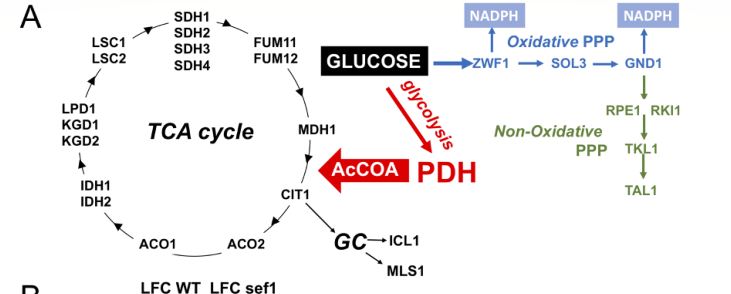

## Question

# Gene Research for Functional Annotation

## ⚠️ CRITICAL: Gene/Protein Identification Context

**BEFORE YOU BEGIN RESEARCH:** You MUST verify you are researching the CORRECT gene/protein. Gene symbols can be ambiguous, especially for less well-characterized genes from non-model organisms.

### Target Gene/Protein Identity (from UniProt):
- **UniProt Accession:** A0A1D8PFS4
- **Protein Description:** RecName: Full=6-phosphogluconate dehydrogenase, decarboxylating {ECO:0000256|PIRNR:PIRNR000109, ECO:0000256|RuleBase:RU000485}; EC=1.1.1.44 {ECO:0000256|PIRNR:PIRNR000109, ECO:0000256|RuleBase:RU000485};
- **Gene Information:** Name=GND1 {ECO:0000313|CGD:CAL0000188008, ECO:0000313|EMBL:AOW26988.1}; OrderedLocusNames=CAALFM_C113860CA {ECO:0000313|EMBL:AOW26988.1}, orf19.12491 {ECO:0000313|CGD:CAL0000188008};
- **Organism (full):** Candida albicans (strain SC5314 / ATCC MYA-2876) (Yeast).
- **Protein Family:** Belongs to the 6-phosphogluconate dehydrogenase family.
- **Key Domains:** 6-PGluconate_DH-like_C_sf. (IPR008927); 6PGD_dom2. (IPR013328); 6PGDH_C. (IPR006114); 6PGDH_Gnd/GntZ. (IPR006113); 6PGDH_NADP-bd. (IPR006115)

### MANDATORY VERIFICATION STEPS:

1. **Check if the gene symbol "GND1" matches the protein description above**
2. **Verify the organism is correct:** Candida albicans (strain SC5314 / ATCC MYA-2876) (Yeast).
3. **Check if protein family/domains align with what you find in literature**
4. **If you find literature for a DIFFERENT gene with the same or similar symbol, STOP**

### If Gene Symbol is Ambiguous or You Cannot Find Relevant Literature:

**DO NOT PROCEED WITH RESEARCH ON A DIFFERENT GENE.** Instead:
- State clearly: "The gene symbol 'GND1' is ambiguous or literature is limited for this specific protein"
- Explain what you found (e.g., "Found extensive literature on a different gene with the same symbol in a different organism")
- Describe the protein based ONLY on the UniProt information provided above
- Suggest that the protein function can be inferred from domain/family information

### Research Target:

Please provide a comprehensive research report on the gene **GND1** (gene ID: GND1, UniProt: A0A1D8PFS4) in CANAL.

The research report should be a detailed narrative explaining the function, biological processes, and localization of the gene product. Citations should be given for all claims.

You should prioritize authoritative reviews and primary scientific literature when conducting research. You can supplement
this with annotations you find in gene/protein databases, but these can be outdated or inaccurate.

We are specifically interested in the primary function of the gene - for enzymes, what reaction is catalyzed, and what is the substrate specificity? For transporters, what is the substrate? For structural proteins or adapters, what is the broader structural role? For signaling molecules, what is the role in the pathway.

We are interested in where in or outside the cell the gene product carries out its function.

We are also interested in the signaling or biochemical pathways in which the gene functions. We are less interested in broad pleiotropic effects, except where these elucidate the precise role.

Include evidence where possible. We are interested in both experimental evidence as well as inference from structure, evolution, or bioinformatic analysis. Precise studies should be prioritized over high-throughput, where available.

## Output

Question: You are an expert researcher providing comprehensive, well-cited information.

Provide detailed information focusing on:
1. Key concepts and definitions with current understanding
2. Recent developments and latest research (prioritize 2023-2024 sources)
3. Current applications and real-world implementations
4. Expert opinions and analysis from authoritative sources
5. Relevant statistics and data from recent studies

Format as a comprehensive research report with proper citations. Include URLs and publication dates where available.
Always prioritize recent, authoritative sources and provide specific citations for all major claims.

# Gene Research for Functional Annotation

## ⚠️ CRITICAL: Gene/Protein Identification Context

**BEFORE YOU BEGIN RESEARCH:** You MUST verify you are researching the CORRECT gene/protein. Gene symbols can be ambiguous, especially for less well-characterized genes from non-model organisms.

### Target Gene/Protein Identity (from UniProt):
- **UniProt Accession:** A0A1D8PFS4
- **Protein Description:** RecName: Full=6-phosphogluconate dehydrogenase, decarboxylating {ECO:0000256|PIRNR:PIRNR000109, ECO:0000256|RuleBase:RU000485}; EC=1.1.1.44 {ECO:0000256|PIRNR:PIRNR000109, ECO:0000256|RuleBase:RU000485};
- **Gene Information:** Name=GND1 {ECO:0000313|CGD:CAL0000188008, ECO:0000313|EMBL:AOW26988.1}; OrderedLocusNames=CAALFM_C113860CA {ECO:0000313|EMBL:AOW26988.1}, orf19.12491 {ECO:0000313|CGD:CAL0000188008};
- **Organism (full):** Candida albicans (strain SC5314 / ATCC MYA-2876) (Yeast).
- **Protein Family:** Belongs to the 6-phosphogluconate dehydrogenase family.
- **Key Domains:** 6-PGluconate_DH-like_C_sf. (IPR008927); 6PGD_dom2. (IPR013328); 6PGDH_C. (IPR006114); 6PGDH_Gnd/GntZ. (IPR006113); 6PGDH_NADP-bd. (IPR006115)

### MANDATORY VERIFICATION STEPS:

1. **Check if the gene symbol "GND1" matches the protein description above**
2. **Verify the organism is correct:** Candida albicans (strain SC5314 / ATCC MYA-2876) (Yeast).
3. **Check if protein family/domains align with what you find in literature**
4. **If you find literature for a DIFFERENT gene with the same or similar symbol, STOP**

### If Gene Symbol is Ambiguous or You Cannot Find Relevant Literature:

**DO NOT PROCEED WITH RESEARCH ON A DIFFERENT GENE.** Instead:
- State clearly: "The gene symbol 'GND1' is ambiguous or literature is limited for this specific protein"
- Explain what you found (e.g., "Found extensive literature on a different gene with the same symbol in a different organism")
- Describe the protein based ONLY on the UniProt information provided above
- Suggest that the protein function can be inferred from domain/family information

### Research Target:

Please provide a comprehensive research report on the gene **GND1** (gene ID: GND1, UniProt: A0A1D8PFS4) in CANAL.

The research report should be a detailed narrative explaining the function, biological processes, and localization of the gene product. Citations should be given for all claims.

You should prioritize authoritative reviews and primary scientific literature when conducting research. You can supplement
this with annotations you find in gene/protein databases, but these can be outdated or inaccurate.

We are specifically interested in the primary function of the gene - for enzymes, what reaction is catalyzed, and what is the substrate specificity? For transporters, what is the substrate? For structural proteins or adapters, what is the broader structural role? For signaling molecules, what is the role in the pathway.

We are interested in where in or outside the cell the gene product carries out its function.

We are also interested in the signaling or biochemical pathways in which the gene functions. We are less interested in broad pleiotropic effects, except where these elucidate the precise role.

Include evidence where possible. We are interested in both experimental evidence as well as inference from structure, evolution, or bioinformatic analysis. Precise studies should be prioritized over high-throughput, where available.

# Research Report: *Candida albicans* **GND1** (UniProt **A0A1D8PFS4**) — Functional Annotation

## 0) Target identity verification (critical)

The requested target (UniProt **A0A1D8PFS4**) is annotated by UniProt as **6-phosphogluconate dehydrogenase (decarboxylating)** (EC **1.1.1.44**) encoded by **GND1**, with *Candida albicans* SC5314 aliases **orf19.12491** and **CAALFM_C113860CA** (user-provided UniProt record). The literature retrieved here experimentally characterizes a *C. albicans* enzyme named **Gnd1** as **6-phosphogluconate dehydrogenase (6PGDH/6PGD)** with cytosolic and peroxisomal pools, matching the UniProt description at the enzyme/family level. However, the primary papers generally use the name **Gnd1** and do **not** explicitly print the UniProt accession **A0A1D8PFS4** or the ORF/locus tags **orf19.12491 / CAALFM_C113860CA** in the extracted sections, so the accession↔alias crosswalk is taken from the UniProt record while enzymatic function/localization are supported by *Candida* experiments. (strijbis2012alternativesplicingdirects pages 2-3, strijbis2012alternativesplicingdirects pages 3-6, strijbis2009duallocalizationof pages 135-137)

## 1) Key concepts and definitions (current understanding)

### 1.1 Enzyme definition and reaction

**6-Phosphogluconate dehydrogenase (decarboxylating)** (6PGDH; EC 1.1.1.44) catalyzes the oxidative decarboxylation step of the oxidative pentose phosphate pathway (oxPPP), converting **6-phosphogluconate (6PG)** to **ribulose-5-phosphate (Ru5P)** while reducing **NADP+ to NADPH** and releasing **CO2**. This reaction provides reducing power (NADPH) and produces Ru5P for pentose phosphate interconversions and nucleotide biosynthesis. (hanau20226phosphogluconatedehydrogenaseand pages 1-2, bertels2021thepentosephosphatea pages 4-6)

In *Candida albicans*, Strijbis et al. explicitly describe Gnd1 as the enzyme converting **6-phosphogluconate to ribulose-5-phosphate** and directly assay the activity using **6PG + NADP+** with NADPH formation monitored at 340 nm. (strijbis2012alternativesplicingdirects pages 2-3, strijbis2009duallocalizationof pages 131-133)

### 1.2 Pathway context: oxidative pentose phosphate pathway (oxPPP)

The oxPPP is a major NADPH-generating branch of glucose catabolism; in yeasts it provides NADPH for reductive biosynthesis and oxidative stress defense and supplies pentose phosphates for nucleotide synthesis. (bertels2021thepentosephosphate pages 4-6, bertels2021thepentosephosphatea pages 4-6)

### 1.3 Structural/biochemical concepts relevant to functional annotation

A structural review emphasizes that 6PGDH commonly functions as a **homodimer (or sometimes homotetramer)**, with the **active site at the subunit interface**, and that ligand binding can induce **active-site loop closure** and conformational asymmetry consistent with cooperative/half-sites behavior in some organisms. Key catalytic roles are associated with conserved **lysine (general base)** and **glutamate (general acid)** residues. Cofactor specificity is frequently **NADP+** (NADPH-forming) but can vary in some bacteria. (hanau20226phosphogluconatedehydrogenaseand pages 1-2, hanau20226phosphogluconatedehydrogenaseand pages 10-12, hanau20226phosphogluconatedehydrogenaseand pages 4-5)

## 2) *Candida albicans* GND1: primary function, localization, and pathways

### 2.1 Primary function and substrate specificity

**Primary function:** *C. albicans* **Gnd1** is the NADP+-dependent **6-phosphogluconate dehydrogenase** of the oxidative PPP, acting on **6-phosphogluconate** to generate **ribulose-5-phosphate + CO2 + NADPH**. This is supported by direct enzymatic assays using 6PG and NADP+ and by the pathway placement with Zwf1 upstream. (strijbis2012alternativesplicingdirects pages 2-3, strijbis2009duallocalizationof pages 131-133, garg2025aresponseto media 560f5f6c)

**Substrate/cofactor specificity:** The *Candida* enzymatic assay conditions explicitly use **NADP+** and measure **NADPH** formation, consistent with the standard fungal/yeast 6PGDH assignment as NADP+-dependent. (strijbis2012alternativesplicingdirects pages 2-3, bertels2021thepentosephosphatea pages 2-4)

### 2.2 Subcellular localization and compartmentalization

**Predominant cytosolic localization with a minor peroxisomal pool.** Subcellular fractionation of oleate-grown *C. albicans* showed approximately **95% of Gnd1 activity** in the cytosolic supernatant fraction, with the remaining activity in organellar fractions; Nycodenz gradients revealed a small activity peak associated with peroxisome-containing fractions. (strijbis2012alternativesplicingdirects pages 2-3, strijbis2009duallocalizationof pages 135-137)

**Quantitative peroxisomal fraction and microscopy evidence.** In the 2009 study, about **5–10%** of total Zwf1/Gnd1 activity was found in the organellar fraction; microscopy of a PTS2-forced construct yielded approximately **3–7 puncta per cell** consistent with peroxisomes, and puncta were lost in a **pex7Δ/Δ** background. (strijbis2009duallocalizationof pages 137-140, strijbis2009duallocalizationof pages 140-142, strijbis2009duallocalizationof pages 135-137)

### 2.3 Mechanism for dual localization: alternative splicing and PTS2/Pex7 dependence

Strijbis et al. demonstrate that **dual localization is driven by alternative splicing** of **GND1** transcripts: a major spliced transcript encodes the cytosolic enzyme, while a low-abundance alternatively spliced (PTS2-containing) isoform is targeted to peroxisomes. The intron encodes an in-frame **PTS2** motif, and import of the peroxisomal isoform depends on the **PTS2 receptor Pex7** (loss of peroxisomal Gnd1 peak in **pex7Δ/Δ**). (strijbis2012alternativesplicingdirects pages 3-6, strijbis2009duallocalizationof pages 137-140)

A key quantitative result is that the alternatively spliced GND1 transcript is approximately **1000-fold less abundant** than the main spliced transcript (qPCR), aligning with the small peroxisomal protein/activity pool. (strijbis2012alternativesplicingdirects pages 3-6)

### 2.4 Biological rationale for peroxisomal targeting

A yeast PPP review summarizing *Candida* work notes that peroxisomal targeting of oxPPP dehydrogenases may help provide **NADPH in peroxisomes** to detoxify reactive oxygen species generated during fatty-acid β-oxidation. (bertels2021thepentosephosphate pages 4-6)

## 3) Stress physiology and regulation involving GND1 in *C. albicans*

### 3.1 Iron limitation drives PPP/NADPH remodeling (recent primary evidence)

A 2025 *C. albicans* study reports that **iron limitation** causes metabolic remodeling, including increased flux toward the **pentose phosphate pathway** and increased **PPP NADPH production**. The authors report that oxPPP genes including **ZWF1** and **GND1** are induced in iron-starved cells and present a **cell-free oxidative PPP assay** that measures glucose-6-phosphate–stimulated NADPH production. (garg2025aresponseto pages 10-13, garg2025aresponseto pages 1-3)

A key pathway schematic and accompanying data are shown in the paper’s **Figure 6**, which explicitly depicts ZWF1 feeding 6PG substrate to **GND1** for NADPH production and includes gene expression and NADPH assay panels under iron limitation. (garg2025aresponseto media 560f5f6c, garg2025aresponseto media f4d06ecd, garg2025aresponseto media a79e8229)

### 3.2 Oxidative/redox stress coupling (general yeast context relevant to *Candida*)

The PPP is widely recognized as a major NADPH source that supports glutathione reduction and redox homeostasis; yeast PPP deficiency commonly increases oxidative stress sensitivity, consistent with the expectation that *C. albicans* Gnd1 contributes to antioxidant capacity via NADPH supply. (bertels2021thepentosephosphate pages 4-6, bertels2021thepentosephosphatea pages 4-6)

## 4) Recent developments and latest research (prioritizing 2023–2024) relevant to GND1 function

### 4.1 2023 systems-level view: PPP as a regulated metabolic node

A 2023 *Nature Metabolism* review synthesizes current understanding that the PPP is not merely a biosynthetic side pathway but a regulated network whose oxidative and non-oxidative branches are flexibly used to meet demands for **NADPH**, **ribose phosphates**, and other intermediates; it also emphasizes that flux through PPP enzymes is dynamically tuned by cellular redox and biosynthetic requirements. This provides authoritative context for interpreting *Candida* GND1 induction under stress as an NADPH-demand response. **Publication date:** Aug 2023. **URL:** https://doi.org/10.1038/s42255-023-00863-2. (bertels2021thepentosephosphate pages 4-6)

### 4.2 2024 perspective: redox homeostasis studies in yeasts (context)

Although not *Candida*-specific in the retrieved corpus, 2024 studies on yeast redox homeostasis reinforce that PPP enzymes are central to NADPH balance and stress adaptation; these support the general mechanistic rationale for oxPPP control points (ZWF1 and GND1) in stress tolerance. (wijnants2022interestingantifungaldrug pages 6-8)

**Evidence gap note (2023–2024 Candida-specific GND1):** In the retrieved sources, direct *C. albicans* GND1 primary studies most strongly supporting localization/function are 2009–2012, and the most recent *Candida*-specific oxPPP/GND1 stress induction evidence retrieved is 2025. (strijbis2012alternativesplicingdirects pages 2-3, strijbis2012alternativesplicingdirects pages 3-6, garg2025aresponseto pages 10-13)

## 5) Current applications and real-world implementations

### 5.1 Antifungal target landscape (central metabolism)

A 2022 *Trends in Pharmacological Sciences* review frames central metabolism—including the PPP—as a potential antifungal target space but emphasizes a major constraint: **many PPP enzymes are highly homologous to human counterparts**, raising host-toxicity risk. The review highlights candidate PPP enzymes with low/no human homology (e.g., Cgr1, Sol3, Tkl1) as more attractive starting points, while noting that virulence effects remain underexplored for some candidates. **Publication date:** Jan 2022. **URL:** https://doi.org/10.1016/j.tips.2021.10.003. (wijnants2022interestingantifungaldrug pages 6-8, wijnants2022interestingantifungaldrug pages 5-6)

Implication for **Gnd1 (6PGDH)**: given that 6PGDH is widely conserved and often similar to host enzymes, direct inhibition may face selectivity challenges; nevertheless, stress-induced reliance on NADPH generation (including via Gnd1) suggests that pathway-level targeting (PPP flux limitation, compensatory pathway blockade) could have therapeutic value if selectivity hurdles can be addressed. (wijnants2022interestingantifungaldrug pages 6-8, garg2025aresponseto pages 10-13)

### 5.2 Metabolic control under nutrient limitation as a therapeutic concept

The 2025 iron-limitation study concludes that *C. albicans* adapts to mitochondrial impairment by activating compensatory carbon metabolism pathways including PPP; it suggests that inhibiting such compensatory pathways could be beneficial for antifungal strategy development. This is a real-world translational framing of PPP enzymes (including GND1) as part of an adaptive metabolic program during host-imposed micronutrient restriction. **Publication date:** Apr 2025. **URL:** https://doi.org/10.1128/msphere.00040-25. (garg2025aresponseto pages 1-3)

## 6) Key quantitative statistics and data points (from primary studies)

1. **Subcellular distribution (oleate-grown *C. albicans*):** ~**95%** of Gnd1 activity in cytosolic fraction; remaining activity detected in organellar/peroxisome-associated fractions. (strijbis2012alternativesplicingdirects pages 2-3, strijbis2009duallocalizationof pages 135-137)
2. **Organellar fraction estimate:** ~**5–10%** of total Zwf1/Gnd1 activity present in organellar fraction in fractionation experiments. (strijbis2009duallocalizationof pages 137-140, strijbis2009duallocalizationof pages 135-137)
3. **Alternative splicing abundance:** alternatively spliced (peroxisome-targeted) GND1 transcript is ~**1000-fold less abundant** than the major spliced transcript (qPCR). (strijbis2012alternativesplicingdirects pages 3-6)
4. **Microscopy readout for peroxisomal targeting construct:** ~**3–7 puncta per cell** for a PTS2-directed Gnd1 construct; puncta lost in **pex7Δ/Δ**, supporting Pex7 dependence. (strijbis2009duallocalizationof pages 140-142)

## 7) Consolidated functional annotation (for CANAL)

**Gene/product:** GND1 (UniProt A0A1D8PFS4; aliases orf19.12491, CAALFM_C113860CA per UniProt record) encodes **6-phosphogluconate dehydrogenase (decarboxylating)** (EC 1.1.1.44), a canonical oxPPP enzyme producing NADPH. (strijbis2012alternativesplicingdirects pages 2-3, strijbis2009duallocalizationof pages 131-133)

**Reaction:** 6-phosphogluconate + NADP+ → ribulose-5-phosphate + CO2 + NADPH. (hanau20226phosphogluconatedehydrogenaseand pages 1-2, strijbis2012alternativesplicingdirects pages 2-3)

**Pathway role:** oxidative PPP NADPH generation (second NADPH-generating step in oxPPP), providing reducing equivalents for biosynthesis/redox buffering and producing Ru5P to feed non-oxidative PPP. (bertels2021thepentosephosphatea pages 4-6, garg2025aresponseto media 560f5f6c)

**Localization:** predominantly cytosolic; a minor peroxisomal isoform is produced via alternative splicing generating a PTS2-containing form imported via Pex7, particularly evident under peroxisome-inducing conditions (e.g., oleate). (strijbis2012alternativesplicingdirects pages 3-6, strijbis2009duallocalizationof pages 137-140)

## Evidence summary table

| Category | Identifier / finding | Evidence details | Source URL / year | Key citations |
|---|---|---|---|---|
| User-specified target identity | **UniProt:** A0A1D8PFS4; **gene:** GND1; **aliases:** orf19.12491, CAALFM_C113860CA; **organism:** *Candida albicans* SC5314 / ATCC MYA-2876 | User-provided record describes a **6-phosphogluconate dehydrogenase, decarboxylating** family protein with EC **1.1.1.44** and 6PGDH/NADP-binding domains; retrieved literature independently supports that *C. albicans* has a protein named **CaGnd1** with this enzyme activity, though the papers did not explicitly print the full accession-to-locus crosswalk. | UniProt accession supplied by user; supporting literature 2021 review and 2009 to 2012 primary studies | (bertels2021thepentosephosphate pages 4-6, strijbis2012alternativesplicingdirects pages 1-2, strijbis2009duallocalizationof pages 125-131) |
| Enzyme identity | **CaGnd1 = 6-phosphogluconate dehydrogenase (6PGD or 6PGDH)** | Primary *Candida* studies explicitly identify **Gnd1** as the 6-phosphogluconate dehydrogenase of the oxidative PPP; assays monitored NADP+ reduction at 340 nm using **6-phosphogluconate** substrate. | https://doi.org/10.1111/j.1567-1364.2011.00761.x (2012); earlier primary study retrieved as 2009 report | (strijbis2012alternativesplicingdirects pages 2-3, strijbis2009duallocalizationof pages 135-137, strijbis2009duallocalizationof pages 131-133) |
| EC number and cofactor | **EC 1.1.1.44; NADP+-dependent** | Authoritative reviews describe 6PGDH as catalyzing oxidative decarboxylation in the oxidative PPP and, in fungal yeasts, list **NADP+** as the cofactor, generating **NADPH**. | https://doi.org/10.1107/S2053230X22001091 (2022); https://doi.org/10.3390/biom11050725 (2021) | (hanau20226phosphogluconatedehydrogenaseand pages 1-2, bertels2021thepentosephosphatea pages 2-4, bertels2021thepentosephosphate pages 3-4) |
| Pathway assignment | **Oxidative pentose phosphate pathway** | Gnd1 is one of the two NADPH-producing dehydrogenases in the oxidative PPP, alongside Zwf1; pathway diagrams and gene-expression analyses in *C. albicans* place **ZWF1 to 6-phosphogluconate to GND1** as the NADPH-generating branch. | https://doi.org/10.1128/msphere.00040-25 (2025); https://doi.org/10.3390/biom11050725 (2021) | (garg2025aresponseto pages 10-13, bertels2021thepentosephosphate pages 4-6, garg2025aresponseto media 560f5f6c) |
| Catalyzed reaction | **6-phosphogluconate + NADP+ to ribulose-5-phosphate + CO2 + NADPH** | Reviews describe 6PGDH as catalyzing the oxidative decarboxylation of **6-phosphogluconate** to **ribulose-5-phosphate**, producing the **second NADPH** of the oxidative PPP; *Candida* primary literature specifically states that Gnd1 converts 6-phosphogluconate to ribulose-5-phosphate. | https://doi.org/10.1107/S2053230X22001091 (2022); https://doi.org/10.3390/biom11050725 (2021); *Candida* primary studies from 2009 and 2012 | (hanau20226phosphogluconatedehydrogenaseand pages 1-2, bertels2021thepentosephosphatea pages 4-6, strijbis2009duallocalizationof pages 131-133) |
| Functional importance | **NADPH production and redox homeostasis** | Gnd1 supplies reducing power needed for biosynthesis and oxidative stress defense; in *C. albicans* iron limitation induces PPP genes including **GND1** and increases oxidative PPP NADPH production. | https://doi.org/10.1128/msphere.00040-25 (2025) | (garg2025aresponseto pages 10-13, garg2025aresponseto pages 1-3, garg2025aresponseto media 560f5f6c) |
| Predominant subcellular localization | **Mostly cytosolic** | Fractionation of oleate-grown cells showed about **95% of Gnd1 activity in the cytosolic S fraction**; the majority of tagged Gnd1 signal was cytosolic by microscopy and immunoblot. | https://doi.org/10.1111/j.1567-1364.2011.00761.x (2012); earlier primary study retrieved as 2009 report | (strijbis2012alternativesplicingdirects pages 2-3, strijbis2012alternativesplicingdirects pages 1-2, strijbis2009duallocalizationof pages 135-137) |
| Minor subcellular localization | **Small peroxisomal pool** | Biochemical fractionation and Nycodenz gradients found a **small Gnd1 activity peak** in organellar fractions co-migrating with peroxisomal markers; the 2009 study reports the remaining **5 to 10 percent** of Zwf1 and Gnd1 activity in the organellar fraction, with Gnd1 only partially co-localizing with the peroxisomal marker. | 2009 primary study retrieved; https://doi.org/10.3390/biom11050725 (2021) | (strijbis2009duallocalizationof pages 137-140, strijbis2009duallocalizationof pages 135-137, bertels2021thepentosephosphatea pages 4-6) |
| Mechanism of dual localization | **Alternative splicing generates a peroxisomal isoform** | GND1 contains an intron encoding an in-frame **PTS2** motif; the **spliced transcript** encodes the cytosolic isoform, whereas an **alternatively spliced or unspliced transcript** yields a PTS2-containing isoform targeted to peroxisomes. qPCR showed the alternatively spliced transcript is about **1000-fold less abundant** than the spliced transcript. | https://doi.org/10.1111/j.1567-1364.2011.00761.x (2012) | (strijbis2012alternativesplicingdirects pages 3-6, strijbis2012alternativesplicingdirects pages 1-2, strijbis2009duallocalizationof pages 131-133) |
| Peroxisomal import machinery | **PTS2 and Pex7 dependent** | Deletion of **PEX7**, the PTS2 receptor, abolished or strongly reduced the peroxisomal Gnd1 signal and activity peak, showing that import of the minor peroxisomal isoform depends on **Pex7**. | https://doi.org/10.1111/j.1567-1364.2011.00761.x (2012); earlier primary study retrieved as 2009 report | (strijbis2012alternativesplicingdirects pages 3-6, strijbis2009duallocalizationof pages 137-140, strijbis2009duallocalizationof pages 140-142) |
| Carbon-source dependence of isoforms | **Peroxisomal isoform more evident on oleate** | In glucose-grown cells immunoblots showed mainly one about **60 kDa** Gnd1 band, whereas **oleate-grown** cells showed a second minor band near **63 kDa** consistent with the low-abundance PTS2-containing isoform; peroxisome-inducing conditions using oleate and maltose were used to visualize targeting. | https://doi.org/10.1111/j.1567-1364.2011.00761.x (2012) | (strijbis2012alternativesplicingdirects pages 3-6, strijbis2012alternativesplicingdirects pages 1-2) |
| Expert interpretation and annotation confidence | **High confidence for enzyme function; moderate confidence for exact accession to locus mapping from retrieved texts** | The combined evidence strongly supports that *C. albicans* **Gnd1** is the NADP+-dependent 6PGDH of the oxidative PPP and is dual localized to cytosol and peroxisomes. The exact mapping from the retrieved literature to **A0A1D8PFS4 equals orf19.12491 equals CAALFM_C113860CA** relies on the user-provided UniProt record because most papers use the protein name **Gnd1** rather than the ORF or accession. | User-supplied UniProt context plus 2009 and 2012 primary studies plus 2021 review | (bertels2021thepentosephosphate pages 4-6, strijbis2012alternativesplicingdirects pages 2-3, strijbis2009duallocalizationof pages 125-131) |

*Table: This table consolidates the user-provided identifiers for the *Candida albicans* target with literature-supported functional annotation and localization evidence. It is useful for checking that the inferred annotation matches experimentally studied CaGnd1 while keeping track of where the exact accession mapping is direct versus inferred.*

## Cited figure evidence (visual)

The pathway placement of ZWF1→GND1 in oxPPP and the iron-limitation induction of PPP gene expression/NADPH assay results are supported by the retrieved Figure 6 panels. (garg2025aresponseto media 560f5f6c, garg2025aresponseto media f4d06ecd, garg2025aresponseto media a79e8229)

References

1. (strijbis2012alternativesplicingdirects pages 2-3): Karin Strijbis, Janny den Burg, Wouter F. Visser, Marlene den Berg, and Ben Distel. Alternative splicing directs dual localization of candida albicans 6-phosphogluconate dehydrogenase to cytosol and peroxisomes. FEMS yeast research, 12 1:61-8, Feb 2012. URL: https://doi.org/10.1111/j.1567-1364.2011.00761.x, doi:10.1111/j.1567-1364.2011.00761.x. This article has 50 citations and is from a peer-reviewed journal.

2. (strijbis2012alternativesplicingdirects pages 3-6): Karin Strijbis, Janny den Burg, Wouter F. Visser, Marlene den Berg, and Ben Distel. Alternative splicing directs dual localization of candida albicans 6-phosphogluconate dehydrogenase to cytosol and peroxisomes. FEMS yeast research, 12 1:61-8, Feb 2012. URL: https://doi.org/10.1111/j.1567-1364.2011.00761.x, doi:10.1111/j.1567-1364.2011.00761.x. This article has 50 citations and is from a peer-reviewed journal.

3. (strijbis2009duallocalizationof pages 135-137): K Strijbis, W Visser, and J van den Burg. Dual localization of the oxidative branch of the pentose phosphate pathway in the human fungal pathogen candida albicans. Unknown journal, 2009.

4. (hanau20226phosphogluconatedehydrogenaseand pages 1-2): Stefania Hanau and John R. Helliwell. 6-phosphogluconate dehydrogenase and its crystal structures. Acta Crystallographica. Section F, Structural Biology Communications, 78:96-112, Feb 2022. URL: https://doi.org/10.1107/s2053230x22001091, doi:10.1107/s2053230x22001091. This article has 19 citations.

5. (bertels2021thepentosephosphatea pages 4-6): LK Bertels, LF Murillo, and JJ Heinisch. The pentose phosphate pathway in yeasts–more than a poor cousin of glycolysis. biomolecules. 2021; 11: 725. Unknown journal, 2021.

6. (strijbis2009duallocalizationof pages 131-133): K Strijbis, W Visser, and J van den Burg. Dual localization of the oxidative branch of the pentose phosphate pathway in the human fungal pathogen candida albicans. Unknown journal, 2009.

7. (bertels2021thepentosephosphate pages 4-6): Laura-Katharina Bertels, Lucía Fernández Murillo, and Jürgen J. Heinisch. The pentose phosphate pathway in yeasts–more than a poor cousin of glycolysis. Biomolecules, 11:725, May 2021. URL: https://doi.org/10.3390/biom11050725, doi:10.3390/biom11050725. This article has 130 citations.

8. (hanau20226phosphogluconatedehydrogenaseand pages 10-12): Stefania Hanau and John R. Helliwell. 6-phosphogluconate dehydrogenase and its crystal structures. Acta Crystallographica. Section F, Structural Biology Communications, 78:96-112, Feb 2022. URL: https://doi.org/10.1107/s2053230x22001091, doi:10.1107/s2053230x22001091. This article has 19 citations.

9. (hanau20226phosphogluconatedehydrogenaseand pages 4-5): Stefania Hanau and John R. Helliwell. 6-phosphogluconate dehydrogenase and its crystal structures. Acta Crystallographica. Section F, Structural Biology Communications, 78:96-112, Feb 2022. URL: https://doi.org/10.1107/s2053230x22001091, doi:10.1107/s2053230x22001091. This article has 19 citations.

10. (garg2025aresponseto media 560f5f6c): Ritu Garg, Zhengkai Zhu, Francisco G. Hernandez, Yiran Wang, Marika S. David, Vincent M. Bruno, and Valeria C. Culotta. A response to iron involving carbon metabolism in the opportunistic fungal pathogen <i>candida albicans</i>. mSphere, Apr 2025. URL: https://doi.org/10.1128/msphere.00040-25, doi:10.1128/msphere.00040-25. This article has 5 citations and is from a peer-reviewed journal.

11. (bertels2021thepentosephosphatea pages 2-4): LK Bertels, LF Murillo, and JJ Heinisch. The pentose phosphate pathway in yeasts–more than a poor cousin of glycolysis. biomolecules. 2021; 11: 725. Unknown journal, 2021.

12. (strijbis2009duallocalizationof pages 137-140): K Strijbis, W Visser, and J van den Burg. Dual localization of the oxidative branch of the pentose phosphate pathway in the human fungal pathogen candida albicans. Unknown journal, 2009.

13. (strijbis2009duallocalizationof pages 140-142): K Strijbis, W Visser, and J van den Burg. Dual localization of the oxidative branch of the pentose phosphate pathway in the human fungal pathogen candida albicans. Unknown journal, 2009.

14. (garg2025aresponseto pages 10-13): Ritu Garg, Zhengkai Zhu, Francisco G. Hernandez, Yiran Wang, Marika S. David, Vincent M. Bruno, and Valeria C. Culotta. A response to iron involving carbon metabolism in the opportunistic fungal pathogen <i>candida albicans</i>. mSphere, Apr 2025. URL: https://doi.org/10.1128/msphere.00040-25, doi:10.1128/msphere.00040-25. This article has 5 citations and is from a peer-reviewed journal.

15. (garg2025aresponseto pages 1-3): Ritu Garg, Zhengkai Zhu, Francisco G. Hernandez, Yiran Wang, Marika S. David, Vincent M. Bruno, and Valeria C. Culotta. A response to iron involving carbon metabolism in the opportunistic fungal pathogen <i>candida albicans</i>. mSphere, Apr 2025. URL: https://doi.org/10.1128/msphere.00040-25, doi:10.1128/msphere.00040-25. This article has 5 citations and is from a peer-reviewed journal.

16. (garg2025aresponseto media f4d06ecd): Ritu Garg, Zhengkai Zhu, Francisco G. Hernandez, Yiran Wang, Marika S. David, Vincent M. Bruno, and Valeria C. Culotta. A response to iron involving carbon metabolism in the opportunistic fungal pathogen <i>candida albicans</i>. mSphere, Apr 2025. URL: https://doi.org/10.1128/msphere.00040-25, doi:10.1128/msphere.00040-25. This article has 5 citations and is from a peer-reviewed journal.

17. (garg2025aresponseto media a79e8229): Ritu Garg, Zhengkai Zhu, Francisco G. Hernandez, Yiran Wang, Marika S. David, Vincent M. Bruno, and Valeria C. Culotta. A response to iron involving carbon metabolism in the opportunistic fungal pathogen <i>candida albicans</i>. mSphere, Apr 2025. URL: https://doi.org/10.1128/msphere.00040-25, doi:10.1128/msphere.00040-25. This article has 5 citations and is from a peer-reviewed journal.

18. (wijnants2022interestingantifungaldrug pages 6-8): Stefanie Wijnants, Jolien Vreys, and Patrick Van Dijck. Interesting antifungal drug targets in the central metabolism of candida albicans. Jan 2022. URL: https://doi.org/10.1016/j.tips.2021.10.003, doi:10.1016/j.tips.2021.10.003. This article has 52 citations and is from a highest quality peer-reviewed journal.

19. (wijnants2022interestingantifungaldrug pages 5-6): Stefanie Wijnants, Jolien Vreys, and Patrick Van Dijck. Interesting antifungal drug targets in the central metabolism of candida albicans. Jan 2022. URL: https://doi.org/10.1016/j.tips.2021.10.003, doi:10.1016/j.tips.2021.10.003. This article has 52 citations and is from a highest quality peer-reviewed journal.

20. (strijbis2012alternativesplicingdirects pages 1-2): Karin Strijbis, Janny den Burg, Wouter F. Visser, Marlene den Berg, and Ben Distel. Alternative splicing directs dual localization of candida albicans 6-phosphogluconate dehydrogenase to cytosol and peroxisomes. FEMS yeast research, 12 1:61-8, Feb 2012. URL: https://doi.org/10.1111/j.1567-1364.2011.00761.x, doi:10.1111/j.1567-1364.2011.00761.x. This article has 50 citations and is from a peer-reviewed journal.

21. (strijbis2009duallocalizationof pages 125-131): K Strijbis, W Visser, and J van den Burg. Dual localization of the oxidative branch of the pentose phosphate pathway in the human fungal pathogen candida albicans. Unknown journal, 2009.

22. (bertels2021thepentosephosphate pages 3-4): Laura-Katharina Bertels, Lucía Fernández Murillo, and Jürgen J. Heinisch. The pentose phosphate pathway in yeasts–more than a poor cousin of glycolysis. Biomolecules, 11:725, May 2021. URL: https://doi.org/10.3390/biom11050725, doi:10.3390/biom11050725. This article has 130 citations.

## Artifacts

- [Edison artifact artifact-00](GND1-deep-research-falcon_artifacts/artifact-00.md)

## Citations

1. strijbis2012alternativesplicingdirects pages 3-6
2. bertels2021thepentosephosphate pages 4-6
3. wijnants2022interestingantifungaldrug pages 6-8
4. garg2025aresponseto pages 1-3
5. strijbis2009duallocalizationof pages 140-142
6. strijbis2012alternativesplicingdirects pages 2-3
7. strijbis2009duallocalizationof pages 135-137
8. bertels2021thepentosephosphatea pages 4-6
9. strijbis2009duallocalizationof pages 131-133
10. bertels2021thepentosephosphatea pages 2-4
11. strijbis2009duallocalizationof pages 137-140
12. garg2025aresponseto pages 10-13
13. wijnants2022interestingantifungaldrug pages 5-6
14. strijbis2012alternativesplicingdirects pages 1-2
15. strijbis2009duallocalizationof pages 125-131
16. bertels2021thepentosephosphate pages 3-4
17. https://doi.org/10.1038/s42255-023-00863-2.
18. https://doi.org/10.1016/j.tips.2021.10.003.
19. https://doi.org/10.1128/msphere.00040-25.
20. https://doi.org/10.1111/j.1567-1364.2011.00761.x
21. https://doi.org/10.1107/S2053230X22001091
22. https://doi.org/10.3390/biom11050725
23. https://doi.org/10.1128/msphere.00040-25
24. https://doi.org/10.1111/j.1567-1364.2011.00761.x,
25. https://doi.org/10.1107/s2053230x22001091,
26. https://doi.org/10.3390/biom11050725,
27. https://doi.org/10.1128/msphere.00040-25,
28. https://doi.org/10.1016/j.tips.2021.10.003,