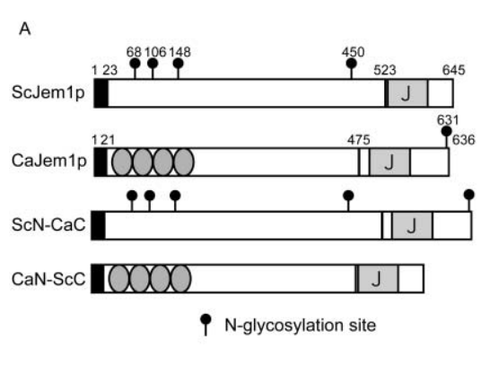

## Question

# Gene Research for Functional Annotation

## ⚠️ CRITICAL: Gene/Protein Identification Context

**BEFORE YOU BEGIN RESEARCH:** You MUST verify you are researching the CORRECT gene/protein. Gene symbols can be ambiguous, especially for less well-characterized genes from non-model organisms.

### Target Gene/Protein Identity (from UniProt):
- **UniProt Accession:** A0A1D8PIB5
- **Protein Description:** SubName: Full=Jem1p {ECO:0000313|EMBL:AOW27867.1};
- **Gene Information:** Name=JEM1 {ECO:0000313|CGD:CAL0000174058, ECO:0000313|EMBL:AOW27867.1}; OrderedLocusNames=CAALFM_C208790WA {ECO:0000313|EMBL:AOW27867.1}, orf19.11074 {ECO:0000313|CGD:CAL0000174058};
- **Organism (full):** Candida albicans (strain SC5314 / ATCC MYA-2876) (Yeast).
- **Protein Family:** Not specified in UniProt
- **Key Domains:** DnaJ_C3_Co-chaperones. (IPR051727); DnaJ_domain. (IPR001623); J_dom_sf. (IPR036869); TPR-like_helical_dom_sf. (IPR011990); DnaJ (PF00226)

### MANDATORY VERIFICATION STEPS:

1. **Check if the gene symbol "JEM1" matches the protein description above**
2. **Verify the organism is correct:** Candida albicans (strain SC5314 / ATCC MYA-2876) (Yeast).
3. **Check if protein family/domains align with what you find in literature**
4. **If you find literature for a DIFFERENT gene with the same or similar symbol, STOP**

### If Gene Symbol is Ambiguous or You Cannot Find Relevant Literature:

**DO NOT PROCEED WITH RESEARCH ON A DIFFERENT GENE.** Instead:
- State clearly: "The gene symbol 'JEM1' is ambiguous or literature is limited for this specific protein"
- Explain what you found (e.g., "Found extensive literature on a different gene with the same symbol in a different organism")
- Describe the protein based ONLY on the UniProt information provided above
- Suggest that the protein function can be inferred from domain/family information

### Research Target:

Please provide a comprehensive research report on the gene **JEM1** (gene ID: JEM1, UniProt: A0A1D8PIB5) in CANAL.

The research report should be a detailed narrative explaining the function, biological processes, and localization of the gene product. Citations should be given for all claims.

You should prioritize authoritative reviews and primary scientific literature when conducting research. You can supplement
this with annotations you find in gene/protein databases, but these can be outdated or inaccurate.

We are specifically interested in the primary function of the gene - for enzymes, what reaction is catalyzed, and what is the substrate specificity? For transporters, what is the substrate? For structural proteins or adapters, what is the broader structural role? For signaling molecules, what is the role in the pathway.

We are interested in where in or outside the cell the gene product carries out its function.

We are also interested in the signaling or biochemical pathways in which the gene functions. We are less interested in broad pleiotropic effects, except where these elucidate the precise role.

Include evidence where possible. We are interested in both experimental evidence as well as inference from structure, evolution, or bioinformatic analysis. Precise studies should be prioritized over high-throughput, where available.

## Output

Question: You are an expert researcher providing comprehensive, well-cited information.

Provide detailed information focusing on:
1. Key concepts and definitions with current understanding
2. Recent developments and latest research (prioritize 2023-2024 sources)
3. Current applications and real-world implementations
4. Expert opinions and analysis from authoritative sources
5. Relevant statistics and data from recent studies

Format as a comprehensive research report with proper citations. Include URLs and publication dates where available.
Always prioritize recent, authoritative sources and provide specific citations for all major claims.

# Gene Research for Functional Annotation

## ⚠️ CRITICAL: Gene/Protein Identification Context

**BEFORE YOU BEGIN RESEARCH:** You MUST verify you are researching the CORRECT gene/protein. Gene symbols can be ambiguous, especially for less well-characterized genes from non-model organisms.

### Target Gene/Protein Identity (from UniProt):
- **UniProt Accession:** A0A1D8PIB5
- **Protein Description:** SubName: Full=Jem1p {ECO:0000313|EMBL:AOW27867.1};
- **Gene Information:** Name=JEM1 {ECO:0000313|CGD:CAL0000174058, ECO:0000313|EMBL:AOW27867.1}; OrderedLocusNames=CAALFM_C208790WA {ECO:0000313|EMBL:AOW27867.1}, orf19.11074 {ECO:0000313|CGD:CAL0000174058};
- **Organism (full):** Candida albicans (strain SC5314 / ATCC MYA-2876) (Yeast).
- **Protein Family:** Not specified in UniProt
- **Key Domains:** DnaJ_C3_Co-chaperones. (IPR051727); DnaJ_domain. (IPR001623); J_dom_sf. (IPR036869); TPR-like_helical_dom_sf. (IPR011990); DnaJ (PF00226)

### MANDATORY VERIFICATION STEPS:

1. **Check if the gene symbol "JEM1" matches the protein description above**
2. **Verify the organism is correct:** Candida albicans (strain SC5314 / ATCC MYA-2876) (Yeast).
3. **Check if protein family/domains align with what you find in literature**
4. **If you find literature for a DIFFERENT gene with the same or similar symbol, STOP**

### If Gene Symbol is Ambiguous or You Cannot Find Relevant Literature:

**DO NOT PROCEED WITH RESEARCH ON A DIFFERENT GENE.** Instead:
- State clearly: "The gene symbol 'JEM1' is ambiguous or literature is limited for this specific protein"
- Explain what you found (e.g., "Found extensive literature on a different gene with the same symbol in a different organism")
- Describe the protein based ONLY on the UniProt information provided above
- Suggest that the protein function can be inferred from domain/family information

### Research Target:

Please provide a comprehensive research report on the gene **JEM1** (gene ID: JEM1, UniProt: A0A1D8PIB5) in CANAL.

The research report should be a detailed narrative explaining the function, biological processes, and localization of the gene product. Citations should be given for all claims.

You should prioritize authoritative reviews and primary scientific literature when conducting research. You can supplement
this with annotations you find in gene/protein databases, but these can be outdated or inaccurate.

We are specifically interested in the primary function of the gene - for enzymes, what reaction is catalyzed, and what is the substrate specificity? For transporters, what is the substrate? For structural proteins or adapters, what is the broader structural role? For signaling molecules, what is the role in the pathway.

We are interested in where in or outside the cell the gene product carries out its function.

We are also interested in the signaling or biochemical pathways in which the gene functions. We are less interested in broad pleiotropic effects, except where these elucidate the precise role.

Include evidence where possible. We are interested in both experimental evidence as well as inference from structure, evolution, or bioinformatic analysis. Precise studies should be prioritized over high-throughput, where available.

## Comprehensive Research Report: *Candida albicans* **JEM1** (UniProt A0A1D8PIB5; orf19.11074)

### 0) Executive summary
*Candida albicans* JEM1 (orf19.11074; UniProt A0A1D8PIB5) encodes Jem1p, an endoplasmic reticulum (ER)-localized Hsp40/DnaJ-family co-chaperone ("J-protein") that binds the ER Hsp70 BiP/Kar2 via its conserved J-domain HPD motif and supports ER proteostasis, including ER quality control and ER-associated degradation (ERAD). Direct experimental evidence for the *C. albicans* protein is primarily from heterologous functional and localization assays in *Saccharomyces cerevisiae*, where CaJem1p localizes to the ER (co-localizing with BiP), binds BiP in an HPD-dependent manner, suppresses CPY* aggregation, and improves CPY* degradation in ERAD-defective yeast backgrounds; its ability to support karyogamy/nuclear fusion is weaker than the *S. cerevisiae* ortholog and requires overexpression. (makio2008identificationandcharacterization pages 3-4, makio2008identificationandcharacterization pages 4-5)

---

### 1) Target verification (critical disambiguation)
**Verified identity:** The literature retrieved for fungal Jem1p explicitly maps *Candida albicans* **CaJEM1** to **ORF19.11074** and describes the encoded **636-aa CaJem1p** as a homolog/ortholog of *S. cerevisiae* Jem1p, an ER J-domain co-chaperone. (makio2008identificationandcharacterization pages 3-4)

**Notable ambiguity risk:** “JEM1” can be used differently in other organisms, but the defining features here—fungal ER localization plus a C-terminal DnaJ/J-domain (HPD motif) and BiP interaction—match the UniProt target context provided (A0A1D8PIB5; *C. albicans* SC5314). (makio2008identificationandcharacterization pages 3-4)

---

### 2) Key concepts and definitions (current understanding)
#### 2.1 J-proteins (Hsp40/DnaJ) and the J-domain
J-proteins (Hsp40/DnaJ family) are co-chaperones that regulate Hsp70 activity. Their conserved J-domain (∼70 aa) contains the **HPD** motif that is required for stimulating Hsp70 ATP hydrolysis and productive client binding cycles. This mechanistic logic is central to interpreting Jem1p function as an ER luminal co-chaperone for BiP/Kar2. (vembar2010jdomaincochaperone pages 1-2, rollenhagen2020theroleof pages 3-5)

#### 2.2 ER proteostasis, ER quality control (ERQC), and ER-associated degradation (ERAD)
The ER must fold secretory and membrane proteins and triage terminally misfolded proteins. **ERAD** retrotranslocates misfolded ER proteins for ubiquitin–proteasome degradation, while the **unfolded protein response (UPR)** transcriptionally increases ER folding/quality-control capacity. In pathogenic fungi, ER proteostasis networks (UPR/ERAD/UPS) are broadly linked to stress adaptation and virulence-related traits (e.g., secretion capacity, morphology, growth under host stresses). (nevesdarocha2023insightsandperspectives pages 3-5)

---

### 3) Jem1p protein features (domains, localization, and molecular function)
#### 3.1 Domain architecture
Makio et al. describe CaJem1p as a **636-aa** protein with an **N-terminal signal peptide** and **C-terminal J-domain**; the Candida N-terminus is predicted to contain **TPR motifs**, and sequence identity is higher in the C-terminal/J-domain region than in the N-terminus (≈40% vs ≈17% identity when compared to ScJem1p). (makio2008identificationandcharacterization pages 3-4)

A domain architecture schematic (signal sequence, predicted TPRs, J-domain) is shown in Makio et al. 2008 figures. (makio2008identificationandcharacterization media c33708d9)

#### 3.2 Subcellular localization: ER/perinuclear localization overlapping BiP
CaJem1p-3HA expressed in *S. cerevisiae* exhibited **perinuclear/ER localization** and **co-localized with BiP**, supporting ER residency consistent with a luminal co-chaperone role. (makio2008identificationandcharacterization pages 3-4, makio2008identificationandcharacterization media c33708d9)

#### 3.3 Primary molecular function: BiP/Kar2 co-chaperone activity (HPD-dependent)
Biochemical pull-down evidence shows CaJem1p binds **BiP** through its J-domain, and mutation of the HPD motif residue **H517Q** abolishes BiP binding and abolishes functional complementation of ER proteostasis phenotypes. This HPD-dependence is a hallmark of functional J-protein:Hsp70 coupling. (makio2008identificationandcharacterization pages 3-4)

---

### 4) Biological processes and pathway roles
#### 4.1 ER folding capacity and ER quality control / ERAD support
**Direct functional evidence (via heterologous yeast assays):** In a *S. cerevisiae* background lacking both JEM1 and SCJ1 (jem1Δ scj1Δ), expression of CaJem1p from a single-copy plasmid suppressed temperature-sensitive growth and ER quality-control defects, and the HPD mutant failed to do so—supporting a role for CaJem1p in ER proteostasis. (makio2008identificationandcharacterization pages 3-4)

**ERAD-relevant assay (CPY*):** The jem1Δ scj1Δ mutant shows CPY* aggregation after heat shift; expressing ScJem1p or CaJem1p increases soluble CPY* and increases the rate of CPY* degradation at 23°C, indicating suppression of an ERAD/quality-control defect. (makio2008identificationandcharacterization pages 4-5)

A figure region extracted from Makio et al. visually summarizes CPY* aggregation reduction and CPY* degradation improvement. (makio2008identificationandcharacterization media c33708d9)

**Mechanistic interpretation (from yeast ER chaperone specificity):** Work dissecting BiP interaction surfaces indicates BiP engages distinct ER Hsp40s with different functional outcomes—Sec63 for translocation and Jem1 for ERAD—supporting a model where Jem1p specializes in ERQC/ERAD substrate handling through BiP. (vembar2010jdomaincochaperone pages 1-2)

#### 4.2 Karyogamy/nuclear fusion (orthology-informed, with partial Candida functional conservation)
In *S. cerevisiae*, **KAR8 is allelic to JEM1**, and Jem1p is required for **nuclear membrane fusion during mating**, genetically linked to Kar2/BiP and Kar5; a nuclear envelope fusion “chaperone complex” was proposed including Kar2p, Kar5p, and Kar8/Jem1p. (brizzio1999geneticinteractionsbetweenkar7sec71kar8jem1kar5 pages 1-2)

For CaJem1p, karyogamy complementation in *S. cerevisiae* is **weaker and dose-dependent**: single-copy CaJem1p only partially rescues karyogamy, while multicopy expression restores near-wild-type levels. This implies the ER co-chaperone function is strongly conserved, whereas karyogamy-specific interactions are more species-tuned (likely via N-terminal determinants and specific binding partners such as Nep98p/Mps3p). (makio2008identificationandcharacterization pages 4-5, makio2008identificationandcharacterization pages 5-7)

---

### 5) Quantitative data and statistics (from primary studies)
#### 5.1 Sequence/domain-related statistics
* CaJem1p length: **636 aa**; ScJem1p length: **645 aa**. (makio2008identificationandcharacterization pages 1-3, makio2008identificationandcharacterization pages 3-4)
* Sequence identity (Sc vs Ca): **~17%** (N-terminal region) vs **~40%** (C-terminal/J-domain-containing region). (makio2008identificationandcharacterization pages 3-4)

#### 5.2 Karyogamy rescue / diploid formation (functional assays in yeast)
In Makio et al. (2008), in a *S. cerevisiae* jem1Δ background:
* **Vector control:** Kar+ ~**3.4%**, diploid ~**0.6%**. (makio2008identificationandcharacterization pages 4-5)
* **ScJem1p (single-copy):** Kar+ ~**96%**, diploid **27–29%**. (makio2008identificationandcharacterization pages 4-5)
* **CaJem1p (single-copy):** Kar+ **33 ± 10%**, diploid **4.8 ± 2.0%**. (makio2008identificationandcharacterization pages 4-5)
* **CaJem1p (multicopy):** Kar+ **96.4 ± 0.8%**, diploid **30 ± 9%**. (makio2008identificationandcharacterization pages 4-5)

Chimeras further support N-terminal determinants of karyogamy function (e.g., ScN–CaC single-copy Kar+ **93.9 ± 3.5** vs CaN–ScC single-copy Kar+ **12 ± 6**). (makio2008identificationandcharacterization pages 4-5)

#### 5.3 UPR marker induction statistics (yeast chaperone redundancy context)
Although these are *S. cerevisiae* data, they support the general functional placement of Jem1/Scj1-family ER J-proteins in ER folding capacity:
* ER stress induction (WT): **KAR2 mRNA ~4.7-fold** and **ERJ5 mRNA ~2.4-fold** after tunicamycin/DTT. (fama2007thesaccharomycescerevisiae pages 8-9)
* Constitutive KAR2 induction: Δscj1 **~2.5-fold**, Δjem1 **~1.7-fold**, Δerj5 **~1.6-fold** relative to WT. (fama2007thesaccharomycescerevisiae pages 8-9)
These values indicate that loss of ER J-proteins partially activates UPR, consistent with reduced ER folding capacity. (fama2007thesaccharomycescerevisiae pages 8-9)

---

### 6) Recent developments (2023–2024 prioritized)
#### 6.1 2023: Proteostasis and heat shock proteins in fungal infection (review-level synthesis)
A 2023 review emphasizes that fungal virulence is strongly influenced by proteostasis circuits, including ER stress sensing (Ire1/Hac1), BiP regulation of Ire1, and ERAD/UPS clearance of misfolded ER proteins; *Candida albicans* hac1/hacA mutants are reported to show increased sensitivity to ER stress and aberrant morphology/growth. While Jem1 is not directly discussed, this review reinforces that ER chaperone systems (BiP-centered networks that include J-proteins) are central to stress adaptation relevant to infection. (nevesdarocha2023insightsandperspectives pages 3-5)

**Publication:** Neves-da-Rocha et al., 2023-07 (Microorganisms). URL: https://doi.org/10.3390/microorganisms11081878 (nevesdarocha2023insightsandperspectives pages 3-5)

#### 6.2 2024: Secretion and ER chaperone network reviews (contextual, not Jem1-specific)
A 2024 review of eukaryotic secretion discusses ER Hsp70 (Kar2/BiP) cooperation with Sec63 and nucleotide-exchange factors (Lhs1/Sil1) and links Sil1 deletion to ERAD defects in yeast. This adds mechanistic context for how ER co-chaperones couple translocation, folding, and ERAD, but it does not provide new Candida JEM1 data. (nataraj2024areviewon pages 2-3)

**Publication:** Nataraj & Sudhakaran, 2024-04. URL: https://doi.org/10.55251/jmbfs.10555 (nataraj2024areviewon pages 2-3)

#### 6.3 2023 primary *Candida albicans* ERAD paper identified but unobtainable here
A relevant primary study was detected by the search layer but could not be retrieved in full text in this run: **Doss et al., 2023-08 (PeerJ): “Characterization of endoplasmic reticulum-associated degradation in the human fungal pathogen Candida albicans”**. This suggests active 2023 primary research directly on Candida ERAD, potentially relevant to Jem1-dependent functions, but it could not be analyzed with the available tools. (paper_search unobtainable list)

---

### 7) Current applications and real-world implementations
#### 7.1 Interpreting JEM1 as an ER proteostasis factor rather than a metabolic enzyme/transport substrate
Jem1p is not an enzyme catalyzing a small-molecule reaction; its **primary function is regulatory/assistive**: it is an ER Hsp40/J-protein that binds BiP/Kar2 and supports client protein folding and quality control (including ERAD substrate handling). This is directly supported by HPD-dependent BiP binding and ERQC/ERAD phenotypic rescue assays. (makio2008identificationandcharacterization pages 3-4, makio2008identificationandcharacterization pages 4-5)

#### 7.2 Pathogenesis-adjacent relevance through secretory pathway robustness
A *C. albicans* pathogenesis-oriented review argues that ER folding and secretory pathway capacity underpins virulence-associated outputs (cell wall integrity, hyphal growth, biofilm formation), and notes that Jem1 is the most extensively investigated ER J-protein in *C. albicans* and interacts with ER Hsp70 to assist folding. While this does not establish Jem1 as a direct virulence determinant, it places Jem1 functionally within processes required to support secretion-dependent pathogenic traits. (rollenhagen2020theroleof pages 3-5)

---

### 8) Expert opinion and analysis (evidence-weighted)
1. **Best-supported primary role:** Jem1p is best annotated as an **ER-resident J-domain co-chaperone for BiP/Kar2** supporting **ER protein folding capacity and ERAD-related quality control**, because these functions are backed by direct BiP-binding experiments (HPD dependence), ER co-localization with BiP, and rescue of CPY* aggregation/degradation defects. (makio2008identificationandcharacterization pages 3-4, makio2008identificationandcharacterization pages 4-5, makio2008identificationandcharacterization media c33708d9)
2. **Karyogamy function is likely conserved at the pathway level but species-tuned:** Strong genetic and mechanistic support for Jem1p involvement in nuclear envelope fusion exists in *S. cerevisiae*, and CaJem1p can complement karyogamy defects only when overexpressed, suggesting conservation but weaker interaction with karyogamy partners due to divergence in the N-terminal region. (brizzio1999geneticinteractionsbetweenkar7sec71kar8jem1kar5 pages 1-2, makio2008identificationandcharacterization pages 4-5, makio2008identificationandcharacterization pages 5-7)
3. **Redundancy and conditional phenotypes are expected:** In yeast, Jem1p and Scj1p are individually non-essential but jointly required for robust ER folding capacity at elevated temperature; deletion mutants show constitutive UPR activation and temperature-sensitive growth in double-deletion backgrounds. This supports interpreting Jem1p phenotypes in Candida (if tested) as likely conditional—emerging under ER stress, high secretory load, or temperature stress. (fama2007thesaccharomycescerevisiae pages 1-2, makio2008identificationandcharacterization pages 1-3, fama2007thesaccharomycescerevisiae pages 8-9)

---

### 9) Evidence figures (visual)
Key visual evidence from Makio et al. (2008) includes a domain architecture schematic for CaJem1p vs ScJem1p and immunofluorescence co-localization of CaJem1p-3HA with BiP, plus CPY* aggregation/degradation (ERAD) rescue. (makio2008identificationandcharacterization media c33708d9, makio2008identificationandcharacterization media a427c1de, makio2008identificationandcharacterization media fadf573f)

---

### 10) Consolidated functional annotation (recommended)
**Gene/product:** *Candida albicans* JEM1 (orf19.11074) → Jem1p (ER Hsp40/DnaJ co-chaperone). (makio2008identificationandcharacterization pages 3-4)

**Subcellular localization:** ER (perinuclear/ER staining overlapping BiP). (makio2008identificationandcharacterization pages 3-4, makio2008identificationandcharacterization media c33708d9)

**Molecular function:** J-domain co-chaperone that binds/stimulates ER Hsp70 BiP/Kar2 via HPD motif; required for co-chaperone function. (makio2008identificationandcharacterization pages 3-4)

**Biological processes/pathways:** ER protein folding/quality control; supports ERAD handling of misfolded luminal clients (CPY* model substrate in yeast); conditionally contributes to karyogamy/nuclear fusion pathways by orthology and partial functional complementation. (makio2008identificationandcharacterization pages 4-5, brizzio1999geneticinteractionsbetweenkar7sec71kar8jem1kar5 pages 1-2)

**Key partners (supported):** BiP/Kar2 (direct). (makio2008identificationandcharacterization pages 3-4)
**Karyogamy-associated partners (orthology-supported):** Kar2, Kar5, and Nep98p/Mps3p-like components inferred from *S. cerevisiae* genetic/interaction data; CaJem1p shows weaker Nep98p interaction unless overexpressed. (brizzio1999geneticinteractionsbetweenkar7sec71kar8jem1kar5 pages 1-2, makio2008identificationandcharacterization pages 7-9)

---

### 11) Summary table
| Feature | Evidence summary | Organism context (C. albicans direct vs S. cerevisiae orthology/inference) | Key citation IDs | Publication (first author year) + URL |
|---|---|---|---|---|
| Identity | CaJEM1 was identified as the Candida albicans ortholog of S. cerevisiae JEM1; the paper maps it to ORF19.11074 and characterizes the encoded 636-aa Jem1p as a fungal ER J-protein. | Direct for C. albicans, with orthology validated experimentally in S. cerevisiae complementation assays. | (makio2008identificationandcharacterization pages 3-4, makio2008identificationandcharacterization pages 1-3) | Makio 2008 — https://doi.org/10.1111/j.1365-2443.2008.01223.x |
| Domain architecture | CaJem1p contains an N-terminal signal peptide and a C-terminal J domain; predicted N-terminal TPR motifs were reported for the Candida protein, and the conserved HPD motif in the J domain is functionally critical. Figure 1A visualizes signal sequence/TPR/J-domain organization. | Direct for C. albicans. | (makio2008identificationandcharacterization pages 3-4, makio2008identificationandcharacterization media c33708d9) | Makio 2008 — https://doi.org/10.1111/j.1365-2443.2008.01223.x |
| Localization | Immunofluorescence of CaJem1p-3HA expressed in yeast showed perinuclear/ER staining overlapping BiP, supporting ER lumen/ER-associated localization. Figure 1C provides visual support. | Direct experimental evidence for CaJem1p localization, assayed in heterologous yeast system. | (makio2008identificationandcharacterization pages 3-4, makio2008identificationandcharacterization pages 7-9, makio2008identificationandcharacterization media c33708d9) | Makio 2008 — https://doi.org/10.1111/j.1365-2443.2008.01223.x |
| Primary molecular function | CaJem1p behaves as an Hsp40/DnaJ co-chaperone for ER Hsp70 BiP/Kar2: GST pulldown showed BiP binding, and the H517Q HPD-motif mutation abolished binding and complementation. | Direct for C. albicans protein biochemistry/function. | (makio2008identificationandcharacterization pages 3-4) | Makio 2008 — https://doi.org/10.1111/j.1365-2443.2008.01223.x |
| ER quality control / ERAD | CaJem1p rescued temperature-sensitive growth and reduced CPY* aggregation in jem1Δ scj1Δ yeast; it also increased CPY* degradation, supporting a role in ER protein quality control and ERAD-related handling of misfolded proteins. Figures 2B–2C summarize these data. | Direct for CaJem1p functional substitution in yeast; pathway assignment supported by S. cerevisiae system. | (makio2008identificationandcharacterization pages 4-5, makio2008identificationandcharacterization media c33708d9) | Makio 2008 — https://doi.org/10.1111/j.1365-2443.2008.01223.x |
| J-domain mechanistic interpretation | In yeast, J proteins stimulate Hsp70 ATP hydrolysis; Jem1p specifically supports ERAD whereas Sec63 supports translocation, highlighting co-chaperone specificity at BiP/Kar2. | S. cerevisiae mechanistic inference for CaJem1p. | (vembar2010jdomaincochaperone pages 1-2, delic2013thesecretorypathway pages 13-15) | Vembar 2010 — https://doi.org/10.1074/jbc.M110.102186; Delic 2013 — https://doi.org/10.1111/1574-6976.12020 |
| Karyogamy / nuclear fusion pathway | S. cerevisiae KAR8 is allelic to JEM1; Jem1p is required for nuclear membrane fusion and genetically/functionally interacts with Kar2 and Kar5 in a proposed nuclear-envelope fusion chaperone complex. | Primarily S. cerevisiae orthology/inference. | (brizzio1999geneticinteractionsbetweenkar7sec71kar8jem1kar5 pages 1-2, brizzio1999geneticinteractionsbetweenkar7sec71kar8jem1kar5 pages 12-14) | Brizzio 1999 — https://doi.org/10.1091/mbc.10.3.609 |
| Candida-specific karyogamy evidence | CaJem1p could suppress the S. cerevisiae jem1Δ karyogamy defect only when overexpressed, indicating partial conservation but weaker activity in the karyogamy-specific branch than ScJem1p. | Direct assay of CaJem1p in heterologous yeast. | (makio2008identificationandcharacterization pages 1-3, makio2008identificationandcharacterization pages 4-5, makio2008identificationandcharacterization pages 5-7) | Makio 2008 — https://doi.org/10.1111/j.1365-2443.2008.01223.x |
| Interaction partners | Confirmed/strongly supported partners are BiP/Kar2 (direct biochemical binding; HPD-dependent) and Nep98p/Mps3p-like karyogamy partner interactions that are robust for ScJem1p and detectable for CaJem1p only under overexpression/cross-linking conditions. | BiP interaction direct for CaJem1p; Nep98p interaction mainly orthology-based with limited CaJem1p evidence. | (makio2008identificationandcharacterization pages 3-4, makio2008identificationandcharacterization pages 7-9) | Makio 2008 — https://doi.org/10.1111/j.1365-2443.2008.01223.x |
| Distinction from other ER J-proteins | Reviews emphasize that ER J-proteins are specialized: Sec63 is linked to translocation, whereas Jem1 and Scj1 act more in lumenal folding/quality control; most ER-resident J proteins are conserved across yeasts. | Broad yeast/fungal inference relevant to C. albicans. | (delic2013thesecretorypathway pages 13-15, rollenhagen2020theroleof pages 3-5) | Delic 2013 — https://doi.org/10.1111/1574-6976.12020; Rollenhagen 2020 — https://doi.org/10.3390/jof6010026 |
| Pathway placement in Candida secretory biology | Review literature notes that Jem1 is the best-studied C. albicans ER J-protein and functions with ER Hsp70 in lumenal protein folding, fitting into the early secretory pathway and ER proteostasis network. | Review-based summary for C. albicans. | (rollenhagen2020theroleof pages 3-5, rollenhagen2020theroleof pages 22-24) | Rollenhagen 2020 — https://doi.org/10.3390/jof6010026 |
| Recent fungal-pathogenesis context (2023–2024) | Recent reviews stress that ER proteostasis, UPR, ERAD, and BiP-centered chaperone systems are important for fungal stress adaptation and virulence, but they do not provide new C. albicans JEM1-specific primary data; current knowledge remains largely anchored in earlier functional studies. | Broad fungal context; indirect for JEM1 specifically. | (nevesdarocha2023insightsandperspectives pages 3-5, nataraj2024areviewon pages 2-3) | Neves-da-Rocha 2023 — https://doi.org/10.3390/microorganisms11081878; Nataraj 2024 — https://doi.org/10.55251/jmbfs.10555 |
| Quantitative phenotype/data points | Reported values include ~40% identity between CaJem1p and ScJem1p in the C-terminal/J-domain region, ~17% identity in the N-terminal region, and single-copy karyogamy rescue markedly lower for CaJem1p than ScJem1p (~33% vs ~96% Kar+ in the cited assay), while ERQC rescue occurred at low expression. | Direct comparative data from CaJem1p functional study. | (makio2008identificationandcharacterization pages 3-4, makio2008identificationandcharacterization pages 4-5) | Makio 2008 — https://doi.org/10.1111/j.1365-2443.2008.01223.x |

*Table: This table summarizes the key functional annotation evidence for Candida albicans JEM1/Jem1p, distinguishing direct Candida evidence from inference based on the well-studied S. cerevisiae ortholog. It is useful for quickly mapping identity, localization, function, pathway placement, partners, and phenotype evidence to specific citations.*

---

### 12) Key source list (with dates and URLs)
* Makio et al. 2008-10. **Genes to Cells**. “Identification and characterization of a Jem1p ortholog of *Candida albicans*…” https://doi.org/10.1111/j.1365-2443.2008.01223.x (makio2008identificationandcharacterization pages 3-4)
* Brizzio et al. 1999-03. **Molecular Biology of the Cell**. “Genetic interactions between KAR7/SEC71, KAR8/JEM1, KAR5, and KAR2…” https://doi.org/10.1091/mbc.10.3.609 (brizzio1999geneticinteractionsbetweenkar7sec71kar8jem1kar5 pages 1-2)
* Vembar et al. 2010-07. **J Biol Chem**. “J domain co-chaperone specificity defines the role of BiP during protein translocation.” https://doi.org/10.1074/jbc.M110.102186 (vembar2010jdomaincochaperone pages 1-2)
* Rollenhagen et al. 2020-02. **Journal of Fungi**. “The Role of Secretory Pathways in *Candida albicans* Pathogenesis.” https://doi.org/10.3390/jof6010026 (rollenhagen2020theroleof pages 3-5)
* Neves-da-Rocha et al. 2023-07. **Microorganisms**. “Insights and Perspectives on the Role of Proteostasis and Heat Shock Proteins in Fungal Infections.” https://doi.org/10.3390/microorganisms11081878 (nevesdarocha2023insightsandperspectives pages 3-5)
* Nataraj & Sudhakaran 2024-04. **J. Microbiology, Biotechnology and Food Sciences**. “A review on protein production and secretion in eukaryoytes.” https://doi.org/10.55251/jmbfs.10555 (nataraj2024areviewon pages 2-3)

References

1. (makio2008identificationandcharacterization pages 3-4): T. Makio, S. Nishikawa, T. Nakayama, Hiroyuki Nagai, and T. Endo. Identification and characterization of a jem1p ortholog of candida albicans: dissection of jem1p functions in karyogamy and protein quality control in saccharomyces cerevisiae. Genes to Cells, Oct 2008. URL: https://doi.org/10.1111/j.1365-2443.2008.01223.x, doi:10.1111/j.1365-2443.2008.01223.x. This article has 9 citations and is from a peer-reviewed journal.

2. (makio2008identificationandcharacterization pages 4-5): T. Makio, S. Nishikawa, T. Nakayama, Hiroyuki Nagai, and T. Endo. Identification and characterization of a jem1p ortholog of candida albicans: dissection of jem1p functions in karyogamy and protein quality control in saccharomyces cerevisiae. Genes to Cells, Oct 2008. URL: https://doi.org/10.1111/j.1365-2443.2008.01223.x, doi:10.1111/j.1365-2443.2008.01223.x. This article has 9 citations and is from a peer-reviewed journal.

3. (vembar2010jdomaincochaperone pages 1-2): Shruthi S. Vembar, Martin C. Jonikas, Linda M. Hendershot, Jonathan S. Weissman, and Jeffrey L. Brodsky. J domain co-chaperone specificity defines the role of bip during protein translocation. Journal of Biological Chemistry, 285:22484-22494, Jul 2010. URL: https://doi.org/10.1074/jbc.m110.102186, doi:10.1074/jbc.m110.102186. This article has 62 citations and is from a domain leading peer-reviewed journal.

4. (rollenhagen2020theroleof pages 3-5): Christiane Rollenhagen, Sahil Mamtani, Dakota Ma, Reva Dixit, Susan Eszterhas, and Samuel A. Lee. The role of secretory pathways in candida albicans pathogenesis. Journal of Fungi, 6:26, Feb 2020. URL: https://doi.org/10.3390/jof6010026, doi:10.3390/jof6010026. This article has 36 citations.

5. (nevesdarocha2023insightsandperspectives pages 3-5): João Neves-da-Rocha, Maria J. Santos-Saboya, Marcos E. R. Lopes, Antonio Rossi, and Nilce M. Martinez-Rossi. Insights and perspectives on the role of proteostasis and heat shock proteins in fungal infections. Microorganisms, 11:1878, Jul 2023. URL: https://doi.org/10.3390/microorganisms11081878, doi:10.3390/microorganisms11081878. This article has 26 citations.

6. (makio2008identificationandcharacterization media c33708d9): T. Makio, S. Nishikawa, T. Nakayama, Hiroyuki Nagai, and T. Endo. Identification and characterization of a jem1p ortholog of candida albicans: dissection of jem1p functions in karyogamy and protein quality control in saccharomyces cerevisiae. Genes to Cells, Oct 2008. URL: https://doi.org/10.1111/j.1365-2443.2008.01223.x, doi:10.1111/j.1365-2443.2008.01223.x. This article has 9 citations and is from a peer-reviewed journal.

7. (brizzio1999geneticinteractionsbetweenkar7sec71kar8jem1kar5 pages 1-2): Valeria Brizzio, Waheeda Khalfan, Don Huddler, Christopher T. Beh, Søren S.L. Andersen, Martin Latterich, and Mark D. Rose. Genetic interactions between<i>kar7/sec71</i>,<i>kar8/jem1</i>,<i>kar5</i>, and<i>kar2</i>during nuclear fusion in<i>saccharomyces cerevisiae</i>. Mar 1999. URL: https://doi.org/10.1091/mbc.10.3.609, doi:10.1091/mbc.10.3.609. This article has 64 citations and is from a domain leading peer-reviewed journal.

8. (makio2008identificationandcharacterization pages 5-7): T. Makio, S. Nishikawa, T. Nakayama, Hiroyuki Nagai, and T. Endo. Identification and characterization of a jem1p ortholog of candida albicans: dissection of jem1p functions in karyogamy and protein quality control in saccharomyces cerevisiae. Genes to Cells, Oct 2008. URL: https://doi.org/10.1111/j.1365-2443.2008.01223.x, doi:10.1111/j.1365-2443.2008.01223.x. This article has 9 citations and is from a peer-reviewed journal.

9. (makio2008identificationandcharacterization pages 1-3): T. Makio, S. Nishikawa, T. Nakayama, Hiroyuki Nagai, and T. Endo. Identification and characterization of a jem1p ortholog of candida albicans: dissection of jem1p functions in karyogamy and protein quality control in saccharomyces cerevisiae. Genes to Cells, Oct 2008. URL: https://doi.org/10.1111/j.1365-2443.2008.01223.x, doi:10.1111/j.1365-2443.2008.01223.x. This article has 9 citations and is from a peer-reviewed journal.

10. (fama2007thesaccharomycescerevisiae pages 8-9): M. Carla Famá, David Raden, Nicolás Zacchi, Darío R. Lemos, Anne S. Robinson, and Susana Silberstein. The saccharomyces cerevisiae yfr041c/erj5 gene encoding a type i membrane protein with a j domain is required to preserve the folding capacity of the endoplasmic reticulum. Biochimica et Biophysica Acta (BBA) - Molecular Cell Research, 1773:232-242, Feb 2007. URL: https://doi.org/10.1016/j.bbamcr.2006.10.011, doi:10.1016/j.bbamcr.2006.10.011. This article has 41 citations and is from a peer-reviewed journal.

11. (nataraj2024areviewon pages 2-3): Nandini B NATARAJ and Raja Sudhakaran. A review on protein production and secretion in eukaryoytes. Journal of microbiology, biotechnology and food sciences, Apr 2024. URL: https://doi.org/10.55251/jmbfs.10555, doi:10.55251/jmbfs.10555. This article has 0 citations.

12. (fama2007thesaccharomycescerevisiae pages 1-2): M. Carla Famá, David Raden, Nicolás Zacchi, Darío R. Lemos, Anne S. Robinson, and Susana Silberstein. The saccharomyces cerevisiae yfr041c/erj5 gene encoding a type i membrane protein with a j domain is required to preserve the folding capacity of the endoplasmic reticulum. Biochimica et Biophysica Acta (BBA) - Molecular Cell Research, 1773:232-242, Feb 2007. URL: https://doi.org/10.1016/j.bbamcr.2006.10.011, doi:10.1016/j.bbamcr.2006.10.011. This article has 41 citations and is from a peer-reviewed journal.

13. (makio2008identificationandcharacterization media a427c1de): T. Makio, S. Nishikawa, T. Nakayama, Hiroyuki Nagai, and T. Endo. Identification and characterization of a jem1p ortholog of candida albicans: dissection of jem1p functions in karyogamy and protein quality control in saccharomyces cerevisiae. Genes to Cells, Oct 2008. URL: https://doi.org/10.1111/j.1365-2443.2008.01223.x, doi:10.1111/j.1365-2443.2008.01223.x. This article has 9 citations and is from a peer-reviewed journal.

14. (makio2008identificationandcharacterization media fadf573f): T. Makio, S. Nishikawa, T. Nakayama, Hiroyuki Nagai, and T. Endo. Identification and characterization of a jem1p ortholog of candida albicans: dissection of jem1p functions in karyogamy and protein quality control in saccharomyces cerevisiae. Genes to Cells, Oct 2008. URL: https://doi.org/10.1111/j.1365-2443.2008.01223.x, doi:10.1111/j.1365-2443.2008.01223.x. This article has 9 citations and is from a peer-reviewed journal.

15. (makio2008identificationandcharacterization pages 7-9): T. Makio, S. Nishikawa, T. Nakayama, Hiroyuki Nagai, and T. Endo. Identification and characterization of a jem1p ortholog of candida albicans: dissection of jem1p functions in karyogamy and protein quality control in saccharomyces cerevisiae. Genes to Cells, Oct 2008. URL: https://doi.org/10.1111/j.1365-2443.2008.01223.x, doi:10.1111/j.1365-2443.2008.01223.x. This article has 9 citations and is from a peer-reviewed journal.

16. (delic2013thesecretorypathway pages 13-15): Marizela Delic, Minoska Valli, Alexandra B. Graf, Martin Pfeffer, Diethard Mattanovich, and Brigitte Gasser. The secretory pathway: exploring yeast diversity. FEMS microbiology reviews, 37 6:872-914, Nov 2013. URL: https://doi.org/10.1111/1574-6976.12020, doi:10.1111/1574-6976.12020. This article has 300 citations and is from a domain leading peer-reviewed journal.

17. (brizzio1999geneticinteractionsbetweenkar7sec71kar8jem1kar5 pages 12-14): Valeria Brizzio, Waheeda Khalfan, Don Huddler, Christopher T. Beh, Søren S.L. Andersen, Martin Latterich, and Mark D. Rose. Genetic interactions between<i>kar7/sec71</i>,<i>kar8/jem1</i>,<i>kar5</i>, and<i>kar2</i>during nuclear fusion in<i>saccharomyces cerevisiae</i>. Mar 1999. URL: https://doi.org/10.1091/mbc.10.3.609, doi:10.1091/mbc.10.3.609. This article has 64 citations and is from a domain leading peer-reviewed journal.

18. (rollenhagen2020theroleof pages 22-24): Christiane Rollenhagen, Sahil Mamtani, Dakota Ma, Reva Dixit, Susan Eszterhas, and Samuel A. Lee. The role of secretory pathways in candida albicans pathogenesis. Journal of Fungi, 6:26, Feb 2020. URL: https://doi.org/10.3390/jof6010026, doi:10.3390/jof6010026. This article has 36 citations.

## Artifacts

- [Edison artifact artifact-00](JEM1-deep-research-falcon_artifacts/artifact-00.md)

## Citations

1. makio2008identificationandcharacterization pages 3-4
2. nevesdarocha2023insightsandperspectives pages 3-5
3. makio2008identificationandcharacterization pages 4-5
4. vembar2010jdomaincochaperone pages 1-2
5. fama2007thesaccharomycescerevisiae pages 8-9
6. nataraj2024areviewon pages 2-3
7. rollenhagen2020theroleof pages 3-5
8. makio2008identificationandcharacterization pages 5-7
9. makio2008identificationandcharacterization pages 1-3
10. fama2007thesaccharomycescerevisiae pages 1-2
11. makio2008identificationandcharacterization pages 7-9
12. delic2013thesecretorypathway pages 13-15
13. rollenhagen2020theroleof pages 22-24
14. https://doi.org/10.3390/microorganisms11081878
15. https://doi.org/10.55251/jmbfs.10555
16. https://doi.org/10.1111/j.1365-2443.2008.01223.x
17. https://doi.org/10.1074/jbc.M110.102186;
18. https://doi.org/10.1111/1574-6976.12020
19. https://doi.org/10.1091/mbc.10.3.609
20. https://doi.org/10.1111/1574-6976.12020;
21. https://doi.org/10.3390/jof6010026
22. https://doi.org/10.3390/microorganisms11081878;
23. https://doi.org/10.1074/jbc.M110.102186
24. https://doi.org/10.1111/j.1365-2443.2008.01223.x,
25. https://doi.org/10.1074/jbc.m110.102186,
26. https://doi.org/10.3390/jof6010026,
27. https://doi.org/10.3390/microorganisms11081878,
28. https://doi.org/10.1091/mbc.10.3.609,
29. https://doi.org/10.1016/j.bbamcr.2006.10.011,
30. https://doi.org/10.55251/jmbfs.10555,
31. https://doi.org/10.1111/1574-6976.12020,