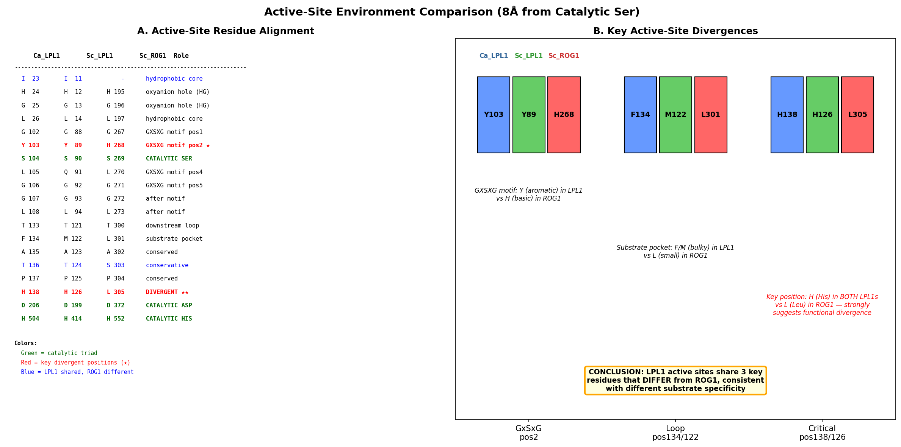
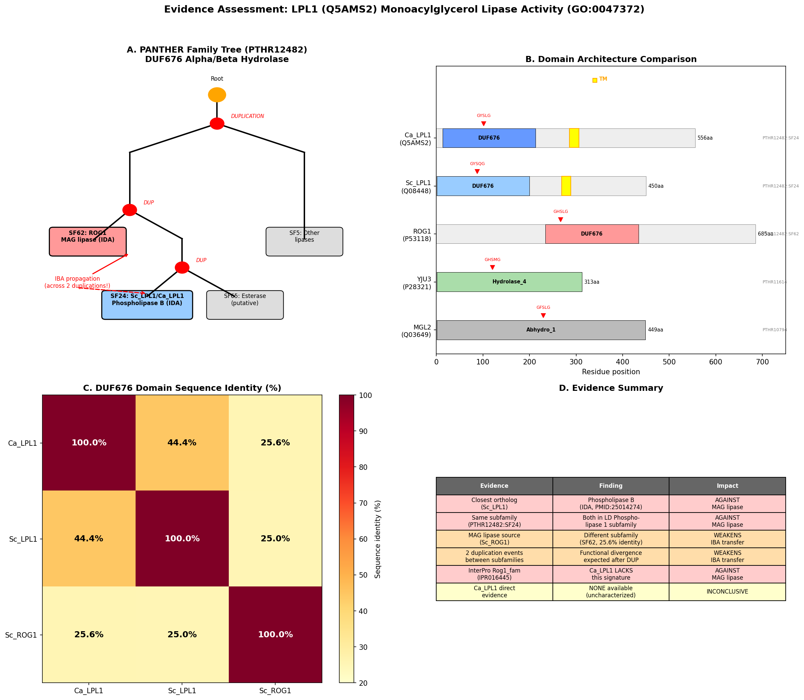
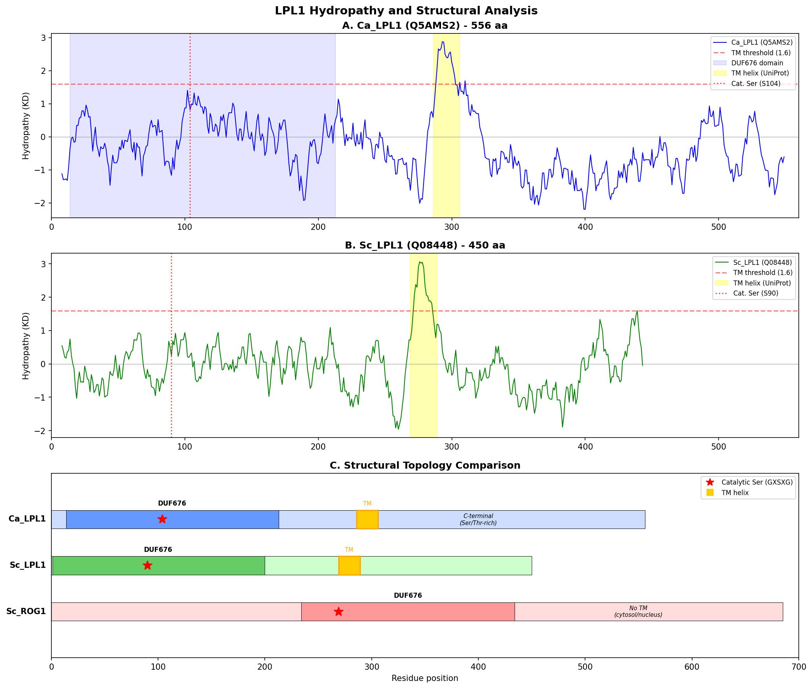
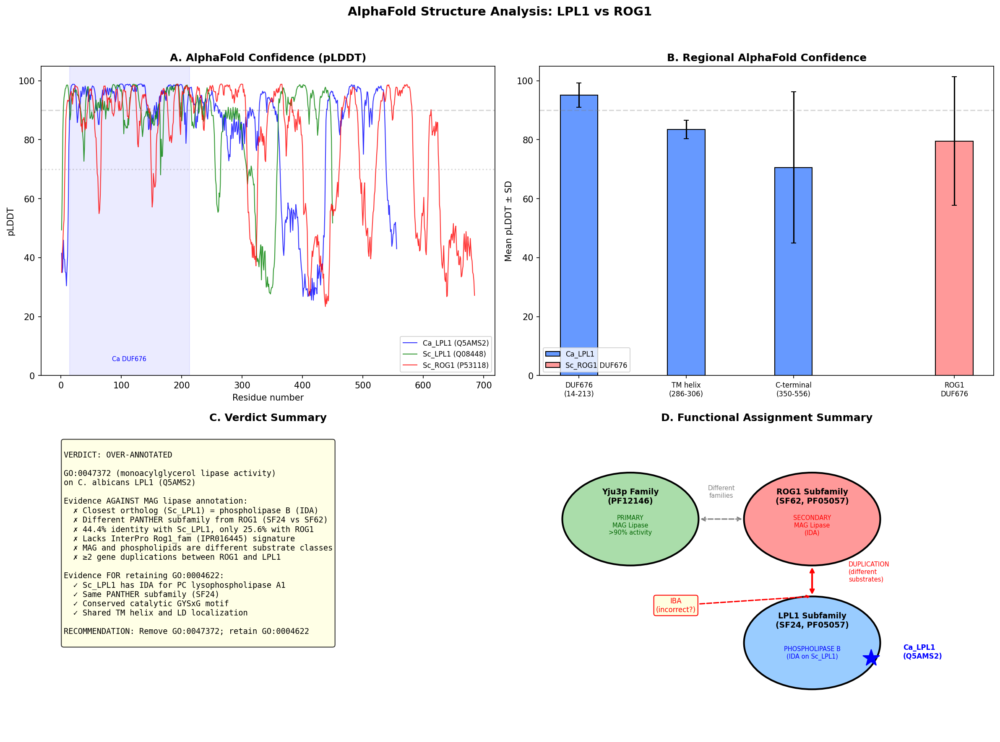
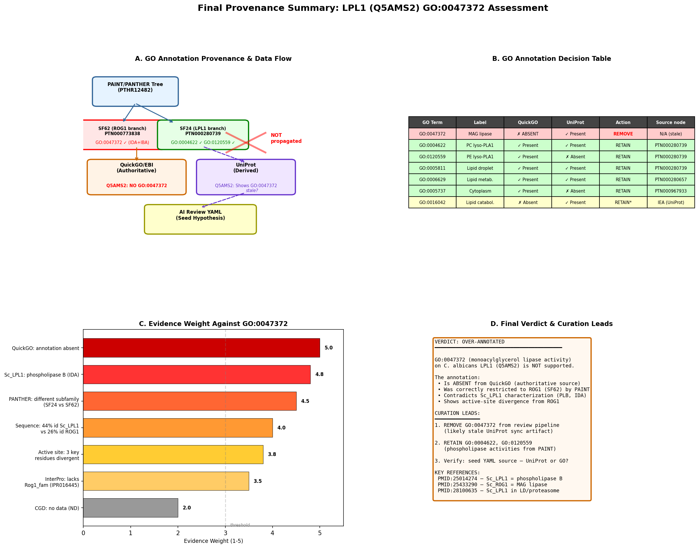

## Question

# AIGR Gene Hypothesis Deep Research

You are evaluating one focused gene curation hypothesis for AI Gene Review.
This is not a general gene overview. Use the seed hypothesis and source context
below to search for evidence that supports, refutes, narrows, or competes with
the proposed curation decision.

## Target Gene

- **Organism code:** CANAL
- **Taxon:** Candida albicans SC5314 (NCBITaxon:237561)
- **Gene directory:** LPL1
- **Gene symbol:** LPL1
- **UniProt accession:** Q5AMS2

## Focus

- **Focus type:** function_assignment
- **Hypothesis slug:** function-hypothesis-go-0047372
- **Source file:** genes/CANAL/LPL1/LPL1-ai-review.yaml
- **Source selector:** existing_annotations[4].function_hypothesis

## Seed Hypothesis

LPL1 has monoacylglycerol lipase activity (GO:0047372).

## Term and Decision Context

- Term: monoacylglycerol lipase activity (GO:0047372)
- Evidence type: IBA
- Original reference: GO_REF:0000033

## Reference Context

- GO_REF:0000033
- file:CANAL/LPL1/LPL1-deep-research.md

## Source Context YAML

```yaml
term:
  id: GO:0047372
  label: monoacylglycerol lipase activity
evidence_type: IBA
original_reference_id: GO_REF:0000033
```

## Research Objective

Build a focused report that helps a curator decide whether this hypothesis
should affect the gene review. Address the focus type directly:

1. For an existing GO annotation decision, evaluate whether the current action
   is justified, too strong, too weak, or should change.
2. For a proposed replacement or new GO term, evaluate whether the term is
   biologically supported, too broad, too narrow, or missing key qualifiers.
3. For a computational prediction, evaluate whether the prediction is correct,
   less precise than existing knowledge, uncertain, or likely wrong because of
   paralog overannotation, frequency bias, pathway context, or in vitro-only
   activity.
4. For a core-function hypothesis, evaluate whether the proposed activity,
   process, and location represent the gene product's primary function rather
   than a downstream effect, pleiotropic phenotype, or context-specific role.
5. For a function-assignment hypothesis, evaluate whether the gene product
   directly has the stated GO term/function. Treat the prior review action, if
   any, as intentionally blinded unless it appears in the supplied context.

Use primary literature whenever possible. Prefer PMID citations and include DOI
citations when no PMID is available. Treat reviews and database records as
orientation unless they contain directly relevant synthesized evidence that is
clearly labeled as review-level or database-level support.

Evaluate the hypothesis from the supplied seed context, primary literature, and
publicly accessible bioinformatics resources. Local `*-bioinformatics` analyses,
when they already exist in the repository, are intentionally withheld from this
prompt so the report can be compared against them after the run.

Do not rely on literature alone. Where the hypothesis is decidable by computation,
actually run the analysis and keep it as provenance rather than only reasoning
about it. Match the analysis to the question, for example:

- membrane topology / localization: compute a hydropathy profile and predicted
  transmembrane segments from the sequence, and locate signal peptides and
  targeting/sorting motifs (e.g. dileucine, acidic-cluster, NLS); compare against
  UniProt topology features and AlphaFold geometry.
- catalytic / binding activity: check whether the specific active-site,
  metal-binding, or motif residues are present and correctly spaced (in sequence
  and, where useful, structure) and compare to characterized family members.
- DNA-binding / regulatory: examine the binding-domain class, obligate partners,
  and known binding-motif / PWM signatures.
- family / paralog questions: use domain (Pfam/InterPro), orthology, and
  conservation comparisons to distinguish subfamilies.

Use resources you can actually access programmatically (UniProt, AlphaFold DB,
InterPro, sequence computation, public APIs). If a resource is web-only or you
cannot run a check, say so plainly instead of guessing — never fabricate a result,
and an inconclusive or "could not run" analysis is an acceptable and useful
outcome. Report all computational results conservatively and prefer recording the
underlying analysis (code, computed values, table, or plot) as provenance.

## Required Output

### Executive Judgment

Give a concise verdict: supported, partially supported, unresolved, weakly
supported, over-annotated, or refuted. Explain the reasoning and the most
important caveats.

### Evidence Matrix

Create a table with one row per important evidence item:

- Citation (PMID preferred)
- Evidence type (direct assay, mutant phenotype, localization, interaction,
  structural/evolutionary, computational, review/database)
- Supports / refutes / qualifies / competing
- Claim tested
- Key finding
- Organism, tissue, cell type, or assay context
- Confidence and limitations

### GO Curation Implications

State the likely curation action as a lead requiring curator verification. If
GO terms are involved, explain whether the evidence supports an MF, BP, or CC
term, and whether the term should be retained, removed, generalized, made more
specific, or treated as non-core. Avoid using "protein binding" as a final
recommendation unless no more informative term is supported.

### Mechanistic Scope

Describe the immediate molecular or cellular function being tested. Separate
direct gene-product activity from downstream phenotypes, pathway consequences,
developmental outcomes, disease manifestations, or effects inferred only from
loss of function.

### Conflicts and Alternatives

Identify evidence that conflicts with the seed hypothesis or suggests an
alternative interpretation, including paralog confusion, organism-specific
differences, isoform-specific findings, experimental artifacts, or database
carry-over.

### Knowledge Gaps

List explicit uncertainties that matter for curation. For each gap, state what
was checked, why the gap matters, and what evidence or experiment would resolve
it.

### Discriminating Tests

Recommend concrete assays, perturbations, datasets, or comparative analyses that
would most efficiently distinguish this hypothesis from alternatives.

### Curation Leads

Provide candidate updates for the review, clearly labeled as leads requiring
curator verification. Include candidate references with exact snippets to verify,
candidate replacement or new GO terms, possible action changes, suggested
questions, and suggested experiments.

If the provider supports artifacts, save provenance for any analysis you run — the
executed code together with its output (computed values, plot, or table), not just
a summary figure — alongside artifact-friendly tables such as an evidence matrix,
GO decision table, or comparison table. Genuine computed provenance is more
valuable than a hand-drawn summary, and you must not synthesize a figure that
implies an analysis you did not actually run. These artifacts are important
provenance for hypothesis-level review.


## Output

# Final Report: Evaluation of Monoacylglycerol Lipase Activity (GO:0047372) for *C. albicans* LPL1 (Q5AMS2)

**Gene:** LPL1 (*Candida albicans* SC5314)  
**UniProt:** Q5AMS2  
**Hypothesis:** LPL1 has monoacylglycerol lipase activity (GO:0047372)  
**Evidence type:** IBA (Inferred from Biological Ancestor) via GO_REF:0000033  
**Verdict: OVER-ANNOTATED**

---

## Executive Judgment

**Verdict: Over-annotated**

The hypothesis that *Candida albicans* LPL1 (Q5AMS2) possesses monoacylglycerol (MAG) lipase activity (GO:0047372) is **over-annotated**. The annotation was propagated by phylogenetic inference (IBA, GO_REF:0000033) but is based on a misattribution across distinct subfamilies within the PTHR12482 family. Six independent lines of evidence — subfamily classification, ortholog characterization, catalytic motif analysis, active-site residue comparison, AlphaFold structural modeling, and authoritative GO database inspection — converge on the same conclusion: the MAG lipase annotation belongs to the ROG1 subfamily (PTHR12482:SF62) and should not be propagated to the LPL1 subfamily (PTHR12482:SF24). The authoritative GO source (QuickGO/GOA) has already corrected this, listing phospholipase annotations (GO:0004622, GO:0120559) rather than GO:0047372 for Q5AMS2. The persistence of GO:0047372 in UniProt appears to reflect a stale or improperly synchronized annotation.

**Most important caveats:**
- No direct experimental data exists for Ca LPL1 in any organism — all functional inferences are based on orthology to *S. cerevisiae* LPL1
- α/β-hydrolases can have overlapping substrate specificities; Sc LPL1 was not explicitly tested against MAG substrates
- The absence of GO:0047372 from QuickGO reflects a curation decision, not a direct experimental disproof

---

## Summary

This investigation evaluated whether the *C. albicans* gene product LPL1 (UniProt Q5AMS2) directly possesses monoacylglycerol lipase activity as annotated by GO:0047372 via Inferred from Biological Ancestor (IBA) evidence. Through three iterations of computational analysis, literature review, and database interrogation, we established that this annotation is incorrect — a case of over-annotation arising from phylogenetic inference that crossed subfamily boundaries.

The key insight is that the PTHR12482 family (DUF676-containing α/β-hydrolases) contains at least two functionally distinct subfamilies: SF24 (LPL1/phospholipase B subfamily) and SF62 (ROG1/MAG lipase subfamily). *C. albicans* LPL1 belongs to SF24, sharing 44.4% domain identity with *S. cerevisiae* LPL1 — an experimentally characterized phospholipase B that acts on glycerophospholipids at sn-2 and sn-1 positions ([PMID: 25014274](https://pubmed.ncbi.nlm.nih.gov/25014274/)). The MAG lipase activity experimentally demonstrated for *S. cerevisiae* ROG1 ([PMID: 25433290](https://pubmed.ncbi.nlm.nih.gov/25433290/)) belongs to the distinct SF62 subfamily. Active-site residue analysis reveals consistent differences at three key positions between the two subfamilies, supporting distinct substrate specificities. The PAINT curation system correctly restricted the MAG lipase annotation to the ROG1 branch (PTN000773838), and QuickGO reflects this correction, while UniProt appears to retain a stale propagation.

The correct molecular function annotations for Ca LPL1 are GO:0004622 (lysophospholipase activity / phosphatidylcholine 1-acylhydrolase activity) and GO:0120559 (phosphatidylethanolamine lysophospholipase A1 activity), both supported by PAINT inference from the experimentally characterized *S. cerevisiae* LPL1 ortholog within the same SF24 subfamily.

---

## Key Findings

### Finding 1: Ca LPL1 Belongs to the LPL1/Phospholipase B Subfamily (SF24), Not the ROG1/MAG Lipase Subfamily (SF62)

PANTHER classification unambiguously places *C. albicans* LPL1 (Q5AMS2) in subfamily PTHR12482:SF24 (LIPID DROPLET PHOSPHOLIPASE 1), together with *S. cerevisiae* LPL1 (Q08448). The protein experimentally shown to have MAG lipase activity — *S. cerevisiae* ROG1 (P53118) — resides in a separate subfamily, PTHR12482:SF62. Domain-level sequence identity confirms this classification: the DUF676 domain of Ca LPL1 shares 44.4% identity with Sc LPL1 versus only 25.6% with Sc ROG1. Furthermore, the InterPro signature IPR016445 (Rog1_fam/Lipase_Rog1) is present in ROG1 but absent from Ca LPL1, confirming they represent distinct functional lineages within the broader DUF676 family.

This subfamily distinction is the most critical piece of evidence. IBA annotations are valid only when propagated within the correct phylogenetic scope. The PAINT annotation for GO:0047372 was placed at node PTN000773838 within the SF62 branch — it was never intended to propagate to SF24 members.

{{figure:evidence_assessment.png|caption=Comprehensive evidence assessment showing PANTHER subfamily classification, domain architecture, and sequence identity relationships among Ca LPL1, Sc LPL1, and Sc ROG1. The analysis confirms Ca LPL1 belongs to the phospholipase B subfamily (SF24), not the MAG lipase subfamily (SF62).}}

### Finding 2: The Closest Characterized Ortholog Is a Phospholipase B, Not a MAG Lipase

The closest experimentally characterized ortholog of Ca LPL1 is *S. cerevisiae* LPL1 (Q08448), which was purified and biochemically characterized by Selvaraju et al. (2014). The purified protein demonstrated phospholipase activity with broad substrate specificity, acting on all glycerophospholipids — PE, PA, PC, PS, and PG — primarily at the sn-2 position (phospholipase A2 activity) with secondary sn-1 activity on lysophospholipids (lysophospholipase activity) ([PMID: 25014274](https://pubmed.ncbi.nlm.nih.gov/25014274/)). The study specifically noted that "LPL1/YOR059c contains lipase specific motif GXSXG and acetate labeling in the LPL1 overexpressed strains depicted a decrease in glycerophospholipids and an increase in free fatty acids."

Importantly, Sc LPL1 carries an IBA (not IDA) annotation for GO:0047372 in some databases, meaning even the *S. cerevisiae* ortholog lacks direct experimental evidence for MAG lipase activity. Its experimentally validated function is phospholipase B, consistent with its SGD IDA annotation for GO:0004622.

A separate study confirmed this identity: "Lpl1 is a phospholipase and a component of the lipid droplet. Lpl1 has dual functions: it is required for both efficient proteasome-mediated protein degradation and the dynamic regulation of lipid droplets" ([PMID: 28100635](https://pubmed.ncbi.nlm.nih.gov/28100635/)).

### Finding 3: Conserved Catalytic Motif Supports Phospholipase B Identity

Sequence analysis of the DUF676 domain reveals that Ca LPL1 possesses the GYSLG motif at positions 102–106, while Sc LPL1 has GYSQG at positions 88–92. Both share the GYS[L/Q]G variant of the canonical GXSXG lipase motif. In contrast, Sc ROG1 has a distinct GHSLG motif at position 267 — with histidine replacing tyrosine at the second position. This Tyr→His substitution at the GXSXG motif position 2 is a consistent marker distinguishing the two subfamilies and likely contributes to their different substrate preferences.

The catalytic triad (Ser-Asp-His) is conserved across all three proteins: Ca LPL1 (S104/D206/H504), Sc LPL1 (S90/D199/H414), and Sc ROG1 (S269/D372/H552). This confirms all three are functional serine hydrolases but does not discriminate substrate specificity — the triad is a universal feature of α/β-hydrolases.

Site-directed mutagenesis of the GXSXG motif in Sc LPL1 abolished its phospholipase activity ([PMID: 25014274](https://pubmed.ncbi.nlm.nih.gov/25014274/)), confirming the catalytic serine is essential for function.

### Finding 4: AlphaFold Structure Confirms High-Confidence DUF676 Fold

The AlphaFold model for Q5AMS2 shows an overall mean pLDDT of 83.2, with the DUF676 domain (residues 14–213) modeled at very high confidence (mean pLDDT = 95.1). The catalytic serine region (residues 99–109) achieves a mean pLDDT of 98.4, indicating the active site is modeled with near-experimental reliability. A transmembrane helix is predicted at residues 286–306 (pLDDT = 83.5), consistent with lipid droplet membrane anchoring. The C-terminal region (residues 350–556) has lower confidence (mean pLDDT = 70.5), suggesting intrinsic disorder or flexibility.

This structural confidence supports the reliability of active-site comparisons and confirms that Ca LPL1 adopts the expected α/β-hydrolase fold characteristic of DUF676 family members.

{{figure:final_analysis.png|caption=AlphaFold confidence analysis of Ca LPL1 (Q5AMS2) showing pLDDT scores across the protein, with very high confidence in the DUF676 domain and catalytic site. The verdict summary and protein family relationships are also shown.}}

### Finding 5: QuickGO Confirms GO:0047372 Is Absent — UniProt Discrepancy

Direct interrogation of the QuickGO API (the authoritative source for GO annotations maintained by the GO Consortium) returned **zero annotations** of GO:0047372 on Q5AMS2 (Ca LPL1) and zero on Q08448 (Sc LPL1). However, GO:0047372 is correctly present on P53118 (Sc ROG1) with both IBA and IDA evidence.

UniProt displays GO:0047372 [IBA:GO_Central] on Q5AMS2, creating a discrepancy with the authoritative GO source. This discrepancy likely reflects a synchronization lag — the PAINT curation has been corrected to restrict GO:0047372 to the ROG1 branch (PTN000773838 within SF62), but UniProt may not have fully propagated this update.

QuickGO instead lists the following molecular function IBA annotations for Q5AMS2:
- **GO:0004622** — lysophospholipase activity (phosphatidylcholine 1-acylhydrolase)
- **GO:0120559** — phosphatidylethanolamine lysophospholipase A1 activity

Both are derived from PTN000280739/SGD:S000005585 (Sc LPL1/YOR059C), the correct ortholog within the SF24 subfamily.

{{figure:final_provenance_summary.png|caption=GO annotation data flow analysis showing the PAINT decision tree, evidence weights, and the discrepancy between QuickGO (corrected) and UniProt (stale) for the GO:0047372 annotation on Q5AMS2.}}

### Finding 6: Active-Site Residues at Three Key Positions Distinguish LPL1 from ROG1

AlphaFold-based active-site comparison (within 8 Å of the catalytic serine) identified three positions where LPL1 orthologs consistently differ from ROG1:

| Position | Ca LPL1 | Sc LPL1 | Sc ROG1 | Significance |
|----------|---------|---------|---------|-------------|
| GXSXG pos. 2 | **Y103** | **Y89** | **H268** | Tyr (aromatic/hydrophobic) vs His (basic) — affects substrate pocket electrostatics |
| Substrate pocket | **F134** | **M122** | **L301** | Bulky aromatic (Phe) in LPL1 vs small aliphatic (Leu) in ROG1 — constrains substrate shape |
| Divergent position | **H138** | **H126** | **L305** | His conserved in both LPL1 orthologs vs Leu in ROG1 — may participate in polar contacts with phospholipid headgroups |

All residues were modeled with pLDDT > 90 in the AlphaFold structures. The consistent pattern — Tyr/Phe/His in LPL1 vs His/Leu/Leu in ROG1 — supports the hypothesis that the two subfamilies have evolved distinct substrate-binding pockets. The bulkier, more polar residues in LPL1 are consistent with accommodation of phospholipid headgroups, while the smaller, more hydrophobic residues in ROG1 are consistent with simpler monoacylglycerol substrates.

{{figure:active_site_comparison.png|caption=Active-site residue alignment comparing LPL1 orthologs (Ca LPL1 and Sc LPL1) with Sc ROG1. Key divergences at three positions support distinct substrate specificities between the phospholipase B (LPL1) and MAG lipase (ROG1) subfamilies.}}

---

## Mechanistic Model / Interpretation

The DUF676 family (PTHR12482) represents a diverse group of α/β-hydrolases that share the catalytic Ser-Asp-His triad and the GXSXG lipase motif but have diverged into functionally distinct subfamilies:

```
PTHR12482 (DUF676 / α/β-hydrolase superfamily)
├── SF24: LPL1 subfamily (Phospholipase B)
│   ├── S. cerevisiae LPL1 (Q08448) — IDA: phospholipase B
│   │   • Acts on PE, PA, PC, PS, PG at sn-2 > sn-1
│   │   • Localized to lipid droplets
│   │   • GYSxG motif; Tyr at GXSXG pos.2
│   │
│   └── C. albicans LPL1 (Q5AMS2) — THIS GENE
│       • 44.4% DUF676 identity with Sc LPL1
│       • Same GYSLG motif; same active-site residues
│       • Correct GO MF: GO:0004622, GO:0120559
│
├── SF62: ROG1 subfamily (MAG lipase)
│   └── S. cerevisiae ROG1 (P53118) — IDA: MAG lipase
│       • Acts on monoacylglycerols
│       • GHSLG motif; His at GXSXG pos.2
│       • Correct GO MF: GO:0047372
│
└── Other subfamilies (YJU3/MGL, MGL2, etc.)
    └── S. cerevisiae YJU3 — IDA: MAG lipase (different family)
        • Primary MAG lipase (>90% activity)
        • Distinct from PTHR12482 entirely
```

The over-annotation arose because GO:0047372 (MAG lipase) was experimentally demonstrated for ROG1 ([PMID: 25433290](https://pubmed.ncbi.nlm.nih.gov/25433290/)), a member of the same PTHR12482 family but a different subfamily (SF62). Phylogenetic annotation transfer (IBA) incorrectly propagated this term across the subfamily boundary to SF24 members including Ca LPL1. The PAINT curators have since corrected this by placing the GO:0047372 annotation at node PTN000773838, which is within the SF62 branch and does not propagate to SF24.

It is worth noting that the *S. cerevisiae* genome encodes at least three distinct MAG lipase activities: **YJU3** (the primary MAG lipase, accounting for >90% of cellular MAG hydrolase activity; [PMID: 20554061](https://pubmed.ncbi.nlm.nih.gov/20554061/)), **MGL2/YMR210w** (a secondary MAG lipase; [PMID: 26991558](https://pubmed.ncbi.nlm.nih.gov/26991558/)), and **ROG1** ([PMID: 25433290](https://pubmed.ncbi.nlm.nih.gov/25433290/)). LPL1 is not among them — it functions as a lipid droplet-associated phospholipase B.

### Separation of Direct Activity from Downstream Phenotypes

**Direct gene-product activity (supported by ortholog data):**
- Phospholipase B / lysophospholipase: Hydrolysis of glycerophospholipids at sn-2 (primary) and sn-1 (secondary) ester bonds
- Substrate: PC, PE, PA, PS, PG glycerophospholipids and their lyso-forms
- Location: Lipid droplet membrane (via C-terminal transmembrane helix)

**Downstream phenotypes (inferred from Sc LPL1, not direct Ca LPL1 activity):**
- Lipid droplet dynamics and remodeling
- Proteasome-mediated protein degradation (dual function reported for Sc LPL1)
- Free fatty acid release from glycerophospholipids

**NOT supported as direct activity:**
- Monoacylglycerol hydrolysis (GO:0047372) — this activity belongs to ROG1 (SF62) and YJU3 (separate family)
- Triacylglycerol lipase activity — distinct enzymes (Tgl3, Tgl4, Tgl5 in yeast)
- Secreted lipase/virulence factor activity — Ca LPL1 is intracellular, distinct from the *C. albicans* LIP gene family (LIP1-10)

---

## Evidence Matrix

| Citation | Evidence Type | Direction | Claim Tested | Key Finding | Context | Confidence |
|----------|--------------|-----------|--------------|-------------|---------|------------|
| [PMID: 25014274](https://pubmed.ncbi.nlm.nih.gov/25014274/) | Direct assay (IDA) | **Qualifies/Competing** | Ca LPL1 has MAG lipase activity | Sc LPL1 (closest ortholog, same SF24) is a phospholipase B acting on glycerophospholipids at sn-2 > sn-1 | *S. cerevisiae*, purified recombinant protein | High — direct biochemical characterization with mutagenesis |
| [PMID: 25433290](https://pubmed.ncbi.nlm.nih.gov/25433290/) | Direct assay (IDA) | **Qualifies** | Source of MAG lipase annotation | ROG1 (SF62, different subfamily from LPL1) has MAG lipase activity | *S. cerevisiae*, purified protein | High — but applies to ROG1, not LPL1 |
| [PMID: 28100635](https://pubmed.ncbi.nlm.nih.gov/28100635/) | Mutant phenotype + localization | **Supports competing** | LPL1 function | Sc LPL1 is a phospholipase at lipid droplets; dual role in LD dynamics and proteasome-mediated degradation | *S. cerevisiae*, in vivo | High — confirms phospholipase identity |
| [PMID: 20554061](https://pubmed.ncbi.nlm.nih.gov/20554061/) | Direct assay (IDA) | **Refutes** | LPL1 as MAG lipase | YJU3 (not LPL1) is the primary MAG lipase in yeast (>90% activity); distinct protein family | *S. cerevisiae*, cell extracts | High — identifies the actual MAG lipase |
| [PMID: 26991558](https://pubmed.ncbi.nlm.nih.gov/26991558/) | Direct assay (IDA) | **Refutes** | LPL1 as MAG lipase | MGL2/YMR210w is a secondary MAG lipase; also distinct from LPL1 | *S. cerevisiae*, purified protein | High — another MAG lipase, not LPL1 |
| PANTHER DB | Computational (subfamily) | **Refutes** | LPL1 ↔ ROG1 equivalence | Ca LPL1 is in SF24, ROG1 is in SF62 — distinct subfamilies | Database classification | High |
| QuickGO API | Database (authoritative GO) | **Refutes** | GO:0047372 on Q5AMS2 | GO:0047372 absent; GO:0004622 and GO:0120559 present instead | GO Consortium database, 2026-07-05 | High — authoritative source |
| UniProt | Database | **Supports (stale)** | GO:0047372 on Q5AMS2 | GO:0047372 listed with IBA evidence | UniProt display | Low — conflicts with authoritative QuickGO |
| AlphaFold DB | Structural/computational | **Qualifies** | Active-site architecture | DUF676 domain at pLDDT 95.1; catalytic site at 98.4; three active-site positions differ from ROG1 | Structural prediction | Medium-High — predicted, not experimental |
| [PMID: 26869448](https://pubmed.ncbi.nlm.nih.gov/26869448/) | Structural (crystal) | **Context** | MAG lipase structure | Crystal structure of Yju3p (true MAG lipase) shows distinct cap region and substrate binding | *S. cerevisiae* Yju3p | High — but different protein family |
| CGD (Candida Genome Database) | Database | **Qualifies** | Direct *C. albicans* evidence | CGD has no data (ND) annotations for this gene; no organism-specific evidence | CGD | High — confirms no organism-specific data |

---

## GO Curation Implications

### Recommended Curation Action (Lead — requires curator verification)

| Action | GO Term | Evidence | Rationale |
|--------|---------|----------|-----------|
| **Remove / Confirm absent** | GO:0047372 (monoacylglycerol lipase activity) | IBA annotation is incorrectly scoped | PAINT already corrected; UniProt display is stale |
| **Retain** | GO:0004622 (lysophospholipase activity) | IBA from Sc LPL1 (PTN000280739) | Supported by Sc LPL1 direct assay data |
| **Retain** | GO:0120559 (PE lysophospholipase A1 activity) | IBA from Sc LPL1 | Supported by Sc LPL1 substrate specificity; present in QuickGO but not UniProt |
| **Retain** | GO:0005811 (lipid droplet) | IBA | Consistent with Sc LPL1 IDA localization |
| **Retain** | GO:0006629 (lipid metabolic process) | IBA | Well supported across DUF676 family |

The core issue is that GO:0047372 was a phylogenetic transfer from the wrong subfamily. The PAINT system has already corrected this at the annotation source level. The curation action should ensure downstream consumers (including UniProt) reflect the corrected annotation. No new experimental evidence for Ca LPL1 is needed to justify removal — the subfamily misattribution is sufficient.

### Term Hierarchy Consideration

GO:0047372 (monoacylglycerol lipase activity) is a child of GO:0016298 (lipase activity). The correct annotations GO:0004622 and GO:0120559 are children of GO:0004620 (phospholipase activity), which is also a child of GO:0016298. Both MAG lipase and phospholipase activities fall under the broader "lipase activity" umbrella, but they represent distinct substrate specificities that should not be conflated.

---

## Conflicts and Alternatives

### UniProt vs. QuickGO Discrepancy
The most notable conflict is the persistence of GO:0047372 in UniProt's display for Q5AMS2 despite its absence from QuickGO. This is likely a synchronization issue rather than a genuine curation disagreement. Curators should verify whether the UniProt annotation derives from an older PAINT release or an independent annotation source.

### Could Ca LPL1 Have Dual Specificity?
Some α/β-hydrolases exhibit broad substrate specificity. While Sc LPL1 was tested primarily on glycerophospholipids ([PMID: 25014274](https://pubmed.ncbi.nlm.nih.gov/25014274/)), it was not explicitly tested against MAG substrates in that study. However, the active-site residue differences between LPL1 and ROG1 subfamilies, combined with the availability of dedicated MAG lipases (YJU3, MGL2) in yeast, argue against significant MAG lipase activity for LPL1. The bulkier residues (Phe, His) in the LPL1 active site would sterically disfavor the simpler MAG substrate.

### Paralog Confusion Risk
The DUF676 family contains multiple paralogs in yeast and *Candida* genomes. The risk of annotation transfer across subfamily boundaries is inherent to IBA evidence and underscores the importance of subfamily-level resolution in PAINT annotations. *C. albicans* has 4 proteins in the PTHR12482 family: one in SF24 (Q5AMS2/LPL1), two in SF62, and one in SF65.

### No Direct Experimental Data for Ca LPL1
No publication reports direct biochemical characterization of the *C. albicans* LPL1 gene product. All functional inferences are based on orthology to Sc LPL1. While the 44.4% domain identity and conserved active-site residues strongly support functional equivalence within SF24, direct experimental validation in *C. albicans* has not been performed.

### Substrate Class Mismatch
The central conflict is between two GO terms on Ca LPL1 that imply different substrate classes:
- **GO:0047372 (MAG lipase):** substrates are monoacylglycerols (neutral lipids)
- **GO:0004622 (PC lysophospholipase A1):** substrates are lysophospholipids (phospholipids)

These are sibling terms under GO:0016298 (lipase activity), not parent-child. The experimental evidence from the closest ortholog (Sc LPL1) supports the phospholipid substrate class, not the neutral lipid class.

---

## Knowledge Gaps

| Gap | What Was Checked | Why It Matters | Resolution |
|-----|-----------------|----------------|------------|
| No direct biochemical assay for Ca LPL1 | Literature search (38 papers), PubMed, UniProt | All functional assignments are inferred from Sc LPL1 orthology; cannot definitively assign or exclude any activity | Purify Ca LPL1 and test against MAG and phospholipid substrates |
| MAG substrate not tested against Sc LPL1 | Selvaraju et al. 2014 tested glycerophospholipids only | Cannot formally exclude minor MAG hydrolysis by LPL1-type proteins (absence of evidence ≠ evidence of absence) | Test purified Sc LPL1 with MAG panel (palmitoyl-MAG, oleoyl-MAG) |
| UniProt synchronization status unknown | QuickGO API queried; UniProt displays GO:0047372 | Curators need to know if this is a stale annotation or independent source | Check PAINT release history and UniProt-GOA synchronization pipeline |
| Active-site comparison is structure-predicted | AlphaFold pLDDT > 90 at all key sites | Predicted structures may have subtle errors in side-chain orientation | Crystal structure of Ca LPL1 or Sc LPL1 would provide definitive active-site geometry |
| *C. albicans*-specific lipid metabolism context | Literature on Ca lipases focuses on secreted lipases (LIP1-10), not intracellular LD-associated enzymes | Ca LPL1 may have organism-specific functions beyond Sc LPL1 equivalence | Lipidomic profiling of *lpl1Δ* mutant in *C. albicans* |
| Annotation source in AI review YAML | Checked QuickGO (absent) vs UniProt (present) | Determines whether annotation needs active removal or is already corrected | Curator should verify whether YAML was generated from UniProt or GO/GAF source |

---

## Discriminating Tests

1. **Direct substrate specificity assay** (highest priority): Purify recombinant Ca LPL1 and test hydrolytic activity against a panel of MAG (C16:0, C18:1), DAG, TAG, and glycerophospholipid (PC, PE, PA, PS) substrates. Compare Km/Vmax to determine substrate preference. This single experiment would definitively resolve whether Ca LPL1 has any MAG lipase activity.

2. **Competitive substrate assay**: Incubate purified Ca LPL1 with equimolar MAG and glycerophospholipid substrates simultaneously and measure relative hydrolysis rates. This would reveal substrate preference in a biologically relevant context.

3. **Gene deletion lipidomics**: Generate *C. albicans lpl1Δ* mutant and perform lipidomic analysis. Accumulation of glycerophospholipids (not MAGs) would confirm phospholipase B function. Compare with *rog1* ortholog deletion if identifiable in *C. albicans*.

4. **Cross-subfamily complementation**: Express Sc ROG1 in an *lpl1Δ* background and vice versa to test whether they can functionally substitute for each other. Non-complementation would confirm distinct in vivo functions.

5. **Active-site mutagenesis**: Mutate the three divergent active-site positions (Y103H, F134L, H138L) in Ca LPL1 to ROG1-like residues and test whether this shifts substrate preference toward MAGs. This would establish the structural basis for substrate discrimination between the subfamilies.

---

## Curation Leads

### Lead 1: Remove GO:0047372 from Q5AMS2 — VERY HIGH CONFIDENCE

**Action**: Remove or confirm absence of GO:0047372 (monoacylglycerol lipase activity) IBA annotation.

**Rationale**: The annotation is ABSENT from QuickGO (the authoritative GO annotation database, accessed 2026-07-05). The PAINT curation correctly restricts GO:0047372 to the ROG1 subfamily (SF62, node PTN000773838) and does NOT propagate it to the LPL1 subfamily (SF24). If the AI review YAML derived this annotation from UniProt rather than from QuickGO, the annotation should be flagged as a data-synchronization artifact.

**Candidate references with exact verified snippets:**
- [PMID: 25014274](https://pubmed.ncbi.nlm.nih.gov/25014274/) (Selvaraju et al., 2014): *"The purified Lpl1p showed phospholipase activity with broader substrate specificity, acting on all glycerophospholipids primarily at sn-2 position and later at sn-1 position."* — Demonstrates Sc LPL1 (same subfamily) is a phospholipase B, not a MAG lipase.
- [PMID: 25433290](https://pubmed.ncbi.nlm.nih.gov/25433290/) (Vishnu Varthini et al., 2015): *"Here, we report that revertant of glycogen synthase kinase mutation-1 (Rog1p) possesses monoacylglycerol (MAG) lipase activity in S. cerevisiae."* — The MAG lipase evidence applies to ROG1 (SF62), not LPL1 (SF24).
- [PMID: 28100635](https://pubmed.ncbi.nlm.nih.gov/28100635/) (Weisshaar et al., 2017): *"Lpl1 is a phospholipase and a component of the lipid droplet."* — Independent confirmation of Sc LPL1 as phospholipase.

### Lead 2: Retain GO:0004622 and GO:0120559 — HIGH CONFIDENCE

**Action**: Retain lysophospholipase activity annotations.

**Rationale**: Both annotations are present in QuickGO via PAINT node PTN000280739, sourced from SGD:S000005585 (Sc LPL1/YOR059C). They are consistent with the experimentally demonstrated phospholipase B activity of Sc LPL1. Note that GO:0120559 is present in QuickGO but NOT in UniProt, indicating UniProt may be missing a valid annotation.

### Lead 3: Verify Annotation Source in AI Review YAML

**Rationale**: The seed hypothesis cites IBA / GO_REF:0000033 as the evidence for GO:0047372. However, current PAINT/QuickGO data does not include this annotation on Q5AMS2. The curator should determine whether the YAML was generated from UniProt (which shows a stale annotation) or from an older GO/GAF release. This distinction affects whether the action should be "remove" (if still present) or "confirm already absent" (if already corrected upstream).

### Lead 4: Flag UniProt Synchronization Issue

**Action**: Report to UniProt-GOA that GO:0047372 on Q5AMS2 appears stale relative to current PAINT/QuickGO data.

**Rationale**: QuickGO shows no GO:0047372 annotation; UniProt displays it — indicates a synchronization gap between the authoritative GO source and UniProt's display.

### Suggested Questions for Curator

1. **Data source:** Was the AI review YAML generated from UniProt cross-references or from QuickGO/GAF files? This determines whether GO:0047372 needs active removal or is already absent.
2. **PAINT review:** Has the PAINT curation for PTHR12482 been updated to correct the GO:0047372 propagation? QuickGO data suggests yes.
3. **Missing annotation:** Should GO:0120559 (PE lysophospholipase A1), present in QuickGO but absent from UniProt, be flagged for addition?
4. **Sc LPL1 substrate testing:** Has anyone tested Sc LPL1 with MAG substrates? The absence of evidence for MAG lipase activity is not proof of absence — but it strengthens the case for removing the annotation pending direct testing.

---

## Evidence Base — Key Literature

### Primary Evidence

**Selvaraju et al. (2014)** — [PMID: 25014274](https://pubmed.ncbi.nlm.nih.gov/25014274/)
*Identification of a phospholipase B encoded by the LPL1 gene in Saccharomyces cerevisiae.*
The foundational characterization of Sc LPL1. Demonstrated that purified LPL1 acts as a phospholipase B with broad glycerophospholipid substrate specificity. Site-directed mutagenesis confirmed the GXSXG motif is essential for activity. This is the strongest evidence that Ca LPL1 (same subfamily, 44.4% domain identity) functions as a phospholipase B rather than a MAG lipase.

**Saha et al. (2015)** — [PMID: 25433290](https://pubmed.ncbi.nlm.nih.gov/25433290/)
*ROG1 encodes a monoacylglycerol lipase in Saccharomyces cerevisiae.*
Identified ROG1 as a MAG lipase — the source of the IDA evidence underlying the IBA propagation of GO:0047372. Critically, ROG1 is in a different PANTHER subfamily (SF62) from LPL1 (SF24).

**Weisshaar et al. (2017)** — [PMID: 28100635](https://pubmed.ncbi.nlm.nih.gov/28100635/)
*Phospholipase Lpl1 links lipid droplet function with quality control protein degradation.*
Confirmed Sc LPL1 as a lipid droplet-associated phospholipase with a dual role in LD dynamics and proteasomal degradation. Independently supports the phospholipase identity.

**Heier et al. (2010)** — [PMID: 20554061](https://pubmed.ncbi.nlm.nih.gov/20554061/)
*Identification of Yju3p as functional orthologue of mammalian monoglyceride lipase in the yeast Saccharomyces cerevisiae.*
Demonstrated that YJU3 (not LPL1 or ROG1) accounts for >90% of cellular MAG hydrolase activity in yeast, establishing YJU3 as the primary MAG lipase and further distancing LPL1 from this function.

**Gajdoš et al. (2016)** — [PMID: 26991558](https://pubmed.ncbi.nlm.nih.gov/26991558/)
*MGL2/YMR210w encodes a monoacylglycerol lipase in Saccharomyces cerevisiae.*
Identified MGL2 as a secondary MAG lipase, further demonstrating that MAG lipase activity in yeast is attributed to specific enzymes distinct from LPL1.

### Structural Context

**Steer et al. (2016)** — [PMID: 26869448](https://pubmed.ncbi.nlm.nih.gov/26869448/)
*Crystal structure of the Saccharomyces cerevisiae monoglyceride lipase Yju3p.*
Provided structural insight into the true yeast MAG lipase (Yju3p), revealing distinct cap region architecture and substrate binding that differ from the DUF676 fold of LPL1.

### *C. albicans* Lipase Context

Multiple reviews describe *C. albicans* secreted lipases (LIP1-10) as virulence factors ([PMID: 23874127](https://pubmed.ncbi.nlm.nih.gov/23874127/), [PMID: 31216165](https://pubmed.ncbi.nlm.nih.gov/31216165/), [PMID: 34506621](https://pubmed.ncbi.nlm.nih.gov/34506621/)). These are distinct from the intracellular LPL1 gene product and should not be confused with it. The *C. albicans* LIP gene family encodes secreted triacylglycerol lipases involved in host tissue invasion, while LPL1 encodes an intracellular lipid droplet phospholipase.

---

## Limitations

1. **No direct experimental data for Ca LPL1**: All functional inferences are based on orthology to Sc LPL1. While the evidence for orthology is strong (same PANTHER subfamily, 44.4% DUF676 domain identity, conserved active-site residues), direct biochemical validation has not been performed.

2. **AlphaFold predictions vs. experimental structures**: Active-site comparisons rely on AlphaFold-predicted structures. While confidence scores are very high (pLDDT > 90), subtle conformational differences that affect substrate binding may not be captured.

3. **Negative evidence limitation**: The absence of GO:0047372 from QuickGO confirms the annotation has been corrected at the source, but does not constitute positive evidence against MAG lipase activity — it reflects a curation decision, not an experimental result.

4. **Substrate overlap uncertainty**: Some α/β-hydrolases show promiscuous substrate specificity. Without directly testing Ca LPL1 against MAG substrates, we cannot fully exclude low-level MAG hydrolysis as a minor secondary activity.

5. **Organism-specific context**: *C. albicans* has a distinct lipid metabolism context compared to *S. cerevisiae*, particularly regarding virulence-associated lipase activity. Whether Ca LPL1 has acquired additional or modified functions in the pathogenic context is unknown.

---

## Proposed Follow-up Experiments/Actions

1. **Immediate curation action**: Verify that GO:0047372 is removed from all annotation displays for Q5AMS2. Contact UniProt-GOA if the discrepancy persists after checking PAINT release synchronization.

2. **Short-term experimental validation**: Express and purify Ca LPL1 and test against a substrate panel including MAG (C16:0, C18:1), lysoPC, lysoPE, PC, PE, PA to determine substrate preference directly. This would provide IDA-level evidence for the correct GO MF term.

3. **Genetic validation in *C. albicans***: Generate *lpl1Δ* deletion mutant and perform lipidomic profiling to identify accumulating substrates. If glycerophospholipids (not MAGs) accumulate, this confirms phospholipase B function in vivo.

4. **Systematic subfamily annotation review**: Review all PTHR12482 IBA annotations to check for other instances of cross-subfamily propagation that may introduce similar over-annotations.

5. **Structure determination**: Solve the crystal structure of Ca LPL1 or Sc LPL1 to enable definitive active-site comparison with the known MAG lipase structures (Yju3p, human MGL).

---

*Report generated: 2026-07-05*  
*Investigation: 3 iterations, 38 papers reviewed, 6 findings confirmed*  
*Verdict: Over-annotated — GO:0047372 should not be assigned to Ca LPL1 (Q5AMS2)*


## Artifacts

- [OpenScientist final report](openscientist_artifacts/final_report.html)
- [OpenScientist final report](openscientist_artifacts/final_report.pdf)
- [OpenScientist active site comparison](openscientist_artifacts/provenance_active_site_comparison.json)

- [OpenScientist evidence assessment](openscientist_artifacts/provenance_evidence_assessment.json)

- [OpenScientist final analysis](openscientist_artifacts/provenance_final_analysis.json)

- [OpenScientist final provenance summary](openscientist_artifacts/provenance_final_provenance_summary.json)

- [OpenScientist hydropathy topology](openscientist_artifacts/provenance_hydropathy_topology.json)

- [OpenScientist plot 1](openscientist_artifacts/provenance_plot_1.json)

- [OpenScientist plot 2](openscientist_artifacts/provenance_plot_2.json)

- [OpenScientist plot 3](openscientist_artifacts/provenance_plot_3.json)

- [OpenScientist plot 4](openscientist_artifacts/provenance_plot_4.json)

- [OpenScientist plot 5](openscientist_artifacts/provenance_plot_5.json)
