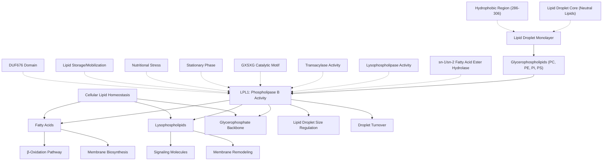

# Pathway Summary for LPL1

## Overview

LPL1 encodes a putative phospholipase B homolog that localizes to lipid droplets and functions in phospholipid metabolism in Candida albicans [file:CANAL/LPL1/LPL1-deep-research.md]. Based on homology to the well-characterized Saccharomyces cerevisiae LPL1, this enzyme likely catalyzes the hydrolysis of glycerophospholipids through multiple enzymatic activities including sn-1/sn-2 fatty acid ester hydrolase, lysophospholipase, and transacylase activities [file:CANAL/LPL1/LPL1-deep-research.md]. The enzyme plays important roles in lipid droplet dynamics, phospholipid remodeling, and cellular lipid homeostasis.

## Phospholipase B Multi-Activity System

LPL1 belongs to the phospholipase B enzyme family, which possesses three distinct catalytic activities that enable comprehensive phospholipid processing [file:CANAL/LPL1/LPL1-deep-research.md]. The enzyme first acts as an sn-1 and sn-2 fatty acid ester hydrolase, removing fatty acid chains from glycerophospholipids to generate lysophospholipids. Subsequently, the lysophospholipase activity removes the remaining fatty acid to produce the glycerophosphate backbone. Additionally, the transacylase activity enables the transfer of fatty acid groups between phospholipid substrates, providing flexibility in membrane lipid composition [file:CANAL/LPL1/LPL1-deep-research.md].

## Lipid Droplet Dynamics and Storage

LPL1 localizes exclusively to lipid droplets during stationary phase, positioning it at the interface between lipid storage and mobilization [file:CANAL/LPL1/LPL1-deep-research.md]. Lipid droplets are specialized organelles that store neutral lipids surrounded by a phospholipid monolayer and associated proteins. The presence of phospholipase B at this location suggests roles in regulating lipid droplet size, composition, and turnover. During periods of lipid mobilization, LPL1 may help remodel the phospholipid monolayer to facilitate access to stored neutral lipids or process phospholipids released during lipolysis.

## Membrane Lipid Homeostasis

Beyond its role at lipid droplets, LPL1 contributes to broader cellular phospholipid metabolism and membrane homeostasis [file:CANAL/LPL1/LPL1-deep-research.md]. The enzyme's broad substrate specificity, acting on all major glycerophospholipids, enables it to participate in phospholipid remodeling processes that maintain membrane composition and properties [file:CANAL/LPL1/LPL1-deep-research.md]. This activity is particularly important for maintaining membrane fluidity, asymmetry, and signaling molecule production during different growth conditions or stress responses.

## Integration with Lipid Metabolism Pathways

LPL1 functions as a key node connecting storage lipid dynamics with membrane phospholipid metabolism. The enzyme's products, including fatty acids and lysophospholipids, serve as substrates for various downstream pathways including β-oxidation, membrane synthesis, and signaling molecule production. The coordinate regulation of LPL1 with other lipid metabolic enzymes ensures balanced lipid homeostasis and appropriate responses to nutritional or environmental changes.

## Lipid Metabolism and Droplet Dynamics Pathway Diagram

## Pathogenicity and Virulence Connections

In the context of C. albicans pathogenicity, LPL1-mediated lipid metabolism may contribute to virulence through multiple mechanisms. Proper lipid homeostasis is essential for maintaining membrane integrity during host interactions, stress responses, and morphological transitions between yeast and hyphal forms. The enzyme's role in lipid droplet dynamics may be particularly important during infection, where the pathogen encounters varying nutrient conditions and must rapidly adapt its metabolism. Additionally, the phospholipase activity could potentially contribute to tissue damage or immune evasion through the production of bioactive lipid metabolites.

## Environmental Adaptation and Stress Response

LPL1's function in lipid metabolism positions it as an important component of cellular stress response systems. During environmental challenges such as nutrient limitation, oxidative stress, or temperature fluctuations, cells must rapidly adjust their membrane composition and lipid storage. The enzyme's broad substrate specificity and multiple catalytic activities provide flexibility for remodeling cellular lipids to maintain membrane function and energy homeostasis under adverse conditions. This metabolic plasticity is particularly crucial for opportunistic pathogens like C. albicans that encounter diverse host environments.

## Biotechnological and Therapeutic Implications

Understanding LPL1 function in lipid metabolism could inform the development of antifungal strategies targeting lipid homeostasis pathways. Disruption of phospholipase B activity might compromise the pathogen's ability to maintain membrane integrity or adapt to host environments, potentially enhancing the efficacy of existing antifungal treatments. Additionally, the enzyme's substrate promiscuity and specialized localization make it an interesting model for studying lipid droplet biology and phospholipase mechanisms in eukaryotic cells, with potential applications in biotechnology and metabolic engineering.