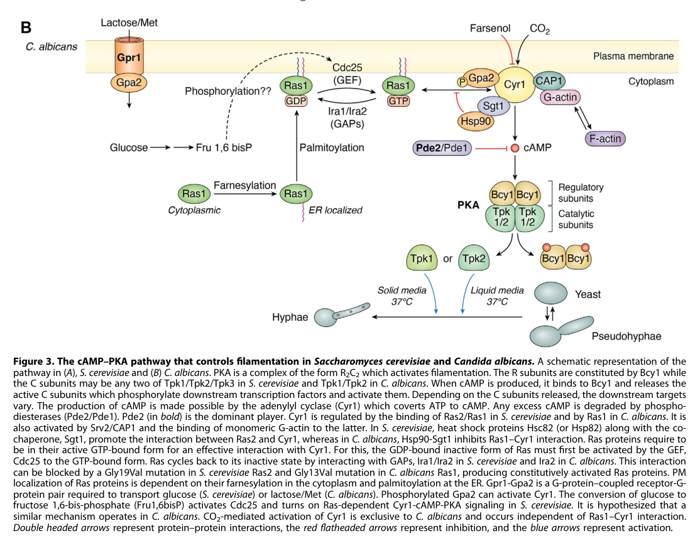

## Question

# Gene Research for Functional Annotation

## ⚠️ CRITICAL: Gene/Protein Identification Context

**BEFORE YOU BEGIN RESEARCH:** You MUST verify you are researching the CORRECT gene/protein. Gene symbols can be ambiguous, especially for less well-characterized genes from non-model organisms.

### Target Gene/Protein Identity (from UniProt):
- **UniProt Accession:** Q5AGE4
- **Protein Description:** SubName: Full=3'\5'-cyclic-nucleotide phosphodiesterase PDE1 {ECO:0000313|EMBL:AOW29655.1};
- **Gene Information:** Name=PDE1 {ECO:0000313|CGD:CAL0000177603, ECO:0000313|EMBL:AOW29655.1}; OrderedLocusNames=CAALFM_C502290WA {ECO:0000313|EMBL:AOW29655.1}, orf19.11710 {ECO:0000313|CGD:CAL0000177603};
- **Organism (full):** Candida albicans (strain SC5314 / ATCC MYA-2876) (Yeast).
- **Protein Family:** Belongs to the cyclic nucleotide phosphodiesterase class-II
- **Key Domains:** cAMP-PdiesteraseII_CS. (IPR024225); Pdiesterase2. (IPR000396); RibonucZ/Hydroxyglut_hydro. (IPR036866); PDEase_II (PF02112)

### MANDATORY VERIFICATION STEPS:

1. **Check if the gene symbol "PDE1" matches the protein description above**
2. **Verify the organism is correct:** Candida albicans (strain SC5314 / ATCC MYA-2876) (Yeast).
3. **Check if protein family/domains align with what you find in literature**
4. **If you find literature for a DIFFERENT gene with the same or similar symbol, STOP**

### If Gene Symbol is Ambiguous or You Cannot Find Relevant Literature:

**DO NOT PROCEED WITH RESEARCH ON A DIFFERENT GENE.** Instead:
- State clearly: "The gene symbol 'PDE1' is ambiguous or literature is limited for this specific protein"
- Explain what you found (e.g., "Found extensive literature on a different gene with the same symbol in a different organism")
- Describe the protein based ONLY on the UniProt information provided above
- Suggest that the protein function can be inferred from domain/family information

### Research Target:

Please provide a comprehensive research report on the gene **PDE1** (gene ID: PDE1, UniProt: Q5AGE4) in CANAL.

The research report should be a detailed narrative explaining the function, biological processes, and localization of the gene product. Citations should be given for all claims.

You should prioritize authoritative reviews and primary scientific literature when conducting research. You can supplement
this with annotations you find in gene/protein databases, but these can be outdated or inaccurate.

We are specifically interested in the primary function of the gene - for enzymes, what reaction is catalyzed, and what is the substrate specificity? For transporters, what is the substrate? For structural proteins or adapters, what is the broader structural role? For signaling molecules, what is the role in the pathway.

We are interested in where in or outside the cell the gene product carries out its function.

We are also interested in the signaling or biochemical pathways in which the gene functions. We are less interested in broad pleiotropic effects, except where these elucidate the precise role.

Include evidence where possible. We are interested in both experimental evidence as well as inference from structure, evolution, or bioinformatic analysis. Precise studies should be prioritized over high-throughput, where available.

## Output

Question: You are an expert researcher providing comprehensive, well-cited information.

Provide detailed information focusing on:
1. Key concepts and definitions with current understanding
2. Recent developments and latest research (prioritize 2023-2024 sources)
3. Current applications and real-world implementations
4. Expert opinions and analysis from authoritative sources
5. Relevant statistics and data from recent studies

Format as a comprehensive research report with proper citations. Include URLs and publication dates where available.
Always prioritize recent, authoritative sources and provide specific citations for all major claims.

# Gene Research for Functional Annotation

## ⚠️ CRITICAL: Gene/Protein Identification Context

**BEFORE YOU BEGIN RESEARCH:** You MUST verify you are researching the CORRECT gene/protein. Gene symbols can be ambiguous, especially for less well-characterized genes from non-model organisms.

### Target Gene/Protein Identity (from UniProt):
- **UniProt Accession:** Q5AGE4
- **Protein Description:** SubName: Full=3'\5'-cyclic-nucleotide phosphodiesterase PDE1 {ECO:0000313|EMBL:AOW29655.1};
- **Gene Information:** Name=PDE1 {ECO:0000313|CGD:CAL0000177603, ECO:0000313|EMBL:AOW29655.1}; OrderedLocusNames=CAALFM_C502290WA {ECO:0000313|EMBL:AOW29655.1}, orf19.11710 {ECO:0000313|CGD:CAL0000177603};
- **Organism (full):** Candida albicans (strain SC5314 / ATCC MYA-2876) (Yeast).
- **Protein Family:** Belongs to the cyclic nucleotide phosphodiesterase class-II
- **Key Domains:** cAMP-PdiesteraseII_CS. (IPR024225); Pdiesterase2. (IPR000396); RibonucZ/Hydroxyglut_hydro. (IPR036866); PDEase_II (PF02112)

### MANDATORY VERIFICATION STEPS:

1. **Check if the gene symbol "PDE1" matches the protein description above**
2. **Verify the organism is correct:** Candida albicans (strain SC5314 / ATCC MYA-2876) (Yeast).
3. **Check if protein family/domains align with what you find in literature**
4. **If you find literature for a DIFFERENT gene with the same or similar symbol, STOP**

### If Gene Symbol is Ambiguous or You Cannot Find Relevant Literature:

**DO NOT PROCEED WITH RESEARCH ON A DIFFERENT GENE.** Instead:
- State clearly: "The gene symbol 'PDE1' is ambiguous or literature is limited for this specific protein"
- Explain what you found (e.g., "Found extensive literature on a different gene with the same symbol in a different organism")
- Describe the protein based ONLY on the UniProt information provided above
- Suggest that the protein function can be inferred from domain/family information

### Research Target:

Please provide a comprehensive research report on the gene **PDE1** (gene ID: PDE1, UniProt: Q5AGE4) in CANAL.

The research report should be a detailed narrative explaining the function, biological processes, and localization of the gene product. Citations should be given for all claims.

You should prioritize authoritative reviews and primary scientific literature when conducting research. You can supplement
this with annotations you find in gene/protein databases, but these can be outdated or inaccurate.

We are specifically interested in the primary function of the gene - for enzymes, what reaction is catalyzed, and what is the substrate specificity? For transporters, what is the substrate? For structural proteins or adapters, what is the broader structural role? For signaling molecules, what is the role in the pathway.

We are interested in where in or outside the cell the gene product carries out its function.

We are also interested in the signaling or biochemical pathways in which the gene functions. We are less interested in broad pleiotropic effects, except where these elucidate the precise role.

Include evidence where possible. We are interested in both experimental evidence as well as inference from structure, evolution, or bioinformatic analysis. Precise studies should be prioritized over high-throughput, where available.

# Functional annotation report: *Candida albicans* PDE1 (UniProt Q5AGE4)

## Identity and annotation caution

The target specified here is **Pde1 from *Candida albicans* strain SC5314**, annotated in the supplied UniProt record as Q5AGE4, gene **PDE1**, with locus names **CAALFM_C502290WA** and **orf19.11710**. *C. albicans* literature independently describes Pde1 as a **low-affinity, class-II cyclic-nucleotide phosphodiesterase**, distinct from the high-affinity, class-I enzyme Pde2. Its supplied PDEase_II/Pdiesterase2 domains are consistent with that assignment. This is **not mammalian PDE1** or *Saccharomyces cerevisiae* Pde1; the latter’s measured kinetics and crystal structure must not be assigned to Q5AGE4. (yao2018crystalstructuresof pages 1-3, huang2019multiplerolesand pages 1-6, tian2014dualspecificityand pages 1-2)

**An identifier discrepancy warrants checking before transferring individual experimental annotations:** *C. albicans* pathway reviews and a 2020 study label **PDE1 as orf19.4235**, whereas the supplied Q5AGE4 record lists **orf19.11710**. The retrieved literature establishes the *C. albicans* **PDE1 gene-name/function correspondence**, but does **not independently establish that these two orf19 identifiers map to the same sequence**. The biochemical and genetic conclusions below therefore apply to the literature’s named *C. albicans* Pde1; their assignment to the exact Q5AGE4 sequence remains conditional on resolving that locus mapping. (inglis2013rassignalinggets pages 2-3, she2020mitochondrialcomplexi pages 9-11)

## Primary molecular function and substrate specificity

Pde1 hydrolyzes the 3′,5′-cyclic phosphodiester bond of cyclic nucleotides: **3′,5′-cAMP + H₂O → 5′-AMP**; it also hydrolyzes **3′,5′-cGMP → 5′-GMP** in vitro. By removing cAMP, it acts as a negative regulator of intracellular cAMP signaling rather than as an adenylyl cyclase or a transporter. The class-II assignment predicts a metal-dependent catalytic architecture, but the two-zinc-ion crystal structure often cited for “yeast Pde1” was determined for ***S. cerevisiae*** Pde1, **not** Q5AGE4. (yao2018crystalstructuresof pages 1-3, tian2014dualspecificityand pages 2-3, tian2014dualspecificityand pages 3-4)

Published kinetic values for recombinant ***C. albicans*** Pde1, originally reported by **Hoyer and colleagues (July 1994)** and restated in later biochemical papers, permit a direct substrate comparison. (yao2018crystalstructuresof pages 1-3, tian2014dualspecificityand pages 2-3, yao2018crystalstructuresof pages 10-11)

| Substrate | *K*ₘ (µM) | *V*max (µmol mg⁻¹ min⁻¹) | Relative *V*max/*K*ₘ (cAMP = 1) | Interpretation |
|---|---:|---:|---:|---|
| cAMP | 490 | 1.17 | 1.000 | Preferred physiological substrate by catalytic efficiency; directly characterized using recombinant *C. albicans* Pde1. Values were originally reported by Hoyer et al. (1994) and subsequently reproduced in comparative summaries (yao2018crystalstructuresof pages 1-3, tian2014dualspecificityand pages 2-3, yao2018crystalstructuresof pages 10-11). |
| cGMP | 250 | 0.044 | ≈0.074 | Although its lower *K*ₘ indicates stronger apparent binding than for cAMP, its ≈26.6-fold lower *V*max makes overall catalytic efficiency ≈13.6-fold lower. Thus, cGMP hydrolysis is detectable but weak, and a physiological cGMP-signaling role remains unsupported (yao2018crystalstructuresof pages 1-3, tian2014dualspecificityand pages 2-3). |

*Table: Recombinant *Candida albicans* Pde1 hydrolyzes both cyclic nucleotides but is approximately 13.6-fold more catalytically efficient toward cAMP. These are *C. albicans* values, not the distinct *Saccharomyces cerevisiae* Pde1 measurements.*

Although cGMP has the **lower *K*ₘ** (250 versus 490 µM), its much smaller *V*max means that **cAMP has approximately 13.6-fold greater *V*max/*K*ₘ** under the reported assay conditions. Consequently, “higher affinity for cGMP” must **not** be read as “cGMP is the principal physiological substrate.” A physiological cGMP-signaling role for this protein has not been demonstrated in the retrieved *Candida* studies. These numerical parameters are historical measurements, **not new 2023–2024 measurements**. (yao2018crystalstructuresof pages 1-3, tian2014dualspecificityand pages 2-3, she2020mitochondrialcomplexi pages 9-11)

Pde1’s comparatively high *K*ₘ for cAMP is consistent with a greater contribution when cAMP rises during stimulation; high-affinity Pde2 is better positioned to regulate low or basal cAMP concentrations. This is a **kinetic/pathway interpretation**, not a measurement of the substrate concentration at a specific Pde1-containing cellular site. Importantly, direct characterization of ***C. albicans* Pde2** found a cAMP *K*ₘ of **35 nM**; that number belongs to **Pde2, not Pde1**. (yao2018crystalstructuresof pages 1-3, komath2024toeachits pages 8-9, huang2019multiplerolesand pages 1-6)

## Biological pathway, experimental findings and location

In the *C. albicans* **Ras/Gpr1–Gpa2–Cyr1–cAMP–PKA pathway**, adenylyl cyclase Cyr1 generates cAMP from ATP. cAMP binds the PKA regulatory subunit Bcy1, permitting the catalytic subunits Tpk1/Tpk2 to signal to downstream effectors. Pde1 and Pde2 counterbalance Cyr1 by hydrolyzing cAMP. The **July 2024** pathway review depicts **Pde2 as the dominant cAMP-degrading enzyme** and discusses lower-affinity Pde1 in the response to transient increases. The resulting effects on morphogenesis are *pathway-level consequences*, not evidence that Pde1 itself is a structural component of a hypha. (komath2024toeachits pages 6-8, komath2024toeachits pages 8-9, komath2024toeachits media dc46c02c)

A *C. albicans*-specific review associates **Pde1 with repression of cAMP signaling in response to glucose and intracellular acidification** and reports that a **pde1 mutant filaments normally** in the assessed conditions. Combining a *pde1* mutation with a *pde2* mutation aggravated the latter mutant’s virulence defect, suggesting a conditional or subsidiary contribution rather than the pronounced single-mutant phenotype of Pde2. A primary paper explicitly titled “*Candida albicans* Pde1p and Gpa2p comprise a regulatory module mediating agonist-induced cAMP signalling and environmental adaptation” was published by **Wilson and colleagues in September 2010**; its full text was not retrievable here, so specific physical-interaction, epistasis, or stimulus-response magnitudes should **not** be inferred from its title. (inglis2013rassignalinggets pages 2-3, yao2018crystalstructuresof pages 10-11)

Evidence for pathway coupling does **not** imply that Gpa2 mediates every glucose response. A **2005** *C. albicans* genetic study found that loss of **Gpr1 or Gpa2 did not abolish glucose-induced cAMP signaling**, whereas loss of **Cdc25 or Ras1 did**. The Gpr1–Gpa2 arm instead contributed to amino-acid-induced morphogenesis in the presence of glucose. This distinction limits overly simple descriptions of a universal “glucose → Gpa2 → Pde1” mechanism. (maidan2005thegproteincoupled pages 1-2)

**Site of action:** Because its measured substrate is a cellular second messenger and the reported readouts are intracellular cAMP/PKA signaling, Pde1’s supported functional context is **inside the fungal cell**. The retrieved *C. albicans* evidence does **not** establish a specific Pde1 compartment by direct imaging, fractionation, or a validated localization tag. **Cytosolic activity is plausible but remains an inference**; localization reported for Ras1, Pde2, or PDEs in other fungi must not be reassigned to *C. albicans* Pde1. (huang2019multiplerolesand pages 1-6, she2020mitochondrialcomplexi pages 9-11, inglis2013rassignalinggets pages 2-3)

## Recent evidence, applications and limits of inference

The **2024** review consolidates the current pathway model but contributes **no new Q5AGE4-specific localization or substrate-kinetic experiment**. In a *C. albicans* mitochondrial-stress study published **November 2020**, **PDE1 transcript levels decreased** in several complex-I mutants, while **PDE2 rose more than 25-fold in the *ndh51* mutant**; total cAMP-phosphodiesterase activity rose **threefold** in that mutant. Because activity was measured for **combined cAMP-degrading enzymes**, these figures **cannot be interpreted as a threefold change in Pde1 activity**. They illustrate the practical need to distinguish transcript abundance, individual-enzyme activity and network-level cAMP changes. (komath2024toeachits pages 6-8, she2020mitochondrialcomplexi pages 8-9, she2020mitochondrialcomplexi pages 9-11)

The experimentally useful implementation at present is **functional annotation and genetic dissection of *Candida* cAMP homeostasis**, including comparison of PDE1 and PDE2 perturbations in stimulus-response assays; the retrieved evidence does **not** establish a clinically implemented Pde1-selective drug or diagnostic test. Claims that *Candida* Pde1 is directly **phosphorylated and activated by PKA** should also be qualified: that feedback was experimentally demonstrated for ***S. cerevisiae*** Pde1, and conservation of a candidate phosphorylation motif in the *C. albicans* homologue is **not itself a direct *Candida* phosphoregulation experiment**. Likewise, *S. cerevisiae* Pde1’s comparatively efficient cGMP hydrolysis does not overturn the measured cAMP preference of the *Candida* enzyme. (ma1999thepde1encodedlowaffinity pages 1-2, ma1999thepde1encodedlowaffinity pages 11-13, tian2014dualspecificityand pages 1-2, tian2014dualspecificityand pages 2-3)

**Bottom line:** Subject to verification of the conflicting **orf19.11710/orf19.4235** identifiers, *C. albicans* **Pde1 is best annotated as an intracellular, low-affinity, class-II cyclic-nucleotide phosphodiesterase whose demonstrated chemistry favors cAMP hydrolysis and whose best-supported cellular role is attenuation of cAMP–PKA signaling during environmental responses**. Its precise intracellular compartment, direct *Candida*-specific PKA feedback mechanism and any physiological cGMP-signaling role remain unresolved in the evidence reviewed here. (yao2018crystalstructuresof pages 1-3, inglis2013rassignalinggets pages 2-3, komath2024toeachits pages 6-8, she2020mitochondrialcomplexi pages 9-11)

### Principal sources and publication dates

- Hoyer *et al.*, **July 1994**, *Microbiology*, biochemical characterization of recombinant *C. albicans* cyclic-nucleotide phosphodiesterase: https://doi.org/10.1099/13500872-140-7-1533. Original full text was unavailable here; its kinetic results were cross-checked against later papers. (yao2018crystalstructuresof pages 10-11, tian2014dualspecificityand pages 2-3)
- Wilson *et al.*, **September 2010**, *Fungal Genetics and Biology*, *C. albicans* Pde1p/Gpa2p regulatory module: https://doi.org/10.1016/j.fgb.2010.06.006. Original full text was unavailable here. (yao2018crystalstructuresof pages 10-11, tian2014dualspecificityand pages 7-8)
- Inglis and Sherlock, **October 2013**, *Eukaryotic Cell*, *Candida* Ras-pathway review: https://doi.org/10.1128/EC.00094-13. (inglis2013rassignalinggets pages 2-3)
- Tian *et al.*, **July 2014**, *Biochemistry*, structural work on ***S. cerevisiae*** Pde1 with a comparison to *Candida* kinetics: https://doi.org/10.1021/bi500406h. (tian2014dualspecificityand pages 1-2, tian2014dualspecificityand pages 2-3)
- Yao *et al.*, **October 2018**, *Biochemistry*, ***C. albicans* Pde2** characterization with published Pde1 kinetic comparison: https://doi.org/10.1021/acs.biochem.8b00707. (yao2018crystalstructuresof pages 1-3)
- Huang *et al.*, **2019**, *Molecular Microbiology*, review of the *C. albicans* Ras/cAMP/PKA pathway: https://doi.org/10.1111/mmi.14148. (huang2019multiplerolesand pages 1-6)
- She *et al.*, **November 2020**, *Frontiers in Microbiology*, mitochondrial mutants and phosphodiesterase-expression measurements: https://doi.org/10.3389/fmicb.2020.559975. (she2020mitochondrialcomplexi pages 9-11)
- Komath, **July 2024**, *Journal of Biological Chemistry*, comparative review and Figure 3 pathway schematic: https://doi.org/10.1016/j.jbc.2024.107444. (komath2024toeachits pages 6-8, komath2024toeachits media dc46c02c)

References

1. (yao2018crystalstructuresof pages 1-3): Ting Yao, Yi-You Huang, Meng Zhang, Yujuan Chen, Hai-Run Pei, Jian-You Shi, Huanchen Wang, You-Sheng Wang, and H. Ke. Crystal structures of candida albicans phosphodiesterase-2 and implication on its biological functions. Biochemistry, 57:6070-6077, Sep 2018. URL: https://doi.org/10.1021/acs.biochem.8b00707, doi:10.1021/acs.biochem.8b00707. This article has 1 citations and is from a peer-reviewed journal.

2. (huang2019multiplerolesand pages 1-6): Guanghua Huang, Qian Huang, Yujia Wei, Yue Wang, and Han Du. Multiple roles and diverse regulation of the ras/camp/protein kinase a pathway in candida albicans. Molecular Microbiology, 111:6-16, Nov 2019. URL: https://doi.org/10.1111/mmi.14148, doi:10.1111/mmi.14148. This article has 132 citations and is from a domain leading peer-reviewed journal.

3. (tian2014dualspecificityand pages 1-2): Yuanyuan Tian, Wenjun Cui, Manna Huang, Howard Robinson, Yiqian Wan, Yousheng Wang, and Hengming Ke. Dual specificity and novel structural folding of yeast phosphodiesterase-1 for hydrolysis of second messengers cyclic adenosine and guanosine 3′,5′-monophosphate. Jul 2014. URL: https://doi.org/10.1021/bi500406h, doi:10.1021/bi500406h. This article has 28 citations and is from a peer-reviewed journal.

4. (inglis2013rassignalinggets pages 2-3): Diane O. Inglis and Gavin Sherlock. Ras signaling gets fine-tuned: regulation of multiple pathogenic traits of candida albicans. Oct 2013. URL: https://doi.org/10.1128/ec.00094-13, doi:10.1128/ec.00094-13. This article has 88 citations and is from a peer-reviewed journal.

5. (she2020mitochondrialcomplexi pages 9-11): Xiaodong She, Lulu Zhang, Jingwen Peng, Jingyun Zhang, Hongbin Li, Pengyi Zhang, Richard Calderone, Weida Liu, and Dongmei Li. Mitochondrial complex i core protein regulates camp signaling via phosphodiesterase pde2 and nad homeostasis in candida albicans. Frontiers in Microbiology, Nov 2020. URL: https://doi.org/10.3389/fmicb.2020.559975, doi:10.3389/fmicb.2020.559975. This article has 20 citations and is from a peer-reviewed journal.

6. (tian2014dualspecificityand pages 2-3): Yuanyuan Tian, Wenjun Cui, Manna Huang, Howard Robinson, Yiqian Wan, Yousheng Wang, and Hengming Ke. Dual specificity and novel structural folding of yeast phosphodiesterase-1 for hydrolysis of second messengers cyclic adenosine and guanosine 3′,5′-monophosphate. Jul 2014. URL: https://doi.org/10.1021/bi500406h, doi:10.1021/bi500406h. This article has 28 citations and is from a peer-reviewed journal.

7. (tian2014dualspecificityand pages 3-4): Yuanyuan Tian, Wenjun Cui, Manna Huang, Howard Robinson, Yiqian Wan, Yousheng Wang, and Hengming Ke. Dual specificity and novel structural folding of yeast phosphodiesterase-1 for hydrolysis of second messengers cyclic adenosine and guanosine 3′,5′-monophosphate. Jul 2014. URL: https://doi.org/10.1021/bi500406h, doi:10.1021/bi500406h. This article has 28 citations and is from a peer-reviewed journal.

8. (yao2018crystalstructuresof pages 10-11): Ting Yao, Yi-You Huang, Meng Zhang, Yujuan Chen, Hai-Run Pei, Jian-You Shi, Huanchen Wang, You-Sheng Wang, and H. Ke. Crystal structures of candida albicans phosphodiesterase-2 and implication on its biological functions. Biochemistry, 57:6070-6077, Sep 2018. URL: https://doi.org/10.1021/acs.biochem.8b00707, doi:10.1021/acs.biochem.8b00707. This article has 1 citations and is from a peer-reviewed journal.

9. (komath2024toeachits pages 8-9): Sneha Sudha Komath. To each its own: mechanisms of cross-talk between gpi biosynthesis and camp-pka signaling in candida albicans versus saccharomyces cerevisiae. Jul 2024. URL: https://doi.org/10.1016/j.jbc.2024.107444, doi:10.1016/j.jbc.2024.107444. This article has 5 citations and is from a domain leading peer-reviewed journal.

10. (komath2024toeachits pages 6-8): Sneha Sudha Komath. To each its own: mechanisms of cross-talk between gpi biosynthesis and camp-pka signaling in candida albicans versus saccharomyces cerevisiae. Jul 2024. URL: https://doi.org/10.1016/j.jbc.2024.107444, doi:10.1016/j.jbc.2024.107444. This article has 5 citations and is from a domain leading peer-reviewed journal.

11. (komath2024toeachits media dc46c02c): Sneha Sudha Komath. To each its own: mechanisms of cross-talk between gpi biosynthesis and camp-pka signaling in candida albicans versus saccharomyces cerevisiae. Jul 2024. URL: https://doi.org/10.1016/j.jbc.2024.107444, doi:10.1016/j.jbc.2024.107444. This article has 5 citations and is from a domain leading peer-reviewed journal.

12. (maidan2005thegproteincoupled pages 1-2): Mykola M. Maidan, Larissa De Rop, Joke Serneels, Simone Exler, Steffen Rupp, Hélène Tournu, Johan M. Thevelein, and Patrick Van Dijck. The g protein-coupled receptor gpr1 and the galpha protein gpa2 act through the camp-protein kinase a pathway to induce morphogenesis in candida albicans. Molecular biology of the cell, 16 4:1971-86, Apr 2005. URL: https://doi.org/10.1091/mbc.e04-09-0780, doi:10.1091/mbc.e04-09-0780. This article has 260 citations and is from a domain leading peer-reviewed journal.

13. (she2020mitochondrialcomplexi pages 8-9): Xiaodong She, Lulu Zhang, Jingwen Peng, Jingyun Zhang, Hongbin Li, Pengyi Zhang, Richard Calderone, Weida Liu, and Dongmei Li. Mitochondrial complex i core protein regulates camp signaling via phosphodiesterase pde2 and nad homeostasis in candida albicans. Frontiers in Microbiology, Nov 2020. URL: https://doi.org/10.3389/fmicb.2020.559975, doi:10.3389/fmicb.2020.559975. This article has 20 citations and is from a peer-reviewed journal.

14. (ma1999thepde1encodedlowaffinity pages 1-2): Pingsheng Ma, Stefaan Wera, Patrick Van Dijck, and Johan M. Thevelein. The pde1-encoded low-affinity phosphodiesterase in the yeast saccharomyces cerevisiae has a specific function in controlling agonist-induced camp signaling. Molecular biology of the cell, 10 1:91-104, Jan 1999. URL: https://doi.org/10.1091/mbc.10.1.91, doi:10.1091/mbc.10.1.91. This article has 257 citations and is from a domain leading peer-reviewed journal.

15. (ma1999thepde1encodedlowaffinity pages 11-13): Pingsheng Ma, Stefaan Wera, Patrick Van Dijck, and Johan M. Thevelein. The pde1-encoded low-affinity phosphodiesterase in the yeast saccharomyces cerevisiae has a specific function in controlling agonist-induced camp signaling. Molecular biology of the cell, 10 1:91-104, Jan 1999. URL: https://doi.org/10.1091/mbc.10.1.91, doi:10.1091/mbc.10.1.91. This article has 257 citations and is from a domain leading peer-reviewed journal.

16. (tian2014dualspecificityand pages 7-8): Yuanyuan Tian, Wenjun Cui, Manna Huang, Howard Robinson, Yiqian Wan, Yousheng Wang, and Hengming Ke. Dual specificity and novel structural folding of yeast phosphodiesterase-1 for hydrolysis of second messengers cyclic adenosine and guanosine 3′,5′-monophosphate. Jul 2014. URL: https://doi.org/10.1021/bi500406h, doi:10.1021/bi500406h. This article has 28 citations and is from a peer-reviewed journal.

## Artifacts

- [Edison artifact artifact-00](PDE1-deep-research-falcon_artifacts/artifact-00.md)

## Citations

1. maidan2005thegproteincoupled pages 1-2
2. inglis2013rassignalinggets pages 2-3
3. yao2018crystalstructuresof pages 1-3
4. huang2019multiplerolesand pages 1-6
5. she2020mitochondrialcomplexi pages 9-11
6. tian2014dualspecificityand pages 1-2
7. tian2014dualspecificityand pages 2-3
8. tian2014dualspecificityand pages 3-4
9. yao2018crystalstructuresof pages 10-11
10. komath2024toeachits pages 8-9
11. komath2024toeachits pages 6-8
12. she2020mitochondrialcomplexi pages 8-9
13. tian2014dualspecificityand pages 7-8
14. https://doi.org/10.1099/13500872-140-7-1533.
15. https://doi.org/10.1016/j.fgb.2010.06.006.
16. https://doi.org/10.1128/EC.00094-13.
17. https://doi.org/10.1021/bi500406h.
18. https://doi.org/10.1021/acs.biochem.8b00707.
19. https://doi.org/10.1111/mmi.14148.
20. https://doi.org/10.3389/fmicb.2020.559975.
21. https://doi.org/10.1016/j.jbc.2024.107444.
22. https://doi.org/10.1021/acs.biochem.8b00707,
23. https://doi.org/10.1111/mmi.14148,
24. https://doi.org/10.1021/bi500406h,
25. https://doi.org/10.1128/ec.00094-13,
26. https://doi.org/10.3389/fmicb.2020.559975,
27. https://doi.org/10.1016/j.jbc.2024.107444,
28. https://doi.org/10.1091/mbc.e04-09-0780,
29. https://doi.org/10.1091/mbc.10.1.91,