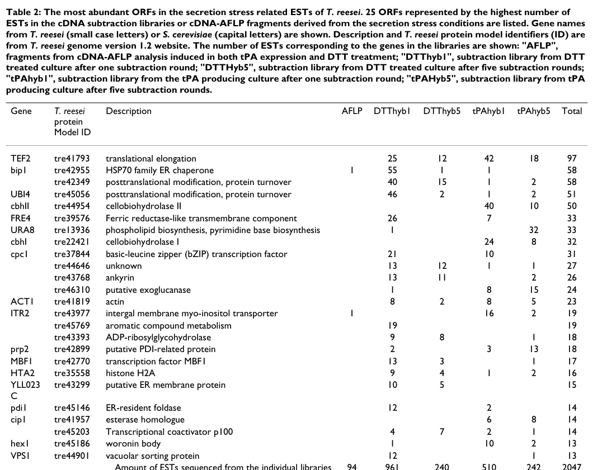

## Question

# Gene Research for Functional Annotation

## ⚠️ CRITICAL: Gene/Protein Identification Context

**BEFORE YOU BEGIN RESEARCH:** You MUST verify you are researching the CORRECT gene/protein. Gene symbols can be ambiguous, especially for less well-characterized genes from non-model organisms.

### Target Gene/Protein Identity (from UniProt):
- **UniProt Accession:** G0RBE3
- **Protein Description:** RecName: Full=Serine/threonine-protein kinase/endoribonuclease IRE1 {ECO:0000250|UniProtKB:P32361}; AltName: Full=Endoplasmic reticulum-to-nucleus signaling 1 {ECO:0000250|UniProtKB:P32361}; Includes: RecName: Full=Serine/threonine-protein kinase; EC=2.7.11.1 {ECO:0000250|UniProtKB:P32361}; Includes: RecName: Full=Endoribonuclease; EC=3.1.26.- {ECO:0000250|UniProtKB:P32361}; Flags: Precursor;
- **Gene Information:** Name=IRE1 {ECO:0000303|PubMed:15480788}; ORFNames=TRIREDRAFT_45242 {ECO:0000312|EMBL:EGR51316.1};
- **Organism (full):** Hypocrea jecorina (strain QM6a) (Trichoderma reesei).
- **Protein Family:** Belongs to the protein kinase superfamily. Ser/Thr protein
- **Key Domains:** IRE1/2-like. (IPR045133); KEN_dom. (IPR010513); KEN_sf. (IPR038357); Kinase-like_dom_sf. (IPR011009); Prot_kinase_dom. (IPR000719)

### MANDATORY VERIFICATION STEPS:

1. **Check if the gene symbol "IRE1" matches the protein description above**
2. **Verify the organism is correct:** Hypocrea jecorina (strain QM6a) (Trichoderma reesei).
3. **Check if protein family/domains align with what you find in literature**
4. **If you find literature for a DIFFERENT gene with the same or similar symbol, STOP**

### If Gene Symbol is Ambiguous or You Cannot Find Relevant Literature:

**DO NOT PROCEED WITH RESEARCH ON A DIFFERENT GENE.** Instead:
- State clearly: "The gene symbol 'IRE1' is ambiguous or literature is limited for this specific protein"
- Explain what you found (e.g., "Found extensive literature on a different gene with the same symbol in a different organism")
- Describe the protein based ONLY on the UniProt information provided above
- Suggest that the protein function can be inferred from domain/family information

### Research Target:

Please provide a comprehensive research report on the gene **IRE1** (gene ID: IRE1, UniProt: G0RBE3) in CANGA.

The research report should be a detailed narrative explaining the function, biological processes, and localization of the gene product. Citations should be given for all claims.

You should prioritize authoritative reviews and primary scientific literature when conducting research. You can supplement
this with annotations you find in gene/protein databases, but these can be outdated or inaccurate.

We are specifically interested in the primary function of the gene - for enzymes, what reaction is catalyzed, and what is the substrate specificity? For transporters, what is the substrate? For structural proteins or adapters, what is the broader structural role? For signaling molecules, what is the role in the pathway.

We are interested in where in or outside the cell the gene product carries out its function.

We are also interested in the signaling or biochemical pathways in which the gene functions. We are less interested in broad pleiotropic effects, except where these elucidate the precise role.

Include evidence where possible. We are interested in both experimental evidence as well as inference from structure, evolution, or bioinformatic analysis. Precise studies should be prioritized over high-throughput, where available.

## Output

Question: You are an expert researcher providing comprehensive, well-cited information.

Provide detailed information focusing on:
1. Key concepts and definitions with current understanding
2. Recent developments and latest research (prioritize 2023-2024 sources)
3. Current applications and real-world implementations
4. Expert opinions and analysis from authoritative sources
5. Relevant statistics and data from recent studies

Format as a comprehensive research report with proper citations. Include URLs and publication dates where available.
Always prioritize recent, authoritative sources and provide specific citations for all major claims.

# Gene Research for Functional Annotation

## ⚠️ CRITICAL: Gene/Protein Identification Context

**BEFORE YOU BEGIN RESEARCH:** You MUST verify you are researching the CORRECT gene/protein. Gene symbols can be ambiguous, especially for less well-characterized genes from non-model organisms.

### Target Gene/Protein Identity (from UniProt):
- **UniProt Accession:** G0RBE3
- **Protein Description:** RecName: Full=Serine/threonine-protein kinase/endoribonuclease IRE1 {ECO:0000250|UniProtKB:P32361}; AltName: Full=Endoplasmic reticulum-to-nucleus signaling 1 {ECO:0000250|UniProtKB:P32361}; Includes: RecName: Full=Serine/threonine-protein kinase; EC=2.7.11.1 {ECO:0000250|UniProtKB:P32361}; Includes: RecName: Full=Endoribonuclease; EC=3.1.26.- {ECO:0000250|UniProtKB:P32361}; Flags: Precursor;
- **Gene Information:** Name=IRE1 {ECO:0000303|PubMed:15480788}; ORFNames=TRIREDRAFT_45242 {ECO:0000312|EMBL:EGR51316.1};
- **Organism (full):** Hypocrea jecorina (strain QM6a) (Trichoderma reesei).
- **Protein Family:** Belongs to the protein kinase superfamily. Ser/Thr protein
- **Key Domains:** IRE1/2-like. (IPR045133); KEN_dom. (IPR010513); KEN_sf. (IPR038357); Kinase-like_dom_sf. (IPR011009); Prot_kinase_dom. (IPR000719)

### MANDATORY VERIFICATION STEPS:

1. **Check if the gene symbol "IRE1" matches the protein description above**
2. **Verify the organism is correct:** Hypocrea jecorina (strain QM6a) (Trichoderma reesei).
3. **Check if protein family/domains align with what you find in literature**
4. **If you find literature for a DIFFERENT gene with the same or similar symbol, STOP**

### If Gene Symbol is Ambiguous or You Cannot Find Relevant Literature:

**DO NOT PROCEED WITH RESEARCH ON A DIFFERENT GENE.** Instead:
- State clearly: "The gene symbol 'IRE1' is ambiguous or literature is limited for this specific protein"
- Explain what you found (e.g., "Found extensive literature on a different gene with the same symbol in a different organism")
- Describe the protein based ONLY on the UniProt information provided above
- Suggest that the protein function can be inferred from domain/family information

### Research Target:

Please provide a comprehensive research report on the gene **IRE1** (gene ID: IRE1, UniProt: G0RBE3) in CANGA.

The research report should be a detailed narrative explaining the function, biological processes, and localization of the gene product. Citations should be given for all claims.

You should prioritize authoritative reviews and primary scientific literature when conducting research. You can supplement
this with annotations you find in gene/protein databases, but these can be outdated or inaccurate.

We are specifically interested in the primary function of the gene - for enzymes, what reaction is catalyzed, and what is the substrate specificity? For transporters, what is the substrate? For structural proteins or adapters, what is the broader structural role? For signaling molecules, what is the role in the pathway.

We are interested in where in or outside the cell the gene product carries out its function.

We are also interested in the signaling or biochemical pathways in which the gene functions. We are less interested in broad pleiotropic effects, except where these elucidate the precise role.

Include evidence where possible. We are interested in both experimental evidence as well as inference from structure, evolution, or bioinformatic analysis. Precise studies should be prioritized over high-throughput, where available.

## Research report: Functional annotation of **IRE1** (UniProt **G0RBE3**) in *Hypocrea jecorina* / *Trichoderma reesei* QM6a

### 0. Target verification (mandatory disambiguation)
The gene symbol **IRE1** is widely used across eukaryotes (yeasts, filamentous fungi, animals) for the ER stress sensor “inositol-requiring enzyme 1”. Here the target is specifically *T. reesei* (teleomorph *Hypocrea jecorina*) **ire1** encoding a bifunctional **serine/threonine protein kinase + endoribonuclease**. Primary *T. reesei* evidence confirms this identity: Valkonen et al. cloned and characterized *T. reesei* **ire1** (GenBank AY328083), showing canonical Ire1 topology and activity, plus functional complementation of *S. cerevisiae* **ire1Δ** and downstream **hac1** mRNA processing and UPR gene induction (valkonen2004theire1and pages 2-3, valkonen2004theire1and pages 3-6, valkonen2004theire1and pages 1-2). This aligns with the UniProt description provided (G0RBE3) and supports that the report is about the correct fungal Ire1 ortholog rather than mammalian IRE1α/β.

### 1. Key concepts and definitions (current understanding)

#### 1.1 Unfolded Protein Response (UPR) in fungi
**ER stress** arises when secretory-pathway demand exceeds ER folding capacity, leading to accumulation of unfolded/misfolded proteins. The **UPR** is a transcriptional and physiological adaptation program that increases folding capacity, quality control, and secretory-pathway throughput. In fungi, the UPR is primarily mediated by an **IRE1–HAC1/HacA** signaling axis; unlike metazoans, fungi generally lack the PERK and ATF6 branches, increasing the centrality of Ire1 to ER homeostasis (zhou2025theunfoldedprotein pages 5-5).

#### 1.2 Ire1 as a bifunctional kinase/endoribonuclease
Ire1 is an ER membrane protein that couples stress sensing to RNA processing. Canonically, ER stress triggers Ire1 oligomerization and **trans-autophosphorylation**, activating its RNase output; the RNase then catalyzes **unconventional (spliceosome-independent) intron removal** from **HAC1/hacA mRNA**, enabling translation of the bZIP transcription factor that activates UPR target genes (fauzee2023endoplasmicstresssensor pages 1-2, zhou2025theunfoldedprotein pages 5-5).

#### 1.3 HAC1/hacA mRNA “unconventional splicing” and 5′ truncation in filamentous fungi
In *T. reesei* and several filamentous fungi, hac1/hacA activation involves (i) splicing of a **short nonconventional intron** (~20 nt) and (ii) additional **5′ truncation** of the mRNA that can relieve translational repression by upstream ORFs, providing an extra control layer compared with the canonical budding-yeast model (jadhav2024proteinsecretionand pages 7-8, ishiwatakimata2023fundamentalandapplicative pages 8-10).

### 2. Gene/protein function in *T. reesei* (G0RBE3): domains, enzymatic activity, substrates

#### 2.1 Domain architecture and predicted topology
*T. reesei* Ire1 is reported as a **1,243-aa** protein with a **predicted N-terminal signal peptide (~25 aa)**, consistent with luminal entry and type-I membrane topology. A **single transmembrane segment** is predicted at **codons 584–606**, placing the N-terminus in the ER lumen and the C-terminal catalytic module in the cytosol (valkonen2004theire1and pages 2-3).

A cytosolic **protein kinase domain** is predicted at **aa 809–1105**, and the C-terminal ~232 aa show similarity to **human RNase L**, consistent with an **endoribonuclease** effector module required for UPR signaling (valkonen2004theire1and pages 3-6, valkonen2004theire1and pages 2-3). These features match the UniProt annotation of a serine/threonine-protein kinase/endoribonuclease precursor.

#### 2.2 Kinase activity (reaction class)
Biochemically, a recombinant **GST fusion spanning aa 607–1243** undergoes **autophosphorylation in vitro**, demonstrating intrinsic kinase activity of the cytosolic domain (valkonen2004theire1and pages 2-3). While the *in vivo* phosphorylation targets within Ire1 were not mapped in the retrieved excerpts, the activation paradigm described for fungal Ire1 generally involves oligomerization and trans-autophosphorylation of the kinase domain during ER stress (fauzee2023endoplasmicstresssensor pages 1-2, zhou2025theunfoldedprotein pages 5-5).

#### 2.3 RNase activity (substrate specificity)
**Direct *T. reesei* substrate evidence:** Valkonen et al. observed that *T. reesei* ire1 overexpression results in appearance of an additional, **shorter hac1 mRNA species** (Northern blot band), consistent with Ire1-dependent processing/activation of hac1 (valkonen2004theire1and pages 3-6). A filamentous-fungal model includes splicing of a **~20 nt intron** plus **~200–250 nt 5′ truncation** in *T. reesei* hac1 transcripts (jadhav2024proteinsecretionand pages 7-8, ishiwatakimata2023fundamentalandapplicative pages 8-10).

**Broader fungal RNase outputs (inference beyond *T. reesei*):** Recent expert syntheses emphasize that Ire1 RNase can also mediate **regulated Ire1-dependent decay (RIDD)** of ER-localized mRNAs, with relative reliance on HAC1 splicing versus RIDD varying by fungal lineage (ishiwatakimata2023fundamentalandapplicative pages 8-10, ishiwatakimata2023fundamentalandapplicative pages 14-15). Importantly, this broader RNase output has **not** been directly demonstrated for *T. reesei* in the retrieved primary sources, so RIDD should be considered plausible but currently unconfirmed for this organism in this evidence set.

### 3. Biological processes and cellular localization

#### 3.1 Cellular compartment
The predicted **type-I transmembrane topology** and the canonical mechanism (BiP/Bip1 luminal regulation, cytosolic kinase/RNase activation) place *T. reesei* Ire1 at the **endoplasmic reticulum membrane** (valkonen2004theire1and pages 2-3, jadhav2024proteinsecretionand pages 7-8, fauzee2023endoplasmicstresssensor pages 1-2).

#### 3.2 Pathway role: ER-to-nucleus signaling via HAC1
Ire1 is the upstream sensor and activator of the fungal UPR transcriptional program through **hac1** activation. In *T. reesei*, UPR activation induces ER chaperones/foldases and secretory-pathway genes (including **bip1**, **pdi1**, **lhs1**, **sec61**, **snc1**, **pmi40**, **ino1**), consistent with a broad remodeling of folding, translocation, vesicle trafficking, glycosylation, and lipid biosynthesis capacity (valkonen2004theire1and pages 6-7, saloheimo2012thecargoand pages 7-8).

### 4. Quantitative evidence and relevant statistics (key studies)

#### 4.1 Direct *T. reesei* Ire1 overexpression effects
In *T. reesei* transformants, ire1 overexpression induced multiple UPR-associated targets (Northern blot evidence) and changed hac1 transcript patterns (shorter/activated band) (valkonen2004theire1and pages 3-6, valkonen2004theire1and pages 6-7). Reported quantitative transcriptional responses under strong UPR induction include **lhs1 ~8-fold**, **sec61 ~5-fold**, **snc1 ~2-fold**, **pmi40 ~2-fold**, and **ino1 ~1.5-fold** (valkonen2004theire1and pages 6-7). In the same study, tunicamycin-induced UPR increased a UPRE-lacZ reporter by **~5-fold**, and a ptc2 disruptant showed ~**2×** higher tunicamycin induction vs parental (valkonen2004theire1and pages 6-7).

#### 4.2 Secretion-stress transcriptomics and marker genes
A secretion-stress study in *T. reesei* (DTT treatment and heterologous tPA production) isolated **457 unique genes** putatively induced under secretion stress and validated 60 genes by Northern analysis, using an ire1-overexpression strain as part of defining “UPR-like” genes (arvas2006commonfeaturesand pages 10-11, arvas2006commonfeaturesand pages 1-2). In EST library counts, **bip1** was represented by **58 ESTs** and **pdi1** by **14 ESTs**, reflecting strong enrichment of canonical ER quality-control markers among secretion-stress-induced transcripts (arvas2006commonfeaturesand pages 5-7). The associated Table/Figure evidence is available in the retrieved visuals (arvas2006commonfeaturesand media f21b2126, arvas2006commonfeaturesand media bc408af3).

#### 4.3 Hypersecretion and ER expansion in industrial strain Rut-C30
A 2023 study summarizes that the industrial hyperproducer **Rut-C30** secretes **~2.7× more total protein** than the reference QM6a and has **~7-fold higher ER content** during the secretory phase, linking ER expansion/UPR-relevant physiology to industrial secretion capacity (alharake2023effectofthe pages 1-2). Complementary 2014 data indicate earlier and stronger induction of UPR/ERAD-related transcripts in Rut-C30 during cellulase induction (e.g., **ire1 ~4-fold at 1 h** vs **~3-fold at 6 h** in QM9414; ERV2 ~24-fold and a thioredoxin-like gene ~90-fold at 1 h) (wang2014effectofearlier pages 4-7).

### 5. Recent developments and latest research (prioritizing 2023–2024)

#### 5.1 2023: expanding Ire1 functional outputs beyond “HAC1 splicing only”
A 2023 authoritative review of yeast/fungal UPR emphasizes that Ire1 outputs differ by species: some fungi rely heavily on **HAC1 splicing**, while others use **RIDD** more prominently; it also highlights **HAC1-independent** roles for Ire1 in some yeasts, implying that “Ire1 pathway engineering” must be tailored to each organism’s wiring (ishiwatakimata2023fundamentalandapplicative pages 8-10, ishiwatakimata2023fundamentalandapplicative pages 14-15). For *T. reesei*, this motivates research into whether RIDD exists and how it impacts high-level cellulase secretion.

#### 5.2 2024: secretion stress and ER stress responses as constraints in industrial filamentous fungi
A 2024 review focused on **industrially employed filamentous fungi** (including *T. reesei*) frames UPR as a central response to secretion load but notes that **RESS** (repression under secretion stress) appears absent in *S. cerevisiae* and has been reported in *T. reesei* mainly under chemical ER stressors such as DTT and tunicamycin; the review argues more targeted mechanistic work is needed to exploit these pathways reliably in strain engineering (jadhav2024proteinsecretionand pages 1-2, jadhav2024proteinsecretionand pages 7-8).

#### 5.3 2023–2024 primary studies in related filamentous fungi highlight “physiological” Ire1 RNase consequences
While not *T. reesei*-specific, 2023 work in a high-secretion filamentous fungus (Aspergillus) demonstrates that RIDD can be triggered under physiologically high secretory load, strengthening the plausibility that high-enzyme-production conditions could activate Ire1 RNase outputs beyond hacA splicing in industrial fungi (ishiwatakimata2023fundamentalandapplicative pages 8-10).

### 6. Current applications and real-world implementations

#### 6.1 Monitoring secretion stress and ER organization
UPR markers (e.g., Bip1/Pdi1 localization and transcript induction) are used as **diagnostic readouts** to compare industrial *T. reesei* strains and understand whether secretion phenotypes are inherent or induced. A 2024 review summarizes imaging of a **BiP1-VenusYFP** fusion in Rut-C30 vs QM6a and the interpretation that observed ER structural differences are inherent rather than overload-driven (jadhav2024proteinsecretionand pages 6-7).

#### 6.2 Strain engineering to increase cellulase secretion (ER/UPR-adjacent levers)
A practical industrial route is to engineer ER folding and glycosylation capacity (chaperones/foldases and quality-control components). In *T. reesei*, overexpression of ER factors (e.g., Pdi1, Ero1, BiP, Gpt1, Gls2) and deletion of a mannosidase (mns1) increased **β-glucosidase secretion by 29.2%–112.5%** and achieved up to a **149.4% increase in total cellulase activity** (FPA), illustrating real-world use of ER quality-control engineering to boost enzyme output (shen2021engineeringtheendoplasmic pages 1-2).

#### 6.3 Direct manipulation of Ire1 itself: benefits and tradeoffs
Direct overexpression of *T. reesei* ire1 can induce UPR programs (bip1/pdi1 and other targets) and alter hac1 transcript processing, but strong UPR induction can correlate with **growth retardation** and **lower total secreted protein** (with little improvement in specific heterologous laccase activity), indicating a **tradeoff**: boosting UPR signaling is not automatically productivity-enhancing and may increase metabolic burden or trigger stress programs that reduce net secretion (valkonen2004theire1and pages 6-7, saloheimo2012thecargoand pages 7-8).

### 7. Expert opinions and analysis (authoritative synthesis)
Recent expert reviews emphasize two practical conclusions:
1) **Conservation with divergence:** the Ire1–Hac1 axis is conserved, but intron structures, translational repression, and additional Ire1 outputs (RIDD or HAC1-independent roles) vary across fungi; thus, functional annotation should include both the canonical pathway and the possibility of additional RNase outputs, clearly labeling what is proven in the target organism (ishiwatakimata2023fundamentalandapplicative pages 8-10, ishiwatakimata2023fundamentalandapplicative pages 14-15).
2) **Engineering requires balance:** constitutive or excessive activation of UPR can enlarge the ER and improve folding capacity, but can also reduce growth or increase degradation and does not guarantee improved secretion yields; industrial optimization often benefits from “tuning” stress pathways rather than maximizing them (jadhav2024proteinsecretionand pages 7-8, jadhav2024proteinsecretionand pages 1-2).

### 8. Visual evidence (from primary *T. reesei* secretion-stress study)
Arvas et al. provide a key visual overview of secretion-stress induced genes in *T. reesei*: (i) a table highlighting abundant UPR markers such as **bip1** and **pdi1**, and (ii) Northern blots validating stress induction under DTT, heterologous protein production, and ire1 overexpression (arvas2006commonfeaturesand media f21b2126, arvas2006commonfeaturesand media bc408af3).

### 9. Summary for CANGA-style functional annotation (concise)
- **Protein type:** ER membrane-resident bifunctional **Ser/Thr kinase + endoribonuclease** (Ire1), type-I transmembrane topology (signal peptide; TM at 584–606; cytosolic kinase at 809–1105; RNase-like C-terminus) (valkonen2004theire1and pages 2-3, valkonen2004theire1and pages 3-6).
- **Primary molecular function:** ER-stress sensing → Ire1 activation (oligomerization/autophosphorylation) → RNase-dependent processing/activation of **hac1 mRNA** (unconventional splicing + 5′ truncation) → transcriptional induction of ER folding and secretory-pathway genes (valkonen2004theire1and pages 3-6, jadhav2024proteinsecretionand pages 7-8, zhou2025theunfoldedprotein pages 5-5, valkonen2004theire1and pages 6-7).
- **Localization:** ER membrane (luminal sensor; cytosolic catalytic domains) (valkonen2004theire1and pages 2-3, fauzee2023endoplasmicstresssensor pages 1-2).
- **Pathways:** fungal UPR (IRE1–HAC1 axis) and potentially additional RNase outputs (RIDD) inferred from other filamentous fungi but not yet demonstrated for *T. reesei* in the retrieved primary evidence (ishiwatakimata2023fundamentalandapplicative pages 8-10, ishiwatakimata2023fundamentalandapplicative pages 14-15).
- **Industrial relevance:** secretion stress in high-protein-producing *T. reesei* strains is tightly linked to ER expansion and UPR markers; tuning ER folding capacity and secretory-pathway components yields substantial cellulase gains (e.g., 29–112% higher β-glucosidase secretion; ~149% higher cellulase activity), while direct ire1 overexpression can trigger UPR but may reduce total secretion if overly strong (valkonen2004theire1and pages 6-7, alharake2023effectofthe pages 1-2, shen2021engineeringtheendoplasmic pages 1-2).

References

1. (valkonen2004theire1and pages 2-3): M. Valkonen, M. Penttilä, and M. Saloheimo. The ire1 and ptc2 genes involved in the unfolded protein response pathway in the filamentous fungus trichoderma reesei. Molecular Genetics and Genomics, 272:443-451, Oct 2004. URL: https://doi.org/10.1007/s00438-004-1070-0, doi:10.1007/s00438-004-1070-0. This article has 44 citations and is from a peer-reviewed journal.

2. (valkonen2004theire1and pages 3-6): M. Valkonen, M. Penttilä, and M. Saloheimo. The ire1 and ptc2 genes involved in the unfolded protein response pathway in the filamentous fungus trichoderma reesei. Molecular Genetics and Genomics, 272:443-451, Oct 2004. URL: https://doi.org/10.1007/s00438-004-1070-0, doi:10.1007/s00438-004-1070-0. This article has 44 citations and is from a peer-reviewed journal.

3. (valkonen2004theire1and pages 1-2): M. Valkonen, M. Penttilä, and M. Saloheimo. The ire1 and ptc2 genes involved in the unfolded protein response pathway in the filamentous fungus trichoderma reesei. Molecular Genetics and Genomics, 272:443-451, Oct 2004. URL: https://doi.org/10.1007/s00438-004-1070-0, doi:10.1007/s00438-004-1070-0. This article has 44 citations and is from a peer-reviewed journal.

4. (zhou2025theunfoldedprotein pages 5-5): Hao Zhou, Jinping Zhang, Rong Wang, Ju Huang, Caiyan Xin, and Zhangyong Song. The unfolded protein response is a potential therapeutic target in pathogenic fungi. The FEBS journal, Apr 2025. URL: https://doi.org/10.1111/febs.70100, doi:10.1111/febs.70100. This article has 4 citations.

5. (fauzee2023endoplasmicstresssensor pages 1-2): Yasmin Nabilah Binti Mohd Fauzee, Yuki Yoshida, and Yukio Kimata. Endoplasmic stress sensor ire1 is involved in cytosolic/nuclear protein quality control in pichia pastoris cells independent of hac1. Frontiers in Microbiology, Jun 2023. URL: https://doi.org/10.3389/fmicb.2023.1157146, doi:10.3389/fmicb.2023.1157146. This article has 9 citations and is from a peer-reviewed journal.

6. (jadhav2024proteinsecretionand pages 7-8): Reshma Jadhav, Robert L Mach, and Astrid R Mach-Aigner. Protein secretion and associated stress in industrially employed filamentous fungi. Applied Microbiology and Biotechnology, Jan 2024. URL: https://doi.org/10.1007/s00253-023-12985-4, doi:10.1007/s00253-023-12985-4. This article has 27 citations and is from a domain leading peer-reviewed journal.

7. (ishiwatakimata2023fundamentalandapplicative pages 8-10): Yuki Ishiwata-Kimata and Yukio Kimata. Fundamental and applicative aspects of the unfolded protein response in yeasts. Journal of Fungi, 9:989, Oct 2023. URL: https://doi.org/10.3390/jof9100989, doi:10.3390/jof9100989. This article has 21 citations.

8. (ishiwatakimata2023fundamentalandapplicative pages 14-15): Yuki Ishiwata-Kimata and Yukio Kimata. Fundamental and applicative aspects of the unfolded protein response in yeasts. Journal of Fungi, 9:989, Oct 2023. URL: https://doi.org/10.3390/jof9100989, doi:10.3390/jof9100989. This article has 21 citations.

9. (valkonen2004theire1and pages 6-7): M. Valkonen, M. Penttilä, and M. Saloheimo. The ire1 and ptc2 genes involved in the unfolded protein response pathway in the filamentous fungus trichoderma reesei. Molecular Genetics and Genomics, 272:443-451, Oct 2004. URL: https://doi.org/10.1007/s00438-004-1070-0, doi:10.1007/s00438-004-1070-0. This article has 44 citations and is from a peer-reviewed journal.

10. (saloheimo2012thecargoand pages 7-8): Markku Saloheimo and Tiina M. Pakula. The cargo and the transport system: secreted proteins and protein secretion in trichoderma reesei (hypocrea jecorina). Microbiology, 158 Pt 1:46-57, Jan 2012. URL: https://doi.org/10.1099/mic.0.053132-0, doi:10.1099/mic.0.053132-0. This article has 176 citations and is from a peer-reviewed journal.

11. (arvas2006commonfeaturesand pages 10-11): Mikko Arvas, Tiina Pakula, Karin Lanthaler, Markku Saloheimo, Mari Valkonen, Tapani Suortti, Geoff Robson, and Merja Penttilä. Common features and interesting differences in transcriptional responses to secretion stress in the fungi trichoderma reesei and saccharomyces cerevisiae. BMC Genomics, 7:32-32, Feb 2006. URL: https://doi.org/10.1186/1471-2164-7-32, doi:10.1186/1471-2164-7-32. This article has 107 citations and is from a peer-reviewed journal.

12. (arvas2006commonfeaturesand pages 1-2): Mikko Arvas, Tiina Pakula, Karin Lanthaler, Markku Saloheimo, Mari Valkonen, Tapani Suortti, Geoff Robson, and Merja Penttilä. Common features and interesting differences in transcriptional responses to secretion stress in the fungi trichoderma reesei and saccharomyces cerevisiae. BMC Genomics, 7:32-32, Feb 2006. URL: https://doi.org/10.1186/1471-2164-7-32, doi:10.1186/1471-2164-7-32. This article has 107 citations and is from a peer-reviewed journal.

13. (arvas2006commonfeaturesand pages 5-7): Mikko Arvas, Tiina Pakula, Karin Lanthaler, Markku Saloheimo, Mari Valkonen, Tapani Suortti, Geoff Robson, and Merja Penttilä. Common features and interesting differences in transcriptional responses to secretion stress in the fungi trichoderma reesei and saccharomyces cerevisiae. BMC Genomics, 7:32-32, Feb 2006. URL: https://doi.org/10.1186/1471-2164-7-32, doi:10.1186/1471-2164-7-32. This article has 107 citations and is from a peer-reviewed journal.

14. (arvas2006commonfeaturesand media f21b2126): Mikko Arvas, Tiina Pakula, Karin Lanthaler, Markku Saloheimo, Mari Valkonen, Tapani Suortti, Geoff Robson, and Merja Penttilä. Common features and interesting differences in transcriptional responses to secretion stress in the fungi trichoderma reesei and saccharomyces cerevisiae. BMC Genomics, 7:32-32, Feb 2006. URL: https://doi.org/10.1186/1471-2164-7-32, doi:10.1186/1471-2164-7-32. This article has 107 citations and is from a peer-reviewed journal.

15. (arvas2006commonfeaturesand media bc408af3): Mikko Arvas, Tiina Pakula, Karin Lanthaler, Markku Saloheimo, Mari Valkonen, Tapani Suortti, Geoff Robson, and Merja Penttilä. Common features and interesting differences in transcriptional responses to secretion stress in the fungi trichoderma reesei and saccharomyces cerevisiae. BMC Genomics, 7:32-32, Feb 2006. URL: https://doi.org/10.1186/1471-2164-7-32, doi:10.1186/1471-2164-7-32. This article has 107 citations and is from a peer-reviewed journal.

16. (alharake2023effectofthe pages 1-2): Jawad Alharake, Frédérique Bidard, Thiziri Aouam, Catherine Sénamaud-Beaufort, Antoine Margeot, and Senta Heiss-Blanquet. Effect of the res2 transcription factor gene deletion on protein secretion and stress response in the hyperproducer strain trichoderma reesei rut-c30. BMC Microbiology, Nov 2023. URL: https://doi.org/10.1186/s12866-023-03125-z, doi:10.1186/s12866-023-03125-z. This article has 5 citations and is from a peer-reviewed journal.

17. (wang2014effectofearlier pages 4-7): Guokun Wang, Dongyuan Zhang, and Shulin Chen. Effect of earlier unfolded protein response and efficient protein disposal system on cellulase production in rut c30. World Journal of Microbiology and Biotechnology, 30:2587-2595, Jun 2014. URL: https://doi.org/10.1007/s11274-014-1682-4, doi:10.1007/s11274-014-1682-4. This article has 27 citations and is from a peer-reviewed journal.

18. (jadhav2024proteinsecretionand pages 1-2): Reshma Jadhav, Robert L Mach, and Astrid R Mach-Aigner. Protein secretion and associated stress in industrially employed filamentous fungi. Applied Microbiology and Biotechnology, Jan 2024. URL: https://doi.org/10.1007/s00253-023-12985-4, doi:10.1007/s00253-023-12985-4. This article has 27 citations and is from a domain leading peer-reviewed journal.

19. (jadhav2024proteinsecretionand pages 6-7): Reshma Jadhav, Robert L Mach, and Astrid R Mach-Aigner. Protein secretion and associated stress in industrially employed filamentous fungi. Applied Microbiology and Biotechnology, Jan 2024. URL: https://doi.org/10.1007/s00253-023-12985-4, doi:10.1007/s00253-023-12985-4. This article has 27 citations and is from a domain leading peer-reviewed journal.

20. (shen2021engineeringtheendoplasmic pages 1-2): Linjing Shen, Jia Gao, Yifan Wang, Xihai Li, Hong Liu, and Yaohua Zhong. Engineering the endoplasmic reticulum secretory pathway in trichoderma reesei for improved cellulase production. Enzyme and Microbial Technology, 152:109923, Dec 2021. URL: https://doi.org/10.1016/j.enzmictec.2021.109923, doi:10.1016/j.enzmictec.2021.109923. This article has 24 citations and is from a peer-reviewed journal.

## Artifacts

- [Edison artifact artifact-00](IRE1-deep-research-falcon_artifacts/artifact-00.md)

## Citations

1. zhou2025theunfoldedprotein pages 5-5
2. arvas2006commonfeaturesand pages 5-7
3. alharake2023effectofthe pages 1-2
4. wang2014effectofearlier pages 4-7
5. ishiwatakimata2023fundamentalandapplicative pages 8-10
6. jadhav2024proteinsecretionand pages 6-7
7. shen2021engineeringtheendoplasmic pages 1-2
8. fauzee2023endoplasmicstresssensor pages 1-2
9. jadhav2024proteinsecretionand pages 7-8
10. ishiwatakimata2023fundamentalandapplicative pages 14-15
11. saloheimo2012thecargoand pages 7-8
12. arvas2006commonfeaturesand pages 10-11
13. arvas2006commonfeaturesand pages 1-2
14. jadhav2024proteinsecretionand pages 1-2
15. https://doi.org/10.1007/s00438-004-1070-0,
16. https://doi.org/10.1111/febs.70100,
17. https://doi.org/10.3389/fmicb.2023.1157146,
18. https://doi.org/10.1007/s00253-023-12985-4,
19. https://doi.org/10.3390/jof9100989,
20. https://doi.org/10.1099/mic.0.053132-0,
21. https://doi.org/10.1186/1471-2164-7-32,
22. https://doi.org/10.1186/s12866-023-03125-z,
23. https://doi.org/10.1007/s11274-014-1682-4,
24. https://doi.org/10.1016/j.enzmictec.2021.109923,