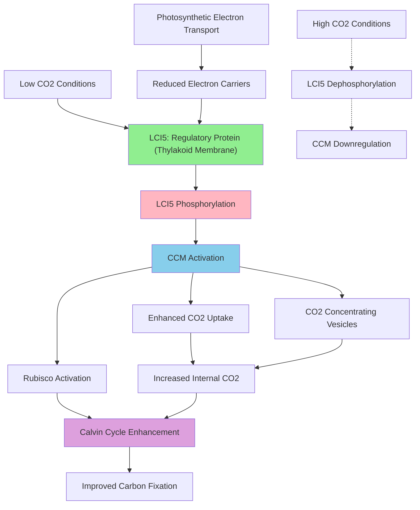

# Pathway Summary for LCI5

## Overview
LCI5 (Low-CO2-inducible protein 5) is a chloroplast thylakoid-associated phosphoprotein that serves as a key regulatory component of the carbon concentrating mechanism (CCM) in Chlamydomonas reinhardtii [PMID:16572472]. The protein undergoes redox-dependent phosphorylation exclusively under low CO2 conditions and likely functions as a sensor and regulator to optimize photosynthetic efficiency during carbon limitation [PMID:16572472].

## Carbon Concentrating Mechanism (CCM) Pathway
LCI5 functions within the sophisticated CCM that allows Chlamydomonas to efficiently capture and concentrate CO2 for photosynthesis under carbon-limiting conditions [file:CHLRE/LCI5/LCI5-deep-research.md]. The protein is co-expressed with core CCM components including Rubisco and other carbon fixation machinery, suggesting it plays an integral role in coordinating the cellular response to carbon availability [file:CHLRE/LCI5/LCI5-deep-research.md]. Through its phosphorylation state, LCI5 likely serves as a molecular switch that modulates CCM activity based on carbon availability and photosynthetic electron transport status.

## Redox-Dependent Phosphorylation Pathway
LCI5 undergoes specific phosphorylation that is strictly dependent on both low CO2 conditions and the reduction state of photosynthetic electron carriers [PMID:16572472]. This dual requirement suggests that LCI5 acts as a molecular integrator, sensing both carbon availability and photosynthetic activity to coordinate appropriate cellular responses. The phosphorylation occurs on the stromal side of thylakoid membranes, positioning LCI5 to interact with both the photosynthetic electron transport chain and carbon fixation machinery [PMID:16572472].

## Photosynthetic Regulation Pathway
Through its position at the thylakoid membrane and its redox-sensitive phosphorylation, LCI5 likely serves as a regulatory hub linking photosynthetic electron transport with carbon utilization [PMID:16572472]. The protein's response to electron carrier reduction states allows it to sense photosynthetic activity and potentially modulate CCM function accordingly. This regulatory mechanism ensures that carbon concentration efforts are coordinated with the energy and reducing power available from photosynthetic light reactions.

## Pathway Diagram

## Molecular Mechanism and Integration
LCI5 functions as a regulatory phosphoprotein that integrates signals from both carbon availability and photosynthetic electron transport status [PMID:16572472]. The protein's phosphorylation state likely controls its interactions with other CCM components, potentially acting as a regulatory switch that activates or modulates carbon concentrating machinery. Its localization to the stromal side of thylakoid membranes positions it optimally to sense both the redox state of photosynthetic electron carriers and the stromal CO2 concentration.

## Cellular Response to Carbon Limitation
Under low CO2 conditions, LCI5 phosphorylation contributes to a coordinated cellular response that includes activation of the CCM [PMID:16572472]. This response likely involves changes in gene expression, enzyme activity, and cellular organization to maximize CO2 capture and delivery to Rubisco. The protein's co-expression with CCM components suggests it may also play structural or organizational roles in assembling carbon concentrating machinery [file:CHLRE/LCI5/LCI5-deep-research.md].

## Evolutionary and Ecological Significance
LCI5 represents an evolutionary adaptation that allows Chlamydomonas to thrive in aquatic environments where CO2 availability can be limiting. The protein's sophisticated regulatory mechanism, combining CO2 sensing with photosynthetic status monitoring, reflects the selective pressure to optimize carbon fixation efficiency under variable environmental conditions. This system allows the organism to dynamically adjust its metabolic strategy based on resource availability and cellular energy status.

## Cross-talk with Other Pathways
LCI5 serves as a critical interface between photosynthetic electron transport and carbon metabolism pathways. Its redox-dependent regulation links the protein directly to the overall energy status of the cell, ensuring that carbon concentration efforts are coordinated with available reducing power and ATP. The protein likely influences multiple downstream pathways including gene expression regulation, metabolic flux control, and possibly cell cycle regulation in response to carbon availability.