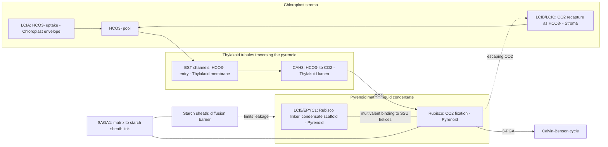
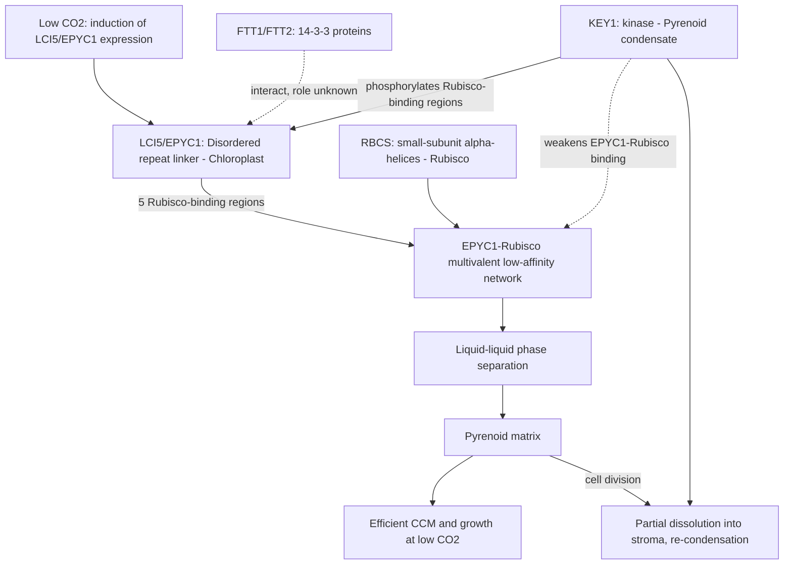

# Pathway Summary for LCI5 (EPYC1)

## Overview

LCI5 (UniProt Q94ET8; locus Cre10.g436550) is the same protein as **EPYC1, Essential Pyrenoid Component 1**: "a protein called Essential Pyrenoid Component 1 (EPYC1; also known as LCI5) links Rubisco holoenzymes together to form the pyrenoid matrix" [PMID:28938114]. It is a disordered repeat protein that cross-links Rubisco into the liquid-like pyrenoid matrix of the *Chlamydomonas reinhardtii* chloroplast [PMID:27166422, PMID:30498228, PMID:33230314]. This matrix is the CO2-fixing core of the pyrenoid-based CO2-concentrating mechanism (PCCM) [PMID:35596080, PMID:35961043, PMID:33421532].

EPYC1 does not transport inorganic carbon, carry out any carbonic anhydrase step, or catalyse carboxylation. In the PCCM its job is structural: it gathers Rubisco into one condensate, the place where CO2 released from the thylakoid tubules is fixed. Its activity is a **molecular condensate scaffold activity** (multivalent Rubisco linker), and the process it takes part in is the **assembly of the pyrenoid matrix** as a membraneless organelle. The pyrenoid-localised kinase KEY1 phosphorylates EPYC1, and this phosphorylation controls the size, number and dissolution of the condensate [PMID:41845050].

## 1. Rubisco condensation: the core activity of EPYC1

- **Identity and abundance.** EPYC1 was found in the low-CO2 pyrenoid proteome at an abundance close to that of Rubisco. It was "previously identified as a low-CO 2 –induced nuclear-encoded protein (LCI5; Cre10.g436550)" [PMID:27166422]. Its stoichiometry "was ∼1:6 with rbcL and ∼1:1 with RBCS" [PMID:27166422].
- **Multivalent binding to the Rubisco small subunit.** "EPYC1 consists of five evenly spaced Rubisco-binding regions that share sequence similarity" [PMID:33230314]. These regions "bind to the Rubisco small subunit α-helices via salt-bridge interactions and a hydrophobic interface, enabling the condensation of Rubisco into the phase separated matrix" [PMID:33230314]. Each repeat adds to the binding strength: "each repeat has an additive effect on SSU interaction" [PMID:31504763]. The binding site explains an earlier result that the SSU helices decide whether a pyrenoid forms: "higher plant-like helices knock out the pyrenoid, whereas native algal helices establish a pyrenoid" [PMID:23112177].
- **Necessary and sufficient for phase separation.** "Rubisco and EPYC1 are the two components necessary and sufficient to bring about a liquid-liquid phase separation (LLPS) that recapitulates the liquid-like behavior reported for the microalgal pyrenoid" [PMID:30498228]. The resulting matrix is a heterotypic network: "EPYC1 and Rubisco form a codependent multivalent network of specific low-affinity bonds, giving the matrix liquid-like properties" [PMID:33230314]. "Interface mutations disrupt binding, phase separation and pyrenoid formation" [PMID:33230314].
- **Rubisco stays catalytically unchanged.** "Rubisco enzyme activity (indicated as 3PG production) is unaffected by droplet formation" [PMID:30498228]. EPYC1 is therefore an organiser of Rubisco, not an activator of it. In reconstituted synthetic pyrenoids, extant and ancestral EPYC1 sequences "induce phase separation of Rubisco into synthetic pyrenoids with functional CCMs" [PMID:42601498].
- **Dilute-phase complexes.** Outside the condensate, EPYC1 and Rubisco also form small complexes: "The majority of these complexes contain exactly one Rubisco molecule" [PMID:36611062].
- **Transferable to plants.** "Expression of EPYC1 in the Arabidopsis line S2Cr results in condensate formation" [PMID:33298923]. This makes EPYC1 a central part of plans to engineer a PCCM into C3 crops [PMID:35961043].

## 2. Pyrenoid assembly and loss-of-function phenotype

- EPYC1 and RBCS colocalise in the pyrenoid: "Venus-tagged EPYC1 showed clear colocalization with mCherry-tagged RBCS in the pyrenoid" [PMID:27166422].
- Without EPYC1, Rubisco is not packed into the pyrenoid and the PCCM fails. "the epyc1 mutant showed defective photoautotrophic growth in low CO 2 , which was rescued by high CO 2 and by reintroducing the EPYC1 gene" [PMID:27166422]. "EPYC1 is required for Rubisco localization to the pyrenoid not only at low CO 2 , but also at high CO 2" [PMID:27166422]. The mutant "had smaller pyrenoids than WT at both low and high CO 2" [PMID:27166422].
- The tubule and starch-sheath subcompartments can still assemble without EPYC1, but the matrix is lost: "in a mutant lacking EPYC1, a pyrenoid-like structure still assembles around the tubules, containing some Rubisco enclosed by a starch sheath, although the canonical matrix is absent" [PMID:33177094].
- **Linking the matrix to the other subcompartments.** EPYC1 shares a Rubisco-binding motif with pyrenoid proteins that sit at the tubule and starch-sheath interfaces: "SAGA1, SAGA2, RBMP1, RBMP2, EPYC1, and CSP41A share a common protein motif" [PMID:33177094]. Such shared motifs are thought to recruit these proteins to the Rubisco matrix and to connect the pyrenoid's three subcompartments [PMID:33177094]. EPYC1 itself only binds Rubisco: "EPYC1 appears to interact exclusively with the small subunit of Rubisco (SSU) via Rubisco binding motifs (RBMs) that are common to several other pyrenoid components in Chlamydomonas" [PMID:35961043].
- The spatial interactome places EPYC1 in the matrix as "a Rubisco linker protein" and finds that "EPYC1 interacts with two 14-3-3 proteins FTT1 and FTT2" [PMID:28938113].

## 3. Context: EPYC1 within the pyrenoid-based CO2-concentrating mechanism

The PCCM runs as a series of steps around the EPYC1-Rubisco matrix. EPYC1 is part of the CO2-fixing compartment and not of the carbon-delivery or recapture steps:

1. **Inorganic carbon accumulation in the stroma.** Inorganic carbon builds up in the stroma as HCO3−. This happens "either via conversion of CO2 to HCO3− by the putative stromal carbonic anhydrase LCIB/LCIC ... or via direct transport across the chloroplast membrane by the poorly characterized HCO3− transporter LCIA" [PMID:35596080]. Bicarbonate then enters the thylakoid lumen through bestrophin-like channels (see `modules/pyrenoid_ccm.yaml`).
2. **CO2 release inside the matrix.** "In the acidic thylakoid lumen, a carbonic anhydrase CAH3 converts HCO3− into CO2, which diffuses into the pyrenoid matrix where the CO2-fixing enzyme Rubisco (Rbc) is localized" [PMID:35596080]. CAH3 sits "in the lumen within the pyrenoid" and the CO2 "diffuses into the surrounding Rubisco-EPYC1 matrix" [PMID:35961043].
3. **Fixation by condensed Rubisco.** The CO2 is fixed by Rubisco held in the matrix by EPYC1 [PMID:27166422, PMID:30498228].
4. **Limiting leakage.** "CO2 leakage out of the matrix and the chloroplast can be impeded by potential diffusion barriers—a starch sheath and stacks of thylakoids—and by conversion to HCO3− by a CO2-recapturing complex LCIB/LCIC" [PMID:35596080]. The starch sheath is linked to the matrix through Rubisco-binding-motif proteins such as SAGA1 [PMID:33177094].

## 4. Regulation: phosphorylation by KEY1 and dynamics during the cell cycle

- **Phosphorylation in the repeats.** Under CO2 limitation the protein is phosphorylated in its tandem repeats: "The phosphorylation sites were mapped in the tandem repeats of Lci5 ensuring phosphorylation of four serine and three threonine residues in the protein" [PMID:16572472]. That 2006 fractionation study placed Lci5 at the stromal surface of thylakoid membranes [PMID:16572472]. Live imaging and pyrenoid proteomics later placed EPYC1 in the pyrenoid matrix, which is crossed by thylakoid-derived tubules [PMID:27166422, PMID:33177094]. The earlier location is best read as co-fractionation (see `LCI5-notes.md`).
- **KEY1 is the main kinase.** "these results establish that KEY1 is the primary kinase of EPYC1 and suggest that KEY1 preferentially phosphorylates the Rubisco-binding regions of EPYC1" [PMID:41845050]. KEY1 "localizes to the condensates and promotes their dissolution by disrupting interactions between their core constituents, the CO2-fixing enzyme Rubisco and its linker protein EPYC1, through EPYC1 phosphorylation" [PMID:41845050]. Further, "KEY1 phosphorylation of EPYC1 directly disrupts the binding between Rubisco and EPYC1 to favour condensate dissolution" [PMID:41845050].
- **Dissolution and re-condensation during division.** "A portion of the RbcS1-Venus and EPYC1-Venus signals rapidly dispersed from the pyrenoid matrix into the stroma for ~20 minutes near the end of chloroplast and pyrenoid division" [PMID:28938114]. "During cell division, the size, number, dissolution and re-condensation of pyrenoid condensates are highly dynamic and seem tightly regulated" [PMID:41845050]. A KEY1 to EPYC1 phosphorylation flux sets these properties [PMID:41845050].

These data show that the low-CO2 phosphorylation reported in 2006 regulates EPYC1's scaffold activity. They do not point to a separate signalling or CO2-sensing role.

## Pathway Diagrams

### EPYC1 in the pyrenoid-based CCM

```mermaid
graph LR
    subgraph Stroma["Chloroplast stroma"]
        LCIA["LCIA: HCO3- uptake - Chloroplast envelope"]
        LCIB["LCIB/LCIC: CO2 recapture as HCO3- - Stroma"]
        HCO3["HCO3- pool"]
    end
    subgraph Tubules["Thylakoid tubules traversing the pyrenoid"]
        BST["BST channels: HCO3- entry - Thylakoid membrane"]
        CAH3["CAH3: HCO3- to CO2 - Thylakoid lumen"]
    end
    subgraph Pyrenoid["Pyrenoid matrix - liquid condensate"]
        EPYC1["LCI5/EPYC1: Rubisco linker, condensate scaffold - Pyrenoid"]
        RBC["Rubisco: CO2 fixation - Pyrenoid"]
    end
    STARCH["Starch sheath: diffusion barrier"]
    SAGA1["SAGA1: matrix to starch sheath link"]

    LCIA --> HCO3
    LCIB --> HCO3
    HCO3 --> BST
    BST --> CAH3
    CAH3 -->|CO2| RBC
    EPYC1 ---|multivalent binding to SSU helices| RBC
    RBC -->|3-PGA| CBB["Calvin-Benson cycle"]
    RBC -.->|escaping CO2| LCIB
    SAGA1 --- RBC
    SAGA1 --- STARCH
    STARCH -.->|limits leakage| Pyrenoid
```

### Assembly and regulation of the EPYC1-Rubisco condensate

```mermaid
graph TD
    LOWCO2["Low CO2: induction of LCI5/EPYC1 expression"] --> EPYC1["LCI5/EPYC1: Disordered repeat linker - Chloroplast"]
    EPYC1 -->|5 Rubisco-binding regions| BIND["EPYC1-Rubisco multivalent low-affinity network"]
    RBCS["RBCS: small-subunit alpha-helices - Rubisco"] --> BIND
    BIND --> LLPS["Liquid-liquid phase separation"]
    LLPS --> MATRIX["Pyrenoid matrix"]
    MATRIX --> CCM["Efficient CCM and growth at low CO2"]
    KEY1["KEY1: kinase - Pyrenoid condensate"] -->|phosphorylates Rubisco-binding regions| EPYC1
    KEY1 -.->|weakens EPYC1-Rubisco binding| BIND
    MATRIX -->|cell division| DISS["Partial dissolution into stroma, re-condensation"]
    KEY1 --> DISS
    FTT["FTT1/FTT2: 14-3-3 proteins"] -.->|interact, role unknown| EPYC1
```

## Ontology note

GO has no "pyrenoid assembly" biological process term. The closest term is GO:0140694 *membraneless organelle assembly*, paired with GO:0140693 *molecular condensate scaffold activity* and the location GO:1990732 *pyrenoid* (see `LCI5-ai-review.yaml`). EPYC1 should not be annotated to carbon fixation or to Rubisco activator activity. Rubisco carries out the carboxylation, and condensation does not change its activity [PMID:30498228].
