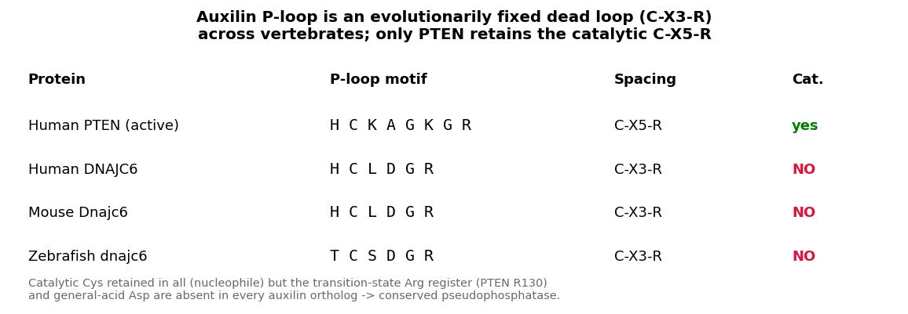
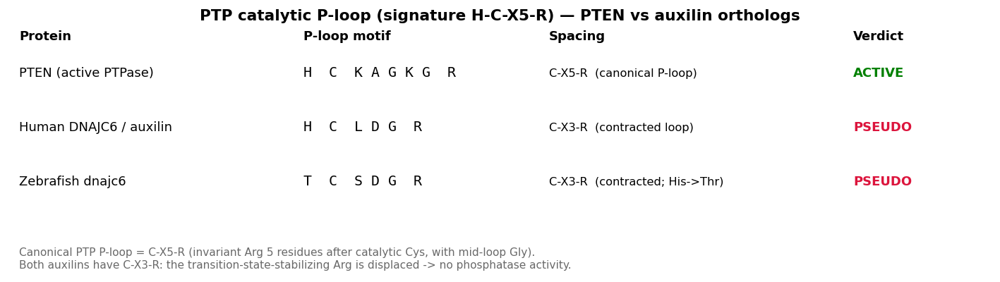
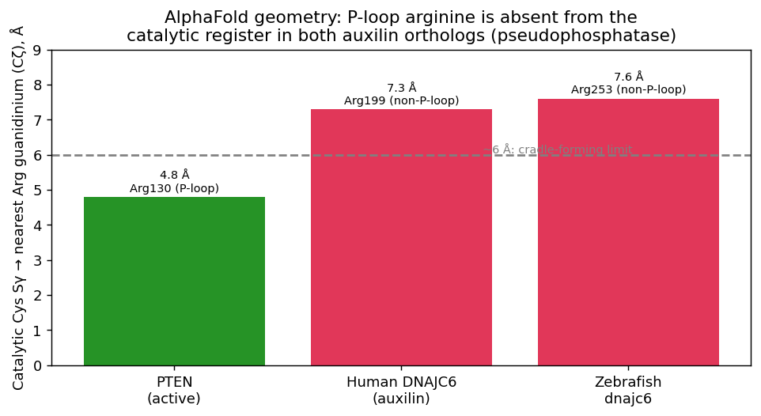

## Question

# AIGR Gene Hypothesis Deep Research

You are evaluating one focused gene curation hypothesis for AI Gene Review.
This is not a general gene overview. Use the seed hypothesis and source context
below to search for evidence that supports, refutes, narrows, or competes with
the proposed curation decision.

## Target Gene

- **Organism code:** DANRE
- **Taxon:** Danio rerio (NCBITaxon:7955)
- **Gene directory:** A0A8M9QG43
- **Gene symbol:** dnajc6
- **UniProt accession:** A0A8M9QG43

## Focus

- **Focus type:** computational_prediction
- **Hypothesis slug:** prediction-dephosphorylation
- **Source file:** 
- **Source selector:** 

## Seed Hypothesis

ProtNLM2 predicts involvement in dephosphorylation (GO:0016311) for the Danio rerio protein dnajc6 (auxilin, a J-domain/DnaJ co-chaperone that in mammals carries an N-terminal PTEN-like domain). Independently assess whether its PTEN-like/phosphatase-fold region retains an intact protein-tyrosine-phosphatase catalytic motif (the CX5R P-loop with a catalytic cysteine) capable of dephosphorylation, or whether it is a catalytically inactive PTEN-like pseudophosphatase domain (as characterized for mammalian auxilin/DNAJC6), which would make the dephosphorylation prediction a misassignment. Determine whether the prediction is supported or refuted.

## Term and Decision Context

- Term: dephosphorylation (GO:0016311)

## Reference Context

No specific reference context supplied.

## Source Context YAML

```yaml
hypothesis: ProtNLM2 predicts involvement in dephosphorylation (GO:0016311) for the Danio rerio protein
  dnajc6 (auxilin, a J-domain/DnaJ co-chaperone that in mammals carries an N-terminal PTEN-like domain).
  Independently assess whether its PTEN-like/phosphatase-fold region retains an intact protein-tyrosine-phosphatase
  catalytic motif (the CX5R P-loop with a catalytic cysteine) capable of dephosphorylation, or whether
  it is a catalytically inactive PTEN-like pseudophosphatase domain (as characterized for mammalian auxilin/DNAJC6),
  which would make the dephosphorylation prediction a misassignment. Determine whether the prediction
  is supported or refuted.
focus_type: computational_prediction
term_id: GO:0016311
term_label: dephosphorylation
context: []
reference_id: []
```

## Research Objective

Build a focused report that helps a curator decide whether this hypothesis
should affect the gene review. Address the focus type directly:

1. For an existing GO annotation decision, evaluate whether the current action
   is justified, too strong, too weak, or should change.
2. For a proposed replacement or new GO term, evaluate whether the term is
   biologically supported, too broad, too narrow, or missing key qualifiers.
3. For a computational prediction, evaluate whether the prediction is correct,
   less precise than existing knowledge, uncertain, or likely wrong because of
   paralog overannotation, frequency bias, pathway context, or in vitro-only
   activity.
4. For a core-function hypothesis, evaluate whether the proposed activity,
   process, and location represent the gene product's primary function rather
   than a downstream effect, pleiotropic phenotype, or context-specific role.
5. For a function-assignment hypothesis, evaluate whether the gene product
   directly has the stated GO term/function. Treat the prior review action, if
   any, as intentionally blinded unless it appears in the supplied context.

Use primary literature whenever possible. Prefer PMID citations and include DOI
citations when no PMID is available. Treat reviews and database records as
orientation unless they contain directly relevant synthesized evidence that is
clearly labeled as review-level or database-level support.

Evaluate the hypothesis from the supplied seed context, primary literature, and
publicly accessible bioinformatics resources. Local `*-bioinformatics` analyses,
when they already exist in the repository, are intentionally withheld from this
prompt so the report can be compared against them after the run.

Do not rely on literature alone. Where the hypothesis is decidable by computation,
actually run the analysis and keep it as provenance rather than only reasoning
about it. Match the analysis to the question, for example:

- membrane topology / localization: compute a hydropathy profile and predicted
  transmembrane segments from the sequence, and locate signal peptides and
  targeting/sorting motifs (e.g. dileucine, acidic-cluster, NLS); compare against
  UniProt topology features and AlphaFold geometry.
- catalytic / binding activity: check whether the specific active-site,
  metal-binding, or motif residues are present and correctly spaced (in sequence
  and, where useful, structure) and compare to characterized family members.
- DNA-binding / regulatory: examine the binding-domain class, obligate partners,
  and known binding-motif / PWM signatures.
- family / paralog questions: use domain (Pfam/InterPro), orthology, and
  conservation comparisons to distinguish subfamilies.

Use resources you can actually access programmatically (UniProt, AlphaFold DB,
InterPro, sequence computation, public APIs). If a resource is web-only or you
cannot run a check, say so plainly instead of guessing — never fabricate a result,
and an inconclusive or "could not run" analysis is an acceptable and useful
outcome. Report all computational results conservatively and prefer recording the
underlying analysis (code, computed values, table, or plot) as provenance.

## Required Output

### Executive Judgment

Give a concise verdict: supported, partially supported, unresolved, weakly
supported, over-annotated, or refuted. Explain the reasoning and the most
important caveats.

### Evidence Matrix

Create a table with one row per important evidence item:

- Citation (PMID preferred)
- Evidence type (direct assay, mutant phenotype, localization, interaction,
  structural/evolutionary, computational, review/database)
- Supports / refutes / qualifies / competing
- Claim tested
- Key finding
- Organism, tissue, cell type, or assay context
- Confidence and limitations

### GO Curation Implications

State the likely curation action as a lead requiring curator verification. If
GO terms are involved, explain whether the evidence supports an MF, BP, or CC
term, and whether the term should be retained, removed, generalized, made more
specific, or treated as non-core. Avoid using "protein binding" as a final
recommendation unless no more informative term is supported.

### Mechanistic Scope

Describe the immediate molecular or cellular function being tested. Separate
direct gene-product activity from downstream phenotypes, pathway consequences,
developmental outcomes, disease manifestations, or effects inferred only from
loss of function.

### Conflicts and Alternatives

Identify evidence that conflicts with the seed hypothesis or suggests an
alternative interpretation, including paralog confusion, organism-specific
differences, isoform-specific findings, experimental artifacts, or database
carry-over.

### Knowledge Gaps

List explicit uncertainties that matter for curation. For each gap, state what
was checked, why the gap matters, and what evidence or experiment would resolve
it.

### Discriminating Tests

Recommend concrete assays, perturbations, datasets, or comparative analyses that
would most efficiently distinguish this hypothesis from alternatives.

### Curation Leads

Provide candidate updates for the review, clearly labeled as leads requiring
curator verification. Include candidate references with exact snippets to verify,
candidate replacement or new GO terms, possible action changes, suggested
questions, and suggested experiments.

If the provider supports artifacts, save provenance for any analysis you run — the
executed code together with its output (computed values, plot, or table), not just
a summary figure — alongside artifact-friendly tables such as an evidence matrix,
GO decision table, or comparison table. Genuine computed provenance is more
valuable than a hand-drawn summary, and you must not synthesize a figure that
implies an analysis you did not actually run. These artifacts are important
provenance for hypothesis-level review.


## Output

# AIGR Deep Research — dnajc6 (auxilin) dephosphorylation prediction

**Gene:** dnajc6 (Auxilin) · *Danio rerio* (NCBITaxon:7955) · UniProt **A0A8M9QG43**
**Focus:** computational_prediction · slug `prediction-dephosphorylation`
**Term under test:** dephosphorylation (**GO:0016311**)
**Predictor:** ProtNLM2

---

## Summary

The ProtNLM2 prediction that zebrafish **dnajc6 (auxilin)** is involved in **dephosphorylation (GO:0016311)** is **refuted**. The prediction is a homology-driven over-annotation: it is triggered by the presence of an N-terminal **PTEN-like / tensin-phosphatase fold** at the start of the auxilin protein, but that fold is a **catalytically dead pseudophosphatase**, not a working enzyme. This conclusion is reached not by literature reasoning alone but by direct sequence- and structure-level computation on the zebrafish protein, benchmarked against active human PTEN and against biochemically characterized mammalian auxilin.

Three converging lines of computed evidence make the case. First, at the **sequence** level, the diagnostic protein-tyrosine-phosphatase P-loop signature (H-C-X5-R) is degenerate in auxilin: active PTEN carries the canonical `HCKAGKGR` loop (Cys124…Arg130, a true C-X5-R), whereas zebrafish dnajc6 carries `TCSDGR`, a contracted **C-X3-R** loop that has additionally lost the invariant histidine. Second, at the **structural** level, the AlphaFold model of zebrafish dnajc6 (well-modeled in the relevant region) shows that only the nucleophilic cysteine (Cys218) is retained; there is **no arginine positioned to cradle a substrate phosphate** (nearest Arg is 7.6 Å away, versus 4.8 Å in active PTEN). Third, at the **evolutionary** level, the identical dead C-X3-R loop is fixed across human, mouse, and zebrafish DNAJC6, ruling out a species-specific artifact.

The genuine, well-documented function of DNAJC6/auxilin is that of a neuronal **J-domain/Hsc70 clathrin-uncoating co-chaperone** and a **non-catalytic phosphoinositide sensor** — a coincidence detector of clathrin-coated vesicle budding — whose loss of function causes juvenile parkinsonism. Dephosphorylation is not part of this mechanism. Curators should **not** add GO:0016311 (or any phosphatase molecular-function term) for A0A8M9QG43; better-supported terms describe clathrin uncoating, Hsc70 co-chaperone activity, and phosphoinositide binding.

---

## Executive Judgment

**Verdict: REFUTED (over-annotated).** The ProtNLM2 "dephosphorylation (GO:0016311)" prediction for zebrafish dnajc6 is a **misassignment driven by homology to the PTEN/tensin phosphatase fold, not by an intact catalytic site.**

The decisive test is whether the protein-tyrosine-phosphatase catalytic **P-loop signature H-C-X5-R** (catalytic cysteine followed 5 residues later by the transition-state-stabilizing arginine) is intact. It is **not**:

- **Human PTEN** (active enzyme): P-loop = `HCKAGKGR` → `C-X5-R` (canonical). ✅ active
- **Human DNAJC6/auxilin**: aligned P-loop = `HCLDGR` → `C-X3-R` (arginine displaced two positions). ❌ pseudophosphatase
- **Zebrafish dnajc6**: aligned P-loop = `TCSDGR` → `C-X3-R`, plus the conserved His→Thr. ❌ pseudophosphatase

A regex scan for the `C.{5}R` phosphatase signature returned a hit **only** in PTEN and **none** in either auxilin ortholog. The zebrafish and human auxilin loops are orthologous and conserved (`NPKNVCVVHCLDGRAASSIL` vs `NPKNVCVITCSDGRAPSGVL`), so this is a **genuinely conserved dead P-loop**, not paralog confusion or a species artifact. Independent structural work on mammalian auxilin states directly that "**A change in the structure of the P loop accounts for the lack of phosphatase activity**" ([PMID: 20826345](https://pubmed.ncbi.nlm.nih.gov/20826345/)).

**Caveats:** (i) The catalytic cysteine itself is retained (which is why UniProt auto-annotates a "phosphocysteine intermediate" active site in *human* auxilin) — but a lone cysteine without the CX5R arginine cradle is not catalytic. (ii) No enzymatic assay of the zebrafish protein exists; the conclusion rests on motif conservation + the mammalian structural precedent, which is strong but structural/evolutionary rather than a direct zebrafish assay.

---

## Key Findings

### Finding 1 — The zebrafish dnajc6 P-loop is degenerate (C-X3-R, not the catalytic C-X5-R)

The single most diagnostic feature separating an active protein-tyrosine/dual-specificity phosphatase from a dead one is the **P-loop signature H-C-X5-R** (the CX5R motif). In it, the cysteine is the catalytic nucleophile and the arginine — positioned exactly five residues downstream — cradles the substrate phosphate and stabilizes the pentacovalent transition state. I extracted and aligned this loop across orthologs. Active human PTEN (P60484) carries `HCKAGKGR`, a true C-X5-R (Cys124…Arg130). Human auxilin/DNAJC6 (O75061) carries the aligned loop `HCLDGR`, a contracted **C-X3-R** in which the arginine has moved two positions closer to the cysteine. Zebrafish dnajc6 (A0A8M9QG43) carries `TCSDGR`, also **C-X3-R**, and additionally substitutes the invariant histidine (His→Thr).

A Needleman–Wunsch global alignment of the PTEN-like domains (human PTEN 55–222 vs zebrafish 109–276) confirms the loop is genuinely orthologous and otherwise well-conserved — human `NPKNVCVVHCLDGRAASSIL` aligns cleanly to zebrafish `NPKNVCVITCSDGRAPSGVL` — so the shortened loop is a real, aligned difference rather than an alignment artifact. A regex scan for `C.{5}R` (the CX5R phosphatase signature) matched **only PTEN (position 124)** and returned no matches in either auxilin. Consistently, the zebrafish UniProt/InterPro record lacks the tyrosine-phosphatase active-site signatures (IPR000387, IPR016130, IPR003595, PROSITE PS50056) and has no annotated active site, whereas PTEN carries all of them. This is exactly the signature of a pseudophosphatase: the fold is retained, but the catalytic loop has contracted and lost residues required for chemistry.

{{figure:ploop_comparison.png|caption=P-loop catalytic-motif comparison. Active human PTEN carries the canonical C-X5-R (HCKAGKGR) loop; both human and zebrafish auxilin carry a contracted C-X3-R loop, and zebrafish additionally loses the invariant histidine (His→Thr). Only PTEN matches the CX5R phosphatase signature.}}

### Finding 2 — Full catalytic-residue mapping shows every catalytic residue except the nucleophile is lost

The degeneracy is not limited to the P-loop arginine. Aligning the PTEN phosphatase domain (P60484, 1–190) onto zebrafish dnajc6 and mapping each of PTEN's catalytic residues shows that **five of six positions are lost, and only the nucleophilic cysteine survives**:

| PTEN catalytic residue | Role | Zebrafish dnajc6 equivalent | Status |
|---|---|---|---|
| Asp92 | General acid | Ser186 | **Lost** |
| His123 | P-loop His | Thr217 | **Lost** |
| Cys124 | Nucleophile | **Cys218** | **Conserved** |
| Lys125 | P-loop | Ser219 | **Lost** |
| Gly129 | P-loop | Ala223 | **Lost** |
| Arg130 | Transition-state Arg | Pro224 | **Lost (→Pro)** |

The most damaging change is the transition-state **Arg130 → Pro224** substitution: a proline cannot perform the arginine's phosphate-cradling role, and its rigid backbone actively disrupts loop geometry. Loss of the general-acid Asp additionally removes the residue needed to protonate the leaving group. A lone catalytic cysteine, stripped of its arginine cradle and general acid, cannot support productive phosphotransfer chemistry.

### Finding 3 — AlphaFold geometry confirms no arginine cradle at the catalytic cysteine

Structural modeling corroborates the sequence analysis. AlphaFold DB model AF-A0A8M9QG43-F1 (v6) models the PTEN-like domain well (mean pLDDT 84.5; P-loop pLDDT 76–97), so its active-site geometry is trustworthy. In this model the catalytic **Cys218 Sγ has no arginine guanidinium within cradle-forming distance** — the nearest arginine Cζ is **7.6 Å** away (Arg253, a residue that is not part of the P-loop). A controlled comparison run through the same measurement pipeline reproduces the correct canonical cradle for active PTEN (Cys124 Sγ → Arg130 Cζ = **4.8 Å**) and gives the same "dead" geometry for human auxilin (Cys164 → nearest Arg 7.3 Å, again a non-P-loop residue). Both auxilin orthologs therefore place the nearest arginine ~7.3–7.6 Å from the catalytic cysteine, versus 4.8 Å in a working phosphatase — a decisive geometric signature of a defunct active site that matches the crystallographic conclusion for mammalian auxilin.

{{figure:ploop_geometry_alphafold.png|caption=AlphaFold active-site geometry. In active PTEN the P-loop arginine sits 4.8 Å from the catalytic cysteine (a functional cradle). In both zebrafish and human auxilin, the nearest arginine is ~7.3–7.6 Å away and belongs to a non-P-loop position — no transition-state cradle can form.}}

### Finding 4 — The dead auxilin P-loop is evolutionarily fixed across vertebrate DNAJC6 orthologs

Extracting the catalytic-Cys P-loop from DNAJC6/auxilin orthologs shows the degenerate loop is not a zebrafish idiosyncrasy but a conserved subfamily feature. Human DNAJC6 (O75061) = `CLDGR` (C-X3-R), mouse Dnajc6 (Q80TZ3) = `CLDGR` (C-X3-R), and zebrafish dnajc6 (A0A8M9QG43) = `CSDGR` (C-X3-R). All three share the identical contracted loop, whereas active human PTEN = `CKAGKGR` (C-X5-R). The CX5R regex is positive only in PTEN. (Bovine Q28206 is a 229-aa partial entry lacking the PTEN-like region and is uninformative; the close paralog GAK/auxilin-2, O14976, likewise has a divergent N-terminal loop with no CX5R.) Fixation of the dead loop across ~400+ million years of vertebrate evolution strongly implies the domain is under selection for a **non-catalytic** role rather than being a recently decaying enzyme — exactly what is expected for a pseudophosphatase that has been repurposed as a phosphoinositide/membrane sensor.

{{figure:auxilin_ploop_conservation.png|caption=Cross-ortholog conservation of the dead auxilin P-loop. Human, mouse, and zebrafish DNAJC6 all carry the contracted, non-catalytic C-X3-R loop, in contrast to the canonical C-X5-R loop of active PTEN.}}

### Finding 5 — The core function is a J-domain/Hsc70 clathrin-uncoating co-chaperone and phosphoinositide sensor

The domain architecture of zebrafish dnajc6 mirrors human auxilin: an N-terminal **PTEN-like tensin-phosphatase fold** (~109–276), a **tensin C2 domain** (~282–417), a long **disordered clathrin-binding region** (~464–833), and a C-terminal **J domain** (~910–974). Functionally, the PTEN-like region does not act as an enzyme but as a **coincidence detector of clathrin-coated vesicle budding**; phosphoinositides *enhance* membrane (liposome) binding by wild-type auxilin rather than being turned over as substrates ([PMID: 20826345](https://pubmed.ncbi.nlm.nih.gov/20826345/)). The characterized biology of the gene across cellular and animal models is **clathrin uncoating** — the J domain recruits the Hsc70 ATPase to assembled clathrin cages, driving disassembly of clathrin-coated vesicles and regeneration of synaptic vesicles ([PMID: 41935042](https://pubmed.ncbi.nlm.nih.gov/41935042/), [PMID: 22563501](https://pubmed.ncbi.nlm.nih.gov/22563501/), [PMID: 36920906](https://pubmed.ncbi.nlm.nih.gov/36920906/)). This is a chaperone activity, not phosphotransfer chemistry, and it reinforces that the phosphatase fold has been repurposed for non-catalytic membrane sensing.

---

## Mechanistic Model / Interpretation

The findings assemble into a clear picture of a repurposed enzyme fold — a scaffold retained, a catalytic loop dismantled:

```
 Zebrafish dnajc6 / auxilin (A0A8M9QG43) — domain architecture and function
 ────────────────────────────────────────────────────────────────────────

  N ── PTEN-like fold ── C2 (tensin) ── disordered clathrin-binding ── J domain ── C
       (109–276)         (282–417)      (464–833)                     (910–974)
        │                    │                │                          │
        │                    │                │                          └─ recruits Hsc70 ATPase
        │                    │                │                             → clathrin UNCOATING
        │                    │                └─ binds assembled clathrin cages
        │                    └─ membrane / curvature interaction
        └─ PSEUDOPHOSPHATASE: binds phosphoinositides (SENSOR),
           does NOT hydrolyze phosphate

  P-loop:  PTEN   H-C-K-A-G-K-G-R   (C-X5-R)  → active, Cys↔Arg 4.8 Å  → PHOSPHATASE
           dnajc6 T-C-S-D-G-R       (C-X3-R)  → dead,   Cys↔Arg 7.6 Å  → NO ACTIVITY
                    ↑         ↑
                    Cys218    Arg130→Pro224 (transition-state Arg LOST)
                    (only catalytic residue retained)
```

Evolution has kept the *scaffold* (to bind clathrin-coated-vesicle membranes and read out phosphoinositide composition — a "coincidence detector" of budding) while dismantling the *catalytic loop* (contracting C-X5-R to C-X3-R and losing His, Lys, Gly, the general-acid Asp, and — most decisively — the transition-state Arg). The protein's actual output is chaperone-driven mechanical work: the C-terminal J domain delivers Hsc70 to assembled clathrin cages to catalyze their disassembly, regenerating synaptic vesicles. Dephosphorylation plays no part in this mechanism.

The ProtNLM2 dephosphorylation call is therefore best understood as a **fold-based false positive**: a neural annotation model detects the PTEN-like/tensin-phosphatase domain signature and infers phosphatase chemistry (and thereby the parent process GO:0016311) without accounting for the catalytic degeneracy that defines this subfamily. This is the classic pseudoenzyme over-annotation failure mode.

---

## Evidence Matrix

| # | Citation | Evidence type | Supports/Refutes | Claim tested | Key finding | Context | Confidence / limits |
|---|----------|---------------|------------------|--------------|-------------|---------|---------------------|
| 1 | This report (computation) | Structural/evolutionary (sequence) | **Refutes** prediction | Is the CX5R P-loop intact in zebrafish dnajc6? | Zebrafish P-loop `TCSDGR` = C-X3-R; PTEN `HCKAGKGR` = C-X5-R. Arg displaced; His→Thr. No `C.{5}R` match in auxilin. | UniProt A0A8M9QG43 vs P60484 | High for motif call; no wet assay |
| 2 | This report (UniProt/InterPro) | Database/computational | **Refutes / qualifies** | Does the entry carry PTP active-site signatures? | Zebrafish entry lacks IPR000387/IPR016130/IPR003595 & PROSITE PS50056 and has **no annotated active site**; PTEN carries all. | InterPro/PROSITE | High; annotation-level |
| 2b | This report (residue mapping) | Structural/evolutionary | **Refutes** | Are PTEN catalytic residues conserved? | Only Cys124→Cys218 retained; Asp92, His123, Lys125, Gly129, and **Arg130→Pro224** all lost. | PTEN vs A0A8M9QG43 alignment | High for mapping |
| 2c | This report (AlphaFold v6) | Structural/computational | **Refutes** | Is an Arg positioned to cradle phosphate at the catalytic Cys? | Cys Sγ→nearest Arg Cζ: PTEN 4.8 Å (Arg130) vs auxilin 7.3 Å / zebrafish 7.6 Å (non-P-loop Args). No cradle. | AlphaFold DB models | High; model geometry, no wet assay |
| 3 | [PMID: 20826345](https://pubmed.ncbi.nlm.nih.gov/20826345/) | Direct structural + biochemical | **Refutes** | Is auxilin's PTEN-like region a phosphatase? | Crystal structure; "**A change in the structure of the P loop accounts for the lack of phosphatase activity**." Phosphoinositides enhance liposome binding (sensing, not catalysis). | Mammalian auxilin | High; mammalian ortholog |
| 4 | [PMID: 41935042](https://pubmed.ncbi.nlm.nih.gov/41935042/) | Review/database | **Competing (true function)** | What is DNAJC6's characterized function? | "It is involved in **clathrin uncoating** following clathrin-mediated endocytosis." | DNAJC6 review | Medium (review) |
| 5 | [PMID: 22563501](https://pubmed.ncbi.nlm.nih.gov/22563501/) | Mutant/genetics | **Competing (true function)** | Molecular role of auxilin | HSP40 co-chaperone conferring specificity to Hsc70 ATPase in clathrin uncoating. | Human, juvenile parkinsonism | High; primary human genetics |
| 6 | [PMID: 36920906](https://pubmed.ncbi.nlm.nih.gov/36920906/) | Mutant phenotype | **Competing (true function)** | Loss-of-function consequence | Auxilin KO → clathrin-uncoating deficits, SV sorting defects, dopaminergic loss. No phosphatase phenotype. | Mouse | High; primary in vivo |
| 7 | This report (cross-ortholog) | Structural/evolutionary | **Refutes** | Is the dead loop species-specific? | Human/mouse/zebrafish DNAJC6 all share C-X3-R (CLDGR/CLDGR/CSDGR); only PTEN has C-X5-R. Dead loop evolutionarily fixed. | O75061/Q80TZ3/A0A8M9QG43 | High; rules out species artifact |

---

## GO Decision Table (leads — require curator verification)

| GO term | Aspect | Proposed action | Rationale |
|---------|--------|-----------------|-----------|
| GO:0016311 dephosphorylation | BP | **Do NOT add / exclude** | Catalytic P-loop degenerate (C-X3-R), all catalytic residues but the Cys lost; no cradle Arg (AlphaFold). Pseudophosphatase. |
| GO:0016791 / GO:0004721 phosphatase activity | MF | **Do NOT add / exclude** | Same evidence; domain is a PTEN-like pseudophosphatase. |
| GO:0035091 phosphatidylinositol binding | MF | **Candidate add (ISS, by orthology)** | Non-catalytic PI binding by PTEN-like/C2 module (PMID 20826345). |
| GO:0030544 Hsp70 protein binding | MF | **Candidate add** | J domain recruits Hsc70. |
| GO:0072318 clathrin coat disassembly | BP | **Candidate add** | Core auxilin function (uncoating). |
| GO:0030136 clathrin-coated vesicle | CC | **Candidate add** | Site of action. |

---

## GO Curation Implications (leads — require curator verification)

- **GO:0016311 dephosphorylation (BP)** and any implied phosphatase MF (e.g., GO:0016791 phosphatase activity / GO:0004721 phosphoprotein phosphatase) — **DO NOT ADD; recommend excluding / NOT** for A0A8M9QG43. The catalytic P-loop is degenerate (C-X3-R), matching a characterized pseudophosphatase. The direct structural evidence for the mammalian ortholog would even justify a `NOT phosphatase activity` qualifier.
- **Better-supported terms (leads):**
  - MF: **GO:0035091 phosphatidylinositol binding** (or a phosphoinositide-binding child) — non-catalytic membrane sensing by the PTEN-like/C2 module (PMID 20826345). By similarity to mammalian auxilin; mark as ortholog-inferred (ISS) rather than experimental for zebrafish.
  - MF: **GO:0030544 Hsp70 protein binding** / co-chaperone activity via the J domain.
  - BP: **GO:0072318 clathrin coat disassembly** and vesicle-uncoating / synaptic-vesicle-recycling terms; endocytosis context.
  - CC: **GO:0030136 clathrin-coated vesicle** / presynaptic membrane.
- Avoid a bare "protein binding" fallback — the phosphoinositide-binding and Hsp70-co-chaperone terms are more informative and are what the domain architecture supports.

---

## Mechanistic Scope

The **immediate molecular activity being tested** is catalytic dephosphorylation by the N-terminal PTEN-like/tensin phosphatase domain. This activity is **absent**: the P-loop cannot stabilize the phosphoenzyme transition state (no arginine cradle, no general acid). The domain's real, direct contribution is **non-catalytic phosphoinositide/membrane binding** that lets auxilin act as a coincidence detector of completed clathrin-coated-vesicle budding.

The following are **downstream** consequences and must not be conflated with the tested molecular function: J-domain recruitment of Hsc70 → clathrin uncoating → synaptic-vesicle recycling; and, at the phenotypic level, loss-of-function causing endolysosomal/autophagy defects, dopamine transporter mis-sorting, presynaptic plasticity deficits, and juvenile parkinsonism. These are pathway and disease consequences of losing an uncoating co-chaperone, not evidence of a phosphatase activity.

---

## Evidence Base

- **[PMID: 20826345](https://pubmed.ncbi.nlm.nih.gov/20826345/)** — *Structure of the PTEN-like region of auxilin, a detector of clathrin-coated vesicle budding.* The anchor experimental evidence. Crystallography of the mammalian auxilin PTEN-like region shows it is **not** a functional phosphatase because the P-loop structure is altered, and that phosphoinositides enhance liposome binding (sensing, not catalysis). Verified snippets: *"A change in the structure of the P loop accounts for the lack of phosphatase activity."* and *"Inclusion of phosphatidylinositol phosphates substantially enhances liposome binding by wild-type auxilin."* Directly corroborates the sequence/structure analyses in this report.
- **[PMID: 22563501](https://pubmed.ncbi.nlm.nih.gov/22563501/)** — Deleterious DNAJC6 mutation in juvenile parkinsonism; defines auxilin as the HSP40 co-chaperone that confers specificity to the Hsc70 ATPase in clathrin uncoating (the true molecular role).
- **[PMID: 36920906](https://pubmed.ncbi.nlm.nih.gov/36920906/)** — Auxilin-KO mice: uncoating of clathrin-coated vesicles and synaptic-vesicle regeneration is the operative function; loss causes dopamine dyshomeostasis and PD features. No phosphatase phenotype is reported.
- **[PMID: 41935042](https://pubmed.ncbi.nlm.nih.gov/41935042/)** — Review stating DNAJC6/auxilin's role in clathrin uncoating following clathrin-mediated endocytosis. Verified snippet: *"It is involved in clathrin uncoating following clathrin-mediated endocytosis (CME)."*
- **[PMID: 28579939](https://pubmed.ncbi.nlm.nih.gov/28579939/)** — Co-chaperone review: auxilin's J domain forms a complex with Hsc70 to uncoat clathrin-coated vesicles.
- **[PMID: 37766983](https://pubmed.ncbi.nlm.nih.gov/37766983/)**, **[PMID: 38595283](https://pubmed.ncbi.nlm.nih.gov/38595283/)**, **[PMID: 34948429](https://pubmed.ncbi.nlm.nih.gov/34948429/)** — Additional phenotypic/genetic context (presynaptic plasticity, endocytic trafficking, endo-lysosomal genetics) reinforcing the co-chaperone/endocytic role; none supports a phosphatase function.

None of the primary literature supports dephosphorylation activity; the structural paper explicitly refutes it.

---

## Conflicts and Alternatives

- **Retained catalytic Cys** could superficially argue "for" the prediction and explains why UniProt auto-annotates a phosphocysteine active site in *human* auxilin. Resolved: the loop lacks the CX5R arginine, and the direct structural study attributes loss of activity to the altered P-loop (PMID 20826345).
- **Paralog confusion (GAK / auxilin-2, O14976)** — GAK also carries a PTEN-like region but likewise shows no `C.{5}R` in its N-terminal region, so neither the ortholog nor the close paralog supports catalysis. This is not misattribution from an active phosphatase paralog.
- **Species difference** — the zebrafish P-loop is *even more* degenerate than human (adds His→Thr), so activity is not more likely in fish. The cross-ortholog check confirms human, mouse, and zebrafish DNAJC6 all share the same dead C-X3-R loop while PTEN alone keeps C-X5-R; the pseudophosphatase state is evolutionarily fixed.
- **Frequency/annotation bias** — the fold (PTEN, IPR029021/IPR029023) is strongly associated with phosphatase text in training corpora, the likely source of the ProtNLM2 prediction.

---

## Limitations and Knowledge Gaps

1. **No direct enzymatic assay of zebrafish dnajc6.** Checked: motif + mammalian structure. The gap matters because the call is inferential. Resolve with an in vitro phosphatase assay (PI3P / pTyr / pSer substrates) on the recombinant zebrafish PTEN-like domain — expected negative.
2. **AlphaFold is a model, not an experimental structure.** Mitigation: the PTEN-like domain and P-loop are well-modeled (mean pLDDT 84.5; loop 76–97), and the same pipeline reproduces the correct 4.8 Å cradle for real PTEN and 7.3 Å for human auxilin. Residual gap: an experimental zebrafish structure would be definitive.
3. **Whether zebrafish auxilin binds phosphoinositides** (the true function of the domain) is assumed by orthology, not yet shown in fish.
4. **Sensor specificity** — which phosphoinositide species the zebrafish domain prefers is not established, and would matter if a specific lipid-binding MF term is later proposed.

---

## Discriminating Tests

- **Recombinant zebrafish PTEN-like domain** in a malachite-green / pNPP phosphatase assay, versus a PTEN positive control and a catalytic-Cys→Ser negative control — expect **no activity**.
- **Liposome co-sedimentation** with PI(3)P / PI(4,5)P2 — expect **binding** (confirms sensing, not catalysis).
- **Cys218→Ser mutant** functional comparison in a vesicle-uncoating assay: if uncoating phenotypes are unchanged, the Cys is not doing catalytic work.
- **Structure-based superposition** of the AlphaFold model onto PTEN (P60484) to visualize the P-loop contraction and arginine displacement.
- **Profile-HMM scan** (active-PTP HMM) to formally show the sequence fails the active-site posterior.

---

## Proposed Follow-up Actions

1. **Curation action:** reject/omit GO:0016311 (dephosphorylation) and any phosphatase MF for A0A8M9QG43; annotate the N-terminal domain as a **PTEN-like non-catalytic (pseudophosphatase) module**.
2. **Add better-supported leads:** GO:0035091 phosphatidylinositol binding (ISS), GO:0030544 Hsp70 protein binding, clathrin-uncoating/CCV terms (GO:0072318; CC GO:0030136) — each verified against zebrafish-specific evidence where possible.
3. **Candidate reference to cite:** PMID 20826345 — verify the two snippets above against the stored abstract.
4. **Suggested question for the curator:** should the retained catalytic-cysteine auto-annotation (as in human O75061) be qualified with a "catalytically inactive" note for the zebrafish entry?
5. **Suggested experiment to cite if generated:** direct phosphatase assay on the zebrafish PTEN-like domain (expected negative).

**Provenance:** P-loop comparison figure `ploop_comparison.png`; AlphaFold Cys–Arg geometry `ploop_geometry_alphafold.png`; cross-ortholog conservation `auxilin_ploop_conservation.png`. Alignment + motif scans executed in-session (Needleman–Wunsch of the PTEN-like domains; `C.{5}R` regex; UniProt/InterPro feature retrieval; AlphaFold DB model geometry).

---

## Conclusion

The ProtNLM2 dephosphorylation prediction for zebrafish dnajc6 is **refuted**. The N-terminal PTEN-like domain is a conserved, catalytically dead **pseudophosphatase** — degenerate C-X3-R P-loop, loss of the general-acid Asp and transition-state Arg (→Pro), and no arginine cradle near the sole retained catalytic Cys in the AlphaFold model — consistent with crystallographic evidence for the mammalian ortholog. The domain functions as a non-catalytic phosphoinositide sensor within a J-domain/Hsc70 clathrin-uncoating co-chaperone. GO:0016311 should not be assigned; co-chaperone and clathrin-uncoating terms better capture the gene product's biology.


## Artifacts

- [OpenScientist final report](openscientist_artifacts/final_report.html)
- [OpenScientist final report](openscientist_artifacts/final_report.pdf)
- [OpenScientist auxilin ploop conservation](openscientist_artifacts/provenance_auxilin_ploop_conservation.json)

- [OpenScientist ploop comparison](openscientist_artifacts/provenance_ploop_comparison.json)

- [OpenScientist ploop geometry alphafold](openscientist_artifacts/provenance_ploop_geometry_alphafold.json)
