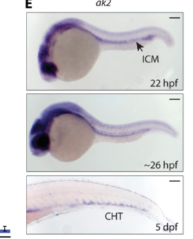

## Question

# Gene Research for Functional Annotation

## ⚠️ CRITICAL: Gene/Protein Identification Context

**BEFORE YOU BEGIN RESEARCH:** You MUST verify you are researching the CORRECT gene/protein. Gene symbols can be ambiguous, especially for less well-characterized genes from non-model organisms.

### Target Gene/Protein Identity (from UniProt):
- **UniProt Accession:** Q1L8L9
- **Protein Description:** RecName: Full=Adenylate kinase 2, mitochondrial {ECO:0000255|HAMAP-Rule:MF_03168}; Short=AK 2 {ECO:0000255|HAMAP-Rule:MF_03168}; EC=2.7.4.3 {ECO:0000255|HAMAP-Rule:MF_03168}; AltName: Full=ATP-AMP transphosphorylase 2 {ECO:0000255|HAMAP-Rule:MF_03168}; AltName: Full=ATP:AMP phosphotransferase {ECO:0000255|HAMAP-Rule:MF_03168}; AltName: Full=Adenylate monophosphate kinase {ECO:0000255|HAMAP-Rule:MF_03168};
- **Gene Information:** Name=ak2; ORFNames=si:ch211-197n10.1;
- **Organism (full):** Danio rerio (Zebrafish) (Brachydanio rerio).
- **Protein Family:** Belongs to the adenylate kinase family. AK2 subfamily.
- **Key Domains:** Adenyl_kin_sub. (IPR006259); Adenylat/UMP-CMP_kin. (IPR000850); Adenylat_kinase_CS. (IPR033690); Adenylate_kinase_lid-dom. (IPR007862); AK2. (IPR028587)

### MANDATORY VERIFICATION STEPS:

1. **Check if the gene symbol "ak2" matches the protein description above**
2. **Verify the organism is correct:** Danio rerio (Zebrafish) (Brachydanio rerio).
3. **Check if protein family/domains align with what you find in literature**
4. **If you find literature for a DIFFERENT gene with the same or similar symbol, STOP**

### If Gene Symbol is Ambiguous or You Cannot Find Relevant Literature:

**DO NOT PROCEED WITH RESEARCH ON A DIFFERENT GENE.** Instead:
- State clearly: "The gene symbol 'ak2' is ambiguous or literature is limited for this specific protein"
- Explain what you found (e.g., "Found extensive literature on a different gene with the same symbol in a different organism")
- Describe the protein based ONLY on the UniProt information provided above
- Suggest that the protein function can be inferred from domain/family information

### Research Target:

Please provide a comprehensive research report on the gene **ak2** (gene ID: ak2, UniProt: Q1L8L9) in DANRE.

The research report should be a detailed narrative explaining the function, biological processes, and localization of the gene product. Citations should be given for all claims.

You should prioritize authoritative reviews and primary scientific literature when conducting research. You can supplement
this with annotations you find in gene/protein databases, but these can be outdated or inaccurate.

We are specifically interested in the primary function of the gene - for enzymes, what reaction is catalyzed, and what is the substrate specificity? For transporters, what is the substrate? For structural proteins or adapters, what is the broader structural role? For signaling molecules, what is the role in the pathway.

We are interested in where in or outside the cell the gene product carries out its function.

We are also interested in the signaling or biochemical pathways in which the gene functions. We are less interested in broad pleiotropic effects, except where these elucidate the precise role.

Include evidence where possible. We are interested in both experimental evidence as well as inference from structure, evolution, or bioinformatic analysis. Precise studies should be prioritized over high-throughput, where available.

## Output

Question: You are an expert researcher providing comprehensive, well-cited information.

Provide detailed information focusing on:
1. Key concepts and definitions with current understanding
2. Recent developments and latest research (prioritize 2023-2024 sources)
3. Current applications and real-world implementations
4. Expert opinions and analysis from authoritative sources
5. Relevant statistics and data from recent studies

Format as a comprehensive research report with proper citations. Include URLs and publication dates where available.
Always prioritize recent, authoritative sources and provide specific citations for all major claims.

# Gene Research for Functional Annotation

## ⚠️ CRITICAL: Gene/Protein Identification Context

**BEFORE YOU BEGIN RESEARCH:** You MUST verify you are researching the CORRECT gene/protein. Gene symbols can be ambiguous, especially for less well-characterized genes from non-model organisms.

### Target Gene/Protein Identity (from UniProt):
- **UniProt Accession:** Q1L8L9
- **Protein Description:** RecName: Full=Adenylate kinase 2, mitochondrial {ECO:0000255|HAMAP-Rule:MF_03168}; Short=AK 2 {ECO:0000255|HAMAP-Rule:MF_03168}; EC=2.7.4.3 {ECO:0000255|HAMAP-Rule:MF_03168}; AltName: Full=ATP-AMP transphosphorylase 2 {ECO:0000255|HAMAP-Rule:MF_03168}; AltName: Full=ATP:AMP phosphotransferase {ECO:0000255|HAMAP-Rule:MF_03168}; AltName: Full=Adenylate monophosphate kinase {ECO:0000255|HAMAP-Rule:MF_03168};
- **Gene Information:** Name=ak2; ORFNames=si:ch211-197n10.1;
- **Organism (full):** Danio rerio (Zebrafish) (Brachydanio rerio).
- **Protein Family:** Belongs to the adenylate kinase family. AK2 subfamily.
- **Key Domains:** Adenyl_kin_sub. (IPR006259); Adenylat/UMP-CMP_kin. (IPR000850); Adenylat_kinase_CS. (IPR033690); Adenylate_kinase_lid-dom. (IPR007862); AK2. (IPR028587)

### MANDATORY VERIFICATION STEPS:

1. **Check if the gene symbol "ak2" matches the protein description above**
2. **Verify the organism is correct:** Danio rerio (Zebrafish) (Brachydanio rerio).
3. **Check if protein family/domains align with what you find in literature**
4. **If you find literature for a DIFFERENT gene with the same or similar symbol, STOP**

### If Gene Symbol is Ambiguous or You Cannot Find Relevant Literature:

**DO NOT PROCEED WITH RESEARCH ON A DIFFERENT GENE.** Instead:
- State clearly: "The gene symbol 'ak2' is ambiguous or literature is limited for this specific protein"
- Explain what you found (e.g., "Found extensive literature on a different gene with the same symbol in a different organism")
- Describe the protein based ONLY on the UniProt information provided above
- Suggest that the protein function can be inferred from domain/family information

### Research Target:

Please provide a comprehensive research report on the gene **ak2** (gene ID: ak2, UniProt: Q1L8L9) in DANRE.

The research report should be a detailed narrative explaining the function, biological processes, and localization of the gene product. Citations should be given for all claims.

You should prioritize authoritative reviews and primary scientific literature when conducting research. You can supplement
this with annotations you find in gene/protein databases, but these can be outdated or inaccurate.

We are specifically interested in the primary function of the gene - for enzymes, what reaction is catalyzed, and what is the substrate specificity? For transporters, what is the substrate? For structural proteins or adapters, what is the broader structural role? For signaling molecules, what is the role in the pathway.

We are interested in where in or outside the cell the gene product carries out its function.

We are also interested in the signaling or biochemical pathways in which the gene functions. We are less interested in broad pleiotropic effects, except where these elucidate the precise role.

Include evidence where possible. We are interested in both experimental evidence as well as inference from structure, evolution, or bioinformatic analysis. Precise studies should be prioritized over high-throughput, where available.

## Comprehensive research report: Danio rerio **ak2** (UniProt Q1L8L9) — functional annotation

### 0) Target verification (critical identity checks)
The literature evidence used here explicitly concerns **zebrafish (Danio rerio) ak2** and the mitochondrial isozyme **adenylate kinase 2 (AK2)**, matching UniProt Q1L8L9 (mitochondrial/intermembrane-space adenylate kinase; AK2 subfamily). In particular, a primary zebrafish study generated and analyzed **ak2** mutant alleles and localizes **ak2** expression to zebrafish hematopoietic tissues, ensuring the target is not conflated with other adenylate kinase isozymes (AK1, AK3, AK4, etc.). (rissone2015reticulardysgenesis–associatedak2 pages 2-3, rissone2015reticulardysgenesis–associatedak2 pages 3-4)

### 1) Key concepts and definitions (current understanding)
#### 1.1 Adenylate kinases and adenine nucleotide homeostasis
Adenylate kinases (AKs) are phosphotransferases that regulate adenine nucleotide composition and energy homeostasis by catalyzing reversible interconversion of adenine nucleotides. A canonical description is **ATP + AMP ⇌ 2 ADP**, which supports buffering of ATP/ADP/AMP ratios and energy transfer between compartments. (fujisawa2023regulationofadenine pages 1-3, hoenig2018recentadvancesin pages 7-12)

A broader formulation used in biochemical reviews is **NTP + AMP ⇌ NDP + ADP**, reflecting that, in principle, various nucleoside triphosphates can serve as phosphate donors while **AMP is the phosphoryl acceptor**. (lapashina2025atpinmitochondria pages 2-4)

#### 1.2 AK2 specifically
AK2 is repeatedly described as the **adenylate kinase isozyme localized to the mitochondrial intermembrane space (IMS)** and distinguished from **AK3/AK4**, which are generally described as mitochondrial matrix enzymes. (fujisawa2023regulationofadenine pages 1-3, fujisawa2023regulationofadenine pages 4-5)

A key functional framing is that **AK2 generates ADP in the IMS**, thereby helping supply ADP for mitochondrial ATP synthesis and coupling to adenine nucleotide exchange (e.g., via the adenine nucleotide translocator, ANT). (rissone2015reticulardysgenesis–associatedak2 pages 13-14, fujisawa2023regulationofadenine pages 4-5)

#### 1.3 Substrate specificity and cofactor considerations
A biochemical review emphasizes that adenylate kinases operate on **magnesium nucleotide complexes**; however, **AMP binds and is phosphorylated without magnesium** because its affinity for Mg2+ is much lower than ATP’s, affecting apparent equilibria and kinetics. (lapashina2025atpinmitochondria pages 2-4)

For functional annotation of zebrafish Ak2 (Q1L8L9), the best-supported specific assignment from the available evidence remains **adenylate kinase activity (EC 2.7.4.3) acting on ATP and AMP to produce ADP** in the mitochondrial IMS. (fujisawa2023regulationofadenine pages 1-3, lapashina2025atpinmitochondria pages 2-4)

### 2) Gene product localization and domain/structure features
#### 2.1 Subcellular localization
Multiple sources converge on AK2 being localized to the **mitochondrial intermembrane space**. (rissone2015reticulardysgenesis–associatedak2 pages 1-2, fujisawa2023regulationofadenine pages 1-3, fujisawa2023regulationofadenine pages 4-5)

A review further emphasizes AK2 as the **only AK isozyme** in the IMS and links it to supplying ADP to ANT at the inner mitochondrial membrane. (fujisawa2023regulationofadenine pages 4-5)

#### 2.2 Domain architecture / conserved adenylate kinase fold
A reticular dysgenesis review summarizes AK2 as having conserved functional regions/domains including **P-loop**, **NMP-binding (NMPbind)**, and a **LID** domain. (hoenig2018recentadvancesin pages 7-12)

Zebrafish genetics supports conserved fold importance: the zebrafish **L124P** missense allele is positioned in a region described as connecting the **CORE** and **LID** domains and is predicted to impair protein stability and enzymatic activity. (rissone2015reticulardysgenesis–associatedak2 pages 3-4)

### 3) Zebrafish-specific experimental evidence (expression, function, phenotypes)
#### 3.1 Expression pattern in zebrafish development
In zebrafish, **ak2 transcripts are maternally inherited** and decrease after the onset of zygotic transcription (qRT-PCR described). (rissone2015reticulardysgenesis–associatedak2 pages 2-3)

Whole-mount in situ hybridization (WISH) localizes **ak2 expression to hematopoietic sites**, including the **intermediate cell mass (ICM)** around ~22–24 hours post-fertilization and the **caudal hematopoietic tissue (CHT)** at 5 days post-fertilization. This is also supported by retrieved figure panels. (rissone2015reticulardysgenesis–associatedak2 pages 2-3, rissone2015reticulardysgenesis–associatedak2 media fef14680)

#### 3.2 Zebrafish alleles and genetic perturbations
A primary zebrafish study generated and characterized multiple **ak2** alleles:
- **ak2del2**: exon 1 frameshift (c.45delAA; p.K16RfsX62)
- **ak2ins4**: exon 1 frameshift (c.41insACGG; p.K16TfsX64)
- **ak2L124P**: ENU allele (c.T371C; p.L124P) predicted deleterious (PROVEAN reported) (rissone2015reticulardysgenesis–associatedak2 pages 13-14, rissone2015reticulardysgenesis–associatedak2 pages 3-4)

Morpholino knockdown experiments were also used as complementary perturbations. (rissone2015reticulardysgenesis–associatedak2 pages 6-7)

#### 3.3 Core biological role supported by zebrafish experiments
Across alleles and perturbations, **ak2 deficiency impairs definitive hematopoiesis** with evidence for:
- reduced **HSPC development/maintenance** (reduced **c-myb** expression from 2–5 dpf) (rissone2015reticulardysgenesis–associatedak2 pages 6-7)
- impaired **lymphoid development** (reduced **ikaros** and **rag1** expression in thymic anlage) (rissone2015reticulardysgenesis–associatedak2 pages 3-4)
- impaired **myeloid development** (reduced **mpx** at 5 dpf; reduced mature granulocytes by Sudan black staining) (rissone2015reticulardysgenesis–associatedak2 pages 3-4)

#### 3.4 Oxidative stress as a mechanistic link
Zebrafish experiments show increased oxidative stress in ak2 mutants:
- FACS-based and dye-based assays report increased mitochondrial superoxide (MitoSOX) and cellular oxidative stress (CellROX) in mutant embryo-derived cells; retrieved figure panels show these differences in hematopoietic regions. (rissone2015reticulardysgenesis–associatedak2 pages 6-7, rissone2015reticulardysgenesis–associatedak2 media da9ab173)
- the oxidative stress-response marker **hmox1a** is strongly induced in the CHT of ak2 mutants starting at 2 dpf. (rissone2015reticulardysgenesis–associatedak2 pages 6-7)

These findings support a mechanistic model in which AK2-mediated adenine nucleotide homeostasis in mitochondria protects hematopoietic development from ROS-associated stress. (rissone2015reticulardysgenesis–associatedak2 pages 1-2, rissone2015reticulardysgenesis–associatedak2 pages 6-7)

### 4) Pathways and mechanistic interpretation (from primary and review literature)
#### 4.1 Adenine nucleotide interconversion coupled to OXPHOS/ATP synthesis
AK2 is described as generating ADP in the IMS that can serve as substrate for ATP synthase after exchange into the matrix, linking AK2 to **mitochondrial nucleotide handling** and energy metabolism. (rissone2015reticulardysgenesis–associatedak2 pages 13-14, hoenig2018recentadvancesin pages 7-12)

#### 4.2 Reticular dysgenesis and lineage-specific vulnerability
Loss-of-function AK2 mutations cause **reticular dysgenesis (RD)** in humans, a severe immunodeficiency with profound neutropenia/lymphopenia and sensorineural deafness; zebrafish ak2 mutants are used as a disease-relevant vertebrate model. (rissone2015reticulardysgenesis–associatedak2 pages 1-2, hoenig2018recentadvancesin pages 1-7)

Metabolically, AK2 deficiency is associated with **increased AMP/ADP ratio (increased AMP, decreased ADP)** in AK2-deficient myeloid contexts, consistent with defective adenylate interconversion and altered energy state. (rissone2015reticulardysgenesis–associatedak2 pages 9-11, hoenig2018recentadvancesin pages 7-12)

A mechanistic extension from a human HSPC model emphasizes that AK2 deficiency can produce **toxic AMP accumulation** and downstream **purine metabolic dysregulation**, including a reported **>30-fold increase in IMP** in AK2-deficient neutrophil contexts; these changes are linked to reduced RNA/ribosome biogenesis and failure of myelopoiesis at the promyelocyte stage. (wang2021reticulardysgenesisassociatedadenylate pages 7-8)

### 5) Recent developments (prioritizing 2023–2024 where evidence is available)
#### 5.1 2023 authoritative synthesis of AK isozyme biology
A 2023 review (Int. J. Mol. Sci., published March 2023; https://doi.org/10.3390/ijms24065561) summarizes current understanding of AK isozymes and reiterates:
- AKs catalyze **ATP + AMP ⇌ 2 ADP** (fujisawa2023regulationofadenine pages 1-3)
- AK2 is localized to the **mitochondrial IMS** and implicated in supplying ADP to **ANT** (fujisawa2023regulationofadenine pages 4-5)
- AK2 deficiency is linked to hematopoietic defects and oxidative stress phenotypes in zebrafish models (fujisawa2023regulationofadenine pages 4-5)

#### 5.2 Limitations for 2024-only synthesis in retrieved evidence
Although searches retrieved 2024-titled sources in the library state (e.g., Ettel & Weichhart 2024; Thind et al. 2024; Katsaras et al. 2024), the evidence-extraction calls did not return relevant text snippets from those documents in the available context, so this report cannot responsibly quote or attribute their specific 2024 statements beyond the information obtained from other sources. This is a coverage limitation of the current retrieval rather than a claim about the absence of 2024 literature.

### 6) Current applications and real-world implementations
#### 6.1 Disease diagnostics and management (AK2/reticular dysgenesis)
Clinical reviews emphasize that RD is caused by AK2 mutations and that **early diagnosis** is essential because **hematopoietic stem cell transplantation (HSCT)** is the curative therapy for the immunologic phenotype; neutrophil counts are typically **unresponsive to G-CSF**, and prompt referral for HSCT planning is recommended. (hoenig2018recentadvancesin pages 1-7, hoenig2018recentadvancesin pages 16-21)

A 2018 expert review provides actionable transplant practice observations: HSCT without conditioning largely failed (success reported in only one case), and post-transplant mixed chimerism with neutropenia generally warrants retransplantation rather than long-term G-CSF. (hoenig2018recentadvancesin pages 16-21)

A more recent SCID-oriented review discusses real-world implementation of newborn screening (TREC-based) and earlier transplant timing; it cites retrospective data indicating higher rates of active infection at transplant in infants transplanted after 3.5 months (52%) vs before 3.5 months (22), supporting early intervention strategies in severe immunodeficiencies (context includes RD). (dhomakonda2025areviewon pages 4-5)

#### 6.2 Zebrafish model as an implementation platform
Zebrafish ak2 mutants provide a platform for mechanistic dissection and therapeutic testing; notably, **antioxidant treatment rescues hematopoietic phenotypes in vivo** in zebrafish and can restore granulocyte differentiation in AK2-deficient human iPSC models, supporting oxidative stress as a tractable intervention axis. (rissone2015reticulardysgenesis–associatedak2 pages 1-2, rissone2015reticulardysgenesis–associatedak2 pages 9-11, rissone2015reticulardysgenesis–associatedak2 media da9ab173)

### 7) Relevant statistics and quantitative data from studies
Quantitative details extractable from available evidence include:
- **Antioxidant rescue in zebrafish**: N-acetyl-L-cysteine (NAC) treatment at **10, 20, or 50 µM** until 5 dpf significantly rescued hematopoietic phenotypes in ak2 mutants (**P < 0.005**, Z-test reported). (rissone2015reticulardysgenesis–associatedak2 pages 9-11)
- **Human iPSC rescue**: glutathione (GSH) showed maximal rescue at **3 mM** in AK2-mutant iPSC myeloid differentiation assays. (rissone2015reticulardysgenesis–associatedak2 pages 9-11)
- **Sample sizes**: zebrafish WISH and related assays commonly analyzed **≥25 embryos per sample**; some assays report counts such as **35/32/26 embryos** at 29/32/36 hpf. (rissone2015reticulardysgenesis–associatedak2 pages 7-8, rissone2015reticulardysgenesis–associatedak2 pages 6-7)
- **Purine metabolic imbalance in AK2 deficiency** (human model): a mechanistic study reports **>30-fold increase in IMP** in AK2-deficient neutrophil contexts alongside altered AMP ratios and impaired biosynthesis. (wang2021reticulardysgenesisassociatedadenylate pages 7-8)

### 8) Visual evidence (figures)
Retrieved figure panels from the primary zebrafish paper support key annotation claims:
- **ak2 expression in ICM and CHT** (WISH) (rissone2015reticulardysgenesis–associatedak2 media fef14680)
- **increased ROS in ak2 mutants** (MitoSOX/CellROX) (rissone2015reticulardysgenesis–associatedak2 media da9ab173)
- **NAC rescue of hematopoietic markers and oxidative-stress marker** (rissone2015reticulardysgenesis–associatedak2 media 04d428bb)

### 9) Concise functional annotation summary (for DANRE ak2; UniProt Q1L8L9)
- **Molecular function**: adenylate kinase (EC 2.7.4.3), catalyzing ATP + AMP ⇌ 2 ADP / NTP + AMP ⇌ NDP + ADP. (lapashina2025atpinmitochondria pages 2-4, fujisawa2023regulationofadenine pages 1-3)
- **Localization**: mitochondrial **intermembrane space**. (rissone2015reticulardysgenesis–associatedak2 pages 1-2, fujisawa2023regulationofadenine pages 1-3)
- **Primary biological role in zebrafish**: supports **hematopoietic stem/progenitor development and maintenance**, enabling proper myeloid and lymphoid differentiation; loss causes oxidative stress in hematopoietic tissues. (rissone2015reticulardysgenesis–associatedak2 pages 3-4, rissone2015reticulardysgenesis–associatedak2 pages 6-7)
- **Mechanistic links**: altered adenine nucleotide ratios (e.g., increased AMP/ADP) and elevated oxidative stress; antioxidant treatment can partially rescue phenotypes, implicating ROS as a downstream effector. (rissone2015reticulardysgenesis–associatedak2 pages 9-11)

### 10) Evidence map table
| Category | Evidence-backed summary |
|---|---|
| Molecular function/reaction | **Danio rerio ak2 (UniProt Q1L8L9)** matches **adenylate kinase 2, mitochondrial/intermembrane-space isozyme**. Adenylate kinases catalyze the reversible phosphotransfer reaction **ATP + AMP ⇌ 2 ADP**; broader AK chemistry can be written as **NTP + AMP ⇌ NDP + ADP**. AK2 is described as the primary mitochondrial **ADP-generating** adenylate kinase that helps maintain adenine nucleotide homeostasis and supplies ADP for ATP synthesis/transport coupling (rissone2015reticulardysgenesis–associatedak2 pages 1-2, rissone2015reticulardysgenesis–associatedak2 pages 13-14, lapashina2025atpinmitochondria pages 2-4, fujisawa2023regulationofadenine pages 1-3, hoenig2018recentadvancesin pages 7-12). |
| Substrate specificity | Canonical substrates are **AMP plus ATP** for the EC 2.7.4.3 reaction; AK enzymes can also use other **purine or pyrimidine NTPs** as phosphate donors in the generalized reaction, while **AMP is the acceptor**. Adenylate kinases act on **magnesium nucleotide complexes**, although AMP itself can be phosphorylated without Mg2+ bound, affecting apparent equilibrium behavior. For functional annotation of zebrafish **ak2**, the strongest supported assignment remains **adenylate kinase activity on ATP/AMP to produce ADP** rather than broad nucleoside diphosphate kinase activity (lapashina2025atpinmitochondria pages 2-4, fujisawa2023regulationofadenine pages 1-3). |
| Subcellular localization | AK2 is the **only AK isozyme localized to the mitochondrial intermembrane space (IMS)**; reviews and disease papers consistently distinguish it from **AK3/AK4**, which are matrix-localized. AK2 is proposed to **supply ADP to the adenine nucleotide transporter (ANT)** at the inner membrane, coupling cytosolic/IMS adenine nucleotide pools to oxidative phosphorylation (rissone2015reticulardysgenesis–associatedak2 pages 1-2, fujisawa2023regulationofadenine pages 1-3, fujisawa2023regulationofadenine pages 4-5, hoenig2018recentadvancesin pages 7-12). |
| Key domains/structure | UniProt/domain assignment for Q1L8L9 places zebrafish Ak2 in the **adenylate kinase family, AK2 subfamily**, with **Adenyl_kin_sub / Adenylat-UMP/CMP kinase-like core** and a characteristic **lid domain**. Experimental zebrafish genetics support conserved AK fold organization: the **L124P** missense allele lies in a region connecting **CORE** and **LID** domains and was predicted to impair stability/activity; Hoenig et al. summarize three functional regions/domains as **P-loop, NMPbind, and LID** (rissone2015reticulardysgenesis–associatedak2 pages 3-4, rissone2015reticulardysgenesis–associatedak2 pages 12-13, hoenig2018recentadvancesin pages 7-12). |
| Pathways/biological processes | Main inferred pathway role is **mitochondrial adenine nucleotide interconversion** and **energy homeostasis**, especially ADP provision linked to ATP synthase/ANT. In zebrafish and human models, AK2 is required for **hematopoietic stem/progenitor maintenance**, **myeloid and lymphoid differentiation**, and protection from **oxidative stress** during hematopoiesis. Reviews also note roles in **mitochondrial apoptosis signaling** and broader mitochondrial energy transfer (rissone2015reticulardysgenesis–associatedak2 pages 1-2, fujisawa2023regulationofadenine pages 4-5, rissone2015reticulardysgenesis–associatedak2 pages 13-14, hoenig2018recentadvancesin pages 7-12). |
| Zebrafish expression sites & stages | In zebrafish, **ak2 transcripts are maternally inherited**; qRT-PCR showed transcript decline after zygotic transcription onset. Whole-mount in situ hybridization localized expression to hematopoietic regions: **intermediate cell mass (ICM) at ~22–24 hpf** and **caudal hematopoietic tissue (CHT) at 5 dpf**. Figure retrieval from the primary study visually confirms these sites/stages (rissone2015reticulardysgenesis–associatedak2 pages 2-3, rissone2015reticulardysgenesis–associatedak2 media fef14680). |
| Zebrafish mutant alleles | Rissone et al. generated/used multiple zebrafish alleles: **ak2hg14 = c.45delAA, p.K16RfsX62 (ak2del2)**; **ak2hg15 = c.41insACGG, p.K16TfsX64 (ak2ins4)**; **ak2hg16 = c.T371C, p.L124P (ak2L124P)**. Loss-of-function was also modeled with **morpholinos** targeting ak2. Zebrafish ak2 was reported to express an isoform corresponding to **human AK2 isoform B** (rissone2015reticulardysgenesis–associatedak2 pages 13-14, rissone2015reticulardysgenesis–associatedak2 pages 3-4, rissone2015reticulardysgenesis–associatedak2 pages 12-13). |
| Key phenotypes | **ak2 deficiency impairs definitive hematopoiesis**: reduced **c-myb**+ HSPCs from 2–5 dpf, defective **lymphoid development** (reduced **ikaros**, **rag1**), defective **myeloid development** (**mpx** reduction, fewer Sudan black+ granulocytes), increased **mitochondrial/cellular ROS**, induction of **hmox1a** in CHT, and increased apoptosis in hematopoietic tissues. Human AK2 deficiency causes **reticular dysgenesis**, and zebrafish phenotypes closely model this biology (rissone2015reticulardysgenesis–associatedak2 pages 3-4, rissone2015reticulardysgenesis–associatedak2 pages 9-11, rissone2015reticulardysgenesis–associatedak2 pages 6-7, hoenig2018recentadvancesin pages 7-12, hoenig2018recentadvancesin pages 1-7). |
| Rescue/perturbation experiments | In zebrafish, **N-acetyl-L-cysteine (NAC)** treatment rescued hematopoietic marker defects and reduced oxidative-stress readouts; figure review shows dose-dependent rescue of **c-myb**, **rag1**, and **hmox1a** abnormalities. In AK2-mutant human iPSC myeloid differentiation, antioxidants including **glutathione (GSH)** rescued myeloid maturation. These data support a mechanistic model in which AK2 protects hematopoiesis from **oxidative stress** downstream of nucleotide disequilibrium (rissone2015reticulardysgenesis–associatedak2 pages 1-2, rissone2015reticulardysgenesis–associatedak2 pages 13-14, rissone2015reticulardysgenesis–associatedak2 pages 9-11, rissone2015reticulardysgenesis–associatedak2 media fef14680, hoenig2018recentadvancesin pages 7-12). |
| Key quantitative data | Reported quantitative details include: **NAC 10, 20, 50 µM** until 5 dpf significantly rescued zebrafish phenotypes (**P < 0.005**, Z-test); **GSH 3 mM** gave maximal rescue of AK2-mutant iPSC myeloid differentiation; zebrafish assays often analyzed **≥25 embryos/sample**; some developmental WISH experiments reported **35/32/26 embryos** at 29/32/36 hpf and **33/29/20/27 embryos** at 24/29/32/36 hpf. Biochemically, AK2-deficient cells showed **increased AMP/ADP ratio** and **decreased ADP**; later mechanistic work reported **>30-fold IMP accumulation** in AK2-deficient myeloid cells, reinforcing purine disequilibrium as a major consequence of AK2 loss (rissone2015reticulardysgenesis–associatedak2 pages 9-11, wang2021reticulardysgenesisassociatedadenylate pages 7-8, rissone2015reticulardysgenesis–associatedak2 pages 7-8, rissone2015reticulardysgenesis–associatedak2 pages 6-7). |
| Key references with year and URL | **Rissone et al. 2015.** *Reticular dysgenesis–associated AK2 protects hematopoietic stem and progenitor cell development from oxidative stress.* J Exp Med. Jul 2015. URL: https://doi.org/10.1084/jem.20141286 (rissone2015reticulardysgenesis–associatedak2 pages 1-2). **Fujisawa 2023.** *Regulation of Adenine Nucleotide Metabolism by Adenylate Kinase Isozymes: Physiological Roles and Diseases.* Int J Mol Sci. Mar 2023. URL: https://doi.org/10.3390/ijms24065561 (fujisawa2023regulationofadenine pages 1-3). **Lapashina et al. 2025.** *ATP in Mitochondria: Quantitative Measurement, Regulation, and Physiological Role.* Biochemistry (Moscow). Dec 2025. URL: https://doi.org/10.1134/S0006297925603338 (lapashina2025atpinmitochondria pages 2-4). **Hoenig et al. 2018.** *Recent advances in understanding the pathogenesis and management of reticular dysgenesis.* Br J Haematol. Mar 2018. URL: https://doi.org/10.1111/bjh.15045 (hoenig2018recentadvancesin pages 7-12). |

*Table: This table summarizes the core functional annotation for Danio rerio ak2 (UniProt Q1L8L9), integrating enzyme function, localization, zebrafish-specific phenotypes, and clinically relevant AK2 literature. It is useful as a compact evidence map for molecular function and biological-process annotation.*

### 11) Key references (with publication dates and URLs)
- Rissone A. et al. **Jul 2015**. *Reticular dysgenesis–associated AK2 protects hematopoietic stem and progenitor cell development from oxidative stress.* **J Exp Med**. https://doi.org/10.1084/jem.20141286 (rissone2015reticulardysgenesis–associatedak2 pages 1-2)
- Fujisawa K. **Mar 2023**. *Regulation of adenine nucleotide metabolism by adenylate kinase isozymes: physiological roles and diseases.* **Int J Mol Sci**. https://doi.org/10.3390/ijms24065561 (fujisawa2023regulationofadenine pages 1-3)
- Hoenig M. et al. **Mar 2018**. *Recent advances in understanding the pathogenesis and management of reticular dysgenesis.* **Br J Haematol**. https://doi.org/10.1111/bjh.15045 (hoenig2018recentadvancesin pages 1-7)
- Lapashina A.S. et al. **Dec 2025**. *ATP in Mitochondria: Quantitative Measurement, Regulation, and Physiological Role.* **Biochemistry (Moscow)**. https://doi.org/10.1134/S0006297925603338 (lapashina2025atpinmitochondria pages 2-4)
- Dhomakonda B. et al. **Mar 2025**. *A Review on Types and Treatment Strategies of Severe Combined Immunodeficiency.* **J Drug Deliv Ther**. https://doi.org/10.22270/jddt.v15i3.7031 (dhomakonda2025areviewon pages 4-5)

### 12) Notable limitations of this report (transparency)
- The report is comprehensive for **zebrafish functional evidence** (expression, alleles, hematopoietic phenotypes, oxidative stress and rescue) primarily based on the 2015 zebrafish study. (rissone2015reticulardysgenesis–associatedak2 pages 1-2, rissone2015reticulardysgenesis–associatedak2 pages 3-4)
- Despite identifying 2024-titled review papers in the search results, the current tool evidence extraction did not yield citable text from those documents; therefore, 2024-specific expert quotations and statistics from those papers are not included here.

References

1. (rissone2015reticulardysgenesis–associatedak2 pages 2-3): Alberto Rissone, Katja Gabriele Weinacht, Giancarlo la Marca, Kevin Bishop, Elisa Giocaliere, Jayashree Jagadeesh, Kerstin Felgentreff, Kerry Dobbs, Waleed Al-Herz, Marypat Jones, Settara Chandrasekharappa, Martha Kirby, Stephen Wincovitch, Karen Lyn Simon, Yuval Itan, Alex DeVine, Thorsten Schlaeger, Axel Schambach, Raman Sood, Luigi D. Notarangelo, and Fabio Candotti. Reticular dysgenesis–associated ak2 protects hematopoietic stem and progenitor cell development from oxidative stress. The Journal of Experimental Medicine, 212:1185-1202, Jul 2015. URL: https://doi.org/10.1084/jem.20141286, doi:10.1084/jem.20141286. This article has 74 citations.

2. (rissone2015reticulardysgenesis–associatedak2 pages 3-4): Alberto Rissone, Katja Gabriele Weinacht, Giancarlo la Marca, Kevin Bishop, Elisa Giocaliere, Jayashree Jagadeesh, Kerstin Felgentreff, Kerry Dobbs, Waleed Al-Herz, Marypat Jones, Settara Chandrasekharappa, Martha Kirby, Stephen Wincovitch, Karen Lyn Simon, Yuval Itan, Alex DeVine, Thorsten Schlaeger, Axel Schambach, Raman Sood, Luigi D. Notarangelo, and Fabio Candotti. Reticular dysgenesis–associated ak2 protects hematopoietic stem and progenitor cell development from oxidative stress. The Journal of Experimental Medicine, 212:1185-1202, Jul 2015. URL: https://doi.org/10.1084/jem.20141286, doi:10.1084/jem.20141286. This article has 74 citations.

3. (fujisawa2023regulationofadenine pages 1-3): Koichi Fujisawa. Regulation of adenine nucleotide metabolism by adenylate kinase isozymes: physiological roles and diseases. International Journal of Molecular Sciences, 24:5561, Mar 2023. URL: https://doi.org/10.3390/ijms24065561, doi:10.3390/ijms24065561. This article has 50 citations.

4. (hoenig2018recentadvancesin pages 7-12): Manfred Hoenig, Ulrich Pannicke, Hubert B. Gaspar, and Klaus Schwarz. Recent advances in understanding the pathogenesis and management of reticular dysgenesis. British Journal of Haematology, 180:644-653, Mar 2018. URL: https://doi.org/10.1111/bjh.15045, doi:10.1111/bjh.15045. This article has 40 citations and is from a domain leading peer-reviewed journal.

5. (lapashina2025atpinmitochondria pages 2-4): Anna S. Lapashina, Danila O. Tretyakov, and Boris A. Feniouk. Atp in mitochondria: quantitative measurement, regulation, and physiological role. Biochemistry (Moscow), 90:1929-1943, Dec 2025. URL: https://doi.org/10.1134/s0006297925603338, doi:10.1134/s0006297925603338. This article has 5 citations.

6. (fujisawa2023regulationofadenine pages 4-5): Koichi Fujisawa. Regulation of adenine nucleotide metabolism by adenylate kinase isozymes: physiological roles and diseases. International Journal of Molecular Sciences, 24:5561, Mar 2023. URL: https://doi.org/10.3390/ijms24065561, doi:10.3390/ijms24065561. This article has 50 citations.

7. (rissone2015reticulardysgenesis–associatedak2 pages 13-14): Alberto Rissone, Katja Gabriele Weinacht, Giancarlo la Marca, Kevin Bishop, Elisa Giocaliere, Jayashree Jagadeesh, Kerstin Felgentreff, Kerry Dobbs, Waleed Al-Herz, Marypat Jones, Settara Chandrasekharappa, Martha Kirby, Stephen Wincovitch, Karen Lyn Simon, Yuval Itan, Alex DeVine, Thorsten Schlaeger, Axel Schambach, Raman Sood, Luigi D. Notarangelo, and Fabio Candotti. Reticular dysgenesis–associated ak2 protects hematopoietic stem and progenitor cell development from oxidative stress. The Journal of Experimental Medicine, 212:1185-1202, Jul 2015. URL: https://doi.org/10.1084/jem.20141286, doi:10.1084/jem.20141286. This article has 74 citations.

8. (rissone2015reticulardysgenesis–associatedak2 pages 1-2): Alberto Rissone, Katja Gabriele Weinacht, Giancarlo la Marca, Kevin Bishop, Elisa Giocaliere, Jayashree Jagadeesh, Kerstin Felgentreff, Kerry Dobbs, Waleed Al-Herz, Marypat Jones, Settara Chandrasekharappa, Martha Kirby, Stephen Wincovitch, Karen Lyn Simon, Yuval Itan, Alex DeVine, Thorsten Schlaeger, Axel Schambach, Raman Sood, Luigi D. Notarangelo, and Fabio Candotti. Reticular dysgenesis–associated ak2 protects hematopoietic stem and progenitor cell development from oxidative stress. The Journal of Experimental Medicine, 212:1185-1202, Jul 2015. URL: https://doi.org/10.1084/jem.20141286, doi:10.1084/jem.20141286. This article has 74 citations.

9. (rissone2015reticulardysgenesis–associatedak2 media fef14680): Alberto Rissone, Katja Gabriele Weinacht, Giancarlo la Marca, Kevin Bishop, Elisa Giocaliere, Jayashree Jagadeesh, Kerstin Felgentreff, Kerry Dobbs, Waleed Al-Herz, Marypat Jones, Settara Chandrasekharappa, Martha Kirby, Stephen Wincovitch, Karen Lyn Simon, Yuval Itan, Alex DeVine, Thorsten Schlaeger, Axel Schambach, Raman Sood, Luigi D. Notarangelo, and Fabio Candotti. Reticular dysgenesis–associated ak2 protects hematopoietic stem and progenitor cell development from oxidative stress. The Journal of Experimental Medicine, 212:1185-1202, Jul 2015. URL: https://doi.org/10.1084/jem.20141286, doi:10.1084/jem.20141286. This article has 74 citations.

10. (rissone2015reticulardysgenesis–associatedak2 pages 6-7): Alberto Rissone, Katja Gabriele Weinacht, Giancarlo la Marca, Kevin Bishop, Elisa Giocaliere, Jayashree Jagadeesh, Kerstin Felgentreff, Kerry Dobbs, Waleed Al-Herz, Marypat Jones, Settara Chandrasekharappa, Martha Kirby, Stephen Wincovitch, Karen Lyn Simon, Yuval Itan, Alex DeVine, Thorsten Schlaeger, Axel Schambach, Raman Sood, Luigi D. Notarangelo, and Fabio Candotti. Reticular dysgenesis–associated ak2 protects hematopoietic stem and progenitor cell development from oxidative stress. The Journal of Experimental Medicine, 212:1185-1202, Jul 2015. URL: https://doi.org/10.1084/jem.20141286, doi:10.1084/jem.20141286. This article has 74 citations.

11. (rissone2015reticulardysgenesis–associatedak2 media da9ab173): Alberto Rissone, Katja Gabriele Weinacht, Giancarlo la Marca, Kevin Bishop, Elisa Giocaliere, Jayashree Jagadeesh, Kerstin Felgentreff, Kerry Dobbs, Waleed Al-Herz, Marypat Jones, Settara Chandrasekharappa, Martha Kirby, Stephen Wincovitch, Karen Lyn Simon, Yuval Itan, Alex DeVine, Thorsten Schlaeger, Axel Schambach, Raman Sood, Luigi D. Notarangelo, and Fabio Candotti. Reticular dysgenesis–associated ak2 protects hematopoietic stem and progenitor cell development from oxidative stress. The Journal of Experimental Medicine, 212:1185-1202, Jul 2015. URL: https://doi.org/10.1084/jem.20141286, doi:10.1084/jem.20141286. This article has 74 citations.

12. (hoenig2018recentadvancesin pages 1-7): Manfred Hoenig, Ulrich Pannicke, Hubert B. Gaspar, and Klaus Schwarz. Recent advances in understanding the pathogenesis and management of reticular dysgenesis. British Journal of Haematology, 180:644-653, Mar 2018. URL: https://doi.org/10.1111/bjh.15045, doi:10.1111/bjh.15045. This article has 40 citations and is from a domain leading peer-reviewed journal.

13. (rissone2015reticulardysgenesis–associatedak2 pages 9-11): Alberto Rissone, Katja Gabriele Weinacht, Giancarlo la Marca, Kevin Bishop, Elisa Giocaliere, Jayashree Jagadeesh, Kerstin Felgentreff, Kerry Dobbs, Waleed Al-Herz, Marypat Jones, Settara Chandrasekharappa, Martha Kirby, Stephen Wincovitch, Karen Lyn Simon, Yuval Itan, Alex DeVine, Thorsten Schlaeger, Axel Schambach, Raman Sood, Luigi D. Notarangelo, and Fabio Candotti. Reticular dysgenesis–associated ak2 protects hematopoietic stem and progenitor cell development from oxidative stress. The Journal of Experimental Medicine, 212:1185-1202, Jul 2015. URL: https://doi.org/10.1084/jem.20141286, doi:10.1084/jem.20141286. This article has 74 citations.

14. (wang2021reticulardysgenesisassociatedadenylate pages 7-8): Wenqing Wang, Andrew DeVilbiss, Martin Arreola, Thomas Mathews, Zhiyu Zhao, Misty Martin-Sandoval, Giorgia Benegiamo, Avni Awani, Ludger Goeminne, Daniel Dever, Yusuke Nakauchi, Mara Pavel-Dinu, Waleed Al-Herz, Luigi Noratangelo, Matthew H. Porteus, Johan Auwerx, Sean J. Morrison, and Katja G. Weinacht. Reticular dysgenesis-associated adenylate kinase 2 deficiency causes failure of myelopoiesis through disordered purine metabolism. bioRxiv, Jul 2021. URL: https://doi.org/10.1101/2021.07.05.450633, doi:10.1101/2021.07.05.450633. This article has 1 citations.

15. (hoenig2018recentadvancesin pages 16-21): Manfred Hoenig, Ulrich Pannicke, Hubert B. Gaspar, and Klaus Schwarz. Recent advances in understanding the pathogenesis and management of reticular dysgenesis. British Journal of Haematology, 180:644-653, Mar 2018. URL: https://doi.org/10.1111/bjh.15045, doi:10.1111/bjh.15045. This article has 40 citations and is from a domain leading peer-reviewed journal.

16. (dhomakonda2025areviewon pages 4-5): Bhavani Dhomakonda, Vankodoth Sireesha, Boddu Shirisha, Gadila Sushma, Mekala Sai Charitha, and T. Rama Rao. A review on types and treatment strategies of severe combined immunodeficiency. Journal of Drug Delivery and Therapeutics, 15:161-167, Mar 2025. URL: https://doi.org/10.22270/jddt.v15i3.7031, doi:10.22270/jddt.v15i3.7031. This article has 0 citations.

17. (rissone2015reticulardysgenesis–associatedak2 pages 7-8): Alberto Rissone, Katja Gabriele Weinacht, Giancarlo la Marca, Kevin Bishop, Elisa Giocaliere, Jayashree Jagadeesh, Kerstin Felgentreff, Kerry Dobbs, Waleed Al-Herz, Marypat Jones, Settara Chandrasekharappa, Martha Kirby, Stephen Wincovitch, Karen Lyn Simon, Yuval Itan, Alex DeVine, Thorsten Schlaeger, Axel Schambach, Raman Sood, Luigi D. Notarangelo, and Fabio Candotti. Reticular dysgenesis–associated ak2 protects hematopoietic stem and progenitor cell development from oxidative stress. The Journal of Experimental Medicine, 212:1185-1202, Jul 2015. URL: https://doi.org/10.1084/jem.20141286, doi:10.1084/jem.20141286. This article has 74 citations.

18. (rissone2015reticulardysgenesis–associatedak2 media 04d428bb): Alberto Rissone, Katja Gabriele Weinacht, Giancarlo la Marca, Kevin Bishop, Elisa Giocaliere, Jayashree Jagadeesh, Kerstin Felgentreff, Kerry Dobbs, Waleed Al-Herz, Marypat Jones, Settara Chandrasekharappa, Martha Kirby, Stephen Wincovitch, Karen Lyn Simon, Yuval Itan, Alex DeVine, Thorsten Schlaeger, Axel Schambach, Raman Sood, Luigi D. Notarangelo, and Fabio Candotti. Reticular dysgenesis–associated ak2 protects hematopoietic stem and progenitor cell development from oxidative stress. The Journal of Experimental Medicine, 212:1185-1202, Jul 2015. URL: https://doi.org/10.1084/jem.20141286, doi:10.1084/jem.20141286. This article has 74 citations.

19. (rissone2015reticulardysgenesis–associatedak2 pages 12-13): Alberto Rissone, Katja Gabriele Weinacht, Giancarlo la Marca, Kevin Bishop, Elisa Giocaliere, Jayashree Jagadeesh, Kerstin Felgentreff, Kerry Dobbs, Waleed Al-Herz, Marypat Jones, Settara Chandrasekharappa, Martha Kirby, Stephen Wincovitch, Karen Lyn Simon, Yuval Itan, Alex DeVine, Thorsten Schlaeger, Axel Schambach, Raman Sood, Luigi D. Notarangelo, and Fabio Candotti. Reticular dysgenesis–associated ak2 protects hematopoietic stem and progenitor cell development from oxidative stress. The Journal of Experimental Medicine, 212:1185-1202, Jul 2015. URL: https://doi.org/10.1084/jem.20141286, doi:10.1084/jem.20141286. This article has 74 citations.

## Artifacts

- [Edison artifact artifact-00](ak2-deep-research-falcon_artifacts/artifact-00.md)

## Citations

1. lapashina2025atpinmitochondria pages 2-4
2. fujisawa2023regulationofadenine pages 4-5
3. hoenig2018recentadvancesin pages 7-12
4. wang2021reticulardysgenesisassociatedadenylate pages 7-8
5. fujisawa2023regulationofadenine pages 1-3
6. hoenig2018recentadvancesin pages 16-21
7. dhomakonda2025areviewon pages 4-5
8. hoenig2018recentadvancesin pages 1-7
9. https://doi.org/10.3390/ijms24065561
10. https://doi.org/10.1084/jem.20141286
11. https://doi.org/10.1134/S0006297925603338
12. https://doi.org/10.1111/bjh.15045
13. https://doi.org/10.22270/jddt.v15i3.7031
14. https://doi.org/10.1084/jem.20141286,
15. https://doi.org/10.3390/ijms24065561,
16. https://doi.org/10.1111/bjh.15045,
17. https://doi.org/10.1134/s0006297925603338,
18. https://doi.org/10.1101/2021.07.05.450633,
19. https://doi.org/10.22270/jddt.v15i3.7031,