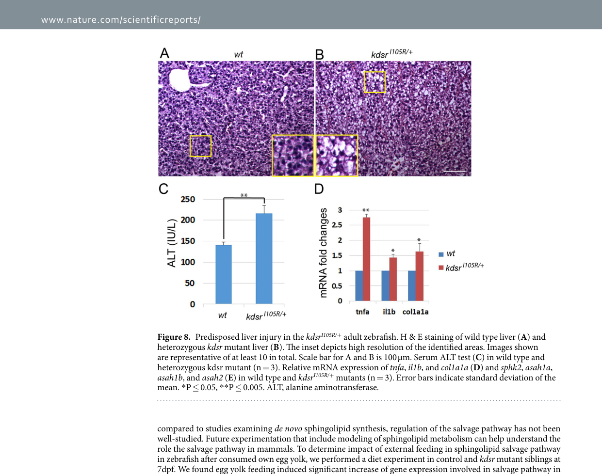

## Question

# Gene Research for Functional Annotation

## ⚠️ CRITICAL: Gene/Protein Identification Context

**BEFORE YOU BEGIN RESEARCH:** You MUST verify you are researching the CORRECT gene/protein. Gene symbols can be ambiguous, especially for less well-characterized genes from non-model organisms.

### Target Gene/Protein Identity (from UniProt):
- **UniProt Accession:** Q5W7F1
- **Protein Description:** RecName: Full=Neutral ceramidase {ECO:0000305}; Short=N-CDase; Short=NCDase; EC=3.5.1.23 {ECO:0000269|PubMed:15271994}; AltName: Full=Acylsphingosine deacylase 2; AltName: Full=N-acylsphingosine amidohydrolase 2; Short=znCD;
- **Gene Information:** Name=asah2;
- **Organism (full):** Danio rerio (Zebrafish) (Brachydanio rerio).
- **Protein Family:** Belongs to the neutral ceramidase family. .
- **Key Domains:** Ceramidase_alk. (IPR006823); NCDase_C_sf. (IPR038445); NEUT/ALK_ceramidase_C. (IPR031331); NEUT/ALK_ceramidase_N. (IPR031329); Ceramidase_alk (PF04734)

### MANDATORY VERIFICATION STEPS:

1. **Check if the gene symbol "asah2" matches the protein description above**
2. **Verify the organism is correct:** Danio rerio (Zebrafish) (Brachydanio rerio).
3. **Check if protein family/domains align with what you find in literature**
4. **If you find literature for a DIFFERENT gene with the same or similar symbol, STOP**

### If Gene Symbol is Ambiguous or You Cannot Find Relevant Literature:

**DO NOT PROCEED WITH RESEARCH ON A DIFFERENT GENE.** Instead:
- State clearly: "The gene symbol 'asah2' is ambiguous or literature is limited for this specific protein"
- Explain what you found (e.g., "Found extensive literature on a different gene with the same symbol in a different organism")
- Describe the protein based ONLY on the UniProt information provided above
- Suggest that the protein function can be inferred from domain/family information

### Research Target:

Please provide a comprehensive research report on the gene **asah2** (gene ID: asah2, UniProt: Q5W7F1) in DANRE.

The research report should be a detailed narrative explaining the function, biological processes, and localization of the gene product. Citations should be given for all claims.

You should prioritize authoritative reviews and primary scientific literature when conducting research. You can supplement
this with annotations you find in gene/protein databases, but these can be outdated or inaccurate.

We are specifically interested in the primary function of the gene - for enzymes, what reaction is catalyzed, and what is the substrate specificity? For transporters, what is the substrate? For structural proteins or adapters, what is the broader structural role? For signaling molecules, what is the role in the pathway.

We are interested in where in or outside the cell the gene product carries out its function.

We are also interested in the signaling or biochemical pathways in which the gene functions. We are less interested in broad pleiotropic effects, except where these elucidate the precise role.

Include evidence where possible. We are interested in both experimental evidence as well as inference from structure, evolution, or bioinformatic analysis. Precise studies should be prioritized over high-throughput, where available.

## Output

Question: You are an expert researcher providing comprehensive, well-cited information.

Provide detailed information focusing on:
1. Key concepts and definitions with current understanding
2. Recent developments and latest research (prioritize 2023-2024 sources)
3. Current applications and real-world implementations
4. Expert opinions and analysis from authoritative sources
5. Relevant statistics and data from recent studies

Format as a comprehensive research report with proper citations. Include URLs and publication dates where available.
Always prioritize recent, authoritative sources and provide specific citations for all major claims.

# Gene Research for Functional Annotation

## ⚠️ CRITICAL: Gene/Protein Identification Context

**BEFORE YOU BEGIN RESEARCH:** You MUST verify you are researching the CORRECT gene/protein. Gene symbols can be ambiguous, especially for less well-characterized genes from non-model organisms.

### Target Gene/Protein Identity (from UniProt):
- **UniProt Accession:** Q5W7F1
- **Protein Description:** RecName: Full=Neutral ceramidase {ECO:0000305}; Short=N-CDase; Short=NCDase; EC=3.5.1.23 {ECO:0000269|PubMed:15271994}; AltName: Full=Acylsphingosine deacylase 2; AltName: Full=N-acylsphingosine amidohydrolase 2; Short=znCD;
- **Gene Information:** Name=asah2;
- **Organism (full):** Danio rerio (Zebrafish) (Brachydanio rerio).
- **Protein Family:** Belongs to the neutral ceramidase family. .
- **Key Domains:** Ceramidase_alk. (IPR006823); NCDase_C_sf. (IPR038445); NEUT/ALK_ceramidase_C. (IPR031331); NEUT/ALK_ceramidase_N. (IPR031329); Ceramidase_alk (PF04734)

### MANDATORY VERIFICATION STEPS:

1. **Check if the gene symbol "asah2" matches the protein description above**
2. **Verify the organism is correct:** Danio rerio (Zebrafish) (Brachydanio rerio).
3. **Check if protein family/domains align with what you find in literature**
4. **If you find literature for a DIFFERENT gene with the same or similar symbol, STOP**

### If Gene Symbol is Ambiguous or You Cannot Find Relevant Literature:

**DO NOT PROCEED WITH RESEARCH ON A DIFFERENT GENE.** Instead:
- State clearly: "The gene symbol 'asah2' is ambiguous or literature is limited for this specific protein"
- Explain what you found (e.g., "Found extensive literature on a different gene with the same symbol in a different organism")
- Describe the protein based ONLY on the UniProt information provided above
- Suggest that the protein function can be inferred from domain/family information

### Research Target:

Please provide a comprehensive research report on the gene **asah2** (gene ID: asah2, UniProt: Q5W7F1) in DANRE.

The research report should be a detailed narrative explaining the function, biological processes, and localization of the gene product. Citations should be given for all claims.

You should prioritize authoritative reviews and primary scientific literature when conducting research. You can supplement
this with annotations you find in gene/protein databases, but these can be outdated or inaccurate.

We are specifically interested in the primary function of the gene - for enzymes, what reaction is catalyzed, and what is the substrate specificity? For transporters, what is the substrate? For structural proteins or adapters, what is the broader structural role? For signaling molecules, what is the role in the pathway.

We are interested in where in or outside the cell the gene product carries out its function.

We are also interested in the signaling or biochemical pathways in which the gene functions. We are less interested in broad pleiotropic effects, except where these elucidate the precise role.

Include evidence where possible. We are interested in both experimental evidence as well as inference from structure, evolution, or bioinformatic analysis. Precise studies should be prioritized over high-throughput, where available.

## Research report: **Danio rerio asah2** (UniProt **Q5W7F1**) — Neutral ceramidase functional annotation

### Executive summary
The zebrafish gene **asah2** (UniProt **Q5W7F1**) corresponds to a **neutral ceramidase** (EC **3.5.1.23**), an N-acylsphingosine amidohydrolase that **hydrolyzes ceramide to sphingosine and a free fatty acid**—a central step that links ceramide pools to the downstream **sphingosine → sphingosine-1-phosphate (S1P)** signaling axis. The best, most current synthesis of ASAH2 biology (not zebrafish-specific) places the enzyme at the **plasma membrane**, operating near **neutral pH (~7.4)** and affecting dietary sphingolipid digestion and inflammatory/injury phenotypes in mammals. Zebrafish-specific primary evidence in the retrieved corpus is limited to gene-expression measurements of **asah2 mRNA** in the context of sphingolipid-metabolism perturbation (kdsr mutant liver injury model). Direct zebrafish biochemical characterization (substrate chain-length preference, kinetic constants for zebrafish protein) and subcellular localization experiments were not found in the accessible sources, so these aspects are inferred cautiously from conserved ASAH2 mechanistic/structural evidence in vertebrates. (kuo2024regulationofcellular pages 6-9, park20193ketodihydrosphingosinereductasemutation pages 8-10)

### 1. Target identity verification (mandatory)
**Gene/protein match.** Multiple authoritative sources define **ASAH2/Asah2** as **neutral ceramidase** (neutral N-acylsphingosine amidohydrolase), which is consistent with the UniProt description provided (Q5W7F1: “Neutral ceramidase”, EC 3.5.1.23; neutral ceramidase family). (kuo2024regulationofcellular pages 6-9, parveen2019roleofceramidases pages 1-3)

**Orthology/organism context.** A comparative ceramidase review explicitly includes **Danio rerio** as an ASAH2 ortholog in its alignments (zebrafish entry reported as NP_1007764 in that review), supporting that the zebrafish gene symbol **asah2** refers to a neutral ceramidase ortholog rather than acid ceramidase (ASAH1) or alkaline ceramidases (ACERs). (parveen2019roleofceramidases pages 6-9)

**Avoiding symbol ambiguity.** In the zebrafish primary study available here, **asah2** is assayed alongside other sphingolipid salvage-pathway genes, consistent with neutral ceramidase function and not a different “asah2” entity. (park20193ketodihydrosphingosinereductasemutation pages 8-10)

### 2. Key concepts and definitions (current understanding)
**Ceramidases and the sphingolipid rheostat.** Ceramidases cleave the **N-acyl bond** of ceramide, generating **sphingosine** and a **free fatty acid**; sphingosine can then be phosphorylated by sphingosine kinases to produce **S1P**, a potent extracellular and intracellular signaling lipid. This positions ceramidases as major regulators of the ceramide ↔ sphingosine ↔ S1P balance. (parveen2019roleofceramidases pages 1-3, saied2014smallmoleculeinhibitors pages 1-2)

**Neutral ceramidase (ASAH2).** Neutral ceramidase is operationally defined by activity near **neutral pH**, and a recent authoritative review tabulates ASAH2 as a **plasma-membrane** ceramidase with optimal pH around **7.4**. (kuo2024regulationofcellular pages 6-9)

### 3. Primary molecular function: reaction catalyzed and substrate specificity
#### 3.1 Catalyzed reaction
ASAH2 catalyzes:

**Ceramide + H2O → sphingosine + free fatty acid**

This is repeatedly stated in mechanistic and homeostasis reviews, including recent (2024) synthesis. (kuo2024regulationofcellular pages 6-9, parveen2019roleofceramidases pages 1-3, saied2014smallmoleculeinhibitors pages 1-2)

#### 3.2 Substrate scope and specificity (what is known)
A 2024 review table summarizes ASAH2 as preferentially hydrolyzing **ceramides and dihydroceramides**, consistent with its role in ceramide catabolism outside the lysosome. (schengrund2024sphingolipidslessenigmatic pages 4-5)

#### 3.3 Quantitative enzymology (available kinetics; largely mammalian)
Because zebrafish-specific enzyme kinetics were not found in the accessible texts, the most direct quantitative evidence comes from mammalian ASAH2 characterization summarized in a ceramidase review:

* Reported **KM ≈ 60.1 µM** using a fluorescent C12 ceramide analogue (assayed at pH 7.5, 37 °C, recombinant enzyme). (parveen2019roleofceramidases pages 3-6)
* Reported recombinant extracellular-domain kinetics: **KM = 33.41 µM** and **Kcat = 61.93 min−1** for a purified ASAH2 extracellular domain expressed in Sf9 cells (residues 99–780), supporting robust catalytic turnover in a soluble construct. (parveen2019roleofceramidases pages 6-9)

These values strongly support the neutral ceramidase annotation for vertebrate ASAH2 family members and provide testable expectations for zebrafish Asah2/Q5W7F1. (parveen2019roleofceramidases pages 6-9, parveen2019roleofceramidases pages 3-6)

#### 3.4 Structural/mechanistic determinants (domain-based inference)
An X-ray structure summarized in the ceramidase review reports:

* A **narrow hydrophobic substrate-binding pocket** appropriate for accommodating ceramide acyl chains. (parveen2019roleofceramidases pages 6-9)
* A catalytic region featuring **Ser354** (active site) and residues **His196, Arg257, Tyr579, Tyr591** implicated in catalysis/substrate binding; Ser354 is positioned to stabilize Arg257 at the base of the pocket. (parveen2019roleofceramidases pages 6-9)
* An **amidase motif** near the catalytic region (NLGDVSPNXLGPXC; aa 353–366 in the reviewed human ASAH2 sequence), consistent with conserved ceramidase catalytic architecture. (parveen2019roleofceramidases pages 6-9)

This structural evidence underpins mechanistic confidence in annotation of zebrafish Q5W7F1 as a ceramidase even in the absence of direct zebrafish enzymology. (parveen2019roleofceramidases pages 6-9)

### 4. Localization and expression
#### 4.1 Subcellular localization (consensus and controversies)
**Most current consensus.** A 2024 Nature Reviews Molecular Cell Biology synthesis lists ASAH2 localization as the **plasma membrane**. (kuo2024regulationofcellular pages 6-9)

**Experimental complexity/controversy.** A detailed ceramidase review summarizes multiple reported ASAH2 locations across systems, including:

* **Plasma membrane** retention as a **type II integral membrane protein**, influenced by **O-glycosylation** of a mucin-like region; apical membrane localization has been reported in kidney epithelia. (parveen2019roleofceramidases pages 15-17, parveen2019roleofceramidases pages 3-6)
* **Intestinal brush border** expression in humans, consistent with a role in dietary sphingolipid digestion at the luminal surface. (parveen2019roleofceramidases pages 1-3)
* Reports of **Golgi** localization and Golgi ceramide turnover in certain cell contexts, and reports of **mitochondrial** localization in overexpression studies (noting that overexpression can confound steady-state localization). (parveen2019roleofceramidases pages 6-9, parveen2019roleofceramidases pages 3-6)

Overall interpretation: for functional annotation, the strongest supported “default” localization is **cell surface/plasma membrane (apical in epithelia)**, with additional organelle-associated localizations reported in specific contexts and/or potentially isoform-dependent. (kuo2024regulationofcellular pages 6-9, parveen2019roleofceramidases pages 3-6, parveen2019roleofceramidases pages 1-3)

#### 4.2 Tissue expression (what can be reasonably inferred for zebrafish)
Human ASAH2 is described as largely **gut/small intestine** enriched, whereas mice show broader tissue expression; this species difference is highlighted explicitly. (parveen2019roleofceramidases pages 1-3, parveen2019roleofceramidases pages 3-6)

For zebrafish, direct tissue atlas evidence was not retrieved here; however, the presence of **asah2 mRNA quantification in adult zebrafish liver** in a sphingolipid-metabolism perturbation model supports that **hepatic asah2 expression** is detectable and biologically engaged in zebrafish. (park20193ketodihydrosphingosinereductasemutation pages 8-10)

### 5. Pathways, biological processes, and phenotypes
#### 5.1 Pathway placement: sphingolipid catabolism and ceramide–S1P axis
ASAH2 sits at a key branch point controlling ceramide catabolism and the supply of **sphingosine**, which can be phosphorylated to **S1P**. This role is explicitly summarized in 2024 and earlier reviews. (kuo2024regulationofcellular pages 6-9, parveen2019roleofceramidases pages 1-3)

#### 5.2 Mammalian genetic evidence (informative for conserved function)
A 2024 authoritative review tabulates **Asah2 knockout** phenotypes in mice, including:

* **Failure to digest dietary sphingolipid**, supporting a role in **intestinal sphingolipid digestion/metabolism**. (kuo2024regulationofcellular pages 6-9)
* **Increased inflammation** in a **DSS-induced colitis** model, consistent with ceramide/sphingosine balance influencing intestinal inflammatory tone. (kuo2024regulationofcellular pages 6-9)
* **Improved recovery after brain trauma** with **reduced contusion volume**, linking ceramidase-driven remodeling of membrane ceramide pools to injury responses. (kuo2024regulationofcellular pages 6-9)

These phenotypes provide strong expert-curated evidence that ASAH2 affects organism-level physiology through control of ceramide pools at the cell surface. (kuo2024regulationofcellular pages 6-9)

#### 5.3 Zebrafish evidence: integration into sphingolipid salvage responses
In a zebrafish study of **kdsrI105R** mutation (a de novo sphingolipid synthesis enzyme), the authors report activation of sphingolipid salvage pathways and explicitly quantify **asah2 mRNA in adult liver** as part of the pathway analysis (n=3 in the shown assay description). This anchors zebrafish asah2 within sphingolipid homeostasis networks relevant to hepatic injury/steatosis contexts. (park20193ketodihydrosphingosinereductasemutation pages 8-10)

*Limitation:* the provided evidence excerpt indicates asah2 was measured but does not provide the exact fold-change direction/magnitude; the figure panel (8E) was not available in the retrieved image extract. (park20193ketodihydrosphingosinereductasemutation pages 8-10, park20193ketodihydrosphingosinereductasemutation media bb6d4125)

### 6. Recent developments and latest research emphasis (2023–2024 prioritized)
Within the accessible corpus, the most relevant **2024** sources are two reviews that consolidate the field’s current view:

* **Kuo & Hla (2024-06)** provides a current, systems-level synthesis of sphingolipid homeostasis and explicitly tabulates ASAH2 function, plasma membrane localization, pH optimum, and mammalian KO phenotypes. URL: https://doi.org/10.1038/s41580-024-00742-y. (kuo2024regulationofcellular pages 6-9)
* **Schengrund (2024-06)** provides a review table summarizing ASAH2 substrate class preference (ceramide/dihydroceramide), tissue enrichment (small intestine/colon), and reported compartment localizations (plasma membrane/Golgi/mitochondria), and links ASAH2 to colon cancer progression. URL: https://doi.org/10.3390/ijms25126312. (schengrund2024sphingolipidslessenigmatic pages 4-5)

These reviews represent current expert consensus summaries but do not replace zebrafish-specific experimentation; direct 2023–2024 zebrafish asah2 functional studies were not found in the retrieved library. (kuo2024regulationofcellular pages 6-9, schengrund2024sphingolipidslessenigmatic pages 4-5)

### 7. Current applications and real-world implementations
#### 7.1 Therapeutic targeting concept: ceramidase inhibition
A classic inhibitor-focused review frames ceramidases (including ASAH2) as pharmacological targets: inhibiting ceramidases can raise ceramide and shift signaling outcomes within the ceramide–S1P “rheostat,” a strategy often discussed in cancer/hyperproliferation contexts. URL: https://doi.org/10.1159/000362995 (published 2014-06). (saied2014smallmoleculeinhibitors pages 1-2)

#### 7.2 Disease relevance highlights (expert synthesis)
Recent and foundational reviews connect ASAH2 biology to:

* **Gut physiology** (dietary sphingolipid digestion; intestinal epithelial/apical context). (kuo2024regulationofcellular pages 6-9, parveen2019roleofceramidases pages 1-3)
* **Inflammation** (e.g., DSS colitis phenotype in KO). (kuo2024regulationofcellular pages 6-9)
* **Injury responses** (brain trauma recovery phenotype in KO). (kuo2024regulationofcellular pages 6-9)
* **Colon cancer**: a 2024 review table explicitly links ASAH2 to colon cancer progression and lists Golgi/mitochondrial/plasma membrane localizations in that context. (schengrund2024sphingolipidslessenigmatic pages 4-5)

These are primarily mammalian translational contexts; zebrafish-specific therapeutic implementations for asah2 were not retrieved here. (schengrund2024sphingolipidslessenigmatic pages 4-5, park20193ketodihydrosphingosinereductasemutation pages 8-10)

### 8. Key statistics and data points (from recent and foundational sources)
* **Optimal pH:** ASAH2 activity summarized as optimal near **pH 7.4**. (kuo2024regulationofcellular pages 6-9)
* **Kinetics (model substrates):** **KM ~33.41–60.1 µM**; **Kcat ~61.93 min−1** (extracellular domain construct). (parveen2019roleofceramidases pages 6-9, parveen2019roleofceramidases pages 3-6)
* **Zebrafish gene expression assay context:** adult liver **asah2 mRNA measured (n=3)** in kdsr mutant study; fold-change not recoverable from the accessible panel. (park20193ketodihydrosphingosinereductasemutation pages 8-10, park20193ketodihydrosphingosinereductasemutation media bb6d4125)

### 9. Evidence summary table
The following table consolidates the highest-value evidence supporting functional annotation of zebrafish **asah2/Q5W7F1**, explicitly separating direct zebrafish evidence from cross-species inference.

| Evidence topic | Key finding | Organism/system | Study type | Publication (authors, journal) | Pub date | URL | Notes/limitations | Citation id from context |
|---|---|---|---|---|---|---|---|---|
| Identity/orthology | Zebrafish has an ASAH2 ortholog included in comparative sequence analyses; ASAH2 belongs to the neutral/alkaline ceramidase family and contains conserved catalytic/amidase features consistent with neutral ceramidase annotation. | Danio rerio and vertebrate ortholog comparison | Review | Parveen et al., *Cells* | 2019-12 | https://doi.org/10.3390/cells8121573 | Supports annotation of Q5W7F1 as zebrafish neutral ceramidase, but not a zebrafish-specific biochemical validation study. | (parveen2019roleofceramidases pages 6-9) |
| Enzymatic reaction | Neutral ceramidase/ASAH2 hydrolyzes ceramide to sphingosine plus a free fatty acid; this is the core reaction defining ASAH2 function. | Human/general ceramidase biology | Review | Saied & Arenz, *Cellular Physiology and Biochemistry* | 2014-06 | https://doi.org/10.1159/000362995 | Foundational mechanistic review; not zebrafish-specific. | (saied2014smallmoleculeinhibitors pages 1-2) |
| Enzymatic reaction | ASAH2 is listed as neutral ceramidase (NCDase) with optimal activity near pH 7.4 and conversion of ceramide to sphingosine + fatty acid. | Mammalian/general sphingolipid homeostasis | Review | Kuo & Hla, *Nature Reviews Molecular Cell Biology* | 2024-06 | https://doi.org/10.1038/s41580-024-00742-y | Recent authoritative synthesis; not specific to zebrafish. | (kuo2024regulationofcellular pages 6-9) |
| Kinetics | Reported kinetic data for ASAH2 include KM about 60.1 µM using a fluorescent C12 ceramide analogue. | Human ASAH2 biochemical studies summarized in review | Review | Parveen et al., *Cells* | 2019-12 | https://doi.org/10.3390/cells8121573 | Substrate is a model fluorescent analogue, so in vivo zebrafish substrate preferences remain inferred. | (parveen2019roleofceramidases pages 1-3) |
| Kinetics/structure | Recombinant extracellular domain kinetics were reported (KM = 33.41 µM; Kcat = 61.93 min−1), and structural work identified a narrow hydrophobic substrate-binding pocket and catalytic residues important for ceramide hydrolysis. | Human ASAH2 structural/biochemical studies summarized in review | Review | Parveen et al., *Cells* | 2019-12 | https://doi.org/10.3390/cells8121573 | Strong support for catalytic mechanism; still based on mammalian protein rather than zebrafish Q5W7F1. | (parveen2019roleofceramidases pages 6-9) |
| Localization | ASAH2 is localized to the plasma membrane in the 2024 review summary table. | Mammalian/general | Review | Kuo & Hla, *Nature Reviews Molecular Cell Biology* | 2024-06 | https://doi.org/10.1038/s41580-024-00742-y | Useful current consensus view, though some older studies reported additional locations. | (kuo2024regulationofcellular pages 6-9) |
| Localization | ASAH2 localization remains partly controversial: studies have placed it at the plasma membrane/brush border, mitochondria, Golgi, and as a membrane-bound or soluble isoform depending on glycosylation and isoform context. | Human, mouse, rat cell/tissue studies summarized in review | Review | Parveen et al., *Cells* | 2019-12 | https://doi.org/10.3390/cells8121573 | Important caveat for annotation: likely membrane-associated neutral ceramidase, but exact zebrafish subcellular localization is not directly established here. | (parveen2019roleofceramidases pages 3-6, parveen2019roleofceramidases pages 6-9) |
| Tissue localization/function | Human ASAH2 is reported mainly at the intestinal brush border of the small intestine, where it digests dietary sphingolipids and helps regulate gut sphingolipid balance. | Human intestine | Review | Parveen et al., *Cells* | 2019-12 | https://doi.org/10.3390/cells8121573 | Suggests likely conserved digestive/gut-associated role, but zebrafish intestinal localization was not directly shown in the cited evidence. | (parveen2019roleofceramidases pages 1-3) |
| Pathways | ASAH2 feeds the ceramide → sphingosine → sphingosine-1-phosphate (S1P) axis, linking ceramide catabolism to bioactive sphingolipid signaling and homeostasis. | General sphingolipid metabolism | Review | Kuo & Hla, *Nature Reviews Molecular Cell Biology* | 2024-06 | https://doi.org/10.1038/s41580-024-00742-y | Central pathway context for functional annotation. | (kuo2024regulationofcellular pages 6-9) |
| Pathways/phenotypes | Knockout/deficiency phenotypes summarized for Asah2 include failure to digest dietary sphingolipid, increased inflammation in DSS colitis, and reduced brain contusion volume/improved recovery after trauma. | Mouse/mammalian models | Review | Kuo & Hla, *Nature Reviews Molecular Cell Biology* | 2024-06 | https://doi.org/10.1038/s41580-024-00742-y | Demonstrates physiological relevance of neutral ceramidase beyond biochemistry; phenotype transfer to zebrafish remains inferential. | (kuo2024regulationofcellular pages 6-9) |
| Pathways/phenotypes | ASAH2 has been linked to regulation of ceramide/S1P balance affecting apoptosis vs proliferation, inflammatory responses, AKT signaling, insulin resistance, and oxidative stress. | Mammalian cell and animal studies summarized in review | Review | Parveen et al., *Cells* | 2019-12 | https://doi.org/10.3390/cells8121573 | Broad functional context; disease associations are mostly mammalian and may not reflect the primary zebrafish role. | (parveen2019roleofceramidases pages 9-11, parveen2019roleofceramidases pages 15-17) |
| Zebrafish-specific evidence | In a zebrafish kdsr hepatic injury model, asah2 mRNA was explicitly measured in adult liver as part of salvage-pathway analysis, supporting that zebrafish asah2 participates in sphingolipid salvage/homeostasis networks. | Danio rerio liver, kdsrI105R mutant | Primary | Park et al., *Scientific Reports* | 2019-02 | https://doi.org/10.1038/s41598-018-37946-0 | Direct zebrafish evidence, but the excerpt does not provide exact fold-change values or a direct loss-of-function phenotype for asah2 itself. | (park20193ketodihydrosphingosinereductasemutation pages 8-10) |

*Table: This table compiles the key evidence used to functionally annotate zebrafish asah2 (Q5W7F1) as a neutral ceramidase. It distinguishes direct zebrafish evidence from mammalian ASAH2 studies that support inference about reaction chemistry, localization, and pathway context.*

### 10. Limitations and recommendations for functional annotation
1. **Direct zebrafish biochemical evidence is missing in retrieved texts.** No zebrafish-specific kinetic constants, substrate-chain-length preferences, or direct enzymatic assays of Q5W7F1 were accessible; current enzymology is inferred from mammalian ASAH2. (parveen2019roleofceramidases pages 6-9, parveen2019roleofceramidases pages 3-6)
2. **Zebrafish subcellular localization is unverified here.** While recent synthesis indicates plasma membrane localization for ASAH2 generally, and older literature reports apical/brush-border localization in mammals, zebrafish Asah2 localization should be validated experimentally (e.g., tagged knock-in, membrane fractionation, immunolocalization) before asserting tissue- or organelle-specific claims beyond “likely membrane-associated.” (kuo2024regulationofcellular pages 6-9, parveen2019roleofceramidases pages 1-3)
3. **Zebrafish-specific functional phenotypes of asah2 LOF are not available in the evidence corpus.** Only pathway-context expression evidence (kdsr model) was retrieved for zebrafish; targeted zebrafish genetics (CRISPR LOF) with lipidomics could directly test dietary sphingolipid digestion and ceramide/S1P rheostat impacts. (park20193ketodihydrosphingosinereductasemutation pages 8-10, kuo2024regulationofcellular pages 6-9)

### References (URLs and publication dates)
Key sources used in this report:

* Kuo A, Hla T. *Regulation of cellular and systemic sphingolipid homeostasis.* **Nature Reviews Molecular Cell Biology**. **2024-06**. https://doi.org/10.1038/s41580-024-00742-y (kuo2024regulationofcellular pages 6-9)
* Schengrund C-L. *Sphingolipids: Less Enigmatic but Still Many Questions…* **International Journal of Molecular Sciences**. **2024-06**. https://doi.org/10.3390/ijms25126312 (schengrund2024sphingolipidslessenigmatic pages 4-5)
* Parveen F et al. *Role of Ceramidases in Sphingolipid Metabolism and Human Diseases.* **Cells**. **2019-12**. https://doi.org/10.3390/cells8121573 (parveen2019roleofceramidases pages 1-3, parveen2019roleofceramidases pages 6-9, parveen2019roleofceramidases pages 3-6)
* Park K-H et al. *3-ketodihydrosphingosine reductase mutation induces steatosis and hepatic injury in zebrafish.* **Scientific Reports**. **2019-02**. https://doi.org/10.1038/s41598-018-37946-0 (park20193ketodihydrosphingosinereductasemutation pages 8-10)
* Saied EM, Arenz C. *Small molecule inhibitors of ceramidases.* **Cellular Physiology and Biochemistry**. **2014-06**. https://doi.org/10.1159/000362995 (saied2014smallmoleculeinhibitors pages 1-2)

References

1. (kuo2024regulationofcellular pages 6-9): Andrew Kuo and Timothy Hla. Regulation of cellular and systemic sphingolipid homeostasis. Nature reviews. Molecular cell biology, 25:802-821, Jun 2024. URL: https://doi.org/10.1038/s41580-024-00742-y, doi:10.1038/s41580-024-00742-y. This article has 118 citations.

2. (park20193ketodihydrosphingosinereductasemutation pages 8-10): Ki-Hoon Park, Zhi-wei Ye, Jie Zhang, Samar M. Hammad, Danyelle M. Townsend, Don C. Rockey, and Seok-Hyung Kim. 3-ketodihydrosphingosine reductase mutation induces steatosis and hepatic injury in zebrafish. Scientific Reports, Feb 2019. URL: https://doi.org/10.1038/s41598-018-37946-0, doi:10.1038/s41598-018-37946-0. This article has 36 citations and is from a peer-reviewed journal.

3. (parveen2019roleofceramidases pages 1-3): Farzana Parveen, Daniel Bender, Shi-Hui Law, Vineet Kumar Mishra, Chih-Chieh Chen, and Liang-Yin Ke. Role of ceramidases in sphingolipid metabolism and human diseases. Cells, 8:1573, Dec 2019. URL: https://doi.org/10.3390/cells8121573, doi:10.3390/cells8121573. This article has 163 citations.

4. (parveen2019roleofceramidases pages 6-9): Farzana Parveen, Daniel Bender, Shi-Hui Law, Vineet Kumar Mishra, Chih-Chieh Chen, and Liang-Yin Ke. Role of ceramidases in sphingolipid metabolism and human diseases. Cells, 8:1573, Dec 2019. URL: https://doi.org/10.3390/cells8121573, doi:10.3390/cells8121573. This article has 163 citations.

5. (saied2014smallmoleculeinhibitors pages 1-2): Essa M. Saied and Christoph Arenz. Small molecule inhibitors of ceramidases. Cellular Physiology and Biochemistry, 34:197-212, Jun 2014. URL: https://doi.org/10.1159/000362995, doi:10.1159/000362995. This article has 50 citations and is from a peer-reviewed journal.

6. (schengrund2024sphingolipidslessenigmatic pages 4-5): Cara-Lynne Schengrund. Sphingolipids: less enigmatic but still many questions about the role(s) of ceramide in the synthesis/function of the ganglioside class of glycosphingolipids. International Journal of Molecular Sciences, 25:6312, Jun 2024. URL: https://doi.org/10.3390/ijms25126312, doi:10.3390/ijms25126312. This article has 8 citations.

7. (parveen2019roleofceramidases pages 3-6): Farzana Parveen, Daniel Bender, Shi-Hui Law, Vineet Kumar Mishra, Chih-Chieh Chen, and Liang-Yin Ke. Role of ceramidases in sphingolipid metabolism and human diseases. Cells, 8:1573, Dec 2019. URL: https://doi.org/10.3390/cells8121573, doi:10.3390/cells8121573. This article has 163 citations.

8. (parveen2019roleofceramidases pages 15-17): Farzana Parveen, Daniel Bender, Shi-Hui Law, Vineet Kumar Mishra, Chih-Chieh Chen, and Liang-Yin Ke. Role of ceramidases in sphingolipid metabolism and human diseases. Cells, 8:1573, Dec 2019. URL: https://doi.org/10.3390/cells8121573, doi:10.3390/cells8121573. This article has 163 citations.

9. (park20193ketodihydrosphingosinereductasemutation media bb6d4125): Ki-Hoon Park, Zhi-wei Ye, Jie Zhang, Samar M. Hammad, Danyelle M. Townsend, Don C. Rockey, and Seok-Hyung Kim. 3-ketodihydrosphingosine reductase mutation induces steatosis and hepatic injury in zebrafish. Scientific Reports, Feb 2019. URL: https://doi.org/10.1038/s41598-018-37946-0, doi:10.1038/s41598-018-37946-0. This article has 36 citations and is from a peer-reviewed journal.

10. (parveen2019roleofceramidases pages 9-11): Farzana Parveen, Daniel Bender, Shi-Hui Law, Vineet Kumar Mishra, Chih-Chieh Chen, and Liang-Yin Ke. Role of ceramidases in sphingolipid metabolism and human diseases. Cells, 8:1573, Dec 2019. URL: https://doi.org/10.3390/cells8121573, doi:10.3390/cells8121573. This article has 163 citations.

## Artifacts

- [Edison artifact artifact-00](asah2-deep-research-falcon_artifacts/artifact-00.md)

## Citations

1. parveen2019roleofceramidases pages 6-9
2. kuo2024regulationofcellular pages 6-9
3. schengrund2024sphingolipidslessenigmatic pages 4-5
4. parveen2019roleofceramidases pages 3-6
5. parveen2019roleofceramidases pages 1-3
6. saied2014smallmoleculeinhibitors pages 1-2
7. parveen2019roleofceramidases pages 15-17
8. parveen2019roleofceramidases pages 9-11
9. https://doi.org/10.1038/s41580-024-00742-y.
10. https://doi.org/10.3390/ijms25126312.
11. https://doi.org/10.1159/000362995
12. https://doi.org/10.3390/cells8121573
13. https://doi.org/10.1038/s41580-024-00742-y
14. https://doi.org/10.1038/s41598-018-37946-0
15. https://doi.org/10.3390/ijms25126312
16. https://doi.org/10.1038/s41580-024-00742-y,
17. https://doi.org/10.1038/s41598-018-37946-0,
18. https://doi.org/10.3390/cells8121573,
19. https://doi.org/10.1159/000362995,
20. https://doi.org/10.3390/ijms25126312,