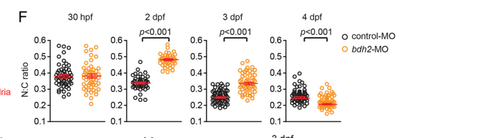

## Question

# Gene Research for Functional Annotation

## ⚠️ CRITICAL: Gene/Protein Identification Context

**BEFORE YOU BEGIN RESEARCH:** You MUST verify you are researching the CORRECT gene/protein. Gene symbols can be ambiguous, especially for less well-characterized genes from non-model organisms.

### Target Gene/Protein Identity (from UniProt):
- **UniProt Accession:** Q561X9
- **Protein Description:** RecName: Full=Dehydrogenase/reductase SDR family member 6; EC=1.1.1.- {ECO:0000305}; AltName: Full=(R)-beta-hydroxybutyrate dehydrogenase; AltName: Full=3-hydroxybutyrate dehydrogenase type 2; EC=1.1.1.30 {ECO:0000250|UniProtKB:Q9BUT1}; AltName: Full=4-oxo-L-proline reductase; EC=1.1.1.104 {ECO:0000250|UniProtKB:D4A1J4, ECO:0000250|UniProtKB:Q9BUT1}; AltName: Full=Oxidoreductase UCPA; AltName: Full=Short chain dehydrogenase/reductase family 15C member 1;
- **Gene Information:** Name=bdh2; ORFNames=si:dkey-162b23.2, zgc:110323;
- **Organism (full):** Danio rerio (Zebrafish) (Brachydanio rerio).
- **Protein Family:** Belongs to the short-chain dehydrogenases/reductases (SDR)
- **Key Domains:** NAD(P)-bd_dom_sf. (IPR036291); Sc_DH/Rdtase_CS. (IPR020904); SDR_DHRS6-like. (IPR051122); SDR_fam. (IPR002347); adh_short_C2 (PF13561)

### MANDATORY VERIFICATION STEPS:

1. **Check if the gene symbol "bdh2" matches the protein description above**
2. **Verify the organism is correct:** Danio rerio (Zebrafish) (Brachydanio rerio).
3. **Check if protein family/domains align with what you find in literature**
4. **If you find literature for a DIFFERENT gene with the same or similar symbol, STOP**

### If Gene Symbol is Ambiguous or You Cannot Find Relevant Literature:

**DO NOT PROCEED WITH RESEARCH ON A DIFFERENT GENE.** Instead:
- State clearly: "The gene symbol 'bdh2' is ambiguous or literature is limited for this specific protein"
- Explain what you found (e.g., "Found extensive literature on a different gene with the same symbol in a different organism")
- Describe the protein based ONLY on the UniProt information provided above
- Suggest that the protein function can be inferred from domain/family information

### Research Target:

Please provide a comprehensive research report on the gene **bdh2** (gene ID: bdh2, UniProt: Q561X9) in DANRE.

The research report should be a detailed narrative explaining the function, biological processes, and localization of the gene product. Citations should be given for all claims.

You should prioritize authoritative reviews and primary scientific literature when conducting research. You can supplement
this with annotations you find in gene/protein databases, but these can be outdated or inaccurate.

We are specifically interested in the primary function of the gene - for enzymes, what reaction is catalyzed, and what is the substrate specificity? For transporters, what is the substrate? For structural proteins or adapters, what is the broader structural role? For signaling molecules, what is the role in the pathway.

We are interested in where in or outside the cell the gene product carries out its function.

We are also interested in the signaling or biochemical pathways in which the gene functions. We are less interested in broad pleiotropic effects, except where these elucidate the precise role.

Include evidence where possible. We are interested in both experimental evidence as well as inference from structure, evolution, or bioinformatic analysis. Precise studies should be prioritized over high-throughput, where available.

## Output

Question: You are an expert researcher providing comprehensive, well-cited information.

Provide detailed information focusing on:
1. Key concepts and definitions with current understanding
2. Recent developments and latest research (prioritize 2023-2024 sources)
3. Current applications and real-world implementations
4. Expert opinions and analysis from authoritative sources
5. Relevant statistics and data from recent studies

Format as a comprehensive research report with proper citations. Include URLs and publication dates where available.
Always prioritize recent, authoritative sources and provide specific citations for all major claims.

# Gene Research for Functional Annotation

## ⚠️ CRITICAL: Gene/Protein Identification Context

**BEFORE YOU BEGIN RESEARCH:** You MUST verify you are researching the CORRECT gene/protein. Gene symbols can be ambiguous, especially for less well-characterized genes from non-model organisms.

### Target Gene/Protein Identity (from UniProt):
- **UniProt Accession:** Q561X9
- **Protein Description:** RecName: Full=Dehydrogenase/reductase SDR family member 6; EC=1.1.1.- {ECO:0000305}; AltName: Full=(R)-beta-hydroxybutyrate dehydrogenase; AltName: Full=3-hydroxybutyrate dehydrogenase type 2; EC=1.1.1.30 {ECO:0000250|UniProtKB:Q9BUT1}; AltName: Full=4-oxo-L-proline reductase; EC=1.1.1.104 {ECO:0000250|UniProtKB:D4A1J4, ECO:0000250|UniProtKB:Q9BUT1}; AltName: Full=Oxidoreductase UCPA; AltName: Full=Short chain dehydrogenase/reductase family 15C member 1;
- **Gene Information:** Name=bdh2; ORFNames=si:dkey-162b23.2, zgc:110323;
- **Organism (full):** Danio rerio (Zebrafish) (Brachydanio rerio).
- **Protein Family:** Belongs to the short-chain dehydrogenases/reductases (SDR)
- **Key Domains:** NAD(P)-bd_dom_sf. (IPR036291); Sc_DH/Rdtase_CS. (IPR020904); SDR_DHRS6-like. (IPR051122); SDR_fam. (IPR002347); adh_short_C2 (PF13561)

### MANDATORY VERIFICATION STEPS:

1. **Check if the gene symbol "bdh2" matches the protein description above**
2. **Verify the organism is correct:** Danio rerio (Zebrafish) (Brachydanio rerio).
3. **Check if protein family/domains align with what you find in literature**
4. **If you find literature for a DIFFERENT gene with the same or similar symbol, STOP**

### If Gene Symbol is Ambiguous or You Cannot Find Relevant Literature:

**DO NOT PROCEED WITH RESEARCH ON A DIFFERENT GENE.** Instead:
- State clearly: "The gene symbol 'bdh2' is ambiguous or literature is limited for this specific protein"
- Explain what you found (e.g., "Found extensive literature on a different gene with the same symbol in a different organism")
- Describe the protein based ONLY on the UniProt information provided above
- Suggest that the protein function can be inferred from domain/family information

### Research Target:

Please provide a comprehensive research report on the gene **bdh2** (gene ID: bdh2, UniProt: Q561X9) in DANRE.

The research report should be a detailed narrative explaining the function, biological processes, and localization of the gene product. Citations should be given for all claims.

You should prioritize authoritative reviews and primary scientific literature when conducting research. You can supplement
this with annotations you find in gene/protein databases, but these can be outdated or inaccurate.

We are specifically interested in the primary function of the gene - for enzymes, what reaction is catalyzed, and what is the substrate specificity? For transporters, what is the substrate? For structural proteins or adapters, what is the broader structural role? For signaling molecules, what is the role in the pathway.

We are interested in where in or outside the cell the gene product carries out its function.

We are also interested in the signaling or biochemical pathways in which the gene functions. We are less interested in broad pleiotropic effects, except where these elucidate the precise role.

Include evidence where possible. We are interested in both experimental evidence as well as inference from structure, evolution, or bioinformatic analysis. Precise studies should be prioritized over high-throughput, where available.

# Research Report: Functional Annotation of **bdh2** (Danio rerio) / Dehydrogenase/reductase SDR family member 6 (UniProt **Q561X9**)

## 0. Target verification (gene/protein identity)
The literature retrieved specifically studies **zebrafish bdh2** (3-hydroxybutyrate dehydrogenase 2; SDR family member) using **bdh2-targeting morpholinos** and **bdh2 mRNA rescue**, with phenotypes in erythrocytes/embryos (hypohemoglobinization, delayed erythroid maturation). This matches the UniProt target (Q561X9; SDR family; gene name *bdh2*) rather than the mitochondrial ketone-body enzyme **BDH1** (which is explicitly distinguished as a different protein in the ortholog literature). (devireddy2010amammaliansiderophore pages 7-8, liu2014endogenoussiderophore25dihydroxybenzoic pages 9-10, davuluri2016inactivationof3hydroxybutyrate pages 3-5)

## 1. Key concepts and current understanding

### 1.1 Short-chain dehydrogenase/reductases (SDRs)
**BDH2 (SDR family member 6)** is a member of the SDR superfamily, which generally uses **NAD(H)** or **NADP(H)** as redox cofactors and typically relies on a conserved active-site Tyr for catalysis. In the BDH2 system described below, mutation of the catalytic Tyr eliminates the observed NAD-dependent oxidation activity. (devireddy2010amammaliansiderophore pages 2-3, liu2014endogenoussiderophore25dihydroxybenzoic pages 1-2)

### 1.2 Competing functional annotations: ketone metabolism vs intracellular iron trafficking
Historically, the name “3-hydroxybutyrate dehydrogenase 2” created ambiguity with ketone-body metabolism. However, multiple lines of evidence support that BDH2’s primary conserved role is **intracellular iron handling** through synthesis of an **endogenous siderophore-like molecule** (2,5-DHBA), rather than bulk ketone-body oxidation. In particular, BDH2 is described as only ~20% identical to mitochondrial BDH1 and is considered dispensable for ketone-body metabolism in vivo in the mouse knockout study. (liu2014endogenoussiderophore25dihydroxybenzoic pages 9-10, liu2014endogenoussiderophore25dihydroxybenzoic pages 1-2)

### 1.3 “Eukaryotic siderophore” model and mitochondrial iron utilization
A central current model is that BDH2 catalyzes a **rate-limiting NAD-dependent step** in biosynthesis of **2,5-dihydroxybenzoic acid (2,5-DHBA)**, an endogenous catecholate that can coordinate iron. BDH2 is a functional homolog of **bacterial EntA**, linking its enzymology to catecholate siderophore chemistry. BDH2-dependent siderophore depletion (in cells, yeast, and zebrafish) is associated with **heme deficiency** and impaired mitochondrial iron-dependent functions. (liu2014endogenoussiderophore25dihydroxybenzoic pages 1-2, pantopoulos2012mechanismsofmammalian pages 9-11)

## 2. Molecular/biochemical function (reaction, substrate specificity, cofactors)

### 2.1 Enzymatic activity supported by biochemical evidence
Devireddy et al. (Cell; **2010-06**, https://doi.org/10.1016/j.cell.2010.04.040) present biochemical evidence that recombinant BDH2 catalyzes an **NAD+-dependent oxidation** analogous to bacterial EntA’s chemistry, assayed as oxidation of **2,3-diDHBA to 2,3-DHBA** with NAD → NADH, and that mutation of an active-site Tyr (Tyr→Phe) abolishes activity. (devireddy2010amammaliansiderophore pages 2-3)

### 2.2 Substrate/product in vivo context: 2,5-DHBA as an iron-binding ligand
The same Cell 2010 study identifies **2,5-DHBA** associated with the mammalian iron-trafficking lipocalin **24p3 (LCN2/NGAL)** and shows that 2,5-DHBA and related ligands can enable 24p3 to bind iron. Reported ligand-binding affinities are approximately **~12 nM for 2,5-DHBA** and **~8 nM for 2,3-DHBA**. (devireddy2010amammaliansiderophore pages 2-3)

**Interpretation for zebrafish annotation:** even though the enzymatic assay used 2,3-diDHBA/2,3-DHBA readouts in the biochemical system, zebrafish phenotypes and rescue by 2,5-DHBA (below) support that the **physiologically relevant pathway output** in vivo is **2,5-DHBA-dependent iron delivery to mitochondrial utilization (heme synthesis).** (davuluri2016inactivationof3hydroxybutyrate pages 3-5, davuluri2016inactivationof3hydroxybutyrate pages 6-8)

## 3. Subcellular localization (where the gene product acts)

### 3.1 Zebrafish: localization inferred from functional readouts
In zebrafish erythrocytes, loss of bdh2 causes mitochondrial dysfunction followed by **premature mitochondrial clearance via mitophagy**, implying that BDH2 activity is functionally upstream of maintaining mitochondria during erythroid maturation (via mitochondrial iron/heme availability). (davuluri2016inactivationof3hydroxybutyrate pages 3-5, davuluri2016inactivationof3hydroxybutyrate pages 6-8)

### 3.2 2024 mechanistic model (mammalian systems): mitochondria–lysosome contact sites
A 2024 study (preprint; **2024-10**, https://doi.org/10.21203/rs.3.rs-5345588/v1) proposes that BDH2 localizes to the **outer mitochondrial membrane** and is enriched at **mitochondria–lysosome contact sites (MLCs)**, where it generates 2,5-DHBA to mediate **lysosome-to-mitochondria iron transfer**. This work also supports a pH-dependent iron-binding mechanism for 2,5-DHBA: NMR-based observations indicate 2,5-DHBA binds Fe(III) and Fe(II) at neutral pH, with Fe(III) complexes remaining stable under acidic conditions, consistent with iron capture in lysosomes and release near mitochondria. (agostinis2024abdh2drivenlysosome pages 9-11)

**Caution for annotation:** the MLC localization is not (yet) demonstrated directly in zebrafish in the evidence retrieved here; it should be treated as **ortholog-informed localization**. (agostinis2024abdh2drivenlysosome pages 9-11)

## 4. Zebrafish-specific biological roles, pathways, and phenotypes

### 4.1 Embryonic heme/hemoglobinization phenotype (Cell 2010)
In zebrafish embryos, *bdh2* morpholino knockdown causes **hypochromic blood** and **markedly reduced o-dianisidine staining** (a hemoglobin/heme-associated stain). Two independent bdh2 morpholinos produced the phenotype, and **mRNA rescue** with bdh2 restored staining. Importantly, globin genes (**hbae1/hbae3**) were reported as expressed normally, suggesting the phenotype reflects impaired heme/iron handling rather than globin transcription. (devireddy2010amammaliansiderophore pages 7-8, devireddy2010amammaliansiderophore pages 11-11)

### 4.2 Erythroid maturation and mitophagy mechanism (PNAS 2016)
Davuluri et al. (PNAS; **2016-02**, https://doi.org/10.1073/pnas.1600077113) provide a mechanistic zebrafish study:

* **Delayed erythroid maturation:** bdh2 inactivation yields immature erythrocyte morphology with increased nuclear-to-cytoplasm (N:C) ratios; quantification used **300 cells** with statistical testing (P < 0.05). (davuluri2016inactivationof3hydroxybutyrate pages 2-3, davuluri2016inactivationof3hydroxybutyrate pages 3-5)
* **Hypohemoglobinization:** reduced o-dianisidine staining is partially rescued by **bdh2 mRNA**. (davuluri2016inactivationof3hydroxybutyrate pages 3-5)
* **Specific rescue by 2,5-DHBA:** supplementation with **2,5-DHBA** rescues hemoglobinization and maturation, whereas tested chemical paralogs (e.g., benzoic acid) do not; DFO can abrogate the 2,5-DHBA rescue, supporting an iron-dependent mechanism. (davuluri2016inactivationof3hydroxybutyrate pages 3-5)
* **Mitochondrial respiration defect:** oxygen consumption in intact erythrocytes is reported as ~**threefold lower** constitutive respiration and ~**2.18-fold lower** uncoupled respiration in bdh2 morphants than controls. (davuluri2016inactivationof3hydroxybutyrate pages 3-5)
* **Premature mitophagy:** erythrocytes become nearly devoid of mitochondria (MitoTracker and OXPHOS staining); mitochondria are observed in autophagosomal vesicles (imaging/EM), consistent with enhanced mitophagy. (davuluri2016inactivationof3hydroxybutyrate pages 3-5, davuluri2016inactivationof3hydroxybutyrate pages 6-8)
* **Epistasis with autophagy:** suppressing autophagy via **atg7** knockdown reduces mitochondrial clearance and partially rescues hemoglobinization and N:C ratios; mitochondrial counts were quantified on **50 cells** (P < 0.05). (davuluri2016inactivationof3hydroxybutyrate pages 6-8)

Figures quantifying N:C ratios and o-dianisidine rescue are available in the retrieved figure crops. (davuluri2016inactivationof3hydroxybutyrate media 10869607, davuluri2016inactivationof3hydroxybutyrate media de8cd0a0, davuluri2016inactivationof3hydroxybutyrate media d6e61517)

### 4.3 Pathway-level interpretation in zebrafish
The integrated zebrafish evidence supports the pathway:

**Bdh2 → 2,5-DHBA (endogenous siderophore-like ligand) → mitochondrial iron availability → heme synthesis & mitochondrial function → appropriate timing of mitophagy during erythropoiesis → erythroid maturation/hemoglobinization.** (davuluri2016inactivationof3hydroxybutyrate pages 3-5, davuluri2016inactivationof3hydroxybutyrate pages 6-8)

## 5. Recent developments (prioritizing 2023–2024) and latest research

### 5.1 2024: BDH2 at mitochondria–lysosome contacts links iron trafficking to ferroptosis
Agostinis et al. (preprint; **2024-10**, https://doi.org/10.21203/rs.3.rs-5345588/v1) extends the siderophore model into a spatially explicit trafficking mechanism:

* **Localization:** BDH2 enriched at **mitochondria–lysosome contact sites (MLCs)**. (agostinis2024abdh2drivenlysosome pages 9-11)
* **Iron redistribution:** BDH2 loss decreases mitochondrial iron and increases lysosomal iron; BDH2 expression or **2,5-DHBA supplementation** reverses this redistribution without changing the cytosolic iron sensor IRP2, consistent with organellar redistribution rather than global iron changes. (agostinis2024abdh2drivenlysosome pages 9-11)
* **Organelle physiology:** BDH2 loss alkalinizes lysosomes; BDH2/2,5-DHBA restores lysosomal acidification and promotes formation of short MLCs, proposing feedback between mitochondrial ATP production, V-ATPase-dependent lysosomal acidification, and MLC stability. (agostinis2024abdh2drivenlysosome pages 9-11, agostinis2024abdh2drivenlysosome pages 1-5)
* **Cell fate relevance:** the BDH2–2,5-DHBA axis modulates ferroptosis sensitivity in melanoma cell-state transitions. (agostinis2024abdh2drivenlysosome pages 1-5)

**Relevance to zebrafish functional annotation:** while mechanistic subcellular localization is ortholog-based, the model provides a plausible cellular explanation for zebrafish erythrocyte phenotypes (mitochondrial iron/heme deficit leading to mitochondrial dysfunction and altered mitophagy timing). (davuluri2016inactivationof3hydroxybutyrate pages 3-5, agostinis2024abdh2drivenlysosome pages 9-11)

### 5.2 2023: expert synthesis connecting BDH2 to ferroptosis and iron buffering (review-level)
A 2023 review on ferroptosis in AML discusses BDH2 as an iron-handling factor that may reduce cytoplasmic free iron and lipid peroxidation, potentially lowering ferroptosis susceptibility; it contrasts this with LCN2/24p3-associated pathways that can increase iron load. This is largely interpretive and disease-contextual rather than zebrafish-specific. (zhang2023susceptibilityofacute pages 6-8)

## 6. Current applications and real-world implementations

### 6.1 Zebrafish as an in vivo platform for iron/heme biology
The zebrafish bdh2 morphant phenotype (hypohemoglobinization with preserved globin gene expression) demonstrates a tractable in vivo model to study **mitochondrial iron utilization and heme synthesis** and how mitochondrial dysfunction feeds into **mitophagy timing** during erythropoiesis. This has practical value for screening modifiers of iron/heme pathways or autophagy-dependent erythroid maturation. (devireddy2010amammaliansiderophore pages 7-8, davuluri2016inactivationof3hydroxybutyrate pages 3-5, davuluri2016inactivationof3hydroxybutyrate pages 6-8)

### 6.2 Translational relevance (ortholog-based): iron trafficking and ferroptosis vulnerabilities
The 2024 mechanistic work suggests BDH2/2,5-DHBA-dependent organellar iron redistribution is actionable in contexts where ferroptosis sensitivity is clinically relevant (e.g., drug-tolerant cancer cell states), although this evidence is from mammalian cancer models and should not be overextended to zebrafish physiology without additional direct validation. (agostinis2024abdh2drivenlysosome pages 1-5, agostinis2024abdh2drivenlysosome pages 9-11)

## 7. Statistics and quantitative data highlights (from primary studies)

* **Ligand binding:** 24p3 binding affinities: ~**12 nM (2,5-DHBA)** and ~**8 nM (2,3-DHBA)**. (devireddy2010amammaliansiderophore pages 2-3)
* **Zebrafish erythrocyte bioenergetics:** constitutive respiration ~**3× lower**; uncoupled respiration ~**2.18× lower** in bdh2 morphants. (davuluri2016inactivationof3hydroxybutyrate pages 3-5)
* **Morphometrics and EM sampling:** N:C ratio quantified using **300 cells**; mitochondrial counts by EM quantified using **50 cells** with P < 0.05. (davuluri2016inactivationof3hydroxybutyrate pages 6-8)

## 8. Evidence summary table
The following evidence table compiles the most directly supported claims for functional annotation.

| Claim/Observation | Species/System | Experimental approach | Key quantitative data | Interpretation for function/localization/pathway | Primary citation (with DOI/URL + year) |
|---|---|---|---|---|---|
| *bdh2* knockdown causes heme/hemoglobin deficiency in zebrafish embryos; phenotype is rescued by MO-resistant *bdh2* mRNA while globin transcripts remain normal | *Danio rerio* embryos | Morpholino knockdown, RT-PCR confirmation of aberrant splicing, whole-mount o-dianisidine staining, isolated blood cell staining, mRNA rescue | Qualitative but replicated phenotype: marked reduction in o-dianisidine staining; second independent MO gave the same result; rescue restored normal staining; no reported reduction of *hbae1*/*hbae3* expression | Supports that zebrafish Bdh2 is required for heme biosynthesis/iron handling rather than globin gene transcription; consistent with a conserved siderophore-mediated mitochondrial iron delivery role rather than canonical ketone-body metabolism (devireddy2010amammaliansiderophore pages 7-8, devireddy2010amammaliansiderophore pages 11-11) | Devireddy et al., *Cell* (2010), DOI: 10.1016/j.cell.2010.04.040, URL: https://doi.org/10.1016/j.cell.2010.04.040 |
| Bdh2 enzymatic activity is NAD+-dependent oxidation of a dihydro-DHBA precursor to DHBA; DHBA binds 24p3 with high affinity | Recombinant mammalian BDH2 / 24p3 system | Enzyme assay with recombinant BDH2, catalytic Tyr mutant, NAD to NADH conversion assay, ligand-binding assays | 24p3 binding affinities reported at ~12 nM for 2,5-DHBA and ~8 nM for 2,3-DHBA; Tyr147/Phe mutation abolished activity | Strong biochemical evidence that BDH2 participates in endogenous catecholate siderophore production; links enzyme activity to iron trafficking via 24p3-bound DHBA, implying a cytosolic iron-chaperoning pathway connected to mitochondrial iron use (devireddy2010amammaliansiderophore pages 2-3) | Devireddy et al., *Cell* (2010), DOI: 10.1016/j.cell.2010.04.040, URL: https://doi.org/10.1016/j.cell.2010.04.040 |
| *bdh2* inactivation delays zebrafish erythroid maturation and causes hypohemoglobinization; rescue by *bdh2* mRNA and by 2,5-DHBA | *Danio rerio* erythrocytes/embryos | Morpholino knockdown, o-dianisidine staining, May-Grunwald/Giemsa morphology, N:C ratio quantification, mRNA rescue, 2,5-DHBA supplementation, iron dextran bypass tests | N:C ratio quantified on 300 cells (mean ± SD, *P* < 0.05); constitutive respiration ~3-fold lower and uncoupled respiration ~2.18-fold lower in morphants; o-dianisidine staining partially rescued by *bdh2* mRNA and by 2,5-DHBA; iron dextran failed to rescue mitochondrial iron deficiency | Indicates Bdh2 acts upstream of mitochondrial iron utilization in erythroid cells, with 2,5-DHBA as functional mediator; supports a pathway of siderophore-dependent mitochondrial iron import required for heme synthesis and erythroid maturation (davuluri2016inactivationof3hydroxybutyrate pages 2-3, davuluri2016inactivationof3hydroxybutyrate pages 3-5, davuluri2016inactivationof3hydroxybutyrate media 10869607) | Davuluri et al., *PNAS* (2016), DOI: 10.1073/pnas.1600077113, URL: https://doi.org/10.1073/pnas.1600077113 |
| Loss of *bdh2* triggers premature mitophagy in zebrafish erythrocytes; blocking autophagy partially rescues maturation/hemoglobinization | *Danio rerio* erythrocytes | Confocal MitoTracker/LysoTracker imaging, electron microscopy, anti-OXPHOS staining, *atg7* morpholino coinjection, transcriptome/GSEA | Mitochondrial counts quantified on 50 cells (mean ± SD, *P* < 0.05); N:C ratio quantified on 300 cells (*P* < 0.05); suppression of *atg7* reduced mitochondrial clearance and partially rescued o-dianisidine staining/maturation | Places Bdh2 function at the intersection of mitochondrial iron metabolism and erythroid organelle clearance: siderophore depletion causes mitochondrial dysfunction, which drives premature mitophagy and delayed maturation (davuluri2016inactivationof3hydroxybutyrate pages 6-8, davuluri2016inactivationof3hydroxybutyrate pages 8-9) | Davuluri et al., *PNAS* (2016), DOI: 10.1073/pnas.1600077113, URL: https://doi.org/10.1073/pnas.1600077113 |
| BDH2 is dispensable for bulk ketone-body metabolism in vivo but required for endogenous siderophore/iron homeostasis; *bdh2*-null mice show anemia and splenic iron overload, partially rescued by 2,5-DHBA | Mouse (*bdh2* knockout) with cross-reference to zebrafish/yeast/cultured cells | Gene knockout, iron phenotyping, supplementation with 2,5-DHBA, comparative interpretation with prior zebrafish knockdown work | No numeric values in provided excerpt; reported outcomes include microcytic anemia, reduced serum iron, splenic iron overload, and partial rescue by 2,5-DHBA supplementation | Supports current view that BDH2’s primary conserved role is in siderophore-dependent intracellular iron trafficking and heme biology, not canonical cytosolic ketone oxidation; zebrafish phenotype is therefore mechanistically coherent with mammalian knockout data (liu2014endogenoussiderophore25dihydroxybenzoic pages 9-10, liu2014endogenoussiderophore25dihydroxybenzoic pages 1-2) | Liu et al., *Molecular and Cellular Biology* (2014), DOI: 10.1128/MCB.00231-14, URL: https://doi.org/10.1128/MCB.00231-14 |

*Table: This table compiles the strongest primary evidence supporting functional annotation of zebrafish bdh2/BDH2 (UniProt Q561X9), integrating zebrafish phenotypes with biochemical and mammalian ortholog data. It is useful for distinguishing the best-supported role in siderophore-dependent iron/heme metabolism from weaker ketone-metabolism annotations.*

## 9. Summary functional annotation (DANRE bdh2; UniProt Q561X9)

**Primary supported molecular function:** SDR enzyme catalyzing an NAD-dependent oxidation step in endogenous catecholate (DHBA) biosynthesis, required for production of **2,5-DHBA**, an iron-binding ligand central to intracellular/organellar iron trafficking. (devireddy2010amammaliansiderophore pages 2-3, liu2014endogenoussiderophore25dihydroxybenzoic pages 1-2)

**Primary supported biological process in zebrafish:** supports **mitochondrial iron utilization and heme/hemoglobinization** during erythropoiesis; loss causes heme deficiency, delayed erythroid maturation, mitochondrial dysfunction, and **premature mitophagy**, with rescue by **bdh2 mRNA** and **2,5-DHBA** and partial rescue by reducing autophagy (atg7). (devireddy2010amammaliansiderophore pages 7-8, davuluri2016inactivationof3hydroxybutyrate pages 3-5, davuluri2016inactivationof3hydroxybutyrate pages 6-8)

**Most likely cellular localization (best current mechanistic model; ortholog-informed):** cytosolic/outer-mitochondrial-membrane-associated enzyme enriched at **mitochondria–lysosome contact sites** coordinating lysosome-to-mitochondria iron transfer via 2,5-DHBA. (agostinis2024abdh2drivenlysosome pages 9-11)

## 10. Key references (with publication dates and URLs)
* Devireddy LR et al. **2010-06**. *Cell*. “A mammalian siderophore synthesized by an enzyme with a bacterial homolog involved in enterobactin production.” https://doi.org/10.1016/j.cell.2010.04.040 (devireddy2010amammaliansiderophore pages 2-3, devireddy2010amammaliansiderophore pages 7-8)
* Davuluri G et al. **2016-02**. *PNAS*. “Inactivation of 3-hydroxybutyrate dehydrogenase 2 delays zebrafish erythroid maturation by conferring premature mitophagy.” https://doi.org/10.1073/pnas.1600077113 (davuluri2016inactivationof3hydroxybutyrate pages 3-5, davuluri2016inactivationof3hydroxybutyrate pages 6-8)
* Liu Z et al. **2014-07**. *Molecular and Cellular Biology*. “Endogenous siderophore 2,5-DHBA deficiency promotes anemia and splenic iron overload in mice.” https://doi.org/10.1128/MCB.00231-14 (liu2014endogenoussiderophore25dihydroxybenzoic pages 1-2)
* Agostinis P et al. **2024-10**. Preprint. “A bdh2-driven lysosome to mitochondria iron trafficking controls ferroptosis in melanoma.” https://doi.org/10.21203/rs.3.rs-5345588/v1 (agostinis2024abdh2drivenlysosome pages 1-5)
* Zhang H et al. **2023-09**. *Frontiers in Molecular Biosciences* (review). “Susceptibility of acute myeloid leukemia cells to ferroptosis and evasion strategies.” https://doi.org/10.3389/fmolb.2023.1275774 (zhang2023susceptibilityofacute pages 6-8)

## 11. Limitations of the retrieved evidence base
Despite the request to prioritize 2023–2024, **direct zebrafish bdh2 functional studies retrieved here are primarily 2010 and 2016**, whereas 2023–2024 advances are mainly mechanistic extensions in mammalian systems and interpretive reviews. Therefore, zebrafish conclusions are strongly evidence-based but not “recent,” and recent mechanistic localization (MLCs) should be treated as ortholog-informed until directly validated in zebrafish tissues. (devireddy2010amammaliansiderophore pages 7-8, davuluri2016inactivationof3hydroxybutyrate pages 3-5, agostinis2024abdh2drivenlysosome pages 9-11)

References

1. (devireddy2010amammaliansiderophore pages 7-8): Laxminarayana R. Devireddy, Daniel O. Hart, David H. Goetz, and Michael R. Green. A mammalian siderophore synthesized by an enzyme with a bacterial homolog involved in enterobactin production. Cell, 141:1006-1017, Jun 2010. URL: https://doi.org/10.1016/j.cell.2010.04.040, doi:10.1016/j.cell.2010.04.040. This article has 370 citations and is from a highest quality peer-reviewed journal.

2. (liu2014endogenoussiderophore25dihydroxybenzoic pages 9-10): Zhuoming Liu, Alieta Ciocea, and L. Devireddy. Endogenous siderophore 2,5-dihydroxybenzoic acid deficiency promotes anemia and splenic iron overload in mice. Molecular and Cellular Biology, 34:2533-2546, Jul 2014. URL: https://doi.org/10.1128/mcb.00231-14, doi:10.1128/mcb.00231-14. This article has 49 citations and is from a domain leading peer-reviewed journal.

3. (davuluri2016inactivationof3hydroxybutyrate pages 3-5): Gangarao Davuluri, Ping Song, Zhuoming Liu, David Wald, Takuya F. Sakaguchi, Michael R. Green, and L. Devireddy. Inactivation of 3-hydroxybutyrate dehydrogenase 2 delays zebrafish erythroid maturation by conferring premature mitophagy. Proceedings of the National Academy of Sciences, 113:E1460-E1469, Feb 2016. URL: https://doi.org/10.1073/pnas.1600077113, doi:10.1073/pnas.1600077113. This article has 30 citations and is from a highest quality peer-reviewed journal.

4. (devireddy2010amammaliansiderophore pages 2-3): Laxminarayana R. Devireddy, Daniel O. Hart, David H. Goetz, and Michael R. Green. A mammalian siderophore synthesized by an enzyme with a bacterial homolog involved in enterobactin production. Cell, 141:1006-1017, Jun 2010. URL: https://doi.org/10.1016/j.cell.2010.04.040, doi:10.1016/j.cell.2010.04.040. This article has 370 citations and is from a highest quality peer-reviewed journal.

5. (liu2014endogenoussiderophore25dihydroxybenzoic pages 1-2): Zhuoming Liu, Alieta Ciocea, and L. Devireddy. Endogenous siderophore 2,5-dihydroxybenzoic acid deficiency promotes anemia and splenic iron overload in mice. Molecular and Cellular Biology, 34:2533-2546, Jul 2014. URL: https://doi.org/10.1128/mcb.00231-14, doi:10.1128/mcb.00231-14. This article has 49 citations and is from a domain leading peer-reviewed journal.

6. (pantopoulos2012mechanismsofmammalian pages 9-11): Kostas Pantopoulos, Suheel Kumar Porwal, Alan Tartakoff, and L. Devireddy. Mechanisms of mammalian iron homeostasis. Biochemistry, 51 29:5705-24, Jul 2012. URL: https://doi.org/10.1021/bi300752r, doi:10.1021/bi300752r. This article has 793 citations and is from a peer-reviewed journal.

7. (davuluri2016inactivationof3hydroxybutyrate pages 6-8): Gangarao Davuluri, Ping Song, Zhuoming Liu, David Wald, Takuya F. Sakaguchi, Michael R. Green, and L. Devireddy. Inactivation of 3-hydroxybutyrate dehydrogenase 2 delays zebrafish erythroid maturation by conferring premature mitophagy. Proceedings of the National Academy of Sciences, 113:E1460-E1469, Feb 2016. URL: https://doi.org/10.1073/pnas.1600077113, doi:10.1073/pnas.1600077113. This article has 30 citations and is from a highest quality peer-reviewed journal.

8. (agostinis2024abdh2drivenlysosome pages 9-11): Patrizia Agostinis, Francesca Rizzollo, Abril Escamilla-Ayala, Nicola Fattorelli, Natalia Lysiak, Sanket More, Lucia Barazzuol, Chris Van den Haute, Joris Van Asselberghs, David Nittner, Jonathan Coene, Vivek Venkataramani, Bernhard Michalke, Christine Gaillet, Tatiana Cañeque, Irwin Davidson, Steven Verhelst, Peter Vangheluwe, Tito Calì, Jean Christophe Marine, Raphaël Rodriguez, and Julie Bonnereau. A bdh2-driven lysosome to mitochondria iron trafficking controls ferroptosis in melanoma. Unknown journal, Oct 2024. URL: https://doi.org/10.21203/rs.3.rs-5345588/v1, doi:10.21203/rs.3.rs-5345588/v1.

9. (devireddy2010amammaliansiderophore pages 11-11): Laxminarayana R. Devireddy, Daniel O. Hart, David H. Goetz, and Michael R. Green. A mammalian siderophore synthesized by an enzyme with a bacterial homolog involved in enterobactin production. Cell, 141:1006-1017, Jun 2010. URL: https://doi.org/10.1016/j.cell.2010.04.040, doi:10.1016/j.cell.2010.04.040. This article has 370 citations and is from a highest quality peer-reviewed journal.

10. (davuluri2016inactivationof3hydroxybutyrate pages 2-3): Gangarao Davuluri, Ping Song, Zhuoming Liu, David Wald, Takuya F. Sakaguchi, Michael R. Green, and L. Devireddy. Inactivation of 3-hydroxybutyrate dehydrogenase 2 delays zebrafish erythroid maturation by conferring premature mitophagy. Proceedings of the National Academy of Sciences, 113:E1460-E1469, Feb 2016. URL: https://doi.org/10.1073/pnas.1600077113, doi:10.1073/pnas.1600077113. This article has 30 citations and is from a highest quality peer-reviewed journal.

11. (davuluri2016inactivationof3hydroxybutyrate media 10869607): Gangarao Davuluri, Ping Song, Zhuoming Liu, David Wald, Takuya F. Sakaguchi, Michael R. Green, and L. Devireddy. Inactivation of 3-hydroxybutyrate dehydrogenase 2 delays zebrafish erythroid maturation by conferring premature mitophagy. Proceedings of the National Academy of Sciences, 113:E1460-E1469, Feb 2016. URL: https://doi.org/10.1073/pnas.1600077113, doi:10.1073/pnas.1600077113. This article has 30 citations and is from a highest quality peer-reviewed journal.

12. (davuluri2016inactivationof3hydroxybutyrate media de8cd0a0): Gangarao Davuluri, Ping Song, Zhuoming Liu, David Wald, Takuya F. Sakaguchi, Michael R. Green, and L. Devireddy. Inactivation of 3-hydroxybutyrate dehydrogenase 2 delays zebrafish erythroid maturation by conferring premature mitophagy. Proceedings of the National Academy of Sciences, 113:E1460-E1469, Feb 2016. URL: https://doi.org/10.1073/pnas.1600077113, doi:10.1073/pnas.1600077113. This article has 30 citations and is from a highest quality peer-reviewed journal.

13. (davuluri2016inactivationof3hydroxybutyrate media d6e61517): Gangarao Davuluri, Ping Song, Zhuoming Liu, David Wald, Takuya F. Sakaguchi, Michael R. Green, and L. Devireddy. Inactivation of 3-hydroxybutyrate dehydrogenase 2 delays zebrafish erythroid maturation by conferring premature mitophagy. Proceedings of the National Academy of Sciences, 113:E1460-E1469, Feb 2016. URL: https://doi.org/10.1073/pnas.1600077113, doi:10.1073/pnas.1600077113. This article has 30 citations and is from a highest quality peer-reviewed journal.

14. (agostinis2024abdh2drivenlysosome pages 1-5): Patrizia Agostinis, Francesca Rizzollo, Abril Escamilla-Ayala, Nicola Fattorelli, Natalia Lysiak, Sanket More, Lucia Barazzuol, Chris Van den Haute, Joris Van Asselberghs, David Nittner, Jonathan Coene, Vivek Venkataramani, Bernhard Michalke, Christine Gaillet, Tatiana Cañeque, Irwin Davidson, Steven Verhelst, Peter Vangheluwe, Tito Calì, Jean Christophe Marine, Raphaël Rodriguez, and Julie Bonnereau. A bdh2-driven lysosome to mitochondria iron trafficking controls ferroptosis in melanoma. Unknown journal, Oct 2024. URL: https://doi.org/10.21203/rs.3.rs-5345588/v1, doi:10.21203/rs.3.rs-5345588/v1.

15. (zhang2023susceptibilityofacute pages 6-8): Hanyun Zhang, Chunjie Sun, Qi Sun, Ye Li, Chao Zhou, and Changgang Sun. Susceptibility of acute myeloid leukemia cells to ferroptosis and evasion strategies. Frontiers in Molecular Biosciences, Sep 2023. URL: https://doi.org/10.3389/fmolb.2023.1275774, doi:10.3389/fmolb.2023.1275774. This article has 30 citations.

16. (davuluri2016inactivationof3hydroxybutyrate pages 8-9): Gangarao Davuluri, Ping Song, Zhuoming Liu, David Wald, Takuya F. Sakaguchi, Michael R. Green, and L. Devireddy. Inactivation of 3-hydroxybutyrate dehydrogenase 2 delays zebrafish erythroid maturation by conferring premature mitophagy. Proceedings of the National Academy of Sciences, 113:E1460-E1469, Feb 2016. URL: https://doi.org/10.1073/pnas.1600077113, doi:10.1073/pnas.1600077113. This article has 30 citations and is from a highest quality peer-reviewed journal.

## Artifacts

- [Edison artifact artifact-00](bdh2-deep-research-falcon_artifacts/artifact-00.md)

## Citations

1. devireddy2010amammaliansiderophore pages 2-3
2. zhang2023susceptibilityofacute pages 6-8
3. devireddy2010amammaliansiderophore pages 7-8
4. pantopoulos2012mechanismsofmammalian pages 9-11
5. devireddy2010amammaliansiderophore pages 11-11
6. https://doi.org/10.1016/j.cell.2010.04.040
7. https://doi.org/10.21203/rs.3.rs-5345588/v1
8. https://doi.org/10.1073/pnas.1600077113
9. https://doi.org/10.1128/MCB.00231-14
10. https://doi.org/10.3389/fmolb.2023.1275774
11. https://doi.org/10.1016/j.cell.2010.04.040,
12. https://doi.org/10.1128/mcb.00231-14,
13. https://doi.org/10.1073/pnas.1600077113,
14. https://doi.org/10.1021/bi300752r,
15. https://doi.org/10.21203/rs.3.rs-5345588/v1,
16. https://doi.org/10.3389/fmolb.2023.1275774,