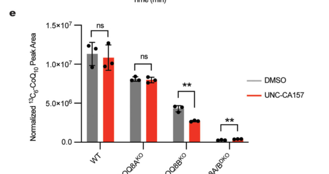

## Question

# Gene Research for Functional Annotation

## ⚠️ CRITICAL: Gene/Protein Identification Context

**BEFORE YOU BEGIN RESEARCH:** You MUST verify you are researching the CORRECT gene/protein. Gene symbols can be ambiguous, especially for less well-characterized genes from non-model organisms.

### Target Gene/Protein Identity (from UniProt):
- **UniProt Accession:** Q5RGU1
- **Protein Description:** RecName: Full=Atypical kinase COQ8A, mitochondrial {ECO:0000305}; EC=2.7.-.- {ECO:0000250|UniProtKB:Q8NI60}; AltName: Full=Chaperone activity of bc1 complex-like {ECO:0000250|UniProtKB:Q8NI60}; Short=Chaperone-ABC1-like {ECO:0000250|UniProtKB:Q8NI60}; AltName: Full=Coenzyme Q protein 8A {ECO:0000250|UniProtKB:Q8NI60}; AltName: Full=aarF domain-containing protein kinase 3 {ECO:0000250|UniProtKB:Q8NI60}; Flags: Precursor;
- **Gene Information:** Name=coq8a {ECO:0000250|UniProtKB:Q8NI60}; Synonyms=adck3 {ECO:0000250|UniProtKB:Q8NI60}, cabc1 {ECO:0000250|UniProtKB:Q8NI60}; ORFNames=zgc:92578 {ECO:0000303|Ref.2};
- **Organism (full):** Danio rerio (Zebrafish) (Brachydanio rerio).
- **Protein Family:** Belongs to the protein kinase superfamily. ADCK protein
- **Key Domains:** ABC1_dom. (IPR004147); ADCK3_dom. (IPR034646); Atypical_kinase_ADCK. (IPR051409); Kinase-like_dom_sf. (IPR011009); ABC1 (PF03109)

### MANDATORY VERIFICATION STEPS:

1. **Check if the gene symbol "coq8a" matches the protein description above**
2. **Verify the organism is correct:** Danio rerio (Zebrafish) (Brachydanio rerio).
3. **Check if protein family/domains align with what you find in literature**
4. **If you find literature for a DIFFERENT gene with the same or similar symbol, STOP**

### If Gene Symbol is Ambiguous or You Cannot Find Relevant Literature:

**DO NOT PROCEED WITH RESEARCH ON A DIFFERENT GENE.** Instead:
- State clearly: "The gene symbol 'coq8a' is ambiguous or literature is limited for this specific protein"
- Explain what you found (e.g., "Found extensive literature on a different gene with the same symbol in a different organism")
- Describe the protein based ONLY on the UniProt information provided above
- Suggest that the protein function can be inferred from domain/family information

### Research Target:

Please provide a comprehensive research report on the gene **coq8a** (gene ID: coq8a, UniProt: Q5RGU1) in DANRE.

The research report should be a detailed narrative explaining the function, biological processes, and localization of the gene product. Citations should be given for all claims.

You should prioritize authoritative reviews and primary scientific literature when conducting research. You can supplement
this with annotations you find in gene/protein databases, but these can be outdated or inaccurate.

We are specifically interested in the primary function of the gene - for enzymes, what reaction is catalyzed, and what is the substrate specificity? For transporters, what is the substrate? For structural proteins or adapters, what is the broader structural role? For signaling molecules, what is the role in the pathway.

We are interested in where in or outside the cell the gene product carries out its function.

We are also interested in the signaling or biochemical pathways in which the gene functions. We are less interested in broad pleiotropic effects, except where these elucidate the precise role.

Include evidence where possible. We are interested in both experimental evidence as well as inference from structure, evolution, or bioinformatic analysis. Precise studies should be prioritized over high-throughput, where available.

## Output

Question: You are an expert researcher providing comprehensive, well-cited information.

Provide detailed information focusing on:
1. Key concepts and definitions with current understanding
2. Recent developments and latest research (prioritize 2023-2024 sources)
3. Current applications and real-world implementations
4. Expert opinions and analysis from authoritative sources
5. Relevant statistics and data from recent studies

Format as a comprehensive research report with proper citations. Include URLs and publication dates where available.
Always prioritize recent, authoritative sources and provide specific citations for all major claims.

# Gene Research for Functional Annotation

## ⚠️ CRITICAL: Gene/Protein Identification Context

**BEFORE YOU BEGIN RESEARCH:** You MUST verify you are researching the CORRECT gene/protein. Gene symbols can be ambiguous, especially for less well-characterized genes from non-model organisms.

### Target Gene/Protein Identity (from UniProt):
- **UniProt Accession:** Q5RGU1
- **Protein Description:** RecName: Full=Atypical kinase COQ8A, mitochondrial {ECO:0000305}; EC=2.7.-.- {ECO:0000250|UniProtKB:Q8NI60}; AltName: Full=Chaperone activity of bc1 complex-like {ECO:0000250|UniProtKB:Q8NI60}; Short=Chaperone-ABC1-like {ECO:0000250|UniProtKB:Q8NI60}; AltName: Full=Coenzyme Q protein 8A {ECO:0000250|UniProtKB:Q8NI60}; AltName: Full=aarF domain-containing protein kinase 3 {ECO:0000250|UniProtKB:Q8NI60}; Flags: Precursor;
- **Gene Information:** Name=coq8a {ECO:0000250|UniProtKB:Q8NI60}; Synonyms=adck3 {ECO:0000250|UniProtKB:Q8NI60}, cabc1 {ECO:0000250|UniProtKB:Q8NI60}; ORFNames=zgc:92578 {ECO:0000303|Ref.2};
- **Organism (full):** Danio rerio (Zebrafish) (Brachydanio rerio).
- **Protein Family:** Belongs to the protein kinase superfamily. ADCK protein
- **Key Domains:** ABC1_dom. (IPR004147); ADCK3_dom. (IPR034646); Atypical_kinase_ADCK. (IPR051409); Kinase-like_dom_sf. (IPR011009); ABC1 (PF03109)

### MANDATORY VERIFICATION STEPS:

1. **Check if the gene symbol "coq8a" matches the protein description above**
2. **Verify the organism is correct:** Danio rerio (Zebrafish) (Brachydanio rerio).
3. **Check if protein family/domains align with what you find in literature**
4. **If you find literature for a DIFFERENT gene with the same or similar symbol, STOP**

### If Gene Symbol is Ambiguous or You Cannot Find Relevant Literature:

**DO NOT PROCEED WITH RESEARCH ON A DIFFERENT GENE.** Instead:
- State clearly: "The gene symbol 'coq8a' is ambiguous or literature is limited for this specific protein"
- Explain what you found (e.g., "Found extensive literature on a different gene with the same symbol in a different organism")
- Describe the protein based ONLY on the UniProt information provided above
- Suggest that the protein function can be inferred from domain/family information

### Research Target:

Please provide a comprehensive research report on the gene **coq8a** (gene ID: coq8a, UniProt: Q5RGU1) in DANRE.

The research report should be a detailed narrative explaining the function, biological processes, and localization of the gene product. Citations should be given for all claims.

You should prioritize authoritative reviews and primary scientific literature when conducting research. You can supplement
this with annotations you find in gene/protein databases, but these can be outdated or inaccurate.

We are specifically interested in the primary function of the gene - for enzymes, what reaction is catalyzed, and what is the substrate specificity? For transporters, what is the substrate? For structural proteins or adapters, what is the broader structural role? For signaling molecules, what is the role in the pathway.

We are interested in where in or outside the cell the gene product carries out its function.

We are also interested in the signaling or biochemical pathways in which the gene functions. We are less interested in broad pleiotropic effects, except where these elucidate the precise role.

Include evidence where possible. We are interested in both experimental evidence as well as inference from structure, evolution, or bioinformatic analysis. Precise studies should be prioritized over high-throughput, where available.

## Research report: Danio rerio **coq8a** (UniProt Q5RGU1) — functional annotation and current understanding

### 0) Target verification (critical identity check)
The UniProt accession **Q5RGU1** is specified as zebrafish (**Danio rerio**) **coq8a** with synonyms **adck3/cabc1**, annotated as an **atypical mitochondrial kinase-like protein** in the **UbiB/ADCK (ABC1)** family. The retrieved literature consistently treats **COQ8A (ADCK3)** as distinct from its paralog **COQ8B (ADCK4)** (different disease associations and tissue roles), matching the user-provided UniProt description and domain family assignment. Therefore, the research below is scoped to the **COQ8A/ADCK3 orthology group** and not COQ8B/ADCK4. (murray2023smallmoleculeinhibitionof pages 1-3, jacquet2025theadckkinase pages 8-9)

### 1) Key concepts and definitions (current understanding)

#### 1.1 Coenzyme Q (CoQ; ubiquinone)
CoQ is a redox-active lipid best known as a **mobile electron carrier in mitochondrial oxidative phosphorylation**, but it also participates broadly in redox homeostasis and other CoQ-dependent processes. Reviews emphasize that CoQ biology extends beyond electron transport and that therapeutic manipulation is complicated by CoQ’s extreme lipophilicity and poor bioavailability. (guerra2023coenzymeqbiochemistry pages 8-9)

#### 1.2 The COQ biosynthetic system (“COQ metabolon / COQ-synthome”)
In animals, CoQ biosynthesis is attributed to multiple proteins that form a **multicomponent assembly** (often discussed as a metabolon). Recent work describes the headgroup-modifying enzymes as forming a core “COQ metabolon,” and auxiliary factors (including COQ8 proteins) modulate flux and efficiency. (nicoll2024invitroconstruction pages 12-15, jacquet2025theadckkinase pages 8-9)

#### 1.3 COQ8A / ADCK3 / CABC1 (UbiB family)
COQ8A is part of the **UbiB/ADCK atypical protein kinase-like superfamily**. Importantly, multiple sources emphasize that COQ8-family proteins are **not well-supported as canonical protein kinases with defined protein substrates**; rather, they are increasingly modeled as **ATPase/ATP-dependent regulators** of CoQ biosynthesis that operate at the mitochondrial inner membrane environment where CoQ intermediates reside. (murray2023smallmoleculeinhibitionof pages 1-3, guerra2023coenzymeqbiochemistry pages 8-9)

### 2) Primary molecular function of zebrafish coq8a (inferred from conserved ortholog biology)

#### 2.1 Best-supported function: ATPase-driven regulation of de novo CoQ biosynthesis
A 2023 authoritative review (Trends in Biochemical Sciences) states that COQ8 homologs have **ATPase activity required for CoQ production** and discusses models linking ATP hydrolysis to handling/extraction of hydrophobic CoQ species from the inner mitochondrial membrane (IMM). (guerra2023coenzymeqbiochemistry pages 8-9)

A 2023 Nature Chemical Biology study frames COQ8A/COQ8B as required for CoQ biosynthesis and proposes that COQ8 proteins support the CoQ biosynthetic complex and access intermediates “embedded” in the IMM—supporting the concept that zebrafish Coq8a (Q5RGU1) acts primarily as an **ATP-dependent facilitator/chaperone-like factor** rather than a classical kinase. (murray2023smallmoleculeinhibitionof pages 1-3, murray2023smallmoleculeinhibitionof pages 22-23)

**Interpretation for annotation:** For Danio rerio **Coq8a**, the most defensible primary function is: *a mitochondrial UbiB-family ATPase/kinase-like protein that promotes CoQ biosynthesis by supporting the COQ metabolon and/or mobilizing lipidic CoQ intermediates in the IMM.* (guerra2023coenzymeqbiochemistry pages 8-9, murray2023smallmoleculeinhibitionof pages 1-3)

#### 2.2 Catalytic activity and substrate specificity
No source in the retrieved evidence provides a defined phosphotransfer reaction (protein substrate and phosphorylation site) for COQ8A. Instead, ATPase activity and small-molecule/lipid modulation dominate mechanistic descriptions. Therefore, any EC “2.7.-.-” style “kinase” labeling should be treated as **kinase-like fold** rather than a defined kinase reaction.

The review literature reports that COQ8A ATPase activity can be directly modulated by **phenolic/headgroup-like compounds** (e.g., 2-propylphenol as an activator), reinforcing that COQ8A activity is tightly coupled to the CoQ lipid/intermediate environment rather than protein phosphorylation of downstream targets. (guerra2023coenzymeqbiochemistry pages 8-9, murray2023smallmoleculeinhibitionof pages 22-23)

### 3) Subcellular localization and pathway context

#### 3.1 Localization
COQ8A is consistently described as a **mitochondrial** protein that associates with the IMM/cristae environment where CoQ biosynthesis occurs. A mechanistic mouse study (2023, Brain) explicitly treats COQ8A as a mitochondrial factor and links its loss to mitochondrial membrane potential defects and elevated mitochondrial oxidative stress in neurons—functional evidence consistent with IMM-associated CoQ pathway disruption. (manolaras2023mitochondrialdysfunctionand pages 10-13)

Although these studies are not zebrafish-specific for coq8a, the high conservation of COQ8A function and the UniProt designation “mitochondrial” make mitochondrial localization the strongest evidence-based annotation for zebrafish Coq8a. (murray2023smallmoleculeinhibitionof pages 1-3, manolaras2023mitochondrialdysfunctionand pages 10-13)

#### 3.2 Pathway placement: CoQ biosynthesis and respiratory chain function
COQ8A loss disrupts CoQ-linked respiratory chain performance. In a conditional/constitutive knockout mouse study, COQ8A deletion in Purkinje neurons was associated with early and prominent impacts on respiratory chain components (Complex IV alterations appearing early), as well as broader reductions in Complex I/II/IV activities at later stages—consistent with the CoQ pool’s role as an electron carrier feeding downstream complexes. (manolaras2023mitochondrialdysfunctionand pages 10-13)

### 4) Recent developments (prioritizing 2023–2024)

#### 4.1 2023: chemical probes and selective inhibition of COQ8A in cells
A major 2023 advance is the development of **selective small-molecule inhibitors** enabling direct perturbation of COQ8A activity in mammalian cells to test function. The Nature Chemical Biology paper describes repurposing a 4-anilinoquinoline scaffold to selectively inhibit human COQ8A, using crystallography, activity assays, and cellular CoQ measurements. (murray2023smallmoleculeinhibitionof pages 1-3)

**Quantitative examples from figures/extended data (cell-based):** The paper reports LC–MS measurements of de novo CoQ10/precursor levels in HAP1 cells using defined inhibitor concentrations including **20 µM UNC-CA157** and a mitochondria-targeted analog **17.6 µM TPP-UNC-CA157** (and dose–response experiments). These data provide a chemical-genetic handle to test COQ8A-dependent CoQ synthesis flux. (murray2023smallmoleculeinhibitionof pages 18-22, murray2023smallmoleculeinhibitionof media 0385d69a, murray2023smallmoleculeinhibitionof media 55faff3d, murray2023smallmoleculeinhibitionof media 59695847)

#### 4.2 2023: synthesis of therapeutic/tool landscape for CoQ pathway manipulation
A 2023 Trends in Biochemical Sciences review highlights multiple strategies: delivery vehicles (TPP derivatives, liposomes, micelles) and **“bypass” headgroup analogs**; and it explicitly describes COQ8A as an emerging focus for both inhibition and activation (e.g., 2-propylphenol as a direct ATPase activator). (guerra2023coenzymeqbiochemistry pages 8-9)

#### 4.3 2024: in vitro reconstruction of the animal COQ metabolon
A 2024 Nature Catalysis study reports **in vitro construction of the COQ metabolon**, and states that **COQ8 increases and streamlines coenzyme Q production** in this reconstructed system—strong evidence that COQ8 is an ATP-driven pathway accelerator/regulator within the biosynthetic assembly. This reinforces the “auxiliary ATPase” model for coq8a functional annotation in zebrafish. (nicoll2024invitroconstruction pages 12-15)

### 5) Zebrafish-specific evidence and limitations

#### 5.1 Direct coq8a (Q5RGU1) zebrafish functional studies
Within the retrieved corpus, **direct experimental studies** (e.g., zebrafish coq8a knockout, morpholino knockdown, rescue, or localization assays) were not identified. Accordingly, zebrafish coq8a function is best annotated by **orthology-based inference** from COQ8A biology combined with zebrafish CoQ-pathway context studies. (rossmann2021cellspecifictranscriptionalcontrol pages 1-2, mugoni2013ubiad1isan pages 1-2)

#### 5.2 Zebrafish CoQ biology supports pathway relevance in vivo
A zebrafish developmental study (Science 2021) shows that tif1γ loss reduces expression of CoQ synthesis genes and reduces CoQ levels, connecting CoQ biosynthesis to mitochondrial respiration and erythropoiesis; the work uses chemical perturbations (e.g., DHODH inhibitors) and respiratory readouts (OCR), emphasizing that CoQ pathway modulation yields strong organismal phenotypes in zebrafish embryos. This supports the biological importance of CoQ pathway genes (including coq8a) in zebrafish, even though it does not isolate coq8a specifically. (rossmann2021cellspecifictranscriptionalcontrol pages 1-2, rossmann2021cellspecifictranscriptionalcontrol pages 7-12)

Separately, zebrafish genetics established that **ubiad1** encodes a non-mitochondrial prenyltransferase contributing to cellular CoQ10 pools and that loss causes cardiovascular oxidative-stress phenotypes, illustrating that CoQ metabolism is a critical determinant of zebrafish tissue physiology and oxidative stress control. (mugoni2013ubiad1isan pages 1-2, mugoni2013ubiad1isan pages 10-11)

### 6) Current applications and real-world implementations

#### 6.1 Chemical biology applications
The 2023 COQ8 chemical inhibitors (and mitochondria-targeted versions) provide practical tools to:
- acutely test COQ8A contribution to de novo CoQ biosynthesis;
- distinguish COQ8A vs COQ8B roles using KO lines;
- map downstream physiological consequences of CoQ limitation. (murray2023smallmoleculeinhibitionof pages 1-3, murray2023smallmoleculeinhibitionof pages 18-22)

#### 6.2 Biomedical/clinical translation (human ortholog context)
Clinical and review literature emphasizes that primary CoQ deficiencies are potentially treatable, but CoQ supplementation can be limited by poor bioavailability; thus, delivery innovations and bypass strategies are active areas. Reviews also highlight challenges in diagnosis (e.g., plasma CoQ measurements can be confounded by lipid status). (guerra2023coenzymeqbiochemistry pages 8-9, staiano2023biosynthesisdeficiencyand pages 5-7)

A 2023 review notes that plasma CoQ10 is largely transported on lipoproteins and cites an estimate that **~58% of plasma CoQ10 is associated with LDL**, motivating normalization to cholesterol/LDL when interpreting measurements. While this is human-focused, it is an example of real-world implementation details in CoQ deficiency workups. (staiano2023biosynthesisdeficiencyand pages 5-7)

### 7) Expert synthesis (authoritative interpretation)
Across 2023–2024 sources, there is convergence on a mechanistic narrative:
- COQ8A is best understood as an **ATP-driven auxiliary factor** that promotes CoQ biosynthesis, likely by facilitating the handling/availability of lipid intermediates and stabilizing or activating the metabolon at the IMM. (guerra2023coenzymeqbiochemistry pages 8-9, nicoll2024invitroconstruction pages 12-15)
- The field has moved from “mysterious atypical kinase” toward **testable biochemical models** using chemical probes and reconstructed biosynthetic systems. (murray2023smallmoleculeinhibitionof pages 1-3, nicoll2024invitroconstruction pages 12-15)

### 8) Practical functional annotation for Danio rerio coq8a (Q5RGU1)

| Annotation aspect | Summary statement | Key evidence/citations |
|---|---|---|
| Identity / synonyms | Target verified as **Danio rerio coq8a** ortholog of mammalian **COQ8A/ADCK3/CABC1**; literature distinguishes it from paralog **COQ8B/ADCK4**. The zebrafish-specific primary literature is limited, so functional annotation relies mainly on conserved ortholog evidence plus zebrafish CoQ-pathway studies. | (murray2023smallmoleculeinhibitionof pages 1-3, murray2023smallmoleculeinhibitionof pages 22-23, staiano2023biosynthesisdeficiencyand pages 5-7) |
| Protein family / domains | COQ8A belongs to the **UbiB/ADCK atypical protein kinase-like family**, a protein kinase superfamily branch with an atypical kinase-like fold rather than a conventional protein kinase mechanism. This aligns with UniProt’s ABC1/ADCK family assignment. | (murray2023smallmoleculeinhibitionof pages 1-3, murray2023smallmoleculeinhibitionof pages 22-23, guerra2023coenzymeqbiochemistry pages 8-9) |
| Molecular function | Best current model: COQ8A is a **mitochondrial ATPase/kinase-like regulator** that promotes CoQ biosynthesis, likely by supporting access to or handling hydrophobic CoQ intermediates and stabilizing the biosynthetic machinery rather than by acting as a classic protein-substrate kinase. | (guerra2023coenzymeqbiochemistry pages 8-9, murray2023smallmoleculeinhibitionof pages 1-3, murray2023smallmoleculeinhibitionof pages 22-23) |
| Catalytic activity | No definitive canonical protein-kinase substrate reaction is established. Instead, **ATPase activity is required for CoQ production**; ATPase activity can be enhanced by cardiolipin-rich membranes and phenolic CoQ-like compounds. Thus, UniProt’s EC 2.7.-.- should be interpreted cautiously as kinase-like, not a well-defined phosphotransferase reaction. | (guerra2023coenzymeqbiochemistry pages 8-9, jacquet2025theadckkinase pages 8-9) |
| Pathway role | COQ8A functions in the **coenzyme Q (ubiquinone/CoQ) biosynthetic pathway** in mitochondria, helping maintain efficient de novo CoQ synthesis and broader respiratory-chain function. Loss of COQ8A impairs CoQ production and downstream oxidative phosphorylation. | (murray2023smallmoleculeinhibitionof pages 1-3, guerra2023coenzymeqbiochemistry pages 8-9, staiano2023biosynthesisdeficiencyand pages 5-7) |
| Subcellular localization | Conserved ortholog data place COQ8A in the **mitochondrion**, associated with the **inner mitochondrial membrane / cristae** and CoQ-biosynthetic environment. This is the most likely localization for zebrafish coq8a as well. | (jacquet2025theadckkinase pages 8-9, murray2023smallmoleculeinhibitionof pages 1-3, manolaras2023mitochondrialdysfunctionand pages 10-13) |
| Key interacting partners / complex | COQ8A associates with the **COQ metabolon / CoQ biosynthetic complex**, with reported links to **COQ3, COQ5, COQ7, and COQ9**; recent reconstitution work supports a role for COQ8 in increasing and streamlining CoQ production within the metabolon. | (jacquet2025theadckkinase pages 8-9, nicoll2024invitroconstruction pages 12-15, calderan2023sviluppodimodelli pages 54-59) |
| Organism-specific evidence in zebrafish | Direct zebrafish coq8a functional papers were not identified in the retrieved corpus. However, zebrafish studies show CoQ biology is functionally important in vivo: **tif1γ** loss reduces expression of CoQ-synthesis genes and CoQ levels, impairing erythropoiesis, and zebrafish cardiovascular studies establish developmental sensitivity to CoQ-related redox/mitochondrial defects. This supports biological relevance of zebrafish coq8a, but not a gene-specific phenotype assignment. | (rossmann2021cellspecifictranscriptionalcontrol pages 1-2, rossmann2021cellspecifictranscriptionalcontrol pages 7-12, mugoni2013ubiad1isan pages 1-2, mugoni2013ubiad1isan pages 10-11) |
| Recent 2023–2024 developments | Key advances include: **selective human COQ8A inhibitors** and mitochondria-targeted derivatives for chemical probing; recognition of **2-propylphenol** as a COQ8A ATPase activator; and **2024 in vitro COQ metabolon reconstruction** showing COQ8 increases/streamlines CoQ production. These sharpen the mechanistic view of COQ8A as an ATP-driven pathway regulator. | (murray2023smallmoleculeinhibitionof pages 18-22, guerra2023coenzymeqbiochemistry pages 8-9, nicoll2024invitroconstruction pages 12-15, jacquet2025theadckkinase pages 17-17) |
| Applications / translation | Real-world uses center on **diagnosis and treatment of primary CoQ deficiency/COQ8A-ataxia**, development of **chemical probes** to dissect COQ8A function, and broader **CoQ-delivery or bypass** strategies. Reviews emphasize that early diagnosis matters because CoQ supplementation can help some patients, though bioavailability limits efficacy. | (staiano2023biosynthesisdeficiencyand pages 5-7, guerra2023coenzymeqbiochemistry pages 8-9, mantle2023primarycoenzymeq10 pages 7-8, manolaras2023mitochondrialdysfunctionand pages 10-13) |
| Quantitative data points | Recent quantitative examples: inhibitor discovery screened **~170,000 compounds**, selected **800** for testing, and confirmed **129 ADCK3/COQ8A inhibitors**, **114** selective vs p38 (2024). Cell assays measured reduced de novo CoQ10 at **20 µM UNC-CA157** or **17.6 µM TPP-UNC-CA157** in HAP1 models. In a zebrafish CoQ-pathway context, **58%** of plasma CoQ10 is associated with LDL (clinical biomarker caveat review). | (murray2023smallmoleculeinhibitionof media 0385d69a, murray2023smallmoleculeinhibitionof pages 18-22, staiano2023biosynthesisdeficiencyand pages 5-7) |

*Table: This table summarizes the best-supported functional annotation for zebrafish coq8a (UniProt Q5RGU1), integrating conserved COQ8A/ADCK3 evidence with available zebrafish CoQ-pathway studies. It is useful for quickly separating well-supported molecular functions from areas where zebrafish-specific direct evidence is still limited.*

**Recommended concise annotation wording (evidence-based):**
- **Molecular function:** mitochondrial UbiB-family kinase-like protein with **ATPase activity** required to support **de novo coenzyme Q biosynthesis** (likely by promoting COQ metabolon activity and/or mobilizing lipid intermediates). (guerra2023coenzymeqbiochemistry pages 8-9, murray2023smallmoleculeinhibitionof pages 1-3, nicoll2024invitroconstruction pages 12-15)
- **Biological process:** coenzyme Q biosynthetic process; mitochondrial electron transport/respiration support (via maintenance of CoQ pool). (guerra2023coenzymeqbiochemistry pages 8-9, manolaras2023mitochondrialdysfunctionand pages 10-13)
- **Cellular component:** mitochondrion, associated with inner mitochondrial membrane/cristae environment. (jacquet2025theadckkinase pages 8-9, manolaras2023mitochondrialdysfunctionand pages 10-13)

### 9) URLs and publication dates (key 2023–2024 sources)
- Guerra RM, Pagliarini DJ. **“Coenzyme Q biochemistry and biosynthesis.”** *Trends Biochem Sci* (May 2023). https://doi.org/10.1016/j.tibs.2022.12.006 (guerra2023coenzymeqbiochemistry pages 8-9)
- Murray NH et al. **“Small-molecule inhibition of the archetypal UbiB protein COQ8.”** *Nat Chem Biol* (Oct 2023). https://doi.org/10.1038/s41589-022-01168-3 (murray2023smallmoleculeinhibitionof pages 1-3)
- Nicoll CR et al. **“In vitro construction of the COQ metabolon unveils the molecular determinants of coenzyme Q biosynthesis.”** *Nat Catal* (Jan 2024). https://doi.org/10.1038/s41929-023-01087-z (nicoll2024invitroconstruction pages 12-15)
- Staiano C et al. **“Biosynthesis, Deficiency, and Supplementation of Coenzyme Q.”** *Antioxidants* (Jul 2023). https://doi.org/10.3390/antiox12071469 (staiano2023biosynthesisdeficiencyand pages 5-7)

### 10) Evidence gaps and recommended next steps (zebrafish-specific)
The principal limitation is the lack (in the retrieved set) of direct zebrafish coq8a perturbation/localization studies. For high-confidence zebrafish-specific annotation, priority experiments would include: CRISPR coq8a LOF with CoQ quantification and respiratory phenotyping; in vivo rescue with CoQ/bypass compounds; and mitochondrial localization by tagged knock-in.

References

1. (murray2023smallmoleculeinhibitionof pages 1-3): Nathan H. Murray, Christopher R. M. Asquith, Zixiang Fang, Michael P. East, Naomi Ptak, Robert W. Smith, James D. Vasta, Chad A. Zimprich, Cesear R. Corona, Matthew B. Robers, Gary L. Johnson, Craig A. Bingman, and David J. Pagliarini. Small-molecule inhibition of the archetypal ubib protein coq8. Nature Chemical Biology, 19:230-238, Oct 2023. URL: https://doi.org/10.1038/s41589-022-01168-3, doi:10.1038/s41589-022-01168-3. This article has 12 citations and is from a highest quality peer-reviewed journal.

2. (jacquet2025theadckkinase pages 8-9): Noel Jacquet and Yunfeng Zhao. The adck kinase family: key regulators of bioenergetics and mitochondrial function and their implications in human cancers. International Journal of Molecular Sciences, 26:5783, Jun 2025. URL: https://doi.org/10.3390/ijms26125783, doi:10.3390/ijms26125783. This article has 2 citations.

3. (guerra2023coenzymeqbiochemistry pages 8-9): Rachel M. Guerra and David J. Pagliarini. Coenzyme q biochemistry and biosynthesis. Trends in Biochemical Sciences, 48:463-476, May 2023. URL: https://doi.org/10.1016/j.tibs.2022.12.006, doi:10.1016/j.tibs.2022.12.006. This article has 128 citations and is from a domain leading peer-reviewed journal.

4. (nicoll2024invitroconstruction pages 12-15): Callum R. Nicoll, Laura Alvigini, Andrea Gottinger, Domiziana Cecchini, Barbara Mannucci, Federica Corana, María Laura Mascotti, and Andrea Mattevi. In vitro construction of the coq metabolon unveils the molecular determinants of coenzyme q biosynthesis. Nature catalysis, 7:148-160, Jan 2024. URL: https://doi.org/10.1038/s41929-023-01087-z, doi:10.1038/s41929-023-01087-z. This article has 26 citations and is from a domain leading peer-reviewed journal.

5. (murray2023smallmoleculeinhibitionof pages 22-23): Nathan H. Murray, Christopher R. M. Asquith, Zixiang Fang, Michael P. East, Naomi Ptak, Robert W. Smith, James D. Vasta, Chad A. Zimprich, Cesear R. Corona, Matthew B. Robers, Gary L. Johnson, Craig A. Bingman, and David J. Pagliarini. Small-molecule inhibition of the archetypal ubib protein coq8. Nature Chemical Biology, 19:230-238, Oct 2023. URL: https://doi.org/10.1038/s41589-022-01168-3, doi:10.1038/s41589-022-01168-3. This article has 12 citations and is from a highest quality peer-reviewed journal.

6. (manolaras2023mitochondrialdysfunctionand pages 10-13): Ioannis Manolaras, Andrea Del Bondio, Olivier Griso, Laurence Reutenauer, Aurélie Eisenmann, Bianca H Habermann, and Hélène Puccio. Mitochondrial dysfunction and calcium dysregulation in coq8a-ataxia purkinje neurons are rescued by coq10 treatment. Brain : a journal of neurology, 146:3836-3850, Mar 2023. URL: https://doi.org/10.1093/brain/awad099, doi:10.1093/brain/awad099. This article has 29 citations.

7. (murray2023smallmoleculeinhibitionof pages 18-22): Nathan H. Murray, Christopher R. M. Asquith, Zixiang Fang, Michael P. East, Naomi Ptak, Robert W. Smith, James D. Vasta, Chad A. Zimprich, Cesear R. Corona, Matthew B. Robers, Gary L. Johnson, Craig A. Bingman, and David J. Pagliarini. Small-molecule inhibition of the archetypal ubib protein coq8. Nature Chemical Biology, 19:230-238, Oct 2023. URL: https://doi.org/10.1038/s41589-022-01168-3, doi:10.1038/s41589-022-01168-3. This article has 12 citations and is from a highest quality peer-reviewed journal.

8. (murray2023smallmoleculeinhibitionof media 0385d69a): Nathan H. Murray, Christopher R. M. Asquith, Zixiang Fang, Michael P. East, Naomi Ptak, Robert W. Smith, James D. Vasta, Chad A. Zimprich, Cesear R. Corona, Matthew B. Robers, Gary L. Johnson, Craig A. Bingman, and David J. Pagliarini. Small-molecule inhibition of the archetypal ubib protein coq8. Nature Chemical Biology, 19:230-238, Oct 2023. URL: https://doi.org/10.1038/s41589-022-01168-3, doi:10.1038/s41589-022-01168-3. This article has 12 citations and is from a highest quality peer-reviewed journal.

9. (murray2023smallmoleculeinhibitionof media 55faff3d): Nathan H. Murray, Christopher R. M. Asquith, Zixiang Fang, Michael P. East, Naomi Ptak, Robert W. Smith, James D. Vasta, Chad A. Zimprich, Cesear R. Corona, Matthew B. Robers, Gary L. Johnson, Craig A. Bingman, and David J. Pagliarini. Small-molecule inhibition of the archetypal ubib protein coq8. Nature Chemical Biology, 19:230-238, Oct 2023. URL: https://doi.org/10.1038/s41589-022-01168-3, doi:10.1038/s41589-022-01168-3. This article has 12 citations and is from a highest quality peer-reviewed journal.

10. (murray2023smallmoleculeinhibitionof media 59695847): Nathan H. Murray, Christopher R. M. Asquith, Zixiang Fang, Michael P. East, Naomi Ptak, Robert W. Smith, James D. Vasta, Chad A. Zimprich, Cesear R. Corona, Matthew B. Robers, Gary L. Johnson, Craig A. Bingman, and David J. Pagliarini. Small-molecule inhibition of the archetypal ubib protein coq8. Nature Chemical Biology, 19:230-238, Oct 2023. URL: https://doi.org/10.1038/s41589-022-01168-3, doi:10.1038/s41589-022-01168-3. This article has 12 citations and is from a highest quality peer-reviewed journal.

11. (rossmann2021cellspecifictranscriptionalcontrol pages 1-2): Marlies P. Rossmann, Karen Hoi, Victoria Chan, Brian J. Abraham, Song Yang, James Mullahoo, Malvina Papanastasiou, Ying Wang, Ilaria Elia, Julie R. Perlin, Elliott J. Hagedorn, Sara Hetzel, Raha Weigert, Sejal Vyas, Partha P. Nag, Lucas B. Sullivan, Curtis R. Warren, Bilguujin Dorjsuren, Eugenia Custo Greig, Isaac Adatto, Chad A. Cowan, Stuart L. Schreiber, Richard A. Young, Alexander Meissner, Marcia C. Haigis, Siegfried Hekimi, Steven A. Carr, and Leonard I. Zon. Cell-specific transcriptional control of mitochondrial metabolism by tif1γ drives erythropoiesis. Science, 372:716-721, May 2021. URL: https://doi.org/10.1126/science.aaz2740, doi:10.1126/science.aaz2740. This article has 50 citations and is from a highest quality peer-reviewed journal.

12. (mugoni2013ubiad1isan pages 1-2): Vera Mugoni, Ruben Postel, Valeria Catanzaro, Elisa De Luca, Emilia Turco, Giuseppe Digilio, Lorenzo Silengo, Michael P. Murphy, Claudio Medana, Didier Y.R. Stainier, Jeroen Bakkers, and Massimo M. Santoro. Ubiad1 is an antioxidant enzyme that regulates enos activity by coq10 synthesis. Cell, 152:504-518, Jan 2013. URL: https://doi.org/10.1016/j.cell.2013.01.013, doi:10.1016/j.cell.2013.01.013. This article has 198 citations and is from a highest quality peer-reviewed journal.

13. (rossmann2021cellspecifictranscriptionalcontrol pages 7-12): Marlies P. Rossmann, Karen Hoi, Victoria Chan, Brian J. Abraham, Song Yang, James Mullahoo, Malvina Papanastasiou, Ying Wang, Ilaria Elia, Julie R. Perlin, Elliott J. Hagedorn, Sara Hetzel, Raha Weigert, Sejal Vyas, Partha P. Nag, Lucas B. Sullivan, Curtis R. Warren, Bilguujin Dorjsuren, Eugenia Custo Greig, Isaac Adatto, Chad A. Cowan, Stuart L. Schreiber, Richard A. Young, Alexander Meissner, Marcia C. Haigis, Siegfried Hekimi, Steven A. Carr, and Leonard I. Zon. Cell-specific transcriptional control of mitochondrial metabolism by tif1γ drives erythropoiesis. Science, 372:716-721, May 2021. URL: https://doi.org/10.1126/science.aaz2740, doi:10.1126/science.aaz2740. This article has 50 citations and is from a highest quality peer-reviewed journal.

14. (mugoni2013ubiad1isan pages 10-11): Vera Mugoni, Ruben Postel, Valeria Catanzaro, Elisa De Luca, Emilia Turco, Giuseppe Digilio, Lorenzo Silengo, Michael P. Murphy, Claudio Medana, Didier Y.R. Stainier, Jeroen Bakkers, and Massimo M. Santoro. Ubiad1 is an antioxidant enzyme that regulates enos activity by coq10 synthesis. Cell, 152:504-518, Jan 2013. URL: https://doi.org/10.1016/j.cell.2013.01.013, doi:10.1016/j.cell.2013.01.013. This article has 198 citations and is from a highest quality peer-reviewed journal.

15. (staiano2023biosynthesisdeficiencyand pages 5-7): Carmine Staiano, Laura García-Corzo, David Mantle, Nadia Turton, Lauren E. Millichap, Gloria Brea-Calvo, and Iain Hargreaves. Biosynthesis, deficiency, and supplementation of coenzyme q. Antioxidants, 12:1469, Jul 2023. URL: https://doi.org/10.3390/antiox12071469, doi:10.3390/antiox12071469. This article has 24 citations.

16. (calderan2023sviluppodimodelli pages 54-59): C Calderan. Sviluppo di modelli di lievito per la validazione di nuove mutazioni patogeniche associate ad aneurisma dell'aorta toracica e …. Unknown journal, 2023.

17. (jacquet2025theadckkinase pages 17-17): Noel Jacquet and Yunfeng Zhao. The adck kinase family: key regulators of bioenergetics and mitochondrial function and their implications in human cancers. International Journal of Molecular Sciences, 26:5783, Jun 2025. URL: https://doi.org/10.3390/ijms26125783, doi:10.3390/ijms26125783. This article has 2 citations.

18. (mantle2023primarycoenzymeq10 pages 7-8): David Mantle, Lauren Millichap, Jesus Castro-Marrero, and Iain P. Hargreaves. Primary coenzyme q10 deficiency: an update. Antioxidants, 12:1652, Aug 2023. URL: https://doi.org/10.3390/antiox12081652, doi:10.3390/antiox12081652. This article has 51 citations.

## Artifacts

- [Edison artifact artifact-00](coq8a-deep-research-falcon_artifacts/artifact-00.md)

## Citations

1. guerra2023coenzymeqbiochemistry pages 8-9
2. manolaras2023mitochondrialdysfunctionand pages 10-13
3. murray2023smallmoleculeinhibitionof pages 1-3
4. nicoll2024invitroconstruction pages 12-15
5. staiano2023biosynthesisdeficiencyand pages 5-7
6. jacquet2025theadckkinase pages 8-9
7. murray2023smallmoleculeinhibitionof pages 22-23
8. murray2023smallmoleculeinhibitionof pages 18-22
9. rossmann2021cellspecifictranscriptionalcontrol pages 1-2
10. rossmann2021cellspecifictranscriptionalcontrol pages 7-12
11. calderan2023sviluppodimodelli pages 54-59
12. jacquet2025theadckkinase pages 17-17
13. https://doi.org/10.1016/j.tibs.2022.12.006
14. https://doi.org/10.1038/s41589-022-01168-3
15. https://doi.org/10.1038/s41929-023-01087-z
16. https://doi.org/10.3390/antiox12071469
17. https://doi.org/10.1038/s41589-022-01168-3,
18. https://doi.org/10.3390/ijms26125783,
19. https://doi.org/10.1016/j.tibs.2022.12.006,
20. https://doi.org/10.1038/s41929-023-01087-z,
21. https://doi.org/10.1093/brain/awad099,
22. https://doi.org/10.1126/science.aaz2740,
23. https://doi.org/10.1016/j.cell.2013.01.013,
24. https://doi.org/10.3390/antiox12071469,
25. https://doi.org/10.3390/antiox12081652,