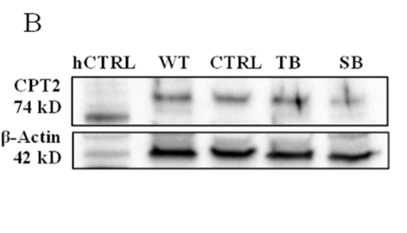

## Question

# Gene Research for Functional Annotation

## ⚠️ CRITICAL: Gene/Protein Identification Context

**BEFORE YOU BEGIN RESEARCH:** You MUST verify you are researching the CORRECT gene/protein. Gene symbols can be ambiguous, especially for less well-characterized genes from non-model organisms.

### Target Gene/Protein Identity (from UniProt):
- **UniProt Accession:** Q5U3U3
- **Protein Description:** RecName: Full=Carnitine O-palmitoyltransferase 2, mitochondrial; EC=2.3.1.21; AltName: Full=Carnitine palmitoyltransferase II; Short=CPT II; Flags: Precursor;
- **Gene Information:** Name=cpt2; ORFNames=si:ch211-216k22.1, zgc:101627;
- **Organism (full):** Danio rerio (Zebrafish) (Brachydanio rerio).
- **Protein Family:** Belongs to the carnitine/choline acetyltransferase family.
- **Key Domains:** Carn_acyl_trans. (IPR000542); Carn_acyl_trans_N. (IPR042572); CAT-like_dom_sf. (IPR023213); Cho/carn_acyl_trans. (IPR039551); Cho/carn_acyl_trans_2. (IPR042231)

### MANDATORY VERIFICATION STEPS:

1. **Check if the gene symbol "cpt2" matches the protein description above**
2. **Verify the organism is correct:** Danio rerio (Zebrafish) (Brachydanio rerio).
3. **Check if protein family/domains align with what you find in literature**
4. **If you find literature for a DIFFERENT gene with the same or similar symbol, STOP**

### If Gene Symbol is Ambiguous or You Cannot Find Relevant Literature:

**DO NOT PROCEED WITH RESEARCH ON A DIFFERENT GENE.** Instead:
- State clearly: "The gene symbol 'cpt2' is ambiguous or literature is limited for this specific protein"
- Explain what you found (e.g., "Found extensive literature on a different gene with the same symbol in a different organism")
- Describe the protein based ONLY on the UniProt information provided above
- Suggest that the protein function can be inferred from domain/family information

### Research Target:

Please provide a comprehensive research report on the gene **cpt2** (gene ID: cpt2, UniProt: Q5U3U3) in DANRE.

The research report should be a detailed narrative explaining the function, biological processes, and localization of the gene product. Citations should be given for all claims.

You should prioritize authoritative reviews and primary scientific literature when conducting research. You can supplement
this with annotations you find in gene/protein databases, but these can be outdated or inaccurate.

We are specifically interested in the primary function of the gene - for enzymes, what reaction is catalyzed, and what is the substrate specificity? For transporters, what is the substrate? For structural proteins or adapters, what is the broader structural role? For signaling molecules, what is the role in the pathway.

We are interested in where in or outside the cell the gene product carries out its function.

We are also interested in the signaling or biochemical pathways in which the gene functions. We are less interested in broad pleiotropic effects, except where these elucidate the precise role.

Include evidence where possible. We are interested in both experimental evidence as well as inference from structure, evolution, or bioinformatic analysis. Precise studies should be prioritized over high-throughput, where available.

## Output

Question: You are an expert researcher providing comprehensive, well-cited information.

Provide detailed information focusing on:
1. Key concepts and definitions with current understanding
2. Recent developments and latest research (prioritize 2023-2024 sources)
3. Current applications and real-world implementations
4. Expert opinions and analysis from authoritative sources
5. Relevant statistics and data from recent studies

Format as a comprehensive research report with proper citations. Include URLs and publication dates where available.
Always prioritize recent, authoritative sources and provide specific citations for all major claims.

# Gene Research for Functional Annotation

## ⚠️ CRITICAL: Gene/Protein Identification Context

**BEFORE YOU BEGIN RESEARCH:** You MUST verify you are researching the CORRECT gene/protein. Gene symbols can be ambiguous, especially for less well-characterized genes from non-model organisms.

### Target Gene/Protein Identity (from UniProt):
- **UniProt Accession:** Q5U3U3
- **Protein Description:** RecName: Full=Carnitine O-palmitoyltransferase 2, mitochondrial; EC=2.3.1.21; AltName: Full=Carnitine palmitoyltransferase II; Short=CPT II; Flags: Precursor;
- **Gene Information:** Name=cpt2; ORFNames=si:ch211-216k22.1, zgc:101627;
- **Organism (full):** Danio rerio (Zebrafish) (Brachydanio rerio).
- **Protein Family:** Belongs to the carnitine/choline acetyltransferase family.
- **Key Domains:** Carn_acyl_trans. (IPR000542); Carn_acyl_trans_N. (IPR042572); CAT-like_dom_sf. (IPR023213); Cho/carn_acyl_trans. (IPR039551); Cho/carn_acyl_trans_2. (IPR042231)

### MANDATORY VERIFICATION STEPS:

1. **Check if the gene symbol "cpt2" matches the protein description above**
2. **Verify the organism is correct:** Danio rerio (Zebrafish) (Brachydanio rerio).
3. **Check if protein family/domains align with what you find in literature**
4. **If you find literature for a DIFFERENT gene with the same or similar symbol, STOP**

### If Gene Symbol is Ambiguous or You Cannot Find Relevant Literature:

**DO NOT PROCEED WITH RESEARCH ON A DIFFERENT GENE.** Instead:
- State clearly: "The gene symbol 'cpt2' is ambiguous or literature is limited for this specific protein"
- Explain what you found (e.g., "Found extensive literature on a different gene with the same symbol in a different organism")
- Describe the protein based ONLY on the UniProt information provided above
- Suggest that the protein function can be inferred from domain/family information

### Research Target:

Please provide a comprehensive research report on the gene **cpt2** (gene ID: cpt2, UniProt: Q5U3U3) in DANRE.

The research report should be a detailed narrative explaining the function, biological processes, and localization of the gene product. Citations should be given for all claims.

You should prioritize authoritative reviews and primary scientific literature when conducting research. You can supplement
this with annotations you find in gene/protein databases, but these can be outdated or inaccurate.

We are specifically interested in the primary function of the gene - for enzymes, what reaction is catalyzed, and what is the substrate specificity? For transporters, what is the substrate? For structural proteins or adapters, what is the broader structural role? For signaling molecules, what is the role in the pathway.

We are interested in where in or outside the cell the gene product carries out its function.

We are also interested in the signaling or biochemical pathways in which the gene functions. We are less interested in broad pleiotropic effects, except where these elucidate the precise role.

Include evidence where possible. We are interested in both experimental evidence as well as inference from structure, evolution, or bioinformatic analysis. Precise studies should be prioritized over high-throughput, where available.

## Research report: Functional annotation of **Danio rerio cpt2** (UniProt **Q5U3U3**) encoding mitochondrial **carnitine O-palmitoyltransferase 2 (CPT2; EC 2.3.1.21)**

### 1) Identity verification (mandatory)
The UniProt entry provided (Q5U3U3) describes **Carnitine O-palmitoyltransferase 2, mitochondrial (CPT2)** in **zebrafish (Danio rerio)** and places it in the **carnitine/choline acyltransferase family**, consistent with the CPT2 literature describing a mitochondrial carnitine acyltransferase that is part of the **carnitine shuttle** for long-chain fatty-acid oxidation. Independent zebrafish experimental work explicitly targets zebrafish **cpt2** as the ortholog of human CPT2 and reports **~70.9% sequence homology** between zebrafish cpt2 and human CPT2, supporting that “cpt2” in zebrafish refers to the same conserved enzyme class as the UniProt record. (baker2024cpt2deficiencymodeled pages 2-4)

### 2) Key concepts and current understanding

#### 2.1 The carnitine shuttle (CPT system) and why CPT2 is required
Long-chain fatty acids (LCFAs) are oxidized in the **mitochondrial matrix** via β-oxidation, but **long-chain acyl-CoA** species do not freely cross the inner mitochondrial membrane. The canonical “carnitine shuttle” solves this by interconverting acyl-CoA and acylcarnitines and transporting the acyl moiety across mitochondrial membranes.

**CPT2’s core biochemical role** is to **reconvert fatty acylcarnitines to fatty acyl-CoA** at/near the **inner mitochondrial membrane**, releasing free carnitine for recycling. A recent review describes the sequential steps: CPT1 converts fatty acyl-CoA to acylcarnitine, CACT transports it, and **CPT2 “uncouples” it back to fatty acyl-CoA + L-carnitine at the inner mitochondrial membrane**, enabling entry into β-oxidation. (duan2024theroleof pages 2-4)

A mechanistic description from an authoritative medicinal chemistry review similarly states that once acylcarnitines are inside mitochondrial membranes, they are **“reconverted to acyl-CoA by CPT2”** to enter the fatty-acid oxidation cycle, and notes CPT2’s location on/associated with the inner mitochondrial membrane and operation on the intramitochondrial side. (ceccarelli2011carnitinepalmitoyltransferase(cpt) pages 1-3)

**Reaction (conceptual):**
- **fatty acylcarnitine + CoA ⇄ fatty acyl-CoA + carnitine** (CPT2-catalyzed acyl transfer). (ceccarelli2011carnitinepalmitoyltransferase(cpt) pages 1-3, duan2024theroleof pages 2-4)

#### 2.2 Substrate specificity (chain-length preference)
Across carnitine acyltransferase family discussions, CPT2 is characterized as a **medium/long-chain** acyltransferase. A 2024 review summarizes that CPT2 is catalytically active on **mid-length and long-chain acyl-CoA esters**, but “virtually no activity” is observed on **short-chain** and **ultralong-chain** acyl-CoAs (and some non-fatty-acyl substrates), which is consistent with CPT2’s canonical role in LCFA oxidation rather than short-chain metabolism. (duan2024theroleof pages 4-5)

A recent structural review of carnitine acyltransferases (including CPT2) explicitly states that CPT1/CPT2 are specific for **long-chain fatty acyl-CoAs, reported as C8–C18**, and discusses a CPT2 crystal structure complexed with CoA and palmitate (C16), reinforcing preference for medium-to-long saturated acyl groups typical of LCFA oxidation. (volpicella2025carnitineoacetyltransferaseas pages 8-9)

#### 2.3 Subcellular localization and topology
CPT2 is consistently placed at the **inner mitochondrial membrane** and described as more **matrix-facing / matrix-protein-like** than CPT1. A 2024 review contrasts CPT1 (outer membrane-anchored) with CPT2 being “more lightly attached to the internal membrane” and behaving like a matrix protein, consistent with catalysis on the matrix side after CACT transport. (duan2024theroleof pages 4-5)

In zebrafish specifically, CPT2 protein was experimentally detected by Western blot in **mitochondrial fractions** isolated from larvae, providing direct evidence that the zebrafish cpt2 gene product localizes to mitochondria (consistent with mitochondrial targeting signals in CPT2 proteins). (baker2024cpt2deficiencymodeled pages 4-5, baker2024cpt2deficiencymodeled pages 8-10)

### 3) Zebrafish-specific functional evidence (Danio rerio)

#### 3.1 2024 zebrafish CPT2 deficiency model (direct experimental evidence)
The most direct Danio rerio functional evidence in the retrieved literature is a 2024 study that **knocked down zebrafish cpt2** using both splice-blocking and translation-blocking morpholinos and then assessed protein levels and metabolite consequences.

**Knockdown efficacy (mitochondrial protein):** Western blots from zebrafish mitochondrial fractions showed that translation-blocking knockdown reduced CPT2 protein by ~31% vs control (not statistically significant in the excerpt), while splice-blocking knockdown reduced CPT2 by ~78% vs control (significant). (baker2024cpt2deficiencymodeled pages 8-10)

**Metabolic readout (acylcarnitines):** LC-MS/MS profiling demonstrated significant increases in long-chain fatty-acylcarnitines in knockdown larvae. Total acylcarnitines increased by approximately **~70% (translation-blocking; p<0.001)** and **~42% (splice-blocking; p≤0.05)** versus wild-type, consistent with a block at the CPT2 step (i.e., impaired reconversion of acylcarnitines to acyl-CoA for β-oxidation). (baker2024cpt2deficiencymodeled pages 8-10)

**Developmental/organismal phenotypes:** CPT2 knockdown zebrafish showed abnormal lipid utilization and deposition, reduced body size, abnormal brain development, altered axonal projections and neurotransmitter synthesis, electrical hyperactivity, and disrupted swimming behavior; the authors also report increased expression of schizophrenia-associated genes, linking CPT2-dependent fatty-acid oxidation and acylcarnitine handling to neurodevelopmental outcomes in a vertebrate model. (baker2024cpt2deficiencymodeled pages 1-2, baker2024cpt2deficiencymodeled pages 25-26)

**Zebrafish model usability:** The authors chose a 0.5 mM morpholino dose because early viability at 1 day post-injection was comparable across groups (WT 77%; control 84%; TB 74%; SB 79%), supporting a “mild-to-moderate” deficiency model rather than a lethal severe model. (baker2024cpt2deficiencymodeled pages 8-10)

**Figure-based evidence:** The study’s Figure 2 includes (i) CPT2 Western blot data in mitochondrial fractions and (ii) total acylcarnitine increases by LC-MS/MS. (baker2024cpt2deficiencymodeled media c22cb2e6)

#### 3.2 Zebrafish systems-level context: environmental disruption of the carnitine shuttle (2024)
A 2024 systems toxicology study integrated published zebrafish omics datasets using a stoichiometric zebrafish metabolic model and concluded that PFOS exposure prominently impacts the **carnitine shuttle and fatty-acid oxidation**. The model used PFOS parameterization at **0.06, 0.6, and 2 µM** and predicted fatty acid and acyl-CoA pool changes with flux increases by “almost an order of magnitude,” consistent with dyslipidemia-like shifts. While this work does not isolate cpt2 alone, it supports real-world relevance of the pathway in zebrafish environmental exposures. (nolen2024insilicobiomarker pages 8-9)

#### 3.3 Nutritional modulation of the carnitine pool in zebrafish (background implementation)
A zebrafish dietary study shows that increasing carnitine availability can increase mitochondrial β-oxidation capacity and reduce tissue lipid deposition; mechanistically this would tend to increase flux through the CPT/CACT/CPT2 shuttle (even though the excerpt highlights CPT1 transcriptional induction more than CPT2). Dietary L-carnitine significantly increased free/total carnitine in tissues, significantly decreased triglycerides in liver and muscle, and significantly increased mitochondrial and total β-oxidation capacity in liver (feeding and fasting) and muscle (feeding). (li2017systemicregulationof pages 2-4)

### 4) Recent developments and current research directions (prioritizing 2023–2024)

#### 4.1 Expanding disease/pathway connections (2023–2024 reviews)
Although much CPT2 literature is human-disease oriented, recent reviews emphasize CPT2 dysfunction in metabolic disease contexts and highlight mechanism-level thinking that is transferable to zebrafish functional annotation because the enzyme role is conserved.

* **CPT2 in NAFLD/MAFLD progression:** A 2023 review frames CPT-II as an inner mitochondrial membrane protein central to LCFA entry into mitochondrial FAO and discusses how CPT-II dysfunction is observed in models of liver lipid accumulation; it describes CPT-II’s role in converting acylcarnitines to acyl-CoA and recycling carnitine via CACT. (yao2023mitochondrialcarnitinepalmitoyltransferaseii pages 2-4)
* **CPT family functional synthesis (2024):** A 2024 review summarizes CPT family membrane topology and explicitly describes CPT2 as the inner membrane enzyme that “uncouples” acylcarnitines to acyl-CoA for matrix β-oxidation, and it also summarizes chain-length activity preferences (mid/long-chain active; short/ultralong inactive). (duan2024theroleof pages 4-5, duan2024theroleof pages 2-4)

#### 4.2 Structural/mechanistic detail relevant to functional inference
Mechanistic understanding of CPT2 is supported by structural analyses. The 2011 medicinal chemistry review describes CPT2 as a shorter protein than CPT1 and summarizes structural binding architecture (distinct CoA, acyl, and carnitine binding sites) and key residues implicated in catalysis and substrate binding; these mechanistic insights support functional inference for zebrafish CPT2 given orthology and shared family domains. (ceccarelli2011carnitinepalmitoyltransferase(cpt) pages 3-4)

### 5) Current applications and real-world implementations

1. **Zebrafish model for CPT2 deficiency and neurodevelopmental consequences:** The 2024 zebrafish knockdown study demonstrates a tractable vertebrate model connecting mitochondrial LCFA oxidation defects (acylcarnitine accumulation) to brain development, electrophysiology, and behavior, supporting use in functional genomics and metabolic-neurodevelopment research. (baker2024cpt2deficiencymodeled pages 1-2, baker2024cpt2deficiencymodeled pages 8-10)

2. **Environmental monitoring/toxicology using carnitine-shuttle biomarkers:** The 2024 PFOS systems biology work suggests the carnitine shuttle (in which CPT2 is an essential component) can be a focal pathway for pollutant-associated metabolic dysregulation in aquatic organisms; the authors highlight carnitine as a candidate biomarker in field studies, illustrating translational eco-toxicology implementation. (nolen2024insilicobiomarker pages 8-9)

3. **Nutrition/aquaculture physiology:** Dietary carnitine supplementation experiments in zebrafish show a practical intervention that modulates lipid deposition and mitochondrial β-oxidation capacity, underscoring the applied importance of carnitine-shuttle capacity for fish metabolism and potentially informing aquaculture strategies. (li2017systemicregulationof pages 2-4)

4. **Drug discovery and CPT pathway modulation (broader context):** Reviews of CPT enzymes (including CPT2) discuss pharmacologic modulation of the CPT system as a long-standing strategy in metabolic disease and cancer metabolism research. While these are not zebrafish-specific applications, they contextualize CPT2 as part of a druggable metabolic axis. (ceccarelli2011carnitinepalmitoyltransferase(cpt) pages 1-3, duan2024theroleof pages 4-5)

### 6) Expert synthesis and interpretation (evidence-weighted)

*High-confidence functional annotation for zebrafish CPT2* can be made because (i) CPT2’s enzymatic role in the carnitine shuttle is supported by multiple authoritative reviews, and (ii) zebrafish experiments directly show that reducing CPT2 protein in mitochondrial fractions causes acylcarnitine accumulation—a hallmark consequence expected when the acylcarnitine→acyl-CoA reconversion step is impaired. (duan2024theroleof pages 2-4, ceccarelli2011carnitinepalmitoyltransferase(cpt) pages 1-3, baker2024cpt2deficiencymodeled pages 8-10)

*Species-specific nuance:* The strongest zebrafish-specific evidence currently retrieved is morpholino-based knockdown rather than stable knockout or purified-enzyme kinetics; thus, zebrafish CPT2 substrate specificity is best stated as **inferred from conserved CPT2 biochemistry** (medium/long-chain preference) rather than as directly measured kinetic constants in Danio rerio, although acylcarnitine accumulation in vivo is consistent with impaired long-chain acyl flux. (duan2024theroleof pages 4-5, volpicella2025carnitineoacetyltransferaseas pages 8-9, baker2024cpt2deficiencymodeled pages 8-10)

### 7) Key quantitative findings (selected statistics)
* **Zebrafish CPT2 knockdown efficiency:** ~31% reduction (TB, vs CTRL) and ~78% reduction (SB, vs CTRL) in mitochondrial CPT2 protein. (baker2024cpt2deficiencymodeled pages 8-10)
* **Acylcarnitine accumulation in zebrafish:** total acylcarnitines increased ~70% (TB; p<0.001) and ~42% (SB; p≤0.05) vs WT. (baker2024cpt2deficiencymodeled pages 8-10)
* **PFOS modeling in zebrafish systems toxicology:** PFOS simulated at 0.06–2 µM; predicted fatty acid/acyl-CoA pool flux increases by almost an order of magnitude. (nolen2024insilicobiomarker pages 8-9)

### Evidence summary table
| Claim | Evidence type | Key quantitative/statistical details | Source (citation id + DOI URL + pub month/year) |
|---|---|---|---|
| **Identity/function:** zebrafish **cpt2** is the Danio rerio ortholog of human **CPT2** and participates in mitochondrial long-chain fatty-acid β-oxidation by converting long-chain acylcarnitines to acyl-CoA. | Zebrafish experiment + comparative annotation | Zebrafish/human sequence homology reported as **~70.9%**; morpholino knockdown caused abnormal lipid utilization/deposition and neurodevelopmental defects, supporting conserved CPT2 function. | Baker et al. 2024, Biomolecules, Jul 2024, https://doi.org/10.3390/biom14080914 (baker2024cpt2deficiencymodeled pages 1-2, baker2024cpt2deficiencymodeled pages 2-4) |
| **Localization:** CPT2 is a mitochondrial protein detected in zebrafish mitochondrial fractions, consistent with inner-mitochondrial-membrane carnitine-shuttle localization. | Zebrafish experiment | CPT2 protein measured in **mitochondrial fractions** from larvae; Western blot showed zebrafish CPT2 migrating near **~80 kDa**. | Baker et al. 2024, Biomolecules, Jul 2024, https://doi.org/10.3390/biom14080914 (baker2024cpt2deficiencymodeled pages 8-10, baker2024cpt2deficiencymodeled pages 4-5, baker2024cpt2deficiencymodeled media c22cb2e6) |
| **Loss of function in zebrafish:** cpt2 knockdown impairs carnitine-shuttle flux and causes long-chain acylcarnitine accumulation. | Zebrafish experiment | Translation-blocking MO reduced CPT2 protein by **~31% vs CTRL** (~38% vs WT); splice-blocking MO reduced CPT2 by **~78% vs CTRL** (~85% vs WT). Total acylcarnitines increased **~70% (TB, p<0.001)** and **~42% (SB, p≤0.05)** vs WT; long-chain species including **C16, C18, C18:1** increased. | Baker et al. 2024, Biomolecules, Jul 2024, https://doi.org/10.3390/biom14080914 (baker2024cpt2deficiencymodeled pages 8-10, baker2024cpt2deficiencymodeled pages 25-26) |
| **Phenotype in zebrafish:** cpt2 deficiency disrupts development, especially neural and lipid-handling phenotypes. | Zebrafish experiment | Viability at 1 dpi with 0.5 mM MOs was similar to WT (**WT 77%, CTRL 84%, TB 74%, SB 79%**), enabling mild–moderate deficiency modeling. Knockdown caused reduced body size, curved tails, pericardial edema, enlarged ventricles, abnormal brain development, altered swimming/electrical activity, and increased schizophrenia-associated gene expression. | Baker et al. 2024, Biomolecules, Jul 2024, https://doi.org/10.3390/biom14080914 (baker2024cpt2deficiencymodeled pages 1-2, baker2024cpt2deficiencymodeled pages 25-26, baker2024cpt2deficiencymodeled pages 8-10) |
| **Canonical reaction/pathway:** CPT2 reconverts fatty acylcarnitine to fatty acyl-CoA + L-carnitine at the inner mitochondrial membrane as part of the carnitine shuttle. | Recent review | Places CPT2 at the **inner mitochondrial membrane**; defines role after CACT-mediated transport so acyl-CoA can enter matrix β-oxidation. | Duan et al. 2024, Biology, Nov 2024, https://doi.org/10.3390/biology13110892 (duan2024theroleof pages 2-4) |
| **Substrate specificity/topology:** CPT2 behaves as a matrix-facing, inner-membrane-associated carnitine acyltransferase with preference for medium/long-chain substrates. | Recent review | Reported as catalytically active toward **mid-length and long-chain acyl-CoA esters**, with little/no activity toward **short-chain** or **ultralong-chain** substrates; described as more lightly attached to the inner membrane and matrix-protein-like. | Duan et al. 2024, Biology, Nov 2024, https://doi.org/10.3390/biology13110892 (duan2024theroleof pages 4-5) |
| **Carnitine-shuttle context:** CPT2 works with CPT1 and CACT to regenerate acyl-CoA on the matrix side of the inner membrane for β-oxidation. | Review | Describes CPT-II as an **IMM protein** converting transesterified acylcarnitines into acyl-CoA and releasing carnitine for CACT-mediated return; emphasizes LCFA transport into mitochondria. | Yao et al. 2023, World J Gastroenterol, Mar 2023, https://doi.org/10.3748/wjg.v29.i12.1765 (yao2023mitochondrialcarnitinepalmitoyltransferaseii pages 2-4) |
| **Mechanistic/structural support:** CPT2 contains distinct CoA-, acyl-, and carnitine-binding sites and lacks the membrane-anchoring N-terminus typical of CPT1. | Foundational high-authority review | Crystal-structure summary identifies a **Y-shaped tunnel** with separate CoA/acyl/carnitine sites; key catalytic/binding residues include **His372, Tyr486, Ser488, Thr499, Ser590**; CPT2 is shorter than CPT1 (**658 vs 773 aa**) and operates on the matrix side of the inner membrane. | Ceccarelli et al. 2011, J Med Chem, Apr 2011, https://doi.org/10.1021/jm100809g (ceccarelli2011carnitinepalmitoyltransferase(cpt) pages 1-3, ceccarelli2011carnitinepalmitoyltransferase(cpt) pages 3-4) |
| **Broader acyltransferase family inference:** CPT2 is a carnitine acyltransferase specialized for long-chain fatty acyl groups. | Recent review | Review states CPT1/CPT2 are specific for **long-chain fatty acyl-CoAs (C8–C18)** and highlights crystallized CPT2 with **CoA and palmitate**. | Volpicella et al. 2025, Biomolecules, Feb 2025, https://doi.org/10.3390/biom15020216 (volpicella2025carnitineoacetyltransferaseas pages 8-9, volpicella2025carnitineoacetyltransferaseas pages 9-11) |
| **System-level zebrafish application:** environmental PFOS exposure perturbs the carnitine shuttle and fatty-acid oxidation in embryo-larval zebrafish, supporting the pathway context in which cpt2 functions. | Zebrafish systems biology / real-world implementation | In silico zebrafish metabolic model contained **12,909 reactions**; PFOS parameterization at **0.06, 0.6, and 2 µM** predicted fatty-acid/fatty-acyl-CoA pool flux increases by **almost an order of magnitude**; human-linked PFOS effects noted at **≤200 ng/mL (≤0.4 µM)**. | Nolen et al. 2024, Front. Syst. Biol., Mar 2024, https://doi.org/10.3389/fsysb.2024.1367562 (nolen2024insilicobiomarker pages 8-9) |
| **Nutritional/metabolic implementation in zebrafish:** boosting the carnitine pool enhances mitochondrial β-oxidation and reduces tissue lipid deposition, consistent with higher flux through the CPT shuttle in which CPT2 acts downstream of CPT1. | Zebrafish dietary experiment | Dietary L-carnitine significantly increased tissue free/total carnitine, significantly decreased liver and muscle TG, and significantly increased mitochondrial and total β-oxidation capacity in liver (feeding and fasting) and muscle (feeding); assays reported **n=4 or n=6**, significance **P<0.05/P<0.01**. CPT1 mRNA increased, while lipogenesis genes decreased. | Li et al. 2017, Sci Rep, Jan 2017, https://doi.org/10.1038/srep40815 (li2017systemicregulationof pages 2-4, li2017systemicregulationof pages 1-2, li2017systemicregulationof pages 6-7) |

*Table: This table summarizes the core functional annotation evidence for Danio rerio cpt2 / UniProt Q5U3U3, integrating direct zebrafish experiments with authoritative reviews on CPT2 biochemistry and localization. It is useful for separating species-specific evidence from conserved mechanistic inference.*

### References (URLs include publication pages)
* Baker CE et al. **CPT2 Deficiency Modeled in Zebrafish**. *Biomolecules*. **Jul 2024**. https://doi.org/10.3390/biom14080914 (baker2024cpt2deficiencymodeled pages 1-2, baker2024cpt2deficiencymodeled pages 8-10)
* Duan Y et al. **The Role of the CPT Family in Cancer**. *Biology*. **Nov 2024**. https://doi.org/10.3390/biology13110892 (duan2024theroleof pages 4-5, duan2024theroleof pages 2-4)
* Nolen RM et al. **PFOS exposure and zebrafish metabolism (in silico)**. *Frontiers in Systems Biology*. **Mar 2024**. https://doi.org/10.3389/fsysb.2024.1367562 (nolen2024insilicobiomarker pages 8-9)
* Yao M et al. **CPT-II dysfunction and NAFLD (review)**. *World Journal of Gastroenterology*. **Mar 2023**. https://doi.org/10.3748/wjg.v29.i12.1765 (yao2023mitochondrialcarnitinepalmitoyltransferaseii pages 2-4)
* Ceccarelli SM et al. **CPT modulators (review)**. *Journal of Medicinal Chemistry*. **Apr 2011**. https://doi.org/10.1021/jm100809g (ceccarelli2011carnitinepalmitoyltransferase(cpt) pages 1-3, ceccarelli2011carnitinepalmitoyltransferase(cpt) pages 3-4)
* Li J-M et al. **Dietary L-carnitine in zebrafish**. *Scientific Reports*. **Jan 2017**. https://doi.org/10.1038/srep40815 (li2017systemicregulationof pages 2-4)

References

1. (baker2024cpt2deficiencymodeled pages 2-4): Carly E. Baker, Aaron G. Marta, Nathan D. Zimmerman, Zeljka Korade, Nicholas W. Mathy, Delaney Wilton, Timothy Simeone, Andrew Kochvar, Kenneth L. Kramer, Holly A. F. Stessman, and Annemarie Shibata. Cpt2 deficiency modeled in zebrafish: abnormal neural development, electrical activity, behavior, and schizophrenia-related gene expression. Biomolecules, 14:914, Jul 2024. URL: https://doi.org/10.3390/biom14080914, doi:10.3390/biom14080914. This article has 1 citations.

2. (duan2024theroleof pages 2-4): Yanxia Duan, Jiaxin Liu, Ailin Li, Chang Liu, Guang Shu, and Gang Yin. The role of the cpt family in cancer: searching for new therapeutic strategies. Biology, 13:892, Nov 2024. URL: https://doi.org/10.3390/biology13110892, doi:10.3390/biology13110892. This article has 16 citations.

3. (ceccarelli2011carnitinepalmitoyltransferase(cpt) pages 1-3): Simona M. Ceccarelli, Odile Chomienne, Marcel Gubler, and Arduino Arduini. Carnitine palmitoyltransferase (cpt) modulators: a medicinal chemistry perspective on 35 years of research. Journal of medicinal chemistry, 54 9:3109-52, Apr 2011. URL: https://doi.org/10.1021/jm100809g, doi:10.1021/jm100809g. This article has 128 citations and is from a highest quality peer-reviewed journal.

4. (duan2024theroleof pages 4-5): Yanxia Duan, Jiaxin Liu, Ailin Li, Chang Liu, Guang Shu, and Gang Yin. The role of the cpt family in cancer: searching for new therapeutic strategies. Biology, 13:892, Nov 2024. URL: https://doi.org/10.3390/biology13110892, doi:10.3390/biology13110892. This article has 16 citations.

5. (volpicella2025carnitineoacetyltransferaseas pages 8-9): Mariateresa Volpicella, Maria Noemi Sgobba, Luna Laera, Anna Lucia Francavilla, Danila Imperia De Luca, Lorenzo Guerra, Ciro Leonardo Pierri, and Anna De Grassi. Carnitine o-acetyltransferase as a central player in lipid and branched-chain amino acid metabolism, epigenetics, cell plasticity, and organelle function. Biomolecules, 15:216, Feb 2025. URL: https://doi.org/10.3390/biom15020216, doi:10.3390/biom15020216. This article has 21 citations.

6. (baker2024cpt2deficiencymodeled pages 4-5): Carly E. Baker, Aaron G. Marta, Nathan D. Zimmerman, Zeljka Korade, Nicholas W. Mathy, Delaney Wilton, Timothy Simeone, Andrew Kochvar, Kenneth L. Kramer, Holly A. F. Stessman, and Annemarie Shibata. Cpt2 deficiency modeled in zebrafish: abnormal neural development, electrical activity, behavior, and schizophrenia-related gene expression. Biomolecules, 14:914, Jul 2024. URL: https://doi.org/10.3390/biom14080914, doi:10.3390/biom14080914. This article has 1 citations.

7. (baker2024cpt2deficiencymodeled pages 8-10): Carly E. Baker, Aaron G. Marta, Nathan D. Zimmerman, Zeljka Korade, Nicholas W. Mathy, Delaney Wilton, Timothy Simeone, Andrew Kochvar, Kenneth L. Kramer, Holly A. F. Stessman, and Annemarie Shibata. Cpt2 deficiency modeled in zebrafish: abnormal neural development, electrical activity, behavior, and schizophrenia-related gene expression. Biomolecules, 14:914, Jul 2024. URL: https://doi.org/10.3390/biom14080914, doi:10.3390/biom14080914. This article has 1 citations.

8. (baker2024cpt2deficiencymodeled pages 1-2): Carly E. Baker, Aaron G. Marta, Nathan D. Zimmerman, Zeljka Korade, Nicholas W. Mathy, Delaney Wilton, Timothy Simeone, Andrew Kochvar, Kenneth L. Kramer, Holly A. F. Stessman, and Annemarie Shibata. Cpt2 deficiency modeled in zebrafish: abnormal neural development, electrical activity, behavior, and schizophrenia-related gene expression. Biomolecules, 14:914, Jul 2024. URL: https://doi.org/10.3390/biom14080914, doi:10.3390/biom14080914. This article has 1 citations.

9. (baker2024cpt2deficiencymodeled pages 25-26): Carly E. Baker, Aaron G. Marta, Nathan D. Zimmerman, Zeljka Korade, Nicholas W. Mathy, Delaney Wilton, Timothy Simeone, Andrew Kochvar, Kenneth L. Kramer, Holly A. F. Stessman, and Annemarie Shibata. Cpt2 deficiency modeled in zebrafish: abnormal neural development, electrical activity, behavior, and schizophrenia-related gene expression. Biomolecules, 14:914, Jul 2024. URL: https://doi.org/10.3390/biom14080914, doi:10.3390/biom14080914. This article has 1 citations.

10. (baker2024cpt2deficiencymodeled media c22cb2e6): Carly E. Baker, Aaron G. Marta, Nathan D. Zimmerman, Zeljka Korade, Nicholas W. Mathy, Delaney Wilton, Timothy Simeone, Andrew Kochvar, Kenneth L. Kramer, Holly A. F. Stessman, and Annemarie Shibata. Cpt2 deficiency modeled in zebrafish: abnormal neural development, electrical activity, behavior, and schizophrenia-related gene expression. Biomolecules, 14:914, Jul 2024. URL: https://doi.org/10.3390/biom14080914, doi:10.3390/biom14080914. This article has 1 citations.

11. (nolen2024insilicobiomarker pages 8-9): Rayna M. Nolen, Lene H. Petersen, Karl Kaiser, Antonietta Quigg, and David Hala. In silico biomarker analysis of the adverse effects of perfluorooctane sulfonate (pfos) exposure on the metabolic physiology of embryo-larval zebrafish. Frontiers in Systems Biology, Mar 2024. URL: https://doi.org/10.3389/fsysb.2024.1367562, doi:10.3389/fsysb.2024.1367562. This article has 4 citations.

12. (li2017systemicregulationof pages 2-4): Jia-Min Li, Ling-Yu Li, Xuan Qin, Li-Jun Ning, Dong-Liang Lu, Dong-Liang Li, Mei-Ling Zhang, Xin Wang, and Zhen-Yu Du. Systemic regulation of l-carnitine in nutritional metabolism in zebrafish, danio rerio. Scientific Reports, Jan 2017. URL: https://doi.org/10.1038/srep40815, doi:10.1038/srep40815. This article has 93 citations and is from a peer-reviewed journal.

13. (yao2023mitochondrialcarnitinepalmitoyltransferaseii pages 2-4): Min Yao, Ping Zhou, Yan-Yan Qin, Li Wang, and Dengbing Yao. Mitochondrial carnitine palmitoyltransferase-ii dysfunction: a possible novel mechanism for nonalcoholic fatty liver disease in hepatocarcinogenesis. World Journal of Gastroenterology, 29:1765-1778, Mar 2023. URL: https://doi.org/10.3748/wjg.v29.i12.1765, doi:10.3748/wjg.v29.i12.1765. This article has 14 citations.

14. (ceccarelli2011carnitinepalmitoyltransferase(cpt) pages 3-4): Simona M. Ceccarelli, Odile Chomienne, Marcel Gubler, and Arduino Arduini. Carnitine palmitoyltransferase (cpt) modulators: a medicinal chemistry perspective on 35 years of research. Journal of medicinal chemistry, 54 9:3109-52, Apr 2011. URL: https://doi.org/10.1021/jm100809g, doi:10.1021/jm100809g. This article has 128 citations and is from a highest quality peer-reviewed journal.

15. (volpicella2025carnitineoacetyltransferaseas pages 9-11): Mariateresa Volpicella, Maria Noemi Sgobba, Luna Laera, Anna Lucia Francavilla, Danila Imperia De Luca, Lorenzo Guerra, Ciro Leonardo Pierri, and Anna De Grassi. Carnitine o-acetyltransferase as a central player in lipid and branched-chain amino acid metabolism, epigenetics, cell plasticity, and organelle function. Biomolecules, 15:216, Feb 2025. URL: https://doi.org/10.3390/biom15020216, doi:10.3390/biom15020216. This article has 21 citations.

16. (li2017systemicregulationof pages 1-2): Jia-Min Li, Ling-Yu Li, Xuan Qin, Li-Jun Ning, Dong-Liang Lu, Dong-Liang Li, Mei-Ling Zhang, Xin Wang, and Zhen-Yu Du. Systemic regulation of l-carnitine in nutritional metabolism in zebrafish, danio rerio. Scientific Reports, Jan 2017. URL: https://doi.org/10.1038/srep40815, doi:10.1038/srep40815. This article has 93 citations and is from a peer-reviewed journal.

17. (li2017systemicregulationof pages 6-7): Jia-Min Li, Ling-Yu Li, Xuan Qin, Li-Jun Ning, Dong-Liang Lu, Dong-Liang Li, Mei-Ling Zhang, Xin Wang, and Zhen-Yu Du. Systemic regulation of l-carnitine in nutritional metabolism in zebrafish, danio rerio. Scientific Reports, Jan 2017. URL: https://doi.org/10.1038/srep40815, doi:10.1038/srep40815. This article has 93 citations and is from a peer-reviewed journal.

## Artifacts

- [Edison artifact artifact-00](cpt2-deep-research-falcon_artifacts/artifact-00.md)

## Citations

1. duan2024theroleof pages 2-4
2. duan2024theroleof pages 4-5
3. volpicella2025carnitineoacetyltransferaseas pages 8-9
4. nolen2024insilicobiomarker pages 8-9
5. li2017systemicregulationof pages 2-4
6. yao2023mitochondrialcarnitinepalmitoyltransferaseii pages 2-4
7. volpicella2025carnitineoacetyltransferaseas pages 9-11
8. li2017systemicregulationof pages 1-2
9. li2017systemicregulationof pages 6-7
10. https://doi.org/10.3390/biom14080914
11. https://doi.org/10.3390/biology13110892
12. https://doi.org/10.3748/wjg.v29.i12.1765
13. https://doi.org/10.1021/jm100809g
14. https://doi.org/10.3390/biom15020216
15. https://doi.org/10.3389/fsysb.2024.1367562
16. https://doi.org/10.1038/srep40815
17. https://doi.org/10.3390/biom14080914,
18. https://doi.org/10.3390/biology13110892,
19. https://doi.org/10.1021/jm100809g,
20. https://doi.org/10.3390/biom15020216,
21. https://doi.org/10.3389/fsysb.2024.1367562,
22. https://doi.org/10.1038/srep40815,
23. https://doi.org/10.3748/wjg.v29.i12.1765,