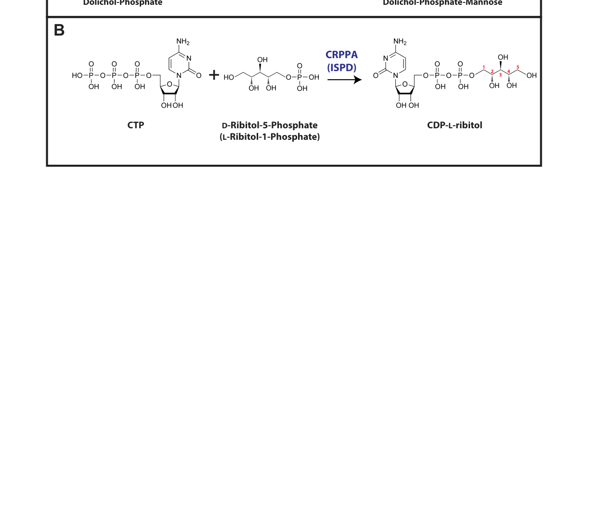

## Question

# Gene Research for Functional Annotation

## ⚠️ CRITICAL: Gene/Protein Identification Context

**BEFORE YOU BEGIN RESEARCH:** You MUST verify you are researching the CORRECT gene/protein. Gene symbols can be ambiguous, especially for less well-characterized genes from non-model organisms.

### Target Gene/Protein Identity (from UniProt):
- **UniProt Accession:** A0JPF9
- **Protein Description:** RecName: Full=D-ribitol-5-phosphate cytidylyltransferase {ECO:0000250|UniProtKB:A4D126}; EC=2.7.7.40 {ECO:0000250|UniProtKB:A4D126}; AltName: Full=2-C-methyl-D-erythritol 4-phosphate cytidylyltransferase-like protein {ECO:0000250|UniProtKB:A4D126}; AltName: Full=Isoprenoid synthase domain-containing protein {ECO:0000250|UniProtKB:A4D126};
- **Gene Information:** Name=crppa; Synonyms=ispd {ECO:0000250|UniProtKB:A4D126}; ORFNames=zgc:154151 {ECO:0000303|Ref.2};
- **Organism (full):** Danio rerio (Zebrafish) (Brachydanio rerio).
- **Protein Family:** Belongs to the IspD/TarI cytidylyltransferase family. IspD
- **Key Domains:** IspD/TarI. (IPR034683); ISPD_C. (IPR040635); ISPD_synthase_CS. (IPR018294); Nucleotide-diphossugar_trans. (IPR029044); IspD (PF01128)

### MANDATORY VERIFICATION STEPS:

1. **Check if the gene symbol "crppa" matches the protein description above**
2. **Verify the organism is correct:** Danio rerio (Zebrafish) (Brachydanio rerio).
3. **Check if protein family/domains align with what you find in literature**
4. **If you find literature for a DIFFERENT gene with the same or similar symbol, STOP**

### If Gene Symbol is Ambiguous or You Cannot Find Relevant Literature:

**DO NOT PROCEED WITH RESEARCH ON A DIFFERENT GENE.** Instead:
- State clearly: "The gene symbol 'crppa' is ambiguous or literature is limited for this specific protein"
- Explain what you found (e.g., "Found extensive literature on a different gene with the same symbol in a different organism")
- Describe the protein based ONLY on the UniProt information provided above
- Suggest that the protein function can be inferred from domain/family information

### Research Target:

Please provide a comprehensive research report on the gene **crppa** (gene ID: crppa, UniProt: A0JPF9) in DANRE.

The research report should be a detailed narrative explaining the function, biological processes, and localization of the gene product. Citations should be given for all claims.

You should prioritize authoritative reviews and primary scientific literature when conducting research. You can supplement
this with annotations you find in gene/protein databases, but these can be outdated or inaccurate.

We are specifically interested in the primary function of the gene - for enzymes, what reaction is catalyzed, and what is the substrate specificity? For transporters, what is the substrate? For structural proteins or adapters, what is the broader structural role? For signaling molecules, what is the role in the pathway.

We are interested in where in or outside the cell the gene product carries out its function.

We are also interested in the signaling or biochemical pathways in which the gene functions. We are less interested in broad pleiotropic effects, except where these elucidate the precise role.

Include evidence where possible. We are interested in both experimental evidence as well as inference from structure, evolution, or bioinformatic analysis. Precise studies should be prioritized over high-throughput, where available.

## Output

Question: You are an expert researcher providing comprehensive, well-cited information.

Provide detailed information focusing on:
1. Key concepts and definitions with current understanding
2. Recent developments and latest research (prioritize 2023-2024 sources)
3. Current applications and real-world implementations
4. Expert opinions and analysis from authoritative sources
5. Relevant statistics and data from recent studies

Format as a comprehensive research report with proper citations. Include URLs and publication dates where available.
Always prioritize recent, authoritative sources and provide specific citations for all major claims.

# Gene Research for Functional Annotation

## ⚠️ CRITICAL: Gene/Protein Identification Context

**BEFORE YOU BEGIN RESEARCH:** You MUST verify you are researching the CORRECT gene/protein. Gene symbols can be ambiguous, especially for less well-characterized genes from non-model organisms.

### Target Gene/Protein Identity (from UniProt):
- **UniProt Accession:** A0JPF9
- **Protein Description:** RecName: Full=D-ribitol-5-phosphate cytidylyltransferase {ECO:0000250|UniProtKB:A4D126}; EC=2.7.7.40 {ECO:0000250|UniProtKB:A4D126}; AltName: Full=2-C-methyl-D-erythritol 4-phosphate cytidylyltransferase-like protein {ECO:0000250|UniProtKB:A4D126}; AltName: Full=Isoprenoid synthase domain-containing protein {ECO:0000250|UniProtKB:A4D126};
- **Gene Information:** Name=crppa; Synonyms=ispd {ECO:0000250|UniProtKB:A4D126}; ORFNames=zgc:154151 {ECO:0000303|Ref.2};
- **Organism (full):** Danio rerio (Zebrafish) (Brachydanio rerio).
- **Protein Family:** Belongs to the IspD/TarI cytidylyltransferase family. IspD
- **Key Domains:** IspD/TarI. (IPR034683); ISPD_C. (IPR040635); ISPD_synthase_CS. (IPR018294); Nucleotide-diphossugar_trans. (IPR029044); IspD (PF01128)

### MANDATORY VERIFICATION STEPS:

1. **Check if the gene symbol "crppa" matches the protein description above**
2. **Verify the organism is correct:** Danio rerio (Zebrafish) (Brachydanio rerio).
3. **Check if protein family/domains align with what you find in literature**
4. **If you find literature for a DIFFERENT gene with the same or similar symbol, STOP**

### If Gene Symbol is Ambiguous or You Cannot Find Relevant Literature:

**DO NOT PROCEED WITH RESEARCH ON A DIFFERENT GENE.** Instead:
- State clearly: "The gene symbol 'crppa' is ambiguous or literature is limited for this specific protein"
- Explain what you found (e.g., "Found extensive literature on a different gene with the same symbol in a different organism")
- Describe the protein based ONLY on the UniProt information provided above
- Suggest that the protein function can be inferred from domain/family information

### Research Target:

Please provide a comprehensive research report on the gene **crppa** (gene ID: crppa, UniProt: A0JPF9) in DANRE.

The research report should be a detailed narrative explaining the function, biological processes, and localization of the gene product. Citations should be given for all claims.

You should prioritize authoritative reviews and primary scientific literature when conducting research. You can supplement
this with annotations you find in gene/protein databases, but these can be outdated or inaccurate.

We are specifically interested in the primary function of the gene - for enzymes, what reaction is catalyzed, and what is the substrate specificity? For transporters, what is the substrate? For structural proteins or adapters, what is the broader structural role? For signaling molecules, what is the role in the pathway.

We are interested in where in or outside the cell the gene product carries out its function.

We are also interested in the signaling or biochemical pathways in which the gene functions. We are less interested in broad pleiotropic effects, except where these elucidate the precise role.

Include evidence where possible. We are interested in both experimental evidence as well as inference from structure, evolution, or bioinformatic analysis. Precise studies should be prioritized over high-throughput, where available.

## Comprehensive Research Report: Functional Annotation of zebrafish **crppa / ispd** (UniProt: **A0JPF9**, Danio rerio)

### 0) Identity verification (critical disambiguation)
The UniProt accession **A0JPF9** corresponds to a zebrafish protein annotated as a **D-ribitol-5-phosphate cytidylyltransferase / CDP-L-ribitol pyrophosphorylase A (CRPPA)** and is an ortholog of vertebrate **ISPD (also called CRPPA)**. In the seminal dystroglycanopathy study, the zebrafish ortholog is referred to as **ispd**, has conserved ISPD-domain architecture (two splice isoforms with different N-termini but a shared conserved ISPD domain), and loss-of-function produces **Walker–Warburg syndrome-like phenotypes** with **α-dystroglycan hypoglycosylation** (roscioli2012mutationsinispd pages 1-13, roscioli2012mutationsinispd pages 13-15). This alignment between gene name (ispd), predicted enzyme family (ISPD domain cytidylyltransferase), and pathway-associated phenotypes supports that zebrafish **crppa** (synonym **ispd**) is the intended target and not an unrelated “crppa” from other organisms.

### 1) Key concepts and definitions (current understanding)

#### 1.1 What CRPPA/ISPD does (enzyme definition)
**CRPPA/ISPD** is now widely understood in vertebrates as a **cytidylyltransferase (pyrophosphorylase)** that produces the activated sugar alcohol nucleotide **CDP-L-ribitol (often written CDP-ribitol; CDP-Rbo)** from **CTP** and **(D-)ribitol-5-phosphate**. This reaction is explicitly depicted in an authoritative mammalian O-mannosylation review (Figure 2B) (sheikh2017recentadvancementsin pages 41-45, sheikh2017recentadvancementsin media 797c62d5).

Biochemical evidence summarized in the same review indicates recombinant vertebrate ISPD can also use related pentose-phosphate substrates (ribose-5-phosphate or ribulose-5-phosphate) to yield CDP-ribose/CDP-ribulose in vitro, but its key in vivo-relevant product for dystroglycan glycosylation is **CDP-ribitol** (sheikh2017recentadvancementsin pages 5-9).

#### 1.2 Pathway context: dystroglycan O-mannosylation and matriglycan
The key biological role of CRPPA/ISPD is to supply **CDP-ribitol** as the donor substrate used by the **ribitol-phosphate transferases FKTN (fukutin) and FKRP** to install **ribitol-phosphate (RboP)** modifications onto the **core M3** O-mannosyl glycan of **α-dystroglycan (α-DG)**. This ribitol-phosphate “linker” is required to enable downstream synthesis of **matriglycan** (a repeating disaccharide polymer) that confers **laminin and extracellular matrix (ECM) binding** to α-DG (tokuoka2022cdpribitolprodrugtreatment pages 1-2, kanagawa2021dystroglycanopathyfromelucidation pages 1-2, lu2024breakdownof pages 1-2, koff2023proteinomannosylationone pages 5-6).

#### 1.3 Subcellular localization
Review table evidence lists **CRPPA/ISPD as cytosolic**, consistent with a model in which CDP-ribitol is synthesized in the cytosol and then utilized (directly or after transport) for glycosylation reactions occurring in the secretory pathway (Golgi/ER-associated steps for FKTN/FKRP). This cytosolic localization is explicitly indicated in the same review that depicts the CDP-ribitol reaction scheme (sheikh2017recentadvancementsin pages 41-45, sheikh2017recentadvancementsin media bf89581e). The specific subcellular localization of the *zebrafish* A0JPF9 protein itself was not directly tested in the evidence retrieved here.

### 2) Zebrafish-specific biology of **crppa/ispd**

#### 2.1 Developmental expression
Roscioli et al. report that zebrafish **ispd** has two splice isoforms and that ispd transcripts are detectable broadly during early development, including detection by RT-PCR over the first **5 days** and description as ubiquitous from **1-cell stage to 60 hpf** (roscioli2012mutationsinispd pages 1-13).

#### 2.2 Loss-of-function phenotypes and pathway linkage
In zebrafish, splice-blocking morpholino knockdown of **ispd** produced highly penetrant developmental phenotypes consistent with dystroglycanopathy:
- **Hydrocephalus** and **reduced eye size** by **48 hpf**, with hydrocephalus in ~**82%** of embryos for two independent morpholinos (MO1 or MO2) (roscioli2012mutationsinispd pages 13-15).
- Persistence of high penetrance when co-injected with **p53 morpholino** (84–85%), supporting that the phenotype is unlikely due to p53-mediated off-target toxicity (roscioli2012mutationsinispd pages 13-15).
- Evidence of early **muscle membrane integrity defects**, including Evans Blue Dye uptake at the myotendinous junction by **48 hpf**, consistent with compromised sarcolemma integrity in dystroglycanopathy (roscioli2012mutationsinispd pages 13-15).
- Genetic interaction: sub-effective doses of **ispd** morpholinos synergized with **fktn** and **fkrp** morpholinos to worsen hydrocephalus, supporting membership in the same functional glycosylation pathway (roscioli2012mutationsinispd pages 13-15).

Collectively, these zebrafish data provide organism-specific functional evidence tying **crppa/ispd** to the **α-dystroglycan glycosylation pathway** rather than to microbial isoprenoid biosynthesis.

### 3) Primary biochemical function and substrate specificity

#### 3.1 Reaction catalyzed
The most strongly supported vertebrate biochemical activity is:
- **CTP + ribitol-5-phosphate → CDP-L-ribitol (CDP-ribitol)** (sheikh2017recentadvancementsin pages 41-45, tokuoka2022cdpribitolprodrugtreatment pages 1-2, sheikh2017recentadvancementsin media 797c62d5).

#### 3.2 In vivo biochemical dependency on ISPD
In a skeletal muscle-selective mouse Ispd knockout model, ISPD deficiency caused a marked reduction in tissue CDP-ribitol:
- WT muscle ~**1.7 pmol CDP-Rbo/mg**, heterozygote ~**1.0 pmol/mg**, conditional KO **<0.3 pmol/mg** (tokuoka2022cdpribitolprodrugtreatment pages 1-2).
These reductions correlate with decreased α-DG functional glycosylation and laminin binding, consistent with CDP-ribitol being the limiting donor synthesized by ISPD (tokuoka2022cdpribitolprodrugtreatment pages 1-2).

### 4) Biological processes, cellular role, and localization: mechanistic model
The current mechanistic model is:
1. **CRPPA/ISPD (cytosolic)** produces **CDP-ribitol** from CTP and ribitol-5-phosphate (sheikh2017recentadvancementsin pages 41-45, sheikh2017recentadvancementsin media 797c62d5, sheikh2017recentadvancementsin media bf89581e).
2. **FKTN and FKRP** use CDP-ribitol to add **tandem ribitol-phosphate units** to the α-DG glycan core, enabling downstream enzymes (e.g., B4GAT1, LARGE) to build **matriglycan**, which is required for ECM ligand binding (sheikh2017recentadvancementsin pages 5-9, kanagawa2021dystroglycanopathyfromelucidation pages 1-2, lu2024breakdownof pages 1-2).
3. Loss of CDP-ribitol availability (e.g., ISPD/CRPPA deficiency) yields **hypoglycosylated α-DG** and loss of laminin binding, leading to muscle membrane instability and developmental defects (roscioli2012mutationsinispd pages 13-15, tokuoka2022cdpribitolprodrugtreatment pages 1-2).

### 5) Recent developments (prioritized 2023–2024)

#### 5.1 2023–2024: mammalian pathway synthesis and biomarker thinking
A 2023 review on protein O-mannosylation emphasizes the multi-step pathway culminating in matriglycan and includes CRPPA/ISPD as the CDP-ribitol-producing component required upstream of FKTN/FKRP (koff2023proteinomannosylationone pages 5-6). A 2024 dystroglycanopathy review highlights that ISPD-derived CDP-ribitol is the donor substrate for FKTN/FKRP and discusses matriglycan as a biomarker and the interpretive complexity between matriglycan abundance and phenotype (lu2024breakdownof pages 1-2).

#### 5.2 2024 analytical methods: nucleotide sugar profiling including CDP-ribitol
Rahm et al. (Apr 2024) report an LC–MS/MS method separating **17 nucleotide sugars**, with **intra- and inter-day CV <10%** and a linear range spanning **three orders of magnitude**, and apply it to patient fibroblasts including CRPPA/ISPD deficiency showing abnormal CDP-ribitol consistent with diagnosis (rahm2024mixedphaseweakanionexchangereversedphase pages 1-2). This is relevant for functional annotation because it supports real-world measurement of the ISPD product (CDP-ribitol) as a biochemical readout.

#### 5.3 2023–2024 translational progress: substrate augmentation and gene therapy combinations
Cataldi et al. (Dec 2023) report that **ribitol** (a precursor that increases the CDP-ribitol substrate pool for FKRP) can be combined with **AAV-FKRP gene therapy** for FKRP-related dystroglycanopathy; low-dose AAV + ribitol increased matriglycan-positive fibers to **91% from 68.4%**, with a **22.6%** increase in positive fibers, and reports quantitative pathology improvements (e.g., diaphragm fibrosis and central nucleated fibers reductions at 6 months) (cataldi2023improvedefficacyof pages 6-10, cataldi2023improvedefficacyof pages 10-14). The same paper notes ribitol has entered **phase II** clinical testing (NCT04800874, NCT05775848) and cites ongoing AAV trials (NCT05224505) (cataldi2023improvedefficacyof pages 1-6).

Although not within the requested 2023–2024 window, Tokuoka et al. (Apr 2022) provides strong proof-of-concept for **ISPD-directed interventions**, including AAV-mediated ISPD gene replacement and membrane-permeable **CDP-ribitol prodrugs**; importantly it reports quantitative thresholds suggesting benefit at **5–10%** restored glycosylation and reports **~20%** glycosylation recovery at 3 days after intramuscular CDP-Rbo(TetA) (tokuoka2022cdpribitolprodrugtreatment pages 9-10). These data remain foundational for current translational approaches.

### 6) Current applications and real-world implementations

#### 6.1 Disease modeling in zebrafish
The zebrafish **ispd/crppa** loss-of-function model is used to recapitulate dystroglycanopathy-relevant phenotypes (hydrocephalus, eye defects, muscle membrane damage) and to probe pathway interactions (synergy with fktn/fkrp knockdown), supporting zebrafish as a practical in vivo system for mechanistic studies of dystroglycan glycosylation (roscioli2012mutationsinispd pages 13-15).

#### 6.2 Therapeutic development targeting the CDP-ribitol axis
The translational logic now includes multiple interventions along the same biochemical axis:
- **Gene replacement** (e.g., AAV-mediated ISPD or FKRP delivery) (tokuoka2022cdpribitolprodrugtreatment pages 9-10, cataldi2023improvedefficacyof pages 1-6).
- **Substrate augmentation** (ribitol supplementation) and **substrate/prodrug delivery** (membrane-permeable CDP-ribitol derivatives) (tokuoka2022cdpribitolprodrugtreatment pages 9-10, cataldi2023improvedefficacyof pages 6-10).
- **Combination therapy** to reduce gene-therapy dose while improving uniformity of matriglycan restoration (cataldi2023improvedefficacyof pages 6-10, cataldi2023improvedefficacyof pages 10-14).

#### 6.3 Diagnostic/monitoring methods
Quantifying CDP-ribitol and related nucleotide sugars by LC–MS/MS is emerging as a practical diagnostic/monitoring approach for glycosylation disorders, enabled by improved chromatographic separation and performance metrics (rahm2024mixedphaseweakanionexchangereversedphase pages 1-2).

### 7) Expert opinion and authoritative analysis
Authoritative reviews emphasize that identifying ISPD as a CDP-ribitol pyrophosphorylase (CRPPA) resolved a key gap in the dystroglycanopathy glycosylation pathway and reframed ISPD from a “MEP-pathway-like” enzyme to a vertebrate-specific donor-sugar enzyme supporting α-DG matriglycan biosynthesis (sheikh2017recentadvancementsin pages 5-9). The 2024 review perspective underscores that matriglycan levels can be heterogeneous and that quantitative interpretation and standardized measurement are important for evaluating residual enzyme function and therapeutic efficacy (lu2024breakdownof pages 1-2).

### 8) Relevant statistics and data highlights (recent + primary)
- **Zebrafish phenotype penetrance:** ~**82%** hydrocephalus at 48 hpf after ispd morpholino knockdown; maintained **84–85%** with p53 MO co-injection (roscioli2012mutationsinispd pages 13-15).
- **In vivo ISPD biochemical dependency:** CDP-ribitol in mouse skeletal muscle ~**1.7 pmol/mg** (WT) vs **<0.3 pmol/mg** (Ispd cKO) (tokuoka2022cdpribitolprodrugtreatment pages 1-2).
- **Therapeutic thresholds and durability (ISPD deficiency):** benefit suggested at **5–10%** restored glycosylation; CDP-Rbo(TetA) intramuscular dosing yielded **~20%** recovery at 3 days and **~6%** at 10 days (tokuoka2022cdpribitolprodrugtreatment pages 9-10).
- **Combination therapy (FKRP model):** ribitol alone low but homogeneous matriglycan (e.g., **8%, 3%, 11%** in heart, TA, diaphragm) and combination low-dose AAV + ribitol increased matriglycan-positive fibers to **91% from 68.4%** (cataldi2023improvedefficacyof pages 6-10). Pathology metrics improved at 6 months: diaphragm fibrosis from >40% (untreated) to **22%** (ribitol) and **12%** (combined), and central nucleated fibers from **70%** (untreated) to **52%** (ribitol) and **33%** (combined + low AAV) (cataldi2023improvedefficacyof pages 10-14).
- **Analytical performance (2024 LC–MS/MS):** CV **<10%**, linear range **3 orders of magnitude** for 17 nucleotide sugars including CDP-ribitol (rahm2024mixedphaseweakanionexchangereversedphase pages 1-2).

### 9) Note on IspD/TarI family annotation and avoiding confusion
UniProt classifies A0JPF9 in the **IspD/TarI cytidylyltransferase family**; however, vertebrate CRPPA/ISPD function is in **CDP-ribitol synthesis for glycosylation**, not the microbial **MEP isoprenoid pathway**. Microbial IspD remains a major anti-infective target: a 2024 study reported Pf IspD urea inhibitors with **low-nanomolar biochemical potency** and **low-micromolar whole-cell activity** (willocx2024targetingplasmodiumfalciparum pages 1-2), and a TB study reported compound M6 MICs of **0.5–1.0 μg/mL** against MTB and CRISPR knockdown evidence supporting IspD on-target activity (dong2024identificationofispd pages 1-2). These microbial data support the catalytic tractability of the family but should not be used to infer zebrafish substrate biology beyond shared fold/family membership.

---

### Evidence map table
| Claim/annotation item | Evidence summary with key quantitative values | Key sources with year, journal, URL/DOI |
|---|---|---|
| Enzyme function | Zebrafish **crppa/ispd** (UniProt **A0JPF9**) corresponds to the vertebrate **ISPD/CRPPA** ortholog, a **D-ribitol-5-phosphate cytidylyltransferase / CDP-L-ribitol pyrophosphorylase**. The reaction shown in review figure/table evidence is **CTP + D-ribitol-5-phosphate → CDP-L-ribitol**; recombinant vertebrate ISPD can also use ribose-5-phosphate or ribulose-5-phosphate in vitro. In zebrafish, the ortholog studied in the main primary paper is named **ispd**, with conserved ISPD domain structure. (sheikh2017recentadvancementsin pages 41-45, sheikh2017recentadvancementsin pages 5-9, tokuoka2022cdpribitolprodrugtreatment pages 1-2, sheikh2017recentadvancementsin media 797c62d5) | Sheikh et al. 2017, *Glycobiology*, https://doi.org/10.1093/glycob/cwx062; Tokuoka et al. 2022, *Nature Communications*, https://doi.org/10.1038/s41467-022-29473-4; Roscioli et al. 2012, *Nature Genetics*, https://doi.org/10.1038/ng.2253 |
| Substrates/products | Supported substrates/products are **CTP** and **D-ribitol-5-phosphate** yielding **CDP-ribitol (CDP-Rbo/CDP-L-ribitol)**, the activated donor for downstream ribitol-phosphate transfer. Mouse skeletal muscle data show biochemical dependence on Ispd: WT muscle ~**1.7 pmol/mg** CDP-Rbo, heterozygous ~**1.0 pmol/mg**, skeletal-muscle cKO **<0.3 pmol/mg**. (tokuoka2022cdpribitolprodrugtreatment pages 1-2, sheikh2017recentadvancementsin media 797c62d5) | Tokuoka et al. 2022, *Nature Communications*, https://doi.org/10.1038/s41467-022-29473-4; Sheikh et al. 2017, *Glycobiology*, https://doi.org/10.1093/glycob/cwx062 |
| Pathway role | ISPD/CRPPA supplies **CDP-ribitol** for **FKTN** and **FKRP**, which transfer tandem ribitol-phosphate units onto the **core M3** glycan of **α-dystroglycan**; downstream **B4GAT1** and **LARGE/LARGE1** elaborate **matriglycan**, which mediates laminin/ECM binding. Loss of ISPD reduces functional α-DG glycosylation and laminin binding. (sheikh2017recentadvancementsin pages 5-9, tokuoka2022cdpribitolprodrugtreatment pages 1-2, kanagawa2021dystroglycanopathyfromelucidation pages 1-2, koff2023proteinomannosylationone pages 5-6, sheikh2017recentadvancementsin pages 41-45) | Koff et al. 2023, *Glycobiology*, https://doi.org/10.1093/glycob/cwad067; Tokuoka et al. 2022, *Nature Communications*, https://doi.org/10.1038/s41467-022-29473-4; Kanagawa 2021, *Int J Mol Sci*, https://doi.org/10.3390/ijms222313162 |
| Localization | Review table evidence lists vertebrate **CRPPA/ISPD as cytosolic**; pathway logic places **FKTN/FKRP in the Golgi**, implying cytosolic synthesis of CDP-ribitol followed by donor use in Golgi glycosylation. The zebrafish-specific localization of A0JPF9 itself has not been directly demonstrated in the gathered evidence. (sheikh2017recentadvancementsin pages 41-45, halmo2020ataleof pages 41-45, sheikh2017recentadvancementsin media bf89581e) | Sheikh et al. 2017, *Glycobiology*, https://doi.org/10.1093/glycob/cwx062; Halmo 2020, URL/DOI not available in gathered evidence |
| Zebrafish developmental expression | In zebrafish, **ispd** has **two alternatively spliced isoforms** differing at the N-terminus but sharing a conserved ISPD domain. Transcripts were detected throughout early development by RT-PCR over the first **5 days** and reported as broadly expressed from **1-cell stage to 60 hpf**. (roscioli2012mutationsinispd pages 1-13) | Roscioli et al. 2012, *Nature Genetics*, https://doi.org/10.1038/ng.2253 |
| Zebrafish phenotypes | Morpholino knockdown of zebrafish **ispd** caused **hydrocephalus**, **reduced eye size**, abnormal brain morphology with ectopic laminin at the midbrain-hindbrain boundary, and early muscle membrane damage/degeneration. Quantitatively, hydrocephalus occurred in about **82%** of embryos at **48 hpf** with either **7 ng MO1** or **3 ng MO2**; with **p53 MO** co-injection, penetrance remained **84–85%**, supporting specificity. Evans Blue Dye entered fibers at the myotendinous junction by **48 hpf**, indicating compromised sarcolemma. (roscioli2012mutationsinispd pages 1-13, roscioli2012mutationsinispd pages 13-15) | Roscioli et al. 2012, *Nature Genetics*, https://doi.org/10.1038/ng.2253 |
| Disease relevance | ISPD/CRPPA defects cause **dystroglycanopathy**, including **Walker–Warburg syndrome** and related congenital/limb-girdle muscular dystrophy phenotypes. In zebrafish, ispd knockdown recapitulated human-like phenotypes with hydrocephalus, eye defects, muscle degeneration, and **hypoglycosylated α-dystroglycan**. In mice, low CDP-ribitol correlates with loss of **IIH6** reactivity, reduced α-DG molecular weight, and reduced laminin binding. (roscioli2012mutationsinispd pages 13-15, tokuoka2022cdpribitolprodrugtreatment pages 1-2, lu2024breakdownof pages 1-2) | Roscioli et al. 2012, *Nature Genetics*, https://doi.org/10.1038/ng.2253; Tokuoka et al. 2022, *Nature Communications*, https://doi.org/10.1038/s41467-022-29473-4; Lu et al. 2024, *Journal of Neuromuscular Diseases*, https://doi.org/10.3233/jnd-230205 |
| Translational interventions | **AAV-mediated ISPD gene replacement** rescued CDP-Rbo production and α-DG glycosylation in mouse ISPD deficiency. **Tetraacetylated CDP-ribitol [CDP-Rbo(TetA)]** improved pathology and rescued abnormal glycosylation in patient fibroblasts. Reported thresholds suggest benefit with at least **5–10%** restored glycosylation; intramuscular CDP-Rbo(TetA) achieved about **20%** glycosylation recovery at **3 days** and **~6%** at **10 days**. For FKRP-related disease, **ribitol** and **AAV-FKRP** combination therapy improved matriglycan and function; low-dose AAV-FKRP plus ribitol increased positive matriglycan fibers by **22.6%** and raised total positive fibers to **91%** from **68.4%**. Ribitol has entered **phase II** clinical testing (**NCT04800874**, **NCT05775848**); AAV-FKRP trials are ongoing (**NCT05224505**). (tokuoka2022cdpribitolprodrugtreatment pages 9-10, tokuoka2022cdpribitolprodrugtreatment pages 1-2, cataldi2023improvedefficacyof pages 1-6, cataldi2023improvedefficacyof pages 6-10) | Tokuoka et al. 2022, *Nature Communications*, https://doi.org/10.1038/s41467-022-29473-4; Cataldi et al. 2023, *Molecular Therapy*, https://doi.org/10.1016/j.ymthe.2023.10.022 |
| Recent 2023–2024 advances | Recent work emphasized pathway quantitation and therapeutic exploitation. A 2024 LC-MS/MS method quantified **17 nucleotide sugars** with **intra-/inter-day CV <10%** and a **linear range of three orders of magnitude**, and detected abnormal CDP-ribitol in CRPPA/ISPD-deficient fibroblasts. 2023 review literature consolidated CRPPA/ISPD’s role in O-mannosylation/matriglycan biology and highlighted remaining knowledge gaps in donor transport and upstream pentose reduction. (koff2023proteinomannosylationone pages 5-6, rahm2024mixedphaseweakanionexchangereversedphase pages 1-2) | Koff et al. 2023, *Glycobiology*, https://doi.org/10.1093/glycob/cwad067; Rahm et al. 2024, *Analytical and Bioanalytical Chemistry*, https://doi.org/10.1007/s00216-024-05313-w |
| Bacterial IspD drug target context | The UniProt annotation places zebrafish A0JPF9 in the **IspD/TarI family**, but vertebrate CRPPA/ISPD functions in **CDP-ribitol** synthesis rather than the microbial **MEP isoprenoid pathway**. Still, bacterial/protozoan **IspD** remains a major anti-infective target because the **MEP pathway is absent in humans**. In 2024, urea-based **Pf IspD** inhibitors showed **low-nanomolar on-target potency** and **low-micromolar whole-cell activity**; in mycobacteria, compound **M6** gave MIC **0.5 μg/mL** against MTB H37Rv, **1.0 μg/mL** against clinical/drug-resistant isolates, and CRISPR knockdown of IspD lowered the *M. smegmatis* MIC from **32** to **4 μg/mL**. This context supports family-level catalytic tractability but should not be conflated with zebrafish biochemical function. (willocx2024targetingplasmodiumfalciparum pages 1-2, willocx2025targetingispdfor pages 1-2, dong2024identificationofispd pages 1-2) | Willocx et al. 2024, *J Med Chem*, https://doi.org/10.1021/acs.jmedchem.4c00212; Dong et al. 2024, *Frontiers in Microbiology*, https://doi.org/10.3389/fmicb.2024.1461227; Willocx et al. 2025, *J Med Chem*, https://doi.org/10.1021/acs.jmedchem.4c01146 |

*Table: This table summarizes the best-supported functional annotation for zebrafish crppa/ispd (UniProt A0JPF9), integrating zebrafish phenotype data with vertebrate biochemical evidence and recent translational/drug-discovery developments. It is useful as a compact evidence map linking enzyme function, pathway role, localization, developmental phenotypes, and current applications.*

### Key figure/table evidence (visual)
- Reaction and localization evidence for CRPPA/ISPD (CDP-ribitol synthesis; cytosolic localization) are captured in cropped figure/table images from Sheikh et al. 2017 (sheikh2017recentadvancementsin media 797c62d5, sheikh2017recentadvancementsin media bf89581e).

### Limitations of the present evidence set
- Direct sequence/domain confirmation from UniProt/InterPro (e.g., explicit listing of IPR/Pfam IDs for A0JPF9) and zebrafish-specific protein localization experiments were not retrievable with the current tool evidence set. The functional assignment is therefore supported primarily by (i) zebrafish loss-of-function phenotypes consistent with ISPD/CRPPA function and (ii) vertebrate biochemical characterization in mammalian systems and reviews (roscioli2012mutationsinispd pages 1-13, sheikh2017recentadvancementsin pages 41-45, sheikh2017recentadvancementsin pages 5-9).

References

1. (roscioli2012mutationsinispd pages 1-13): Tony Roscioli, Erik-Jan Kamsteeg, Karen Buysse, Isabelle Maystadt, Jeroen van Reeuwijk, Christa van den Elzen, Ellen van Beusekom, Moniek Riemersma, Rolph Pfundt, Lisenka E L M Vissers, Margit Schraders, Umut Altunoglu, Michael F Buckley, Han G Brunner, Bernard Grisart, Huiqing Zhou, Joris A Veltman, Christian Gilissen, Grazia M S Mancini, Paul Delrée, Michèl A Willemsen, Danijela Petković Ramadža, David Chitayat, Christopher Bennett, Eamonn Sheridan, Els A J Peeters, Gita M B Tan-Sindhunata, Christine E de Die-Smulders, Koenraad Devriendt, Hülya Kayserili, Osama Abd El-Fattah El-Hashash, Derek L Stemple, Dirk J Lefeber, Yung-Yao Lin, and Hans van Bokhoven. Mutations in ispd cause walker-warburg syndrome and defective glycosylation of α-dystroglycan. Nature Genetics, 44:581-585, Apr 2012. URL: https://doi.org/10.1038/ng.2253, doi:10.1038/ng.2253. This article has 257 citations and is from a highest quality peer-reviewed journal.

2. (roscioli2012mutationsinispd pages 13-15): Tony Roscioli, Erik-Jan Kamsteeg, Karen Buysse, Isabelle Maystadt, Jeroen van Reeuwijk, Christa van den Elzen, Ellen van Beusekom, Moniek Riemersma, Rolph Pfundt, Lisenka E L M Vissers, Margit Schraders, Umut Altunoglu, Michael F Buckley, Han G Brunner, Bernard Grisart, Huiqing Zhou, Joris A Veltman, Christian Gilissen, Grazia M S Mancini, Paul Delrée, Michèl A Willemsen, Danijela Petković Ramadža, David Chitayat, Christopher Bennett, Eamonn Sheridan, Els A J Peeters, Gita M B Tan-Sindhunata, Christine E de Die-Smulders, Koenraad Devriendt, Hülya Kayserili, Osama Abd El-Fattah El-Hashash, Derek L Stemple, Dirk J Lefeber, Yung-Yao Lin, and Hans van Bokhoven. Mutations in ispd cause walker-warburg syndrome and defective glycosylation of α-dystroglycan. Nature Genetics, 44:581-585, Apr 2012. URL: https://doi.org/10.1038/ng.2253, doi:10.1038/ng.2253. This article has 257 citations and is from a highest quality peer-reviewed journal.

3. (sheikh2017recentadvancementsin pages 41-45): M Osman Sheikh, Stephanie M Halmo, and Lance Wells. Recent advancements in understanding mammalian o-mannosylation. Glycobiology, 27 9:806-819, Sep 2017. URL: https://doi.org/10.1093/glycob/cwx062, doi:10.1093/glycob/cwx062. This article has 126 citations and is from a peer-reviewed journal.

4. (sheikh2017recentadvancementsin media 797c62d5): M Osman Sheikh, Stephanie M Halmo, and Lance Wells. Recent advancements in understanding mammalian o-mannosylation. Glycobiology, 27 9:806-819, Sep 2017. URL: https://doi.org/10.1093/glycob/cwx062, doi:10.1093/glycob/cwx062. This article has 126 citations and is from a peer-reviewed journal.

5. (sheikh2017recentadvancementsin pages 5-9): M Osman Sheikh, Stephanie M Halmo, and Lance Wells. Recent advancements in understanding mammalian o-mannosylation. Glycobiology, 27 9:806-819, Sep 2017. URL: https://doi.org/10.1093/glycob/cwx062, doi:10.1093/glycob/cwx062. This article has 126 citations and is from a peer-reviewed journal.

6. (tokuoka2022cdpribitolprodrugtreatment pages 1-2): Hideki Tokuoka, Rieko Imae, Hitomi Nakashima, Hiroshi Manya, Chiaki Masuda, Shunsuke Hoshino, Kazuhiro Kobayashi, Dirk J. Lefeber, Riki Matsumoto, Takashi Okada, Tamao Endo, Motoi Kanagawa, and Tatsushi Toda. Cdp-ribitol prodrug treatment ameliorates ispd-deficient muscular dystrophy mouse model. Nature Communications, Apr 2022. URL: https://doi.org/10.1038/s41467-022-29473-4, doi:10.1038/s41467-022-29473-4. This article has 37 citations and is from a highest quality peer-reviewed journal.

7. (kanagawa2021dystroglycanopathyfromelucidation pages 1-2): Motoi Kanagawa. Dystroglycanopathy: from elucidation of molecular and pathological mechanisms to development of treatment methods. International Journal of Molecular Sciences, 22:13162, Dec 2021. URL: https://doi.org/10.3390/ijms222313162, doi:10.3390/ijms222313162. This article has 57 citations.

8. (lu2024breakdownof pages 1-2): Qi L. Lu, Molly C. Holbrook, Marcela P. Cataldi, and Anthony Blaeser. Break down of the complexity and inconsistency between levels of matriglycan and disease phenotype in fkrp-related dystroglycanopathies: a review and model of interpretation. Journal of Neuromuscular Diseases, 11:275-284, Jan 2024. URL: https://doi.org/10.3233/jnd-230205, doi:10.3233/jnd-230205. This article has 2 citations and is from a peer-reviewed journal.

9. (koff2023proteinomannosylationone pages 5-6): Melissa Koff, Pedro Monagas-Valentin, Boris Novikov, Ishita Chandel, and Vladislav Panin. Protein o-mannosylation: one sugar, several pathways, many functions. Glycobiology, 33:911-926, Aug 2023. URL: https://doi.org/10.1093/glycob/cwad067, doi:10.1093/glycob/cwad067. This article has 20 citations and is from a peer-reviewed journal.

10. (sheikh2017recentadvancementsin media bf89581e): M Osman Sheikh, Stephanie M Halmo, and Lance Wells. Recent advancements in understanding mammalian o-mannosylation. Glycobiology, 27 9:806-819, Sep 2017. URL: https://doi.org/10.1093/glycob/cwx062, doi:10.1093/glycob/cwx062. This article has 126 citations and is from a peer-reviewed journal.

11. (rahm2024mixedphaseweakanionexchangereversedphase pages 1-2): Moritz Rahm, Hanneke Kwast, Hans J. C. T. Wessels, Marek J. Noga, and Dirk J. Lefeber. Mixed-phase weak anion-exchange/reversed-phase lc–ms/ms for analysis of nucleotide sugars in human fibroblasts. Analytical and Bioanalytical Chemistry, 416:3595-3604, Apr 2024. URL: https://doi.org/10.1007/s00216-024-05313-w, doi:10.1007/s00216-024-05313-w. This article has 5 citations and is from a peer-reviewed journal.

12. (cataldi2023improvedefficacyof pages 6-10): Marcela P. Cataldi, Charles H. Vannoy, Anthony Blaeser, Jason D. Tucker, Victoria Leroy, Raegan Rawls, Jessalyn Killilee, Molly C. Holbrook, and Qi Long Lu. Improved efficacy of fkrp aav gene therapy by combination with ribitol treatment for lgmd2i. Molecular Therapy, 31:3478-3489, Dec 2023. URL: https://doi.org/10.1016/j.ymthe.2023.10.022, doi:10.1016/j.ymthe.2023.10.022. This article has 15 citations and is from a highest quality peer-reviewed journal.

13. (cataldi2023improvedefficacyof pages 10-14): Marcela P. Cataldi, Charles H. Vannoy, Anthony Blaeser, Jason D. Tucker, Victoria Leroy, Raegan Rawls, Jessalyn Killilee, Molly C. Holbrook, and Qi Long Lu. Improved efficacy of fkrp aav gene therapy by combination with ribitol treatment for lgmd2i. Molecular Therapy, 31:3478-3489, Dec 2023. URL: https://doi.org/10.1016/j.ymthe.2023.10.022, doi:10.1016/j.ymthe.2023.10.022. This article has 15 citations and is from a highest quality peer-reviewed journal.

14. (cataldi2023improvedefficacyof pages 1-6): Marcela P. Cataldi, Charles H. Vannoy, Anthony Blaeser, Jason D. Tucker, Victoria Leroy, Raegan Rawls, Jessalyn Killilee, Molly C. Holbrook, and Qi Long Lu. Improved efficacy of fkrp aav gene therapy by combination with ribitol treatment for lgmd2i. Molecular Therapy, 31:3478-3489, Dec 2023. URL: https://doi.org/10.1016/j.ymthe.2023.10.022, doi:10.1016/j.ymthe.2023.10.022. This article has 15 citations and is from a highest quality peer-reviewed journal.

15. (tokuoka2022cdpribitolprodrugtreatment pages 9-10): Hideki Tokuoka, Rieko Imae, Hitomi Nakashima, Hiroshi Manya, Chiaki Masuda, Shunsuke Hoshino, Kazuhiro Kobayashi, Dirk J. Lefeber, Riki Matsumoto, Takashi Okada, Tamao Endo, Motoi Kanagawa, and Tatsushi Toda. Cdp-ribitol prodrug treatment ameliorates ispd-deficient muscular dystrophy mouse model. Nature Communications, Apr 2022. URL: https://doi.org/10.1038/s41467-022-29473-4, doi:10.1038/s41467-022-29473-4. This article has 37 citations and is from a highest quality peer-reviewed journal.

16. (willocx2024targetingplasmodiumfalciparum pages 1-2): Daan Willocx, Lorenzo Bizzarri, Alaa Alhayek, Deepika Kannan, Patricia Bravo, Boris Illarionov, Katharina Rox, Jonas Lohse, Markus Fischer, Andreas M. Kany, Hannes Hahne, Matthias Rottmann, Matthias Witschel, Audrey Odom John, Mostafa M. Hamed, Eleonora Diamanti, and Anna K. H. Hirsch. Targeting plasmodium falciparum ispd in the methyl-d-erythritol phosphate pathway: urea-based compounds with nanomolar potency on target and low-micromolar whole-cell activity. Journal of Medicinal Chemistry, 67:17070-17086, Sep 2024. URL: https://doi.org/10.1021/acs.jmedchem.4c00212, doi:10.1021/acs.jmedchem.4c00212. This article has 7 citations and is from a highest quality peer-reviewed journal.

17. (dong2024identificationofispd pages 1-2): Lijun Dong, Hui Qi, Yue Zhu, Yuma Yang, Yue Zhao, Sihan Zhang, Yongqiang Su, Taiyun Yue, Xiancai Du, Hetian Lei, and Yanhui Yang. Identification of ispd as a novel target for tuberculosis treatment using compound m6. Frontiers in Microbiology, Nov 2024. URL: https://doi.org/10.3389/fmicb.2024.1461227, doi:10.3389/fmicb.2024.1461227. This article has 0 citations and is from a peer-reviewed journal.

18. (halmo2020ataleof pages 41-45): SM Halmo. A tale of two transfers: pomgnt2 specificity in protein o-mannosylation and problem solving in undergraduate biochemistry. Unknown journal, 2020.

19. (willocx2025targetingispdfor pages 1-2): Daan Willocx, Eleonora Diamanti, and Anne-Kathrin Hirsch. Targeting ispd for anti-infective and herbicide development: exploring its role, mechanism, and structural insights. Journal of Medicinal Chemistry, 68:886-901, Jan 2025. URL: https://doi.org/10.1021/acs.jmedchem.4c01146, doi:10.1021/acs.jmedchem.4c01146. This article has 3 citations and is from a highest quality peer-reviewed journal.

## Artifacts

- [Edison artifact artifact-00](crppa-deep-research-falcon_artifacts/artifact-00.md)

## Citations

1. sheikh2017recentadvancementsin pages 5-9
2. roscioli2012mutationsinispd pages 1-13
3. roscioli2012mutationsinispd pages 13-15
4. tokuoka2022cdpribitolprodrugtreatment pages 1-2
5. koff2023proteinomannosylationone pages 5-6
6. lu2024breakdownof pages 1-2
7. rahm2024mixedphaseweakanionexchangereversedphase pages 1-2
8. cataldi2023improvedefficacyof pages 1-6
9. tokuoka2022cdpribitolprodrugtreatment pages 9-10
10. cataldi2023improvedefficacyof pages 6-10
11. cataldi2023improvedefficacyof pages 10-14
12. willocx2024targetingplasmodiumfalciparum pages 1-2
13. dong2024identificationofispd pages 1-2
14. sheikh2017recentadvancementsin pages 41-45
15. kanagawa2021dystroglycanopathyfromelucidation pages 1-2
16. halmo2020ataleof pages 41-45
17. willocx2025targetingispdfor pages 1-2
18. CDP-Rbo(TetA)
19. https://doi.org/10.1093/glycob/cwx062;
20. https://doi.org/10.1038/s41467-022-29473-4;
21. https://doi.org/10.1038/ng.2253
22. https://doi.org/10.1093/glycob/cwx062
23. https://doi.org/10.1093/glycob/cwad067;
24. https://doi.org/10.3390/ijms222313162
25. https://doi.org/10.1038/ng.2253;
26. https://doi.org/10.3233/jnd-230205
27. https://doi.org/10.1016/j.ymthe.2023.10.022
28. https://doi.org/10.1007/s00216-024-05313-w
29. https://doi.org/10.1021/acs.jmedchem.4c00212;
30. https://doi.org/10.3389/fmicb.2024.1461227;
31. https://doi.org/10.1021/acs.jmedchem.4c01146
32. https://doi.org/10.1038/ng.2253,
33. https://doi.org/10.1093/glycob/cwx062,
34. https://doi.org/10.1038/s41467-022-29473-4,
35. https://doi.org/10.3390/ijms222313162,
36. https://doi.org/10.3233/jnd-230205,
37. https://doi.org/10.1093/glycob/cwad067,
38. https://doi.org/10.1007/s00216-024-05313-w,
39. https://doi.org/10.1016/j.ymthe.2023.10.022,
40. https://doi.org/10.1021/acs.jmedchem.4c00212,
41. https://doi.org/10.3389/fmicb.2024.1461227,
42. https://doi.org/10.1021/acs.jmedchem.4c01146,