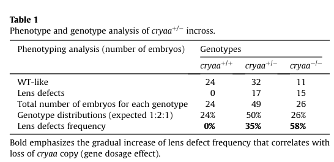

## Question

# Gene Research for Functional Annotation

## ⚠️ CRITICAL: Gene/Protein Identification Context

**BEFORE YOU BEGIN RESEARCH:** You MUST verify you are researching the CORRECT gene/protein. Gene symbols can be ambiguous, especially for less well-characterized genes from non-model organisms.

### Target Gene/Protein Identity (from UniProt):
- **UniProt Accession:** Q8UUZ6
- **Protein Description:** RecName: Full=Alpha-crystallin A chain {ECO:0000256|ARBA:ARBA00018827};
- **Gene Information:** Name=cryaa {ECO:0000313|EMBL:AAI64886.1, ECO:0000313|Ensembl:ENSDARP00000070021, ECO:0000313|RefSeq:NP_694482.1, ECO:0000313|ZFIN:ZDB-GENE-020508-1}; Synonyms=wu:fc06h04 {ECO:0000313|RefSeq:NP_694482.1}, zgc:92036 {ECO:0000313|RefSeq:NP_694482.1};
- **Organism (full):** Danio rerio (Zebrafish) (Brachydanio rerio).
- **Protein Family:** Belongs to the small heat shock protein (HSP20) family.
- **Key Domains:** A-crystallin/Hsp20_dom. (IPR002068); Alpha-crystallin/HSP_16. (IPR055269); Alpha-crystallin/sHSP_animal. (IPR001436); Alpha-crystallin_N. (IPR003090); HSP20-like_chaperone. (IPR008978)

### MANDATORY VERIFICATION STEPS:

1. **Check if the gene symbol "cryaa" matches the protein description above**
2. **Verify the organism is correct:** Danio rerio (Zebrafish) (Brachydanio rerio).
3. **Check if protein family/domains align with what you find in literature**
4. **If you find literature for a DIFFERENT gene with the same or similar symbol, STOP**

### If Gene Symbol is Ambiguous or You Cannot Find Relevant Literature:

**DO NOT PROCEED WITH RESEARCH ON A DIFFERENT GENE.** Instead:
- State clearly: "The gene symbol 'cryaa' is ambiguous or literature is limited for this specific protein"
- Explain what you found (e.g., "Found extensive literature on a different gene with the same symbol in a different organism")
- Describe the protein based ONLY on the UniProt information provided above
- Suggest that the protein function can be inferred from domain/family information

### Research Target:

Please provide a comprehensive research report on the gene **cryaa** (gene ID: cryaa, UniProt: Q8UUZ6) in DANRE.

The research report should be a detailed narrative explaining the function, biological processes, and localization of the gene product. Citations should be given for all claims.

You should prioritize authoritative reviews and primary scientific literature when conducting research. You can supplement
this with annotations you find in gene/protein databases, but these can be outdated or inaccurate.

We are specifically interested in the primary function of the gene - for enzymes, what reaction is catalyzed, and what is the substrate specificity? For transporters, what is the substrate? For structural proteins or adapters, what is the broader structural role? For signaling molecules, what is the role in the pathway.

We are interested in where in or outside the cell the gene product carries out its function.

We are also interested in the signaling or biochemical pathways in which the gene functions. We are less interested in broad pleiotropic effects, except where these elucidate the precise role.

Include evidence where possible. We are interested in both experimental evidence as well as inference from structure, evolution, or bioinformatic analysis. Precise studies should be prioritized over high-throughput, where available.

## Output

Question: You are an expert researcher providing comprehensive, well-cited information.

Provide detailed information focusing on:
1. Key concepts and definitions with current understanding
2. Recent developments and latest research (prioritize 2023-2024 sources)
3. Current applications and real-world implementations
4. Expert opinions and analysis from authoritative sources
5. Relevant statistics and data from recent studies

Format as a comprehensive research report with proper citations. Include URLs and publication dates where available.
Always prioritize recent, authoritative sources and provide specific citations for all major claims.

# Gene Research for Functional Annotation

## ⚠️ CRITICAL: Gene/Protein Identification Context

**BEFORE YOU BEGIN RESEARCH:** You MUST verify you are researching the CORRECT gene/protein. Gene symbols can be ambiguous, especially for less well-characterized genes from non-model organisms.

### Target Gene/Protein Identity (from UniProt):
- **UniProt Accession:** Q8UUZ6
- **Protein Description:** RecName: Full=Alpha-crystallin A chain {ECO:0000256|ARBA:ARBA00018827};
- **Gene Information:** Name=cryaa {ECO:0000313|EMBL:AAI64886.1, ECO:0000313|Ensembl:ENSDARP00000070021, ECO:0000313|RefSeq:NP_694482.1, ECO:0000313|ZFIN:ZDB-GENE-020508-1}; Synonyms=wu:fc06h04 {ECO:0000313|RefSeq:NP_694482.1}, zgc:92036 {ECO:0000313|RefSeq:NP_694482.1};
- **Organism (full):** Danio rerio (Zebrafish) (Brachydanio rerio).
- **Protein Family:** Belongs to the small heat shock protein (HSP20) family.
- **Key Domains:** A-crystallin/Hsp20_dom. (IPR002068); Alpha-crystallin/HSP_16. (IPR055269); Alpha-crystallin/sHSP_animal. (IPR001436); Alpha-crystallin_N. (IPR003090); HSP20-like_chaperone. (IPR008978)

### MANDATORY VERIFICATION STEPS:

1. **Check if the gene symbol "cryaa" matches the protein description above**
2. **Verify the organism is correct:** Danio rerio (Zebrafish) (Brachydanio rerio).
3. **Check if protein family/domains align with what you find in literature**
4. **If you find literature for a DIFFERENT gene with the same or similar symbol, STOP**

### If Gene Symbol is Ambiguous or You Cannot Find Relevant Literature:

**DO NOT PROCEED WITH RESEARCH ON A DIFFERENT GENE.** Instead:
- State clearly: "The gene symbol 'cryaa' is ambiguous or literature is limited for this specific protein"
- Explain what you found (e.g., "Found extensive literature on a different gene with the same symbol in a different organism")
- Describe the protein based ONLY on the UniProt information provided above
- Suggest that the protein function can be inferred from domain/family information

### Research Target:

Please provide a comprehensive research report on the gene **cryaa** (gene ID: cryaa, UniProt: Q8UUZ6) in DANRE.

The research report should be a detailed narrative explaining the function, biological processes, and localization of the gene product. Citations should be given for all claims.

You should prioritize authoritative reviews and primary scientific literature when conducting research. You can supplement
this with annotations you find in gene/protein databases, but these can be outdated or inaccurate.

We are specifically interested in the primary function of the gene - for enzymes, what reaction is catalyzed, and what is the substrate specificity? For transporters, what is the substrate? For structural proteins or adapters, what is the broader structural role? For signaling molecules, what is the role in the pathway.

We are interested in where in or outside the cell the gene product carries out its function.

We are also interested in the signaling or biochemical pathways in which the gene functions. We are less interested in broad pleiotropic effects, except where these elucidate the precise role.

Include evidence where possible. We are interested in both experimental evidence as well as inference from structure, evolution, or bioinformatic analysis. Precise studies should be prioritized over high-throughput, where available.

## Research report: Danio rerio **cryaa** (αA‑crystallin; UniProt Q8UUZ6)

### 0) Target identity verification (mandatory)
The target gene **cryaa** in **Danio rerio (zebrafish)** encodes **αA‑crystallin**, a member of the **small heat shock protein (sHSP/HSP20) family** that functions as an ATP‑independent molecular chaperone in the ocular lens. Zebrafish Cryaa is reported as a **173 aa** protein with **~72% amino‑acid identity to human CRYAA**, consistent with the UniProt description and α‑crystallin/sHSP domain family membership. (rossen2025zebrafishasa pages 3-4)

### 1) Key concepts and definitions (current understanding)

#### 1.1 αA‑crystallin as an sHSP “holdase” chaperone
α‑Crystallins are sHSPs that **bind destabilized proteins and inhibit their aggregation**, supporting **proteostasis** in the unusually protein‑dense lens environment. (zou2015aconservedrole pages 1-2, slingsby2013evolutionofcrystallins pages 1-2)

A mechanistic theme emphasized in authoritative reviews is that α‑crystallins form **large, dynamic oligomers**, and **subunit exchange/oligomer dynamics are needed for chaperone function**—a property that also helps avoid crystallization/phase separation at high protein concentration in the lens. (slingsby2013evolutionofcrystallins pages 1-2, rossen2025zebrafishasa pages 2-3)

#### 1.2 Lens biology context: why cryaa matters
Lens fiber cells eliminate organelles during maturation; as a result, lens transparency depends heavily on maintaining crystallin solubility and preventing aggregation. α‑Crystallin chaperone activity is implicated in supporting protein turnover/quality control in these organelle‑free fiber cells. (rossen2025zebrafishasa pages 3-4)

### 2) Zebrafish cryaa: expression, localization, and developmental timing

#### 2.1 Tissue/cell-type expression
Across zebrafish literature, cryaa is described as **lens‑restricted** at the tissue level, with embryonic expression reported in **lens epithelial and fiber cells**. (rossen2025zebrafishasa pages 3-4, peng2024thegenerationand pages 2-2)

Single‑cell transcriptomic evidence summarized in a zebrafish lens/cataract review indicates cryaa is **exclusive to lens fiber cells** and is the **earliest expressed crystallin**, beginning by **~48 hours post‑fertilization (hpf)** and increasing over the next ~3 days. (rossen2025zebrafishasa pages 3-4)

#### 2.2 Subcellular localization (gap)
Within the retrieved primary literature set, I did **not** find direct experimental evidence specifying Cryaa’s **subcellular localization** (e.g., cytosolic vs membrane‑bound fractions, nuclear association) in zebrafish lens cells; the evidence supports **lens‑cell type localization** rather than intracellular compartment localization. (rossen2025zebrafishasa pages 3-4)

#### 2.3 Promoter activity as a proxy for lens specificity and onset
The zebrafish **cryaa promoter** is widely used as a **lens‑specific driver**:
- In **Peng et al. 2024** (Jan 2024; Molecular Vision), a Tol2 transgenic line **zTg(cryaa:Cre‑cryaa:EGFP)** showed Cre/EGFP expression in the lens, with reported onset of Cre/EGFP expression **beginning at ~22 hpf**, and high lens recombination efficiency (**~98.4%** in a reported assay). (peng2024thegenerationand pages 1-2, peng2024thegenerationand pages 6-7)
- In **Posner et al. 2019** (Mar 2019; PLOS ONE), the **αA‑crystallin promoter** drove strong GFP expression in the cloche lens, supporting utility for lens-targeted expression experiments. (posner2019whydoesthe pages 1-2)

### 3) Molecular function and “clients”: evidence in zebrafish

#### 3.1 Preventing crystallin insolubility and lens opacity in vivo
A strong zebrafish in vivo link between αA‑crystallin function and client solubility comes from the **cloche** mutant lens cataract model:
- In cloche lenses, **γ‑crystallins become insoluble** and lenses show marked opacity/reflectance; overexpression of **exogenous αA‑crystallin (cryaa)** **solubilized γ‑crystallin**, increased transparency, and promoted fiber differentiation. (goishi2006αacrystallinexpressionprevents pages 1-2, goishi2006αacrystallinexpressionprevents pages 6-7)

Quantitative client/solubility evidence:
- γ‑crystallin solubility fractions: **WT 83% soluble / 17% insoluble**, **cloche 20% soluble / 80% insoluble**, and **cloche + αA overexpression >60% soluble γ‑crystallin**. (goishi2006αacrystallinexpressionprevents pages 6-7)

These results support a zebrafish‑context “client class” for Cryaa: **lens crystallins (notably γ‑crystallins)** that otherwise undergo insolubilization/aggregation. (goishi2006αacrystallinexpressionprevents pages 1-2, goishi2006αacrystallinexpressionprevents pages 6-7)

#### 3.2 Mutant Cryaa can promote client aggregation (proteostasis failure)
In transgenic zebrafish models expressing cataract‑linked αA‑crystallin mutants under the cryaa promoter (lens‑specific), **R49C** but not **R116C** promoted aggregation of a destabilized **human γD‑crystallin** mutant in the lens, indicating mutation-specific disruption of chaperone/client interactions in vivo. (wu2018transgeniczebrafishmodels pages 1-2)

### 4) Biological roles and phenotypes in zebrafish

#### 4.1 cryaa supports lens development and transparency
**Zou et al. 2015** (Sep 2015; Experimental Eye Research) concluded that αA‑crystallin has a **conserved role in zebrafish embryonic lens development** and that genetic loss produces **lens abnormalities including increased reflectance** (reduced transparency), with a more consistent and severe phenotype in maternal/zygotic mutants compared with morpholino knockdown. (zou2015aconservedrole pages 1-2, zou2015aconservedrole pages 8-9)

Rescue evidence:
- Lens phenotype penetrance was **reduced by transgenic expression of rat αA‑crystallin**, and severity was attenuated by **maternal αA‑crystallin**. (zou2015aconservedrole pages 1-2, zou2015aconservedrole pages 8-9)

The most direct quantitative evidence is contained in the paper’s table/figures retrieved as images (Table 1; Figures 2–4), including penetrance by genotype and quantitative reflectance scoring. (zou2015aconservedrole media a1406ec4, zou2015aconservedrole media d5eb8994, zou2015aconservedrole media bc004cf0, zou2015aconservedrole media a21c2392)

#### 4.2 cryaa null phenotypes: partial penetrance and strain/maternal effects
A zebrafish review summarizing multiple cryaa mutant studies reports that:
- **~60%** of **cryaa−/−** embryos from homozygous crosses show variable lens defects by **~72 hpf** in one CRISPR line.
- Another report observed **>90% penetrance** in homozygous crosses, attributed in part to **maternal transcript transmission** and/or background effects.
- Baseline cataract frequencies differ by strain (e.g., **AB ~16% at 96 hpf** vs **TL ~9% at 96 hpf**), emphasizing that penetrance comparisons require strain context. (rossen2025zebrafishasa pages 3-4)

#### 4.3 cloche model: quantitative cataract phenotype and rescue by αA‑crystallin
**Goishi et al. 2006** (Jul 2006; Development) provides unusually rich quantitative phenotyping:
- Cataract/opacity penetrance in cloche at **2.5 dpf**: **68% (428/633)** cloudy; by **3 dpf** penetrance rises (reported **84% (533/633)** in one analysis and **100% (34/34)** in another). (goishi2006αacrystallinexpressionprevents pages 4-5)
- Lens reflectance: median reflectance intensity was **37‑fold higher** in cloche vs WT at **4 dpf** (P=0.0209). (goishi2006αacrystallinexpressionprevents pages 4-5)
- αA‑crystallin protein was reduced **~85%** by Western blot in cloche. (goishi2006αacrystallinexpressionprevents pages 4-5)

Rescue by αA overexpression (cryaa):
- **80.2%** of embryos avoided cataract formation by bright‑field scoring.
- Lens reflectance was reduced by **41%**.
- γ‑crystallin insolubility was reduced by **60%**.
- Fiber‑cell nuclei per section (4 dpf): WT **0.0±0.0**, cloche **22.6±5.0**, and cloche + αA **3.0±0.0** (mean±s.d.). (goishi2006αacrystallinexpressionprevents pages 6-7)

Collectively, this supports that Cryaa contributes to **lens transparency** both by **maintaining client crystallin solubility** and by supporting **normal fiber differentiation/denucleation** under stress/pathological contexts. (goishi2006αacrystallinexpressionprevents pages 6-7)

#### 4.4 Cataract-linked mutant expression: penetrance depends on endogenous cryaa
**Wu et al. 2018** (Nov 2018; PLOS ONE) used a **1.2 kb zebrafish cryaa promoter** for lens‑specific expression of mutant αA‑crystallins and reported:
- In a cryaa‑null background, penetrance approached **~100%** for αA‑R49C and **~80%** for αA‑R116C.
- A destabilized γD‑crystallin I4F mutant alone produced **~30%** frequency of major lens defects.
- Lens defects first visible at ~3 dpf; phenotypes scored at **4 dpf** using defined severity classes. (wu2018transgeniczebrafishmodels pages 4-5, wu2018transgeniczebrafishmodels pages 2-4)

### 5) Pathways and mechanistic framing

#### 5.1 Proteostasis framework in the lens
Authoritative review framing emphasizes that α‑crystallins are sHSP chaperones whose **dynamic oligomeric assembly** supports both chaperone function and the structural requirement of avoiding protein condensation in the lens. (slingsby2013evolutionofcrystallins pages 1-2)

In zebrafish, Cryaa is explicitly framed as supporting protein turnover/quality control in organelle‑free fiber cells via chaperone activity. (rossen2025zebrafishasa pages 3-4)

#### 5.2 Ubiquitin–proteasome system (UPS) as a therapeutic lever for CRYAA aggregation (2024)
A major 2024 advance with direct translational relevance is the discovery that an E3 ligase (**RNF114**) can promote **UPS‑dependent degradation of aggregated/mutant CRYAA**:
- **Yang et al. 2024** (Sep 2024; J Clin Invest; https://doi.org/10.1172/jci169666) report that clearance of mutant CRYAA aggregates is **blocked by proteasome inhibition (MG132)** but not by autophagy/lysosome inhibitors, supporting a proteasome‑dependent mechanism. (yang2024reversiblecoldinducedlens pages 2-3)
- They engineered a deliverable RNF114 complex/peptide that reduced lens opacity in rodent models and was also effective in **H2O2‑induced zebrafish cataract models**, demonstrating a concrete zebrafish application for CRYAA‑targeted proteostasis therapy development. (yang2024reversiblecoldinducedlens pages 8-10, yang2024reversiblecoldinducedlens pages 1-2)

### 6) Current applications and real-world implementations

#### 6.1 Zebrafish as a functional model for crystallin-linked cataract mechanisms
Zebrafish enables:
- Rapid in vivo scoring of lens transparency/reflectance (e.g., cloche reflectance quantification; mutant penetrance scoring). (goishi2006αacrystallinexpressionprevents pages 6-7, goishi2006αacrystallinexpressionprevents pages 4-5)
- Lens‑specific transgenesis using cryaa promoter to express pathogenic variants and to test client aggregation mechanisms (e.g., γD‑crystallin aggregation with αA mutants). (wu2018transgeniczebrafishmodels pages 2-4, wu2018transgeniczebrafishmodels pages 1-2)

#### 6.2 cryaa promoter tools for lens-specific genetics (2024 implementation)
The **zTg(cryaa:Cre‑cryaa:EGFP)** line provides a lens‑restricted Cre driver for conditional genetic manipulation in zebrafish lenses, with reported early lens expression and high Cre activity (98.4% in one assay) and minimal developmental impact. (peng2024thegenerationand pages 1-2, peng2024thegenerationand pages 6-7)

### 7) Expert opinions and analysis (authoritative interpretations)

- A structural/evolutionary review argues that α‑crystallins’ **polydisperse, dynamic assemblies** are a “molecular phenotype” that suits both **chaperone function** and the lens requirement to resist crystallization/phase separation at extreme protein concentration. (slingsby2013evolutionofcrystallins pages 1-2)
- Zebrafish-focused synthesis emphasizes that—even though α‑crystallins constitute a smaller fraction of adult zebrafish lens protein in some proteomic estimates—this does not preclude a key developmental/proteostatic role, and that strain background and maternal effects can strongly modulate penetrance of cryaa phenotypes. (rossen2025zebrafishasa pages 3-4)

### 8) Key statistics and data points (selected)

**cloche cataract model (Goishi 2006; Development; 2006-07):**
- Opacity penetrance: 68% (428/633) at 2.5 dpf; 84% (533/633) at 3 dpf; also reported 100% (34/34) in one analysis. (goishi2006αacrystallinexpressionprevents pages 4-5)
- Lens reflectance: 37-fold higher in cloche vs WT at 4 dpf (P=0.0209). (goishi2006αacrystallinexpressionprevents pages 4-5)
- Cryaa rescue: 80.2% prevention of cataract; 41% reduction in reflectance; 60% reduction in γ-crystallin insolubility; nuclei/section reduced from 22.6±5.0 to 3.0±0.0. (goishi2006αacrystallinexpressionprevents pages 6-7)

**cryaa mutant penetrance and timing (summary across studies):**
- cryaa expression begins ~48 hpf; defects visible by ~72 hpf. (rossen2025zebrafishasa pages 3-4)
- cryaa−/− defect penetrance reported ~60% in one setting and >90% in another; baseline cataracts differ by strain (AB 16% at 96 hpf; TL 9% at 96 hpf). (rossen2025zebrafishasa pages 3-4)

**cataract-linked mutant transgenics (Wu 2018; PLOS ONE; 2018-11):**
- αA-R49C: ~100% penetrance in cryaa−/− background; αA-R116C: ~80% penetrance in cryaa−/− background. (wu2018transgeniczebrafishmodels pages 4-5)
- γD I4F alone: ~30% major defect frequency. (wu2018transgeniczebrafishmodels pages 4-5)

### 9) Practical functional annotation summary (zebrafish cryaa / UniProt Q8UUZ6)

**Primary molecular function:** ATP‑independent sHSP/α‑crystallin **holdase chaperone** that binds destabilized lens proteins and suppresses aggregation to maintain lens proteostasis and optical transparency. (zou2015aconservedrole pages 1-2, slingsby2013evolutionofcrystallins pages 1-2)

**Primary biological processes:** lens development and maintenance of transparency (anti‑aggregation), supporting fiber‑cell differentiation/denucleation especially under stress/pathological conditions. (zou2015aconservedrole pages 1-2, goishi2006αacrystallinexpressionprevents pages 6-7)

**Localization (best-supported):** lens tissue (lens epithelial/fiber cells; fiber-cell enriched by scRNA summary); intracellular compartment not resolved in the retrieved zebrafish evidence. (rossen2025zebrafishasa pages 3-4)

**Key pathways:** lens proteostasis network; recent work highlights UPS-mediated turnover of aggregated CRYAA as a therapeutic axis (RNF114). (yang2024reversiblecoldinducedlens pages 8-10)

### 10) Evidence map (summary table)
The following table consolidates the zebrafish cryaa functional annotation and evidence types.

| Category | Key findings (1-2 sentences) | Key evidence/citations |
|---|---|---|
| Molecular function | **Zebrafish-specific:** cryaa encodes αA-crystallin, a small heat shock protein/α-crystallin family member with ATP-independent chaperone activity in the lens. **General α-crystallin context:** α-crystallins bind thermodynamically destabilized proteins and help prevent aggregation; oligomer/subunit exchange is important for chaperone function. | (zou2015aconservedrole pages 1-2, rossen2025zebrafishasa pages 3-4, slingsby2013evolutionofcrystallins pages 1-2, rossen2025zebrafishasa pages 2-3) |
| Clients/targets | **Zebrafish-specific:** in the cloche lens, loss/insolubility of αA-crystallin is associated with γ-crystallin insolubility, and exogenous αA-crystallin can solubilize γ-crystallin. **General α-crystallin context:** destabilized lens proteins/crystallins are canonical client classes for α-crystallin chaperones. | (goishi2006αacrystallinexpressionprevents pages 1-2, zou2015aconservedrole pages 9-9) |
| Biological processes | **Zebrafish-specific:** cryaa supports embryonic lens development, lens transparency, and lens fiber-cell differentiation/denucleation. **General context:** α-crystallins contribute to proteostasis in organelle-free fiber cells where protein turnover/refolding capacity is limited. | (zou2015aconservedrole pages 1-2, goishi2006αacrystallinexpressionprevents pages 1-2, rossen2025zebrafishasa pages 3-4) |
| Cellular/tissue localization | **Zebrafish-specific:** cryaa expression is lens-restricted at the tissue level and is reported in lens epithelial and fiber cells; single-cell transcriptomics further indicate cryaa is exclusive to lens fiber cells in embryos/larvae. No direct subcellular localization of Cryaa protein within lens cells was retrieved from the provided evidence. | (rossen2025zebrafishasa pages 3-4, peng2024thegenerationand pages 2-2) |
| Developmental expression timing | **Zebrafish-specific:** cryaa is among the earliest crystallins expressed, detectable by ~48 hpf and increasing over the next 3 days; cryaa-promoter transgenes can begin lens expression earlier, with cryaa:Cre/EGFP activity reported from 22 hpf and zygotic transgene activity noted around 16 hpf in one 2024 tool paper. | (rossen2025zebrafishasa pages 3-4, peng2024thegenerationand pages 1-2, peng2024thegenerationand pages 6-7, peng2024thegenerationand pages 7-8) |
| Phenotypes (LOF) | **Zebrafish-specific:** cryaa loss causes variable embryonic lens defects, including increased lens reflectance/opacity, roughness at primary fiber cells or peripheral fiber-cell boundaries, central pitting, abnormal fiber-cell interfaces, and mild delay of denucleation; αA-crystallin increases the probability/severity of defects but is not absolutely essential for lens formation. Maternal cryaa contributes to phenotypic buffering. | (zou2015aconservedrole pages 1-2, zou2015aconservedrole pages 8-9, rossen2025zebrafishasa pages 4-5, rossen2025zebrafishasa pages 3-4, zou2015aconservedrole media a1406ec4) |
| Phenotypes (mutant overexpression) | **Zebrafish-specific:** lens-targeted expression of cataract-linked αA-crystallin mutants (e.g., R49C, R116C) produces lens abnormalities, with stronger effects for R49C and greater defect frequency when combined with cryaa-null background. R49C also promotes aggregation of destabilized γD-crystallin in vivo, supporting a client-trapping/aggregation mechanism. | (rossen2025zebrafishasa pages 4-5, rossen2025zebrafishasa pages 3-4) |
| Quantitative data points | **Zebrafish-specific:** reported penetrance includes ~60% of cryaa−/− embryos from homozygous crosses showing lens defects, and >90% penetrance in another homozygous-cross setting attributed partly to maternal effects; baseline cataract frequency varies by strain (AB ~16% at 96 hpf, TL ~9% at 96 hpf; ZDR ~27% by 18 months). Adult zebrafish lens protein composition includes ~8% α-crystallins in one review, while one 2024 cryaa-promoter tool paper cites α-crystallin as ~22% of total lens protein. | (rossen2025zebrafishasa pages 3-4, rossen2025zebrafishasa pages 2-3, peng2024thegenerationand pages 1-2, zou2015aconservedrole media a1406ec4) |
| Tools/applications | **Zebrafish-specific:** the cryaa promoter is a robust lens-specific driver used for GFP, Cre, and mutant crystallin expression, enabling lens-targeted gene manipulation and cataract modeling. A 2024 transgenic line, zTg(cryaa:Cre-cryaa:EGFP), showed lens-specific Cre activity with ~98.4% recombination efficiency in one assay and no obvious developmental/lens transparency defect from transgene expression. | (peng2024thegenerationand pages 1-2, peng2024thegenerationand pages 6-6, peng2024thegenerationand pages 6-7, posner2019whydoesthe pages 1-2) |

*Table: This table summarizes experimentally supported functional annotation for zebrafish cryaa/αA-crystallin (UniProt Q8UUZ6), separating zebrafish-specific findings from broader α-crystallin concepts. It highlights function, localization, developmental timing, phenotypes, quantitative observations, and practical uses of the cryaa promoter in zebrafish research.*

### References (URLs and publication dates)
- Goishi K. et al. **Development** (2006-07). “αA-crystallin expression prevents γ-crystallin insolubility and cataract formation in the zebrafish cloche mutant lens.” https://doi.org/10.1242/dev.02424 (goishi2006αacrystallinexpressionprevents pages 6-7, goishi2006αacrystallinexpressionprevents pages 4-5)
- Zou P. et al. **Experimental Eye Research** (2015-09). “A conserved role of αA-crystallin in the development of the zebrafish embryonic lens.” https://doi.org/10.1016/j.exer.2015.07.001 (zou2015aconservedrole pages 1-2, zou2015aconservedrole media a1406ec4)
- Wu S-Y. et al. **PLOS ONE** (2018-11). “Transgenic zebrafish models reveal distinct molecular mechanisms for cataract-linked αA-crystallin mutants.” https://doi.org/10.1371/journal.pone.0207540 (wu2018transgeniczebrafishmodels pages 2-4, wu2018transgeniczebrafishmodels pages 4-5)
- Posner M. et al. **PLOS ONE** (2019-03). “Why does the zebrafish cloche mutant develop lens cataract?” https://doi.org/10.1371/journal.pone.0211399 (posner2019whydoesthe pages 1-2, posner2019whydoesthe pages 2-4)
- Peng X. et al. **Molecular Vision** (2024-01). “The generation and characterization of a transgenic zebrafish line with lens-specific Cre expression.” https://doi.org/10.63500/mv_v30_123 (peng2024thegenerationand pages 1-2, peng2024thegenerationand pages 6-7)
- Shi J. et al. **Scientific Reports** (2023-03). “Phase separation of α-crystallin-GFP protein and its implication in cataract disease.” https://doi.org/10.1038/s41598-023-31845-9 (shi2023phaseseparationof pages 1-2)
- Yang H. et al. **Journal of Clinical Investigation** (2024-09). “Reversible cold-induced lens opacity in a hibernator reveals a molecular target for treating cataracts.” https://doi.org/10.1172/jci169666 (yang2024reversiblecoldinducedlens pages 8-10, yang2024reversiblecoldinducedlens pages 1-2)
- Slingsby C. et al. **Protein Science** (2013-04). “Evolution of crystallins for a role in the vertebrate eye lens.” https://doi.org/10.1002/pro.2229 (slingsby2013evolutionofcrystallins pages 1-2)

### Notes on limitations
- Direct UniProt/ZFIN/Ensembl/InterPro records were not retrievable via the provided toolchain, so database-style identifiers and domain/family claims are supported here by peer-reviewed sources and by the user-provided UniProt context.
- Zebrafish Cryaa **subcellular localization** (beyond “lens cell types”) was not found in the retrieved evidence; if needed, this would require targeted retrieval of lens fractionation/immunolocalization studies.

References

1. (rossen2025zebrafishasa pages 3-4): Jennifer L. Rossen, Antionette L. Williams, and Brenda L. Bohnsack. Zebrafish as a model for crystallin-associated congenital cataracts in humans. Frontiers in Cell and Developmental Biology, Mar 2025. URL: https://doi.org/10.3389/fcell.2025.1552988, doi:10.3389/fcell.2025.1552988. This article has 5 citations.

2. (zou2015aconservedrole pages 1-2): Ping Zou, Shu-Yu Wu, Hanane A. Koteiche, Sanjay Mishra, Daniel S. Levic, Ela Knapik, Wenbiao Chen, and Hassane S. Mchaourab. A conserved role of αa-crystallin in the development of the zebrafish embryonic lens. Experimental eye research, 138:104-13, Sep 2015. URL: https://doi.org/10.1016/j.exer.2015.07.001, doi:10.1016/j.exer.2015.07.001. This article has 38 citations and is from a peer-reviewed journal.

3. (slingsby2013evolutionofcrystallins pages 1-2): Christine Slingsby, Graeme J. Wistow, and Alice R. Clark. Evolution of crystallins for a role in the vertebrate eye lens. Protein Science, 22:367-380, Apr 2013. URL: https://doi.org/10.1002/pro.2229, doi:10.1002/pro.2229. This article has 210 citations and is from a peer-reviewed journal.

4. (rossen2025zebrafishasa pages 2-3): Jennifer L. Rossen, Antionette L. Williams, and Brenda L. Bohnsack. Zebrafish as a model for crystallin-associated congenital cataracts in humans. Frontiers in Cell and Developmental Biology, Mar 2025. URL: https://doi.org/10.3389/fcell.2025.1552988, doi:10.3389/fcell.2025.1552988. This article has 5 citations.

5. (peng2024thegenerationand pages 2-2): Xuyan Peng, Xiaolin Jia, Guohui Shang, Mengjiao Xue, Mingjun Jiang, Dandan Chen, Fengyan Zhang, and Yanzhong Hu. The generation and characterization of a transgenic zebrafish line with lens-specific cre expression. Molecular Vision, 30:123-136, Jan 2024. URL: https://doi.org/10.63500/mv\_v30\_123, doi:10.63500/mv\_v30\_123. This article has 2 citations and is from a peer-reviewed journal.

6. (peng2024thegenerationand pages 1-2): Xuyan Peng, Xiaolin Jia, Guohui Shang, Mengjiao Xue, Mingjun Jiang, Dandan Chen, Fengyan Zhang, and Yanzhong Hu. The generation and characterization of a transgenic zebrafish line with lens-specific cre expression. Molecular Vision, 30:123-136, Jan 2024. URL: https://doi.org/10.63500/mv\_v30\_123, doi:10.63500/mv\_v30\_123. This article has 2 citations and is from a peer-reviewed journal.

7. (peng2024thegenerationand pages 6-7): Xuyan Peng, Xiaolin Jia, Guohui Shang, Mengjiao Xue, Mingjun Jiang, Dandan Chen, Fengyan Zhang, and Yanzhong Hu. The generation and characterization of a transgenic zebrafish line with lens-specific cre expression. Molecular Vision, 30:123-136, Jan 2024. URL: https://doi.org/10.63500/mv\_v30\_123, doi:10.63500/mv\_v30\_123. This article has 2 citations and is from a peer-reviewed journal.

8. (posner2019whydoesthe pages 1-2): Mason Posner, Matthew S. McDonald, Kelly L. Murray, and Andor J. Kiss. Why does the zebrafish cloche mutant develop lens cataract? PLOS ONE, 14:e0211399, Mar 2019. URL: https://doi.org/10.1371/journal.pone.0211399, doi:10.1371/journal.pone.0211399. This article has 11 citations and is from a peer-reviewed journal.

9. (goishi2006αacrystallinexpressionprevents pages 1-2): Katsutoshi Goishi, Akio Shimizu, Gabriel Najarro, Sumiko Watanabe, Rick Rogers, Leonard I. Zon, and Michael Klagsbrun. Αa-crystallin expression prevents γ-crystallin insolubility and cataract formation in the zebrafish cloche mutant lens. Development, 133:2585-2593, Jul 2006. URL: https://doi.org/10.1242/dev.02424, doi:10.1242/dev.02424. This article has 91 citations and is from a domain leading peer-reviewed journal.

10. (goishi2006αacrystallinexpressionprevents pages 6-7): Katsutoshi Goishi, Akio Shimizu, Gabriel Najarro, Sumiko Watanabe, Rick Rogers, Leonard I. Zon, and Michael Klagsbrun. Αa-crystallin expression prevents γ-crystallin insolubility and cataract formation in the zebrafish cloche mutant lens. Development, 133:2585-2593, Jul 2006. URL: https://doi.org/10.1242/dev.02424, doi:10.1242/dev.02424. This article has 91 citations and is from a domain leading peer-reviewed journal.

11. (wu2018transgeniczebrafishmodels pages 1-2): Shu-Yu Wu, Ping Zou, Sanjay Mishra, and Hassane S. Mchaourab. Transgenic zebrafish models reveal distinct molecular mechanisms for cataract-linked αa-crystallin mutants. PLOS ONE, 13:e0207540, Nov 2018. URL: https://doi.org/10.1371/journal.pone.0207540, doi:10.1371/journal.pone.0207540. This article has 21 citations and is from a peer-reviewed journal.

12. (zou2015aconservedrole pages 8-9): Ping Zou, Shu-Yu Wu, Hanane A. Koteiche, Sanjay Mishra, Daniel S. Levic, Ela Knapik, Wenbiao Chen, and Hassane S. Mchaourab. A conserved role of αa-crystallin in the development of the zebrafish embryonic lens. Experimental eye research, 138:104-13, Sep 2015. URL: https://doi.org/10.1016/j.exer.2015.07.001, doi:10.1016/j.exer.2015.07.001. This article has 38 citations and is from a peer-reviewed journal.

13. (zou2015aconservedrole media a1406ec4): Ping Zou, Shu-Yu Wu, Hanane A. Koteiche, Sanjay Mishra, Daniel S. Levic, Ela Knapik, Wenbiao Chen, and Hassane S. Mchaourab. A conserved role of αa-crystallin in the development of the zebrafish embryonic lens. Experimental eye research, 138:104-13, Sep 2015. URL: https://doi.org/10.1016/j.exer.2015.07.001, doi:10.1016/j.exer.2015.07.001. This article has 38 citations and is from a peer-reviewed journal.

14. (zou2015aconservedrole media d5eb8994): Ping Zou, Shu-Yu Wu, Hanane A. Koteiche, Sanjay Mishra, Daniel S. Levic, Ela Knapik, Wenbiao Chen, and Hassane S. Mchaourab. A conserved role of αa-crystallin in the development of the zebrafish embryonic lens. Experimental eye research, 138:104-13, Sep 2015. URL: https://doi.org/10.1016/j.exer.2015.07.001, doi:10.1016/j.exer.2015.07.001. This article has 38 citations and is from a peer-reviewed journal.

15. (zou2015aconservedrole media bc004cf0): Ping Zou, Shu-Yu Wu, Hanane A. Koteiche, Sanjay Mishra, Daniel S. Levic, Ela Knapik, Wenbiao Chen, and Hassane S. Mchaourab. A conserved role of αa-crystallin in the development of the zebrafish embryonic lens. Experimental eye research, 138:104-13, Sep 2015. URL: https://doi.org/10.1016/j.exer.2015.07.001, doi:10.1016/j.exer.2015.07.001. This article has 38 citations and is from a peer-reviewed journal.

16. (zou2015aconservedrole media a21c2392): Ping Zou, Shu-Yu Wu, Hanane A. Koteiche, Sanjay Mishra, Daniel S. Levic, Ela Knapik, Wenbiao Chen, and Hassane S. Mchaourab. A conserved role of αa-crystallin in the development of the zebrafish embryonic lens. Experimental eye research, 138:104-13, Sep 2015. URL: https://doi.org/10.1016/j.exer.2015.07.001, doi:10.1016/j.exer.2015.07.001. This article has 38 citations and is from a peer-reviewed journal.

17. (goishi2006αacrystallinexpressionprevents pages 4-5): Katsutoshi Goishi, Akio Shimizu, Gabriel Najarro, Sumiko Watanabe, Rick Rogers, Leonard I. Zon, and Michael Klagsbrun. Αa-crystallin expression prevents γ-crystallin insolubility and cataract formation in the zebrafish cloche mutant lens. Development, 133:2585-2593, Jul 2006. URL: https://doi.org/10.1242/dev.02424, doi:10.1242/dev.02424. This article has 91 citations and is from a domain leading peer-reviewed journal.

18. (wu2018transgeniczebrafishmodels pages 4-5): Shu-Yu Wu, Ping Zou, Sanjay Mishra, and Hassane S. Mchaourab. Transgenic zebrafish models reveal distinct molecular mechanisms for cataract-linked αa-crystallin mutants. PLOS ONE, 13:e0207540, Nov 2018. URL: https://doi.org/10.1371/journal.pone.0207540, doi:10.1371/journal.pone.0207540. This article has 21 citations and is from a peer-reviewed journal.

19. (wu2018transgeniczebrafishmodels pages 2-4): Shu-Yu Wu, Ping Zou, Sanjay Mishra, and Hassane S. Mchaourab. Transgenic zebrafish models reveal distinct molecular mechanisms for cataract-linked αa-crystallin mutants. PLOS ONE, 13:e0207540, Nov 2018. URL: https://doi.org/10.1371/journal.pone.0207540, doi:10.1371/journal.pone.0207540. This article has 21 citations and is from a peer-reviewed journal.

20. (yang2024reversiblecoldinducedlens pages 2-3): Hao Yang, Xiyuan Ping, Jiayue Zhou, Hailaiti Ailifeire, Jing Wu, Francisco M. Nadal-Nicolás, Kiyoharu J. Miyagishima, Jing Bao, Yuxin Huang, Yilei Cui, Xin Xing, Shiqiang Wang, Ke Yao, Wei Li, and Xingchao Shentu. Reversible cold-induced lens opacity in a hibernator reveals a molecular target for treating cataracts. The Journal of Clinical Investigation, Sep 2024. URL: https://doi.org/10.1172/jci169666, doi:10.1172/jci169666. This article has 15 citations.

21. (yang2024reversiblecoldinducedlens pages 8-10): Hao Yang, Xiyuan Ping, Jiayue Zhou, Hailaiti Ailifeire, Jing Wu, Francisco M. Nadal-Nicolás, Kiyoharu J. Miyagishima, Jing Bao, Yuxin Huang, Yilei Cui, Xin Xing, Shiqiang Wang, Ke Yao, Wei Li, and Xingchao Shentu. Reversible cold-induced lens opacity in a hibernator reveals a molecular target for treating cataracts. The Journal of Clinical Investigation, Sep 2024. URL: https://doi.org/10.1172/jci169666, doi:10.1172/jci169666. This article has 15 citations.

22. (yang2024reversiblecoldinducedlens pages 1-2): Hao Yang, Xiyuan Ping, Jiayue Zhou, Hailaiti Ailifeire, Jing Wu, Francisco M. Nadal-Nicolás, Kiyoharu J. Miyagishima, Jing Bao, Yuxin Huang, Yilei Cui, Xin Xing, Shiqiang Wang, Ke Yao, Wei Li, and Xingchao Shentu. Reversible cold-induced lens opacity in a hibernator reveals a molecular target for treating cataracts. The Journal of Clinical Investigation, Sep 2024. URL: https://doi.org/10.1172/jci169666, doi:10.1172/jci169666. This article has 15 citations.

23. (zou2015aconservedrole pages 9-9): Ping Zou, Shu-Yu Wu, Hanane A. Koteiche, Sanjay Mishra, Daniel S. Levic, Ela Knapik, Wenbiao Chen, and Hassane S. Mchaourab. A conserved role of αa-crystallin in the development of the zebrafish embryonic lens. Experimental eye research, 138:104-13, Sep 2015. URL: https://doi.org/10.1016/j.exer.2015.07.001, doi:10.1016/j.exer.2015.07.001. This article has 38 citations and is from a peer-reviewed journal.

24. (peng2024thegenerationand pages 7-8): Xuyan Peng, Xiaolin Jia, Guohui Shang, Mengjiao Xue, Mingjun Jiang, Dandan Chen, Fengyan Zhang, and Yanzhong Hu. The generation and characterization of a transgenic zebrafish line with lens-specific cre expression. Molecular Vision, 30:123-136, Jan 2024. URL: https://doi.org/10.63500/mv\_v30\_123, doi:10.63500/mv\_v30\_123. This article has 2 citations and is from a peer-reviewed journal.

25. (rossen2025zebrafishasa pages 4-5): Jennifer L. Rossen, Antionette L. Williams, and Brenda L. Bohnsack. Zebrafish as a model for crystallin-associated congenital cataracts in humans. Frontiers in Cell and Developmental Biology, Mar 2025. URL: https://doi.org/10.3389/fcell.2025.1552988, doi:10.3389/fcell.2025.1552988. This article has 5 citations.

26. (peng2024thegenerationand pages 6-6): Xuyan Peng, Xiaolin Jia, Guohui Shang, Mengjiao Xue, Mingjun Jiang, Dandan Chen, Fengyan Zhang, and Yanzhong Hu. The generation and characterization of a transgenic zebrafish line with lens-specific cre expression. Molecular Vision, 30:123-136, Jan 2024. URL: https://doi.org/10.63500/mv\_v30\_123, doi:10.63500/mv\_v30\_123. This article has 2 citations and is from a peer-reviewed journal.

27. (posner2019whydoesthe pages 2-4): Mason Posner, Matthew S. McDonald, Kelly L. Murray, and Andor J. Kiss. Why does the zebrafish cloche mutant develop lens cataract? PLOS ONE, 14:e0211399, Mar 2019. URL: https://doi.org/10.1371/journal.pone.0211399, doi:10.1371/journal.pone.0211399. This article has 11 citations and is from a peer-reviewed journal.

28. (shi2023phaseseparationof pages 1-2): Jie Shi, Ya-Xi Zhu, Rui-Yan Huang, Shao-Mei Bai, Yu-Xing Zheng, Jian Zheng, Zhao-Xia Xia, and Yun-Long Wang. Phase separation of α-crystallin-gfp protein and its implication in cataract disease. Scientific Reports, Mar 2023. URL: https://doi.org/10.1038/s41598-023-31845-9, doi:10.1038/s41598-023-31845-9. This article has 15 citations and is from a peer-reviewed journal.

## Artifacts

- [Edison artifact artifact-00](cryaa-deep-research-falcon_artifacts/artifact-00.md)

## Citations

1. rossen2025zebrafishasa pages 3-4
2. posner2019whydoesthe pages 1-2
3. wu2018transgeniczebrafishmodels pages 1-2
4. slingsby2013evolutionofcrystallins pages 1-2
5. yang2024reversiblecoldinducedlens pages 2-3
6. wu2018transgeniczebrafishmodels pages 4-5
7. yang2024reversiblecoldinducedlens pages 8-10
8. shi2023phaseseparationof pages 1-2
9. zou2015aconservedrole pages 1-2
10. rossen2025zebrafishasa pages 2-3
11. peng2024thegenerationand pages 2-2
12. peng2024thegenerationand pages 1-2
13. peng2024thegenerationand pages 6-7
14. zou2015aconservedrole pages 8-9
15. wu2018transgeniczebrafishmodels pages 2-4
16. yang2024reversiblecoldinducedlens pages 1-2
17. zou2015aconservedrole pages 9-9
18. peng2024thegenerationand pages 7-8
19. rossen2025zebrafishasa pages 4-5
20. peng2024thegenerationand pages 6-6
21. posner2019whydoesthe pages 2-4
22. https://doi.org/10.1172/jci169666
23. https://doi.org/10.1242/dev.02424
24. https://doi.org/10.1016/j.exer.2015.07.001
25. https://doi.org/10.1371/journal.pone.0207540
26. https://doi.org/10.1371/journal.pone.0211399
27. https://doi.org/10.63500/mv_v30_123
28. https://doi.org/10.1038/s41598-023-31845-9
29. https://doi.org/10.1002/pro.2229
30. https://doi.org/10.3389/fcell.2025.1552988,
31. https://doi.org/10.1016/j.exer.2015.07.001,
32. https://doi.org/10.1002/pro.2229,
33. https://doi.org/10.63500/mv\_v30\_123,
34. https://doi.org/10.1371/journal.pone.0211399,
35. https://doi.org/10.1242/dev.02424,
36. https://doi.org/10.1371/journal.pone.0207540,
37. https://doi.org/10.1172/jci169666,
38. https://doi.org/10.1038/s41598-023-31845-9,