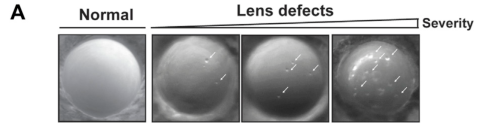

## Question

# Gene Research for Functional Annotation

## ⚠️ CRITICAL: Gene/Protein Identification Context

**BEFORE YOU BEGIN RESEARCH:** You MUST verify you are researching the CORRECT gene/protein. Gene symbols can be ambiguous, especially for less well-characterized genes from non-model organisms.

### Target Gene/Protein Identity (from UniProt):
- **UniProt Accession:** A0A8M9Q8E3
- **Protein Description:** RecName: Full=Alpha-crystallin B chain {ECO:0000256|ARBA:ARBA00018516}; AltName: Full=Alpha(B)-crystallin {ECO:0000256|ARBA:ARBA00030175};
- **Gene Information:** Name=cryabb {ECO:0000313|RefSeq:XP_021331756.2, ECO:0000313|ZFIN:ZDB-GENE-040718-419}; Synonyms=cryab2 {ECO:0000313|RefSeq:XP_021331756.2}, fe37f08 {ECO:0000313|RefSeq:XP_021331756.2}, wu:fe37f08 {ECO:0000313|RefSeq:XP_021331756.2}, zgc:91937 {ECO:0000313|RefSeq:XP_021331756.2};
- **Organism (full):** Danio rerio (Zebrafish) (Brachydanio rerio).
- **Protein Family:** Belongs to the small heat shock protein (HSP20) family.
- **Key Domains:** A-crystallin/Hsp20_dom. (IPR002068); Alpha-crystallin/sHSP_animal. (IPR001436); Alpha-crystallin_N. (IPR003090); HSP20-like_chaperone. (IPR008978); Crystallin (PF00525)

### MANDATORY VERIFICATION STEPS:

1. **Check if the gene symbol "cryabb" matches the protein description above**
2. **Verify the organism is correct:** Danio rerio (Zebrafish) (Brachydanio rerio).
3. **Check if protein family/domains align with what you find in literature**
4. **If you find literature for a DIFFERENT gene with the same or similar symbol, STOP**

### If Gene Symbol is Ambiguous or You Cannot Find Relevant Literature:

**DO NOT PROCEED WITH RESEARCH ON A DIFFERENT GENE.** Instead:
- State clearly: "The gene symbol 'cryabb' is ambiguous or literature is limited for this specific protein"
- Explain what you found (e.g., "Found extensive literature on a different gene with the same symbol in a different organism")
- Describe the protein based ONLY on the UniProt information provided above
- Suggest that the protein function can be inferred from domain/family information

### Research Target:

Please provide a comprehensive research report on the gene **cryabb** (gene ID: cryabb, UniProt: A0A8M9Q8E3) in DANRE.

The research report should be a detailed narrative explaining the function, biological processes, and localization of the gene product. Citations should be given for all claims.

You should prioritize authoritative reviews and primary scientific literature when conducting research. You can supplement
this with annotations you find in gene/protein databases, but these can be outdated or inaccurate.

We are specifically interested in the primary function of the gene - for enzymes, what reaction is catalyzed, and what is the substrate specificity? For transporters, what is the substrate? For structural proteins or adapters, what is the broader structural role? For signaling molecules, what is the role in the pathway.

We are interested in where in or outside the cell the gene product carries out its function.

We are also interested in the signaling or biochemical pathways in which the gene functions. We are less interested in broad pleiotropic effects, except where these elucidate the precise role.

Include evidence where possible. We are interested in both experimental evidence as well as inference from structure, evolution, or bioinformatic analysis. Precise studies should be prioritized over high-throughput, where available.

## Output

Question: You are an expert researcher providing comprehensive, well-cited information.

Provide detailed information focusing on:
1. Key concepts and definitions with current understanding
2. Recent developments and latest research (prioritize 2023-2024 sources)
3. Current applications and real-world implementations
4. Expert opinions and analysis from authoritative sources
5. Relevant statistics and data from recent studies

Format as a comprehensive research report with proper citations. Include URLs and publication dates where available.
Always prioritize recent, authoritative sources and provide specific citations for all major claims.

# Gene Research for Functional Annotation

## ⚠️ CRITICAL: Gene/Protein Identification Context

**BEFORE YOU BEGIN RESEARCH:** You MUST verify you are researching the CORRECT gene/protein. Gene symbols can be ambiguous, especially for less well-characterized genes from non-model organisms.

### Target Gene/Protein Identity (from UniProt):
- **UniProt Accession:** A0A8M9Q8E3
- **Protein Description:** RecName: Full=Alpha-crystallin B chain {ECO:0000256|ARBA:ARBA00018516}; AltName: Full=Alpha(B)-crystallin {ECO:0000256|ARBA:ARBA00030175};
- **Gene Information:** Name=cryabb {ECO:0000313|RefSeq:XP_021331756.2, ECO:0000313|ZFIN:ZDB-GENE-040718-419}; Synonyms=cryab2 {ECO:0000313|RefSeq:XP_021331756.2}, fe37f08 {ECO:0000313|RefSeq:XP_021331756.2}, wu:fe37f08 {ECO:0000313|RefSeq:XP_021331756.2}, zgc:91937 {ECO:0000313|RefSeq:XP_021331756.2};
- **Organism (full):** Danio rerio (Zebrafish) (Brachydanio rerio).
- **Protein Family:** Belongs to the small heat shock protein (HSP20) family.
- **Key Domains:** A-crystallin/Hsp20_dom. (IPR002068); Alpha-crystallin/sHSP_animal. (IPR001436); Alpha-crystallin_N. (IPR003090); HSP20-like_chaperone. (IPR008978); Crystallin (PF00525)

### MANDATORY VERIFICATION STEPS:

1. **Check if the gene symbol "cryabb" matches the protein description above**
2. **Verify the organism is correct:** Danio rerio (Zebrafish) (Brachydanio rerio).
3. **Check if protein family/domains align with what you find in literature**
4. **If you find literature for a DIFFERENT gene with the same or similar symbol, STOP**

### If Gene Symbol is Ambiguous or You Cannot Find Relevant Literature:

**DO NOT PROCEED WITH RESEARCH ON A DIFFERENT GENE.** Instead:
- State clearly: "The gene symbol 'cryabb' is ambiguous or literature is limited for this specific protein"
- Explain what you found (e.g., "Found extensive literature on a different gene with the same symbol in a different organism")
- Describe the protein based ONLY on the UniProt information provided above
- Suggest that the protein function can be inferred from domain/family information

### Research Target:

Please provide a comprehensive research report on the gene **cryabb** (gene ID: cryabb, UniProt: A0A8M9Q8E3) in DANRE.

The research report should be a detailed narrative explaining the function, biological processes, and localization of the gene product. Citations should be given for all claims.

You should prioritize authoritative reviews and primary scientific literature when conducting research. You can supplement
this with annotations you find in gene/protein databases, but these can be outdated or inaccurate.

We are specifically interested in the primary function of the gene - for enzymes, what reaction is catalyzed, and what is the substrate specificity? For transporters, what is the substrate? For structural proteins or adapters, what is the broader structural role? For signaling molecules, what is the role in the pathway.

We are interested in where in or outside the cell the gene product carries out its function.

We are also interested in the signaling or biochemical pathways in which the gene functions. We are less interested in broad pleiotropic effects, except where these elucidate the precise role.

Include evidence where possible. We are interested in both experimental evidence as well as inference from structure, evolution, or bioinformatic analysis. Precise studies should be prioritized over high-throughput, where available.

# Research Report: Functional Annotation of zebrafish **cryabb** (UniProt **A0A8M9Q8E3**)

## Executive summary
**cryabb** encodes the zebrafish **αBb-crystallin**, a member of the **small heat shock protein (sHSP / α-crystallin/HSP20-like)** family that acts primarily as an **ATP-independent molecular chaperone (“holdase”)** supporting **proteostasis** by suppressing aggregation of destabilized proteins. In zebrafish, αB-crystallin exists as two paralogs (**cryaba** and **cryabb**) generated by teleost duplication; the evidence indicates **cryabb (αBb)** is the more broadly expressed and stress-responsive paralog, with transcriptional coupling to the oxidative-stress regulator **Nrf2**, and context-dependent roles in lens and heart phenotypes. Quantitative zebrafish data show developmental expression of cryabb rising toward larval stages, modest heat-shock inducibility depending on stage, and oxidative/Nrf2-linked upregulation; cryabb loss-of-function has been reported to cause **lens opacity defects in a subset of larvae (~30% at 4 dpf)** in one study but **minimal early lens defects** in another, highlighting background/assay dependence. (park2023interplaybetweennrf2 pages 2-3, elicker2007genomewideanalysisand pages 6-8, park2023interplaybetweennrf2 pages 3-4, posner2021effectsofαcrystallin pages 1-3, posner2021effectsofαcrystallin pages 10-12)

## 1. Gene/protein identity verification (critical disambiguation)
Zebrafish has two αB-crystallin paralogs: **cryaba (αBa)** and **cryabb (αBb)**; older/alternate gene naming in zebrafish literature and genome-wide sHSP annotations also map these to **hspb5a (cryaba)** and **hspb5b (cryabb)**. (park2023interplaybetweennrf2 pages 2-3, elicker2007genomewideanalysisand pages 2-3)

Direct experimental validation that the literature is addressing the intended gene comes from CRISPR work that targeted **cryabb (ZDB-GENE-040718-419)** and confirmed loss of the corresponding αBb protein in adult lenses by **targeted mass spectrometry** using cryabb-specific tryptic peptides. (posner2021effectsofαcrystallin pages 15-18, posner2021effectsofαcrystallin pages 18-22)

## 2. Key concepts and definitions (current understanding)
### 2.1 α-crystallins and small heat shock proteins
α-crystallins are **small heat shock proteins** that bind destabilized proteins and inhibit their aggregation, supporting long-lived proteomes such as those in the vertebrate lens. (posner2021effectsofαcrystallin pages 1-3)

Crystallins are described as **small, soluble proteins** found at high abundance in the **cytoplasm** of cells in optical tissues, supporting a primary **intracellular/cytosolic** site of action. (inyushin2019tissuetransparencyin pages 4-6)

### 2.2 cryabb molecular function
Across zebrafish studies, αB-crystallins (including cryabb) are discussed as contributing to **protein quality control** and **cytoskeletal stabilization**, consistent with canonical sHSP roles in binding partially unfolded clients and buffering proteotoxic stress. (park2023interplaybetweennrf2 pages 2-3, posner2021effectsofαcrystallin pages 1-3)

**cryabb is not an enzyme or transporter**; no catalytic reaction or transported substrate is implied by the evidence. Instead, the primary function is best described as an **ATP-independent chaperone-like holdase** that maintains proteostasis by suppressing protein aggregation. (posner2021effectsofαcrystallin pages 1-3, park2023interplaybetweennrf2 pages 2-3)

## 3. Expression patterns, regulation, and localization in zebrafish
### 3.1 Developmental expression and heat-shock response (quantitative)
A genome-wide zebrafish sHSP expression analysis quantified **hspb5b/cryabb** by qRT-PCR across development (reported as fraction of EF-1α ×10^5). cryabb expression was **very low at the 16-cell stage** and increased by larval stages: **0.1±0.1 (16-cell), 2.9±1.0 (12 hpf), 2.6±1.7 (24 hpf), 12.4±10.8 (48 hpf), 18.0±1.9 (5 dpf)**. (elicker2007genomewideanalysisand pages 6-8)

In the same study, heat shock (1 h at 37°C) produced **modest, stage-dependent** changes in cryabb expression: approximately **2.5-fold at 12 hpf**, **1.7-fold at 24 hpf**, decreased at **48 hpf**, and minimal change by **5 dpf**. (elicker2007genomewideanalysisand pages 6-8)

### 3.2 Tissue distribution
In zebrafish, αB-crystallin is reported as detected in multiple tissues including **heart, brain, skeletal muscle, kidneys**, and even discussed in relation to the **extracellular matrix** (ECM), while cryabb (αBb) is described as more widely expressed than cryaba, including **lens, muscle, and brain**. (park2023interplaybetweennrf2 pages 2-3)

A tissue-transparency review, citing zebrafish resources, states that in embryos **Cryaa** is lens-restricted whereas **Cryabb is distributed throughout the body**, aligning with cryabb being a broadly expressed stress-linked sHSP rather than a lens-exclusive crystallin. (inyushin2019tissuetransparencyin pages 4-6)

### 3.3 Subcellular localization
Direct zebrafish cryabb subcellular localization experiments were not present in the extracted evidence. However, crystallins are described as **soluble cytoplasmic** proteins in vertebrate optical tissues, supporting a primary **intracellular/cytosolic** localization. (inyushin2019tissuetransparencyin pages 4-6)

Mentions of αB-crystallin in the “extracellular matrix” in zebrafish context should be interpreted cautiously as **tissue/compartment association** rather than proof that cryabb is a secreted ECM structural protein. (park2023interplaybetweennrf2 pages 2-3)

### 3.4 Nrf2 coupling and oxidative-stress regulation (2023 zebrafish study)
A 2023 zebrafish study using nrf2 mutant backgrounds reports a **tissue-specific transcriptional relationship** where **cryabb transcripts increase strongly in heart and brain** upon Nrf2 compromise, while cryaba does not show comparable changes. (park2023interplaybetweennrf2 pages 3-4, park2023interplaybetweennrf2 pages 2-3)

Oxidative stress induction with **800 μM tert-butyl hydroperoxide (tBHP) for 2 h at 4 dpf** increased cryabb mRNA by about **~1.5-fold**. (park2023interplaybetweennrf2 pages 3-4)

## 4. Functional evidence from zebrafish perturbation studies
### 4.1 Knockout validation and phenotypes (lens)
Two independent zebrafish CRISPR-based efforts converge on validated cryabb loss-of-function but report different early lens outcomes.

* **Posner et al. 2021 (bioRxiv; posted Dec 2021; URL https://doi.org/10.1101/2021.12.22.473921)**: generated cryabb null lines and validated loss of αBb protein by targeted MS. In larval analyses (3–4 dpf), they report that cryabb null mutants **did not show significant lens defects**, consistent with low early lens expression; they also report **no evidence for genetic compensation** among cryaa/cryaba/cryabb transcripts. (posner2021effectsofαcrystallin pages 1-3, posner2021effectsofαcrystallin pages 18-22)

* **Park et al. 2023 (Frontiers Mol Biosci; published Jul 2023; URL https://doi.org/10.3389/fmolb.2023.1185704)**: reported lens opacity defects in cryabb−/− embryos characterized by puncta and altered light scattering, with about **~30%** of cryabb−/− embryos having lens defects at **4 dpf** (compared with ~10% WT in their scoring). (park2023interplaybetweennrf2 pages 3-4)

These discrepancies underscore that cryabb’s contribution to early lens transparency may be **context-dependent** (e.g., genetic background, scoring methods, environmental stressors), while remaining consistent with a stress-buffering proteostasis function. (posner2021effectsofαcrystallin pages 10-12, park2023interplaybetweennrf2 pages 3-4)

### 4.2 Cardiac phenotypes and pathways
Park et al. (2023) further link αB-crystallin biology to cardiac stress phenotypes and pathways through combinatorial genetics with **nrf2**. The study reports an embryonic **cardiac edema phenotype** characteristic of αB-crystallin knockout lines and that Nrf2 loss modulates penetrance in a paralog-dependent manner (stronger interaction with cryaba than cryabb). (park2023interplaybetweennrf2 pages 6-9, park2023interplaybetweennrf2 pages 9-10)

RNA-seq pathway-level findings from heart tissue in Park et al. (2023) include enrichment of GO terms related to **extracellular region**, **supermolecular fiber**, and **bicellular tight junctions**, with upregulation of multiple ECM/remodeling and tight-junction transcripts, and Disease Ontology links toward cardiomyopathy-related signatures. (park2023interplaybetweennrf2 pages 6-9, park2023interplaybetweennrf2 pages 9-10)

## 5. Pathways and biological processes implicated
### 5.1 Proteostasis and stress-response intersection
The 2023 zebrafish study frames cryabb at the intersection of **oxidative-stress response (Nrf2)** and **proteostatic stress response (sHSP chaperones)**, supporting a model where cryabb is transcriptionally mobilized in tissues (notably heart/brain) to buffer proteotoxic consequences of impaired redox control. (park2023interplaybetweennrf2 pages 2-3, park2023interplaybetweennrf2 pages 3-4)

### 5.2 Lens sterol/cholesterol biosynthesis as a modifier of crystallin-linked phenotypes
In the lens, Park et al. report that phenotypic rescue in an αBa/Nrf2 combined genotype was associated with upregulation of the **cholesterol biosynthesis pathway**, with pharmacologic perturbation by statins increasing penetrance of lens defects in that genetic background. While this is not cryabb-only, it is relevant to interpreting αB-crystallin paralog biology in lens proteostasis networks. (park2023interplaybetweennrf2 pages 9-10, park2023interplaybetweennrf2 pages 6-9)

## 6. Recent developments and latest research (prioritizing 2023–2024)
### 6.1 Zebrafish cryabb-focused 2023 advance: Nrf2–cryabb coupling under proteostatic stress
Park et al. 2023 is a key recent zebrafish contribution because it explicitly distinguishes cryabb from cryaba and connects cryabb to oxidative-stress signaling via Nrf2, reports oxidative induction (~1.5-fold with tBHP), and provides quantitative penetrance (~30% lens defects at 4 dpf) under their assay. (park2023interplaybetweennrf2 pages 3-4)

### 6.2 Cross-species CRYAB/HSPB5 advances relevant to cryabb annotation (clearly labeled inference)
Although not zebrafish-specific, recent mammalian/cell-model literature provides mechanistic context likely relevant to cryabb due to strong family conservation.

* **Extracellular vesicle (EV) / secretory proteostasis signature in stressed cardiomyocytes (Jan 2023)**: Single-cell transcriptomics and EV proteomics in mouse remodeling models show EV secretion enriched for protein-quality-control components, including **CRYAB**, and stress-associated redistribution of CRYAB (perinuclear accumulation) in Wnt-activated human iPSC-cardiomyocytes. This supports the idea that αB-crystallin family proteins can be tied to EV-mediated proteostasis signaling under stress (context for interpreting tissue-level “ECM/extracellular” mentions). (schoger2023singlecelltranscriptomicsreveal pages 1-2, schoger2023singlecelltranscriptomicsreveal pages 8-9)

* **CRYAB as an angiogenic factor from mature hiPSC-derived cardiomyocytes (Sep 2023)**: Mature (D56) vs less mature (D28) hiPSC-cardiomyocytes displayed increased angiogenic programs, with CRYAB identified as a key upregulated factor. CRYAB knockdown inhibited endothelial migration in vitro; CRYAB overexpression enhanced angiogenesis in transplanted grafts (n=4 per group) and CRYAB was detected at slightly higher concentration in exosomes from mature cardiomyocyte culture supernatants. This provides a real-world implementation angle: CRYAB levels and localization can be leveraged as functional markers and potentially therapeutic effectors in regenerative/cardiovascular contexts (inference for cryabb’s broader tissue roles). (tanaka2023maturehumaninduced pages 15-17)

* **Condensate/phase-separation and phosphorylation mechanisms (2024; dissertation evidence)**: Work summarized in a 2024 dissertation reports that CRYAB can undergo phase separation, and that phosphorylation at serine 59 modulates condensate properties and proteostasis outcomes in cardiac contexts, with genetic manipulations (S59A vs S59D) affecting remodeling after myocardial infarction in mice. While not peer-reviewed primary evidence in the extracted set, it reflects a major mechanistic direction (condensatopathy) that may inform hypotheses for cryabb stress responses. (islam2024αbcrystallinphosphorylationinduces pages 155-158)

## 7. Current applications and real-world implementations
### 7.1 Zebrafish applications
* **Genetic dissection of lens proteostasis and cataract mechanisms**: Zebrafish cryabb knockouts and paralog comparisons provide a tractable system for parsing how duplicated αB-crystallins partition lens vs systemic stress functions, especially when combined with oxidative-stress pathway mutations (e.g., nrf2). (park2023interplaybetweennrf2 pages 2-3, park2023interplaybetweennrf2 pages 3-4)

* **Stress biology in heart and brain**: The strong cryabb transcriptional induction in Nrf2-deficient hearts/brains suggests cryabb can function as a readout and modifier of proteostatic stress under impaired antioxidant responses. (park2023interplaybetweennrf2 pages 3-4)

### 7.2 Translational/biomedical implementations (cross-species context)
* **Cardiac remodeling biomarkers and EV biology**: Packaging of CRYAB with proteostasis factors into EVs during remodeling suggests potential diagnostic/prognostic markers of early stress adaptation. (schoger2023singlecelltranscriptomicsreveal pages 1-2, schoger2023singlecelltranscriptomicsreveal pages 9-10)

* **Regenerative medicine (angiogenesis support)**: CRYAB overexpression in cardiomyocyte grafts to improve angiogenesis is an example of direct “implementation” (gene delivery/overexpression strategy), supporting the view of αB-crystallin family proteins as stress-protective effectors. (tanaka2023maturehumaninduced pages 15-17)

## 8. Expert interpretation and synthesis (evidence-based)
1. **Primary functional role**: cryabb is best annotated as an intracellular, ATP-independent sHSP chaperone supporting proteostasis and stress tolerance rather than a structural refractive crystallin essential for early lens development. This is supported by broad embryonic distribution, stress inducibility, Nrf2-linked upregulation, and context-dependent lens phenotype penetrance. (inyushin2019tissuetransparencyin pages 4-6, elicker2007genomewideanalysisand pages 6-8, park2023interplaybetweennrf2 pages 3-4, posner2021effectsofαcrystallin pages 1-3)

2. **Paralog specialization after duplication**: zebrafish cryaba and cryabb show partitioning of function/expression, with cryaba more lens-enriched and cryabb broader and more stress-linked, making zebrafish a useful evolutionary model for how a single mammalian CRYAB function may be distributed across paralogs. (park2023interplaybetweennrf2 pages 2-3, elicker2007genomewideanalysisand pages 2-3)

3. **Why phenotypes differ across studies**: The divergence between minimal early lens phenotypes (Posner 2021) and measurable penetrance (Park 2023) is consistent with a stress-buffering factor whose phenotype depends on background load of proteostatic/oxidative stress and assay sensitivity. This should be reflected in annotation as “context-dependent lens clarity support,” not as an absolute developmental requirement. (posner2021effectsofαcrystallin pages 10-12, park2023interplaybetweennrf2 pages 3-4)

## Key quantitative findings (selected)
* Developmental cryabb expression (qRT-PCR; fraction of EF-1α ×10^5): 0.1±0.1 (16-cell), 2.9±1.0 (12 hpf), 2.6±1.7 (24 hpf), 12.4±10.8 (48 hpf), 18.0±1.9 (5 dpf). (elicker2007genomewideanalysisand pages 6-8)
* Heat shock (1 h at 37°C): cryabb induction ~2.5× at 12 hpf; ~1.7× at 24 hpf; decreased at 48 hpf; minimal at 5 dpf. (elicker2007genomewideanalysisand pages 6-8)
* Oxidative stress (800 μM tBHP, 2 h, 4 dpf): cryabb mRNA ~1.5× increase. (park2023interplaybetweennrf2 pages 3-4)
* cryabb−/− lens defect penetrance at 4 dpf reported as ~30% in Park et al. 2023. (park2023interplaybetweennrf2 pages 3-4)

## Visual evidence (zebrafish cryabb phenotype and quantification)
Representative lens opacity phenotypes and quantification of lens defect percentages for cryabb−/− and related genotypes are shown in the Park et al. 2023 figure panels retrieved here. (park2023interplaybetweennrf2 media 2106e8d5, park2023interplaybetweennrf2 media 91f0576d, park2023interplaybetweennrf2 media ccabb86b, park2023interplaybetweennrf2 media 2754785f, park2023interplaybetweennrf2 media 1b5d88a5)

## Summary table (evidence map)
| Aspect | Zebrafish cryabb summary | Evidence / key citations |
|---|---|---|
| Identifiers / orthology | **Target verified:** zebrafish **cryabb** encodes **αBb-crystallin**, one of two zebrafish αB-crystallin paralogs produced by teleost duplication; the other paralog is **cryaba** (αBa). Older nomenclature/maps also annotate these as **hspb5b = cryabb** and **hspb5a = cryaba**. Experimental CRISPR work specifically targeted **cryabb / ZDB-GENE-040718-419** and confirmed loss of the αBb protein by targeted mass spectrometry. | Posner 2021 bioRxiv, https://doi.org/10.1101/2021.12.22.473921 (posner2021effectsofαcrystallin pages 15-18, posner2021effectsofαcrystallin pages 18-22, posner2021effectsofαcrystallin pages 1-3); Park 2023, https://doi.org/10.3389/fmolb.2023.1185704 (park2023interplaybetweennrf2 pages 2-3); Elicker & Hutson 2007, https://doi.org/10.1016/j.gene.2007.08.003 (elicker2007genomewideanalysisand pages 2-3) |
| Protein family / domains | Belongs to the **small heat shock protein / α-crystallin (HSPB5-like)** family. Sequence/phylogenetic analyses in zebrafish specifically grouped **hspb5b/cryabb** with αB-crystallins. Direct domain boundaries were not provided in the extracted papers, but the family assignment is consistent with the UniProt annotation that this protein contains the **α-crystallin / HSP20-like chaperone domain**. | Elicker & Hutson 2007, https://doi.org/10.1016/j.gene.2007.08.003 (elicker2007genomewideanalysisand pages 2-3); family-level confirmation in Park 2023 (park2023interplaybetweennrf2 pages 2-3) |
| Molecular function | **Best-supported primary function:** ATP-independent **small heat shock protein chaperone (“holdase”)** that binds destabilized proteins and helps suppress aggregation; this is the canonical α-crystallin role and is explicitly described for zebrafish α-crystallins. In zebrafish, αB-crystallins are linked to **protein quality control** and **cytoskeletal stabilization**. **Paralog-specific note:** cryabb is broader-tissue and stress-linked; a review cited in the evidence notes cryabb may show greater chaperone activity than cryaba, but this should be treated cautiously as summary/review-level evidence rather than direct mechanistic proof for this exact UniProt entry. | Posner 2021 bioRxiv, https://doi.org/10.1101/2021.12.22.473921 (posner2021effectsofαcrystallin pages 1-3); Park 2023, https://doi.org/10.3389/fmolb.2023.1185704 (park2023interplaybetweennrf2 pages 2-3); Rossen et al. 2025 review, https://doi.org/10.3389/fcell.2025.1552988 (rossen2025zebrafishasa pages 3-4) |
| Key clients / biological roles | No zebrafish paper in the extracted evidence identified a **specific direct client protein** for cryabb. Supported roles are broader: maintenance of **proteostasis**, prevention of **protein aggregation**, and support of **lens clarity** and **cardiac stress resistance**. **Inference from mammalian CRYAB literature:** αB-crystallin often buffers aggregation-prone cytoskeletal proteins such as desmin and other stressed client proteins; this is useful context but should not be over-interpreted as direct zebrafish cryabb-specific client validation here. | Direct zebrafish roles: Park 2023 (park2023interplaybetweennrf2 pages 3-4, park2023interplaybetweennrf2 pages 6-9, park2023interplaybetweennrf2 pages 9-10); broader CRYAB context in Rossen 2025 (rossen2025zebrafishasa pages 2-3) |
| Localization / tissues | Crystallins are described as highly abundant **soluble cytoplasmic** proteins in vertebrate optical tissues; for zebrafish, cryabb is reported as **broadly expressed** in embryos and across tissues including **lens, muscle, brain, heart**, with adult/tissue-level evidence also mentioning **skeletal muscle, kidneys, and extracellular matrix** for αB-crystallin family distribution. The extracted zebrafish evidence supports **cytosolic/soluble** localization and tissue association; explicit secretion data for cryabb were **not** found. ECM mention in the zebrafish paper is tissue-level association, not proof that cryabb itself is a secreted ECM protein. | Inyushin et al. 2019, https://doi.org/10.3390/molecules24132388 (inyushin2019tissuetransparencyin pages 4-6); Park 2023, https://doi.org/10.3389/fmolb.2023.1185704 (park2023interplaybetweennrf2 pages 2-3); Rossen 2025 review (rossen2025zebrafishasa pages 3-4) |
| Developmental / tissue expression | qRT-PCR in zebrafish showed **hspb5b/cryabb** expression is very low at the 16-cell stage, rises by **12 hpf**, remains similar at **24 hpf**, increases further by **48 hpf**, and peaks by **5 dpf**. Reported values (fraction of EF-1α ×10^5): **0.1±0.1 (16-cell), 2.9±1.0 (12 hpf), 2.6±1.7 (24 hpf), 12.4±10.8 (48 hpf), 18.0±1.9 (5 dpf)**. One review summarized cryabb as predominantly non-ocular during embryonic/early larval stages, highlighting that its lens contribution in early development is limited compared with cryaa. | Elicker & Hutson 2007, https://doi.org/10.1016/j.gene.2007.08.003 (elicker2007genomewideanalysisand pages 6-8); Rossen 2025 review (rossen2025zebrafishasa pages 3-4) |
| Stress regulation: heat shock / oxidative stress / Nrf2 | cryabb is **stress responsive**. Heat shock in zebrafish embryos (1 h at 37°C) caused stage-dependent changes in hspb5b/cryabb: about **~2.5-fold at 12 hpf**, **~1.7-fold at 24 hpf**, reduced at **48 hpf (~0.2-fold)**, and little change by **5 dpf (~1.2-fold)**. Oxidative stress with **800 μM tBHP for 2 h at 4 dpf** increased cryabb mRNA by **~1.5-fold**. Nrf2 loss strongly increased cryabb transcripts in a tissue-specific manner, especially in **heart** and **brain**; cryaba did not show the same response. | Elicker & Hutson 2007, https://doi.org/10.1016/j.gene.2007.08.003 (elicker2007genomewideanalysisand pages 6-8); Park 2023, https://doi.org/10.3389/fmolb.2023.1185704 (park2023interplaybetweennrf2 pages 3-4) |
| Zebrafish knockout phenotypes | Evidence is **mixed across studies**. **Posner et al. 2021** reported that cryabb null zebrafish had **no substantial early lens defects** and only at most slight peripheral fiber-cell abnormalities, consistent with very low early lens expression. In contrast, **Park et al. 2023** reported **~30%** lens-abnormality penetrance at **4 dpf** in **cryabb−/−** embryos (vs ~10% WT, ~20% nrf2 mutants, ~50% cryaba−/− in that study). For cardiac phenotype, Park et al. report that αB-crystallin loss is associated with embryonic **cardiac edema**, but the **nrf2 interaction was stronger for cryaba**; in **cryabb−/−; nrf2−/−** embryos the cardiac-edema distribution was described as **blunted / closer to WT**, supporting a stress-response role for cryabb rather than a strong basal structural requirement. | Posner 2021 bioRxiv, https://doi.org/10.1101/2021.12.22.473921 (posner2021effectsofαcrystallin pages 1-3, posner2021effectsofαcrystallin pages 18-22, posner2021effectsofαcrystallin pages 10-12); Park 2023, https://doi.org/10.3389/fmolb.2023.1185704 (park2023interplaybetweennrf2 pages 3-4, park2023interplaybetweennrf2 pages 6-9, park2023interplaybetweennrf2 pages 9-10) |
| Pathways highlighted by transcriptomics | The strongest transcriptomic pathway evidence in the extracted zebrafish literature comes from **Park 2023**. In lens, phenotypic rescue in **cryaba−/−; nrf2−/−** was associated with **upregulation of cholesterol biosynthesis**. In heart, the combined genotype highlighted pathways/GO terms related to **extracellular region**, **supermolecular fiber**, and **bicellular tight junctions**, with multiple ECM/remodeling and junction genes upregulated. These data are not cryabb-only pathway maps, but they place zebrafish αB-crystallin biology at the intersection of **proteostasis**, **oxidative stress signaling**, and **tissue remodeling**. | Park 2023, https://doi.org/10.3389/fmolb.2023.1185704 (park2023interplaybetweennrf2 pages 6-9, park2023interplaybetweennrf2 pages 9-10) |
| Recent developments / current understanding | Recent zebrafish work emphasizes that cryabb is the **broader, stress-inducible αB-crystallin paralog**, with transcriptional coupling to **Nrf2** and context-dependent roles in **lens proteostasis** and **cardiac stress adaptation**. More recent reviews of zebrafish cataract models also place cryabb among duplicated zebrafish αB-crystallins useful for dissecting tissue specialization after teleost genome duplication. | Park 2023, https://doi.org/10.3389/fmolb.2023.1185704 (park2023interplaybetweennrf2 pages 2-3, park2023interplaybetweennrf2 pages 3-4); Rossen 2025 review, https://doi.org/10.3389/fcell.2025.1552988 (rossen2025zebrafishasa pages 3-4, rossen2025zebrafishasa pages 4-5) |
| Key caution for annotation | Functional annotation for **zebrafish cryabb** should not be replaced by generic mammalian **CRYAB/HSPB5** disease literature. The direct zebrafish evidence supports a **small heat shock chaperone with broad tissue/stress-response roles**, but **specific client proteins, secretion, enzymatic activity, or transporter function were not demonstrated** in the extracted evidence. | Synthesized from direct zebrafish evidence above (park2023interplaybetweennrf2 pages 2-3, posner2021effectsofαcrystallin pages 1-3, park2023interplaybetweennrf2 pages 3-4, park2023interplaybetweennrf2 pages 6-9, inyushin2019tissuetransparencyin pages 4-6) |

*Table: This table condenses the strongest available evidence for zebrafish cryabb/αBb-crystallin, including identity verification, family/function, expression and regulation, knockout phenotypes, and pathway-level interpretation. It distinguishes direct zebrafish evidence from broader inference where appropriate.*

## References (URLs and publication dates where available)
* Park J, MacGavin S, Niederbrach L, Mchaourab HS. **Interplay between Nrf2 and αB-crystallin in the lens and heart of zebrafish under proteostatic stress**. *Frontiers in Molecular Biosciences*. **Jul 2023**. https://doi.org/10.3389/fmolb.2023.1185704 (park2023interplaybetweennrf2 pages 2-3)
* Elicker KS, Hutson LD. **Genome-wide analysis and expression profiling of the small heat shock proteins in zebrafish**. *Gene*. **Nov 2007**. https://doi.org/10.1016/j.gene.2007.08.003 (elicker2007genomewideanalysisand pages 2-3)
* Posner M et al. **Effects of α-crystallin gene knockout on zebrafish lens development**. *bioRxiv preprint*. **Dec 2021**. https://doi.org/10.1101/2021.12.22.473921 (posner2021effectsofαcrystallin pages 1-3)
* Mao L, Shelden EA. **Developmentally regulated gene expression of the small heat shock protein Hsp27 in zebrafish embryos**. *Gene Expression Patterns*. **Jan 2006**. https://doi.org/10.1016/j.modgep.2005.07.002 (mao2006developmentallyregulatedgene pages 6-7)
* Inyushin M et al. **Tissue Transparency In Vivo**. *Molecules*. **Jun 2019**. https://doi.org/10.3390/molecules24132388 (inyushin2019tissuetransparencyin pages 4-6)
* Schoger E et al. **Single-cell transcriptomics reveal extracellular vesicles secretion with a cardiomyocyte proteostasis signature during pathological remodeling**. *Communications Biology*. **Jan 2023**. https://doi.org/10.1038/s42003-022-04402-9 (schoger2023singlecelltranscriptomicsreveal pages 1-2)
* Tanaka Y et al. **Mature human induced pluripotent stem cell-derived cardiomyocytes promote angiogenesis through alpha-B crystallin**. *Stem Cell Research & Therapy*. **Sep 2023**. https://doi.org/10.1186/s13287-023-03468-4 (tanaka2023maturehumaninduced pages 15-17)
* Islam MM. **αB-Crystallin Phosphorylation Induces a Condensatopathy to Worsen Post-Myocardial Infarction Cardiomyopathy**. *Dissertation*. **2024**. https://doi.org/10.7936/gz27-vb59 (islam2024αbcrystallinphosphorylationinduces pages 155-158)

References

1. (park2023interplaybetweennrf2 pages 2-3): Jinhee Park, Samantha MacGavin, Laurie Niederbrach, and Hassane S. Mchaourab. Interplay between nrf2 and αb-crystallin in the lens and heart of zebrafish under proteostatic stress. Frontiers in Molecular Biosciences, Jul 2023. URL: https://doi.org/10.3389/fmolb.2023.1185704, doi:10.3389/fmolb.2023.1185704. This article has 4 citations.

2. (elicker2007genomewideanalysisand pages 6-8): Kimberly S. Elicker and Lara D. Hutson. Genome-wide analysis and expression profiling of the small heat shock proteins in zebrafish. Gene, 403 1-2:60-9, Nov 2007. URL: https://doi.org/10.1016/j.gene.2007.08.003, doi:10.1016/j.gene.2007.08.003. This article has 101 citations and is from a peer-reviewed journal.

3. (park2023interplaybetweennrf2 pages 3-4): Jinhee Park, Samantha MacGavin, Laurie Niederbrach, and Hassane S. Mchaourab. Interplay between nrf2 and αb-crystallin in the lens and heart of zebrafish under proteostatic stress. Frontiers in Molecular Biosciences, Jul 2023. URL: https://doi.org/10.3389/fmolb.2023.1185704, doi:10.3389/fmolb.2023.1185704. This article has 4 citations.

4. (posner2021effectsofαcrystallin pages 1-3): Mason Posner, Kelly L. Murray, Brandon Andrew, Stuart Brdicka, Alexis Roberts, Kirstan Franklin, Adil Hussen, Taylor Kaye, Emmaline Kepp, Mathew S. McDonald, Tyler Snodgrass, Keith Zientek, and Larry L. David. Effects of α-crystallin gene knockout on zebrafish lens development. bioRxiv, Dec 2021. URL: https://doi.org/10.1101/2021.12.22.473921, doi:10.1101/2021.12.22.473921. This article has 0 citations.

5. (posner2021effectsofαcrystallin pages 10-12): Mason Posner, Kelly L. Murray, Brandon Andrew, Stuart Brdicka, Alexis Roberts, Kirstan Franklin, Adil Hussen, Taylor Kaye, Emmaline Kepp, Mathew S. McDonald, Tyler Snodgrass, Keith Zientek, and Larry L. David. Effects of α-crystallin gene knockout on zebrafish lens development. bioRxiv, Dec 2021. URL: https://doi.org/10.1101/2021.12.22.473921, doi:10.1101/2021.12.22.473921. This article has 0 citations.

6. (elicker2007genomewideanalysisand pages 2-3): Kimberly S. Elicker and Lara D. Hutson. Genome-wide analysis and expression profiling of the small heat shock proteins in zebrafish. Gene, 403 1-2:60-9, Nov 2007. URL: https://doi.org/10.1016/j.gene.2007.08.003, doi:10.1016/j.gene.2007.08.003. This article has 101 citations and is from a peer-reviewed journal.

7. (posner2021effectsofαcrystallin pages 15-18): Mason Posner, Kelly L. Murray, Brandon Andrew, Stuart Brdicka, Alexis Roberts, Kirstan Franklin, Adil Hussen, Taylor Kaye, Emmaline Kepp, Mathew S. McDonald, Tyler Snodgrass, Keith Zientek, and Larry L. David. Effects of α-crystallin gene knockout on zebrafish lens development. bioRxiv, Dec 2021. URL: https://doi.org/10.1101/2021.12.22.473921, doi:10.1101/2021.12.22.473921. This article has 0 citations.

8. (posner2021effectsofαcrystallin pages 18-22): Mason Posner, Kelly L. Murray, Brandon Andrew, Stuart Brdicka, Alexis Roberts, Kirstan Franklin, Adil Hussen, Taylor Kaye, Emmaline Kepp, Mathew S. McDonald, Tyler Snodgrass, Keith Zientek, and Larry L. David. Effects of α-crystallin gene knockout on zebrafish lens development. bioRxiv, Dec 2021. URL: https://doi.org/10.1101/2021.12.22.473921, doi:10.1101/2021.12.22.473921. This article has 0 citations.

9. (inyushin2019tissuetransparencyin pages 4-6): M. Inyushin, Daria A. Meshalkina, Lidia V. Zueva, and Astrid Zayas-Santiago. Tissue transparency in vivo. Molecules, 24:2388, Jun 2019. URL: https://doi.org/10.3390/molecules24132388, doi:10.3390/molecules24132388. This article has 34 citations.

10. (park2023interplaybetweennrf2 pages 6-9): Jinhee Park, Samantha MacGavin, Laurie Niederbrach, and Hassane S. Mchaourab. Interplay between nrf2 and αb-crystallin in the lens and heart of zebrafish under proteostatic stress. Frontiers in Molecular Biosciences, Jul 2023. URL: https://doi.org/10.3389/fmolb.2023.1185704, doi:10.3389/fmolb.2023.1185704. This article has 4 citations.

11. (park2023interplaybetweennrf2 pages 9-10): Jinhee Park, Samantha MacGavin, Laurie Niederbrach, and Hassane S. Mchaourab. Interplay between nrf2 and αb-crystallin in the lens and heart of zebrafish under proteostatic stress. Frontiers in Molecular Biosciences, Jul 2023. URL: https://doi.org/10.3389/fmolb.2023.1185704, doi:10.3389/fmolb.2023.1185704. This article has 4 citations.

12. (schoger2023singlecelltranscriptomicsreveal pages 1-2): Eric Schoger, Federico Bleckwedel, Giulia Germena, Cheila Rocha, Petra Tucholla, Izzatullo Sobitov, Wiebke Möbius, Maren Sitte, Christof Lenz, Mostafa Samak, Rabea Hinkel, Zoltán V. Varga, Zoltán Giricz, Gabriela Salinas, Julia C. Gross, and Laura C. Zelarayán. Single-cell transcriptomics reveal extracellular vesicles secretion with a cardiomyocyte proteostasis signature during pathological remodeling. Communications Biology, Jan 2023. URL: https://doi.org/10.1038/s42003-022-04402-9, doi:10.1038/s42003-022-04402-9. This article has 16 citations and is from a peer-reviewed journal.

13. (schoger2023singlecelltranscriptomicsreveal pages 8-9): Eric Schoger, Federico Bleckwedel, Giulia Germena, Cheila Rocha, Petra Tucholla, Izzatullo Sobitov, Wiebke Möbius, Maren Sitte, Christof Lenz, Mostafa Samak, Rabea Hinkel, Zoltán V. Varga, Zoltán Giricz, Gabriela Salinas, Julia C. Gross, and Laura C. Zelarayán. Single-cell transcriptomics reveal extracellular vesicles secretion with a cardiomyocyte proteostasis signature during pathological remodeling. Communications Biology, Jan 2023. URL: https://doi.org/10.1038/s42003-022-04402-9, doi:10.1038/s42003-022-04402-9. This article has 16 citations and is from a peer-reviewed journal.

14. (tanaka2023maturehumaninduced pages 15-17): Yuki Tanaka, Shin Kadota, Jian Zhao, Hideki Kobayashi, Satomi Okano, Masaki Izumi, Yusuke Honda, Hajime Ichimura, Naoko Shiba, Takeshi Uemura, Yuko Wada, Shinichiro Chuma, Tsutomu Nakada, Shugo Tohyama, Keiichi Fukuda, Mitsuhiko Yamada, Tatsuichiro Seto, Koichiro Kuwahara, and Yuji Shiba. Mature human induced pluripotent stem cell-derived cardiomyocytes promote angiogenesis through alpha-b crystallin. Stem Cell Research & Therapy, Sep 2023. URL: https://doi.org/10.1186/s13287-023-03468-4, doi:10.1186/s13287-023-03468-4. This article has 12 citations and is from a peer-reviewed journal.

15. (islam2024αbcrystallinphosphorylationinduces pages 155-158): αB-Crystallin Phosphorylation Induces a Condensatopathy to Worsen Post-Myocardial Infarction Cardiomyopathy This article has 0 citations.

16. (schoger2023singlecelltranscriptomicsreveal pages 9-10): Eric Schoger, Federico Bleckwedel, Giulia Germena, Cheila Rocha, Petra Tucholla, Izzatullo Sobitov, Wiebke Möbius, Maren Sitte, Christof Lenz, Mostafa Samak, Rabea Hinkel, Zoltán V. Varga, Zoltán Giricz, Gabriela Salinas, Julia C. Gross, and Laura C. Zelarayán. Single-cell transcriptomics reveal extracellular vesicles secretion with a cardiomyocyte proteostasis signature during pathological remodeling. Communications Biology, Jan 2023. URL: https://doi.org/10.1038/s42003-022-04402-9, doi:10.1038/s42003-022-04402-9. This article has 16 citations and is from a peer-reviewed journal.

17. (park2023interplaybetweennrf2 media 2106e8d5): Jinhee Park, Samantha MacGavin, Laurie Niederbrach, and Hassane S. Mchaourab. Interplay between nrf2 and αb-crystallin in the lens and heart of zebrafish under proteostatic stress. Frontiers in Molecular Biosciences, Jul 2023. URL: https://doi.org/10.3389/fmolb.2023.1185704, doi:10.3389/fmolb.2023.1185704. This article has 4 citations.

18. (park2023interplaybetweennrf2 media 91f0576d): Jinhee Park, Samantha MacGavin, Laurie Niederbrach, and Hassane S. Mchaourab. Interplay between nrf2 and αb-crystallin in the lens and heart of zebrafish under proteostatic stress. Frontiers in Molecular Biosciences, Jul 2023. URL: https://doi.org/10.3389/fmolb.2023.1185704, doi:10.3389/fmolb.2023.1185704. This article has 4 citations.

19. (park2023interplaybetweennrf2 media ccabb86b): Jinhee Park, Samantha MacGavin, Laurie Niederbrach, and Hassane S. Mchaourab. Interplay between nrf2 and αb-crystallin in the lens and heart of zebrafish under proteostatic stress. Frontiers in Molecular Biosciences, Jul 2023. URL: https://doi.org/10.3389/fmolb.2023.1185704, doi:10.3389/fmolb.2023.1185704. This article has 4 citations.

20. (park2023interplaybetweennrf2 media 2754785f): Jinhee Park, Samantha MacGavin, Laurie Niederbrach, and Hassane S. Mchaourab. Interplay between nrf2 and αb-crystallin in the lens and heart of zebrafish under proteostatic stress. Frontiers in Molecular Biosciences, Jul 2023. URL: https://doi.org/10.3389/fmolb.2023.1185704, doi:10.3389/fmolb.2023.1185704. This article has 4 citations.

21. (park2023interplaybetweennrf2 media 1b5d88a5): Jinhee Park, Samantha MacGavin, Laurie Niederbrach, and Hassane S. Mchaourab. Interplay between nrf2 and αb-crystallin in the lens and heart of zebrafish under proteostatic stress. Frontiers in Molecular Biosciences, Jul 2023. URL: https://doi.org/10.3389/fmolb.2023.1185704, doi:10.3389/fmolb.2023.1185704. This article has 4 citations.

22. (rossen2025zebrafishasa pages 3-4): Jennifer L. Rossen, Antionette L. Williams, and Brenda L. Bohnsack. Zebrafish as a model for crystallin-associated congenital cataracts in humans. Frontiers in Cell and Developmental Biology, Mar 2025. URL: https://doi.org/10.3389/fcell.2025.1552988, doi:10.3389/fcell.2025.1552988. This article has 5 citations.

23. (rossen2025zebrafishasa pages 2-3): Jennifer L. Rossen, Antionette L. Williams, and Brenda L. Bohnsack. Zebrafish as a model for crystallin-associated congenital cataracts in humans. Frontiers in Cell and Developmental Biology, Mar 2025. URL: https://doi.org/10.3389/fcell.2025.1552988, doi:10.3389/fcell.2025.1552988. This article has 5 citations.

24. (rossen2025zebrafishasa pages 4-5): Jennifer L. Rossen, Antionette L. Williams, and Brenda L. Bohnsack. Zebrafish as a model for crystallin-associated congenital cataracts in humans. Frontiers in Cell and Developmental Biology, Mar 2025. URL: https://doi.org/10.3389/fcell.2025.1552988, doi:10.3389/fcell.2025.1552988. This article has 5 citations.

25. (mao2006developmentallyregulatedgene pages 6-7): L. Mao and Eric A. Shelden. Developmentally regulated gene expression of the small heat shock protein hsp27 in zebrafish embryos. Gene expression patterns : GEP, 6 2:127-33, Jan 2006. URL: https://doi.org/10.1016/j.modgep.2005.07.002, doi:10.1016/j.modgep.2005.07.002. This article has 42 citations.

## Artifacts

- [Edison artifact artifact-00](cryabb-deep-research-falcon_artifacts/artifact-00.md)

## Citations

1. inyushin2019tissuetransparencyin pages 4-6
2. elicker2007genomewideanalysisand pages 6-8
3. tanaka2023maturehumaninduced pages 15-17
4. elicker2007genomewideanalysisand pages 2-3
5. rossen2025zebrafishasa pages 3-4
6. rossen2025zebrafishasa pages 2-3
7. mao2006developmentallyregulatedgene pages 6-7
8. schoger2023singlecelltranscriptomicsreveal pages 1-2
9. schoger2023singlecelltranscriptomicsreveal pages 8-9
10. schoger2023singlecelltranscriptomicsreveal pages 9-10
11. rossen2025zebrafishasa pages 4-5
12. https://doi.org/10.1101/2021.12.22.473921
13. https://doi.org/10.3389/fmolb.2023.1185704
14. https://doi.org/10.1016/j.gene.2007.08.003
15. https://doi.org/10.3389/fcell.2025.1552988
16. https://doi.org/10.3390/molecules24132388
17. https://doi.org/10.1016/j.modgep.2005.07.002
18. https://doi.org/10.1038/s42003-022-04402-9
19. https://doi.org/10.1186/s13287-023-03468-4
20. https://doi.org/10.7936/gz27-vb59
21. https://doi.org/10.3389/fmolb.2023.1185704,
22. https://doi.org/10.1016/j.gene.2007.08.003,
23. https://doi.org/10.1101/2021.12.22.473921,
24. https://doi.org/10.3390/molecules24132388,
25. https://doi.org/10.1038/s42003-022-04402-9,
26. https://doi.org/10.1186/s13287-023-03468-4,
27. https://doi.org/10.3389/fcell.2025.1552988,
28. https://doi.org/10.1016/j.modgep.2005.07.002,