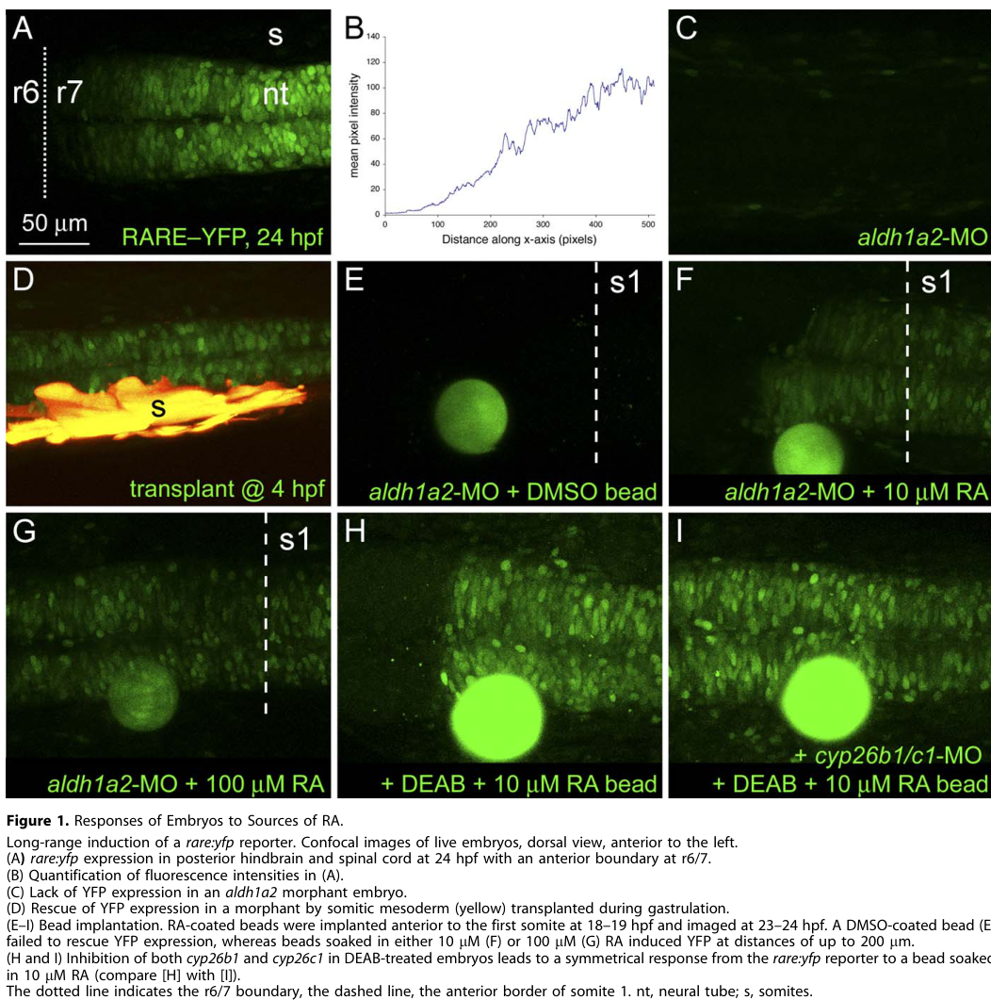

## Question

# Gene Research for Functional Annotation

## ⚠️ CRITICAL: Gene/Protein Identification Context

**BEFORE YOU BEGIN RESEARCH:** You MUST verify you are researching the CORRECT gene/protein. Gene symbols can be ambiguous, especially for less well-characterized genes from non-model organisms.

### Target Gene/Protein Identity (from UniProt):
- **UniProt Accession:** P79739
- **Protein Description:** RecName: Full=Cytochrome P450 26A1; EC=1.14.13.- {ECO:0000269|PubMed:8939936}; AltName: Full=Cytochrome P450RAI; AltName: Full=Retinoic acid 4-hydroxylase {ECO:0000303|PubMed:8939936}; AltName: Full=Retinoic acid-metabolizing cytochrome;
- **Gene Information:** Name=cyp26a1; Synonyms=cyp26;
- **Organism (full):** Danio rerio (Zebrafish) (Brachydanio rerio).
- **Protein Family:** Belongs to the cytochrome P450 family. .
- **Key Domains:** Cyt_P450. (IPR001128); Cyt_P450_CS. (IPR017972); Cyt_P450_E_grp-I. (IPR002401); Cyt_P450_sf. (IPR036396); p450 (PF00067)

### MANDATORY VERIFICATION STEPS:

1. **Check if the gene symbol "cyp26a1" matches the protein description above**
2. **Verify the organism is correct:** Danio rerio (Zebrafish) (Brachydanio rerio).
3. **Check if protein family/domains align with what you find in literature**
4. **If you find literature for a DIFFERENT gene with the same or similar symbol, STOP**

### If Gene Symbol is Ambiguous or You Cannot Find Relevant Literature:

**DO NOT PROCEED WITH RESEARCH ON A DIFFERENT GENE.** Instead:
- State clearly: "The gene symbol 'cyp26a1' is ambiguous or literature is limited for this specific protein"
- Explain what you found (e.g., "Found extensive literature on a different gene with the same symbol in a different organism")
- Describe the protein based ONLY on the UniProt information provided above
- Suggest that the protein function can be inferred from domain/family information

### Research Target:

Please provide a comprehensive research report on the gene **cyp26a1** (gene ID: cyp26a1, UniProt: P79739) in DANRE.

The research report should be a detailed narrative explaining the function, biological processes, and localization of the gene product. Citations should be given for all claims.

You should prioritize authoritative reviews and primary scientific literature when conducting research. You can supplement
this with annotations you find in gene/protein databases, but these can be outdated or inaccurate.

We are specifically interested in the primary function of the gene - for enzymes, what reaction is catalyzed, and what is the substrate specificity? For transporters, what is the substrate? For structural proteins or adapters, what is the broader structural role? For signaling molecules, what is the role in the pathway.

We are interested in where in or outside the cell the gene product carries out its function.

We are also interested in the signaling or biochemical pathways in which the gene functions. We are less interested in broad pleiotropic effects, except where these elucidate the precise role.

Include evidence where possible. We are interested in both experimental evidence as well as inference from structure, evolution, or bioinformatic analysis. Precise studies should be prioritized over high-throughput, where available.

## Output

Question: You are an expert researcher providing comprehensive, well-cited information.

Provide detailed information focusing on:
1. Key concepts and definitions with current understanding
2. Recent developments and latest research (prioritize 2023-2024 sources)
3. Current applications and real-world implementations
4. Expert opinions and analysis from authoritative sources
5. Relevant statistics and data from recent studies

Format as a comprehensive research report with proper citations. Include URLs and publication dates where available.
Always prioritize recent, authoritative sources and provide specific citations for all major claims.

# Gene Research for Functional Annotation

## ⚠️ CRITICAL: Gene/Protein Identification Context

**BEFORE YOU BEGIN RESEARCH:** You MUST verify you are researching the CORRECT gene/protein. Gene symbols can be ambiguous, especially for less well-characterized genes from non-model organisms.

### Target Gene/Protein Identity (from UniProt):
- **UniProt Accession:** P79739
- **Protein Description:** RecName: Full=Cytochrome P450 26A1; EC=1.14.13.- {ECO:0000269|PubMed:8939936}; AltName: Full=Cytochrome P450RAI; AltName: Full=Retinoic acid 4-hydroxylase {ECO:0000303|PubMed:8939936}; AltName: Full=Retinoic acid-metabolizing cytochrome;
- **Gene Information:** Name=cyp26a1; Synonyms=cyp26;
- **Organism (full):** Danio rerio (Zebrafish) (Brachydanio rerio).
- **Protein Family:** Belongs to the cytochrome P450 family. .
- **Key Domains:** Cyt_P450. (IPR001128); Cyt_P450_CS. (IPR017972); Cyt_P450_E_grp-I. (IPR002401); Cyt_P450_sf. (IPR036396); p450 (PF00067)

### MANDATORY VERIFICATION STEPS:

1. **Check if the gene symbol "cyp26a1" matches the protein description above**
2. **Verify the organism is correct:** Danio rerio (Zebrafish) (Brachydanio rerio).
3. **Check if protein family/domains align with what you find in literature**
4. **If you find literature for a DIFFERENT gene with the same or similar symbol, STOP**

### If Gene Symbol is Ambiguous or You Cannot Find Relevant Literature:

**DO NOT PROCEED WITH RESEARCH ON A DIFFERENT GENE.** Instead:
- State clearly: "The gene symbol 'cyp26a1' is ambiguous or literature is limited for this specific protein"
- Explain what you found (e.g., "Found extensive literature on a different gene with the same symbol in a different organism")
- Describe the protein based ONLY on the UniProt information provided above
- Suggest that the protein function can be inferred from domain/family information

### Research Target:

Please provide a comprehensive research report on the gene **cyp26a1** (gene ID: cyp26a1, UniProt: P79739) in DANRE.

The research report should be a detailed narrative explaining the function, biological processes, and localization of the gene product. Citations should be given for all claims.

You should prioritize authoritative reviews and primary scientific literature when conducting research. You can supplement
this with annotations you find in gene/protein databases, but these can be outdated or inaccurate.

We are specifically interested in the primary function of the gene - for enzymes, what reaction is catalyzed, and what is the substrate specificity? For transporters, what is the substrate? For structural proteins or adapters, what is the broader structural role? For signaling molecules, what is the role in the pathway.

We are interested in where in or outside the cell the gene product carries out its function.

We are also interested in the signaling or biochemical pathways in which the gene functions. We are less interested in broad pleiotropic effects, except where these elucidate the precise role.

Include evidence where possible. We are interested in both experimental evidence as well as inference from structure, evolution, or bioinformatic analysis. Precise studies should be prioritized over high-throughput, where available.

# Research report: Danio rerio **cyp26a1** (UniProt **P79739**) — functional annotation

## Scope and identity verification (critical)
The UniProt target (P79739) is annotated as **Cytochrome P450 26A1 (Cyp26a1)** from **Danio rerio (zebrafish)**, also described as **P450RAI / retinoic acid 4-hydroxylase**. Primary zebrafish developmental biology literature consistently uses **cyp26a1** to denote the **major retinoic acid (RA)–degrading cytochrome P450 during gastrulation** and hindbrain patterning (white2007complexregulationof pages 1-2, hernandez2007cyp26enzymesgenerate pages 1-2). Biochemical assays using zebrafish cyp26a1 expressed in cells show metabolism of **all-trans retinoic acid** to **4-hydroxy-RA and 4-oxo-RA**, matching the expected CYP26A1 reaction chemistry (gu2006anovelcytochrome pages 5-7, gu2006anovelcytochrome pages 3-5). These converge with authoritative reviews describing CYP26A1 as an RA-hydroxylating/clearing enzyme (thatcher2009theroleof pages 5-7, thatcher2009theroleof pages 2-4). 

## 1) Key concepts and definitions (current understanding)

### Retinoic acid (RA) signaling and “RA gradients”
RA (typically **all-trans retinoic acid, atRA**) is a lipophilic signaling molecule that controls transcription through retinoid receptors; in embryos, RA acts as a **dose-dependent positional cue** (a morphogen-like signal). A core concept is **RA homeostasis**: spatially and temporally patterned RA availability arises from the balance of **RA synthesis** (e.g., ALDH1A2/RALDH2) and **RA catabolism** by CYP26 enzymes, producing territories of high vs low RA signaling (hernandez2007cyp26enzymesgenerate pages 1-2, roberts2020regulatingretinoicacid pages 5-7). 

In zebrafish hindbrain development, experimental evidence supports that RA can convey **graded positional information over long distances**, and that **regulated degradation by Cyp26a1** is a key mechanism establishing a robust RA distribution across the hindbrain field (white2007complexregulationof pages 1-2). A complementary “gradient-free” framing is that **dynamic expression of RA-degrading enzymes** sculpts nested domains of RA responsiveness, even when RA is externally provided uniformly (hernandez2007cyp26enzymesgenerate pages 1-2).

### CYP26 enzymes
The CYP26 subfamily (including **CYP26A1**) are specialized **retinoic-acid hydroxylases/oxidases**. They convert RA into **more polar, generally less active metabolites**, supporting clearance and preventing ectopic signaling (roberts2020regulatingretinoicacid pages 5-7, thatcher2009theroleof pages 5-7). A key systems-level concept is that CYP26 expression can create **“RA sinks”** that buffer fluctuations in RA synthesis and protect sensitive tissues (roberts2020regulatingretinoicacid pages 5-7, white2007complexregulationof pages 1-2).

## 2) Molecular function (reaction, substrates, specificity) and biochemical mechanism

### Catalyzed reaction and products
Zebrafish Cyp26a1 catalyzes oxidative metabolism of atRA, generating metabolites dominated by **4-hydroxy-RA (4-OH-RA)** and **4-oxo-RA (4-oxo-RA)** in microsome assays from transfected cells (gu2006anovelcytochrome pages 5-7, gu2006anovelcytochrome pages 3-5). Reviews of CYP26A1 metabolism emphasize **4-hydroxylation as the primary transformation** for CYP26A1 (and CYP26B1), with additional products such as **18-hydroxy-RA** and more polar secondary metabolites (thatcher2009theroleof pages 5-7). A broader metabolite spectrum for CYP26 enzymes includes **4-OH-RA, 4-oxo-RA, 18-OH-RA, 5,8-epoxy-RA**, and dihydroxy/oxo-hydroxy derivatives, followed by further processing (e.g., glucuronidation) and elimination (roberts2020regulatingretinoicacid pages 7-10).

### Substrate specificity
Cell/microsome assays of zebrafish CYP26 family members show activity toward **RA isomers** (atRA, 9-cis RA, 13-cis RA) and **no detectable metabolism of retinol or retinal** under the tested conditions, supporting specialization for RA (gu2006anovelcytochrome pages 1-2, gu2006anovelcytochrome pages 3-5).

### Cofactors and catalytic requirements (current expert understanding)
CYP26 enzymes are described as **membrane-anchored microsomal (endoplasmic reticulum, ER) cytochrome P450s** with a heme center and class II P450 electron-transfer architecture: each catalytic cycle requires electrons supplied from **NADPH via cytochrome P450 oxidoreductase (POR)**, which uses **FAD and FMN** cofactors (roberts2020regulatingretinoicacid pages 7-10, roberts2020regulatingretinoicacid pages 5-7). Zebrafish Cyp26 proteins contain conserved P450 domains including an **anchor domain**, oxygen-binding and heme-binding motifs, consistent with ER/microsomal P450 enzymes (gu2006anovelcytochrome pages 5-7, gu2006anovelcytochrome pages 1-2).

### Quantitative enzymology (from authoritative synthesis)
A review summarizing CYP26 biochemical studies reports **high catalytic activity** for atRA, including **Km < 100 nM** (in COS-1 transfected cell systems) and **turnover ~1–10 pmol/min/pmol**, emphasizing that CYP26 enzymes are highly efficient RA-clearing enzymes relative to other RA-hydroxylating CYPs (roberts2020regulatingretinoicacid pages 7-10). (These values are not zebrafish-specific measurements in the extracted text, but are presented as general CYP26 properties.)

## 3) Subcellular localization and where the protein acts
Cyp26a1 is best supported as a **microsomal/ER membrane-anchored cytochrome P450**, i.e., positioned to access intracellular RA pools and regulate RA available for nuclear receptor signaling (roberts2020regulatingretinoicacid pages 7-10, roberts2020regulatingretinoicacid pages 5-7). Experimental enzymology for zebrafish cyp26a1 was performed using **microsomes isolated from transfected cells**, which is consistent with ER-derived membrane localization (gu2006anovelcytochrome pages 5-7, gu2006anovelcytochrome pages 3-5).

## 4) Biological roles and pathways in zebrafish (evidence-based)

### A. Hindbrain and anterior–posterior (A–P) patterning during gastrulation
White et al. (2007; published Nov 2007; https://doi.org/10.1371/journal.pbio.0050304) provide evidence that RA provides **graded positional information** and that **cyp26a1 expression/regulation** contributes to a **robust RA gradient** across the hindbrain field (white2007complexregulationof pages 1-2). They further show that **cyp26a1 is under complex feedback and feedforward control by RA and Fgf signaling**, which can confer robustness to changes in RA synthesis and embryo size (white2007complexregulationof pages 1-2). 

Hernandez et al. (2007; published Jan 2007; https://doi.org/10.1242/dev.02706) demonstrate that zebrafish orthologs of mammalian CYP26 genes (**cyp26a1, cyp26b1, cyp26c1**) act **redundantly** to shape the RA response pattern necessary for hindbrain development. When these RA-degrading enzymes are depleted, **RA-responsive gene expression expands across the hindbrain**, and dynamic CYP26 expression becomes essential for exogenous RA to rescue RA-depleted embryos (hernandez2007cyp26enzymesgenerate pages 1-2).

### B. Spatial expression territories that restrict RA signaling
In zebrafish, cyp26a1 is expressed early in presumptive anterior neural ectoderm, and later in forebrain, midbrain, anterior hindbrain, and tailbud territories, contributing to establishment of anterior RA-depleted domains opposing posterior RA synthesis and shaping the rostrocaudal RA signaling landscape (drummond2013theroleof pages 1-3). This spatial arrangement is a recurring motif in hindbrain patterning: posterior RA production (aldh1a2/raldh2) vs anterior degradation (cyp26a1) (drummond2013theroleof pages 1-3).

### C. Developmental phenotypes as functional readouts
Zebrafish functional perturbation evidence includes cyp26a1 overexpression experiments: microinjection of cyp26a1 mRNA reduces endogenous RA activity and yields phenotypes resembling reduced-RA conditions, consistent with a role in RA clearance (gu2006anovelcytochrome pages 3-5). Microsome assays and developmental perturbations together support that zebrafish cyp26a1 functionally restricts RA signaling to appropriate domains (gu2006anovelcytochrome pages 5-7, gu2006anovelcytochrome pages 3-5).

## 5) Recent developments and latest research (prioritizing 2024 zebrafish sources)
Direct 2023–2024 zebrafish primary literature focusing specifically on cyp26a1 mechanistic biology was limited in the retrieved corpus; however, 2024 studies demonstrate **ongoing real-world use** of cyp26a1 as a pathway marker and node in RA-linked phenotyping.

### 5.1 Developmental toxicology at environmentally relevant exposures (Schmandt et al., 2024)
Schmandt et al. (Toxics; **published 16 May 2024**; https://doi.org/10.3390/toxics12050368) used zebrafish to test **nM** triphenyl phosphate (TPhP) developmental exposure and included qPCR of **cyp26a1** and **raldh2** as markers of RA metabolism/signaling involvement. They chronically exposed embryos from ~4 hpf to 5 dpf at **0.5, 1, and 5 µg/L** (≈ **1.5–15 nM**) (schmandt2024environmentallyrelevantconcentrations pages 2-4). At **5 µg/L**, mean larval length was significantly reduced by **0.14 mm** (**3.29 vs 3.14 mm**, p = **0.00012**) (schmandt2024environmentallyrelevantconcentrations pages 6-9). Importantly for functional annotation practice, they report **no significant effect** on RNA levels of the RA marker genes (in their text: cyp6a1 and raldh2; with raldh2 described as involved in RA production and inactivation respectively), supporting their conclusion that the observed cardiotoxicity at nM doses did not act primarily via RXR/RA signaling (schmandt2024environmentallyrelevantconcentrations pages 6-9). This study exemplifies how cyp26a1 (and allied RA-pathway genes) are deployed to discriminate mechanisms in toxicology screens.

### 5.2 Metabolic/liver developmental model implicating RA metabolism (Zeng et al., 2024)
Zeng et al. (Frontiers in Cell and Developmental Biology; **published 18 April 2024**; https://doi.org/10.3389/fcell.2024.1381362) generated **CRISPR/Cas9 cobll1a knockout zebrafish** and integrated RNA-seq, WISH, and qRT-PCR. They report that cobll1a−/− embryos exhibit impaired digestive organ development at 4 dpf and transcriptomic changes implicating disrupted RA signaling and lipid metabolism (zeng2024zebrafishcobll1aregulates pages 1-2). Within RA metabolism genes, they report **down-regulation of RA synthesis-related genes** (rdh10, aldh1a2) and **up-regulation of the RA catabolism gene cyp26a1**, alongside downregulation of multiple RAR genes (p < 0.05 for these RA-related comparisons as described) (zeng2024zebrafishcobll1aregulates pages 9-10). WISH localized expression of rdh10/aldh1a2/cyp26a1/rbp4 to intestine or liver-associated expression territories in their assay context (zeng2024zebrafishcobll1aregulates pages 9-10). Functionally, this positions cyp26a1 as an interpretable readout and potential effector within RA-linked liver/lipid homeostasis models.

## 6) Current applications and real-world implementations

1. **Mechanistic developmental toxicology**: cyp26a1 is used as a transcript marker of RA catabolism in zebrafish assays designed to test whether chemical exposures act through RA/RXR signaling vs alternative developmental pathways (e.g., tbx5a cascade), including at environmentally relevant dose ranges (schmandt2024environmentallyrelevantconcentrations pages 2-4, schmandt2024environmentallyrelevantconcentrations pages 6-9).

2. **Disease-relevant metabolic modeling**: CRISPR zebrafish genetic models that phenocopy aspects of liver dysfunction and lipid dysregulation can incorporate cyp26a1 as an RA-catabolism node/biomarker to connect transcriptional changes to RA homeostasis hypotheses (zeng2024zebrafishcobll1aregulates pages 1-2, zeng2024zebrafishcobll1aregulates pages 9-10).

3. **Quantitative developmental systems biology**: cyp26a1 regulation is central in computational–experimental models of how embryos generate **robust morphogen distributions**—a template for modern developmental systems approaches to buffering and scaling (white2007complexregulationof pages 1-2).

## 7) Expert opinions and analysis (authoritative synthesis)

### CYP26 enzymes as homeostatic “buffer” and tissue-protection system
Roberts (2020; Journal of Developmental Biology; **published Mar 2020**; https://doi.org/10.3390/jdb8010006) frames CYP26 enzymes as essential regulators of RA availability, required to generate RA gradients and to protect tissues from inappropriate RA signaling, integrating structure/biochemistry and developmental roles (roberts2020regulatingretinoicacid pages 5-7, roberts2020regulatingretinoicacid pages 7-10). This review also emphasizes mechanistic enzymology (ER/microsomal localization, POR/NADPH electron transfer) that underpins how CYP26 enzymes implement homeostatic control (roberts2020regulatingretinoicacid pages 7-10).

### CYP26A1 as a dominant RA clearance route and pharmacology-relevant enzyme family
Thatcher & Isoherranen (2009; Expert Opinion on Drug Metabolism & Toxicology; **published Jul 2009**; https://doi.org/10.1517/17425250903032681) emphasize the centrality of CYP26-mediated clearance in RA biology and detail the metabolite profile and 4-hydroxylation primacy, supporting the view of CYP26A1 as a key determinant of tissue RA exposure (thatcher2009theroleof pages 5-7). They also document historical discovery of zebrafish P450RAI as CYP26A1 in the context of RA-responsive programs such as fin regeneration (thatcher2009theroleof pages 2-4).

## 8) Relevant figures (image evidence)
Figures retrieved from White et al. (2007) include cyp26a1 expression and RA-patterning/gradient modeling schematics and data panels that visually summarize the RA response landscape and conceptual model of RA–Fgf–cyp26a1 interactions (white2007complexregulationof media 35639faa, white2007complexregulationof media 9940ff21, white2007complexregulationof media 66fdd7c8, white2007complexregulationof media 3e7a30e7).

## Summary table (functional annotation at a glance)
| Function/Reaction | Substrates & products | Subcellular localization | Developmental roles/processes in zebrafish | Regulation/feedback | Recent applications (2024 studies) | Key evidence sources with DOI/URL and year |
|---|---|---|---|---|---|---|
| Retinoic-acid catabolic cytochrome P450; major RA-degrading enzyme during gastrulation that helps generate a robust hindbrain RA gradient (white2007complexregulationof pages 1-2, hernandez2007cyp26enzymesgenerate pages 1-2) | Oxidizes all-trans RA to more polar metabolites; family products include 4-OH-RA, 4-oxo-RA, 18-OH-RA and other oxidized derivatives (gu2006anovelcytochrome pages 1-2, roberts2020regulatingretinoicacid pages 7-10, thatcher2009theroleof pages 5-7) | Membrane-anchored microsomal/ER cytochrome P450; heme-containing class II P450 inferred for zebrafish Cyp26a1 (roberts2020regulatingretinoicacid pages 7-10, roberts2020regulatingretinoicacid pages 5-7, thatcher2009theroleof pages 2-4) | Establishes anterior RA-poor territory and posterior-to-anterior RA patterning; required for hindbrain AP patterning, rhombomere identity, and protection from excess RA; loss expands posterior hindbrain fates anteriorly (white2007complexregulationof pages 1-2, drummond2013theroleof pages 1-3, hernandez2007cyp26enzymesgenerate pages 1-2) | Under complex feedback/feedforward control by RA and Fgf signaling; RA can induce cyp26a1 expression, creating adaptive buffering/homeostasis of RA availability (white2007complexregulationof pages 1-2, roberts2020regulatingretinoicacid pages 5-7) | Used conceptually as a readout of RA-pathway perturbation in zebrafish developmental studies and toxicology assays (schmandt2024environmentallyrelevantconcentrations pages 1-2, schmandt2024environmentallyrelevantconcentrations pages 6-9, zeng2024zebrafishcobll1aregulates pages 1-2) | White 2007, PLoS Biol, doi:10.1371/journal.pbio.0050304, https://doi.org/10.1371/journal.pbio.0050304; Hernandez 2007, Development, doi:10.1242/dev.02706, https://doi.org/10.1242/dev.02706 |
| Enzymatic reaction detail: RA 4-hydroxylase/oxidase activity demonstrated in zebrafish microsomal assays (gu2006anovelcytochrome pages 3-5, gu2006anovelcytochrome pages 5-7) | Zebrafish Cyp26A1 microsomes mainly generate 4-OH-RA and 4-oxo-RA from all-trans RA; related CYP26 enzymes can also metabolize 9-cis RA and 13-cis RA, but not retinol/retinal in the cited assay system (gu2006anovelcytochrome pages 1-2, gu2006anovelcytochrome pages 5-7, gu2006anovelcytochrome pages 3-5) | Activity assayed in microsomes from transfected cells, consistent with ER-derived membrane localization (gu2006anovelcytochrome pages 5-7, gu2006anovelcytochrome pages 3-5) | Restricts inappropriate RA signaling during somitogenesis and axial patterning; cyp26a1 overexpression reduces endogenous RA activity and alters hindbrain-somite patterning/asymmetric somites (gu2006anovelcytochrome pages 3-5, gu2006anovelcytochrome pages 5-7) | RA inducibility supports negative-feedback RA clearance; CYP26 enzymes act as RA sinks to sharpen signaling boundaries (thatcher2009theroleof pages 2-4, roberts2020regulatingretinoicacid pages 5-7) | Supports use of cyp26a1 as a mechanistic biomarker for compounds or mutations that disturb RA metabolism/signaling (thatcher2009theroleof pages 2-4, zeng2024zebrafishcobll1aregulates pages 1-2) | Gu 2006, Mol Endocrinol, doi:10.1210/me.2005-0362, https://doi.org/10.1210/me.2005-0362; Thatcher & Isoherranen 2009, Expert Opin Drug Metab Toxicol, doi:10.1517/17425250903032681, https://doi.org/10.1517/17425250903032681 |
| Spatially restricted embryonic RA-clearance factor in anterior neural ectoderm/hindbrain field (drummond2013theroleof pages 1-3, hernandez2007cyp26enzymesgenerate pages 1-2) | Functional effect is depletion of local RA available for receptor signaling rather than transport of another substrate (drummond2013theroleof pages 1-3, roberts2020regulatingretinoicacid pages 5-7) | Expressed in presumptive anterior neural ectoderm, then forebrain, midbrain, anterior hindbrain, and tailbud during early development (gene-expression territory rather than protein compartment) (drummond2013theroleof pages 1-3) | Creates RA-depleted anterior domains opposing posterior aldh1a2/raldh2 synthesis; essential for proper hindbrain segmentation and regional identity (drummond2013theroleof pages 1-3, hernandez2007cyp26enzymesgenerate pages 1-2) | Integrated with transcriptional regulators such as zic factors that influence embryonic RA signaling territories (drummond2013theroleof pages 1-3) | Provides a developmental pathway node for dissecting hindbrain patterning and cranial motor-neuron specification mechanisms (drummond2013theroleof pages 1-3) | Drummond 2013, BMC Dev Biol, doi:10.1186/1471-213X-13-31, https://doi.org/10.1186/1471-213X-13-31 |
| General CYP26 biochemistry/current understanding: high-efficiency RA clearance enzyme family controlling RA homeostasis (roberts2020regulatingretinoicacid pages 5-7, roberts2020regulatingretinoicacid pages 7-10) | High catalytic activity toward all-trans RA; review cites Km < 100 nM and turnover ~1–10 pmol/min/pmol in transfected-cell systems for CYP26 enzymes; metabolites subsequently glucuronidated and eliminated (roberts2020regulatingretinoicacid pages 7-10) | ER/microsomal enzyme requiring POR-mediated electron transfer from NADPH via FAD and FMN; contains heme-binding domain (roberts2020regulatingretinoicacid pages 7-10, thatcher2009theroleof pages 2-4) | Protects RA-sensitive tissues and helps establish local RA gradients across multiple developmental contexts; zebrafish hindbrain is a canonical example (roberts2020regulatingretinoicacid pages 5-7, white2007complexregulationof pages 1-2) | Negative feedback is a central systems-level property of CYP26-mediated RA homeostasis (roberts2020regulatingretinoicacid pages 5-7, roberts2020regulatingretinoicacid pages 7-10) | Basis for pharmacologic CYP26 inhibition/modulation concepts and for interpreting RA-pathway toxicity in zebrafish and other vertebrates (thatcher2009theroleof pages 2-4, roberts2020regulatingretinoicacid pages 7-10) | Roberts 2020, J Dev Biol, doi:10.3390/jdb8010006, https://doi.org/10.3390/jdb8010006; Thatcher & Isoherranen 2009, doi:10.1517/17425250903032681, https://doi.org/10.1517/17425250903032681 |
| 2024 zebrafish toxicology application: cyp26a1 measured as an RA-pathway marker during environmentally relevant TPhP exposure (schmandt2024environmentallyrelevantconcentrations pages 1-2, schmandt2024environmentallyrelevantconcentrations pages 6-9, schmandt2024environmentallyrelevantconcentrations pages 2-4) | Not a direct substrate study; cyp26a1 transcript assessed alongside raldh2 to test whether TPhP acts through RA/RXR signaling (schmandt2024environmentallyrelevantconcentrations pages 6-9) | Whole-larva qPCR readout at 5 dpf; localization not the focus (schmandt2024environmentallyrelevantconcentrations pages 2-4) | In this assay, no significant change in cyp26a1/raldh2 at 5 µg/L TPhP suggested the nM TPhP phenotype was not mediated by RXR/RA signaling; affected larvae were shorter and showed pericardial edema (0.14 mm decrease at 5 µg/L; 3.29 vs 3.14 mm; p=0.00012) (schmandt2024environmentallyrelevantconcentrations pages 6-9) | Demonstrates utility of cyp26a1 as a pathway-discrimination marker distinguishing RA/RXR effects from tbx5a-associated cardiotoxicity (schmandt2024environmentallyrelevantconcentrations pages 6-9) | Real-world implementation in developmental toxicology screening at environmentally relevant concentrations 0.5–5 µg/L (1.5–15 nM) (schmandt2024environmentallyrelevantconcentrations pages 1-2, schmandt2024environmentallyrelevantconcentrations pages 2-4) | Schmandt 2024, Toxics, doi:10.3390/toxics12050368, https://doi.org/10.3390/toxics12050368 |
| 2024 zebrafish disease/metabolism application: cyp26a1 upregulation marks disrupted RA metabolism in cobll1a mutants (zeng2024zebrafishcobll1aregulates pages 9-10, zeng2024zebrafishcobll1aregulates pages 1-2) | Not a direct enzymology study; cyp26a1 used as the RA-catabolism gene indicator within altered retinol/RA metabolic networks (zeng2024zebrafishcobll1aregulates pages 9-10) | WISH detected expression of rdh10, aldh1a2, cyp26a1 and rbp4 in intestine or liver-associated territories in the study context (zeng2024zebrafishcobll1aregulates pages 9-10) | cobll1a−/− embryos showed impaired digestive-organ development at 4 dpf, altered RA-pathway gene expression, increased lipid synthesis and reduced lipid catabolism; cyp26a1 was upregulated while aldh1a2/rdh10 and RAR genes were downregulated (zeng2024zebrafishcobll1aregulates pages 9-10, zeng2024zebrafishcobll1aregulates pages 1-2) | Shows cyp26a1 participates in broader RA-lipid homeostasis networks; RA catabolism shifts accompany hepatic/lipid phenotypes (zeng2024zebrafishcobll1aregulates pages 9-10) | Application in metabolic disease modeling/NAFLD-related liver biology using CRISPR zebrafish mutants; lipid-pathway genes changed significantly (p < 0.01 for listed lipid-anabolism genes) (zeng2024zebrafishcobll1aregulates pages 1-2, zeng2024zebrafishcobll1aregulates pages 9-10) | Zeng 2024, Front Cell Dev Biol, doi:10.3389/fcell.2024.1381362, https://doi.org/10.3389/fcell.2024.1381362 |

*Table: This table summarizes the verified function, reaction chemistry, localization, developmental roles, regulation, and 2024 zebrafish applications of Danio rerio cyp26a1 (UniProt P79739). It is useful as a compact evidence-based functional annotation reference anchored to the cited source contexts.*

## Key takeaways for functional annotation of zebrafish cyp26a1 (P79739)
- **Primary molecular function**: ER/microsomal cytochrome P450 enzyme that **hydroxylates/oxidizes retinoic acid**, producing **4-OH-RA and 4-oxo-RA** (major products), thereby reducing RA signaling capacity (gu2006anovelcytochrome pages 5-7, thatcher2009theroleof pages 5-7).
- **Primary pathway role**: a core component of **RA homeostasis** that sculpts spatial RA signaling territories in early embryos and is necessary for correct hindbrain patterning and RA responsiveness (white2007complexregulationof pages 1-2, hernandez2007cyp26enzymesgenerate pages 1-2).
- **Where it acts**: consistent with a **membrane-anchored ER/microsomal** P450 requiring POR/NADPH electron transfer (roberts2020regulatingretinoicacid pages 7-10, roberts2020regulatingretinoicacid pages 5-7).
- **How it is used today (2024)**: widely implemented as a **pathway marker/readout** in zebrafish toxicology and developmental/metabolic genetics to test or interpret RA pathway perturbation (schmandt2024environmentallyrelevantconcentrations pages 6-9, zeng2024zebrafishcobll1aregulates pages 9-10).

## URLs and publication dates (most relevant)
- White RJ et al. “Complex Regulation of cyp26a1 Creates a Robust Retinoic Acid Gradient in the Zebrafish Embryo.” *PLoS Biology* (Nov 2007). https://doi.org/10.1371/journal.pbio.0050304 (white2007complexregulationof pages 1-2)
- Hernandez RE et al. “Cyp26 enzymes generate the retinoic acid response pattern necessary for hindbrain development.” *Development* (Jan 2007). https://doi.org/10.1242/dev.02706 (hernandez2007cyp26enzymesgenerate pages 1-2)
- Drummond DL et al. “The role of Zic transcription factors in regulating hindbrain retinoic acid signaling.” *BMC Developmental Biology* (Aug 2013). https://doi.org/10.1186/1471-213X-13-31 (drummond2013theroleof pages 1-3)
- Gu X et al. “A novel cytochrome P450, zebrafish Cyp26D1, is involved in metabolism of all-trans retinoic acid.” *Molecular Endocrinology* (Jul 2006). https://doi.org/10.1210/me.2005-0362 (gu2006anovelcytochrome pages 5-7)
- Roberts C. “Regulating Retinoic Acid Availability during Development and Regeneration: The Role of the CYP26 Enzymes.” *Journal of Developmental Biology* (Mar 2020). https://doi.org/10.3390/jdb8010006 (roberts2020regulatingretinoicacid pages 7-10)
- Thatcher JE, Isoherranen N. “The role of CYP26 enzymes in retinoic acid clearance.” *Expert Opinion on Drug Metabolism & Toxicology* (Jul 2009). https://doi.org/10.1517/17425250903032681 (thatcher2009theroleof pages 5-7)
- Schmandt B et al. “Environmentally Relevant Concentrations of Triphenyl Phosphate (TPhP) Impact Development in Zebrafish.” *Toxics* (Published 16 May 2024; received 20 Apr 2024; accepted 13 May 2024). https://doi.org/10.3390/toxics12050368 (schmandt2024environmentallyrelevantconcentrations pages 2-4)
- Zeng T et al. “Zebrafish cobll1a regulates lipid homeostasis via the RA signaling pathway.” *Frontiers in Cell and Developmental Biology* (Published 18 Apr 2024; received 3 Feb 2024; accepted 4 Apr 2024). https://doi.org/10.3389/fcell.2024.1381362 (zeng2024zebrafishcobll1aregulates pages 1-2)

References

1. (white2007complexregulationof pages 1-2): Richard J White, Qing Nie, Arthur D Lander, and Thomas F Schilling. Complex regulation of cyp26a1 creates a robust retinoic acid gradient in the zebrafish embryo. PLoS Biology, 5:e304, Nov 2007. URL: https://doi.org/10.1371/journal.pbio.0050304, doi:10.1371/journal.pbio.0050304. This article has 274 citations and is from a highest quality peer-reviewed journal.

2. (hernandez2007cyp26enzymesgenerate pages 1-2): Rafael E. Hernandez, Aaron P. Putzke, Jonathan P. Myers, Lilyana Margaretha, and Cecilia B. Moens. Cyp26 enzymes generate the retinoic acid response pattern necessary for hindbrain development. Development, 134:177-187, Jan 2007. URL: https://doi.org/10.1242/dev.02706, doi:10.1242/dev.02706. This article has 270 citations and is from a domain leading peer-reviewed journal.

3. (gu2006anovelcytochrome pages 5-7): Xingxing Gu, Fang Xu, Wei Song, Xiaolin Wang, Ping Hu, Yumin Yang, Xiang Gao, and Qingshun Zhao. A novel cytochrome p450, zebrafish cyp26d1, is involved in metabolism of all-trans retinoic acid. Molecular endocrinology, 20 7:1661-72, Jul 2006. URL: https://doi.org/10.1210/me.2005-0362, doi:10.1210/me.2005-0362. This article has 29 citations.

4. (gu2006anovelcytochrome pages 3-5): Xingxing Gu, Fang Xu, Wei Song, Xiaolin Wang, Ping Hu, Yumin Yang, Xiang Gao, and Qingshun Zhao. A novel cytochrome p450, zebrafish cyp26d1, is involved in metabolism of all-trans retinoic acid. Molecular endocrinology, 20 7:1661-72, Jul 2006. URL: https://doi.org/10.1210/me.2005-0362, doi:10.1210/me.2005-0362. This article has 29 citations.

5. (thatcher2009theroleof pages 5-7): Jayne E Thatcher and Nina Isoherranen. The role of cyp26 enzymes in retinoic acid clearance. Expert Opinion on Drug Metabolism & Toxicology, 5:875-886, Jul 2009. URL: https://doi.org/10.1517/17425250903032681, doi:10.1517/17425250903032681. This article has 268 citations and is from a peer-reviewed journal.

6. (thatcher2009theroleof pages 2-4): Jayne E Thatcher and Nina Isoherranen. The role of cyp26 enzymes in retinoic acid clearance. Expert Opinion on Drug Metabolism & Toxicology, 5:875-886, Jul 2009. URL: https://doi.org/10.1517/17425250903032681, doi:10.1517/17425250903032681. This article has 268 citations and is from a peer-reviewed journal.

7. (roberts2020regulatingretinoicacid pages 5-7): Catherine Roberts. Regulating retinoic acid availability during development and regeneration: the role of the cyp26 enzymes. Journal of Developmental Biology, 8:6, Mar 2020. URL: https://doi.org/10.3390/jdb8010006, doi:10.3390/jdb8010006. This article has 52 citations.

8. (roberts2020regulatingretinoicacid pages 7-10): Catherine Roberts. Regulating retinoic acid availability during development and regeneration: the role of the cyp26 enzymes. Journal of Developmental Biology, 8:6, Mar 2020. URL: https://doi.org/10.3390/jdb8010006, doi:10.3390/jdb8010006. This article has 52 citations.

9. (gu2006anovelcytochrome pages 1-2): Xingxing Gu, Fang Xu, Wei Song, Xiaolin Wang, Ping Hu, Yumin Yang, Xiang Gao, and Qingshun Zhao. A novel cytochrome p450, zebrafish cyp26d1, is involved in metabolism of all-trans retinoic acid. Molecular endocrinology, 20 7:1661-72, Jul 2006. URL: https://doi.org/10.1210/me.2005-0362, doi:10.1210/me.2005-0362. This article has 29 citations.

10. (drummond2013theroleof pages 1-3): Danna L Drummond, Caroline S Cheng, Lyndsay G Selland, Jennifer C Hocking, Lisa B Prichard, and Andrew J Waskiewicz. The role of zic transcription factors in regulating hindbrain retinoic acid signaling. BMC Developmental Biology, 13:31-31, Aug 2013. URL: https://doi.org/10.1186/1471-213x-13-31, doi:10.1186/1471-213x-13-31. This article has 27 citations and is from a peer-reviewed journal.

11. (schmandt2024environmentallyrelevantconcentrations pages 2-4): Benjamin Schmandt, Mfon Diduff, Gabrielle Smart, and Larissa M. Williams. Environmentally relevant concentrations of triphenyl phosphate (tphp) impact development in zebrafish. Toxics, 12:368, May 2024. URL: https://doi.org/10.3390/toxics12050368, doi:10.3390/toxics12050368. This article has 12 citations.

12. (schmandt2024environmentallyrelevantconcentrations pages 6-9): Benjamin Schmandt, Mfon Diduff, Gabrielle Smart, and Larissa M. Williams. Environmentally relevant concentrations of triphenyl phosphate (tphp) impact development in zebrafish. Toxics, 12:368, May 2024. URL: https://doi.org/10.3390/toxics12050368, doi:10.3390/toxics12050368. This article has 12 citations.

13. (zeng2024zebrafishcobll1aregulates pages 1-2): Ting Zeng, Jinrui Lv, Jiaxin Liang, Binling Xie, Ling Liu, Yuanyuan Tan, Junwei Zhu, Jifan Jiang, and Huaping Xie. Zebrafish cobll1a regulates lipid homeostasis via the ra signaling pathway. Frontiers in Cell and Developmental Biology, Apr 2024. URL: https://doi.org/10.3389/fcell.2024.1381362, doi:10.3389/fcell.2024.1381362. This article has 5 citations.

14. (zeng2024zebrafishcobll1aregulates pages 9-10): Ting Zeng, Jinrui Lv, Jiaxin Liang, Binling Xie, Ling Liu, Yuanyuan Tan, Junwei Zhu, Jifan Jiang, and Huaping Xie. Zebrafish cobll1a regulates lipid homeostasis via the ra signaling pathway. Frontiers in Cell and Developmental Biology, Apr 2024. URL: https://doi.org/10.3389/fcell.2024.1381362, doi:10.3389/fcell.2024.1381362. This article has 5 citations.

15. (white2007complexregulationof media 35639faa): Richard J White, Qing Nie, Arthur D Lander, and Thomas F Schilling. Complex regulation of cyp26a1 creates a robust retinoic acid gradient in the zebrafish embryo. PLoS Biology, 5:e304, Nov 2007. URL: https://doi.org/10.1371/journal.pbio.0050304, doi:10.1371/journal.pbio.0050304. This article has 274 citations and is from a highest quality peer-reviewed journal.

16. (white2007complexregulationof media 9940ff21): Richard J White, Qing Nie, Arthur D Lander, and Thomas F Schilling. Complex regulation of cyp26a1 creates a robust retinoic acid gradient in the zebrafish embryo. PLoS Biology, 5:e304, Nov 2007. URL: https://doi.org/10.1371/journal.pbio.0050304, doi:10.1371/journal.pbio.0050304. This article has 274 citations and is from a highest quality peer-reviewed journal.

17. (white2007complexregulationof media 66fdd7c8): Richard J White, Qing Nie, Arthur D Lander, and Thomas F Schilling. Complex regulation of cyp26a1 creates a robust retinoic acid gradient in the zebrafish embryo. PLoS Biology, 5:e304, Nov 2007. URL: https://doi.org/10.1371/journal.pbio.0050304, doi:10.1371/journal.pbio.0050304. This article has 274 citations and is from a highest quality peer-reviewed journal.

18. (white2007complexregulationof media 3e7a30e7): Richard J White, Qing Nie, Arthur D Lander, and Thomas F Schilling. Complex regulation of cyp26a1 creates a robust retinoic acid gradient in the zebrafish embryo. PLoS Biology, 5:e304, Nov 2007. URL: https://doi.org/10.1371/journal.pbio.0050304, doi:10.1371/journal.pbio.0050304. This article has 274 citations and is from a highest quality peer-reviewed journal.

19. (schmandt2024environmentallyrelevantconcentrations pages 1-2): Benjamin Schmandt, Mfon Diduff, Gabrielle Smart, and Larissa M. Williams. Environmentally relevant concentrations of triphenyl phosphate (tphp) impact development in zebrafish. Toxics, 12:368, May 2024. URL: https://doi.org/10.3390/toxics12050368, doi:10.3390/toxics12050368. This article has 12 citations.

## Artifacts

- [Edison artifact artifact-00](cyp26a1-deep-research-falcon_artifacts/artifact-00.md)

## Citations

1. white2007complexregulationof pages 1-2
2. thatcher2009theroleof pages 5-7
3. roberts2020regulatingretinoicacid pages 7-10
4. drummond2013theroleof pages 1-3
5. gu2006anovelcytochrome pages 3-5
6. schmandt2024environmentallyrelevantconcentrations pages 2-4
7. schmandt2024environmentallyrelevantconcentrations pages 6-9
8. thatcher2009theroleof pages 2-4
9. gu2006anovelcytochrome pages 5-7
10. roberts2020regulatingretinoicacid pages 5-7
11. gu2006anovelcytochrome pages 1-2
12. schmandt2024environmentallyrelevantconcentrations pages 1-2
13. https://doi.org/10.1371/journal.pbio.0050304
14. https://doi.org/10.1242/dev.02706
15. https://doi.org/10.3390/toxics12050368
16. https://doi.org/10.3389/fcell.2024.1381362
17. https://doi.org/10.3390/jdb8010006
18. https://doi.org/10.1517/17425250903032681
19. https://doi.org/10.1371/journal.pbio.0050304;
20. https://doi.org/10.1210/me.2005-0362;
21. https://doi.org/10.1186/1471-213X-13-31
22. https://doi.org/10.3390/jdb8010006;
23. https://doi.org/10.1210/me.2005-0362
24. https://doi.org/10.1371/journal.pbio.0050304,
25. https://doi.org/10.1242/dev.02706,
26. https://doi.org/10.1210/me.2005-0362,
27. https://doi.org/10.1517/17425250903032681,
28. https://doi.org/10.3390/jdb8010006,
29. https://doi.org/10.1186/1471-213x-13-31,
30. https://doi.org/10.3390/toxics12050368,
31. https://doi.org/10.3389/fcell.2024.1381362,