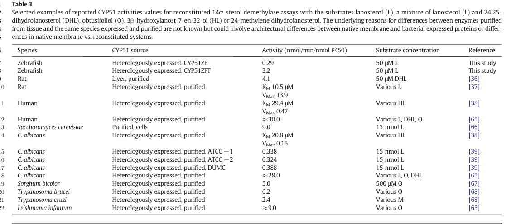

## Question

# Gene Research for Functional Annotation

## ⚠️ CRITICAL: Gene/Protein Identification Context

**BEFORE YOU BEGIN RESEARCH:** You MUST verify you are researching the CORRECT gene/protein. Gene symbols can be ambiguous, especially for less well-characterized genes from non-model organisms.

### Target Gene/Protein Identity (from UniProt):
- **UniProt Accession:** Q1JPY5
- **Protein Description:** RecName: Full=Lanosterol 14-alpha demethylase {ECO:0000305}; Short=LDM {ECO:0000305}; EC=1.14.14.154 {ECO:0000269|PubMed:24361620}; AltName: Full=Cytochrome P450 family member 51 {ECO:0000303|PubMed:24361620}; Short=CYP51 {ECO:0000303|PubMed:24361620}; AltName: Full=Sterol 14-alpha demethylase {ECO:0000303|PubMed:24361620};
- **Gene Information:** Name=cyp51 {ECO:0000303|PubMed:24361620, ECO:0000312|ZFIN:ZDB-GENE-040625-2};
- **Organism (full):** Danio rerio (Zebrafish) (Brachydanio rerio).
- **Protein Family:** Belongs to the cytochrome P450 family.
- **Key Domains:** CYP450_sterol_14alpha_dmase. (IPR050529); Cyt_P450. (IPR001128); Cyt_P450_CS. (IPR017972); Cyt_P450_E_grp-IV. (IPR002403); Cyt_P450_sf. (IPR036396)

### MANDATORY VERIFICATION STEPS:

1. **Check if the gene symbol "cyp51" matches the protein description above**
2. **Verify the organism is correct:** Danio rerio (Zebrafish) (Brachydanio rerio).
3. **Check if protein family/domains align with what you find in literature**
4. **If you find literature for a DIFFERENT gene with the same or similar symbol, STOP**

### If Gene Symbol is Ambiguous or You Cannot Find Relevant Literature:

**DO NOT PROCEED WITH RESEARCH ON A DIFFERENT GENE.** Instead:
- State clearly: "The gene symbol 'cyp51' is ambiguous or literature is limited for this specific protein"
- Explain what you found (e.g., "Found extensive literature on a different gene with the same symbol in a different organism")
- Describe the protein based ONLY on the UniProt information provided above
- Suggest that the protein function can be inferred from domain/family information

### Research Target:

Please provide a comprehensive research report on the gene **cyp51** (gene ID: cyp51, UniProt: Q1JPY5) in DANRE.

The research report should be a detailed narrative explaining the function, biological processes, and localization of the gene product. Citations should be given for all claims.

You should prioritize authoritative reviews and primary scientific literature when conducting research. You can supplement
this with annotations you find in gene/protein databases, but these can be outdated or inaccurate.

We are specifically interested in the primary function of the gene - for enzymes, what reaction is catalyzed, and what is the substrate specificity? For transporters, what is the substrate? For structural proteins or adapters, what is the broader structural role? For signaling molecules, what is the role in the pathway.

We are interested in where in or outside the cell the gene product carries out its function.

We are also interested in the signaling or biochemical pathways in which the gene functions. We are less interested in broad pleiotropic effects, except where these elucidate the precise role.

Include evidence where possible. We are interested in both experimental evidence as well as inference from structure, evolution, or bioinformatic analysis. Precise studies should be prioritized over high-throughput, where available.

## Output

Question: You are an expert researcher providing comprehensive, well-cited information.

Provide detailed information focusing on:
1. Key concepts and definitions with current understanding
2. Recent developments and latest research (prioritize 2023-2024 sources)
3. Current applications and real-world implementations
4. Expert opinions and analysis from authoritative sources
5. Relevant statistics and data from recent studies

Format as a comprehensive research report with proper citations. Include URLs and publication dates where available.
Always prioritize recent, authoritative sources and provide specific citations for all major claims.

# Gene Research for Functional Annotation

## ⚠️ CRITICAL: Gene/Protein Identification Context

**BEFORE YOU BEGIN RESEARCH:** You MUST verify you are researching the CORRECT gene/protein. Gene symbols can be ambiguous, especially for less well-characterized genes from non-model organisms.

### Target Gene/Protein Identity (from UniProt):
- **UniProt Accession:** Q1JPY5
- **Protein Description:** RecName: Full=Lanosterol 14-alpha demethylase {ECO:0000305}; Short=LDM {ECO:0000305}; EC=1.14.14.154 {ECO:0000269|PubMed:24361620}; AltName: Full=Cytochrome P450 family member 51 {ECO:0000303|PubMed:24361620}; Short=CYP51 {ECO:0000303|PubMed:24361620}; AltName: Full=Sterol 14-alpha demethylase {ECO:0000303|PubMed:24361620};
- **Gene Information:** Name=cyp51 {ECO:0000303|PubMed:24361620, ECO:0000312|ZFIN:ZDB-GENE-040625-2};
- **Organism (full):** Danio rerio (Zebrafish) (Brachydanio rerio).
- **Protein Family:** Belongs to the cytochrome P450 family.
- **Key Domains:** CYP450_sterol_14alpha_dmase. (IPR050529); Cyt_P450. (IPR001128); Cyt_P450_CS. (IPR017972); Cyt_P450_E_grp-IV. (IPR002403); Cyt_P450_sf. (IPR036396)

### MANDATORY VERIFICATION STEPS:

1. **Check if the gene symbol "cyp51" matches the protein description above**
2. **Verify the organism is correct:** Danio rerio (Zebrafish) (Brachydanio rerio).
3. **Check if protein family/domains align with what you find in literature**
4. **If you find literature for a DIFFERENT gene with the same or similar symbol, STOP**

### If Gene Symbol is Ambiguous or You Cannot Find Relevant Literature:

**DO NOT PROCEED WITH RESEARCH ON A DIFFERENT GENE.** Instead:
- State clearly: "The gene symbol 'cyp51' is ambiguous or literature is limited for this specific protein"
- Explain what you found (e.g., "Found extensive literature on a different gene with the same symbol in a different organism")
- Describe the protein based ONLY on the UniProt information provided above
- Suggest that the protein function can be inferred from domain/family information

### Research Target:

Please provide a comprehensive research report on the gene **cyp51** (gene ID: cyp51, UniProt: Q1JPY5) in DANRE.

The research report should be a detailed narrative explaining the function, biological processes, and localization of the gene product. Citations should be given for all claims.

You should prioritize authoritative reviews and primary scientific literature when conducting research. You can supplement
this with annotations you find in gene/protein databases, but these can be outdated or inaccurate.

We are specifically interested in the primary function of the gene - for enzymes, what reaction is catalyzed, and what is the substrate specificity? For transporters, what is the substrate? For structural proteins or adapters, what is the broader structural role? For signaling molecules, what is the role in the pathway.

We are interested in where in or outside the cell the gene product carries out its function.

We are also interested in the signaling or biochemical pathways in which the gene functions. We are less interested in broad pleiotropic effects, except where these elucidate the precise role.

Include evidence where possible. We are interested in both experimental evidence as well as inference from structure, evolution, or bioinformatic analysis. Precise studies should be prioritized over high-throughput, where available.

# Research report: Danio rerio **cyp51** (UniProt Q1JPY5) — lanosterol 14α-demethylase (CYP51)

## 1. Verified target identity and nomenclature
The target gene is **cyp51** from **Danio rerio (zebrafish)** encoding **lanosterol 14α-demethylase**, a cytochrome P450 enzyme of the CYP51 family (sterol 14α-demethylase). Direct zebrafish biochemical characterization (recombinant expression and enzymatic conversion of lanosterol to FF‑MAS) matches the UniProt-described function for Q1JPY5 and rules out confusion with unrelated gene symbols. (morrison2014identificationmodelingand pages 1-2, morrison2014identificationmodelingand pages 2-2)

**Key reference (zebrafish-specific):** Morrison et al., *Biochim Biophys Acta* (June 2014), https://doi.org/10.1016/j.bbagen.2013.12.009 (morrison2014identificationmodelingand pages 1-2)

## 2. Key concepts and current understanding

### 2.1 Core biochemical function (EC 1.14.14.154; sterol 14α-demethylase)
CYP51 catalyzes the **obligatory C14α-demethylation** step of eukaryotic sterol biosynthesis. Mechanistically, CYP51 carries out **three sequential monooxygenation reactions** at the C14α-methyl group (methyl → hydroxymethyl → carboxyaldehyde), followed by **elimination of formic acid** and formation of a **Δ14,15 double bond** in the sterol nucleus. (strushkevich2010structuralbasisof pages 1-3)

This reaction is central because it removes the C14 methyl group characteristic of lanosterol-like precursors, permitting subsequent modifications that ultimately yield end-product sterols (e.g., cholesterol in vertebrates; ergosterol in fungi). (strushkevich2010structuralbasisof pages 1-3, zhou2024innovationsinantifungal pages 11-13)

### 2.2 Substrate specificity and products relevant to vertebrates
In zebrafish recombinant assays, CYP51 uses **lanosterol** as substrate and produces the 14α-demethylated sterol **FF‑MAS (follicular fluid meiosis-activating sterol)**, chemically identified as **4,4-dimethyl-5α-cholesta-8,14,24-triene-3β-ol**, by GC–MS. (morrison2014identificationmodelingand pages 4-6, morrison2014identificationmodelingand media 8130328b)

In mammals, CYP51 is also discussed as contributing to production of **meiosis-activating sterols (FF‑MAS and T‑MAS)**, linking sterol biosynthesis intermediates to reproductive biology in addition to bulk cholesterol synthesis. (strushkevich2010structuralbasisof pages 1-3, strushkevich2010structuralbasisof pages 3-5)

### 2.3 Inhibition mechanism by azoles (key concept for applications)
A major conceptual framework for CYP51 biology is that it is **inhibited by azole compounds** (imidazoles/triazoles). Structural enzymology shows azoles inhibit CYP51 by **direct coordination of an azole nitrogen to the heme iron** (as the sixth ligand), producing a **Type II spectral response** and blocking oxygen activation needed for oxidative demethylation. (strushkevich2010structuralbasisof pages 1-3, zhou2024innovationsinantifungal pages 11-13)

## 3. Zebrafish-specific experimental evidence for function, expression, and inferred cellular context

### 3.1 Direct enzymology in zebrafish (primary functional evidence)
Morrison et al. expressed zebrafish CYP51 in *E. coli* (including an N-terminally truncated construct to improve expression and activity) and reconstituted activity with NADPH-dependent electron transfer components. In this system, zebrafish CYP51 catalyzed lanosterol demethylation with GC–MS verification of the FF‑MAS product. (morrison2014identificationmodelingand pages 2-3, morrison2014identificationmodelingand pages 4-6, morrison2014identificationmodelingand media 8130328b)

**Quantitative activity (reported at 50 µM lanosterol):**
- Full-length construct CYP51ZF: **0.29 nmol/min/nmol P450**
- Truncated construct CYP51ZFT: **3.2 nmol/min/nmol P450** (morrison2014identificationmodelingand pages 4-6, morrison2014identificationmodelingand media 8130328b)

These data constitute direct biochemical evidence supporting functional annotation of zebrafish cyp51 as lanosterol 14α-demethylase. (morrison2014identificationmodelingand pages 4-6)

### 3.2 Ligand/inhibitor binding (azole sensitivity; environmental and pharmacologic relevance)
In the same study, zebrafish CYP51 showed Type II binding behavior with azoles and measurable binding constants:
- **Ketoconazole KS = 0.26 µM**
- **Propiconazole KS = 0.64 µM**
Additionally, ketoconazole caused ~**50% inhibition of CO binding at ~0.42 µM**, consistent with strong heme-ligand competition, and propiconazole saturation occurred around ~0.75 µM in the reported assay context. (morrison2014identificationmodelingand pages 4-6, morrison2014identificationmodelingand pages 6-7, morrison2014identificationmodelingand media 8130328b)

The authors also report docking-derived relative binding constants (lanosterol 14 nM; ketoconazole 76 nM; propiconazole 3.7 µM), consistent with the biochemical affinity ranking. (morrison2014identificationmodelingand pages 6-7, morrison2014identificationmodelingand pages 4-6)

### 3.3 Tissue expression (adult zebrafish)
Adult tissue qPCR in Morrison et al. indicated broad cyp51 expression, with highest transcript levels in **intestine**, followed by **liver** (notably in female liver) and **brain**, and lower levels in gonads and heart. (morrison2014identificationmodelingand pages 3-4)

### 3.4 Subcellular localization: evidence and inference
The retrieved zebrafish primary enzymology paper did not directly report subcellular localization (e.g., microscopy or fractionation) for zebrafish CYP51. However, CYP51 is described in structural/biochemical terms as a **membrane-bound** P450 with membrane-associated structural elements and substrate access channels typical of enzymes acting on hydrophobic sterols within membranes. (zhou2024innovationsinantifungal pages 11-13, strushkevich2010structuralbasisof pages 1-3)

Given this conserved architecture and the established organization of sterol biosynthesis, the most consistent functional localization for zebrafish CYP51 is the **endoplasmic reticulum (ER) membrane** (inference from conserved CYP51 membrane association and sterol pathway organization, rather than a zebrafish-localization experiment in the retrieved corpus). (zhou2024innovationsinantifungal pages 11-13, strushkevich2010structuralbasisof pages 1-3)

## 4. Recent developments (prioritizing 2023–2024)

### 4.1 2023 zebrafish toxicology linking triazole exposure to developmental outcomes
Thrikawala et al. (March 2023) investigated three triazole fungicides (cyproconazole, paclobutrazol, triadimenol) in zebrafish embryos/larvae and reported **bone and cartilage malformations**, transcriptomic signatures consistent with **increased adipogenesis** and **repressed skeletal development**, and **lipid accumulation** in vivo. The paper notes the canonical mechanism for triazoles as inhibition of **Cyp51 (lanosterol 14α-demethylase)** and emphasizes conservation of sterol 14α-demethylase among eukaryotes, providing a plausible mechanistic link between sterol pathway disruption and the observed phenotypes. (thrikawala2023triazolefungicidesinduce pages 1-2)

**Interpretation:** This is not a direct genetic test of zebrafish cyp51, but it is a recent, zebrafish in vivo dataset consistent with the idea that CYP51-targeting chemicals can perturb developmental programs (skeletogenesis vs adipogenesis), potentially via altered sterol intermediates and/or cholesterol availability. (thrikawala2023triazolefungicidesinduce pages 1-2)

### 4.2 2024 structural and drug-discovery synthesis for CYP51/Erg11 and azole inhibition
Zhou & Reynolds (February 2024) review sterol biosynthesis enzymes as antifungal targets and reiterate that lanosterol 14α-demethylase (Erg11/CYP51) is a **membrane-bound heme-thiolate P450**, and that azoles inhibit it by **azole nitrogen coordination to the heme iron**, blocking oxygen activation and causing accumulation of intermediates that compromise membrane integrity in fungi. Although focused on fungal Erg11, this review represents up-to-date expert synthesis of structural principles underlying CYP51 inhibition relevant for interpreting off-target or cross-species effects and for rational inhibitor design. (zhou2024innovationsinantifungal pages 11-13)

## 5. Current applications and real-world implementations

### 5.1 Clinical and agricultural azoles: CYP51 as a validated chemical target
CYP51 is a longstanding, validated target of azole antifungals; structural work on human CYP51 demonstrates how azoles bind tightly in the active site via heme coordination and hydrophobic complementarity, explaining both potency and potential cross-inhibition of vertebrate CYP51. (strushkevich2010structuralbasisof pages 1-3)

Agricultural triazole fungicides (e.g., propiconazole) share this CYP51-targeting principle, which is directly relevant to fish and aquatic toxicology because CYP51 is conserved and zebrafish CYP51 binds propiconazole with submicromolar KS in vitro. (morrison2014identificationmodelingand pages 4-6, morrison2014identificationmodelingand pages 6-7)

### 5.2 Zebrafish as an implementation model
Zebrafish enable whole-organism assessment of how sterol-pathway perturbations translate to developmental morphology and metabolic phenotypes; recent work shows triazole exposure produces skeletal malformations and lipid/adipogenic signatures during development. This supports zebrafish as an implementation platform for hazard identification and mechanistic toxicology of CYP51-targeting chemicals. (thrikawala2023triazolefungicidesinduce pages 1-2)

## 6. Expert opinions and authoritative analysis (from retrieved reviews/structures)
Structural enzymology of human CYP51 emphasizes that high-affinity azole inhibition is driven by **azole–heme coordination** plus substituent-dependent interactions in the active site and access channel, and that ligand binding can induce conformational changes in regions implicated in membrane-associated substrate access (e.g., B′ helix and F–G loop). These expert interpretations provide a mechanistic rationale for why diverse azoles can inhibit CYP51 across species and why small chemical differences can strongly alter potency/selectivity. (strushkevich2010structuralbasisof pages 1-3)

The 2024 antifungal discovery review highlights that structural information for Erg11/CYP51 has enabled **structure-directed** inhibitor design and virtual screening strategies in antifungal development, reflecting the current expert consensus that membrane-enzyme structural insights are central for next-generation CYP51 inhibitors. (zhou2024innovationsinantifungal pages 11-13)

## 7. Key statistics and quantitative data (recent and foundational)

### 7.1 Zebrafish recombinant enzyme quantitative data (primary)
- Enzyme activity at 50 µM lanosterol: **0.29 vs 3.2 nmol/min/nmol P450** depending on construct (full-length vs truncated). (morrison2014identificationmodelingand pages 4-6, morrison2014identificationmodelingand media 8130328b)
- Azole binding (CYP51ZFT): **KS 0.26 µM (ketoconazole)**, **0.64 µM (propiconazole)**; additional CO-displacement metrics as above. (morrison2014identificationmodelingand pages 4-6, morrison2014identificationmodelingand pages 6-7)

### 7.2 Structural binding affinity example (human; authoritative mechanistic anchor)
Human CYP51 structural work reports ketoconazole binding tightly (Kd on the order of **~0.18 µM** in the cited excerpt), illustrating strong azole–CYP51 interactions and providing a mechanistic comparator for zebrafish binding behavior. (strushkevich2010structuralbasisof pages 1-3)

## 8. Consolidated functional annotation summary (evidence map)
The following table consolidates the functional annotation elements for zebrafish **cyp51/Q1JPY5** with the strongest supporting sources.

| Aspect | Details | Best supporting citations (citation IDs) |
|---|---|---|
| Enzyme function / reaction | Zebrafish **cyp51** (UniProt Q1JPY5) encodes sterol 14α-demethylase, a cytochrome P450 that catalyzes the obligatory C14 demethylation step in sterol biosynthesis. The reaction proceeds by three sequential oxidations of the C14α methyl group (methyl → hydroxymethyl → carboxyaldehyde), followed by elimination of formic acid and formation of the Δ14,15 double bond. | (morrison2014identificationmodelingand pages 1-2, strushkevich2010structuralbasisof pages 1-3, zhou2024innovationsinantifungal pages 11-13) |
| Substrates / products | In zebrafish recombinant assays, the enzyme uses **lanosterol** as substrate and forms the 14α-demethylated product **FF-MAS** (4,4-dimethyl-5α-cholesta-8,14,24-triene-3β-ol), confirmed by GC-MS. | (morrison2014identificationmodelingand pages 2-3, morrison2014identificationmodelingand pages 4-6, morrison2014identificationmodelingand media 8130328b) |
| Pathway | CYP51 functions in the sterol/cholesterol biosynthetic pathway downstream of lanosterol formation; in vertebrates this pathway contributes to cholesterol synthesis and also generates meiosis-activating sterols such as FF-MAS. | (morrison2014identificationmodelingand pages 1-2, strushkevich2010structuralbasisof pages 1-3, strushkevich2010structuralbasisof pages 3-5) |
| Localization | Direct zebrafish subcellular localization was not retrieved in the cited zebrafish primary paper, but CYP51 is characterized structurally as a **membrane-bound** CYP with membrane-associated access channel features; vertebrate cholesterol biosynthesis enzymes including CYP51 are understood to function at the **endoplasmic reticulum membrane**. | (zhou2024innovationsinantifungal pages 11-13, strushkevich2010structuralbasisof pages 1-3) |
| Zebrafish evidence | A zebrafish liver cDNA was cloned, heterologously expressed in *E. coli*, and shown to catalyze NADPH-dependent lanosterol 14α-demethylation. Adult zebrafish transcript expression was broad, with highest mRNA levels reported in **intestine**, then **liver** and **brain**. | (morrison2014identificationmodelingand pages 2-2, morrison2014identificationmodelingand pages 3-4, morrison2014identificationmodelingand pages 4-6) |
| Inhibitors / ligands | Lanosterol binds productively to zebrafish CYP51. Azoles inhibit by coordinating an azole nitrogen to the heme iron (Type II interaction), blocking oxygen activation and oxidative demethylation. In zebrafish CYP51, both **ketoconazole** and **propiconazole** bind and inhibit the enzyme. | (morrison2014identificationmodelingand pages 6-7, morrison2014identificationmodelingand pages 1-2, zhou2024innovationsinantifungal pages 11-13, strushkevich2010structuralbasisof pages 1-3) |
| Key quantitative values | Recombinant zebrafish CYP51 activity at **50 μM lanosterol**: **0.29 nmol/min/nmol P450** for CYP51ZF and **3.2 nmol/min/nmol P450** for truncated CYP51ZFT. Spectral binding constants for CYP51ZFT: **KS = 0.26 μM** (ketoconazole) and **0.64 μM** (propiconazole). Docking-derived relative binding constants reported: **lanosterol 14 nM**, **ketoconazole 76 nM**, **propiconazole 3.7 μM**. Ketoconazole gave ~**50% CO-binding inhibition at 0.42 μM**; propiconazole saturation was ~**0.75 μM**. | (morrison2014identificationmodelingand pages 4-6, morrison2014identificationmodelingand pages 6-7, morrison2014identificationmodelingand pages 1-2, morrison2014identificationmodelingand media 8130328b) |
| Phenotypes / impacts | In zebrafish larvae, exposure to triazole fungicides (cyproconazole, paclobutrazol, triadimenol)—a chemical class known to inhibit CYP51—caused **bone and cartilage malformations**, transcriptomic evidence of **repressed skeletal development** and **induced adipogenesis**, plus **lipid accumulation**. These data are consistent with disruption of conserved sterol-pathway biology, though they do not directly prove cyp51-specific causality in vivo. | (thrikawala2023triazolefungicidesinduce pages 1-2) |

*Table: This table summarizes the core functional annotation for zebrafish cyp51/Q1JPY5, including reaction chemistry, pathway role, zebrafish-specific evidence, inhibitors, and quantitative activity/binding data. It is useful as a compact evidence map linking direct biochemical data with recent toxicology context.*

## 9. Evidence gaps and confidence assessment
**High-confidence annotations (direct zebrafish evidence):** lanosterol 14α-demethylase activity; production of FF‑MAS from lanosterol; azole binding and inhibition (ketoconazole, propiconazole); broad adult tissue expression with intestine enrichment. (morrison2014identificationmodelingand pages 4-6, morrison2014identificationmodelingand media 8130328b, morrison2014identificationmodelingand pages 3-4)

**Moderate-confidence annotations (strong cross-species mechanistic support; zebrafish inference):** ER/membrane localization and canonical three-step oxidative mechanism in vivo; these are well-established for CYP51 enzymes and consistent with zebrafish biochemistry, but direct zebrafish localization experiments were not retrieved here. (strushkevich2010structuralbasisof pages 1-3, zhou2024innovationsinantifungal pages 11-13)

**Indirect phenotype links (supportive but not gene-specific):** triazole-induced developmental malformations and lipid/adipogenic signatures are consistent with disruption of a conserved CYP51-targeted pathway but do not uniquely attribute causality to zebrafish cyp51 without direct sterol measurements or genetic perturbation. (thrikawala2023triazolefungicidesinduce pages 1-2)

References

1. (morrison2014identificationmodelingand pages 1-2): Ann Michelle Stanley Morrison, Jared V. Goldstone, David C. Lamb, Akira Kubota, Benjamin Lemaire, and John J. Stegeman. Identification, modeling and ligand affinity of early deuterostome cyp51s, and functional characterization of recombinant zebrafish sterol 14α-demethylase. Biochimica et biophysica acta, 1840 6:1825-36, Jun 2014. URL: https://doi.org/10.1016/j.bbagen.2013.12.009, doi:10.1016/j.bbagen.2013.12.009. This article has 31 citations.

2. (morrison2014identificationmodelingand pages 2-2): Ann Michelle Stanley Morrison, Jared V. Goldstone, David C. Lamb, Akira Kubota, Benjamin Lemaire, and John J. Stegeman. Identification, modeling and ligand affinity of early deuterostome cyp51s, and functional characterization of recombinant zebrafish sterol 14α-demethylase. Biochimica et biophysica acta, 1840 6:1825-36, Jun 2014. URL: https://doi.org/10.1016/j.bbagen.2013.12.009, doi:10.1016/j.bbagen.2013.12.009. This article has 31 citations.

3. (strushkevich2010structuralbasisof pages 1-3): Natallia Strushkevich, Sergey A. Usanov, and Hee-Won Park. Structural basis of human cyp51 inhibition by antifungal azoles. Journal of molecular biology, 397 4:1067-78, Apr 2010. URL: https://doi.org/10.1016/j.jmb.2010.01.075, doi:10.1016/j.jmb.2010.01.075. This article has 357 citations and is from a domain leading peer-reviewed journal.

4. (zhou2024innovationsinantifungal pages 11-13): Yue Zhou and Todd B. Reynolds. Innovations in antifungal drug discovery among cell envelope synthesis enzymes through structural insights. Journal of Fungi, 10:171, Feb 2024. URL: https://doi.org/10.3390/jof10030171, doi:10.3390/jof10030171. This article has 13 citations.

5. (morrison2014identificationmodelingand pages 4-6): Ann Michelle Stanley Morrison, Jared V. Goldstone, David C. Lamb, Akira Kubota, Benjamin Lemaire, and John J. Stegeman. Identification, modeling and ligand affinity of early deuterostome cyp51s, and functional characterization of recombinant zebrafish sterol 14α-demethylase. Biochimica et biophysica acta, 1840 6:1825-36, Jun 2014. URL: https://doi.org/10.1016/j.bbagen.2013.12.009, doi:10.1016/j.bbagen.2013.12.009. This article has 31 citations.

6. (morrison2014identificationmodelingand media 8130328b): Ann Michelle Stanley Morrison, Jared V. Goldstone, David C. Lamb, Akira Kubota, Benjamin Lemaire, and John J. Stegeman. Identification, modeling and ligand affinity of early deuterostome cyp51s, and functional characterization of recombinant zebrafish sterol 14α-demethylase. Biochimica et biophysica acta, 1840 6:1825-36, Jun 2014. URL: https://doi.org/10.1016/j.bbagen.2013.12.009, doi:10.1016/j.bbagen.2013.12.009. This article has 31 citations.

7. (strushkevich2010structuralbasisof pages 3-5): Natallia Strushkevich, Sergey A. Usanov, and Hee-Won Park. Structural basis of human cyp51 inhibition by antifungal azoles. Journal of molecular biology, 397 4:1067-78, Apr 2010. URL: https://doi.org/10.1016/j.jmb.2010.01.075, doi:10.1016/j.jmb.2010.01.075. This article has 357 citations and is from a domain leading peer-reviewed journal.

8. (morrison2014identificationmodelingand pages 2-3): Ann Michelle Stanley Morrison, Jared V. Goldstone, David C. Lamb, Akira Kubota, Benjamin Lemaire, and John J. Stegeman. Identification, modeling and ligand affinity of early deuterostome cyp51s, and functional characterization of recombinant zebrafish sterol 14α-demethylase. Biochimica et biophysica acta, 1840 6:1825-36, Jun 2014. URL: https://doi.org/10.1016/j.bbagen.2013.12.009, doi:10.1016/j.bbagen.2013.12.009. This article has 31 citations.

9. (morrison2014identificationmodelingand pages 6-7): Ann Michelle Stanley Morrison, Jared V. Goldstone, David C. Lamb, Akira Kubota, Benjamin Lemaire, and John J. Stegeman. Identification, modeling and ligand affinity of early deuterostome cyp51s, and functional characterization of recombinant zebrafish sterol 14α-demethylase. Biochimica et biophysica acta, 1840 6:1825-36, Jun 2014. URL: https://doi.org/10.1016/j.bbagen.2013.12.009, doi:10.1016/j.bbagen.2013.12.009. This article has 31 citations.

10. (morrison2014identificationmodelingand pages 3-4): Ann Michelle Stanley Morrison, Jared V. Goldstone, David C. Lamb, Akira Kubota, Benjamin Lemaire, and John J. Stegeman. Identification, modeling and ligand affinity of early deuterostome cyp51s, and functional characterization of recombinant zebrafish sterol 14α-demethylase. Biochimica et biophysica acta, 1840 6:1825-36, Jun 2014. URL: https://doi.org/10.1016/j.bbagen.2013.12.009, doi:10.1016/j.bbagen.2013.12.009. This article has 31 citations.

11. (thrikawala2023triazolefungicidesinduce pages 1-2): Savini Thrikawala, Fahmi Mesmar, Beas Bhattacharya, Maram Muhsen, Srijita Mukhopadhyay, Sara Flores, Sanat Upadhyay, Leoncio Vergara, Jan-Åke Gustafsson, Cecilia Williams, and Maria Bondesson. Triazole fungicides induce adipogenesis and repress osteoblastogenesis in zebrafish. Toxicological sciences : an official journal of the Society of Toxicology, 193:119-130, Mar 2023. URL: https://doi.org/10.1093/toxsci/kfad031, doi:10.1093/toxsci/kfad031. This article has 7 citations.

## Artifacts

- [Edison artifact artifact-00](cyp51-deep-research-falcon_artifacts/artifact-00.md)

## Citations

1. morrison2014identificationmodelingand pages 1-2
2. strushkevich2010structuralbasisof pages 1-3
3. morrison2014identificationmodelingand pages 4-6
4. morrison2014identificationmodelingand pages 3-4
5. thrikawala2023triazolefungicidesinduce pages 1-2
6. zhou2024innovationsinantifungal pages 11-13
7. morrison2014identificationmodelingand pages 2-2
8. strushkevich2010structuralbasisof pages 3-5
9. morrison2014identificationmodelingand pages 2-3
10. morrison2014identificationmodelingand pages 6-7
11. https://doi.org/10.1016/j.bbagen.2013.12.009
12. https://doi.org/10.1016/j.bbagen.2013.12.009,
13. https://doi.org/10.1016/j.jmb.2010.01.075,
14. https://doi.org/10.3390/jof10030171,
15. https://doi.org/10.1093/toxsci/kfad031,