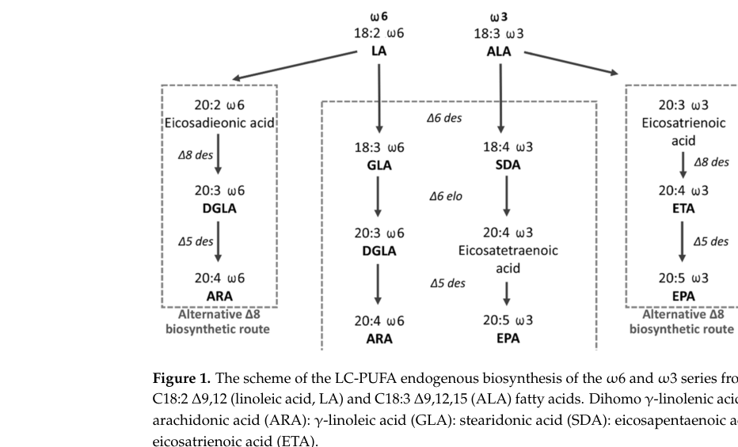
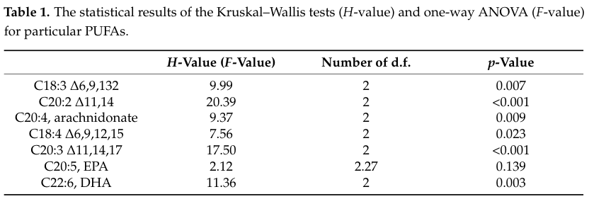

## Question

# Gene Research for Functional Annotation

## ⚠️ CRITICAL: Gene/Protein Identification Context

**BEFORE YOU BEGIN RESEARCH:** You MUST verify you are researching the CORRECT gene/protein. Gene symbols can be ambiguous, especially for less well-characterized genes from non-model organisms.

### Target Gene/Protein Identity (from UniProt):
- **UniProt Accession:** Q9DEX7
- **Protein Description:** RecName: Full=Acyl-CoA 6-desaturase {ECO:0000250|UniProtKB:O95864}; EC=1.14.19.3 {ECO:0000269|PubMed:11724940}; EC=1.14.19.44 {ECO:0000269|PubMed:11724940}; AltName: Full=Delta(5)/Delta(6) fatty acid desaturase; Short=D5D/D6D fatty acid desaturase; Short=Delta-5/Delta-6 fatty acid desaturase; AltName: Full=Fatty acid desaturase 2;
- **Gene Information:** Name=fads2; Synonyms=fadsd6;
- **Organism (full):** Danio rerio (Zebrafish) (Brachydanio rerio).
- **Protein Family:** Belongs to the fatty acid desaturase type 1 family.
- **Key Domains:** Cyt_B5-like_heme/steroid-bd. (IPR001199); Cyt_B5-like_heme/steroid_sf. (IPR036400); FA_desaturase_dom. (IPR005804); Fatty_acid_desaturase. (IPR012171); Cyt-b5 (PF00173)

### MANDATORY VERIFICATION STEPS:

1. **Check if the gene symbol "fads2" matches the protein description above**
2. **Verify the organism is correct:** Danio rerio (Zebrafish) (Brachydanio rerio).
3. **Check if protein family/domains align with what you find in literature**
4. **If you find literature for a DIFFERENT gene with the same or similar symbol, STOP**

### If Gene Symbol is Ambiguous or You Cannot Find Relevant Literature:

**DO NOT PROCEED WITH RESEARCH ON A DIFFERENT GENE.** Instead:
- State clearly: "The gene symbol 'fads2' is ambiguous or literature is limited for this specific protein"
- Explain what you found (e.g., "Found extensive literature on a different gene with the same symbol in a different organism")
- Describe the protein based ONLY on the UniProt information provided above
- Suggest that the protein function can be inferred from domain/family information

### Research Target:

Please provide a comprehensive research report on the gene **fads2** (gene ID: fads2, UniProt: Q9DEX7) in DANRE.

The research report should be a detailed narrative explaining the function, biological processes, and localization of the gene product. Citations should be given for all claims.

You should prioritize authoritative reviews and primary scientific literature when conducting research. You can supplement
this with annotations you find in gene/protein databases, but these can be outdated or inaccurate.

We are specifically interested in the primary function of the gene - for enzymes, what reaction is catalyzed, and what is the substrate specificity? For transporters, what is the substrate? For structural proteins or adapters, what is the broader structural role? For signaling molecules, what is the role in the pathway.

We are interested in where in or outside the cell the gene product carries out its function.

We are also interested in the signaling or biochemical pathways in which the gene functions. We are less interested in broad pleiotropic effects, except where these elucidate the precise role.

Include evidence where possible. We are interested in both experimental evidence as well as inference from structure, evolution, or bioinformatic analysis. Precise studies should be prioritized over high-throughput, where available.

## Output

Question: You are an expert researcher providing comprehensive, well-cited information.

Provide detailed information focusing on:
1. Key concepts and definitions with current understanding
2. Recent developments and latest research (prioritize 2023-2024 sources)
3. Current applications and real-world implementations
4. Expert opinions and analysis from authoritative sources
5. Relevant statistics and data from recent studies

Format as a comprehensive research report with proper citations. Include URLs and publication dates where available.
Always prioritize recent, authoritative sources and provide specific citations for all major claims.

# Gene Research for Functional Annotation

## ⚠️ CRITICAL: Gene/Protein Identification Context

**BEFORE YOU BEGIN RESEARCH:** You MUST verify you are researching the CORRECT gene/protein. Gene symbols can be ambiguous, especially for less well-characterized genes from non-model organisms.

### Target Gene/Protein Identity (from UniProt):
- **UniProt Accession:** Q9DEX7
- **Protein Description:** RecName: Full=Acyl-CoA 6-desaturase {ECO:0000250|UniProtKB:O95864}; EC=1.14.19.3 {ECO:0000269|PubMed:11724940}; EC=1.14.19.44 {ECO:0000269|PubMed:11724940}; AltName: Full=Delta(5)/Delta(6) fatty acid desaturase; Short=D5D/D6D fatty acid desaturase; Short=Delta-5/Delta-6 fatty acid desaturase; AltName: Full=Fatty acid desaturase 2;
- **Gene Information:** Name=fads2; Synonyms=fadsd6;
- **Organism (full):** Danio rerio (Zebrafish) (Brachydanio rerio).
- **Protein Family:** Belongs to the fatty acid desaturase type 1 family.
- **Key Domains:** Cyt_B5-like_heme/steroid-bd. (IPR001199); Cyt_B5-like_heme/steroid_sf. (IPR036400); FA_desaturase_dom. (IPR005804); Fatty_acid_desaturase. (IPR012171); Cyt-b5 (PF00173)

### MANDATORY VERIFICATION STEPS:

1. **Check if the gene symbol "fads2" matches the protein description above**
2. **Verify the organism is correct:** Danio rerio (Zebrafish) (Brachydanio rerio).
3. **Check if protein family/domains align with what you find in literature**
4. **If you find literature for a DIFFERENT gene with the same or similar symbol, STOP**

### If Gene Symbol is Ambiguous or You Cannot Find Relevant Literature:

**DO NOT PROCEED WITH RESEARCH ON A DIFFERENT GENE.** Instead:
- State clearly: "The gene symbol 'fads2' is ambiguous or literature is limited for this specific protein"
- Explain what you found (e.g., "Found extensive literature on a different gene with the same symbol in a different organism")
- Describe the protein based ONLY on the UniProt information provided above
- Suggest that the protein function can be inferred from domain/family information

### Research Target:

Please provide a comprehensive research report on the gene **fads2** (gene ID: fads2, UniProt: Q9DEX7) in DANRE.

The research report should be a detailed narrative explaining the function, biological processes, and localization of the gene product. Citations should be given for all claims.

You should prioritize authoritative reviews and primary scientific literature when conducting research. You can supplement
this with annotations you find in gene/protein databases, but these can be outdated or inaccurate.

We are specifically interested in the primary function of the gene - for enzymes, what reaction is catalyzed, and what is the substrate specificity? For transporters, what is the substrate? For structural proteins or adapters, what is the broader structural role? For signaling molecules, what is the role in the pathway.

We are interested in where in or outside the cell the gene product carries out its function.

We are also interested in the signaling or biochemical pathways in which the gene functions. We are less interested in broad pleiotropic effects, except where these elucidate the precise role.

Include evidence where possible. We are interested in both experimental evidence as well as inference from structure, evolution, or bioinformatic analysis. Precise studies should be prioritized over high-throughput, where available.

## Research report: *Danio rerio* **fads2** (UniProt **Q9DEX7**) — functional annotation and current research

### 1) Target verification (critical disambiguation)
The target protein is *Danio rerio* **fads2** (UniProt Q9DEX7), historically cloned and functionally validated as a **bifunctional front-end desaturase** with **Δ6 and Δ5** activities in zebrafish. This aligns with the UniProt description (acyl-CoA 6-desaturase / “Δ5/Δ6 fatty acid desaturase”) and with canonical domain architecture (N-terminal cytochrome b5-like domain and conserved histidine boxes). The foundational functional characterization is the zebrafish cDNA expressed in yeast that catalyzes both Δ6 and Δ5 desaturation steps of PUFA biosynthesis. (hastings2001avertebratefatty pages 1-2, hastings2001avertebratefatty pages 4-6)

### 2) Key concepts and definitions (current understanding)

#### 2.1 Front-end desaturation nomenclature
“Front-end” desaturases insert double bonds counted from the **carboxyl end** of the fatty acid. Thus:
- **Δ6 desaturation** introduces a double bond at the 6th carbon from the carboxyl end and is commonly the **rate-limiting first step** for converting dietary essential PUFA precursors into longer-chain PUFA. (lee2016fattyaciddesaturases pages 3-5, blahova2020assessmentoffatty pages 3-5)
- **Δ5 desaturation** introduces a double bond at the 5th carbon and typically converts C20 intermediates (e.g., DGLA/ETA analogs) to **arachidonic acid (ARA)** and **eicosapentaenoic acid (EPA)**. (lee2016fattyaciddesaturases pages 3-5, hastings2001avertebratefatty pages 4-6)
- **Δ8 desaturation** can occur in an “alternative pathway” in which elongation precedes desaturation (elongate C18→C20, then Δ8 desaturate), providing a bypass around the first Δ6 step. (blahova2020assessmentoffatty pages 3-5, blahova2022partialfads2gene pages 1-2)

#### 2.2 LC-PUFA biosynthesis pathways in teleosts and zebrafish
LC-PUFA (≥C20) such as ARA (20:4n-6), EPA (20:5n-3), and DHA (22:6n-3) are produced by alternating **desaturation** and **elongation** steps. In vertebrates:
- The **“Δ6 pathway”** proceeds as Δ6 desaturation → elongation → Δ5 desaturation. (blahova2020assessmentoffatty pages 3-5)
- The **“Δ8 pathway”** proceeds as elongation → Δ8 desaturation → Δ5 desaturation. (blahova2020assessmentoffatty pages 3-5)
For **DHA**, teleosts frequently use the **Sprecher pathway**: EPA is elongated to C24 PUFA, then **Δ6 desaturation on C24** generates 24:6n-3, followed by **peroxisomal β-oxidation** back to DHA. (oboh2017twoalternativepathways pages 1-2, blahova2020assessmentoffatty pages 3-5)

Teleost genomes often lack a canonical **Fads1 (Δ5)** ortholog, and **Fads2 enzymes diversify** to cover multiple desaturation steps (Δ6, Δ5, Δ8, and in some species Δ4). Zebrafish are a canonical example: they carry a single **bifunctional Δ6/Δ5 Fads2** that supports multiple LC-PUFA biosynthetic steps. (blahova2020assessmentoffatty pages 3-5, castro2012functionaldesaturasefads1 pages 2-4)

### 3) Molecular function of zebrafish Fads2 (substrates, products, and specificity)

#### 3.1 Enzymatic reactions catalyzed (primary evidence)
The seminal yeast heterologous expression study demonstrated that zebrafish Fads2 catalyzes:
- **Δ6 desaturation of C18 PUFA**
  - 18:2n-6 (linoleic acid, LA) → 18:3n-6 (γ-linolenic acid, GLA)
  - 18:3n-3 (α-linolenic acid, ALA) → 18:4n-3 (stearidonic acid, SDA)
- **Δ5 desaturation of C20 PUFA**
  - 20:3n-6 → 20:4n-6 (arachidonic acid, ARA)
  - 20:4n-3 → 20:5n-3 (eicosapentaenoic acid, EPA)
with product identities validated by GC-MS. (hastings2001avertebratefatty pages 2-4, hastings2001avertebratefatty pages 4-6)

#### 3.2 Quantitative substrate preference (n-3 vs n-6)
In yeast assays, conversion efficiencies indicated a preference for **n-3** substrates compared with n-6 analogs:
- Δ6 conversions: **11.7%** (18:2n-6→18:3n-6) vs **29.4%** (18:3n-3→18:4n-3)
- Δ5 conversions: **8.3%** (20:3n-6→20:4n-6) vs **20.4%** (20:4n-3→20:5n-3)
These quantitative data support the interpretation that zebrafish Fads2 has stronger activity toward the n-3 pathway substrates in this assay context. (hastings2001avertebratefatty pages 4-6)

#### 3.3 Activity on C24 PUFA (Sprecher pathway compatibility)
A broader comparative teleost functional survey reported zebrafish Δ6Δ5 Fads2 Δ6 activity toward C24 substrates:
- 24:4n-6 → 24:5n-6: **10.4%**
- 24:5n-3 → 24:6n-3: **15.8%**
with an internal normalization metric (Δ24:5n−3/Δcontrol) of **1.33** (control Δ6 activity on 18:3n-3 = **11.9%**). These findings support that zebrafish Fads2 can participate in the C24 Δ6 step required for Sprecher-pathway DHA biosynthesis. (oboh2017twoalternativepathways pages 2-4)

#### 3.4 Evidence for an alternative Δ8 route in vivo (CRISPR crispants)
CRISPR/Cas9 partial knockout (“crispant”) zebrafish females (reported editing levels ~**50–80%**) showed altered egg LC-PUFA profiles consistent with impaired Δ6 entry steps (LA→GLA and ALA→SDA) and diversion through an **alternative Δ8 pathway** (elongation to C20 intermediates then Δ8 desaturation). The authors interpret this as evidence that zebrafish Fads2 behaves as **Δ6/Δ5/Δ8** within the in vivo pathway context. (blahova2022partialfads2gene pages 1-2, blahova2022partialfads2gene pages 2-4)

### 4) Protein features, mechanism, and subcellular localization

#### 4.1 Domain architecture and catalytic motifs
Zebrafish Fads2 is a membrane-associated desaturase with:
- **N-terminal cytochrome b5-like domain** (with conserved heme-binding motif HPGG)
- **Three conserved histidine boxes**, typical of membrane diiron desaturases
- Predicted multiple membrane-spanning helices typical of microsomal/ER desaturases
The original cloning study reported a **1,590 bp ORF** encoding a **444 aa** protein and explicitly highlighted cytochrome b5-like and histidine-box features. (hastings2001avertebratefatty pages 2-4, hastings2001avertebratefatty pages 4-6)

#### 4.2 Electron-transfer mechanism (conceptual consensus)
Front-end desaturases are non-heme diiron enzymes that require an electron-transfer chain involving **NADH–cytochrome b5 reductase**, **cytochrome b5**, and the desaturase, using **molecular oxygen** during double-bond insertion. Fish Fads2 are described as ER membrane proteins with histidine motifs coordinating the catalytic diiron center. (oboh2018investigatingthelongchain pages 35-39, blahova2020assessmentoffatty pages 5-7)

#### 4.3 Subcellular localization and functional complex formation
Cell-based imaging and FRET experiments in HeLa cells expressing zebrafish Fads2 (Z-FADS) provide direct localization and interaction evidence:
- Co-localization with an ER marker (ERp57) supports ER association.
- Detection in mitochondrial membrane fractions and co-localization with a mitochondrial marker (COX IV) suggests additional mitochondrial membrane presence in this heterologous system.
- FRET-based proximity/interaction was observed with CYB5R2/3 and multiple elongases (ELOVL2/4/5/7). (chen2013identificationofthe pages 4-5, chen2013identificationofthe pages 2-4)

Quantitative interaction metrics reported include (selected examples):
- Z-FADS-EGFP + DsRed-CYB5R2: FRET efficiency **16 ± 1%**, distance **8.4 nm**
- Z-FADS-EGFP + DsRed-CYB5R3: **6.0 ± 0.5%**, distance **9.9 nm**
- EGFP-Z-FADS + ELOVL5-FLAG: **17 ± 3%**, distance **7.8 nm**
These data support a model in which Fads2 functionally co-localizes with and physically associates with reductases/elongases in an ER lipid-synthetic module. (chen2013identificationofthe pages 2-4)

### 5) Biological processes and phenotypes (zebrafish-specific)

#### 5.1 Reproduction and egg quality
Partial CRISPR disruption of fads2 in adult females altered egg LC-PUFA signatures and was associated with **poor-quality eggs**, consistent with a requirement for properly balanced LC-PUFA production/availability during oogenesis and egg provisioning. The study explicitly centers on a shift in pathway usage (Δ6 entry impairment and Δ8 bypass) and its reproductive consequence. (blahova2022partialfads2gene pages 1-2, blahova2022partialfads2gene media 0bbea25d, blahova2022partialfads2gene media 073b0d4a)

#### 5.2 Metabolic regulation contexts in recent zebrafish studies (2023–2024)
Recent primary zebrafish studies commonly treat **fads2 expression** as a marker/effector within broader lipogenesis and metabolic state changes:
- **Vitamin D receptor paralog ablation (vdra/vdrb double KO)**: authors describe fads2 as a “key enzyme in PUFA biosynthesis” and present tissue-specific qPCR panels showing altered lipogenesis gene transcription including **fads2** in liver and adipose tissue in mutants. (liu2023enhancedinsulinactivity pages 6-8)
- **Impaired glucose uptake (glut2 KO)**: decreased expression of fatty-acid synthesis genes including **fads2** was reported in MZglut2 zebrafish, accompanying growth retardation and broader metabolic remodeling. (xi2023attenuatedglucoseuptake pages 1-2)
- **Androgen signaling blockade**: flutamide treatment and ar-related models produced increased lipid accumulation and upregulation of lipogenesis-related genes including **fads2** in liver (RNA-seq/qPCR-referenced panels). Quantitatively, in ar-/- comparisons the authors reported whole-body lipid content differences and provided sample sizes for lipid-content assays; fads2 is explicitly listed among upregulated DNL/lipogenesis genes in the flutamide condition. (jia2024androgensignalinginhibits pages 7-10)
- **Tobacco pollutant/cigarette smoke extract (CSE) exposure**: integrated transcriptomics implicated **downregulation of fads2** as part of lipid-metabolism disturbance in embryos; the authors argue this may reduce LC-PUFA availability required for normal embryogenesis and tissue differentiation. (chen2024integratedmrnaand pages 9-12, chen2024integratedmrnaand pages 12-13)

Collectively, these studies reinforce fads2 as a mechanistically plausible node linking endocrine signals, nutritional/chemical stressors, and lipid metabolic outcomes, though many do not directly quantify specific lipid species downstream of Fads2.

### 6) Current applications and real-world implementations

#### 6.1 Aquaculture and nutritional engineering
A major practical driver is the limited global supply of dietary LC-PUFA (notably DHA/EPA) and the need for aquaculture species to maintain health and human nutritional value under increasing use of plant-based feeds. Fish Fads2 enzymes are therefore major targets for nutritional programming and genetic engineering to enhance endogenous LC-PUFA capacity. (blahova2020assessmentoffatty pages 1-3, blahova2020assessmentoffatty pages 7-9)

A 2024 review on genome editing targets for desirable aquaculture phenotypes identifies **fads2** (and specific Δ6-related mutant alleles) as targets affecting **fatty-acid composition in fish meat**, highlighting translational interest in manipulating this pathway. (orlova2024insearchof pages 1-2)

### 7) Expert synthesis and interpretation

#### 7.1 Primary functional annotation (recommended)
Based on direct enzymology and pathway context, the best-supported primary annotation for zebrafish Q9DEX7 is:
- **Microsomal/ER-associated front-end PUFA desaturase** with **Δ6 and Δ5** activities (and evidence of Δ8 participation under pathway perturbation).
- Catalyzes early and mid-pathway steps converting dietary **LA/ALA** into longer-chain PUFA intermediates and ultimately supporting **ARA/EPA** production and **DHA** synthesis via a Sprecher-like route.
This annotation is anchored in direct yeast conversion assays (substrate→product with quantified conversions) and reinforced by comparative teleost assays for C24 substrates and by in vivo gene editing perturbation outcomes. (hastings2001avertebratefatty pages 4-6, oboh2017twoalternativepathways pages 2-4, blahova2022partialfads2gene pages 1-2)

#### 7.2 Localization nuance
Most biochemical and review evidence supports Fads2 as an **ER membrane** enzyme. The reported mitochondrial presence in a heterologous HeLa system should be interpreted cautiously as it may reflect cell-type-specific targeting or overexpression artifacts rather than the dominant in vivo localization in zebrafish tissues; however, the ER association and proximity to reductases/elongases is strongly supported. (chen2013identificationofthe pages 4-5, blahova2020assessmentoffatty pages 5-7)

### 8) Quantitative/statistical highlights (recent studies and key primary data)
- Yeast functional assay conversions (zebrafish Fads2): **11.7%, 29.4%, 8.3%, 20.4%** for the four canonical Δ6/Δ5 reactions listed above. (hastings2001avertebratefatty pages 4-6)
- C24 Δ6 conversions: **10.4%** (24:4n-6→24:5n-6) and **15.8%** (24:5n-3→24:6n-3), ratio metric **1.33**, control **11.9%**. (oboh2017twoalternativepathways pages 2-4)
- In vivo CRISPR mosaic editing rate in crispants: ~**50–80%**; associated egg fatty-acid ratio changes and inferred Δ8 bypass (see extracted table/figures). (blahova2022partialfads2gene pages 1-2, blahova2022partialfads2gene media 0bbea25d, blahova2022partialfads2gene media 073b0d4a)
- FRET interaction metrics in cell assays: examples include **16 ± 1%** (CYB5R2; **8.4 nm**) and **6.0 ± 0.5%** (CYB5R3; **9.9 nm**), plus elongase proximity interactions. (chen2013identificationofthe pages 2-4)

### 9) Consolidated functional summary table
The following table consolidates the enzyme’s activities, pathway role, localization, phenotypes, and application relevance.

| Aspect | Key findings | Evidence/notes with specific numeric values where available | Primary citation context IDs |
|---|---|---|---|
| Enzyme activity | Zebrafish **fads2** encodes a **bifunctional front-end desaturase** with **Δ6 and Δ5** activities; later in vivo work supports an **alternative Δ8 route** consistent with trifunctional behavior in pathway context. | In yeast, zebrafish Fads2 converted C18 PUFA by **Δ6** desaturation and C20 PUFA by **Δ5** desaturation; crispant data support diversion through a **Δ8 bypass** when Δ6 function is impaired. Reviews place zebrafish among teleosts where Fads2 diversified after loss of canonical teleost **fads1**. (hastings2001avertebratefatty pages 4-6, blahova2022partialfads2gene pages 1-2, blahova2020assessmentoffatty pages 3-5, lee2016fattyaciddesaturases pages 3-5) | (hastings2001avertebratefatty pages 4-6, blahova2022partialfads2gene pages 1-2, blahova2020assessmentoffatty pages 3-5, lee2016fattyaciddesaturases pages 3-5) |
| Substrates/products (Δ6) | Primary Δ6 substrates are **18:2n-6 (LA)** and **18:3n-3 (ALA)**, yielding **18:3n-6 (GLA)** and **18:4n-3 (SDA)**. | Hastings et al. showed **18:2n-6 → 18:3n-6** at **11.7%** conversion and **18:3n-3 → 18:4n-3** at **29.4%** conversion in yeast, indicating stronger activity toward the n-3 substrate. Δ6 desaturation is described as the first/rate-limiting step in LC-PUFA biosynthesis. (hastings2001avertebratefatty pages 4-6, hastings2001avertebratefatty pages 1-2, blahova2020assessmentoffatty pages 3-5, lee2016fattyaciddesaturases pages 3-5) | (hastings2001avertebratefatty pages 4-6, hastings2001avertebratefatty pages 1-2, blahova2020assessmentoffatty pages 3-5, lee2016fattyaciddesaturases pages 3-5) |
| Substrates/products (Δ5) | Zebrafish Fads2 also desaturates C20 intermediates at the Δ5 position to generate **ARA** and **EPA**. | Hastings et al. measured **20:3n-6 → 20:4n-6 (ARA)** at **8.3%** conversion and **20:4n-3 → 20:5n-3 (EPA)** at **20.4%** conversion, again showing preference for n-3 substrate. (hastings2001avertebratefatty pages 4-6, hastings2001avertebratefatty pages 2-4) | (hastings2001avertebratefatty pages 4-6, hastings2001avertebratefatty pages 2-4) |
| C24 substrate activity / DHA route | Zebrafish Δ6Δ5 Fads2 can also act on **C24 PUFA**, supporting the **Sprecher pathway** for DHA biosynthesis. | In the Oboh et al. teleost survey, zebrafish DrΔ6Δ5Fads2 converted **24:4n-6 → 24:5n-6** at **10.4%** and **24:5n-3 → 24:6n-3** at **15.8%**; the **Δ24:5n-3/Δcontrol ratio was 1.33**, with **18:3n-3 control conversion 11.9%**. (oboh2017twoalternativepathways pages 2-4, oboh2017twoalternativepathways pages 1-2) | (oboh2017twoalternativepathways pages 2-4, oboh2017twoalternativepathways pages 1-2) |
| Δ8 pathway relevance | When fads2 function is partially disrupted in vivo, zebrafish LC-PUFA synthesis can be rerouted through an **alternative Δ8 pathway**. | Bláhová et al. interpret crispant egg lipid profiles as showing elongation of C18 precursors to **20:2n-6 (EDA)** and **20:3n-3 (ERA)** followed by Fads2-mediated **Δ8 desaturation**, bypassing the first Δ6 step. This supports the claim that zebrafish Fads2 behaves as **Δ6/Δ5/Δ8** in vivo pathway context. (blahova2022partialfads2gene pages 1-2, blahova2022partialfads2gene pages 2-4, blahova2022partialfads2gene pages 11-13) | (blahova2022partialfads2gene pages 1-2, blahova2022partialfads2gene pages 2-4, blahova2022partialfads2gene pages 11-13) |
| Pathway role | **fads2** is the key desaturase in endogenous **LC-PUFA biosynthesis**, linking dietary C18 essential fatty acids to **ARA, EPA, and DHA** production. | Reviews describe two major routes: **Δ6 pathway** (Δ6 desaturation → elongation → Δ5 desaturation) and **Δ8 pathway** (elongation → Δ8 desaturation → Δ5 desaturation). DHA can then be produced by the **Sprecher pathway** via **24:5n-3 → 24:6n-3** and peroxisomal β-oxidation, or by a direct Δ4 route in some other teleosts; zebrafish is aligned with the Sprecher-capable group. (blahova2020assessmentoffatty pages 3-5, oboh2017twoalternativepathways pages 1-2, blahova2020assessmentoffatty pages 1-3) | (blahova2020assessmentoffatty pages 3-5, oboh2017twoalternativepathways pages 1-2, blahova2020assessmentoffatty pages 1-3) |
| Localization | Zebrafish Fads2 is primarily associated with the **endoplasmic reticulum (ER)**, with additional evidence for **mitochondrial membrane** localization in transfected cells. | Chen et al. reported ER co-localization (with **ERp57**) and mitochondrial co-localization (with **COX IV**), plus Western-blot detection in the mitochondrial membrane fraction of HeLa cells expressing zebrafish Fads2. Reviews also describe Fads2 as an **ER membrane-bound** enzyme. (chen2013identificationofthe pages 4-5, chen2013identificationofthe pages 1-2, blahova2020assessmentoffatty pages 1-3, blahova2020assessmentoffatty pages 7-9) | (chen2013identificationofthe pages 4-5, chen2013identificationofthe pages 1-2, blahova2020assessmentoffatty pages 1-3, blahova2020assessmentoffatty pages 7-9) |
| Protein interactions | Fads2 functions within an ER lipid-biosynthetic complex with **CYB5R2/CYB5R3** and multiple **ELOVL** elongases. | Chen et al. measured donor-acceptor distances of **95 Å** to **CYB5R2** and **93 Å** to **CYB5R3**. Reported FRET efficiencies with elongases were **13 ± 1% (ELOVL2)**, **11 ± 0% (ELOVL4)**, and **7.8 ± 0.6% (ELOVL5)**; Fads2 was also in proximity to ELOVL7. (chen2013identificationofthe pages 4-5, chen2013identificationofthe pages 1-2) | (chen2013identificationofthe pages 4-5, chen2013identificationofthe pages 1-2) |
| Structure/domains | The protein architecture matches UniProt Q9DEX7: **N-terminal cytochrome b5-like domain**, conserved **HPGG** heme-binding motif, **three histidine boxes**, and multiple membrane-spanning helices. | Hastings reported a **1,590-bp ORF** encoding a **444-aa** protein. Reviews describe Fads2 as a modular, membrane-bound desaturase with a fused cytochrome b5-like domain and a C-terminal desaturase region containing **three conserved His-boxes**; topology models predict **up to four transmembrane α-helices** in ER membrane association. (hastings2001avertebratefatty pages 2-4, blahova2020assessmentoffatty pages 5-7, blahova2020assessmentoffatty pages 7-9) | (hastings2001avertebratefatty pages 2-4, blahova2020assessmentoffatty pages 5-7, blahova2020assessmentoffatty pages 7-9) |
| Catalytic mechanism | Fads2 is a **non-heme diiron front-end desaturase** that receives electrons through the cytochrome b5 system. | Mechanistic reviews describe electron transfer from **NADH → NADH-cytochrome b5 reductase → cytochrome b5 / fused cytochrome b5-like domain → diiron center**, with molecular oxygen used during double-bond insertion. Chen et al. likewise described zebrafish Fads2 as a **non-heme diiron desaturase** requiring the heme-binding cytochrome b5 motif. (oboh2018investigatingthelongchain pages 35-39, blahova2020assessmentoffatty pages 5-7, chen2013identificationofthe pages 1-2) | (oboh2018investigatingthelongchain pages 35-39, blahova2020assessmentoffatty pages 5-7, chen2013identificationofthe pages 1-2) |
| Phenotypes upon editing | Partial loss of fads2 impairs female reproductive output through altered egg LC-PUFA composition and poor egg quality. | Bláhová et al. generated **G0 CRISPR/Cas9 crispants with ~50–80% editing** and found impaired conversion of **LA→GLA** and **ALA→SDA**, altered egg LC-PUFA profiles, evidence of Δ8 bypass, and **bad-quality eggs** in edited females. Figure/table evidence in that paper centers on egg fatty-acid ratios and significant composition shifts. (blahova2022partialfads2gene pages 1-2, blahova2022partialfads2gene pages 2-4, blahova2022partialfads2gene media e18e2aaf) | (blahova2022partialfads2gene pages 1-2, blahova2022partialfads2gene pages 2-4, blahova2022partialfads2gene media e18e2aaf) |
| Key quantitative data summary | Available quantitative data show stronger activity toward **n-3 substrates** and measurable action on both **C18/C20** and **C24** PUFA. | Percent conversions reported: **11.7%** (18:2n-6→18:3n-6), **29.4%** (18:3n-3→18:4n-3), **8.3%** (20:3n-6→20:4n-6), **20.4%** (20:4n-3→20:5n-3), **10.4%** (24:4n-6→24:5n-6), **15.8%** (24:5n-3→24:6n-3), control **11.9%**, ratio **1.33**; editing efficiency in vivo **50–80%**. (hastings2001avertebratefatty pages 4-6, oboh2017twoalternativepathways pages 2-4, blahova2022partialfads2gene pages 1-2) | (hastings2001avertebratefatty pages 4-6, oboh2017twoalternativepathways pages 2-4, blahova2022partialfads2gene pages 1-2) |
| Applications / engineering | **fads2** is considered a promising **genome-editing target** for modifying fish fatty-acid composition and improving aquaculture value. | A 2024 review lists **fads2** and related Δ6 mutant alleles among targets affecting **fatty-acid composition in fish meat**. A broader review highlights promoter engineering, copy-number effects, and transgenesis, including evidence that heterologous **Δ5 Fads2** can function in zebrafish and that LC-PUFA biosynthesis can be increased by engineering pathway genes. (orlova2024insearchof pages 1-2, blahova2020assessmentoffatty pages 7-9) | (orlova2024insearchof pages 1-2, blahova2020assessmentoffatty pages 7-9) |

*Table: This table summarizes the functional annotation of zebrafish Danio rerio fads2 (UniProt Q9DEX7), including enzymatic activities, pathways, localization, structure, phenotypes, and engineering relevance. It compiles quantitative findings from primary studies and review-level context useful for gene function interpretation.*

### 10) Key visual evidence (figures/tables extracted)
- Egg LC-PUFA composition/ratio shifts in fads2 crispants vs control, and statistical support (Table 1 / Figure 4). (blahova2022partialfads2gene media 0bbea25d, blahova2022partialfads2gene media 15c2f8b8)
- Pathway schematic illustrating diversion through the Δ8 route under partial fads2 knockout (Figure 5). (blahova2022partialfads2gene media 073b0d4a)

### 11) References (URLs and publication dates)

Primary zebrafish functional characterization:
- Hastings N. et al. **“A vertebrate fatty acid desaturase with Δ5 and Δ6 activities.”** *PNAS* (Published **2001-11**). https://doi.org/10.1073/pnas.251516598 (hastings2001avertebratefatty pages 4-6)

Subcellular localization and interaction module:
- Chen Y-S. et al. **“Identification of the proteins required for fatty acid desaturation in zebrafish (Danio rerio).”** *Biochemical and Biophysical Research Communications* (Published **2013-11**). https://doi.org/10.1016/j.bbrc.2013.09.127 (chen2013identificationofthe pages 2-4)

In vivo perturbation of fads2 and Δ8 bypass evidence:
- Bláhová Z. et al. **“Partial fads2 Gene Knockout Diverts LC-PUFA Biosynthesis via an Alternative Δ8 Pathway with an Impact on the Reproduction of Female Zebrafish (Danio rerio).”** *Genes* (Published **2022-04**). https://doi.org/10.3390/genes13040700 (blahova2022partialfads2gene pages 1-2)

Teleost comparative evidence for Sprecher-pathway enabling Δ6-on-C24 activity:
- Oboh A. et al. **“Two alternative pathways for docosahexaenoic acid (DHA, 22:6n-3) biosynthesis are widespread among teleost fish.”** *Scientific Reports* (Published **2017-06**). https://doi.org/10.1038/s41598-017-04288-2 (oboh2017twoalternativepathways pages 2-4)

Authoritative conceptual reviews:
- Lee J.M. et al. **“Fatty Acid Desaturases, Polyunsaturated Fatty Acid Regulation, and Biotechnological Advances.”** *Nutrients* (Published **2016-01**). https://doi.org/10.3390/nu8010023 (lee2016fattyaciddesaturases pages 3-5)
- Bláhová Z. et al. **“Assessment of Fatty Acid Desaturase (Fads2) Structure-Function Properties in Fish…”** *Biomolecules* (preprint/review posted **2020-01**). https://doi.org/10.20944/preprints202001.0330.v1 (blahova2020assessmentoffatty pages 5-7)

Recent (2023–2024) zebrafish systems studies implicating fads2 in lipid metabolic state:
- Liu R. et al. **“Enhanced insulin activity achieved in VDRa/b ablation zebrafish.”** *Frontiers in Endocrinology* (Published **2023-02**). https://doi.org/10.3389/fendo.2023.1054665 (liu2023enhancedinsulinactivity pages 6-8)
- Xi L. et al. **“Attenuated glucose uptake promotes catabolic metabolism…”** *Frontiers in Nutrition* (Published **2023-05**). https://doi.org/10.3389/fnut.2023.1187283 (xi2023attenuatedglucoseuptake pages 1-2)
- Jia J-Y. et al. **“Androgen signaling inhibits de novo lipogenesis to alleviate lipid deposition in zebrafish.”** *Zoological Research* (Published **2024-03**). https://doi.org/10.24272/j.issn.2095-8137.2023.324 (jia2024androgensignalinginhibits pages 7-10)
- Chen J. et al. **“Integrated mRNA- and miRNA-sequencing analyses unveil…”** *Journal of Translational Medicine* (Published **2024-03**). https://doi.org/10.1186/s12967-024-05050-9 (chen2024integratedmrnaand pages 9-12)

Aquaculture genome-editing perspective:
- Orlova S.Y. et al. **“In Search of a Target Gene for a Desirable Phenotype in Aquaculture…”** *Genes* (Published **2024-06**). https://doi.org/10.3390/genes15060726 (orlova2024insearchof pages 1-2)

References

1. (hastings2001avertebratefatty pages 1-2): Nicola Hastings, Morris Agaba, Douglas R. Tocher, Michael J. Leaver, James R. Dick, John R. Sargent, and Alan J. Teale. A vertebrate fatty acid desaturase with δ5 and δ6 activities. Proceedings of the National Academy of Sciences of the United States of America, 98:14304-14309, Nov 2001. URL: https://doi.org/10.1073/pnas.251516598, doi:10.1073/pnas.251516598. This article has 492 citations and is from a highest quality peer-reviewed journal.

2. (hastings2001avertebratefatty pages 4-6): Nicola Hastings, Morris Agaba, Douglas R. Tocher, Michael J. Leaver, James R. Dick, John R. Sargent, and Alan J. Teale. A vertebrate fatty acid desaturase with δ5 and δ6 activities. Proceedings of the National Academy of Sciences of the United States of America, 98:14304-14309, Nov 2001. URL: https://doi.org/10.1073/pnas.251516598, doi:10.1073/pnas.251516598. This article has 492 citations and is from a highest quality peer-reviewed journal.

3. (lee2016fattyaciddesaturases pages 3-5): Je Min Lee, Hyungjae Lee, SeokBeom Kang, and W. Park. Fatty acid desaturases, polyunsaturated fatty acid regulation, and biotechnological advances. Nutrients, 8:23, Jan 2016. URL: https://doi.org/10.3390/nu8010023, doi:10.3390/nu8010023. This article has 525 citations.

4. (blahova2020assessmentoffatty pages 3-5): Zuzana Bláhová, Thomas Nelson Harvey, Martin Pšenička, and Jan Mráz. Assessment of fatty acid desaturase (fads2) structure-function properties in fish in the context of environmental adaptations and as a target for genetic engineering. Biomolecules, Jan 2020. URL: https://doi.org/10.20944/preprints202001.0330.v1, doi:10.20944/preprints202001.0330.v1. This article has 48 citations.

5. (blahova2022partialfads2gene pages 1-2): Zuzana Bláhová, Roman Franěk, Marek Let, Martin Bláha, Martin Pšenička, and Jan Mráz. Partial fads2 gene knockout diverts lc-pufa biosynthesis via an alternative δ8 pathway with an impact on the reproduction of female zebrafish (danio rerio). Genes, 13:700, Apr 2022. URL: https://doi.org/10.3390/genes13040700, doi:10.3390/genes13040700. This article has 8 citations.

6. (oboh2017twoalternativepathways pages 1-2): Angela Oboh, Naoki Kabeya, Greta Carmona-Antoñanzas, L. Filipe C. Castro, James R. Dick, Douglas R. Tocher, and Oscar Monroig. Two alternative pathways for docosahexaenoic acid (dha, 22:6n-3) biosynthesis are widespread among teleost fish. Scientific Reports, Jun 2017. URL: https://doi.org/10.1038/s41598-017-04288-2, doi:10.1038/s41598-017-04288-2. This article has 173 citations and is from a peer-reviewed journal.

7. (castro2012functionaldesaturasefads1 pages 2-4): Luís Filipe Costa Castro, Óscar Monroig, Michael J. Leaver, Jonathan Wilson, Isabel Cunha, and Douglas R. Tocher. Functional desaturase fads1 (δ5) and fads2 (δ6) orthologues evolved before the origin of jawed vertebrates. PLoS ONE, 7:e31950, Feb 2012. URL: https://doi.org/10.1371/journal.pone.0031950, doi:10.1371/journal.pone.0031950. This article has 186 citations and is from a peer-reviewed journal.

8. (hastings2001avertebratefatty pages 2-4): Nicola Hastings, Morris Agaba, Douglas R. Tocher, Michael J. Leaver, James R. Dick, John R. Sargent, and Alan J. Teale. A vertebrate fatty acid desaturase with δ5 and δ6 activities. Proceedings of the National Academy of Sciences of the United States of America, 98:14304-14309, Nov 2001. URL: https://doi.org/10.1073/pnas.251516598, doi:10.1073/pnas.251516598. This article has 492 citations and is from a highest quality peer-reviewed journal.

9. (oboh2017twoalternativepathways pages 2-4): Angela Oboh, Naoki Kabeya, Greta Carmona-Antoñanzas, L. Filipe C. Castro, James R. Dick, Douglas R. Tocher, and Oscar Monroig. Two alternative pathways for docosahexaenoic acid (dha, 22:6n-3) biosynthesis are widespread among teleost fish. Scientific Reports, Jun 2017. URL: https://doi.org/10.1038/s41598-017-04288-2, doi:10.1038/s41598-017-04288-2. This article has 173 citations and is from a peer-reviewed journal.

10. (blahova2022partialfads2gene pages 2-4): Zuzana Bláhová, Roman Franěk, Marek Let, Martin Bláha, Martin Pšenička, and Jan Mráz. Partial fads2 gene knockout diverts lc-pufa biosynthesis via an alternative δ8 pathway with an impact on the reproduction of female zebrafish (danio rerio). Genes, 13:700, Apr 2022. URL: https://doi.org/10.3390/genes13040700, doi:10.3390/genes13040700. This article has 8 citations.

11. (oboh2018investigatingthelongchain pages 35-39): A Oboh. Investigating the long-chain polyunsaturated fatty acid biosynthesis of the african catfish clarias gariepinus (burchell, 1822). Unknown journal, 2018.

12. (blahova2020assessmentoffatty pages 5-7): Zuzana Bláhová, Thomas Nelson Harvey, Martin Pšenička, and Jan Mráz. Assessment of fatty acid desaturase (fads2) structure-function properties in fish in the context of environmental adaptations and as a target for genetic engineering. Biomolecules, Jan 2020. URL: https://doi.org/10.20944/preprints202001.0330.v1, doi:10.20944/preprints202001.0330.v1. This article has 48 citations.

13. (chen2013identificationofthe pages 4-5): Yao-Sheng Chen, Wen-I Luo, Tsu-Lin Lee, Steve S.-F. Yu, and Chi-Yao Chang. Identification of the proteins required for fatty acid desaturation in zebrafish (danio rerio). Biochemical and biophysical research communications, 440 4:671-6, Nov 2013. URL: https://doi.org/10.1016/j.bbrc.2013.09.127, doi:10.1016/j.bbrc.2013.09.127. This article has 11 citations and is from a peer-reviewed journal.

14. (chen2013identificationofthe pages 2-4): Yao-Sheng Chen, Wen-I Luo, Tsu-Lin Lee, Steve S.-F. Yu, and Chi-Yao Chang. Identification of the proteins required for fatty acid desaturation in zebrafish (danio rerio). Biochemical and biophysical research communications, 440 4:671-6, Nov 2013. URL: https://doi.org/10.1016/j.bbrc.2013.09.127, doi:10.1016/j.bbrc.2013.09.127. This article has 11 citations and is from a peer-reviewed journal.

15. (blahova2022partialfads2gene media 0bbea25d): Zuzana Bláhová, Roman Franěk, Marek Let, Martin Bláha, Martin Pšenička, and Jan Mráz. Partial fads2 gene knockout diverts lc-pufa biosynthesis via an alternative δ8 pathway with an impact on the reproduction of female zebrafish (danio rerio). Genes, 13:700, Apr 2022. URL: https://doi.org/10.3390/genes13040700, doi:10.3390/genes13040700. This article has 8 citations.

16. (blahova2022partialfads2gene media 073b0d4a): Zuzana Bláhová, Roman Franěk, Marek Let, Martin Bláha, Martin Pšenička, and Jan Mráz. Partial fads2 gene knockout diverts lc-pufa biosynthesis via an alternative δ8 pathway with an impact on the reproduction of female zebrafish (danio rerio). Genes, 13:700, Apr 2022. URL: https://doi.org/10.3390/genes13040700, doi:10.3390/genes13040700. This article has 8 citations.

17. (liu2023enhancedinsulinactivity pages 6-8): Ruolan Liu, Yao Lu, Xuyan Peng, Jingyi Jia, Yonglin Ruan, Shengchi Shi, Tingting Shu, Tianhui Li, Xia Jin, Gang Zhai, Jiangyan He, Qiyong Lou, and Zhan Yin. Enhanced insulin activity achieved in vdra/b ablation zebrafish. Frontiers in Endocrinology, Feb 2023. URL: https://doi.org/10.3389/fendo.2023.1054665, doi:10.3389/fendo.2023.1054665. This article has 10 citations.

18. (xi2023attenuatedglucoseuptake pages 1-2): Longwei Xi, Gang Zhai, Yulong Liu, Yulong Gong, Qisheng Lu, Zhimin Zhang, Haokun Liu, Junyan Jin, Xiaoming Zhu, Zhan Yin, Shouqi Xie, and Dong Han. Attenuated glucose uptake promotes catabolic metabolism through activated ampk signaling and impaired insulin signaling in zebrafish. Frontiers in Nutrition, May 2023. URL: https://doi.org/10.3389/fnut.2023.1187283, doi:10.3389/fnut.2023.1187283. This article has 13 citations.

19. (jia2024androgensignalinginhibits pages 7-10): Jing-Yi Jia, Guang-Hui Chen, Ting-Ting Shu, Qi-Yong Lou, Xia Jin, Jiang-Yan He, Wu-Han Xiao, Gang Zhai, and Zhan Yin. Androgen signaling inhibits de novo lipogenesis to alleviate lipid deposition in zebrafish. Zoological Research, 45:355-366, Mar 2024. URL: https://doi.org/10.24272/j.issn.2095-8137.2023.324, doi:10.24272/j.issn.2095-8137.2023.324. This article has 9 citations.

20. (chen2024integratedmrnaand pages 9-12): Jiasheng Chen, Yuxin Lin, Deyi Gen, Wanxian Chen, Rui Han, Hao Li, Shijie Tang, Shukai Zheng, and Xiaoping Zhong. Integrated mrna- and mirna-sequencing analyses unveil the underlying mechanism of tobacco pollutant-induced developmental toxicity in zebrafish embryos. Journal of Translational Medicine, Mar 2024. URL: https://doi.org/10.1186/s12967-024-05050-9, doi:10.1186/s12967-024-05050-9. This article has 4 citations and is from a peer-reviewed journal.

21. (chen2024integratedmrnaand pages 12-13): Jiasheng Chen, Yuxin Lin, Deyi Gen, Wanxian Chen, Rui Han, Hao Li, Shijie Tang, Shukai Zheng, and Xiaoping Zhong. Integrated mrna- and mirna-sequencing analyses unveil the underlying mechanism of tobacco pollutant-induced developmental toxicity in zebrafish embryos. Journal of Translational Medicine, Mar 2024. URL: https://doi.org/10.1186/s12967-024-05050-9, doi:10.1186/s12967-024-05050-9. This article has 4 citations and is from a peer-reviewed journal.

22. (blahova2020assessmentoffatty pages 1-3): Zuzana Bláhová, Thomas Nelson Harvey, Martin Pšenička, and Jan Mráz. Assessment of fatty acid desaturase (fads2) structure-function properties in fish in the context of environmental adaptations and as a target for genetic engineering. Biomolecules, Jan 2020. URL: https://doi.org/10.20944/preprints202001.0330.v1, doi:10.20944/preprints202001.0330.v1. This article has 48 citations.

23. (blahova2020assessmentoffatty pages 7-9): Zuzana Bláhová, Thomas Nelson Harvey, Martin Pšenička, and Jan Mráz. Assessment of fatty acid desaturase (fads2) structure-function properties in fish in the context of environmental adaptations and as a target for genetic engineering. Biomolecules, Jan 2020. URL: https://doi.org/10.20944/preprints202001.0330.v1, doi:10.20944/preprints202001.0330.v1. This article has 48 citations.

24. (orlova2024insearchof pages 1-2): Svetlana Yu. Orlova, Maria N. Ruzina, Olga R. Emelianova, Alexey A. Sergeev, Evgeniya A. Chikurova, Alexei M. Orlov, and Nikolai S. Mugue. In search of a target gene for a desirable phenotype in aquaculture: genome editing of cyprinidae and salmonidae species. Genes, 15:726, Jun 2024. URL: https://doi.org/10.3390/genes15060726, doi:10.3390/genes15060726. This article has 13 citations.

25. (blahova2022partialfads2gene pages 11-13): Zuzana Bláhová, Roman Franěk, Marek Let, Martin Bláha, Martin Pšenička, and Jan Mráz. Partial fads2 gene knockout diverts lc-pufa biosynthesis via an alternative δ8 pathway with an impact on the reproduction of female zebrafish (danio rerio). Genes, 13:700, Apr 2022. URL: https://doi.org/10.3390/genes13040700, doi:10.3390/genes13040700. This article has 8 citations.

26. (chen2013identificationofthe pages 1-2): Yao-Sheng Chen, Wen-I Luo, Tsu-Lin Lee, Steve S.-F. Yu, and Chi-Yao Chang. Identification of the proteins required for fatty acid desaturation in zebrafish (danio rerio). Biochemical and biophysical research communications, 440 4:671-6, Nov 2013. URL: https://doi.org/10.1016/j.bbrc.2013.09.127, doi:10.1016/j.bbrc.2013.09.127. This article has 11 citations and is from a peer-reviewed journal.

27. (blahova2022partialfads2gene media e18e2aaf): Zuzana Bláhová, Roman Franěk, Marek Let, Martin Bláha, Martin Pšenička, and Jan Mráz. Partial fads2 gene knockout diverts lc-pufa biosynthesis via an alternative δ8 pathway with an impact on the reproduction of female zebrafish (danio rerio). Genes, 13:700, Apr 2022. URL: https://doi.org/10.3390/genes13040700, doi:10.3390/genes13040700. This article has 8 citations.

28. (blahova2022partialfads2gene media 15c2f8b8): Zuzana Bláhová, Roman Franěk, Marek Let, Martin Bláha, Martin Pšenička, and Jan Mráz. Partial fads2 gene knockout diverts lc-pufa biosynthesis via an alternative δ8 pathway with an impact on the reproduction of female zebrafish (danio rerio). Genes, 13:700, Apr 2022. URL: https://doi.org/10.3390/genes13040700, doi:10.3390/genes13040700. This article has 8 citations.

## Artifacts

- [Edison artifact artifact-00](fads2-deep-research-falcon_artifacts/artifact-00.md)

## Citations

1. blahova2020assessmentoffatty pages 3-5
2. hastings2001avertebratefatty pages 4-6
3. oboh2017twoalternativepathways pages 2-4
4. chen2013identificationofthe pages 2-4
5. liu2023enhancedinsulinactivity pages 6-8
6. xi2023attenuatedglucoseuptake pages 1-2
7. jia2024androgensignalinginhibits pages 7-10
8. orlova2024insearchof pages 1-2
9. lee2016fattyaciddesaturases pages 3-5
10. blahova2020assessmentoffatty pages 5-7
11. chen2024integratedmrnaand pages 9-12
12. hastings2001avertebratefatty pages 1-2
13. oboh2017twoalternativepathways pages 1-2
14. hastings2001avertebratefatty pages 2-4
15. oboh2018investigatingthelongchain pages 35-39
16. chen2013identificationofthe pages 4-5
17. chen2024integratedmrnaand pages 12-13
18. blahova2020assessmentoffatty pages 1-3
19. blahova2020assessmentoffatty pages 7-9
20. chen2013identificationofthe pages 1-2
21. https://doi.org/10.1073/pnas.251516598
22. https://doi.org/10.1016/j.bbrc.2013.09.127
23. https://doi.org/10.3390/genes13040700
24. https://doi.org/10.1038/s41598-017-04288-2
25. https://doi.org/10.3390/nu8010023
26. https://doi.org/10.20944/preprints202001.0330.v1
27. https://doi.org/10.3389/fendo.2023.1054665
28. https://doi.org/10.3389/fnut.2023.1187283
29. https://doi.org/10.24272/j.issn.2095-8137.2023.324
30. https://doi.org/10.1186/s12967-024-05050-9
31. https://doi.org/10.3390/genes15060726
32. https://doi.org/10.1073/pnas.251516598,
33. https://doi.org/10.3390/nu8010023,
34. https://doi.org/10.20944/preprints202001.0330.v1,
35. https://doi.org/10.3390/genes13040700,
36. https://doi.org/10.1038/s41598-017-04288-2,
37. https://doi.org/10.1371/journal.pone.0031950,
38. https://doi.org/10.1016/j.bbrc.2013.09.127,
39. https://doi.org/10.3389/fendo.2023.1054665,
40. https://doi.org/10.3389/fnut.2023.1187283,
41. https://doi.org/10.24272/j.issn.2095-8137.2023.324,
42. https://doi.org/10.1186/s12967-024-05050-9,
43. https://doi.org/10.3390/genes15060726,