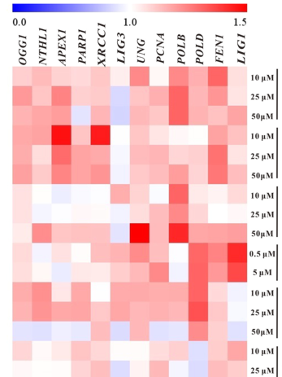

## Question

# Gene Research for Functional Annotation

## ⚠️ CRITICAL: Gene/Protein Identification Context

**BEFORE YOU BEGIN RESEARCH:** You MUST verify you are researching the CORRECT gene/protein. Gene symbols can be ambiguous, especially for less well-characterized genes from non-model organisms.

### Target Gene/Protein Identity (from UniProt):
- **UniProt Accession:** Q6TNU4
- **Protein Description:** RecName: Full=Flap endonuclease 1 {ECO:0000255|HAMAP-Rule:MF_03140}; Short=FEN-1 {ECO:0000255|HAMAP-Rule:MF_03140}; EC=3.1.-.- {ECO:0000255|HAMAP-Rule:MF_03140}; AltName: Full=Flap structure-specific endonuclease 1 {ECO:0000255|HAMAP-Rule:MF_03140};
- **Gene Information:** Name=fen1;
- **Organism (full):** Danio rerio (Zebrafish) (Brachydanio rerio).
- **Protein Family:** Belongs to the XPG/RAD2 endonuclease family. FEN1
- **Key Domains:** 5-3_exonuclease_C_sf. (IPR036279); Flap_endonuc. (IPR023426); HhH2. (IPR008918); PIN-like_dom_sf. (IPR029060); XPG-I_dom. (IPR006086)

### MANDATORY VERIFICATION STEPS:

1. **Check if the gene symbol "fen1" matches the protein description above**
2. **Verify the organism is correct:** Danio rerio (Zebrafish) (Brachydanio rerio).
3. **Check if protein family/domains align with what you find in literature**
4. **If you find literature for a DIFFERENT gene with the same or similar symbol, STOP**

### If Gene Symbol is Ambiguous or You Cannot Find Relevant Literature:

**DO NOT PROCEED WITH RESEARCH ON A DIFFERENT GENE.** Instead:
- State clearly: "The gene symbol 'fen1' is ambiguous or literature is limited for this specific protein"
- Explain what you found (e.g., "Found extensive literature on a different gene with the same symbol in a different organism")
- Describe the protein based ONLY on the UniProt information provided above
- Suggest that the protein function can be inferred from domain/family information

### Research Target:

Please provide a comprehensive research report on the gene **fen1** (gene ID: fen1, UniProt: Q6TNU4) in DANRE.

The research report should be a detailed narrative explaining the function, biological processes, and localization of the gene product. Citations should be given for all claims.

You should prioritize authoritative reviews and primary scientific literature when conducting research. You can supplement
this with annotations you find in gene/protein databases, but these can be outdated or inaccurate.

We are specifically interested in the primary function of the gene - for enzymes, what reaction is catalyzed, and what is the substrate specificity? For transporters, what is the substrate? For structural proteins or adapters, what is the broader structural role? For signaling molecules, what is the role in the pathway.

We are interested in where in or outside the cell the gene product carries out its function.

We are also interested in the signaling or biochemical pathways in which the gene functions. We are less interested in broad pleiotropic effects, except where these elucidate the precise role.

Include evidence where possible. We are interested in both experimental evidence as well as inference from structure, evolution, or bioinformatic analysis. Precise studies should be prioritized over high-throughput, where available.

## Output

Question: You are an expert researcher providing comprehensive, well-cited information.

Provide detailed information focusing on:
1. Key concepts and definitions with current understanding
2. Recent developments and latest research (prioritize 2023-2024 sources)
3. Current applications and real-world implementations
4. Expert opinions and analysis from authoritative sources
5. Relevant statistics and data from recent studies

Format as a comprehensive research report with proper citations. Include URLs and publication dates where available.
Always prioritize recent, authoritative sources and provide specific citations for all major claims.

# Gene Research for Functional Annotation

## ⚠️ CRITICAL: Gene/Protein Identification Context

**BEFORE YOU BEGIN RESEARCH:** You MUST verify you are researching the CORRECT gene/protein. Gene symbols can be ambiguous, especially for less well-characterized genes from non-model organisms.

### Target Gene/Protein Identity (from UniProt):
- **UniProt Accession:** Q6TNU4
- **Protein Description:** RecName: Full=Flap endonuclease 1 {ECO:0000255|HAMAP-Rule:MF_03140}; Short=FEN-1 {ECO:0000255|HAMAP-Rule:MF_03140}; EC=3.1.-.- {ECO:0000255|HAMAP-Rule:MF_03140}; AltName: Full=Flap structure-specific endonuclease 1 {ECO:0000255|HAMAP-Rule:MF_03140};
- **Gene Information:** Name=fen1;
- **Organism (full):** Danio rerio (Zebrafish) (Brachydanio rerio).
- **Protein Family:** Belongs to the XPG/RAD2 endonuclease family. FEN1
- **Key Domains:** 5-3_exonuclease_C_sf. (IPR036279); Flap_endonuc. (IPR023426); HhH2. (IPR008918); PIN-like_dom_sf. (IPR029060); XPG-I_dom. (IPR006086)

### MANDATORY VERIFICATION STEPS:

1. **Check if the gene symbol "fen1" matches the protein description above**
2. **Verify the organism is correct:** Danio rerio (Zebrafish) (Brachydanio rerio).
3. **Check if protein family/domains align with what you find in literature**
4. **If you find literature for a DIFFERENT gene with the same or similar symbol, STOP**

### If Gene Symbol is Ambiguous or You Cannot Find Relevant Literature:

**DO NOT PROCEED WITH RESEARCH ON A DIFFERENT GENE.** Instead:
- State clearly: "The gene symbol 'fen1' is ambiguous or literature is limited for this specific protein"
- Explain what you found (e.g., "Found extensive literature on a different gene with the same symbol in a different organism")
- Describe the protein based ONLY on the UniProt information provided above
- Suggest that the protein function can be inferred from domain/family information

### Research Target:

Please provide a comprehensive research report on the gene **fen1** (gene ID: fen1, UniProt: Q6TNU4) in DANRE.

The research report should be a detailed narrative explaining the function, biological processes, and localization of the gene product. Citations should be given for all claims.

You should prioritize authoritative reviews and primary scientific literature when conducting research. You can supplement
this with annotations you find in gene/protein databases, but these can be outdated or inaccurate.

We are specifically interested in the primary function of the gene - for enzymes, what reaction is catalyzed, and what is the substrate specificity? For transporters, what is the substrate? For structural proteins or adapters, what is the broader structural role? For signaling molecules, what is the role in the pathway.

We are interested in where in or outside the cell the gene product carries out its function.

We are also interested in the signaling or biochemical pathways in which the gene functions. We are less interested in broad pleiotropic effects, except where these elucidate the precise role.

Include evidence where possible. We are interested in both experimental evidence as well as inference from structure, evolution, or bioinformatic analysis. Precise studies should be prioritized over high-throughput, where available.

## Research report: Danio rerio **fen1** (UniProt Q6TNU4) — functional annotation and current evidence

### 1) Target verification (gene/protein identity)
The UniProt target **Q6TNU4** is annotated as **Flap endonuclease 1 (FEN1; flap structure-specific endonuclease 1)** from **Danio rerio**, belonging to the conserved XPG/RAD2 nuclease family; the retrieved literature consistently uses **FEN1/FEN-1** to denote the canonical structure-specific 5′-flap endonuclease central to DNA replication and repair pathways, and zebrafish-specific studies assay **fen1** transcript using zebrafish primers, aligning with this identity (lu2021theoxidativestress pages 2-3).

### 2) Key concepts and definitions (current understanding)

#### 2.1 Structure-specific nuclease and “flap” substrates
FEN1 is a **structure-specific nuclease** that recognizes DNA **flap** and **nicked** structures (not a specific sequence) and hydrolyzes phosphodiester bonds using a **two-metal (Mg2+) catalytic center** typical for this nuclease class (sun2024structurespecificnucleasesin pages 2-3).

#### 2.2 Canonical biochemical activities attributed to FEN1
A key mechanistic framework is that FEN1 is multifunctional, with at least three biochemically distinguishable nuclease activities described in the literature: **flap endonuclease (FEN)**, **5′ exonuclease (EXO)**, and **gap endonuclease (GEN)** (xu2018sumo1modificationof pages 2-3). In cellular DNA metabolism, these activities are primarily discussed in the contexts of (i) lagging-strand replication and (ii) repair synthesis that generates short displaced 5′ flaps (xu2018sumo1modificationof pages 2-3, sun2023okazakifragmentmaturation pages 9-11).

#### 2.3 Pathway context: Okazaki fragment maturation (OFM)
During lagging-strand DNA replication, strand-displacement synthesis produces **short 5′ flaps** that must be removed prior to ligation. An authoritative synthesis of the field describes FEN1 as the **primary endonuclease** that cleaves these short RNA–DNA/DNA flaps to enable Okazaki fragment joining; failure to process flaps blocks ligation and generates toxic intermediates that can trigger backup pathways (sun2023okazakifragmentmaturation pages 9-11).

#### 2.4 Pathway context: long-patch base excision repair (LP-BER)
In LP-BER, repair synthesis can displace a short segment of DNA, creating a **5′ flap** that must be cleaved; FEN1 is repeatedly described as a core LP-BER flap nuclease (krasikova2024doesthexpa–fen1 pages 1-2, xu2018sumo1modificationof pages 2-3).

### 3) Enzymatic function: reaction and substrate specificity
Functionally, FEN1 catalyzes **hydrolytic cleavage of phosphodiester bonds** in **5′-flap** (and related nick/gap) substrates, producing ligatable nicked DNA products in replication and repair intermediates (sun2023flapendonuclease1 pages 3-5, sun2024structurespecificnucleasesin pages 2-3). In the most current structural model for eukaryotic OFM, Okazaki primers are ~**30 nt** (8–12 nt RNA + 10–20 nt DNA), Pol δ generates short flaps typically **~2–10 nt**, and FEN1 removes flap/nick intermediates iteratively in coordination with RNaseH2 and PCNA to complete primer removal and ligation-ready processing (tian2024structuralinsightinto pages 1-2).

### 4) Cellular localization and molecular context

#### 4.1 Nuclear/chromatin association during replication
The most direct mechanistic evidence in the retrieved corpus places FEN1 on **chromatin** through its interaction with the sliding clamp **PCNA**, and through purification of **endogenous PCNA–FEN1** complexes from native chromatin for cryo-EM analysis (tian2024structuralinsightinto pages 1-2). This supports the functional interpretation that FEN1 acts primarily in the **nucleus at replication/repair sites**, rather than as a soluble enzyme.

#### 4.2 Recruitment to sites of DNA damage (DPCs)
Recent DPC-repair work describes FEN1 recruitment to DNA–protein crosslinks (DPCs) as regulated by **PARP1/PARG-dependent ADP-ribosylation**, consistent with localized nuclear recruitment to DNA damage sites (sun2023flapendonuclease1 pages 9-11, saha2024parp1drivenrepairof pages 1-3).

### 5) Pathways and interaction partners (mechanistic integration)

#### 5.1 PCNA “toolbelt” coordination of OFM (major 2024 advance)
A central 2024 development is cryo-EM structural resolution of endogenous **PCNA–FEN1** and **PCNA–FEN1–RNaseH2** complexes, capturing multiple primer-removal states. These structures support a **toolbelt** mechanism in which PCNA can coordinate multiple PIP-box proteins, and show that **product release** from FEN1 is a **rate-limiting step** in the OFM reaction cycle (tian2024structuralinsightinto pages 1-2). Structurally, the complexes were reported at **3.5–3.8 Å resolution**, with FEN1 binding one PCNA protomer via its PIP box/IDCL interactions, and the DNA adopting an L-shaped path through the complex (tian2024structuralinsightinto pages 4-6). In vitro, PCNA is reported to increase FEN1 activity by approximately **~10–50-fold** (tian2024structuralinsightinto pages 1-2).

#### 5.2 RNaseH2 interplay during primer removal
The same 2024 structural work suggests an unrecognized role for RNaseH2 as a dsDNA-binding factor that can promote FEN1 flap cleavage via PCNA-mediated conformational modulation of the DNA substrate, strengthening the model that primer removal is a coordinated multi-enzyme process rather than purely sequential hand-offs (tian2024structuralinsightinto pages 1-2).

#### 5.3 PARP1/PARG axis and FEN1 in DNA–protein crosslink repair (2023–2024)
Two recent studies position FEN1 in PARP-driven DPC-repair pathways.
* A 2023 preprint reports that FEN1 can excise **formaldehyde-induced** DPC-associated flap-like substrates and enzymatic TOP2-DPCs, with recruitment mediated by PARylation; an E285 residue is identified as a major ADP-ribosylation site required for relocalization to DPCs, while PARylation does not measurably change intrinsic flap nuclease activity in vitro (sun2023flapendonuclease1 pages 9-11).
* A 2024 Cell Reports study reports PARP1-driven recruitment of FEN1 to **TOP3A-DPCs**, with pathway choice shaped by crosstalk between PARylation and ubiquitylation (saha2024parp1drivenrepairof pages 1-3).

#### 5.4 Cross-talk with other repair pathways (NER-associated factors)
A 2024 Biomolecules study demonstrates formation of **XPA–FEN1–DNA** ternary complexes on defined flap/gap substrates and reports that XPA can **moderately inhibit** FEN1 activity in vitro, supporting models in which FEN1 may be engaged beyond classical BER/replication, potentially including NER-associated resynthesis steps (krasikova2024doesthexpa–fen1 pages 1-2).

### 6) Zebrafish (Danio rerio) evidence: expression regulation and experimental usage
Direct zebrafish functional genetics (loss-of-function phenotypes of fen1) were not retrieved in the current document set; therefore, the zebrafish-specific annotation here is based on (i) zebrafish transcript-level evidence in toxicology/DDR contexts and (ii) zebrafish as an in vivo platform that has used FEN1-derived engineering.

#### 6.1 Zebrafish larval BER-pathway response: fen1 mRNA induction under oxidative stressors
A zebrafish ecotoxicology study explicitly assays **fen1** among BER genes by qPCR in zebrafish larvae, providing zebrafish-specific assay details including a **fen1 primer** (forward sequence shown in the paper), **amplicon length (138 bp)**, and **PCR efficiency (100%)** (lu2021theoxidativestress pages 2-3). Larvae were exposed from **4 hours post-fertilization (hpf)** to phthalate-related compounds including DBP (0–0.5–5 μM) and MEHP/DEHP (0–10–25–50 μM) across time windows spanning hours to days (lu2021theoxidativestress pages 2-3). The paper’s zebrafish qPCR figures (heatmap and bar plots) show **significant fen1 upregulation** in zebrafish under multiple exposure conditions (lu2021theoxidativestress media 0d94d88c, lu2021theoxidativestress media b881018e, lu2021theoxidativestress media 38921355, lu2021theoxidativestress media 1bd7b56f).

Interpretation for functional annotation: this supports that zebrafish **fen1** is transcriptionally responsive in contexts interpreted by the authors as oxidative stress/DNA damage with BER pathway engagement, consistent with the canonical role of FEN1 in LP-BER and replication-associated repair (lu2021theoxidativestress pages 2-3, xu2018sumo1modificationof pages 2-3).

#### 6.2 Zebrafish in vivo implementation: structure-guided nuclease (SGN) for genome editing
A notable real-world implementation using zebrafish embryos is a 2016 Genome Biology study that engineered a **structure-guided endonuclease (SGN)** composed of **FEN-1** (structure recognition of a flap) fused to the FokI cleavage domain, and demonstrated cleavage of reporter and endogenous loci in **zebrafish embryos** after microinjection into Tg(flk1:eGFP) fish (xu2016analternativenovel pages 1-2). While this work does not establish fen1’s endogenous zebrafish developmental function, it demonstrates that flap-structure recognition by FEN1 can be operationalized as a programmable genome engineering strategy in zebrafish (xu2016analternativenovel pages 1-2).

### 7) Recent developments and “expert view” synthesis (2023–2024 priority)
Three convergent 2023–2024 themes emerge from authoritative reviews and primary research:

1. **OFM as a coordinated, PCNA-organized multi-enzyme process (toolbelt models)**: High-resolution structural snapshots now directly visualize PCNA-bound assemblies of FEN1 (and RNaseH2), strengthening mechanistic models in which PCNA scaffolds OFM and modulates enzyme conformations and DNA geometry (tian2024structuralinsightinto pages 1-2, tian2024structuralinsightinto pages 4-6).

2. **FEN1 beyond canonical OFM/BER: processing DNA–protein crosslinks under PARP control**: Recent studies place FEN1 as a nuclease recruited to diverse DPC lesions by PARylation-dependent scaffolding, suggesting that flap-processing logic can be reused for DPC repair intermediates (sun2023flapendonuclease1 pages 9-11, saha2024parp1drivenrepairof pages 1-3).

3. **Repair-pathway cross-talk and regulation by protein interactions/PTMs**: 2024 work on XPA–FEN1 binding and earlier mechanistic work on modification-driven partner switching (e.g., SUMOylation enabling interaction with checkpoint clamps) reinforce the view that FEN1’s pathway choice is heavily **context- and interaction-dependent** (krasikova2024doesthexpa–fen1 pages 1-2, xu2018sumo1modificationof pages 4-6).

### 8) Statistics and data highlights (recent studies)
* **PCNA stimulation**: PCNA increases FEN1 nuclease activity by ~**10–50×** in vitro (Tian et al., published **Nov 2024**, URL: https://doi.org/10.1038/s44318-024-00296-x) (tian2024structuralinsightinto pages 1-2).
* **Cryo-EM structural resolution**: Endogenous PCNA–FEN1 complexes resolved at **3.5–3.8 Å** (Tian et al., **Nov 2024**) (tian2024structuralinsightinto pages 4-6).
* **OFM intermediate sizes**: Okazaki primers ~**30 nt** total; short flaps typically **~2–10 nt** (Tian et al., **Nov 2024**) (tian2024structuralinsightinto pages 1-2).
* **Zebrafish assay parameters**: fen1 qPCR amplicon **138 bp** with **100% PCR efficiency**; larval exposures include DBP **0/0.5/5 μM** and MEHP/DEHP **0/10/25/50 μM** from **4 hpf** (Lu et al., published **Jan 2021**, URL: https://doi.org/10.1016/j.ecoenv.2020.111525) (lu2021theoxidativestress pages 2-3).
* **Zebrafish fen1 induction**: fen1 is significantly upregulated in zebrafish qPCR panels (asterisk-marked significance in figure panels) following multiple exposure conditions in the same study (lu2021theoxidativestress media 0d94d88c, lu2021theoxidativestress media b881018e, lu2021theoxidativestress media 38921355, lu2021theoxidativestress media 1bd7b56f).

### 9) Practical applications and implementations relevant to fen1/FEN1

#### 9.1 Zebrafish as a DNA repair/BER readout model (environmental DDR)
Zebrafish larvae are used as an in vivo vertebrate system to measure BER pathway gene responses including **fen1** under chemical exposures interpreted as oxidative stressors, enabling integration of developmental outcomes with DNA repair pathway transcriptional activation (lu2021theoxidativestress pages 2-3, lu2021theoxidativestress media 0d94d88c).

#### 9.2 Genome engineering strategy using FEN1’s structure recognition
FEN1’s flap-recognition property has been engineered into a programmable nuclease platform (SGN) that can cleave targets in zebrafish embryos, illustrating translational use of FEN1 biochemistry in a living vertebrate model (Xu et al., published **Sep 2016**, URL: https://doi.org/10.1186/s13059-016-1038-5) (xu2016analternativenovel pages 1-2).

#### 9.3 Cancer/therapy-relevant frameworks (human-centric but mechanistically informative)
Recent reviews frame structure-specific nucleases (including FEN1) as targets for cancer therapy by leveraging their essentiality in replication stress and DNA repair networks, a mechanistic context that can inform zebrafish model design for DNA repair and chemical-genetic interactions (sun2024structurespecificnucleasesin pages 2-3).

### 10) Limitations and evidence gaps specific to Danio rerio fen1
Within the retrieved full-text set, there is **limited direct zebrafish fen1 functional genetics** (e.g., fen1 knockout phenotype, subcellular localization imaging, developmental tissue-specific expression atlases). The strongest zebrafish-specific evidence retrieved is transcript-level association with BER pathway induction under chemical stress and zebrafish usage as an in vivo platform for a FEN1-derived engineered nuclease (lu2021theoxidativestress pages 2-3, xu2016analternativenovel pages 1-2). Accordingly, the **primary functional annotation** for zebrafish fen1 is best supported by **orthology-informed mechanism** (PCNA-coordinated flap processing in OFM and LP-BER) plus zebrafish expression responsiveness in BER-relevant contexts (tian2024structuralinsightinto pages 1-2, xu2018sumo1modificationof pages 2-3, lu2021theoxidativestress pages 2-3).

---

## Summary artifact
The following table consolidates enzymatic activities, substrates, regulators, and recent mechanistic advances relevant for functional annotation.

| FEN1 activity / context | Primary substrate(s) | Key partners / regulators | Representative 2023–2024 mechanistic or structural findings | Quantitative details | Citations |
|---|---|---|---|---|---|
| Flap endonuclease during Okazaki fragment maturation | Short 5′ RNA/DNA flaps generated by Pol δ strand displacement on lagging-strand intermediates | PCNA; RNaseH2 | FEN1 is the primary nuclease for short 5′ flaps in OFM; cryo-EM captured endogenous PCNA–FEN1 and PCNA–FEN1–RNaseH2 assemblies in multiple primer-removal states, supporting the PCNA “toolbelt” model and indicating that RNaseH2 can promote FEN1-mediated flap cleavage through DNA conformational modulation; product release from FEN1 was identified as rate-limiting | PCNA can stimulate FEN1 activity by ~10–50×; Okazaki primers are ~30 nt total (8–12 nt RNA + 10–20 nt DNA); typical displaced short flaps are ~2–10 nt; cryo-EM resolution 3.5–3.8 Å | (tian2024structuralinsightinto pages 1-2, tian2024structuralinsightinto pages 4-6) |
| Structural basis of flap cleavage on PCNA | Nicked/flapped DNA with downstream duplex and 5′ flap | PCNA via PIP-box and IDCL interactions | Structures show one FEN1 bound to one PCNA protomer, with the FEN1 PIP-box inserted into the PCNA hydrophobic pocket; DNA adopts an L-shaped configuration; the cleaved 5′ flap remains transiently bound in an early post-catalytic state, explaining slow product release | One PCNA ring can potentially recruit up to 3 PIP-box proteins; downstream duplex ~12 bp; upstream duplex through the ring 14–19 bp; only ~3 proximal flap nucleotides traceable; catalytic metal-binding residues include E158, E160, D179, D181 | (tian2024structuralinsightinto pages 1-2, tian2024structuralinsightinto pages 4-6) |
| Long-patch base excision repair (LP-BER) flap removal | Short DNA flaps produced during repair resynthesis after damaged-base removal | PCNA; BER machinery | FEN1 is a core LP-BER nuclease that removes repair flaps after strand displacement synthesis; recent reviews continue to place FEN1 as the canonical 5′-flap nuclease linking BER and replication, with a two-metal active center characteristic of structure-specific nucleases | LP-BER flaps described as ~2–20 nt; active site uses 2 Mg2+ ions | (krasikova2024doesthexpa–fen1 pages 1-2, sun2024structurespecificnucleasesin pages 2-3, xu2018sumo1modificationof pages 2-3) |
| 5′ exonuclease proofreading / α-segment error editing | 5′ termini and misincorporated Pol α-generated segments during lagging-strand synthesis | PCNA; mismatch-repair-associated factors | Beyond flap cutting, FEN1’s 5′ exonuclease activity contributes to editing/removal of Pol α errors during Okazaki fragment maturation, helping prevent mutagenesis when nascent lagging strands are processed | No specific 2023–2024 numeric measurement in retrieved text; activity explicitly distinguished from flap endonuclease and gap endonuclease functions | (xu2018sumo1modificationof pages 2-3, sun2023okazakifragmentmaturation pages 9-11) |
| Gap endonuclease / stalled fork & structured DNA processing | Gapped or structured DNA intermediates, including secondary structures at difficult-to-replicate regions | Rad9–Rad1–Hus1; SUMOylation; checkpoint signaling | FEN1’s GEN activity is implicated in processing stalled replication forks and DNA secondary structures; SUMO-1 modification promotes switching from replication-associated partners toward the 9-1-1 clamp to counter replication stress | Qualitative evidence in retrieved sources; no specific 2023–2024 numeric value extracted | (xu2018sumo1modificationof pages 4-6, xu2018sumo1modificationof pages 2-3) |
| Replication-stress response / partner switching | Flap or fork-associated DNA at stalled replication sites | SUMO-1; Rad9–Rad1–Hus1; phosphorylation | DNA damage-induced sequential phosphorylation and SUMO-1 conjugation facilitate FEN1 interaction with HUS1, helping FEN1 act in repair rather than only canonical OFM; SUMO-defective FEN1 mutants are hypersensitive to fork-stalling agents | Triggering agents cited include UV, hydroxyurea, and mitomycin C; no precise fold-change reported in retrieved excerpt | (xu2018sumo1modificationof pages 4-6) |
| DPC repair: formaldehyde and TOP2-linked lesions | DPC-conjugated 5′ flaps, including BER-generated 5′ flaps and TOP2-DPC-associated flap substrates | PARP1; PARG; SPRTN; TDP2 | FEN1 can excise non-enzymatic FA-DPCs and enzymatic TOP2-DPCs from 5′-flap-like structures; PARylation promotes recruitment rather than intrinsic catalytic enhancement, placing FEN1 in a PARP1/PARG-regulated DPC-repair axis parallel to SPRTN | Major PARylation site mapped to E285; nuclease-dead comparator D181A; no intrinsic activity increase detected after PARylation in vitro | (sun2023flapendonuclease1 pages 1-3, sun2023flapendonuclease1 pages 3-5, sun2023flapendonuclease1 pages 9-11) |
| DPC repair: TOP3A-DPC pathway choice | Persistent TOP3A-DPC intermediates | PARP1; ubiquitylation machinery; SPRTN/TDP2 | PARP1-driven PARylation recruits FEN1 to TOP3A-DPCs, while ubiquitylation supports an alternative proteolytic pathway; blocking PARylation reduces FEN1–TOP3A interaction and increases TOP3A-DPC burden, indicating PTM-controlled pathway choice | Persistent TOP3A-DPC model used catalytic mutant R364W; no additional quantitative structural values extracted | (saha2024parp1drivenrepairof pages 1-3) |
| NER-/R-loop-adjacent cross-talk | 5′-flap substrates with repair gaps; R-loop-associated ssDNA | XPA; RPA | FEN1 forms ternary complexes with XPA and DNA, supporting possible roles beyond canonical BER/replication, including post-incision NER resynthesis or other repair processes; XPA moderately inhibits FEN1 catalytic activity in vitro | Tested DNA substrates carried a 31-nt 5′ flap with 3-, 10-, or 26-nt gaps | (krasikova2024doesthexpa–fen1 pages 1-2) |
| Cancer targeting / biomarker relevance | Replication/repair intermediates in stressed or HR-deficient tumor cells | PARP/PARG axis; EXO1; synthetic lethality frameworks | Recent work positions FEN1 as a vulnerability in tumors with defective PAR metabolism or HR deficiency; reviews frame structure-specific nucleases, including FEN1, as therapeutic targets, and PARG-deficient tumor cells show increased dependence on EXO1/FEN1-mediated repair | No single universal effect size given in retrieved excerpt; dependency highlighted in 2024 tumor models | (sun2024structurespecificnucleasesin pages 2-3) |

*Table: This table summarizes the main biochemical activities of FEN1, their substrates, major cofactors/regulators, and recent 2023–2024 mechanistic advances. It is useful for linking classical functional annotation to current structural biology and repair-pathway models.*

References

1. (lu2021theoxidativestress pages 2-3): Chunjiao Lu, Juanjuan Luo, Yao Liu, and Xiaojun Yang. The oxidative stress responses caused by phthalate acid esters increases mrna abundance of base excision repair (ber) genes in vivo and in vitro. Jan 2021. URL: https://doi.org/10.1016/j.ecoenv.2020.111525, doi:10.1016/j.ecoenv.2020.111525. This article has 55 citations and is from a domain leading peer-reviewed journal.

2. (sun2024structurespecificnucleasesin pages 2-3): Haitao Sun, Megan Luo, Mian Zhou, Li Zheng, Hongzhi Li, R Steven Esworthy, and Binghui Shen. Structure-specific nucleases in genome dynamics and strategies for targeting cancers. Journal of Molecular Cell Biology, May 2024. URL: https://doi.org/10.1093/jmcb/mjae019, doi:10.1093/jmcb/mjae019. This article has 4 citations and is from a peer-reviewed journal.

3. (xu2018sumo1modificationof pages 2-3): Xiaoli Xu, Rongyi Shi, Li Zheng, Zhigang Guo, Liangyan Wang, Mian Zhou, Ye Zhao, Bing Tian, Khue Truong, Yuan Chen, Binghui Shen, Yuejin Hua, and Hong Xu. Sumo-1 modification of fen1 facilitates its interaction with rad9–rad1–hus1 to counteract dna replication stress. Journal of Molecular Cell Biology, 10:460-474, Oct 2018. URL: https://doi.org/10.1093/jmcb/mjy047, doi:10.1093/jmcb/mjy047. This article has 23 citations and is from a peer-reviewed journal.

4. (sun2023okazakifragmentmaturation pages 9-11): Haitao Sun, Lingzi Ma, Ya-Fang Tsai, Tharindu Abeywardana, Binghui Shen, and Li Zheng. Okazaki fragment maturation: dna flap dynamics for cell proliferation and survival. Mar 2023. URL: https://doi.org/10.1016/j.tcb.2022.06.014, doi:10.1016/j.tcb.2022.06.014. This article has 63 citations and is from a domain leading peer-reviewed journal.

5. (krasikova2024doesthexpa–fen1 pages 1-2): Yuliya S. Krasikova, Ekaterina A. Maltseva, Svetlana N. Khodyreva, Alexey N. Evdokimov, Nadejda I. Rechkunova, and Olga I. Lavrik. Does the xpa–fen1 interaction concern to nucleotide excision repair or beyond? Biomolecules, 14:814, Jul 2024. URL: https://doi.org/10.3390/biom14070814, doi:10.3390/biom14070814. This article has 1 citations.

6. (sun2023flapendonuclease1 pages 3-5): Yilun Sun, Lisa M. Jenkins, Lara H. El Touny, Ukhyun Jo, Xi Yang, Tapan K. Maity, Liton K. Saha, Isabel Uribe, Sourav Saha, Shunichi Takeda, Anthony K.L. Leung, Ken Cheng, and Yves Pommier. Flap endonuclease 1 repairs dna-protein crosslinks via adp-ribosylation. bioRxiv, Oct 2023. URL: https://doi.org/10.1101/2023.10.19.563118, doi:10.1101/2023.10.19.563118. This article has 3 citations.

7. (tian2024structuralinsightinto pages 1-2): Yuhui Tian, Ningning Li, Qing Li, and Ning Gao. Structural insight into okazaki fragment maturation mediated by pcna-bound fen1 and rnaseh2. The EMBO Journal, 44:484-504, Nov 2024. URL: https://doi.org/10.1038/s44318-024-00296-x, doi:10.1038/s44318-024-00296-x. This article has 12 citations.

8. (sun2023flapendonuclease1 pages 9-11): Yilun Sun, Lisa M. Jenkins, Lara H. El Touny, Ukhyun Jo, Xi Yang, Tapan K. Maity, Liton K. Saha, Isabel Uribe, Sourav Saha, Shunichi Takeda, Anthony K.L. Leung, Ken Cheng, and Yves Pommier. Flap endonuclease 1 repairs dna-protein crosslinks via adp-ribosylation. bioRxiv, Oct 2023. URL: https://doi.org/10.1101/2023.10.19.563118, doi:10.1101/2023.10.19.563118. This article has 3 citations.

9. (saha2024parp1drivenrepairof pages 1-3): Liton Kumar Saha, Yilun Sun, Sourav Saha, Xi Yang, and Yves Pommier. Parp1-driven repair of topoisomerase iiiα dna-protein crosslinks by fen1. Aug 2024. URL: https://doi.org/10.1016/j.celrep.2024.114522, doi:10.1016/j.celrep.2024.114522. This article has 7 citations and is from a highest quality peer-reviewed journal.

10. (tian2024structuralinsightinto pages 4-6): Yuhui Tian, Ningning Li, Qing Li, and Ning Gao. Structural insight into okazaki fragment maturation mediated by pcna-bound fen1 and rnaseh2. The EMBO Journal, 44:484-504, Nov 2024. URL: https://doi.org/10.1038/s44318-024-00296-x, doi:10.1038/s44318-024-00296-x. This article has 12 citations.

11. (lu2021theoxidativestress media 0d94d88c): Chunjiao Lu, Juanjuan Luo, Yao Liu, and Xiaojun Yang. The oxidative stress responses caused by phthalate acid esters increases mrna abundance of base excision repair (ber) genes in vivo and in vitro. Jan 2021. URL: https://doi.org/10.1016/j.ecoenv.2020.111525, doi:10.1016/j.ecoenv.2020.111525. This article has 55 citations and is from a domain leading peer-reviewed journal.

12. (lu2021theoxidativestress media b881018e): Chunjiao Lu, Juanjuan Luo, Yao Liu, and Xiaojun Yang. The oxidative stress responses caused by phthalate acid esters increases mrna abundance of base excision repair (ber) genes in vivo and in vitro. Jan 2021. URL: https://doi.org/10.1016/j.ecoenv.2020.111525, doi:10.1016/j.ecoenv.2020.111525. This article has 55 citations and is from a domain leading peer-reviewed journal.

13. (lu2021theoxidativestress media 38921355): Chunjiao Lu, Juanjuan Luo, Yao Liu, and Xiaojun Yang. The oxidative stress responses caused by phthalate acid esters increases mrna abundance of base excision repair (ber) genes in vivo and in vitro. Jan 2021. URL: https://doi.org/10.1016/j.ecoenv.2020.111525, doi:10.1016/j.ecoenv.2020.111525. This article has 55 citations and is from a domain leading peer-reviewed journal.

14. (lu2021theoxidativestress media 1bd7b56f): Chunjiao Lu, Juanjuan Luo, Yao Liu, and Xiaojun Yang. The oxidative stress responses caused by phthalate acid esters increases mrna abundance of base excision repair (ber) genes in vivo and in vitro. Jan 2021. URL: https://doi.org/10.1016/j.ecoenv.2020.111525, doi:10.1016/j.ecoenv.2020.111525. This article has 55 citations and is from a domain leading peer-reviewed journal.

15. (xu2016analternativenovel pages 1-2): Shu Xu, Shasha Cao, Bingjie Zou, Yunyun Yue, Chun Gu, Xin Chen, Pei Wang, Xiaohua Dong, Zheng Xiang, Kai Li, Minsheng Zhu, Qingshun Zhao, and Guohua Zhou. An alternative novel tool for dna editing without target sequence limitation: the structure-guided nuclease. Genome Biology, Sep 2016. URL: https://doi.org/10.1186/s13059-016-1038-5, doi:10.1186/s13059-016-1038-5. This article has 67 citations and is from a highest quality peer-reviewed journal.

16. (xu2018sumo1modificationof pages 4-6): Xiaoli Xu, Rongyi Shi, Li Zheng, Zhigang Guo, Liangyan Wang, Mian Zhou, Ye Zhao, Bing Tian, Khue Truong, Yuan Chen, Binghui Shen, Yuejin Hua, and Hong Xu. Sumo-1 modification of fen1 facilitates its interaction with rad9–rad1–hus1 to counteract dna replication stress. Journal of Molecular Cell Biology, 10:460-474, Oct 2018. URL: https://doi.org/10.1093/jmcb/mjy047, doi:10.1093/jmcb/mjy047. This article has 23 citations and is from a peer-reviewed journal.

17. (sun2023flapendonuclease1 pages 1-3): Yilun Sun, Lisa M. Jenkins, Lara H. El Touny, Ukhyun Jo, Xi Yang, Tapan K. Maity, Liton K. Saha, Isabel Uribe, Sourav Saha, Shunichi Takeda, Anthony K.L. Leung, Ken Cheng, and Yves Pommier. Flap endonuclease 1 repairs dna-protein crosslinks via adp-ribosylation. bioRxiv, Oct 2023. URL: https://doi.org/10.1101/2023.10.19.563118, doi:10.1101/2023.10.19.563118. This article has 3 citations.

## Artifacts

- [Edison artifact artifact-00](fen1-deep-research-falcon_artifacts/artifact-00.md)

## Citations

1. lu2021theoxidativestress pages 2-3
2. sun2024structurespecificnucleasesin pages 2-3
3. sun2023okazakifragmentmaturation pages 9-11
4. tian2024structuralinsightinto pages 1-2
5. tian2024structuralinsightinto pages 4-6
6. xu2016analternativenovel pages 1-2
7. https://doi.org/10.1038/s44318-024-00296-x
8. https://doi.org/10.1016/j.ecoenv.2020.111525
9. https://doi.org/10.1186/s13059-016-1038-5
10. https://doi.org/10.1016/j.ecoenv.2020.111525,
11. https://doi.org/10.1093/jmcb/mjae019,
12. https://doi.org/10.1093/jmcb/mjy047,
13. https://doi.org/10.1016/j.tcb.2022.06.014,
14. https://doi.org/10.3390/biom14070814,
15. https://doi.org/10.1101/2023.10.19.563118,
16. https://doi.org/10.1038/s44318-024-00296-x,
17. https://doi.org/10.1016/j.celrep.2024.114522,
18. https://doi.org/10.1186/s13059-016-1038-5,