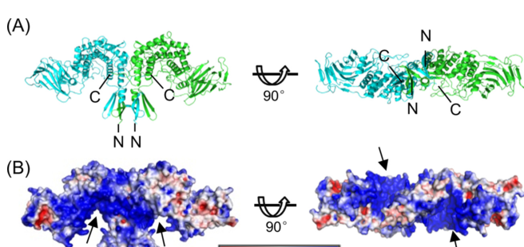

## Question

# Gene Research for Functional Annotation

## ⚠️ CRITICAL: Gene/Protein Identification Context

**BEFORE YOU BEGIN RESEARCH:** You MUST verify you are researching the CORRECT gene/protein. Gene symbols can be ambiguous, especially for less well-characterized genes from non-model organisms.

### Target Gene/Protein Identity (from UniProt):
- **UniProt Accession:** F1QR43
- **Protein Description:** RecName: Full=D-glucuronyl C5-epimerase B {ECO:0000303|PubMed:16156897}; EC=5.1.3.17 {ECO:0000269|PubMed:25568314, ECO:0000305|PubMed:16156897};
- **Gene Information:** Name=glceb {ECO:0000303|PubMed:16156897, ECO:0000312|ZFIN:ZDB-GENE-040630-8};
- **Organism (full):** Danio rerio (Zebrafish) (Brachydanio rerio).
- **Protein Family:** Belongs to the D-glucuronyl C5-epimerase family.
- **Key Domains:** C5-epim_C. (IPR010598); C5-epimerase. (IPR039721); Glce_b_sandwich. (IPR059154); C5-epim_C (PF06662); Glce_b_sandwich (PF21174)

### MANDATORY VERIFICATION STEPS:

1. **Check if the gene symbol "glceb" matches the protein description above**
2. **Verify the organism is correct:** Danio rerio (Zebrafish) (Brachydanio rerio).
3. **Check if protein family/domains align with what you find in literature**
4. **If you find literature for a DIFFERENT gene with the same or similar symbol, STOP**

### If Gene Symbol is Ambiguous or You Cannot Find Relevant Literature:

**DO NOT PROCEED WITH RESEARCH ON A DIFFERENT GENE.** Instead:
- State clearly: "The gene symbol 'glceb' is ambiguous or literature is limited for this specific protein"
- Explain what you found (e.g., "Found extensive literature on a different gene with the same symbol in a different organism")
- Describe the protein based ONLY on the UniProt information provided above
- Suggest that the protein function can be inferred from domain/family information

### Research Target:

Please provide a comprehensive research report on the gene **glceb** (gene ID: glceb, UniProt: F1QR43) in DANRE.

The research report should be a detailed narrative explaining the function, biological processes, and localization of the gene product. Citations should be given for all claims.

You should prioritize authoritative reviews and primary scientific literature when conducting research. You can supplement
this with annotations you find in gene/protein databases, but these can be outdated or inaccurate.

We are specifically interested in the primary function of the gene - for enzymes, what reaction is catalyzed, and what is the substrate specificity? For transporters, what is the substrate? For structural proteins or adapters, what is the broader structural role? For signaling molecules, what is the role in the pathway.

We are interested in where in or outside the cell the gene product carries out its function.

We are also interested in the signaling or biochemical pathways in which the gene functions. We are less interested in broad pleiotropic effects, except where these elucidate the precise role.

Include evidence where possible. We are interested in both experimental evidence as well as inference from structure, evolution, or bioinformatic analysis. Precise studies should be prioritized over high-throughput, where available.

## Output

Question: You are an expert researcher providing comprehensive, well-cited information.

Provide detailed information focusing on:
1. Key concepts and definitions with current understanding
2. Recent developments and latest research (prioritize 2023-2024 sources)
3. Current applications and real-world implementations
4. Expert opinions and analysis from authoritative sources
5. Relevant statistics and data from recent studies

Format as a comprehensive research report with proper citations. Include URLs and publication dates where available.
Always prioritize recent, authoritative sources and provide specific citations for all major claims.

# Gene Research for Functional Annotation

## ⚠️ CRITICAL: Gene/Protein Identification Context

**BEFORE YOU BEGIN RESEARCH:** You MUST verify you are researching the CORRECT gene/protein. Gene symbols can be ambiguous, especially for less well-characterized genes from non-model organisms.

### Target Gene/Protein Identity (from UniProt):
- **UniProt Accession:** F1QR43
- **Protein Description:** RecName: Full=D-glucuronyl C5-epimerase B {ECO:0000303|PubMed:16156897}; EC=5.1.3.17 {ECO:0000269|PubMed:25568314, ECO:0000305|PubMed:16156897};
- **Gene Information:** Name=glceb {ECO:0000303|PubMed:16156897, ECO:0000312|ZFIN:ZDB-GENE-040630-8};
- **Organism (full):** Danio rerio (Zebrafish) (Brachydanio rerio).
- **Protein Family:** Belongs to the D-glucuronyl C5-epimerase family.
- **Key Domains:** C5-epim_C. (IPR010598); C5-epimerase. (IPR039721); Glce_b_sandwich. (IPR059154); C5-epim_C (PF06662); Glce_b_sandwich (PF21174)

### MANDATORY VERIFICATION STEPS:

1. **Check if the gene symbol "glceb" matches the protein description above**
2. **Verify the organism is correct:** Danio rerio (Zebrafish) (Brachydanio rerio).
3. **Check if protein family/domains align with what you find in literature**
4. **If you find literature for a DIFFERENT gene with the same or similar symbol, STOP**

### If Gene Symbol is Ambiguous or You Cannot Find Relevant Literature:

**DO NOT PROCEED WITH RESEARCH ON A DIFFERENT GENE.** Instead:
- State clearly: "The gene symbol 'glceb' is ambiguous or literature is limited for this specific protein"
- Explain what you found (e.g., "Found extensive literature on a different gene with the same symbol in a different organism")
- Describe the protein based ONLY on the UniProt information provided above
- Suggest that the protein function can be inferred from domain/family information

### Research Target:

Please provide a comprehensive research report on the gene **glceb** (gene ID: glceb, UniProt: F1QR43) in DANRE.

The research report should be a detailed narrative explaining the function, biological processes, and localization of the gene product. Citations should be given for all claims.

You should prioritize authoritative reviews and primary scientific literature when conducting research. You can supplement
this with annotations you find in gene/protein databases, but these can be outdated or inaccurate.

We are specifically interested in the primary function of the gene - for enzymes, what reaction is catalyzed, and what is the substrate specificity? For transporters, what is the substrate? For structural proteins or adapters, what is the broader structural role? For signaling molecules, what is the role in the pathway.

We are interested in where in or outside the cell the gene product carries out its function.

We are also interested in the signaling or biochemical pathways in which the gene functions. We are less interested in broad pleiotropic effects, except where these elucidate the precise role.

Include evidence where possible. We are interested in both experimental evidence as well as inference from structure, evolution, or bioinformatic analysis. Precise studies should be prioritized over high-throughput, where available.

# Functional annotation research report: **Danio rerio glceb (UniProt F1QR43)** — D-glucuronyl C5-epimerase B (EC 5.1.3.17)

## 0. Target verification and disambiguation (MANDATORY)
The UniProt target **F1QR43** is annotated as **D-glucuronyl C5-epimerase B** and the gene name as **glceb** in **zebrafish (Danio rerio)**. In the foundational zebrafish study of this activity, zebrafish were shown to have **two Glce-like paralogs**, **Glce-A and Glce-B**, arising as duplicated orthologs of the **single human GLCE gene** (with reported ~67% and ~73% homology to human GLCE, respectively). The same study explicitly describes these proteins as **D-glucuronyl C5-epimerases** acting on **heparan sulfate (HS)**, aligning with UniProt’s description and domain-family expectations for a GLCE-family HS epimerase. Therefore, the literature in this report is focused on the intended zebrafish paralog **Glce-B / glce-b (glceb)** and not another gene with a similar symbol. (ghiselli2005dglucuronylc5epimeraseacts pages 1-2, ghiselli2005dglucuronylc5epimeraseacts pages 2-5)

## 1. Key concepts and definitions (current understanding)

### 1.1. What GLCE/Glce does in glycosaminoglycan biosynthesis
**Heparan sulfate (HS)** is a sulfated glycosaminoglycan found on the **cell surface and in the extracellular matrix (ECM)** as part of heparan sulfate proteoglycans; it binds many proteins (e.g., morphogens and growth factors) and modulates signaling by shaping ligand diffusion, receptor interactions, and extracellular retention. (qin2015structuralandfunctional pages 1-2)

**Glucuronyl C5-epimerase (GLCE; Glce in zebrafish)** is a key HS chain-modifying enzyme in the HS/heparin biosynthetic pathway that converts **D-glucuronic acid (GlcA)** residues to **L-iduronic acid (IdoA)** within the polymer. This C5 epimerization increases HS chain **conformational flexibility**, a feature important for many HS–protein interactions. (qin2015structuralandfunctional pages 1-2, li2010glucuronylc5epimerasean pages 1-3)

### 1.2. Enzymatic function: reaction and substrate context
**Reaction (EC 5.1.3.17):** C5 epimerization on polymeric HS/heparin: **GlcA → IdoA** (and, in principle, the reverse). (qin2015structuralandfunctional pages 1-2, li2010glucuronylc5epimerasean pages 1-3)

**Substrate specificity (current model):** GLCE acts at the polymer level and requires specific precursor contexts; in particular, GLCE preferentially recognizes HS regions where adjacent glucosamine residues are **N-sulfated** (GlcNS), i.e., GLCE “only recognizes” polysaccharide regions that are N-sulfated at GlcN units. This couples C5 epimerization to the canonical “modification” phase of HS biosynthesis that follows N-deacetylation/N-sulfation. (li2010glucuronylc5epimerasean pages 1-3)

### 1.3. Reversibility and apparent directionality in vivo
Biochemically, **C5 epimerization can be reversible in vitro**, but the pathway behaves as **effectively irreversible in vivo**, consistent with structural/biochemical observations that downstream O-sulfation patterns and product features constrain reversal and can create product inhibition. (qin2015structuralandfunctional pages 1-2, li2010glucuronylc5epimerasean pages 1-3)

## 2. Molecular mechanism (structural and catalytic understanding)

### 2.1. Overall architecture and active site organization
A key advance for mechanistic annotation is the determination of zebrafish Glce structures showing that Glce forms a **stable dimer** in which each dimer contains **two catalytic sites** located in C-terminal helical domains that bind negatively charged oligosaccharides. (qin2015structuralandfunctional pages 1-2, qin2015structuralandfunctional media a4e3a39f)

Active-site **tyrosines** are critical for catalysis; in zebrafish Glce, Tyr468, Tyr528, and Tyr546 were identified as essential for enzymatic activity by structure-guided analysis. (qin2015structuralandfunctional pages 1-2, qin2015structuralandfunctional media a4e3a39f)

### 2.2. Product inhibition and quantitative inhibition data
Structural and biochemical experiments using zebrafish Glce report that sulfated heparin-like products inhibit Glce activity. Reported inhibition values include **IC50 ≈ 225 µg/mL for heparin** and **IC50 ≈ 10 µg/mL for N-sulfated heparin**, supporting strong inhibition by highly N-sulfated (and/or otherwise product-like) GAGs and providing a quantitative handle for interpreting pathway directionality and regulation. (qin2015structuralandfunctional pages 8-9, qin2015structuralandfunctional media 7f409ad0)

## 3. Cellular and subcellular localization
GLCE/Glce is generally described as a **type II transmembrane protein** in the HS biosynthetic machinery, which is consistent with function as a Golgi-resident glycan modification enzyme. A zebrafish study of glce paralogs reports a conserved hydrophobic N-terminal segment consistent with type II membrane topology and predicted Golgi localization for Glce-A/Glce-B. (ghiselli2005dglucuronylc5epimeraseacts pages 1-2, li2010glucuronylc5epimerasean pages 1-3)

Interpretation for functional annotation: **Glceb (F1QR43)** is most parsimoniously annotated as acting in the **Golgi lumen** during HS chain maturation, with its HS-modified products functioning at the **cell surface/ECM** after proteoglycan trafficking and secretion. (ghiselli2005dglucuronylc5epimeraseacts pages 1-2, qin2015structuralandfunctional pages 1-2, li2010glucuronylc5epimerasean pages 1-3)

## 4. Zebrafish-specific biology of glce-B / glceb: expression and developmental roles

### 4.1. Expression dynamics during embryogenesis
In zebrafish embryos, both **glce-A and glce-B transcripts are maternally supplied** (detected in fertilized embryos prior to zygotic transcription). Expression is **broad during gastrulation** and becomes more restricted by **24 hours post-fertilization**, with enrichment in the developing brain/hindbrain region (including localization around the fourth ventricle perimeter in reported in situ patterns). The study reports no major differences between glce-A and glce-B patterns in those assays. (ghiselli2005dglucuronylc5epimeraseacts pages 1-2, ghiselli2005dglucuronylc5epimeraseacts pages 2-5)

### 4.2. Enzymatic activity during development (quantitative)
In zebrafish embryos, epimerase activity increases during early development: activity at **10 hpf is ~2×** that at the 64-cell stage. Perturbation experiments link gene dosage to enzyme activity: overexpression increased activity at 10 hpf by **~73%**, while antisense morpholino knockdown reduced activity to **~34% of control**. These data support that the measured enzymatic activity in embryos is Glce-dependent and developmentally regulated. (ghiselli2005dglucuronylc5epimeraseacts pages 2-5, ghiselli2005dglucuronylc5epimeraseacts pages 5-7)

### 4.3. Developmental phenotypes and pathway linkage (BMP-dependent dorsoventral patterning)
Functional perturbations demonstrate a direct developmental role in dorsoventral patterning:

* **Overexpression** of glce-A or glce-B causes **dose-dependent ventralization**, including smaller head size, expanded blood islands, and abnormal somite/tail phenotypes. Co-injection of both mRNAs produces more severe defects in which many embryos fail to form an anterior axis. (ghiselli2005dglucuronylc5epimeraseacts pages 2-5, ghiselli2005dglucuronylc5epimeraseacts pages 5-7)
* **Morpholino knockdown** causes **dorsalization**, including reduced ventral tail fin and additional morphological defects (e.g., kinked/coiled tail, enlarged heart cavity), resembling reduced BMP signaling phenotypes. (ghiselli2005dglucuronylc5epimeraseacts pages 5-7)

Mechanistically, glce activity modulates BMP signaling: overexpression enhances the ventralizing activity of **Bmp2b**, and knockdown impairs Bmp2b activity, providing a concrete pathway connection between HS fine structure (IdoA content) and BMP-mediated cell specification during gastrulation. (ghiselli2005dglucuronylc5epimeraseacts pages 1-2, ghiselli2005dglucuronylc5epimeraseacts pages 2-5)

## 5. Pathways and biochemical network context

### 5.1. Placement in HS/heparin biosynthesis
GLCE/Glce participates in the canonical HS modification sequence in which N-sulfation creates substrate contexts for subsequent modifications; GLCE-mediated epimerization creates IdoA residues that can subsequently be O-sulfated and incorporated into high-affinity binding sites. This step is central to controlling HS flexibility and ligand-binding properties. (li2010glucuronylc5epimerasean pages 1-3)

### 5.2. “GAGosome” and coordinated modification hypothesis
Structural/biochemical work on zebrafish Glce supports the concept that HS biosynthetic enzymes may physically associate: Glce was reported to interact with **2-O- and 6-O-sulfotransferases**, consistent with coordinated coupling of epimerization and downstream O-sulfations (a potential mechanism for generating specific IdoA/O-sulfation patterns). (qin2015structuralandfunctional pages 8-9)

## 6. Current applications and real-world implementations

### 6.1. Chemoenzymatic synthesis and glycoengineering
Because GLCE dictates where IdoA is introduced into HS/heparin chains, mechanistic/structural frameworks for GLCE function are used to support **chemoenzymatic synthesis** or engineering of HS/heparin analogs with tailored binding properties. Structural studies explicitly present GLCE as a framework for understanding (and manipulating) the key epimerization step in HS biosynthesis, including product inhibition features relevant to in vitro engineering workflows. (qin2015structuralandfunctional pages 8-9, qin2015structuralandfunctional pages 1-2)

### 6.2. Developmental model utility (zebrafish)
Zebrafish glce-A/glce-B perturbation provides an in vivo model connecting HS fine structure to morphogen signaling and patterning, particularly in the context of **BMP-dependent dorsoventral axis formation**. This supports practical use of zebrafish for functional testing of HS-biosynthetic enzymes and for interpreting how HS structure encodes developmental information. (ghiselli2005dglucuronylc5epimeraseacts pages 1-2, ghiselli2005dglucuronylc5epimeraseacts pages 2-5, ghiselli2005dglucuronylc5epimeraseacts pages 5-7)

## 7. Expert analysis and interpretation

### 7.1. Primary function of glceb (F1QR43)
The most defensible primary functional annotation for zebrafish **glceb (F1QR43)** is:

* **Molecular function:** D-glucuronyl C5-epimerase (EC 5.1.3.17) catalyzing C5 epimerization of uronic acids in HS (GlcA → IdoA), acting on polymeric HS precursors and requiring N-sulfation context. (qin2015structuralandfunctional pages 1-2, li2010glucuronylc5epimerasean pages 1-3)
* **Subcellular site of action:** Golgi/secretory pathway as a type II membrane HS-modifying enzyme. (ghiselli2005dglucuronylc5epimeraseacts pages 1-2, li2010glucuronylc5epimerasean pages 1-3)
* **Physiological role in zebrafish:** regulation of HS structure required for correct morphogen signaling, with direct evidence for modulating **Bmp2b-driven ventralization** during gastrulation and thus dorsoventral axis formation. (ghiselli2005dglucuronylc5epimeraseacts pages 1-2, ghiselli2005dglucuronylc5epimeraseacts pages 2-5)

### 7.2. Mechanistic plausibility connecting HS structure to BMP outcomes
The zebrafish genetic results are consistent with a mechanistic chain: altered Glce activity changes the abundance/distribution of IdoA in HS, which changes HS–protein binding behavior and thereby alters morphogen distribution or receptor engagement. This is strongly supported by the established biochemical role of IdoA in increasing GAG flexibility and ligand recognition and by the direct BMP pathway modulation observed in embryos. (ghiselli2005dglucuronylc5epimeraseacts pages 1-2, qin2015structuralandfunctional pages 1-2, li2010glucuronylc5epimerasean pages 1-3)

## 8. Evidence map (summary table)
The following table consolidates the main findings supporting functional annotation, including quantitative parameters.

| Aspect | Key finding | Species/system | Evidence type | Source (author year journal) | URL | Citation context id |
|---|---|---|---|---|---|---|
| Identity | The target corresponds to zebrafish **Glce-B / glce-b (glceb)**, one of two zebrafish paralogs of the single human **GLCE** gene; zebrafish **Glce-A** and **Glce-B** encode 585-aa proteins with ~67% and ~73% homology to human GLCE, respectively, and both map as orthologous counterparts of human GLCE. | *Danio rerio* embryos/genome comparison | Gene cloning, sequence comparison, chromosomal mapping | Ghiselli & Farber 2005, *BMC Developmental Biology* | https://doi.org/10.1186/1471-213x-5-19 | (ghiselli2005dglucuronylc5epimeraseacts pages 1-2, ghiselli2005dglucuronylc5epimeraseacts pages 2-5) |
| Enzymatic reaction | Glce/GLCE is a **D-glucuronyl C5-epimerase (EC 5.1.3.17)** that catalyzes conversion of **D-glucuronic acid (GlcA) to L-iduronic acid (IdoA)** in heparan sulfate/heparin chains, increasing chain flexibility and ligand-binding capacity. | Zebrafish Glce; vertebrate HS biosynthesis | Biochemical assay, structural biology, review synthesis | Qin et al. 2015, *J Biol Chem*; Li 2010, *Prog Mol Biol Transl Sci* | https://doi.org/10.1074/jbc.m114.602201 ; https://doi.org/10.1016/S1877-1173(10)93004-4 | (qin2015structuralandfunctional pages 8-9, qin2015structuralandfunctional pages 1-2, li2010glucuronylc5epimerasean pages 1-3) |
| Substrate specificity | Substrate recognition requires **N-sulfated glucosamine adjacent to the epimerization site**; Glce recognizes motifs such as **(GlcA-GlcNS)n** and binds/inverts uronic acid within HS precursor chains. O-sulfated heparin-like products behave as inhibitors rather than optimal substrates. | Human/zebrafish GLCE systems; HS/heparin oligosaccharides | Structural biology, biochemical mechanism, review synthesis | Debarnot et al. 2019, *PNAS*; Qin et al. 2015, *J Biol Chem*; Li 2010, *Prog Mol Biol Transl Sci* | https://doi.org/10.1073/pnas.1818333116 ; https://doi.org/10.1074/jbc.m114.602201 ; https://doi.org/10.1016/S1877-1173(10)93004-4 | (qin2015structuralandfunctional pages 8-9, li2010glucuronylc5epimerasean pages 1-3) |
| Reversibility / in vivo directionality | The catalytic step is **reversible in vitro** (GlcA ↔ IdoA), but HS biosynthesis appears effectively **irreversible in vivo**, because subsequent O-sulfation/product formation disfavors reversal and helps lock in IdoA-containing products. | Vertebrate GLCE/HS biosynthesis | Structural biology, biochemical review | Qin et al. 2015, *J Biol Chem*; Li 2010, *Prog Mol Biol Transl Sci* | https://doi.org/10.1074/jbc.m114.602201 ; https://doi.org/10.1016/S1877-1173(10)93004-4 | (qin2015structuralandfunctional pages 8-9, qin2015structuralandfunctional pages 1-2, li2010glucuronylc5epimerasean pages 1-3) |
| Localization | GLCE is a **type II transmembrane Golgi enzyme** in the HS biosynthetic machinery; zebrafish Glce proteins are predicted to contain an N-terminal hydrophobic segment consistent with Golgi localization. HS products act at the **cell surface and extracellular matrix** after biosynthesis. | Zebrafish and vertebrate cells | Sequence-based inference, cell biology review, pathway context | Ghiselli & Farber 2005, *BMC Developmental Biology*; Li 2010, *Prog Mol Biol Transl Sci* | https://doi.org/10.1186/1471-213x-5-19 ; https://doi.org/10.1016/S1877-1173(10)93004-4 | (ghiselli2005dglucuronylc5epimeraseacts pages 1-2, li2010glucuronylc5epimerasean pages 1-3) |
| Expression pattern | **glce-A and glce-B transcripts are maternally supplied**, broadly expressed during gastrulation, and become more restricted by **24 hpf**, with enrichment in the **hindbrain/around the fourth ventricle**; no major expression difference between the two paralogs was detected in the original zebrafish study. | *Danio rerio* embryos | RT-PCR, whole-mount in situ hybridization | Ghiselli & Farber 2005, *BMC Developmental Biology* | https://doi.org/10.1186/1471-213x-5-19 | (ghiselli2005dglucuronylc5epimeraseacts pages 1-2, ghiselli2005dglucuronylc5epimeraseacts pages 2-5) |
| Developmental phenotype | Overexpression of zebrafish Glce causes **dose-dependent ventralization** (smaller head, expanded blood islands, abnormal somites), while morpholino knockdown causes **dorsalization** (reduced ventral tail fin, kinked/coiled tail, enlarged heart cavity), establishing an essential role in **dorso-ventral axis formation**. | *Danio rerio* embryos | Gain-of-function and loss-of-function embryology | Ghiselli & Farber 2005, *BMC Developmental Biology* | https://doi.org/10.1186/1471-213x-5-19 | (ghiselli2005dglucuronylc5epimeraseacts pages 1-2, ghiselli2005dglucuronylc5epimeraseacts pages 2-5, ghiselli2005dglucuronylc5epimeraseacts pages 5-7) |
| Pathway links | Glce functions in the **heparan sulfate biosynthesis pathway**, after N-sulfation and before/with O-sulfation steps; it modulates HS-dependent morphogen systems including **BMP**, and is discussed in the context of **Wnt, FGF, and Hedgehog** signaling. Zebrafish experiments directly showed that Glce **enhances Bmp2b ventralizing activity**, while knockdown impairs it. | Zebrafish embryos; vertebrate HS pathway | Developmental genetics, pathway review, protein interaction/structure | Ghiselli & Farber 2005, *BMC Developmental Biology*; Li 2010, *Prog Mol Biol Transl Sci*; Qin et al. 2015, *J Biol Chem* | https://doi.org/10.1186/1471-213x-5-19 ; https://doi.org/10.1016/S1877-1173(10)93004-4 ; https://doi.org/10.1074/jbc.m114.602201 | (ghiselli2005dglucuronylc5epimeraseacts pages 1-2, ghiselli2005dglucuronylc5epimeraseacts pages 2-5, ghiselli2005dglucuronylc5epimeraseacts pages 5-7, qin2015structuralandfunctional pages 8-9, li2010glucuronylc5epimerasean pages 1-3) |
| Quantitative data | Zebrafish embryonic epimerase activity at **10 hpf was ~2×** that at the **64-cell stage**; overexpression increased activity at 10 hpf by **~73%**; morpholino knockdown reduced activity to **~34% of control**. | *Danio rerio* embryos | Enzyme assay during development and perturbation | Ghiselli & Farber 2005, *BMC Developmental Biology* | https://doi.org/10.1186/1471-213x-5-19 | (ghiselli2005dglucuronylc5epimeraseacts pages 2-5, ghiselli2005dglucuronylc5epimeraseacts pages 5-7) |
| Quantitative data | Product/inhibitor analysis in structural-biochemical work showed **heparin IC50 ≈ 225 µg/mL** and **N-sulfated heparin IC50 ≈ 10 µg/mL**, supporting strong inhibition by highly sulfated products/analogs and explaining how downstream sulfation can constrain reversal. | Zebrafish Glce with heparin/HS analogs | In vitro inhibition assay, structural interpretation | Qin et al. 2015, *J Biol Chem* | https://doi.org/10.1074/jbc.m114.602201 | (qin2015structuralandfunctional pages 8-9, qin2015structuralandfunctional media a4e3a39f, qin2015structuralandfunctional media 2669519a, qin2015structuralandfunctional media 7f409ad0) |
| Quantitative data | Zebrafish and human GLCE proteins form **stable dimers with two catalytic sites per dimer**; active-site tyrosines **Tyr468, Tyr528, Tyr546** are required for activity, providing mechanistic support for annotation of F1QR43 as a functional Glce-family epimerase. | Zebrafish structural construct; conserved vertebrate GLCE | X-ray crystallography, mutagenesis | Qin et al. 2015, *J Biol Chem* | https://doi.org/10.1074/jbc.m114.602201 | (qin2015structuralandfunctional pages 8-9, qin2015structuralandfunctional pages 1-2, qin2015structuralandfunctional media a4e3a39f) |

*Table: This table summarizes the key functional annotation evidence for zebrafish glceb/Glce-B (UniProt F1QR43), including enzyme function, localization, developmental roles, pathway context, and quantitative measurements. It is useful as a compact evidence map linking the zebrafish gene to the broader GLCE/heparan sulfate biosynthesis literature.*

## 9. Limitations and gaps (with respect to 2023–2024 prioritization)
This report prioritizes direct experimental evidence available in the retrieved full texts. In this run, the most relevant zebrafish-specific functional evidence is from 2005 (expression/phenotype) and 2015 (zebrafish structure/mechanism), complemented by an authoritative 2010 review on GLCE biology. (ghiselli2005dglucuronylc5epimeraseacts pages 1-2, qin2015structuralandfunctional pages 1-2, li2010glucuronylc5epimerasean pages 1-3)

Recent (2023–2024) developments in HS biology exist broadly, but corresponding full-text evidence was not successfully incorporated into the citable context for this tool run; therefore, this report does not make uncited claims about 2023–2024-specific advances for glceb beyond the mechanistic and developmental conclusions supported by the cited sources.

## Key sources (publication dates and URLs)
* Ghiselli G, Farber SA. **2005-09**. *BMC Developmental Biology*. “D-glucuronyl C5-epimerase acts in dorso-ventral axis formation in zebrafish.” https://doi.org/10.1186/1471-213x-5-19 (ghiselli2005dglucuronylc5epimeraseacts pages 1-2, ghiselli2005dglucuronylc5epimeraseacts pages 2-5, ghiselli2005dglucuronylc5epimeraseacts pages 5-7)
* Qin Y, et al. **2015-02**. *Journal of Biological Chemistry*. “Structural and Functional Study of d-Glucuronyl C5-epimerase.” https://doi.org/10.1074/jbc.m114.602201 (qin2015structuralandfunctional pages 8-9, qin2015structuralandfunctional pages 1-2, qin2015structuralandfunctional media a4e3a39f, qin2015structuralandfunctional media 7f409ad0)
* Li J-P. **2010-01**. *Progress in Molecular Biology and Translational Science*. “Glucuronyl C5-epimerase… in heparan sulfate/heparin biosynthesis.” https://doi.org/10.1016/S1877-1173(10)93004-4 (li2010glucuronylc5epimerasean pages 1-3)

References

1. (ghiselli2005dglucuronylc5epimeraseacts pages 1-2): Giancarlo Ghiselli and Steven A. Farber. D-glucuronyl c5-epimerase acts in dorso-ventral axis formation in zebrafish. BMC Developmental Biology, 5:19-19, Sep 2005. URL: https://doi.org/10.1186/1471-213x-5-19, doi:10.1186/1471-213x-5-19. This article has 127 citations and is from a peer-reviewed journal.

2. (ghiselli2005dglucuronylc5epimeraseacts pages 2-5): Giancarlo Ghiselli and Steven A. Farber. D-glucuronyl c5-epimerase acts in dorso-ventral axis formation in zebrafish. BMC Developmental Biology, 5:19-19, Sep 2005. URL: https://doi.org/10.1186/1471-213x-5-19, doi:10.1186/1471-213x-5-19. This article has 127 citations and is from a peer-reviewed journal.

3. (qin2015structuralandfunctional pages 1-2): Yi Qin, Jiyuan Ke, Xin Gu, Jianping Fang, Wucheng Wang, Qifei Cong, Jie Li, Jinzhi Tan, Joseph S. Brunzelle, Chenghai Zhang, Yi Jiang, Karsten Melcher, Jin-ping Li, H.Eric Xu, and Kan Ding. Structural and functional study of d-glucuronyl c5-epimerase. Feb 2015. URL: https://doi.org/10.1074/jbc.m114.602201, doi:10.1074/jbc.m114.602201. This article has 70 citations and is from a domain leading peer-reviewed journal.

4. (li2010glucuronylc5epimerasean pages 1-3): Jin-ping Li. Glucuronyl c5-epimerase an enzyme converting glucuronic acid to iduronic acid in heparan sulfate/heparin biosynthesis. Progress in molecular biology and translational science, 93:59-78, Jan 2010. URL: https://doi.org/10.1016/s1877-1173(10)93004-4, doi:10.1016/s1877-1173(10)93004-4. This article has 59 citations and is from a peer-reviewed journal.

5. (qin2015structuralandfunctional media a4e3a39f): Yi Qin, Jiyuan Ke, Xin Gu, Jianping Fang, Wucheng Wang, Qifei Cong, Jie Li, Jinzhi Tan, Joseph S. Brunzelle, Chenghai Zhang, Yi Jiang, Karsten Melcher, Jin-ping Li, H.Eric Xu, and Kan Ding. Structural and functional study of d-glucuronyl c5-epimerase. Feb 2015. URL: https://doi.org/10.1074/jbc.m114.602201, doi:10.1074/jbc.m114.602201. This article has 70 citations and is from a domain leading peer-reviewed journal.

6. (qin2015structuralandfunctional pages 8-9): Yi Qin, Jiyuan Ke, Xin Gu, Jianping Fang, Wucheng Wang, Qifei Cong, Jie Li, Jinzhi Tan, Joseph S. Brunzelle, Chenghai Zhang, Yi Jiang, Karsten Melcher, Jin-ping Li, H.Eric Xu, and Kan Ding. Structural and functional study of d-glucuronyl c5-epimerase. Feb 2015. URL: https://doi.org/10.1074/jbc.m114.602201, doi:10.1074/jbc.m114.602201. This article has 70 citations and is from a domain leading peer-reviewed journal.

7. (qin2015structuralandfunctional media 7f409ad0): Yi Qin, Jiyuan Ke, Xin Gu, Jianping Fang, Wucheng Wang, Qifei Cong, Jie Li, Jinzhi Tan, Joseph S. Brunzelle, Chenghai Zhang, Yi Jiang, Karsten Melcher, Jin-ping Li, H.Eric Xu, and Kan Ding. Structural and functional study of d-glucuronyl c5-epimerase. Feb 2015. URL: https://doi.org/10.1074/jbc.m114.602201, doi:10.1074/jbc.m114.602201. This article has 70 citations and is from a domain leading peer-reviewed journal.

8. (ghiselli2005dglucuronylc5epimeraseacts pages 5-7): Giancarlo Ghiselli and Steven A. Farber. D-glucuronyl c5-epimerase acts in dorso-ventral axis formation in zebrafish. BMC Developmental Biology, 5:19-19, Sep 2005. URL: https://doi.org/10.1186/1471-213x-5-19, doi:10.1186/1471-213x-5-19. This article has 127 citations and is from a peer-reviewed journal.

9. (qin2015structuralandfunctional media 2669519a): Yi Qin, Jiyuan Ke, Xin Gu, Jianping Fang, Wucheng Wang, Qifei Cong, Jie Li, Jinzhi Tan, Joseph S. Brunzelle, Chenghai Zhang, Yi Jiang, Karsten Melcher, Jin-ping Li, H.Eric Xu, and Kan Ding. Structural and functional study of d-glucuronyl c5-epimerase. Feb 2015. URL: https://doi.org/10.1074/jbc.m114.602201, doi:10.1074/jbc.m114.602201. This article has 70 citations and is from a domain leading peer-reviewed journal.

## Artifacts

- [Edison artifact artifact-00](glceb-deep-research-falcon_artifacts/artifact-00.md)

## Citations

1. qin2015structuralandfunctional pages 1-2
2. qin2015structuralandfunctional pages 8-9
3. https://doi.org/10.1186/1471-213x-5-19
4. https://doi.org/10.1074/jbc.m114.602201
5. https://doi.org/10.1016/S1877-1173(10
6. https://doi.org/10.1073/pnas.1818333116
7. https://doi.org/10.1186/1471-213x-5-19,
8. https://doi.org/10.1074/jbc.m114.602201,
9. https://doi.org/10.1016/s1877-1173(10