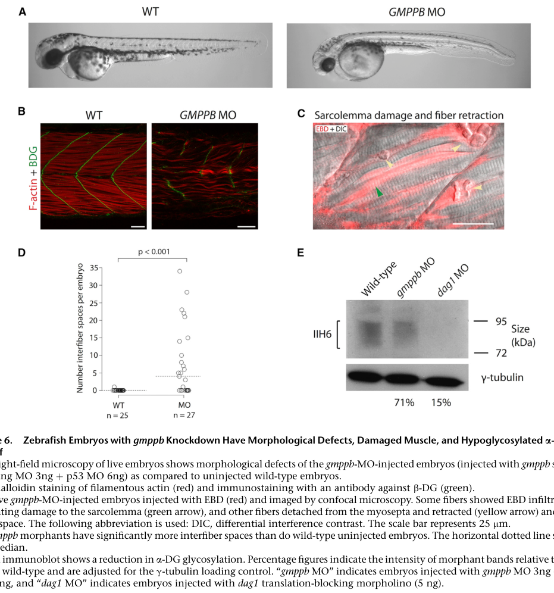

## Question

# Gene Research for Functional Annotation

## ⚠️ CRITICAL: Gene/Protein Identification Context

**BEFORE YOU BEGIN RESEARCH:** You MUST verify you are researching the CORRECT gene/protein. Gene symbols can be ambiguous, especially for less well-characterized genes from non-model organisms.

### Target Gene/Protein Identity (from UniProt):
- **UniProt Accession:** Q6DBU5
- **Protein Description:** RecName: Full=Mannose-1-phosphate guanylyltransferase catalytic subunit beta {ECO:0000305}; EC=2.7.7.13 {ECO:0000269|PubMed:33986552}; AltName: Full=GDP-mannose pyrophosphorylase B; AltName: Full=GTP-mannose-1-phosphate guanylyltransferase beta;
- **Gene Information:** Name=gmppb; ORFNames=zgc:92026;
- **Organism (full):** Danio rerio (Zebrafish) (Brachydanio rerio).
- **Protein Family:** Belongs to the transferase hexapeptide repeat family.
- **Key Domains:** GMPPB_C. (IPR056729); GMPPB_N. (IPR045233); Hexapep_transf_CS. (IPR018357); Mannose-1P_guanyltransferase. (IPR050486); NTP_transferase_dom. (IPR005835)

### MANDATORY VERIFICATION STEPS:

1. **Check if the gene symbol "gmppb" matches the protein description above**
2. **Verify the organism is correct:** Danio rerio (Zebrafish) (Brachydanio rerio).
3. **Check if protein family/domains align with what you find in literature**
4. **If you find literature for a DIFFERENT gene with the same or similar symbol, STOP**

### If Gene Symbol is Ambiguous or You Cannot Find Relevant Literature:

**DO NOT PROCEED WITH RESEARCH ON A DIFFERENT GENE.** Instead:
- State clearly: "The gene symbol 'gmppb' is ambiguous or literature is limited for this specific protein"
- Explain what you found (e.g., "Found extensive literature on a different gene with the same symbol in a different organism")
- Describe the protein based ONLY on the UniProt information provided above
- Suggest that the protein function can be inferred from domain/family information

### Research Target:

Please provide a comprehensive research report on the gene **gmppb** (gene ID: gmppb, UniProt: Q6DBU5) in DANRE.

The research report should be a detailed narrative explaining the function, biological processes, and localization of the gene product. Citations should be given for all claims.

You should prioritize authoritative reviews and primary scientific literature when conducting research. You can supplement
this with annotations you find in gene/protein databases, but these can be outdated or inaccurate.

We are specifically interested in the primary function of the gene - for enzymes, what reaction is catalyzed, and what is the substrate specificity? For transporters, what is the substrate? For structural proteins or adapters, what is the broader structural role? For signaling molecules, what is the role in the pathway.

We are interested in where in or outside the cell the gene product carries out its function.

We are also interested in the signaling or biochemical pathways in which the gene functions. We are less interested in broad pleiotropic effects, except where these elucidate the precise role.

Include evidence where possible. We are interested in both experimental evidence as well as inference from structure, evolution, or bioinformatic analysis. Precise studies should be prioritized over high-throughput, where available.

## Output

Question: You are an expert researcher providing comprehensive, well-cited information.

Provide detailed information focusing on:
1. Key concepts and definitions with current understanding
2. Recent developments and latest research (prioritize 2023-2024 sources)
3. Current applications and real-world implementations
4. Expert opinions and analysis from authoritative sources
5. Relevant statistics and data from recent studies

Format as a comprehensive research report with proper citations. Include URLs and publication dates where available.
Always prioritize recent, authoritative sources and provide specific citations for all major claims.

# Gene Research for Functional Annotation

## ⚠️ CRITICAL: Gene/Protein Identification Context

**BEFORE YOU BEGIN RESEARCH:** You MUST verify you are researching the CORRECT gene/protein. Gene symbols can be ambiguous, especially for less well-characterized genes from non-model organisms.

### Target Gene/Protein Identity (from UniProt):
- **UniProt Accession:** Q6DBU5
- **Protein Description:** RecName: Full=Mannose-1-phosphate guanylyltransferase catalytic subunit beta {ECO:0000305}; EC=2.7.7.13 {ECO:0000269|PubMed:33986552}; AltName: Full=GDP-mannose pyrophosphorylase B; AltName: Full=GTP-mannose-1-phosphate guanylyltransferase beta;
- **Gene Information:** Name=gmppb; ORFNames=zgc:92026;
- **Organism (full):** Danio rerio (Zebrafish) (Brachydanio rerio).
- **Protein Family:** Belongs to the transferase hexapeptide repeat family.
- **Key Domains:** GMPPB_C. (IPR056729); GMPPB_N. (IPR045233); Hexapep_transf_CS. (IPR018357); Mannose-1P_guanyltransferase. (IPR050486); NTP_transferase_dom. (IPR005835)

### MANDATORY VERIFICATION STEPS:

1. **Check if the gene symbol "gmppb" matches the protein description above**
2. **Verify the organism is correct:** Danio rerio (Zebrafish) (Brachydanio rerio).
3. **Check if protein family/domains align with what you find in literature**
4. **If you find literature for a DIFFERENT gene with the same or similar symbol, STOP**

### If Gene Symbol is Ambiguous or You Cannot Find Relevant Literature:

**DO NOT PROCEED WITH RESEARCH ON A DIFFERENT GENE.** Instead:
- State clearly: "The gene symbol 'gmppb' is ambiguous or literature is limited for this specific protein"
- Explain what you found (e.g., "Found extensive literature on a different gene with the same symbol in a different organism")
- Describe the protein based ONLY on the UniProt information provided above
- Suggest that the protein function can be inferred from domain/family information

### Research Target:

Please provide a comprehensive research report on the gene **gmppb** (gene ID: gmppb, UniProt: Q6DBU5) in DANRE.

The research report should be a detailed narrative explaining the function, biological processes, and localization of the gene product. Citations should be given for all claims.

You should prioritize authoritative reviews and primary scientific literature when conducting research. You can supplement
this with annotations you find in gene/protein databases, but these can be outdated or inaccurate.

We are specifically interested in the primary function of the gene - for enzymes, what reaction is catalyzed, and what is the substrate specificity? For transporters, what is the substrate? For structural proteins or adapters, what is the broader structural role? For signaling molecules, what is the role in the pathway.

We are interested in where in or outside the cell the gene product carries out its function.

We are also interested in the signaling or biochemical pathways in which the gene functions. We are less interested in broad pleiotropic effects, except where these elucidate the precise role.

Include evidence where possible. We are interested in both experimental evidence as well as inference from structure, evolution, or bioinformatic analysis. Precise studies should be prioritized over high-throughput, where available.

## Research Report: Functional Annotation of **gmppb** in *Danio rerio* (Zebrafish)

### 1) Target verification: correct gene/protein
The literature reviewed here corresponds to *Danio rerio* **gmppb** (zebrafish ortholog of human **GMPPB**, GDP-mannose pyrophosphorylase B / mannose-1-phosphate guanylyltransferase beta), which is explicitly analyzed in zebrafish and reported to share **81.4% amino-acid identity** with human GMPPB. (carss2013mutationsingdpmannose pages 7-8)

**Scope note (databases):** Direct retrieval of UniProt/InterPro/ZFIN pages was not available through the toolchain in this run; therefore, identity and domain/localization details are supported primarily by peer-reviewed primary and review literature that is consistent with the UniProt Q6DBU5 description provided by the user. (chompoopong2023gdpmannosepyrophosphorylaseb pages 1-2, liu2021gmppbcongenitaldisordersof pages 5-7)

### 2) Key concepts and definitions (current understanding)
#### 2.1 Enzyme name, EC class, and core reaction
Gmppb encodes a cytosolic nucleotidyltransferase that catalyzes formation of **GDP-mannose** from **mannose-1-phosphate** and **GTP** (mannose-1-P + GTP → GDP-mannose + PPi), i.e., the canonical activity of GDP-mannose pyrophosphorylase / mannose-1-phosphate guanylyltransferase (EC 2.7.7.13 as per UniProt context). (liu2021gmppbcongenitaldisordersof pages 1-2, alvarez2024consequencesofgmppb pages 1-2, franzka2024ubiquitinationcontributesto pages 1-2)

#### 2.2 Substrate/cofactor requirements and substrate specificity evidence
Biochemical assays directly measuring GDP-mannose formation show that activity requires **Mg²⁺** and the sugar-phosphate substrate **mannose-1-phosphate**; omitting Mg²⁺ or mannose-1-P yields **no detectable GDP-mannose formation** under the assay conditions. (liu2021gmppbcongenitaldisordersof pages 4-5, liu2021gmppbcongenitaldisordersof pages 5-7)

#### 2.3 Biological role of GDP-mannose in glycosylation pathways
GDP-mannose is a key activated mannose donor upstream of multiple glycosylation processes. A 2023 expert review summarizes that GDP-mannose is used by cytosolic mannosyltransferases and supports synthesis of **dolichol-phosphate-mannose (Dol-P-Man)**, a required mannose donor for ER mannosylation reactions including **O-mannosylation**, **N-glycosylation**, **C-mannosylation**, and **GPI-anchor formation**. (chompoopong2023gdpmannosepyrophosphorylaseb pages 1-2)

A central downstream target relevant to neuromuscular phenotypes is **α-dystroglycan (α-DG)**: impaired GDP-mannose supply reduces α-DG O-mannosylation and thereby weakens α-DG-mediated extracellular matrix interactions. (carss2013mutationsingdpmannose pages 1-2, chompoopong2023gdpmannosepyrophosphorylaseb pages 1-2)

### 3) Molecular function: domains and subcellular localization
#### 3.1 Domain architecture (functional interpretation)
GMPPB is described as comprising an **N-terminal nucleotidyltransferase/catalytic domain** and a **C-terminal bacterial transferase hexapeptide-repeat domain** that forms a **left-handed β-helix**; this architecture is reiterated in a 2023 review and aligns with the enzyme’s nucleotidyltransferase chemistry. (chompoopong2023gdpmannosepyrophosphorylaseb pages 1-2, liu2021gmppbcongenitaldisordersof pages 5-7)

#### 3.2 Subcellular localization
Wild-type GMPPB is described as a **soluble cytosolic/cytoplasmic enzyme**, consistent with cytosolic nucleotide-sugar synthesis. (carss2013mutationsingdpmannose pages 1-2, carss2013mutationsingdpmannose pages 7-8)

Multiple disease-associated missense variants can cause altered intracellular distribution, including formation of **cytoplasmic aggregates** in cell models; a separate study also notes altered localization patterns for specific variants (e.g., V111G, G214S) compared to wild-type in localization assays. (carss2013mutationsingdpmannose pages 7-8, liu2021gmppbcongenitaldisordersof pages 1-2)

### 4) Zebrafish (*Danio rerio*) evidence: expression, phenotypes, and inferred cellular site of action
#### 4.1 Developmental expression
Zebrafish **gmppb** is reported to be expressed **throughout early embryonic development** by RT-PCR. (carss2013mutationsingdpmannose pages 7-8)

Whole-mount in situ hybridization indicates **ubiquitous expression** from **50%-epiboly to 24 hpf**, consistent with a housekeeping-like metabolic role in glycan precursor supply during early development. (liu2021gmppbcongenitaldisordersof pages 5-7)

#### 4.2 Loss-of-function/knockdown phenotypes and cellular processes implicated
Two primary zebrafish morpholino knockdown studies converge on a neuromuscular developmental requirement.

**Motor neuron and neuronal development:** gmppb knockdown produces abnormal morphology/shortening of motor neuron (CaP) axons observed at **24 and 48 hpf**, decreased neuronal marker signals (e.g., HuC reporter signal), and reduced larval motor behavior measured at **2 dpf**, supporting a requirement for normal neuronal differentiation and motor circuit output. (liu2021gmppbcongenitaldisordersof pages 5-7, liu2021gmppbcongenitaldisordersof pages 7-9)

**Muscle development and integrity:** morphants show sparse/disordered muscle fibers and reduced motility, consistent with compromised myofiber development/maintenance. (carss2013mutationsingdpmannose pages 7-8, liu2021gmppbcongenitaldisordersof pages 5-7)

**Dystroglycan glycosylation readout:** an immunoblot readout for the glycosylated α-DG epitope (IIH6 reactivity) in zebrafish shows a reduction to **~71% of wild-type** in gmppb morphants at **48 hpf**, whereas a dystroglycan (dag1) knockdown control shows a stronger reduction (**~15% of wild-type**), supporting a role of gmppb upstream of α-DG glycosylation rather than encoding dystroglycan itself. (carss2013mutationsingdpmannose pages 8-10)

**Sarcolemma damage assay:** Evans Blue Dye (EBD) infiltration assays show significantly increased EBD accumulation/interfiber spaces in gmppb morphants (**p < 0.001**), indicating compromised sarcolemmal integrity (a muscular dystrophy-like feature) at larval stages. (carss2013mutationsingdpmannose pages 8-10)

**Global morphological defects:** gmppb morphants are shorter and frequently show bent tails, hypopigmentation, microphthalmia, hydrocephalus, and reduced motility by **48 hpf**, and eye-size differences are reported as highly significant (**p < 1×10⁻⁷**). (carss2013mutationsingdpmannose pages 7-8)

**Visual evidence:** Figure 6 from Carss et al. (2013-07-11) illustrates the 48 hpf morphologic and muscle phenotypes, EBD infiltration, interfiber-space quantification, and IIH6 immunoblot reduction (~71% of WT). (carss2013mutationsingdpmannose media 67a34d69)

#### 4.3 Enzymatic activity as a determinant of phenotype severity (zebrafish functional rescue)
A key mechanistic finding is that zebrafish developmental rescue correlates with catalytic competence of the enzyme.

In a zebrafish knockdown/rescue paradigm, co-injection of human GMPPB variants with differing residual activity shows that variants with higher enzymatic activity rescue neuronal and muscle phenotypes better than low-activity variants: for example, **R261C (~50% of WT activity) partially rescues**, whereas **P32L (~10% of WT activity) fails to rescue** axon-length phenotypes. (liu2021gmppbcongenitaldisordersof pages 5-7)

The same study reports that **V111G** shows a strong activity reduction (reported as ~**60% decrease** relative to WT in one description) and fails to rescue phenotypes, while **G214S** retains near-WT activity and rescues. (liu2021gmppbcongenitaldisordersof pages 1-2, liu2021gmppbcongenitaldisordersof pages 5-7)

### 5) Recent developments and latest research (prioritizing 2023–2024)
#### 5.1 2023 expert synthesis: clinical and mechanistic framing
A 2023 review in *Genes* (published **2023-01-31**; URL: https://doi.org/10.3390/genes14020372) emphasizes that GMPPB is a **cytoplasmic** GDP-mannose producing enzyme, and that impaired GMPPB reduces GDP-mannose availability for α-DG O-mannosylation leading to dystroglycanopathy; the review also highlights **neuromuscular junction involvement** (congenital myasthenic syndrome) as a distinctive feature among dystroglycanopathies. (chompoopong2023gdpmannosepyrophosphorylaseb pages 1-2)

#### 5.2 2024: regulatory layer—ubiquitination of GMPPB
A 2024 primary study in *Frontiers in Molecular Neuroscience* (published **2024-06-24**; URL: https://doi.org/10.3389/fnmol.2024.1375297) provides direct evidence that **ubiquitination regulates GMPPB enzymatic activity**. The authors report interaction between GMPPB and the E3 ligase **TRIM67**, and show that reducing GMPPB ubiquitination decreases enzymatic activity without changing GMPPB turnover or its interaction with GMPPA, implying ubiquitination modulates activity rather than abundance. (franzka2024ubiquitinationcontributesto pages 1-2)

#### 5.3 2024: developmental requirement in mammals (contextualizing zebrafish essentiality)
A 2024 brief research report in *Frontiers in Molecular Neuroscience* (published **2024-02-14**; URL: https://doi.org/10.3389/fnmol.2024.1356326) reports that GMPPB abundance increases during brain and skeletal muscle development and that homozygous Gmppb knockout mouse embryos are absent beyond **E8.5**, indicating early embryonic lethality. In vitro, siRNA knockdown of Gmppb impairs myoblast differentiation and causes myotube degeneration and impairs neuron-like differentiation, supporting a conserved, cell-autonomous role in myogenic and neuronal differentiation. (alvarez2024consequencesofgmppb pages 1-2)

### 6) Current applications and real-world implementations
#### 6.1 Zebrafish as an in vivo functional validation platform
The zebrafish gmppb morpholino models are directly used as a functional assay system to connect enzymatic activity of GMPPB variants to neuromuscular developmental outcomes (axon outgrowth, muscle fiber organization, motility), thereby enabling variant interpretation and mechanistic triangulation for dystroglycanopathy-like phenotypes. (liu2021gmppbcongenitaldisordersof pages 5-7, carss2013mutationsingdpmannose pages 7-8)

#### 6.2 Clinical/diagnostic and therapeutic implications (expert review perspective)
The 2023 review emphasizes that GMPPB-related disorders can include a congenital myasthenic syndrome component, which is clinically actionable because patients with neuromuscular transmission defects can respond to **acetylcholinesterase inhibitors**, sometimes with **3,4-diaminopyridine or salbutamol**. (chompoopong2023gdpmannosepyrophosphorylaseb pages 1-2)

### 7) Expert opinions and analysis (authoritative sources)
A consistent expert-level interpretation across primary studies and the 2023 review is that GMPPB’s primary function is **GDP-mannose supply** for glycosylation, and that neuromuscular phenotypes arise from impaired glycosylation of critical substrates including α-dystroglycan and neuromuscular junction proteins (e.g., acetylcholine receptor subunits). (chompoopong2023gdpmannosepyrophosphorylaseb pages 1-2, carss2013mutationsingdpmannose pages 1-2)

Carss et al. (2013-07-11; URL: https://doi.org/10.1016/j.ajhg.2013.05.009) additionally infer that some pathogenic missense variants likely reduce function through **cytoplasmic aggregation/mislocalization**, consistent with disrupted enzyme availability or activity in the cytosol. (carss2013mutationsingdpmannose pages 7-8)

### 8) Relevant statistics and quantitative data (recent and foundational)
**Biochemical/function metrics (variant residual activity):** R261C retains ~**50%** of WT activity and P32L retains ~**10%** of WT activity in the activity assays and correspondingly shows partial vs absent rescue in zebrafish. (liu2021gmppbcongenitaldisordersof pages 5-7)

**Glycosylation readout in zebrafish:** gmppb morphants show IIH6 signal ~**71%** of wild-type (vs dag1 morphants ~**15%**), at **48 hpf**. (carss2013mutationsingdpmannose pages 8-10)

**Muscle integrity statistic:** EBD/interfiber space increase in gmppb morphants is significant (**p < 0.001**). (carss2013mutationsingdpmannose pages 8-10)

**Morphometric statistic:** eye diameter differences between wild-type and gmppb morphants at 48 hpf are highly significant (**p < 1×10⁻⁷**). (carss2013mutationsingdpmannose pages 7-8)

**Clinical-spectrum statistics (review):** creatine kinase is typically elevated in GMPPB-related disorders, reported as **2 to >50×** the upper limit of normal; neuromuscular transmission involvement is assessed by decrement on low-frequency (**2–3 Hz**) repetitive nerve stimulation in proximal muscles. (chompoopong2023gdpmannosepyrophosphorylaseb pages 1-2)

**Mammalian lethality:** homozygous Gmppb KO embryos absent beyond **E8.5** in mice. (alvarez2024consequencesofgmppb pages 1-2)

### 9) Summary table (functional annotation snapshot)
The following table consolidates the core annotation elements (reaction, substrates, localization, pathway placement, zebrafish evidence, and 2023–2024 updates) with quantitative anchors.

| Category | Summary | Key evidence (include specific quantitative values/stages) | Key sources (citation IDs) |
|---|---|---|---|
| Gene/protein identity | **Danio rerio gmppb** corresponds to the zebrafish ortholog of **GDP-mannose pyrophosphorylase B / mannose-1-phosphate guanylyltransferase beta**, matching the UniProt Q6DBU5 description. The protein is highly conserved with human GMPPB and functions in glycosylation-linked mannose activation. | Zebrafish **gmppb** was explicitly studied in *Danio rerio*; protein sequence identity to human GMPPB reported as **81.4%**. Review articles define GMPPB as a cytoplasmic GDP-mannose pyrophosphorylase with N-terminal nucleotidyl transferase and C-terminal hexapeptide-repeat/β-helix domains. (carss2013mutationsingdpmannose pages 7-8, chompoopong2023gdpmannosepyrophosphorylaseb pages 1-2) | (carss2013mutationsingdpmannose pages 7-8, chompoopong2023gdpmannosepyrophosphorylaseb pages 1-2) |
| Enzymatic reaction and EC | GMPPB catalyzes **mannose-1-phosphate + GTP → GDP-mannose + pyrophosphate**; this is the canonical **mannose-1-phosphate guanylyltransferase** reaction (**EC 2.7.7.13**). | Biochemical assays measured direct GDP-mannose production from **mannose-1-phosphate and GTP**; product formation was nearly linear for the first **~5 min** and saturated by **~20 min**. Multiple papers describe the same reaction and role. (liu2021gmppbcongenitaldisordersof pages 1-2, alvarez2024consequencesofgmppb pages 1-2, franzka2024ubiquitinationcontributesto pages 1-2) | (liu2021gmppbcongenitaldisordersof pages 1-2, alvarez2024consequencesofgmppb pages 1-2, franzka2024ubiquitinationcontributesto pages 1-2) |
| Substrate specificity/cofactors | Primary substrates are **mannose-1-phosphate** and **GTP**; **Mg²⁺** is required for detectable activity. Assays support specificity for GDP-mannose generation under these conditions. | In vitro assays used **0.5 mM mannose-1-phosphate**, **0.25 mM GTP**, **1 mM MgCl₂**; removal of **Mg²⁺** or **mannose-1-phosphate** abolished detectable GDP-mannose formation. Recombinant enzyme amount-response tested at **0, 5, 10, 20 μg**. (liu2021gmppbcongenitaldisordersof pages 7-9, liu2021gmppbcongenitaldisordersof pages 4-5, liu2021gmppbcongenitaldisordersof pages 5-7) | (liu2021gmppbcongenitaldisordersof pages 7-9, liu2021gmppbcongenitaldisordersof pages 4-5, liu2021gmppbcongenitaldisordersof pages 5-7) |
| Subcellular localization | GMPPB is primarily a **soluble cytoplasmic/cytosolic enzyme**, consistent with cytosolic nucleotide-sugar synthesis. Some pathogenic missense variants cause abnormal aggregation or altered intracellular distribution. | Wild-type GMPPB was reported as **localized to the cytoplasm** in myoblasts. Several disease variants formed **cytoplasmic aggregates** or aggregated near membrane protrusions; additional variants altered nucleo-cytoplasmic distribution. (carss2013mutationsingdpmannose pages 7-8, carss2013mutationsingdpmannose pages 8-10, liu2021gmppbcongenitaldisordersof pages 1-2) | (carss2013mutationsingdpmannose pages 7-8, carss2013mutationsingdpmannose pages 8-10, liu2021gmppbcongenitaldisordersof pages 1-2) |
| Pathway role (GDP-mannose/Dol-P-Man and downstream glycosylation) | GMPPB supplies **GDP-mannose**, the activated mannose donor upstream of **dolichol-phosphate-mannose (Dol-P-Man)** synthesis and multiple glycosylation pathways, including **O-mannosylation of α-dystroglycan**, **N-glycosylation**, **C-mannosylation**, and **GPI-anchor formation**. | Reviews and primary papers state GDP-mannose is used by cytosolic mannosyltransferases and is required for **Dol-P-Man** synthesis in the ER membrane; reduced GMPPB function lowers GDP-mannose and impairs α-DG glycosylation. In zebrafish morphants, IIH6-reactive glycosylated α-DG fell to **71% of WT**. (chompoopong2023gdpmannosepyrophosphorylaseb pages 1-2, carss2013mutationsingdpmannose pages 1-2, carss2013mutationsingdpmannose pages 8-10) | (chompoopong2023gdpmannosepyrophosphorylaseb pages 1-2, carss2013mutationsingdpmannose pages 1-2, carss2013mutationsingdpmannose pages 8-10) |
| Zebrafish expression timing | Zebrafish **gmppb** is expressed broadly during early embryogenesis, consistent with an essential developmental glycosylation enzyme. | RT-PCR showed expression **throughout early embryonic development**. Whole-mount in situ hybridization reported **ubiquitous expression from 50%-epiboly to 24 hpf**; temporal expression tracked from fertilization to **day 3**. (carss2013mutationsingdpmannose pages 7-8, liu2021gmppbcongenitaldisordersof pages 5-7) | (carss2013mutationsingdpmannose pages 7-8, liu2021gmppbcongenitaldisordersof pages 5-7) |
| Zebrafish loss-of-function phenotypes | Knockdown causes combined **muscle, motor neuron, and general developmental defects**, supporting an essential role in neuromuscular development and α-DG glycosylation. | Morpholino knockdown caused by **24 and 48 hpf** shortened/abnormal **CaP motor axons**, decreased **HuC** neuronal marker expression, altered **myod** expression, sparse/disordered muscle fibers, and reduced larval motor ability at **2 dpf**. At **48 hpf**, embryos were shorter, often had **bent tails**, **hypopigmentation**, **microphthalmia**, **hydrocephalus**, and reduced motility; eye-size difference **p < 1×10⁻⁷**. Evans Blue Dye infiltration/interfiber spaces increased (**p < 0.001**), indicating sarcolemmal damage. (liu2021gmppbcongenitaldisordersof pages 7-9, liu2021gmppbcongenitaldisordersof pages 5-7, carss2013mutationsingdpmannose pages 7-8, carss2013mutationsingdpmannose pages 8-10, carss2013mutationsingdpmannose media 67a34d69) | (liu2021gmppbcongenitaldisordersof pages 7-9, liu2021gmppbcongenitaldisordersof pages 5-7, carss2013mutationsingdpmannose pages 7-8, carss2013mutationsingdpmannose pages 8-10, carss2013mutationsingdpmannose media 67a34d69) |
| Disease/phenotype relevance (human context as expert opinion) | Expert reviews place GMPPB among the key **secondary dystroglycanopathy** genes; reduced enzymatic activity decreases GDP-mannose availability, causing hypoglycosylation of α-DG and, uniquely among many dystroglycanopathies, can also impair **neuromuscular transmission**. | 2023 review: phenotypic spectrum ranges from **CMD with brain/eye abnormalities** to **LGMD**, recurrent rhabdomyolysis, and congenital myasthenic syndrome; **CK typically 2 to >50× ULN** and low-frequency (**2–3 Hz**) repetitive nerve stimulation may show decrement. Patients often improve with **acetylcholinesterase inhibitors**, sometimes with **3,4-diaminopyridine or salbutamol**. (chompoopong2023gdpmannosepyrophosphorylaseb pages 1-2) | (chompoopong2023gdpmannosepyrophosphorylaseb pages 1-2) |
| Recent developments 2023-2024 (regulation/animal models) | Recent work refined GMPPB biology beyond static pathway placement, showing new regulatory layers and developmental requirements in mammalian systems. | **2024:** ubiquitination was shown to regulate GMPPB activity; **TRIM67** interacts with GMPPB, and reduced ubiquitination lowers enzymatic activity without altering turnover or GMPPA interaction. **2024:** heterozygous mouse/KO-related studies found GMPPB abundance rises during brain and skeletal muscle development; homozygous KO embryos were absent beyond **E8.5**, and Gmppb knockdown impaired myoblast differentiation and neuron-like differentiation. (franzka2024ubiquitinationcontributesto pages 1-2, alvarez2024consequencesofgmppb pages 1-2) | (franzka2024ubiquitinationcontributesto pages 1-2, alvarez2024consequencesofgmppb pages 1-2) |

*Table: This table summarizes the experimentally supported functional annotation of zebrafish gmppb (UniProt Q6DBU5), including its enzymatic role, pathway placement, localization, developmental expression, and organism-level phenotypes. It also highlights recent 2023-2024 advances on GMPPB regulation and animal models that inform interpretation of the zebrafish gene.*

### 10) Conclusion (functional annotation statement)
Collectively, the strongest current evidence supports that zebrafish **gmppb (UniProt Q6DBU5)** encodes a **cytosolic GDP-mannose pyrophosphorylase/ mannose-1-phosphate guanylyltransferase beta** that produces **GDP-mannose** from **mannose-1-phosphate and GTP** in a **Mg²⁺-dependent** manner, thereby sustaining GDP-mannose supply for ER/Golgi glycosylation pathways (via Dol-P-Man and related mannose-donor routes). (liu2021gmppbcongenitaldisordersof pages 1-2, liu2021gmppbcongenitaldisordersof pages 4-5, chompoopong2023gdpmannosepyrophosphorylaseb pages 1-2)

In zebrafish, gmppb is broadly expressed early and is required for **motor neuron development, muscle organization, and muscle membrane integrity**, with measurable reductions in α-dystroglycan glycosylation (IIH6) and dystrophy-like muscle damage readouts by 48 hpf; phenotypic severity tracks with residual enzymatic activity in rescue assays, supporting a direct enzyme-activity–driven mechanism. (liu2021gmppbcongenitaldisordersof pages 5-7, carss2013mutationsingdpmannose pages 8-10, carss2013mutationsingdpmannose media 67a34d69)

Recent 2024 work adds mechanistic depth by identifying **ubiquitination as an activity-regulating layer** and by demonstrating **developmental essentiality** in mammalian models, reinforcing the interpretation that gmppb’s primary role is metabolic provision of GDP-mannose required for neuro-muscular development and maintenance. (franzka2024ubiquitinationcontributesto pages 1-2, alvarez2024consequencesofgmppb pages 1-2)

References

1. (carss2013mutationsingdpmannose pages 7-8): Keren J. Carss, Elizabeth Stevens, A. Reghan Foley, Sebahattin Cirak, Moniek Riemersma, Silvia Torelli, Alexander Hoischen, Tobias Willer, Monique van Scherpenzeel, Steven A. Moore, Sonia Messina, Enrico Bertini, Carsten G. Bönnemann, Jose E. Abdenur, Carla M. Grosmann, Akanchha Kesari, Jaya Punetha, Ros Quinlivan, Leigh B. Waddell, Helen K. Young, Elizabeth Wraige, Shu Yau, Lina Brodd, Lucy Feng, Caroline Sewry, Daniel G. MacArthur, Kathryn N. North, Eric Hoffman, Derek L. Stemple, Matthew E. Hurles, Hans van Bokhoven, Kevin P. Campbell, Dirk J. Lefeber, Yung-Yao Lin, and Francesco Muntoni. Mutations in gdp-mannose pyrophosphorylase b cause congenital and limb-girdle muscular dystrophies associated with hypoglycosylation of α-dystroglycan. American journal of human genetics, 93 1:29-41, Jul 2013. URL: https://doi.org/10.1016/j.ajhg.2013.05.009, doi:10.1016/j.ajhg.2013.05.009. This article has 276 citations and is from a highest quality peer-reviewed journal.

2. (chompoopong2023gdpmannosepyrophosphorylaseb pages 1-2): Pitcha Chompoopong and Margherita Milone. Gdp-mannose pyrophosphorylase b (gmppb)-related disorders. Genes, 14:372, Jan 2023. URL: https://doi.org/10.3390/genes14020372, doi:10.3390/genes14020372. This article has 24 citations.

3. (liu2021gmppbcongenitaldisordersof pages 5-7): Zhe Liu, Yan Wang, Fan Yang, Qin Yang, Xianming Mo, Ezra Burstein, Da Jia, Xiao-tang Cai, and Yingfeng Tu. Gmppb-congenital disorders of glycosylation associate with decreased enzymatic activity of gmppb. Molecular Biomedicine, May 2021. URL: https://doi.org/10.1186/s43556-021-00027-2, doi:10.1186/s43556-021-00027-2. This article has 23 citations and is from a peer-reviewed journal.

4. (liu2021gmppbcongenitaldisordersof pages 1-2): Zhe Liu, Yan Wang, Fan Yang, Qin Yang, Xianming Mo, Ezra Burstein, Da Jia, Xiao-tang Cai, and Yingfeng Tu. Gmppb-congenital disorders of glycosylation associate with decreased enzymatic activity of gmppb. Molecular Biomedicine, May 2021. URL: https://doi.org/10.1186/s43556-021-00027-2, doi:10.1186/s43556-021-00027-2. This article has 23 citations and is from a peer-reviewed journal.

5. (alvarez2024consequencesofgmppb pages 1-2): Beatriz Alvarez, Maria Joana, Guimarães Pinto, Patricia Franzka, Mona K. Schurig, Obinna Umeh, Henriette Henze, M. J. Jung, Lennart Gresing, Véronique Blanchard, J. V. Maltzahn, and Christian A. Hübner. Consequences of gmppb deficiency for neuromuscular development and maintenance. Frontiers in Molecular Neuroscience, Feb 2024. URL: https://doi.org/10.3389/fnmol.2024.1356326, doi:10.3389/fnmol.2024.1356326. This article has 6 citations.

6. (franzka2024ubiquitinationcontributesto pages 1-2): Patricia Franzka, Sonnhild Mittag, Abhijnan Chakraborty, Otmar Huber, and Christian A. Hübner. Ubiquitination contributes to the regulation of gdp-mannose pyrophosphorylase b activity. Frontiers in Molecular Neuroscience, Jun 2024. URL: https://doi.org/10.3389/fnmol.2024.1375297, doi:10.3389/fnmol.2024.1375297. This article has 2 citations.

7. (liu2021gmppbcongenitaldisordersof pages 4-5): Zhe Liu, Yan Wang, Fan Yang, Qin Yang, Xianming Mo, Ezra Burstein, Da Jia, Xiao-tang Cai, and Yingfeng Tu. Gmppb-congenital disorders of glycosylation associate with decreased enzymatic activity of gmppb. Molecular Biomedicine, May 2021. URL: https://doi.org/10.1186/s43556-021-00027-2, doi:10.1186/s43556-021-00027-2. This article has 23 citations and is from a peer-reviewed journal.

8. (carss2013mutationsingdpmannose pages 1-2): Keren J. Carss, Elizabeth Stevens, A. Reghan Foley, Sebahattin Cirak, Moniek Riemersma, Silvia Torelli, Alexander Hoischen, Tobias Willer, Monique van Scherpenzeel, Steven A. Moore, Sonia Messina, Enrico Bertini, Carsten G. Bönnemann, Jose E. Abdenur, Carla M. Grosmann, Akanchha Kesari, Jaya Punetha, Ros Quinlivan, Leigh B. Waddell, Helen K. Young, Elizabeth Wraige, Shu Yau, Lina Brodd, Lucy Feng, Caroline Sewry, Daniel G. MacArthur, Kathryn N. North, Eric Hoffman, Derek L. Stemple, Matthew E. Hurles, Hans van Bokhoven, Kevin P. Campbell, Dirk J. Lefeber, Yung-Yao Lin, and Francesco Muntoni. Mutations in gdp-mannose pyrophosphorylase b cause congenital and limb-girdle muscular dystrophies associated with hypoglycosylation of α-dystroglycan. American journal of human genetics, 93 1:29-41, Jul 2013. URL: https://doi.org/10.1016/j.ajhg.2013.05.009, doi:10.1016/j.ajhg.2013.05.009. This article has 276 citations and is from a highest quality peer-reviewed journal.

9. (liu2021gmppbcongenitaldisordersof pages 7-9): Zhe Liu, Yan Wang, Fan Yang, Qin Yang, Xianming Mo, Ezra Burstein, Da Jia, Xiao-tang Cai, and Yingfeng Tu. Gmppb-congenital disorders of glycosylation associate with decreased enzymatic activity of gmppb. Molecular Biomedicine, May 2021. URL: https://doi.org/10.1186/s43556-021-00027-2, doi:10.1186/s43556-021-00027-2. This article has 23 citations and is from a peer-reviewed journal.

10. (carss2013mutationsingdpmannose pages 8-10): Keren J. Carss, Elizabeth Stevens, A. Reghan Foley, Sebahattin Cirak, Moniek Riemersma, Silvia Torelli, Alexander Hoischen, Tobias Willer, Monique van Scherpenzeel, Steven A. Moore, Sonia Messina, Enrico Bertini, Carsten G. Bönnemann, Jose E. Abdenur, Carla M. Grosmann, Akanchha Kesari, Jaya Punetha, Ros Quinlivan, Leigh B. Waddell, Helen K. Young, Elizabeth Wraige, Shu Yau, Lina Brodd, Lucy Feng, Caroline Sewry, Daniel G. MacArthur, Kathryn N. North, Eric Hoffman, Derek L. Stemple, Matthew E. Hurles, Hans van Bokhoven, Kevin P. Campbell, Dirk J. Lefeber, Yung-Yao Lin, and Francesco Muntoni. Mutations in gdp-mannose pyrophosphorylase b cause congenital and limb-girdle muscular dystrophies associated with hypoglycosylation of α-dystroglycan. American journal of human genetics, 93 1:29-41, Jul 2013. URL: https://doi.org/10.1016/j.ajhg.2013.05.009, doi:10.1016/j.ajhg.2013.05.009. This article has 276 citations and is from a highest quality peer-reviewed journal.

11. (carss2013mutationsingdpmannose media 67a34d69): Keren J. Carss, Elizabeth Stevens, A. Reghan Foley, Sebahattin Cirak, Moniek Riemersma, Silvia Torelli, Alexander Hoischen, Tobias Willer, Monique van Scherpenzeel, Steven A. Moore, Sonia Messina, Enrico Bertini, Carsten G. Bönnemann, Jose E. Abdenur, Carla M. Grosmann, Akanchha Kesari, Jaya Punetha, Ros Quinlivan, Leigh B. Waddell, Helen K. Young, Elizabeth Wraige, Shu Yau, Lina Brodd, Lucy Feng, Caroline Sewry, Daniel G. MacArthur, Kathryn N. North, Eric Hoffman, Derek L. Stemple, Matthew E. Hurles, Hans van Bokhoven, Kevin P. Campbell, Dirk J. Lefeber, Yung-Yao Lin, and Francesco Muntoni. Mutations in gdp-mannose pyrophosphorylase b cause congenital and limb-girdle muscular dystrophies associated with hypoglycosylation of α-dystroglycan. American journal of human genetics, 93 1:29-41, Jul 2013. URL: https://doi.org/10.1016/j.ajhg.2013.05.009, doi:10.1016/j.ajhg.2013.05.009. This article has 276 citations and is from a highest quality peer-reviewed journal.

## Artifacts

- [Edison artifact artifact-00](gmppb-deep-research-falcon_artifacts/artifact-00.md)

## Citations

1. carss2013mutationsingdpmannose pages 7-8
2. chompoopong2023gdpmannosepyrophosphorylaseb pages 1-2
3. liu2021gmppbcongenitaldisordersof pages 5-7
4. carss2013mutationsingdpmannose pages 8-10
5. franzka2024ubiquitinationcontributesto pages 1-2
6. alvarez2024consequencesofgmppb pages 1-2
7. liu2021gmppbcongenitaldisordersof pages 1-2
8. liu2021gmppbcongenitaldisordersof pages 4-5
9. carss2013mutationsingdpmannose pages 1-2
10. liu2021gmppbcongenitaldisordersof pages 7-9
11. https://doi.org/10.3390/genes14020372
12. https://doi.org/10.3389/fnmol.2024.1375297
13. https://doi.org/10.3389/fnmol.2024.1356326
14. https://doi.org/10.1016/j.ajhg.2013.05.009
15. https://doi.org/10.1016/j.ajhg.2013.05.009,
16. https://doi.org/10.3390/genes14020372,
17. https://doi.org/10.1186/s43556-021-00027-2,
18. https://doi.org/10.3389/fnmol.2024.1356326,
19. https://doi.org/10.3389/fnmol.2024.1375297,