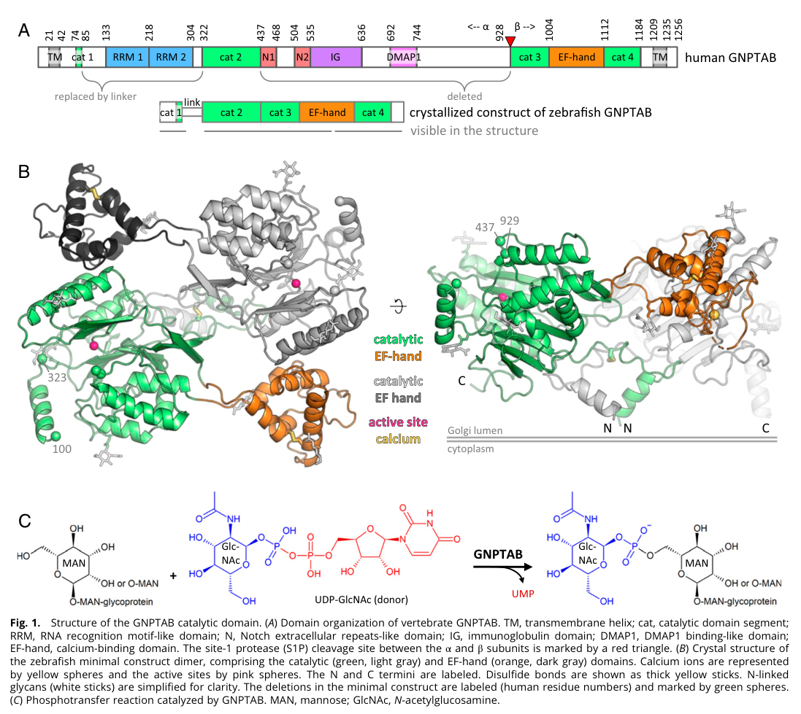

## Question

# Gene Research for Functional Annotation

## ⚠️ CRITICAL: Gene/Protein Identification Context

**BEFORE YOU BEGIN RESEARCH:** You MUST verify you are researching the CORRECT gene/protein. Gene symbols can be ambiguous, especially for less well-characterized genes from non-model organisms.

### Target Gene/Protein Identity (from UniProt):
- **UniProt Accession:** Q5RGJ8
- **Protein Description:** RecName: Full=N-acetylglucosamine-1-phosphotransferase subunits alpha/beta; EC=2.7.8.17 {ECO:0000250|UniProtKB:Q3T906}; AltName: Full=GlcNAc-1-phosphotransferase subunits alpha/beta; AltName: Full=Stealth protein gnptab; AltName: Full=UDP-N-acetylglucosamine-1-phosphotransferase subunits alpha/beta; Contains: RecName: Full=N-acetylglucosamine-1-phosphotransferase subunit alpha; Contains: RecName: Full=N-acetylglucosamine-1-phosphotransferase subunit beta; Flags: Precursor;
- **Gene Information:** Name=gnptab; Synonyms=gnpta; ORFNames=si:ch211-234f20.3, zgc:122985;
- **Organism (full):** Danio rerio (Zebrafish) (Brachydanio rerio).
- **Protein Family:** Belongs to the stealth family. .
- **Key Domains:** DMAP1-bd. (IPR010506); EF_Hand_1_Ca_BS. (IPR018247); EF_hand_dom. (IPR002048); GNPTAB_reg. (IPR041536); Notch-like_dom_sf. (IPR035993)

### MANDATORY VERIFICATION STEPS:

1. **Check if the gene symbol "gnptab" matches the protein description above**
2. **Verify the organism is correct:** Danio rerio (Zebrafish) (Brachydanio rerio).
3. **Check if protein family/domains align with what you find in literature**
4. **If you find literature for a DIFFERENT gene with the same or similar symbol, STOP**

### If Gene Symbol is Ambiguous or You Cannot Find Relevant Literature:

**DO NOT PROCEED WITH RESEARCH ON A DIFFERENT GENE.** Instead:
- State clearly: "The gene symbol 'gnptab' is ambiguous or literature is limited for this specific protein"
- Explain what you found (e.g., "Found extensive literature on a different gene with the same symbol in a different organism")
- Describe the protein based ONLY on the UniProt information provided above
- Suggest that the protein function can be inferred from domain/family information

### Research Target:

Please provide a comprehensive research report on the gene **gnptab** (gene ID: gnptab, UniProt: Q5RGJ8) in DANRE.

The research report should be a detailed narrative explaining the function, biological processes, and localization of the gene product. Citations should be given for all claims.

You should prioritize authoritative reviews and primary scientific literature when conducting research. You can supplement
this with annotations you find in gene/protein databases, but these can be outdated or inaccurate.

We are specifically interested in the primary function of the gene - for enzymes, what reaction is catalyzed, and what is the substrate specificity? For transporters, what is the substrate? For structural proteins or adapters, what is the broader structural role? For signaling molecules, what is the role in the pathway.

We are interested in where in or outside the cell the gene product carries out its function.

We are also interested in the signaling or biochemical pathways in which the gene functions. We are less interested in broad pleiotropic effects, except where these elucidate the precise role.

Include evidence where possible. We are interested in both experimental evidence as well as inference from structure, evolution, or bioinformatic analysis. Precise studies should be prioritized over high-throughput, where available.

## Output

Question: You are an expert researcher providing comprehensive, well-cited information.

Provide detailed information focusing on:
1. Key concepts and definitions with current understanding
2. Recent developments and latest research (prioritize 2023-2024 sources)
3. Current applications and real-world implementations
4. Expert opinions and analysis from authoritative sources
5. Relevant statistics and data from recent studies

Format as a comprehensive research report with proper citations. Include URLs and publication dates where available.
Always prioritize recent, authoritative sources and provide specific citations for all major claims.

# Gene Research for Functional Annotation

## ⚠️ CRITICAL: Gene/Protein Identification Context

**BEFORE YOU BEGIN RESEARCH:** You MUST verify you are researching the CORRECT gene/protein. Gene symbols can be ambiguous, especially for less well-characterized genes from non-model organisms.

### Target Gene/Protein Identity (from UniProt):
- **UniProt Accession:** Q5RGJ8
- **Protein Description:** RecName: Full=N-acetylglucosamine-1-phosphotransferase subunits alpha/beta; EC=2.7.8.17 {ECO:0000250|UniProtKB:Q3T906}; AltName: Full=GlcNAc-1-phosphotransferase subunits alpha/beta; AltName: Full=Stealth protein gnptab; AltName: Full=UDP-N-acetylglucosamine-1-phosphotransferase subunits alpha/beta; Contains: RecName: Full=N-acetylglucosamine-1-phosphotransferase subunit alpha; Contains: RecName: Full=N-acetylglucosamine-1-phosphotransferase subunit beta; Flags: Precursor;
- **Gene Information:** Name=gnptab; Synonyms=gnpta; ORFNames=si:ch211-234f20.3, zgc:122985;
- **Organism (full):** Danio rerio (Zebrafish) (Brachydanio rerio).
- **Protein Family:** Belongs to the stealth family. .
- **Key Domains:** DMAP1-bd. (IPR010506); EF_Hand_1_Ca_BS. (IPR018247); EF_hand_dom. (IPR002048); GNPTAB_reg. (IPR041536); Notch-like_dom_sf. (IPR035993)

### MANDATORY VERIFICATION STEPS:

1. **Check if the gene symbol "gnptab" matches the protein description above**
2. **Verify the organism is correct:** Danio rerio (Zebrafish) (Brachydanio rerio).
3. **Check if protein family/domains align with what you find in literature**
4. **If you find literature for a DIFFERENT gene with the same or similar symbol, STOP**

### If Gene Symbol is Ambiguous or You Cannot Find Relevant Literature:

**DO NOT PROCEED WITH RESEARCH ON A DIFFERENT GENE.** Instead:
- State clearly: "The gene symbol 'gnptab' is ambiguous or literature is limited for this specific protein"
- Explain what you found (e.g., "Found extensive literature on a different gene with the same symbol in a different organism")
- Describe the protein based ONLY on the UniProt information provided above
- Suggest that the protein function can be inferred from domain/family information

### Research Target:

Please provide a comprehensive research report on the gene **gnptab** (gene ID: gnptab, UniProt: Q5RGJ8) in DANRE.

The research report should be a detailed narrative explaining the function, biological processes, and localization of the gene product. Citations should be given for all claims.

You should prioritize authoritative reviews and primary scientific literature when conducting research. You can supplement
this with annotations you find in gene/protein databases, but these can be outdated or inaccurate.

We are specifically interested in the primary function of the gene - for enzymes, what reaction is catalyzed, and what is the substrate specificity? For transporters, what is the substrate? For structural proteins or adapters, what is the broader structural role? For signaling molecules, what is the role in the pathway.

We are interested in where in or outside the cell the gene product carries out its function.

We are also interested in the signaling or biochemical pathways in which the gene functions. We are less interested in broad pleiotropic effects, except where these elucidate the precise role.

Include evidence where possible. We are interested in both experimental evidence as well as inference from structure, evolution, or bioinformatic analysis. Precise studies should be prioritized over high-throughput, where available.

## Research report: Danio rerio **gnptab** (UniProt Q5RGJ8) — functional annotation and pathway context

### 0) Identity verification (critical disambiguation)
Danio rerio **gnptab** (UniProt **Q5RGJ8**) encodes the **N-acetylglucosamine-1-phosphotransferase α/β precursor** (GlcNAc-1-phosphotransferase; **EC 2.7.8.17**), the catalytic polypeptide of the mannose-6-phosphate (M6P) lysosomal enzyme-targeting pathway. This is directly verified by a peer-reviewed structural study that crystallized and biochemically characterized a **zebrafish GNPTAB minimal construct explicitly annotated as UniProt Q5RGJ8**. (gorelik2022structuresofthe pages 2-3, gorelik2022structuresofthe pages 4-5)

A key figure from that work summarizes GNPTAB domain organization, membrane topology/orientation in the Golgi lumen, and the phosphotransfer reaction. (gorelik2022structuresofthe media 67065d55)

### 1) Key concepts and definitions (current understanding)

#### 1.1 The mannose-6-phosphate (M6P) lysosomal targeting pathway
In vertebrates, many soluble lysosomal hydrolases are sorted away from constitutive secretion by addition of **M6P** tags to their N-glycans. GNPTAB supplies the initiating enzymatic step by transferring **GlcNAc-1-phosphate** from **UDP-GlcNAc** to **mannose residues** on high-mannose N-glycans, yielding a **GlcNAc–phosphate–mannose** intermediate that is subsequently processed (“uncovered”) to expose M6P for receptor-mediated trafficking. (qian2013thedmapinteraction pages 1-2, gorelik2022structuresofthe pages 1-2)

#### 1.2 Enzyme nomenclature and reaction chemistry
GlcNAc-1-phosphotransferase (GNPT) is a **phosphotransferase** (not a glycosyltransferase) that uses **UDP-GlcNAc** as phosphate-sugar donor; it requires **Mg2+ or Mn2+** for activity, consistent with metal coordination of phosphate groups in the active site. (gorelik2022structuresofthe pages 3-4, gorelik2022structuresofthe pages 2-3)

#### 1.3 Subunit organization and maturation
The native GNPT enzyme is commonly described as a **heterohexamer α2β2γ2**, where:
- **GNPTAB** encodes an **α/β precursor** that is **proteolytically cleaved** in the Golgi/TGN (reported at **K928–D929 / after Lys928**) to generate mature α and β subunits; cleavage is required for activity in the canonical full-length protein. (qian2013thedmapinteraction pages 1-2, petrey2012investigatingmucolipidosisii pages 25-30, gorelik2022structuresofthe pages 4-5)
- **GNPTG** encodes the auxiliary γ subunit, which enhances phosphorylation of subsets of substrates and contributes to substrate selection. (gorelik2022structuresofthe pages 1-2, gorelik2022structuresofthe pages 4-5)

#### 1.4 Substrate specificity and recognition determinants
GNPTAB is distinctive in that it does not indiscriminately modify secretory glycoproteins; substrate recognition depends on protein-level determinants:
- A **DMAP interaction domain** within GNPTAB serves as a **substrate-recognition module**, experimentally binding lysosomal hydrolases (cathepsin D, α-iduronidase) but not tested non-lysosomal glycoproteins. (qian2013thedmapinteraction pages 1-2)
- Recognition also depends on the cargo’s tertiary structure and can involve appropriately oriented **lysine residues** near an N-glycan (often described as a determinant for selective phosphorylation). (aarnio2017defectsincarbohydratedependent pages 15-19, petrey2012investigatingmucolipidosisii pages 25-30)
- The γ subunit contains an **MRH (mannose receptor homology) domain** that binds terminal α1,2/α1,3 mannoses and contributes to substrate choice for a substantial subset of lysosomal hydrolases. (gorelik2022structuresofthe pages 4-5)

### 2) Molecular function of zebrafish GNPTAB (reaction, substrates, and catalytic determinants)

#### 2.1 Primary molecular function
Zebrafish GNPTAB catalyzes the first step of M6P tag formation by transferring **phospho-GlcNAc** from **UDP-GlcNAc** to the **6-hydroxyl of mannose** on N-glycans (including high-mannose glycans of lysosomal hydrolases). (gorelik2022structuresofthe pages 3-4, qian2013thedmapinteraction pages 1-2)

Biochemical/structural work indicates GNPT can act on minimal acceptors down to **α-methyl-D-mannoside** and even **single-mannose substrates** in vitro, emphasizing that protein-context determinants primarily control physiological selectivity. (gorelik2022structuresofthe pages 4-5, qian2013thedmapinteraction pages 2-3)

#### 2.2 Active-site architecture and key residues (zebrafish structural evidence)
A zebrafish GNPTAB catalytic construct (UniProt Q5RGJ8) was structurally solved with bound **UDP-GlcNAc**, mapping mechanistic features including:
- A proposed general base **His956** to deprotonate the mannose O6,
- **Arg986** and a catalytic **Mg** site stabilizing phosphate,
- Metal coordination involving **Asp408/Asp407**,
- An activity-critical residue **Asn1151**. (gorelik2022structuresofthe pages 4-5, gorelik2022structuresofthe pages 3-4)

Quantitatively, mutation of **Asp407** reduced activity by ~**500-fold**, and mutation of **Asn1151** reduced activity by ~**200-fold** in the reported assays. (gorelik2022structuresofthe pages 3-4, gorelik2022structuresofthe pages 4-5)

### 3) Cellular localization and topology
GNPTAB functions in the **cis-Golgi**, with its catalytic surfaces oriented toward the **Golgi lumen**, consistent with both structural topology and colocalization evidence (GM130 marker). (gorelik2022structuresofthe pages 3-4, qian2013thedmapinteraction pages 2-3)

The GNPT complex is membrane-associated; structural work describes GNPTAB anchoring via multiple transmembrane helices, placing luminal active sites in surface cavities oriented away from the membrane. (gorelik2022structuresofthe pages 3-4)

### 4) Pathway membership and biological processes

#### 4.1 Core pathway role
GNPTAB initiates formation of the M6P sorting signal that enables downstream receptor-based routing of lysosomal enzymes; loss of GNPT activity abolishes M6P labeling and causes missorting/secretion of lysosomal enzymes, with secondary lysosomal dysfunction and storage. (liu2024thehostmannose6phosphate pages 2-4, qian2013thedmapinteraction pages 1-2)

#### 4.2 Mechanistic regulators (2023–2024 emphasis)
Recent work has sharpened the view that GNPTAB function depends on Golgi retention and regulated processing:
- **GOLPH3/GOLPH3L → LYSET/TMEM251 → GNPTAB** axis: In EMBO J (2024), GOLPH3/GOLPH3L were shown to maintain **cis-Golgi localization of LYSET/TMEM251**, thereby preserving the integrity of the M6P pathway; LYSET deficiency leads to GNPT mislocalization and degradation in lysosomes and prevents M6P tagging of ~**70 lysosomal enzymes** (quantitative scale of impact). (brauer2024golph3andgolph3l pages 1-2)
- A 2024 preprint proposes a reconciled mechanism where **TMEM251/LYSET** stabilizes GNPTAB, promotes its **S1P cleavage**, and prevents mislocalization of GNPT to lysosomes by Golgi anchoring and recycling machinery (GOLPH3 and retromer). (yang2024molecularinsightsinto pages 1-5, yang2024molecularinsightsinto pages 38-41)
- A 2024 review emphasizes the pathway as a host factor in viral infection and frames GNPT/LYSET acting sequentially with the uncovering enzyme. (liu2024thehostmannose6phosphate pages 2-4)

### 5) Zebrafish in vivo evidence: functional and mechanistic phenotypes

#### 5.1 Loss-of-function phenotypes and rescue
Zebrafish gnptab depletion (morpholino-based MLII models) causes reduced mannose phosphorylation of lysosomal hydrolases and broad developmental phenotypes (craniofacial cartilage, cardiac edema, otic vesicle/otolith defects, pectoral fin defects, motility defects), with **rescue by wild-type GNPTAB mRNA**. (flanagansteet2009alteredchondrocytedifferentiation pages 3-4, petrey2012excessiveactivityof pages 1-2)

Quantitatively:
- Wild-type phosphotransferase activity was reported as **35–51 pmol/mg/h** during the first 5 days; morpholino knockdown achieved up to **89% inhibition** (4 dpf). (flanagansteet2009alteredchondrocytedifferentiation pages 3-4)
- A partial reduction (~**58%**) could still yield largely normal embryos, suggesting a **threshold** for developmental sensitivity. (flanagansteet2009alteredchondrocytedifferentiation pages 3-4)
- Morphants showed ~**10 ± 3%** reduced body length and death within **5–6 days**. (flanagansteet2009alteredchondrocytedifferentiation pages 3-4)

#### 5.2 Substrate-recognition domain validated in vivo (DMAP domain)
A human disease-associated mutation **K732N** (in the GNPTAB DMAP interaction domain) selectively impaired phosphorylation of lysosomal hydrolases while retaining activity toward a simple mannose acceptor. In vitro, phosphorylation of cathepsin D and α-iduronidase was only **12–15%** of wild-type. In zebrafish gnptab-depleted embryos, wild-type mRNA rescued the MLII-like phenotype, whereas the K732N mutant mRNA failed to rescue (reported ~**76%** remaining MLII-like vs ~75% rescue with WT). (qian2013thedmapinteraction pages 2-3, qian2013thedmapinteraction pages 1-2)

#### 5.3 Cartilage/chondrocyte differentiation and ECM homeostasis
Zebrafish MLII gnptab models show chondrocyte and ECM abnormalities:
- Chondrocytes fail to intercalate and are reported **~25% larger** than wild-type. (flanagansteet2009alteredchondrocytedifferentiation pages 9-10)
- Chondrocyte-enriched sorting for transcript profiling achieved **99.2% and 99.9% purity** at 2 and 3 dpf; GFP+ populations were ~**8%** (2 dpf) and ~**20%** (3 dpf) of dissociated cells. (petrey2012excessiveactivityof pages 3-4)
- Transcriptional/ECM markers: reduced aggrecan and sustained/high col2a1/type II collagen transcripts at later stages were reported. (petrey2012excessiveactivityof pages 3-4)

#### 5.4 Protease dysregulation as a downstream mechanism and its correction
In gnptab-deficient embryos, there is increased and sustained activity of cathepsins and MMPs, regionally enriched in the head, linking lysosomal mistargeting to extracellular protease-driven cartilage pathology. (petrey2012excessiveactivityof pages 4-5, petrey2012excessiveactivityof pages 3-4)

Rescue/perturbation evidence:
- WT GNPTAB mRNA normalized cathepsin activity at 3 dpf (with WT n=4 and MLII n=6 in enzyme assays). (petrey2012excessiveactivityof pages 3-4)
- Pharmacologic cathepsin K inhibition (2-day treatment from 2 dpf) partially rescued cartilage: **13.9%** rescue at **2.5 μM** and **22.2%** rescue at **5 μM**; morpholino suppression of cathepsin K produced **15.9% full rescue** and **69.2% partial rescue**. (petrey2012investigatingmucolipidosisii pages 96-101)
- Chondrocyte intercalation improved from **6 ± 4%** in MLII toward **60 ± 9%** with co-knockdown, compared to **85 ± 5%** in WT. (petrey2012investigatingmucolipidosisii pages 96-101)

### 6) Current applications and real-world implementations

#### 6.1 Human diagnostics and variant interpretation (2024 cohort example)
A 2024 cohort of **20 Chinese probands** (6 ML II; 14 ML III α/β) expanded the GNPTAB mutation spectrum and illustrates real-world diagnostic workflows. GNPTAB variants were detected in **35/40 alleles (87.5%)**; the most prevalent variants were **c.2715+1G>A (14.3%)** and **c.2404C>T / p.Gln802Ter (11.4%)**. The authors note that increased plasma lysosomal enzyme activities of **10–20×** normal support diagnosis; they provide reference ranges including arylsulfatase A (**50–140 nmol/mg·17 h**) and hexosaminidase A (**29.8–63.8 nmol/mg·h**). (feng2024clinicalandmolecular pages 1-2)

#### 6.2 Zebrafish models as a discovery and screening platform
Zebrafish gnptab MLII models have enabled mechanistic dissection of early cartilage pathology and demonstrated that targeting downstream pathways (e.g., cathepsin K) can ameliorate structural phenotypes, supporting their utility for pathway-based therapeutic hypothesis testing. (petrey2012excessiveactivityof pages 1-2, petrey2012investigatingmucolipidosisii pages 96-101)

#### 6.3 Biomanufacturing/therapeutic enzyme design (2023 glycoengineering)
A 2023 study described a “Long-Acting-GlycoDesign (LAGD)” glycoengineering approach that eliminates M6P from therapeutic lysosomal enzymes and converts them to homogeneous sialylated glycans, improving circulation time and biodistribution in mouse studies (qualitative in excerpt). This illustrates that manipulating the M6P axis—whose biosynthesis depends on GNPTAB—remains an active area in enzyme-therapy development and bioprocessing. (chen2023auniversalglycodesign pages 1-2)

### 7) Expert synthesis and interpretation
Collectively, the most precise experimental evidence supports GNPTAB as a **cis-Golgi luminal phosphotransferase** whose α/β precursor must be correctly processed and retained at the Golgi to provide selective M6P tagging of lysosomal hydrolases. Structural data from a zebrafish Q5RGJ8 catalytic construct resolves the core catalytic mechanism, while zebrafish developmental models show that reduced M6P tagging can drive tissue pathology via altered ECM homeostasis and protease misregulation, a mechanism that is pharmacologically modifiable. (gorelik2022structuresofthe pages 4-5, flanagansteet2009alteredchondrocytedifferentiation pages 3-4, petrey2012investigatingmucolipidosisii pages 96-101)

Recent 2024 work reframes GNPTAB activity as an emergent property of a Golgi retention network (GOLPH3/GOLPH3L–LYSET/TMEM251–GNPT), explaining how defects in trafficking/retention can phenocopy catalytic loss by destabilizing GNPT and collapsing M6P tagging across dozens of lysosomal enzymes. (brauer2024golph3andgolph3l pages 1-2, yang2024molecularinsightsinto pages 38-41)

### Summary artifact
The following table consolidates key functional annotation points, zebrafish in vivo evidence, quantitative results, and 2023–2024 developments with URLs.

| Functional aspect | Evidence summary | Key quantitative details | Primary citations with URLs and publication year |
|---|---|---|---|
| Enzyme identity | Zebrafish **gnptab** (UniProt **Q5RGJ8**) corresponds to **UDP-GlcNAc:lysosomal enzyme N-acetylglucosamine-1-phosphotransferase α/β precursor**, the catalytic polypeptide of GlcNAc-1-phosphotransferase in the mannose-6-phosphate pathway; a zebrafish minimal construct from **Q5RGJ8** was used for structural/biochemical analysis and is highly similar to human GNPTAB. (gorelik2022structuresofthe pages 4-5, gorelik2022structuresofthe pages 2-3) | Zebrafish construct is **87% sequence identity** to human GNPTAB. (gorelik2022structuresofthe pages 4-5, gorelik2022structuresofthe pages 2-3) | Gorelik et al., 2022, PNAS, https://doi.org/10.1073/pnas.2203518119 (gorelik2022structuresofthe pages 4-5, gorelik2022structuresofthe pages 2-3) |
| Enzyme name / EC | The enzyme is **GlcNAc-1-phosphotransferase / N-acetylglucosamine-1-phosphotransferase**, **EC 2.7.8.17**, catalyzing the first committed step in M6P biosynthesis on lysosomal hydrolases. (gorelik2022structuresofthe pages 3-4, qian2013thedmapinteraction pages 1-2, gorelik2022structuresofthe pages 1-2) | EC **2.7.8.17**. (gorelik2022structuresofthe pages 3-4, qian2013thedmapinteraction pages 1-2) | Gorelik et al., 2022, https://doi.org/10.1073/pnas.2203518119; Qian et al., 2013, https://doi.org/10.1073/pnas.1308453110 |
| Reaction catalyzed | GNPT transfers **phospho-GlcNAc / GlcNAc-1-phosphate** from **UDP-GlcNAc** to mannose residues on N-linked high-mannose glycans of lysosomal hydrolases, creating a **GlcNAc-P-mannose** intermediate that is later uncovered to M6P by NAGPA/UCE. (gorelik2022structuresofthe pages 3-4, qian2013thedmapinteraction pages 1-2, gorelik2022structuresofthe pages 1-2) | First step of a **2-step** M6P-tagging pathway. (gorelik2022structuresofthe pages 1-2, liu2024thehostmannose6phosphate pages 2-4) | Gorelik et al., 2022, https://doi.org/10.1073/pnas.2203518119; Qian et al., 2013, https://doi.org/10.1073/pnas.1308453110; Liu et al., 2024, https://doi.org/10.3389/fcimb.2024.1349221 |
| Donor substrate | The donor substrate is **UDP-GlcNAc**, which binds tightly in a deep catalytic cavity in the zebrafish GNPTAB catalytic domain. (gorelik2022structuresofthe pages 2-3, gorelik2022structuresofthe pages 3-4) | Requires **Mg2+ or Mn2+** for activity. (gorelik2022structuresofthe pages 2-3, gorelik2022structuresofthe pages 3-4) | Gorelik et al., 2022, https://doi.org/10.1073/pnas.2203518119 |
| Acceptor substrate | The acceptor is the **6-hydroxyl of mannose** within **high-mannose N-glycans** on lysosomal hydrolases; GNPT can also act on minimal mannose-containing substrates such as **α-methyl-D-mannoside** and even a **single mannose** in biochemical assays. (gorelik2022structuresofthe pages 4-5, qian2013thedmapinteraction pages 2-3, aarnio2017defectsincarbohydratedependent pages 15-19) | Catalytically active on substrate as small as **single mannose**; αMM assay used in zebrafish extracts. (gorelik2022structuresofthe pages 4-5, qian2013thedmapinteraction pages 2-3) | Gorelik et al., 2022, https://doi.org/10.1073/pnas.2203518119; Qian et al., 2013, https://doi.org/10.1073/pnas.1308453110 |
| Product(s) | Immediate product is a **phosphodiester sugar intermediate** (GlcNAc-P-mannose) on the glycan; after uncovering enzyme action, mature **mannose-6-phosphate (M6P)** is generated for receptor-mediated sorting. (qian2013thedmapinteraction pages 1-2, gorelik2022structuresofthe pages 1-2, liu2024thehostmannose6phosphate pages 2-4) | M6P pathway tags most lysosomal hydrolases; LYSET/GNPT perturbation can disrupt tagging of about **70 lysosomal enzymes**. (brauer2024golph3andgolph3l pages 1-2) | Qian et al., 2013, https://doi.org/10.1073/pnas.1308453110; Gorelik et al., 2022, https://doi.org/10.1073/pnas.2203518119; Brauer et al., 2024, https://doi.org/10.1038/s44318-024-00305-z |
| Subunit organization | Native GNPT is a **heterohexamer** composed of **α2β2γ2**; **GNPTAB** encodes the α/β precursor containing catalytic activity, whereas **GNPTG** encodes the auxiliary γ subunit that enhances phosphorylation of subsets of substrates and contributes to recognition. (gorelik2022structuresofthe pages 2-3, qian2013thedmapinteraction pages 1-2, gorelik2022structuresofthe pages 1-2) | Complex reported as ~**400 kDa** in one source and ~**540 kDa** in review-style summaries. (gorelik2022structuresofthe pages 1-2, aarnio2017defectsincarbohydratedependent pages 15-19, liu2024thehostmannose6phosphate pages 2-4) | Gorelik et al., 2022, https://doi.org/10.1073/pnas.2203518119; Qian et al., 2013, https://doi.org/10.1073/pnas.1308453110; Liu et al., 2024, https://doi.org/10.3389/fcimb.2024.1349221 |
| Activation / processing | GNPTAB is synthesized as an **inactive α/β precursor** and activated by **Site-1 protease (S1P)** cleavage in the Golgi/TGN at **Lys928-Asp929** (or after Lys928), generating mature α and β subunits; minimal catalytic constructs lacking the intervening region can bypass this requirement experimentally. (gorelik2022structuresofthe pages 4-5, gorelik2022structuresofthe pages 3-4, qian2013thedmapinteraction pages 1-2, petrey2012investigatingmucolipidosisii pages 25-30) | Cleavage site at **K928-D929**; catalytic mutation **Asp407** causes ~**500-fold** activity loss; **Asn1151** mutation decreases activity ~**200-fold**. (gorelik2022structuresofthe pages 4-5, gorelik2022structuresofthe pages 3-4) | Gorelik et al., 2022, https://doi.org/10.1073/pnas.2203518119; Qian et al., 2013, https://doi.org/10.1073/pnas.1308453110 |
| Key catalytic determinants | Structural work on zebrafish GNPTAB identified catalytic residues and metal coordination: **His956** likely deprotonates mannose O6, **Arg986** and **Mg1** stabilize phosphate, **Asp408/D407** coordinates metal, and the catalytic site lies in a deep luminal cavity. (gorelik2022structuresofthe pages 4-5, gorelik2022structuresofthe pages 2-3, gorelik2022structuresofthe pages 3-4) | **D407** mutation ~**500-fold** loss; **N1151** mutation ~**200-fold** loss. (gorelik2022structuresofthe pages 4-5, gorelik2022structuresofthe pages 3-4) | Gorelik et al., 2022, https://doi.org/10.1073/pnas.2203518119 |
| Key domains in GNPTAB | GNPTAB contains a multipart **catalytic domain** plus accessory modules including **DMAP1-binding-like domain**, **Notch/EGF-like repeats**, **immunoglobulin-like domain**, **RRM-like/N-terminal modules**, and an **EF-hand Ca2+-binding domain**; these accessory regions contribute to selective hydrolase recognition. (gorelik2022structuresofthe pages 2-3, qian2013thedmapinteraction pages 1-2, gorelik2022structuresofthe media 67065d55) | Accessory-domain deletion retains catalytic activity but loses lysosomal-vs-nonlysosomal discrimination and γ-binding site. (gorelik2022structuresofthe pages 2-3) | Gorelik et al., 2022, https://doi.org/10.1073/pnas.2203518119; Qian et al., 2013, https://doi.org/10.1073/pnas.1308453110 |
| Localization / topology | GNPT functions in the **cis-Golgi**; GNPTAB is membrane-anchored with luminal active sites oriented toward the Golgi lumen, supported by structural topology and colocalization with **GM130**. (gorelik2022structuresofthe pages 2-3, qian2013thedmapinteraction pages 2-3, gorelik2022structuresofthe pages 3-4, gorelik2022structuresofthe pages 1-2) | GNPTAB precursor contains **4 transmembrane helices** overall in the complex topology context; active sites face Golgi lumen. (gorelik2022structuresofthe pages 3-4) | Gorelik et al., 2022, https://doi.org/10.1073/pnas.2203518119; Qian et al., 2013, https://doi.org/10.1073/pnas.1308453110 |
| Pathway role | GNPTAB initiates **M6P-dependent lysosomal enzyme targeting**, enabling subsequent recognition by **cation-independent/cation-dependent M6P receptors** and delivery of hydrolases to lysosomes; loss of GNPT causes missorting/secretion of lysosomal enzymes and MLII/III pathology. (qian2013thedmapinteraction pages 1-2, gorelik2022structuresofthe pages 1-2, liu2024thehostmannose6phosphate pages 2-4) | Defects can abolish M6P labeling and elevate serum/plasma lysosomal hydrolases; diagnostic studies cite **10-20×** normal enzyme activities as supportive of MLII/III diagnosis. (liu2024thehostmannose6phosphate pages 2-4, feng2024clinicalandmolecular pages 1-2) | Qian et al., 2013, https://doi.org/10.1073/pnas.1308453110; Liu et al., 2024, https://doi.org/10.3389/fcimb.2024.1349221; Feng et al., 2024, https://doi.org/10.1186/s12887-024-05223-x |
| Substrate-recognition determinants | Recognition of lysosomal hydrolases depends on **protein tertiary structure**, **specific lysines near N-glycans**, the **DMAP domain** of GNPTAB, and the **MRH mannose-binding domain** of GNPTG. GST-DMAP binds lysosomal hydrolases (cathepsin D, α-iduronidase) but not nonlysosomal glycoproteins. (gorelik2022structuresofthe pages 4-5, qian2013thedmapinteraction pages 1-2, aarnio2017defectsincarbohydratedependent pages 15-19, petrey2012investigatingmucolipidosisii pages 25-30) | Recognition can be ~**100-fold** selective for lysosomal cargos; human **K732N** DMAP mutant phosphorylates cathepsin D and α-iduronidase at only **12-15%** of WT efficiency. (qian2013thedmapinteraction pages 2-3, petrey2012investigatingmucolipidosisii pages 25-30) | Qian et al., 2013, https://doi.org/10.1073/pnas.1308453110; Petrey dissertation excerpt, 2012 (petrey2012investigatingmucolipidosisii pages 25-30) |
| Zebrafish-specific functional evidence | In zebrafish gnptab-deficient MLII models, loss of mannose phosphorylation of lysosomal hydrolases causes craniofacial/cartilage, cardiac, otic vesicle, pectoral fin, and motility defects; WT GNPTAB mRNA rescues biochemical and developmental defects, whereas substrate-recognition mutant **K732N** fails to rescue. (qian2013thedmapinteraction pages 2-3, petrey2012excessiveactivityof pages 1-2, flanagansteet2009alteredchondrocytedifferentiation pages 3-4, flanagansteet2009alteredchondrocytedifferentiation pages 2-3) | WT PT activity in embryos **35-51 pmol/mg/h**; MO knockdown up to **89%** at 4 dpf; partial ~**58%** reduction can still yield largely normal embryos; body length reduced ~**10 ± 3%**; death by **5-6 dpf**. WT rescue ~**75%**; **~76%** remained MLII-like with K732N rescue attempt. (qian2013thedmapinteraction pages 2-3, flanagansteet2009alteredchondrocytedifferentiation pages 3-4) | Flanagan-Steet et al., 2009, https://doi.org/10.2353/ajpath.2009.090210; Qian et al., 2013, https://doi.org/10.1073/pnas.1308453110; Petrey et al., 2012, https://doi.org/10.1242/dmm.008219 |
| Zebrafish mechanistic phenotypes downstream of loss | gnptab loss in zebrafish alters chondrocyte differentiation and ECM homeostasis: chondrocytes fail to intercalate, are **25% larger**, show high/ectopic **Sox9**, reduced **aggrecan**, sustained **col2a1/type II collagen**, and elevated cathepsin/MMP activity; WT GNPTAB mRNA normalizes cathepsin activity. (petrey2012excessiveactivityof pages 1-2, petrey2012excessiveactivityof pages 3-4, petrey2012excessiveactivityof pages 4-5, flanagansteet2009alteredchondrocytedifferentiation pages 9-10) | GFP+ chondrocyte-enriched cells were ~**8%** and **20%** of dissociated cells at 2 and 3 dpf, with **99.2%** and **99.9%** purity; WT n=**4**, ML-II n=**6** in enzyme assays. (petrey2012excessiveactivityof pages 3-4) | Petrey et al., 2012, https://doi.org/10.1242/dmm.008219; Flanagan-Steet et al., 2009, https://doi.org/10.2353/ajpath.2009.090210 |
| Pharmacologic/genetic rescue in zebrafish model | Inhibition of **cathepsin K** genetically or pharmacologically ameliorates gnptab/MLII cartilage defects and reduces broader protease dysregulation, supporting a mechanistic link between lysosomal mistargeting and extracellular protease-driven pathology. (petrey2012excessiveactivityof pages 1-2, petrey2012investigatingmucolipidosisii pages 96-101) | Cathepsin K inhibitor rescue: **13.9%** rescue at **2.5 µM**, **22.2%** at **5 µM**; cathepsin K SB MO gave **15.9% full rescue** and **69.2% partial rescue**; chondrocyte intercalation improved from **6 ± 4%** in MLII toward **60 ± 9%** with co-knockdown vs **85 ± 5%** WT. (petrey2012investigatingmucolipidosisii pages 96-101) | Petrey et al., 2012, https://doi.org/10.1242/dmm.008219; Petrey dissertation excerpt, 2012 (petrey2012investigatingmucolipidosisii pages 96-101) |
| Recent pathway regulators / current understanding | Recent work places GNPTAB under control of **TMEM251/LYSET/GCAF**, **GOLPH3/GOLPH3L**, and likely **retromer**-dependent Golgi retention/recycling; disruption causes GNPT mislocalization to lysosomes, reduced cleavage/activity, and broad M6P-tagging defects. (brauer2024golph3andgolph3l pages 1-2, yang2024molecularinsightsinto pages 38-41, yang2024molecularinsightsinto pages 1-5, tang2023glycoengineeringforthe pages 1-2) | LYSET deficiency affects tagging/trafficking of about **70 lysosomal enzymes**; TMEM251 alanine-scan defects scored partly by **<50%** mCTSD threshold. (brauer2024golph3andgolph3l pages 1-2, yang2024molecularinsightsinto pages 38-41) | Brauer et al., 2024, https://doi.org/10.1038/s44318-024-00305-z; Yang et al., 2024 preprint, https://doi.org/10.1101/2024.12.05.627003; Tang et al., 2023, https://doi.org/10.4052/tigg.2204.1e |

*Table: This table summarizes the core functional annotation of Danio rerio gnptab (UniProt Q5RGJ8), integrating enzyme chemistry, domains, localization, pathway role, and zebrafish-specific experimental evidence. It also highlights quantitative results and key primary citations useful for downstream gene annotation.*

### Key cited sources (publication date; URL)
- Gorelik et al., **Aug 2022**, PNAS. “Structures of the mannose-6-phosphate pathway enzyme, GlcNAc-1-phosphotransferase.” https://doi.org/10.1073/pnas.2203518119 (gorelik2022structuresofthe pages 4-5, gorelik2022structuresofthe pages 2-3, gorelik2022structuresofthe pages 3-4, gorelik2022structuresofthe media 67065d55)
- Qian et al., **Jun 2013**, PNAS. “The DMAP interaction domain … is a substrate recognition module.” https://doi.org/10.1073/pnas.1308453110 (qian2013thedmapinteraction pages 1-2, qian2013thedmapinteraction pages 2-3)
- Flanagan-Steet et al., **Nov 2009**, Am J Pathol. “Altered Chondrocyte Differentiation … in a Zebrafish Model for Mucolipidosis II.” https://doi.org/10.2353/ajpath.2009.090210 (flanagansteet2009alteredchondrocytedifferentiation pages 3-4, flanagansteet2009alteredchondrocytedifferentiation pages 9-10, flanagansteet2009alteredchondrocytedifferentiation pages 2-3)
- Petrey et al., **Mar 2012**, Dis Model Mech. “Excessive activity of cathepsin K … in a zebrafish model of mucolipidosis II.” https://doi.org/10.1242/dmm.008219 (petrey2012excessiveactivityof pages 1-2, petrey2012excessiveactivityof pages 3-4, petrey2012excessiveactivityof pages 4-5)
- Liu et al., **Jan 2024**, Front Cell Infect Microbiol (review). “The host mannose-6-phosphate pathway and viral infection.” https://doi.org/10.3389/fcimb.2024.1349221 (liu2024thehostmannose6phosphate pages 2-4)
- Brauer et al., **Nov 2024**, EMBO J. “GOLPH3 and GOLPH3L maintain Golgi localization of LYSET …” https://doi.org/10.1038/s44318-024-00305-z (brauer2024golph3andgolph3l pages 1-2)
- Feng et al., **Dec 2024**, BMC Pediatrics. “Clinical and molecular characteristics of 20 Chinese probands …” https://doi.org/10.1186/s12887-024-05223-x (feng2024clinicalandmolecular pages 1-2)
- Chen et al., **Feb 2023**, Front Bioeng Biotechnol. “A universal GlycoDesign …” https://doi.org/10.3389/fbioe.2023.1128371 (chen2023auniversalglycodesign pages 1-2)
- Tang et al., **May 2023**, Trends Glycosci Glycotechnol (review). “Glycoengineering for the Production of Lysosomal Enzymes.” https://doi.org/10.4052/tigg.2204.1e (tang2023glycoengineeringforthe pages 1-2)
- Yang et al., **Dec 2024**, bioRxiv (preprint). “Molecular Insights into the Regulation of GNPTAB by TMEM251.” https://doi.org/10.1101/2024.12.05.627003 (yang2024molecularinsightsinto pages 1-5, yang2024molecularinsightsinto pages 38-41)

References

1. (gorelik2022structuresofthe pages 2-3): Alexei Gorelik, Katalin Illes, Khanh Huy Bui, and Bhushan Nagar. Structures of the mannose-6-phosphate pathway enzyme, glcnac-1-phosphotransferase. Proceedings of the National Academy of Sciences of the United States of America, Aug 2022. URL: https://doi.org/10.1073/pnas.2203518119, doi:10.1073/pnas.2203518119. This article has 17 citations and is from a highest quality peer-reviewed journal.

2. (gorelik2022structuresofthe pages 4-5): Alexei Gorelik, Katalin Illes, Khanh Huy Bui, and Bhushan Nagar. Structures of the mannose-6-phosphate pathway enzyme, glcnac-1-phosphotransferase. Proceedings of the National Academy of Sciences of the United States of America, Aug 2022. URL: https://doi.org/10.1073/pnas.2203518119, doi:10.1073/pnas.2203518119. This article has 17 citations and is from a highest quality peer-reviewed journal.

3. (gorelik2022structuresofthe media 67065d55): Alexei Gorelik, Katalin Illes, Khanh Huy Bui, and Bhushan Nagar. Structures of the mannose-6-phosphate pathway enzyme, glcnac-1-phosphotransferase. Proceedings of the National Academy of Sciences of the United States of America, Aug 2022. URL: https://doi.org/10.1073/pnas.2203518119, doi:10.1073/pnas.2203518119. This article has 17 citations and is from a highest quality peer-reviewed journal.

4. (qian2013thedmapinteraction pages 1-2): Yi Qian, Heather Flanagan-Steet, Eline van Meel, Richard Steet, and Stuart A. Kornfeld. The dmap interaction domain of udp-glcnac:lysosomal enzyme n-acetylglucosamine-1-phosphotransferase is a substrate recognition module. Proceedings of the National Academy of Sciences, 110:10246-10251, Jun 2013. URL: https://doi.org/10.1073/pnas.1308453110, doi:10.1073/pnas.1308453110. This article has 47 citations and is from a highest quality peer-reviewed journal.

5. (gorelik2022structuresofthe pages 1-2): Alexei Gorelik, Katalin Illes, Khanh Huy Bui, and Bhushan Nagar. Structures of the mannose-6-phosphate pathway enzyme, glcnac-1-phosphotransferase. Proceedings of the National Academy of Sciences of the United States of America, Aug 2022. URL: https://doi.org/10.1073/pnas.2203518119, doi:10.1073/pnas.2203518119. This article has 17 citations and is from a highest quality peer-reviewed journal.

6. (gorelik2022structuresofthe pages 3-4): Alexei Gorelik, Katalin Illes, Khanh Huy Bui, and Bhushan Nagar. Structures of the mannose-6-phosphate pathway enzyme, glcnac-1-phosphotransferase. Proceedings of the National Academy of Sciences of the United States of America, Aug 2022. URL: https://doi.org/10.1073/pnas.2203518119, doi:10.1073/pnas.2203518119. This article has 17 citations and is from a highest quality peer-reviewed journal.

7. (petrey2012investigatingmucolipidosisii pages 25-30): AC Petrey. Investigating mucolipidosis ii: a role for proteases in cartilage pathogenesis. Unknown journal, 2012.

8. (aarnio2017defectsincarbohydratedependent pages 15-19): MC Aarnio. Defects in carbohydrate-dependent lysosomal targeting lead to alterations in growth factor signaling. Unknown journal, 2017.

9. (qian2013thedmapinteraction pages 2-3): Yi Qian, Heather Flanagan-Steet, Eline van Meel, Richard Steet, and Stuart A. Kornfeld. The dmap interaction domain of udp-glcnac:lysosomal enzyme n-acetylglucosamine-1-phosphotransferase is a substrate recognition module. Proceedings of the National Academy of Sciences, 110:10246-10251, Jun 2013. URL: https://doi.org/10.1073/pnas.1308453110, doi:10.1073/pnas.1308453110. This article has 47 citations and is from a highest quality peer-reviewed journal.

10. (liu2024thehostmannose6phosphate pages 2-4): Qincheng Liu, Weiqi Wang, Liwei Xu, Qisheng Zhang, and Hongna Wang. The host mannose-6-phosphate pathway and viral infection. Frontiers in Cellular and Infection Microbiology, Jan 2024. URL: https://doi.org/10.3389/fcimb.2024.1349221, doi:10.3389/fcimb.2024.1349221. This article has 6 citations.

11. (brauer2024golph3andgolph3l pages 1-2): Berit K Brauer, Zilei Chen, Felix Beirow, Jiaran Li, Daniel Meisinger, Emanuela Capriotti, Michaela Schweizer, Lea Wagner, Jascha Wienberg, Laura Hobohm, Lukas Blume, Wenjie Qiao, Yoshiki Narimatsu, Jan E Carette, Henrik Clausen, Dominic Winter, Thomas Braulke, Sabrina Jabs, and Matthias Voss. Golph3 and golph3l maintain golgi localization of lyset and a functional mannose 6-phosphate transport pathway. The EMBO Journal, 43:6264-6290, Nov 2024. URL: https://doi.org/10.1038/s44318-024-00305-z, doi:10.1038/s44318-024-00305-z. This article has 20 citations.

12. (yang2024molecularinsightsinto pages 1-5): Xi Yang, Balraj Doray, Varsha Venkatarangan, Benjamin C. Jennings, Danielle Henn, Jiaxuan Liang, Haikun Zhao, Weichao Zhang, Bokai Zhang, Linchen Yu, Liang Chen, Stuart Kornfeld, and Ming Li. Molecular insights into the regulation of gnptab by tmem251. bioRxiv, Dec 2024. URL: https://doi.org/10.1101/2024.12.05.627003, doi:10.1101/2024.12.05.627003. This article has 2 citations.

13. (yang2024molecularinsightsinto pages 38-41): Xi Yang, Balraj Doray, Varsha Venkatarangan, Benjamin C. Jennings, Danielle Henn, Jiaxuan Liang, Haikun Zhao, Weichao Zhang, Bokai Zhang, Linchen Yu, Liang Chen, Stuart Kornfeld, and Ming Li. Molecular insights into the regulation of gnptab by tmem251. bioRxiv, Dec 2024. URL: https://doi.org/10.1101/2024.12.05.627003, doi:10.1101/2024.12.05.627003. This article has 2 citations.

14. (flanagansteet2009alteredchondrocytedifferentiation pages 3-4): Heather Flanagan-Steet, Christina Sias, and Richard Steet. Altered chondrocyte differentiation and extracellular matrix homeostasis in a zebrafish model for mucolipidosis ii. The American Journal of Pathology, 175:2063-2075, Nov 2009. URL: https://doi.org/10.2353/ajpath.2009.090210, doi:10.2353/ajpath.2009.090210. This article has 56 citations.

15. (petrey2012excessiveactivityof pages 1-2): Aaron C. Petrey, Heather Flanagan-Steet, Steven Johnson, Xiang Fan, Mitche De la Rosa, Mark E. Haskins, Alison V. Nairn, Kelley W. Moremen, and Richard Steet. Excessive activity of cathepsin k is associated with cartilage defects in a zebrafish model of mucolipidosis ii. Mar 2012. URL: https://doi.org/10.1242/dmm.008219, doi:10.1242/dmm.008219. This article has 49 citations and is from a domain leading peer-reviewed journal.

16. (flanagansteet2009alteredchondrocytedifferentiation pages 9-10): Heather Flanagan-Steet, Christina Sias, and Richard Steet. Altered chondrocyte differentiation and extracellular matrix homeostasis in a zebrafish model for mucolipidosis ii. The American Journal of Pathology, 175:2063-2075, Nov 2009. URL: https://doi.org/10.2353/ajpath.2009.090210, doi:10.2353/ajpath.2009.090210. This article has 56 citations.

17. (petrey2012excessiveactivityof pages 3-4): Aaron C. Petrey, Heather Flanagan-Steet, Steven Johnson, Xiang Fan, Mitche De la Rosa, Mark E. Haskins, Alison V. Nairn, Kelley W. Moremen, and Richard Steet. Excessive activity of cathepsin k is associated with cartilage defects in a zebrafish model of mucolipidosis ii. Mar 2012. URL: https://doi.org/10.1242/dmm.008219, doi:10.1242/dmm.008219. This article has 49 citations and is from a domain leading peer-reviewed journal.

18. (petrey2012excessiveactivityof pages 4-5): Aaron C. Petrey, Heather Flanagan-Steet, Steven Johnson, Xiang Fan, Mitche De la Rosa, Mark E. Haskins, Alison V. Nairn, Kelley W. Moremen, and Richard Steet. Excessive activity of cathepsin k is associated with cartilage defects in a zebrafish model of mucolipidosis ii. Mar 2012. URL: https://doi.org/10.1242/dmm.008219, doi:10.1242/dmm.008219. This article has 49 citations and is from a domain leading peer-reviewed journal.

19. (petrey2012investigatingmucolipidosisii pages 96-101): AC Petrey. Investigating mucolipidosis ii: a role for proteases in cartilage pathogenesis. Unknown journal, 2012.

20. (feng2024clinicalandmolecular pages 1-2): Yuyu Feng, Yonglan Huang, Xiaoyuan Zhao, Huiying Sheng, Xueying Su, Xi Yin, Liu Li, and Wen Zhang. Clinical and molecular characteristics of 20 chinese probands with mucolipidosis type ii and iii alpha/beta. BMC Pediatrics, Dec 2024. URL: https://doi.org/10.1186/s12887-024-05223-x, doi:10.1186/s12887-024-05223-x. This article has 1 citations and is from a peer-reviewed journal.

21. (chen2023auniversalglycodesign pages 1-2): Yen-Hsi Chen, Weihua Tian, Makiko Yasuda, Zilu Ye, Ming Song, Ulla Mandel, Claus Kristensen, Lorenzo Povolo, André R. A. Marques, Tomislav Čaval, Albert J. R. Heck, Julio Lopes Sampaio, Ludger Johannes, Takahiro Tsukimura, Robert Desnick, Sergey Y. Vakhrushev, Zhang Yang, and Henrik Clausen. A universal glycodesign for lysosomal replacement enzymes to improve circulation time and biodistribution. Frontiers in Bioengineering and Biotechnology, Feb 2023. URL: https://doi.org/10.3389/fbioe.2023.1128371, doi:10.3389/fbioe.2023.1128371. This article has 7 citations.

22. (flanagansteet2009alteredchondrocytedifferentiation pages 2-3): Heather Flanagan-Steet, Christina Sias, and Richard Steet. Altered chondrocyte differentiation and extracellular matrix homeostasis in a zebrafish model for mucolipidosis ii. The American Journal of Pathology, 175:2063-2075, Nov 2009. URL: https://doi.org/10.2353/ajpath.2009.090210, doi:10.2353/ajpath.2009.090210. This article has 56 citations.

23. (tang2023glycoengineeringforthe pages 1-2): Yu-He Tang, Ganglong Yang, and Morihisa Fujita. Glycoengineering for the production of lysosomal enzymes. Trends in Glycoscience and Glycotechnology, 35:E42-E49, May 2023. URL: https://doi.org/10.4052/tigg.2204.1e, doi:10.4052/tigg.2204.1e. This article has 0 citations and is from a peer-reviewed journal.

## Artifacts

- [Edison artifact artifact-00](gnptab-deep-research-falcon_artifacts/artifact-00.md)

## Citations

1. qian2013thedmapinteraction pages 1-2
2. gorelik2022structuresofthe pages 4-5
3. gorelik2022structuresofthe pages 3-4
4. flanagansteet2009alteredchondrocytedifferentiation pages 3-4
5. flanagansteet2009alteredchondrocytedifferentiation pages 9-10
6. petrey2012excessiveactivityof pages 3-4
7. petrey2012investigatingmucolipidosisii pages 96-101
8. feng2024clinicalandmolecular pages 1-2
9. chen2023auniversalglycodesign pages 1-2
10. gorelik2022structuresofthe pages 2-3
11. petrey2012investigatingmucolipidosisii pages 25-30
12. tang2023glycoengineeringforthe pages 1-2
13. gorelik2022structuresofthe pages 1-2
14. aarnio2017defectsincarbohydratedependent pages 15-19
15. qian2013thedmapinteraction pages 2-3
16. yang2024molecularinsightsinto pages 1-5
17. yang2024molecularinsightsinto pages 38-41
18. petrey2012excessiveactivityof pages 1-2
19. petrey2012excessiveactivityof pages 4-5
20. flanagansteet2009alteredchondrocytedifferentiation pages 2-3
21. https://doi.org/10.1073/pnas.2203518119
22. https://doi.org/10.1073/pnas.2203518119;
23. https://doi.org/10.1073/pnas.1308453110
24. https://doi.org/10.1073/pnas.1308453110;
25. https://doi.org/10.3389/fcimb.2024.1349221
26. https://doi.org/10.1038/s44318-024-00305-z
27. https://doi.org/10.3389/fcimb.2024.1349221;
28. https://doi.org/10.1186/s12887-024-05223-x
29. https://doi.org/10.2353/ajpath.2009.090210;
30. https://doi.org/10.1242/dmm.008219
31. https://doi.org/10.1242/dmm.008219;
32. https://doi.org/10.2353/ajpath.2009.090210
33. https://doi.org/10.1038/s44318-024-00305-z;
34. https://doi.org/10.1101/2024.12.05.627003;
35. https://doi.org/10.4052/tigg.2204.1e
36. https://doi.org/10.3389/fbioe.2023.1128371
37. https://doi.org/10.1101/2024.12.05.627003
38. https://doi.org/10.1073/pnas.2203518119,
39. https://doi.org/10.1073/pnas.1308453110,
40. https://doi.org/10.3389/fcimb.2024.1349221,
41. https://doi.org/10.1038/s44318-024-00305-z,
42. https://doi.org/10.1101/2024.12.05.627003,
43. https://doi.org/10.2353/ajpath.2009.090210,
44. https://doi.org/10.1242/dmm.008219,
45. https://doi.org/10.1186/s12887-024-05223-x,
46. https://doi.org/10.3389/fbioe.2023.1128371,
47. https://doi.org/10.4052/tigg.2204.1e,