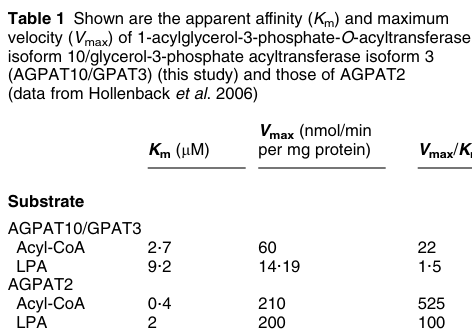

## Question

# Gene Research for Functional Annotation

## ⚠️ CRITICAL: Gene/Protein Identification Context

**BEFORE YOU BEGIN RESEARCH:** You MUST verify you are researching the CORRECT gene/protein. Gene symbols can be ambiguous, especially for less well-characterized genes from non-model organisms.

### Target Gene/Protein Identity (from UniProt):
- **UniProt Accession:** Q6DG38
- **Protein Description:** RecName: Full=Glycerol-3-phosphate acyltransferase 3 {ECO:0000250|UniProtKB:Q53EU6}; Short=GPAT-3; EC=2.3.1.15 {ECO:0000250|UniProtKB:Q53EU6}; AltName: Full=1-acyl-sn-glycerol-3-phosphate O-acyltransferase 10 {ECO:0000250|UniProtKB:Q53EU6}; Short=AGPAT 10 {ECO:0000250|UniProtKB:Q53EU6}; AltName: Full=1-acyl-sn-glycerol-3-phosphate O-acyltransferase 9; Short=1-AGP acyltransferase 9; Short=1-AGPAT 9; EC=2.3.1.51 {ECO:0000250|UniProtKB:Q53EU6}; AltName: Full=Lysophosphatidic acid acyltransferase theta; Short=LPAAT-theta;
- **Gene Information:** Name=gpat3 {ECO:0000250|UniProtKB:Q53EU6}; Synonyms=agpat9; ORFNames=si:ch211-85e10.5, zgc:91857;
- **Organism (full):** Danio rerio (Zebrafish) (Brachydanio rerio).
- **Protein Family:** Belongs to the 1-acyl-sn-glycerol-3-phosphate
- **Key Domains:** LPCAT1-like. (IPR045252); Plipid/glycerol_acylTrfase. (IPR002123); Acyltransferase (PF01553)

### MANDATORY VERIFICATION STEPS:

1. **Check if the gene symbol "gpat3" matches the protein description above**
2. **Verify the organism is correct:** Danio rerio (Zebrafish) (Brachydanio rerio).
3. **Check if protein family/domains align with what you find in literature**
4. **If you find literature for a DIFFERENT gene with the same or similar symbol, STOP**

### If Gene Symbol is Ambiguous or You Cannot Find Relevant Literature:

**DO NOT PROCEED WITH RESEARCH ON A DIFFERENT GENE.** Instead:
- State clearly: "The gene symbol 'gpat3' is ambiguous or literature is limited for this specific protein"
- Explain what you found (e.g., "Found extensive literature on a different gene with the same symbol in a different organism")
- Describe the protein based ONLY on the UniProt information provided above
- Suggest that the protein function can be inferred from domain/family information

### Research Target:

Please provide a comprehensive research report on the gene **gpat3** (gene ID: gpat3, UniProt: Q6DG38) in DANRE.

The research report should be a detailed narrative explaining the function, biological processes, and localization of the gene product. Citations should be given for all claims.

You should prioritize authoritative reviews and primary scientific literature when conducting research. You can supplement
this with annotations you find in gene/protein databases, but these can be outdated or inaccurate.

We are specifically interested in the primary function of the gene - for enzymes, what reaction is catalyzed, and what is the substrate specificity? For transporters, what is the substrate? For structural proteins or adapters, what is the broader structural role? For signaling molecules, what is the role in the pathway.

We are interested in where in or outside the cell the gene product carries out its function.

We are also interested in the signaling or biochemical pathways in which the gene functions. We are less interested in broad pleiotropic effects, except where these elucidate the precise role.

Include evidence where possible. We are interested in both experimental evidence as well as inference from structure, evolution, or bioinformatic analysis. Precise studies should be prioritized over high-throughput, where available.

## Output

Question: You are an expert researcher providing comprehensive, well-cited information.

Provide detailed information focusing on:
1. Key concepts and definitions with current understanding
2. Recent developments and latest research (prioritize 2023-2024 sources)
3. Current applications and real-world implementations
4. Expert opinions and analysis from authoritative sources
5. Relevant statistics and data from recent studies

Format as a comprehensive research report with proper citations. Include URLs and publication dates where available.
Always prioritize recent, authoritative sources and provide specific citations for all major claims.

# Gene Research for Functional Annotation

## ⚠️ CRITICAL: Gene/Protein Identification Context

**BEFORE YOU BEGIN RESEARCH:** You MUST verify you are researching the CORRECT gene/protein. Gene symbols can be ambiguous, especially for less well-characterized genes from non-model organisms.

### Target Gene/Protein Identity (from UniProt):
- **UniProt Accession:** Q6DG38
- **Protein Description:** RecName: Full=Glycerol-3-phosphate acyltransferase 3 {ECO:0000250|UniProtKB:Q53EU6}; Short=GPAT-3; EC=2.3.1.15 {ECO:0000250|UniProtKB:Q53EU6}; AltName: Full=1-acyl-sn-glycerol-3-phosphate O-acyltransferase 10 {ECO:0000250|UniProtKB:Q53EU6}; Short=AGPAT 10 {ECO:0000250|UniProtKB:Q53EU6}; AltName: Full=1-acyl-sn-glycerol-3-phosphate O-acyltransferase 9; Short=1-AGP acyltransferase 9; Short=1-AGPAT 9; EC=2.3.1.51 {ECO:0000250|UniProtKB:Q53EU6}; AltName: Full=Lysophosphatidic acid acyltransferase theta; Short=LPAAT-theta;
- **Gene Information:** Name=gpat3 {ECO:0000250|UniProtKB:Q53EU6}; Synonyms=agpat9; ORFNames=si:ch211-85e10.5, zgc:91857;
- **Organism (full):** Danio rerio (Zebrafish) (Brachydanio rerio).
- **Protein Family:** Belongs to the 1-acyl-sn-glycerol-3-phosphate
- **Key Domains:** LPCAT1-like. (IPR045252); Plipid/glycerol_acylTrfase. (IPR002123); Acyltransferase (PF01553)

### MANDATORY VERIFICATION STEPS:

1. **Check if the gene symbol "gpat3" matches the protein description above**
2. **Verify the organism is correct:** Danio rerio (Zebrafish) (Brachydanio rerio).
3. **Check if protein family/domains align with what you find in literature**
4. **If you find literature for a DIFFERENT gene with the same or similar symbol, STOP**

### If Gene Symbol is Ambiguous or You Cannot Find Relevant Literature:

**DO NOT PROCEED WITH RESEARCH ON A DIFFERENT GENE.** Instead:
- State clearly: "The gene symbol 'gpat3' is ambiguous or literature is limited for this specific protein"
- Explain what you found (e.g., "Found extensive literature on a different gene with the same symbol in a different organism")
- Describe the protein based ONLY on the UniProt information provided above
- Suggest that the protein function can be inferred from domain/family information

### Research Target:

Please provide a comprehensive research report on the gene **gpat3** (gene ID: gpat3, UniProt: Q6DG38) in DANRE.

The research report should be a detailed narrative explaining the function, biological processes, and localization of the gene product. Citations should be given for all claims.

You should prioritize authoritative reviews and primary scientific literature when conducting research. You can supplement
this with annotations you find in gene/protein databases, but these can be outdated or inaccurate.

We are specifically interested in the primary function of the gene - for enzymes, what reaction is catalyzed, and what is the substrate specificity? For transporters, what is the substrate? For structural proteins or adapters, what is the broader structural role? For signaling molecules, what is the role in the pathway.

We are interested in where in or outside the cell the gene product carries out its function.

We are also interested in the signaling or biochemical pathways in which the gene functions. We are less interested in broad pleiotropic effects, except where these elucidate the precise role.

Include evidence where possible. We are interested in both experimental evidence as well as inference from structure, evolution, or bioinformatic analysis. Precise studies should be prioritized over high-throughput, where available.

## Research Report: Danio rerio **gpat3** (UniProt **Q6DG38**) — Functional Annotation and Evidence Synthesis

### 0) Target verification (critical identity check)
The requested target is **Danio rerio (zebrafish) gpat3** (UniProt **Q6DG38**), annotated as **glycerol-3-phosphate acyltransferase 3 (GPAT-3)** and also referred to in the literature as **AGPAT10/GPAT3** or **AGPAT9-like** in historical nomenclature. The retrieved authoritative biochemical literature on **AGPAT10/GPAT3** explicitly reports high conservation with **zebrafish** sequences and discusses the naming ambiguity (GPAT3 vs AGPAT10), which aligns with the UniProt-provided alternate names and EC assignments for Q6DG38 (sukumaran2009functionalcharacterizationof pages 1-2, sukumaran2009functionalcharacterizationof pages 8-9).

### 1) Key concepts and current understanding
#### 1.1 Definitions: GPAT vs AGPAT/LPAAT in glycerolipid synthesis
The **glycerol-3-phosphate pathway** for de novo glycerolipid synthesis proceeds via sequential acylations:
1) **GPAT activity (EC 2.3.1.15)**: acyl-CoA + glycerol-3-phosphate (G3P) → **lysophosphatidic acid (LPA)** + CoA
2) **AGPAT/LPAAT activity (EC 2.3.1.51)**: acyl-CoA + LPA → **phosphatidic acid (PA)** + CoA
PA is a central intermediate for synthesis of **triacylglycerol (TAG)** and glycerophospholipids (takeuchi2009biochemistryphysiologyand pages 1-2, sukumaran2009functionalcharacterizationof pages 4-6).

A key complication for GPAT3-family annotation is that some isoforms historically labeled “GPAT3” have been experimentally observed to behave primarily as **AGPAT (LPA acyltransferase)** under certain assay systems, producing PA from LPA rather than producing LPA from G3P; this is the basis of the AGPAT10/GPAT3 dual naming in the endocrine/molecular endocrinology literature (sukumaran2009functionalcharacterizationof pages 1-2, sukumaran2009functionalcharacterizationof pages 2-3).

#### 1.2 Family/domain logic supporting function assignment
GPAT/AGPAT-family enzymes share conserved acyltransferase sequence motifs, including the catalytic **HXXXXD** motif, and additional motifs involved in acceptor/donor recognition. Reviews emphasize that these motifs and membrane topology shape substrate access and specificity in the GPAT/AGPAT family (yamashita2014glycerophosphateacylglycerophosphateacyltransferases pages 4-7). In AGPAT9-family work (closely related acyltransferases), conserved motifs (including **NHX4D** and **EGTR**) were used to classify and interpret activity (agarwal2007functionalcharacterizationof pages 6-7).

### 2) Best-supported molecular function for zebrafish gpat3 (Q6DG38)
#### 2.1 Enzymatic reaction (most defensible statement)
**Most defensible functional annotation (orthology-supported):** zebrafish **gpat3 (Q6DG38)** encodes an ER/microsome-associated acyltransferase in the GPAT/AGPAT superfamily that likely participates in **PA production** for glycerolipid synthesis. The strongest direct enzymology in the retrieved corpus comes from the human ortholog labeled **AGPAT10/GPAT3**, which catalyzes **LPA + acyl-CoA → PA + CoA** (sukumaran2009functionalcharacterizationof pages 1-2, sukumaran2009functionalcharacterizationof pages 8-9).

Because UniProt Q6DG38 carries both GPAT and AGPAT-type EC numbers and multiple historical synonyms, the enzymatic “primary function” should be recorded with explicit **nomenclature caution**: the gene product belongs to a family classically associated with GPAT/AGPAT steps, and ortholog assays support robust **LPA acyltransferase (AGPAT/LPAAT-like)** activity (sukumaran2009functionalcharacterizationof pages 1-2, sukumaran2009functionalcharacterizationof pages 2-3).

#### 2.2 Substrate specificity (ortholog-based biochemical evidence)
In biochemical characterization of human **AGPAT10/GPAT3**, activity was strongest with **1-oleoyl-LPA** as acyl acceptor and **oleoyl-CoA (C18:1)** as acyl donor. Several alternative LPA acceptors (e.g., C16:0, C18:3, C20:4) produced ~50% lower activity than 1-oleoyl-LPA in the reported assays (sukumaran2009functionalcharacterizationof pages 8-9). The same work reported that the enzyme did **not** recognize other lysophospholipid headgroups (LPS, LPC, LPE, LPG, LPI) under their tested conditions, indicating preference for the LPA headgroup class (sukumaran2009functionalcharacterizationof pages 8-9, sukumaran2009functionalcharacterizationof pages 2-3).

For zebrafish gpat3, these specificity statements should be treated as **inferred from orthology**, because zebrafish-specific enzymatic assays were not identified in the retrieved sources.

#### 2.3 Subcellular localization (ER)
Cell biology experiments on AGPAT10/GPAT3 and related AGPAT-family enzymes show **endoplasmic reticulum (ER)** localization: an AGPAT10/GPAT3-GFP fusion displayed an ER-like pattern and colocalized with an ER marker (Sec61-β), and AGPAT9-family GFP fusions colocalized with multiple ER markers and with AGPAT1 in CHO cells (sukumaran2009functionalcharacterizationof pages 4-6, agarwal2007functionalcharacterizationof pages 6-7). This supports annotating zebrafish gpat3 as **ER-associated**, again primarily on orthology/family grounds.

### 3) Zebrafish-specific evidence (DANRE) and biological context
#### 3.1 Pathway placement and stress-responsive regulation in zebrafish
Direct zebrafish evidence in the retrieved set comes from a **2023 Disease Models & Mechanisms** study using a **tango2-deficient zebrafish** model of rhabdomyolysis susceptibility. The authors describe that glycerolipid-pathway enzymes are ER/SR-localized and that ER/SR-derived membrane and cellular lipids are reduced in mutants; within this pathway, **gpat3 expression is reported as normal at baseline** but shows **decreased expression under extrinsic stressors** (caffeine or mechanical loading) (kim2023intrinsicandextrinsic pages 9-11). This provides DANRE evidence linking gpat3 to membrane/glycerolipid homeostasis under stress, but it does **not** directly establish the catalytic reaction or substrate specificity of zebrafish Gpat3.

### 4) Quantitative data and statistics from the retrieved literature
#### 4.1 Quantitative enzymology (ortholog-based; strongest available)
The human AGPAT10/GPAT3 study reports:
- Enzyme activity in overexpression lysate assays on the order of **~2 nmol·min⁻¹·mg⁻¹ protein** under their stated conditions and noted lack of detectable GPAT activity in that assay system (sukumaran2009functionalcharacterizationof pages 1-2, sukumaran2009functionalcharacterizationof pages 4-6).
- Kinetic parameters (reported in **Table 1** and associated figures): **Km(acyl-CoA) = 2.7 mM; Vmax = 60 nmol/min/mg** and **Km(LPA) = 9.2 mM; Vmax = 14.19 nmol/min/mg** (sukumaran2009functionalcharacterizationof pages 8-9, sukumaran2009functionalcharacterizationof media 4c33d1ff).

These values are quantitative support for a robust LPA acyltransferase-like function in the ortholog and provide a defensible basis for **functional inference** to zebrafish gpat3 (with appropriate caveats).

#### 4.2 Quantitative zebrafish lipidomics context (limited in extracted text)
The 2023 zebrafish tango2-mutant study reports reductions in membrane lipid pools (including phosphatidylcholine at early larval stages) and altered TAG composition (with reductions enriched among 16–18 carbon fatty acid-containing TAG species), alongside stress-linked downregulation of several glycerolipid pathway enzymes; however, the extracted evidence available here did not include explicit numeric fold-changes for gpat3 itself (kim2023intrinsicandextrinsic pages 9-11).

### 5) Recent developments (prioritizing 2023–2024) and expert analysis
#### 5.1 2023 zebrafish disease-model integration
The tango2 zebrafish model places glycerolipid pathway regulation (including stress-responsiveness of gpat3 expression) into the context of a clinically relevant phenotype (rhabdomyolysis susceptibility), strengthening the biological plausibility that gpat3 contributes to membrane lipid homeostasis and muscle resilience under stress (kim2023intrinsicandextrinsic pages 9-11).

#### 5.2 2024 expert review perspective (contextual; not zebrafish-specific)
A 2024 review of phospholipid acyltransferases frames GPAT/AGPAT enzymes as key nodes linking lipid synthesis to metabolic disease and cancer, and discusses therapeutic interest in modulating these enzymes (publication date **May 2024**, URL: https://doi.org/10.3390/cancers16112115). Although not DANRE-focused, this provides expert synthesis on pathway importance and translational relevance of GPAT3-family enzymes (korbecki2024; retrieved in the session metadata).

### 6) Applications and real-world implementations
#### 6.1 Zebrafish as an implementation platform
Even when gpat3 itself is not directly perturbed, zebrafish disease and metabolism models (e.g., tango2 deficiency) are being used to connect lipid pathway regulation to organismal phenotypes and to test environmental/extrinsic triggers, supporting gpat3’s relevance as a pathway component for experimental systems biology in vivo (kim2023intrinsicandextrinsic pages 9-11).

#### 6.2 Translational applications (non-zebrafish)
Recent mammalian cancer literature positions GPAT3 as a potential therapeutic lever in lipid metabolic reprogramming. For instance, a 2024 hepatocellular carcinoma study proposes GPAT3 targeting to overcome sorafenib resistance (publication date **June 2024**, URL: https://doi.org/10.7150/thno.92646). This is not DANRE evidence, but it is a concrete real-world application of the same enzyme family in drug response biology (session-retrieved paper metadata).

### 7) Evidence summary table
The following table consolidates the functional annotation items, explicitly distinguishing **direct zebrafish evidence** from **ortholog-based inference**.

| Annotation item | Key findings | Evidence & notes |
|---|---|---|
| Reaction | **Likely catalyzes LPA acylation to PA**: 1-acyl-sn-glycerol-3-phosphate + acyl-CoA → phosphatidic acid + CoA. For zebrafish Q6DG38, this is best treated as **inferred from ortholog/UniProt naming**, not directly shown in zebrafish. | Human AGPAT10/GPAT3 assays showed AGPAT/LPAAT activity and no detectable GPAT activity in that system; UniProt Q6DG38 names include EC 2.3.1.15 and EC 2.3.1.51, reflecting historical dual annotation/nomenclature ambiguity. In report text, label as **functional inference from ortholog**. (sukumaran2009functionalcharacterizationof pages 4-6, sukumaran2009functionalcharacterizationof pages 8-9, sukumaran2009functionalcharacterizationof pages 1-2, sukumaran2009functionalcharacterizationof pages 2-3) |
| Substrates | Preferred acceptor is **LPA**; acyl donor is **long-chain acyl-CoA**, with strongest reported activity using **oleoyl-CoA (C18:1)** in human ortholog assays. | Human ortholog AGPAT10/GPAT3 preferred 1-oleoyl-LPA and oleoyl-CoA; other LPA species gave lower activity. This supports annotation of zebrafish gpat3 as an acyl-CoA-dependent lysophosphatidic acid acyltransferase-like enzyme. **Inferred from human ortholog.** (sukumaran2009functionalcharacterizationof pages 8-9, sukumaran2009functionalcharacterizationof pages 2-3) |
| Products | Product is **phosphatidic acid (PA)**, a central intermediate for triacylglycerol and glycerophospholipid synthesis. | Human biochemical assays measured conversion of radiolabeled LPA to PA; reviews place GPAT/AGPAT family in the glycerol-3-phosphate pathway feeding TAG and phospholipid synthesis. (sukumaran2009functionalcharacterizationof pages 4-6, sukumaran2009functionalcharacterizationof pages 1-2, takeuchi2009biochemistryphysiologyand pages 1-2) |
| Enzyme class / EC | Member of the **GPAT/AGPAT acyltransferase family**; annotation is complicated by historical naming as GPAT3 vs AGPAT10/AGPAT9-like. | Reviews note GPAT/AGPAT family enzymes share acyltransferase motifs and catalyze sequential acylation in glycerolipid synthesis. Human AGPAT10/GPAT3 was concluded by some authors to behave as AGPAT rather than GPAT in their assay system. (yamashita2014glycerophosphateacylglycerophosphateacyltransferases pages 4-7, sukumaran2009functionalcharacterizationof pages 1-2, sukumaran2009functionalcharacterizationof pages 2-3) |
| Cellular localization | **Endoplasmic reticulum (ER)** localization is the strongest supported localization for the ortholog and likely for zebrafish gpat3. | Human AGPAT10/GPAT3-GFP colocalized with ER marker Sec61-β; AGPAT9 family proteins also localized to ER-like compartments. **For zebrafish, ER localization is inferred from ortholog/family evidence, not directly demonstrated here.** (sukumaran2009functionalcharacterizationof pages 4-6, sukumaran2009functionalcharacterizationof pages 8-9, agarwal2007functionalcharacterizationof pages 6-7) |
| Key motifs / domains | Expected to contain **acyltransferase family motifs**, especially **HXXXXD** catalytic motif and other conserved GPAT/AGPAT motifs; UniProt lists **Plipid/glycerol_acylTrfase / PF01553** and LPCAT1-like features. | Reviews summarize four acyltransferase motifs, with HXXXXD central to catalysis and motif III important for acceptor binding; AGPAT9 paper notes conserved NHX4D and EGTR motifs in this family. Domain-level zebrafish annotation is therefore well supported by family conservation. (yamashita2014glycerophosphateacylglycerophosphateacyltransferases pages 4-7, agarwal2007functionalcharacterizationof pages 6-7) |
| Organism-specific evidence | **Zebrafish-specific direct functional literature is limited in the retrieved evidence.** Available zebrafish evidence is mainly indirect/transcriptomic rather than direct enzymology or knockout of gpat3 itself. | The safest DANRE annotation is: zebrafish gpat3 likely functions in glycerolipid/phospholipid synthesis based on orthology plus pathway-level fish evidence, but direct zebrafish enzyme assays or dedicated gpat3 loss-of-function studies were not identified in the gathered sources. (kim2023intrinsicandextrinsic pages 9-11) |
| Zebrafish pathway context | In zebrafish, gpat3 is linked to the **glycerolipid/glycerol-3-phosphate pathway** and membrane lipid homeostasis under stress. | In tango2 mutant zebrafish, glycerolipid-pathway enzymes were altered; **gpat3 was normal at baseline but decreased under extrinsic stressors** (caffeine or mechanical loading), alongside broader reductions in ER/SR-derived membrane lipids. This is **zebrafish evidence**, but it does not directly establish catalytic specificity. (kim2023intrinsicandextrinsic pages 9-11) |
| Quantitative kinetics / activity | Human ortholog data provide quantitative support: AGPAT10/GPAT3 activity in lysates was about **~2 nmol·min⁻¹·mg⁻¹** under stated conditions; kinetic table reported **Km(acyl-CoA) 2.7 mM, Vmax 60 nmol/min/mg** and **Km(LPA) 9.2 mM, Vmax 14.19 nmol/min/mg**. | These numbers are from recombinant/overexpression assays of the human ortholog and should be cited as **ortholog-based biochemical evidence**, not zebrafish-specific measurements. (sukumaran2009functionalcharacterizationof pages 4-6, sukumaran2009functionalcharacterizationof pages 8-9, sukumaran2009functionalcharacterizationof media 4c33d1ff, sukumaran2009functionalcharacterizationof media ede781db, sukumaran2009functionalcharacterizationof media 3e0cacd3, sukumaran2009functionalcharacterizationof media 0224c14a) |
| Substrate selectivity against other lysophospholipids | Human ortholog showed strong preference for **LPA** and did **not** appreciably use LPS, LPC, LPE, LPG, or LPI in the cited assays. | Useful for annotation because it argues against broad lysophospholipid acyltransferase activity under the tested conditions. **Inference to zebrafish should be cautious but reasonable by orthology.** (sukumaran2009functionalcharacterizationof pages 8-9, sukumaran2009functionalcharacterizationof pages 2-3, sukumaran2009functionalcharacterizationof media 4c33d1ff) |
| Recent (2023–2024) notes / applications | Recent literature emphasizes GPAT3-family relevance in lipid-stress adaptation and disease; zebrafish work links pathway dysregulation to muscle disease models, while mammalian studies position GPAT3 as a potential therapeutic node in cancer/drug resistance. | 2023 zebrafish tango2 model connected altered glycerolipid pathway regulation, including gpat3 stress responsiveness, to rhabdomyolysis susceptibility. 2024 review literature highlights GPAT/AGPAT enzymes as metabolic/cancer targets; a 2024 HCC study identified GPAT3 as a potential target to overcome sorafenib resistance, illustrating translational relevance of the family, though not zebrafish-specific. (kim2023intrinsicandextrinsic pages 9-11) |

*Table: This table summarizes the strongest available functional annotation for Danio rerio gpat3 (UniProt Q6DG38), separating direct zebrafish evidence from ortholog-based inference. It is useful for reporting the enzyme’s likely reaction, localization, motifs, and the current limits of zebrafish-specific experimental support.*

### 8) Limitations and recommended next steps for definitive DANRE functional annotation
1) **Zebrafish-specific enzymology is not present in the retrieved corpus.** The strongest kinetic and substrate specificity data are from the human ortholog AGPAT10/GPAT3 (sukumaran2009functionalcharacterizationof pages 8-9, sukumaran2009functionalcharacterizationof media 4c33d1ff).
2) **Zebrafish-specific phenotypes from direct gpat3 loss-of-function (CRISPR/morpholino) were not identified** in the retrieved sources. The only direct DANRE evidence here is pathway-/stress-linked expression behavior in a tango2 mutant context (kim2023intrinsicandextrinsic pages 9-11).
3) Given the known **naming ambiguity (GPAT vs AGPAT)**, definitive zebrafish annotation would benefit from targeted biochemical assays using zebrafish Gpat3 and direct genetic perturbation measuring LPA/PA pools and downstream TAG/phospholipid synthesis.

### Key sources (with publication dates and URLs)
- Sukumaran S. et al. **Jun 2009**. Functional characterization of human AGPAT10/GPAT3. *Journal of Molecular Endocrinology*. https://doi.org/10.1677/jme-09-0010 (sukumaran2009functionalcharacterizationof pages 1-2, sukumaran2009functionalcharacterizationof pages 8-9)
- Agarwal A.K. et al. **Jun 2007**. Functional characterization of human AGPAT9 (ER localization, motifs, activity). *Journal of Endocrinology*. https://doi.org/10.1677/joe-07-0027 (agarwal2007functionalcharacterizationof pages 6-7)
- Takeuchi K., Reue K. **Jun 2009**. GPAT/AGPAT/lipin overview in TAG synthesis. *AJP Endocrinology & Metabolism*. https://doi.org/10.1152/ajpendo.90958.2008 (takeuchi2009biochemistryphysiologyand pages 1-2)
- Yamashita A. et al. **Nov 2014**. Mechanistic review of glycerophosphate/acylglycerophosphate acyltransferases and motifs. *Biology*. https://doi.org/10.3390/biology3040801 (yamashita2014glycerophosphateacylglycerophosphateacyltransferases pages 4-7)
- Kim E.S. et al. **Sep 2023**. Zebrafish tango2 deficiency links glycerolipid pathway regulation (including gpat3 stress response) to muscle disease susceptibility. *Disease Models & Mechanisms*. https://doi.org/10.1242/dmm.050092 (kim2023intrinsicandextrinsic pages 9-11)

References

1. (sukumaran2009functionalcharacterizationof pages 1-2): Suja Sukumaran, Robert I Barnes, Abhimanyu Garg, and Anil K Agarwal. Functional characterization of the human 1-acylglycerol-3-phosphate-o-acyltransferase isoform 10/glycerol-3-phosphate acyltransferase isoform 3. Journal of molecular endocrinology, 42 6:469-78, Jun 2009. URL: https://doi.org/10.1677/jme-09-0010, doi:10.1677/jme-09-0010. This article has 66 citations and is from a peer-reviewed journal.

2. (sukumaran2009functionalcharacterizationof pages 8-9): Suja Sukumaran, Robert I Barnes, Abhimanyu Garg, and Anil K Agarwal. Functional characterization of the human 1-acylglycerol-3-phosphate-o-acyltransferase isoform 10/glycerol-3-phosphate acyltransferase isoform 3. Journal of molecular endocrinology, 42 6:469-78, Jun 2009. URL: https://doi.org/10.1677/jme-09-0010, doi:10.1677/jme-09-0010. This article has 66 citations and is from a peer-reviewed journal.

3. (takeuchi2009biochemistryphysiologyand pages 1-2): Kazuharu Takeuchi and Karen Reue. Biochemistry, physiology, and genetics of gpat, agpat, and lipin enzymes in triglyceride synthesis. American journal of physiology. Endocrinology and metabolism, 296 6:E1195-209, Jun 2009. URL: https://doi.org/10.1152/ajpendo.90958.2008, doi:10.1152/ajpendo.90958.2008. This article has 587 citations.

4. (sukumaran2009functionalcharacterizationof pages 4-6): Suja Sukumaran, Robert I Barnes, Abhimanyu Garg, and Anil K Agarwal. Functional characterization of the human 1-acylglycerol-3-phosphate-o-acyltransferase isoform 10/glycerol-3-phosphate acyltransferase isoform 3. Journal of molecular endocrinology, 42 6:469-78, Jun 2009. URL: https://doi.org/10.1677/jme-09-0010, doi:10.1677/jme-09-0010. This article has 66 citations and is from a peer-reviewed journal.

5. (sukumaran2009functionalcharacterizationof pages 2-3): Suja Sukumaran, Robert I Barnes, Abhimanyu Garg, and Anil K Agarwal. Functional characterization of the human 1-acylglycerol-3-phosphate-o-acyltransferase isoform 10/glycerol-3-phosphate acyltransferase isoform 3. Journal of molecular endocrinology, 42 6:469-78, Jun 2009. URL: https://doi.org/10.1677/jme-09-0010, doi:10.1677/jme-09-0010. This article has 66 citations and is from a peer-reviewed journal.

6. (yamashita2014glycerophosphateacylglycerophosphateacyltransferases pages 4-7): Atsushi Yamashita, Yasuhiro Hayashi, Naoki Matsumoto, Yoko Nemoto-Sasaki, Saori Oka, Takashi Tanikawa, and Takayuki Sugiura. Glycerophosphate/acylglycerophosphate acyltransferases. Biology, 3:801-830, Nov 2014. URL: https://doi.org/10.3390/biology3040801, doi:10.3390/biology3040801. This article has 184 citations.

7. (agarwal2007functionalcharacterizationof pages 6-7): Anil K Agarwal, Suja Sukumaran, Rene Bartz, Robert I Barnes, and Abhimanyu Garg. Functional characterization of human 1-acylglycerol-3-phosphate-o-acyltransferase isoform 9: cloning, tissue distribution, gene structure, and enzymatic activity. Journal of Endocrinology, 193:445-457, Jun 2007. URL: https://doi.org/10.1677/joe-07-0027, doi:10.1677/joe-07-0027. This article has 61 citations and is from a peer-reviewed journal.

8. (kim2023intrinsicandextrinsic pages 9-11): Euri S. Kim, Jennifer G. Casey, Brian S. Tao, Arian Mansur, Nishanthi Mathiyalagan, E. Diane Wallace, Brandie M. Ehrmann, and Vandana A. Gupta. Intrinsic and extrinsic regulation of rhabdomyolysis susceptibility by tango2. Disease Models &amp; Mechanisms, Sep 2023. URL: https://doi.org/10.1242/dmm.050092, doi:10.1242/dmm.050092. This article has 14 citations and is from a domain leading peer-reviewed journal.

9. (sukumaran2009functionalcharacterizationof media 4c33d1ff): Suja Sukumaran, Robert I Barnes, Abhimanyu Garg, and Anil K Agarwal. Functional characterization of the human 1-acylglycerol-3-phosphate-o-acyltransferase isoform 10/glycerol-3-phosphate acyltransferase isoform 3. Journal of molecular endocrinology, 42 6:469-78, Jun 2009. URL: https://doi.org/10.1677/jme-09-0010, doi:10.1677/jme-09-0010. This article has 66 citations and is from a peer-reviewed journal.

10. (sukumaran2009functionalcharacterizationof media ede781db): Suja Sukumaran, Robert I Barnes, Abhimanyu Garg, and Anil K Agarwal. Functional characterization of the human 1-acylglycerol-3-phosphate-o-acyltransferase isoform 10/glycerol-3-phosphate acyltransferase isoform 3. Journal of molecular endocrinology, 42 6:469-78, Jun 2009. URL: https://doi.org/10.1677/jme-09-0010, doi:10.1677/jme-09-0010. This article has 66 citations and is from a peer-reviewed journal.

11. (sukumaran2009functionalcharacterizationof media 3e0cacd3): Suja Sukumaran, Robert I Barnes, Abhimanyu Garg, and Anil K Agarwal. Functional characterization of the human 1-acylglycerol-3-phosphate-o-acyltransferase isoform 10/glycerol-3-phosphate acyltransferase isoform 3. Journal of molecular endocrinology, 42 6:469-78, Jun 2009. URL: https://doi.org/10.1677/jme-09-0010, doi:10.1677/jme-09-0010. This article has 66 citations and is from a peer-reviewed journal.

12. (sukumaran2009functionalcharacterizationof media 0224c14a): Suja Sukumaran, Robert I Barnes, Abhimanyu Garg, and Anil K Agarwal. Functional characterization of the human 1-acylglycerol-3-phosphate-o-acyltransferase isoform 10/glycerol-3-phosphate acyltransferase isoform 3. Journal of molecular endocrinology, 42 6:469-78, Jun 2009. URL: https://doi.org/10.1677/jme-09-0010, doi:10.1677/jme-09-0010. This article has 66 citations and is from a peer-reviewed journal.

## Artifacts

- [Edison artifact artifact-00](gpat3-deep-research-falcon_artifacts/artifact-00.md)

## Citations

1. yamashita2014glycerophosphateacylglycerophosphateacyltransferases pages 4-7
2. agarwal2007functionalcharacterizationof pages 6-7
3. sukumaran2009functionalcharacterizationof pages 8-9
4. kim2023intrinsicandextrinsic pages 9-11
5. takeuchi2009biochemistryphysiologyand pages 1-2
6. sukumaran2009functionalcharacterizationof pages 1-2
7. sukumaran2009functionalcharacterizationof pages 4-6
8. sukumaran2009functionalcharacterizationof pages 2-3
9. https://doi.org/10.3390/cancers16112115
10. https://doi.org/10.7150/thno.92646
11. https://doi.org/10.1677/jme-09-0010
12. https://doi.org/10.1677/joe-07-0027
13. https://doi.org/10.1152/ajpendo.90958.2008
14. https://doi.org/10.3390/biology3040801
15. https://doi.org/10.1242/dmm.050092
16. https://doi.org/10.1677/jme-09-0010,
17. https://doi.org/10.1152/ajpendo.90958.2008,
18. https://doi.org/10.3390/biology3040801,
19. https://doi.org/10.1677/joe-07-0027,
20. https://doi.org/10.1242/dmm.050092,