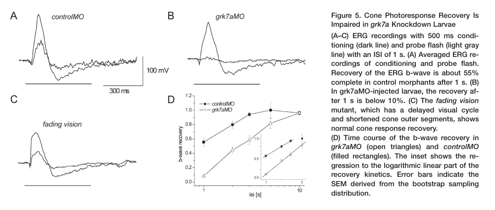

## Question

# Gene Research for Functional Annotation

## ⚠️ CRITICAL: Gene/Protein Identification Context

**BEFORE YOU BEGIN RESEARCH:** You MUST verify you are researching the CORRECT gene/protein. Gene symbols can be ambiguous, especially for less well-characterized genes from non-model organisms.

### Target Gene/Protein Identity (from UniProt):
- **UniProt Accession:** Q1XHL7
- **Protein Description:** RecName: Full=Rhodopsin kinase grk7-b; EC=2.7.11.14 {ECO:0000269|PubMed:16787417}; AltName: Full=G protein-coupled receptor kinase 7-2; AltName: Full=G protein-coupled receptor kinase 7B; Flags: Precursor;
- **Gene Information:** Name=grk7b; Synonyms=grk7-2;
- **Organism (full):** Danio rerio (Zebrafish) (Brachydanio rerio).
- **Protein Family:** Belongs to the protein kinase superfamily. AGC Ser/Thr
- **Key Domains:** AGC-kinase_C. (IPR000961); GPCR_kinase. (IPR000239); Kinase-like_dom_sf. (IPR011009); Prot_kinase_dom. (IPR000719); Protein_kinase_ATP_BS. (IPR017441)

### MANDATORY VERIFICATION STEPS:

1. **Check if the gene symbol "grk7b" matches the protein description above**
2. **Verify the organism is correct:** Danio rerio (Zebrafish) (Brachydanio rerio).
3. **Check if protein family/domains align with what you find in literature**
4. **If you find literature for a DIFFERENT gene with the same or similar symbol, STOP**

### If Gene Symbol is Ambiguous or You Cannot Find Relevant Literature:

**DO NOT PROCEED WITH RESEARCH ON A DIFFERENT GENE.** Instead:
- State clearly: "The gene symbol 'grk7b' is ambiguous or literature is limited for this specific protein"
- Explain what you found (e.g., "Found extensive literature on a different gene with the same symbol in a different organism")
- Describe the protein based ONLY on the UniProt information provided above
- Suggest that the protein function can be inferred from domain/family information

### Research Target:

Please provide a comprehensive research report on the gene **grk7b** (gene ID: grk7b, UniProt: Q1XHL7) in DANRE.

The research report should be a detailed narrative explaining the function, biological processes, and localization of the gene product. Citations should be given for all claims.

You should prioritize authoritative reviews and primary scientific literature when conducting research. You can supplement
this with annotations you find in gene/protein databases, but these can be outdated or inaccurate.

We are specifically interested in the primary function of the gene - for enzymes, what reaction is catalyzed, and what is the substrate specificity? For transporters, what is the substrate? For structural proteins or adapters, what is the broader structural role? For signaling molecules, what is the role in the pathway.

We are interested in where in or outside the cell the gene product carries out its function.

We are also interested in the signaling or biochemical pathways in which the gene functions. We are less interested in broad pleiotropic effects, except where these elucidate the precise role.

Include evidence where possible. We are interested in both experimental evidence as well as inference from structure, evolution, or bioinformatic analysis. Precise studies should be prioritized over high-throughput, where available.

## Output

Question: You are an expert researcher providing comprehensive, well-cited information.

Provide detailed information focusing on:
1. Key concepts and definitions with current understanding
2. Recent developments and latest research (prioritize 2023-2024 sources)
3. Current applications and real-world implementations
4. Expert opinions and analysis from authoritative sources
5. Relevant statistics and data from recent studies

Format as a comprehensive research report with proper citations. Include URLs and publication dates where available.
Always prioritize recent, authoritative sources and provide specific citations for all major claims.

# Gene Research for Functional Annotation

## ⚠️ CRITICAL: Gene/Protein Identification Context

**BEFORE YOU BEGIN RESEARCH:** You MUST verify you are researching the CORRECT gene/protein. Gene symbols can be ambiguous, especially for less well-characterized genes from non-model organisms.

### Target Gene/Protein Identity (from UniProt):
- **UniProt Accession:** Q1XHL7
- **Protein Description:** RecName: Full=Rhodopsin kinase grk7-b; EC=2.7.11.14 {ECO:0000269|PubMed:16787417}; AltName: Full=G protein-coupled receptor kinase 7-2; AltName: Full=G protein-coupled receptor kinase 7B; Flags: Precursor;
- **Gene Information:** Name=grk7b; Synonyms=grk7-2;
- **Organism (full):** Danio rerio (Zebrafish) (Brachydanio rerio).
- **Protein Family:** Belongs to the protein kinase superfamily. AGC Ser/Thr
- **Key Domains:** AGC-kinase_C. (IPR000961); GPCR_kinase. (IPR000239); Kinase-like_dom_sf. (IPR011009); Prot_kinase_dom. (IPR000719); Protein_kinase_ATP_BS. (IPR017441)

### MANDATORY VERIFICATION STEPS:

1. **Check if the gene symbol "grk7b" matches the protein description above**
2. **Verify the organism is correct:** Danio rerio (Zebrafish) (Brachydanio rerio).
3. **Check if protein family/domains align with what you find in literature**
4. **If you find literature for a DIFFERENT gene with the same or similar symbol, STOP**

### If Gene Symbol is Ambiguous or You Cannot Find Relevant Literature:

**DO NOT PROCEED WITH RESEARCH ON A DIFFERENT GENE.** Instead:
- State clearly: "The gene symbol 'grk7b' is ambiguous or literature is limited for this specific protein"
- Explain what you found (e.g., "Found extensive literature on a different gene with the same symbol in a different organism")
- Describe the protein based ONLY on the UniProt information provided above
- Suggest that the protein function can be inferred from domain/family information

### Research Target:

Please provide a comprehensive research report on the gene **grk7b** (gene ID: grk7b, UniProt: Q1XHL7) in DANRE.

The research report should be a detailed narrative explaining the function, biological processes, and localization of the gene product. Citations should be given for all claims.

You should prioritize authoritative reviews and primary scientific literature when conducting research. You can supplement
this with annotations you find in gene/protein databases, but these can be outdated or inaccurate.

We are specifically interested in the primary function of the gene - for enzymes, what reaction is catalyzed, and what is the substrate specificity? For transporters, what is the substrate? For structural proteins or adapters, what is the broader structural role? For signaling molecules, what is the role in the pathway.

We are interested in where in or outside the cell the gene product carries out its function.

We are also interested in the signaling or biochemical pathways in which the gene functions. We are less interested in broad pleiotropic effects, except where these elucidate the precise role.

Include evidence where possible. We are interested in both experimental evidence as well as inference from structure, evolution, or bioinformatic analysis. Precise studies should be prioritized over high-throughput, where available.

## Research report: zebrafish **grk7b** (UniProt **Q1XHL7**) — functional annotation for Rhodopsin kinase GRK7-B

### 0) Target verification (critical identity checks)
The research target is **Danio rerio (zebrafish) grk7b**, encoding a **G protein–coupled receptor kinase 7 (GRK7) paralog** (an opsin/rhodopsin kinase family member). Multiple zebrafish studies explicitly document that zebrafish possess **two GRK7 paralogs, grk7a and grk7b**, consistent with UniProt’s naming and with teleost genome duplication. (rinner2005knockdownofconespecific pages 1-2, chrispell2018grk1bandgrk7a pages 5-5). An anti-GRK7 antibody was validated to detect **recombinant zebrafish Grk7a and Grk7b** (and not Grk1), supporting that **Grk7b is indeed a zebrafish GRK7-family opsin kinase** rather than an unrelated protein with a similar symbol. (chrispell2018grk1bandgrk7a pages 5-5)

### 1) Key concepts & current understanding (definitions and pathway context)

#### 1.1 What GRK7B is (definition)
GRK7 proteins are **retinal G protein–coupled receptor kinases** (“opsin kinases”) that act in photoreceptors by **phosphorylating activated visual pigments (opsins)** to promote termination/recovery of phototransduction. In vertebrate photoreceptors, GRK-mediated phosphorylation is a key step enabling downstream shutoff reactions (classically via arrestin binding) and thereby shaping response kinetics and adaptation. (chrispell2022grk7butnot pages 1-4)

The **current consensus** is that vertebrate retinal GRKs exist mainly as **GRK1 (rod-predominant; in some species also cones)** and **GRK7 (cone-predominant/cone-specific)** paralogs. (erofeeva2023multiplerolesof pages 4-5)

#### 1.2 Enzymatic function and inferred substrate specificity
Direct, paralog-resolved biochemical substrate profiling for **zebrafish Grk7b** is limited in the retrieved corpus. However, zebrafish GRK7 paralogs are consistently discussed as **cone opsin kinases** that act on **photoactivated cone opsins/visual pigments**; thus the primary substrate specificity for grk7b is best annotated as **activated cone opsins (visual pigments) in cone photoreceptors (especially UV cones in adults; see expression evidence below)**. (ogawa2021partitioningofgene pages 2-3, chrispell2022grk7butnot pages 1-4)

#### 1.3 Pathway placement
GRK7-family activity sits in the **phototransduction recovery/termination module**, upstream of return to baseline electrical state and completion of response recovery. In zebrafish, GRK7-family function is experimentally linked to **cone response recovery** and **dark adaptation** kinetics in larval assays (predominantly via grk7a perturbation; see below). (rinner2005knockdownofconespecific pages 6-7, rinner2005knockdownofconespecific pages 1-2)

### 2) Expression, localization, and paralog specialization (grk7a vs grk7b)

#### 2.1 Adult retinal cell-type specificity: grk7b is UV-cone enriched
A high-confidence, gene-specific finding is that **grk7b is enriched in adult UV cones**. In a single-cell RNA-seq atlas of adult zebrafish photoreceptors (2,186 high-quality cells), **grk7b** appears among rare genes that are highly specific to a single cone subtype and is annotated as **(UV)**-enriched. (ogawa2021partitioningofgene pages 2-3, ogawa2021partitioningofgene pages 3-5)

This provides the most direct, zebrafish-retina-specific support for assigning GRK7B function specifically to the **UV-cone phototransduction recovery/termination machinery**.

#### 2.2 Larval retina: GRK7 signal is dominated by grk7a, not grk7b
In larval zebrafish, multiple lines of evidence indicate **grk7a is the predominant cone-expressed GRK7 paralog during early development**, while grk7b expression is comparatively low in photoreceptors at these stages. Rinner et al. reported stronger cone expression for grk7a than grk7b and focused functional experiments on grk7a. (rinner2005knockdownofconespecific pages 1-2)

Consistent with that, Chrispell et al. showed that at 5 dpf, loss of grk7a yields **undetectable GRK7 immunoreactivity**, implying the larval retinal GRK7 protein detected by anti-GRK7 is largely grk7a-derived. (chrispell2018grk1bandgrk7a pages 5-5)

#### 2.3 Pineal expression and functional contribution
grk7b transcripts are detected in zebrafish **pineal tissue** by in situ hybridization. (shen2021functionalidentificationof pages 1-2)

Functionally, however, for pineal parapinopsin photoproduct inactivation, **GRK7a** knockdown slows recovery while **GRK7b** knockdown does **not** show a remarkable effect, suggesting grk7b is not the primary kinase for that pineal assay context. (shen2021functionalidentificationof pages 1-2)

### 3) Functional evidence, phenotypes, and quantitative data

#### 3.1 Strong functional phenotypes for GRK7-family in zebrafish cones (via grk7a)
While these phenotypes are experimentally attributed mainly to **grk7a** (not grk7b), they establish the **mechanistic role of GRK7-family opsin kinases** in cone phototransduction recovery in zebrafish.

Rinner et al. used morpholino knockdown of grk7a and showed:
- **Cone photoresponse recovery delay** (paired/double-flash recovery) with roughly **~3× slower recovery** (half-life ~**0.9 s** control vs ~**2.4 s** morphants) as shown in the figure panel. (rinner2005knockdownofconespecific media f3e63c86)
- **Delayed dark adaptation after bleach**: ERG b-wave recovery half-life ~**5 s** in controls (**n=7**) vs ~**35 s** in grk7a morphants (**n=6**). (rinner2005knockdownofconespecific pages 6-7)
- **Behavioral impairment** in temporal contrast sensitivity (OKR), particularly at temporal frequencies >1 cycles/s under light-adapted conditions. (rinner2005knockdownofconespecific pages 6-7)

These measurements demonstrate that loss of cone opsin kinase activity substantially slows recovery and adaptation in cone-dominant larval zebrafish, supporting the canonical function of GRK7-family enzymes as opsin kinases. (rinner2005knockdownofconespecific pages 6-7, rinner2005knockdownofconespecific media f3e63c86)

#### 3.2 Cone GRKs in zebrafish: relative protein levels and modest knockout phenotypes
Chrispell et al. generated grk7a and grk1b knockouts and quantified GRK levels:
- **Grk7:Grk1 immunoreactivity ratio ~0.8 at 5 dpf** (similar to adult retina in their assay). (chrispell2018grk1bandgrk7a pages 5-5)
Functionally, they report that deletion of either grk1b or grk7a modestly reduces the rate of recovery of the isolated cone mass receptor potential, with mild OKR changes. (chrispell2018grk1bandgrk7a pages 1-2, chrispell2018grk1bandgrk7a pages 7-8)

Grk7b in that study appears primarily as a recombinant standard for antibody validation, underscoring that most direct early-life cone physiology is currently grk7a-centric. (chrispell2018grk1bandgrk7a pages 5-5, chrispell2018grk1bandgrk7a pages 2-3)

#### 3.3 cAMP/PKA regulation and adaptation-like modulation of cone recovery
A major mechanistic theme is **cAMP/PKA-dependent phosphorylation of retinal GRKs**, which modulates kinase activity and thereby photoreceptor recovery/adaptation.

- A 2023 review summarizes that GRK1 and GRK7 are **PKA-phosphorylated** and that phosphorylation **inhibits rhodopsin kinase activity**, proposed as a mechanism to downregulate GRKs in darkness when cAMP is elevated; it further notes paralog/cell-type specificity (e.g., zebrafish cones show cAMP downregulates GRK7 but not cone GRK1b). (erofeeva2023multiplerolesof pages 4-5)
- In zebrafish larvae, forskolin elevation of cAMP produces a robust delay in cone recovery (**F(1,350)=115.6; p<0.0001**) and genetic tests show this effect is mediated by **grk7a** rather than grk1b (no significant effect in grk7a-/-: **F(1,340)=2.363; p=0.1252**). (chrispell2022grk7butnot pages 10-13)
- Biochemically, GRK7 phosphorylation is strongly light/dark regulated: ~**10-fold** higher in vehicle-treated dark vs light conditions in the larval retina, and increased further with forskolin. (chrispell2022grk7butnot pages 10-13)

Because anti-GRK7 reagents commonly recognize both GRK7 paralogs, the phosphorylation assays are largely **paralog-nonresolving**, but the functional dependence on grk7a indicates that at larval stages grk7a is the principal effector. (chrispell2022grk7butnot pages 10-13)

### 4) Recent developments (prioritizing 2023–2024 where available)

#### 4.1 2023: retina cAMP review consolidates GRK7 regulatory model
The 2023 *Cells* review emphasizes that retinal cAMP levels vary with circadian/light state and that **GRK1/GRK7 are among phototransduction components modulated by PKA phosphorylation**, shaping adaptation dynamics. This supports annotation of GRK7B not only as an opsin kinase but also as a node that can be **regulated by cAMP/PKA signaling**, likely linking environmental lighting and circadian state to cone recovery kinetics. (erofeeva2023multiplerolesof pages 4-5)

#### 4.2 2021–2022 to present: increasing paralog resolution via single-cell transcriptomics
Although the scRNA-seq study is 2021, it reflects a recent methodological shift enabling **cone-subtype-specific annotation**. This is crucial for grk7b, because it provides **direct evidence of UV-cone enrichment**—information that older larval physiology studies could not resolve. (ogawa2021partitioningofgene pages 2-3, ogawa2021partitioningofgene pages 3-5)

### 5) Current applications and real-world implementations

#### 5.1 Zebrafish vision assays as implementation platform for opsin-kinase function
Zebrafish larval systems provide standardized, high-throughput functional assays:
- **OKR** (behavioral, vision-guided eye movement) and **ERG** (physiology) have been used to quantify how GRK perturbations alter sensitivity, temporal resolution, and adaptation. (rinner2005knockdownofconespecific pages 6-7, chrispell2018grk1bandgrk7a pages 1-2)
- Quantitative examples: bleaching recovery half-life (**5 s vs 35 s**) and OKR temporal-frequency-specific deficits after opsin-kinase knockdown. (rinner2005knockdownofconespecific pages 6-7)

#### 5.2 Transgenic GRK7 tools: GRK7B line shifts rod behavior to brighter intensities
A practical implementation of GRK7 manipulation is ectopic expression of cone GRK7 in rods. In GRK7 transgenic larvae, rod-driven OKR intensity–response curves shift rightward, with peak sensitivity moving from log intensity **−2.6** (non-transgenic) to **−2.0** (GRK7-tg), ~**4-fold** higher light required; this was statistically significant and used **n=16 GRK7-tg** and **n=19 controls**. (vogalis2011ectopicexpressionof pages 21-22)

This illustrates how GRK7-family expression level/identity can be used as an experimental “dial” to alter photoreceptor sensitivity and kinetics in vivo. (vogalis2011ectopicexpressionof pages 21-22)

### 6) Expert synthesis and functional-annotation statement for **grk7b (Q1XHL7)**

#### 6.1 Most defensible primary function annotation (supported by direct evidence + constrained inference)
- **Molecular function**: serine/threonine **protein kinase (opsin kinase)** that phosphorylates **photoactivated cone opsins/visual pigments**, promoting termination and recovery of phototransduction. This is supported at the family level and by zebrafish GRK7 biology, though direct grk7b enzymology is limited in the retrieved corpus. (chrispell2022grk7butnot pages 1-4)
- **Biological process**: phototransduction **termination/recovery** and **adaptation** dynamics in cones, plausibly especially in **UV cones** given adult enrichment. (ogawa2021partitioningofgene pages 2-3, ogawa2021partitioningofgene pages 3-5)
- **Cellular component / site of action**: expected to act in cone photoreceptors, classically associated with the **outer segment** where opsins reside; direct outer-segment localization is best established for grk7a but supports family-level annotation. (rinner2005knockdownofconespecific pages 1-2)
- **Paralog specialization**: grk7b shows **UV-cone enrichment in adult retina** (strongest direct retinal grk7b evidence), whereas grk7a dominates larval cone GRK7 function and phenotypes. (ogawa2021partitioningofgene pages 2-3, rinner2005knockdownofconespecific pages 1-2)

#### 6.2 Key limitations (important for correct annotation)
- Many biochemical and phosphorylation assays use antibodies that recognize **both GRK7 paralogs**, limiting paralog-resolved conclusions for phosphorylation state and abundance. (chrispell2022grk7butnot pages 10-13)
- Direct retinal loss-of-function phenotyping for **grk7b** (as opposed to grk7a) is sparse in the currently retrieved set; the strongest direct retinal evidence for grk7b is transcriptomic (UV-cone enrichment). (ogawa2021partitioningofgene pages 2-3)

### 7) Evidence summary table
The following table consolidates major claims, quantitative data, and limitations.

| Topic | Key finding | Evidence details (include numeric values) | Primary source (author year journal) | URL | Notes/limitations |
|---|---|---|---|---|---|
| Identity | **grk7b is the second zebrafish GRK7 paralog** and belongs to the cone/opsin kinase branch of retinal GRKs | Zebrafish have **two GRK7 paralogs, grk7a and grk7b**; anti-GRK7 antibodies detect recombinant **Grk7a and Grk7b** but not Grk1, confirming paralog identity within the GRK7 family (rinner2005knockdownofconespecific pages 1-2, chrispell2018grk1bandgrk7a pages 5-5) | Rinner et al. 2005 *Neuron*; Chrispell et al. 2018 *IOVS* | https://doi.org/10.1016/j.neuron.2005.06.010 ; https://doi.org/10.1167/iovs.18-24455 | UniProt Q1XHL7 matches zebrafish **grk7b/GRK7B**; much of functional literature focuses on **grk7a**, so paralog distinction is essential |
| Expression | **Adult retinal grk7b is enriched in UV cones** | Adult scRNA-seq profiled **2,186 high-quality photoreceptors** and identified **grk7b** among rare genes highly specific to **UV cones**; broader analysis found ~**1,100 DEGs** across clusters and **59/63 phototransduction genes** differentially expressed among photoreceptor/bipolar populations (ogawa2021partitioningofgene pages 2-3, ogawa2021partitioningofgene pages 3-5) | Ogawa & Corbo 2021 *Scientific Reports* | https://doi.org/10.1038/s41598-021-96837-z | Strongest direct grk7b-specific retinal evidence is transcriptomic and from **adult** retina; not a direct protein localization study |
| Expression | **Larval retina is dominated by grk7a, not grk7b** | In larval zebrafish, immunoreactive GRK7 signal is largely lost in **grk7a-/-** animals; authors infer **grk7a** is the predominant larval cone paralog. Grk7:Grk1 immunoreactivity ratio at **5 dpf = 0.8**; neither detected at **1–3 dpf** (chrispell2018grk1bandgrk7a pages 5-5) | Chrispell et al. 2018 *IOVS* | https://doi.org/10.1167/iovs.18-24455 | Important for annotation: absence of strong larval retinal GRK7 signal should not be over-attributed to grk7b |
| Localization | **grk7b is present in pineal tissue** in zebrafish larvae | In situ hybridization detected **GRK1b, GRK7a, and GRK7b** in the pineal organ; however, double-labeling did **not** convincingly show coexpression of GRK7b with parapinopsin cells (shen2021functionalidentificationof pages 1-2) | Shen et al. 2021 *Zoological Letters* | https://doi.org/10.1186/s40851-021-00171-1 | Pineal localization is supported at the tissue level, but cell-type resolution for **GRK7b** remains limited |
| Localization | **GRK7 family proteins function in cone outer segments**, but direct outer-segment localization is best established for grk7a | Earlier zebrafish work states GRK7 is a cone-specific kinase in teleost **cone outer segments**; deficiency of **Grk7a**, which is expressed in cone outer segments, delays cone recovery and dark adaptation (rinner2005knockdownofconespecific pages 1-2) | Rinner et al. 2005 *Neuron* | https://doi.org/10.1016/j.neuron.2005.06.010 | This supports family-level localization/function; direct **grk7b** outer-segment protein localization remains sparse |
| Function | **GRK7B is inferred to be an opsin kinase that phosphorylates activated cone opsins to terminate signaling** | Retinal GRKs (GRK1/GRK7) phosphorylate photoactivated visual pigments to enable arrestin binding and recovery; recent review emphasizes **GRK7 is cone-specific** and cAMP/PKA can downregulate its activity in darkness (erofeeva2023multiplerolesof pages 4-5, chrispell2022grk7butnot pages 1-4) | Erofeeva et al. 2023 *Cells*; Chrispell et al. 2022 *bioRxiv* | https://doi.org/10.3390/cells12081157 ; https://doi.org/10.1101/2022.06.23.497385 | Substrate specificity is inferred for **cone opsins/activated visual pigments**; most direct zebrafish functional proof is for **grk7a** rather than grk7b |
| Function | **grk7b is not the main kinase for parapinopsin photoproduct inactivation in larval pineal cells** | Morpholino knockdown of **GRK7a** slowed calcium-response recovery in parapinopsin cells, whereas **GRK7b knockdown did not have a remarkable effect**; knockdowns caused no gross pineal-size abnormality (shen2021functionalidentificationof pages 1-2) | Shen et al. 2021 *Zoological Letters* | https://doi.org/10.1186/s40851-021-00171-1 | This is one of the few direct grk7b perturbation datasets; negative result suggests context-specific or minor role in this pineal assay |
| Regulation | **GRK7 family activity is modulated by cAMP/PKA-dependent phosphorylation** | GRK7 is a PKA substrate; human GRK7 Ser36 corresponds to **zebrafish Ser33**. In larval zebrafish, Grk7 phosphorylation is ~**10-fold** higher in vehicle-treated **dark** vs **light** conditions, and forskolin further increases phosphorylation (chrispell2022grk7butnot pages 10-13, erofeeva2023multiplerolesof pages 4-5) | Chrispell et al. 2022 *bioRxiv*; Erofeeva et al. 2023 *Cells* | https://doi.org/10.1101/2022.06.23.497385 ; https://doi.org/10.3390/cells12081157 | Antibodies recognize **both Grk7 paralogs**, so current phosphorylation data are largely **paralog-nonresolving** |
| Regulation | **In zebrafish cones, the cAMP/forskolin phenotype is mediated by grk7a, not grk1b** | Forskolin significantly delayed cone recovery: **F(1,350)=115.6, p<0.0001**; effect persisted in **grk1b-/-** (**F(1,224)=17.82, p<0.0001**) but not in **grk7a-/-** (**F(1,340)=2.363, p=0.1252**) (chrispell2022grk7butnot pages 10-13) | Chrispell et al. 2022 *bioRxiv* | https://doi.org/10.1101/2022.06.23.497385 | Demonstrates GRK7-family regulatory importance in cones, but does not isolate **grk7b** because larval cone phenotype is dominated by **grk7a** |
| Phenotypes | **Major retinal recovery phenotypes in larvae are linked to grk7a depletion, not grk7b** | **grk7a** knockdown delayed cone response recovery by roughly **3-fold**; double-flash recovery half-life ~**2.4 s** vs ~**0.9 s** in controls; dark-adaptation/bleach recovery half-life ~**35 s** vs ~**5 s** (**n=6** morphants, **n=7** controls) (rinner2005knockdownofconespecific pages 7-8, rinner2005knockdownofconespecific pages 6-7, rinner2005knockdownofconespecific media f3e63c86) | Rinner et al. 2005 *Neuron* | https://doi.org/10.1016/j.neuron.2005.06.010 | Included to distinguish paralogs: strong larval retinal phenotype should not be assigned to **grk7b** without direct evidence |
| Applications | **GRK7B has been used as a transgenic tool to reprogram rod physiology** | Tol2 transgenesis generated **GRK7B, GRK7D, GRK7E** lines expressing cone GRK7 in rods; GRK7 transgenics showed lower rod sensitivity and altered kinetics, making rods more cone-like in some respects (vogalis2011ectopicexpressionof pages 2-3, vogalis2011ectopicexpressionof pages 5-7, vogalis2011ectopicexpressionof pages 1-2) | Vogalis et al. 2011 *Journal of Physiology* | https://doi.org/10.1113/jphysiol.2010.204156 | Paper refers to cone GRK7/GRK7–1 and transgenic line names (including **GRK7B**); useful as a physiological tool, but not a native-loss-of-function test of endogenous grk7b |
| Quant stats | **GRK7 transgenics shift rod-driven visual behavior to brighter intensities** | In OKR assays, non-transgenic larvae peaked at log intensity **−2.6**, GRK7-transgenic larvae at **−2.0** (~**4-fold** higher required light intensity); significant at **P=0.011** (1.5 rpm) and **P=0.00020** (3 rpm); behavioral averages from **16 GRK7-tg** and **19 non-tg** larvae (vogalis2011ectopicexpressionof pages 21-22) | Vogalis et al. 2011 *Journal of Physiology* | https://doi.org/10.1113/jphysiol.2010.204156 | Strong quantitative application metric for GRK7B-like transgenic manipulation; not direct endogenous grk7b annotation |
| Applications | **Zebrafish grk7/grk1 models are widely used for cone-function assays relevant to human-like phototransduction organization** | 4–6 dpf zebrafish are cone-dominant and suitable for **ERG**, **paired-flash recovery**, **bleach recovery**, and **OKR** assays; genome-edited **grk7a/grk1b** lines and cone-specific **PKA transgenics** are established tools (chrispell2018grk1bandgrk7a pages 1-2, chrispell2022grk7butnot pages 1-4, chrispell2018grk1bandgrk7a pages 3-5) | Chrispell et al. 2018 *IOVS*; Chrispell et al. 2022 *bioRxiv* | https://doi.org/10.1167/iovs.18-24455 ; https://doi.org/10.1101/2022.06.23.497385 | Real-world implementation value is high, but most current manipulations remain **grk7a-centric** rather than grk7b-specific |
| Notes/overall limitation | **Functional annotation of grk7b is partly direct and partly inferred from paralog/family biology** | Direct evidence for **grk7b**: paralog identity, UV-cone enrichment, pineal expression, antibody recognition, minimal effect in pineal knockdown. Stronger direct physiology exists for **grk7a** and GRK7-family manipulation. Antibody cross-reactivity and lack of grk7b-specific knockout phenotyping limit precision (chrispell2018grk1bandgrk7a pages 5-5, ogawa2021partitioningofgene pages 2-3, shen2021functionalidentificationof pages 1-2, chrispell2022grk7butnot pages 10-13) | Multiple primary sources | https://doi.org/10.1167/iovs.18-24455 ; https://doi.org/10.1038/s41598-021-96837-z ; https://doi.org/10.1186/s40851-021-00171-1 ; https://doi.org/10.1101/2022.06.23.497385 | Best current annotation: **zebrafish GRK7B is a cone/pineal GRK7-family opsin kinase, enriched in adult UV cones, likely contributing to phototransduction termination, but with limited direct paralog-specific functional testing compared with grk7a** |

*Table: This table summarizes the strongest available functional-annotation evidence for zebrafish grk7b (UniProt Q1XHL7), while explicitly separating direct grk7b data from family- or grk7a-based inference. It is useful for distinguishing what is experimentally established versus what remains limited by paralog specificity.*

### 8) Key figure evidence (visual)
Quantitative phenotypes supporting GRK7-family opsin-kinase roles in zebrafish cones (via grk7a knockdown) are shown in the retrieved figure panels demonstrating ~3× slower recovery and bleach recovery half-lives (~5 s vs ~35 s). (rinner2005knockdownofconespecific media f3e63c86, rinner2005knockdownofconespecific media 98d4936c)

### 9) References (URLs and publication dates in retrieved sources)
- Rinner O. et al. **2005-07**. *Neuron*. “Knockdown of Cone-Specific Kinase GRK7 in Larval Zebrafish Leads to Impaired Cone Response Recovery and Delayed Dark Adaptation.” https://doi.org/10.1016/j.neuron.2005.06.010 (rinner2005knockdownofconespecific pages 6-7, rinner2005knockdownofconespecific media f3e63c86)
- Vogalis F. et al. **2011-05**. *The Journal of Physiology*. “Ectopic expression of cone-specific GRK7 in zebrafish rods…” https://doi.org/10.1113/jphysiol.2010.204156 (vogalis2011ectopicexpressionof pages 21-22)
- Ogawa Y., Corbo J.C. **2021-08**. *Scientific Reports*. “Partitioning of gene expression among zebrafish photoreceptor subtypes.” https://doi.org/10.1038/s41598-021-96837-z (ogawa2021partitioningofgene pages 2-3)
- Shen B. et al. **2021-02**. *Zoological Letters*. “Functional identification of an opsin kinase…” https://doi.org/10.1186/s40851-021-00171-1 (shen2021functionalidentificationof pages 1-2)
- Erofeeva N. et al. **2023-04**. *Cells*. “Multiple Roles of cAMP in Vertebrate Retina.” https://doi.org/10.3390/cells12081157 (erofeeva2023multiplerolesof pages 4-5)
- Chrispell J.D. et al. **2022-06** (preprint). *bioRxiv*. “Grk7 but not Grk1 undergoes cAMP-dependent phosphorylation…” https://doi.org/10.1101/2022.06.23.497385 (chrispell2022grk7butnot pages 10-13)

References

1. (rinner2005knockdownofconespecific pages 1-2): Oliver Rinner, Yuri V. Makhankov, Oliver Biehlmaier, and Stephan C.F. Neuhauss. Knockdown of cone-specific kinase grk7 in larval zebrafish leads to impaired cone response recovery and delayed dark adaptation. Neuron, 47:231-242, Jul 2005. URL: https://doi.org/10.1016/j.neuron.2005.06.010, doi:10.1016/j.neuron.2005.06.010. This article has 106 citations and is from a highest quality peer-reviewed journal.

2. (chrispell2018grk1bandgrk7a pages 5-5): Jared D. Chrispell, Enheng Dong, Shoji Osawa, Jiandong Liu, D. Joshua Cameron, and Ellen R. Weiss. Grk1b and grk7a both contribute to the recovery of the isolated cone photoresponse in larval zebrafish. Investigative Ophthalmology & Visual Science, 59:5116-5124, Oct 2018. URL: https://doi.org/10.1167/iovs.18-24455, doi:10.1167/iovs.18-24455. This article has 27 citations and is from a domain leading peer-reviewed journal.

3. (chrispell2022grk7butnot pages 1-4): Jared D. Chrispell, Yubin Xiong, and Ellen R. Weiss. Grk7 but not grk1 undergoes camp-dependent phosphorylation in zebrafish cone photoreceptors in the dark and mediates recovery of the cone photoresponse in response to forskolin. bioRxiv, Jun 2022. URL: https://doi.org/10.1101/2022.06.23.497385, doi:10.1101/2022.06.23.497385. This article has 2 citations.

4. (erofeeva2023multiplerolesof pages 4-5): Natalia Erofeeva, Darya Meshalkina, and Michael Firsov. Multiple roles of camp in vertebrate retina. Cells, 12:1157, Apr 2023. URL: https://doi.org/10.3390/cells12081157, doi:10.3390/cells12081157. This article has 15 citations.

5. (ogawa2021partitioningofgene pages 2-3): Yohey Ogawa and Joseph C. Corbo. Partitioning of gene expression among zebrafish photoreceptor subtypes. Scientific Reports, Aug 2021. URL: https://doi.org/10.1038/s41598-021-96837-z, doi:10.1038/s41598-021-96837-z. This article has 51 citations and is from a peer-reviewed journal.

6. (rinner2005knockdownofconespecific pages 6-7): Oliver Rinner, Yuri V. Makhankov, Oliver Biehlmaier, and Stephan C.F. Neuhauss. Knockdown of cone-specific kinase grk7 in larval zebrafish leads to impaired cone response recovery and delayed dark adaptation. Neuron, 47:231-242, Jul 2005. URL: https://doi.org/10.1016/j.neuron.2005.06.010, doi:10.1016/j.neuron.2005.06.010. This article has 106 citations and is from a highest quality peer-reviewed journal.

7. (ogawa2021partitioningofgene pages 3-5): Yohey Ogawa and Joseph C. Corbo. Partitioning of gene expression among zebrafish photoreceptor subtypes. Scientific Reports, Aug 2021. URL: https://doi.org/10.1038/s41598-021-96837-z, doi:10.1038/s41598-021-96837-z. This article has 51 citations and is from a peer-reviewed journal.

8. (shen2021functionalidentificationof pages 1-2): Baoguo Shen, Seiji Wada, Haruka Nishioka, Takashi Nagata, Emi Kawano-Yamashita, Mitsumasa Koyanagi, and Akihisa Terakita. Functional identification of an opsin kinase underlying inactivation of the pineal bistable opsin parapinopsin in zebrafish. Zoological Letters, Feb 2021. URL: https://doi.org/10.1186/s40851-021-00171-1, doi:10.1186/s40851-021-00171-1. This article has 10 citations and is from a peer-reviewed journal.

9. (rinner2005knockdownofconespecific media f3e63c86): Oliver Rinner, Yuri V. Makhankov, Oliver Biehlmaier, and Stephan C.F. Neuhauss. Knockdown of cone-specific kinase grk7 in larval zebrafish leads to impaired cone response recovery and delayed dark adaptation. Neuron, 47:231-242, Jul 2005. URL: https://doi.org/10.1016/j.neuron.2005.06.010, doi:10.1016/j.neuron.2005.06.010. This article has 106 citations and is from a highest quality peer-reviewed journal.

10. (chrispell2018grk1bandgrk7a pages 1-2): Jared D. Chrispell, Enheng Dong, Shoji Osawa, Jiandong Liu, D. Joshua Cameron, and Ellen R. Weiss. Grk1b and grk7a both contribute to the recovery of the isolated cone photoresponse in larval zebrafish. Investigative Ophthalmology & Visual Science, 59:5116-5124, Oct 2018. URL: https://doi.org/10.1167/iovs.18-24455, doi:10.1167/iovs.18-24455. This article has 27 citations and is from a domain leading peer-reviewed journal.

11. (chrispell2018grk1bandgrk7a pages 7-8): Jared D. Chrispell, Enheng Dong, Shoji Osawa, Jiandong Liu, D. Joshua Cameron, and Ellen R. Weiss. Grk1b and grk7a both contribute to the recovery of the isolated cone photoresponse in larval zebrafish. Investigative Ophthalmology & Visual Science, 59:5116-5124, Oct 2018. URL: https://doi.org/10.1167/iovs.18-24455, doi:10.1167/iovs.18-24455. This article has 27 citations and is from a domain leading peer-reviewed journal.

12. (chrispell2018grk1bandgrk7a pages 2-3): Jared D. Chrispell, Enheng Dong, Shoji Osawa, Jiandong Liu, D. Joshua Cameron, and Ellen R. Weiss. Grk1b and grk7a both contribute to the recovery of the isolated cone photoresponse in larval zebrafish. Investigative Ophthalmology & Visual Science, 59:5116-5124, Oct 2018. URL: https://doi.org/10.1167/iovs.18-24455, doi:10.1167/iovs.18-24455. This article has 27 citations and is from a domain leading peer-reviewed journal.

13. (chrispell2022grk7butnot pages 10-13): Jared D. Chrispell, Yubin Xiong, and Ellen R. Weiss. Grk7 but not grk1 undergoes camp-dependent phosphorylation in zebrafish cone photoreceptors in the dark and mediates recovery of the cone photoresponse in response to forskolin. bioRxiv, Jun 2022. URL: https://doi.org/10.1101/2022.06.23.497385, doi:10.1101/2022.06.23.497385. This article has 2 citations.

14. (vogalis2011ectopicexpressionof pages 21-22): Fivos Vogalis, T. Shiraki, Daisuke Kojima, Yasutaka Wada, Y. Nishiwaki, J. Jarvinen, J. Jarvinen, Junichi Sugiyama, Koichi Kawakami, Koichi Kawakami, I. Masai, Satoru Kawamura, Yoshitaka Fukada, and Trevor D. Lamb. Ectopic expression of cone‐specific g‐protein‐coupled receptor kinase grk7 in zebrafish rods leads to lower photosensitivity and altered responses. The Journal of Physiology, 589:2321-2348, May 2011. URL: https://doi.org/10.1113/jphysiol.2010.204156, doi:10.1113/jphysiol.2010.204156. This article has 40 citations.

15. (rinner2005knockdownofconespecific pages 7-8): Oliver Rinner, Yuri V. Makhankov, Oliver Biehlmaier, and Stephan C.F. Neuhauss. Knockdown of cone-specific kinase grk7 in larval zebrafish leads to impaired cone response recovery and delayed dark adaptation. Neuron, 47:231-242, Jul 2005. URL: https://doi.org/10.1016/j.neuron.2005.06.010, doi:10.1016/j.neuron.2005.06.010. This article has 106 citations and is from a highest quality peer-reviewed journal.

16. (vogalis2011ectopicexpressionof pages 2-3): Fivos Vogalis, T. Shiraki, Daisuke Kojima, Yasutaka Wada, Y. Nishiwaki, J. Jarvinen, J. Jarvinen, Junichi Sugiyama, Koichi Kawakami, Koichi Kawakami, I. Masai, Satoru Kawamura, Yoshitaka Fukada, and Trevor D. Lamb. Ectopic expression of cone‐specific g‐protein‐coupled receptor kinase grk7 in zebrafish rods leads to lower photosensitivity and altered responses. The Journal of Physiology, 589:2321-2348, May 2011. URL: https://doi.org/10.1113/jphysiol.2010.204156, doi:10.1113/jphysiol.2010.204156. This article has 40 citations.

17. (vogalis2011ectopicexpressionof pages 5-7): Fivos Vogalis, T. Shiraki, Daisuke Kojima, Yasutaka Wada, Y. Nishiwaki, J. Jarvinen, J. Jarvinen, Junichi Sugiyama, Koichi Kawakami, Koichi Kawakami, I. Masai, Satoru Kawamura, Yoshitaka Fukada, and Trevor D. Lamb. Ectopic expression of cone‐specific g‐protein‐coupled receptor kinase grk7 in zebrafish rods leads to lower photosensitivity and altered responses. The Journal of Physiology, 589:2321-2348, May 2011. URL: https://doi.org/10.1113/jphysiol.2010.204156, doi:10.1113/jphysiol.2010.204156. This article has 40 citations.

18. (vogalis2011ectopicexpressionof pages 1-2): Fivos Vogalis, T. Shiraki, Daisuke Kojima, Yasutaka Wada, Y. Nishiwaki, J. Jarvinen, J. Jarvinen, Junichi Sugiyama, Koichi Kawakami, Koichi Kawakami, I. Masai, Satoru Kawamura, Yoshitaka Fukada, and Trevor D. Lamb. Ectopic expression of cone‐specific g‐protein‐coupled receptor kinase grk7 in zebrafish rods leads to lower photosensitivity and altered responses. The Journal of Physiology, 589:2321-2348, May 2011. URL: https://doi.org/10.1113/jphysiol.2010.204156, doi:10.1113/jphysiol.2010.204156. This article has 40 citations.

19. (chrispell2018grk1bandgrk7a pages 3-5): Jared D. Chrispell, Enheng Dong, Shoji Osawa, Jiandong Liu, D. Joshua Cameron, and Ellen R. Weiss. Grk1b and grk7a both contribute to the recovery of the isolated cone photoresponse in larval zebrafish. Investigative Ophthalmology & Visual Science, 59:5116-5124, Oct 2018. URL: https://doi.org/10.1167/iovs.18-24455, doi:10.1167/iovs.18-24455. This article has 27 citations and is from a domain leading peer-reviewed journal.

20. (rinner2005knockdownofconespecific media 98d4936c): Oliver Rinner, Yuri V. Makhankov, Oliver Biehlmaier, and Stephan C.F. Neuhauss. Knockdown of cone-specific kinase grk7 in larval zebrafish leads to impaired cone response recovery and delayed dark adaptation. Neuron, 47:231-242, Jul 2005. URL: https://doi.org/10.1016/j.neuron.2005.06.010, doi:10.1016/j.neuron.2005.06.010. This article has 106 citations and is from a highest quality peer-reviewed journal.

## Artifacts

- [Edison artifact artifact-00](grk7b-deep-research-falcon_artifacts/artifact-00.md)

## Citations

1. erofeeva2023multiplerolesof pages 4-5
2. rinner2005knockdownofconespecific pages 1-2
3. shen2021functionalidentificationof pages 1-2
4. rinner2005knockdownofconespecific pages 6-7
5. vogalis2011ectopicexpressionof pages 21-22
6. ogawa2021partitioningofgene pages 2-3
7. ogawa2021partitioningofgene pages 3-5
8. rinner2005knockdownofconespecific pages 7-8
9. vogalis2011ectopicexpressionof pages 2-3
10. vogalis2011ectopicexpressionof pages 5-7
11. vogalis2011ectopicexpressionof pages 1-2
12. https://doi.org/10.1016/j.neuron.2005.06.010
13. https://doi.org/10.1167/iovs.18-24455
14. https://doi.org/10.1038/s41598-021-96837-z
15. https://doi.org/10.1186/s40851-021-00171-1
16. https://doi.org/10.3390/cells12081157
17. https://doi.org/10.1101/2022.06.23.497385
18. https://doi.org/10.1113/jphysiol.2010.204156
19. https://doi.org/10.1016/j.neuron.2005.06.010,
20. https://doi.org/10.1167/iovs.18-24455,
21. https://doi.org/10.1101/2022.06.23.497385,
22. https://doi.org/10.3390/cells12081157,
23. https://doi.org/10.1038/s41598-021-96837-z,
24. https://doi.org/10.1186/s40851-021-00171-1,
25. https://doi.org/10.1113/jphysiol.2010.204156,