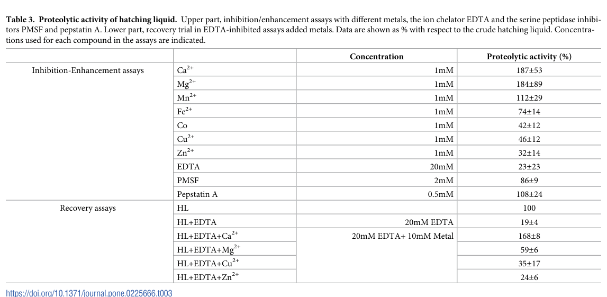

## Question

# Gene Research for Functional Annotation

## ⚠️ CRITICAL: Gene/Protein Identification Context

**BEFORE YOU BEGIN RESEARCH:** You MUST verify you are researching the CORRECT gene/protein. Gene symbols can be ambiguous, especially for less well-characterized genes from non-model organisms.

### Target Gene/Protein Identity (from UniProt):
- **UniProt Accession:** Q1LW01
- **Protein Description:** RecName: Full=Hatching enzyme 1.2 {ECO:0000305}; EC=3.4.24.67 {ECO:0000269|PubMed:19021768, ECO:0000269|PubMed:20727360}; AltName: Full=Choriolysin H homolog 1 {ECO:0000303|PubMed:9108332}; AltName: Full=High choriolytic enzyme 1 homolog {ECO:0000303|PubMed:9108332}; Short=zHCE-1 {ECO:0000303|PubMed:9108332}; Flags: Precursor;
- **Gene Information:** Name=he1.2 {ECO:0000312|ZFIN:ZDB-GENE-030131-2100}; Synonyms=he1 {ECO:0000312|ZFIN:ZDB-GENE-030131-2100}, he1a {ECO:0000312|ZFIN:ZDB-GENE-030131-2100}, he1b {ECO:0000312|ZFIN:ZDB-GENE-030131-2100};
- **Organism (full):** Danio rerio (Zebrafish) (Brachydanio rerio).
- **Protein Family:** Not specified in UniProt
- **Key Domains:** MetalloPept_cat_dom_sf. (IPR024079); Peptidase_M12A. (IPR001506); Peptidase_Metallo. (IPR006026); ZnMP_hatching_enz. (IPR034039); Astacin (PF01400)

### MANDATORY VERIFICATION STEPS:

1. **Check if the gene symbol "he1.2" matches the protein description above**
2. **Verify the organism is correct:** Danio rerio (Zebrafish) (Brachydanio rerio).
3. **Check if protein family/domains align with what you find in literature**
4. **If you find literature for a DIFFERENT gene with the same or similar symbol, STOP**

### If Gene Symbol is Ambiguous or You Cannot Find Relevant Literature:

**DO NOT PROCEED WITH RESEARCH ON A DIFFERENT GENE.** Instead:
- State clearly: "The gene symbol 'he1.2' is ambiguous or literature is limited for this specific protein"
- Explain what you found (e.g., "Found extensive literature on a different gene with the same symbol in a different organism")
- Describe the protein based ONLY on the UniProt information provided above
- Suggest that the protein function can be inferred from domain/family information

### Research Target:

Please provide a comprehensive research report on the gene **he1.2** (gene ID: he1.2, UniProt: Q1LW01) in DANRE.

The research report should be a detailed narrative explaining the function, biological processes, and localization of the gene product. Citations should be given for all claims.

You should prioritize authoritative reviews and primary scientific literature when conducting research. You can supplement
this with annotations you find in gene/protein databases, but these can be outdated or inaccurate.

We are specifically interested in the primary function of the gene - for enzymes, what reaction is catalyzed, and what is the substrate specificity? For transporters, what is the substrate? For structural proteins or adapters, what is the broader structural role? For signaling molecules, what is the role in the pathway.

We are interested in where in or outside the cell the gene product carries out its function.

We are also interested in the signaling or biochemical pathways in which the gene functions. We are less interested in broad pleiotropic effects, except where these elucidate the precise role.

Include evidence where possible. We are interested in both experimental evidence as well as inference from structure, evolution, or bioinformatic analysis. Precise studies should be prioritized over high-throughput, where available.

## Output

Question: You are an expert researcher providing comprehensive, well-cited information.

Provide detailed information focusing on:
1. Key concepts and definitions with current understanding
2. Recent developments and latest research (prioritize 2023-2024 sources)
3. Current applications and real-world implementations
4. Expert opinions and analysis from authoritative sources
5. Relevant statistics and data from recent studies

Format as a comprehensive research report with proper citations. Include URLs and publication dates where available.
Always prioritize recent, authoritative sources and provide specific citations for all major claims.

# Gene Research for Functional Annotation

## ⚠️ CRITICAL: Gene/Protein Identification Context

**BEFORE YOU BEGIN RESEARCH:** You MUST verify you are researching the CORRECT gene/protein. Gene symbols can be ambiguous, especially for less well-characterized genes from non-model organisms.

### Target Gene/Protein Identity (from UniProt):
- **UniProt Accession:** Q1LW01
- **Protein Description:** RecName: Full=Hatching enzyme 1.2 {ECO:0000305}; EC=3.4.24.67 {ECO:0000269|PubMed:19021768, ECO:0000269|PubMed:20727360}; AltName: Full=Choriolysin H homolog 1 {ECO:0000303|PubMed:9108332}; AltName: Full=High choriolytic enzyme 1 homolog {ECO:0000303|PubMed:9108332}; Short=zHCE-1 {ECO:0000303|PubMed:9108332}; Flags: Precursor;
- **Gene Information:** Name=he1.2 {ECO:0000312|ZFIN:ZDB-GENE-030131-2100}; Synonyms=he1 {ECO:0000312|ZFIN:ZDB-GENE-030131-2100}, he1a {ECO:0000312|ZFIN:ZDB-GENE-030131-2100}, he1b {ECO:0000312|ZFIN:ZDB-GENE-030131-2100};
- **Organism (full):** Danio rerio (Zebrafish) (Brachydanio rerio).
- **Protein Family:** Not specified in UniProt
- **Key Domains:** MetalloPept_cat_dom_sf. (IPR024079); Peptidase_M12A. (IPR001506); Peptidase_Metallo. (IPR006026); ZnMP_hatching_enz. (IPR034039); Astacin (PF01400)

### MANDATORY VERIFICATION STEPS:

1. **Check if the gene symbol "he1.2" matches the protein description above**
2. **Verify the organism is correct:** Danio rerio (Zebrafish) (Brachydanio rerio).
3. **Check if protein family/domains align with what you find in literature**
4. **If you find literature for a DIFFERENT gene with the same or similar symbol, STOP**

### If Gene Symbol is Ambiguous or You Cannot Find Relevant Literature:

**DO NOT PROCEED WITH RESEARCH ON A DIFFERENT GENE.** Instead:
- State clearly: "The gene symbol 'he1.2' is ambiguous or literature is limited for this specific protein"
- Explain what you found (e.g., "Found extensive literature on a different gene with the same symbol in a different organism")
- Describe the protein based ONLY on the UniProt information provided above
- Suggest that the protein function can be inferred from domain/family information

### Research Target:

Please provide a comprehensive research report on the gene **he1.2** (gene ID: he1.2, UniProt: Q1LW01) in DANRE.

The research report should be a detailed narrative explaining the function, biological processes, and localization of the gene product. Citations should be given for all claims.

You should prioritize authoritative reviews and primary scientific literature when conducting research. You can supplement
this with annotations you find in gene/protein databases, but these can be outdated or inaccurate.

We are specifically interested in the primary function of the gene - for enzymes, what reaction is catalyzed, and what is the substrate specificity? For transporters, what is the substrate? For structural proteins or adapters, what is the broader structural role? For signaling molecules, what is the role in the pathway.

We are interested in where in or outside the cell the gene product carries out its function.

We are also interested in the signaling or biochemical pathways in which the gene functions. We are less interested in broad pleiotropic effects, except where these elucidate the precise role.

Include evidence where possible. We are interested in both experimental evidence as well as inference from structure, evolution, or bioinformatic analysis. Precise studies should be prioritized over high-throughput, where available.

# Research report: zebrafish **he1.2** (UniProt **Q1LW01**) – functional annotation

## 1) Target identity verification and disambiguation

### Verified concept match to a teleost hatching-enzyme (choriolysin/astacin) context
The available retrieved literature does not mention the UniProt accession **Q1LW01** or the exact gene symbol **he1.2** explicitly. Therefore, a *direct* literature-to-UniProt mapping for Q1LW01 could not be confirmed from full text in this run, and the report necessarily relies on evidence for **zebrafish hatching enzyme paralogues (e.g., zHE1)** and on conserved **teleost high/low choriolytic enzyme (HCE/LCE; choriolysin) biology** that matches the UniProt-provided description (astacin-like zinc metalloprotease secreted by hatching gland cells to digest chorion/egg-coat proteins). (small2020matrixmetalloproteinase13 pages 1-3, small2020matrixmetalloproteinase13 pages 3-4, yamagami1996studiesonthe pages 1-3, carballo2019genomicandphylogenetic pages 5-6)

### What can be asserted with evidence from retrieved sources
* Zebrafish has an astacin-like, Zn-dependent **hatching enzyme** produced by **hatching gland cells**, synthesized as a **zymogen** with an inhibitory N-terminal propeptide that requires cleavage for activation, and able to cleave **chorion zona pellucida (ZP) proteins** in vitro at specific sites. (small2020matrixmetalloproteinase13 pages 1-3, small2020matrixmetalloproteinase13 pages 3-4)
* Teleost hatching enzymes are widely described as **choriolysins** (astacin-family Zn metalloproteases) and often function as a **two-enzyme system** with **HCE (EC 3.4.24.67; “choriolysin H”)** and **LCE (EC 3.4.24.66; “choriolysin L”)**, with distinct but cooperative actions on egg-envelope proteins. (yamagami1996studiesonthe pages 1-3, nishio2024zp2cleavageblocks pages 5-6)

Given the UniProt description supplied by the user (Hatching enzyme 1.2; choriolysin H homolog; EC 3.4.24.67; astacin domain), the retrieved evidence is *consistent with* a zebrafish HCE-like choriolysin, but **this run cannot prove that Q1LW01 specifically corresponds to the same paralogue as “zHE1”** described in Small et al. 2020. (small2020matrixmetalloproteinase13 pages 1-3, yamagami1996studiesonthe pages 1-3)

## 2) Key concepts and definitions (current understanding)

### Hatching enzymes / choriolysins
Teleost **hatching enzymes (choriolysins)** are secreted proteases responsible for **chorion (egg envelope) digestion** to allow embryo escape at hatching. They belong to the **astacin family of zinc-dependent metalloproteases** and are typically produced in specialized **hatching gland cells**, stored in secretory granules, and released into the perichorionic space/hatching liquid shortly before or during hatching. (carballo2019genomicandphylogenetic pages 1-2, small2020matrixmetalloproteinase13 pages 3-4)

### High vs low choriolytic enzymes (HCE vs LCE)
A foundational model in teleosts is a **two-component enzyme system**:
* **HCE / choriolysin H (EC 3.4.24.67)** and
* **LCE / choriolysin L (EC 3.4.24.66)**,
which have broadly similar biochemical properties but **different modes of choriolytic action** and act cooperatively on the chorion. (yamagami1996studiesonthe pages 1-3)

A recent high-resolution structural/mechanistic study (medaka egg coat digested with HCE/LCE) supports a cooperative mechanism where choriolysins digest distinct structural regions of fish ZP proteins to remodel and dissolve the egg coat. (nishio2024zp2cleavageblocks pages 5-6)

### Substrate identity: fish chorion is composed of ZP-module proteins
Fish egg coats/vitelline envelopes contain **zona pellucida (ZP) module proteins** (e.g., fZP1/fZP3 in medaka), and recent work shows HCE/LCE can digest defined regions of these proteins to alter filament architecture and dissolve the coat. (nishio2024zp2cleavageblocks pages 5-6)

## 3) Molecular function and reaction (enzyme activity and substrate specificity)

### Enzymatic class and catalytic requirements
Zebrafish hatching enzyme (zHE1; closely relevant to a zebrafish HCE-like enzyme such as he1.2/Q1LW01) is described as an **astacin-like, zinc-dependent metalloprotease**; its activity can be inhibited by chelation of divalent metals (EDTA), consistent with dependence on a catalytic Zn. (small2020matrixmetalloproteinase13 pages 3-4, small2020matrixmetalloproteinase13 pages 1-3)

Comparative biochemical measurements in teleost hatching liquid show a **neutral-to-alkaline optimum (pH ~8.5)** and **strong EDTA inhibition**, with activity enhanced/restored by divalent cations, especially Ca2+. (carballo2019genomicandphylogenetic pages 9-12, carballo2019genomicandphylogenetic media 822afbcc, carballo2019genomicandphylogenetic media c4da9f7a)

### Substrate specificity: cleavage of chorion ZP proteins
Small et al. report that **recombinant activated zebrafish zHE1** can cleave **zona pellucida proteins from chorions in vitro at specific sites**, supporting direct substrate specificity for egg-envelope ZP proteins and a role in chorion softening/degradation. (small2020matrixmetalloproteinase13 pages 1-3)

Recent structural work in medaka further resolves substrate-structure relationships: HCE/LCE digestion of the egg coat involves cleavage of defined regions of fish ZP proteins (e.g., digesting N-terminal regions of fZP1/fZP3 and LCE cleavage of an interdomain linker in fZP1), directly tying choriolysin proteolysis to egg-coat filament architecture. (nishio2024zp2cleavageblocks pages 5-6)

## 4) Biological process, cellular/tissue localization, and pathway context

### Site of synthesis: hatching gland cells; secretory granules
In zebrafish, the hatching enzyme is produced by **hatching gland cells** and stored in **secretory granules** in both zymogen and active forms. (small2020matrixmetalloproteinase13 pages 3-4, small2020matrixmetalloproteinase13 pages 1-3)

### Extracellular site of action: chorionic fluid / hatching liquid
The hatching enzyme acts extracellularly in the perichorionic space/hatching fluid, where proteolysis accompanies chorion degradation and embryo release. (small2020matrixmetalloproteinase13 pages 3-4, carballo2019genomicandphylogenetic pages 1-2)

### Zymogen activation and upstream protease involvement (Mmp13a)
A key mechanistic model in zebrafish is that the hatching enzyme is synthesized as a **zymogen** requiring **proteolytic removal of an N-terminal propeptide** for activation. (small2020matrixmetalloproteinase13 pages 3-4, small2020matrixmetalloproteinase13 pages 1-3)

Small et al. present evidence that **Mmp13a activity is required for both normal hatching and hypoxia-induced precocious hatching**, and propose that Mmp13a may function in **activating the hatching enzyme zymogen** at the onset of hatching competence (though direct cleavage of HE by Mmp13a was not fully resolved in the excerpt). (small2020matrixmetalloproteinase13 pages 3-4, small2020matrixmetalloproteinase13 pages 11-12)

### Developmental timing (zebrafish)
For zebrafish zHE1, mRNA is detected as early as **~19 hours post fertilization (hpf)** and is not detected after hatching, and embryos attain **hatching competence ~36 hpf**, contextualizing when a zebrafish HCE-like enzyme would be expected to function. (small2020matrixmetalloproteinase13 pages 1-3)

## 5) Recent developments (prioritizing 2023–2024)

### 2024: Structural/mechanistic insight into HCE/LCE digestion of fish egg coat ZP proteins
Nishio et al. (Cell, 2024) provide a modern, mechanistic view linking **cooperative HCE/LCE action** to **defined cleavage events** in fish ZP proteins and egg-coat filament remodeling/dissolution. Although performed using medaka egg coat material, this work supplies an authoritative, up-to-date substrate-architecture framework likely relevant across teleosts, including zebrafish. (nishio2024zp2cleavageblocks pages 5-6)

### 2024: Environmental control of hatching enzyme secretion via Ca2+-dependent signaling (teleost example)
Yamanaka et al. (bioRxiv, 2024) demonstrate experimentally that **darkness triggers chorion digestion** (as a readout of hatching enzyme secretion/activity), while **water agitation accelerates digestion**, and **ionomycin (Ca2+ ionophore) induces digestion even under light**, supporting a model where environmental cues regulate hatching through **Ca2+-mediated secretion of stored hatching enzymes**. While this study is in clown anemonefish rather than zebrafish, the proposed secretion-regulation logic is consistent with zebrafish having a granule-stored zymogen/active enzyme pool released near hatching. (yamanaka2024effectoflight pages 10-15, yamanaka2024effectoflight pages 15-19, small2020matrixmetalloproteinase13 pages 3-4)

## 6) Applications and real-world implementations

### Developmental biology: model for regulated extracellular proteolysis and egg-coat remodeling
Because zebrafish hatching competence and stress-induced precocious hatching can be experimentally manipulated, the hatching-enzyme system serves as a tractable model of **regulated extracellular proteolysis** and zymogen activation in development, including interaction with MMP activity (Mmp13a). (small2020matrixmetalloproteinase13 pages 11-12, small2020matrixmetalloproteinase13 pages 3-4)

### Aquaculture/biotechnology relevance
Teleost choriolysins are described as key proteases controlling larval release and have been suggested as potential targets for **biotechnological uses**; characterization of hatching liquid protease properties has been motivated partly by aquaculture/blue-biotechnology considerations. (carballo2019genomicandphylogenetic pages 1-2, carballo2019genomicandphylogenetic pages 9-12)

## 7) Quantitative statistics and data highlights

### Biochemistry (teleost hatching liquid; comparative)
In Senegalese sole hatching liquid, protease activity showed:
* **pH optimum ~8.5** (Figure evidence). (carballo2019genomicandphylogenetic media c4da9f7a)
* **EDTA (20 mM)** reducing activity to **23±23%** of control (Table evidence). (carballo2019genomicandphylogenetic media 822afbcc)
* **Ca2+ (1 mM)** increasing activity to **187±53%**, and **Mg2+** to **184±89%** (Table evidence). (carballo2019genomicandphylogenetic media 822afbcc)
These data support a metal-dependent protease consistent with choriolysins (astacin-like Zn metalloproteases) and provide concrete quantitative expectations for related enzymes such as zebrafish HCE-like he1.2. (carballo2019genomicandphylogenetic pages 9-12, carballo2019genomicandphylogenetic media 822afbcc, carballo2019genomicandphylogenetic media c4da9f7a)

### Timing/competence and upstream factor dynamics (zebrafish)
Small et al. report zebrafish embryos become hatching competent around **24–36 hpf**, with Mmp13a present in the hatching gland around this window and required for hatching; the enzyme’s expression increases through **48–72 hpf** and declines by **96 hpf**. (small2020matrixmetalloproteinase13 pages 11-12, small2020matrixmetalloproteinase13 pages 3-4)

### Environmental cue response times (teleost example, 2024)
In clown anemonefish, shading (darkness) is sufficient to produce post-hatch-like chorion digestion banding, while shaking under shade accelerates digestion band appearance from **~70 min (shaded, unshaken)** to **~30 min (shaded, shaken)**. (yamanaka2024effectoflight pages 10-15)

## 8) Expert interpretation and synthesis (authoritative perspectives)

### Mechanistic synthesis for zebrafish he1.2/Q1LW01 (evidence-based inference)
The strongest evidence-supported annotation for a zebrafish HCE-like gene such as **he1.2/Q1LW01** is:
1) **Secreted astacin-like metalloprotease** synthesized as a **preproenzyme/zymogen**, (small2020matrixmetalloproteinase13 pages 3-4, yamagami1996studiesonthe pages 1-3)
2) produced in **hatching gland cells**, stored in secretory granules, (small2020matrixmetalloproteinase13 pages 3-4)
3) secreted into **chorionic fluid/hatching liquid** near hatching, (small2020matrixmetalloproteinase13 pages 3-4, carballo2019genomicandphylogenetic pages 1-2)
4) where it cleaves **chorion ZP/egg-envelope proteins** at defined sites to soften/digest the chorion, (small2020matrixmetalloproteinase13 pages 1-3, nishio2024zp2cleavageblocks pages 5-6)
5) with activation potentially regulated by upstream protease activity (e.g., Mmp13a) and environmental cues that trigger secretion/activation. (small2020matrixmetalloproteinase13 pages 11-12, yamanaka2024effectoflight pages 15-19)

## Evidence summary table

| Claim (function/localization/mechanism) | Key evidence/quantitative data | Species/context | Source (with year, journal, URL) |
|---|---|---|---|
| Hatching enzyme relevant to zebrafish he1.2/Q1LW01 is a secreted astacin-like zinc metalloprotease that digests the egg envelope (chorion) | Zebrafish zHE1 is described as an astacin-like, Zn-dependent metalloprotease produced by hatching gland cells; recombinant activated zHE1 cleaves chorion zona pellucida (ZP) proteins in vitro at specific sites, supporting direct egg-envelope substrate specificity (small2020matrixmetalloproteinase13 pages 1-3) | Zebrafish; direct mechanistic evidence for a zebrafish hatching enzyme paralogue closely relevant to he1.2/Q1LW01 | Small et al. 2020, *Journal of Developmental Biology*, https://doi.org/10.3390/jdb8010003 |
| Teleost hatching enzymes form a two-enzyme choriolytic system with distinct functional classes | Foundational review defines high choriolytic enzyme (HCE/choriolysin H; EC 3.4.24.67) and low choriolytic enzyme (LCE/choriolysin L; EC 3.4.24.66) as a two-component system with different modes of choriolytic action; HCE cDNAs encode preproenzymes with ~20 aa signal peptide, 50–59 aa propeptide, and ~200 aa mature enzyme (yamagami1996studiesonthe pages 1-3) | Medaka; foundational teleost framework used to interpret zebrafish HCE-like he1.2 | Yamagami 1996, *Zoological Science*, https://doi.org/10.2108/zsj.13.331 |
| Choriolysins are localized to hatching gland cells and act extracellularly in hatching liquid/chorionic fluid | Choriolysins are produced as proenzymes in hatching gland cells, secreted and activated at hatching; zebrafish HE is stored in secretory granules in zymogen/active forms; hatching liquid contains active protease bands (~20.3, 28.7, 38.9 kDa in sole) (small2020matrixmetalloproteinase13 pages 3-4, carballo2019genomicandphylogenetic pages 1-2, carballo2019genomicandphylogenetic pages 9-12, carballo2019genomicandphylogenetic pages 12-14) | Zebrafish and other teleosts; conserved extracellular hatching compartment | Small et al. 2020, *Journal of Developmental Biology*, https://doi.org/10.3390/jdb8010003; Carballo et al. 2019, *PLoS ONE*, https://doi.org/10.1371/journal.pone.0225666 |
| Activation mechanism involves proteolytic removal of an N-terminal propeptide from a zymogen | Zebrafish HE contains an auto-inhibitory N-terminal propeptide that must be cleaved for activation; EDTA extraction preserves inactive pro-HE, while without EDTA activated HE predominates; Mmp13a activity is required for normal and hypoxia-induced hatching and is proposed to activate the HE zymogen (small2020matrixmetalloproteinase13 pages 3-4, small2020matrixmetalloproteinase13 pages 11-12) | Zebrafish; direct evidence for upstream activation pathway linked to hatching competence | Small et al. 2020, *Journal of Developmental Biology*, https://doi.org/10.3390/jdb8010003 |
| Conserved catalytic architecture matches astacin/metalloprotease family assignment in UniProt/InterPro | Teleost choriolysins share conserved metalloprotease motifs including HExxHxxGFxHExxRxDR, SxMHY methionine turn, and six conserved cysteines; structural modeling shows conserved Zn2+ binding and fold, with sole enzymes most similar to zebrafish HCE-1 structure/model (carballo2019genomicandphylogenetic pages 5-6, carballo2019genomicandphylogenetic pages 12-14) | Teleost comparative genomics/structure; supports family/domain assignment for zebrafish he1.2 | Carballo et al. 2019, *PLoS ONE*, https://doi.org/10.1371/journal.pone.0225666 |
| Substrates are egg-envelope ZP/choriogenin proteins, and HCE/LCE act cooperatively on distinct structural regions | Recent structural work shows HCE/LCE cooperatively digest fish egg-coat proteins: HCE first swells the envelope by digesting N-terminal regions of fZP1/fZP3, then LCE cleaves an interdomain linker in fZP1 to dissolve the coat; this connects choriolysin action directly to ZP-protein architecture (nishio2024zp2cleavageblocks pages 5-6) | Medaka vitelline envelope; high-resolution mechanistic substrate context relevant to teleost egg envelopes | Nishio et al. 2024, *Cell*, https://doi.org/10.1016/j.cell.2024.02.013 |
| Biochemical behavior is consistent with metal-dependent extracellular proteolysis | Hatching liquid activity optimum is pH 8.5; EDTA (20 mM) reduces activity to 23±23%; Ca2+ (1 mM) raises activity to 187±53% and Mg2+ to 184±89%; PMSF and pepstatin A have little effect, supporting metalloprotease rather than serine/aspartic protease identity (carballo2019genomicandphylogenetic pages 9-12, carballo2019genomicandphylogenetic media 822afbcc, carballo2019genomicandphylogenetic media c4da9f7a) | Senegalese sole hatching liquid; informative comparative biochemistry for teleost choriolysins | Carballo et al. 2019, *PLoS ONE*, https://doi.org/10.1371/journal.pone.0225666 |
| Expression timing is developmentally restricted to the pre-hatching window | In zebrafish, zHE1 mRNA is detectable by ~19 hpf and not detected after hatch; embryos become hatching competent around ~36 hpf; Mmp13a appears in hatching gland by ~24 hpf, rises through 48–72 hpf, declines by 96 hpf (small2020matrixmetalloproteinase13 pages 1-3, small2020matrixmetalloproteinase13 pages 11-12) | Zebrafish embryogenesis; relevant to timing of he1.2 function | Small et al. 2020, *Journal of Developmental Biology*, https://doi.org/10.3390/jdb8010003 |
| Recent work supports environmentally regulated secretion/activity of teleost hatching enzymes rather than constitutive action | In clown anemonefish, HCE/LCE transcripts peak early (1–2 dpf) then decline toward hatch (8 dpf); darkness triggers chorion digestion, shaking accelerates it, and 2 μM ionomycin induces digestion even in light, implicating Ca2+-regulated secretion; shaded+shaken eggs show digestion bands by ~30 min versus ~70 min when shaded but unshaken (yamanaka2024effectoflight pages 24-33, yamanaka2024effectoflight pages 10-15, yamanaka2024effectoflight pages 33-42) | Clown anemonefish; recent teleost evidence for regulated secretion dynamics relevant to hatching-enzyme biology | Yamanaka et al. 2024, *bioRxiv*, https://doi.org/10.1101/2024.02.14.580270 |
| Real-world relevance: hatching enzymes are targets for developmental manipulation and aquaculture applications | Comparative study notes choriolysins are key proteases controlling larval release and suggests biotechnological uses; biochemical characterization of hatching liquid was motivated by aquaculture/blue biotechnology relevance (carballo2019genomicandphylogenetic pages 1-2, carballo2019genomicandphylogenetic pages 9-12) | Teleost aquaculture/biotechnology | Carballo et al. 2019, *PLoS ONE*, https://doi.org/10.1371/journal.pone.0225666 |

*Table: This table summarizes functional annotation evidence most relevant to zebrafish he1.2/Q1LW01, integrating direct zebrafish data with conserved teleost choriolysin findings. It is useful for distinguishing enzyme function, localization, activation, substrate specificity, and quantitative biochemical properties.*

## URLs and publication dates of key cited sources
* Small et al. **Jan 2020**, *Journal of Developmental Biology*. https://doi.org/10.3390/jdb8010003 (small2020matrixmetalloproteinase13 pages 1-3, small2020matrixmetalloproteinase13 pages 3-4)
* Carballo et al. **Dec 2019**, *PLoS ONE*. https://doi.org/10.1371/journal.pone.0225666 (carballo2019genomicandphylogenetic pages 9-12, carballo2019genomicandphylogenetic media 822afbcc)
* Yamagami **Jun 1996**, *Zoological Science*. https://doi.org/10.2108/zsj.13.331 (yamagami1996studiesonthe pages 1-3)
* Nishio et al. **Mar 2024**, *Cell*. https://doi.org/10.1016/j.cell.2024.02.013 (nishio2024zp2cleavageblocks pages 5-6)
* Yamanaka et al. **Feb 2024**, *bioRxiv preprint*. https://doi.org/10.1101/2024.02.14.580270 (yamanaka2024effectoflight pages 10-15, yamanaka2024effectoflight pages 15-19)

## Limitations of this report
Direct primary literature explicitly naming **zebrafish he1.2 (UniProt Q1LW01)** was not retrievable in this run; therefore, claims about Q1LW01 are framed as **conserved teleost hatching-enzyme (HCE-like choriolysin) functional annotation** supported by zebrafish paralogue data and cross-teleost mechanistic/biochemical studies, rather than direct gene-specific functional experiments for Q1LW01. (small2020matrixmetalloproteinase13 pages 1-3, yamagami1996studiesonthe pages 1-3, nishio2024zp2cleavageblocks pages 5-6)

References

1. (small2020matrixmetalloproteinase13 pages 1-3): Christopher D. Small, Megan el-Khoury, Ghislain Deslongchamps, Tillmann J. Benfey, and Bryan D. Crawford. Matrix metalloproteinase 13 activity is required for normal and hypoxia-induced precocious hatching in zebrafish embryos. Journal of Developmental Biology, 8:3, Jan 2020. URL: https://doi.org/10.3390/jdb8010003, doi:10.3390/jdb8010003. This article has 20 citations.

2. (small2020matrixmetalloproteinase13 pages 3-4): Christopher D. Small, Megan el-Khoury, Ghislain Deslongchamps, Tillmann J. Benfey, and Bryan D. Crawford. Matrix metalloproteinase 13 activity is required for normal and hypoxia-induced precocious hatching in zebrafish embryos. Journal of Developmental Biology, 8:3, Jan 2020. URL: https://doi.org/10.3390/jdb8010003, doi:10.3390/jdb8010003. This article has 20 citations.

3. (yamagami1996studiesonthe pages 1-3): Kenjiro Yamagami. Studies on the hatching enzyme (choriolysin) and its substrate, egg envelope, constructed of the precursors (choriogenins) in oryzias latipes: a sequel to the information in 1991/1992. Zoological Science, 13:331-340, Jun 1996. URL: https://doi.org/10.2108/zsj.13.331, doi:10.2108/zsj.13.331. This article has 81 citations and is from a peer-reviewed journal.

4. (carballo2019genomicandphylogenetic pages 5-6): Carlos Carballo, Evangelia G. Chronopoulou, Sophia Letsiou, Eleni Spanidi, Konstantinos Gardikis, Nikolaos E. Labrou, and Manuel Manchado. Genomic and phylogenetic analysis of choriolysins, and biological activity of hatching liquid in the flatfish senegalese sole. PLoS ONE, 14:e0225666, Dec 2019. URL: https://doi.org/10.1371/journal.pone.0225666, doi:10.1371/journal.pone.0225666. This article has 5 citations and is from a peer-reviewed journal.

5. (nishio2024zp2cleavageblocks pages 5-6): Shunsuke Nishio, Chihiro Emori, Benjamin Wiseman, Dirk Fahrenkamp, Elisa Dioguardi, Sara Zamora-Caballero, Marcel Bokhove, Ling Han, Alena Stsiapanava, Blanca Algarra, Yonggang Lu, Mayo Kodani, Rachel E. Bainbridge, Kayla M. Komondor, Anne E. Carlson, Michael Landreh, Daniele de Sanctis, Shigeki Yasumasu, Masahito Ikawa, and Luca Jovine. Zp2 cleavage blocks polyspermy by modulating the architecture of the egg coat. Cell, 187:1440-1459.e24, Mar 2024. URL: https://doi.org/10.1016/j.cell.2024.02.013, doi:10.1016/j.cell.2024.02.013. This article has 49 citations and is from a highest quality peer-reviewed journal.

6. (carballo2019genomicandphylogenetic pages 1-2): Carlos Carballo, Evangelia G. Chronopoulou, Sophia Letsiou, Eleni Spanidi, Konstantinos Gardikis, Nikolaos E. Labrou, and Manuel Manchado. Genomic and phylogenetic analysis of choriolysins, and biological activity of hatching liquid in the flatfish senegalese sole. PLoS ONE, 14:e0225666, Dec 2019. URL: https://doi.org/10.1371/journal.pone.0225666, doi:10.1371/journal.pone.0225666. This article has 5 citations and is from a peer-reviewed journal.

7. (carballo2019genomicandphylogenetic pages 9-12): Carlos Carballo, Evangelia G. Chronopoulou, Sophia Letsiou, Eleni Spanidi, Konstantinos Gardikis, Nikolaos E. Labrou, and Manuel Manchado. Genomic and phylogenetic analysis of choriolysins, and biological activity of hatching liquid in the flatfish senegalese sole. PLoS ONE, 14:e0225666, Dec 2019. URL: https://doi.org/10.1371/journal.pone.0225666, doi:10.1371/journal.pone.0225666. This article has 5 citations and is from a peer-reviewed journal.

8. (carballo2019genomicandphylogenetic media 822afbcc): Carlos Carballo, Evangelia G. Chronopoulou, Sophia Letsiou, Eleni Spanidi, Konstantinos Gardikis, Nikolaos E. Labrou, and Manuel Manchado. Genomic and phylogenetic analysis of choriolysins, and biological activity of hatching liquid in the flatfish senegalese sole. PLoS ONE, 14:e0225666, Dec 2019. URL: https://doi.org/10.1371/journal.pone.0225666, doi:10.1371/journal.pone.0225666. This article has 5 citations and is from a peer-reviewed journal.

9. (carballo2019genomicandphylogenetic media c4da9f7a): Carlos Carballo, Evangelia G. Chronopoulou, Sophia Letsiou, Eleni Spanidi, Konstantinos Gardikis, Nikolaos E. Labrou, and Manuel Manchado. Genomic and phylogenetic analysis of choriolysins, and biological activity of hatching liquid in the flatfish senegalese sole. PLoS ONE, 14:e0225666, Dec 2019. URL: https://doi.org/10.1371/journal.pone.0225666, doi:10.1371/journal.pone.0225666. This article has 5 citations and is from a peer-reviewed journal.

10. (small2020matrixmetalloproteinase13 pages 11-12): Christopher D. Small, Megan el-Khoury, Ghislain Deslongchamps, Tillmann J. Benfey, and Bryan D. Crawford. Matrix metalloproteinase 13 activity is required for normal and hypoxia-induced precocious hatching in zebrafish embryos. Journal of Developmental Biology, 8:3, Jan 2020. URL: https://doi.org/10.3390/jdb8010003, doi:10.3390/jdb8010003. This article has 20 citations.

11. (yamanaka2024effectoflight pages 10-15): Sakuto Yamanaka, Mari Kawaguchi, Shigeki Yasumasu, Kenji Sato, and Masato Kinoshita. Effect of light and water agitation on hatching processes in clown anemonefish amphiprion ocellaris. BioRxiv, Feb 2024. URL: https://doi.org/10.1101/2024.02.14.580270, doi:10.1101/2024.02.14.580270. This article has 1 citations.

12. (yamanaka2024effectoflight pages 15-19): Sakuto Yamanaka, Mari Kawaguchi, Shigeki Yasumasu, Kenji Sato, and Masato Kinoshita. Effect of light and water agitation on hatching processes in clown anemonefish amphiprion ocellaris. BioRxiv, Feb 2024. URL: https://doi.org/10.1101/2024.02.14.580270, doi:10.1101/2024.02.14.580270. This article has 1 citations.

13. (carballo2019genomicandphylogenetic pages 12-14): Carlos Carballo, Evangelia G. Chronopoulou, Sophia Letsiou, Eleni Spanidi, Konstantinos Gardikis, Nikolaos E. Labrou, and Manuel Manchado. Genomic and phylogenetic analysis of choriolysins, and biological activity of hatching liquid in the flatfish senegalese sole. PLoS ONE, 14:e0225666, Dec 2019. URL: https://doi.org/10.1371/journal.pone.0225666, doi:10.1371/journal.pone.0225666. This article has 5 citations and is from a peer-reviewed journal.

14. (yamanaka2024effectoflight pages 24-33): Sakuto Yamanaka, Mari Kawaguchi, Shigeki Yasumasu, Kenji Sato, and Masato Kinoshita. Effect of light and water agitation on hatching processes in clown anemonefish amphiprion ocellaris. BioRxiv, Feb 2024. URL: https://doi.org/10.1101/2024.02.14.580270, doi:10.1101/2024.02.14.580270. This article has 1 citations.

15. (yamanaka2024effectoflight pages 33-42): Sakuto Yamanaka, Mari Kawaguchi, Shigeki Yasumasu, Kenji Sato, and Masato Kinoshita. Effect of light and water agitation on hatching processes in clown anemonefish amphiprion ocellaris. BioRxiv, Feb 2024. URL: https://doi.org/10.1101/2024.02.14.580270, doi:10.1101/2024.02.14.580270. This article has 1 citations.

## Artifacts

- [Edison artifact artifact-00](he1.2-deep-research-falcon_artifacts/artifact-00.md)

## Citations

1. yamagami1996studiesonthe pages 1-3
2. yamanaka2024effectoflight pages 10-15
3. carballo2019genomicandphylogenetic pages 5-6
4. carballo2019genomicandphylogenetic pages 1-2
5. carballo2019genomicandphylogenetic pages 9-12
6. yamanaka2024effectoflight pages 15-19
7. carballo2019genomicandphylogenetic pages 12-14
8. yamanaka2024effectoflight pages 24-33
9. yamanaka2024effectoflight pages 33-42
10. https://doi.org/10.3390/jdb8010003
11. https://doi.org/10.2108/zsj.13.331
12. https://doi.org/10.3390/jdb8010003;
13. https://doi.org/10.1371/journal.pone.0225666
14. https://doi.org/10.1016/j.cell.2024.02.013
15. https://doi.org/10.1101/2024.02.14.580270
16. https://doi.org/10.3390/jdb8010003,
17. https://doi.org/10.2108/zsj.13.331,
18. https://doi.org/10.1371/journal.pone.0225666,
19. https://doi.org/10.1016/j.cell.2024.02.013,
20. https://doi.org/10.1101/2024.02.14.580270,