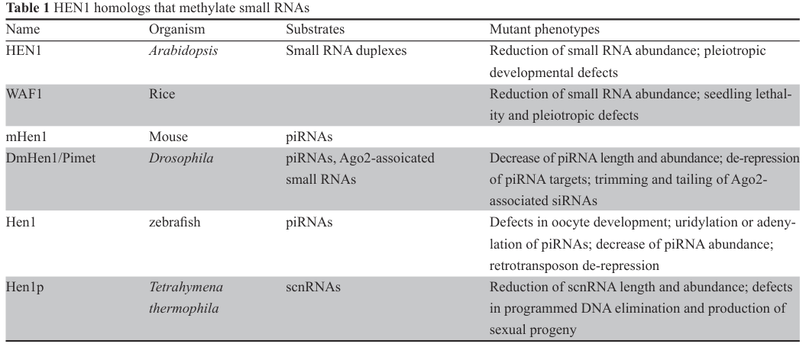

## Question

# Gene Research for Functional Annotation

## ⚠️ CRITICAL: Gene/Protein Identification Context

**BEFORE YOU BEGIN RESEARCH:** You MUST verify you are researching the CORRECT gene/protein. Gene symbols can be ambiguous, especially for less well-characterized genes from non-model organisms.

### Target Gene/Protein Identity (from UniProt):
- **UniProt Accession:** Q568P9
- **Protein Description:** RecName: Full=Small RNA 2'-O-methyltransferase; EC=2.1.1.386 {ECO:0000269|PubMed:20859253}; AltName: Full=HEN1 methyltransferase homolog 1;
- **Gene Information:** Name=henmt1; ORFNames=si:ch211-199m3.6, zgc:110175;
- **Organism (full):** Danio rerio (Zebrafish) (Brachydanio rerio).
- **Protein Family:** Belongs to the methyltransferase superfamily. HEN1 family.
- **Key Domains:** Hen1. (IPR026610); SAM-dependent_MTases_sf. (IPR029063)

### MANDATORY VERIFICATION STEPS:

1. **Check if the gene symbol "henmt1" matches the protein description above**
2. **Verify the organism is correct:** Danio rerio (Zebrafish) (Brachydanio rerio).
3. **Check if protein family/domains align with what you find in literature**
4. **If you find literature for a DIFFERENT gene with the same or similar symbol, STOP**

### If Gene Symbol is Ambiguous or You Cannot Find Relevant Literature:

**DO NOT PROCEED WITH RESEARCH ON A DIFFERENT GENE.** Instead:
- State clearly: "The gene symbol 'henmt1' is ambiguous or literature is limited for this specific protein"
- Explain what you found (e.g., "Found extensive literature on a different gene with the same symbol in a different organism")
- Describe the protein based ONLY on the UniProt information provided above
- Suggest that the protein function can be inferred from domain/family information

### Research Target:

Please provide a comprehensive research report on the gene **henmt1** (gene ID: henmt1, UniProt: Q568P9) in DANRE.

The research report should be a detailed narrative explaining the function, biological processes, and localization of the gene product. Citations should be given for all claims.

You should prioritize authoritative reviews and primary scientific literature when conducting research. You can supplement
this with annotations you find in gene/protein databases, but these can be outdated or inaccurate.

We are specifically interested in the primary function of the gene - for enzymes, what reaction is catalyzed, and what is the substrate specificity? For transporters, what is the substrate? For structural proteins or adapters, what is the broader structural role? For signaling molecules, what is the role in the pathway.

We are interested in where in or outside the cell the gene product carries out its function.

We are also interested in the signaling or biochemical pathways in which the gene functions. We are less interested in broad pleiotropic effects, except where these elucidate the precise role.

Include evidence where possible. We are interested in both experimental evidence as well as inference from structure, evolution, or bioinformatic analysis. Precise studies should be prioritized over high-throughput, where available.

## Output

Question: You are an expert researcher providing comprehensive, well-cited information.

Provide detailed information focusing on:
1. Key concepts and definitions with current understanding
2. Recent developments and latest research (prioritize 2023-2024 sources)
3. Current applications and real-world implementations
4. Expert opinions and analysis from authoritative sources
5. Relevant statistics and data from recent studies

Format as a comprehensive research report with proper citations. Include URLs and publication dates where available.
Always prioritize recent, authoritative sources and provide specific citations for all major claims.

# Gene Research for Functional Annotation

## ⚠️ CRITICAL: Gene/Protein Identification Context

**BEFORE YOU BEGIN RESEARCH:** You MUST verify you are researching the CORRECT gene/protein. Gene symbols can be ambiguous, especially for less well-characterized genes from non-model organisms.

### Target Gene/Protein Identity (from UniProt):
- **UniProt Accession:** Q568P9
- **Protein Description:** RecName: Full=Small RNA 2'-O-methyltransferase; EC=2.1.1.386 {ECO:0000269|PubMed:20859253}; AltName: Full=HEN1 methyltransferase homolog 1;
- **Gene Information:** Name=henmt1; ORFNames=si:ch211-199m3.6, zgc:110175;
- **Organism (full):** Danio rerio (Zebrafish) (Brachydanio rerio).
- **Protein Family:** Belongs to the methyltransferase superfamily. HEN1 family.
- **Key Domains:** Hen1. (IPR026610); SAM-dependent_MTases_sf. (IPR029063)

### MANDATORY VERIFICATION STEPS:

1. **Check if the gene symbol "henmt1" matches the protein description above**
2. **Verify the organism is correct:** Danio rerio (Zebrafish) (Brachydanio rerio).
3. **Check if protein family/domains align with what you find in literature**
4. **If you find literature for a DIFFERENT gene with the same or similar symbol, STOP**

### If Gene Symbol is Ambiguous or You Cannot Find Relevant Literature:

**DO NOT PROCEED WITH RESEARCH ON A DIFFERENT GENE.** Instead:
- State clearly: "The gene symbol 'henmt1' is ambiguous or literature is limited for this specific protein"
- Explain what you found (e.g., "Found extensive literature on a different gene with the same symbol in a different organism")
- Describe the protein based ONLY on the UniProt information provided above
- Suggest that the protein function can be inferred from domain/family information

### Research Target:

Please provide a comprehensive research report on the gene **henmt1** (gene ID: henmt1, UniProt: Q568P9) in DANRE.

The research report should be a detailed narrative explaining the function, biological processes, and localization of the gene product. Citations should be given for all claims.

You should prioritize authoritative reviews and primary scientific literature when conducting research. You can supplement
this with annotations you find in gene/protein databases, but these can be outdated or inaccurate.

We are specifically interested in the primary function of the gene - for enzymes, what reaction is catalyzed, and what is the substrate specificity? For transporters, what is the substrate? For structural proteins or adapters, what is the broader structural role? For signaling molecules, what is the role in the pathway.

We are interested in where in or outside the cell the gene product carries out its function.

We are also interested in the signaling or biochemical pathways in which the gene functions. We are less interested in broad pleiotropic effects, except where these elucidate the precise role.

Include evidence where possible. We are interested in both experimental evidence as well as inference from structure, evolution, or bioinformatic analysis. Precise studies should be prioritized over high-throughput, where available.

## Research report: Functional annotation of **henmt1** (Hen1) in *Danio rerio* (UniProt Q568P9)

### 1) Target verification and gene/protein identity (mandatory disambiguation)
The zebrafish gene **henmt1** (often referred to as **hen1** in the zebrafish piRNA literature) corresponds to a **HEN1-family small RNA 2′-O-methyltransferase** whose conserved role is to methylate the **2′-hydroxyl of the ribose on the 3′-terminal nucleotide** of specific small RNAs, primarily **piRNAs in animals** (ji2012regulationofsmall pages 3-4). This identity matches the UniProt description for Q568P9 (Small RNA 2′-O-methyltransferase; HEN1 methyltransferase homolog 1), and the retrieved zebrafish-specific summaries place the protein in the germline small-RNA pathway (nuage/piRNA system), consistent with a HEN1-family SAM-dependent methyltransferase (ji2012regulationofsmall pages 3-4).

### 2) Key concepts, definitions, and current understanding

#### 2.1 Enzymatic activity and reaction definition
**HENMT1/Hen1** is defined as a **SAM (AdoMet)-dependent 2′-O-methyltransferase** that installs **3′ terminal 2′-O-methylation (Nm)** on small RNAs by transferring a methyl group to the **2′-OH** of the **3′-terminal ribose** (ji2012regulationofsmall pages 3-4, ji2012regulationofsmall pages 1-3). The HEN1 family contains a conserved SAM/AdoMet-binding motif and catalyzes methylation at the 3′ terminus, thereby protecting substrates from 3′-end decay and non-templated tailing (ji2012regulationofsmall pages 1-3, ji2012regulationofsmall pages 3-4).

In animals, HEN1/HENMT1 is broadly described as acting on **single-stranded piRNAs** at their 3′ ends, whereas plant HEN1 acts on miRNA/siRNA duplexes; this lineage-specific substrate mode is central to the current framework of small-RNA 3′ end protection (ji2012regulationofsmall pages 1-3, kaldis2023isthehydrogen pages 15-17).

#### 2.2 Biological purpose of 3′ terminal 2′-O-methylation
A core concept in small-RNA biology is that **3′ 2′-O-methylation stabilizes small RNAs**, in part by preventing **3′ uridylation/adenylation (“tailing”)** and subsequent trimming/degradation; loss of the modification is therefore linked to reduced small-RNA abundance and altered length profiles (ji2012regulationofsmall pages 1-3, ji2012regulationofsmall pages 3-4). In the piRNA pathway specifically, 3′ end methylation is integrated into the maturation steps that produce stable PIWI-associated small RNAs competent for **transposon/retrotransposon repression** and germline genome defense (ji2012regulationofsmall pages 3-4).

#### 2.3 Pathway context: piRNA maturation and genome defense
Within the **piRNA pathway**, 3′ end maturation includes trimming and then terminal 2′-O-methylation, with Hen1/HENMT1 providing this terminal protection step (ji2012regulationofsmall pages 3-4). The zebrafish literature places Hen1 in **nuage**, a germline granule associated with piRNA biogenesis and function (ji2012regulationofsmall pages 3-4). Functionally, the pathway-level role is to maintain piRNA stability so that PIWI/piRNA complexes can continue to repress transposable elements in germ cells (ji2012regulationofsmall pages 3-4).

### 3) Evidence-based functional annotation for *Danio rerio* henmt1 (Hen1)

#### 3.1 Molecular function: substrate class and specificity
Zebrafish Hen1 is summarized as targeting **piRNAs**, and loss of Hen1 is associated with signatures expected from failure of 3′ 2′-O-methylation: **piRNA uridylation or adenylation**, **decreased piRNA abundance**, and **retrotransposon de-repression** (ji2012regulationofsmall pages 3-4, ji2012regulationofsmall media 97b250d5). While zebrafish-specific summaries in the retrieved text do not provide detailed kinetic parameters, cross-species mechanistic work supports that HEN1/HENMT1 substrate recognition can be largely **backbone/ribose-driven** rather than base-specific, consistent with broad piRNA substrate coverage (kaldis2024molecularbasisof pages 11-12, kaldis2023isthehydrogen pages 15-17).

#### 3.2 Subcellular localization
A zebrafish-specific localization statement in a highly cited review summarizes that **“The zebrafish Hen1 protein is localized to nuage”**, a germ cell-specific structure associated with piRNA pathway machinery (ji2012regulationofsmall pages 3-4). This is consistent with the pathway placement of terminal piRNA maturation in germline RNA granules and PIWI-associated compartments (ji2012regulationofsmall pages 3-4).

#### 3.3 Loss-of-function phenotypes in zebrafish (biological process inference)
Zebrafish Hen1 is summarized as **expressed in both female and male germ lines** but **“essential only for oocyte development and dispensable for testis development”**, indicating a sex-asymmetric requirement for this enzyme in zebrafish gonad development (ji2012regulationofsmall pages 3-4). When Hen1 is lost, the reported outcomes include:
- **Defects in oocyte development** (female fertility/oogenesis impairment) (ji2012regulationofsmall pages 3-4, ji2012regulationofsmall media 97b250d5)
- **piRNA 3′ end alterations**: **uridylation or adenylation** (ji2012regulationofsmall pages 3-4, ji2012regulationofsmall media 97b250d5)
- **Decreased piRNA abundance** (ji2012regulationofsmall pages 3-4, ji2012regulationofsmall media 97b250d5)
- **Retrotransposon de-repression** (ji2012regulationofsmall pages 3-4, ji2012regulationofsmall media 97b250d5)

These zebrafish phenotypes align mechanistically with the established role of piRNAs as genome guardians and with the molecular function of Hen1-mediated 3′ 2′-O-methylation as a stabilizing and anti-tailing modification (ji2012regulationofsmall pages 3-4).

### 4) Recent developments (prioritizing 2023–2024) and latest research themes

#### 4.1 Mechanistic modeling of catalysis (2023–2024)
Two recent mechanistic contributions focus on **how** HENMT1 catalyzes methyl transfer at the 2′-OH. A 2023 preprint proposes a catalytic scenario in which a divalent metal (modeled as **Mg2+**) is coordinated by conserved residues and by the 2′/3′ hydroxyls of the substrate’s terminal nucleotide; the reaction is described as deprotonation of the 2′-OH followed by methyl transfer from **SAM** (kaldis2023isthehydrogen pages 15-17). The peer-reviewed 2024 follow-up similarly argues that HENMT1 is **Mg2+-utilizing** (but not strictly Mg2+-dependent) and that metal is important for catalysis, while substrate recognition is consistent with broadly acting, backbone-centered interactions—supporting the observed wide substrate range in piRNA populations (kaldis2024molecularbasisof pages 1-2).

Although these papers are not zebrafish-specific, they provide updated mechanistic framing for the same conserved enzymatic step that zebrafish Hen1 performs (kaldis2024molecularbasisof pages 1-2).

#### 4.2 Emerging disease associations and biomarker discussions
Recent mechanistic papers also discuss associations between **piRNA pathway dysregulation** and disease contexts, including cancer, and note reports linking HENMT1 to cancer-related processes (e.g., overexpression trends; reported interactions with small RNA methylation beyond piRNAs) (kaldis2023isthehydrogen pages 1-3, kaldis2024molecularbasisof pages 1-2). These themes reflect a broader trend: enzymes that modify small RNAs are increasingly considered as potential diagnostic/biomarker-relevant nodes, though causality and mechanism can be context-dependent.

### 5) Current applications and real-world implementations

#### 5.1 Assays to detect 2′-O-methylation state and consequences
Multiple established experimental strategies are used across systems to measure the presence/absence of 3′ terminal 2′-O-methylation and its downstream effects:
- **Periodate oxidation + β-elimination / gel-based readout**: unmethylated RNAs become susceptible and appear shortened/shifted, enabling direct inference of methylation state (lim2015henmt1andpirna pages 6-9, lim2015henmt1andpirna pages 18-19).
- **NaIO4-assisted small RNA-seq (“methylation-dependent library depletion”)**: NaIO4 prevents adapter ligation for RNAs lacking 3′ end protection, enriching methylated small RNAs; this can be coupled to end-modification analyses (uridylation/adenylation) in sequencing data (peng2018identificationofsubstrates pages 4-5, peng2018identificationofsubstrates pages 2-4).

These assays are routinely deployed in piRNA/HENMT1 functional genetics to connect loss of enzyme function to loss of methylation and increased tailing/trimming signatures.

#### 5.2 Chemo-enzymatic labeling and RNA engineering tools
A concrete real-world implementation is the use of **animal Hen1 enzymes as biochemical tools**: recombinant Drosophila and human Hen1 homologs can transfer methyl groups (and, importantly, extended chemical groups from SAM analogs) onto the 3′ termini of single-stranded RNAs, enabling **3′-terminal functionalization and labeling** for downstream in vitro assays (e.g., fluorescence-based detection) (mickute2018animalhen12′omethyltransferases pages 2-2). This makes HEN1-family enzymes practical reagents for RNA biochemistry workflows beyond purely biological pathway analysis.

### 6) Expert synthesis and analysis (evidence-weighted)

#### 6.1 Primary functional conclusion for zebrafish henmt1 (Hen1)
The highest-confidence functional annotation, integrating zebrafish-specific summaries with broad mechanistic consensus, is:
- **Henmt1/Hen1 is the terminal small-RNA 3′ end 2′-O-methyltransferase that stabilizes piRNAs in germ cells** (ji2012regulationofsmall pages 3-4).
- In zebrafish, this activity is strongly connected to **oocyte development** and to **retrotransposon repression**, consistent with piRNA-mediated genome defense (ji2012regulationofsmall pages 3-4, ji2012regulationofsmall media 97b250d5).

#### 6.2 Conservation-based inference strengthens zebrafish annotation
The zebrafish phenotype profile (piRNA tailing, decreased abundance, transposon derepression, fertility defects) is highly congruent with mouse HENMT1 loss-of-function results showing piRNA instability, increased 3′ tailing, transposon derepression, and infertility, supporting deep conservation of the biochemical role even when organism-level phenotypes differ by sex or developmental stage (lim2015henmt1andpirna pages 14-16, lim2015henmt1andpirna pages 6-9).

### 7) Relevant statistics and quantitative data points from studies in the retrieved corpus
Quantitative outcomes in the retrieved evidence base are best developed in mammalian (mouse) HENMT1 genetic studies and in method-focused work:
- In mouse testes, a Henmt1 loss-of-function model reported ~**51% reduction** in bulk piRNA abundance by gel/northern quantitation, alongside piRNA shortening and increased 3′ adenylation/uridylation (lim2015henmt1andpirna pages 6-9).
- In mouse spermatogonial stem cells, Hen1 loss was associated with a **>2-fold increase** in piRNA tailing ratio (uridylation/adenylation), based on deep sequencing analyses (peng2018identificationofsubstrates pages 4-5).

Zebrafish-specific retrieved text does not provide numeric effect sizes (e.g., fold-change of piRNA levels or transposon transcripts) within the available excerpts; however, the directionality and categories of effects (tailing, abundance decrease, transposon derepression, oocyte defects) are clearly stated for zebrafish (ji2012regulationofsmall pages 3-4, ji2012regulationofsmall media 97b250d5).

### 8) Summary table of key annotation elements
| Category | Zebrafish-specific evidence | Cross-species/mechanistic support | Key sources (with URLs + year) |
|---|---|---|---|
| Target identity | Zebrafish **henmt1/hen1** is the HEN1-family small RNA **2'-O-methyltransferase** acting in germ cells; review summaries explicitly describe the zebrafish protein as a piRNA methyltransferase required in the germ line (ji2012regulationofsmall pages 3-4) | HEN1/HENMT1 is a conserved SAM-dependent methyltransferase family acting on small RNAs across plants and animals; vertebrate HENMT1 is the animal homolog specialized for piRNAs (ji2012regulationofsmall pages 1-3, kaldis2024molecularbasisof pages 1-2) | Kamminga et al. *EMBO J.* 2013/2011 metadata, https://doi.org/10.1038/emboj.2011.462; Ji & Chen 2012, https://doi.org/10.1038/cr.2012.36; Kaldis & Zhao 2024, https://doi.org/10.1371/journal.pone.0293243 |
| Enzymatic reaction | UniProt annotation and zebrafish literature summaries support **EC 2.1.1.386**, methylation of the **2'-OH of the 3'-terminal nucleotide of piRNAs**; zebrafish loss causes signatures expected for failure of this modification (uridylation/adenylation, piRNA instability) (ji2012regulationofsmall pages 3-4) | HEN1-family enzymes transfer a methyl group from **SAM/AdoMet** to the 2'-OH of the 3'-terminal ribose; animal enzymes act mainly on single-stranded piRNAs, and structural/mechanistic work supports deprotonation of the 2'-OH followed by methyl transfer (ji2012regulationofsmall pages 3-4, kaldis2024molecularbasisof pages 1-2, kaldis2023isthehydrogen pages 15-17) | Ji & Chen 2012, https://doi.org/10.1038/cr.2012.36; Kaldis & Zhao 2024, https://doi.org/10.1371/journal.pone.0293243; Kaldis & Zhao 2023 preprint, https://doi.org/10.1101/2023.05.22.541725 |
| Cofactor / chemistry | Zebrafish-specific summaries do not add a distinct cofactor beyond conserved HEN1 chemistry; function is assigned through homology and phenotype (ji2012regulationofsmall pages 3-4) | Conserved **SAM/AdoMet-binding** methyltransferase motif; mechanistic studies support metal-assisted catalysis, with Mg2+ utilization proposed for HENMT1 and cobalt supporting efficient in vitro activity for some animal homologs (ji2012regulationofsmall pages 3-4, mickute2018animalhen12′omethyltransferases pages 2-2, kaldis2024molecularbasisof pages 1-2) | Ji & Chen 2012, https://doi.org/10.1038/cr.2012.36; Mickutė et al. 2018, https://doi.org/10.1093/nar/gky514; Kaldis & Zhao 2024, https://doi.org/10.1371/journal.pone.0293243 |
| Substrate specificity | In zebrafish, the relevant annotated substrate class is **piRNAs**; mutant phenotypes are specifically reported as altered piRNA 3' end modification and reduced piRNA abundance (ji2012regulationofsmall pages 3-4, ji2012regulationofsmall media 97b250d5) | Mammalian and other animal Hen1/HENMT1 enzymes methylate **single-stranded piRNAs** at the 3' end; substrate recognition is largely backbone/ribose based rather than sequence specific, explaining broad piRNA substrate range (kaldis2023isthehydrogen pages 15-17, kaldis2024molecularbasisof pages 11-12, peng2018identificationofsubstrates pages 15-17) | Ji & Chen 2012, https://doi.org/10.1038/cr.2012.36; Peng et al. 2018, https://doi.org/10.1074/jbc.RA117.000837; Kaldis & Zhao 2024, https://doi.org/10.1371/journal.pone.0293243 |
| Cellular localization | Zebrafish Hen1 is reported to localize to **nuage/germ granules**, a germ cell-specific structure associated with piRNA biogenesis (ji2012regulationofsmall pages 3-4) | piRNA pathway factors operate in germ granules such as **nuage**, intermitochondrial cement, and chromatoid bodies; vertebrate reviews place HEN1/HENMT1 in this pathway context (ji2012regulationofsmall pages 3-4, kaldis2024molecularbasisof pages 15-16) | Ji & Chen 2012, https://doi.org/10.1038/cr.2012.36; Watanabe & Lin 2014, https://doi.org/10.1016/j.molcel.2014.09.012 |
| Primary biological role | Zebrafish Hen1 is required for **piRNA stability** and linked to **retrotransposon repression** in the germ line; its loss causes decreased piRNA abundance and retrotransposon de-repression (ji2012regulationofsmall pages 3-4, ji2012regulationofsmall media 97b250d5) | Cross-species genetics show HENMT1-mediated piRNA methylation protects piRNAs from tailing/trimming, supports transposon silencing, and preserves germline integrity/fertility (lim2015henmt1andpirna pages 14-16, kaldis2024molecularbasisof pages 1-2, kaldis2024molecularbasisof pages 15-16) | Kamminga et al. *EMBO J.* 2013/2011 metadata, https://doi.org/10.1038/emboj.2011.462; Lim et al. 2015, https://doi.org/10.1371/journal.pgen.1005620; Kaldis & Zhao 2024, https://doi.org/10.1371/journal.pone.0293243 |
| Loss-of-function phenotype in zebrafish | Reported phenotypes: **defects in oocyte development**, **uridylation or adenylation of piRNAs**, **decreased piRNA abundance**, and **retrotransposon de-repression**; zebrafish Hen1 is essential for oocyte but not testis development in review summaries (ji2012regulationofsmall pages 3-4, ji2012regulationofsmall media 97b250d5) | Mouse Henmt1 loss similarly causes loss of piRNA methylation, increased 3' adenylation/uridylation, piRNA shortening/instability, transposon de-repression, and infertility, supporting strong functional conservation (lim2015henmt1andpirna pages 14-16, lim2015henmt1andpirna pages 6-9, lim2015henmt1andpirna pages 9-10) | Ji & Chen 2012, https://doi.org/10.1038/cr.2012.36; Lim et al. 2015, https://doi.org/10.1371/journal.pgen.1005620 |
| Evidence for modification state | Zebrafish summaries infer loss of 2'-O-methylation from increased piRNA tailing and reduced stability in hen1 mutants (ji2012regulationofsmall pages 3-4) | Standard assays used in HEN1/HENMT1 studies include **periodate/β-elimination** and **small RNA-seq end analysis** to detect unmethylated 3' ends and increased non-templated U/A additions (peng2018identificationofsubstrates pages 4-5, lim2015henmt1andpirna pages 6-9, lim2015henmt1andpirna pages 18-19, peng2018identificationofsubstrates pages 2-4) | Peng et al. 2018, https://doi.org/10.1074/jbc.RA117.000837; Lim et al. 2015, https://doi.org/10.1371/journal.pgen.1005620 |
| Current relevance / applications | Direct zebrafish translational applications are limited, but the gene is a strong marker of germline piRNA maturation and genome-defense biology (ji2012regulationofsmall pages 3-4) | HENMT1 biology is currently relevant to **fertility research**, **piRNA pathway diagnostics/biomarker discussions**, **RNA modification detection**, and **chemo-enzymatic 3' RNA labeling** using animal Hen1 enzymes (mickute2018animalhen12′omethyltransferases pages 2-2, kaldis2023isthehydrogen pages 1-3, kaldis2024molecularbasisof pages 1-2) | Mickutė et al. 2018, https://doi.org/10.1093/nar/gky514; Kaldis & Zhao 2024, https://doi.org/10.1371/journal.pone.0293243; Xiong & Zhang 2023, https://doi.org/10.1186/s13045-023-01466-w |

*Table: This table compacts the key functional annotation for Danio rerio henmt1/Hen1, separating zebrafish-specific findings from broader mechanistic support. It is useful for quickly tracing the enzyme’s reaction, localization, biological role, mutant phenotypes, and the main supporting sources.*

### Key zebrafish-focused visual evidence
A curated table summarizing zebrafish Hen1 target class and mutant phenotypes (oocyte defects, piRNA tailing, piRNA abundance decrease, retrotransposon derepression) is provided as a figure/table excerpt in the source review (ji2012regulationofsmall media 97b250d5).

### References (URLs and publication dates where available)
- Ji L, Chen X. **Regulation of small RNA stability: methylation and beyond.** *Cell Research.* **Mar 2012**. https://doi.org/10.1038/cr.2012.36 (ji2012regulationofsmall pages 1-3, ji2012regulationofsmall pages 3-4)
- Mickutė M, et al. **Animal Hen1 2′-O-methyltransferases as tools for 3′-terminal functionalization and labelling of single-stranded RNAs.** *Nucleic Acids Research.* **Jun 2018**. https://doi.org/10.1093/nar/gky514 (mickute2018animalhen12′omethyltransferases pages 2-2)
- Lim SL, et al. **HENMT1 and piRNA Stability Are Required for Adult Male Germ Cell Transposon Repression and to Define the Spermatogenic Program in the Mouse.** *PLOS Genetics.* **Oct 2015**. https://doi.org/10.1371/journal.pgen.1005620 (lim2015henmt1andpirna pages 6-9)
- Peng L, et al. **Identification of substrates of the small RNA methyltransferase Hen1 in mouse spermatogonial stem cells…** *J Biol Chem.* **Jun 2018**. https://doi.org/10.1074/jbc.RA117.000837 (peng2018identificationofsubstrates pages 4-5)
- Kaldis P, Zhao LN. **Molecular basis of the reaction mechanism of the methyltransferase HENMT1.** *PLOS ONE.* **Jan 2024**. https://doi.org/10.1371/journal.pone.0293243 (kaldis2024molecularbasisof pages 1-2)
- Kaldis P, Zhao LN. **Is the hydrogen of the 2’-hydroxyl group of HENMT1 a Schrödinger’s hydrogen?** *bioRxiv.* **May 2023**. https://doi.org/10.1101/2023.05.22.541725 (kaldis2023isthehydrogen pages 15-17)

References

1. (ji2012regulationofsmall pages 3-4): Lijuan Ji and Xuemei Chen. Regulation of small rna stability: methylation and beyond. Cell Research, 22:624-636, Mar 2012. URL: https://doi.org/10.1038/cr.2012.36, doi:10.1038/cr.2012.36. This article has 333 citations and is from a domain leading peer-reviewed journal.

2. (ji2012regulationofsmall pages 1-3): Lijuan Ji and Xuemei Chen. Regulation of small rna stability: methylation and beyond. Cell Research, 22:624-636, Mar 2012. URL: https://doi.org/10.1038/cr.2012.36, doi:10.1038/cr.2012.36. This article has 333 citations and is from a domain leading peer-reviewed journal.

3. (kaldis2023isthehydrogen pages 15-17): Philipp Kaldis and Li Na Zhao. Is the hydrogen of the 2’-hydroxyl group of henmt1 a<i>schrödinger’s</i>hydrogen? BioRxiv, May 2023. URL: https://doi.org/10.1101/2023.05.22.541725, doi:10.1101/2023.05.22.541725. This article has 0 citations.

4. (ji2012regulationofsmall media 97b250d5): Lijuan Ji and Xuemei Chen. Regulation of small rna stability: methylation and beyond. Cell Research, 22:624-636, Mar 2012. URL: https://doi.org/10.1038/cr.2012.36, doi:10.1038/cr.2012.36. This article has 333 citations and is from a domain leading peer-reviewed journal.

5. (kaldis2024molecularbasisof pages 11-12): Philipp Kaldis and Li Na Zhao. Molecular basis of the reaction mechanism of the methyltransferase henmt1. PLOS ONE, 19:e0293243, Jan 2024. URL: https://doi.org/10.1371/journal.pone.0293243, doi:10.1371/journal.pone.0293243. This article has 3 citations and is from a peer-reviewed journal.

6. (kaldis2024molecularbasisof pages 1-2): Philipp Kaldis and Li Na Zhao. Molecular basis of the reaction mechanism of the methyltransferase henmt1. PLOS ONE, 19:e0293243, Jan 2024. URL: https://doi.org/10.1371/journal.pone.0293243, doi:10.1371/journal.pone.0293243. This article has 3 citations and is from a peer-reviewed journal.

7. (kaldis2023isthehydrogen pages 1-3): Philipp Kaldis and Li Na Zhao. Is the hydrogen of the 2’-hydroxyl group of henmt1 a<i>schrödinger’s</i>hydrogen? BioRxiv, May 2023. URL: https://doi.org/10.1101/2023.05.22.541725, doi:10.1101/2023.05.22.541725. This article has 0 citations.

8. (lim2015henmt1andpirna pages 6-9): Shu Ly Lim, Zhi Peng Qu, R. Daniel Kortschak, David M. Lawrence, Joel Geoghegan, Anna-Lena Hempfling, Martin Bergmann, Christopher C. Goodnow, Christopher J. Ormandy, Lee Wong, Jeff Mann, Hamish S. Scott, Duangporn Jamsai, David L. Adelson, and Moira K. O’Bryan. Henmt1 and pirna stability are required for adult male germ cell transposon repression and to define the spermatogenic program in the mouse. PLOS Genetics, 11:e1005620, Oct 2015. URL: https://doi.org/10.1371/journal.pgen.1005620, doi:10.1371/journal.pgen.1005620. This article has 154 citations and is from a domain leading peer-reviewed journal.

9. (lim2015henmt1andpirna pages 18-19): Shu Ly Lim, Zhi Peng Qu, R. Daniel Kortschak, David M. Lawrence, Joel Geoghegan, Anna-Lena Hempfling, Martin Bergmann, Christopher C. Goodnow, Christopher J. Ormandy, Lee Wong, Jeff Mann, Hamish S. Scott, Duangporn Jamsai, David L. Adelson, and Moira K. O’Bryan. Henmt1 and pirna stability are required for adult male germ cell transposon repression and to define the spermatogenic program in the mouse. PLOS Genetics, 11:e1005620, Oct 2015. URL: https://doi.org/10.1371/journal.pgen.1005620, doi:10.1371/journal.pgen.1005620. This article has 154 citations and is from a domain leading peer-reviewed journal.

10. (peng2018identificationofsubstrates pages 4-5): Ling Peng, Fengjuan Zhang, Renfu Shang, Xueyan Wang, Jiayi Chen, James J. Chou, Jinbiao Ma, Ligang Wu, and Ying Huang. Identification of substrates of the small rna methyltransferase hen1 in mouse spermatogonial stem cells and analysis of its methyl-transfer domain. Journal of Biological Chemistry, 293:9981-9994, Jun 2018. URL: https://doi.org/10.1074/jbc.ra117.000837, doi:10.1074/jbc.ra117.000837. This article has 22 citations and is from a domain leading peer-reviewed journal.

11. (peng2018identificationofsubstrates pages 2-4): Ling Peng, Fengjuan Zhang, Renfu Shang, Xueyan Wang, Jiayi Chen, James J. Chou, Jinbiao Ma, Ligang Wu, and Ying Huang. Identification of substrates of the small rna methyltransferase hen1 in mouse spermatogonial stem cells and analysis of its methyl-transfer domain. Journal of Biological Chemistry, 293:9981-9994, Jun 2018. URL: https://doi.org/10.1074/jbc.ra117.000837, doi:10.1074/jbc.ra117.000837. This article has 22 citations and is from a domain leading peer-reviewed journal.

12. (mickute2018animalhen12′omethyltransferases pages 2-2): Milda Mickutė, Milda Nainytė, Lina Vasiliauskaitė, Alexandra Plotnikova, Viktoras Masevičius, Saulius Klimašauskas, and Giedrius Vilkaitis. Animal hen1 2′-o-methyltransferases as tools for 3′-terminal functionalization and labelling of single-stranded rnas. Nucleic Acids Research, 46:e104-e104, Jun 2018. URL: https://doi.org/10.1093/nar/gky514, doi:10.1093/nar/gky514. This article has 22 citations and is from a highest quality peer-reviewed journal.

13. (lim2015henmt1andpirna pages 14-16): Shu Ly Lim, Zhi Peng Qu, R. Daniel Kortschak, David M. Lawrence, Joel Geoghegan, Anna-Lena Hempfling, Martin Bergmann, Christopher C. Goodnow, Christopher J. Ormandy, Lee Wong, Jeff Mann, Hamish S. Scott, Duangporn Jamsai, David L. Adelson, and Moira K. O’Bryan. Henmt1 and pirna stability are required for adult male germ cell transposon repression and to define the spermatogenic program in the mouse. PLOS Genetics, 11:e1005620, Oct 2015. URL: https://doi.org/10.1371/journal.pgen.1005620, doi:10.1371/journal.pgen.1005620. This article has 154 citations and is from a domain leading peer-reviewed journal.

14. (peng2018identificationofsubstrates pages 15-17): Ling Peng, Fengjuan Zhang, Renfu Shang, Xueyan Wang, Jiayi Chen, James J. Chou, Jinbiao Ma, Ligang Wu, and Ying Huang. Identification of substrates of the small rna methyltransferase hen1 in mouse spermatogonial stem cells and analysis of its methyl-transfer domain. Journal of Biological Chemistry, 293:9981-9994, Jun 2018. URL: https://doi.org/10.1074/jbc.ra117.000837, doi:10.1074/jbc.ra117.000837. This article has 22 citations and is from a domain leading peer-reviewed journal.

15. (kaldis2024molecularbasisof pages 15-16): Philipp Kaldis and Li Na Zhao. Molecular basis of the reaction mechanism of the methyltransferase henmt1. PLOS ONE, 19:e0293243, Jan 2024. URL: https://doi.org/10.1371/journal.pone.0293243, doi:10.1371/journal.pone.0293243. This article has 3 citations and is from a peer-reviewed journal.

16. (lim2015henmt1andpirna pages 9-10): Shu Ly Lim, Zhi Peng Qu, R. Daniel Kortschak, David M. Lawrence, Joel Geoghegan, Anna-Lena Hempfling, Martin Bergmann, Christopher C. Goodnow, Christopher J. Ormandy, Lee Wong, Jeff Mann, Hamish S. Scott, Duangporn Jamsai, David L. Adelson, and Moira K. O’Bryan. Henmt1 and pirna stability are required for adult male germ cell transposon repression and to define the spermatogenic program in the mouse. PLOS Genetics, 11:e1005620, Oct 2015. URL: https://doi.org/10.1371/journal.pgen.1005620, doi:10.1371/journal.pgen.1005620. This article has 154 citations and is from a domain leading peer-reviewed journal.

## Artifacts

- [Edison artifact artifact-00](henmt1-deep-research-falcon_artifacts/artifact-00.md)

## Citations

1. ji2012regulationofsmall pages 3-4
2. kaldis2023isthehydrogen pages 15-17
3. kaldis2024molecularbasisof pages 1-2
4. peng2018identificationofsubstrates pages 4-5
5. ji2012regulationofsmall pages 1-3
6. kaldis2024molecularbasisof pages 11-12
7. kaldis2023isthehydrogen pages 1-3
8. peng2018identificationofsubstrates pages 2-4
9. peng2018identificationofsubstrates pages 15-17
10. kaldis2024molecularbasisof pages 15-16
11. https://doi.org/10.1038/emboj.2011.462;
12. https://doi.org/10.1038/cr.2012.36;
13. https://doi.org/10.1371/journal.pone.0293243
14. https://doi.org/10.1371/journal.pone.0293243;
15. https://doi.org/10.1101/2023.05.22.541725
16. https://doi.org/10.1093/nar/gky514;
17. https://doi.org/10.1074/jbc.RA117.000837;
18. https://doi.org/10.1016/j.molcel.2014.09.012
19. https://doi.org/10.1371/journal.pgen.1005620;
20. https://doi.org/10.1371/journal.pgen.1005620
21. https://doi.org/10.1186/s13045-023-01466-w
22. https://doi.org/10.1038/cr.2012.36
23. https://doi.org/10.1093/nar/gky514
24. https://doi.org/10.1074/jbc.RA117.000837
25. https://doi.org/10.1038/cr.2012.36,
26. https://doi.org/10.1101/2023.05.22.541725,
27. https://doi.org/10.1371/journal.pone.0293243,
28. https://doi.org/10.1371/journal.pgen.1005620,
29. https://doi.org/10.1074/jbc.ra117.000837,
30. https://doi.org/10.1093/nar/gky514,