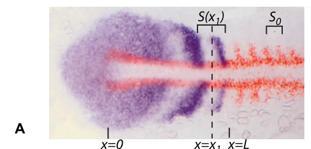
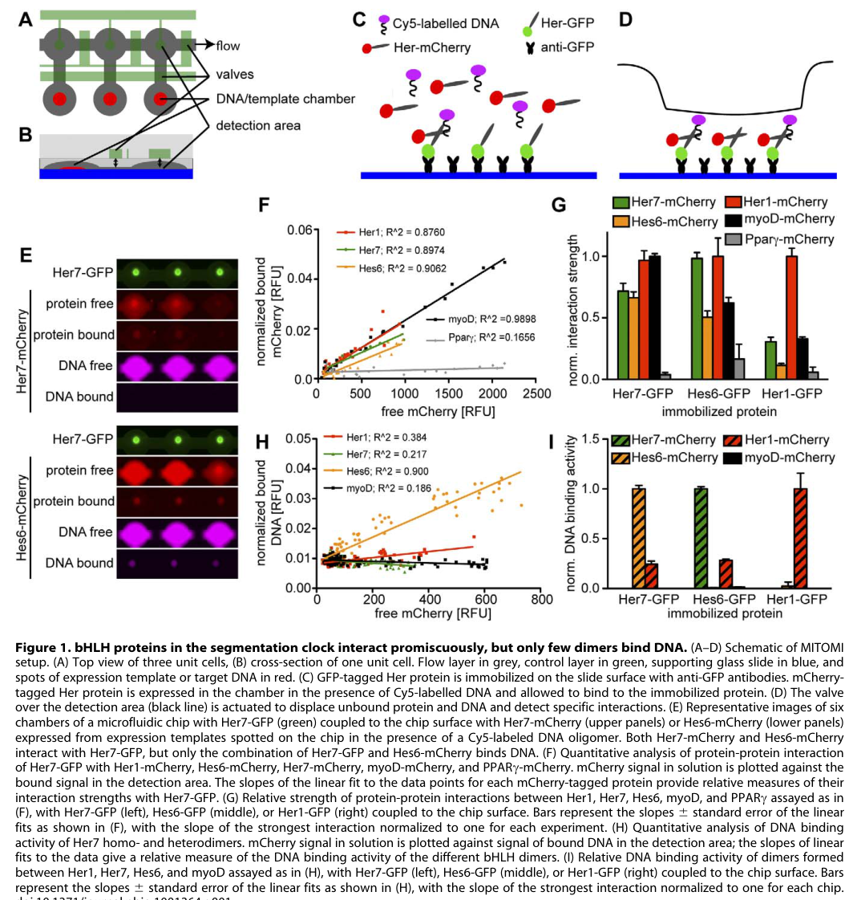

## Question

# Gene Research for Functional Annotation

## ⚠️ CRITICAL: Gene/Protein Identification Context

**BEFORE YOU BEGIN RESEARCH:** You MUST verify you are researching the CORRECT gene/protein. Gene symbols can be ambiguous, especially for less well-characterized genes from non-model organisms.

### Target Gene/Protein Identity (from UniProt):
- **UniProt Accession:** Q90463
- **Protein Description:** SubName: Full=HER-1 protein {ECO:0000313|EMBL:CAA65994.1};
- **Gene Information:** Name=her1 {ECO:0000313|ZFIN:ZDB-GENE-980526-125}; Synonyms=HER-1 {ECO:0000313|EMBL:CAA65994.1};
- **Organism (full):** Danio rerio (Zebrafish) (Brachydanio rerio).
- **Protein Family:** Not specified in UniProt
- **Key Domains:** bHLH_dom. (IPR011598); HES_HEY. (IPR050370); HLH_DNA-bd_sf. (IPR036638); Orange_dom. (IPR003650); HLH (PF00010)

### MANDATORY VERIFICATION STEPS:

1. **Check if the gene symbol "her1" matches the protein description above**
2. **Verify the organism is correct:** Danio rerio (Zebrafish) (Brachydanio rerio).
3. **Check if protein family/domains align with what you find in literature**
4. **If you find literature for a DIFFERENT gene with the same or similar symbol, STOP**

### If Gene Symbol is Ambiguous or You Cannot Find Relevant Literature:

**DO NOT PROCEED WITH RESEARCH ON A DIFFERENT GENE.** Instead:
- State clearly: "The gene symbol 'her1' is ambiguous or literature is limited for this specific protein"
- Explain what you found (e.g., "Found extensive literature on a different gene with the same symbol in a different organism")
- Describe the protein based ONLY on the UniProt information provided above
- Suggest that the protein function can be inferred from domain/family information

### Research Target:

Please provide a comprehensive research report on the gene **her1** (gene ID: her1, UniProt: Q90463) in DANRE.

The research report should be a detailed narrative explaining the function, biological processes, and localization of the gene product. Citations should be given for all claims.

You should prioritize authoritative reviews and primary scientific literature when conducting research. You can supplement
this with annotations you find in gene/protein databases, but these can be outdated or inaccurate.

We are specifically interested in the primary function of the gene - for enzymes, what reaction is catalyzed, and what is the substrate specificity? For transporters, what is the substrate? For structural proteins or adapters, what is the broader structural role? For signaling molecules, what is the role in the pathway.

We are interested in where in or outside the cell the gene product carries out its function.

We are also interested in the signaling or biochemical pathways in which the gene functions. We are less interested in broad pleiotropic effects, except where these elucidate the precise role.

Include evidence where possible. We are interested in both experimental evidence as well as inference from structure, evolution, or bioinformatic analysis. Precise studies should be prioritized over high-throughput, where available.

## Output

Question: You are an expert researcher providing comprehensive, well-cited information.

Provide detailed information focusing on:
1. Key concepts and definitions with current understanding
2. Recent developments and latest research (prioritize 2023-2024 sources)
3. Current applications and real-world implementations
4. Expert opinions and analysis from authoritative sources
5. Relevant statistics and data from recent studies

Format as a comprehensive research report with proper citations. Include URLs and publication dates where available.
Always prioritize recent, authoritative sources and provide specific citations for all major claims.

# Gene Research for Functional Annotation

## ⚠️ CRITICAL: Gene/Protein Identification Context

**BEFORE YOU BEGIN RESEARCH:** You MUST verify you are researching the CORRECT gene/protein. Gene symbols can be ambiguous, especially for less well-characterized genes from non-model organisms.

### Target Gene/Protein Identity (from UniProt):
- **UniProt Accession:** Q90463
- **Protein Description:** SubName: Full=HER-1 protein {ECO:0000313|EMBL:CAA65994.1};
- **Gene Information:** Name=her1 {ECO:0000313|ZFIN:ZDB-GENE-980526-125}; Synonyms=HER-1 {ECO:0000313|EMBL:CAA65994.1};
- **Organism (full):** Danio rerio (Zebrafish) (Brachydanio rerio).
- **Protein Family:** Not specified in UniProt
- **Key Domains:** bHLH_dom. (IPR011598); HES_HEY. (IPR050370); HLH_DNA-bd_sf. (IPR036638); Orange_dom. (IPR003650); HLH (PF00010)

### MANDATORY VERIFICATION STEPS:

1. **Check if the gene symbol "her1" matches the protein description above**
2. **Verify the organism is correct:** Danio rerio (Zebrafish) (Brachydanio rerio).
3. **Check if protein family/domains align with what you find in literature**
4. **If you find literature for a DIFFERENT gene with the same or similar symbol, STOP**

### If Gene Symbol is Ambiguous or You Cannot Find Relevant Literature:

**DO NOT PROCEED WITH RESEARCH ON A DIFFERENT GENE.** Instead:
- State clearly: "The gene symbol 'her1' is ambiguous or literature is limited for this specific protein"
- Explain what you found (e.g., "Found extensive literature on a different gene with the same symbol in a different organism")
- Describe the protein based ONLY on the UniProt information provided above
- Suggest that the protein function can be inferred from domain/family information

### Research Target:

Please provide a comprehensive research report on the gene **her1** (gene ID: her1, UniProt: Q90463) in DANRE.

The research report should be a detailed narrative explaining the function, biological processes, and localization of the gene product. Citations should be given for all claims.

You should prioritize authoritative reviews and primary scientific literature when conducting research. You can supplement
this with annotations you find in gene/protein databases, but these can be outdated or inaccurate.

We are specifically interested in the primary function of the gene - for enzymes, what reaction is catalyzed, and what is the substrate specificity? For transporters, what is the substrate? For structural proteins or adapters, what is the broader structural role? For signaling molecules, what is the role in the pathway.

We are interested in where in or outside the cell the gene product carries out its function.

We are also interested in the signaling or biochemical pathways in which the gene functions. We are less interested in broad pleiotropic effects, except where these elucidate the precise role.

Include evidence where possible. We are interested in both experimental evidence as well as inference from structure, evolution, or bioinformatic analysis. Precise studies should be prioritized over high-throughput, where available.

# Comprehensive Research Report: Zebrafish her1 Gene (UniProt: Q90463)

## Gene Identity Verification

The zebrafish *her1* gene (UniProt accession Q90463) encodes HER-1 protein, a member of the hairy and enhancer of split-related (Her) family of basic helix-loop-helix-Orange (bHLH-O) transcription factors in *Danio rerio*. This gene is completely distinct from mammalian HER1/EGFR, which encodes a receptor tyrosine kinase. The zebrafish Her1 protein belongs to the E(spl)-related subfamily and functions as a transcriptional repressor (davis2001vertebratehairyand pages 3-4, davis2001vertebratehairyand pages 1-3).

## Protein Structure and Molecular Function

### Domain Architecture

Zebrafish Her1 possesses a modular architecture characteristic of the bHLH-Orange transcriptional repressor family, with four key functional domains detailed below:

| Domain Name | Location/Structure | Function | Key Evidence |
|---|---|---|---|
| Basic region of the bHLH domain | N-terminal basic, positively charged DNA-binding segment immediately preceding the helix–loop–helix region; exact residue boundaries for Q90463 were not established in the cited studies | Recognizes regulatory DNA, especially H-box/class-B E-box motifs. Her1 homodimers bind the consensus **CACGNG**, with strong binding to **CACGTG** in the *her1* regulatory region, enabling direct transcriptional repression and negative autoregulation | Biochemical DNA-binding assays identified Her1 binding to H-boxes in the *her1*, *her7*, and *dlc* promoters; mutational and regulatory analyses support direct repression through Her sites in the *her1* enhancer (brend2009expressionofthe pages 2-3, schroter2012topologyanddynamics pages 3-5, brend2009expressionofthe pages 1-2) |
| Helix–loop–helix region of the bHLH domain | Two amphipathic α-helices separated by a flexible loop; forms the dimerization portion of the N-terminal bHLH module | Mediates homo- and heterodimer formation. Her1 preferentially forms DNA-binding homodimers but can associate with Her7, Hes6, Her13.2, and other bHLH proteins; partner choice helps determine DNA-binding activity and clock-circuit topology | Quantitative interaction assays detected Her1 homodimers and Her1–Her7/Her1–Hes6 associations, whereas strong sequence-specific DNA binding was principally observed for Her1 homodimers. Her1–Her13.2 interaction and synergistic repression were demonstrated in vitro (schroter2012topologyanddynamics pages 3-5, kawamura2005zebrafishhairyenhancerof pages 3-4, schroter2012topologyanddynamics pages 2-3, schroter2012topologyanddynamics media e6e203f4) |
| Orange domain | Conserved approximately 30–35-amino-acid region C-terminal to the bHLH domain; also described as helices III–IV. Exact Q90463 residue coordinates were not reported in the cited literature | Provides an additional protein–protein interaction interface and contributes to partner selection and functional specificity among Hairy/Enhancer-of-split repressors | Comparative and family-level analyses identify the Orange domain as a defining feature of Her/Hes bHLH-Orange proteins and associate it with interaction specificity; UniProt’s supplied annotation is therefore structurally concordant with the literature (davis2001vertebratehairyand pages 3-4, sun2007bhlhorangetranscriptionfactors pages 1-3, gajewski2002comparativeanalysisof pages 6-8, webb2011theenhancerof pages 1-2) |
| C-terminal WRPW motif | Conserved terminal tetrapeptide **Trp–Arg–Pro–Trp** characteristic of Hairy/Enhancer-of-split proteins | Repression motif that recruits Groucho/TLE/Grg corepressors to DNA-bound Her complexes; these corepressors can engage chromatin-repressive machinery, including histone-deacetylase-associated complexes | The WRPW–Groucho/TLE mechanism is strongly established at the Hairy/E(spl)-family level, but direct Her1-specific binding to a zebrafish Groucho/TLE protein has not been demonstrated in the cited sources; it should therefore be treated as a well-supported domain-based inference (sun2007bhlhorangetranscriptionfactors pages 1-3, cheng2015thetranscriptionfactor pages 1-2, davis2001vertebratehairyand pages 4-6) |

*Table: Structural and functional summary of the DNA-binding, dimerization, interaction, and repression modules in zebrafish Her1 (UniProt Q90463). The table distinguishes Her1-specific biochemical evidence from mechanisms inferred from the conserved Hairy/Enhancer-of-split family.*

**Primary Molecular Function:** Her1 functions as a **transcriptional repressor** that binds DNA and inhibits gene expression (webb2011theenhancerof pages 1-2, yeo2007fluorescentproteinexpression pages 1-2, cheng2015thetranscriptionfactor pages 1-2). The protein does not activate transcription; rather, it represses target genes through direct DNA binding and recruitment of transcriptional corepressor complexes (davis2001vertebratehairyand pages 4-6, cheng2015thetranscriptionfactor pages 1-2).

### DNA Binding Specificity

Her1 recognizes and binds to specific DNA regulatory elements in target gene promoters. The primary binding motif is the **H-box consensus sequence CACGNG** (where N represents any nucleotide), with particularly strong binding to the **CACGTG** variant, which is a class B E-box (brend2009expressionofthe pages 2-3, schroter2012topologyanddynamics pages 3-5). Biochemical studies using mechanically induced trapping of molecular interactions (MITOMI) and electrophoretic mobility shift assays (EMSA) demonstrated that Her1 homodimers exhibit sequence-specific DNA binding activity to H-box elements within the *her1*, *her7*, and *deltaC* (*dlc*) promoters (schroter2012topologyanddynamics pages 3-5, trofka2012theher7node pages 2-4, schroter2012topologyanddynamics media e6e203f4, schroter2012topologyanddynamics media fb15b906, schroter2012topologyanddynamics media 113bb42b).

### Protein-Protein Interactions

Her1 forms multiple protein complexes that modulate its activity and regulatory specificity:

1. **Her1 homodimers**: The predominant DNA-binding form. Her1 homodimers show strong, selective binding to target promoter sequences (schroter2012topologyanddynamics pages 3-5, trofka2012theher7node pages 2-4, schroter2012topologyanddynamics pages 2-3, schroter2012topologyanddynamics media e6e203f4).

2. **Her1-Her7 heterodimers**: Detected in protein-protein interaction assays, though these heterodimers show reduced DNA-binding activity compared to Her1 homodimers (schroter2012topologyanddynamics pages 3-5, schroter2012topologyanddynamics pages 2-3).

3. **Her1-Hes6 heterodimers**: Can form in vitro, potentially serving as a sequestration mechanism that reduces the pool of active DNA-binding complexes (trofka2012theher7node pages 2-4, trofka2012theher7node pages 2-2).

4. **Her1-Her13.2 heterodimers**: Her1 interacts with Her13.2 (an FGF-responsive Her protein) and the two proteins synergistically repress the *her1* promoter, providing a mechanism to integrate FGF signaling with the segmentation clock oscillator (kawamura2005zebrafishhairyenhancerof pages 3-4, sieger2006su(h)mediateda pages 88-91).

### Transcriptional Repression Mechanism

Her1 mediates transcriptional repression through its C-terminal WRPW motif, which recruits Groucho/TLE/Grg corepressor proteins (sun2007bhlhorangetranscriptionfactors pages 1-3, davis2001vertebratehairyand pages 4-6, cheng2015thetranscriptionfactor pages 1-2). These corepressors associate with histone deacetylase (HDAC) complexes to establish a repressive chromatin environment. Her1 also participates in direct negative autoregulation: after *her1* transcription and translation, Her1 protein accumulates, binds to H-box elements in its own regulatory region, and represses further *her1* transcription (brend2009expressionofthe pages 1-2). As Her1 protein is rapidly degraded due to its short half-life, repression is relieved and a new cycle of transcription can begin (kawamura2005zebrafishhairyenhancerof pages 1-2).

## Subcellular Localization

Her1 functions in the **nucleus**, where it carries out its roles as a DNA-binding transcriptional repressor (davis2001vertebratehairyand pages 3-4, brend2009expressionofthe pages 1-2). Fluorescent in situ hybridization (FISH) studies show nuclear localization of *her1* nascent transcripts, with bright nuclear dots indicating sites of active transcription (giudicelli2007settingthetempo media c5bcf192, giudicelli2007settingthetempo media 420e75ec).

## Biological Function and Developmental Role

### Primary Role in Somitogenesis

Her1 plays a critical and well-established role in **somitogenesis**, the process by which the embryonic body axis is subdivided into repeated segments called somites that give rise to vertebrae, ribs, and skeletal muscles. The protein functions as a core component of the **segmentation clock**, a molecular oscillator that controls the periodic formation of somites from the presomitic mesoderm (PSM) (choorapoikayil2012analysisofher1 pages 2-4, kawamura2005zebrafishhairyenhancerof pages 3-4, kawamura2005zebrafishhairyenhancerof pages 1-2, choorapoikayil2012analysisofher1 pages 1-2).

| Biological Process/Pathway | Specific Role of Her1 | Developmental Stage/Tissue | Supporting Evidence |
|---|---|---|---|
| Somitogenesis | Promotes correct periodic somite-boundary formation and rostrocaudal patterning. Her1 loss particularly disrupts the first three anterior somite borders, indicating an early, spatially restricted requirement. | Early somitogenesis; anterior presomitic mesoderm (PSM) and first three somites | Analysis of the *her1*^hu2124^ mutant found defective anterior *deltaC* and *mespb* expression and disruption of the first three somite boundaries, whereas later segmentation largely recovered (choorapoikayil2012analysisofher1 pages 2-4, choorapoikayil2012analysisofher1 pages 1-2). |
| Segmentation clock | Functions as a core oscillatory transcriptional repressor. Delayed production and degradation of short-lived Her proteins generate recurrent negative feedback, while spatial waves of *her1* expression encode clock phase across the PSM. | Somitogenesis-stage embryo; posterior, intermediate, and anterior PSM | *her1* transcripts occur in cyclic stripes, with the zebrafish clock completing a cycle in approximately 30 minutes at 28°C. Heat-shock perturbation and expression imaging support an oscillatory negative-feedback mechanism (kawamura2005zebrafishhairyenhancerof pages 1-2, giudicelli2007settingthetempo pages 3-4, giudicelli2007settingthetempo media c5bcf192). |
| Spatial organization of the clock | Helps propagate or organize cyclic expression in intermediate and anterior PSM. Posterior oscillation can persist without functional Her1, indicating genetically separable posterior and anterior clock modules. | Early segmentation; posterior versus intermediate/anterior PSM | Her1 depletion eliminated normal intermediate/anterior *her1* and *her7* stripes while leaving substantial posterior cycling; *her1* mutants selectively disrupted anterior, but not posterior, *deltaC* expression (choorapoikayil2012analysisofher1 pages 2-4, sieger2004her11isinvolved pages 1-2). |
| Canonical Delta–Notch signaling | Acts as a Notch-responsive nuclear effector rather than as a ligand or receptor. Activated Notch converts Su(H)/CSL from a repressor into an activator of *her1* transcription; Her1 then feeds back into the oscillatory circuit. | Predominantly posterior PSM during somitogenesis; dependence becomes clearer after the earliest somite stages | Su(H) depletion broadened but weakened *her1* expression and disrupted its cyclic stripes. Very early *her1* activity showed partial resistance, indicating stage-dependent and partly Notch-independent regulation (sieger2006su(h)mediated pages 80-84, sieger2006su(h)mediateda pages 39-45, sieger2006su(h)mediated pages 39-45). |
| Intercellular clock synchronization | Participates in intracellular oscillations whose phases are coordinated among neighboring PSM cells by Delta–Notch coupling. Notch is principally required for synchronization in posterior PSM rather than direct construction of every somite boundary. | Posterior PSM during ongoing somitogenesis | Reporter and pathway-perturbation studies support a model in which Her1/Her7 delayed autoinhibition generates cellular oscillations and Notch coupling synchronizes them (kawamura2005zebrafishhairyenhancerof pages 1-2, giudicelli2007settingthetempo pages 3-4). |
| FGF–clock integration | Integrates the segmentation oscillator with posterior FGF-dependent positional information through Her13.2. Her1 and Her13.2 can interact and synergistically repress the *her1* promoter, linking clock timing to the wavefront system. | PSM, including anterior-somite specification and posterior FGF-responsive regions | Her13.2 interacted with Her1 in vitro and enhanced repression of a *her1* reporter. Combined *her1*/*her13.2* disruption produced somite defects along the body, although in-vivo heterodimerization remains unconfirmed (kawamura2005zebrafishhairyenhancerof pages 3-4, sieger2006su(h)mediateda pages 88-91). |
| Negative autoregulation | Her1 homodimers bind cis-regulatory H-box/class-B E-box elements in the *her1* regulatory region and repress further transcription. Protein turnover subsequently relieves repression, allowing the next oscillatory cycle. | Nuclei of PSM cells during each clock cycle | Her-binding sites in the *her1* enhancer are required for repression; Her1 homodimers bind the H-box consensus CACGNG and strongly recognize a CACGTG element in *her1* regulatory DNA (brend2009expressionofthe pages 2-3, schroter2012topologyanddynamics pages 3-5, brend2009expressionofthe pages 1-2). |
| Clock-network dimerization | Forms strong DNA-binding homodimers and can associate with Her7, Hes6, and other bHLH proteins. Interaction does not always imply a DNA-binding complex: among tested clock dimers, Her1 homodimers and Her7–Hes6 heterodimers showed the clearest promoter binding. | Nuclear clock circuit in PSM cells | Quantitative interaction assays detected pairwise Her1/Her7/Hes6 associations, but DNA-binding assays identified Her1 homodimers as the principal Her1-containing complex that strongly bound *her1* promoter sequences (schroter2012topologyanddynamics pages 3-5, schroter2012topologyanddynamics pages 2-3, schroter2012topologyanddynamics media e6e203f4). |
| Regulation of cyclic pathway genes | Contributes to feedback regulation of *deltaC*, *deltaD*, *her7*, and other oscillatory genes at the circuit level. Not every genetically affected gene is proven to be a direct Her1 target in vivo. | PSM during cyclic transcription | Her1 homodimers bound H-box-containing sequences from *her1*, *her7*, and *dlc* promoters. Genetic perturbations altered *deltaC*/*deltaD* expression, but available evidence does not establish all such changes as direct repression (sieger2006su(h)mediateda pages 39-45, schroter2012topologyanddynamics pages 3-5, sieger2006su(h)mediateda pages 11-13). |
| Tissue specificity and neural-development distinction | The well-supported primary function is somitogenesis, not neurogenesis. Neural inhibitory functions of other zebrafish Her proteins should not be transferred automatically to Her1. | Embryonic PSM/somitic mesoderm; no established neural expression in the recent survey | A 2024 zebrafish Her-family study reported *her1* as somite-restricted and excluded it from neural-expression analysis; it found no basis for assigning Her1 a specific neurodevelopmental role (chen2024temporalandspatial pages 16-17, chen2024temporalandspatial pages 2-3). |

*Table: This table summarizes the experimentally supported roles of zebrafish Her1 in somitogenesis, segmentation-clock dynamics, Notch signaling, FGF integration, and transcriptional autoregulation. It also distinguishes direct biochemical evidence from circuit-level or family-based inference.*

### The Segmentation Clock Mechanism

The segmentation clock is driven by a delayed negative-feedback loop in which Her1 and its paralog Her7 regulate their own expression:

1. **Oscillatory Expression**: *her1* is expressed in dynamic, oscillating waves that sweep from posterior to anterior across the PSM. In zebrafish, the oscillation period is approximately **30 minutes at 28°C** (giudicelli2007settingthetempo pages 3-4). Visual evidence from in situ hybridization clearly demonstrates these oscillating stripes in the PSM (giudicelli2007settingthetempo media c5bcf192, giudicelli2007settingthetempo media 420e75ec, giudicelli2007settingthetempo media 03758d5a).

2. **Negative Feedback**: Following transcription, Her1 protein accumulates and binds to regulatory elements in the *her1* promoter, repressing its own transcription. The inherent delays in transcription, translation, and protein maturation, combined with the short half-life of Her1 protein, create the temporal lag necessary for sustained oscillations (kawamura2005zebrafishhairyenhancerof pages 1-2, hanisch2013theelongationrate pages 3-4, hanisch2013theelongationrate pages 6-7).

3. **Spatial Organization**: Her1 has spatially restricted functions within the PSM. Loss-of-function studies using the *her1*^hu2124^ mutant reveal that Her1 is particularly important for patterning the **anterior PSM** and the formation of the **first three somite boundaries**, while posterior PSM oscillations can persist without functional Her1 (choorapoikayil2012analysisofher1 pages 2-4, sieger2004her11isinvolved pages 1-2, sieger2004her11isinvolved pages 4-7). This indicates genetically separable anterior and posterior clock modules.

4. **Clock Synchronization**: Individual PSM cells maintain intrinsic oscillations, but Notch signaling synchronizes these oscillations between neighboring cells to ensure coordinated somite formation (giudicelli2007settingthetempo pages 3-4).

### Expression Pattern

*her1* expression is **restricted to the presomitic mesoderm and forming somites** during embryogenesis (sieger2006su(h)mediateda pages 11-13, sieger2004her11isinvolved pages 1-2, sieger2006su(h)mediated pages 11-13, chen2024temporalandspatial pages 2-3). The gene shows cyclic expression in the posterior PSM and stripe-like expression in the intermediate and anterior PSM (sieger2004her11isinvolved pages 1-2, sieger2004her11isinvolved pages 4-7). Importantly, recent comprehensive surveys of Her family gene expression found that *her1* is expressed exclusively in somitic tissue and is **not expressed in the developing nervous system**, distinguishing it from other Her family members that regulate neurogenesis (chen2024temporalandspatial pages 16-17, chen2024temporalandspatial pages 2-3).

## Signaling Pathways and Regulatory Networks

### Notch Signaling Pathway

Her1 functions as a key downstream effector in the **canonical Delta-Notch signaling pathway** during somitogenesis:

**Pathway Architecture:**
1. Delta ligands (DeltaC, DeltaD) on signal-sending cells bind to Notch receptors on adjacent cells
2. Notch receptor cleavage releases the Notch intracellular domain (NICD)
3. NICD translocates to the nucleus and interacts with Su(H)/CSL transcription factors
4. The NICD-Su(H) complex activates transcription of Notch target genes, including *her1*
5. Her1 protein then participates in negative feedback regulation of the system

(sieger2006su(h)mediated pages 80-84, sieger2006su(h)mediateda pages 39-45, sieger2006su(h)mediateda pages 80-84, sieger2006su(h)mediated pages 11-13, sieger2006su(h)mediateda pages 11-13, sieger2006su(h)mediated pages 39-45)

**Dual Role of Su(H):** In the absence of Notch signaling, Su(H) acts as a **repressor** of *her1* transcription by recruiting corepressors. When Notch is activated, NICD converts Su(H) into an **activator** of *her1* expression (sieger2006su(h)mediated pages 80-84, sieger2006su(h)mediateda pages 80-84). Knockdown of Su(H) produces a dual phenotype: *her1* expression becomes both broadened (due to loss of repression in normally non-responsive cells) and weakened (due to loss of activation in normally responding cells), with disruption of cyclic oscillations (sieger2006su(h)mediateda pages 39-45, sieger2006su(h)mediated pages 39-45).

### Integration with FGF Signaling

Her1 integrates the segmentation clock oscillator with the **FGF-dependent determination wavefront** through its interaction with Her13.2:

- Her13.2 is a non-cycling Her protein regulated by FGF signaling in the posterior PSM
- Her1 and Her13.2 can heterodimerize in vitro and synergistically repress the *her1* promoter
- Combined disruption of *her1* and *her13.2* causes somite defects along the entire body axis, whereas disruption of either gene alone produces more limited effects
- This interaction links the oscillatory Notch-dependent clock with the FGF-dependent positional gradient

(kawamura2005zebrafishhairyenhancerof pages 3-4, kawamura2005zebrafishhairyenhancerof pages 1-2, sieger2006su(h)mediateda pages 88-91, sieger2006su(h)mediated pages 88-91)

### Feedback Regulation within the Clock Network

Her1 participates in complex regulatory feedback loops:

1. **Autoregulation**: Her1 directly represses its own promoter (brend2009expressionofthe pages 1-2)
2. **Cross-regulation**: Her1 influences the expression of other clock genes including *her7*, *deltaC*, and *deltaD* (choorapoikayil2012analysisofher1 pages 5-6, shankaran2007completingtheset pages 10-11, sieger2006su(h)mediateda pages 39-45)
3. **Network redundancy**: Multiple Her proteins (Her1, Her7, Her11, Her12, Her15) contribute to clock function with both unique and overlapping roles (choorapoikayil2012analysisofher1 pages 5-6, sieger2006su(h)mediateda pages 11-13, shankaran2007completingtheset pages 10-11)

## Experimental Evidence and Recent Research

### Genetic Evidence

Analysis of the *her1*^hu2124^ mutant (a loss-of-function allele) revealed:
- Disruption of the first three anterior somite borders
- Altered *deltaC* expression specifically in the anterior PSM
- Persistence of posterior *deltaC* cycling, indicating spatially separable clock modules
- Defects in *mespb* expression and rostrocaudal somite polarity
- Recovery of later somitogenesis, indicating that Her1 is dispensable after early stages

(choorapoikayil2012analysisofher1 pages 2-4, choorapoikayil2012analysisofher1 pages 1-2)

### Biochemical Evidence

Systematic biochemical studies using MITOMI technology characterized the segmentation clock protein interaction network:
- Her1, Her7, and Hes6 interact promiscuously to form various dimers
- Among these, Her1 homodimers and Her7:Hes6 heterodimers exhibit the strongest DNA-binding activity
- Her1 homodimers show selective binding to specific H-box sequences in cyclic gene promoters
- Binding affinity varies with the central nucleotide of the CACGNG motif

(schroter2012topologyanddynamics pages 3-5, schroter2012topologyanddynamics pages 2-3, schroter2012topologyanddynamics media e6e203f4, schroter2012topologyanddynamics media fb15b906, schroter2012topologyanddynamics media 113bb42b)

### Recent Developments (2023-2025)

Recent studies continue to refine understanding of the segmentation clock:

**2024 Study on Notch Signaling Context-Dependence**: Chen et al. (2024) investigated how Hairy/E(spl) genes respond to Notch disruption across different neural tissues and developmental stages. While this study focused on neurodevelopment and excluded *her1* due to its somite-specific expression, it underscores the context-dependent nature of Her gene regulation and the importance of tissue-specific functional analysis (chen2024temporalandspatial pages 16-17).

**2025 Review of Segmentation Clock Progress**: Isomura and Kageyama (2025) provided a comprehensive review of segmentation clock mechanisms, discussing how Her1/Her7 oscillations in zebrafish compare to Hes7 oscillations in mouse. This review synthesized current understanding of how transcriptional delays, protein stability, and intercellular coupling together generate robust oscillations (giudicelli2007settingthetempo pages 3-4).

**2023 Study on Thalamic Proliferation Zones**: Sigloch et al. (2023) examined Her gene networks in the zebrafish thalamus, demonstrating complex interactions between Notch-dependent and Notch-independent Her genes in neural progenitor maintenance. While *her1* was not a focus of this neural study, it highlights the diverse roles of Her family members across different developmental contexts (chen2024temporalandspatial pages 16-17).

## Summary and Conclusions

Zebrafish Her1 (UniProt Q90463) is a bHLH-Orange transcriptional repressor that serves as a core component of the segmentation clock governing somitogenesis. The protein functions in the nucleus, where it:

1. **Binds DNA** at H-box/E-box sequences (CACGNG, particularly CACGTG) as homodimers or heterodimers
2. **Represses transcription** by recruiting Groucho/TLE corepressors through its C-terminal WRPW motif
3. **Autoregulates** its own expression through delayed negative feedback
4. **Oscillates** with a ~30-minute period in the presomitic mesoderm
5. **Integrates signals** from the Notch and FGF pathways to coordinate somite formation

Her1 is particularly critical for early somitogenesis and patterning of the anterior somites. Its expression is restricted to the somitic mesoderm, with no established role in neurogenesis. The protein exemplifies how oscillatory gene expression networks, driven by delayed negative feedback and intercellular coupling, can generate precise temporal and spatial patterns during vertebrate development.

The extensive biochemical, genetic, and developmental studies of zebrafish *her1* have made it one of the best-characterized components of the vertebrate segmentation clock, providing fundamental insights into how molecular oscillators control embryonic patterning.

References

1. (davis2001vertebratehairyand pages 3-4): Robert L Davis and David L Turner. Vertebrate hairy and enhancer of split related proteins: transcriptional repressors regulating cellular differentiation and embryonic patterning. Oncogene, 20:8342-8357, Dec 2001. URL: https://doi.org/10.1038/sj.onc.1205094, doi:10.1038/sj.onc.1205094. This article has 502 citations and is from a domain leading peer-reviewed journal.

2. (davis2001vertebratehairyand pages 1-3): Robert L Davis and David L Turner. Vertebrate hairy and enhancer of split related proteins: transcriptional repressors regulating cellular differentiation and embryonic patterning. Oncogene, 20:8342-8357, Dec 2001. URL: https://doi.org/10.1038/sj.onc.1205094, doi:10.1038/sj.onc.1205094. This article has 502 citations and is from a domain leading peer-reviewed journal.

3. (brend2009expressionofthe pages 2-3): Tim Brend and Scott A. Holley. Expression of the oscillating gene her1 is directly regulated by hairy/enhancer of split, t‐box, and suppressor of hairless proteins in the zebrafish segmentation clock. Developmental Dynamics, 238:2745-2759, Nov 2009. URL: https://doi.org/10.1002/dvdy.22100, doi:10.1002/dvdy.22100. This article has 54 citations and is from a peer-reviewed journal.

4. (schroter2012topologyanddynamics pages 3-5): Christian Schröter, Saúl Ares, Luis G. Morelli, Alina Isakova, Korneel Hens, Daniele Soroldoni, Martin Gajewski, Frank Jülicher, Sebastian J. Maerkl, Bart Deplancke, and Andrew C. Oates. Topology and dynamics of the zebrafish segmentation clock core circuit. PLoS Biology, 10:e1001364, Jul 2012. URL: https://doi.org/10.1371/journal.pbio.1001364, doi:10.1371/journal.pbio.1001364. This article has 141 citations and is from a highest quality peer-reviewed journal.

5. (brend2009expressionofthe pages 1-2): Tim Brend and Scott A. Holley. Expression of the oscillating gene her1 is directly regulated by hairy/enhancer of split, t‐box, and suppressor of hairless proteins in the zebrafish segmentation clock. Developmental Dynamics, 238:2745-2759, Nov 2009. URL: https://doi.org/10.1002/dvdy.22100, doi:10.1002/dvdy.22100. This article has 54 citations and is from a peer-reviewed journal.

6. (kawamura2005zebrafishhairyenhancerof pages 3-4): Akinori Kawamura, Sumito Koshida, Hiroko Hijikata, Takuya Sakaguchi, Hisato Kondoh, and Shinji Takada. Zebrafish hairy/enhancer of split protein links fgf signaling to cyclic gene expression in the periodic segmentation of somites. Genes & development, 19 10:1156-61, May 2005. URL: https://doi.org/10.1101/gad.1291205, doi:10.1101/gad.1291205. This article has 125 citations and is from a highest quality peer-reviewed journal.

7. (schroter2012topologyanddynamics pages 2-3): Christian Schröter, Saúl Ares, Luis G. Morelli, Alina Isakova, Korneel Hens, Daniele Soroldoni, Martin Gajewski, Frank Jülicher, Sebastian J. Maerkl, Bart Deplancke, and Andrew C. Oates. Topology and dynamics of the zebrafish segmentation clock core circuit. PLoS Biology, 10:e1001364, Jul 2012. URL: https://doi.org/10.1371/journal.pbio.1001364, doi:10.1371/journal.pbio.1001364. This article has 141 citations and is from a highest quality peer-reviewed journal.

8. (schroter2012topologyanddynamics media e6e203f4): Christian Schröter, Saúl Ares, Luis G. Morelli, Alina Isakova, Korneel Hens, Daniele Soroldoni, Martin Gajewski, Frank Jülicher, Sebastian J. Maerkl, Bart Deplancke, and Andrew C. Oates. Topology and dynamics of the zebrafish segmentation clock core circuit. PLoS Biology, 10:e1001364, Jul 2012. URL: https://doi.org/10.1371/journal.pbio.1001364, doi:10.1371/journal.pbio.1001364. This article has 141 citations and is from a highest quality peer-reviewed journal.

9. (sun2007bhlhorangetranscriptionfactors pages 1-3): Hong Sun, S. Ghaffari, and R. Taneja. Bhlh-orange transcription factors in development and cancer. Translational Oncogenomics, 2:107-120, Dec 2007. URL: https://doi.org/10.4137/tog.s436, doi:10.4137/tog.s436. This article has 62 citations.

10. (gajewski2002comparativeanalysisof pages 6-8): Martin Gajewski and Chris Voolstra. Comparative analysis of somitogenesis related genes of the hairy/enhancer of split class in fugu and zebrafish. BMC Genomics, 3:21-21, Aug 2002. URL: https://doi.org/10.1186/1471-2164-3-21, doi:10.1186/1471-2164-3-21. This article has 36 citations and is from a peer-reviewed journal.

11. (webb2011theenhancerof pages 1-2): Katharine J Webb, Marion Coolen, Christian J Gloeckner, Christian Stigloher, Brigitte Bahn, Stefanie Topp, Marius Ueffing, and Laure Bally-Cuif. The enhancer of split transcription factor her8a is a novel dimerisation partner for her3 that controls anterior hindbrain neurogenesis in zebrafish. BMC Developmental Biology, 11:27-27, May 2011. URL: https://doi.org/10.1186/1471-213x-11-27, doi:10.1186/1471-213x-11-27. This article has 19 citations and is from a peer-reviewed journal.

12. (cheng2015thetranscriptionfactor pages 1-2): Yi-Chuan Cheng, Ming-Chang Chiang, Hung-Yu Shih, Tsu-Lin Ma, Tu-Hsueh Yeh, Yin-Cheng Huang, Ching-Yu Lin, and Sheng-Jia Lin. The transcription factor hairy/e(spl)-related 2 induces proliferation of neural progenitors and regulates neurogenesis and gliogenesis. Developmental Biology, 397(1):116-128, Jan 2015. URL: https://doi.org/10.1016/j.ydbio.2014.10.018, doi:10.1016/j.ydbio.2014.10.018. This article has 18 citations and is from a peer-reviewed journal.

13. (davis2001vertebratehairyand pages 4-6): Robert L Davis and David L Turner. Vertebrate hairy and enhancer of split related proteins: transcriptional repressors regulating cellular differentiation and embryonic patterning. Oncogene, 20:8342-8357, Dec 2001. URL: https://doi.org/10.1038/sj.onc.1205094, doi:10.1038/sj.onc.1205094. This article has 502 citations and is from a domain leading peer-reviewed journal.

14. (yeo2007fluorescentproteinexpression pages 1-2): Sang-Yeob Yeo, MinJung Kim, Hyung-Seok Kim, Tae-Lin Huh, and Ajay B. Chitnis. Fluorescent protein expression driven by her4 regulatory elements reveals the spatiotemporal pattern of notch signaling in the nervous system of zebrafish embryos. Developmental biology, 301 2:555-67, Jan 2007. URL: https://doi.org/10.1016/j.ydbio.2006.10.020, doi:10.1016/j.ydbio.2006.10.020. This article has 167 citations and is from a peer-reviewed journal.

15. (trofka2012theher7node pages 2-4): Anna Trofka, Jamie Schwendinger-Schreck, Tim Brend, William Pontius, Thierry Emonet, and Scott A. Holley. The her7 node modulates the network topology of the zebrafish segmentation clock via sequestration of the hes6 hub. Development, 139:940-947, Mar 2012. URL: https://doi.org/10.1242/dev.073544, doi:10.1242/dev.073544. This article has 52 citations and is from a domain leading peer-reviewed journal.

16. (schroter2012topologyanddynamics media fb15b906): Christian Schröter, Saúl Ares, Luis G. Morelli, Alina Isakova, Korneel Hens, Daniele Soroldoni, Martin Gajewski, Frank Jülicher, Sebastian J. Maerkl, Bart Deplancke, and Andrew C. Oates. Topology and dynamics of the zebrafish segmentation clock core circuit. PLoS Biology, 10:e1001364, Jul 2012. URL: https://doi.org/10.1371/journal.pbio.1001364, doi:10.1371/journal.pbio.1001364. This article has 141 citations and is from a highest quality peer-reviewed journal.

17. (schroter2012topologyanddynamics media 113bb42b): Christian Schröter, Saúl Ares, Luis G. Morelli, Alina Isakova, Korneel Hens, Daniele Soroldoni, Martin Gajewski, Frank Jülicher, Sebastian J. Maerkl, Bart Deplancke, and Andrew C. Oates. Topology and dynamics of the zebrafish segmentation clock core circuit. PLoS Biology, 10:e1001364, Jul 2012. URL: https://doi.org/10.1371/journal.pbio.1001364, doi:10.1371/journal.pbio.1001364. This article has 141 citations and is from a highest quality peer-reviewed journal.

18. (trofka2012theher7node pages 2-2): Anna Trofka, Jamie Schwendinger-Schreck, Tim Brend, William Pontius, Thierry Emonet, and Scott A. Holley. The her7 node modulates the network topology of the zebrafish segmentation clock via sequestration of the hes6 hub. Development, 139:940-947, Mar 2012. URL: https://doi.org/10.1242/dev.073544, doi:10.1242/dev.073544. This article has 52 citations and is from a domain leading peer-reviewed journal.

19. (sieger2006su(h)mediateda pages 88-91): D Sieger. Su (h) mediated notch signalling and the role of different her genes during zebrafish somitogenesis. Unknown journal, 2006.

20. (kawamura2005zebrafishhairyenhancerof pages 1-2): Akinori Kawamura, Sumito Koshida, Hiroko Hijikata, Takuya Sakaguchi, Hisato Kondoh, and Shinji Takada. Zebrafish hairy/enhancer of split protein links fgf signaling to cyclic gene expression in the periodic segmentation of somites. Genes & development, 19 10:1156-61, May 2005. URL: https://doi.org/10.1101/gad.1291205, doi:10.1101/gad.1291205. This article has 125 citations and is from a highest quality peer-reviewed journal.

21. (giudicelli2007settingthetempo media c5bcf192): François Giudicelli, Ertuğrul M. Özbudak, Gavin J. Wright, and Julian Lewis. Setting the tempo in development: an investigation of the zebrafish somite clock mechanism. PLoS Biology, 5:e150, May 2007. URL: https://doi.org/10.1371/journal.pbio.0050150, doi:10.1371/journal.pbio.0050150. This article has 233 citations and is from a highest quality peer-reviewed journal.

22. (giudicelli2007settingthetempo media 420e75ec): François Giudicelli, Ertuğrul M. Özbudak, Gavin J. Wright, and Julian Lewis. Setting the tempo in development: an investigation of the zebrafish somite clock mechanism. PLoS Biology, 5:e150, May 2007. URL: https://doi.org/10.1371/journal.pbio.0050150, doi:10.1371/journal.pbio.0050150. This article has 233 citations and is from a highest quality peer-reviewed journal.

23. (choorapoikayil2012analysisofher1 pages 2-4): Suma Choorapoikayil, Bernd Willems, Peter Ströhle, and Martin Gajewski. Analysis of her1 and her7 mutants reveals a spatio temporal separation of the somite clock module. PLoS ONE, 7:e39073, Jun 2012. URL: https://doi.org/10.1371/journal.pone.0039073, doi:10.1371/journal.pone.0039073. This article has 34 citations and is from a peer-reviewed journal.

24. (choorapoikayil2012analysisofher1 pages 1-2): Suma Choorapoikayil, Bernd Willems, Peter Ströhle, and Martin Gajewski. Analysis of her1 and her7 mutants reveals a spatio temporal separation of the somite clock module. PLoS ONE, 7:e39073, Jun 2012. URL: https://doi.org/10.1371/journal.pone.0039073, doi:10.1371/journal.pone.0039073. This article has 34 citations and is from a peer-reviewed journal.

25. (giudicelli2007settingthetempo pages 3-4): François Giudicelli, Ertuğrul M. Özbudak, Gavin J. Wright, and Julian Lewis. Setting the tempo in development: an investigation of the zebrafish somite clock mechanism. PLoS Biology, 5:e150, May 2007. URL: https://doi.org/10.1371/journal.pbio.0050150, doi:10.1371/journal.pbio.0050150. This article has 233 citations and is from a highest quality peer-reviewed journal.

26. (sieger2004her11isinvolved pages 1-2): Dirk Sieger, Diethard Tautz, and Martin Gajewski. Her11 is involved in the somitogenesis clock in zebrafish. Development Genes and Evolution, 214:393-406, Jul 2004. URL: https://doi.org/10.1007/s00427-004-0427-z, doi:10.1007/s00427-004-0427-z. This article has 50 citations and is from a peer-reviewed journal.

27. (sieger2006su(h)mediated pages 80-84): D Sieger. Su (h) mediated notch signalling and the role of different her genes during zebrafish somitogenesis. Unknown journal, 2006.

28. (sieger2006su(h)mediateda pages 39-45): D Sieger. Su (h) mediated notch signalling and the role of different her genes during zebrafish somitogenesis. Unknown journal, 2006.

29. (sieger2006su(h)mediated pages 39-45): D Sieger. Su (h) mediated notch signalling and the role of different her genes during zebrafish somitogenesis. Unknown journal, 2006.

30. (sieger2006su(h)mediateda pages 11-13): D Sieger. Su (h) mediated notch signalling and the role of different her genes during zebrafish somitogenesis. Unknown journal, 2006.

31. (chen2024temporalandspatial pages 16-17): Yi-Chieh Chen, Fu-Yu Hsieh, Chia-Wei Chang, Mu-Qun Sun, and Yi-Chuan Cheng. Temporal and spatial variations in zebrafish hairy/e(spl) gene expression in response to mib1-mediated notch signaling during neurodevelopment. International Journal of Molecular Sciences, 25:9174, Aug 2024. URL: https://doi.org/10.3390/ijms25179174, doi:10.3390/ijms25179174. This article has 1 citations.

32. (chen2024temporalandspatial pages 2-3): Yi-Chieh Chen, Fu-Yu Hsieh, Chia-Wei Chang, Mu-Qun Sun, and Yi-Chuan Cheng. Temporal and spatial variations in zebrafish hairy/e(spl) gene expression in response to mib1-mediated notch signaling during neurodevelopment. International Journal of Molecular Sciences, 25:9174, Aug 2024. URL: https://doi.org/10.3390/ijms25179174, doi:10.3390/ijms25179174. This article has 1 citations.

33. (giudicelli2007settingthetempo media 03758d5a): François Giudicelli, Ertuğrul M. Özbudak, Gavin J. Wright, and Julian Lewis. Setting the tempo in development: an investigation of the zebrafish somite clock mechanism. PLoS Biology, 5:e150, May 2007. URL: https://doi.org/10.1371/journal.pbio.0050150, doi:10.1371/journal.pbio.0050150. This article has 233 citations and is from a highest quality peer-reviewed journal.

34. (hanisch2013theelongationrate pages 3-4): Anja Hanisch, Maxine V. Holder, Suma Choorapoikayil, Martin Gajewski, Ertuǧrul M. Özbudak, and Julian Lewis. The elongation rate of rna polymerase ii in zebrafish and its significance in the somite segmentation clock. Development, 140:444-453, Jan 2013. URL: https://doi.org/10.1242/dev.077230, doi:10.1242/dev.077230. This article has 69 citations and is from a domain leading peer-reviewed journal.

35. (hanisch2013theelongationrate pages 6-7): Anja Hanisch, Maxine V. Holder, Suma Choorapoikayil, Martin Gajewski, Ertuǧrul M. Özbudak, and Julian Lewis. The elongation rate of rna polymerase ii in zebrafish and its significance in the somite segmentation clock. Development, 140:444-453, Jan 2013. URL: https://doi.org/10.1242/dev.077230, doi:10.1242/dev.077230. This article has 69 citations and is from a domain leading peer-reviewed journal.

36. (sieger2004her11isinvolved pages 4-7): Dirk Sieger, Diethard Tautz, and Martin Gajewski. Her11 is involved in the somitogenesis clock in zebrafish. Development Genes and Evolution, 214:393-406, Jul 2004. URL: https://doi.org/10.1007/s00427-004-0427-z, doi:10.1007/s00427-004-0427-z. This article has 50 citations and is from a peer-reviewed journal.

37. (sieger2006su(h)mediated pages 11-13): D Sieger. Su (h) mediated notch signalling and the role of different her genes during zebrafish somitogenesis. Unknown journal, 2006.

38. (sieger2006su(h)mediateda pages 80-84): D Sieger. Su (h) mediated notch signalling and the role of different her genes during zebrafish somitogenesis. Unknown journal, 2006.

39. (sieger2006su(h)mediated pages 88-91): D Sieger. Su (h) mediated notch signalling and the role of different her genes during zebrafish somitogenesis. Unknown journal, 2006.

40. (choorapoikayil2012analysisofher1 pages 5-6): Suma Choorapoikayil, Bernd Willems, Peter Ströhle, and Martin Gajewski. Analysis of her1 and her7 mutants reveals a spatio temporal separation of the somite clock module. PLoS ONE, 7:e39073, Jun 2012. URL: https://doi.org/10.1371/journal.pone.0039073, doi:10.1371/journal.pone.0039073. This article has 34 citations and is from a peer-reviewed journal.

41. (shankaran2007completingtheset pages 10-11): Sunita S. Shankaran, Dirk Sieger, Christian Schröter, Carmen Czepe, Marie-Christin Pauly, Mary A. Laplante, Thomas S. Becker, Andrew C. Oates, and Martin Gajewski. Completing the set of h/e(spl) cyclic genes in zebrafish: her12 and her15 reveal novel modes of expression and contribute to the segmentation clock. Developmental biology, 304 2:615-32, Apr 2007. URL: https://doi.org/10.1016/j.ydbio.2007.01.004, doi:10.1016/j.ydbio.2007.01.004. This article has 63 citations and is from a peer-reviewed journal.

## Artifacts

- [Edison artifact artifact-00](her1-deep-research-falcon_artifacts/artifact-00.md)
- [Edison artifact artifact-01](her1-deep-research-falcon_artifacts/artifact-01.md)

## Citations

1. brend2009expressionofthe pages 1-2
2. kawamura2005zebrafishhairyenhancerof pages 1-2
3. giudicelli2007settingthetempo pages 3-4
4. chen2024temporalandspatial pages 16-17
5. davis2001vertebratehairyand pages 3-4
6. davis2001vertebratehairyand pages 1-3
7. brend2009expressionofthe pages 2-3
8. schroter2012topologyanddynamics pages 3-5
9. kawamura2005zebrafishhairyenhancerof pages 3-4
10. schroter2012topologyanddynamics pages 2-3
11. sun2007bhlhorangetranscriptionfactors pages 1-3
12. gajewski2002comparativeanalysisof pages 6-8
13. webb2011theenhancerof pages 1-2
14. cheng2015thetranscriptionfactor pages 1-2
15. davis2001vertebratehairyand pages 4-6
16. yeo2007fluorescentproteinexpression pages 1-2
17. chen2024temporalandspatial pages 2-3
18. hanisch2013theelongationrate pages 3-4
19. hanisch2013theelongationrate pages 6-7
20. shankaran2007completingtheset pages 10-11
21. https://doi.org/10.1038/sj.onc.1205094,
22. https://doi.org/10.1002/dvdy.22100,
23. https://doi.org/10.1371/journal.pbio.1001364,
24. https://doi.org/10.1101/gad.1291205,
25. https://doi.org/10.4137/tog.s436,
26. https://doi.org/10.1186/1471-2164-3-21,
27. https://doi.org/10.1186/1471-213x-11-27,
28. https://doi.org/10.1016/j.ydbio.2014.10.018,
29. https://doi.org/10.1016/j.ydbio.2006.10.020,
30. https://doi.org/10.1242/dev.073544,
31. https://doi.org/10.1371/journal.pbio.0050150,
32. https://doi.org/10.1371/journal.pone.0039073,
33. https://doi.org/10.1007/s00427-004-0427-z,
34. https://doi.org/10.3390/ijms25179174,
35. https://doi.org/10.1242/dev.077230,
36. https://doi.org/10.1016/j.ydbio.2007.01.004,