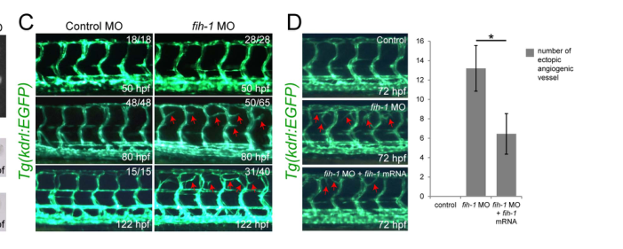

## Question

# Gene Research for Functional Annotation

## ⚠️ CRITICAL: Gene/Protein Identification Context

**BEFORE YOU BEGIN RESEARCH:** You MUST verify you are researching the CORRECT gene/protein. Gene symbols can be ambiguous, especially for less well-characterized genes from non-model organisms.

### Target Gene/Protein Identity (from UniProt):
- **UniProt Accession:** P59723
- **Protein Description:** RecName: Full=Hypoxia-inducible factor 1-alpha inhibitor; EC=1.14.11.30; EC=1.14.11.n4; AltName: Full=Hypoxia-inducible factor asparagine hydroxylase;
- **Gene Information:** Name=hif1an; ORFNames=si:rp71-68n3.1;
- **Organism (full):** Danio rerio (Zebrafish) (Brachydanio rerio).
- **Protein Family:** Not specified in UniProt
- **Key Domains:** Cupin_8. (IPR041667); FIH-1_dom_II. (IPR027452); JmjC_dom. (IPR003347); RmlC-like_jellyroll. (IPR014710); Cupin_8 (PF13621)

### MANDATORY VERIFICATION STEPS:

1. **Check if the gene symbol "hif1an" matches the protein description above**
2. **Verify the organism is correct:** Danio rerio (Zebrafish) (Brachydanio rerio).
3. **Check if protein family/domains align with what you find in literature**
4. **If you find literature for a DIFFERENT gene with the same or similar symbol, STOP**

### If Gene Symbol is Ambiguous or You Cannot Find Relevant Literature:

**DO NOT PROCEED WITH RESEARCH ON A DIFFERENT GENE.** Instead:
- State clearly: "The gene symbol 'hif1an' is ambiguous or literature is limited for this specific protein"
- Explain what you found (e.g., "Found extensive literature on a different gene with the same symbol in a different organism")
- Describe the protein based ONLY on the UniProt information provided above
- Suggest that the protein function can be inferred from domain/family information

### Research Target:

Please provide a comprehensive research report on the gene **hif1an** (gene ID: hif1an, UniProt: P59723) in DANRE.

The research report should be a detailed narrative explaining the function, biological processes, and localization of the gene product. Citations should be given for all claims.

You should prioritize authoritative reviews and primary scientific literature when conducting research. You can supplement
this with annotations you find in gene/protein databases, but these can be outdated or inaccurate.

We are specifically interested in the primary function of the gene - for enzymes, what reaction is catalyzed, and what is the substrate specificity? For transporters, what is the substrate? For structural proteins or adapters, what is the broader structural role? For signaling molecules, what is the role in the pathway.

We are interested in where in or outside the cell the gene product carries out its function.

We are also interested in the signaling or biochemical pathways in which the gene functions. We are less interested in broad pleiotropic effects, except where these elucidate the precise role.

Include evidence where possible. We are interested in both experimental evidence as well as inference from structure, evolution, or bioinformatic analysis. Precise studies should be prioritized over high-throughput, where available.

## Output

Question: You are an expert researcher providing comprehensive, well-cited information.

Provide detailed information focusing on:
1. Key concepts and definitions with current understanding
2. Recent developments and latest research (prioritize 2023-2024 sources)
3. Current applications and real-world implementations
4. Expert opinions and analysis from authoritative sources
5. Relevant statistics and data from recent studies

Format as a comprehensive research report with proper citations. Include URLs and publication dates where available.
Always prioritize recent, authoritative sources and provide specific citations for all major claims.

# Gene Research for Functional Annotation

## ⚠️ CRITICAL: Gene/Protein Identification Context

**BEFORE YOU BEGIN RESEARCH:** You MUST verify you are researching the CORRECT gene/protein. Gene symbols can be ambiguous, especially for less well-characterized genes from non-model organisms.

### Target Gene/Protein Identity (from UniProt):
- **UniProt Accession:** P59723
- **Protein Description:** RecName: Full=Hypoxia-inducible factor 1-alpha inhibitor; EC=1.14.11.30; EC=1.14.11.n4; AltName: Full=Hypoxia-inducible factor asparagine hydroxylase;
- **Gene Information:** Name=hif1an; ORFNames=si:rp71-68n3.1;
- **Organism (full):** Danio rerio (Zebrafish) (Brachydanio rerio).
- **Protein Family:** Not specified in UniProt
- **Key Domains:** Cupin_8. (IPR041667); FIH-1_dom_II. (IPR027452); JmjC_dom. (IPR003347); RmlC-like_jellyroll. (IPR014710); Cupin_8 (PF13621)

### MANDATORY VERIFICATION STEPS:

1. **Check if the gene symbol "hif1an" matches the protein description above**
2. **Verify the organism is correct:** Danio rerio (Zebrafish) (Brachydanio rerio).
3. **Check if protein family/domains align with what you find in literature**
4. **If you find literature for a DIFFERENT gene with the same or similar symbol, STOP**

### If Gene Symbol is Ambiguous or You Cannot Find Relevant Literature:

**DO NOT PROCEED WITH RESEARCH ON A DIFFERENT GENE.** Instead:
- State clearly: "The gene symbol 'hif1an' is ambiguous or literature is limited for this specific protein"
- Explain what you found (e.g., "Found extensive literature on a different gene with the same symbol in a different organism")
- Describe the protein based ONLY on the UniProt information provided above
- Suggest that the protein function can be inferred from domain/family information

### Research Target:

Please provide a comprehensive research report on the gene **hif1an** (gene ID: hif1an, UniProt: P59723) in DANRE.

The research report should be a detailed narrative explaining the function, biological processes, and localization of the gene product. Citations should be given for all claims.

You should prioritize authoritative reviews and primary scientific literature when conducting research. You can supplement
this with annotations you find in gene/protein databases, but these can be outdated or inaccurate.

We are specifically interested in the primary function of the gene - for enzymes, what reaction is catalyzed, and what is the substrate specificity? For transporters, what is the substrate? For structural proteins or adapters, what is the broader structural role? For signaling molecules, what is the role in the pathway.

We are interested in where in or outside the cell the gene product carries out its function.

We are also interested in the signaling or biochemical pathways in which the gene functions. We are less interested in broad pleiotropic effects, except where these elucidate the precise role.

Include evidence where possible. We are interested in both experimental evidence as well as inference from structure, evolution, or bioinformatic analysis. Precise studies should be prioritized over high-throughput, where available.

# Research Report: Functional Annotation of **hif1an / FIH-1** (UniProt **P59723**) in **Danio rerio**

## 1. Target verification (critical identity check)
The UniProt accession **P59723** corresponds to zebrafish (**Danio rerio**) **hif1an** (also commonly referred to as **fih-1** in zebrafish literature), encoding **Factor Inhibiting Hypoxia-Inducible Factor 1 (FIH-1)**—a **Fe(II)/2-oxoglutarate (2-OG)-dependent oxygenase** that represses HIF transcriptional output by hydroxylating a conserved C-terminal transactivation domain (C-TAD) residue on HIF-α. This identity is directly consistent with zebrafish developmental and vascular studies explicitly naming FIH-1/HIF1AN and with mechanistic descriptions of the enzyme class and canonical HIF substrate. (so2014fih1anovel pages 1-2, so2014fih1anovel pages 7-8, so2014fih1anovel pages 3-7, judson2012analysisofan pages 41-45)

## 2. Key concepts and definitions (current understanding)

### 2.1 What HIF1AN/FIH is
FIH (gene: **HIF1AN/hif1an**) is a **JmjC/cupin-fold Fe(II)/2-OG-dependent dioxygenase** (non-heme iron oxygenase) functioning as an oxygen-sensitive regulator of hypoxia-inducible factor (HIF) transcriptional activity. (volkova2022theasparaginehydroxylase pages 6-9, hyvarinen2010enzymesinvolvedin pages 31-35, volkova2022theasparaginehydroxylase pages 1-6)

### 2.2 Primary biochemical function: reaction catalyzed and cofactors
**Reaction type (canonical):** hydroxylation of a target residue on a protein substrate coupled to oxidative decarboxylation of **2-oxoglutarate (2-OG)**.

Mechanistically, FIH uses molecular oxygen such that **one oxygen atom is incorporated into the substrate (hydroxylation)** and the **other oxygen atom is used to convert 2-OG to succinate + CO2**; catalysis requires **Fe(II)**, **O2**, **2-OG**, and typically a **reductant such as ascorbate** to maintain iron in the reduced state. The catalytic cycle proceeds through a high-valent **ferryl Fe(IV)=O** intermediate. (judson2012analysisofan pages 41-45, hyvarinen2010enzymesinvolvedin pages 31-35, volkova2022theasparaginehydroxylase pages 13-16)

**Ordered binding (general model):** Fe2+ binds first, followed by 2-OG, then peptide/protein substrate, and finally O2. (hyvarinen2010enzymesinvolvedin pages 31-35, hyvarinen2010…response pages 31-35)

### 2.3 Canonical substrate specificity and mechanism of HIF repression
The best-characterized substrate is **HIF-α**, where FIH hydroxylates a conserved asparagine in the **C-terminal transactivation domain (C-TAD)**—classically **HIF-1α Asn803** (and the analogous HIF-2α site). This hydroxylation blocks recruitment of transcriptional co-activators **p300/CBP**, thereby repressing HIF-driven transcription without necessarily changing HIF-α abundance. (judson2012analysisofan pages 41-45, volkova2022theasparaginehydroxylase pages 6-9)

Regulation near the target site can tune hydroxylation: for example, phosphorylation of a nearby residue (**Thr796** in HIF-1α) has been described to reduce Asn803 hydroxylation, favoring transactivation. (judson2012analysisofan pages 41-45)

### 2.4 Oxygen sensitivity (statistics)
FIH has a reported **KM(O2) ≈ 90 ± 20 µM**, supporting the common model that (relative to HIF prolyl hydroxylases) FIH repression of HIF transactivation is relieved preferentially under **more severe hypoxia**. (volkova2022theasparaginehydroxylase pages 6-9, judson2012analysisofan pages 41-45)

**Important limitation for zebrafish functional annotation:** zebrafish-specific kinetic constants were not identified in the retrieved corpus; the quantitative O2 KM cited above is derived from vertebrate biochemical characterization summarized in review/dissertation-level sources. (volkova2022theasparaginehydroxylase pages 6-9, judson2012analysisofan pages 41-45)

## 3. Biological processes, pathways, and localization (zebrafish-focused)

### 3.1 Pathway placement in zebrafish: HIF → VEGF-A → angiogenesis
Zebrafish fih-1/hif1an functions as an **anti-angiogenic regulator** during vascular development by **attenuating VEGF-A signaling**, consistent with its role as a negative regulator of HIF transcriptional output. Loss of fih-1 function increases expression of **vegf-aa165** and induces **exuberant ectopic sprouts** from **intersegmental vessels (ISVs)**, whereas fih-1 overexpression suppresses ISV formation; suppression is rescued by co-expression of vegf-aa165, functionally positioning Fih-1 upstream of VEGF-A-driven angiogenesis. (so2014fih1anovel pages 3-7, so2014fih1anovel pages 7-8)

### 3.2 Zebrafish developmental expression (timepoints and tissues)
Zebrafish fih-1 is **maternally deposited** (detectable at the **4-cell stage**) and broadly expressed early, declining through **24 hpf**, with later restriction to **ventral mesoderm**, **midbrain–hindbrain boundary**, and **eye**. (so2014fih1anovel pages 7-8)

Whole-mount expression mapping further reports detection by **8 hpf**, strong expression in the **midbrain–hindbrain boundary and eye** by **14 hpf**, expansion to **optic vesicle and ventral mesoderm** by **25 hpf**, and at **28 hpf** selective expression (with vegf-aa165) in **anterior somites and ventral mesoderm**. (so2014fih1anovel pages 3-7)

### 3.3 Subcellular localization
FIH is described as **mainly cytoplasmic** in vertebrate cell contexts, and this localization was reported not to be altered by hypoxia in the cited in vitro studies. (judson2012analysisofan pages 41-45)

In zebrafish-related cell assays, FIH-1 and the E3 ligase Mindbomb (Mib1) were reported to **colocalize in the perinuclear region**, consistent with a cytoplasmic/perinuclear pool relevant for signaling and protein interaction. (so2014fih1anovel pages 7-8)

Recent cancer biology also highlights that FIH can be present in both cytoplasm and nucleus in human disease contexts, emphasizing dynamic nucleo-cytoplasmic distribution across settings. (rio2023factorinhibitinghif(fih) pages 2-4)

## 4. Zebrafish experimental evidence: phenotypes and functional roles

### 4.1 Loss-of-function and gain-of-function in vascular development
**Morpholino knockdown:** fih-1 knockdown increased endothelial proliferation and produced **ectopic secondary sprouts/ectopic ISVs** observed at approximately **80 hpf and 122 hpf**, along with elevated **vegf-aa165** (including at ~**50 hpf**) and increased expression of HIF-responsive transcripts (e.g., **hmox1a, glut3** in the reported study context). The phenotype was rescued by co-injection of fih-1 mRNA. (so2014fih1anovel pages 7-8, so2014fih1anovel pages 3-7)

**Overexpression:** fih-1 mRNA overexpression reduced ISV formation and circulation, and this effect was rescued by vegf-aa165 overexpression, supporting a model in which fih-1 constrains HIF/VEGF-driven angiogenesis. (so2014fih1anovel pages 3-7)

### 4.2 Genetic loss-of-function in zebrafish and interaction with Vhl
A zebrafish fih allele causing premature truncation (a predicted null) was described, and homozygous loss-of-function animals were reported as viable/fertile with relatively modest basal HIF readouts in the examined conditions; however, in a **vhl−/−** background, loss of fih enhanced HIF/VEGF-linked vascular and physiological phenotypes (e.g., increased vascular branching/endothelial number and increased vegfaa by in situ hybridization in the double mutant context). (judson2012analysisofan pages 128-131, judson2012analysisofan pages 235-238)

**Interpretation:** across these zebrafish studies, FIH/hif1an functions as a **modulator (“brake”)** on HIF output that can be phenotypically prominent in developmental angiogenesis assays and become especially evident when Vhl-dependent HIF degradation is perturbed. (so2014fih1anovel pages 7-8, judson2012analysisofan pages 235-238)

## 5. Non-HIF substrates and broader molecular roles (cross-species inference)
Although the **primary conserved pathway role** is HIF C-TAD hydroxylation and repression of HIF transactivation, FIH is now widely viewed as a **promiscuous protein hydroxylase** with many reported targets beyond HIF.

A major class of non-HIF substrates are **ankyrin repeat domain (ARD)** proteins; a proposed degenerate recognition motif has been summarized as **LXXXXX[D/E]VN**, but structural context and accessibility strongly condition hydroxylation efficiency. (volkova2022theasparaginehydroxylase pages 16-20)

Reported non-HIF targets in vertebrates include **OTUB1 (Asn-22)**, **Cezanne/OTUD7B (Asn-35)**, **TRPV3**, **HACE1**, **RIPK4**, and histone methyltransferases **G9a/GLP**, among others; FIH has also been reported to hydroxylate residues beyond asparagine (e.g., Asp/His/Trp in some contexts) and to catalyze formation of stable oxygen-dependent complexes (“**oxomers**”), exemplified by an FIH–OTUB1 complex with high hypoxia sensitivity. (volkova2022theasparaginehydroxylase pages 16-20, volkova2022theasparaginehydroxylase pages 13-16)

**Zebrafish-specific caveat:** the retrieved corpus did not provide direct experimental validation of these non-HIF substrates in **Danio rerio**; thus, these are best treated as **conserved vertebrate hypotheses** informed by enzymology and substrate classes rather than confirmed zebrafish annotations. (volkova2022theasparaginehydroxylase pages 16-20, volkova2022theasparaginehydroxylase pages 24-27)

## 6. Recent developments (prioritizing 2023–2024) and expert analysis

### 6.1 2023: FIH in cancer metabolism and immunity (authoritative primary study)
A 2023 **JCI Insight** study (published **Oct 2023**; URL: https://doi.org/10.1172/jci.insight.167394) reported that FIH is expressed in human lung cancer tissues and that **genetic deletion of FIH** in lung cancer models increased HIF transcriptional activity and glycolytic reprogramming while reducing proliferation and tumor progression phenotypes; the study used a lung cancer tissue microarray with **n=25** (LUAD **n=9**, LUSC **n=16**, normal **n=4**) and reported FIH staining in both cytoplasm and nucleus of cancer cells. The authors interpret these findings as supporting FIH as a potential therapeutic target and prognostic factor in NSCLC. (rio2023factorinhibitinghif(fih) pages 2-4)

This work reinforces an expert-level interpretation that FIH is not merely a hypoxia “sensor” but a **context-dependent modulator of transcriptional programs (HIF and beyond)** that can shape metabolism and tumor–immune interactions. (rio2023factorinhibitinghif(fih) pages 1-2)

### 6.2 2024: continued emphasis on oxygen-sensing hydroxylase regulation and disease contexts
Within the retrieved 2024 corpus, major new zebrafish-specific FIH functional studies were not captured; however, 2024 reviews continue to highlight the central role of HIF pathway regulation (including FIH-mediated C-TAD hydroxylation) in inflammatory and disease contexts, reflecting sustained translational focus on oxygen-sensing enzymes as modulators of pathophysiology. (rio2023factorinhibitinghif(fih) pages 1-2)

### 6.3 Authoritative synthesis on FIH enzymology and emerging chemistry (2022 review; still highly relevant)
A 2022 review in **Antioxidants & Redox Signaling** (published **Nov 2022**; URL: https://doi.org/10.1089/ars.2022.0003) provides an authoritative synthesis of FIH as a unique oxygen/peroxide-sensitive enzyme, emphasizing (i) broad substrate scope, (ii) emerging “oxomer” chemistry, and (iii) feasibility of selective pharmacologic inhibition, while noting that the full physiological significance of many non-HIF substrates remains incompletely resolved. (volkova2022theasparaginehydroxylase pages 1-6, volkova2022theasparaginehydroxylase pages 16-20)

## 7. Current applications and real-world implementations

### 7.1 Therapeutic targeting of oxygen-sensing hydroxylases
Selective pharmacologic modulation of FIH is considered feasible, and review-level evidence links FIH inhibition to potential therapeutic effects (e.g., radioprotective outcomes through increased HIF activity in animal contexts described in synthesis). (volkova2022theasparaginehydroxylase pages 24-27)

### 7.2 Disease biomarkers and oncology
The 2023 lung cancer study supports real-world translational directions: FIH expression/localization in tumors, association with disease outcomes, and testing of FIH loss as a strategy to alter tumor metabolism and immune infiltration, positioning FIH/HIF1AN as a candidate target/biomarker axis. (rio2023factorinhibitinghif(fih) pages 1-2, rio2023factorinhibitinghif(fih) pages 2-4)

### 7.3 Zebrafish as an implementation platform
Zebrafish fih-1/hif1an manipulations produce robust and visually tractable phenotypes in angiogenesis assays (ISV sprouting and vegf-aa165 regulation), underscoring zebrafish as a practical in vivo platform for studying oxygen-signaling modifiers and potentially screening pathway modulators affecting HIF/VEGF-driven vascular outcomes. (so2014fih1anovel pages 7-8, so2014fih1anovel media f35c19de)

## 8. Evidence figures (visual confirmation from primary zebrafish study)
Primary figure panels in the zebrafish study document (i) ectopic ISV sprouting after fih-1 knockdown and rescue, and (ii) altered vegf-aa165 in situ signal with fih-1 perturbations. (so2014fih1anovel media f35c19de, so2014fih1anovel media 8b8762a8, so2014fih1anovel media 72dc3cd6)

## 9. Summary table (functional annotation snapshot)
| Category | Key points (1-3 bullets) | Best supporting citations |
|---|---|---|
| Identity/Domain | • **Verified target:** zebrafish **hif1an / fih-1** encodes **Factor Inhibiting HIF-1 (FIH-1)**, matching UniProt **P59723**; literature consistently treats it as the zebrafish ortholog of HIF1AN/FIH. • FIH is a **JmjC/cupin-fold Fe(II)/2-oxoglutarate oxygenase**; dimerization is required for full activity. • Functional conservation is high in fish; zebrafish enzymatic JmjC region was reported as **96% homologous** to human FIH. Sources: Hyvärinen 2010; Elks et al. 2015, https://doi.org/10.1242/dmm.021865; Volkova et al. 2022, https://doi.org/10.1089/ars.2022.0003 | (elks2015exploringthehifs pages 2-3, hyvarinen2010enzymesinvolvedin pages 31-35, hyvarinen2010…response pages 31-35, volkova2022theasparaginehydroxylase pages 1-6) |
| Enzymatic reaction & cofactors | • FIH is a **Fe(II)/2-oxoglutarate-dependent dioxygenase**: one O atom is inserted into the substrate residue and the other oxidatively decarboxylates **2-oxoglutarate → succinate + CO2**. • Requires **Fe(II)**, **O2**, **2-oxoglutarate**, and typically a reductant such as **ascorbate**; catalysis proceeds via a **ferryl Fe(IV)=O** intermediate. • Ordered binding reported as **Fe2+ → 2-OG → peptide substrate → O2**. Sources: Judson 2012; Hyvärinen 2010; Volkova et al. 2022, https://doi.org/10.1089/ars.2022.0003 | (judson2012analysisofan pages 41-45, volkova2022theasparaginehydroxylase pages 6-9, hyvarinen2010enzymesinvolvedin pages 31-35, hyvarinen2010…response pages 31-35, volkova2022theasparaginehydroxylase pages 1-6) |
| Canonical substrate & mechanism | • Canonical substrate is the **C-terminal transactivation domain (C-TAD)** of HIF-α; FIH hydroxylates the conserved **Asn803 of HIF-1α** (and analogous site in HIF-2α). • This hydroxylation blocks **p300/CBP** co-activator recruitment, thereby repressing **HIF transcriptional activity** without using the VHL-dependent degradation route. • Adjacent features can tune regulation; e.g., **Thr796 phosphorylation** can reduce Asn803 hydroxylation and favor transactivation. Sources: Judson 2012; Elks et al. 2015, https://doi.org/10.1242/dmm.021865; Volkova et al. 2022, https://doi.org/10.1089/ars.2022.0003 | (judson2012analysisofan pages 41-45, elks2015exploringthehifs pages 2-3, volkova2022theasparaginehydroxylase pages 6-9, judson2012analysisofan pages 29-33) |
| Oxygen sensitivity/kinetics | • Reported **KM(O2) ≈ 90 ± 20 µM** for FIH, lower than many PHD values; this supports the idea that **PHDs shut off earlier**, whereas FIH can remain active until **more severe hypoxia**. • Because physiological cellular O2 is often below saturation, both PHDs and FIH can function as oxygen sensors, but with distinct set points. • Zebrafish-specific kinetic constants were **not identified** in the retrieved evidence; current quantitative kinetics are largely inferred from mammalian biochemical work. Sources: Judson 2012; Volkova et al. 2022, https://doi.org/10.1089/ars.2022.0003 | (volkova2022theasparaginehydroxylase pages 6-9, judson2012analysisofan pages 41-45) |
| Non-HIF substrates (general vertebrate) | • FIH has broad substrate scope beyond HIF, especially **ankyrin repeat domain (ARD)** proteins; proposed loose motif: **LXXXXX[D/E]VN**, though structural context is critical. • Reported non-HIF substrates include **OTUB1 (Asn22)**, **Cezanne/OTUD7B (Asn35)**, **TRPV3**, **HACE1**, **RIPK4**, **G9a/GLP**, **IκBα**, **Notch ARD**, **ASPP2**, and possibly **NAA10**; FIH can also hydroxylate residues other than Asn and form **oxygen-dependent “oxomers.”** • Several newer studies emphasize FIH as a regulator of signaling, ubiquitin biology, inflammation, and cancer progression, not just HIF. Sources: Volkova et al. 2022, https://doi.org/10.1089/ars.2022.0003; García-del Río et al. 2023, https://doi.org/10.1172/jci.insight.167394 | (volkova2022theasparaginehydroxylase pages 16-20, volkova2022theasparaginehydroxylase pages 13-16, rio2023factorinhibitinghif(fih) pages 1-2, rio2023factorinhibitinghif(fih) pages 17-18, rio2023factorinhibitinghif(fih) pages 18-19) |
| Zebrafish phenotypes & developmental roles | • **Maternal and early embryonic expression** is present; morpholino knockdown caused **ectopic intersegmental vessel sprouts** at ~**80 and 122 hpf**, increased endothelial proliferation, and elevated **vegf-aa165**, consistent with an **anti-angiogenic** role. • **fih-1 overexpression** reduced ISV formation and circulation; co-expression of **vegf-aa165** rescued this, placing FIH upstream of **HIF/VEGF-A signaling** in vascular development. • Genetic loss-of-function produced milder basal phenotypes than MO studies, but in **vhl-deficient** backgrounds enhanced HIF/vascular phenotypes (greater branching, larger heart/heart cavity, higher vegfaa, increased endothelial cell number); review evidence also states CRISPR deletion can **increase hypoxia tolerance** and reduce brain apoptosis after hypoxia. Sources: So et al. 2014, https://doi.org/10.1371/journal.pone.0109517; Judson 2012; Volkova et al. 2022, https://doi.org/10.1089/ars.2022.0003 | (so2014fih1anovel pages 1-2, so2014fih1anovel pages 7-8, so2014fih1anovel pages 3-7, judson2012analysisofan pages 128-131, judson2012analysisofan pages 235-238, so2014fih1anovel media f35c19de) |
| Localization/expression | • FIH is described generally as **mainly cytoplasmic**, though vertebrate studies show it can also be **nuclear**; zebrafish/cultured-cell work reported **colocalization with Mindbomb/Mib1**. • In zebrafish, **fih-1** is detectable from very early development (including **4-cell stage**), then becomes enriched in **ventral mesoderm, eye, and midbrain-hindbrain boundary**. • Review evidence notes tissue variation across fish and states endogenous zebrafish FIH expression is highest in **liver** in one dataset. Sources: So et al. 2014, https://doi.org/10.1371/journal.pone.0109517; Judson 2012; Volkova et al. 2022, https://doi.org/10.1089/ars.2022.0003; García-del Río et al. 2023, https://doi.org/10.1172/jci.insight.167394 | (judson2012analysisofan pages 41-45, so2014fih1anovel pages 1-2, so2014fih1anovel pages 7-8, so2014fih1anovel pages 3-7, rio2023factorinhibitinghif(fih) pages 1-2) |

*Table: This table summarizes the most relevant functional annotation points for zebrafish hif1an/FIH-1 (UniProt P59723), integrating zebrafish-specific developmental evidence with conserved vertebrate biochemistry. It is useful as a compact reference for identity verification, enzymatic mechanism, pathway role, localization, and phenotype evidence.*

## 10. Key takeaways (zebrafish-specific functional annotation)
1. **Primary function:** zebrafish **hif1an/fih-1** encodes an Fe(II)/2-OG-dependent oxygenase that represses HIF transcriptional output primarily by hydroxylating the conserved HIF-α C-TAD asparagine that is required for p300/CBP recruitment. (volkova2022theasparaginehydroxylase pages 6-9, judson2012analysisofan pages 41-45)
2. **Core pathway role in vivo:** in zebrafish development, Fih-1 functions as a **negative regulator of HIF/VEGF-A-driven angiogenesis**, where loss of fih-1 increases vegf-aa165 and induces ectopic ISV sprouting, and gain of fih-1 suppresses ISVs in a vegf-dependent manner. (so2014fih1anovel pages 7-8, so2014fih1anovel pages 3-7)
3. **Localization:** predominantly **cytoplasmic/perinuclear** pools are supported, with broader vertebrate evidence for condition-dependent nuclear localization. (judson2012analysisofan pages 41-45, so2014fih1anovel pages 7-8, rio2023factorinhibitinghif(fih) pages 2-4)
4. **Broader enzymology:** vertebrate literature supports extensive non-HIF substrate scope (especially ankyrin-repeat proteins) and additional chemistries (e.g., oxomers), but zebrafish-specific validation of these non-HIF substrates was not retrieved here. (volkova2022theasparaginehydroxylase pages 16-20)

## References (publication date and URL provided where available)
- So J-H et al. **PLoS ONE**. **Oct 2014**. “FIH-1, a Novel Interactor of Mindbomb, Functions as an Essential Anti-Angiogenic Factor during Zebrafish Vascular Development.” https://doi.org/10.1371/journal.pone.0109517 (so2014fih1anovel pages 3-7)
- Elks PM et al. **Disease Models & Mechanisms**. **Nov 2015**. “Exploring the HIFs, buts and maybes of hypoxia signalling in disease: lessons from zebrafish models.” https://doi.org/10.1242/dmm.021865 (elks2015exploringthehifs pages 2-3)
- Volkova YL et al. **Antioxidants & Redox Signaling**. **Nov 2022**. “The Asparagine Hydroxylase FIH: A Unique Oxygen Sensor.” https://doi.org/10.1089/ars.2022.0003 (volkova2022theasparaginehydroxylase pages 1-6)
- García-del Río A et al. **JCI Insight**. **Oct 2023**. “Factor-inhibiting HIF (FIH) promotes lung cancer progression.” https://doi.org/10.1172/jci.insight.167394 (rio2023factorinhibitinghif(fih) pages 2-4)

References

1. (so2014fih1anovel pages 1-2): Ju-Hoon So, Jun-Dae Kim, Kyeong-Won Yoo, Hyun-Taek Kim, Seung-Hyun Jung, Jung-Hwa Choi, Mi-Sun Lee, Suk-Won Jin, and Cheol-Hee Kim. Fih-1, a novel interactor of mindbomb, functions as an essential anti-angiogenic factor during zebrafish vascular development. PLoS ONE, 9:e109517, Oct 2014. URL: https://doi.org/10.1371/journal.pone.0109517, doi:10.1371/journal.pone.0109517. This article has 33 citations and is from a peer-reviewed journal.

2. (so2014fih1anovel pages 7-8): Ju-Hoon So, Jun-Dae Kim, Kyeong-Won Yoo, Hyun-Taek Kim, Seung-Hyun Jung, Jung-Hwa Choi, Mi-Sun Lee, Suk-Won Jin, and Cheol-Hee Kim. Fih-1, a novel interactor of mindbomb, functions as an essential anti-angiogenic factor during zebrafish vascular development. PLoS ONE, 9:e109517, Oct 2014. URL: https://doi.org/10.1371/journal.pone.0109517, doi:10.1371/journal.pone.0109517. This article has 33 citations and is from a peer-reviewed journal.

3. (so2014fih1anovel pages 3-7): Ju-Hoon So, Jun-Dae Kim, Kyeong-Won Yoo, Hyun-Taek Kim, Seung-Hyun Jung, Jung-Hwa Choi, Mi-Sun Lee, Suk-Won Jin, and Cheol-Hee Kim. Fih-1, a novel interactor of mindbomb, functions as an essential anti-angiogenic factor during zebrafish vascular development. PLoS ONE, 9:e109517, Oct 2014. URL: https://doi.org/10.1371/journal.pone.0109517, doi:10.1371/journal.pone.0109517. This article has 33 citations and is from a peer-reviewed journal.

4. (judson2012analysisofan pages 41-45): EC Judson. Analysis of an fih mutation in the zebrafish. Unknown journal, 2012.

5. (volkova2022theasparaginehydroxylase pages 6-9): Yulia L. Volkova, Christina Pickel, Agnieszka E. Jucht, Roland H. Wenger, and Carsten C. Scholz. The asparagine hydroxylase fih: a unique oxygen sensor. Nov 2022. URL: https://doi.org/10.1089/ars.2022.0003, doi:10.1089/ars.2022.0003. This article has 46 citations and is from a domain leading peer-reviewed journal.

6. (hyvarinen2010enzymesinvolvedin pages 31-35): J Hyvärinen. Enzymes involved in hypoxia response : characterization of the in vivo role of hif-p4h-2 in mouse heart, of a novel p4h in human and zebrafish and of the …. Unknown journal, 2010.

7. (volkova2022theasparaginehydroxylase pages 1-6): Yulia L. Volkova, Christina Pickel, Agnieszka E. Jucht, Roland H. Wenger, and Carsten C. Scholz. The asparagine hydroxylase fih: a unique oxygen sensor. Nov 2022. URL: https://doi.org/10.1089/ars.2022.0003, doi:10.1089/ars.2022.0003. This article has 46 citations and is from a domain leading peer-reviewed journal.

8. (volkova2022theasparaginehydroxylase pages 13-16): Yulia L. Volkova, Christina Pickel, Agnieszka E. Jucht, Roland H. Wenger, and Carsten C. Scholz. The asparagine hydroxylase fih: a unique oxygen sensor. Nov 2022. URL: https://doi.org/10.1089/ars.2022.0003, doi:10.1089/ars.2022.0003. This article has 46 citations and is from a domain leading peer-reviewed journal.

9. (hyvarinen2010…response pages 31-35): J Hyvärinen. … response : characterization of the in vivo role of hif-p4h-2 in mouse heart, of a novel p4h in human and zebrafish and of the catalytic properties of fih. Unknown journal, 2010.

10. (rio2023factorinhibitinghif(fih) pages 2-4): Ana García-del Río, Endika Prieto-Fernández, Leire Egia-Mendikute, Asier Antoñana-Vildosola, Borja Jimenez-Lasheras, So Young Lee, Adrián Barreira-Manrique, Samanta Romina Zanetti, Ander de Blas, Paloma Velasco-Beltrán, Alexandre Bosch, Ana M. Aransay, and Asis Palazon. Factor-inhibiting hif (fih) promotes lung cancer progression. JCI Insight, Oct 2023. URL: https://doi.org/10.1172/jci.insight.167394, doi:10.1172/jci.insight.167394. This article has 15 citations and is from a domain leading peer-reviewed journal.

11. (judson2012analysisofan pages 128-131): EC Judson. Analysis of an fih mutation in the zebrafish. Unknown journal, 2012.

12. (judson2012analysisofan pages 235-238): EC Judson. Analysis of an fih mutation in the zebrafish. Unknown journal, 2012.

13. (volkova2022theasparaginehydroxylase pages 16-20): Yulia L. Volkova, Christina Pickel, Agnieszka E. Jucht, Roland H. Wenger, and Carsten C. Scholz. The asparagine hydroxylase fih: a unique oxygen sensor. Nov 2022. URL: https://doi.org/10.1089/ars.2022.0003, doi:10.1089/ars.2022.0003. This article has 46 citations and is from a domain leading peer-reviewed journal.

14. (volkova2022theasparaginehydroxylase pages 24-27): Yulia L. Volkova, Christina Pickel, Agnieszka E. Jucht, Roland H. Wenger, and Carsten C. Scholz. The asparagine hydroxylase fih: a unique oxygen sensor. Nov 2022. URL: https://doi.org/10.1089/ars.2022.0003, doi:10.1089/ars.2022.0003. This article has 46 citations and is from a domain leading peer-reviewed journal.

15. (rio2023factorinhibitinghif(fih) pages 1-2): Ana García-del Río, Endika Prieto-Fernández, Leire Egia-Mendikute, Asier Antoñana-Vildosola, Borja Jimenez-Lasheras, So Young Lee, Adrián Barreira-Manrique, Samanta Romina Zanetti, Ander de Blas, Paloma Velasco-Beltrán, Alexandre Bosch, Ana M. Aransay, and Asis Palazon. Factor-inhibiting hif (fih) promotes lung cancer progression. JCI Insight, Oct 2023. URL: https://doi.org/10.1172/jci.insight.167394, doi:10.1172/jci.insight.167394. This article has 15 citations and is from a domain leading peer-reviewed journal.

16. (so2014fih1anovel media f35c19de): Ju-Hoon So, Jun-Dae Kim, Kyeong-Won Yoo, Hyun-Taek Kim, Seung-Hyun Jung, Jung-Hwa Choi, Mi-Sun Lee, Suk-Won Jin, and Cheol-Hee Kim. Fih-1, a novel interactor of mindbomb, functions as an essential anti-angiogenic factor during zebrafish vascular development. PLoS ONE, 9:e109517, Oct 2014. URL: https://doi.org/10.1371/journal.pone.0109517, doi:10.1371/journal.pone.0109517. This article has 33 citations and is from a peer-reviewed journal.

17. (so2014fih1anovel media 8b8762a8): Ju-Hoon So, Jun-Dae Kim, Kyeong-Won Yoo, Hyun-Taek Kim, Seung-Hyun Jung, Jung-Hwa Choi, Mi-Sun Lee, Suk-Won Jin, and Cheol-Hee Kim. Fih-1, a novel interactor of mindbomb, functions as an essential anti-angiogenic factor during zebrafish vascular development. PLoS ONE, 9:e109517, Oct 2014. URL: https://doi.org/10.1371/journal.pone.0109517, doi:10.1371/journal.pone.0109517. This article has 33 citations and is from a peer-reviewed journal.

18. (so2014fih1anovel media 72dc3cd6): Ju-Hoon So, Jun-Dae Kim, Kyeong-Won Yoo, Hyun-Taek Kim, Seung-Hyun Jung, Jung-Hwa Choi, Mi-Sun Lee, Suk-Won Jin, and Cheol-Hee Kim. Fih-1, a novel interactor of mindbomb, functions as an essential anti-angiogenic factor during zebrafish vascular development. PLoS ONE, 9:e109517, Oct 2014. URL: https://doi.org/10.1371/journal.pone.0109517, doi:10.1371/journal.pone.0109517. This article has 33 citations and is from a peer-reviewed journal.

19. (elks2015exploringthehifs pages 2-3): Philip M. Elks, Stephen A. Renshaw, Annemarie H. Meijer, Sarah R. Walmsley, and Fredericus J. van Eeden. Exploring the hifs, buts and maybes of hypoxia signalling in disease: lessons from zebrafish models. Disease Models & Mechanisms, 8:1349-1360, Nov 2015. URL: https://doi.org/10.1242/dmm.021865, doi:10.1242/dmm.021865. This article has 77 citations and is from a domain leading peer-reviewed journal.

20. (judson2012analysisofan pages 29-33): EC Judson. Analysis of an fih mutation in the zebrafish. Unknown journal, 2012.

21. (rio2023factorinhibitinghif(fih) pages 17-18): Ana García-del Río, Endika Prieto-Fernández, Leire Egia-Mendikute, Asier Antoñana-Vildosola, Borja Jimenez-Lasheras, So Young Lee, Adrián Barreira-Manrique, Samanta Romina Zanetti, Ander de Blas, Paloma Velasco-Beltrán, Alexandre Bosch, Ana M. Aransay, and Asis Palazon. Factor-inhibiting hif (fih) promotes lung cancer progression. JCI Insight, Oct 2023. URL: https://doi.org/10.1172/jci.insight.167394, doi:10.1172/jci.insight.167394. This article has 15 citations and is from a domain leading peer-reviewed journal.

22. (rio2023factorinhibitinghif(fih) pages 18-19): Ana García-del Río, Endika Prieto-Fernández, Leire Egia-Mendikute, Asier Antoñana-Vildosola, Borja Jimenez-Lasheras, So Young Lee, Adrián Barreira-Manrique, Samanta Romina Zanetti, Ander de Blas, Paloma Velasco-Beltrán, Alexandre Bosch, Ana M. Aransay, and Asis Palazon. Factor-inhibiting hif (fih) promotes lung cancer progression. JCI Insight, Oct 2023. URL: https://doi.org/10.1172/jci.insight.167394, doi:10.1172/jci.insight.167394. This article has 15 citations and is from a domain leading peer-reviewed journal.

## Artifacts

- [Edison artifact artifact-00](hif1an-deep-research-falcon_artifacts/artifact-00.md)

## Citations

1. judson2012analysisofan pages 41-45
2. volkova2022theasparaginehydroxylase pages 16-20
3. volkova2022theasparaginehydroxylase pages 24-27
4. elks2015exploringthehifs pages 2-3
5. volkova2022theasparaginehydroxylase pages 1-6
6. volkova2022theasparaginehydroxylase pages 6-9
7. hyvarinen2010enzymesinvolvedin pages 31-35
8. volkova2022theasparaginehydroxylase pages 13-16
9. judson2012analysisofan pages 128-131
10. judson2012analysisofan pages 235-238
11. judson2012analysisofan pages 29-33
12. D/E
13. https://doi.org/10.1172/jci.insight.167394
14. https://doi.org/10.1089/ars.2022.0003
15. https://doi.org/10.1242/dmm.021865;
16. https://doi.org/10.1089/ars.2022.0003;
17. https://doi.org/10.1371/journal.pone.0109517;
18. https://doi.org/10.1371/journal.pone.0109517
19. https://doi.org/10.1242/dmm.021865
20. https://doi.org/10.1371/journal.pone.0109517,
21. https://doi.org/10.1089/ars.2022.0003,
22. https://doi.org/10.1172/jci.insight.167394,
23. https://doi.org/10.1242/dmm.021865,