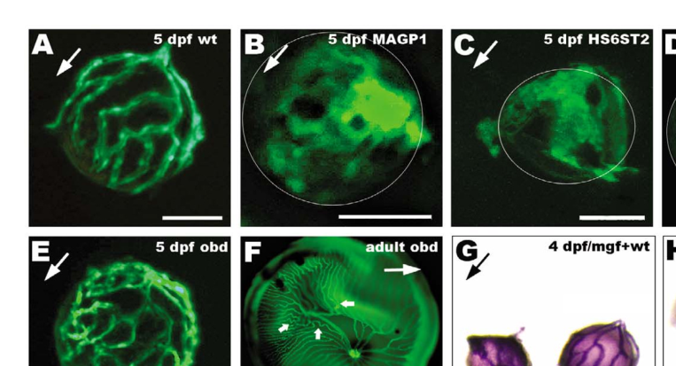

## Question

# Gene Research for Functional Annotation

## ⚠️ CRITICAL: Gene/Protein Identification Context

**BEFORE YOU BEGIN RESEARCH:** You MUST verify you are researching the CORRECT gene/protein. Gene symbols can be ambiguous, especially for less well-characterized genes from non-model organisms.

### Target Gene/Protein Identity (from UniProt):
- **UniProt Accession:** Q800H9
- **Protein Description:** RecName: Full=Heparan-sulfate 6-O-sulfotransferase 2; Short=HS 6-OST-2; Short=HS6ST-2; EC=2.8.2.-;
- **Gene Information:** Name=hs6st2; Synonyms=hs6st;
- **Organism (full):** Danio rerio (Zebrafish) (Brachydanio rerio).
- **Protein Family:** Belongs to the sulfotransferase 6 family. .
- **Key Domains:** Heparan_SO4-6-sulfoTrfase. (IPR010635); P-loop_NTPase. (IPR027417); Sulfotransferase. (IPR005331); Sulfotransfer_2 (PF03567)

### MANDATORY VERIFICATION STEPS:

1. **Check if the gene symbol "hs6st2" matches the protein description above**
2. **Verify the organism is correct:** Danio rerio (Zebrafish) (Brachydanio rerio).
3. **Check if protein family/domains align with what you find in literature**
4. **If you find literature for a DIFFERENT gene with the same or similar symbol, STOP**

### If Gene Symbol is Ambiguous or You Cannot Find Relevant Literature:

**DO NOT PROCEED WITH RESEARCH ON A DIFFERENT GENE.** Instead:
- State clearly: "The gene symbol 'hs6st2' is ambiguous or literature is limited for this specific protein"
- Explain what you found (e.g., "Found extensive literature on a different gene with the same symbol in a different organism")
- Describe the protein based ONLY on the UniProt information provided above
- Suggest that the protein function can be inferred from domain/family information

### Research Target:

Please provide a comprehensive research report on the gene **hs6st2** (gene ID: hs6st2, UniProt: Q800H9) in DANRE.

The research report should be a detailed narrative explaining the function, biological processes, and localization of the gene product. Citations should be given for all claims.

You should prioritize authoritative reviews and primary scientific literature when conducting research. You can supplement
this with annotations you find in gene/protein databases, but these can be outdated or inaccurate.

We are specifically interested in the primary function of the gene - for enzymes, what reaction is catalyzed, and what is the substrate specificity? For transporters, what is the substrate? For structural proteins or adapters, what is the broader structural role? For signaling molecules, what is the role in the pathway.

We are interested in where in or outside the cell the gene product carries out its function.

We are also interested in the signaling or biochemical pathways in which the gene functions. We are less interested in broad pleiotropic effects, except where these elucidate the precise role.

Include evidence where possible. We are interested in both experimental evidence as well as inference from structure, evolution, or bioinformatic analysis. Precise studies should be prioritized over high-throughput, where available.

## Output

Question: You are an expert researcher providing comprehensive, well-cited information.

Provide detailed information focusing on:
1. Key concepts and definitions with current understanding
2. Recent developments and latest research (prioritize 2023-2024 sources)
3. Current applications and real-world implementations
4. Expert opinions and analysis from authoritative sources
5. Relevant statistics and data from recent studies

Format as a comprehensive research report with proper citations. Include URLs and publication dates where available.
Always prioritize recent, authoritative sources and provide specific citations for all major claims.

# Gene Research for Functional Annotation

## ⚠️ CRITICAL: Gene/Protein Identification Context

**BEFORE YOU BEGIN RESEARCH:** You MUST verify you are researching the CORRECT gene/protein. Gene symbols can be ambiguous, especially for less well-characterized genes from non-model organisms.

### Target Gene/Protein Identity (from UniProt):
- **UniProt Accession:** Q800H9
- **Protein Description:** RecName: Full=Heparan-sulfate 6-O-sulfotransferase 2; Short=HS 6-OST-2; Short=HS6ST-2; EC=2.8.2.-;
- **Gene Information:** Name=hs6st2; Synonyms=hs6st;
- **Organism (full):** Danio rerio (Zebrafish) (Brachydanio rerio).
- **Protein Family:** Belongs to the sulfotransferase 6 family. .
- **Key Domains:** Heparan_SO4-6-sulfoTrfase. (IPR010635); P-loop_NTPase. (IPR027417); Sulfotransferase. (IPR005331); Sulfotransfer_2 (PF03567)

### MANDATORY VERIFICATION STEPS:

1. **Check if the gene symbol "hs6st2" matches the protein description above**
2. **Verify the organism is correct:** Danio rerio (Zebrafish) (Brachydanio rerio).
3. **Check if protein family/domains align with what you find in literature**
4. **If you find literature for a DIFFERENT gene with the same or similar symbol, STOP**

### If Gene Symbol is Ambiguous or You Cannot Find Relevant Literature:

**DO NOT PROCEED WITH RESEARCH ON A DIFFERENT GENE.** Instead:
- State clearly: "The gene symbol 'hs6st2' is ambiguous or literature is limited for this specific protein"
- Explain what you found (e.g., "Found extensive literature on a different gene with the same symbol in a different organism")
- Describe the protein based ONLY on the UniProt information provided above
- Suggest that the protein function can be inferred from domain/family information

### Research Target:

Please provide a comprehensive research report on the gene **hs6st2** (gene ID: hs6st2, UniProt: Q800H9) in DANRE.

The research report should be a detailed narrative explaining the function, biological processes, and localization of the gene product. Citations should be given for all claims.

You should prioritize authoritative reviews and primary scientific literature when conducting research. You can supplement
this with annotations you find in gene/protein databases, but these can be outdated or inaccurate.

We are specifically interested in the primary function of the gene - for enzymes, what reaction is catalyzed, and what is the substrate specificity? For transporters, what is the substrate? For structural proteins or adapters, what is the broader structural role? For signaling molecules, what is the role in the pathway.

We are interested in where in or outside the cell the gene product carries out its function.

We are also interested in the signaling or biochemical pathways in which the gene functions. We are less interested in broad pleiotropic effects, except where these elucidate the precise role.

Include evidence where possible. We are interested in both experimental evidence as well as inference from structure, evolution, or bioinformatic analysis. Precise studies should be prioritized over high-throughput, where available.

## Research report: functional annotation of **hs6st2** in *Danio rerio* (UniProt **Q800H9**)

### Executive summary
*Danio rerio* **hs6st2** encodes a **heparan-sulfate D-glucosaminyl 6-O-sulfotransferase** (HS 6-OST; EC 2.8.2.-) that catalyzes **transfer of sulfate from PAPS** to the **6-O position of glucosamine residues** in heparan sulfate (HS), with experimentally demonstrated preferences for **N-sulfoglucosamine (GlcNS)–containing** acceptor structures. This enzyme is a **type II transmembrane Golgi protein**, positioning it in the secretory pathway where HS chains are synthesized and modified. In zebrafish embryos, hs6st2-dependent 6-O-sulfation is required for **somite specification/muscle differentiation** and for **vascular remodeling/branching** (including hyaloid/retinal vasculature patterning), consistent with a role for HS “fine structure” in controlling the binding/availability of growth factors and guidance cues in development. (bink2003heparansulfate6osulfotransferase pages 3-4, fuster2010endothelialheparansulfate pages 2-4, alvarez2007geneticdeterminantsof pages 5-6, cadwallader2006combinatorialexpressionpatterns pages 1-2)

### Identity verification (critical disambiguation)
The zebrafish HS6ST gene studied as **hs6st** in Bink et al. (2003, JBC; publication date Aug 2003) is explicitly described as an HS 6-O-sulfotransferase and later referenced as being **renamed 6-OST-2** (i.e., hs6st2) by subsequent zebrafish 6-OST family work (Cadwallader & Yost, Dec 2006, *Developmental Dynamics*). This connects the zebrafish gene symbol **hs6st2/6-OST-2** used in vascular/ocular morpholino studies to the same HS6ST family enzyme class expected for UniProt **Q800H9**. (cadwallader2006combinatorialexpressionpatterns pages 2-4, bink2003heparansulfate6osulfotransferase pages 3-4)

### 1) Key concepts and definitions (current understanding)
#### Heparan sulfate “fine structure” and 6-O-sulfation
Heparan sulfate proteoglycans (HSPGs) carry HS chains whose biological activity is shaped by patterns of sulfation (the “HS fine structure”). HS **6-O-sulfotransferases (6-OSTs/HS6STs)** install **6-O-sulfate** groups on glucosamine residues, creating motifs that tune binding to extracellular ligands and thereby influence signaling. Zebrafish 6-OST family members show **restricted spatiotemporal expression**, supporting functional specialization among paralogs/orthologs. (cadwallader2006combinatorialexpressionpatterns pages 1-2)

#### Enzymatic reaction and donor substrate
HS6ST enzymes transfer sulfate from **PAPS (3′-phosphoadenosine-5′-phosphosulfate)** to HS glucosamine 6-OH groups. In zebrafish, the recombinant enzyme characterized from hs6st/hs6st2 catalyzes sulfate transfer specifically to the **6-position of N-sulfoglucosamine** in appropriate acceptors. (bink2003heparansulfate6osulfotransferase pages 3-4)

### 2) Primary biochemical function of zebrafish hs6st2
#### Reaction catalyzed
Experimental overexpression and enzymatic assays show zebrafish hs6st/hs6st2 exhibits **HS6ST activity** (transfer of sulfate to glucosamine 6-O position in HS), without increasing HS2ST activity in the same system. (bink2003heparansulfate6osulfotransferase pages 3-4)

#### Substrate specificity (acceptor preferences)
Using recombinant zebrafish enzyme purified from transfected COS-7 cells, acceptor testing showed strong activity on a **highly N-sulfated heparin derivative** (CDSNS-heparin) and much lower activity on other HS/GAG acceptors, with **no detectable activity on chondroitin**. Reported relative activities (CDSNS-heparin = 100%):
- CDSNAc-heparin: **2.6%**
- NS-heparosan: **9.1%**
- HS (mouse EHS tumor): **27.4%**
- HS (pig aorta): **10.9%**
- 6ODS-heparin: **2.1%**
- Chondroitin: **0%** (bink2003heparansulfate6osulfotransferase pages 3-4)

These data support a preference for acceptor contexts enriched for **N-sulfated glucosamine** and are consistent with the study’s interpretation that zebrafish hs6st activity preferentially targets **IdoA–GlcNS**-type motifs (as described in the same work’s narrative), a key determinant of HS fine structure. (bink2003heparansulfate6osulfotransferase pages 1-1, bink2003heparansulfate6osulfotransferase pages 3-4)

#### Quantitative enzymatic activity (heterologous expression)
In COS-7 cells, transfection with zebrafish hs6st increased HS6ST activity from **1.3 ± 0.1** to **4.2 ± 0.1 pmol/min/mg protein**, while HS2ST activity remained ~**1.5–1.6 pmol/min/mg**. (bink2003heparansulfate6osulfotransferase pages 3-4)

### 3) Cellular and subcellular localization
Zebrafish hs6st/hs6st2 contains an N-terminal hydrophobic segment consistent with **type II transmembrane topology**, supporting localization to the **Golgi apparatus**, the compartment where HSPG/HS chains are synthesized and modified. Independent zebrafish 6-OST family analysis describes the shared 6-OST architecture (short cytosolic N-terminus, transmembrane region, stem domain, catalytic domain) and links the stem domain to **Golgi localization**. (bink2003heparansulfate6osulfotransferase pages 3-4, cadwallader2006combinatorialexpressionpatterns pages 1-2)

### 4) Zebrafish developmental expression (where and when)
Bink et al. mapped hs6st expression from gastrulation through early larval stages:
- **60% epiboly:** ubiquitous expression
- **2-somite:** enrichment toward prospective brain
- **24 hpf:** brain/anterior trunk; somite boundaries and ventral posterior trunk
- **48 hpf:** head and fin buds (bink2003heparansulfate6osulfotransferase pages 3-4)

Family-level surveys further indicate zebrafish 6-OST genes are expressed across multiple embryonic structures (eyes, somites, brain, internal organ primordia, pectoral fin) and display distinct patterns that imply distinct in vivo roles among family members. (cadwallader2006combinatorialexpressionpatterns pages 1-2, cadwallader2006combinatorialexpressionpatterns pages 2-4)

### 5) Zebrafish phenotypes and biological roles
#### 5.1 Somite specification and muscle development
Morpholino-mediated knockdown of hs6st/hs6st2 causes defects in **somitogenesis and muscle differentiation**, including disturbed somite specification and impaired muscle development/differentiation, with subsequent muscle degeneration. The affected tissues match major expression domains (somites, brain, fins). (bink2003heparansulfate6osulfotransferase pages 1-1, bink2003heparansulfate6osulfotransferase pages 1-2)

##### Direct biochemical evidence that the phenotype is linked to 6-O-sulfation
Disaccharide analysis of HS after morpholino knockdown showed specific reductions in **6-O-sulfated** disaccharides, while other disaccharide classes shifted correspondingly. Reported changes (wild type → morphant) included:
- Di-6S: **5.5 → 4.4** (−20.0%)
- Di-(N,6)diS: **6.2 → 3.7** (−40.3%)
- Di-(N,6,U)triS: **10.2 → 8.8** (−13.7%)
while Di-OS and Di-NS increased (e.g., Di-OS **53.0 → 57.3**, +8.1%). (bink2003heparansulfate6osulfotransferase pages 4-5)

This provides direct linkage between hs6st2 knockdown, altered HS sulfation chemistry, and developmental defects.

#### 5.2 Vascular remodeling and ocular/retinal (hyaloid) vasculature patterning
Multiple zebrafish studies using hs6st2 (HS6ST2/6-OST-2) morpholino knockdown implicate hs6st2 in vascular morphogenesis:

- **Caudal vein plexus remodeling:** hs6st2 morphants show reduced branching and abnormal remodeling, including large loops or even a lack of branching with disorganized, overlumenized vessels; tie-1 and tie-2 expression in caudal vein is reduced during remodeling. (fuster2010endothelialheparansulfate pages 2-4)

- **Hyaloid/retinal vasculature:** Alvarez et al. report that at **5 dpf**, HS6ST2 morphants (n = **15**) exhibit “hyaloid vasculature with scarce and oversized branches that display an aberrant patterning,” and also note over-lumenized vessels/defective branching in caudal vein plexus (citing earlier work for the caudal vein phenotype). (alvarez2007geneticdeterminantsof pages 3-5)

The hyaloid phenotype is also visible in the paper’s figure panel for HS6ST2 morphants (captioned “Aberrant oversized branches and lack of patterning”). (alvarez2007geneticdeterminantsof media 3c1953d1)

### 6) Pathways and signaling context (mechanistic interpretation from authoritative sources)
hs6st2 does not encode a signaling ligand or receptor; rather, it **builds HS motifs** that regulate extracellular interactions. The developmental phenotypes are interpreted in the context that HS fine structure modulates binding of signaling molecules.

- In zebrafish muscle/somitogenesis work, HS sulfation is discussed in relation to major developmental pathways including **FGF and Wnt**, with HSPG/HS sulfation known to modulate these pathways’ outputs. (bink2003heparansulfate6osulfotransferase pages 1-2, bink2003heparansulfate6osulfotransferase pages 8-9)

- In vascular remodeling, hs6st2-dependent HS 6-O-sulfation is positioned as critical for **vascular branching morphogenesis**, consistent with a model where HS motifs regulate availability/presentation of angiogenic factors and remodeling programs (including tie marker expression changes). (fuster2010endothelialheparansulfate pages 2-4)

- A broader vertebrate review perspective emphasizes that 6-O-sulfation patterns can be differentially regulated across tissues/enzymes and thereby diversify signaling outputs during development. (cadwallader2006combinatorialexpressionpatterns pages 1-2, habuchi2010micedeficientin pages 1-4)

### 7) Recent developments (prioritizing 2023–2024)
Direct 2023–2024 zebrafish hs6st2 primary literature was not retrieved in the current corpus; however, **2024** sources provide important updated understanding of HS6ST2 specialization and quantitative data (in mammals) that inform interpretation of zebrafish hs6st2 as a specialized HS fine-structure generator.

#### 7.1 2024: HS6ST2 knockout mouse links substrate-context specificity to neurobiology
Moon et al. (*Glycobiology*, publication date Nov 2024; URL https://doi.org/10.1093/glycob/cwad095) generated an **Hs6st2 KO mouse** and showed:
- Strong reduction of Hs6st2 mRNA in brain by qPCR (**WT n=6, KO n=6; P < 0.001**) (moon2024knockoutofthe pages 3-4)
- HS compositional change in brain HS disaccharides: a significant decrease in **6-O-sulfation specifically on -UA-GlcNS(6S)**, while other 6-O-sulfated disaccharides were maintained (moon2024knockoutofthe pages 3-4)
- Isoform usage and splicing statistics that support tissue specialization: non-brain tissues express the short isoform **>94%**; brain has junction reads **13.8-fold** higher for 2:3 than 2:4 and **>93%** inclusion of exon 3; 107 3:4 junction reads and zero 3:5 reads (moon2024knockoutofthe pages 1-2)

These results strengthen the concept that HS6ST2 enzymes can generate **specific 6-O-sulfation motifs** rather than acting as a uniform “bulk” sulfation step.

#### 7.2 2024: Conceptual model distinguishing ubiquitous vs specialized HS biosynthesis enzymes
Ouidja et al. (*Essays in Biochemistry*, publication date Dec 2024; URL https://doi.org/10.1042/ebc20240106) propose a phenotypically centered pathway model in which ubiquitous HS biosynthesis enzymes are essential for development/homeostasis, whereas **tissue-restricted enzymes including HS6ST2-3** generate specialized HS sequences associated with adaptive behaviors/cognition and disease vulnerability. (ouidja2024geneticvariabilityin pages 1-2)

### 8) Current applications and real-world implementations
1. **Zebrafish developmental genetics platform for HS fine-structure biology**: Morpholino knockdown of hs6st2 provides an in vivo assay for how specific HS 6-O-sulfation motifs control **somite/muscle** programs and **vascular remodeling**. (bink2003heparansulfate6osulfotransferase pages 1-1, fuster2010endothelialheparansulfate pages 2-4)

2. **Ocular vascular disease modeling and screening concepts**: The Alvarez et al. zebrafish hyaloid/retinal vasculature assay is positioned as an experimentally accessible system to observe vascular patterning abnormalities; hs6st2 morphants show a distinctive “oversized branches/aberrant patterning” phenotype at 5 dpf (n=15), which can be used as a readout for ECM/HS-dependent vascular remodeling. (alvarez2007geneticdeterminantsof pages 3-5, alvarez2007geneticdeterminantsof media 3c1953d1)

3. **Therapeutic targeting of HS interactions in neurodegeneration (zebrafish)**: A zebrafish-focused review on tauopathies highlights HS as a therapeutic target and notes that **surfen**, a non-specific HS antagonist, has been reported to rescue tauopathy phenotypes in zebrafish models, illustrating a translational direction where HS structure (including sulfation motifs created by enzymes like hs6st2) is manipulated pharmacologically. (naini2018heparansulfateas pages 2-3)

4. **Mammalian disease modeling relevant to HS6ST2**: The 2024 Hs6st2 KO mouse provides a current in vivo platform to connect HS 6-O-sulfation motifs to neuronal structure/function and behavioral outcomes, including quantitative isoform usage and HS disaccharide changes. (moon2024knockoutofthe pages 1-2, moon2024knockoutofthe pages 3-4)

### 9) Expert opinions and analysis (authoritative synthesis)
- Cadwallader & Yost emphasize that distinct, restricted expression of 6-OST family members implies in vivo functional differences and supports the “sugar code” idea where cells generate distinct HS fine structures to modulate ligand binding and signaling. (cadwallader2006combinatorialexpressionpatterns pages 1-2)

- Fuster & Wang synthesize zebrafish and mouse genetic findings to conclude that HS (and specifically HS 6-O-sulfation) is a “critical controller” of vascular morphogenesis, highlighting remodeling-marker changes (tie-1/tie-2) as evidence of a developmental program being perturbed rather than a nonspecific defect. (fuster2010endothelialheparansulfate pages 2-4)

- Ouidja et al. (2024) provide a modern conceptual framing: HS6ST2 is categorized among non-ubiquitous enzymes likely producing specialized HS sequences that shape tissue responsiveness and disease vulnerability, offering a rationale for why hs6st2 knockdown might have tissue-specific phenotypes in zebrafish. (ouidja2024geneticvariabilityin pages 1-2)

### 10) Key limitations and evidence gaps
- The zebrafish evidence base in this corpus is largely **morpholino-based**, and hs6st2 **CRISPR mutant** phenotypes were not retrieved here.
- Direct 2023–2024 zebrafish hs6st2 primary studies were not found in the retrieved set; the most recent high-confidence hs6st2 mechanistic statistics are currently from **2024 mouse** work and 2024 conceptual reviews.

### Evidence summary table
| Aspect | Zebrafish hs6st2 evidence (development/expression/phenotype) | Biochemical function/substrate specificity | Subcellular localization | Pathways/signaling implicated | Key quantitative data | Key sources (with year) |
|---|---|---|---|---|---|---|
| Target identity / family assignment | Zebrafish hs6st studied in 2003 was later renamed 6-OST-2/hs6st2; zebrafish 6-OST family contains four vertebrate orthologues with distinct developmental expression, supporting functional specialization of hs6st2 rather than a generic sulfotransferase assignment. | HS 6-O-sulfotransferase acting on heparan sulfate glucosamine residues; belongs to conserved vertebrate 6-OST family. | Type II transmembrane Golgi enzyme family with short cytoplasmic N-terminus, TM segment, stem domain, conserved catalytic domain. | Generates HS fine structure that modulates extracellular ligand binding. | Zebrafish has 4 6-OST family genes; vertebrate family expanded relative to invertebrates. | Cadwallader & Yost 2006 (cadwallader2006combinatorialexpressionpatterns pages 1-2, cadwallader2006combinatorialexpressionpatterns pages 2-4) |
| Enzymatic reaction | Zebrafish recombinant hs6st/hs6st2 shows bona fide HS 6-O-sulfotransferase activity; morpholino knockdown in embryos specifically lowers 6-O- but not 2-O-sulfation. | Transfers sulfate to the 6-O position of N-sulfoglucosamine in HS; product analysis recovered most label in Di-(N,6)diS, supporting 6-O sulfation of GlcNS-containing acceptors. | Golgi localization inferred from type II membrane topology and HS biosynthetic context. | HS sulfation-dependent regulation of morphogen/growth factor interactions. | COS-7 overexpression increased HS6ST activity from 1.3 to 4.2 pmol/min/mg protein, while HS2ST remained ~1.5-1.6 pmol/min/mg; morphants significantly inhibited 6-O- but not 2-O-sulfation. | Bink et al. 2003 (bink2003heparansulfate6osulfotransferase pages 1-1, bink2003heparansulfate6osulfotransferase pages 1-2, bink2003heparansulfate6osulfotransferase pages 3-4) |
| Substrate preference | Zebrafish hs6st2 biochemical characterization was performed in heterologous cells and with defined GAG acceptors. | Strong preference for CDSNS-heparin; lower activity on NS-heparosan and native HS; negligible activity on CDSNAc-heparin, 6ODS-heparin, and chondroitin. Bink et al. interpreted preference as similar to murine HS6ST1-like activity, especially favoring IdoA-GlcNS contexts. | Golgi luminal catalytic step during HS chain biosynthesis. | Substrate selectivity helps determine local HS sulfation motifs and ligand specificity. | Relative activity: CDSNS-heparin 100; mouse EHS tumor HS 27.4; pig aorta HS 10.9; NS-heparosan 9.1; CDSNAc-heparin 2.6; 6ODS-heparin 2.1; chondroitin 0. | Bink et al. 2003 (bink2003heparansulfate6osulfotransferase pages 7-8, bink2003heparansulfate6osulfotransferase pages 3-4) |
| Developmental expression | Early ubiquitous expression becomes concentrated to prospective brain by 2-somite stage; later expression in brain, anterior trunk, somite boundaries, ventral posterior trunk, head, and fin buds. Family-level study also reports hs6st2/6-OST-2 expression among cleavage stages, eyes, somites, brain, internal organ primordia, and pectoral fin. | Expression pattern is consistent with local generation of tissue-specific 6-O-sulfated HS motifs rather than uniform housekeeping function. | Consistent with biosynthesis in Golgi of expressing cells. | Supports region-specific modulation of developmental signaling. | Development documented at 60% epiboly, 2-somite, 24 hpf, and 48 hpf stages. | Bink et al. 2003; Cadwallader & Yost 2006 (bink2003heparansulfate6osulfotransferase pages 1-2, bink2003heparansulfate6osulfotransferase pages 3-4, cadwallader2006combinatorialexpressionpatterns pages 1-2, cadwallader2006combinatorialexpressionpatterns pages 2-4) |
| Muscle / somite function | hs6st2 knockdown disrupts somite specification and muscle differentiation; morphants show disturbed mespb-dependent anterior somite patterning, persistent myoD, impaired muscle differentiation, later muscle degeneration, increased embryo width, reduced pectoral fins, and altered notochord vacuolar morphology. | Loss of hs6st2 reduces HS 6-O-sulfation in vivo, linking the enzyme directly to somite/muscle patterning. | Intracellular HS biosynthetic enzyme acting before HS reaches cell surface/ECM. | Data are discussed in context of HSPG effects on Wnt, FGF, and Hedgehog-related developmental programs; eng2 upregulation and myoD persistence support altered signaling environment. | Morphants specifically inhibit 6-O- not 2-O-sulfation; elevated myoD seen at 24 and 48 hpf. | Bink et al. 2003 (bink2003heparansulfate6osulfotransferase pages 1-1, bink2003heparansulfate6osulfotransferase pages 1-2, bink2003heparansulfate6osulfotransferase pages 7-8, bink2003heparansulfate6osulfotransferase pages 8-9) |
| Vascular development / angiogenesis | hs6st2, but not hs6st1, is implicated in zebrafish vascular morphogenesis. hs6st2 expression localizes around dorsal aorta and posterior cardinal vein. Morpholino knockdown causes defective caudal vein plexus remodeling with reduced branching, large loop formation, or nearly absent branching with disorganized overlumenized vessels. Hyaloid vasculature at 5 dpf shows scarce/oversized branches and aberrant patterning. | Vascular phenotype indicates a requirement for hs6st2-generated 6-O-sulfated HS motifs during vessel remodeling rather than initial vasculogenesis. | As a Golgi HS-modifying enzyme, likely acts within endothelial or adjacent vascular-supporting cells before HS presentation at cell surface/ECM. | Reduced tie-1 and tie-2 expression during caudal vein remodeling; literature summaries connect 6-O-sulfation to VEGF-dependent branching/remodeling. Early axial vessel formation and initial intersegmental sprouting reportedly remain normal. | Hyaloid phenotype assessed at 5 dpf with n=15 morphants in one study; descriptive phenotypes include oversized branches and lack of patterning. | Fuster & Wang 2010; Alvarez et al. 2007 (fuster2010endothelialheparansulfate pages 2-4, alvarez2007geneticdeterminantsof pages 5-6, alvarez2007geneticdeterminantsof pages 3-5, alvarez2007geneticdeterminantsof media 3c1953d1) |
| Broader pathway role of HS 6-O-sulfation | Zebrafish and vertebrate studies position hs6st2-generated 6-O-sulfation as a determinant of HS fine structure controlling tissue-specific signaling outputs. | 6-O-sulfation creates HS motifs that alter binding affinity/selectivity for extracellular ligands. | Biosynthesis occurs in Golgi; extracellular Sulf enzymes can later edit 6-O-sulfates. | Implicated pathways include FGF, Wnt, Hedgehog, axon guidance/retinal pathfinding, and VEGF-linked angiogenic remodeling. In cultured mammalian cells, loss of HS6ST1/2 reduces FGF4 signaling to ~30% and FGF2 signaling to ~60% of WT, showing pathway-specific sensitivity to 6-O-sulfation. | dKO mammalian fibroblasts with little 6-O-sulfate showed 1.9-fold increased 2-O-sulfation and 1.5-fold higher HS2ST activity; FGF ligand responses were differentially affected. | Cadwallader & Yost 2006; Sugaya et al. 2008; Habuchi & Kimata 2010; Filipek-Górniok et al. 2021 (cadwallader2006combinatorialexpressionpatterns pages 1-2, filipekgorniok2021heparansulfatebiosynthesis pages 2-4, habuchi2010micedeficientin pages 1-4) |
| Mammalian 2024 evidence informing HS6ST2 specialization (clearly non-zebrafish) | Mouse Hs6st2 is brain-enriched and linked to cognition-related phenotypes, supporting the idea from zebrafish expression studies that HS6ST2 family members can have specialized, tissue-restricted roles rather than fully redundant ones. | KO selectively decreases particular HS 6-O-sulfated disaccharide contexts in brain, indicating substrate-context specificity rather than global uniform loss of all 6-O-sulfation motifs. | Family is Golgi-localized; direct protein detection was limited by poor antibody specificity. | Hippocampal dendrite/synapse pathways, memory-related circuitry, and systemic metabolic consequences secondarily linked to brain loss. | Long isoform junction reads were 13.8-fold higher than short-form 2:4 junction reads; >93% exon-3 inclusion in long isoform; non-brain tissues expressed short isoform >94%; KO brain qPCR WT n=6 vs KO n=6, P<0.001; open-field hyperactivity trend P=0.08. | Moon et al. 2024; Ouidja et al. 2024 (moon2024knockoutofthe pages 1-2, ouidja2024geneticvariabilityin pages 1-2, moon2024knockoutofthe pages 3-4) |

*Table: This table summarizes the experimentally supported functional annotation of Danio rerio hs6st2/6-OST-2, integrating zebrafish developmental and vascular data with recent 2024 mammalian evidence that helps interpret HS6ST2 specialization. It is useful as a compact evidence map for reaction chemistry, localization, substrate preference, pathways, and phenotypes.*

### Key cited sources (URLs and publication dates)
- Bink RJ et al. *J Biol Chem* (Aug 2003). “Heparan Sulfate 6-O-Sulfotransferase Is Essential for Muscle Development in Zebrafish.” https://doi.org/10.1074/jbc.m213124200 (bink2003heparansulfate6osulfotransferase pages 1-1, bink2003heparansulfate6osulfotransferase pages 3-4)
- Cadwallader AB, Yost HJ. *Developmental Dynamics* (Dec 2006). “Combinatorial expression patterns… II. The 6-O-sulfotransferase family.” https://doi.org/10.1002/dvdy.20990 (cadwallader2006combinatorialexpressionpatterns pages 1-2, cadwallader2006combinatorialexpressionpatterns pages 2-4)
- Alvarez Y et al. *BMC Developmental Biology* (Oct 2007). “Genetic determinants of hyaloid and retinal vasculature in zebrafish.” https://doi.org/10.1186/1471-213x-7-114 (alvarez2007geneticdeterminantsof pages 3-5, alvarez2007geneticdeterminantsof media 3c1953d1)
- Fuster MM, Wang L. *Prog Mol Biol Transl Sci* (Jan 2010). “Endothelial heparan sulfate in angiogenesis.” https://doi.org/10.1016/s1877-1173(10)93009-3 (fuster2010endothelialheparansulfate pages 2-4)
- Moon S et al. *Glycobiology* (Nov 2024). “Knockout of the intellectual disability-linked gene Hs6st2…” https://doi.org/10.1093/glycob/cwad095 (moon2024knockoutofthe pages 1-2)
- Ouidja M et al. *Essays in Biochemistry* (Dec 2024). “Genetic variability in proteoglycan biosynthetic genes…” https://doi.org/10.1042/ebc20240106 (ouidja2024geneticvariabilityin pages 1-2)

References

1. (bink2003heparansulfate6osulfotransferase pages 3-4): Robert J. Bink, Hiroko Habuchi, Zsolt Lele, Edward Dolk, Jos Joore, Gerd-Jörg Rauch, Robert Geisler, Stephen W. Wilson, Jeroen den Hertog, Koji Kimata, and Danica Zivkovic. Heparan sulfate 6-o-sulfotransferase is essential for muscle development in zebrafish*. Journal of Biological Chemistry, 278:31118-31127, Aug 2003. URL: https://doi.org/10.1074/jbc.m213124200, doi:10.1074/jbc.m213124200. This article has 122 citations and is from a domain leading peer-reviewed journal.

2. (fuster2010endothelialheparansulfate pages 2-4): Mark M. Fuster and Lianchun Wang. Endothelial heparan sulfate in angiogenesis. Progress in molecular biology and translational science, 93:179-212, Jan 2010. URL: https://doi.org/10.1016/s1877-1173(10)93009-3, doi:10.1016/s1877-1173(10)93009-3. This article has 111 citations and is from a peer-reviewed journal.

3. (alvarez2007geneticdeterminantsof pages 5-6): Yolanda Alvarez, Maria L Cederlund, David C Cottell, Brent R Bill, Stephen C Ekker, Jesus Torres-Vazquez, Brant M Weinstein, David R Hyde, Thomas S Vihtelic, and Breandan N Kennedy. Genetic determinants of hyaloid and retinal vasculature in zebrafish. BMC Developmental Biology, 7:114-114, Oct 2007. URL: https://doi.org/10.1186/1471-213x-7-114, doi:10.1186/1471-213x-7-114. This article has 185 citations and is from a peer-reviewed journal.

4. (cadwallader2006combinatorialexpressionpatterns pages 1-2): Adam B. Cadwallader and H. Joseph Yost. Combinatorial expression patterns of heparan sulfate sulfotransferases in zebrafish: ii. the 6‐o‐sulfotransferase family. Developmental Dynamics, 235:3432-3437, Dec 2006. URL: https://doi.org/10.1002/dvdy.20990, doi:10.1002/dvdy.20990. This article has 38 citations and is from a peer-reviewed journal.

5. (cadwallader2006combinatorialexpressionpatterns pages 2-4): Adam B. Cadwallader and H. Joseph Yost. Combinatorial expression patterns of heparan sulfate sulfotransferases in zebrafish: ii. the 6‐o‐sulfotransferase family. Developmental Dynamics, 235:3432-3437, Dec 2006. URL: https://doi.org/10.1002/dvdy.20990, doi:10.1002/dvdy.20990. This article has 38 citations and is from a peer-reviewed journal.

6. (bink2003heparansulfate6osulfotransferase pages 1-1): Robert J. Bink, Hiroko Habuchi, Zsolt Lele, Edward Dolk, Jos Joore, Gerd-Jörg Rauch, Robert Geisler, Stephen W. Wilson, Jeroen den Hertog, Koji Kimata, and Danica Zivkovic. Heparan sulfate 6-o-sulfotransferase is essential for muscle development in zebrafish*. Journal of Biological Chemistry, 278:31118-31127, Aug 2003. URL: https://doi.org/10.1074/jbc.m213124200, doi:10.1074/jbc.m213124200. This article has 122 citations and is from a domain leading peer-reviewed journal.

7. (bink2003heparansulfate6osulfotransferase pages 1-2): Robert J. Bink, Hiroko Habuchi, Zsolt Lele, Edward Dolk, Jos Joore, Gerd-Jörg Rauch, Robert Geisler, Stephen W. Wilson, Jeroen den Hertog, Koji Kimata, and Danica Zivkovic. Heparan sulfate 6-o-sulfotransferase is essential for muscle development in zebrafish*. Journal of Biological Chemistry, 278:31118-31127, Aug 2003. URL: https://doi.org/10.1074/jbc.m213124200, doi:10.1074/jbc.m213124200. This article has 122 citations and is from a domain leading peer-reviewed journal.

8. (bink2003heparansulfate6osulfotransferase pages 4-5): Robert J. Bink, Hiroko Habuchi, Zsolt Lele, Edward Dolk, Jos Joore, Gerd-Jörg Rauch, Robert Geisler, Stephen W. Wilson, Jeroen den Hertog, Koji Kimata, and Danica Zivkovic. Heparan sulfate 6-o-sulfotransferase is essential for muscle development in zebrafish*. Journal of Biological Chemistry, 278:31118-31127, Aug 2003. URL: https://doi.org/10.1074/jbc.m213124200, doi:10.1074/jbc.m213124200. This article has 122 citations and is from a domain leading peer-reviewed journal.

9. (alvarez2007geneticdeterminantsof pages 3-5): Yolanda Alvarez, Maria L Cederlund, David C Cottell, Brent R Bill, Stephen C Ekker, Jesus Torres-Vazquez, Brant M Weinstein, David R Hyde, Thomas S Vihtelic, and Breandan N Kennedy. Genetic determinants of hyaloid and retinal vasculature in zebrafish. BMC Developmental Biology, 7:114-114, Oct 2007. URL: https://doi.org/10.1186/1471-213x-7-114, doi:10.1186/1471-213x-7-114. This article has 185 citations and is from a peer-reviewed journal.

10. (alvarez2007geneticdeterminantsof media 3c1953d1): Yolanda Alvarez, Maria L Cederlund, David C Cottell, Brent R Bill, Stephen C Ekker, Jesus Torres-Vazquez, Brant M Weinstein, David R Hyde, Thomas S Vihtelic, and Breandan N Kennedy. Genetic determinants of hyaloid and retinal vasculature in zebrafish. BMC Developmental Biology, 7:114-114, Oct 2007. URL: https://doi.org/10.1186/1471-213x-7-114, doi:10.1186/1471-213x-7-114. This article has 185 citations and is from a peer-reviewed journal.

11. (bink2003heparansulfate6osulfotransferase pages 8-9): Robert J. Bink, Hiroko Habuchi, Zsolt Lele, Edward Dolk, Jos Joore, Gerd-Jörg Rauch, Robert Geisler, Stephen W. Wilson, Jeroen den Hertog, Koji Kimata, and Danica Zivkovic. Heparan sulfate 6-o-sulfotransferase is essential for muscle development in zebrafish*. Journal of Biological Chemistry, 278:31118-31127, Aug 2003. URL: https://doi.org/10.1074/jbc.m213124200, doi:10.1074/jbc.m213124200. This article has 122 citations and is from a domain leading peer-reviewed journal.

12. (habuchi2010micedeficientin pages 1-4): Hiroko Habuchi and Koji Kimata. Mice deficient in heparan sulfate 6-o-sulfotransferase-1. Progress in molecular biology and translational science, 93:79-111, Jan 2010. URL: https://doi.org/10.1016/s1877-1173(10)93005-6, doi:10.1016/s1877-1173(10)93005-6. This article has 35 citations and is from a peer-reviewed journal.

13. (moon2024knockoutofthe pages 3-4): Sohyun Moon, Hiu Ham Lee, Stephanie Archer-Hartmann, Naoko Nagai, Zainab Mubasher, Mahima Parappurath, Laiba Ahmed, Raddy L Ramos, Koji Kimata, Parastoo Azadi, Weikang Cai, and Jerry Yingtao Zhao. Knockout of the intellectual disability-linked gene <i>hs6st2</i> in mice decreases heparan sulfate 6-o-sulfation, impairs dendritic spines of hippocampal neurons, and affects memory. Glycobiology, Nov 2024. URL: https://doi.org/10.1093/glycob/cwad095, doi:10.1093/glycob/cwad095. This article has 7 citations and is from a peer-reviewed journal.

14. (moon2024knockoutofthe pages 1-2): Sohyun Moon, Hiu Ham Lee, Stephanie Archer-Hartmann, Naoko Nagai, Zainab Mubasher, Mahima Parappurath, Laiba Ahmed, Raddy L Ramos, Koji Kimata, Parastoo Azadi, Weikang Cai, and Jerry Yingtao Zhao. Knockout of the intellectual disability-linked gene <i>hs6st2</i> in mice decreases heparan sulfate 6-o-sulfation, impairs dendritic spines of hippocampal neurons, and affects memory. Glycobiology, Nov 2024. URL: https://doi.org/10.1093/glycob/cwad095, doi:10.1093/glycob/cwad095. This article has 7 citations and is from a peer-reviewed journal.

15. (ouidja2024geneticvariabilityin pages 1-2): M. Ouidja, Denis S F Biard, M. B. Huynh, Xavier Laffray, W. Gómez-Henao, Sandrine Chantepie, G. Le Douaron, N. Rebergue, A. Maïza, H. Merrick, Aubert De Lichy, Alwyn Dady, O. González-Velasco, Karla Rubio, Guillermo Barreto, K. Baranger, Valerie Cormier-Daire, Javier De Las Rivas, D. Fernig, and D. Papy-Garcia. Genetic variability in proteoglycan biosynthetic genes reveals new facets of heparan sulfate diversity. Essays in Biochemistry, 68:555-578, Dec 2024. URL: https://doi.org/10.1042/ebc20240106, doi:10.1042/ebc20240106. This article has 0 citations and is from a peer-reviewed journal.

16. (naini2018heparansulfateas pages 2-3): Seyedeh Maryam Alavi Naini and Nadia Soussi-Yanicostas. Heparan sulfate as a therapeutic target in tauopathies: insights from zebrafish. Frontiers in Cell and Developmental Biology, Dec 2018. URL: https://doi.org/10.3389/fcell.2018.00163, doi:10.3389/fcell.2018.00163. This article has 47 citations.

17. (bink2003heparansulfate6osulfotransferase pages 7-8): Robert J. Bink, Hiroko Habuchi, Zsolt Lele, Edward Dolk, Jos Joore, Gerd-Jörg Rauch, Robert Geisler, Stephen W. Wilson, Jeroen den Hertog, Koji Kimata, and Danica Zivkovic. Heparan sulfate 6-o-sulfotransferase is essential for muscle development in zebrafish*. Journal of Biological Chemistry, 278:31118-31127, Aug 2003. URL: https://doi.org/10.1074/jbc.m213124200, doi:10.1074/jbc.m213124200. This article has 122 citations and is from a domain leading peer-reviewed journal.

18. (filipekgorniok2021heparansulfatebiosynthesis pages 2-4): Beata Filipek-Górniok, Judith Habicher, Johan Ledin, and Lena Kjellén. Heparan sulfate biosynthesis in zebrafish. Journal of Histochemistry & Cytochemistry, 69:49-60, Nov 2021. URL: https://doi.org/10.1369/0022155420973980, doi:10.1369/0022155420973980. This article has 4 citations and is from a peer-reviewed journal.

## Artifacts

- [Edison artifact artifact-00](hs6st2-deep-research-falcon_artifacts/artifact-00.md)

## Citations

1. cadwallader2006combinatorialexpressionpatterns pages 1-2
2. fuster2010endothelialheparansulfate pages 2-4
3. alvarez2007geneticdeterminantsof pages 3-5
4. moon2024knockoutofthe pages 3-4
5. moon2024knockoutofthe pages 1-2
6. ouidja2024geneticvariabilityin pages 1-2
7. naini2018heparansulfateas pages 2-3
8. alvarez2007geneticdeterminantsof pages 5-6
9. cadwallader2006combinatorialexpressionpatterns pages 2-4
10. habuchi2010micedeficientin pages 1-4
11. filipekgorniok2021heparansulfatebiosynthesis pages 2-4
12. https://doi.org/10.1093/glycob/cwad095
13. https://doi.org/10.1042/ebc20240106
14. https://doi.org/10.1074/jbc.m213124200
15. https://doi.org/10.1002/dvdy.20990
16. https://doi.org/10.1186/1471-213x-7-114
17. https://doi.org/10.1016/s1877-1173(10
18. https://doi.org/10.1074/jbc.m213124200,
19. https://doi.org/10.1186/1471-213x-7-114,
20. https://doi.org/10.1002/dvdy.20990,
21. https://doi.org/10.1093/glycob/cwad095,
22. https://doi.org/10.1042/ebc20240106,
23. https://doi.org/10.3389/fcell.2018.00163,
24. https://doi.org/10.1369/0022155420973980,