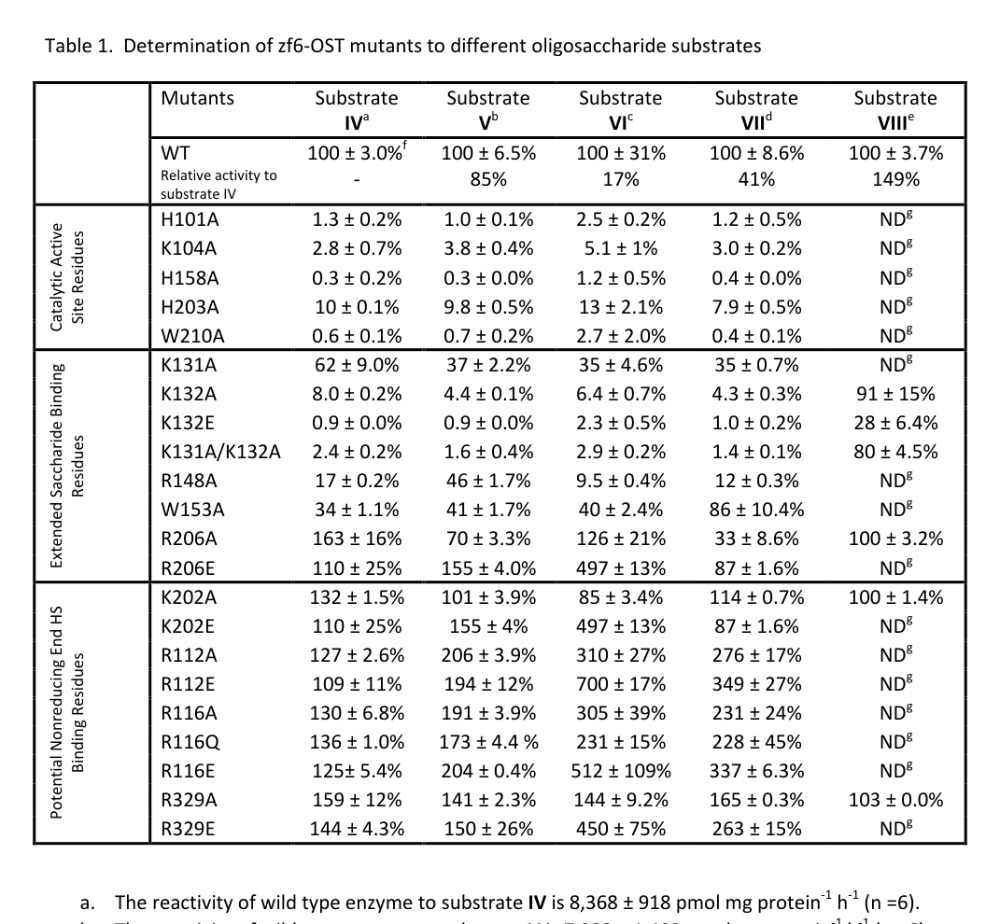

## Question

# Gene Research for Functional Annotation

## ⚠️ CRITICAL: Gene/Protein Identification Context

**BEFORE YOU BEGIN RESEARCH:** You MUST verify you are researching the CORRECT gene/protein. Gene symbols can be ambiguous, especially for less well-characterized genes from non-model organisms.

### Target Gene/Protein Identity (from UniProt):
- **UniProt Accession:** A0MGZ7
- **Protein Description:** RecName: Full=Heparan-sulfate 6-O-sulfotransferase 3-B {ECO:0000312|ZFIN:ZDB-GENE-070103-3}; Short=HS 6-OST-3-B {ECO:0000305}; EC=2.8.2.- {ECO:0000269|PubMed:28103688};
- **Gene Information:** Name=hs6st3b {ECO:0000312|ZFIN:ZDB-GENE-070103-3};
- **Organism (full):** Danio rerio (Zebrafish) (Brachydanio rerio).
- **Protein Family:** Belongs to the sulfotransferase 6 family. .
- **Key Domains:** Heparan_SO4-6-sulfoTrfase. (IPR010635); P-loop_NTPase. (IPR027417); Sulfotransferase. (IPR005331); Sulfotransfer_2 (PF03567)

### MANDATORY VERIFICATION STEPS:

1. **Check if the gene symbol "hs6st3b" matches the protein description above**
2. **Verify the organism is correct:** Danio rerio (Zebrafish) (Brachydanio rerio).
3. **Check if protein family/domains align with what you find in literature**
4. **If you find literature for a DIFFERENT gene with the same or similar symbol, STOP**

### If Gene Symbol is Ambiguous or You Cannot Find Relevant Literature:

**DO NOT PROCEED WITH RESEARCH ON A DIFFERENT GENE.** Instead:
- State clearly: "The gene symbol 'hs6st3b' is ambiguous or literature is limited for this specific protein"
- Explain what you found (e.g., "Found extensive literature on a different gene with the same symbol in a different organism")
- Describe the protein based ONLY on the UniProt information provided above
- Suggest that the protein function can be inferred from domain/family information

### Research Target:

Please provide a comprehensive research report on the gene **hs6st3b** (gene ID: hs6st3b, UniProt: A0MGZ7) in DANRE.

The research report should be a detailed narrative explaining the function, biological processes, and localization of the gene product. Citations should be given for all claims.

You should prioritize authoritative reviews and primary scientific literature when conducting research. You can supplement
this with annotations you find in gene/protein databases, but these can be outdated or inaccurate.

We are specifically interested in the primary function of the gene - for enzymes, what reaction is catalyzed, and what is the substrate specificity? For transporters, what is the substrate? For structural proteins or adapters, what is the broader structural role? For signaling molecules, what is the role in the pathway.

We are interested in where in or outside the cell the gene product carries out its function.

We are also interested in the signaling or biochemical pathways in which the gene functions. We are less interested in broad pleiotropic effects, except where these elucidate the precise role.

Include evidence where possible. We are interested in both experimental evidence as well as inference from structure, evolution, or bioinformatic analysis. Precise studies should be prioritized over high-throughput, where available.

## Output

Question: You are an expert researcher providing comprehensive, well-cited information.

Provide detailed information focusing on:
1. Key concepts and definitions with current understanding
2. Recent developments and latest research (prioritize 2023-2024 sources)
3. Current applications and real-world implementations
4. Expert opinions and analysis from authoritative sources
5. Relevant statistics and data from recent studies

Format as a comprehensive research report with proper citations. Include URLs and publication dates where available.
Always prioritize recent, authoritative sources and provide specific citations for all major claims.

# Gene Research for Functional Annotation

## ⚠️ CRITICAL: Gene/Protein Identification Context

**BEFORE YOU BEGIN RESEARCH:** You MUST verify you are researching the CORRECT gene/protein. Gene symbols can be ambiguous, especially for less well-characterized genes from non-model organisms.

### Target Gene/Protein Identity (from UniProt):
- **UniProt Accession:** A0MGZ7
- **Protein Description:** RecName: Full=Heparan-sulfate 6-O-sulfotransferase 3-B {ECO:0000312|ZFIN:ZDB-GENE-070103-3}; Short=HS 6-OST-3-B {ECO:0000305}; EC=2.8.2.- {ECO:0000269|PubMed:28103688};
- **Gene Information:** Name=hs6st3b {ECO:0000312|ZFIN:ZDB-GENE-070103-3};
- **Organism (full):** Danio rerio (Zebrafish) (Brachydanio rerio).
- **Protein Family:** Belongs to the sulfotransferase 6 family. .
- **Key Domains:** Heparan_SO4-6-sulfoTrfase. (IPR010635); P-loop_NTPase. (IPR027417); Sulfotransferase. (IPR005331); Sulfotransfer_2 (PF03567)

### MANDATORY VERIFICATION STEPS:

1. **Check if the gene symbol "hs6st3b" matches the protein description above**
2. **Verify the organism is correct:** Danio rerio (Zebrafish) (Brachydanio rerio).
3. **Check if protein family/domains align with what you find in literature**
4. **If you find literature for a DIFFERENT gene with the same or similar symbol, STOP**

### If Gene Symbol is Ambiguous or You Cannot Find Relevant Literature:

**DO NOT PROCEED WITH RESEARCH ON A DIFFERENT GENE.** Instead:
- State clearly: "The gene symbol 'hs6st3b' is ambiguous or literature is limited for this specific protein"
- Explain what you found (e.g., "Found extensive literature on a different gene with the same symbol in a different organism")
- Describe the protein based ONLY on the UniProt information provided above
- Suggest that the protein function can be inferred from domain/family information

### Research Target:

Please provide a comprehensive research report on the gene **hs6st3b** (gene ID: hs6st3b, UniProt: A0MGZ7) in DANRE.

The research report should be a detailed narrative explaining the function, biological processes, and localization of the gene product. Citations should be given for all claims.

You should prioritize authoritative reviews and primary scientific literature when conducting research. You can supplement
this with annotations you find in gene/protein databases, but these can be outdated or inaccurate.

We are specifically interested in the primary function of the gene - for enzymes, what reaction is catalyzed, and what is the substrate specificity? For transporters, what is the substrate? For structural proteins or adapters, what is the broader structural role? For signaling molecules, what is the role in the pathway.

We are interested in where in or outside the cell the gene product carries out its function.

We are also interested in the signaling or biochemical pathways in which the gene functions. We are less interested in broad pleiotropic effects, except where these elucidate the precise role.

Include evidence where possible. We are interested in both experimental evidence as well as inference from structure, evolution, or bioinformatic analysis. Precise studies should be prioritized over high-throughput, where available.

# Research report: zebrafish **hs6st3b** (UniProt A0MGZ7) functional annotation

## 0. Target verification (mandatory)

**Target identity**: The requested zebrafish gene **hs6st3b** is one of the zebrafish heparan-sulfate 6-O-sulfotransferase (Hs6st/6-OST) paralogs. A zebrafish HS biosynthesis review explicitly lists **hs6st3b** among zebrafish 6-O-sulfotransferases (hs6st1a, hs6st1b, hs6st2, hs6st3a, **hs6st3b**), supporting that the symbol corresponds to a **Danio rerio** HS 6-O-sulfotransferase family member consistent with UniProt A0MGZ7. (filipekgorniok2021heparansulfatebiosynthesis pages 4-5, filipekgorniok2021heparansulfatebiosynthesis pages 2-4)

**Disambiguation**: The zebrafish 6-OST family comprises multiple paralogs with conserved catalytic features and distinct spatiotemporal expression, so “hs6st” results in older literature may refer to a different paralog or to a single then-known zebrafish hs6st locus prior to full genome annotation. For hs6st3b-specific function, direct primary evidence is limited in the retrieved literature; therefore, conclusions below combine (i) zebrafish-family/paralog evidence and (ii) mechanistic/structural evidence from zebrafish 6-OST enzymes and mammalian HS6ST isoforms, clearly marked as inference where needed. (filipekgorniok2021heparansulfatebiosynthesis pages 4-5, filipekgorniok2021heparansulfatebiosynthesis pages 2-4, cadwallader2006combinatorialexpressionpatternsa pages 2-4)

## 1. Key concepts and definitions (current understanding)

### 1.1 Heparan sulfate (HS) and the “sulfation code”
HS is a linear glycosaminoglycan (GAG) built as repeating disaccharides that become extensively modified in the Golgi by epimerization and sulfation, generating diverse sequences that regulate binding of many extracellular ligands (growth factors, morphogens, chemokines). A recent expert review emphasizes that HS chains are structurally diverse and interact with a very large set of protein partners, so changes in sulfation patterns can reshape extracellular signaling and disease susceptibility. (ouidja2024geneticvariabilityin pages 1-2)

### 1.2 HS6ST enzymes (Hs6st / 6-OST)
**Heparan-sulfate 6-O-sulfotransferases (HS6STs)** catalyze transfer of a sulfo group to the **6-hydroxyl of glucosamine residues** within HS chains, thereby creating 6-O-sulfated HS motifs. HS6STs use **PAPS (3′-phosphoadenosine-5′-phosphosulfate)** as the universal sulfate donor (producing PAP as a product). (habuchi2010micedeficientin pages 4-7, bink2003heparansulfate6osulfotransferase pages 3-4)

In zebrafish, multiple hs6st paralogs exist and are expected to contribute to HS 6-O-sulfation in a tissue- and developmental-stage-specific manner. (filipekgorniok2021heparansulfatebiosynthesis pages 2-4, cadwallader2006combinatorialexpressionpatternsa pages 1-2)

## 2. Gene/protein: **hs6st3b** (zebrafish)

### 2.1 Family membership and expected molecular function
Zebrafish possess multiple 6-OST genes with conserved catalytic/PAPS-binding features and divergent expression patterns, supporting paralog specialization after gene duplication. This provides the rationale for annotating **hs6st3b** as an HS 6-O-sulfotransferase rather than a different sulfotransferase class. (cadwallader2006combinatorialexpressionpatternsa pages 2-4, cadwallader2006combinatorialexpressionpatternsa pages 1-2)

A zebrafish HS biosynthesis review explicitly places **hs6st3b** within the HS6ST3 group (as one of the zebrafish “3” paralogs, alongside hs6st3a) but also notes that isoform-specific enzymatic characteristics for zebrafish paralogs remain incompletely defined, which is an important limitation for hs6st3b-specific functional claims. (filipekgorniok2021heparansulfatebiosynthesis pages 4-5, filipekgorniok2021heparansulfatebiosynthesis pages 2-4)

### 2.2 Subcellular localization (where the protein acts)
For zebrafish Hs6st enzymes, sequence analysis identified an N-terminal hydrophobic segment consistent with a **type II transmembrane protein** and the authors infer **Golgi apparatus localization**, matching the expected location of HS chain modification during proteoglycan biosynthesis. This is consistent with how HS biosynthetic enzymes operate generally. (bink2003heparansulfate6osulfotransferase pages 3-4)

**Inference for hs6st3b**: Given hs6st3b’s membership in the hs6st family and shared architectural motifs described for zebrafish 6-OSTs, the most likely subcellular site of hs6st3b catalytic action is the Golgi lumen as a type II membrane protein. This is a family-based inference rather than a direct hs6st3b localization experiment in the retrieved texts. (cadwallader2006combinatorialexpressionpatternsa pages 1-2, bink2003heparansulfate6osulfotransferase pages 3-4)

## 3. Primary biochemical function: reaction and substrate specificity

### 3.1 Catalyzed reaction
HS6ST enzymes catalyze:

**HS–GlcN(6-OH) + PAPS → HS–GlcN(6-OSO3−) + PAP**

Direct biochemical assays in zebrafish hs6st studies used radiolabeled **[35S]PAPS** as the sulfate donor and measured sulfate transfer to heparin/HS substrates, consistent with the canonical sulfotransferase reaction. (bink2003heparansulfate6osulfotransferase pages 3-4)

### 3.2 Acceptor substrate context and specificity (family-level + zebrafish structural evidence)

**Biochemical substrate preferences (zebrafish enzyme assays):** Recombinant zebrafish Hs6st showed highest activity on N-sulfated heparin-like substrates and much lower activity on N-acetylated heparin; it showed essentially no activity on chondroitin, supporting specificity for HS/heparin-type glycans. (bink2003heparansulfate6osulfotransferase pages 3-4)

**Structural determinants (zebrafish 6-OST crystal structures):** Crystal structures of zebrafish 6-OST showed in-line sulfate transfer geometry to the acceptor 6-hydroxyl, with **His158** positioned as the catalytic base and **Trp210** interacting near the acceptor site to help position the substrate for catalysis. The same work concluded that 6-OST has relatively relaxed substrate requirements (e.g., can act on short oligosaccharides and on GlcNS and, less efficiently, GlcNAc). (xu2017structurebasedsubstrate pages 8-11, xu2017structurebasedsubstrate media 378575d8)

**Mechanism and active-site residues (computational + mutagenesis framework):** A mechanistic analysis supports an **SN2-like** sulfation mechanism for HS6ST and identifies residues required for catalysis and binding, including **K104 and H158** for catalysis and active-site tryptophans (including the conserved W210 position) plus lysine loops (K131/K132) as determinants of acceptor positioning and preference patterns. (gesteira2021structuraldeterminantsof pages 1-3, gesteira2021structuraldeterminantsof pages 11-13, gesteira2021structuraldeterminantsof pages 8-10)

**Isoform-level specificity (mammalian HS6STs; used for inference):** Reviews of HS6ST isoforms report overlapping but distinguishable substrate preferences: HS6ST1 preferentially modifies IdoA–GlcNS contexts, whereas HS6ST3 can act on multiple contexts; HS6ST2/3 can prefer substrates enriched in 2-O-sulfation. These isoform trends provide a plausible expectation that zebrafish hs6st3b (an HS6ST3 paralog) may be comparatively permissive in acceptor context, but direct biochemical characterization of zebrafish hs6st3b specifically was not retrieved here. (habuchi2010micedeficientin pages 4-7)

## 4. Biological processes and pathways (zebrafish evidence and pathway logic)

### 4.1 Developmental expression patterns (family-level; limited hs6st3b specificity)
Zebrafish 6-OST paralogs exhibit distinct spatiotemporal mRNA expression patterns across development (including early embryonic stages and tissues such as eye, hindbrain, spinal cord, otic vesicle, somites, and fin), supporting a model in which each paralog produces tissue-specific HS 6-O-sulfation patterns. (cadwallader2006combinatorialexpressionpatternsa pages 2-4)

Older zebrafish hs6st work (when zebrafish paralog enumeration was incomplete) reported expression domains in **brain, somites, and fin buds/pectoral fins**, consistent with roles in neural and musculoskeletal development. (bink2003heparansulfate6osulfotransferase pages 3-4, bink2003heparansulfate6osulfotransferase pages 8-9)

### 4.2 Perturbation phenotypes and implicated pathways
**Somite/muscle development:** Morpholino knockdown of zebrafish hs6st produced defects in somite specification and muscle differentiation, including sustained high myoD expression and later muscle degeneration; the study concludes that 6-O-sulfation of HS is essential for muscle development. (bink2003heparansulfate6osulfotransferase pages 7-8, bink2003heparansulfate6osulfotransferase pages 8-9)

**Signaling pathway links (interpretation constrained by evidence):** In that study, phenotypes were discussed as consistent with genetic interaction with **Wnt signaling** (e.g., changes in myoD/eng2) and selective effects on some **Shh expression domains** (loss of dorsal ZLI Shh signal) rather than a global Shh disruption; these observations support the general principle that HS sulfation patterns modulate morphogen signaling. However, these data are not specific to hs6st3b, and they do not directly prove hs6st3b acts in a particular pathway; rather they implicate HS 6-O-sulfation in these developmental signaling contexts. (bink2003heparansulfate6osulfotransferase pages 7-8, bink2003heparansulfate6osulfotransferase pages 8-9)

**Axon guidance:** Zebrafish 6-OST family work cites/frames roles for specific 6-O-sulfated HS motifs in guidance cues (e.g., retinal axon pathfinding), consistent with the broader concept of HS as a regulator of extracellular guidance signaling. (cadwallader2006combinatorialexpressionpatternsa pages 1-2)

## 5. Recent developments (prioritizing 2023–2024)

### 5.1 2024 expert synthesis: genetic variability and “ubiquitous vs specialized” HS
A 2024 expert review proposes a phenotypically centered framework in which **ubiquitous HS enzymes** (including core HS sulfation steps) are essential for development and homeostasis, while tissue-restricted enzymes including **HS6ST2/HS6ST3** generate **specialized HS sequences** linked to adaptive behaviors, cognition, tissue responsiveness, and disease susceptibility. This framing is directly relevant to hs6st3b (an HS6ST3 paralog), suggesting its most informative phenotypes may be tissue- and context-dependent rather than universally lethal. (ouidja2024geneticvariabilityin pages 1-2, ouidja2024geneticvariabilityin pages 10-11)

The review further notes that common variants/SNPs in HS6ST2/HS6ST3 and related pathway genes associate with neurodevelopmental/neuropsychiatric and metabolic traits, reinforcing the view that modulation of HS sulfation can tune disease risk. (ouidja2024geneticvariabilityin pages 14-16, ouidja2024geneticvariabilityin pages 12-14)

### 5.2 2023 methods updates: quantifying HS6ST activity
A 2023 updated protocol details radiometric HS6ST assays using **[35S]PAPS**, including quantitative parameters for reaction setup (e.g., 50 pmol [35S]PAPS in 50 μL; 25 nmol HS acceptor as hexuronic acid; protamine activation; 37°C, 20 min), and downstream disaccharide mapping by heparinase digestion plus HPLC fractionation/radioactivity counting for positional assignment. These methods remain foundational for rigorous hs6st3b enzymology in zebrafish systems. (habuchi2023enzymeassayof pages 1-3)

### 5.3 2024 application: sulfotransferase engineering for heparin biomanufacturing
A 2024 Nature Communications study illustrates how mechanistic knowledge of HS/heparin sulfotransferases is being used in **biomanufacturing pipelines** for animal-free heparin. The work reports an engineered N-sulfotransferase with substantially improved stability and activity and demonstrates production of bioengineered heparin with **anti-FXa 246.09 IU/mg** and **anti-FIIa 48.62 IU/mg** activities (application not hs6st3b-specific, but directly relevant to the HS sulfotransferase field and to translating HS sulfation control into real products). (mcclurg2024understandinghs6st1and pages 56-60, mcclurg2024understandinghs6st1andb pages 56-60)

## 6. Current applications and real-world implementations relevant to hs6st3b research

1. **Developmental genetics in zebrafish**: hs6st paralog expression maps and knockdown phenotypes support using zebrafish as a system to test how specific HS sulfation motifs regulate morphogen-driven tissue patterning and differentiation (e.g., muscle). (bink2003heparansulfate6osulfotransferase pages 7-8, cadwallader2006combinatorialexpressionpatternsa pages 2-4)

2. **Structure-guided enzyme engineering**: Zebrafish 6-OST structural work identifies catalytic residues (e.g., His158, Trp210) and substrate-binding determinants that can be exploited for enzyme redesign, inhibitor development, or synthesis of defined HS motifs. (xu2017structurebasedsubstrate pages 8-11, xu2017structurebasedsubstrate media 378575d8)

3. **Analytical/assay platforms**: Radiometric assays and disaccharide mapping workflows remain a practical route to quantify how hs6st3b perturbation changes HS 6-O-sulfation patterns in vivo or in engineered cell systems. (habuchi2023enzymeassayof pages 1-3)

4. **Biomanufacturing/glycoengineering**: 2024 synthetic biology demonstrates scaling and optimization of sulfotransferase-driven pathways for producing defined heparin/HS products, indicating a near-term translational pathway for controlling HS sulfation in industrial settings. (mcclurg2024understandinghs6st1andb pages 56-60)

## 7. Quantitative data and statistics (recent studies prioritized)

- **Heparin biomanufacturing functional activity (2024):** bioengineered heparin produced in an engineered cascade shows **anti-FXa 246.09 IU/mg** and **anti-FIIa 48.62 IU/mg** activities. (mcclurg2024understandinghs6st1andb pages 56-60)

- **HS6ST assay quantitation (2023 protocol):** a reference radiometric assay uses **50 pmol [35S]PAPS (~5×10^5 cpm in 50 μL)**, **25 nmol HS acceptor (as hexuronic acid)**, and measures incorporation by scintillation; positional assignment uses HPLC fractionation of heparinase digestion products. (habuchi2023enzymeassayof pages 1-3)

## 8. Evidence summary table

| Claim/Topic | Key finding (1-2 sentences) | Evidence type (biochemical/structural/expression/phenotype/review/application) | Species/system | Source (authors year journal) | Publication date | URL/DOI |
|---|---|---|---|---|---|---|
| Zebrafish hs6st enzymatic activity, substrate preference, and knockdown phenotype | A zebrafish hs6st cDNA encoded a type II transmembrane Golgi enzyme with HS 6-O-sulfotransferase activity using PAPS and showing strongest activity toward N-sulfated heparin-like substrates, with little/no activity on chondroitin. Morpholino knockdown reduced 6-O-sulfation and caused defects in somite specification and muscle differentiation, supporting an essential developmental role for zebrafish HS 6-O-sulfation (bink2003heparansulfate6osulfotransferase pages 3-4, bink2003heparansulfate6osulfotransferase pages 7-8, bink2003heparansulfate6osulfotransferase pages 8-9). | biochemical, phenotype, expression | Danio rerio embryos; COS-7 expression system | Bink et al. 2003 *Journal of Biological Chemistry* | Aug 2003 | https://doi.org/10.1074/jbc.M213124200 |
| Zebrafish 6-OST family paralogs and expression patterns | Zebrafish were shown to possess multiple 6-OST paralogs with conserved catalytic/PAPS-binding motifs and distinct spatial-temporal expression patterns, implying subfunctionalization after duplication. Expression domains across family members include early cleavage stages, eyes, hindbrain, somites, internal organ primordia, and pectoral fin, providing family-level context for hs6st3b annotation (cadwallader2006combinatorialexpressionpatternsa pages 2-4, cadwallader2006combinatorialexpressionpatternsa pages 1-2). | expression, comparative family analysis | Danio rerio embryos | Cadwallader & Yost 2006 *Developmental Dynamics* | Dec 2006 | https://doi.org/10.1002/dvdy.20990 |
| Zebrafish HS biosynthesis review listing hs6st3b and paralogs | A zebrafish HS biosynthesis review explicitly lists **hs6st3b** among the zebrafish HS 6-O-sulfotransferases together with hs6st1a, hs6st1b, hs6st2, and hs6st3a, confirming the target gene identity in *Danio rerio*. The review also notes that isoform-specific enzymatic characteristics remain incompletely defined, so hs6st3b function is inferred partly from family membership and conserved biosynthetic role (filipekgorniok2021heparansulfatebiosynthesis pages 4-5, filipekgorniok2021heparansulfatebiosynthesis pages 2-4). | review, gene-family annotation | Danio rerio | Filipek-Górniok et al. 2021 *Journal of Histochemistry & Cytochemistry* | Nov 2021 | https://doi.org/10.1369/0022155420973980 |
| Zebrafish 6-OST crystal structure and catalytic residues | Crystal structures of zebrafish 6-OST showed in-line sulfate transfer to the 6-hydroxyl of glucosamine, with His158 positioned as catalytic base and Trp210 helping orient the acceptor. The study also found relatively broad substrate tolerance, including activity on short oligosaccharides and both GlcNS and, less efficiently, GlcNAc-containing acceptors (xu2017structurebasedsubstrate pages 8-11, xu2017structurebasedsubstrate media 378575d8). | structural, biochemical | Zebrafish 6-OST catalytic domain with HS oligosaccharides | Xu et al. 2017 *ACS Chemical Biology* | Jan 2017 | https://doi.org/10.1021/acschembio.6b00841 |
| Mechanistic SN2-like catalysis and key active-site residues | QM/MM and structural analysis supported an SN2-like catalytic mechanism for HS6ST, with K104 and H158 required for catalysis and W153/W210 plus K131/K132 shaping acceptor binding and preference for 2-O-sulfated substrates. Mutational analysis of residues such as R329 and D192 strongly impaired 6-O-sulfation, clarifying determinants of catalysis and processivity in the zebrafish enzyme scaffold (gesteira2021structuraldeterminantsof pages 13-14, gesteira2021structuraldeterminantsof pages 1-3, gesteira2021structuraldeterminantsof pages 11-13, gesteira2021structuraldeterminantsof pages 8-10). | structural, mechanistic | HS6ST structural/computational models and mutagenesis | Gesteira et al. 2021 *ACS Catalysis* | Aug 2021 | https://doi.org/10.1021/acscatal.1c03088 |
| 2024 expert view on HS6ST2/3 as tissue-restricted generators of specialized HS | A 2024 review proposes that HS pathway genes divide into essential ubiquitous enzymes and tissue-restricted enzymes; HS6ST2 and HS6ST3 fall into the latter class, generating specialized HS motifs linked to adaptive behaviors, cognition, tissue responsiveness, and disease susceptibility rather than core viability. The review highlights genetic variability in HS6ST2/3 and argues that substrate preferences, pathway flux, and tissue context are central to interpreting sulfation-dependent phenotypes (ouidja2024geneticvariabilityin pages 1-2, ouidja2024geneticvariabilityin pages 14-16, ouidja2024geneticvariabilityin pages 12-14, ouidja2024geneticvariabilityin pages 10-11). | review, expert analysis | Human genetics, mouse phenotypes, comparative HS pathway | Ouidja et al. 2024 *Essays in Biochemistry* | Dec 2024 | https://doi.org/10.1042/EBC20240106 |
| 2024 application: sulfotransferase engineering for heparin biomanufacturing | A 2024 synthetic-biology study used rational engineering to improve sulfotransferase performance in a multienzyme heparin-biosynthesis workflow, demonstrating how mechanistic understanding of sulfotransferases can be translated into glycoengineering. Engineered N-sulfotransferase showed 11.32-fold improved stability and 2.53-fold higher activity, and the cascade produced bioengineered heparin with anti-FXa activity of 246.09 IU/mg and anti-FIIa activity of 48.62 IU/mg; while not hs6st3b-specific, it is a current real-world application directly relevant to HS sulfotransferase biology (mcclurg2024understandinghs6st1and pages 56-60, mcclurg2024understandinghs6st1andb pages 56-60, mcclurg2024understandinghs6st1anda pages 56-60). | application, enzyme engineering | Engineered microbial/cell-free heparin biosynthesis platform | Deng et al. 2024 *Nature Communications* | May 2024 | https://doi.org/10.1038/s41467-024-48193-5 |

*Table: This table compiles the most relevant family-level and zebrafish-specific evidence for functional annotation of zebrafish hs6st3b (UniProt A0MGZ7). It highlights direct experimental findings, structural/mechanistic inferences, and recent expert/application literature that together support annotation of hs6st3b as a Golgi HS 6-O-sulfotransferase.*

## 9. Conclusions (functional annotation statement)

**Most defensible functional annotation for hs6st3b (A0MGZ7):** hs6st3b encodes a zebrafish **heparan-sulfate 6-O-sulfotransferase (HS6ST3 paralog)**, a type II membrane protein expected to function in the **Golgi** to transfer sulfate from **PAPS** to the **6-O position of glucosamine residues** in HS chains, thereby generating 6-O-sulfated HS motifs that modulate extracellular signaling interactions. (filipekgorniok2021heparansulfatebiosynthesis pages 2-4, habuchi2010micedeficientin pages 4-7, bink2003heparansulfate6osulfotransferase pages 3-4)

**What is still missing for hs6st3b specifically:** The retrieved texts do not provide hs6st3b-specific biochemical parameters (Km/kcat, acceptor preferences) or hs6st3b-specific mutant phenotypes in zebrafish. Consequently, **substrate specificity and pathway roles for hs6st3b should be treated as family-based inference** until direct zebrafish hs6st3b perturbation and HS disaccharide profiling are performed. (filipekgorniok2021heparansulfatebiosynthesis pages 4-5, filipekgorniok2021heparansulfatebiosynthesis pages 2-4)

References

1. (filipekgorniok2021heparansulfatebiosynthesis pages 4-5): Beata Filipek-Górniok, Judith Habicher, Johan Ledin, and Lena Kjellén. Heparan sulfate biosynthesis in zebrafish. Journal of Histochemistry & Cytochemistry, 69:49-60, Nov 2021. URL: https://doi.org/10.1369/0022155420973980, doi:10.1369/0022155420973980. This article has 4 citations and is from a peer-reviewed journal.

2. (filipekgorniok2021heparansulfatebiosynthesis pages 2-4): Beata Filipek-Górniok, Judith Habicher, Johan Ledin, and Lena Kjellén. Heparan sulfate biosynthesis in zebrafish. Journal of Histochemistry & Cytochemistry, 69:49-60, Nov 2021. URL: https://doi.org/10.1369/0022155420973980, doi:10.1369/0022155420973980. This article has 4 citations and is from a peer-reviewed journal.

3. (cadwallader2006combinatorialexpressionpatternsa pages 2-4): Adam B. Cadwallader and H. Joseph Yost. Combinatorial expression patterns of heparan sulfate sulfotransferases in zebrafish: ii. the 6‐o‐sulfotransferase family. Developmental Dynamics, 235:3432-3437, Dec 2006. URL: https://doi.org/10.1002/dvdy.20990, doi:10.1002/dvdy.20990. This article has 38 citations and is from a peer-reviewed journal.

4. (ouidja2024geneticvariabilityin pages 1-2): M. Ouidja, Denis S F Biard, M. B. Huynh, Xavier Laffray, W. Gómez-Henao, Sandrine Chantepie, G. Le Douaron, N. Rebergue, A. Maïza, H. Merrick, Aubert De Lichy, Alwyn Dady, O. González-Velasco, Karla Rubio, Guillermo Barreto, K. Baranger, Valerie Cormier-Daire, Javier De Las Rivas, D. Fernig, and D. Papy-Garcia. Genetic variability in proteoglycan biosynthetic genes reveals new facets of heparan sulfate diversity. Essays in Biochemistry, 68:555-578, Dec 2024. URL: https://doi.org/10.1042/ebc20240106, doi:10.1042/ebc20240106. This article has 0 citations and is from a peer-reviewed journal.

5. (habuchi2010micedeficientin pages 4-7): Hiroko Habuchi and Koji Kimata. Mice deficient in heparan sulfate 6-o-sulfotransferase-1. Progress in molecular biology and translational science, 93:79-111, Jan 2010. URL: https://doi.org/10.1016/s1877-1173(10)93005-6, doi:10.1016/s1877-1173(10)93005-6. This article has 35 citations and is from a peer-reviewed journal.

6. (bink2003heparansulfate6osulfotransferase pages 3-4): Robert J. Bink, Hiroko Habuchi, Zsolt Lele, Edward Dolk, Jos Joore, Gerd-Jörg Rauch, Robert Geisler, Stephen W. Wilson, Jeroen den Hertog, Koji Kimata, and Danica Zivkovic. Heparan sulfate 6-o-sulfotransferase is essential for muscle development in zebrafish*. Journal of Biological Chemistry, 278:31118-31127, Aug 2003. URL: https://doi.org/10.1074/jbc.m213124200, doi:10.1074/jbc.m213124200. This article has 122 citations and is from a domain leading peer-reviewed journal.

7. (cadwallader2006combinatorialexpressionpatternsa pages 1-2): Adam B. Cadwallader and H. Joseph Yost. Combinatorial expression patterns of heparan sulfate sulfotransferases in zebrafish: ii. the 6‐o‐sulfotransferase family. Developmental Dynamics, 235:3432-3437, Dec 2006. URL: https://doi.org/10.1002/dvdy.20990, doi:10.1002/dvdy.20990. This article has 38 citations and is from a peer-reviewed journal.

8. (xu2017structurebasedsubstrate pages 8-11): Yongmei Xu, Andrea F. Moon, Shuqin Xu, Juno M. Krahn, Jian Liu, and Lars C. Pedersen. Structure based substrate specificity analysis of heparan sulfate 6-o-sulfotransferases. ACS chemical biology, 12 1:73-82, Jan 2017. URL: https://doi.org/10.1021/acschembio.6b00841, doi:10.1021/acschembio.6b00841. This article has 56 citations and is from a domain leading peer-reviewed journal.

9. (xu2017structurebasedsubstrate media 378575d8): Yongmei Xu, Andrea F. Moon, Shuqin Xu, Juno M. Krahn, Jian Liu, and Lars C. Pedersen. Structure based substrate specificity analysis of heparan sulfate 6-o-sulfotransferases. ACS chemical biology, 12 1:73-82, Jan 2017. URL: https://doi.org/10.1021/acschembio.6b00841, doi:10.1021/acschembio.6b00841. This article has 56 citations and is from a domain leading peer-reviewed journal.

10. (gesteira2021structuraldeterminantsof pages 1-3): Tarsis Ferreira Gesteira, Tainah Dorina Marforio, Jonathan Wolf Mueller, Matteo Calvaresi, and Vivien Jane Coulson-Thomas. Structural determinants of substrate recognition and catalysis by heparan sulfate sulfotransferases. ACS catalysis, 11 17:10974-10987, Aug 2021. URL: https://doi.org/10.1021/acscatal.1c03088, doi:10.1021/acscatal.1c03088. This article has 22 citations and is from a highest quality peer-reviewed journal.

11. (gesteira2021structuraldeterminantsof pages 11-13): Tarsis Ferreira Gesteira, Tainah Dorina Marforio, Jonathan Wolf Mueller, Matteo Calvaresi, and Vivien Jane Coulson-Thomas. Structural determinants of substrate recognition and catalysis by heparan sulfate sulfotransferases. ACS catalysis, 11 17:10974-10987, Aug 2021. URL: https://doi.org/10.1021/acscatal.1c03088, doi:10.1021/acscatal.1c03088. This article has 22 citations and is from a highest quality peer-reviewed journal.

12. (gesteira2021structuraldeterminantsof pages 8-10): Tarsis Ferreira Gesteira, Tainah Dorina Marforio, Jonathan Wolf Mueller, Matteo Calvaresi, and Vivien Jane Coulson-Thomas. Structural determinants of substrate recognition and catalysis by heparan sulfate sulfotransferases. ACS catalysis, 11 17:10974-10987, Aug 2021. URL: https://doi.org/10.1021/acscatal.1c03088, doi:10.1021/acscatal.1c03088. This article has 22 citations and is from a highest quality peer-reviewed journal.

13. (bink2003heparansulfate6osulfotransferase pages 8-9): Robert J. Bink, Hiroko Habuchi, Zsolt Lele, Edward Dolk, Jos Joore, Gerd-Jörg Rauch, Robert Geisler, Stephen W. Wilson, Jeroen den Hertog, Koji Kimata, and Danica Zivkovic. Heparan sulfate 6-o-sulfotransferase is essential for muscle development in zebrafish*. Journal of Biological Chemistry, 278:31118-31127, Aug 2003. URL: https://doi.org/10.1074/jbc.m213124200, doi:10.1074/jbc.m213124200. This article has 122 citations and is from a domain leading peer-reviewed journal.

14. (bink2003heparansulfate6osulfotransferase pages 7-8): Robert J. Bink, Hiroko Habuchi, Zsolt Lele, Edward Dolk, Jos Joore, Gerd-Jörg Rauch, Robert Geisler, Stephen W. Wilson, Jeroen den Hertog, Koji Kimata, and Danica Zivkovic. Heparan sulfate 6-o-sulfotransferase is essential for muscle development in zebrafish*. Journal of Biological Chemistry, 278:31118-31127, Aug 2003. URL: https://doi.org/10.1074/jbc.m213124200, doi:10.1074/jbc.m213124200. This article has 122 citations and is from a domain leading peer-reviewed journal.

15. (ouidja2024geneticvariabilityin pages 10-11): M. Ouidja, Denis S F Biard, M. B. Huynh, Xavier Laffray, W. Gómez-Henao, Sandrine Chantepie, G. Le Douaron, N. Rebergue, A. Maïza, H. Merrick, Aubert De Lichy, Alwyn Dady, O. González-Velasco, Karla Rubio, Guillermo Barreto, K. Baranger, Valerie Cormier-Daire, Javier De Las Rivas, D. Fernig, and D. Papy-Garcia. Genetic variability in proteoglycan biosynthetic genes reveals new facets of heparan sulfate diversity. Essays in Biochemistry, 68:555-578, Dec 2024. URL: https://doi.org/10.1042/ebc20240106, doi:10.1042/ebc20240106. This article has 0 citations and is from a peer-reviewed journal.

16. (ouidja2024geneticvariabilityin pages 14-16): M. Ouidja, Denis S F Biard, M. B. Huynh, Xavier Laffray, W. Gómez-Henao, Sandrine Chantepie, G. Le Douaron, N. Rebergue, A. Maïza, H. Merrick, Aubert De Lichy, Alwyn Dady, O. González-Velasco, Karla Rubio, Guillermo Barreto, K. Baranger, Valerie Cormier-Daire, Javier De Las Rivas, D. Fernig, and D. Papy-Garcia. Genetic variability in proteoglycan biosynthetic genes reveals new facets of heparan sulfate diversity. Essays in Biochemistry, 68:555-578, Dec 2024. URL: https://doi.org/10.1042/ebc20240106, doi:10.1042/ebc20240106. This article has 0 citations and is from a peer-reviewed journal.

17. (ouidja2024geneticvariabilityin pages 12-14): M. Ouidja, Denis S F Biard, M. B. Huynh, Xavier Laffray, W. Gómez-Henao, Sandrine Chantepie, G. Le Douaron, N. Rebergue, A. Maïza, H. Merrick, Aubert De Lichy, Alwyn Dady, O. González-Velasco, Karla Rubio, Guillermo Barreto, K. Baranger, Valerie Cormier-Daire, Javier De Las Rivas, D. Fernig, and D. Papy-Garcia. Genetic variability in proteoglycan biosynthetic genes reveals new facets of heparan sulfate diversity. Essays in Biochemistry, 68:555-578, Dec 2024. URL: https://doi.org/10.1042/ebc20240106, doi:10.1042/ebc20240106. This article has 0 citations and is from a peer-reviewed journal.

18. (habuchi2023enzymeassayof pages 1-3): H Habuchi and K Kimata. Enzyme assay of sulfotransferases for heparan sulfate. Unknown journal, 2023.

19. (mcclurg2024understandinghs6st1and pages 56-60): O McClurg. Understanding hs6st1 and heparan sulfate 6-osulfation in cartilage. Unknown journal, 2024.

20. (mcclurg2024understandinghs6st1andb pages 56-60): O McClurg. Understanding hs6st1 and heparan sulfate 6-osulfation in cartilage. Unknown journal, 2024.

21. (gesteira2021structuraldeterminantsof pages 13-14): Tarsis Ferreira Gesteira, Tainah Dorina Marforio, Jonathan Wolf Mueller, Matteo Calvaresi, and Vivien Jane Coulson-Thomas. Structural determinants of substrate recognition and catalysis by heparan sulfate sulfotransferases. ACS catalysis, 11 17:10974-10987, Aug 2021. URL: https://doi.org/10.1021/acscatal.1c03088, doi:10.1021/acscatal.1c03088. This article has 22 citations and is from a highest quality peer-reviewed journal.

22. (mcclurg2024understandinghs6st1anda pages 56-60): O McClurg. Understanding hs6st1 and heparan sulfate 6-osulfation in cartilage. Unknown journal, 2024.

## Artifacts

- [Edison artifact artifact-00](hs6st3b-deep-research-falcon_artifacts/artifact-00.md)

## Citations

1. ouidja2024geneticvariabilityin pages 1-2
2. habuchi2010micedeficientin pages 4-7
3. cadwallader2006combinatorialexpressionpatternsa pages 2-4
4. cadwallader2006combinatorialexpressionpatternsa pages 1-2
5. habuchi2023enzymeassayof pages 1-3
6. filipekgorniok2021heparansulfatebiosynthesis pages 4-5
7. filipekgorniok2021heparansulfatebiosynthesis pages 2-4
8. xu2017structurebasedsubstrate pages 8-11
9. gesteira2021structuraldeterminantsof pages 1-3
10. gesteira2021structuraldeterminantsof pages 11-13
11. gesteira2021structuraldeterminantsof pages 8-10
12. ouidja2024geneticvariabilityin pages 10-11
13. ouidja2024geneticvariabilityin pages 14-16
14. ouidja2024geneticvariabilityin pages 12-14
15. gesteira2021structuraldeterminantsof pages 13-14
16. 35S
17. https://doi.org/10.1074/jbc.M213124200
18. https://doi.org/10.1002/dvdy.20990
19. https://doi.org/10.1369/0022155420973980
20. https://doi.org/10.1021/acschembio.6b00841
21. https://doi.org/10.1021/acscatal.1c03088
22. https://doi.org/10.1042/EBC20240106
23. https://doi.org/10.1038/s41467-024-48193-5
24. https://doi.org/10.1369/0022155420973980,
25. https://doi.org/10.1002/dvdy.20990,
26. https://doi.org/10.1042/ebc20240106,
27. https://doi.org/10.1016/s1877-1173(10
28. https://doi.org/10.1074/jbc.m213124200,
29. https://doi.org/10.1021/acschembio.6b00841,
30. https://doi.org/10.1021/acscatal.1c03088,