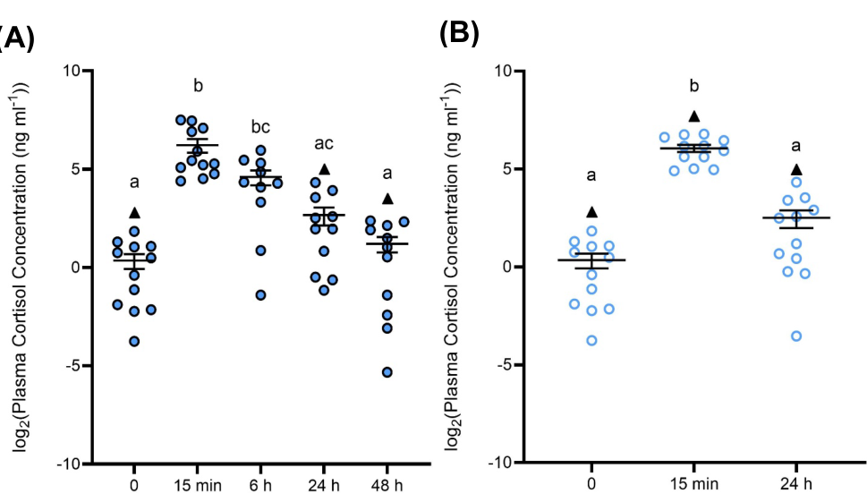

## Question

# Gene Research for Functional Annotation

## ⚠️ CRITICAL: Gene/Protein Identification Context

**BEFORE YOU BEGIN RESEARCH:** You MUST verify you are researching the CORRECT gene/protein. Gene symbols can be ambiguous, especially for less well-characterized genes from non-model organisms.

### Target Gene/Protein Identity (from UniProt):
- **UniProt Accession:** F1QLP1
- **Protein Description:** RecName: Full=11-beta-hydroxysteroid dehydrogenase type 2 {ECO:0000303|PubMed:23042946}; Short=11-DH2; Short=11-beta-HSD2 {ECO:0000303|PubMed:23042946, ECO:0000303|PubMed:33387577}; AltName: Full=11-beta-hydroxysteroid dehydrogenase type II; Short=11-HSD type II; Short=11-beta-HSD type II; AltName: Full=Corticosteroid 11-beta-dehydrogenase isozyme 2 {ECO:0000305}; AltName: Full=NAD-dependent 11-beta-hydroxysteroid dehydrogenase;
- **Gene Information:** Name=hsd11b2;
- **Organism (full):** Danio rerio (Zebrafish) (Brachydanio rerio).
- **Protein Family:** Belongs to the short-chain dehydrogenases/reductases (SDR)
- **Key Domains:** NAD(P)-bd_dom_sf. (IPR036291); Sc_DH/Rdtase_CS. (IPR020904); SDR_fam. (IPR002347); adh_short (PF00106)

### MANDATORY VERIFICATION STEPS:

1. **Check if the gene symbol "hsd11b2" matches the protein description above**
2. **Verify the organism is correct:** Danio rerio (Zebrafish) (Brachydanio rerio).
3. **Check if protein family/domains align with what you find in literature**
4. **If you find literature for a DIFFERENT gene with the same or similar symbol, STOP**

### If Gene Symbol is Ambiguous or You Cannot Find Relevant Literature:

**DO NOT PROCEED WITH RESEARCH ON A DIFFERENT GENE.** Instead:
- State clearly: "The gene symbol 'hsd11b2' is ambiguous or literature is limited for this specific protein"
- Explain what you found (e.g., "Found extensive literature on a different gene with the same symbol in a different organism")
- Describe the protein based ONLY on the UniProt information provided above
- Suggest that the protein function can be inferred from domain/family information

### Research Target:

Please provide a comprehensive research report on the gene **hsd11b2** (gene ID: hsd11b2, UniProt: F1QLP1) in DANRE.

The research report should be a detailed narrative explaining the function, biological processes, and localization of the gene product. Citations should be given for all claims.

You should prioritize authoritative reviews and primary scientific literature when conducting research. You can supplement
this with annotations you find in gene/protein databases, but these can be outdated or inaccurate.

We are specifically interested in the primary function of the gene - for enzymes, what reaction is catalyzed, and what is the substrate specificity? For transporters, what is the substrate? For structural proteins or adapters, what is the broader structural role? For signaling molecules, what is the role in the pathway.

We are interested in where in or outside the cell the gene product carries out its function.

We are also interested in the signaling or biochemical pathways in which the gene functions. We are less interested in broad pleiotropic effects, except where these elucidate the precise role.

Include evidence where possible. We are interested in both experimental evidence as well as inference from structure, evolution, or bioinformatic analysis. Precise studies should be prioritized over high-throughput, where available.

## Output

Question: You are an expert researcher providing comprehensive, well-cited information.

Provide detailed information focusing on:
1. Key concepts and definitions with current understanding
2. Recent developments and latest research (prioritize 2023-2024 sources)
3. Current applications and real-world implementations
4. Expert opinions and analysis from authoritative sources
5. Relevant statistics and data from recent studies

Format as a comprehensive research report with proper citations. Include URLs and publication dates where available.
Always prioritize recent, authoritative sources and provide specific citations for all major claims.

# Gene Research for Functional Annotation

## ⚠️ CRITICAL: Gene/Protein Identification Context

**BEFORE YOU BEGIN RESEARCH:** You MUST verify you are researching the CORRECT gene/protein. Gene symbols can be ambiguous, especially for less well-characterized genes from non-model organisms.

### Target Gene/Protein Identity (from UniProt):
- **UniProt Accession:** F1QLP1
- **Protein Description:** RecName: Full=11-beta-hydroxysteroid dehydrogenase type 2 {ECO:0000303|PubMed:23042946}; Short=11-DH2; Short=11-beta-HSD2 {ECO:0000303|PubMed:23042946, ECO:0000303|PubMed:33387577}; AltName: Full=11-beta-hydroxysteroid dehydrogenase type II; Short=11-HSD type II; Short=11-beta-HSD type II; AltName: Full=Corticosteroid 11-beta-dehydrogenase isozyme 2 {ECO:0000305}; AltName: Full=NAD-dependent 11-beta-hydroxysteroid dehydrogenase;
- **Gene Information:** Name=hsd11b2;
- **Organism (full):** Danio rerio (Zebrafish) (Brachydanio rerio).
- **Protein Family:** Belongs to the short-chain dehydrogenases/reductases (SDR)
- **Key Domains:** NAD(P)-bd_dom_sf. (IPR036291); Sc_DH/Rdtase_CS. (IPR020904); SDR_fam. (IPR002347); adh_short (PF00106)

### MANDATORY VERIFICATION STEPS:

1. **Check if the gene symbol "hsd11b2" matches the protein description above**
2. **Verify the organism is correct:** Danio rerio (Zebrafish) (Brachydanio rerio).
3. **Check if protein family/domains align with what you find in literature**
4. **If you find literature for a DIFFERENT gene with the same or similar symbol, STOP**

### If Gene Symbol is Ambiguous or You Cannot Find Relevant Literature:

**DO NOT PROCEED WITH RESEARCH ON A DIFFERENT GENE.** Instead:
- State clearly: "The gene symbol 'hsd11b2' is ambiguous or literature is limited for this specific protein"
- Explain what you found (e.g., "Found extensive literature on a different gene with the same symbol in a different organism")
- Describe the protein based ONLY on the UniProt information provided above
- Suggest that the protein function can be inferred from domain/family information

### Research Target:

Please provide a comprehensive research report on the gene **hsd11b2** (gene ID: hsd11b2, UniProt: F1QLP1) in DANRE.

The research report should be a detailed narrative explaining the function, biological processes, and localization of the gene product. Citations should be given for all claims.

You should prioritize authoritative reviews and primary scientific literature when conducting research. You can supplement
this with annotations you find in gene/protein databases, but these can be outdated or inaccurate.

We are specifically interested in the primary function of the gene - for enzymes, what reaction is catalyzed, and what is the substrate specificity? For transporters, what is the substrate? For structural proteins or adapters, what is the broader structural role? For signaling molecules, what is the role in the pathway.

We are interested in where in or outside the cell the gene product carries out its function.

We are also interested in the signaling or biochemical pathways in which the gene functions. We are less interested in broad pleiotropic effects, except where these elucidate the precise role.

Include evidence where possible. We are interested in both experimental evidence as well as inference from structure, evolution, or bioinformatic analysis. Precise studies should be prioritized over high-throughput, where available.

## Research report: functional annotation of **hsd11b2** (11β-HSD2) in **Danio rerio** (zebrafish)

### Scope and target verification
The evidence summarized here pertains specifically to **zebrafish (Danio rerio) hsd11b2**, which encodes **11β-hydroxysteroid dehydrogenase type 2 (11β-HSD2/Hsd11b2)**—a cortisol-inactivating enzyme that converts **cortisol to cortisone** and is studied in zebrafish embryos, larvae, and adults, including genetic loss-of-function and adult brain stress paradigms. (theodoridi2021knockoutofthe pages 1-2, faught2018themineralocorticoidreceptor pages 2-4, flatt202411βhydroxysteroiddehydrogenasetype pages 1-5)

### 1) Key concepts and definitions (current understanding)

#### 1.1 Pre-receptor regulation of glucocorticoids
In vertebrate endocrine physiology, “pre-receptor” regulation refers to enzymatic control of steroid ligand availability before receptor binding. In zebrafish, **Hsd11b2 is repeatedly defined as an enzyme that catalyzes the conversion (oxidative inactivation) of biologically active cortisol to biologically inactive cortisone**, thereby limiting cortisol bioavailability to corticosteroid receptors. (theodoridi2021knockoutofthe pages 1-2, faught2018themineralocorticoidreceptor pages 2-4)

#### 1.2 Enzymatic reaction catalyzed by zebrafish Hsd11b2
Multiple zebrafish studies state the reaction direction relevant to functional annotation: **cortisol → cortisone** (cortisol inactivation). (theodoridi2021knockoutofthe pages 1-2, faught2018themineralocorticoidreceptor pages 2-4)

Direct biochemical evidence from zebrafish tissue homogenates supports **NAD+-dependent oxidative conversion**: incubating zebrafish homogenates with **cortisol (100 nM) plus NAD+ (2 mM)** yields measurable cortisone, and this conversion is strongly suppressed by **18β-glycyrrhetinic acid (18β-GA)**, a pharmacological inhibitor used to inhibit 11β-HSD2 activity. (flatt2023investigatingtherole pages 107-112)

#### 1.3 Pathway context: stress axis signaling and receptor access
Zebrafish cortisol is the principal glucocorticoid in stress physiology. Hsd11b2 is positioned as a key determinant of **stress-response termination/recovery** by accelerating cortisol deactivation (cortisol clearance), thereby shaping glucocorticoid receptor (GR) and mineralocorticoid receptor (MR) signaling consequences during and after stress. (theodoridi2021knockoutofthe pages 10-11, flatt202411βhydroxysteroiddehydrogenasetype pages 1-5)

### 2) Molecular and physiological function with supporting evidence

#### 2.1 Core function: cortisol inactivation (substrate and cofactor evidence)
**Substrate/product specificity (as measured):** Zebrafish Hsd11b2 is experimentally assayed using **cortisol as substrate** and **cortisone as product**, consistent with its annotation as a cortisol-inactivating 11β-HSD2 enzyme in zebrafish. (theodoridi2021knockoutofthe pages 1-2, flatt2023investigatingtherole pages 107-112)

**Cofactor requirement (as experimentally implemented):** In tissue homogenate activity assays, **NAD+** is supplied to drive oxidative conversion of cortisol to cortisone, and 18β-GA reduces product formation by **87.8%** (cortisone: **10578.2 vs 1282.34 pg ml−1 mg−1 protein** without vs with inhibitor), supporting that the measured conversion is dominated by Hsd11b2-like activity. (flatt2023investigatingtherole pages 107-112)

#### 2.2 Role in stress response recovery (organism-level phenotype evidence)
A CRISPR/Cas9 zebrafish **hsd11b2−/−** line demonstrates that loss of Hsd11b2 **extends the cortisol stress response** (delayed recovery), establishing Hsd11b2 as a major cortisol-catabolic component during stress recovery. (theodoridi2021knockoutofthe pages 1-2, theodoridi2021knockoutofthe pages 10-11)

In larval time-course stress assays, **wild-type larvae** show a cortisol peak at **10 min** post-stressor and return to basal by **15 min**, whereas **hsd11b2−/−** larvae show a **higher-magnitude peak** at 10 min with prolonged elevation to **30 min**, and return to basal only by **~2 h** post-stress. (theodoridi2021knockoutofthe pages 10-11)

Pharmacological inhibition with **18β-GA** similarly increases and prolongs whole-body cortisol following stress exposure, providing convergent evidence that inhibiting Hsd11b2 delays cortisol clearance. (theodoridi2021knockoutofthe pages 10-11)

#### 2.3 GR-dependent regulation of hsd11b2 transcription during development
During embryogenesis, **GR (nr3c1) loss-of-function abolishes glucocorticoid-induced elevation of hsd11b2 (11β-HSD2) transcript**, placing hsd11b2 in a receptor-mediated feedback/regulatory loop of glucocorticoid signaling. (faught2018themineralocorticoidreceptor pages 2-4)

### 3) Expression timing, tissue context, and localization

#### 3.1 Developmental onset (whole-embryo mRNA time course)
Whole-embryo expression profiling shows that **hsd11b2 mRNA is lowest at 24 hpf, increases significantly from ~48 hpf, and plateaus by 72 hpf through 120 hpf**, aligning with a developmental window in which glucocorticoid-related genes rise and the embryo exhibits a functional glucocorticoid system. (wilson2013physiologicalrolesof pages 5-6, wilson2013physiologicalrolesof pages 1-2)

#### 3.2 Adult brain expression and stress-responsive regulation
Recent adult zebrafish brain work reports that Hsd11b2 is **expressed in neurogenic regions of the adult brain** and dynamically regulated by stressor type and time after stress, supporting a model in which local cortisol catabolism contributes to stress-specific neurogenic outcomes. (flatt202411βhydroxysteroiddehydrogenasetype pages 1-5)

### 4) Recent developments (prioritizing 2023–2024)

#### 4.1 2024: stressor-specific regulation of brain Hsd11b2 and neurogenesis-associated endpoints
A 2024 study (preprint; Journal of Experimental Biology posting) tested whether Hsd11b2 mediates stressor-specific cortisol effects on adult brain cell proliferation by comparing acute (single air exposure), repeat acute (two air exposures 24 h apart), and chronic social subordination stress. (flatt202411βhydroxysteroiddehydrogenasetype pages 1-5, flatt202411βhydroxysteroiddehydrogenasetype pages 5-8)

Key quantitative findings include:
- **Plasma cortisol dynamics (acute stress):** plasma cortisol increased **~75-fold at 15 min** after a 1-min air exposure, remained elevated at **6 h**, and returned to baseline by **24 h**. (flatt202411βhydroxysteroiddehydrogenasetype pages 8-12)
- **Plasma cortisol dynamics (repeat stress):** repeat stress induced a **~48-fold increase at 15 min**, with recovery by **24 h**. (flatt202411βhydroxysteroiddehydrogenasetype pages 8-12)
- **Chronic social stress:** subordinate fish had **~6.3-fold higher plasma cortisol** than dominant fish. (flatt202411βhydroxysteroiddehydrogenasetype pages 8-12)
- **Brain hsd11b2 mRNA (acute):** unchanged early (15 min, 6 h) but **~2-fold lower** at **24 h and 48 h** relative to earlier time points. (flatt202411βhydroxysteroiddehydrogenasetype pages 8-12)
- **Hsd11b2 protein (acute):** increased **~1.7-fold by 6 h** and remained elevated through **48 h**. (flatt202411βhydroxysteroiddehydrogenasetype pages 8-12)

These quantitative relationships are also shown in the study’s figures for cortisol and brain hsd11b2 transcript/protein time courses. (flatt202411βhydroxysteroiddehydrogenasetype media 3700bc9e, flatt202411βhydroxysteroiddehydrogenasetype media 51cb2d1a)

#### 4.2 2023: biochemical assay validation for zebrafish Hsd11b2 activity
A 2023 thesis developed and validated a zebrafish-compatible enzymatic assay for cortisol→cortisone conversion using **NAD+** and inhibitor specificity via **18β-GA**, and reported significant stress-associated differences in brain Hsd11b2 activity for acute/repeat stress but not for 24 h social stress. (flatt2023investigatingtherole pages 107-112)

### 5) Current applications and real-world implementations

#### 5.1 Zebrafish hsd11b2 knockout as a stress-physiology model
The CRISPR **hsd11b2−/−** zebrafish line is explicitly presented as a **tool for studying stress responses** and mechanisms induced by cortisol during stress, because the mutation selectively extends the post-stress cortisol profile while leaving basal cortisol and baseline larval behaviors largely unaffected. (theodoridi2021knockoutofthe pages 1-2, theodoridi2021knockoutofthe pages 10-11)

#### 5.2 Adult brain stress biology and neurogenesis
Recent adult brain studies use Hsd11b2 measures (mRNA/protein and, in related work, enzymatic activity) to test mechanistic hypotheses that **local cortisol catabolism** contributes to stressor-specific effects on adult neural stem/progenitor proliferation and telencephalic BrdU labeling outcomes. (flatt202411βhydroxysteroiddehydrogenasetype pages 1-5, flatt202411βhydroxysteroiddehydrogenasetype pages 8-12)

### 6) Phenotypes and biological roles beyond acute stress recovery

#### 6.1 Survival and reproduction
In hsd11b2 knockout zebrafish, authors report **reduced survival** (homozygotes underrepresented later in development) and marked **reproductive impairment**, with male reproductive capability “almost completely” abrogated and female fertility reduced, highlighting the importance of Hsd11b2-dependent steroid metabolism for organismal fitness. (theodoridi2021knockoutofthe pages 1-2, theodoridi2021knockoutofthe pages 2-5)

### 7) Evidence map (summary table)
The following evidence map links major functional-annotation claims to specific zebrafish sources, assay types, and quantitative endpoints.

| Topic | Key findings | Quantitative data | Evidence type | Primary source (first author year, journal) | URL | Citation ID(s) |
|---|---|---|---|---|---|---|
| Reaction/cofactor | Zebrafish hsd11b2 encodes the cortisol-inactivating 11β-HSD2 enzyme that oxidizes cortisol to cortisone; direct tissue-homogenate assays support NAD+-dependent oxidative conversion. Brain/ovary activity is strongly reduced by the 11β-HSD inhibitor 18β-GA. | Assay conditions: 100 nM cortisol + 2 mM NAD+, 37°C, 4 h; 18β-GA reduced cortisone production by 87.8% (1282.34 vs 10578.2 pg ml-1 mg-1 protein); negative control 388.74 pg ml-1 mg-1 protein. | Enzymatic assay, inhibitor validation, ELISA | Flatt 2023, thesis; Flatt & Alderman 2024, J Exp Biol/preprint | https://doi.org/10.1101/2024.05.14.594160 | (flatt2023investigatingtherole pages 107-112) |
| Developmental expression | Whole-embryo hsd11b2 mRNA is low at 24 hpf, rises from ~48 hpf, and reaches a sustained plateau by 72 hpf through 120 hpf, consistent with establishment of functional glucocorticoid regulation in early development. Additional developmental work states expression is present from the first stages of development. | Time course sampled at 24, 48, 72, 96, 120 hpf; significant increase begins by 48 hpf; plateau maintained from 72-120 hpf. | qRT-PCR, developmental profiling | Wilson 2013, Journal of Physiology; Theodoridi 2021, IJMS | https://doi.org/10.1113/jphysiol.2013.256826; https://doi.org/10.3390/ijms222212525 | (wilson2013physiologicalrolesof pages 5-6, wilson2013physiologicalrolesof pages 1-2, theodoridi2021knockoutofthe pages 7-10) |
| Brain stress regulation 2024 | Adult zebrafish brain hsd11b2 is broadly expressed, including neurogenic telencephalic regions, and shows stressor-specific regulation. Acute stress lowers hsd11b2 transcript later in recovery but increases Hsd11b2 protein, supporting a role in buffering intracellular cortisol during neurogenic responses. | After single acute stress: plasma cortisol increased 75-fold at 15 min and remained elevated at 6 h, returning to baseline by 24 h; hsd11b2 mRNA unchanged at 15 min/6 h but ~2-fold lower at 24-48 h; Hsd11b2 protein increased ~1.7-fold by 6 h and stayed elevated through 48 h. Repeat stress caused a 48-fold cortisol increase at 15 min with recovery by 24 h; subordinate fish had 6.3-fold higher cortisol than dominants. | ELISA, RT-qPCR, Western blot, BrdU cell proliferation assays | Flatt & Alderman 2024, J Exp Biol/preprint | https://doi.org/10.1101/2024.05.14.594160 | (flatt202411βhydroxysteroiddehydrogenasetype pages 1-5, flatt202411βhydroxysteroiddehydrogenasetype pages 8-12, flatt202411βhydroxysteroiddehydrogenasetype media 3700bc9e, flatt202411βhydroxysteroiddehydrogenasetype media 51cb2d1a) |
| Knockout phenotype | CRISPR/Cas9 loss of hsd11b2 extends cortisol recovery after acute stress without altering basal cortisol, demonstrating that Hsd11b2 is a major cortisol-catabolic enzyme during stress recovery. Mutants are viable but show reduced survival and major reproductive defects, especially in males. | 19-nt insertion caused frameshift/premature stop; transcript reduced ~60%; homozygotes observed at 60 dpf were 11% vs 25% expected; larvae showed higher cortisol peak at 10 min and prolonged elevation to 30 min, returning to baseline by 2 h; WT larvae returned to basal by 15 min; male fertility almost abolished, female fertility reduced; increased body length at 6 dpf. | Knockout, RT-qPCR, cortisol time-course assays, phenotyping | Theodoridi 2021, IJMS | https://doi.org/10.3390/ijms222212525 | (theodoridi2021knockoutofthe pages 1-2, theodoridi2021knockoutofthe pages 10-11, theodoridi2021knockoutofthe pages 7-10, theodoridi2021knockoutofthe pages 2-5) |
| MR/GR axis link | hsd11b2 limits cortisol access to corticosteroid receptors and is implicated in preventing inappropriate MR activation. In embryos, GR signaling is required for glucocorticoid-induced elevation of hsd11b2 transcript, placing hsd11b2 in a feedback/regulatory loop of the HPI axis. | In GR knockout embryos, glucocorticoid-induced 11β-HSD2 mRNA elevation was abolished; cortisol in GR-/- embryos at 24 hpf fell to 2.7 ± 1.5 pg/embryo, while MR-/- embryos showed no comparable drop at 24 hpf (12.70 ± 0.82 pg/embryo). | Knockout, transcript profiling, embryo cortisol measurement | Faught & Vijayan 2018, Scientific Reports; Theodoridi 2021, IJMS | https://doi.org/10.1038/s41598-018-36681-w; https://doi.org/10.3390/ijms222212525 | (faught2018themineralocorticoidreceptor pages 2-4, theodoridi2021knockoutofthe pages 1-2) |
| Quantitative stats | Recent work provides robust methodological and quantitative support for hsd11b2 functional annotation in adult brain stress biology, including defined sample sizes and assay performance for cortisol and Hsd11b2 measurements. | Acute/repeat stress study sample sizes: blood N=13 per timepoint, gene expression N=8, protein N=5, telencephalon pools N=4; cortisol ELISA intra-assay CV 3.3%, inter-assay CV 9.5%; acute/repeat/social brain Hsd11b2 activity assays used n=5, n=4-5, and showed significant differences for acute and repeat stress but not 24 h social stress. | ELISA, RT-qPCR, Western blot, enzymatic assay | Flatt & Alderman 2024, J Exp Biol/preprint; Flatt 2023, thesis | https://doi.org/10.1101/2024.05.14.594160 | (flatt202411βhydroxysteroiddehydrogenasetype pages 5-8, flatt2023investigatingtherole pages 107-112) |

*Table: This table summarizes core functional annotation evidence for zebrafish hsd11b2/11β-HSD2, including reaction chemistry, developmental expression, stress-axis roles, knockout phenotypes, and quantitative findings. It is useful as a compact evidence map linking major claims to specific primary sources and context IDs.*

### 8) Notes on limitations and gaps (for functional annotation)
- **Cellular/subcellular localization** (e.g., specific cell types within brain regions; subcellular compartment) is not directly established by the extracted evidence snippets. The most direct localization evidence here is region-level (adult brain neurogenic regions) and whole-embryo transcriptional dynamics. (flatt202411βhydroxysteroiddehydrogenasetype pages 1-5, wilson2013physiologicalrolesof pages 5-6)
- **Enzyme kinetics and broader substrate scope** beyond cortisol→cortisone are not comprehensively quantified in the extracted texts; the strongest zebrafish-specific biochemical evidence in this record is NAD+-driven cortisol oxidation and 18β-GA sensitivity in tissue homogenates. (flatt2023investigatingtherole pages 107-112)

### Key sources (with dates and URLs)
- Flatt EE, Alderman SL. **May 2024**. *11β-hydroxysteroid dehydrogenase type 2 may mediate the stress-specific effects of cortisol on brain cell proliferation in adult zebrafish (Danio rerio).* (preprint). https://doi.org/10.1101/2024.05.14.594160 (flatt202411βhydroxysteroiddehydrogenasetype pages 1-5)
- Theodoridi A, et al. **Nov 2021**. *Knockout of the hsd11b2 Gene Extends the Cortisol Stress Response in Both Zebrafish Larvae and Adults.* *Int J Mol Sci.* https://doi.org/10.3390/ijms222212525 (theodoridi2021knockoutofthe pages 1-2)
- Faught E, Vijayan MM. **Dec 2018**. *The mineralocorticoid receptor is essential for stress axis regulation in zebrafish larvae.* *Scientific Reports.* https://doi.org/10.1038/s41598-018-36681-w (faught2018themineralocorticoidreceptor pages 2-4)
- Wilson KS, et al. **Dec 2013**. *Physiological roles of glucocorticoids during early embryonic development of the zebrafish (Danio rerio).* *J Physiol.* https://doi.org/10.1113/jphysiol.2013.256826 (wilson2013physiologicalrolesof pages 5-6)

References

1. (theodoridi2021knockoutofthe pages 1-2): Antonia Theodoridi, Alberto Dinarello, Lorenzo Badenetti, Michail Pavlidis, Luisa Dalla Valle, and Aleka Tsalafouta. Knockout of the hsd11b2 gene extends the cortisol stress response in both zebrafish larvae and adults. International Journal of Molecular Sciences, 22:12525, Nov 2021. URL: https://doi.org/10.3390/ijms222212525, doi:10.3390/ijms222212525. This article has 28 citations.

2. (faught2018themineralocorticoidreceptor pages 2-4): Erin Faught and Mathilakath M. Vijayan. The mineralocorticoid receptor is essential for stress axis regulation in zebrafish larvae. Scientific Reports, Dec 2018. URL: https://doi.org/10.1038/s41598-018-36681-w, doi:10.1038/s41598-018-36681-w. This article has 135 citations and is from a peer-reviewed journal.

3. (flatt202411βhydroxysteroiddehydrogenasetype pages 1-5): E. Emma Flatt and Sarah L Alderman. 11β-hydroxysteroid dehydrogenase type 2 may mediate the stress-specific effects of cortisol on brain cell proliferation in adult zebrafish (danio rerio). The Journal of Experimental Biology, May 2024. URL: https://doi.org/10.1101/2024.05.14.594160, doi:10.1101/2024.05.14.594160. This article has 4 citations.

4. (flatt2023investigatingtherole pages 107-112): E Flatt. Investigating the role of 11beta-hydroxysteroid dehydrogenase type 2 in mediating the stress-specific effects of cortisol on neurogenesis in adult zebrafish (danio …. Unknown journal, 2023.

5. (theodoridi2021knockoutofthe pages 10-11): Antonia Theodoridi, Alberto Dinarello, Lorenzo Badenetti, Michail Pavlidis, Luisa Dalla Valle, and Aleka Tsalafouta. Knockout of the hsd11b2 gene extends the cortisol stress response in both zebrafish larvae and adults. International Journal of Molecular Sciences, 22:12525, Nov 2021. URL: https://doi.org/10.3390/ijms222212525, doi:10.3390/ijms222212525. This article has 28 citations.

6. (wilson2013physiologicalrolesof pages 5-6): K. S. Wilson, G. Matrone, D. E. W. Livingstone, E. A. S. Al‐Dujaili, J. J. Mullins, C. S. Tucker, P. W. F. Hadoke, C. J. Kenyon, and M. A. Denvir. Physiological roles of glucocorticoids during early embryonic development of the zebrafish (danio rerio). The Journal of Physiology, 591:6209-6220, Dec 2013. URL: https://doi.org/10.1113/jphysiol.2013.256826, doi:10.1113/jphysiol.2013.256826. This article has 99 citations.

7. (wilson2013physiologicalrolesof pages 1-2): K. S. Wilson, G. Matrone, D. E. W. Livingstone, E. A. S. Al‐Dujaili, J. J. Mullins, C. S. Tucker, P. W. F. Hadoke, C. J. Kenyon, and M. A. Denvir. Physiological roles of glucocorticoids during early embryonic development of the zebrafish (danio rerio). The Journal of Physiology, 591:6209-6220, Dec 2013. URL: https://doi.org/10.1113/jphysiol.2013.256826, doi:10.1113/jphysiol.2013.256826. This article has 99 citations.

8. (flatt202411βhydroxysteroiddehydrogenasetype pages 5-8): E. Emma Flatt and Sarah L Alderman. 11β-hydroxysteroid dehydrogenase type 2 may mediate the stress-specific effects of cortisol on brain cell proliferation in adult zebrafish (danio rerio). The Journal of Experimental Biology, May 2024. URL: https://doi.org/10.1101/2024.05.14.594160, doi:10.1101/2024.05.14.594160. This article has 4 citations.

9. (flatt202411βhydroxysteroiddehydrogenasetype pages 8-12): E. Emma Flatt and Sarah L Alderman. 11β-hydroxysteroid dehydrogenase type 2 may mediate the stress-specific effects of cortisol on brain cell proliferation in adult zebrafish (danio rerio). The Journal of Experimental Biology, May 2024. URL: https://doi.org/10.1101/2024.05.14.594160, doi:10.1101/2024.05.14.594160. This article has 4 citations.

10. (flatt202411βhydroxysteroiddehydrogenasetype media 3700bc9e): E. Emma Flatt and Sarah L Alderman. 11β-hydroxysteroid dehydrogenase type 2 may mediate the stress-specific effects of cortisol on brain cell proliferation in adult zebrafish (danio rerio). The Journal of Experimental Biology, May 2024. URL: https://doi.org/10.1101/2024.05.14.594160, doi:10.1101/2024.05.14.594160. This article has 4 citations.

11. (flatt202411βhydroxysteroiddehydrogenasetype media 51cb2d1a): E. Emma Flatt and Sarah L Alderman. 11β-hydroxysteroid dehydrogenase type 2 may mediate the stress-specific effects of cortisol on brain cell proliferation in adult zebrafish (danio rerio). The Journal of Experimental Biology, May 2024. URL: https://doi.org/10.1101/2024.05.14.594160, doi:10.1101/2024.05.14.594160. This article has 4 citations.

12. (theodoridi2021knockoutofthe pages 2-5): Antonia Theodoridi, Alberto Dinarello, Lorenzo Badenetti, Michail Pavlidis, Luisa Dalla Valle, and Aleka Tsalafouta. Knockout of the hsd11b2 gene extends the cortisol stress response in both zebrafish larvae and adults. International Journal of Molecular Sciences, 22:12525, Nov 2021. URL: https://doi.org/10.3390/ijms222212525, doi:10.3390/ijms222212525. This article has 28 citations.

13. (theodoridi2021knockoutofthe pages 7-10): Antonia Theodoridi, Alberto Dinarello, Lorenzo Badenetti, Michail Pavlidis, Luisa Dalla Valle, and Aleka Tsalafouta. Knockout of the hsd11b2 gene extends the cortisol stress response in both zebrafish larvae and adults. International Journal of Molecular Sciences, 22:12525, Nov 2021. URL: https://doi.org/10.3390/ijms222212525, doi:10.3390/ijms222212525. This article has 28 citations.

## Artifacts

- [Edison artifact artifact-00](hsd11b2-deep-research-falcon_artifacts/artifact-00.md)

## Citations

1. flatt2023investigatingtherole pages 107-112
2. theodoridi2021knockoutofthe pages 10-11
3. faught2018themineralocorticoidreceptor pages 2-4
4. theodoridi2021knockoutofthe pages 1-2
5. wilson2013physiologicalrolesof pages 5-6
6. wilson2013physiologicalrolesof pages 1-2
7. theodoridi2021knockoutofthe pages 2-5
8. theodoridi2021knockoutofthe pages 7-10
9. https://doi.org/10.1101/2024.05.14.594160
10. https://doi.org/10.1113/jphysiol.2013.256826;
11. https://doi.org/10.3390/ijms222212525
12. https://doi.org/10.1038/s41598-018-36681-w;
13. https://doi.org/10.1038/s41598-018-36681-w
14. https://doi.org/10.1113/jphysiol.2013.256826
15. https://doi.org/10.3390/ijms222212525,
16. https://doi.org/10.1038/s41598-018-36681-w,
17. https://doi.org/10.1101/2024.05.14.594160,
18. https://doi.org/10.1113/jphysiol.2013.256826,