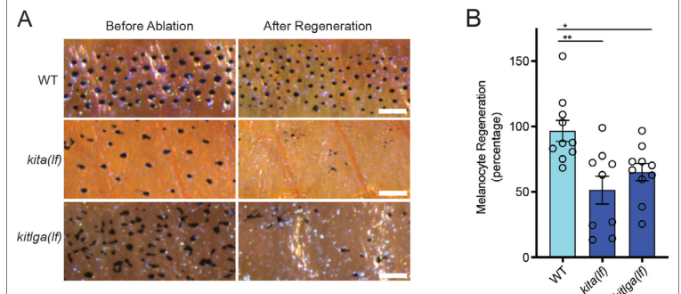

## Question

# Gene Research for Functional Annotation

## ⚠️ CRITICAL: Gene/Protein Identification Context

**BEFORE YOU BEGIN RESEARCH:** You MUST verify you are researching the CORRECT gene/protein. Gene symbols can be ambiguous, especially for less well-characterized genes from non-model organisms.

### Target Gene/Protein Identity (from UniProt):
- **UniProt Accession:** Q8JFR5
- **Protein Description:** RecName: Full=Mast/stem cell growth factor receptor kita; Short=SCFR; EC=2.7.10.1; AltName: Full=Tyrosine-protein kinase Kit; Flags: Precursor;
- **Gene Information:** Name=kita; Synonyms=kit, sparse;
- **Organism (full):** Danio rerio (Zebrafish) (Brachydanio rerio).
- **Protein Family:** Belongs to the protein kinase superfamily. Tyr protein
- **Key Domains:** Ig-like_dom. (IPR007110); Ig-like_dom_sf. (IPR036179); Ig-like_fold. (IPR013783); Ig_sub. (IPR003599); Ig_sub2. (IPR003598)

### MANDATORY VERIFICATION STEPS:

1. **Check if the gene symbol "kita" matches the protein description above**
2. **Verify the organism is correct:** Danio rerio (Zebrafish) (Brachydanio rerio).
3. **Check if protein family/domains align with what you find in literature**
4. **If you find literature for a DIFFERENT gene with the same or similar symbol, STOP**

### If Gene Symbol is Ambiguous or You Cannot Find Relevant Literature:

**DO NOT PROCEED WITH RESEARCH ON A DIFFERENT GENE.** Instead:
- State clearly: "The gene symbol 'kita' is ambiguous or literature is limited for this specific protein"
- Explain what you found (e.g., "Found extensive literature on a different gene with the same symbol in a different organism")
- Describe the protein based ONLY on the UniProt information provided above
- Suggest that the protein function can be inferred from domain/family information

### Research Target:

Please provide a comprehensive research report on the gene **kita** (gene ID: kita, UniProt: Q8JFR5) in DANRE.

The research report should be a detailed narrative explaining the function, biological processes, and localization of the gene product. Citations should be given for all claims.

You should prioritize authoritative reviews and primary scientific literature when conducting research. You can supplement
this with annotations you find in gene/protein databases, but these can be outdated or inaccurate.

We are specifically interested in the primary function of the gene - for enzymes, what reaction is catalyzed, and what is the substrate specificity? For transporters, what is the substrate? For structural proteins or adapters, what is the broader structural role? For signaling molecules, what is the role in the pathway.

We are interested in where in or outside the cell the gene product carries out its function.

We are also interested in the signaling or biochemical pathways in which the gene functions. We are less interested in broad pleiotropic effects, except where these elucidate the precise role.

Include evidence where possible. We are interested in both experimental evidence as well as inference from structure, evolution, or bioinformatic analysis. Precise studies should be prioritized over high-throughput, where available.

## Output

Question: You are an expert researcher providing comprehensive, well-cited information.

Provide detailed information focusing on:
1. Key concepts and definitions with current understanding
2. Recent developments and latest research (prioritize 2023-2024 sources)
3. Current applications and real-world implementations
4. Expert opinions and analysis from authoritative sources
5. Relevant statistics and data from recent studies

Format as a comprehensive research report with proper citations. Include URLs and publication dates where available.
Always prioritize recent, authoritative sources and provide specific citations for all major claims.

# Gene Research for Functional Annotation

## ⚠️ CRITICAL: Gene/Protein Identification Context

**BEFORE YOU BEGIN RESEARCH:** You MUST verify you are researching the CORRECT gene/protein. Gene symbols can be ambiguous, especially for less well-characterized genes from non-model organisms.

### Target Gene/Protein Identity (from UniProt):
- **UniProt Accession:** Q8JFR5
- **Protein Description:** RecName: Full=Mast/stem cell growth factor receptor kita; Short=SCFR; EC=2.7.10.1; AltName: Full=Tyrosine-protein kinase Kit; Flags: Precursor;
- **Gene Information:** Name=kita; Synonyms=kit, sparse;
- **Organism (full):** Danio rerio (Zebrafish) (Brachydanio rerio).
- **Protein Family:** Belongs to the protein kinase superfamily. Tyr protein
- **Key Domains:** Ig-like_dom. (IPR007110); Ig-like_dom_sf. (IPR036179); Ig-like_fold. (IPR013783); Ig_sub. (IPR003599); Ig_sub2. (IPR003598)

### MANDATORY VERIFICATION STEPS:

1. **Check if the gene symbol "kita" matches the protein description above**
2. **Verify the organism is correct:** Danio rerio (Zebrafish) (Brachydanio rerio).
3. **Check if protein family/domains align with what you find in literature**
4. **If you find literature for a DIFFERENT gene with the same or similar symbol, STOP**

### If Gene Symbol is Ambiguous or You Cannot Find Relevant Literature:

**DO NOT PROCEED WITH RESEARCH ON A DIFFERENT GENE.** Instead:
- State clearly: "The gene symbol 'kita' is ambiguous or literature is limited for this specific protein"
- Explain what you found (e.g., "Found extensive literature on a different gene with the same symbol in a different organism")
- Describe the protein based ONLY on the UniProt information provided above
- Suggest that the protein function can be inferred from domain/family information

### Research Target:

Please provide a comprehensive research report on the gene **kita** (gene ID: kita, UniProt: Q8JFR5) in DANRE.

The research report should be a detailed narrative explaining the function, biological processes, and localization of the gene product. Citations should be given for all claims.

You should prioritize authoritative reviews and primary scientific literature when conducting research. You can supplement
this with annotations you find in gene/protein databases, but these can be outdated or inaccurate.

We are specifically interested in the primary function of the gene - for enzymes, what reaction is catalyzed, and what is the substrate specificity? For transporters, what is the substrate? For structural proteins or adapters, what is the broader structural role? For signaling molecules, what is the role in the pathway.

We are interested in where in or outside the cell the gene product carries out its function.

We are also interested in the signaling or biochemical pathways in which the gene functions. We are less interested in broad pleiotropic effects, except where these elucidate the precise role.

Include evidence where possible. We are interested in both experimental evidence as well as inference from structure, evolution, or bioinformatic analysis. Precise studies should be prioritized over high-throughput, where available.

# Functional annotation report: zebrafish *kita* / Kita (UniProt Q8JFR5)

## Executive summary

The target is correctly identified as ***Danio rerio kita***, also called ***kit*** or ***sparse***, encoding Kita, a KIT-family receptor tyrosine kinase. It is distinct from the teleost paralog ***kitb***. The strongest experimentally established function of Kita is to receive Kit-ligand signals in melanocyte-lineage cells, promoting embryonic melanocyte migration and survival and, after injury, directing melanocyte-progenitor differentiation through RAS/MAPK signaling. Kita also mediates Kit-ligand cooperation with erythropoietin in zebrafish erythroid progenitors. Ovarian expression is well documented, but an isoform-specific ovarian mechanism remains unproven.

Q8JFR5 is therefore best annotated as a **single-pass cell-surface growth-factor receptor whose intracellular tyrosine kinase converts extracellular Kit-ligand binding into phosphotyrosine-dependent signaling**. The extracellular immunoglobulin-like domains, membrane topology, and intracellular kinase assignment agree with the supplied UniProt record and with sequence classification of zebrafish Kita as a classical receptor tyrosine kinase. No direct structure or purified-enzyme kinetic study of Q8JFR5 itself was identified.

## 1. Identity verification and paralog discrimination

The literature confirms that zebrafish have two Kit receptor genes, ***kita*** and ***kitb***, as well as two ligand genes, ***kitlga*** and ***kitlgb***, derived from teleost genome duplication. Phylogenetic and chromosomal-synteny analyses distinguish the receptor paralogs, and direct studies identify the classical *sparse* phenotype and the *kita(b5)* frameshift allele with ***kita*** rather than ***kitb***. Thus, the supplied mapping—Q8JFR5, Kita, synonyms Kit and Sparse, organism *Danio rerio*—is internally and experimentally consistent. (yao2010kitsystemin pages 10-11, frantz2023pigmentcellprogenitor pages 9-11, oltova2020zebrafishkitligands pages 9-12)

The paralogs remain substantially conserved in their intracellular machinery but have diverged extracellularly and functionally. Reported Kita–Kitb amino-acid identities are 44.6% across the extracellular region, 60.9% in the transmembrane region, 73.7% in the juxtamembrane region, 21.9% in the kinase-insert region, 100% in the catalytic loop, and 90% in the activation loop. *kita* and *kitb* contain 21 and 20 exons, respectively. This profile supports preservation of kinase chemistry alongside divergence in extracellular recognition and signaling context. (yao2010kitsystemin pages 2-3)

A critical exclusion is the 2022 sensory-axon study often retrieved under “zebrafish c-Kit.” Its cutaneous-axon/Src-family-kinase mechanism concerns **Kitb and Kitlgb**, not Kita/Q8JFR5, and should not be transferred to this annotation. (tuttle2022ckitreceptormaintains pages 1-2, tuttle2022ckitreceptormaintains pages 11-12)

## 2. Molecular function and protein architecture

### 2.1 Receptor class and localization

Kita is classified by zebrafish sequence analysis as a **classical type III receptor tyrosine kinase**. Together with the supplied UniProt annotation, this supports the following topology:

1. an N-terminal signal peptide/precursor sequence directing entry into the secretory pathway;
2. a large extracellular ligand-binding region containing immunoglobulin-like domains;
3. one transmembrane helix;
4. a cytoplasmic juxtamembrane regulatory region; and
5. an intracellular tyrosine-protein kinase domain, characteristically interrupted by a kinase insert.

The mature receptor is therefore expected to function at the **plasma membrane**, with ligand recognition outside the cell and catalytic activity in the cytosol. This topology is strongly supported by family conservation and UniProt domain annotation, but direct immunolocalization of endogenous Q8JFR5 protein was not found. Cell-specific RNA and receptor-dependent phenotypes establish relevant expressing populations—melanocytes and their progenitors, erythroid progenitors, and ovarian oocytes—more securely than they establish protein-level subcellular distribution. (yao2010kitsystemin pages 2-3, frantz2023pigmentcellprogenitor pages 7-9)

### 2.2 Catalytic reaction

The EC assignment **2.7.10.1** denotes a receptor protein-tyrosine kinase. The reaction is conceptually:

**ATP + protein-L-tyrosine → ADP + protein-L-tyrosine phosphate.**

Kit-ligand binding is expected to induce receptor dimerization or an activating rearrangement, followed by trans-autophosphorylation of cytoplasmic tyrosines. These phosphotyrosines recruit signaling proteins and propagate growth, survival, migration, or differentiation signals. Ligand-induced rapid dimerization and activation are described for the KIT class; however, ATP kinetics, catalytic constants, and site-resolved autophosphorylation have not been measured specifically for purified zebrafish Q8JFR5 in the retrieved literature. Consequently, the catalytic chemistry and activation model are high-confidence family-level inference rather than Q8JFR5-specific biochemical characterization. (yao2010kitsystemin pages 1-2, hultman2007geneduplicationof pages 8-10)

### 2.3 Substrate specificity

Kita’s immediate substrates are best understood as **the receptor itself and associated intracellular signaling proteins bearing accessible tyrosine residues**, rather than a small-molecule substrate. Exact Q8JFR5 phosphosite preferences have not been experimentally mapped. The conserved catalytic and activation loops support conventional tyrosine rather than serine/threonine kinase specificity, while the divergent kinase-insert and extracellular regions could confer paralog-specific signaling and ligand responses. (yao2010kitsystemin pages 2-3)

## 3. Ligands and pathway organization

### 3.1 Kitlga is the principal melanocyte ligand

Direct genetics establish ***kitlga*** as the principal Kita ligand in embryonic melanocyte development. *kitlga* is expressed along the medial melanocyte migration environment at approximately 18–30 hours post-fertilization and later in skin at 4–5 days post-fertilization, when Kita is needed for melanocyte survival. *kitlga* depletion reproduces Kita-dependent migration and survival defects; a low morpholino dose genetically enhances a sensitized *kita* allele; and Kitlga overexpression increases melanocyte number and size only when Kita is functional. In contrast, *kitlgb* depletion did not disrupt embryonic melanocyte migration or survival. (hultman2007geneduplicationof pages 2-3, hultman2007geneduplicationof pages 8-10, hultman2007geneduplicationof pages 10-11)

This evidence is stronger than simple co-expression: it demonstrates ligand–receptor pathway dependence in vivo. Nevertheless, it does not establish a purified binding constant or exclude Kitlgb–Kita interaction in other tissues.

### 3.2 Context-dependent use of both ligands

In erythropoiesis, both full-length Kitlga and Kitlgb can cooperate with erythropoietin, and this cooperation disappears in *kita/sparse* mutants. Soluble Kitlga was more effective than soluble Kitlgb in ex vivo kidney-marrow culture, whereas full-length Kitlgb retained activity in embryos. This suggests context dependence related to ligand processing, membrane retention, or niche presentation rather than a simple one-ligand/one-receptor rule. (oltova2020zebrafishkitligands pages 12-15, oltova2020zebrafishkitligands pages 9-12)

### 3.3 Downstream signaling

The best direct downstream assignment for **Kita itself** is the **RAS/MAPK pathway in melanocyte regeneration**. Injury increases *kitlga* expression in fibroblasts and keratinocytes, Kita is expressed by melanocyte progenitor and differentiating populations, and pathway perturbation supports MAPK-dependent Kita-mediated differentiation. Thus, local stromal Kitlga acts as a niche signal to activate membrane Kita on melanocyte-lineage cells and bias them toward differentiation. (frantz2023pigmentcellprogenitor pages 17-19, frantz2023pigmentcellprogenitor pages 9-11, frantz2023pigmentcellprogenitor pages 7-9)

## 4. Principal biological functions

### 4.1 Embryonic melanocyte migration and survival

The foundational phenotype is temporally separable. Kita is required early for melanocytes to migrate from neural-crest-associated positions toward peripheral destinations and later for their survival. *kita* null embryos retain approximately **60% of normal embryonic melanocyte numbers**, but these melanocytes remain abnormally near the neural tube and otic region, begin programmed cell death after about 4 dpf, and are absent by 12 dpf. Temperature-sensitive alleles separate a migration requirement before 2 dpf from a later survival requirement. Migration-specific lesions mapped near the putative ligand-binding region, whereas a survival-specific lesion occurred in the intracellular kinase domain, suggesting partially separable receptor functions. (hultman2007geneduplicationof pages 2-3)

The most defensible primary annotation is therefore not simply “controls pigmentation.” Kita transduces a spatially presented Kitlga signal to control **melanocyte-lineage motility, survival, and differentiation**.

### 4.2 Adult melanocyte regeneration: major recent advance

The most informative recent study is Frantz et al., published April 2023 in *eLife* (DOI/URL: https://doi.org/10.7554/eLife.78942). Single-cell RNA sequencing, ligand–receptor modeling, qRT-PCR, mutant analysis, lineage trajectories, and serial imaging showed that developmental KIT signaling is redeployed during regeneration. After neocuproine-mediated melanocyte destruction, *kitlga* rises transiently in skin while bulk *kita* changes little; fibroblasts and keratinocytes are ligand sources, and Kita is present in progenitor and differentiating melanocyte-lineage populations. (frantz2023pigmentcellprogenitor pages 7-9)

Wild-type animals restored essentially their complete stripe-melanocyte complement within two weeks. In contrast, *kita* loss-of-function fish regenerated a mean **51.4%**, with sample sizes of WT n=10 and *kita(lf)* n=9; *kitlga(lf)* animals (n=11) were similarly impaired. The direct-differentiation trajectory was absent from *kita* mutants, serial imaging revealed a **greater than eightfold reduction in direct differentiation**, and asymmetric divisions fell approximately **twofold**. These results place Kita chiefly after progenitor activation, where it promotes differentiation or survival of differentiating progeny, rather than maintaining the quiescent progenitor pool. (frantz2023pigmentcellprogenitor pages 9-11, frantz2023pigmentcellprogenitor media d8425c3a, frantz2023pigmentcellprogenitor media c355f99c)

### 4.3 Erythroid progenitor expansion

Kita is the prominent Kit receptor reported in adult erythroid progenitors. Recombinant Kitlga supports erythroid-progenitor expansion in zebrafish kidney-marrow culture and cooperates with Epo; dexamethasone further enhances expansion. In embryos, full-length Kitlga or Kitlgb cooperates with Epo to increase erythroid output at 72 hpf, but this cooperation and induction of *gata1a* and *hbbe1* are lost in *kita/sparse* mutants. These data support a role in proliferation and differentiation of erythroid progenitors. (oltova2020zebrafishkitligands pages 12-15, oltova2020zebrafishkitligands pages 9-12)

This evidence comes from a 2020 bioRxiv study (DOI/URL: https://doi.org/10.1101/2020.02.03.931634) and should be weighted below peer-reviewed primary evidence. It nevertheless includes receptor-mutant tests and is mechanistically more informative than broad expression profiling.

### 4.4 Ovary and folliculogenesis

Yao and Ge, published online 3 March 2010 in *Biology of Reproduction* (DOI/URL: https://doi.org/10.1095/biolreprod.109.082644), found all four zebrafish Kit-system genes in the ovary. *kita* was associated principally with the oocyte, whereas *kitb* was localized to surrounding follicle cells. *kita* remained comparatively stable through follicle growth and increased strongly in ovulated eggs; *kitb* rose before final maturation and became nearly undetectable after ovulation. Ligands also displayed distinct stage-dependent patterns. (yao2010kitsystemin pages 9-10, yao2010kitsystemin pages 1-2, yao2010kitsystemin pages 2-3)

These data support functional divergence and make an ovarian role plausible, but they do **not** demonstrate which ligand activates Kita in vivo, what process it controls, or whether loss of Kita alters fertility, maturation, or ovulation. Proposed roles in follicle recruitment, maturation, fertilization, or early development remain expression-based hypotheses. (yao2010kitsystemin pages 10-11)

## 5. Recent 2024 development

Ando et al., published 11 March 2024 in *Developmental Cell* (DOI/URL: https://doi.org/10.1016/j.devcel.2024.01.004), developed a screen for regeneration-associated silencer elements. Their “s1” cassette was experimentally inserted **22 kb upstream of the *kita* transcription start site** as a test of local silencing. The broader study identified 653 candidate silencer regions in one 4-day post-amputation whole-fin comparison, with candidate chromatin accessibility increasing about threefold. (ando2024ascreenfor pages 1-3, ando2024ascreenfor pages 3-5, ando2024ascreenfor pages 13-15, ando2024ascreenfor pages 25-28)

This is a useful new application of the *kita* locus in cis-regulatory engineering, but it does not revise the Kita protein’s biochemical function. It illustrates how *kita* expression can be manipulated to test regulatory-element activity and how the visibly scorable melanocyte phenotype makes this locus experimentally valuable.

## 6. Applications and translational relevance

The Kita system has several current research applications:

- **In vivo receptor signaling:** Visible melanocytes permit rapid genetic assessment of ligand–receptor signaling, migration, survival, and differentiation.
- **Regenerative biology:** *kita* mutants separate quiescent progenitor maintenance from injury-induced differentiation, providing a model for how adult stem/progenitor cells reuse developmental signals.
- **Pigmentation disease and melanoma research:** Conservation of KIT-dependent melanocyte decisions makes the model relevant to hypopigmentation, vitiligo repigmentation, and melanoma biology, although zebrafish findings are not themselves clinical evidence. (frantz2023pigmentcellprogenitor pages 17-19, frantz2023pigmentcellprogenitor pages 7-9)
- **Hematopoietic culture:** Kitlga/Epo-based kidney-marrow culture offers a tool for erythroid-progenitor expansion and experimental hematopoiesis. (oltova2020zebrafishkitligands pages 9-12)
- **Cis-regulatory screening:** The visible *kita*-dependent melanocyte phenotype and upstream locus engineering provide sensitive readouts of regulatory-element function. (ando2024ascreenfor pages 13-15)

No approved real-world therapy specifically targets zebrafish Kita. Pharmacological extrapolation must also account for paralog partitioning: a drug affecting mammalian KIT may inhibit both zebrafish Kita and Kitb or additional kinases.

## 7. Evidence map

The following table summarizes the annotation and explicitly separates direct zebrafish evidence from conserved-family inference.

| Annotation topic | Best-supported conclusion | Evidence type | Key quantitative observation | Principal source/year |
|---|---|---|---|---|
| Identity versus *kitb* | Q8JFR5 corresponds to zebrafish *kita*—synonyms *kit* and *sparse*—a KIT co-ortholog distinct from *kitb*. The *kita(b5)* allele contains a frameshift and premature stop, while *kitb* has distinct expression and functions. | Direct zebrafish genetics and expression; accession mapping supplied by UniProt | Kita and Kitb share 44.6% extracellular-domain identity, 60.9% transmembrane-domain identity, 100% catalytic-loop identity, and 90% activation-loop identity. | Yao and Ge, 2010; Frantz et al., 2023 (yao2010kitsystemin pages 2-3, frantz2023pigmentcellprogenitor pages 9-11) |
| Molecular class, domains, and topology | Kita is a classical type III receptor tyrosine kinase. The Q8JFR5 annotation supports a precursor with extracellular immunoglobulin-like domains, one transmembrane segment, and an intracellular tyrosine-kinase region. | Zebrafish sequence classification plus conserved-family and UniProt inference; no direct Q8JFR5 structural study identified | *kita* contains 21 exons; conservation with Kitb is highest in the catalytic and activation loops. | Yao and Ge, 2010 (yao2010kitsystemin pages 2-3) |
| Ligand specificity | Kitlga is the principal Kita ligand for embryonic melanocyte migration and survival: *kitlga* depletion phenocopies *kita* loss, and Kitlga-induced hyperpigmentation requires Kita. Both Kitlga and Kitlgb can act through Kita during erythroid expansion. | Direct zebrafish knockdown, genetic-interaction, overexpression, and receptor-mutant evidence | *kitlga* is expressed along the medial migration route at 18–30 hpf and in skin at 4–5 dpf; *kitlb* depletion did not disrupt embryonic melanocytes. | Hultman et al., 2007; Oltova et al., 2020 (hultman2007geneduplicationof pages 2-3, hultman2007geneduplicationof pages 8-10, oltova2020zebrafishkitligands pages 9-12) |
| Catalytic and pathway mechanism | Ligand binding is expected to induce receptor dimerization or rearrangement, kinase activation, ATP-dependent tyrosine phosphorylation, and phosphotyrosine-mediated signaling. Direct zebrafish experiments place RAS/MAPK downstream of Kita during melanocyte regeneration. | Catalytic chemistry and dimerization are conserved-family inference; the RAS/MAPK requirement is direct zebrafish evidence | Kita loss caused a greater than eightfold reduction in direct differentiation and a twofold reduction in asymmetric divisions during regeneration. | Yao and Ge, 2010; Frantz et al., 2023 (yao2010kitsystemin pages 1-2, frantz2023pigmentcellprogenitor pages 9-11) |
| Melanocyte development | Kita promotes early migration of neural-crest-derived melanocytes and their later survival. Temperature-sensitive genetics indicate that these requirements are temporally separable. | Direct zebrafish mutant and temperature-sensitive-allele evidence | *kita* null embryos retain about 60% of normal embryonic melanocytes; these cells migrate abnormally, die after 4 dpf, and are absent by 12 dpf. | Hultman et al., 2007, summarizing foundational *sparse* genetics (hultman2007geneduplicationof pages 2-3) |
| Melanocyte regeneration | Injury increases stromal *kitlga*, while Kita on progenitors promotes direct differentiation and contributes to asymmetric division through MAPK signaling. The strongest requirement occurs after progenitor activation. | Direct zebrafish scRNA-seq, qRT-PCR, mutant analysis, trajectory analysis, and serial imaging | Wild type restored essentially all stripe melanocytes within two weeks; *kita* mutants regenerated a mean 51.4%. Sample sizes were WT n=10, *kita* n=9, and *kitlga* n=11. | Frantz et al., 2023 (frantz2023pigmentcellprogenitor pages 9-11, frantz2023pigmentcellprogenitor pages 7-9, frantz2023pigmentcellprogenitor media d8425c3a) |
| Erythropoiesis | Kita is the prominent Kit receptor in adult erythroid progenitors and is required for Kitlga and Kitlgb cooperation with erythropoietin. Kitlga also supports ex vivo kidney-marrow erythroid-progenitor expansion. | Direct zebrafish expression, culture, mRNA-injection, and *sparse* mutant evidence; reported in a preprint | At 72 hpf, Epo-plus-Kit-ligand erythroid expansion and induction of *gata1a* and *hbbe1* were lost in *kita* mutants. | Oltova et al., 2020 (oltova2020zebrafishkitligands pages 12-15, oltova2020zebrafishkitligands pages 9-12) |
| Ovary | *kita* is expressed principally in oocytes and changes during folliculogenesis, consistent with an ovarian role. Physiological necessity and isoform-specific receptor–ligand pairing were not established. | Direct zebrafish expression and cellular-localization evidence; proposed function remains inferential | *kita* remained relatively stable through follicle growth and then rose markedly in ovulated eggs; *kitb* was nearly undetectable after ovulation. | Yao and Ge, 2010 (yao2010kitsystemin pages 9-10, yao2010kitsystemin pages 1-2, yao2010kitsystemin pages 10-11) |
| Cellular localization | Mature Kita is expected at the plasma membrane, with Ig-like ligand-binding domains extracellular and the kinase domain cytosolic. Relevant expressing cells include melanocytes and their progenitors, erythroid progenitors, and oocytes; direct Q8JFR5 protein-localization imaging was not identified. | Conserved topology and supplied UniProt annotation, supported indirectly by cell-specific RNA and receptor-dependent phenotypes | Wild-type scRNA-seq included 1,840 MP-0, 1,408 MP-1, 777 cycling-differentiation, 535 direct-differentiation, and 1,060 melanocyte cells assessed for *kita* expression. | Frantz et al., 2023 (frantz2023pigmentcellprogenitor pages 9-11, frantz2023pigmentcellprogenitor pages 7-9) |
| Exclusion of sensory-axon findings | The cutaneous sensory-axon maintenance and Src-family-kinase phenotype belongs to Kitb with Kitlgb, not Kita/Q8JFR5, and must not be assigned to *kita*. | Direct paralog-specific zebrafish evidence; explicit exclusion | No Kita-specific sensory-axon statistic is applicable; the study manipulated *kitb* phosphosites and *kitlgb*. | Tuttle et al., 2022 (tuttle2022ckitreceptormaintains pages 1-2, tuttle2022ckitreceptormaintains pages 11-12) |

*Table: Compact evidence map for Danio rerio Kita/Q8JFR5 that separates direct zebrafish findings from conserved KIT-family inference. It also prevents misannotation of the paralog-specific Kitb sensory-axon phenotype.*

## 8. Confidence assessment and unresolved questions

**High-confidence annotations** are: identity as *kita/sparse* rather than *kitb*; type III receptor-tyrosine-kinase class; plasma-membrane signaling topology; Kitlga-dependent embryonic melanocyte migration and survival; RAS/MAPK-dependent melanocyte-progenitor differentiation during regeneration; and Kita dependence of Kit-ligand/Epo erythroid cooperation.

**Moderate-confidence annotations** include use of Kitlgb by Kita outside embryonic melanocytes and a physiological role in ovarian folliculogenesis. The former is supported by receptor-mutant erythroid assays but lacks purified binding measurements; the latter is supported mainly by expression patterns.

**Key gaps** are direct structural analysis of Q8JFR5, endogenous protein-localization imaging, quantitative Kitlga/Kitlgb binding affinities, a complete Q8JFR5 phosphosite and interactome map, purified kinase kinetics, and isoform-specific ovarian loss-of-function experiments.

## Conclusion

Kita/Q8JFR5 is best functionally annotated as a **cell-surface Kit-ligand receptor tyrosine kinase that couples extracellular niche signals to intracellular phosphorylation pathways, especially RAS/MAPK, to regulate melanocyte migration, survival, and injury-induced differentiation**. Its most precisely demonstrated in vivo partnership is Kitlga–Kita in the melanocyte lineage. It additionally supports erythroid progenitor expansion in cooperation with erythropoietin. Ovarian expression and other broad pleiotropic observations should remain secondary annotations until isoform-specific functional tests are available.

References

1. (yao2010kitsystemin pages 10-11): Kai Yao and Wei Ge. Kit system in the zebrafish ovary: evidence for functional divergence of two isoforms of kit (kita and kitb) and kit ligand (kitlga and kitlgb) during folliculogenesis1. Jun 2010. URL: https://doi.org/10.1095/biolreprod.109.082644, doi:10.1095/biolreprod.109.082644. This article has 23 citations and is from a peer-reviewed journal.

2. (frantz2023pigmentcellprogenitor pages 9-11): William Tyler Frantz, Sharanya Iyengar, James Neiswender, Alyssa Cousineau, René Maehr, and Craig J Ceol. Pigment cell progenitor heterogeneity and reiteration of developmental signaling underlie melanocyte regeneration in zebrafish. eLife, Apr 2023. URL: https://doi.org/10.7554/elife.78942, doi:10.7554/elife.78942. This article has 12 citations and is from a domain leading peer-reviewed journal.

3. (oltova2020zebrafishkitligands pages 9-12): Jana Oltova, Ondrej Svoboda, Olga Machonova, Petra Svatonova, David Traver, Michal Kolar, and Petr Bartunek. Zebrafish kit ligands cooperate with erythropoietin to promote erythroid cell expansion. bioRxiv, Feb 2020. URL: https://doi.org/10.1101/2020.02.03.931634, doi:10.1101/2020.02.03.931634. This article has 9 citations.

4. (yao2010kitsystemin pages 2-3): Kai Yao and Wei Ge. Kit system in the zebrafish ovary: evidence for functional divergence of two isoforms of kit (kita and kitb) and kit ligand (kitlga and kitlgb) during folliculogenesis1. Jun 2010. URL: https://doi.org/10.1095/biolreprod.109.082644, doi:10.1095/biolreprod.109.082644. This article has 23 citations and is from a peer-reviewed journal.

5. (tuttle2022ckitreceptormaintains pages 1-2): Adam M. Tuttle, Matthew B. Pomaville, Katherine C. Delgado, Kevin M. Wright, and Alex V. Nechiporuk. C-kit receptor maintains sensory axon innervation of the skin through src family kinases. The Journal of Neuroscience, 42:6835-6847, Jul 2022. URL: https://doi.org/10.1523/jneurosci.0618-22.2022, doi:10.1523/jneurosci.0618-22.2022. This article has 3 citations.

6. (tuttle2022ckitreceptormaintains pages 11-12): Adam M. Tuttle, Matthew B. Pomaville, Katherine C. Delgado, Kevin M. Wright, and Alex V. Nechiporuk. C-kit receptor maintains sensory axon innervation of the skin through src family kinases. The Journal of Neuroscience, 42:6835-6847, Jul 2022. URL: https://doi.org/10.1523/jneurosci.0618-22.2022, doi:10.1523/jneurosci.0618-22.2022. This article has 3 citations.

7. (frantz2023pigmentcellprogenitor pages 7-9): William Tyler Frantz, Sharanya Iyengar, James Neiswender, Alyssa Cousineau, René Maehr, and Craig J Ceol. Pigment cell progenitor heterogeneity and reiteration of developmental signaling underlie melanocyte regeneration in zebrafish. eLife, Apr 2023. URL: https://doi.org/10.7554/elife.78942, doi:10.7554/elife.78942. This article has 12 citations and is from a domain leading peer-reviewed journal.

8. (yao2010kitsystemin pages 1-2): Kai Yao and Wei Ge. Kit system in the zebrafish ovary: evidence for functional divergence of two isoforms of kit (kita and kitb) and kit ligand (kitlga and kitlgb) during folliculogenesis1. Jun 2010. URL: https://doi.org/10.1095/biolreprod.109.082644, doi:10.1095/biolreprod.109.082644. This article has 23 citations and is from a peer-reviewed journal.

9. (hultman2007geneduplicationof pages 8-10): Keith A Hultman, Nathan Bahary, Leonard I Zon, and Stephen L Johnson. Gene duplication of the zebrafish kit ligand and partitioning of melanocyte development functions to kit ligand a. PLoS Genetics, 3:e17, Jan 2007. URL: https://doi.org/10.1371/journal.pgen.0030017, doi:10.1371/journal.pgen.0030017. This article has 125 citations and is from a domain leading peer-reviewed journal.

10. (hultman2007geneduplicationof pages 2-3): Keith A Hultman, Nathan Bahary, Leonard I Zon, and Stephen L Johnson. Gene duplication of the zebrafish kit ligand and partitioning of melanocyte development functions to kit ligand a. PLoS Genetics, 3:e17, Jan 2007. URL: https://doi.org/10.1371/journal.pgen.0030017, doi:10.1371/journal.pgen.0030017. This article has 125 citations and is from a domain leading peer-reviewed journal.

11. (hultman2007geneduplicationof pages 10-11): Keith A Hultman, Nathan Bahary, Leonard I Zon, and Stephen L Johnson. Gene duplication of the zebrafish kit ligand and partitioning of melanocyte development functions to kit ligand a. PLoS Genetics, 3:e17, Jan 2007. URL: https://doi.org/10.1371/journal.pgen.0030017, doi:10.1371/journal.pgen.0030017. This article has 125 citations and is from a domain leading peer-reviewed journal.

12. (oltova2020zebrafishkitligands pages 12-15): Jana Oltova, Ondrej Svoboda, Olga Machonova, Petra Svatonova, David Traver, Michal Kolar, and Petr Bartunek. Zebrafish kit ligands cooperate with erythropoietin to promote erythroid cell expansion. bioRxiv, Feb 2020. URL: https://doi.org/10.1101/2020.02.03.931634, doi:10.1101/2020.02.03.931634. This article has 9 citations.

13. (frantz2023pigmentcellprogenitor pages 17-19): William Tyler Frantz, Sharanya Iyengar, James Neiswender, Alyssa Cousineau, René Maehr, and Craig J Ceol. Pigment cell progenitor heterogeneity and reiteration of developmental signaling underlie melanocyte regeneration in zebrafish. eLife, Apr 2023. URL: https://doi.org/10.7554/elife.78942, doi:10.7554/elife.78942. This article has 12 citations and is from a domain leading peer-reviewed journal.

14. (frantz2023pigmentcellprogenitor media d8425c3a): William Tyler Frantz, Sharanya Iyengar, James Neiswender, Alyssa Cousineau, René Maehr, and Craig J Ceol. Pigment cell progenitor heterogeneity and reiteration of developmental signaling underlie melanocyte regeneration in zebrafish. eLife, Apr 2023. URL: https://doi.org/10.7554/elife.78942, doi:10.7554/elife.78942. This article has 12 citations and is from a domain leading peer-reviewed journal.

15. (frantz2023pigmentcellprogenitor media c355f99c): William Tyler Frantz, Sharanya Iyengar, James Neiswender, Alyssa Cousineau, René Maehr, and Craig J Ceol. Pigment cell progenitor heterogeneity and reiteration of developmental signaling underlie melanocyte regeneration in zebrafish. eLife, Apr 2023. URL: https://doi.org/10.7554/elife.78942, doi:10.7554/elife.78942. This article has 12 citations and is from a domain leading peer-reviewed journal.

16. (yao2010kitsystemin pages 9-10): Kai Yao and Wei Ge. Kit system in the zebrafish ovary: evidence for functional divergence of two isoforms of kit (kita and kitb) and kit ligand (kitlga and kitlgb) during folliculogenesis1. Jun 2010. URL: https://doi.org/10.1095/biolreprod.109.082644, doi:10.1095/biolreprod.109.082644. This article has 23 citations and is from a peer-reviewed journal.

17. (ando2024ascreenfor pages 1-3): Kazunori Ando, Jianhong Ou, John D. Thompson, John Welsby, Sushant Bangru, Jingwen Shen, Xiaolin Wei, Yarui Diao, and Kenneth D. Poss. A screen for regeneration-associated silencer regulatory elements in zebrafish. Developmental Cell, 59:676-691.e5, Mar 2024. URL: https://doi.org/10.1016/j.devcel.2024.01.004, doi:10.1016/j.devcel.2024.01.004. This article has 11 citations and is from a highest quality peer-reviewed journal.

18. (ando2024ascreenfor pages 3-5): Kazunori Ando, Jianhong Ou, John D. Thompson, John Welsby, Sushant Bangru, Jingwen Shen, Xiaolin Wei, Yarui Diao, and Kenneth D. Poss. A screen for regeneration-associated silencer regulatory elements in zebrafish. Developmental Cell, 59:676-691.e5, Mar 2024. URL: https://doi.org/10.1016/j.devcel.2024.01.004, doi:10.1016/j.devcel.2024.01.004. This article has 11 citations and is from a highest quality peer-reviewed journal.

19. (ando2024ascreenfor pages 13-15): Kazunori Ando, Jianhong Ou, John D. Thompson, John Welsby, Sushant Bangru, Jingwen Shen, Xiaolin Wei, Yarui Diao, and Kenneth D. Poss. A screen for regeneration-associated silencer regulatory elements in zebrafish. Developmental Cell, 59:676-691.e5, Mar 2024. URL: https://doi.org/10.1016/j.devcel.2024.01.004, doi:10.1016/j.devcel.2024.01.004. This article has 11 citations and is from a highest quality peer-reviewed journal.

20. (ando2024ascreenfor pages 25-28): Kazunori Ando, Jianhong Ou, John D. Thompson, John Welsby, Sushant Bangru, Jingwen Shen, Xiaolin Wei, Yarui Diao, and Kenneth D. Poss. A screen for regeneration-associated silencer regulatory elements in zebrafish. Developmental Cell, 59:676-691.e5, Mar 2024. URL: https://doi.org/10.1016/j.devcel.2024.01.004, doi:10.1016/j.devcel.2024.01.004. This article has 11 citations and is from a highest quality peer-reviewed journal.

## Artifacts

- [Edison artifact artifact-00](kita-deep-research-falcon_artifacts/artifact-00.md)

## Citations

1. yao2010kitsystemin pages 2-3
2. hultman2007geneduplicationof pages 2-3
3. frantz2023pigmentcellprogenitor pages 7-9
4. yao2010kitsystemin pages 10-11
5. oltova2020zebrafishkitligands pages 9-12
6. ando2024ascreenfor pages 13-15
7. frantz2023pigmentcellprogenitor pages 9-11
8. tuttle2022ckitreceptormaintains pages 1-2
9. tuttle2022ckitreceptormaintains pages 11-12
10. yao2010kitsystemin pages 1-2
11. hultman2007geneduplicationof pages 8-10
12. hultman2007geneduplicationof pages 10-11
13. oltova2020zebrafishkitligands pages 12-15
14. frantz2023pigmentcellprogenitor pages 17-19
15. yao2010kitsystemin pages 9-10
16. ando2024ascreenfor pages 1-3
17. ando2024ascreenfor pages 3-5
18. ando2024ascreenfor pages 25-28
19. https://doi.org/10.7554/eLife.78942
20. https://doi.org/10.1101/2020.02.03.931634
21. https://doi.org/10.1095/biolreprod.109.082644
22. https://doi.org/10.1016/j.devcel.2024.01.004
23. https://doi.org/10.1095/biolreprod.109.082644,
24. https://doi.org/10.7554/elife.78942,
25. https://doi.org/10.1101/2020.02.03.931634,
26. https://doi.org/10.1523/jneurosci.0618-22.2022,
27. https://doi.org/10.1371/journal.pgen.0030017,
28. https://doi.org/10.1016/j.devcel.2024.01.004,