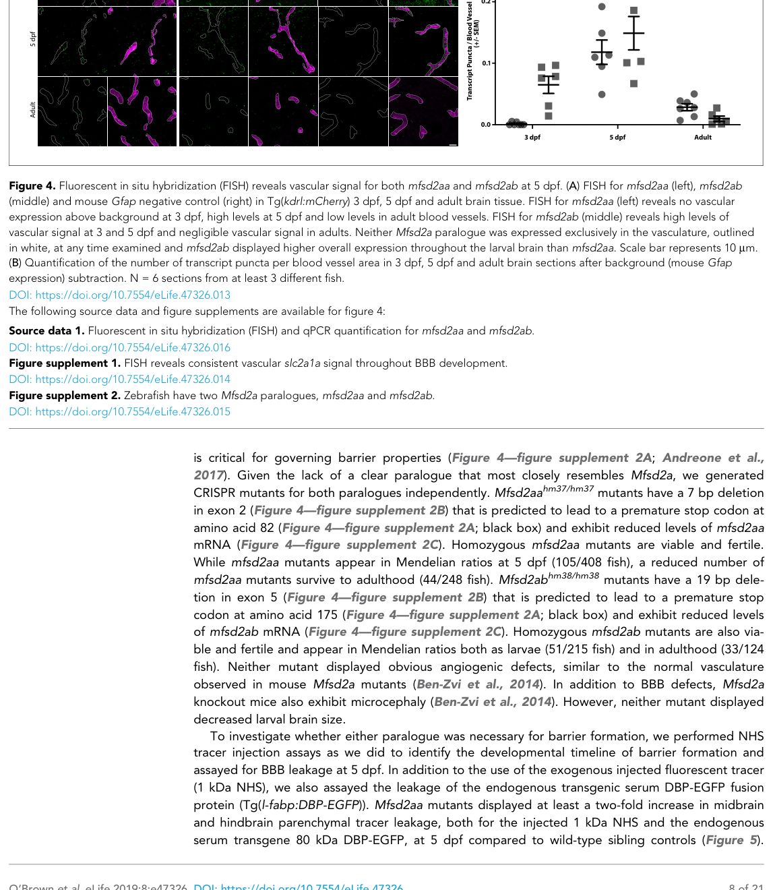

## Question

# Gene Research for Functional Annotation

## ⚠️ CRITICAL: Gene/Protein Identification Context

**BEFORE YOU BEGIN RESEARCH:** You MUST verify you are researching the CORRECT gene/protein. Gene symbols can be ambiguous, especially for less well-characterized genes from non-model organisms.

### Target Gene/Protein Identity (from UniProt):
- **UniProt Accession:** Q5U3U7
- **Protein Description:** RecName: Full=Sodium-dependent lysophosphatidylcholine symporter 1-A; Short=NLS1-A; Short=Sodium-dependent LPC symporter 1-A; AltName: Full=Major facilitator superfamily domain-containing protein 2A-A;
- **Gene Information:** Name=mfsd2aa; Synonyms=mfsd2a, nls1a; ORFNames=zgc:101615;
- **Organism (full):** Danio rerio (Zebrafish) (Brachydanio rerio).
- **Protein Family:** Belongs to the major facilitator superfamily.
- **Key Domains:** MFS_2. (IPR039672); MFS_trans_sf. (IPR036259); MFS_2 (PF13347)

### MANDATORY VERIFICATION STEPS:

1. **Check if the gene symbol "mfsd2aa" matches the protein description above**
2. **Verify the organism is correct:** Danio rerio (Zebrafish) (Brachydanio rerio).
3. **Check if protein family/domains align with what you find in literature**
4. **If you find literature for a DIFFERENT gene with the same or similar symbol, STOP**

### If Gene Symbol is Ambiguous or You Cannot Find Relevant Literature:

**DO NOT PROCEED WITH RESEARCH ON A DIFFERENT GENE.** Instead:
- State clearly: "The gene symbol 'mfsd2aa' is ambiguous or literature is limited for this specific protein"
- Explain what you found (e.g., "Found extensive literature on a different gene with the same symbol in a different organism")
- Describe the protein based ONLY on the UniProt information provided above
- Suggest that the protein function can be inferred from domain/family information

### Research Target:

Please provide a comprehensive research report on the gene **mfsd2aa** (gene ID: mfsd2aa, UniProt: Q5U3U7) in DANRE.

The research report should be a detailed narrative explaining the function, biological processes, and localization of the gene product. Citations should be given for all claims.

You should prioritize authoritative reviews and primary scientific literature when conducting research. You can supplement
this with annotations you find in gene/protein databases, but these can be outdated or inaccurate.

We are specifically interested in the primary function of the gene - for enzymes, what reaction is catalyzed, and what is the substrate specificity? For transporters, what is the substrate? For structural proteins or adapters, what is the broader structural role? For signaling molecules, what is the role in the pathway.

We are interested in where in or outside the cell the gene product carries out its function.

We are also interested in the signaling or biochemical pathways in which the gene functions. We are less interested in broad pleiotropic effects, except where these elucidate the precise role.

Include evidence where possible. We are interested in both experimental evidence as well as inference from structure, evolution, or bioinformatic analysis. Precise studies should be prioritized over high-throughput, where available.

## Output

Question: You are an expert researcher providing comprehensive, well-cited information.

Provide detailed information focusing on:
1. Key concepts and definitions with current understanding
2. Recent developments and latest research (prioritize 2023-2024 sources)
3. Current applications and real-world implementations
4. Expert opinions and analysis from authoritative sources
5. Relevant statistics and data from recent studies

Format as a comprehensive research report with proper citations. Include URLs and publication dates where available.
Always prioritize recent, authoritative sources and provide specific citations for all major claims.

# Gene Research for Functional Annotation

## ⚠️ CRITICAL: Gene/Protein Identification Context

**BEFORE YOU BEGIN RESEARCH:** You MUST verify you are researching the CORRECT gene/protein. Gene symbols can be ambiguous, especially for less well-characterized genes from non-model organisms.

### Target Gene/Protein Identity (from UniProt):
- **UniProt Accession:** Q5U3U7
- **Protein Description:** RecName: Full=Sodium-dependent lysophosphatidylcholine symporter 1-A; Short=NLS1-A; Short=Sodium-dependent LPC symporter 1-A; AltName: Full=Major facilitator superfamily domain-containing protein 2A-A;
- **Gene Information:** Name=mfsd2aa; Synonyms=mfsd2a, nls1a; ORFNames=zgc:101615;
- **Organism (full):** Danio rerio (Zebrafish) (Brachydanio rerio).
- **Protein Family:** Belongs to the major facilitator superfamily.
- **Key Domains:** MFS_2. (IPR039672); MFS_trans_sf. (IPR036259); MFS_2 (PF13347)

### MANDATORY VERIFICATION STEPS:

1. **Check if the gene symbol "mfsd2aa" matches the protein description above**
2. **Verify the organism is correct:** Danio rerio (Zebrafish) (Brachydanio rerio).
3. **Check if protein family/domains align with what you find in literature**
4. **If you find literature for a DIFFERENT gene with the same or similar symbol, STOP**

### If Gene Symbol is Ambiguous or You Cannot Find Relevant Literature:

**DO NOT PROCEED WITH RESEARCH ON A DIFFERENT GENE.** Instead:
- State clearly: "The gene symbol 'mfsd2aa' is ambiguous or literature is limited for this specific protein"
- Explain what you found (e.g., "Found extensive literature on a different gene with the same symbol in a different organism")
- Describe the protein based ONLY on the UniProt information provided above
- Suggest that the protein function can be inferred from domain/family information

### Research Target:

Please provide a comprehensive research report on the gene **mfsd2aa** (gene ID: mfsd2aa, UniProt: Q5U3U7) in DANRE.

The research report should be a detailed narrative explaining the function, biological processes, and localization of the gene product. Citations should be given for all claims.

You should prioritize authoritative reviews and primary scientific literature when conducting research. You can supplement
this with annotations you find in gene/protein databases, but these can be outdated or inaccurate.

We are specifically interested in the primary function of the gene - for enzymes, what reaction is catalyzed, and what is the substrate specificity? For transporters, what is the substrate? For structural proteins or adapters, what is the broader structural role? For signaling molecules, what is the role in the pathway.

We are interested in where in or outside the cell the gene product carries out its function.

We are also interested in the signaling or biochemical pathways in which the gene functions. We are less interested in broad pleiotropic effects, except where these elucidate the precise role.

Include evidence where possible. We are interested in both experimental evidence as well as inference from structure, evolution, or bioinformatic analysis. Precise studies should be prioritized over high-throughput, where available.

## Research Report: Functional Annotation of **mfsd2aa** (UniProt Q5U3U7) in *Danio rerio* (zebrafish)

### Executive summary
*mfsd2aa* encodes a vertebrate major facilitator superfamily (MFS) membrane transporter orthologous to mammalian **MFSD2A**, best known for (i) **sodium-dependent transport (symport) of lysophosphatidylcholine (LPC)–linked fatty acids** (notably omega-3 DHA) and (ii) **suppression of endothelial transcytosis**, a key mechanism for establishing/maintaining blood–brain barrier (BBB) integrity. In zebrafish, direct genetic evidence shows **mfsd2aa (not mfsd2ab)** is required to suppress brain endothelial transcytosis and maintain a tight BBB, with developmental upregulation in cerebral vessels coinciding with BBB maturation at ~5 days post fertilization (dpf). (o’brown2019suppressionoftranscytosis pages 8-10, o’brown2019suppressionoftranscytosis pages 7-8, o’brown2019suppressionoftranscytosis pages 12-12, o’brown2019suppressionoftranscytosis pages 12-13)

### 1. Target identity verification and disambiguation
**Target provided:** UniProt **Q5U3U7**, *Danio rerio* protein “Sodium-dependent lysophosphatidylcholine symporter 1-A / MFSD2A-A”, gene **mfsd2aa** (synonyms **mfsd2a, nls1a**), MFS family transporter with MFS_2/MFS_trans_sf domains.

**Zebrafish paralogy:** Zebrafish has two *mfsd2a* paralogues, **mfsd2aa** and **mfsd2ab**, which are not functionally redundant for BBB barrier properties: **mfsd2aa mutants** show BBB leakage and increased vesicular trafficking, while **mfsd2ab mutants** do not show the vesicle-density phenotype and are concluded not to play the conserved BBB role. (o’brown2019suppressionoftranscytosis pages 12-12, o’brown2019suppressionoftranscytosis pages 12-13)

**Important scope note:** Multiple recent mechanistic/structural studies use **Danio rerio Mfsd2a protein (drMfsd2a)** and demonstrate Na+-coupled LPC-flipping transport, but those studies typically refer to “drMfsd2a” without mapping to *mfsd2aa* vs *mfsd2ab*. Therefore, the most **paralog-specific** functional claims in zebrafish herein are anchored to genetic/expression work explicitly labeling *mfsd2aa*. (o’brown2019suppressionoftranscytosis pages 8-10, o’brown2019suppressionoftranscytosis pages 12-12, o’brown2019suppressionoftranscytosis pages 12-13)

### 2. Key concepts and definitions (current understanding)
#### 2.1 What is MFSD2A/Mfsd2a?
MFSD2A/Mfsd2a is an **MFS transporter** (12 transmembrane helices in two 6-helix bundles) enriched in barrier endothelia (BBB/BRB) and coupled to **Na+** to drive lipid-lysophospholipid transport. (bergman2023substratebindinginducedconformational pages 1-2, sengottuvel2023deficiencyinthe pages 1-2)

#### 2.2 Substrate and “LPC symporter” concept
In vertebrates, MFSD2A mediates uptake of **omega-3 fatty acids (especially DHA)** when esterified to **LPC** (e.g., **LPC-DHA**), and is described as **Na+-dependent**. (chua2023mfsd2autilizesa pages 1-2, sengottuvel2023deficiencyinthe pages 1-2)

A key modern conceptual advance is that MFSD2A behaves like a **lysolipid flippase** (a transporter that translocates a lysolipid from the **outer** to **inner** leaflet), rather than a classical soluble-substrate carrier. (chua2023mfsd2autilizesa pages 1-2, nguyen2023lipidflippingin pages 1-3)

#### 2.3 Transcytosis suppression and BBB integrity
BBB permeability can arise from (i) leaky tight junctions or (ii) **excess vesicular trafficking (transcytosis)** across endothelial cells. In zebrafish, BBB maturation is strongly associated with a developmental **suppression of endothelial transcytosis** (vesicle density dropping from 3 to 5 dpf), and *mfsd2aa* is required for that suppression. (o’brown2019suppressionoftranscytosis pages 7-8, o’brown2019suppressionoftranscytosis pages 11-12)

### 3. Molecular function of zebrafish **mfsd2aa**: substrate specificity and mechanism
#### 3.1 Transported substrate(s): lysophospholipids carrying long-chain unsaturated fatty acids
Recent primary mechanistic work on MFSD2A/Mfsd2a supports that the physiologically central substrates are **LPC species carrying long-chain unsaturated fatty acids** such as **DHA (22:6)** and **α-linolenic acid (ALA, 18:3)** (and also oleate, 18:1) attached to the LPC headgroup. (nguyen2023lipidflippingin pages 1-3, nguyen2023lipidflippingin pages 3-4)

#### 3.2 Sodium dependence and coupling
Direct biochemical reconstitution experiments show Mfsd2a-mediated lysolipid flipping occurs **in a sodium-dependent manner**. In a proteoliposome flipping assay, sodium dependence was supported by (i) NaCl increasing activity, (ii) monensin (Na+ ionophore) abolishing activity, and (iii) sodium-binding site mutants reducing activity; an **in vitro Na+ Km ~22 mM** was reported. (chua2023mfsd2autilizesa pages 3-4)

#### 3.3 Mechanistic model: trap-and-flip / flippase-like transport
Three complementary 2023 mechanistic lines converge on a “**trap-and-flip**” model:

* **Biochemical proof of flippase activity (PNAS 2023):** Mfsd2a was shown to flip lysolipids from the outer to inner leaflet in a Na+-dependent manner, providing direct evidence for a flippase mechanism. Substrate preferences included a requirement for a **zwitterionic headgroup** and an acyl chain **≥14 carbons**; reported apparent Km values include **~3 μM** for LPC-16:1-NBD and **244 μM** for LPC-12:0-NBD, supporting the chain-length requirement. (chua2023mfsd2autilizesa pages 1-2, chua2023mfsd2autilizesa pages 2-3)

* **MD + cryo-EM-guided model (Nat Commun 2023):** simulations suggest substrates enter laterally from the membrane outer leaflet; the **headgroup engages Na+-bridged interactions** (with a conserved acidic residue), triggering a transition to an occluded state consistent with trap-and-flip. (bergman2023substratebindinginducedconformational pages 1-2)

* **Zebrafish structural snapshots (bioRxiv 2023):** five cryo-EM structures of **Danio rerio Mfsd2a** captured multiple ALA-LPC positions along a translocation route consistent with stepwise flipping; Mfsd2a is described as **ATP-independent** and **Na+-dependent**. Mutational analysis identified residues whose substitution abolished or reduced transport. (nguyen2023lipidflippingin pages 3-4, nguyen2023lipidflippingin pages 18-20)

**Inference for mfsd2aa:** While the above mechanistic studies strongly establish MFSD2A/Mfsd2a’s biochemical transport function, the paralog-specific mapping to UniProt Q5U3U7 (*mfsd2aa*) is best treated as **orthology-supported** rather than directly proven in those studies. (o’brown2019suppressionoftranscytosis pages 8-10, nguyen2023lipidflippingin pages 3-4)

### 4. Expression, localization, and pathways in zebrafish
#### 4.1 Developmental vascular expression: mfsd2aa vs mfsd2ab
In zebrafish brain vasculature, fluorescent in situ hybridization showed **mfsd2aa** vascular signal is **low/undetectable at 3 dpf** but **higher at 5 dpf**, while **mfsd2ab** is **high at both 3 and 5 dpf** (and both are low in adult vessels). Neither paralogue is exclusively vascular, indicating expression beyond endothelium. (o’brown2019suppressionoftranscytosis pages 7-8, o’brown2019suppressionoftranscytosis pages 8-10, o’brown2019suppressionoftranscytosis media 640df88c)

The timing of increased *mfsd2aa* vascular expression aligns with the developmental switch to lower transcytosis and functional barrier properties. (o’brown2019suppressionoftranscytosis pages 7-8)

#### 4.2 Cellular/subcellular localization (functional inference)
The zebrafish BBB phenotype and TEM findings indicate the key site of action for *mfsd2aa* in this context is **brain endothelial cells**, where it regulates vesicular trafficking/transcytosis. (o’brown2019suppressionoftranscytosis pages 12-13, o’brown2019suppressionoftranscytosis pages 11-12)

From ortholog literature, MFSD2A/Mfsd2a is generally described as a transporter enriched in barrier endothelium and functioning at the **plasma membrane**. For example, liver work reports basolateral plasma-membrane localization when overexpressed in hepatocytes, consistent with blood-facing uptake. (chin2023bloodderivedlysophospholipidsustains pages 1-2)

### 5. Zebrafish phenotypes and functional evidence (direct)
#### 5.1 BBB permeability phenotypes in mfsd2aa mutants
In *mfsd2aa* CRISPR mutants (e.g., predicted early stop at aa82), BBB permeability assays at **5 dpf** showed **≥2-fold increased** parenchymal tracer leakage (e.g., 1 kDa NHS tracer; also leakage of endogenous ~80 kDa DBP-EGFP serum protein) in midbrain and hindbrain compared with wild-type. (o’brown2019suppressionoftranscytosis pages 8-10, o’brown2019suppressionoftranscytosis media 640df88c)

Time-lapse imaging further showed that at 5 dpf, when siblings have a sealed BBB, *mfsd2aa* mutants show continued diffuse tracer leakage similar to earlier leaky developmental stages, consistent with failure to suppress transcytosis. (o’brown2019suppressionoftranscytosis pages 12-13, o’brown2019suppressionoftranscytosis pages 11-12)

#### 5.2 Ultrastructural mechanism: elevated endothelial transcytosis
TEM analyses showed BBB maturation correlates with a major reduction in endothelial vesicle density from 3 to 5 dpf: **0.21 ± 0.03** (luminal) and **0.17 ± 0.02** (abluminal) vesicles/mm at 3 dpf vs **0.08 ± 0.01** and **0.07 ± 0.01** at 5 dpf (and similarly low at 7 dpf). Tight junctions were functional at these stages, implicating transcytosis rather than junction maturation as the critical process. (o’brown2019suppressionoftranscytosis pages 7-8)

In adult *mfsd2aa* mutants, vesicular density was markedly increased: wild-type ~**0.10** (luminal) and **0.11** (abluminal) vesicles/mm vs *mfsd2aa* mutants **0.29** and **0.27** vesicles/mm, with increased tracer leakage highly significant (p < 0.0001). (o’brown2019suppressionoftranscytosis pages 12-12, o’brown2019suppressionoftranscytosis pages 11-12)

#### 5.3 mfsd2ab is not equivalent for BBB barrier properties
*mfsd2ab* mutants did not show increased vesicular pit density and were concluded not to play the conserved role in determining zebrafish barrier properties. (o’brown2019suppressionoftranscytosis pages 12-12, o’brown2019suppressionoftranscytosis pages 12-13)

### 6. Recent developments (prioritizing 2023–2024) relevant to functional annotation
#### 6.1 2023: biochemical demonstration of flippase activity and quantitative transport parameters
A key 2023 advance was a proteoliposome assay showing Na+-dependent lysolipid flipping by Mfsd2a, enabling quantification such as apparent substrate Km values and Na+ coupling parameters. These experiments provide mechanistic grounding to interpret *mfsd2aa* as a sodium-dependent LPC symporter. (chua2023mfsd2autilizesa pages 2-3, chua2023mfsd2autilizesa pages 3-4)

#### 6.2 2023: structural/MD models of Na+-bridged substrate engagement and lateral entry
2023 simulations and structural interpretations detailed how substrates may enter from the outer leaflet via lateral openings and use Na+-bridged interactions to initiate conformational transitions, strengthening an atomistic view of how a lipid-like substrate is handled by an MFS scaffold. (bergman2023substratebindinginducedconformational pages 1-2)

#### 6.3 2023: systems biology links to myelination and lipid homeostasis (ortholog context)
Although not zebrafish, 2023 work expanded MFSD2A’s functional scope beyond endothelial transport to oligodendrocyte lineage biology: OPC-specific knockout changed oligodendrocyte state distributions and caused hypomyelination. Quantitative cellular data included ~80% reduction in Pdgfra+ OPC fraction (5.4% to 0.9%) with no significant change in total Olig2+ fraction (23.7% vs 29.2%). (sengottuvel2023deficiencyinthe pages 2-3)

These findings are relevant to annotation because they link Mfsd2a-mediated LPC uptake to membrane lipid composition and Srebp-1 signaling, offering plausible downstream pathway hypotheses when interpreting vertebrate *mfsd2aa* biology. (sengottuvel2023deficiencyinthe pages 1-2, sengottuvel2023deficiencyinthe pages 8-9)

#### 6.4 2024: barrier regulation and translational framing in retina/BBB contexts
A 2024 nutrition-focused paper summarizes the concept that Mfsd2a contributes to BBB/BRB integrity by suppressing transcytosis and discusses manipulating this axis as a potential way to influence barrier properties relevant to drug delivery or barrier repair. (macura2024thesupplementationof pages 8-10)

### 7. Current applications and real-world implementations
#### 7.1 Zebrafish mfsd2aa as an in vivo BBB model
The zebrafish *mfsd2aa* mutant provides a practical experimental platform for BBB research: it is viable, shows measurable BBB leakage at 5 dpf via injected tracers, and allows combined live imaging and TEM quantification of transcytosis. This supports real-world implementation for screening barrier modulators and studying barrier development dynamics. (o’brown2019suppressionoftranscytosis pages 15-17, o’brown2019suppressionoftranscytosis pages 11-12)

#### 7.2 MFSD2A axis for BBB/BRB modulation and biomarker ideas (human/mammalian context)
A high-citation 2023 review positions MFSD2A as an endothelial BBB transporter regulating transcytosis and discusses clinical correlations, including proposals that serum MFSD2A levels decline with Alzheimer’s pathology while BBB MFSD2A expression may remain unchanged. It also summarizes interventions where increased MFSD2A is associated with reduced BBB damage and improved cognitive outcomes in animal models, interpreted as transcytosis inhibition rather than tight-junction regulation. (alkhalifa2023blood–brainbarrierbreakdown pages 8-10)

### 8. Expert opinions and authoritative synthesis
Two authoritative 2023–2024 “expert synthesis” sources are particularly useful:

* **Perez (PNAS 2023 commentary)** contextualizes MFSD2A as a pharmacologically relevant MFS lipid transporter and emphasizes the methodological importance of reliable lipid-flipping assays; it notes the ability to estimate affinity constants and the potential for inhibitor screening. (perez2023howtomeasure pages 1-2)

* **Alkhalifa et al. (IJMS 2023 review; high citation count)** integrates genetic, mechanistic, and disease evidence and frames MFSD2A as both a BBB functional determinant and a potential translational target/biomarker in neurodegenerative disease. (alkhalifa2023blood–brainbarrierbreakdown pages 8-10)

### 9. Key statistics and data points (recent studies emphasized)
* BBB developmental vesicle-density decrease (zebrafish): **0.21 ± 0.03 → 0.08 ± 0.01 luminal vesicles/mm** and **0.17 ± 0.02 → 0.07 ± 0.01 abluminal vesicles/mm** (3 dpf to 5 dpf). (o’brown2019suppressionoftranscytosis pages 7-8)
* Adult *mfsd2aa* mutant elevated transcytosis: WT **0.10/0.11** vs mutant **0.29/0.27 vesicles/mm** (luminal/abluminal). (o’brown2019suppressionoftranscytosis pages 12-12)
* Zebrafish *mfsd2aa* mutant BBB leakage: **≥2-fold increase** in tracer leakage at 5 dpf. (o’brown2019suppressionoftranscytosis pages 8-10)
* Biochemical transport parameters (Mfsd2a; 2023): apparent **Km ~3 μM** (LPC-16:1-NBD) vs **244 μM** (LPC-12:0-NBD), supporting chain-length preference; **Na+ Km ~22 mM** in an in vitro assay. (chua2023mfsd2autilizesa pages 2-3, chua2023mfsd2autilizesa pages 3-4)
* Oligodendrocyte lineage quantitative shifts (mouse; 2023): Pdgfra+ OPC fraction **5.4% → 0.9%** with OPC-specific knockout; Olig2+ fraction **23.7% vs 29.2%** not significantly different. (sengottuvel2023deficiencyinthe pages 2-3)

### 10. Evidence summary table
The following table consolidates zebrafish-specific evidence and ortholog-informed mechanistic understanding.

| Evidence area | Key finding | Species/system | Experimental approach | Key quantitative/statistical details | Primary citation (with year, journal, URL) |
|---|---|---|---|---|---|
| Molecular function | MFSD2A/Mfsd2a is a **sodium-dependent lysophosphatidylcholine (LPC) transporter** that mediates uptake of omega-3 fatty acids, especially DHA, as LPC; substrate recognition favors a **zwitterionic headgroup** and acyl chains **≥14 carbons**. | Recombinant chicken/mammalian Mfsd2a in proteoliposomes; orthology used for zebrafish annotation | In vitro liposome flipping assay; cryo-EM-guided biochemical analysis | Apparent **Km ~3 μM** for LPC-16:1-NBD and **244 μM** for LPC-12:0-NBD; NaCl stimulation constant **~10 mM** in one assay; in vitro **Na+ Km ~22 mM** in LPS flipping assay, supporting Na+-coupled transport. | Chua et al., **2023**, *PNAS*, https://doi.org/10.1073/pnas.2215290120 (chua2023mfsd2autilizesa pages 1-2, chua2023mfsd2autilizesa pages 2-3, chua2023mfsd2autilizesa pages 3-4) |
| Mechanistic model | Mfsd2a acts as a **lysolipid flippase**: substrate enters laterally from the outer leaflet, the LPC headgroup engages **Na+-bridged interactions**, then the lipid is flipped and released toward the inner leaflet/cytoplasmic side. | MFSD2A/Mfsd2a structural models; zebrafish drMfsd2a structural study included | Cryo-EM, molecular dynamics, mutagenesis, structural modeling | Conserved residues highlighted for function include **D92, E312, R85**; zebrafish drMfsd2a structures captured multiple ALA-LPC positions consistent with a **stepwise trap-and-flip** pathway. | Bergman et al., **2023**, *Nature Communications*, https://doi.org/10.1038/s41467-023-39088-y; Nguyen et al., **2023**, *bioRxiv*, https://doi.org/10.1101/2022.05.31.494244 (bergman2023substratebindinginducedconformational pages 1-2, nguyen2023lipidflippingin pages 3-4, nguyen2023lipidflippingin pages 1-3, nguyen2023lipidflippingin pages 12-14) |
| Expression/localization | In zebrafish cerebral vessels, **mfsd2aa** vascular expression is **low at 3 dpf and higher at 5 dpf**, whereas **mfsd2ab** is high at both 3 and 5 dpf; neither paralogue is exclusively vascular. This timing matches BBB maturation. | **Danio rerio** (zebrafish) | HCR FISH on larval/adult brain sections; vascular transcript quantification | Expression timing correlates with the drop in endothelial vesicular trafficking from **3 dpf to 5 dpf** during BBB acquisition. | O’Brown et al., **2019**, *eLife*, https://doi.org/10.7554/eLife.47326 (o’brown2019suppressionoftranscytosis pages 8-10, o’brown2019suppressionoftranscytosis pages 7-8, o’brown2019suppressionoftranscytosis media 640df88c) |
| Zebrafish phenotype | **mfsd2aa**, but not **mfsd2ab**, is required for normal zebrafish BBB integrity; loss of mfsd2aa causes **increased BBB permeability** without obvious angiogenic defects. | **Danio rerio** mfsd2aa and mfsd2ab CRISPR mutants | Stable CRISPR mutants, F0 crispants, intracardiac fluorescent tracer assays, endogenous DBP-EGFP leakage assays | mfsd2aa mutants showed **≥2-fold** increased parenchymal tracer leakage in midbrain/hindbrain at **5 dpf**; both mutant lines were viable/fertile, and mfsd2aa mutants had reduced adult survival but no larval brain-size decrease reported here. | O’Brown et al., **2019**, *eLife*, https://doi.org/10.7554/eLife.47326 (o’brown2019suppressionoftranscytosis pages 8-10, o’brown2019suppressionoftranscytosis pages 1-2, o’brown2019suppressionoftranscytosis media 640df88c) |
| Zebrafish phenotype / ultrastructure | The BBB defect in mfsd2aa mutants is attributable to **increased transcytosis**, not obvious tight-junction failure; **mfsd2ab mutants** do not show this vesicular phenotype. | Adult and larval **Danio rerio** brain endothelium | TEM with gold nanoparticle tracers; vesicle-density quantification; time-lapse dextran leakage imaging | Developmentally, vesicle densities fall from **0.21 ± 0.03** (luminal) and **0.17 ± 0.02** (abluminal) vesicles/mm at **3 dpf** to **0.08 ± 0.01** and **0.07 ± 0.01** at **5 dpf**; adult mfsd2aa mutants rise to **0.29** (luminal) and **0.27** (abluminal) vesicles/mm versus WT **0.10** and **0.11**; tracer leakage increase **p < 0.0001**. | O’Brown et al., **2019**, *eLife*, https://doi.org/10.7554/eLife.47326 (o’brown2019suppressionoftranscytosis pages 7-8, o’brown2019suppressionoftranscytosis pages 12-12, o’brown2019suppressionoftranscytosis pages 12-13, o’brown2019suppressionoftranscytosis pages 11-12, o’brown2019suppressionoftranscytosis media 640df88c) |
| Expression/localization outside zebrafish | In mammals, MFSD2A is enriched in **BBB and BRB endothelium** and is also expressed in **oligodendrocyte precursor cells (OPCs)** and **periportal hepatocytes**, supporting orthology-based annotation of a plasma-membrane lipid importer. | Mouse/human | Cell-type expression profiling, conditional knockouts, tissue analysis | OPC-lineage expression is enriched in **OPC/COP/NFOL** populations; hepatic Mfsd2a localizes to the **basolateral membrane** when overexpressed in hepatocytes. | Sengottuvel et al., **2023**, *JCI*, https://doi.org/10.1172/JCI164118; Chin et al., **2023**, *JCI*, https://doi.org/10.1172/JCI171267 (sengottuvel2023deficiencyinthe pages 1-2, chin2023bloodderivedlysophospholipidsustains pages 1-2, sengottuvel2023deficiencyinthe pages 2-3) |
| Biological pathway/function | MFSD2A-driven LPC uptake helps maintain **brain phospholipid composition**, suppresses **Srebp-1-driven compensatory lipogenesis**, and is important for **postnatal myelination** in oligodendrocyte lineage cells. | Mouse OPC-specific knockout | scRNA-seq, lipidomics, RNA-seq, conditional genetics | In 2aOKO brains, **Pdgfra+ OPCs fell from 5.4% to 0.9%** while total Olig2+ fraction was not significantly changed (**23.7% vs 29.2%**); lipidomics showed reduced DHA-containing phospholipids and increased mono-unsaturated species (**n=3/genotype**, significant at **P < 0.05**). | Sengottuvel et al., **2023**, *JCI*, https://doi.org/10.1172/JCI164118 (sengottuvel2023deficiencyinthe pages 1-2, sengottuvel2023deficiencyinthe pages 2-3, sengottuvel2023deficiencyinthe pages 8-9) |
| Biological pathway/function | In liver, Mfsd2a imports abundant blood LPC species (not only LPC-DHA), sustaining hepatic phospholipid pools and protecting against overnutrition-associated injury. | Mouse liver-specific knockout; human NAFLD context | Tissue-specific knockout, diet challenge, lipidomics, expression analysis | Hepatic Mfsd2a induction was detectable by **2 weeks** and significantly elevated by **8 and 16 weeks** of high-fat/NASH diet; liver-specific KO developed a rapid **NASH-like phenotype within 2 weeks** with reduced linoleate-containing phospholipids. | Chin et al., **2023**, *JCI*, https://doi.org/10.1172/JCI171267 (chin2023bloodderivedlysophospholipidsustains pages 1-2) |
| Applications / translational relevance | MFSD2A is a major regulator of **BBB/BRB transcytosis**, making it relevant to **barrier repair, disease biomarkers, and CNS drug-delivery strategies**. | Human disease reviews, mouse/rat disease models | Review synthesis of genetic, expression, and intervention studies | Reported in AD-related contexts: BBB MFSD2A expression may remain unchanged while **serum MFSD2A declines with pathology**; MFSD2A overexpression in chronic cerebral hypoperfusion models reduced BBB damage and cognitive decline, with benefit attributed to reduced transcytosis. | Alkhalifa et al., **2023**, *IJMS*, https://doi.org/10.3390/ijms242216288; Macura et al., **2024**, *Frontiers in Nutrition*, https://doi.org/10.3389/fnut.2023.1330414 (alkhalifa2023blood–brainbarrierbreakdown pages 8-10, macura2024thesupplementationof pages 8-10) |

*Table: This table summarizes the strongest currently gathered evidence for functional annotation of zebrafish mfsd2aa (UniProt Q5U3U7), integrating zebrafish-specific mutant data with recent mechanistic and orthology-supported MFSD2A studies. It highlights what is directly shown in zebrafish versus what is inferred from closely studied vertebrate orthologs.*

### 11. Conclusions and recommended annotation (with confidence levels)
**High-confidence zebrafish-specific function:** *mfsd2aa* is required in zebrafish for **BBB integrity** by suppressing **endothelial transcytosis**, with developmental vascular upregulation around the time BBB function is established (~5 dpf). (o’brown2019suppressionoftranscytosis pages 8-10, o’brown2019suppressionoftranscytosis pages 7-8, o’brown2019suppressionoftranscytosis pages 11-12)

**High-confidence ortholog function relevant to zebrafish annotation:** Vertebrate MFSD2A/Mfsd2a is a **Na+-coupled transporter/flippase for LPC-linked fatty acids** (including LPC-DHA and LPC-ALA), with a trap-and-flip/lateral entry mechanism supported by biochemical and structural work. (chua2023mfsd2autilizesa pages 2-3, bergman2023substratebindinginducedconformational pages 1-2, nguyen2023lipidflippingin pages 1-3)

**Moderate-confidence inference for mfsd2aa substrate transport:** Because zebrafish *mfsd2aa* is the paralogue required for BBB properties and because ortholog Mfsd2a is a Na+-dependent LPC transporter, it is reasonable to annotate *mfsd2aa* as a **sodium-dependent lysophosphatidylcholine symporter (LPC transporter)**, but paralog-specific direct transport assays for Q5U3U7 were not identified in the retrieved text corpus. (o’brown2019suppressionoftranscytosis pages 8-10, chua2023mfsd2autilizesa pages 2-3)

### References (URLs with publication dates)
* O’Brown NM, Megason SG, Gu C. **Suppression of transcytosis regulates zebrafish blood-brain barrier function.** *eLife* (Aug **2019**). https://doi.org/10.7554/eLife.47326 (o’brown2019suppressionoftranscytosis pages 8-10, o’brown2019suppressionoftranscytosis pages 7-8, o’brown2019suppressionoftranscytosis pages 12-12, o’brown2019suppressionoftranscytosis pages 12-13, o’brown2019suppressionoftranscytosis pages 11-12, o’brown2019suppressionoftranscytosis media 640df88c)
* Chua G-L et al. **Mfsd2a utilizes a flippase mechanism to mediate omega-3 fatty acid lysolipid transport.** *PNAS* (Feb **2023**). https://doi.org/10.1073/pnas.2215290120 (chua2023mfsd2autilizesa pages 1-2, chua2023mfsd2autilizesa pages 2-3, chua2023mfsd2autilizesa pages 3-4)
* Bergman S et al. **Substrate binding-induced conformational transitions in the omega-3 fatty acid transporter MFSD2A.** *Nature Communications* (Jun **2023**). https://doi.org/10.1038/s41467-023-39088-y (bergman2023substratebindinginducedconformational pages 1-2)
* Nguyen C et al. **Lipid flipping in the omega-3 fatty-acid transporter.** *bioRxiv* (Jun **2023**; preprint). https://doi.org/10.1101/2022.05.31.494244 (nguyen2023lipidflippingin pages 3-4, nguyen2023lipidflippingin pages 18-20, nguyen2023lipidflippingin pages 1-3)
* Sengottuvel V et al. **Deficiency in the omega-3 lysolipid transporter Mfsd2a leads to aberrant oligodendrocyte lineage development and hypomyelination.** *J Clin Invest* (Jun **2023**). https://doi.org/10.1172/JCI164118 (sengottuvel2023deficiencyinthe pages 1-2, sengottuvel2023deficiencyinthe pages 2-3, sengottuvel2023deficiencyinthe pages 8-9)
* Chin CF et al. **Blood-derived lysophospholipid sustains hepatic phospholipids and fat storage necessary for hepatoprotection in overnutrition.** *J Clin Invest* (Sep **2023**). https://doi.org/10.1172/JCI171267 (chin2023bloodderivedlysophospholipidsustains pages 1-2)
* Alkhalifa AE et al. **Blood–Brain Barrier Breakdown in Alzheimer’s Disease: Mechanisms and Targeted Strategies.** *Int J Mol Sci* (Nov **2023**). https://doi.org/10.3390/ijms242216288 (alkhalifa2023blood–brainbarrierbreakdown pages 8-10)
* Macura IJ et al. **High-dose fish oil during pregnancy/lactation elevates Mfsd2a expression…** *Frontiers in Nutrition* (Jan **2024**). https://doi.org/10.3389/fnut.2023.1330414 (macura2024thesupplementationof pages 8-10)
* Perez C. **How to measure omega-3 fatty acid lysolipid flipping: The ultimate guide.** *PNAS* (Mar **2023**). https://doi.org/10.1073/pnas.2302321120 (perez2023howtomeasure pages 1-2)

References

1. (o’brown2019suppressionoftranscytosis pages 8-10): Natasha M. O’Brown, Sean Gregory Megason, and Chenghua Gu. Suppression of transcytosis regulates zebrafish blood-brain barrier function. eLife, Aug 2019. URL: https://doi.org/10.7554/elife.47326, doi:10.7554/elife.47326. This article has 123 citations and is from a domain leading peer-reviewed journal.

2. (o’brown2019suppressionoftranscytosis pages 7-8): Natasha M. O’Brown, Sean Gregory Megason, and Chenghua Gu. Suppression of transcytosis regulates zebrafish blood-brain barrier function. eLife, Aug 2019. URL: https://doi.org/10.7554/elife.47326, doi:10.7554/elife.47326. This article has 123 citations and is from a domain leading peer-reviewed journal.

3. (o’brown2019suppressionoftranscytosis pages 12-12): Natasha M. O’Brown, Sean Gregory Megason, and Chenghua Gu. Suppression of transcytosis regulates zebrafish blood-brain barrier function. eLife, Aug 2019. URL: https://doi.org/10.7554/elife.47326, doi:10.7554/elife.47326. This article has 123 citations and is from a domain leading peer-reviewed journal.

4. (o’brown2019suppressionoftranscytosis pages 12-13): Natasha M. O’Brown, Sean Gregory Megason, and Chenghua Gu. Suppression of transcytosis regulates zebrafish blood-brain barrier function. eLife, Aug 2019. URL: https://doi.org/10.7554/elife.47326, doi:10.7554/elife.47326. This article has 123 citations and is from a domain leading peer-reviewed journal.

5. (bergman2023substratebindinginducedconformational pages 1-2): Shana Bergman, Rosemary J. Cater, Ambrose Plante, Filippo Mancia, and George Khelashvili. Substrate binding-induced conformational transitions in the omega-3 fatty acid transporter mfsd2a. Nature Communications, Jun 2023. URL: https://doi.org/10.1038/s41467-023-39088-y, doi:10.1038/s41467-023-39088-y. This article has 24 citations and is from a highest quality peer-reviewed journal.

6. (sengottuvel2023deficiencyinthe pages 1-2): Vetrivel Sengottuvel, Monalisa Hota, Jeongah Oh, Dwight L. Galam, Bernice H. Wong, Markus R. Wenk, Sujoy Ghosh, Federico Torta, and David L. Silver. Deficiency in the omega-3 lysolipid transporter mfsd2a leads to aberrant oligodendrocyte lineage development and hypomyelination. Journal of Clinical Investigation, Jun 2023. URL: https://doi.org/10.1172/jci164118, doi:10.1172/jci164118. This article has 22 citations and is from a highest quality peer-reviewed journal.

7. (chua2023mfsd2autilizesa pages 1-2): Geok-Lin Chua, Bryan C. Tan, Randy Y. J. Loke, Menglan He, Cheen-Fei Chin, Bernice H. Wong, Alvin C. Y. Kuk, Mei Ding, Markus R. Wenk, Lan Guan, Federico Torta, and David L. Silver. Mfsd2a utilizes a flippase mechanism to mediate omega-3 fatty acid lysolipid transport. Proceedings of the National Academy of Sciences of the United States of America, Feb 2023. URL: https://doi.org/10.1073/pnas.2215290120, doi:10.1073/pnas.2215290120. This article has 38 citations and is from a highest quality peer-reviewed journal.

8. (nguyen2023lipidflippingin pages 1-3): Chi Nguyen, Hsiang-Ting Lei, Louis Tung Faat Lai, Marc J. Gallenito, Doreen Matthies, and Tamir Gonen. Lipid flipping in the omega-3 fatty-acid transporter. BioRxiv, Jun 2023. URL: https://doi.org/10.1101/2022.05.31.494244, doi:10.1101/2022.05.31.494244. This article has 41 citations.

9. (o’brown2019suppressionoftranscytosis pages 11-12): Natasha M. O’Brown, Sean Gregory Megason, and Chenghua Gu. Suppression of transcytosis regulates zebrafish blood-brain barrier function. eLife, Aug 2019. URL: https://doi.org/10.7554/elife.47326, doi:10.7554/elife.47326. This article has 123 citations and is from a domain leading peer-reviewed journal.

10. (nguyen2023lipidflippingin pages 3-4): Chi Nguyen, Hsiang-Ting Lei, Louis Tung Faat Lai, Marc J. Gallenito, Doreen Matthies, and Tamir Gonen. Lipid flipping in the omega-3 fatty-acid transporter. BioRxiv, Jun 2023. URL: https://doi.org/10.1101/2022.05.31.494244, doi:10.1101/2022.05.31.494244. This article has 41 citations.

11. (chua2023mfsd2autilizesa pages 3-4): Geok-Lin Chua, Bryan C. Tan, Randy Y. J. Loke, Menglan He, Cheen-Fei Chin, Bernice H. Wong, Alvin C. Y. Kuk, Mei Ding, Markus R. Wenk, Lan Guan, Federico Torta, and David L. Silver. Mfsd2a utilizes a flippase mechanism to mediate omega-3 fatty acid lysolipid transport. Proceedings of the National Academy of Sciences of the United States of America, Feb 2023. URL: https://doi.org/10.1073/pnas.2215290120, doi:10.1073/pnas.2215290120. This article has 38 citations and is from a highest quality peer-reviewed journal.

12. (chua2023mfsd2autilizesa pages 2-3): Geok-Lin Chua, Bryan C. Tan, Randy Y. J. Loke, Menglan He, Cheen-Fei Chin, Bernice H. Wong, Alvin C. Y. Kuk, Mei Ding, Markus R. Wenk, Lan Guan, Federico Torta, and David L. Silver. Mfsd2a utilizes a flippase mechanism to mediate omega-3 fatty acid lysolipid transport. Proceedings of the National Academy of Sciences of the United States of America, Feb 2023. URL: https://doi.org/10.1073/pnas.2215290120, doi:10.1073/pnas.2215290120. This article has 38 citations and is from a highest quality peer-reviewed journal.

13. (nguyen2023lipidflippingin pages 18-20): Chi Nguyen, Hsiang-Ting Lei, Louis Tung Faat Lai, Marc J. Gallenito, Doreen Matthies, and Tamir Gonen. Lipid flipping in the omega-3 fatty-acid transporter. BioRxiv, Jun 2023. URL: https://doi.org/10.1101/2022.05.31.494244, doi:10.1101/2022.05.31.494244. This article has 41 citations.

14. (o’brown2019suppressionoftranscytosis media 640df88c): Natasha M. O’Brown, Sean Gregory Megason, and Chenghua Gu. Suppression of transcytosis regulates zebrafish blood-brain barrier function. eLife, Aug 2019. URL: https://doi.org/10.7554/elife.47326, doi:10.7554/elife.47326. This article has 123 citations and is from a domain leading peer-reviewed journal.

15. (chin2023bloodderivedlysophospholipidsustains pages 1-2): Cheen Fei Chin, Dwight L.A. Galam, Liang Gao, Bryan C. Tan, Bernice H. Wong, Geok-Lin Chua, Randy Y.J. Loke, Yen Ching Lim, Markus R. Wenk, Miao-Shan Lim, Wei-Qiang Leow, George B.B. Goh, Federico Torta, and David L. Silver. Blood-derived lysophospholipid sustains hepatic phospholipids and fat storage necessary for hepatoprotection in overnutrition. Journal of Clinical Investigation, Sep 2023. URL: https://doi.org/10.1172/jci171267, doi:10.1172/jci171267. This article has 28 citations and is from a highest quality peer-reviewed journal.

16. (sengottuvel2023deficiencyinthe pages 2-3): Vetrivel Sengottuvel, Monalisa Hota, Jeongah Oh, Dwight L. Galam, Bernice H. Wong, Markus R. Wenk, Sujoy Ghosh, Federico Torta, and David L. Silver. Deficiency in the omega-3 lysolipid transporter mfsd2a leads to aberrant oligodendrocyte lineage development and hypomyelination. Journal of Clinical Investigation, Jun 2023. URL: https://doi.org/10.1172/jci164118, doi:10.1172/jci164118. This article has 22 citations and is from a highest quality peer-reviewed journal.

17. (sengottuvel2023deficiencyinthe pages 8-9): Vetrivel Sengottuvel, Monalisa Hota, Jeongah Oh, Dwight L. Galam, Bernice H. Wong, Markus R. Wenk, Sujoy Ghosh, Federico Torta, and David L. Silver. Deficiency in the omega-3 lysolipid transporter mfsd2a leads to aberrant oligodendrocyte lineage development and hypomyelination. Journal of Clinical Investigation, Jun 2023. URL: https://doi.org/10.1172/jci164118, doi:10.1172/jci164118. This article has 22 citations and is from a highest quality peer-reviewed journal.

18. (macura2024thesupplementationof pages 8-10): Irena Jovanovic Macura, Ivana Djuricic, Tamara Major, Desanka Milanovic, Sladjana Sobajic, Selma Kanazir, and Sanja Ivkovic. The supplementation of a high dose of fish oil during pregnancy and lactation led to an elevation in mfsd2a expression without any changes in docosahexaenoic acid levels in the retina of healthy 2-month-old mouse offspring. Frontiers in Nutrition, Jan 2024. URL: https://doi.org/10.3389/fnut.2023.1330414, doi:10.3389/fnut.2023.1330414. This article has 3 citations.

19. (o’brown2019suppressionoftranscytosis pages 15-17): Natasha M. O’Brown, Sean Gregory Megason, and Chenghua Gu. Suppression of transcytosis regulates zebrafish blood-brain barrier function. eLife, Aug 2019. URL: https://doi.org/10.7554/elife.47326, doi:10.7554/elife.47326. This article has 123 citations and is from a domain leading peer-reviewed journal.

20. (alkhalifa2023blood–brainbarrierbreakdown pages 8-10): Amer E. Alkhalifa, Nour F. Al-Ghraiybah, Julia Odum, John G. Shunnarah, Nataleigh Austin, and Amal Kaddoumi. Blood–brain barrier breakdown in alzheimer’s disease: mechanisms and targeted strategies. International Journal of Molecular Sciences, 24:16288, Nov 2023. URL: https://doi.org/10.3390/ijms242216288, doi:10.3390/ijms242216288. This article has 213 citations.

21. (perez2023howtomeasure pages 1-2): Camilo Perez. How to measure omega-3 fatty acid lysolipid flipping: the ultimate guide. Proceedings of the National Academy of Sciences of the United States of America, Mar 2023. URL: https://doi.org/10.1073/pnas.2302321120, doi:10.1073/pnas.2302321120. This article has 0 citations and is from a highest quality peer-reviewed journal.

22. (nguyen2023lipidflippingin pages 12-14): Chi Nguyen, Hsiang-Ting Lei, Louis Tung Faat Lai, Marc J. Gallenito, Doreen Matthies, and Tamir Gonen. Lipid flipping in the omega-3 fatty-acid transporter. BioRxiv, Jun 2023. URL: https://doi.org/10.1101/2022.05.31.494244, doi:10.1101/2022.05.31.494244. This article has 41 citations.

23. (o’brown2019suppressionoftranscytosis pages 1-2): Natasha M. O’Brown, Sean Gregory Megason, and Chenghua Gu. Suppression of transcytosis regulates zebrafish blood-brain barrier function. eLife, Aug 2019. URL: https://doi.org/10.7554/elife.47326, doi:10.7554/elife.47326. This article has 123 citations and is from a domain leading peer-reviewed journal.

## Artifacts

- [Edison artifact artifact-00](mfsd2aa-deep-research-falcon_artifacts/artifact-00.md)

## Citations

1. bergman2023substratebindinginducedconformational pages 1-2
2. chin2023bloodderivedlysophospholipidsustains pages 1-2
3. sengottuvel2023deficiencyinthe pages 2-3
4. macura2024thesupplementationof pages 8-10
5. perez2023howtomeasure pages 1-2
6. sengottuvel2023deficiencyinthe pages 1-2
7. nguyen2023lipidflippingin pages 1-3
8. nguyen2023lipidflippingin pages 3-4
9. nguyen2023lipidflippingin pages 18-20
10. sengottuvel2023deficiencyinthe pages 8-9
11. nguyen2023lipidflippingin pages 12-14
12. https://doi.org/10.1073/pnas.2215290120
13. https://doi.org/10.1038/s41467-023-39088-y;
14. https://doi.org/10.1101/2022.05.31.494244
15. https://doi.org/10.7554/eLife.47326
16. https://doi.org/10.1172/JCI164118;
17. https://doi.org/10.1172/JCI171267
18. https://doi.org/10.1172/JCI164118
19. https://doi.org/10.3390/ijms242216288;
20. https://doi.org/10.3389/fnut.2023.1330414
21. https://doi.org/10.1038/s41467-023-39088-y
22. https://doi.org/10.3390/ijms242216288
23. https://doi.org/10.1073/pnas.2302321120
24. https://doi.org/10.7554/elife.47326,
25. https://doi.org/10.1038/s41467-023-39088-y,
26. https://doi.org/10.1172/jci164118,
27. https://doi.org/10.1073/pnas.2215290120,
28. https://doi.org/10.1101/2022.05.31.494244,
29. https://doi.org/10.1172/jci171267,
30. https://doi.org/10.3389/fnut.2023.1330414,
31. https://doi.org/10.3390/ijms242216288,
32. https://doi.org/10.1073/pnas.2302321120,