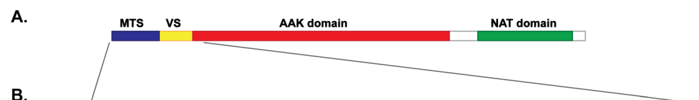

## Question

# Gene Research for Functional Annotation

## ⚠️ CRITICAL: Gene/Protein Identification Context

**BEFORE YOU BEGIN RESEARCH:** You MUST verify you are researching the CORRECT gene/protein. Gene symbols can be ambiguous, especially for less well-characterized genes from non-model organisms.

### Target Gene/Protein Identity (from UniProt):
- **UniProt Accession:** E7FCP8
- **Protein Description:** RecName: Full=N-acetylglutamate synthase, mitochondrial {ECO:0000305}; EC=2.3.1.1 {ECO:0000269|PubMed:24465614}; Contains: RecName: Full=N-acetylglutamate synthase, mature form {ECO:0000303|PubMed:24465614}; Short=NAGS-M {ECO:0000303|PubMed:24465614}; Contains: RecName: Full=N-acetylglutamate synthase, conserved domain form {ECO:0000303|PubMed:24465614}; Short=NAGS-C {ECO:0000303|PubMed:24465614}; Flags: Precursor;
- **Gene Information:** Name=nags {ECO:0000312|ZFIN:ZDB-GENE-121219-2};
- **Organism (full):** Danio rerio (Zebrafish) (Brachydanio rerio).
- **Protein Family:** Belongs to the acetyltransferase family. .
- **Key Domains:** AceGlu_kinase-like_sf. (IPR036393); Acyl_CoA_acyltransferase. (IPR016181); GlcNAc_Synth_met. (IPR011243); Vertebrate-like_GNAT_dom. (IPR006855); NAT (PF04768)

### MANDATORY VERIFICATION STEPS:

1. **Check if the gene symbol "nags" matches the protein description above**
2. **Verify the organism is correct:** Danio rerio (Zebrafish) (Brachydanio rerio).
3. **Check if protein family/domains align with what you find in literature**
4. **If you find literature for a DIFFERENT gene with the same or similar symbol, STOP**

### If Gene Symbol is Ambiguous or You Cannot Find Relevant Literature:

**DO NOT PROCEED WITH RESEARCH ON A DIFFERENT GENE.** Instead:
- State clearly: "The gene symbol 'nags' is ambiguous or literature is limited for this specific protein"
- Explain what you found (e.g., "Found extensive literature on a different gene with the same symbol in a different organism")
- Describe the protein based ONLY on the UniProt information provided above
- Suggest that the protein function can be inferred from domain/family information

### Research Target:

Please provide a comprehensive research report on the gene **nags** (gene ID: nags, UniProt: E7FCP8) in DANRE.

The research report should be a detailed narrative explaining the function, biological processes, and localization of the gene product. Citations should be given for all claims.

You should prioritize authoritative reviews and primary scientific literature when conducting research. You can supplement
this with annotations you find in gene/protein databases, but these can be outdated or inaccurate.

We are specifically interested in the primary function of the gene - for enzymes, what reaction is catalyzed, and what is the substrate specificity? For transporters, what is the substrate? For structural proteins or adapters, what is the broader structural role? For signaling molecules, what is the role in the pathway.

We are interested in where in or outside the cell the gene product carries out its function.

We are also interested in the signaling or biochemical pathways in which the gene functions. We are less interested in broad pleiotropic effects, except where these elucidate the precise role.

Include evidence where possible. We are interested in both experimental evidence as well as inference from structure, evolution, or bioinformatic analysis. Precise studies should be prioritized over high-throughput, where available.

## Output

Question: You are an expert researcher providing comprehensive, well-cited information.

Provide detailed information focusing on:
1. Key concepts and definitions with current understanding
2. Recent developments and latest research (prioritize 2023-2024 sources)
3. Current applications and real-world implementations
4. Expert opinions and analysis from authoritative sources
5. Relevant statistics and data from recent studies

Format as a comprehensive research report with proper citations. Include URLs and publication dates where available.
Always prioritize recent, authoritative sources and provide specific citations for all major claims.

# Gene Research for Functional Annotation

## ⚠️ CRITICAL: Gene/Protein Identification Context

**BEFORE YOU BEGIN RESEARCH:** You MUST verify you are researching the CORRECT gene/protein. Gene symbols can be ambiguous, especially for less well-characterized genes from non-model organisms.

### Target Gene/Protein Identity (from UniProt):
- **UniProt Accession:** E7FCP8
- **Protein Description:** RecName: Full=N-acetylglutamate synthase, mitochondrial {ECO:0000305}; EC=2.3.1.1 {ECO:0000269|PubMed:24465614}; Contains: RecName: Full=N-acetylglutamate synthase, mature form {ECO:0000303|PubMed:24465614}; Short=NAGS-M {ECO:0000303|PubMed:24465614}; Contains: RecName: Full=N-acetylglutamate synthase, conserved domain form {ECO:0000303|PubMed:24465614}; Short=NAGS-C {ECO:0000303|PubMed:24465614}; Flags: Precursor;
- **Gene Information:** Name=nags {ECO:0000312|ZFIN:ZDB-GENE-121219-2};
- **Organism (full):** Danio rerio (Zebrafish) (Brachydanio rerio).
- **Protein Family:** Belongs to the acetyltransferase family. .
- **Key Domains:** AceGlu_kinase-like_sf. (IPR036393); Acyl_CoA_acyltransferase. (IPR016181); GlcNAc_Synth_met. (IPR011243); Vertebrate-like_GNAT_dom. (IPR006855); NAT (PF04768)

### MANDATORY VERIFICATION STEPS:

1. **Check if the gene symbol "nags" matches the protein description above**
2. **Verify the organism is correct:** Danio rerio (Zebrafish) (Brachydanio rerio).
3. **Check if protein family/domains align with what you find in literature**
4. **If you find literature for a DIFFERENT gene with the same or similar symbol, STOP**

### If Gene Symbol is Ambiguous or You Cannot Find Relevant Literature:

**DO NOT PROCEED WITH RESEARCH ON A DIFFERENT GENE.** Instead:
- State clearly: "The gene symbol 'nags' is ambiguous or literature is limited for this specific protein"
- Explain what you found (e.g., "Found extensive literature on a different gene with the same symbol in a different organism")
- Describe the protein based ONLY on the UniProt information provided above
- Suggest that the protein function can be inferred from domain/family information

### Research Target:

Please provide a comprehensive research report on the gene **nags** (gene ID: nags, UniProt: E7FCP8) in DANRE.

The research report should be a detailed narrative explaining the function, biological processes, and localization of the gene product. Citations should be given for all claims.

You should prioritize authoritative reviews and primary scientific literature when conducting research. You can supplement
this with annotations you find in gene/protein databases, but these can be outdated or inaccurate.

We are specifically interested in the primary function of the gene - for enzymes, what reaction is catalyzed, and what is the substrate specificity? For transporters, what is the substrate? For structural proteins or adapters, what is the broader structural role? For signaling molecules, what is the role in the pathway.

We are interested in where in or outside the cell the gene product carries out its function.

We are also interested in the signaling or biochemical pathways in which the gene functions. We are less interested in broad pleiotropic effects, except where these elucidate the precise role.

Include evidence where possible. We are interested in both experimental evidence as well as inference from structure, evolution, or bioinformatic analysis. Precise studies should be prioritized over high-throughput, where available.

## Research Report: Functional Annotation of **nags** (UniProt **E7FCP8**) in *Danio rerio* (zebrafish)

### 1. Target verification (critical disambiguation)
The zebrafish gene symbol **nags** corresponds to **mitochondrial N-acetylglutamate synthase (NAGS; EC 2.3.1.1)**, a precursor protein with a predicted N-terminal mitochondrial targeting sequence (MTS) and mature/conserved forms studied experimentally in zebrafish, matching the UniProt E7FCP8 description and domain composition (AAK + NAT/GNAT-like acetyltransferase). (caldovic2014expressionpatternand pages 1-2, caldovic2014expressionpatternand pages 6-8, caldovic2014expressionpatternand pages 3-5)

### 2. Key concepts and definitions (current understanding)

#### 2.1 Enzymatic function and reaction
**N-acetylglutamate synthase (NAGS)** catalyzes formation of **N-acetyl-L-glutamate (NAG)** from **L-glutamate** and **acetyl-CoA**. (caldovic2014expressionpatternand pages 1-2, caldovic2010nacetylglutamatesynthasestructure pages 4-5)

In animals, NAG is an **obligatory allosteric activator** of the first, regulatory carbamoyl phosphate synthetase in the urea-cycle system (CPS1 in mammals; CPSIII in many fish), so NAGS function is best understood as **controlling NAG supply** to enable CPS activity rather than directly detoxifying ammonia. (caldovic2010nacetylglutamatesynthasestructure pages 5-7, gougeard2024useofpure pages 1-2)

#### 2.2 Cellular compartment and pathway placement
Vertebrate NAGS is localized to **mitochondria**, consistent with NAG activating mitochondrial CPS enzymes; zebrafish NAGS includes an N-terminal MTS predicted to be cleaved to yield the mature enzyme. (caldovic2014expressionpatternand pages 6-8, caldovic2014expressionpatternand pages 3-5, haskins2008inversionofallosteric pages 8-9)

#### 2.3 Domain architecture (structure/function logic)
Fish NAGS proteins (including zebrafish) comprise: **(i) MTS**, **(ii) a variable segment**, and **(iii) a conserved C-terminal region** containing an **amino-acid-kinase-like (AAK) domain** and a **N-acetyltransferase (NAT/GNAT-like) domain**; the conserved region harbors catalytic activity and an arginine-responsive regulatory site. (caldovic2014expressionpatternand pages 6-8, caldovic2014expressionpatternand pages 3-5, caldovic2014expressionpatternand media e974cf64)

Mechanistic/structural synthesis from authoritative sources indicates **substrate binding/catalysis localizes to the NAT/GNAT region**, while allosteric regulation (including arginine effects) is mediated via the AAK-related region in vertebrate NAGS proteins. (gougeard2024useofpure pages 9-11, caldovic2010nacetylglutamatesynthasestructure pages 4-5)

### 3. Zebrafish (*Danio rerio*) nags: experimental functional annotation

#### 3.1 Developmental expression (zebrafish-specific evidence)
Zebrafish **nags mRNA** is detected very early (maternal contribution; present by the **32-cell stage**) and is **highly expressed through the first ~4 days of development**, along with multiple other urea-cycle genes/transporters. (caldovic2014expressionpatternand pages 1-2, caldovic2014expressionpatternand pages 2-3, caldovic2014expressionpatternand media e974cf64)

Quantitative RT-PCR evidence in the zebrafish study shows **higher adult nags expression than embryonic**, while some other urea-cycle genes (e.g., CPS3/OTC) show relatively higher embryonic expression, consistent with a developmental role for nitrogen metabolism. (caldovic2014expressionpatternand pages 2-2, caldovic2014expressionpatternand media e974cf64)

The same work notes a mechanistic gap in the first 24 hours post-fertilization: **Arg1 mRNA is absent in the first 24 hpf**, complicating interpretation of early urea production, though other arginase activity (e.g., Arg2) has been discussed as a possibility. (caldovic2014expressionpatternand pages 2-3)

#### 3.2 Mitochondrial targeting and mature/conserved forms
Sequence analyses and MitoProt predictions support an N-terminal MTS in zebrafish NAGS; the recombinant “mature” form (**zfNAGS-M**) was defined with an N-terminus at **Met47**, consistent with cleavage of the targeting segment. (caldovic2014expressionpatternand pages 6-8, caldovic2014expressionpatternand pages 8-9)

Fish NAGS MTS length is reported as **~40–58 aa**, and the variable segment as **~10–45 aa** across fish species; zebrafish constructs were also made lacking the variable segment (“conserved” form, **zfNAGS-C**). (caldovic2014expressionpatternand pages 3-5)

#### 3.3 Oligomerization and biophysical properties
Both recombinant zebrafish NAGS constructs were reported as **tetramers in the absence of L-arginine**, and gel-filtration data indicate that **L-arginine changes hydrodynamic behavior/oligomer distributions** (shift consistent with altered oligomerization state or conformation). (caldovic2014expressionpatternand pages 1-2, caldovic2014expressionpatternand media e974cf64)

The zebrafish proteins exhibited limited solubility/aggregation at higher concentrations (aggregation above ~**1.3 mg/mL** for zfNAGS-M and ~**2.0 mg/mL** for zfNAGS-C), mirroring the broader theme that vertebrate NAGS can be experimentally challenging due to instability/aggregation. (caldovic2014expressionpatternand pages 6-8, caldovic2014expressionpatternand pages 8-9, gougeard2024useofpure pages 1-2)

#### 3.4 Regulation by L-arginine (zebrafish-specific kinetics)
A central zebrafish-specific result is that **L-arginine partially inhibits zebrafish NAGS**—contrasting with **activation in mammals** and stronger inhibition in many microbial NAGS enzymes—supporting an evolutionary “intermediate” regulatory phenotype. (caldovic2014expressionpatternand pages 3-5, haskins2008inversionofallosteric pages 8-9)

Quantitatively, one cross-species study reported zebrafish NAGS specific activity decreasing from **10.638 ± 0.090** to **5.475 ± 0.121 pmol·min⁻¹·mg⁻¹** with **1 mM arginine** (~50% inhibition). (haskins2008inversionofallosteric pages 8-9)

In the dedicated zebrafish biochemical study, arginine decreased apparent **Vmax** (≈**30%** for zfNAGS-M and ≈**50%** for zfNAGS-C), **increased apparent Km for acetyl-CoA**, and left **Km for glutamate unchanged**; half-maximal arginine effect was reported at **≤0.65 mM**. (caldovic2014expressionpatternand pages 3-5)

Thermofluor experiments showed that L-arginine can **stabilize zfNAGS-M** (reported stabilization by ~**1°C** at 1 mM and ~**3°C** at 10 mM), indicating ligand-dependent effects on protein stability in addition to catalysis. (caldovic2014expressionpatternand pages 6-8)

#### 3.5 Proposed physiological role in zebrafish
The zebrafish expression pattern (high early expression of urea-cycle genes including nags) supports a role in **early citrulline/arginine biosynthesis** (particularly in the first day) and **nitrogen handling/ammonia detoxification thereafter**, though the earliest urea excretion mechanism remains incompletely resolved given Arg1 timing. (caldovic2014expressionpatternand pages 1-2, caldovic2014expressionpatternand pages 6-8, caldovic2014expressionpatternand pages 2-3)

Independent zebrafish studies of hyperammonemia biology and metabolic mutants reference NAGS as part of the mitochondrial system required for CPS-dependent nitrogen metabolism, further supporting integration of nags/NAGS into zebrafish nitrogen/amino-acid metabolic networks. (caldovic2014expressionpatternand pages 2-3, singh2024theefficacyof pages 6-7)

### 4. Recent developments (prioritized 2023–2024) relevant to NAGS biology
Although no 2023–2024 zebrafish-specific primary NAGS papers were retrieved in this corpus, several **2024** advances materially update the field and inform functional annotation and translational interpretation.

#### 4.1 2024: Recombinant human NAGS enables mechanistic interpretation of missense variants
A 2024 *Journal of Inherited Metabolic Disease* study developed a stabilized recombinant human NAGS conserved domain (MBP-cHuNAGS) enabling direct biochemical testing of **23 patient-derived** nonsynonymous variants; for **all but one**, pathogenicity was explained by measured defects including **loss of arginine activation**, increased **Km for glutamate**, active-site inactivation, reduced thermal stability, and **protein misfolding** (misfolding tendency reported for **17/23**). (gougeard2024useofpure pages 14-16, gougeard2024useofpure pages 1-2, gougeard2024useofpure pages 9-11)

This work provides expert-level biochemical support for a domain-function model in vertebrate NAGS: **GNAT/NAT region** mediates substrate binding/catalysis (with glutamate binding inferred there), and the **AAK domain** mediates arginine-dependent activation; it also argues that recombinant enzyme assays can outperform in silico predictors (including AlphaMissense) for variant interpretation in urea-cycle disorders. (gougeard2024useofpure pages 14-16, gougeard2024useofpure pages 9-11)

#### 4.2 2024: Datamining/regulatory genomics for NAGS deficiency and urea-cycle gene regulation
A 2024 *JIMD* analysis emphasizes that NAGS deficiency is the rarest urea-cycle disorder, highlights diagnostic reliance on sequencing due to **lack of specific biochemical markers**, and reports prevalence estimates and regulatory-element discovery efforts (including novel regulatory elements in NAGS intronic regions) to improve understanding of urea-cycle gene expression and diagnostic interpretation. (caldovic2024dataminingapproachesfor pages 1-2)

### 5. Current applications and real-world implementations

#### 5.1 Clinical application: NAGS deficiency and carbamylglutamate (carglumic acid)
NAGS deficiency is clinically important because ureagenesis can be restored pharmacologically using **N-carbamylglutamate/carglumic acid**, a synthetic, acylase-resistant **NAG analog** that activates CPS1. (caldovic2010nacetylglutamatesynthasestructure pages 5-7, gougeard2024useofpure pages 1-2)

A 2024 Orphanet Journal of Rare Diseases case series describes NAGS deficiency as extremely rare (incidence **<1 in 2,000,000 live births**) and reports seven North American cases in which patients responded to carglumic acid with normalization of **plasma ammonia and citrulline** and normalization of **urine orotic acid** when abnormal at baseline. (singh2024theefficacyof pages 1-2)

Implementation realities highlighted in 2024 include that carglumic acid can allow liberalization of dietary protein, but **interruptions in access** (e.g., insurance authorization barriers) can precipitate hyperammonemic crises with poor long-term outcomes; authors recommend explicit contingency planning for illness and medication disruptions. (singh2024theefficacyof pages 1-2)

Dosing reported/recommended in the 2024 series was **10–100 mg/kg/day** divided into 2–4 doses, with observed case dosing around **43–100 mg/kg/day**; administration adaptations (e.g., mixing with food) were used to support adherence. (singh2024theefficacyof pages 5-6)

#### 5.2 Broader use of carglumic acid (secondary NAG deficiency)
A 2024 expert review addressing propionic and methylmalonic acidurias describes hyperammonemia as related to secondary NAG deficiency and evaluates chronic carglumic acid evidence, reporting quantitative real-world outcomes such as **51% reduction in ER admissions over 2 years** and fewer inpatient days (**32.8 vs 51.3 days**) in summarized studies; a single-center pediatric cohort (n=21) used mean long-term dosing ~**85 mg/kg/day** for up to 50 months with minimal adverse events. (yap2024roleofcarglumic pages 2-5)

### 6. Expert opinions and analysis (authoritative synthesis)

*Evolutionary/allosteric perspective:* Cross-species enzymology supports that arginine regulation of NAGS shifted over evolution: arginine typically inhibits microbial/plant NAGS, whereas it activates mammalian NAGS; fish (including zebrafish) show partial inhibition, consistent with a gradual inversion of allosteric effect. (caldovic2014expressionpatternand pages 3-5, haskins2008inversionofallosteric pages 8-9)

*Mechanistic/structural perspective:* Structural-mechanistic synthesis supports that arginine binding can induce long-range conformational effects that change substrate affinity and catalytic efficiency, rationalizing observed changes in Km/Vmax with arginine across taxa; this is consistent with zebrafish findings (Km(AcCoA) increase; Vmax decrease) and with human-variant data emphasizing arginine activation as a key functional axis. (caldovic2014expressionpatternand pages 3-5, gougeard2024useofpure pages 9-11, caldovic2010nacetylglutamatesynthasestructure pages 4-5)

*Diagnostic/implementation perspective:* 2024 clinical and genomic analyses emphasize that NAGS deficiency can be difficult to diagnose biochemically and is often distinguished by genetic testing and/or response to N-carbamylglutamate; they emphasize early ammonia control to reduce neurologic injury and the importance of health-system implementation details (timely access to carglumic acid). (singh2024theefficacyof pages 1-2, caldovic2024dataminingapproachesfor pages 1-2)

### 7. Data highlights (statistics from recent and primary studies)
- **Zebrafish NAGS inhibition by arginine:** ~50% activity reduction at **1 mM** arginine (10.638 → 5.475 pmol·min⁻¹·mg⁻¹). (haskins2008inversionofallosteric pages 8-9)
- **Zebrafish kinetic signature of arginine:** Vmax decrease (~30–50%), **Km(AcCoA)** increase, **Km(glutamate)** unchanged; half-max effect **≤0.65 mM**. (caldovic2014expressionpatternand pages 3-5)
- **Zebrafish developmental expression:** nags detected at **32-cell stage** and high through first **~4 days**; Arg1 absent in first 24 hpf. (caldovic2014expressionpatternand pages 1-2, caldovic2014expressionpatternand pages 2-3)
- **Human NAGS deficiency incidence:** **<1 in 2,000,000 live births** (2024 case-series statement) and prevalence estimate ~**1:950,000** in 2024 datamining analysis. (singh2024theefficacyof pages 1-2, caldovic2024dataminingapproachesfor pages 1-2)
- **2024 real-world NAGS deficiency outcomes:** in a 7-case series, carglumic acid normalized plasma ammonia/citrulline and urine orotic acid when abnormal; disruptions in access were associated with severe adverse outcomes. (singh2024theefficacyof pages 1-2)
- **2024 chronic carglumic acid outcomes in PA/MMA:** reported **51% reduction in ER admissions** over 2 years; fewer inpatient days (32.8 vs 51.3 days) in summarized evidence. (yap2024roleofcarglumic pages 2-5)

### 8. Visual evidence supporting key zebrafish annotation claims
Cropped panels from the primary zebrafish NAGS study provide direct visual support for (i) NAGS domain segmentation (MTS/variable/AAK/NAT), (ii) tetrameric oligomerization with arginine-dependent shift by gel filtration, and (iii) developmental expression dynamics by qRT-PCR. (caldovic2014expressionpatternand media e974cf64, caldovic2014expressionpatternand media fb309e17, caldovic2014expressionpatternand media 6d187d72)

### 9. Summary table
The following table consolidates the functional annotation and evidence base for zebrafish **nags/NAGS (E7FCP8)**, emphasizing zebrafish-specific experimental evidence and integrating 2024 advances relevant to mechanism and real-world implementation.

| Category | Key findings | Quantitative/statistical details | Key sources with URLs and publication dates |
|---|---|---|---|
| Gene/protein identity | **Danio rerio nags** encodes mitochondrial **N-acetylglutamate synthase (NAGS; EC 2.3.1.1)**, matching UniProt **E7FCP8** and zebrafish-specific biochemical literature; this disambiguates it from unrelated acetyltransferases with overlapping family/domain labels. The zebrafish protein was experimentally studied as precursor-derived mature and conserved forms, consistent with the UniProt precursor annotation. (caldovic2014expressionpatternand pages 1-2, caldovic2014expressionpatternand pages 6-8) | Zebrafish constructs defined as **zfNAGS-M** (after predicted MTS cleavage) and **zfNAGS-C** (further lacking the variable segment). (caldovic2014expressionpatternand pages 1-2, caldovic2014expressionpatternand pages 8-9) | Caldovic et al., **2014-01**, PLoS ONE, https://doi.org/10.1371/journal.pone.0085597 (caldovic2014expressionpatternand pages 1-2, caldovic2014expressionpatternand pages 8-9) |
| Enzyme/reaction | Zebrafish NAGS catalyzes the canonical reaction **acetyl-CoA + L-glutamate → N-acetyl-L-glutamate (NAG) + CoA**. In animals, NAG functions mainly as the obligatory allosteric activator of carbamoyl phosphate synthetase (CPS), linking NAGS activity to ureagenesis and nitrogen metabolism. (caldovic2014expressionpatternand pages 1-2, caldovic2010nacetylglutamatesynthasestructure pages 4-5) | Zebrafish NAGS has relatively **low apparent Km values for acetyl-CoA and glutamate**, reported as about **3–4-fold lower than mammalian NAGS** in comparative discussion. (caldovic2014expressionpatternand pages 3-5) | Caldovic et al., **2014-01**, https://doi.org/10.1371/journal.pone.0085597; Caldovic et al., **2010-01**, https://doi.org/10.1016/j.ymgme.2010.02.018 (caldovic2014expressionpatternand pages 1-2, caldovic2014expressionpatternand pages 3-5, caldovic2010nacetylglutamatesynthasestructure pages 4-5) |
| Substrates/products and biochemical role | The immediate substrates are **acetyl-CoA** and **L-glutamate**; the product **NAG** is required to activate fish CPSIII and mammalian CPS1 analogously. Thus the primary biochemical function of zebrafish NAGS is NAG production rather than direct ammonia detoxification per se. (caldovic2014expressionpatternand pages 1-2, caldovic2014expressionpatternand pages 2-2, caldovic2010nacetylglutamatesynthasestructure pages 5-7) | In variant/mechanistic work on human NAGS, altered **Km for glutamate** and impaired arginine activation were major pathogenic mechanisms, underscoring the importance of these substrate/regulatory interactions for conserved NAGS function. (gougeard2024useofpure pages 1-2, gougeard2024useofpure pages 9-11) | Caldovic et al., **2014-01**, https://doi.org/10.1371/journal.pone.0085597; Gougeard et al., **2024-05**, https://doi.org/10.1002/jimd.12747; Caldovic et al., **2010-01**, https://doi.org/10.1016/j.ymgme.2010.02.018 (caldovic2014expressionpatternand pages 1-2, caldovic2014expressionpatternand pages 2-2, caldovic2010nacetylglutamatesynthasestructure pages 5-7, gougeard2024useofpure pages 1-2, gougeard2024useofpure pages 9-11) |
| Cellular localization | Zebrafish NAGS is inferred to be **mitochondrial**, with an N-terminal **mitochondrial targeting sequence (MTS)** predicted to be cleaved to produce the mature enzyme. This aligns with vertebrate NAGS localization in the mitochondrial matrix, where CPS-dependent nitrogen metabolism occurs. (caldovic2014expressionpatternand pages 6-8, caldovic2014expressionpatternand pages 3-5, haskins2008inversionofallosteric pages 8-9) | Fish NAGS proteins have an N-terminal MTS of roughly **40–58 aa**; for zebrafish, the mature recombinant form was defined with an N-terminus at **Met47** based on MitoProt prediction. (caldovic2014expressionpatternand pages 6-8, caldovic2014expressionpatternand pages 8-9, caldovic2014expressionpatternand pages 3-5) | Caldovic et al., **2014-01**, https://doi.org/10.1371/journal.pone.0085597; Haskins et al., **2008-09**, https://doi.org/10.1186/1471-2091-9-24 (caldovic2014expressionpatternand pages 6-8, caldovic2014expressionpatternand pages 8-9, caldovic2014expressionpatternand pages 3-5, haskins2008inversionofallosteric pages 8-9) |
| Domain architecture | Zebrafish NAGS has three major segments: **MTS**, a **variable segment**, and a **conserved C-terminal region** containing **AAK** and **NAT/GNAT-like** domains. The conserved domain harbors catalytic function and the arginine-responsive regulatory site, matching the UniProt/interpro family assignments. (caldovic2014expressionpatternand pages 6-8, caldovic2014expressionpatternand pages 3-5, caldovic2014expressionpatternand media e974cf64) | The MTS is followed by a variable segment of about **10–45 aa** in fish; the **NAT domain is more conserved than the AAK domain** across fish sequences (**~62% vs ~38%** conservation in the cited comparison). (caldovic2014expressionpatternand pages 3-5) | Caldovic et al., **2014-01**, https://doi.org/10.1371/journal.pone.0085597; image summary from same paper (caldovic2014expressionpatternand media e974cf64) (caldovic2014expressionpatternand pages 6-8, caldovic2014expressionpatternand pages 3-5, caldovic2014expressionpatternand media e974cf64) |
| Regulation by arginine | Zebrafish NAGS is **partially inhibited by L-arginine**, unlike mammalian NAGS (activated) and unlike many bacterial NAGS enzymes (more strongly inhibited). This positions fish NAGS as an evolutionary intermediate in the inversion of arginine allostery during vertebrate evolution. (caldovic2014expressionpatternand pages 1-2, caldovic2014expressionpatternand pages 3-5, haskins2008inversionofallosteric pages 8-9, caldovic2024dataminingapproachesfor pages 15-16) | Recombinant zebrafish NAGS specific activity fell from **10.638 ± 0.090** to **5.475 ± 0.121 pmol·min⁻¹·mg⁻¹** with **1 mM arginine** (~50% inhibition). In kinetic analyses, arginine caused about **30% Vmax decrease for zfNAGS-M** and about **50% for zfNAGS-C**; half-maximal effect was at **≤0.65 mM** arginine. (caldovic2014expressionpatternand pages 3-5, haskins2008inversionofallosteric pages 8-9) | Haskins et al., **2008-09**, https://doi.org/10.1186/1471-2091-9-24; Caldovic et al., **2014-01**, https://doi.org/10.1371/journal.pone.0085597; Caldovic et al., **2024-11**, https://doi.org/10.1002/jimd.12687 (caldovic2014expressionpatternand pages 3-5, haskins2008inversionofallosteric pages 8-9, caldovic2024dataminingapproachesfor pages 15-16) |
| Kinetic effects of arginine | Mechanistically, arginine reduces catalytic output mainly by lowering **apparent Vmax** and increasing **apparent Km for acetyl-CoA**, while **Km for glutamate remains essentially unchanged** in zebrafish constructs. This supports allosteric regulation affecting acetyl-CoA utilization/active conformation rather than glutamate binding in zebrafish. (caldovic2014expressionpatternand pages 1-2, caldovic2014expressionpatternand pages 6-8, caldovic2014expressionpatternand pages 3-5) | Arginine decreased activity by roughly **30–50%**, increased **Kmapp for AcCoA**, and did **not** materially change **Kmapp for glutamate**. (caldovic2014expressionpatternand pages 1-2, caldovic2014expressionpatternand pages 6-8, caldovic2014expressionpatternand pages 3-5) | Caldovic et al., **2014-01**, https://doi.org/10.1371/journal.pone.0085597 (caldovic2014expressionpatternand pages 1-2, caldovic2014expressionpatternand pages 6-8, caldovic2014expressionpatternand pages 3-5) |
| Oligomerization/biophysical properties | Recombinant **zfNAGS-M** and **zfNAGS-C** are oligomeric, with evidence supporting a predominantly **tetrameric** state in the absence of arginine. Arginine changes hydrodynamic behavior/oligomerization, and the variable segment appears to help stabilize the tetrameric form. (caldovic2014expressionpatternand pages 1-2, caldovic2014expressionpatternand pages 6-8, caldovic2014expressionpatternand media e974cf64) | Both zfNAGS-M and zfNAGS-C are reported as **tetramers without L-arginine**; addition of **1 mM L-arginine** shifts gel-filtration behavior toward altered/higher oligomerization states. Solubility is limited, with aggregation above about **1.3 mg/mL (zfNAGS-M)** and **2.0 mg/mL (zfNAGS-C)**. (caldovic2014expressionpatternand pages 6-8, caldovic2014expressionpatternand pages 8-9, caldovic2014expressionpatternand media e974cf64) | Caldovic et al., **2014-01**, https://doi.org/10.1371/journal.pone.0085597; image summary from same paper (caldovic2014expressionpatternand media e974cf64) (caldovic2014expressionpatternand pages 6-8, caldovic2014expressionpatternand pages 8-9, caldovic2014expressionpatternand media e974cf64) |
| Stability and segment-specific effects | The truncated conserved form (**zfNAGS-C**) is more active and unfolds over a broader temperature range than **zfNAGS-M**, suggesting the variable segment is not required for catalysis and may instead tune oligomeric stability/regulation. Arginine also stabilizes zfNAGS-M thermally. (caldovic2014expressionpatternand pages 1-2, caldovic2014expressionpatternand pages 6-8) | zfNAGS-C has about **2-fold higher apparent Vmax** than zfNAGS-M; adding **1 or 10 mM L-arginine** increased zfNAGS-M thermal stability by about **1°C** and **3°C**, respectively. (caldovic2014expressionpatternand pages 6-8, caldovic2014expressionpatternand pages 3-5) | Caldovic et al., **2014-01**, https://doi.org/10.1371/journal.pone.0085597 (caldovic2014expressionpatternand pages 1-2, caldovic2014expressionpatternand pages 6-8, caldovic2014expressionpatternand pages 3-5) |
| Developmental expression | **nags** transcripts are present maternally and are strongly expressed during the **first four days of zebrafish development**, together with multiple other urea-cycle genes/transporters. This supports an early developmental metabolic role rather than a liver-restricted adult-only function. (caldovic2014expressionpatternand pages 1-2, caldovic2014expressionpatternand pages 2-3, caldovic2014expressionpatternand media e974cf64) | Expression is detectable as early as the **32-cell stage** and remains high across approximately the first **4 days post-fertilization**; adult expression is also high. During 24–48 hpf, **NAGS, CPS3, OTC, ASS, ASL** plus transporters are expressed, whereas **Arg1** is absent in the first 24 hpf. (caldovic2014expressionpatternand pages 1-2, caldovic2014expressionpatternand pages 2-3, caldovic2014expressionpatternand pages 2-2, caldovic2014expressionpatternand media e974cf64) | Caldovic et al., **2014-01**, https://doi.org/10.1371/journal.pone.0085597; image summary from same paper (caldovic2014expressionpatternand media e974cf64) (caldovic2014expressionpatternand pages 1-2, caldovic2014expressionpatternand pages 2-3, caldovic2014expressionpatternand pages 2-2, caldovic2014expressionpatternand media e974cf64) |
| Proposed physiological role in zebrafish | The best-supported interpretation is that zebrafish NAGS contributes to **citrulline/arginine biosynthesis early in development** and to **ammonia detoxification/ureagenesis after day 1**, although the first 24 hpf remain incompletely explained because **Arg1** is not yet expressed. Thus the role is developmental and nitrogen-metabolic, not solely a classic adult hepatic urea-cycle role. (caldovic2014expressionpatternand pages 1-2, caldovic2014expressionpatternand pages 6-8, caldovic2014expressionpatternand pages 2-3) | Developing zebrafish are reported to be **ureotelic during the first 48 h**, but the absence of **Arg1 mRNA** in the first 24 hpf leaves an unresolved mechanistic gap; alternative contributors such as **Arg2** have been proposed. (caldovic2014expressionpatternand pages 2-3) | Caldovic et al., **2014-01**, https://doi.org/10.1371/journal.pone.0085597 (caldovic2014expressionpatternand pages 1-2, caldovic2014expressionpatternand pages 6-8, caldovic2014expressionpatternand pages 2-3) |
| Evidence from broader zebrafish metabolic studies | Independent zebrafish work on hyperammonemia and glucagon-receptor mutants references **nags** within ureagenic/nitrogen-metabolism networks, supporting functional integration of NAGS into zebrafish ammonia handling and amino-acid metabolism. (caldovic2014expressionpatternand pages 2-3, singh2024theefficacyof pages 6-7) | Hyperammonemia rescue studies identify NAGS as required for N-acetylglutamate provision to CPS-dependent pathways; transcriptomic work reports **nags** among ureagenesis-related genes altered in metabolic mutants. (caldovic2014expressionpatternand pages 2-3, singh2024theefficacyof pages 6-7) | Zielonka et al., **2018-09**, https://doi.org/10.1371/journal.pone.0203707; Kang et al., **2020-01**, https://doi.org/10.3390/ijms21030724 (caldovic2014expressionpatternand pages 2-3, singh2024theefficacyof pages 6-7) |
| Recent 2024 mechanistic developments | New 2024 work on recombinant **human** NAGS refined current understanding of domain function and disease mechanisms: the **AAK domain** mediates arginine activation, whereas the **GNAT/NAT domain** mediates catalysis/substrate binding; many patient variants act through misfolding, loss of arginine activation, or increased **Km** for glutamate. These findings are not zebrafish-specific but strengthen interpretation of conserved NAGS biochemistry. (gougeard2024useofpure pages 14-16, gougeard2024useofpure pages 1-2, gougeard2024useofpure pages 9-11) | In one 2024 study, **23** patient-derived nonsynonymous variants were tested; **17/23** showed increased misfolding tendency, and for **all but one** variant the biochemical defect explained disease causation. Some variants increased glutamate **Km 3–8-fold**. (gougeard2024useofpure pages 14-16, gougeard2024useofpure pages 9-11) | Gougeard et al., **2024-05**, JIMD, https://doi.org/10.1002/jimd.12747 (gougeard2024useofpure pages 14-16, gougeard2024useofpure pages 1-2, gougeard2024useofpure pages 9-11) |
| Human/clinical relevance | NAGS is clinically important because **NAGS deficiency (NAGSD)** is a urea-cycle disorder that is uniquely treatable with **N-carbamylglutamate/carglumic acid**, a stable NAG analog that activates CPS1. Zebrafish NAGS biochemistry is therefore relevant for comparative nitrogen metabolism and evolutionary interpretation, even though direct zebrafish disease models for nags were not retrieved here. (singh2024theefficacyof pages 1-2, caldovic2024dataminingapproachesfor pages 1-2, caldovic2010nacetylglutamatesynthasestructure pages 5-7) | Recent estimates describe NAGSD as extremely rare: **<1 in 2,000,000 live births** in one 2024 case series and about **1:950,000 prevalence** in a 2024 datamining analysis. A 2024 seven-patient case series found all patients responded to carglumic acid with normalization of ammonia/citrulline and abnormal urine orotic acid. (singh2024theefficacyof pages 1-2, caldovic2024dataminingapproachesfor pages 1-2) | Singh et al., **2024-04**, Orphanet J Rare Dis, https://doi.org/10.1186/s13023-024-03167-0; Caldovic et al., **2024-11**, JIMD, https://doi.org/10.1002/jimd.12687; Caldovic et al., **2010-01**, https://doi.org/10.1016/j.ymgme.2010.02.018 (singh2024theefficacyof pages 1-2, caldovic2024dataminingapproachesfor pages 1-2, caldovic2010nacetylglutamatesynthasestructure pages 5-7) |
| Real-world implementation relevance | Expert consensus and case-series evidence show that carglumic acid can permit liberalization of protein intake, but treatment success depends on reliable access and prompt use in hyperammonemia. This translational context highlights why precise functional annotation of NAGS matters across species. (singh2024theefficacyof pages 1-2, singh2024theefficacyof pages 5-6, singh2024theefficacyof pages 6-7, yap2024roleofcarglumic pages 2-5) | In the 2024 case series, dosing was **10–100 mg/kg/day** (actual cases **43–100 mg/kg/day**); in PA/MMA literature reviewed in 2024, long-term carglumic acid was associated with a **51% reduction in ER admissions over 2 years** and fewer inpatient days (**32.8 vs 51.3**). (singh2024theefficacyof pages 5-6, yap2024roleofcarglumic pages 2-5) | Singh et al., **2024-04**, https://doi.org/10.1186/s13023-024-03167-0; Yap et al., **2024-12**, https://doi.org/10.1186/s13023-024-03468-4 (singh2024theefficacyof pages 1-2, singh2024theefficacyof pages 5-6, singh2024theefficacyof pages 6-7, yap2024roleofcarglumic pages 2-5) |

*Table: This table summarizes the functional annotation of zebrafish nags/NAGS (UniProt E7FCP8), including enzymatic role, localization, domain architecture, regulation, developmental expression, and clinical relevance. It condenses zebrafish-specific primary evidence together with recent 2024 mechanistic and translational literature for efficient use in the final report.*

### References (URLs and publication dates)
- Caldovic L, et al. **2014-01**. “Expression Pattern and Biochemical Properties of Zebrafish N-Acetylglutamate Synthase.” *PLoS ONE*. https://doi.org/10.1371/journal.pone.0085597 (caldovic2014expressionpatternand pages 1-2)
- Haskins N, et al. **2008-09**. “Inversion of allosteric effect of arginine on N-acetylglutamate synthase…” *BMC Biochemistry*. https://doi.org/10.1186/1471-2091-9-24 (haskins2008inversionofallosteric pages 8-9)
- Gougeard N, et al. **2024-05**. “Use of pure recombinant human enzymes… applied to N-acetylglutamate synthase deficiency.” *J Inherit Metab Dis*. https://doi.org/10.1002/jimd.12747 (gougeard2024useofpure pages 1-2)
- Caldovic L, et al. **2024-11**. “Datamining approaches for examining the low prevalence of N-acetylglutamate synthase deficiency…” *J Inherit Metab Dis*. https://doi.org/10.1002/jimd.12687 (caldovic2024dataminingapproachesfor pages 1-2)
- Singh RH, et al. **2024-04**. “The efficacy of Carbamylglutamate impacts the nutritional management of patients with N-Acetylglutamate synthase deficiency.” *Orphanet J Rare Dis*. https://doi.org/10.1186/s13023-024-03167-0 (singh2024theefficacyof pages 1-2)
- Yap S, et al. **2024-12**. “Role of carglumic acid in the long-term management of propionic and methylmalonic acidurias.” *Orphanet J Rare Dis*. https://doi.org/10.1186/s13023-024-03468-4 (yap2024roleofcarglumic pages 2-5)
- Caldovic L, et al. **2010-01**. “N-acetylglutamate synthase: structure, function and defects.” *Mol Genet Metab*. https://doi.org/10.1016/j.ymgme.2010.02.018 (caldovic2010nacetylglutamatesynthasestructure pages 5-7)

References

1. (caldovic2014expressionpatternand pages 1-2): Ljubica Caldovic, Nantaporn Haskins, Amy Mumo, Himani Majumdar, Mary Pinter, Mendel Tuchman, and Alison Krufka. Expression pattern and biochemical properties of zebrafish n-acetylglutamate synthase. PLoS ONE, 9:e85597, Jan 2014. URL: https://doi.org/10.1371/journal.pone.0085597, doi:10.1371/journal.pone.0085597. This article has 15 citations and is from a peer-reviewed journal.

2. (caldovic2014expressionpatternand pages 6-8): Ljubica Caldovic, Nantaporn Haskins, Amy Mumo, Himani Majumdar, Mary Pinter, Mendel Tuchman, and Alison Krufka. Expression pattern and biochemical properties of zebrafish n-acetylglutamate synthase. PLoS ONE, 9:e85597, Jan 2014. URL: https://doi.org/10.1371/journal.pone.0085597, doi:10.1371/journal.pone.0085597. This article has 15 citations and is from a peer-reviewed journal.

3. (caldovic2014expressionpatternand pages 3-5): Ljubica Caldovic, Nantaporn Haskins, Amy Mumo, Himani Majumdar, Mary Pinter, Mendel Tuchman, and Alison Krufka. Expression pattern and biochemical properties of zebrafish n-acetylglutamate synthase. PLoS ONE, 9:e85597, Jan 2014. URL: https://doi.org/10.1371/journal.pone.0085597, doi:10.1371/journal.pone.0085597. This article has 15 citations and is from a peer-reviewed journal.

4. (caldovic2010nacetylglutamatesynthasestructure pages 4-5): Ljubica Caldovic, Nicholas Ah Mew, Dashuang Shi, Hiroki Morizono, Marc Yudkoff, and Mendel Tuchman. N-acetylglutamate synthase: structure, function and defects. Molecular genetics and metabolism, 100 Suppl 1:S13-9, Jan 2010. URL: https://doi.org/10.1016/j.ymgme.2010.02.018, doi:10.1016/j.ymgme.2010.02.018. This article has 95 citations and is from a peer-reviewed journal.

5. (caldovic2010nacetylglutamatesynthasestructure pages 5-7): Ljubica Caldovic, Nicholas Ah Mew, Dashuang Shi, Hiroki Morizono, Marc Yudkoff, and Mendel Tuchman. N-acetylglutamate synthase: structure, function and defects. Molecular genetics and metabolism, 100 Suppl 1:S13-9, Jan 2010. URL: https://doi.org/10.1016/j.ymgme.2010.02.018, doi:10.1016/j.ymgme.2010.02.018. This article has 95 citations and is from a peer-reviewed journal.

6. (gougeard2024useofpure pages 1-2): Nadine Gougeard, Enea Sancho‐Vaello, M. Leonor Fernández‐Murga, Borja Martínez‐Sinisterra, Badr Loukili‐Hassani, Johannes Häberle, Clara Marco‐Marín, and Vicente Rubio. Use of pure recombinant human enzymes to assess the disease‐causing potential of missense mutations in urea cycle disorders, applied to n‐acetylglutamate synthase deficiency. Journal of Inherited Metabolic Disease, 47:1194-1212, May 2024. URL: https://doi.org/10.1002/jimd.12747, doi:10.1002/jimd.12747. This article has 2 citations and is from a peer-reviewed journal.

7. (haskins2008inversionofallosteric pages 8-9): Nantaporn Haskins, Maria Panglao, Qiuhao Qu, Himani Majumdar, Juan Cabrera-Luque, Hiroki Morizono, Mendel Tuchman, and Ljubica Caldovic. Inversion of allosteric effect of arginine on n-acetylglutamate synthase, a molecular marker for evolution of tetrapods. BMC Biochemistry, 9:24-24, Sep 2008. URL: https://doi.org/10.1186/1471-2091-9-24, doi:10.1186/1471-2091-9-24. This article has 38 citations and is from a peer-reviewed journal.

8. (caldovic2014expressionpatternand media e974cf64): Ljubica Caldovic, Nantaporn Haskins, Amy Mumo, Himani Majumdar, Mary Pinter, Mendel Tuchman, and Alison Krufka. Expression pattern and biochemical properties of zebrafish n-acetylglutamate synthase. PLoS ONE, 9:e85597, Jan 2014. URL: https://doi.org/10.1371/journal.pone.0085597, doi:10.1371/journal.pone.0085597. This article has 15 citations and is from a peer-reviewed journal.

9. (gougeard2024useofpure pages 9-11): Nadine Gougeard, Enea Sancho‐Vaello, M. Leonor Fernández‐Murga, Borja Martínez‐Sinisterra, Badr Loukili‐Hassani, Johannes Häberle, Clara Marco‐Marín, and Vicente Rubio. Use of pure recombinant human enzymes to assess the disease‐causing potential of missense mutations in urea cycle disorders, applied to n‐acetylglutamate synthase deficiency. Journal of Inherited Metabolic Disease, 47:1194-1212, May 2024. URL: https://doi.org/10.1002/jimd.12747, doi:10.1002/jimd.12747. This article has 2 citations and is from a peer-reviewed journal.

10. (caldovic2014expressionpatternand pages 2-3): Ljubica Caldovic, Nantaporn Haskins, Amy Mumo, Himani Majumdar, Mary Pinter, Mendel Tuchman, and Alison Krufka. Expression pattern and biochemical properties of zebrafish n-acetylglutamate synthase. PLoS ONE, 9:e85597, Jan 2014. URL: https://doi.org/10.1371/journal.pone.0085597, doi:10.1371/journal.pone.0085597. This article has 15 citations and is from a peer-reviewed journal.

11. (caldovic2014expressionpatternand pages 2-2): Ljubica Caldovic, Nantaporn Haskins, Amy Mumo, Himani Majumdar, Mary Pinter, Mendel Tuchman, and Alison Krufka. Expression pattern and biochemical properties of zebrafish n-acetylglutamate synthase. PLoS ONE, 9:e85597, Jan 2014. URL: https://doi.org/10.1371/journal.pone.0085597, doi:10.1371/journal.pone.0085597. This article has 15 citations and is from a peer-reviewed journal.

12. (caldovic2014expressionpatternand pages 8-9): Ljubica Caldovic, Nantaporn Haskins, Amy Mumo, Himani Majumdar, Mary Pinter, Mendel Tuchman, and Alison Krufka. Expression pattern and biochemical properties of zebrafish n-acetylglutamate synthase. PLoS ONE, 9:e85597, Jan 2014. URL: https://doi.org/10.1371/journal.pone.0085597, doi:10.1371/journal.pone.0085597. This article has 15 citations and is from a peer-reviewed journal.

13. (singh2024theefficacyof pages 6-7): Rani H. Singh, Marie-Hélène Bourdages, Angela Kurtz, Erin MacLoed, Chelsea Norman, Suzanne Ratko, Sandra C. van Calcar, and Aileen Kenneson. The efficacy of carbamylglutamate impacts the nutritional management of patients with n-acetylglutamate synthase deficiency. Orphanet Journal of Rare Diseases, Apr 2024. URL: https://doi.org/10.1186/s13023-024-03167-0, doi:10.1186/s13023-024-03167-0. This article has 10 citations and is from a peer-reviewed journal.

14. (gougeard2024useofpure pages 14-16): Nadine Gougeard, Enea Sancho‐Vaello, M. Leonor Fernández‐Murga, Borja Martínez‐Sinisterra, Badr Loukili‐Hassani, Johannes Häberle, Clara Marco‐Marín, and Vicente Rubio. Use of pure recombinant human enzymes to assess the disease‐causing potential of missense mutations in urea cycle disorders, applied to n‐acetylglutamate synthase deficiency. Journal of Inherited Metabolic Disease, 47:1194-1212, May 2024. URL: https://doi.org/10.1002/jimd.12747, doi:10.1002/jimd.12747. This article has 2 citations and is from a peer-reviewed journal.

15. (caldovic2024dataminingapproachesfor pages 1-2): Ljubica Caldovic, Julie J. Ahn, Jacklyn Andricovic, Veronica M. Balick, Mallory Brayer, Pamela A. Chansky, Tyson Dawson, Alex C. Edwards, Sara E. Felsen, Karim Ismat, Sveta V. Jagannathan, Brendan T. Mann, Jacob A. Medina, Toshio Morizono, Michio Morizono, Shatha Salameh, Neerja Vashist, Emily C. Williams, Zhe Zhou, and Hiroki Morizono. Datamining approaches for examining the low prevalence of n‐acetylglutamate synthase deficiency and understanding transcriptional regulation of urea cycle genes. Journal of Inherited Metabolic Disease, 47:1175-1193, Nov 2024. URL: https://doi.org/10.1002/jimd.12687, doi:10.1002/jimd.12687. This article has 1 citations and is from a peer-reviewed journal.

16. (singh2024theefficacyof pages 1-2): Rani H. Singh, Marie-Hélène Bourdages, Angela Kurtz, Erin MacLoed, Chelsea Norman, Suzanne Ratko, Sandra C. van Calcar, and Aileen Kenneson. The efficacy of carbamylglutamate impacts the nutritional management of patients with n-acetylglutamate synthase deficiency. Orphanet Journal of Rare Diseases, Apr 2024. URL: https://doi.org/10.1186/s13023-024-03167-0, doi:10.1186/s13023-024-03167-0. This article has 10 citations and is from a peer-reviewed journal.

17. (singh2024theefficacyof pages 5-6): Rani H. Singh, Marie-Hélène Bourdages, Angela Kurtz, Erin MacLoed, Chelsea Norman, Suzanne Ratko, Sandra C. van Calcar, and Aileen Kenneson. The efficacy of carbamylglutamate impacts the nutritional management of patients with n-acetylglutamate synthase deficiency. Orphanet Journal of Rare Diseases, Apr 2024. URL: https://doi.org/10.1186/s13023-024-03167-0, doi:10.1186/s13023-024-03167-0. This article has 10 citations and is from a peer-reviewed journal.

18. (yap2024roleofcarglumic pages 2-5): Sufin Yap, Serena Gasperini, Shirou Matsumoto, and François Feillet. Role of carglumic acid in the long-term management of propionic and methylmalonic acidurias. Orphanet Journal of Rare Diseases, Dec 2024. URL: https://doi.org/10.1186/s13023-024-03468-4, doi:10.1186/s13023-024-03468-4. This article has 7 citations and is from a peer-reviewed journal.

19. (caldovic2014expressionpatternand media fb309e17): Ljubica Caldovic, Nantaporn Haskins, Amy Mumo, Himani Majumdar, Mary Pinter, Mendel Tuchman, and Alison Krufka. Expression pattern and biochemical properties of zebrafish n-acetylglutamate synthase. PLoS ONE, 9:e85597, Jan 2014. URL: https://doi.org/10.1371/journal.pone.0085597, doi:10.1371/journal.pone.0085597. This article has 15 citations and is from a peer-reviewed journal.

20. (caldovic2014expressionpatternand media 6d187d72): Ljubica Caldovic, Nantaporn Haskins, Amy Mumo, Himani Majumdar, Mary Pinter, Mendel Tuchman, and Alison Krufka. Expression pattern and biochemical properties of zebrafish n-acetylglutamate synthase. PLoS ONE, 9:e85597, Jan 2014. URL: https://doi.org/10.1371/journal.pone.0085597, doi:10.1371/journal.pone.0085597. This article has 15 citations and is from a peer-reviewed journal.

21. (caldovic2024dataminingapproachesfor pages 15-16): Ljubica Caldovic, Julie J. Ahn, Jacklyn Andricovic, Veronica M. Balick, Mallory Brayer, Pamela A. Chansky, Tyson Dawson, Alex C. Edwards, Sara E. Felsen, Karim Ismat, Sveta V. Jagannathan, Brendan T. Mann, Jacob A. Medina, Toshio Morizono, Michio Morizono, Shatha Salameh, Neerja Vashist, Emily C. Williams, Zhe Zhou, and Hiroki Morizono. Datamining approaches for examining the low prevalence of n‐acetylglutamate synthase deficiency and understanding transcriptional regulation of urea cycle genes. Journal of Inherited Metabolic Disease, 47:1175-1193, Nov 2024. URL: https://doi.org/10.1002/jimd.12687, doi:10.1002/jimd.12687. This article has 1 citations and is from a peer-reviewed journal.

## Artifacts

- [Edison artifact artifact-00](nags-deep-research-falcon_artifacts/artifact-00.md)

## Citations

1. caldovic2014expressionpatternand pages 2-3
2. caldovic2014expressionpatternand pages 3-5
3. haskins2008inversionofallosteric pages 8-9
4. caldovic2014expressionpatternand pages 6-8
5. caldovic2024dataminingapproachesfor pages 1-2
6. singh2024theefficacyof pages 1-2
7. singh2024theefficacyof pages 5-6
8. yap2024roleofcarglumic pages 2-5
9. caldovic2014expressionpatternand pages 1-2
10. gougeard2024useofpure pages 1-2
11. caldovic2010nacetylglutamatesynthasestructure pages 5-7
12. caldovic2010nacetylglutamatesynthasestructure pages 4-5
13. gougeard2024useofpure pages 9-11
14. caldovic2014expressionpatternand pages 2-2
15. caldovic2014expressionpatternand pages 8-9
16. singh2024theefficacyof pages 6-7
17. gougeard2024useofpure pages 14-16
18. caldovic2024dataminingapproachesfor pages 15-16
19. https://doi.org/10.1371/journal.pone.0085597
20. https://doi.org/10.1371/journal.pone.0085597;
21. https://doi.org/10.1016/j.ymgme.2010.02.018
22. https://doi.org/10.1002/jimd.12747;
23. https://doi.org/10.1186/1471-2091-9-24
24. https://doi.org/10.1186/1471-2091-9-24;
25. https://doi.org/10.1002/jimd.12687
26. https://doi.org/10.1371/journal.pone.0203707;
27. https://doi.org/10.3390/ijms21030724
28. https://doi.org/10.1002/jimd.12747
29. https://doi.org/10.1186/s13023-024-03167-0;
30. https://doi.org/10.1002/jimd.12687;
31. https://doi.org/10.1186/s13023-024-03468-4
32. https://doi.org/10.1186/s13023-024-03167-0
33. https://doi.org/10.1371/journal.pone.0085597,
34. https://doi.org/10.1016/j.ymgme.2010.02.018,
35. https://doi.org/10.1002/jimd.12747,
36. https://doi.org/10.1186/1471-2091-9-24,
37. https://doi.org/10.1186/s13023-024-03167-0,
38. https://doi.org/10.1002/jimd.12687,
39. https://doi.org/10.1186/s13023-024-03468-4,