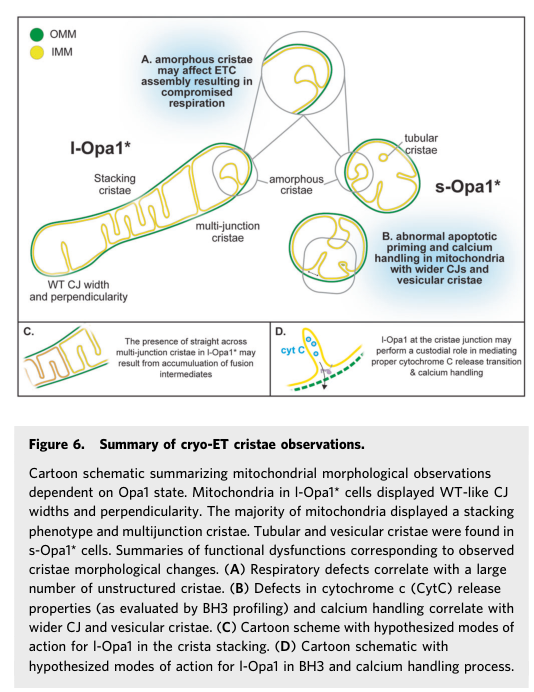

## Question

# Gene Research for Functional Annotation

## ⚠️ CRITICAL: Gene/Protein Identification Context

**BEFORE YOU BEGIN RESEARCH:** You MUST verify you are researching the CORRECT gene/protein. Gene symbols can be ambiguous, especially for less well-characterized genes from non-model organisms.

### Target Gene/Protein Identity (from UniProt):
- **UniProt Accession:** Q5U3A7
- **Protein Description:** RecName: Full=Dynamin-like GTPase OPA1, mitochondrial; EC=3.6.5.5 {ECO:0000250|UniProtKB:O60313}; AltName: Full=Optic atrophy protein 1 homolog; Contains: RecName: Full=Dynamin-like GTPase OPA1, long form {ECO:0000305}; Short=L-OPA1 {ECO:0000250|UniProtKB:O60313}; Contains: RecName: Full=Dynamin-like GTPase OPA1, short form {ECO:0000305}; Short=S-OPA1 {ECO:0000250|UniProtKB:O60313}; Flags: Precursor;
- **Gene Information:** Name=opa1 {ECO:0000312|EMBL:AAH85633.1}; ORFNames=zgc:92092;
- **Organism (full):** Danio rerio (Zebrafish) (Brachydanio rerio).
- **Protein Family:** Belongs to the TRAFAC class dynamin-like GTPase
- **Key Domains:** Dynamin. (IPR022812); Dynamin_GTPase. (IPR001401); Dynamin_N. (IPR045063); G_DYNAMIN_dom. (IPR030381); OPA1_C. (IPR045817)

### MANDATORY VERIFICATION STEPS:

1. **Check if the gene symbol "opa1" matches the protein description above**
2. **Verify the organism is correct:** Danio rerio (Zebrafish) (Brachydanio rerio).
3. **Check if protein family/domains align with what you find in literature**
4. **If you find literature for a DIFFERENT gene with the same or similar symbol, STOP**

### If Gene Symbol is Ambiguous or You Cannot Find Relevant Literature:

**DO NOT PROCEED WITH RESEARCH ON A DIFFERENT GENE.** Instead:
- State clearly: "The gene symbol 'opa1' is ambiguous or literature is limited for this specific protein"
- Explain what you found (e.g., "Found extensive literature on a different gene with the same symbol in a different organism")
- Describe the protein based ONLY on the UniProt information provided above
- Suggest that the protein function can be inferred from domain/family information

### Research Target:

Please provide a comprehensive research report on the gene **opa1** (gene ID: opa1, UniProt: Q5U3A7) in DANRE.

The research report should be a detailed narrative explaining the function, biological processes, and localization of the gene product. Citations should be given for all claims.

You should prioritize authoritative reviews and primary scientific literature when conducting research. You can supplement
this with annotations you find in gene/protein databases, but these can be outdated or inaccurate.

We are specifically interested in the primary function of the gene - for enzymes, what reaction is catalyzed, and what is the substrate specificity? For transporters, what is the substrate? For structural proteins or adapters, what is the broader structural role? For signaling molecules, what is the role in the pathway.

We are interested in where in or outside the cell the gene product carries out its function.

We are also interested in the signaling or biochemical pathways in which the gene functions. We are less interested in broad pleiotropic effects, except where these elucidate the precise role.

Include evidence where possible. We are interested in both experimental evidence as well as inference from structure, evolution, or bioinformatic analysis. Precise studies should be prioritized over high-throughput, where available.

## Output

Question: You are an expert researcher providing comprehensive, well-cited information.

Provide detailed information focusing on:
1. Key concepts and definitions with current understanding
2. Recent developments and latest research (prioritize 2023-2024 sources)
3. Current applications and real-world implementations
4. Expert opinions and analysis from authoritative sources
5. Relevant statistics and data from recent studies

Format as a comprehensive research report with proper citations. Include URLs and publication dates where available.
Always prioritize recent, authoritative sources and provide specific citations for all major claims.

# Gene Research for Functional Annotation

## ⚠️ CRITICAL: Gene/Protein Identification Context

**BEFORE YOU BEGIN RESEARCH:** You MUST verify you are researching the CORRECT gene/protein. Gene symbols can be ambiguous, especially for less well-characterized genes from non-model organisms.

### Target Gene/Protein Identity (from UniProt):
- **UniProt Accession:** Q5U3A7
- **Protein Description:** RecName: Full=Dynamin-like GTPase OPA1, mitochondrial; EC=3.6.5.5 {ECO:0000250|UniProtKB:O60313}; AltName: Full=Optic atrophy protein 1 homolog; Contains: RecName: Full=Dynamin-like GTPase OPA1, long form {ECO:0000305}; Short=L-OPA1 {ECO:0000250|UniProtKB:O60313}; Contains: RecName: Full=Dynamin-like GTPase OPA1, short form {ECO:0000305}; Short=S-OPA1 {ECO:0000250|UniProtKB:O60313}; Flags: Precursor;
- **Gene Information:** Name=opa1 {ECO:0000312|EMBL:AAH85633.1}; ORFNames=zgc:92092;
- **Organism (full):** Danio rerio (Zebrafish) (Brachydanio rerio).
- **Protein Family:** Belongs to the TRAFAC class dynamin-like GTPase
- **Key Domains:** Dynamin. (IPR022812); Dynamin_GTPase. (IPR001401); Dynamin_N. (IPR045063); G_DYNAMIN_dom. (IPR030381); OPA1_C. (IPR045817)

### MANDATORY VERIFICATION STEPS:

1. **Check if the gene symbol "opa1" matches the protein description above**
2. **Verify the organism is correct:** Danio rerio (Zebrafish) (Brachydanio rerio).
3. **Check if protein family/domains align with what you find in literature**
4. **If you find literature for a DIFFERENT gene with the same or similar symbol, STOP**

### If Gene Symbol is Ambiguous or You Cannot Find Relevant Literature:

**DO NOT PROCEED WITH RESEARCH ON A DIFFERENT GENE.** Instead:
- State clearly: "The gene symbol 'opa1' is ambiguous or literature is limited for this specific protein"
- Explain what you found (e.g., "Found extensive literature on a different gene with the same symbol in a different organism")
- Describe the protein based ONLY on the UniProt information provided above
- Suggest that the protein function can be inferred from domain/family information

### Research Target:

Please provide a comprehensive research report on the gene **opa1** (gene ID: opa1, UniProt: Q5U3A7) in DANRE.

The research report should be a detailed narrative explaining the function, biological processes, and localization of the gene product. Citations should be given for all claims.

You should prioritize authoritative reviews and primary scientific literature when conducting research. You can supplement
this with annotations you find in gene/protein databases, but these can be outdated or inaccurate.

We are specifically interested in the primary function of the gene - for enzymes, what reaction is catalyzed, and what is the substrate specificity? For transporters, what is the substrate? For structural proteins or adapters, what is the broader structural role? For signaling molecules, what is the role in the pathway.

We are interested in where in or outside the cell the gene product carries out its function.

We are also interested in the signaling or biochemical pathways in which the gene functions. We are less interested in broad pleiotropic effects, except where these elucidate the precise role.

Include evidence where possible. We are interested in both experimental evidence as well as inference from structure, evolution, or bioinformatic analysis. Precise studies should be prioritized over high-throughput, where available.

## Research report: Functional annotation of **Danio rerio opa1** (UniProt **Q5U3A7**; mitochondrial dynamin-like GTPase OPA1)

### 0) Target verification (critical disambiguation)
The literature retrieved and used here explicitly concerns **opa1/Opa1 in zebrafish (Danio rerio)** and describes it as a **mitochondrially localized dynamin-like GTPase** required for **inner mitochondrial membrane (IMM) fusion** and **cristae architecture**, consistent with the UniProt Q5U3A7 description (dynamin-like GTPase; mitochondrial precursor; dynamin domains; long/short forms). Zebrafish Opa1 was reported as a **single-copy, ubiquitously expressed gene** with protein isoforms and ~**78% identity** to human OPA1, supporting orthology-based interpretation. (rahn2013opa1isrequired pages 2-3)

### 1) Key concepts and definitions (current understanding)

#### 1.1 OPA1/Opa1 as an IMM fusion GTPase
OPA1 is a **TRAFAC class dynamin-like GTPase** that localizes to mitochondria and is essential for **IMM fusion**, acting after outer mitochondrial membrane (OMM) fusion mediated by mitofusins (MFN1/MFN2). (strachan2025novelinvivo pages 2-4)

**Catalyzed reaction (molecular function):** OPA1 is not a small-molecule metabolic enzyme; its catalytic activity is **GTP hydrolysis (GTP → GDP + Pi)**, coupled to conformational changes that power membrane remodeling, tethering, and fusion. Mechanistic synthesis from fusion reconstitution/structural work indicates that oligomerization and nucleotide-dependent conformational transitions are central to its membrane remodeling activity. (dotto2021dominantopticatrophy pages 7-9)

#### 1.2 Cristae, crista junctions, and OPA1’s role
Cristae are invaginations of the IMM; their architecture (including **crista junction width/stability**) is tightly linked to bioenergetics and apoptotic competence. OPA1 is a key regulator of **crista morphogenesis and maintenance**, and OPA1 deficiency causes fragmented mitochondria and abnormal cristae. (strachan2025novelinvivo pages 2-4)

OPA1 is also described as acting in coordination with the **MICOS complex** (e.g., MIC60) to control crista junction geometry (width, stability, lumen shape). (strachan2025novelinvivo pages 2-4)

#### 1.3 Long and short OPA1 forms (L-OPA1 / S-OPA1) and proteolytic processing
A central concept for annotation is that OPA1 exists as:
- **Long, membrane-anchored forms (L-OPA1 / l-Opa1)** (retain an N-terminal transmembrane anchor)
- **Short, soluble forms (S-OPA1 / s-Opa1)** in the intermembrane space

These arise through regulated proteolysis by inner-membrane proteases:
- **OMA1** (stress-responsive metalloprotease; cleavage at S1)
- **YME1L** (i-AAA protease; constitutive and/or regulated cleavage at S2)

This processing logic is described as fundamental to switching mitochondria between fusion-competent and fragmentation-prone states during stress. (paoli2024opa1drivencristaeremodelinga pages 12-16, wai2024ismitochondrialmorphology pages 16-21, strachan2025novelinvivo pages 2-4)

### 2) Recent developments and latest research (prioritizing 2023–2024)

#### 2.1 In situ ultrastructural linkage of Opa1 state to crista architecture (2024)
Cryo-electron tomography work dissected how different Opa1 processing states correlate with distinct crista morphologies: increased long-form Opa1 is associated with crista stacking/organized structures, whereas increased short-form Opa1 correlates with irregular packing and widened crista junctions; these structural states connect to functional phenotypes (respiration, apoptotic/calcium responses). (fry2024insituarchitecture media 9305a7f7)

A summary schematic of these relationships is shown in Figure 6 of this work. (fry2024insituarchitecture media 9305a7f7)

#### 2.2 Stress-regulated OMA1→Opa1 processing as a signaling node (2024)
Recent synthesis emphasizes that loss of IMM potential (Δψm) and oxidative stress regulate **OMA1 activation** and thereby Opa1 processing, shifting L/S balance and mitochondrial network morphology (fragmentation vs restoration). (stuut2024investigationofopa1 pages 22-26)

#### 2.3 Broad physiological framing: pleiotropy of mitochondrial morphology (2024)
A 2024 expert review frames OPA1 as a core IMM fusion/cristae protein whose processing by OMA1/YME1L is a major control point linking mitochondrial morphology to respiration, mtDNA maintenance, and apoptotic competence; stress-induced cleavage of L-OPA1 is positioned as a conserved driver of fragmentation during stress. (wai2024ismitochondrialmorphology pages 16-21)

### 3) Zebrafish-specific biology of **opa1**: experimental evidence, localization, processes, and phenotypes

#### 3.1 Morpholino depletion studies (developmental and bioenergetic phenotypes; 2013)
In zebrafish embryos, antisense morpholinos (translation-blocking and splice-blocking) reduced Opa1 protein with isoform-specific effects and produced multi-system developmental phenotypes:
- **Cardiovascular/circulation defects** (e.g., impaired circulation, pericardial edema; unlooped hearts) and **reduced heart rate**
- **Small eyes** and other developmental delay features (e.g., enlarged hindbrain ventricle)
- **Behavioral defects** (reduced startle response, impaired locomotion)
- **Mitochondrial fragmentation** in vivo (mitochondrial reporter imaging)
- Death before 7 dpf under morpholino conditions

Quantitative and biochemical details supporting functional annotation include reported reductions of major Opa1 isoforms to **<10% of control at 24 hpf** for several bands, with a distinct smaller doublet showing partial reduction and altered abundance over time. (rahn2013opa1isrequired pages 2-3, rahn2013opa1isrequired pages 3-5)

Bioenergetically, morphants showed **significantly decreased total basal respiration** and altered respiratory control behavior: **respiratory control ratio (RCR) increased** significantly at 24 and 72 hpf (reported p<0.03), with maximal uncoupled OCR and proton leak not significantly changed in that analysis window, supporting a role for Opa1 in maintaining developmental bioenergetic output and/or reserve. (rahn2013opa1isrequired pages 3-5)

#### 3.2 CRISPR crispant and stable knockout models (retinal ganglion cell/axon-centric phenotypes; 2025)
Recent work created targeted **CRISPR/Cas9 zebrafish opa1 crispants** and a stable mutant line, providing convergent genetic evidence:
- A defined deletion spanning exons 8–9 (932 bp) was confirmed; **90.3%** of F0 animals carried the deletion band, and the frameshift predicts a truncated protein lacking key dynamin/GTPase effector features required for mitochondrial morphology. (strachan2025novelinvivo pages 6-9)
- Zebrafish **opa1−/− larvae are viable early**, but mutants were reported to **not survive past ~60 dpf** / absent by ~2 months. (strachan2025novelinvivo pages 15-17, strachan2025novelinvivo pages 6-9)

**Visual function as a sensitive readout:** In crispants, optokinetic response (OKR) was significantly impaired with quantitative effect sizes:
- **33.29%** decrease in saccades at 0.02 cycles/degree
- **64.43%** decrease in saccades at 0.2 cycles/degree
- **37.28%** reduction in contrast sensitivity (20% contrast)

In contrast, **visual motor response (VMR) locomotor activity** was not significantly changed, indicating a relatively selective early vulnerability of visual circuitry consistent with optic neuropathy biology. (strachan2025novelinvivo pages 6-9)

**Axonal mitochondrial ultrastructure:** Electron microscopy in optic nerve/retinal ganglion cell (RGC) axons showed mitochondrial disruption (fragmentation and **disordered cristae**). Quantification included mitochondrial shape descriptors and cristae area fraction across large mitochondrial counts (reported n≈226–345 mitochondria for specific analyses). (strachan2025novelinvivo pages 15-17)

**Bioenergetics in larvae (Seahorse OCR):** In crispant larvae, basal respiration and ATP production were not significantly changed, but **maximal respiration decreased**, while **non-mitochondrial respiration** and **proton leak** increased—consistent with reduced respiratory reserve capacity and increased inefficiency/stress. (strachan2025novelinvivo pages 15-17)

### 4) Pathways and molecular regulation (annotation-relevant mechanisms)

#### 4.1 OMA1/YME1L protease axis as a stress-responsive control point
OPA1 processing by OMA1 and YME1L is presented as a conserved mechanism by which mitochondrial stress remodels morphology: stress-activated OMA1 cleavage shifts the L/S balance toward short forms, functionally promoting fragmentation when fission proceeds unopposed. (wai2024ismitochondrialmorphology pages 16-21, stuut2024investigationofopa1 pages 22-26, strachan2025novelinvivo pages 2-4)

#### 4.2 MICOS collaboration and crista junction regulation
OPA1 is described as regulating crista junction width/stability in collaboration with MICOS proteins (e.g., MIC60), anchoring OPA1 firmly in the “cristae organizing” module rather than generic fusion-only function. (strachan2025novelinvivo pages 2-4)

### 5) Current applications and real-world implementations

#### 5.1 Zebrafish opa1 models as in vivo platforms for disease mechanism and therapeutic screening
The zebrafish CRISPR knockout/crispant systems were explicitly positioned as **tools for therapeutic screening**, leveraging rapid larval visual assays (OKR/VMR) and quantifiable mitochondrial ultrastructure/bioenergetics as endpoints. (strachan2025novelinvivo pages 1-2, strachan2025novelinvivo pages 15-17)

#### 5.2 Using OPA1 processing as a mechanistic biomarker in vertebrate neurodevelopmental contexts
In zebrafish, altered processing of OPA1 was associated with vertebrate visual impairment in a genetic model affecting ATP synthase regulation (Atpif1a mutant), supporting the general concept that OPA1 processing state can report mitochondrial fitness in neural tissues. (martinjimenez2018reductionofthe pages 1-2)

### 6) Expert opinion and analysis (authoritative synthesis)

A consistent expert framing across recent reviews is that **OPA1 integrates mitochondrial structure with function**: IMM fusion, crista morphology, and downstream bioenergetic/apoptotic phenotypes are interdependent, and the **protease-controlled L/S balance** is a primary regulatory lever responding to cellular stress. (wai2024ismitochondrialmorphology pages 16-21, stuut2024investigationofopa1 pages 22-26)

From an annotation perspective, the zebrafish data strongly support that Q5U3A7’s **primary function** is **GTP-dependent membrane remodeling at the IMM/cristae**, and that many downstream phenotypes (developmental delay, cardiac failure, optic dysfunction) are best interpreted as consequences of compromised mitochondrial ultrastructure and respiratory plasticity rather than independent pathway roles. (rahn2013opa1isrequired pages 3-5, strachan2025novelinvivo pages 15-17)

### 7) Key statistics and data points (recent and zebrafish-specific)

**Human disease context (for translational framing):** Autosomal optic atrophy incidence is reported around **~1 in 30,000**, with some populations as high as **~1 in 12,000**; OPA1 has **>900 known or likely pathogenic variants** (LOVD link provided in the paper). (strachan2025novelinvivo pages 1-2)

**Zebrafish quantitative phenotypes:**
- CRISPR crispant OKR reductions (visual acuity and contrast): **33.29%**, **64.43%**, **37.28%** effect sizes as above. (strachan2025novelinvivo pages 6-9)
- CRISPR lineage genotyping success: deletion band in **90.3%** of F0 genotyped samples. (strachan2025novelinvivo pages 5-6)
- Morpholino biochemical depletion: several Opa1 isoforms reduced to **<10%** at 24 hpf. (rahn2013opa1isrequired pages 2-3)

### 8) Consolidated functional annotation (recommended)

**Gene/protein:** opa1 / Opa1 (UniProt Q5U3A7)

**Subcellular location:** Mitochondrion, **inner mitochondrial membrane** (long form anchored); **intermembrane space** (short processed forms). (wai2024ismitochondrialmorphology pages 16-21, strachan2025novelinvivo pages 2-4)

**Primary molecular function:** **Dynamin-like GTPase** whose **GTP hydrolysis** drives higher-order assemblies that remodel the IMM to promote **inner-membrane fusion** and maintain **crista junction architecture** (including collaboration with MICOS). (dotto2021dominantopticatrophy pages 7-9, strachan2025novelinvivo pages 2-4)

**Core biological processes supported in zebrafish:** mitochondrial network integrity, crista organization, respiratory plasticity/reserve, and neural/visual system fitness; loss-of-function causes mitochondrial fragmentation/cristae defects, developmental cardiac/circulatory phenotypes, and early visual dysfunction. (rahn2013opa1isrequired pages 3-5, strachan2025novelinvivo pages 15-17, strachan2025novelinvivo pages 6-9)

### Summary table
The following table consolidates zebrafish-specific evidence alongside conserved mechanistic support for annotation.

| Aspect | Zebrafish-specific evidence | Cross-species mechanistic support | Notes/implications | Key sources (with citation IDs) |
|---|---|---|---|---|
| Protein type / identity | Zebrafish **opa1** is reported as a **single-copy, ubiquitously expressed** gene with multiple protein isoforms; the zebrafish protein is ~**78% identical** to human OPA1-4. Morphoblotting detected several Opa1 bands (~100, 85, 80, and a 78 kDa doublet), consistent with isoform complexity. CRISPR deletion of exons 8-9 generated a predicted **304 aa truncated protein** versus the **1034 aa long isoform**. (rahn2013opa1isrequired pages 2-3, strachan2025novelinvivo pages 6-9) | OPA1 is a **dynamin-like GTPase** with an N-terminal mitochondrial targeting sequence/transmembrane anchor plus GTPase/dynamin/GED-related regions; structural studies support membrane-remodeling assemblies. (paoli2024opa1drivencristaeremodelinga pages 12-16, dotto2021dominantopticatrophy pages 7-9, bruszt2024cardiaceffectsof pages 14-17) | Matches UniProt Q5U3A7 annotation as a mitochondrial dynamin-family GTPase and supports orthology-based functional annotation. | (rahn2013opa1isrequired pages 2-3, strachan2025novelinvivo pages 6-9, paoli2024opa1drivencristaeremodelinga pages 12-16, bruszt2024cardiaceffectsof pages 14-17) |
| Subcellular localization | Zebrafish Opa1 studies interpret the protein as mitochondrial; mitochondrial matrix-targeted reporter imaging in morphants showed reduced fluorescence and fragmented mitochondria, and optic-nerve EM in CRISPR models showed axonal mitochondrial ultrastructural defects. (rahn2013opa1isrequired pages 2-3, strachan2025novelinvivo pages 15-17, rahn2013opa1isrequired pages 9-10) | OPA1 is localized to the **inner mitochondrial membrane (IMM)**, where the long form is membrane-anchored and the short form is soluble in the intermembrane space. (wai2024ismitochondrialmorphology pages 16-21, strachan2025novelinvivo pages 2-4) | Functional site is the mitochondrial inner membrane/crista junction region rather than cytosol or other organelles. | (strachan2025novelinvivo pages 15-17, wai2024ismitochondrialmorphology pages 16-21, strachan2025novelinvivo pages 2-4) |
| Core molecular function | Zebrafish loss-of-function causes **fragmented mitochondria**, altered mitochondrial fluorescence, and developmental bioenergetic defects, indicating a conserved role in maintaining mitochondrial morphology and metabolism. (rahn2013opa1isrequired pages 2-3, rahn2013opa1isrequired pages 3-5, rahn2013opa1isrequired pages 1-2) | OPA1 mediates **IMM fusion** after MFN1/MFN2-dependent OMM fusion and also shapes/maintains **cristae**; GTP-dependent oligomerization/dimerization drives membrane curvature and fusion. (strachan2025novelinvivo pages 2-4, wai2024ismitochondrialmorphology pages 16-21, dotto2021dominantopticatrophy pages 7-9) | Primary annotation: mitochondrial inner-membrane fusion/cristae organizer rather than enzyme in small-molecule metabolism. The catalytic reaction is **GTP hydrolysis** coupled to membrane remodeling. | (rahn2013opa1isrequired pages 3-5, strachan2025novelinvivo pages 2-4, dotto2021dominantopticatrophy pages 7-9) |
| Processing / regulation (L-Opa1 / S-Opa1) | Zebrafish morphants showed isoform-specific depletion and altered relative abundance of smaller Opa1 species, supporting regulated processing in vivo. (rahn2013opa1isrequired pages 2-3, rahn2013opa1isrequired pages 3-5) | OPA1 exists as **long (L-OPA1)** and **short (S-OPA1)** isoforms; **OMA1** cleaves at S1 and **YME1L** at S2. Balanced L/S forms are required for efficient fusion and cristae organization; stress increases OMA1-dependent cleavage and fragmentation. (paoli2024opa1drivencristaeremodelinga pages 12-16, wai2024ismitochondrialmorphology pages 16-21, stuut2024investigationofopa1 pages 22-26, strachan2025novelinvivo pages 2-4) | Even where zebrafish cleavage-site mapping is incomplete, family-level conservation strongly supports the same regulatory logic for Q5U3A7. | (rahn2013opa1isrequired pages 2-3, paoli2024opa1drivencristaeremodelinga pages 12-16, stuut2024investigationofopa1 pages 22-26, strachan2025novelinvivo pages 2-4) |
| Cristae organization | In zebrafish optic-nerve axons, Opa1 deficiency caused **disordered cristae organization** by EM; mitochondria were also classified for loss of internal structure. (strachan2025novelinvivo pages 1-2, strachan2025novelinvivo pages 5-6, strachan2025novelinvivo pages 15-17) | OPA1 collaborates with **MICOS/MIC60** to control crista junction width, stability, and lumen shape; different L/S balances produce distinct crista architectures. (strachan2025novelinvivo pages 2-4, fry2024insituarchitecture media 9305a7f7) | Supports annotation to mitochondrial crista morphogenesis and junction maintenance. | (strachan2025novelinvivo pages 15-17, strachan2025novelinvivo pages 2-4, fry2024insituarchitecture media 9305a7f7) |
| Morpholino knockdown evidence | Translation-blocking and splice-blocking morpholinos reduced Opa1 protein strongly at 24-72 hpf. The 100/85/80 kDa isoforms fell to **<10% of control at 24 hpf**; the 78 kDa doublet fell to ~**50%**, then became **~4-fold more intense at 48 hpf**. (rahn2013opa1isrequired pages 2-3) | Prior mammalian work predicts that partial loss of OPA1 reduces fusion and perturbs cristae/bioenergetics. (wai2024ismitochondrialmorphology pages 16-21, dotto2021dominantopticatrophy pages 7-9) | Confirms zebrafish Opa1 is dosage-sensitive and exhibits isoform-selective regulation in early development. | (rahn2013opa1isrequired pages 2-3, wai2024ismitochondrialmorphology pages 16-21) |
| CRISPR crispant / knockout evidence | CRISPR targeting exons 8-9 produced a ~**932 bp deletion**; **90.3%** of F0 animals carried the deletion band. Stable opa1-/- larvae were developmentally viable early but **did not survive past ~60 dpf / were absent by 2 months**. (strachan2025novelinvivo pages 5-6, strachan2025novelinvivo pages 15-17, strachan2025novelinvivo pages 6-9) | Vertebrate Opa1 knockout is generally severe/lethal, consistent with essential developmental roles. (strachan2025novelinvivo pages 1-2) | Important for annotation confidence because genetic KO/crispant results converge with older morpholino data. | (strachan2025novelinvivo pages 5-6, strachan2025novelinvivo pages 15-17, strachan2025novelinvivo pages 6-9, strachan2025novelinvivo pages 1-2) |
| Developmental phenotypes | Morphants showed **small eyes**, **small pectoral fins**, enlarged hindbrain ventricle, impaired circulation, **unlooped hearts**, pericardial edema, reduced heart rate, larger yolk, reduced startle/locomotion, and death before **7 dpf**. (rahn2013opa1isrequired pages 2-3, rahn2013opa1isrequired pages 3-5, rahn2013opa1isrequired pages 1-2) | Cross-species OPA1 loss disrupts development through mitochondrial fusion/cristae failure and downstream energetic stress. (wai2024ismitochondrialmorphology pages 16-21, strachan2025novelinvivo pages 1-2) | Early pleiotropy likely reflects high developmental energy demand rather than unrelated non-mitochondrial function. | (rahn2013opa1isrequired pages 2-3, rahn2013opa1isrequired pages 1-2, strachan2025novelinvivo pages 1-2) |
| Visual / retinal phenotypes | CRISPR opa1 larvae had **marked visual impairment** with preserved gross locomotion; retinal lamination and RGC numbers were grossly normal early, but mitoEGFP signal in RGCs was significantly reduced, indicating mitochondrial dysfunction precedes neurodegeneration. (strachan2025novelinvivo pages 1-2, strachan2025novelinvivo pages 15-17, strachan2025novelinvivo pages 6-9) | Human OPA1 mutations cause autosomal optic atrophy, with retinal ganglion cells especially vulnerable. (strachan2025novelinvivo pages 1-2, wai2024ismitochondrialmorphology pages 16-21) | Zebrafish data support a neuron/axon-centric annotation relevant to optic neuropathy biology. | (strachan2025novelinvivo pages 1-2, strachan2025novelinvivo pages 15-17, strachan2025novelinvivo pages 6-9) |
| Quantitative visual-function data | In CRISPR crispants, OKR saccades were significantly reduced: **33.29%** decrease at **0.02 cpd**, **64.43%** decrease at **0.2 cpd**, and **37.28%** reduction in contrast sensitivity with **20%** black-white contrast. VMR locomotor activity was not significantly altered. (strachan2025novelinvivo pages 6-9) | These functional readouts align with OPA1-linked optic neuropathy phenotypes seen across model systems and patients. (strachan2025novelinvivo pages 1-2) | Strongest zebrafish quantitative evidence that Opa1 loss preferentially impairs visual system function. | (strachan2025novelinvivo pages 6-9, strachan2025novelinvivo pages 1-2) |
| Bioenergetics / respiration | In morphants, **total basal respiration decreased significantly**; **proton leak** and **maximal uncoupled OCR** were not different, while **RCR increased significantly at 24 and 72 hpf (p<0.03)**. In CRISPR larvae, **maximal respiration decreased**, while **basal respiration** and **ATP production** were not significantly altered; **non-mitochondrial respiration** and **proton leak** increased. (rahn2013opa1isrequired pages 3-5, strachan2025novelinvivo pages 15-17) | OPA1 supports respiratory supercomplex stability, complex V organization, and mitochondrial energetic plasticity. (strachan2025novelinvivo pages 1-2, bruszt2024cardiaceffectsof pages 21-22) | Suggests Opa1 is especially important for **respiratory reserve / stress response**, not only basal ATP output. | (rahn2013opa1isrequired pages 3-5, strachan2025novelinvivo pages 15-17, strachan2025novelinvivo pages 1-2, bruszt2024cardiaceffectsof pages 21-22) |
| Gene-expression / compensatory response | Morphants transiently upregulated **pgc1a** at 24 and 48 hpf and increased **peo1** at 48 hpf; **mfn1, mfn2, and opa1** transcripts were upregulated at 48 hpf, while **drp1** was unchanged and mtDNA copy number/integrity was unchanged. (rahn2013opa1isrequired pages 3-5) | Cross-species studies link OPA1 loss to mtDNA maintenance and mitochondrial stress responses. (wai2024ismitochondrialmorphology pages 16-21) | Indicates compensatory mitochondrial biogenesis/fusion signaling in response to impaired Opa1 function. | (rahn2013opa1isrequired pages 3-5, wai2024ismitochondrialmorphology pages 16-21) |
| Neuronal axon mitochondrial pathology | In zebrafish optic nerve/RGC axons, Opa1 loss caused **mitochondrial fragmentation** and **disordered cristae**; EM quantified longest axis, area, circularity, and cristae area, with analyses on **n = 226-345 mitochondria** depending on metric. (strachan2025novelinvivo pages 15-17) | In situ cryo-ET and structural studies show OPA1 state dictates crista stacking, junction width, and mitochondrial shape. (fry2024insituarchitecture media 9305a7f7, dotto2021dominantopticatrophy pages 7-9) | Provides direct subcellular evidence tying zebrafish visual dysfunction to axonal mitochondrial ultrastructure. | (strachan2025novelinvivo pages 15-17, fry2024insituarchitecture media 9305a7f7, dotto2021dominantopticatrophy pages 7-9) |
| Functional annotation summary | Danio rerio **opa1 / Q5U3A7** encodes a **mitochondrial inner-membrane dynamin-like GTPase** required for **GTP-dependent IMM fusion**, **cristae junction/ultrastructure maintenance**, and **mitochondrial respiratory resilience**; regulation likely depends on conserved **L-Opa1/S-Opa1** processing by **OMA1/YME1L**. Zebrafish loss-of-function causes early developmental, cardiac, visual, ultrastructural, and bioenergetic phenotypes. (rahn2013opa1isrequired pages 2-3, rahn2013opa1isrequired pages 3-5, strachan2025novelinvivo pages 15-17, strachan2025novelinvivo pages 6-9) | Mechanistic consensus across structural, cell, and animal studies strongly supports this annotation. (paoli2024opa1drivencristaeremodelinga pages 12-16, wai2024ismitochondrialmorphology pages 16-21, dotto2021dominantopticatrophy pages 7-9, fry2024insituarchitecture media 9305a7f7) | Best-supported primary role is mitochondrial membrane remodeling, not generalized signaling; pathology arises from downstream energetic and crista defects. | (rahn2013opa1isrequired pages 2-3, rahn2013opa1isrequired pages 3-5, strachan2025novelinvivo pages 15-17, strachan2025novelinvivo pages 6-9, paoli2024opa1drivencristaeremodelinga pages 12-16, fry2024insituarchitecture media 9305a7f7) |

*Table: This table summarizes the functional annotation of Danio rerio opa1 (UniProt Q5U3A7), integrating zebrafish-specific morpholino and CRISPR evidence with conserved OPA1 mechanism from cross-species studies. It highlights localization, molecular function, isoform processing, phenotypes, and key quantitative data relevant for gene annotation.*

### Key sources (URLs and publication dates)
- Rahn JJ, Stackley KD, Chan SSL. *Opa1 Is Required for Proper Mitochondrial Metabolism in Early Development.* **PLoS ONE** (2013-03). https://doi.org/10.1371/journal.pone.0059218 (rahn2013opa1isrequired pages 2-3, rahn2013opa1isrequired pages 3-5)
- Strachan EL et al. *Novel in vivo models of autosomal optic atrophy reveal conserved pathological changes in neuronal mitochondrial structure and function.* **The FASEB Journal** (Accepted 2025-03-19; published 2025-04). https://doi.org/10.1096/fj.202403271R (strachan2025novelinvivo pages 1-2, strachan2025novelinvivo pages 6-9)
- Wai T. *Is mitochondrial morphology important for cellular physiology?* **Trends in Endocrinology & Metabolism** (2024-10). https://doi.org/10.1016/j.tem.2024.05.005 (wai2024ismitochondrialmorphology pages 16-21)
- Fry MY et al. *In situ architecture of Opa1-dependent mitochondrial cristae remodeling.* **The EMBO Journal** (2024-01). https://doi.org/10.1038/s44318-024-00027-2 (fry2024insituarchitecture media 9305a7f7)
- Fogo GM et al. *Mitochondrial membrane potential and oxidative stress interact to regulate Oma1-dependent processing of Opa1 and mitochondrial dynamics.* **The FASEB Journal** (2024-09). https://doi.org/10.1096/fj.202400313R (stuut2024investigationofopa1 pages 22-26)
- Martín-Jiménez R et al. *Reduction of the ATPase inhibitory factor 1 (IF1) leads to visual impairment in vertebrates.* **Cell Death & Disease** (2018-06). https://doi.org/10.1038/s41419-018-0578-x (martinjimenez2018reductionofthe pages 1-2)

References

1. (rahn2013opa1isrequired pages 2-3): Jennifer J. Rahn, Krista D. Stackley, and Sherine S. L. Chan. Opa1 is required for proper mitochondrial metabolism in early development. PLoS ONE, 8:e59218, Mar 2013. URL: https://doi.org/10.1371/journal.pone.0059218, doi:10.1371/journal.pone.0059218. This article has 81 citations and is from a peer-reviewed journal.

2. (strachan2025novelinvivo pages 2-4): Elin L. Strachan, Eugene T. Dillon, Mairéad Sullivan, Jeffrey C. Glennon, Amandine Peyrel, Jérôme Sarniguet, Kevin Dubois, Benjamin Delprat, Breandán N. Kennedy, and Niamh C. O'Sullivan. Novel in vivo models of autosomal optic atrophy reveal conserved pathological changes in neuronal mitochondrial structure and function. The FASEB Journal, Apr 2025. URL: https://doi.org/10.1096/fj.202403271r, doi:10.1096/fj.202403271r. This article has 0 citations.

3. (dotto2021dominantopticatrophy pages 7-9): Valentina Del Dotto and Valerio Carelli. Dominant optic atrophy (doa): modeling the kaleidoscopic roles of opa1 in mitochondrial homeostasis. Frontiers in Neurology, Jun 2021. URL: https://doi.org/10.3389/fneur.2021.681326, doi:10.3389/fneur.2021.681326. This article has 22 citations and is from a peer-reviewed journal.

4. (paoli2024opa1drivencristaeremodelinga pages 12-16): C Paoli. Opa1-driven cristae remodeling promotes pancreatic cancer progression. Unknown journal, 2024.

5. (wai2024ismitochondrialmorphology pages 16-21): Timothy Wai. Is mitochondrial morphology important for cellular physiology? Trends in Endocrinology &amp; Metabolism, 35:854-871, Oct 2024. URL: https://doi.org/10.1016/j.tem.2024.05.005, doi:10.1016/j.tem.2024.05.005. This article has 40 citations and is from a domain leading peer-reviewed journal.

6. (fry2024insituarchitecture media 9305a7f7): Michelle Y Fry, Paula P Navarro, Pusparanee Hakim, Virly Y Ananda, Xingping Qin, Juan C Landoni, Sneha Rath, Zintis Inde, Camila Makhlouta Lugo, Bridget E Luce, Yifan Ge, Julie L McDonald, Ilzat Ali, Leillani L Ha, Benjamin P Kleinstiver, David C Chan, Kristopher A Sarosiek, and Luke H Chao. In situ architecture of opa1-dependent mitochondrial cristae remodeling. Jan 2024. URL: https://doi.org/10.1038/s44318-024-00027-2, doi:10.1038/s44318-024-00027-2. This article has 67 citations.

7. (stuut2024investigationofopa1 pages 22-26): Christiaan Stuut. Investigation of opa1 in mitochondrial dynamics and ultrastructure. ArXiv, 2024. URL: https://doi.org/10.53846/goediss-10396, doi:10.53846/goediss-10396. This article has 0 citations.

8. (rahn2013opa1isrequired pages 3-5): Jennifer J. Rahn, Krista D. Stackley, and Sherine S. L. Chan. Opa1 is required for proper mitochondrial metabolism in early development. PLoS ONE, 8:e59218, Mar 2013. URL: https://doi.org/10.1371/journal.pone.0059218, doi:10.1371/journal.pone.0059218. This article has 81 citations and is from a peer-reviewed journal.

9. (strachan2025novelinvivo pages 6-9): Elin L. Strachan, Eugene T. Dillon, Mairéad Sullivan, Jeffrey C. Glennon, Amandine Peyrel, Jérôme Sarniguet, Kevin Dubois, Benjamin Delprat, Breandán N. Kennedy, and Niamh C. O'Sullivan. Novel in vivo models of autosomal optic atrophy reveal conserved pathological changes in neuronal mitochondrial structure and function. The FASEB Journal, Apr 2025. URL: https://doi.org/10.1096/fj.202403271r, doi:10.1096/fj.202403271r. This article has 0 citations.

10. (strachan2025novelinvivo pages 15-17): Elin L. Strachan, Eugene T. Dillon, Mairéad Sullivan, Jeffrey C. Glennon, Amandine Peyrel, Jérôme Sarniguet, Kevin Dubois, Benjamin Delprat, Breandán N. Kennedy, and Niamh C. O'Sullivan. Novel in vivo models of autosomal optic atrophy reveal conserved pathological changes in neuronal mitochondrial structure and function. The FASEB Journal, Apr 2025. URL: https://doi.org/10.1096/fj.202403271r, doi:10.1096/fj.202403271r. This article has 0 citations.

11. (strachan2025novelinvivo pages 1-2): Elin L. Strachan, Eugene T. Dillon, Mairéad Sullivan, Jeffrey C. Glennon, Amandine Peyrel, Jérôme Sarniguet, Kevin Dubois, Benjamin Delprat, Breandán N. Kennedy, and Niamh C. O'Sullivan. Novel in vivo models of autosomal optic atrophy reveal conserved pathological changes in neuronal mitochondrial structure and function. The FASEB Journal, Apr 2025. URL: https://doi.org/10.1096/fj.202403271r, doi:10.1096/fj.202403271r. This article has 0 citations.

12. (martinjimenez2018reductionofthe pages 1-2): Rebeca Martín-Jiménez, Danilo Faccenda, Emma Allen, Holly Beatrice Reichel, Laura Arcos, Caterina Ferraina, Daniela Strobbe, Claire Russell, and Michelangelo Campanella. Reduction of the atpase inhibitory factor 1 (if1) leads to visual impairment in vertebrates. Cell Death &amp; Disease, Jun 2018. URL: https://doi.org/10.1038/s41419-018-0578-x, doi:10.1038/s41419-018-0578-x. This article has 18 citations and is from a peer-reviewed journal.

13. (strachan2025novelinvivo pages 5-6): Elin L. Strachan, Eugene T. Dillon, Mairéad Sullivan, Jeffrey C. Glennon, Amandine Peyrel, Jérôme Sarniguet, Kevin Dubois, Benjamin Delprat, Breandán N. Kennedy, and Niamh C. O'Sullivan. Novel in vivo models of autosomal optic atrophy reveal conserved pathological changes in neuronal mitochondrial structure and function. The FASEB Journal, Apr 2025. URL: https://doi.org/10.1096/fj.202403271r, doi:10.1096/fj.202403271r. This article has 0 citations.

14. (bruszt2024cardiaceffectsof pages 14-17): Kitti Bruszt, Orsolya Horvath, Katalin Ordog, Szilard Toth, Kata Juhasz, Eszter Vamos, Katalin Fekete, Ferenc Gallyas, Kalman Toth, Robert Halmosi, and Laszlo Deres. Cardiac effects of opa1 protein promotion in a transgenic animal model. PLOS ONE, 19:e0310394, Nov 2024. URL: https://doi.org/10.1371/journal.pone.0310394, doi:10.1371/journal.pone.0310394. This article has 4 citations and is from a peer-reviewed journal.

15. (rahn2013opa1isrequired pages 9-10): Jennifer J. Rahn, Krista D. Stackley, and Sherine S. L. Chan. Opa1 is required for proper mitochondrial metabolism in early development. PLoS ONE, 8:e59218, Mar 2013. URL: https://doi.org/10.1371/journal.pone.0059218, doi:10.1371/journal.pone.0059218. This article has 81 citations and is from a peer-reviewed journal.

16. (rahn2013opa1isrequired pages 1-2): Jennifer J. Rahn, Krista D. Stackley, and Sherine S. L. Chan. Opa1 is required for proper mitochondrial metabolism in early development. PLoS ONE, 8:e59218, Mar 2013. URL: https://doi.org/10.1371/journal.pone.0059218, doi:10.1371/journal.pone.0059218. This article has 81 citations and is from a peer-reviewed journal.

17. (bruszt2024cardiaceffectsof pages 21-22): Kitti Bruszt, Orsolya Horvath, Katalin Ordog, Szilard Toth, Kata Juhasz, Eszter Vamos, Katalin Fekete, Ferenc Gallyas, Kalman Toth, Robert Halmosi, and Laszlo Deres. Cardiac effects of opa1 protein promotion in a transgenic animal model. PLOS ONE, 19:e0310394, Nov 2024. URL: https://doi.org/10.1371/journal.pone.0310394, doi:10.1371/journal.pone.0310394. This article has 4 citations and is from a peer-reviewed journal.

## Artifacts

- [Edison artifact artifact-00](opa1-deep-research-falcon_artifacts/artifact-00.md)

## Citations

1. strachan2025novelinvivo pages 2-4
2. dotto2021dominantopticatrophy pages 7-9
3. wai2024ismitochondrialmorphology pages 16-21
4. strachan2025novelinvivo pages 6-9
5. strachan2025novelinvivo pages 15-17
6. martinjimenez2018reductionofthe pages 1-2
7. strachan2025novelinvivo pages 1-2
8. strachan2025novelinvivo pages 5-6
9. bruszt2024cardiaceffectsof pages 14-17
10. bruszt2024cardiaceffectsof pages 21-22
11. https://doi.org/10.1371/journal.pone.0059218
12. https://doi.org/10.1096/fj.202403271R
13. https://doi.org/10.1016/j.tem.2024.05.005
14. https://doi.org/10.1038/s44318-024-00027-2
15. https://doi.org/10.1096/fj.202400313R
16. https://doi.org/10.1038/s41419-018-0578-x
17. https://doi.org/10.1371/journal.pone.0059218,
18. https://doi.org/10.1096/fj.202403271r,
19. https://doi.org/10.3389/fneur.2021.681326,
20. https://doi.org/10.1016/j.tem.2024.05.005,
21. https://doi.org/10.1038/s44318-024-00027-2,
22. https://doi.org/10.53846/goediss-10396,
23. https://doi.org/10.1038/s41419-018-0578-x,
24. https://doi.org/10.1371/journal.pone.0310394,