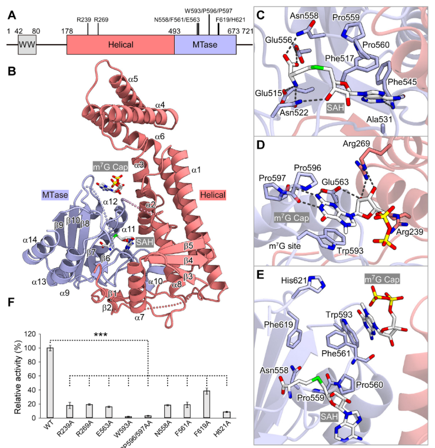

## Question

# Gene Research for Functional Annotation

## ⚠️ CRITICAL: Gene/Protein Identification Context

**BEFORE YOU BEGIN RESEARCH:** You MUST verify you are researching the CORRECT gene/protein. Gene symbols can be ambiguous, especially for less well-characterized genes from non-model organisms.

### Target Gene/Protein Identity (from UniProt):
- **UniProt Accession:** A0A0R4IKJ1
- **Protein Description:** RecName: Full=mRNA (2'-O-methyladenosine-N(6)-)-methyltransferase {ECO:0000250|UniProtKB:Q9H4Z3}; EC=2.1.1.62 {ECO:0000269|PubMed:30467178}; AltName: Full=Cap-specific adenosine methyltransferase {ECO:0000250|UniProtKB:Q9H4Z3}; Short=CAPAM {ECO:0000250|UniProtKB:Q9H4Z3}; Short=zCAPAM {ECO:0000303|PubMed:30467178}; AltName: Full=Phosphorylated CTD-interacting factor 1 {ECO:0000250|UniProtKB:Q9H4Z3};
- **Gene Information:** Name=pcif1;
- **Organism (full):** Danio rerio (Zebrafish) (Brachydanio rerio).
- **Protein Family:** Belongs to the CAPAM family. .
- **Key Domains:** HSP70_C_sf. (IPR029048); PCIF1-like. (IPR039881); PCIF1_WW. (IPR022035); WW_dom. (IPR001202); WW_dom_sf. (IPR036020)

### MANDATORY VERIFICATION STEPS:

1. **Check if the gene symbol "pcif1" matches the protein description above**
2. **Verify the organism is correct:** Danio rerio (Zebrafish) (Brachydanio rerio).
3. **Check if protein family/domains align with what you find in literature**
4. **If you find literature for a DIFFERENT gene with the same or similar symbol, STOP**

### If Gene Symbol is Ambiguous or You Cannot Find Relevant Literature:

**DO NOT PROCEED WITH RESEARCH ON A DIFFERENT GENE.** Instead:
- State clearly: "The gene symbol 'pcif1' is ambiguous or literature is limited for this specific protein"
- Explain what you found (e.g., "Found extensive literature on a different gene with the same symbol in a different organism")
- Describe the protein based ONLY on the UniProt information provided above
- Suggest that the protein function can be inferred from domain/family information

### Research Target:

Please provide a comprehensive research report on the gene **pcif1** (gene ID: pcif1, UniProt: A0A0R4IKJ1) in DANRE.

The research report should be a detailed narrative explaining the function, biological processes, and localization of the gene product. Citations should be given for all claims.

You should prioritize authoritative reviews and primary scientific literature when conducting research. You can supplement
this with annotations you find in gene/protein databases, but these can be outdated or inaccurate.

We are specifically interested in the primary function of the gene - for enzymes, what reaction is catalyzed, and what is the substrate specificity? For transporters, what is the substrate? For structural proteins or adapters, what is the broader structural role? For signaling molecules, what is the role in the pathway.

We are interested in where in or outside the cell the gene product carries out its function.

We are also interested in the signaling or biochemical pathways in which the gene functions. We are less interested in broad pleiotropic effects, except where these elucidate the precise role.

Include evidence where possible. We are interested in both experimental evidence as well as inference from structure, evolution, or bioinformatic analysis. Precise studies should be prioritized over high-throughput, where available.

## Output

Question: You are an expert researcher providing comprehensive, well-cited information.

Provide detailed information focusing on:
1. Key concepts and definitions with current understanding
2. Recent developments and latest research (prioritize 2023-2024 sources)
3. Current applications and real-world implementations
4. Expert opinions and analysis from authoritative sources
5. Relevant statistics and data from recent studies

Format as a comprehensive research report with proper citations. Include URLs and publication dates where available.
Always prioritize recent, authoritative sources and provide specific citations for all major claims.

# Gene Research for Functional Annotation

## ⚠️ CRITICAL: Gene/Protein Identification Context

**BEFORE YOU BEGIN RESEARCH:** You MUST verify you are researching the CORRECT gene/protein. Gene symbols can be ambiguous, especially for less well-characterized genes from non-model organisms.

### Target Gene/Protein Identity (from UniProt):
- **UniProt Accession:** A0A0R4IKJ1
- **Protein Description:** RecName: Full=mRNA (2'-O-methyladenosine-N(6)-)-methyltransferase {ECO:0000250|UniProtKB:Q9H4Z3}; EC=2.1.1.62 {ECO:0000269|PubMed:30467178}; AltName: Full=Cap-specific adenosine methyltransferase {ECO:0000250|UniProtKB:Q9H4Z3}; Short=CAPAM {ECO:0000250|UniProtKB:Q9H4Z3}; Short=zCAPAM {ECO:0000303|PubMed:30467178}; AltName: Full=Phosphorylated CTD-interacting factor 1 {ECO:0000250|UniProtKB:Q9H4Z3};
- **Gene Information:** Name=pcif1;
- **Organism (full):** Danio rerio (Zebrafish) (Brachydanio rerio).
- **Protein Family:** Belongs to the CAPAM family. .
- **Key Domains:** HSP70_C_sf. (IPR029048); PCIF1-like. (IPR039881); PCIF1_WW. (IPR022035); WW_dom. (IPR001202); WW_dom_sf. (IPR036020)

### MANDATORY VERIFICATION STEPS:

1. **Check if the gene symbol "pcif1" matches the protein description above**
2. **Verify the organism is correct:** Danio rerio (Zebrafish) (Brachydanio rerio).
3. **Check if protein family/domains align with what you find in literature**
4. **If you find literature for a DIFFERENT gene with the same or similar symbol, STOP**

### If Gene Symbol is Ambiguous or You Cannot Find Relevant Literature:

**DO NOT PROCEED WITH RESEARCH ON A DIFFERENT GENE.** Instead:
- State clearly: "The gene symbol 'pcif1' is ambiguous or literature is limited for this specific protein"
- Explain what you found (e.g., "Found extensive literature on a different gene with the same symbol in a different organism")
- Describe the protein based ONLY on the UniProt information provided above
- Suggest that the protein function can be inferred from domain/family information

### Research Target:

Please provide a comprehensive research report on the gene **pcif1** (gene ID: pcif1, UniProt: A0A0R4IKJ1) in DANRE.

The research report should be a detailed narrative explaining the function, biological processes, and localization of the gene product. Citations should be given for all claims.

You should prioritize authoritative reviews and primary scientific literature when conducting research. You can supplement
this with annotations you find in gene/protein databases, but these can be outdated or inaccurate.

We are specifically interested in the primary function of the gene - for enzymes, what reaction is catalyzed, and what is the substrate specificity? For transporters, what is the substrate? For structural proteins or adapters, what is the broader structural role? For signaling molecules, what is the role in the pathway.

We are interested in where in or outside the cell the gene product carries out its function.

We are also interested in the signaling or biochemical pathways in which the gene functions. We are less interested in broad pleiotropic effects, except where these elucidate the precise role.

Include evidence where possible. We are interested in both experimental evidence as well as inference from structure, evolution, or bioinformatic analysis. Precise studies should be prioritized over high-throughput, where available.

# Comprehensive research report: **pcif1 / CAPAM (PCIF1)** in *Danio rerio* (UniProt **A0A0R4IKJ1**)

## Executive summary (identity verified)
The UniProt target **A0A0R4IKJ1** corresponds to *Danio rerio* **pcif1**, annotated as **mRNA (2′-O-methyladenosine-N(6)-)-methyltransferase** (cap-specific adenosine methyltransferase; **CAPAM/PCIF1**), EC **2.1.1.62**. Primary literature identifying CAPAM/PCIF1 as the cap-adjacent N6 methyltransferase explicitly includes **zebrafish CAPAM (zCAPAM)** in structural work, supporting that zebrafish pcif1 is the vertebrate ortholog of mammalian PCIF1/CAPAM and is expected to catalyze cap **m6Am** formation. (akichika2019capspecificterminaln6methylation pages 2-3, oerum2021acomprehensivereview pages 7-8, sendinc2019pcif1catalyzesm6am pages 1-3)

A limitation of the current evidence set is that it contains **little zebrafish-specific functional genetics** (phenotypes, developmental roles, expression maps, or direct localization assays). Thus, zebrafish *pcif1* functional annotation below is based on (i) **direct zebrafish structural evidence** and detection of m6Am in zebrafish mRNA, plus (ii) **high-confidence orthology inference** from vertebrate PCIF1/CAPAM biochemistry. (akichika2019capspecificterminaln6methylation pages 2-3, oerum2021acomprehensivereview pages 7-8, sendinc2019pcif1catalyzesm6am pages 1-3)

---

## 1) Key concepts and definitions (current understanding)

### 1.1 The mRNA 5′ cap and cap-adjacent methylation
Eukaryotic mRNAs possess a 5′ **m7G cap** (7-methylguanosine) linked to the first transcribed nucleotide, which in vertebrates can be 2′-O-methylated (Nm). When the first nucleotide is **2′-O-methyladenosine (Am)**, it can be further methylated at the N6 position to generate **N6,2′-O-dimethyladenosine (m6Am)** at the cap-adjacent position. CAPAM/PCIF1 is the **cap-specific** methyltransferase that writes this **m6Am** mark at the transcription start nucleotide. (akichika2019capspecificterminaln6methylation pages 2-3, oerum2021acomprehensivereview pages 7-8)

### 1.2 CAPAM/PCIF1 (Phosphorylated CTD-interacting factor 1)
CAPAM/PCIF1 is a **SAM-dependent N6-adenosine methyltransferase** that installs **m6Am** at the cap-adjacent nucleotide of mRNAs. It is described as the **unique/only** methyltransferase responsible for cap-adjacent m6Am on vertebrate mRNAs in the reviewed literature. (akichika2019capspecificterminaln6methylation pages 2-3, wu2023pcif1theonly pages 2-4, jin2024regulationofm6am pages 1-2)

### 1.3 Relation to broader epitranscriptomics (m6A vs m6Am)
The m6Am mark is **distinct** from internal m6A. PCIF1 is described as acting on **5′ terminal, capped substrates**, and not depositing internal m6A marks on mRNA bodies in the key primary work and structural reviews. (oerum2021acomprehensivereview pages 7-8, sendinc2019pcif1catalyzesm6am pages 1-3)

---

## 2) Verified molecular function of zebrafish pcif1/CAPAM

### 2.1 Enzymatic reaction and cofactor
**Reaction (writer activity):** methylation of the N6 position of cap-adjacent adenosine/Am, producing m6A or **m6Am**, with **S-adenosylmethionine (SAM)** as methyl donor and **SAH** as product. In vertebrate capped mRNA contexts, the key physiological substrate is cap-adjacent **Am**, yielding **m6Am**. (akichika2019capspecificterminaln6methylation pages 2-3, jin2024regulationofm6am pages 1-2)

**Canonical substrate/product example:** 
- **m7GpppAm → m7Gpppm6Am** (cap-dependent, early-transcript position). (akichika2019capspecificterminaln6methylation pages 2-3, wu2023pcif1theonly pages 2-4)

### 2.2 Substrate specificity and quantitative kinetics (primary data)
CAPAM/PCIF1 displays strong **cap dependence** and a strong preference for **2′-O-methylated adenosine** at the cap-adjacent position.

In the primary biochemical characterization, CAPAM shows markedly different affinity for two capped substrates:
- **Km ≈ 3.5 μM** for **m7GpppAm**
- **Km ≈ 28 μM** for **m7GpppA**
indicating substantially higher affinity for the **2′-O-methylated** cap-adjacent adenosine. (akichika2019capspecificterminaln6methylation pages 2-3)

Additional specificity features reported:
- The **m7G cap** is required for efficient N6 methylation; non-m7G-capped substrates (e.g., GpppA or pppA) show little activity. (akichika2019capspecificterminaln6methylation pages 2-3)
- CAPAM prefers **longer RNA substrates**; ~6 nt is described as the minimum effective length, with low activity on shorter oligos. (akichika2019capspecificterminaln6methylation pages 2-3)
- CAPAM does **not methylate internal Am** and acts specifically at the 5′ cap-adjacent position in the reviewed structural literature. (oerum2021acomprehensivereview pages 7-8)

These biochemical properties are directly relevant to zebrafish pcif1 because the discovery paper reports that **zebrafish CAPAM** shares conserved motifs/structural features and was used in structure determination, supporting conservation of substrate-recognition determinants in the zebrafish ortholog. (akichika2019capspecificterminaln6methylation pages 2-3, oerum2021acomprehensivereview pages 7-8)

### 2.3 Structural basis of catalysis (zebrafish-relevant, with figure evidence)
CAPAM has a core **methyltransferase domain** and a **helical domain** that together form binding surfaces for the cap and RNA. The structure (with cap analog and SAH) reveals the cap-binding pocket and the SAM/SAH active-site region, supporting a mechanism for cap-specific terminal N6 methylation. (akichika2019capspecificterminaln6methylation pages 2-3, akichika2019capspecificterminaln6methylation media ccc03861, akichika2019capspecificterminaln6methylation media 065abfbf)

The structural review explicitly notes that **zebrafish CAPAM structures** have been solved (e.g., **PDB 6IRX** and ligand-containing **PDB 6IS0**), further supporting that zebrafish pcif1 is structurally characterized within this enzyme family. (oerum2021acomprehensivereview pages 7-8)

---

## 3) Domain architecture and protein interactions (functional annotation)

### 3.1 Domain organization
Across vertebrates, CAPAM/PCIF1 is described as having:
- an **N-terminal WW domain**
- a **helical domain** that contributes to cap/RNA recognition
- a **C-terminal methyltransferase (Rossmann-like) domain** with a conserved catalytic **NPPF** motif critical for activity. (akichika2019capspecificterminaln6methylation pages 2-3, wu2023pcif1theonly pages 2-4, oerum2021acomprehensivereview pages 7-8, jin2024regulationofm6am pages 1-2)

Catalytic importance of the NPPF region is emphasized, with mutational evidence (reported in reviews of the primary data) that disrupting this conserved motif abrogates methyltransferase activity. (wu2023pcif1theonly pages 2-4, jin2024regulationofm6am pages 1-2)

### 3.2 RNA polymerase II CTD binding and co-transcriptional recruitment
A key mechanistic feature of PCIF1 is that its WW domain binds the **Ser5-phosphorylated C-terminal domain (CTD)** of **RNA polymerase II**, consistent with recruitment to early transcription complexes and **co-transcriptional** installation of m6Am at transcription start sites. (akichika2019capspecificterminaln6methylation pages 2-3, wu2023pcif1theonly pages 2-4, jin2024regulationofm6am pages 1-2)

The 2019 Science study reports WW-domain interaction with Ser5-phosphorylated RNAPII CTD and co-immunoprecipitation with Ser5-phosphorylated RNAPII, supporting this coupling between transcription and cap-proximal methylation. (akichika2019capspecificterminaln6methylation pages 2-3)

---

## 4) Subcellular localization and site of action

### 4.1 Nuclear, transcription-coupled role (best-supported model)
PCIF1 is described as primarily **nuclear** and associated with transcription machinery/chromatin in reviewed summaries of the primary literature, consistent with its RNAPII CTD interaction and the concept that m6Am is added to nascent mRNA early during elongation. (akichika2019capspecificterminaln6methylation pages 2-3, wu2023pcif1theonly pages 2-4)

### 4.2 Zebrafish-specific localization: evidence gaps
No zebrafish-specific imaging or biochemical fractionation data establishing pcif1 subcellular localization were retrieved in the current evidence set; thus, nuclear localization for zebrafish pcif1 should be treated as **orthology-based inference** supported by conservation of WW domain function and zebrafish structural conservation rather than as directly measured in zebrafish tissues/cells here. (akichika2019capspecificterminaln6methylation pages 2-3, oerum2021acomprehensivereview pages 7-8)

---

## 5) Zebrafish-specific evidence and conservation/orthology

### 5.1 Direct zebrafish evidence present in primary literature
Two lines of zebrafish-specific evidence were identified:
1. **Zebrafish CAPAM (zCAPAM)** was used alongside human CAPAM for **crystallographic structure determination**, and conserved motifs/domains are discussed as shared across animals, supporting zebrafish orthology. (akichika2019capspecificterminaln6methylation pages 2-3, oerum2021acomprehensivereview pages 7-8)
2. **m6Am is detectable in zebrafish mRNA** (measurement via approaches that require decapping prior to LC-MS/MS is described in the key primary literature). (sendinc2019pcif1catalyzesm6am pages 1-3)

### 5.2 Evolutionary scope (expert synthesis)
Structural review discussion indicates CAPAM homologs are found in **higher organisms** but not in yeast/worm, aligning with the observation that m6Am is a vertebrate cap-associated modification and supporting the view that zebrafish pcif1 is part of a vertebrate-conserved pathway. (oerum2021acomprehensivereview pages 7-8)

---

## 6) Recent developments (prioritizing 2023–2024)

### 6.1 2023 review synthesis: PCIF1 as unique m6Am writer and disease relevance
A 2023 review summarizes PCIF1 as the **unique** m6Am methyltransferase, reiterating cap dependence and the model of nuclear/cotranscriptional action, and highlights expanding connections between PCIF1/m6Am biology and disease contexts (notably cancers and other conditions). While disease associations are largely mammalian, they frame current research directions and the importance of PCIF1 as a regulatory node in gene expression. (Publication: Oct 2023; URL: https://doi.org/10.1186/s12935-023-03066-7) (wu2023pcif1theonly pages 2-4, wu2023pcif1theonly pages 1-2)

A statistic frequently cited in this review-level literature is that **~30%** of cellular mRNAs harbor m6Am at the first nucleotide (cap-adjacent), emphasizing potential transcriptome-wide impact. (wu2023pcif1theonly pages 1-2)

### 6.2 2024 authoritative review: regulators of m6Am (writers/erasers) and functions
A 2024 review emphasizes m6Am as a **dynamic, reversible** modification regulated by writers (including **PCIF1**) and an eraser (**FTO**), and summarizes evidence for m6Am impacts on **splicing, stability, and translation** in different biological contexts. (Publication: Mar 2024; URL: https://doi.org/10.1093/jmcb/mjae012) (jin2024regulationofm6am pages 1-2)

The review also reiterates a mechanistic framework where PCIF1 interaction with **Ser5-phosphorylated RNAPII CTD** enables deposition at transcription start sites during transcriptional elongation. (jin2024regulationofm6am pages 1-2)

---

## 7) Current applications and real-world implementations

### 7.1 Practical assay implementations used in the field
Key real-world implementations for CAPAM/PCIF1 and m6Am biology include:
- **RNA-MS / LC–MS/MS** approaches that quantify cap-adjacent modifications (often requiring **decapping**) to distinguish m6Am from other nucleosides. (akichika2019capspecificterminaln6methylation pages 2-3, sendinc2019pcif1catalyzesm6am pages 1-3)
- **In vitro methyltransferase assays** with synthetic capped RNAs to measure substrate preferences and kinetics (e.g., Km differences for m7GpppAm vs m7GpppA). (akichika2019capspecificterminaln6methylation pages 2-3)
- **Structural biology (crystallography)** to resolve cap-binding and catalytic-site features, including structures solved with zebrafish CAPAM constructs. (akichika2019capspecificterminaln6methylation pages 2-3, oerum2021acomprehensivereview pages 7-8, akichika2019capspecificterminaln6methylation media ccc03861)

These approaches are directly portable to zebrafish systems (e.g., using zebrafish cell lines, embryos, or tissues), and the existence of zebrafish structural models supports rational experimental design in DANRE. (oerum2021acomprehensivereview pages 7-8)

### 7.2 Translational relevance (mostly mammalian contexts)
Although not zebrafish-specific, recent literature highlights PCIF1 as a target/biomarker candidate in disease-focused contexts (cancer/viral infection), motivating broader interest in CAPAM/PCIF1. These applications provide a rationale for studying conserved vertebrate biology in zebrafish models. (wu2023pcif1theonly pages 2-4, jin2024regulationofm6am pages 1-2)

---

## 8) Expert opinions and analysis (authoritative synthesis)

### 8.1 Where PCIF1 acts in gene expression pathways
The most strongly supported mechanistic model positions PCIF1 at the interface of **transcription initiation/early elongation** and **mRNA cap maturation**, via WW-domain binding to **Ser5-phosphorylated RNAPII CTD** and cap-structure recognition that restricts methylation to the cap-proximal site. This is a clear biochemical pathway: RNAPII CTD phosphorylation state provides spatial/temporal recruitment control, and the **m7G cap plus 2′-O-methylation** provides substrate selectivity. (akichika2019capspecificterminaln6methylation pages 2-3, oerum2021acomprehensivereview pages 7-8, jin2024regulationofm6am pages 1-2)

### 8.2 Expected zebrafish function (inference with explicit uncertainty)
Given (i) direct zebrafish structural characterization within the 2019 discovery paper and (ii) detection of m6Am in zebrafish mRNA, zebrafish pcif1 (UniProt A0A0R4IKJ1) is best annotated as the **cap-specific m6Am writer** for zebrafish mRNAs, operating in the **nucleus** and likely acting **co-transcriptionally**. However, zebrafish-specific genetic/phenotypic validation was not found in the current evidence set and remains an open gap for DANRE functional annotation beyond the conserved molecular function. (akichika2019capspecificterminaln6methylation pages 2-3, oerum2021acomprehensivereview pages 7-8, sendinc2019pcif1catalyzesm6am pages 1-3)

---

## 9) Key statistics and data points (from cited studies)
- **Enzyme kinetics (substrate preference):** Km **3.5 μM** for **m7GpppAm** vs **28 μM** for **m7GpppA** (cap-adjacent 2′-O-methylation strongly enhances affinity). (akichika2019capspecificterminaln6methylation pages 2-3)
- **Transcriptome prevalence:** m6Am is reported to occur on **~30%** of cellular mRNAs when the first transcribed nucleotide is adenosine/Am (review-level estimate). (wu2023pcif1theonly pages 1-2)

---

## Visual evidence (structure)
The following figure panels from the 2019 Science paper illustrate CAPAM/PCIF1 bound to a cap analog and SAH, including the cap-binding pocket and active-site region; these structural data underpin mechanistic understanding and are directly relevant because zebrafish CAPAM constructs were used in the structural work. (akichika2019capspecificterminaln6methylation media ccc03861, akichika2019capspecificterminaln6methylation media 065abfbf)

---

## Summary table (functional annotation)

| Topic | Key findings | Evidence & notes | Primary sources with year, DOI URL |
|---|---|---|---|
| Enzyme activity | PCIF1/CAPAM is the cap-specific adenosine N6-methyltransferase that converts cap-adjacent **Am to m6Am** on capped mRNA: **m7GpppAm → m7Gpppm6Am**, using **SAM** as methyl donor; SAH observed in structural complex. It is described as the **only/unique** m6Am writer. About **~30% of cellular mRNAs** are reported to carry m6Am at the first nucleotide. (akichika2019capspecificterminaln6methylation pages 2-3, wu2023pcif1theonly pages 2-4, wu2023pcif1theonly pages 1-2, jin2024regulationofm6am pages 1-2) | Core functional assignment is well supported by 2019 primary studies and reiterated by 2023-2024 reviews. For zebrafish pcif1, function is inferred by orthology plus zebrafish structural evidence; direct zebrafish in vivo knockout functional data were not found in the provided evidence. (akichika2019capspecificterminaln6methylation pages 2-3, sendinc2019pcif1catalyzesm6am pages 1-3) | Akichika et al., 2019, Science, https://doi.org/10.1126/science.aav0080; Sendinc et al., 2019, Molecular Cell, https://doi.org/10.1016/j.molcel.2019.05.030; Wu et al., 2023, Cancer Cell International, https://doi.org/10.1186/s12935-023-03066-7; Jin et al., 2024, J Mol Cell Biol, https://doi.org/10.1093/jmcb/mjae012 |
| Substrate specificity | CAPAM specifically recognizes the **m7G cap** and strongly prefers **cap-adjacent 2'-O-methyladenosine (m7GpppAm)** over **m7GpppA**. Reported **Km = 3.5 μM for m7GpppAm** versus **28 μM for m7GpppA** (~8-fold preference). Minimum effective RNA substrate length is about **6 nt**; activity is low on **3-5 nt** RNAs and on **GpppA/pppA** non-m7G-capped substrates; it **does not methylate internal Am**. (akichika2019capspecificterminaln6methylation pages 2-3, oerum2021acomprehensivereview pages 7-8, jin2024regulationofm6am pages 1-2, akichika2019capspecificterminaln6methylation media ccc03861) | Quantitative biochemical specificity comes primarily from Akichika et al. Structural review supports lack of internal Am methylation and preference for longer substrates. Reviews note both A and Am can be catalytic substrates, but cap-adjacent Am is favored. (akichika2019capspecificterminaln6methylation pages 2-3, oerum2021acomprehensivereview pages 7-8, jin2024regulationofm6am pages 1-2) | Akichika et al., 2019, Science, https://doi.org/10.1126/science.aav0080; Oerum et al., 2021, Nucleic Acids Res, https://doi.org/10.1093/nar/gkab378; Jin et al., 2024, J Mol Cell Biol, https://doi.org/10.1093/jmcb/mjae012 |
| Domains | Domain architecture includes an N-terminal **WW domain**, a **helical domain**, and a **methyltransferase domain** with a Rossmann-like fold and conserved **NPPF** catalytic motif. Reviews/primary studies highlight catalytic importance of residues including **Asn553/Phe556**; mutants in the NPPF motif reduce or abolish activity. (akichika2019capspecificterminaln6methylation pages 2-3, wu2023pcif1theonly pages 2-4, wu2023pcif1theonly pages 1-2, zeng2025capspecificterminaln6methyladeonsine pages 2-4, jin2024regulationofm6am pages 1-2) | This aligns with the UniProt/domain description for zebrafish A0A0R4IKJ1 (PCIF1-like + WW domain family context). Structural evidence supports cap-binding pocket formed by MTase and helical domains. (akichika2019capspecificterminaln6methylation pages 2-3, oerum2021acomprehensivereview pages 7-8, akichika2019capspecificterminaln6methylation media ccc03861) | Akichika et al., 2019, Science, https://doi.org/10.1126/science.aav0080; Oerum et al., 2021, Nucleic Acids Res, https://doi.org/10.1093/nar/gkab378; Wu et al., 2023, Cancer Cell International, https://doi.org/10.1186/s12935-023-03066-7; Jin et al., 2024, J Mol Cell Biol, https://doi.org/10.1093/jmcb/mjae012 |
| Localization / complexes | PCIF1 is predominantly **nuclear** and **chromatin-associated**; the WW domain binds the **Ser5-phosphorylated CTD of RNA polymerase II**, supporting recruitment to the **early elongation complex** and **co-transcriptional** m6Am deposition on nascent RNA. It co-immunoprecipitates with Ser5-phosphorylated RNAPII in the cited primary work. (akichika2019capspecificterminaln6methylation pages 2-3, wu2023pcif1theonly pages 2-4, wu2023pcif1theonly pages 1-2, zeng2025capspecificterminaln6methyladeonsine pages 2-4) | Localization/complex evidence is strongest from human/mammalian systems, but the WW-CTD interaction is treated as conserved family biology. For zebrafish pcif1, nuclear/co-transcriptional function is a high-confidence orthology-based inference rather than direct organism-specific localization proof in the provided snippets. (akichika2019capspecificterminaln6methylation pages 2-3, zeng2025capspecificterminaln6methyladeonsine pages 2-4, pandey2020themammaliancapspecific pages 1-4) | Akichika et al., 2019, Science, https://doi.org/10.1126/science.aav0080; Wu et al., 2023, Cancer Cell International, https://doi.org/10.1186/s12935-023-03066-7; Pandey et al., 2020, Cell Reports, https://doi.org/10.1016/j.celrep.2020.108038 |
| Zebrafish-specific evidence | The target identity is consistent with **zebrafish pcif1/CAPAM ortholog**: zebrafish CAPAM was used for **crystal structure determination** and zebrafish mRNA contains detectable **m6Am**. Structural resources cited include **zebrafish CAPAM PDB 6IRV/6IRX** and ligand-bound **6IS0**. (akichika2019capspecificterminaln6methylation pages 2-3, wu2023pcif1theonly pages 2-4, oerum2021acomprehensivereview pages 7-8, sendinc2019pcif1catalyzesm6am pages 1-3) | This is the strongest direct evidence tying Danio rerio pcif1 to CAPAM family function. No zebrafish-specific knockout phenotype, developmental role, or subcellular localization experiment was identified in the provided evidence; thus those points should be treated as unverified for DANRE specifically. (oerum2021acomprehensivereview pages 7-8, sendinc2019pcif1catalyzesm6am pages 1-3) | Akichika et al., 2019, Science, https://doi.org/10.1126/science.aav0080; Oerum et al., 2021, Nucleic Acids Res, https://doi.org/10.1093/nar/gkab378; Sendinc et al., 2019, Molecular Cell, https://doi.org/10.1016/j.molcel.2019.05.030; Wu et al., 2023, Cancer Cell International, https://doi.org/10.1186/s12935-023-03066-7 |
| Assays / methods | Functional assignment relied on **LC-MS/MS / RNA-MS** after decapping, **reverse genetics/KO**, **in vitro methyltransferase assays** with capped RNA substrates, **crystallography**, and transcriptome-scale **m6Am-Exo-Seq** / sequencing-based mapping. Figure support notes structural visualization of CAPAM with **m7GpppA + SAH** and kinetic parameters in Akichika et al. (akichika2019capspecificterminaln6methylation pages 2-3, sendinc2019pcif1catalyzesm6am pages 1-3, akichika2019capspecificterminaln6methylation media ccc03861) | These methods establish reaction chemistry, cap dependence, catalytic motif requirements, and transcriptome distribution. In zebrafish, direct structural evidence is particularly important because organism-specific functional studies are limited in the provided material. (akichika2019capspecificterminaln6methylation pages 2-3, oerum2021acomprehensivereview pages 7-8, sendinc2019pcif1catalyzesm6am pages 1-3) | Akichika et al., 2019, Science, https://doi.org/10.1126/science.aav0080; Sendinc et al., 2019, Molecular Cell, https://doi.org/10.1016/j.molcel.2019.05.030; Oerum et al., 2021, Nucleic Acids Res, https://doi.org/10.1093/nar/gkab378 |
| Applications / current relevance | PCIF1 biology is being applied in **epitranscriptomic mapping**, mechanistic studies of **translation control**, and disease research. Examples in the provided evidence include roles in **SARS-CoV-2 susceptibility** via ACE2/TMPRSS2 mRNA stabilization and broader disease-focused reviews discussing cancer and viral infection relevance. (wu2023pcif1theonly pages 2-4) | These are mainly mammalian applications rather than zebrafish implementations, but they illustrate why precise functional annotation of zebrafish pcif1 matters for comparative vertebrate biology and model-system studies. (wu2023pcif1theonly pages 2-4) | Wu et al., 2023, Cancer Cell International, https://doi.org/10.1186/s12935-023-03066-7; Wang et al., 2023, PNAS, https://doi.org/10.1073/pnas.2210361120 |

*Table: This table summarizes the best-supported functional annotation for Danio rerio pcif1/CAPAM, emphasizing experimentally established PCIF1/CAPAM biochemistry and clearly separating zebrafish-specific evidence from orthology-based inference.*

---

## References (with URLs and publication dates)
- Akichika S. et al. **“Cap-specific terminal N6-methylation of RNA by an RNA polymerase II–associated methyltransferase.”** *Science* (Jan **2019**). https://doi.org/10.1126/science.aav0080 (akichika2019capspecificterminaln6methylation pages 2-3)
- Sendinc E. et al. **“PCIF1 Catalyzes m6Am mRNA Methylation to Regulate Gene Expression.”** *Molecular Cell* (Aug **2019**). https://doi.org/10.1016/j.molcel.2019.05.030 (sendinc2019pcif1catalyzesm6am pages 1-3)
- Oerum S. et al. **“A comprehensive review of m6A/m6Am RNA methyltransferase structures.”** *Nucleic Acids Research* (May **2021**). https://doi.org/10.1093/nar/gkab378 (oerum2021acomprehensivereview pages 7-8)
- Wu Y. et al. **“PCIF1, the only methyltransferase of N6,2-O-dimethyladenosine.”** *Cancer Cell International* (Oct **2023**). https://doi.org/10.1186/s12935-023-03066-7 (wu2023pcif1theonly pages 2-4, wu2023pcif1theonly pages 1-2)
- Jin H. et al. **“Regulation of m6Am RNA modification and its implications in human diseases.”** *Journal of Molecular Cell Biology* (Mar **2024**). https://doi.org/10.1093/jmcb/mjae012 (jin2024regulationofm6am pages 1-2)

References

1. (akichika2019capspecificterminaln6methylation pages 2-3): Shinichiro Akichika, Seiichi Hirano, Yuichi Shichino, Takeo Suzuki, Hiroshi Nishimasu, Ryuichiro Ishitani, Ai Sugita, Yutaka Hirose, Shintaro Iwasaki, Osamu Nureki, and Tsutomu Suzuki. Cap-specific terminal n6-methylation of rna by an rna polymerase ii–associated methyltransferase. Science, Jan 2019. URL: https://doi.org/10.1126/science.aav0080, doi:10.1126/science.aav0080. This article has 419 citations and is from a highest quality peer-reviewed journal.

2. (oerum2021acomprehensivereview pages 7-8): Stephanie Oerum, Vincent Meynier, Marjorie Catala, and Carine Tisné. A comprehensive review of m6a/m6am rna methyltransferase structures. Nucleic Acids Research, 49:7239-7255, May 2021. URL: https://doi.org/10.1093/nar/gkab378, doi:10.1093/nar/gkab378. This article has 560 citations and is from a highest quality peer-reviewed journal.

3. (sendinc2019pcif1catalyzesm6am pages 1-3): Erdem Sendinc, David Valle-Garcia, Abhinav Dhall, Hao Chen, Telmo Henriques, Jose Navarrete-Perea, Wanqiang Sheng, Steven P. Gygi, Karen Adelman, and Yang Shi. Pcif1 catalyzes m6am mrna methylation to regulate gene expression. Molecular Cell, 75:620-630.e9, Aug 2019. URL: https://doi.org/10.1016/j.molcel.2019.05.030, doi:10.1016/j.molcel.2019.05.030. This article has 320 citations and is from a highest quality peer-reviewed journal.

4. (wu2023pcif1theonly pages 2-4): Yuting Wu, Xianming Pu, Sihui Wu, Yiran Zhang, Shengqiao Fu, Haowen Tang, Xu Wang, and Min Xu. Pcif1, the only methyltransferase of n6,2-o-dimethyladenosine. Cancer Cell International, Oct 2023. URL: https://doi.org/10.1186/s12935-023-03066-7, doi:10.1186/s12935-023-03066-7. This article has 18 citations and is from a peer-reviewed journal.

5. (jin2024regulationofm6am pages 1-2): Hao Jin, Zhouyuanjing Shi, Tianhua Zhou, and Shanshan Xie. Regulation of m6am rna modification and its implications in human diseases. Journal of Molecular Cell Biology, Mar 2024. URL: https://doi.org/10.1093/jmcb/mjae012, doi:10.1093/jmcb/mjae012. This article has 16 citations and is from a peer-reviewed journal.

6. (akichika2019capspecificterminaln6methylation media ccc03861): Shinichiro Akichika, Seiichi Hirano, Yuichi Shichino, Takeo Suzuki, Hiroshi Nishimasu, Ryuichiro Ishitani, Ai Sugita, Yutaka Hirose, Shintaro Iwasaki, Osamu Nureki, and Tsutomu Suzuki. Cap-specific terminal n6-methylation of rna by an rna polymerase ii–associated methyltransferase. Science, Jan 2019. URL: https://doi.org/10.1126/science.aav0080, doi:10.1126/science.aav0080. This article has 419 citations and is from a highest quality peer-reviewed journal.

7. (akichika2019capspecificterminaln6methylation media 065abfbf): Shinichiro Akichika, Seiichi Hirano, Yuichi Shichino, Takeo Suzuki, Hiroshi Nishimasu, Ryuichiro Ishitani, Ai Sugita, Yutaka Hirose, Shintaro Iwasaki, Osamu Nureki, and Tsutomu Suzuki. Cap-specific terminal n6-methylation of rna by an rna polymerase ii–associated methyltransferase. Science, Jan 2019. URL: https://doi.org/10.1126/science.aav0080, doi:10.1126/science.aav0080. This article has 419 citations and is from a highest quality peer-reviewed journal.

8. (wu2023pcif1theonly pages 1-2): Yuting Wu, Xianming Pu, Sihui Wu, Yiran Zhang, Shengqiao Fu, Haowen Tang, Xu Wang, and Min Xu. Pcif1, the only methyltransferase of n6,2-o-dimethyladenosine. Cancer Cell International, Oct 2023. URL: https://doi.org/10.1186/s12935-023-03066-7, doi:10.1186/s12935-023-03066-7. This article has 18 citations and is from a peer-reviewed journal.

9. (zeng2025capspecificterminaln6methyladeonsine pages 2-4): Hui Zeng, Yidong Wu, and Xinghua Long. Cap-specific terminal n6-methyladeonsine methylation of rna mediated by pcif1 and possible therapeutic implications. Jan 2025. URL: https://doi.org/10.1016/j.gendis.2023.101181, doi:10.1016/j.gendis.2023.101181. This article has 3 citations.

10. (pandey2020themammaliancapspecific pages 1-4): Radha Raman Pandey, Elena Delfino, David Homolka, Adriana Roithova, Kuan-Ming Chen, Lingyun Li, Giulia Franco, Cathrine Broberg Vågbø, Emmanuel Taillebourg, Marie-Odile Fauvarque, and Ramesh S. Pillai. The mammalian cap-specific m6am rna methyltransferase pcif1 regulates transcript levels in mouse tissues. Cell reports, 32 7:108038, Aug 2020. URL: https://doi.org/10.1016/j.celrep.2020.108038, doi:10.1016/j.celrep.2020.108038. This article has 88 citations and is from a highest quality peer-reviewed journal.

## Artifacts

- [Edison artifact artifact-00](pcif1-deep-research-falcon_artifacts/artifact-00.md)

## Citations

1. oerum2021acomprehensivereview pages 7-8
2. pandey2020themammaliancapspecific pages 1-4
3. https://doi.org/10.1186/s12935-023-03066-7
4. https://doi.org/10.1093/jmcb/mjae012
5. https://doi.org/10.1126/science.aav0080;
6. https://doi.org/10.1016/j.molcel.2019.05.030;
7. https://doi.org/10.1186/s12935-023-03066-7;
8. https://doi.org/10.1093/nar/gkab378;
9. https://doi.org/10.1016/j.celrep.2020.108038
10. https://doi.org/10.1093/nar/gkab378
11. https://doi.org/10.1073/pnas.2210361120
12. https://doi.org/10.1126/science.aav0080
13. https://doi.org/10.1016/j.molcel.2019.05.030
14. https://doi.org/10.1126/science.aav0080,
15. https://doi.org/10.1093/nar/gkab378,
16. https://doi.org/10.1016/j.molcel.2019.05.030,
17. https://doi.org/10.1186/s12935-023-03066-7,
18. https://doi.org/10.1093/jmcb/mjae012,
19. https://doi.org/10.1016/j.gendis.2023.101181,
20. https://doi.org/10.1016/j.celrep.2020.108038,