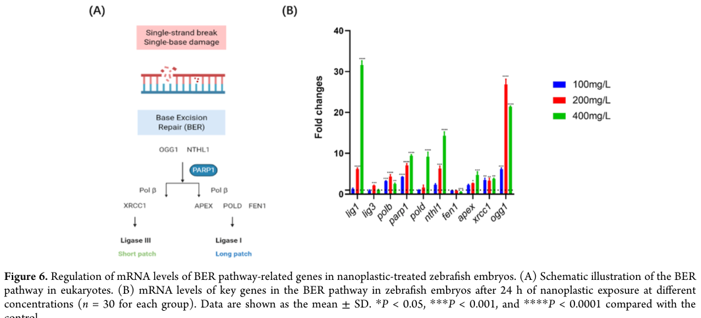
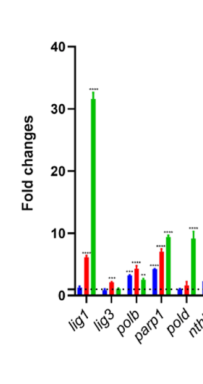

## Question

# Gene Research for Functional Annotation

## ⚠️ CRITICAL: Gene/Protein Identification Context

**BEFORE YOU BEGIN RESEARCH:** You MUST verify you are researching the CORRECT gene/protein. Gene symbols can be ambiguous, especially for less well-characterized genes from non-model organisms.

### Target Gene/Protein Identity (from UniProt):
- **UniProt Accession:** Q6DRD3
- **Protein Description:** RecName: Full=DNA polymerase beta {ECO:0000250|UniProtKB:P06746}; EC=2.7.7.7 {ECO:0000250|UniProtKB:P06746}; AltName: Full=5'-deoxyribose-phosphate lyase {ECO:0000250|UniProtKB:P06746}; Short=5'-dRP lyase {ECO:0000250|UniProtKB:P06746}; EC=4.2.99.- {ECO:0000250|UniProtKB:P06746}; AltName: Full=AP lyase {ECO:0000250|UniProtKB:P06746}; EC=4.2.99.18 {ECO:0000250|UniProtKB:P06746};
- **Gene Information:** Name=polb;
- **Organism (full):** Danio rerio (Zebrafish) (Brachydanio rerio).
- **Protein Family:** Belongs to the DNA polymerase type-X family. .
- **Key Domains:** DNA-dir_DNA_pol_X. (IPR002054); DNA_pol-X_BS. (IPR019843); DNA_pol_B_palm_palm. (IPR028207); DNA_pol_lambd_fingers_domain. (IPR018944); DNA_pol_lamdba_lyase_dom_sf. (IPR027421)

### MANDATORY VERIFICATION STEPS:

1. **Check if the gene symbol "polb" matches the protein description above**
2. **Verify the organism is correct:** Danio rerio (Zebrafish) (Brachydanio rerio).
3. **Check if protein family/domains align with what you find in literature**
4. **If you find literature for a DIFFERENT gene with the same or similar symbol, STOP**

### If Gene Symbol is Ambiguous or You Cannot Find Relevant Literature:

**DO NOT PROCEED WITH RESEARCH ON A DIFFERENT GENE.** Instead:
- State clearly: "The gene symbol 'polb' is ambiguous or literature is limited for this specific protein"
- Explain what you found (e.g., "Found extensive literature on a different gene with the same symbol in a different organism")
- Describe the protein based ONLY on the UniProt information provided above
- Suggest that the protein function can be inferred from domain/family information

### Research Target:

Please provide a comprehensive research report on the gene **polb** (gene ID: polb, UniProt: Q6DRD3) in DANRE.

The research report should be a detailed narrative explaining the function, biological processes, and localization of the gene product. Citations should be given for all claims.

You should prioritize authoritative reviews and primary scientific literature when conducting research. You can supplement
this with annotations you find in gene/protein databases, but these can be outdated or inaccurate.

We are specifically interested in the primary function of the gene - for enzymes, what reaction is catalyzed, and what is the substrate specificity? For transporters, what is the substrate? For structural proteins or adapters, what is the broader structural role? For signaling molecules, what is the role in the pathway.

We are interested in where in or outside the cell the gene product carries out its function.

We are also interested in the signaling or biochemical pathways in which the gene functions. We are less interested in broad pleiotropic effects, except where these elucidate the precise role.

Include evidence where possible. We are interested in both experimental evidence as well as inference from structure, evolution, or bioinformatic analysis. Precise studies should be prioritized over high-throughput, where available.

## Output

Question: You are an expert researcher providing comprehensive, well-cited information.

Provide detailed information focusing on:
1. Key concepts and definitions with current understanding
2. Recent developments and latest research (prioritize 2023-2024 sources)
3. Current applications and real-world implementations
4. Expert opinions and analysis from authoritative sources
5. Relevant statistics and data from recent studies

Format as a comprehensive research report with proper citations. Include URLs and publication dates where available.
Always prioritize recent, authoritative sources and provide specific citations for all major claims.

# Gene Research for Functional Annotation

## ⚠️ CRITICAL: Gene/Protein Identification Context

**BEFORE YOU BEGIN RESEARCH:** You MUST verify you are researching the CORRECT gene/protein. Gene symbols can be ambiguous, especially for less well-characterized genes from non-model organisms.

### Target Gene/Protein Identity (from UniProt):
- **UniProt Accession:** Q6DRD3
- **Protein Description:** RecName: Full=DNA polymerase beta {ECO:0000250|UniProtKB:P06746}; EC=2.7.7.7 {ECO:0000250|UniProtKB:P06746}; AltName: Full=5'-deoxyribose-phosphate lyase {ECO:0000250|UniProtKB:P06746}; Short=5'-dRP lyase {ECO:0000250|UniProtKB:P06746}; EC=4.2.99.- {ECO:0000250|UniProtKB:P06746}; AltName: Full=AP lyase {ECO:0000250|UniProtKB:P06746}; EC=4.2.99.18 {ECO:0000250|UniProtKB:P06746};
- **Gene Information:** Name=polb;
- **Organism (full):** Danio rerio (Zebrafish) (Brachydanio rerio).
- **Protein Family:** Belongs to the DNA polymerase type-X family. .
- **Key Domains:** DNA-dir_DNA_pol_X. (IPR002054); DNA_pol-X_BS. (IPR019843); DNA_pol_B_palm_palm. (IPR028207); DNA_pol_lambd_fingers_domain. (IPR018944); DNA_pol_lamdba_lyase_dom_sf. (IPR027421)

### MANDATORY VERIFICATION STEPS:

1. **Check if the gene symbol "polb" matches the protein description above**
2. **Verify the organism is correct:** Danio rerio (Zebrafish) (Brachydanio rerio).
3. **Check if protein family/domains align with what you find in literature**
4. **If you find literature for a DIFFERENT gene with the same or similar symbol, STOP**

### If Gene Symbol is Ambiguous or You Cannot Find Relevant Literature:

**DO NOT PROCEED WITH RESEARCH ON A DIFFERENT GENE.** Instead:
- State clearly: "The gene symbol 'polb' is ambiguous or literature is limited for this specific protein"
- Explain what you found (e.g., "Found extensive literature on a different gene with the same symbol in a different organism")
- Describe the protein based ONLY on the UniProt information provided above
- Suggest that the protein function can be inferred from domain/family information

### Research Target:

Please provide a comprehensive research report on the gene **polb** (gene ID: polb, UniProt: Q6DRD3) in DANRE.

The research report should be a detailed narrative explaining the function, biological processes, and localization of the gene product. Citations should be given for all claims.

You should prioritize authoritative reviews and primary scientific literature when conducting research. You can supplement
this with annotations you find in gene/protein databases, but these can be outdated or inaccurate.

We are specifically interested in the primary function of the gene - for enzymes, what reaction is catalyzed, and what is the substrate specificity? For transporters, what is the substrate? For structural proteins or adapters, what is the broader structural role? For signaling molecules, what is the role in the pathway.

We are interested in where in or outside the cell the gene product carries out its function.

We are also interested in the signaling or biochemical pathways in which the gene functions. We are less interested in broad pleiotropic effects, except where these elucidate the precise role.

Include evidence where possible. We are interested in both experimental evidence as well as inference from structure, evolution, or bioinformatic analysis. Precise studies should be prioritized over high-throughput, where available.

## Research Report: Functional Annotation of **polb** (DNA polymerase beta) in **Danio rerio** (UniProt: **Q6DRD3**)

### 1) Target verification (gene/protein identity and ambiguity check)
The UniProt target provided (Q6DRD3) is annotated as **DNA polymerase beta (Pol β)** in **Danio rerio**, encoded by **polb**, and classified in the **DNA polymerase type-X family** with an N-terminal **5′-deoxyribose-phosphate (5′-dRP) lyase** domain and a C-terminal **DNA polymerase/nucleotidyltransferase** domain. The literature captured here consistently uses “Pol β / polb” to denote the **base excision repair (BER) gap-filling polymerase** in zebrafish and other vertebrates, matching the UniProt-provided identity rather than an unrelated gene symbol reuse. In particular, Pol β is described as a dual-function enzyme with **dRP lyase** and **polymerase** activities and conserved active-site architecture, supporting that zebrafish **polb** is the orthologous BER polymerase. (sobol2024mousemodelsto pages 1-3, almohdar2024impactofdna pages 1-2)

### 2) Key concepts and definitions (current understanding)
#### 2.1 Base excision repair (BER)
**Base excision repair (BER)** is the dominant pathway for repair of small, non-helix-distorting base lesions and abasic (AP) sites generated by oxidation, deamination, alkylation, and spontaneous base loss. In the canonical sequence, a DNA glycosylase excises a damaged base to form an AP site, an AP endonuclease (APE1/Apex1) cleaves the backbone, and downstream enzymes restore the correct nucleotide and seal the strand break. (dey2023dnarepairgenes pages 4-5, scalera2024investigationsofthe pages 27-29, gohil2023baseexcisionrepair pages 6-8)

#### 2.2 What Pol β does in BER (core enzymatic activities)
**DNA polymerase β (Pol β)** is a core BER enzyme that performs two coupled downstream reactions:
1) **Gap-filling DNA synthesis**: Pol β catalyzes **template-directed insertion** of the correct nucleotide into the repair gap (classically a 1-nt gap in “short-patch” BER). (dey2023dnarepairgenes pages 4-5, scalera2024investigationsofthe pages 27-29, almohdar2024impactofdna pages 1-2)
2) **5′-dRP lyase reaction**: Pol β removes the **5′-deoxyribose phosphate (5′-dRP)** blocking group left at the 5′ end after incision at an AP site, enabling final ligation. (almohdar2024impactofdna pages 1-2, shahi2026harnessingdnapolymerase pages 1-2)

Mechanistically, recent synthesis sources describe Pol β as having separable domains for these activities (N-terminal dRP lyase and C-terminal nucleotidyltransferase), with conserved catalytic residues in mammalian Pol β including **K72** (dRP lyase) and the polymerase active-site **Asp triad (D190/D192/D256)**—information that supports functional inference for the zebrafish ortholog. (sobol2024mousemodelsto pages 1-3)

#### 2.3 Short-patch vs long-patch BER
BER is often partitioned into:
- **Short-patch BER (SN-BER)**: typically replaces **one nucleotide**, with Pol β performing gap filling and then ligation commonly by **XRCC1–LIG3α** (in many vertebrate models). (dey2023dnarepairgenes pages 4-5, scalera2024investigationsofthe pages 27-29)
- **Long-patch BER (LP-BER)**: replaces a longer tract; synthesis can involve polymerase switching and downstream processing of flap intermediates (e.g., **FEN1**, **PCNA**, **RPA**, and ligases). A recent review summarizes LP-BER patch sizes as **2–11 nt** and also describes a distinct 5′-gap LP-BER model with a **9-nt gap** and **8-nt flap** intermediate, with reported incorporation of **~20 nt** in that pathway context. (gohil2023baseexcisionrepair pages 6-8)

### 3) Pathways, interactions, and where the protein acts
#### 3.1 Pathway placement in zebrafish
Zebrafish-focused synthesis sources place **polb** in BER with the conserved step order: lesion recognition/excision → AP site incision by **Apex1** → **nucleotide replacement by Pol β** → nick sealing by **XRCC1–LIG3α**. (dey2023dnarepairgenes pages 4-5, scalera2024investigationsofthe pages 27-29)

#### 3.2 Protein–protein interactions relevant to Pol β function (authoritative mechanistic sources)
A 2024 Journal of Biological Chemistry study focusing on downstream BER coordination emphasizes that Pol β function depends critically on **handoffs** and **protein–protein interactions** with ligases and APE1. It highlights that Pol β performs both the **5′-dRP lyase** step and **gap-filling synthesis**, and that **ligase interactions (LIG1 or LIGIIIα)** strongly influence successful nick sealing; defects in coordination can yield abortive intermediates that block ligation and contribute to genome instability. (almohdar2024impactofdna pages 1-2)

A 2024 review of Pol β mouse models also catalogs many interaction partners reported for Pol β regulation and recruitment in mammalian systems, including **PARP1** and **XRCC1**, and other factors (e.g., NEIL1/2). These interactions are relevant to zebrafish primarily by **orthology-based inference** rather than being directly demonstrated in the zebrafish-specific sources retrieved here. (sobol2024mousemodelsto pages 1-3, sobol2024mousemodelsto pages 12-14)

#### 3.3 Subcellular localization (nuclear vs mitochondrial)
For zebrafish **polb**, the retrieved zebrafish-focused sources support its assignment to BER but do **not** provide direct subcellular localization experiments (e.g., immunofluorescence or biochemical fractionation). Thus:
- **Nuclear function** is strongly supported by the canonical BER role described for Pol β. (dey2023dnarepairgenes pages 4-5, scalera2024investigationsofthe pages 27-29)
- **Mitochondrial BER participation** is supported in vertebrate literature syntheses (mouse/human-focused) indicating Pol β can also function in mitochondria, but this remains **inferred for zebrafish** based on conservation rather than directly shown in the zebrafish-specific evidence captured here. (sobol2024mousemodelsto pages 1-3, ong2025structurefunctionanalysisa pages 108-110)

### 4) Zebrafish-specific evidence: development, expression, and physiological context
#### 4.1 Developmental regulation and early embryogenesis
A fish-embryo DNA repair review reports that **BER operates across fish development**, but emphasizes that BER in **zebrafish eggs and early embryos** appears less efficient than in adults. It specifically notes that in zebrafish, **polb mRNA is present at all embryonic stages**, yet **Pol β protein is reportedly absent in eggs and early embryos until gastrulation**, suggesting an early developmental stage where canonical Pol β-dependent SN-BER capacity may be limited. The same synthesis describes lower BER enzyme activities in early embryos (e.g., **Udg and Ape1 activities lower in 3.5 hpf embryos** than in adults), and discusses regulatory connections involving Apex/Creb1 that may influence Pol β expression prior to gastrulation. (dey2023dnarepairgenes pages 4-5)

A 2024 zebrafish DNA-damage-response synthesis likewise lists **pol β** among core BER genes/proteins in zebrafish and reiterates a zebrafish-embryo distinction: **embryos lack Pol β** and rely more on replicative polymerases and Mg2+-dependent endonuclease activity early, whereas Apex1/Apex2 are highly expressed in embryos and participate in early oxidative-damage repair. (scalera2024investigationsofthe pages 27-29)

Interpretation: these sources together support a model in which zebrafish **polb** is a canonical BER factor but may be **developmentally limited** at the protein level before gastrulation, implying stage-specific reliance on alternative polymerase activities early in embryogenesis. (dey2023dnarepairgenes pages 4-5, scalera2024investigationsofthe pages 27-29)

#### 4.2 Environmental/toxicant response contexts (real-world implementations in zebrafish assays)
Zebrafish embryos are widely used to evaluate environmental genotoxicants and oxidative stress. In one well-cited experimental study, zebrafish embryos exposed to **100 nm polystyrene nanoplastics** (0, 100, 200, 400 mg/L) showed altered expression of BER-pathway genes including **polb**, consistent with BER pathway engagement during oxidative stress. (feng2022polystyrenenanoplasticexposure pages 1-2)

In that study, exposure of embryos starting at **24 hpf** for **24 h** led to oxidative stress with **ROS increases of 1.27-fold, 1.47-fold, and 2.23-fold** at **100, 200, and 400 mg/L**, respectively, and the authors reported that **polb expression increased at lower concentrations (<200 mg/L)** and **slightly decreased at 400 mg/L**. (feng2022polystyrenenanoplasticexposure pages 5-6)

Figure-level evidence from the paper (BER gene-expression panel including polb) is shown in Figure 6, which visually supports the reported **directional trend** for polb across doses. (feng2022polystyrenenanoplasticexposure media 1eee0503, feng2022polystyrenenanoplasticexposure media e296e8ed)

### 5) Recent developments and latest research (prioritizing 2023–2024)
#### 5.1 2023–2024: refined mechanistic views of BER organization and coordination
Recent reviews emphasize that BER is not a single linear pathway but a set of subpathways (SN-BER, LP-BER, replication- and transcription-associated BER) with coordinated “handoffs” among enzymes and scaffolds. Quantitative pathway descriptors (e.g., typical **2–11 nt** LP-BER patch sizes; 5′-gap pathway intermediates including a **9-nt gap** and **8-nt flap**) help constrain expectations for the kinds of BER intermediates that Pol β-related assays may measure. (gohil2023baseexcisionrepair pages 6-8)

A 2024 mechanistic study directly analyzes how **DNA ligases (LIG1, LIGIIIα)** and **APE1** influence the **efficiency and fidelity of Pol β’s downstream BER steps**, underscoring that functional annotation of Pol β should include not only catalytic activities but also **ligase-coupled coordination** and avoidance of abortive repair intermediates. (almohdar2024impactofdna pages 1-2)

#### 5.2 2024: organismal genetics perspectives (relevance to functional annotation)
A 2024 review of Pol β mouse models consolidates evidence that Pol β is essential at the organismal level (loss leads to early lethality in mouse), and highlights new knock-in models that separate recruitment/stability from catalytic function (e.g., disruption of binding to XRCC1 affecting recruitment/stability). While not zebrafish-specific, this provides an authoritative framework for what phenotypes might be expected from strong loss-of-function or recruitment-defective **polb** alleles in vertebrates and highlights **XRCC1** as an obligate functional partner in vivo. (sobol2024mousemodelsto pages 1-3, sobol2024mousemodelsto pages 12-14)

### 6) Quantitative statistics/data points from the retrieved sources
The most relevant quantitative and semi-quantitative data points captured in the retrieved evidence include:
- **Developmental timing (zebrafish)**: reduced BER enzyme activities noted in embryos at **3.5 hpf**; Pol β protein reported absent until **gastrulation** despite polb mRNA presence. (dey2023dnarepairgenes pages 4-5)
- **LP-BER tract sizes (mechanistic review)**: typical LP-BER patches of **2–11 nt**, and a distinct LP-BER 5′-gap pathway with a **9-nt gap**, **8-nt flap**, and reported incorporation of **~20 nt**. (gohil2023baseexcisionrepair pages 6-8)
- **Environmental exposure and oxidative stress (zebrafish embryos)**: polystyrene nanoplastic exposures at **0/100/200/400 mg/L**; ROS increased **1.27×, 1.47×, 2.23×** at 100/200/400 mg/L, respectively; polb expression directionally increased at lower doses and slightly decreased at the highest dose (as described in text and supported by the figure). (feng2022polystyrenenanoplasticexposure pages 5-6, feng2022polystyrenenanoplasticexposure media 1eee0503, feng2022polystyrenenanoplasticexposure media e296e8ed)

### 7) Current applications and real-world implementations
In practice, zebrafish **polb** is used primarily as:
- A **BER pathway marker gene** in embryo toxicology and environmental-genotoxicity studies, where altered polb expression is interpreted as engagement of BER under oxidative stress conditions (e.g., nanoplastic exposure). (feng2022polystyrenenanoplasticexposure pages 5-6, feng2022polystyrenenanoplasticexposure pages 1-2, feng2022polystyrenenanoplasticexposure media 1eee0503)
- A component in **developmental DNA repair frameworks**, where early embryo reliance on alternative polymerases and developmental control of DNA repair capacity is studied to understand embryo susceptibility to genotoxins. (dey2023dnarepairgenes pages 4-5, scalera2024investigationsofthe pages 27-29)

### 8) Evidence-organized summary table
The following table consolidates zebrafish-specific evidence and conserved mechanistic annotation for zebrafish Pol β.

| Category | Key points | Best supporting sources (with citation IDs) | Links (DOI/URL + publication date when available) |
|---|---|---|---|
| Identity/domains | Target identity is **Danio rerio polb / DNA polymerase beta** (UniProt Q6DRD3), a **type-X family DNA polymerase**. Conserved Pol β architecture supports the UniProt annotation: an **N-terminal 5'-dRP lyase domain** and **C-terminal nucleotidyl-transferase/polymerase domain**. Mammalian Pol β is a **335 aa, ~39 kDa** protein; active-site residues defining these activities include **K72** for dRP lyase and **D190/D192/D256** for polymerase catalysis, supporting functional inference for zebrafish ortholog Q6DRD3. (sobol2024mousemodelsto pages 1-3, almohdar2024impactofdna pages 1-2) | Sobol 2024 review (sobol2024mousemodelsto pages 1-3); Almohdar et al. 2024 JBC (almohdar2024impactofdna pages 1-2) | Sobol 2024, *Environ Mol Mutagen* (Apr 2024): https://doi.org/10.1002/em.22593 ; Almohdar et al. 2024, *J Biol Chem* (Jun 2024): https://doi.org/10.1016/j.jbc.2024.107355 |
| Core reactions | Primary biochemical role in **base excision repair (BER)**: Pol β (1) performs **template-directed single-nucleotide gap filling** and (2) removes the **5'-deoxyribose phosphate (5'-dRP)** blocking group via its **dRP lyase/AP lyase** activity before ligation. Pol β has highest catalytic activity on **5'-phosphorylated 1-nt gapped DNA** and typically inserts the **first nucleotide** in repair intermediates. (gohil2023baseexcisionrepair pages 6-8, almohdar2024impactofdna pages 1-2, shahi2026harnessingdnapolymerase pages 1-2) | Gohil et al. 2023 review (gohil2023baseexcisionrepair pages 6-8); Almohdar et al. 2024 (almohdar2024impactofdna pages 1-2); Shahi et al. 2026 review summary (shahi2026harnessingdnapolymerase pages 1-2) | Gohil et al. 2023, *Int J Mol Sci* (Sep 2023): https://doi.org/10.3390/ijms241814186 ; Almohdar et al. 2024 (Jun 2024): https://doi.org/10.1016/j.jbc.2024.107355 ; Shahi et al. 2026 (Jan 2026): https://doi.org/10.3389/jpps.2025.15360 |
| Pathway context | In canonical **short-patch BER**, a damaged base is removed by a glycosylase, **APE1/Apex1** cleaves the AP site, **Pol β fills the gap**, and the nick is sealed by **XRCC1-LIG3α**. Pol β also contributes to **long-patch BER (LP-BER)**, where it may add the first nucleotide before **Pol δ/ε** extension; downstream factors include **FEN1, PCNA, RPA, LIG1/LIG3**. Reviews also note roles in **nucleotide incision repair**, replication-stress responses, and **TET-mediated DNA demethylation**. (dey2023dnarepairgenes pages 4-5, scalera2024investigationsofthe pages 27-29, sobol2024mousemodelsto pages 1-3, gohil2023baseexcisionrepair pages 6-8) | Dey et al. 2023 fish embryo review (dey2023dnarepairgenes pages 4-5); Scalera 2024 thesis/review material (scalera2024investigationsofthe pages 27-29); Sobol 2024 (sobol2024mousemodelsto pages 1-3); Gohil et al. 2023 (gohil2023baseexcisionrepair pages 6-8) | Dey et al. 2023, *Front Cell Dev Biol* (Mar 2023): https://doi.org/10.3389/fcell.2023.1119229 ; Scalera 2024 (Jan 2024): https://doi.org/10.25358/openscience-10606 ; Sobol 2024: https://doi.org/10.1002/em.22593 ; Gohil et al. 2023: https://doi.org/10.3390/ijms241814186 |
| Key protein partners | Best-supported conserved partners around Pol β include **XRCC1**, **LIG3α**, **LIG1**, **APE1**, **PARP1**, **FEN1**, **PCNA**, **RPA**, **Neil1/Neil2**, **APC**, **P300**, **PRMT1/PRMT6**, and **TRF2**. Recent work emphasizes that **ligase–Pol β coordination** is critical: disrupted interplay lowers nick-sealing efficiency and can generate abortive repair intermediates. (sobol2024mousemodelsto pages 1-3, almohdar2024impactofdna pages 1-2, sobol2024mousemodelsto pages 12-14) | Sobol 2024 (sobol2024mousemodelsto pages 1-3, sobol2024mousemodelsto pages 12-14); Almohdar et al. 2024 (almohdar2024impactofdna pages 1-2) | Sobol 2024 (Apr 2024): https://doi.org/10.1002/em.22593 ; Almohdar et al. 2024 (Jun 2024): https://doi.org/10.1016/j.jbc.2024.107355 |
| Subcellular localization | Functional inference from vertebrate Pol β literature indicates predominant action in the **nucleus** during BER, with evidence that Pol β also functions in **mitochondrial BER**. For zebrafish polb specifically, the retrieved evidence supports BER pathway assignment but does **not** provide direct zebrafish subcellular-localization experiments; thus **nuclear localization is strongly inferred**, and **mitochondrial participation remains plausible by orthology rather than directly shown here**. (sobol2024mousemodelsto pages 1-3, ong2025structurefunctionanalysisa pages 108-110) | Sobol 2024 review (sobol2024mousemodelsto pages 1-3); compiled Pol β structure/function references (ong2025structurefunctionanalysisa pages 108-110) | Sobol 2024 (Apr 2024): https://doi.org/10.1002/em.22593 ; Ong 2025 summary/references (2025): journal unspecified |
| Zebrafish embryogenesis evidence | Fish/zebrafish reviews consistently place polb in BER during embryogenesis. In zebrafish, **polb mRNA is reported at all embryonic stages**, but **Pol β protein is absent in eggs and early embryos until gastrulation**; early embryos appear to rely on an **aphidicolin-sensitive replicative polymerase** instead. **Udg and Ape1 activities are lower in 3.5 hpf embryos** than in adults, indicating reduced BER capacity early in development. Apex1/creb1 regulatory relationships have been proposed to influence Pol β expression before gastrulation. (dey2023dnarepairgenes pages 4-5, scalera2024investigationsofthe pages 27-29) | Dey et al. 2023 review of fish embryo DNA repair (dey2023dnarepairgenes pages 4-5); Scalera 2024 zebrafish DNA-damage-response synthesis (scalera2024investigationsofthe pages 27-29) | Dey et al. 2023 (Mar 2023): https://doi.org/10.3389/fcell.2023.1119229 ; Scalera 2024 (Jan 2024): https://doi.org/10.25358/openscience-10606 |
| Zebrafish environmental/toxicant response evidence | In zebrafish embryos exposed to **100 nm polystyrene nanoplastics**, **polb mRNA changed significantly** as part of a BER-response signature. The text reports **polb increased at lower concentrations (<200 mg/L)** and **slightly decreased at 400 mg/L** after exposure of **24 hpf embryos for 24 h**. The same study linked BER-gene changes with developmental toxicity and oxidative stress. (feng2022polystyrenenanoplasticexposure pages 5-6, feng2022polystyrenenanoplasticexposure pages 1-2, feng2022polystyrenenanoplasticexposure pages 7-8, feng2022polystyrenenanoplasticexposure media 1eee0503) | Feng et al. 2022 ACS Omega (feng2022polystyrenenanoplasticexposure pages 5-6, feng2022polystyrenenanoplasticexposure pages 1-2, feng2022polystyrenenanoplasticexposure pages 7-8); Figure 6 image summary (feng2022polystyrenenanoplasticexposure media 1eee0503) | Feng et al. 2022, *ACS Omega* (Aug 2022): https://doi.org/10.1021/acsomega.2c03378 |
| Quantitative datapoints | Available quantitative values from retrieved evidence: **3.5 hpf** marks reduced BER enzyme activity relative to adults in zebrafish embryos; **gastrulation** marks the stage after which Pol β protein becomes detectable in zebrafish reviews. In BER mechanism reviews, LP-BER repair patches are typically **2–11 nt**; a distinct **5'-gap LP-BER** model includes a **9-nt gap**, **8-nt flap**, and reported incorporation of **20 nt**. In nanoplastic-exposed zebrafish embryos, exposure concentrations were **0, 100, 200, 400 mg/L**; ROS increased **1.27-fold, 1.47-fold, and 2.23-fold** at **100, 200, and 400 mg/L**, respectively. Figure-based extraction suggests the **polb** qPCR bars are modestly elevated at **100 and 200 mg/L** and near/below control at **400 mg/L**, but exact fold values are not readable with confidence from the available image crop, so they should not be over-interpreted. (dey2023dnarepairgenes pages 4-5, gohil2023baseexcisionrepair pages 6-8, feng2022polystyrenenanoplasticexposure pages 5-6, feng2022polystyrenenanoplasticexposure media 1eee0503, feng2022polystyrenenanoplasticexposure media e296e8ed) | Dey et al. 2023 (dey2023dnarepairgenes pages 4-5); Gohil et al. 2023 (gohil2023baseexcisionrepair pages 6-8); Feng et al. 2022 and figure/image summaries (feng2022polystyrenenanoplasticexposure pages 5-6, feng2022polystyrenenanoplasticexposure media 1eee0503, feng2022polystyrenenanoplasticexposure media e296e8ed) | Dey et al. 2023 (Mar 2023): https://doi.org/10.3389/fcell.2023.1119229 ; Gohil et al. 2023 (Sep 2023): https://doi.org/10.3390/ijms241814186 ; Feng et al. 2022 (Aug 2022): https://doi.org/10.1021/acsomega.2c03378 |

*Table: This table summarizes functional annotation for zebrafish polb (UniProt Q6DRD3) by integrating zebrafish-specific evidence with conserved Pol β biochemistry. It highlights what is directly shown in zebrafish versus what is inferred from broader vertebrate DNA repair literature.*

### 9) Limitations of the current evidence base (for this tool run)
- Direct experimental evidence for **subcellular localization of zebrafish Pol β** (nuclear vs mitochondrial) was not captured in the zebrafish-specific documents retrieved here; mitochondrial participation is therefore presented as **orthology-based inference** supported by vertebrate-focused reviews. (sobol2024mousemodelsto pages 1-3, ong2025structurefunctionanalysisa pages 108-110)
- For the nanoplastic study, precise **polb fold-change values** could not be extracted with high confidence from the available figure crop; only the qualitative direction and dose trend are reported as supported by the text and figure. (feng2022polystyrenenanoplasticexposure pages 5-6, feng2022polystyrenenanoplasticexposure media e296e8ed)

### 10) Key take-home functional annotation for Danio rerio polb (Q6DRD3)
**polb encodes DNA polymerase beta (Pol β), the principal BER gap-filling polymerase that (i) fills short DNA gaps created during BER and (ii) removes the 5′-dRP blocking group via intrinsic lyase activity to enable ligation.** In zebrafish, polb is part of the conserved BER module (Apex1 → Pol β → XRCC1/LIG3α) and appears developmentally regulated, with evidence that early embryos may lack Pol β protein until gastrulation despite polb mRNA presence. Pol β also functions in broader vertebrate contexts including LP-BER coordination and (by inference) may participate in mitochondrial BER, but direct zebrafish localization data were not captured in the retrieved sources. (dey2023dnarepairgenes pages 4-5, scalera2024investigationsofthe pages 27-29, sobol2024mousemodelsto pages 1-3, almohdar2024impactofdna pages 1-2)

References

1. (sobol2024mousemodelsto pages 1-3): Robert W. Sobol. Mouse models to explore the biological and organismic role of dna polymerase beta. Environmental and Molecular Mutagenesis, 65:57-71, Apr 2024. URL: https://doi.org/10.1002/em.22593, doi:10.1002/em.22593. This article has 3 citations and is from a peer-reviewed journal.

2. (almohdar2024impactofdna pages 1-2): Danah Almohdar, David Murcia, Qun Tang, Abigail Ortiz, Ernesto Martinez, Tanay Parwal, Pradnya R. Kamble, and Melike Çağlayan. Impact of dna ligase 1 and iiiα interactions with ape1 and polβ on the efficiency of base excision repair pathway at the downstream steps. Journal of Biological Chemistry, 300:107355, Jun 2024. URL: https://doi.org/10.1016/j.jbc.2024.107355, doi:10.1016/j.jbc.2024.107355. This article has 15 citations and is from a domain leading peer-reviewed journal.

3. (dey2023dnarepairgenes pages 4-5): Abhipsha Dey, Martin Flajšhans, Martin Pšenička, and Ievgeniia Gazo. Dna repair genes play a variety of roles in the development of fish embryos. Frontiers in Cell and Developmental Biology, Mar 2023. URL: https://doi.org/10.3389/fcell.2023.1119229, doi:10.3389/fcell.2023.1119229. This article has 26 citations.

4. (scalera2024investigationsofthe pages 27-29): Claudia Scalera. Investigations of the uv-induced dna damage response in human cells and zebrafish embryos. Text, Jan 2024. URL: https://doi.org/10.25358/openscience-10606, doi:10.25358/openscience-10606. This article has 1 citations and is from a peer-reviewed journal.

5. (gohil2023baseexcisionrepair pages 6-8): Dhara Gohil, Altaf H. Sarker, and Rabindra Roy. Base excision repair: mechanisms and impact in biology, disease, and medicine. International Journal of Molecular Sciences, 24:14186, Sep 2023. URL: https://doi.org/10.3390/ijms241814186, doi:10.3390/ijms241814186. This article has 124 citations.

6. (shahi2026harnessingdnapolymerase pages 1-2): Aashirwad Shahi, Shengyuan Zhao, and Dawit Kidane. Harnessing dna polymerase beta defect enhances synthetic lethality and treatment response in gastric cancer cells: implication for immunotherapy. Journal of Pharmacy &amp; Pharmaceutical Sciences, Jan 2026. URL: https://doi.org/10.3389/jpps.2025.15360, doi:10.3389/jpps.2025.15360. This article has 0 citations and is from a peer-reviewed journal.

7. (sobol2024mousemodelsto pages 12-14): Robert W. Sobol. Mouse models to explore the biological and organismic role of dna polymerase beta. Environmental and Molecular Mutagenesis, 65:57-71, Apr 2024. URL: https://doi.org/10.1002/em.22593, doi:10.1002/em.22593. This article has 3 citations and is from a peer-reviewed journal.

8. (ong2025structurefunctionanalysisa pages 108-110): V Ong. Structure function analysis of dna polymerase β and discovery of novel interactors. Unknown journal, 2025.

9. (feng2022polystyrenenanoplasticexposure pages 1-2): Mei-ling Feng, Juanjuan Luo, Y. Wan, Jiannan Zhang (张剑南), Chunjiao Lu, Maya Wang, Lu Dai, Xiaoqian Cao, Xiaojun Yang, and Yajun Wang. Polystyrene nanoplastic exposure induces developmental toxicity by activating the oxidative stress response and base excision repair pathway in zebrafish (danio rerio). ACS Omega, 7:32153-32163, Aug 2022. URL: https://doi.org/10.1021/acsomega.2c03378, doi:10.1021/acsomega.2c03378. This article has 108 citations and is from a peer-reviewed journal.

10. (feng2022polystyrenenanoplasticexposure pages 5-6): Mei-ling Feng, Juanjuan Luo, Y. Wan, Jiannan Zhang (张剑南), Chunjiao Lu, Maya Wang, Lu Dai, Xiaoqian Cao, Xiaojun Yang, and Yajun Wang. Polystyrene nanoplastic exposure induces developmental toxicity by activating the oxidative stress response and base excision repair pathway in zebrafish (danio rerio). ACS Omega, 7:32153-32163, Aug 2022. URL: https://doi.org/10.1021/acsomega.2c03378, doi:10.1021/acsomega.2c03378. This article has 108 citations and is from a peer-reviewed journal.

11. (feng2022polystyrenenanoplasticexposure media 1eee0503): Mei-ling Feng, Juanjuan Luo, Y. Wan, Jiannan Zhang (张剑南), Chunjiao Lu, Maya Wang, Lu Dai, Xiaoqian Cao, Xiaojun Yang, and Yajun Wang. Polystyrene nanoplastic exposure induces developmental toxicity by activating the oxidative stress response and base excision repair pathway in zebrafish (danio rerio). ACS Omega, 7:32153-32163, Aug 2022. URL: https://doi.org/10.1021/acsomega.2c03378, doi:10.1021/acsomega.2c03378. This article has 108 citations and is from a peer-reviewed journal.

12. (feng2022polystyrenenanoplasticexposure media e296e8ed): Mei-ling Feng, Juanjuan Luo, Y. Wan, Jiannan Zhang (张剑南), Chunjiao Lu, Maya Wang, Lu Dai, Xiaoqian Cao, Xiaojun Yang, and Yajun Wang. Polystyrene nanoplastic exposure induces developmental toxicity by activating the oxidative stress response and base excision repair pathway in zebrafish (danio rerio). ACS Omega, 7:32153-32163, Aug 2022. URL: https://doi.org/10.1021/acsomega.2c03378, doi:10.1021/acsomega.2c03378. This article has 108 citations and is from a peer-reviewed journal.

13. (feng2022polystyrenenanoplasticexposure pages 7-8): Mei-ling Feng, Juanjuan Luo, Y. Wan, Jiannan Zhang (张剑南), Chunjiao Lu, Maya Wang, Lu Dai, Xiaoqian Cao, Xiaojun Yang, and Yajun Wang. Polystyrene nanoplastic exposure induces developmental toxicity by activating the oxidative stress response and base excision repair pathway in zebrafish (danio rerio). ACS Omega, 7:32153-32163, Aug 2022. URL: https://doi.org/10.1021/acsomega.2c03378, doi:10.1021/acsomega.2c03378. This article has 108 citations and is from a peer-reviewed journal.

## Artifacts

- [Edison artifact artifact-00](polb-deep-research-falcon_artifacts/artifact-00.md)

## Citations

1. sobol2024mousemodelsto pages 1-3
2. gohil2023baseexcisionrepair pages 6-8
3. almohdar2024impactofdna pages 1-2
4. dey2023dnarepairgenes pages 4-5
5. scalera2024investigationsofthe pages 27-29
6. feng2022polystyrenenanoplasticexposure pages 1-2
7. feng2022polystyrenenanoplasticexposure pages 5-6
8. shahi2026harnessingdnapolymerase pages 1-2
9. ong2025structurefunctionanalysisa pages 108-110
10. sobol2024mousemodelsto pages 12-14
11. feng2022polystyrenenanoplasticexposure pages 7-8
12. https://doi.org/10.1002/em.22593
13. https://doi.org/10.1016/j.jbc.2024.107355
14. https://doi.org/10.3390/ijms241814186
15. https://doi.org/10.3389/jpps.2025.15360
16. https://doi.org/10.3389/fcell.2023.1119229
17. https://doi.org/10.25358/openscience-10606
18. https://doi.org/10.1021/acsomega.2c03378
19. https://doi.org/10.1002/em.22593,
20. https://doi.org/10.1016/j.jbc.2024.107355,
21. https://doi.org/10.3389/fcell.2023.1119229,
22. https://doi.org/10.25358/openscience-10606,
23. https://doi.org/10.3390/ijms241814186,
24. https://doi.org/10.3389/jpps.2025.15360,
25. https://doi.org/10.1021/acsomega.2c03378,