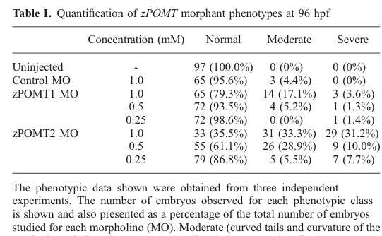

## Question

# Gene Research for Functional Annotation

## ⚠️ CRITICAL: Gene/Protein Identification Context

**BEFORE YOU BEGIN RESEARCH:** You MUST verify you are researching the CORRECT gene/protein. Gene symbols can be ambiguous, especially for less well-characterized genes from non-model organisms.

### Target Gene/Protein Identity (from UniProt):
- **UniProt Accession:** F1Q8R9
- **Protein Description:** RecName: Full=Protein O-mannosyl-transferase 2 {ECO:0000303|PubMed:18632251}; EC=2.4.1.109 {ECO:0000269|PubMed:20466645};
- **Gene Information:** Name=pomt2 {ECO:0000303|PubMed:18632251};
- **Organism (full):** Danio rerio (Zebrafish) (Brachydanio rerio).
- **Protein Family:** Belongs to the glycosyltransferase 39 family.
- **Key Domains:** ArnT-like_N. (IPR003342); MIR_dom_sf. (IPR036300); MIR_motif. (IPR016093); PMT-like. (IPR027005); PMT_4TMC. (IPR032421)

### MANDATORY VERIFICATION STEPS:

1. **Check if the gene symbol "pomt2" matches the protein description above**
2. **Verify the organism is correct:** Danio rerio (Zebrafish) (Brachydanio rerio).
3. **Check if protein family/domains align with what you find in literature**
4. **If you find literature for a DIFFERENT gene with the same or similar symbol, STOP**

### If Gene Symbol is Ambiguous or You Cannot Find Relevant Literature:

**DO NOT PROCEED WITH RESEARCH ON A DIFFERENT GENE.** Instead:
- State clearly: "The gene symbol 'pomt2' is ambiguous or literature is limited for this specific protein"
- Explain what you found (e.g., "Found extensive literature on a different gene with the same symbol in a different organism")
- Describe the protein based ONLY on the UniProt information provided above
- Suggest that the protein function can be inferred from domain/family information

### Research Target:

Please provide a comprehensive research report on the gene **pomt2** (gene ID: pomt2, UniProt: F1Q8R9) in DANRE.

The research report should be a detailed narrative explaining the function, biological processes, and localization of the gene product. Citations should be given for all claims.

You should prioritize authoritative reviews and primary scientific literature when conducting research. You can supplement
this with annotations you find in gene/protein databases, but these can be outdated or inaccurate.

We are specifically interested in the primary function of the gene - for enzymes, what reaction is catalyzed, and what is the substrate specificity? For transporters, what is the substrate? For structural proteins or adapters, what is the broader structural role? For signaling molecules, what is the role in the pathway.

We are interested in where in or outside the cell the gene product carries out its function.

We are also interested in the signaling or biochemical pathways in which the gene functions. We are less interested in broad pleiotropic effects, except where these elucidate the precise role.

Include evidence where possible. We are interested in both experimental evidence as well as inference from structure, evolution, or bioinformatic analysis. Precise studies should be prioritized over high-throughput, where available.

## Output

Question: You are an expert researcher providing comprehensive, well-cited information.

Provide detailed information focusing on:
1. Key concepts and definitions with current understanding
2. Recent developments and latest research (prioritize 2023-2024 sources)
3. Current applications and real-world implementations
4. Expert opinions and analysis from authoritative sources
5. Relevant statistics and data from recent studies

Format as a comprehensive research report with proper citations. Include URLs and publication dates where available.
Always prioritize recent, authoritative sources and provide specific citations for all major claims.

# Gene Research for Functional Annotation

## ⚠️ CRITICAL: Gene/Protein Identification Context

**BEFORE YOU BEGIN RESEARCH:** You MUST verify you are researching the CORRECT gene/protein. Gene symbols can be ambiguous, especially for less well-characterized genes from non-model organisms.

### Target Gene/Protein Identity (from UniProt):
- **UniProt Accession:** F1Q8R9
- **Protein Description:** RecName: Full=Protein O-mannosyl-transferase 2 {ECO:0000303|PubMed:18632251}; EC=2.4.1.109 {ECO:0000269|PubMed:20466645};
- **Gene Information:** Name=pomt2 {ECO:0000303|PubMed:18632251};
- **Organism (full):** Danio rerio (Zebrafish) (Brachydanio rerio).
- **Protein Family:** Belongs to the glycosyltransferase 39 family.
- **Key Domains:** ArnT-like_N. (IPR003342); MIR_dom_sf. (IPR036300); MIR_motif. (IPR016093); PMT-like. (IPR027005); PMT_4TMC. (IPR032421)

### MANDATORY VERIFICATION STEPS:

1. **Check if the gene symbol "pomt2" matches the protein description above**
2. **Verify the organism is correct:** Danio rerio (Zebrafish) (Brachydanio rerio).
3. **Check if protein family/domains align with what you find in literature**
4. **If you find literature for a DIFFERENT gene with the same or similar symbol, STOP**

### If Gene Symbol is Ambiguous or You Cannot Find Relevant Literature:

**DO NOT PROCEED WITH RESEARCH ON A DIFFERENT GENE.** Instead:
- State clearly: "The gene symbol 'pomt2' is ambiguous or literature is limited for this specific protein"
- Explain what you found (e.g., "Found extensive literature on a different gene with the same symbol in a different organism")
- Describe the protein based ONLY on the UniProt information provided above
- Suggest that the protein function can be inferred from domain/family information

### Research Target:

Please provide a comprehensive research report on the gene **pomt2** (gene ID: pomt2, UniProt: F1Q8R9) in DANRE.

The research report should be a detailed narrative explaining the function, biological processes, and localization of the gene product. Citations should be given for all claims.

You should prioritize authoritative reviews and primary scientific literature when conducting research. You can supplement
this with annotations you find in gene/protein databases, but these can be outdated or inaccurate.

We are specifically interested in the primary function of the gene - for enzymes, what reaction is catalyzed, and what is the substrate specificity? For transporters, what is the substrate? For structural proteins or adapters, what is the broader structural role? For signaling molecules, what is the role in the pathway.

We are interested in where in or outside the cell the gene product carries out its function.

We are also interested in the signaling or biochemical pathways in which the gene functions. We are less interested in broad pleiotropic effects, except where these elucidate the precise role.

Include evidence where possible. We are interested in both experimental evidence as well as inference from structure, evolution, or bioinformatic analysis. Precise studies should be prioritized over high-throughput, where available.

## Research report: functional annotation of **pomt2** (Danio rerio; UniProt **F1Q8R9**) — protein O-mannosyltransferase 2 (EC 2.4.1.109)

### 1) Target identity verification (critical disambiguation)
**Verified target:** zebrafish (**Danio rerio**) *pomt2* encodes **protein O-mannosyltransferase 2 (POMT2)**, a **glycosyltransferase family 39 (GT39), GT-C–type** membrane glycosyltransferase that catalyzes the initiating step of **protein O-mannosylation**. In zebrafish, a **single orthologue** of human **POMT2** was identified by genome/EST searches and phylogenetic analysis; the coding sequence was confirmed by RT-PCR cloning and mapped to **chromosome 14** (gene size ~15 kb). (Moore et al., **2008-09**, Genomics; https://doi.org/10.1016/j.ygeno.2008.05.008) (moore2008genesrequiredfor pages 1-2, moore2008genesrequiredfor pages 2-3). 
Independent cloning of zebrafish *pomt2* produced a **756-aa** protein with ~**70% identity** to human POMT2, consistent with UniProt F1Q8R9 being zebrafish POMT2. (Avşar-Ban et al., **2010-09**, Glycobiology; https://doi.org/10.1093/glycob/cwq069) (avsarban2010proteinomannosylationis pages 5-6).

**Ambiguity check:** Extensive literature exists on mammalian *POMT2*; however, the zebrafish orthologue is explicitly addressed in zebrafish-focused studies cited here, and the mechanistic enzyme function is conserved across metazoans. (avsarban2010proteinomannosylationis pages 5-6, moore2008genesrequiredfor pages 1-2).

### 2) Key concepts and current understanding
#### 2.1 Definition: protein O-mannosylation (POM)
**Protein O-mannosylation** is a post-translational modification in which a **mannose** residue is transferred to the hydroxyl group of **Ser/Thr** residues in protein substrates. In metazoans, the canonical initiating enzymes are **POMT1 and POMT2**, which function in the **endoplasmic reticulum (ER)** and use **dolichol-phosphate-mannose (Dol-P-Man)** as the activated donor. (Koff et al., **2023-08**, Glycobiology; https://doi.org/10.1093/glycob/cwad067) (koff2023proteinomannosylationone pages 1-2).

#### 2.2 Enzymatic function of zebrafish Pomt2 (reaction + substrates)
**Reaction (validated in zebrafish system):** zebrafish Pomt2 participates in transfer of mannose from a lipid-linked donor (**mannosylphosphoryldolichol / Dol-P-Man**) to protein acceptors, demonstrated using **GST–α-dystroglycan (α-DG)** as an acceptor in microsomal assays. (Avşar-Ban et al., **2010-09**; https://doi.org/10.1093/glycob/cwq069) (avsarban2010proteinomannosylationis pages 9-10).

**Acceptor specificity (current best evidence):** In the zebrafish assay, mannose was transferred onto **α-dystroglycan** and shown to be **α-linked** (supported by α-mannosidase sensitivity). (Avşar-Ban et al., **2010-09**) (avsarban2010proteinomannosylationis pages 6-9). Broader metazoan evidence indicates POMT1/2 act on Ser/Thr residues of particular extracellular/luminal protein regions (often disordered/mucin-like segments), but **a simple short consensus sequence is not established**; substrate recognition can depend on more extended features. (Koff et al., **2023-08**) (koff2023proteinomannosylationone pages 1-2).

#### 2.3 Obligate complex with Pomt1
A key mechanistic concept is that metazoan POMT activity requires an **obligate POMT1–POMT2 complex** (functionally consistent with a heterodimer). (Koff et al., **2023-08**) (koff2023proteinomannosylationone pages 1-2).
Zebrafish biochemical evidence strongly supports this: **high O-mannosyltransferase activity** in HEK293T microsomes was observed only when **zPOMT1 and zPOMT2 were co-expressed**; zPOMT2 alone gave only low activity and zPOMT1 alone none. (Avşar-Ban et al., **2010-09**) (avsarban2010proteinomannosylationis pages 6-9, avsarban2010proteinomannosylationis pages 9-10). A 2024 zebrafish dystroglycanopathy model paper also explicitly states that **pomt2 acts in a complex with Pomt1** to initiate O-mannosylation. (Karas et al., **2024-01**, Human Molecular Genetics; https://doi.org/10.1093/hmg/ddae006) (karas2024removalofpomt1 pages 4-4).

#### 2.4 Subcellular localization/topology (current understanding)
Direct zebrafish Pomt2 localization by organelle markers is not provided in the evidence excerpts; however:
- POMT1/2-class enzymes are described as **ER-localized, multi-pass integral membrane proteins**, consistent with the use of **Dol-P-Man** and luminal catalytic loops. (Koff et al., **2023-08**) (koff2023proteinomannosylationone pages 1-2, koff2023proteinomannosylationone pages 2-4).
- Zebrafish Pomt2 activity was measured from **microsomal membranes**, supporting membrane-embedded localization. (Avşar-Ban et al., **2010-09**) (avsarban2010proteinomannosylationis pages 6-9).

Given UniProt domain predictions supplied in the prompt (ArnT-like_N / PMT-like / multiple TM segments), and the GT-C class description in recent review literature, the most consistent model is that zebrafish Pomt2 is an **ER membrane-embedded GT-C enzyme with multiple transmembrane helices and luminal catalytic elements**, acting co-translationally/early in the secretory pathway. (koff2023proteinomannosylationone pages 1-2, koff2023proteinomannosylationone pages 2-4).

### 3) Pathway context: α-dystroglycan O-mannosylation and downstream elaboration
**Position in pathway:** Pomt2 (with Pomt1) catalyzes the **entry step** that produces **O-mannose** on proteins such as **α-dystroglycan (α-DG)**. (avsarban2010proteinomannosylationis pages 9-10, koff2023proteinomannosylationone pages 1-2).

**Downstream branching:** O-mannose can be extended into distinct O-mannose core structures (commonly termed **core M1, M2, and M3**), and the α-DG laminin-binding “functional glycan” (matriglycan) depends on the **core M3** branch. A 2023 review summarizes that POMT1/2-initiated O-mannose can be elaborated to **M1** (via POMGNT1), **M2** (via MGAT5B), or **core M3** (via POMGNT2) that enables matriglycan assembly (currently best established on α-DG). (Koff et al., **2023-08**) (koff2023proteinomannosylationone pages 2-4).

**Functional readout:** In zebrafish embryos, disruption of pomt genes reduces/abolishes detection of functionally glycosylated α-DG by the **IIH6 antibody**, connecting Pomt2 activity to α-DG functional glycosylation in vivo. (Avşar-Ban et al., **2010-09**) (avsarban2010proteinomannosylationis pages 1-2, avsarban2010proteinomannosylationis pages 6-9).

### 4) Zebrafish-specific biology: expression, development, and phenotypes
#### 4.1 Expression (embryo and adult)
**Maternal + embryonic expression:** zebrafish *pomt2* transcripts are detectable from the **1-cell stage** (maternal contribution) and throughout development by RT-PCR, and show prominent CNS/eye/muscle expression by ~24–30 hpf in in situ analyses. (Moore et al., **2008-09**) (moore2008genesrequiredfor pages 3-5, moore2008genesrequiredfor pages 2-3).

**Adult tissue expression:** zebrafish *pomt2* is reported as highly expressed in **ovary and testis**, with broad adult tissue expression assayed by qPCR. (Avşar-Ban et al., **2010-09**) (avsarban2010proteinomannosylationis pages 5-6, avsarban2010proteinomannosylationis pages 10-11).

#### 4.2 Loss-of-function and functional assays (quantitative)
**Morpholino knockdown (pomt2):** In zebrafish, pomt2 morphants show strong developmental defects (including tail curvature/twisting, pericardial edema, and abnormal eye pigmentation) and loss of IIH6-reactive glycosylated α-DG, consistent with disruption of the α-DG O-mannosylation pathway. (Avşar-Ban et al., **2010-09**) (avsarban2010proteinomannosylationis pages 6-9, avsarban2010proteinomannosylationis pages 10-11).

A key quantitative result is the **dose-dependent distribution** of normal/moderate/severe phenotypes at 96 hpf for pomt2 morphants (e.g., at **1.0 mM**: **35.5% normal / 33.3% moderate / 31.2% severe**). (Avşar-Ban et al., **2010-09**) (avsarban2010proteinomannosylationis pages 9-10, avsarban2010proteinomannosylationis media be1b51e2).

**pomt1 KO study contextualizing pomt2:** While focused on pomt1, a 2024 zebrafish model paper reports prior zebrafish **pomt2 CRISPR KO** outcomes (photoreceptor degeneration by **6 months**; and one mutant with mild hydrocephalus and muscular dystrophy by **2 months**), supporting that perturbing the initiating O-mannosylation machinery can yield dystroglycanopathy-like phenotypes in zebrafish. (Karas et al., **2024-01**) (karas2024removalofpomt1 pages 1-2).

The same 2024 study notes that maternal contributions can mask early phenotypes in zebrafish models; it also reports *pomt2* qPCR behavior in pomt1 mutants (variability in heterozygotes; no change in maternal-zygotic pomt1-null larvae at 5/10 dpf), implying that pomt2 transcript levels alone do not compensate for absence of Pomt1 protein in their system. (Karas et al., **2024-01**) (karas2024removalofpomt1 pages 4-4).

### 5) Recent developments and latest research (prioritizing 2023–2024)
#### 5.1 Updated conceptual model of metazoan O-mannosylation pathways (2023)
A 2023 Glycobiology review emphasizes that “protein O-mannosylation” in animals comprises multiple pathways and functions, with POMT1/2 as the canonical ER Dol-P-Man–dependent initiating enzymes, and highlights gaps in understanding such as **substrate selection rules** and broader roles beyond α-DG. (Koff et al., **2023-08**) (koff2023proteinomannosylationone pages 1-2).

#### 5.2 Improved zebrafish dystroglycanopathy modeling frameworks (2024)
A 2024 Human Molecular Genetics study demonstrates how **maternal mRNA** and **protein half-life** can mask early dystroglycanopathy phenotypes in zebrafish, showing that more severe phenotypes require maternal-zygotic removal strategies in some cases. Although centered on pomt1, its explicit positioning of pomt2 as Pomt1’s complex partner and its discussion of pomt2 KO phenotypes inform how pomt2 should be studied and interpreted in zebrafish. (Karas et al., **2024-01**) (karas2024removalofpomt1 pages 4-4, karas2024removalofpomt1 pages 1-2).

### 6) Current applications and real-world implementations
#### 6.1 Disease modeling: dystroglycanopathies and related neuromuscular disorders
Because Pomt2 is required to initiate α-DG O-mannosylation, disruption of pomt2 is directly relevant to **dystroglycanopathy mechanisms** (loss of functional glycosylation of α-DG). Zebrafish provides a vertebrate model in which early embryogenesis, muscle structure/function, and retina/CNS phenotypes can be monitored longitudinally, and where maternal contribution can be experimentally controlled. (avsarban2010proteinomannosylationis pages 1-2, avsarban2010proteinomannosylationis pages 6-9, karas2024removalofpomt1 pages 4-4, karas2024removalofpomt1 pages 1-2).

#### 6.2 Experimental tools/implementation in research workflows
**IIH6 immunostaining** (glyco-epitope on α-DG) is used as an in vivo functional assay for the dystroglycan O-mannosylation pathway in zebrafish embryos; pomt2 knockdown abolishes IIH6 signal. (Avşar-Ban et al., **2010-09**) (avsarban2010proteinomannosylationis pages 1-2, avsarban2010proteinomannosylationis media be1b51e2).

**Microsomal enzyme assays** using Dol-P-Man and α-DG fragments (e.g., GST–α-DG) provide a direct biochemical readout of Pomt1/2 activity and are portable across species combinations (zebrafish/human mixing experiments). (Avşar-Ban et al., **2010-09**) (avsarban2010proteinomannosylationis pages 9-10).

### 7) Expert analysis and interpretation (authoritative synthesis)
- The most strongly supported **primary function** of zebrafish Pomt2 is catalytic: **initiating O-mannosyl glycan synthesis** by transferring mannose from **Dol-P-Man** to proteins (α-DG is the best-supported substrate in zebrafish experiments). (avsarban2010proteinomannosylationis pages 9-10, koff2023proteinomannosylationone pages 1-2).
- Functional activity requires the **Pomt1–Pomt2 partnership**, suggesting Pomt2 is not a redundant paralog but an essential component of a two-subunit enzymatic unit; this is consistent across zebrafish biochemical reconstitution and modern review consensus. (avsarban2010proteinomannosylationis pages 9-10, koff2023proteinomannosylationone pages 1-2).
- Zebrafish developmental phenotypes (morphants; later KO reports summarized in 2024) and loss of α-DG glyco-epitope provide converging evidence that Pomt2’s physiological role is mediated substantially through **α-DG functional glycosylation**, impacting cell–ECM interactions in muscle, CNS, and retina. (avsarban2010proteinomannosylationis pages 6-9, karas2024removalofpomt1 pages 1-2).

### 8) Evidence summary table
| Topic | Key findings (1-2 sentences) | Evidence source(s) with year | URL |
|---|---|---|---|
| Identity/orthology evidence | Zebrafish **pomt2** is the single orthologue of human **POMT2** identified by genomic/phylogenetic analysis; its coding sequence was confirmed by RT-PCR/cloning, and it maps to zebrafish chromosome 14. Independent cloning identified a 756-aa zPOMT2 with ~70% identity to human POMT2, supporting that UniProt F1Q8R9 corresponds to zebrafish protein O-mannosyltransferase 2 (GT39) (moore2008genesrequiredfor pages 1-2, moore2008genesrequiredfor pages 2-3, avsarban2010proteinomannosylationis pages 5-6). | Moore et al., 2008; Avşar-Ban et al., 2010 | https://doi.org/10.1016/j.ygeno.2008.05.008 ; https://doi.org/10.1093/glycob/cwq069 |
| Enzymatic reaction & donor/acceptor | POMT2 participates in the first step of protein O-mannosylation: transfer of mannose from **mannosylphosphoryldolichol / Dol-P-Man** to Ser/Thr residues on protein substrates. In zebrafish assays, microsomes transferred mannose to **GST-α-dystroglycan** and the product was confirmed as **α-linked mannose** on the acceptor protein (avsarban2010proteinomannosylationis pages 9-10, avsarban2010proteinomannosylationis pages 6-9, koff2023proteinomannosylationone pages 1-2). | Avşar-Ban et al., 2010; Koff et al., 2023 | https://doi.org/10.1093/glycob/cwq069 ; https://doi.org/10.1093/glycob/cwad067 |
| Requirement for Pomt1/Pomt2 complex | High O-mannosyltransferase activity required co-expression of **zPOMT1 + zPOMT2**; zPOMT2 alone yielded only low activity and zPOMT1 alone none, indicating an obligate functional complex. Recent zebrafish work likewise states that **pomt2 acts in a complex with Pomt1 to initiate O-mannosylation** (avsarban2010proteinomannosylationis pages 9-10, avsarban2010proteinomannosylationis pages 10-11, karas2024removalofpomt1 pages 4-4, koff2023proteinomannosylationone pages 1-2). | Avşar-Ban et al., 2010; Karas et al., 2024; Koff et al., 2023 | https://doi.org/10.1093/glycob/cwq069 ; https://doi.org/10.1093/hmg/ddae006 ; https://doi.org/10.1093/glycob/cwad067 |
| Zebrafish expression (stages/tissues) | **pomt2** transcript is maternally present from the 1-cell stage and broadly expressed during embryogenesis; by ~24-30 hpf expression is prominent in CNS/brain, eye, somites/vertical myosepta, with adult enrichment also reported in ovary and testis. Reporter/in situ experiments further localized zPOMT2-related signal to eye, hindbrain, and somites (moore2008genesrequiredfor pages 2-3, moore2008genesrequiredfor pages 3-5, avsarban2010proteinomannosylationis pages 5-6, avsarban2010proteinomannosylationis pages 10-11). | Moore et al., 2008; Avşar-Ban et al., 2010 | https://doi.org/10.1016/j.ygeno.2008.05.008 ; https://doi.org/10.1093/glycob/cwq069 |
| Zebrafish loss-of-function phenotypes and quantitative stats | zPOMT2 morphants showed developmental delay, twisted/curved tail, pericardial edema, abnormal eye pigmentation, loss of IIH6-reactive glycosylated α-dystroglycan, and failure to thrive; at **1.0 mM MO**, reported classes were **35.5% normal, 33.3% moderate, 31.2% severe**, versus **61.1/28.9/10.0%** at 0.5 mM and **86.8/5.5/7.7%** at 0.25 mM. Later CRISPR-based zebrafish studies cited in 2024 reported **photoreceptor degeneration by 6 months** and one pomt2 mutant with **mild hydrocephalus and muscular dystrophy at 2 months** (avsarban2010proteinomannosylationis pages 9-10, avsarban2010proteinomannosylationis pages 10-11, avsarban2010proteinomannosylationis media be1b51e2, karas2024removalofpomt1 pages 1-2). | Avşar-Ban et al., 2010; Karas et al., 2024 | https://doi.org/10.1093/glycob/cwq069 ; https://doi.org/10.1093/hmg/ddae006 |
| Pathway placement (core M1/M2/M3/matriglycan) | POMT2 functions at the **entry step** of the α-dystroglycan O-mannosylation pathway in the **ER**, generating O-mannose that is later elaborated into **core M1/M2** or into **core M3**, the precursor required for **matriglycan** assembly on α-dystroglycan. Thus, POMT2 is upstream of the entire laminin-binding glycoepitope pathway rather than a core M1/M2/M3-specific downstream enzyme (koff2023proteinomannosylationone pages 1-2, koff2023proteinomannosylationone pages 2-4, avsarban2010proteinomannosylationis pages 1-2). | Koff et al., 2023; Avşar-Ban et al., 2010 | https://doi.org/10.1093/glycob/cwad067 ; https://doi.org/10.1093/glycob/cwq069 |

*Table: This table summarizes the core functional annotation evidence for zebrafish pomt2 / POMT2 (UniProt F1Q8R9), covering identity, enzymatic activity, complex formation, expression, phenotypes, and pathway placement. It is useful as a compact evidence map linking zebrafish-specific data to broader O-mannosylation biology.*

### 9) Key figures/tables supporting claims (visual evidence)
- **Table I (Avşar-Ban 2010)** quantifies dose-dependent pomt2 morphant phenotype frequencies (normal/moderate/severe) at 96 hpf. (avsarban2010proteinomannosylationis media be1b51e2)
- **Figure 5 (Avşar-Ban 2010)** shows the reconstituted POMT activity assay demonstrating that strong activity requires co-expression of zPOMT1 and zPOMT2. (avsarban2010proteinomannosylationis media 5ccf8c6f)
- **Figure 4C (Avşar-Ban 2010)** shows **IIH6** immunohistochemistry indicating loss of glycosylated α-dystroglycan signal in zPOMT morphants. (avsarban2010proteinomannosylationis media 542fe96c)

### 10) Limitations and open questions (as of 2023–2024 literature in hand)
- **Zebrafish Pomt2 membrane topology and precise ER subdomain localization** (e.g., luminal loop mapping; ER quality-control coupling; trafficking) are not directly resolved in the cited zebrafish primary papers; current statements rely on conserved GT-C/POMT properties summarized in authoritative reviews. (koff2023proteinomannosylationone pages 1-2, koff2023proteinomannosylationone pages 2-4).
- **Substrate specificity beyond α-dystroglycan** (e.g., receptor protein tyrosine phosphatases) is well established in broader metazoan literature, but zebrafish-specific substrate cataloging is not provided in the extracted zebrafish evidence here. (koff2023proteinomannosylationone pages 1-2).

References

1. (moore2008genesrequiredfor pages 1-2): Christopher J. Moore, Huey Tse Goh, and Jane E. Hewitt. Genes required for functional glycosylation of dystroglycan are conserved in zebrafish. Genomics, 92 3:159-67, Sep 2008. URL: https://doi.org/10.1016/j.ygeno.2008.05.008, doi:10.1016/j.ygeno.2008.05.008. This article has 58 citations and is from a peer-reviewed journal.

2. (moore2008genesrequiredfor pages 2-3): Christopher J. Moore, Huey Tse Goh, and Jane E. Hewitt. Genes required for functional glycosylation of dystroglycan are conserved in zebrafish. Genomics, 92 3:159-67, Sep 2008. URL: https://doi.org/10.1016/j.ygeno.2008.05.008, doi:10.1016/j.ygeno.2008.05.008. This article has 58 citations and is from a peer-reviewed journal.

3. (avsarban2010proteinomannosylationis pages 5-6): Eriko Avşar-Ban, Hisayoshi Ishikawa, H. Manya, M. Watanabe, Shinichi Akiyama, H. Miyake, T. Endo, and Y. Tamaru. Protein o-mannosylation is necessary for normal embryonic development in zebrafish. Glycobiology, 20 9:1089-102, Sep 2010. URL: https://doi.org/10.1093/glycob/cwq069, doi:10.1093/glycob/cwq069. This article has 54 citations and is from a peer-reviewed journal.

4. (koff2023proteinomannosylationone pages 1-2): Melissa Koff, Pedro Monagas-Valentin, Boris Novikov, Ishita Chandel, and Vladislav Panin. Protein o-mannosylation: one sugar, several pathways, many functions. Glycobiology, 33:911-926, Aug 2023. URL: https://doi.org/10.1093/glycob/cwad067, doi:10.1093/glycob/cwad067. This article has 20 citations and is from a peer-reviewed journal.

5. (avsarban2010proteinomannosylationis pages 9-10): Eriko Avşar-Ban, Hisayoshi Ishikawa, H. Manya, M. Watanabe, Shinichi Akiyama, H. Miyake, T. Endo, and Y. Tamaru. Protein o-mannosylation is necessary for normal embryonic development in zebrafish. Glycobiology, 20 9:1089-102, Sep 2010. URL: https://doi.org/10.1093/glycob/cwq069, doi:10.1093/glycob/cwq069. This article has 54 citations and is from a peer-reviewed journal.

6. (avsarban2010proteinomannosylationis pages 6-9): Eriko Avşar-Ban, Hisayoshi Ishikawa, H. Manya, M. Watanabe, Shinichi Akiyama, H. Miyake, T. Endo, and Y. Tamaru. Protein o-mannosylation is necessary for normal embryonic development in zebrafish. Glycobiology, 20 9:1089-102, Sep 2010. URL: https://doi.org/10.1093/glycob/cwq069, doi:10.1093/glycob/cwq069. This article has 54 citations and is from a peer-reviewed journal.

7. (karas2024removalofpomt1 pages 4-4): Brittany F Karas, Kristin R Terez, Shorbon Mowla, Namarata Battula, Kyle P Flannery, Brian M Gural, Grace Aboussleman, Numa Mubin, and M Chiara Manzini. Removal of <i>pomt1</i> in zebrafish leads to loss of α-dystroglycan glycosylation and dystroglycanopathy phenotypes. Human Molecular Genetics, 33:709-723, Jan 2024. URL: https://doi.org/10.1093/hmg/ddae006, doi:10.1093/hmg/ddae006. This article has 8 citations and is from a domain leading peer-reviewed journal.

8. (koff2023proteinomannosylationone pages 2-4): Melissa Koff, Pedro Monagas-Valentin, Boris Novikov, Ishita Chandel, and Vladislav Panin. Protein o-mannosylation: one sugar, several pathways, many functions. Glycobiology, 33:911-926, Aug 2023. URL: https://doi.org/10.1093/glycob/cwad067, doi:10.1093/glycob/cwad067. This article has 20 citations and is from a peer-reviewed journal.

9. (avsarban2010proteinomannosylationis pages 1-2): Eriko Avşar-Ban, Hisayoshi Ishikawa, H. Manya, M. Watanabe, Shinichi Akiyama, H. Miyake, T. Endo, and Y. Tamaru. Protein o-mannosylation is necessary for normal embryonic development in zebrafish. Glycobiology, 20 9:1089-102, Sep 2010. URL: https://doi.org/10.1093/glycob/cwq069, doi:10.1093/glycob/cwq069. This article has 54 citations and is from a peer-reviewed journal.

10. (moore2008genesrequiredfor pages 3-5): Christopher J. Moore, Huey Tse Goh, and Jane E. Hewitt. Genes required for functional glycosylation of dystroglycan are conserved in zebrafish. Genomics, 92 3:159-67, Sep 2008. URL: https://doi.org/10.1016/j.ygeno.2008.05.008, doi:10.1016/j.ygeno.2008.05.008. This article has 58 citations and is from a peer-reviewed journal.

11. (avsarban2010proteinomannosylationis pages 10-11): Eriko Avşar-Ban, Hisayoshi Ishikawa, H. Manya, M. Watanabe, Shinichi Akiyama, H. Miyake, T. Endo, and Y. Tamaru. Protein o-mannosylation is necessary for normal embryonic development in zebrafish. Glycobiology, 20 9:1089-102, Sep 2010. URL: https://doi.org/10.1093/glycob/cwq069, doi:10.1093/glycob/cwq069. This article has 54 citations and is from a peer-reviewed journal.

12. (avsarban2010proteinomannosylationis media be1b51e2): Eriko Avşar-Ban, Hisayoshi Ishikawa, H. Manya, M. Watanabe, Shinichi Akiyama, H. Miyake, T. Endo, and Y. Tamaru. Protein o-mannosylation is necessary for normal embryonic development in zebrafish. Glycobiology, 20 9:1089-102, Sep 2010. URL: https://doi.org/10.1093/glycob/cwq069, doi:10.1093/glycob/cwq069. This article has 54 citations and is from a peer-reviewed journal.

13. (karas2024removalofpomt1 pages 1-2): Brittany F Karas, Kristin R Terez, Shorbon Mowla, Namarata Battula, Kyle P Flannery, Brian M Gural, Grace Aboussleman, Numa Mubin, and M Chiara Manzini. Removal of <i>pomt1</i> in zebrafish leads to loss of α-dystroglycan glycosylation and dystroglycanopathy phenotypes. Human Molecular Genetics, 33:709-723, Jan 2024. URL: https://doi.org/10.1093/hmg/ddae006, doi:10.1093/hmg/ddae006. This article has 8 citations and is from a domain leading peer-reviewed journal.

14. (avsarban2010proteinomannosylationis media 5ccf8c6f): Eriko Avşar-Ban, Hisayoshi Ishikawa, H. Manya, M. Watanabe, Shinichi Akiyama, H. Miyake, T. Endo, and Y. Tamaru. Protein o-mannosylation is necessary for normal embryonic development in zebrafish. Glycobiology, 20 9:1089-102, Sep 2010. URL: https://doi.org/10.1093/glycob/cwq069, doi:10.1093/glycob/cwq069. This article has 54 citations and is from a peer-reviewed journal.

15. (avsarban2010proteinomannosylationis media 542fe96c): Eriko Avşar-Ban, Hisayoshi Ishikawa, H. Manya, M. Watanabe, Shinichi Akiyama, H. Miyake, T. Endo, and Y. Tamaru. Protein o-mannosylation is necessary for normal embryonic development in zebrafish. Glycobiology, 20 9:1089-102, Sep 2010. URL: https://doi.org/10.1093/glycob/cwq069, doi:10.1093/glycob/cwq069. This article has 54 citations and is from a peer-reviewed journal.

## Artifacts

- [Edison artifact artifact-00](pomt2-deep-research-falcon_artifacts/artifact-00.md)

## Citations

1. avsarban2010proteinomannosylationis pages 5-6
2. koff2023proteinomannosylationone pages 1-2
3. avsarban2010proteinomannosylationis pages 9-10
4. avsarban2010proteinomannosylationis pages 6-9
5. koff2023proteinomannosylationone pages 2-4
6. moore2008genesrequiredfor pages 1-2
7. moore2008genesrequiredfor pages 2-3
8. avsarban2010proteinomannosylationis pages 1-2
9. moore2008genesrequiredfor pages 3-5
10. avsarban2010proteinomannosylationis pages 10-11
11. https://doi.org/10.1016/j.ygeno.2008.05.008
12. https://doi.org/10.1093/glycob/cwq069
13. https://doi.org/10.1093/glycob/cwad067
14. https://doi.org/10.1093/hmg/ddae006
15. https://doi.org/10.1016/j.ygeno.2008.05.008,
16. https://doi.org/10.1093/glycob/cwq069,
17. https://doi.org/10.1093/glycob/cwad067,
18. https://doi.org/10.1093/hmg/ddae006,