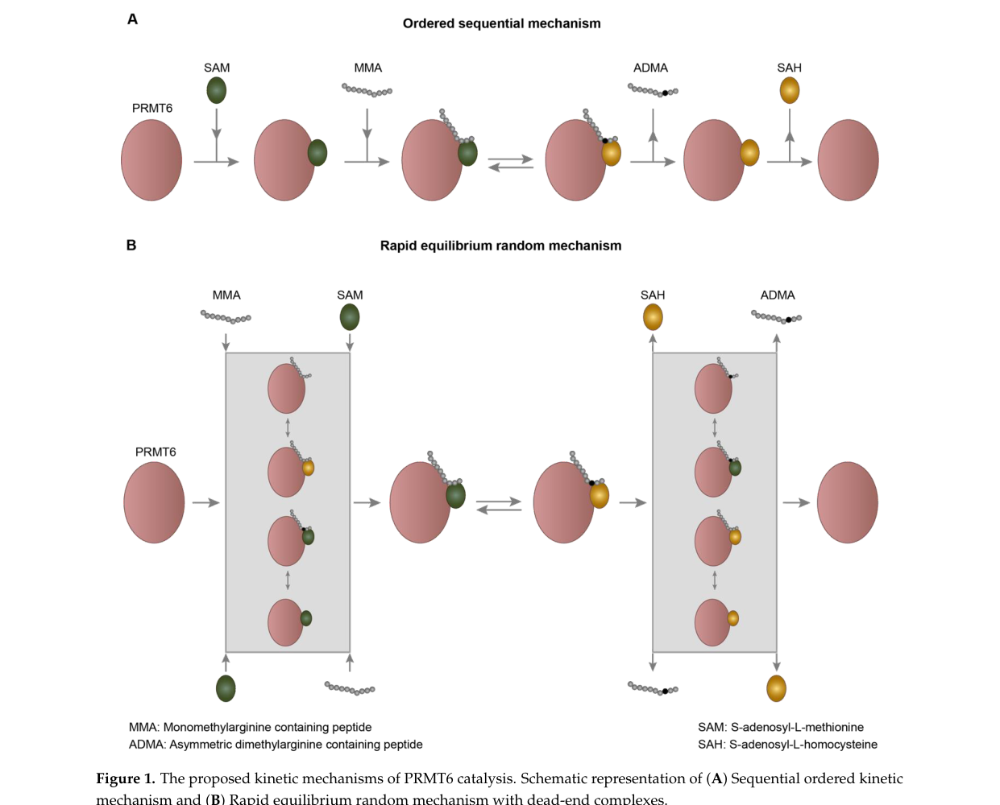

## Question

# Gene Research for Functional Annotation

## ⚠️ CRITICAL: Gene/Protein Identification Context

**BEFORE YOU BEGIN RESEARCH:** You MUST verify you are researching the CORRECT gene/protein. Gene symbols can be ambiguous, especially for less well-characterized genes from non-model organisms.

### Target Gene/Protein Identity (from UniProt):
- **UniProt Accession:** Q6NWG4
- **Protein Description:** RecName: Full=Protein arginine N-methyltransferase 6; EC=2.1.1.319 {ECO:0000250|UniProtKB:Q96LA8}; AltName: Full=Histone-arginine N-methyltransferase PRMT6;
- **Gene Information:** Name=prmt6;
- **Organism (full):** Danio rerio (Zebrafish) (Brachydanio rerio).
- **Protein Family:** Belongs to the class I-like SAM-binding methyltransferase
- **Key Domains:** Arg_MeTrfase. (IPR025799); PRMT_dom. (IPR055135); SAM-dependent_MTases_sf. (IPR029063); PrmA (PF06325); PRMT_C (PF22528)

### MANDATORY VERIFICATION STEPS:

1. **Check if the gene symbol "prmt6" matches the protein description above**
2. **Verify the organism is correct:** Danio rerio (Zebrafish) (Brachydanio rerio).
3. **Check if protein family/domains align with what you find in literature**
4. **If you find literature for a DIFFERENT gene with the same or similar symbol, STOP**

### If Gene Symbol is Ambiguous or You Cannot Find Relevant Literature:

**DO NOT PROCEED WITH RESEARCH ON A DIFFERENT GENE.** Instead:
- State clearly: "The gene symbol 'prmt6' is ambiguous or literature is limited for this specific protein"
- Explain what you found (e.g., "Found extensive literature on a different gene with the same symbol in a different organism")
- Describe the protein based ONLY on the UniProt information provided above
- Suggest that the protein function can be inferred from domain/family information

### Research Target:

Please provide a comprehensive research report on the gene **prmt6** (gene ID: prmt6, UniProt: Q6NWG4) in DANRE.

The research report should be a detailed narrative explaining the function, biological processes, and localization of the gene product. Citations should be given for all claims.

You should prioritize authoritative reviews and primary scientific literature when conducting research. You can supplement
this with annotations you find in gene/protein databases, but these can be outdated or inaccurate.

We are specifically interested in the primary function of the gene - for enzymes, what reaction is catalyzed, and what is the substrate specificity? For transporters, what is the substrate? For structural proteins or adapters, what is the broader structural role? For signaling molecules, what is the role in the pathway.

We are interested in where in or outside the cell the gene product carries out its function.

We are also interested in the signaling or biochemical pathways in which the gene functions. We are less interested in broad pleiotropic effects, except where these elucidate the precise role.

Include evidence where possible. We are interested in both experimental evidence as well as inference from structure, evolution, or bioinformatic analysis. Precise studies should be prioritized over high-throughput, where available.

## Output

Question: You are an expert researcher providing comprehensive, well-cited information.

Provide detailed information focusing on:
1. Key concepts and definitions with current understanding
2. Recent developments and latest research (prioritize 2023-2024 sources)
3. Current applications and real-world implementations
4. Expert opinions and analysis from authoritative sources
5. Relevant statistics and data from recent studies

Format as a comprehensive research report with proper citations. Include URLs and publication dates where available.
Always prioritize recent, authoritative sources and provide specific citations for all major claims.

# Gene Research for Functional Annotation

## ⚠️ CRITICAL: Gene/Protein Identification Context

**BEFORE YOU BEGIN RESEARCH:** You MUST verify you are researching the CORRECT gene/protein. Gene symbols can be ambiguous, especially for less well-characterized genes from non-model organisms.

### Target Gene/Protein Identity (from UniProt):
- **UniProt Accession:** Q6NWG4
- **Protein Description:** RecName: Full=Protein arginine N-methyltransferase 6; EC=2.1.1.319 {ECO:0000250|UniProtKB:Q96LA8}; AltName: Full=Histone-arginine N-methyltransferase PRMT6;
- **Gene Information:** Name=prmt6;
- **Organism (full):** Danio rerio (Zebrafish) (Brachydanio rerio).
- **Protein Family:** Belongs to the class I-like SAM-binding methyltransferase
- **Key Domains:** Arg_MeTrfase. (IPR025799); PRMT_dom. (IPR055135); SAM-dependent_MTases_sf. (IPR029063); PrmA (PF06325); PRMT_C (PF22528)

### MANDATORY VERIFICATION STEPS:

1. **Check if the gene symbol "prmt6" matches the protein description above**
2. **Verify the organism is correct:** Danio rerio (Zebrafish) (Brachydanio rerio).
3. **Check if protein family/domains align with what you find in literature**
4. **If you find literature for a DIFFERENT gene with the same or similar symbol, STOP**

### If Gene Symbol is Ambiguous or You Cannot Find Relevant Literature:

**DO NOT PROCEED WITH RESEARCH ON A DIFFERENT GENE.** Instead:
- State clearly: "The gene symbol 'prmt6' is ambiguous or literature is limited for this specific protein"
- Explain what you found (e.g., "Found extensive literature on a different gene with the same symbol in a different organism")
- Describe the protein based ONLY on the UniProt information provided above
- Suggest that the protein function can be inferred from domain/family information

### Research Target:

Please provide a comprehensive research report on the gene **prmt6** (gene ID: prmt6, UniProt: Q6NWG4) in DANRE.

The research report should be a detailed narrative explaining the function, biological processes, and localization of the gene product. Citations should be given for all claims.

You should prioritize authoritative reviews and primary scientific literature when conducting research. You can supplement
this with annotations you find in gene/protein databases, but these can be outdated or inaccurate.

We are specifically interested in the primary function of the gene - for enzymes, what reaction is catalyzed, and what is the substrate specificity? For transporters, what is the substrate? For structural proteins or adapters, what is the broader structural role? For signaling molecules, what is the role in the pathway.

We are interested in where in or outside the cell the gene product carries out its function.

We are also interested in the signaling or biochemical pathways in which the gene functions. We are less interested in broad pleiotropic effects, except where these elucidate the precise role.

Include evidence where possible. We are interested in both experimental evidence as well as inference from structure, evolution, or bioinformatic analysis. Precise studies should be prioritized over high-throughput, where available.

## Comprehensive Research Report: **prmt6** (Danio rerio) — Functional Annotation

### 1) Target verification (mandatory)

**Target gene/protein:** zebrafish *prmt6* encoding **Protein arginine N-methyltransferase 6 (PRMT6)**, a **SAM-dependent, type I protein arginine methyltransferase** that catalyzes **asymmetric dimethylarginine (ADMA)** formation on protein substrates. This matches the UniProt description for Q6NWG4 (PRMT6; EC 2.1.1.319) by: (i) enzymatic class (type I PRMT; MMA→ADMA), (ii) conserved PRMT domain architecture (Rossmann-like SAM-binding fold, β-barrel, dimerization helices), and (iii) a strongly nuclear/chromatin-centric functional profile typical of PRMT6 (gupta2021structureactivityand pages 1-2, bhandari2024proteinargininemethyltransferases pages 4-6, nordin2024investigatingprmt6protein pages 16-21).

**Symbol ambiguity check:** within retrieved sources, “PRMT6/prmt6” consistently refers to Protein arginine N-methyltransferase 6 (not another gene with a similar symbol). Where zebrafish is mentioned, it is explicitly “zebrafish PRMT6/prmt6” in a developmental context (donghang2020geneticevidencefor pages 13-14).

### 2) Key concepts and definitions (current understanding)

#### 2.1 Protein arginine methylation and PRMT classes
Protein arginine methyltransferases (PRMTs) transfer methyl groups from **S-adenosyl-L-methionine (SAM)** to the **guanidino nitrogens** of arginine residues in proteins. Type I PRMTs generate **monomethylarginine (MMA)** and then **asymmetric dimethylarginine (ADMA)**, whereas other PRMT classes generate symmetric dimethylation or only MMA (gupta2021structureactivityand pages 1-2, yang2023theprmt6parp1crl4bcomplex pages 1-3).

PRMT6 is classified as a **type I PRMT** and is widely described as preferentially producing **ADMA** (gupta2021structureactivityand pages 1-2, bhandari2024proteinargininemethyltransferases pages 4-6, nordin2024investigatingprmt6protein pages 11-16).

#### 2.2 Canonical PRMT6 chromatin mark: H3R2me2a
A central concept in PRMT6 biology is its deposition of **histone H3 Arg2 asymmetric dimethylation (H3R2me2a)**, which is widely treated as a **repressive chromatin mark** that antagonizes the activating lysine mark **H3K4me3** (gupta2021structureactivityand pages 4-6). Mechanistically, H3R2me2a can inhibit H3K4 methylation and interfere with binding of H3K4me3 “reader” proteins, shaping promoter/enhancer function and transcriptional output (gupta2021structureactivityand pages 4-6).

### 3) Enzymatic activity, substrate specificity, and mechanism

#### 3.1 Reaction and cofactor
PRMT6 catalyzes methyl transfer from **SAM** to protein arginine residues to form MMA and then ADMA (type I PRMT chemistry) (gupta2021structureactivityand pages 1-2, bhandari2024proteinargininemethyltransferases pages 4-6).

#### 3.2 Substrate preferences
PRMT6 is reported to methylate arginines in **GAR domains** and to tolerate sequence contexts containing **single RG motifs**, consistent with many PRMT substrates being RNA-binding and chromatin-associated proteins (nordin2024investigatingprmt6protein pages 16-21).

#### 3.3 Mechanistic/structural determinants (expert review evidence)
A detailed mechanistic review describes PRMT6 as an obligate oligomer (homodimer), with active site features favoring **asymmetric dimethylation**. Key residues include **Glu155** and **Glu164** (double-E loop) for substrate arginine engagement and **His317** (THW motif) positioned ~**2.7 Å** from the substrate Nη2, proposed to prevent Nη “swapping” and thereby bias toward ADMA formation (gupta2021structureactivityand pages 4-6). These mechanistic details support functional inference for zebrafish PRMT6 given conservation of PRMT fold and catalytic motifs.

**Visual evidence:** PRMT6 catalytic mechanism models, structural domain organization, and the H3R2me2a transcriptional model are summarized in cropped figures from a PRMT6 structure–function review (gupta2021structureactivityand media 3d2747b6, gupta2021structureactivityand media faec0ed3, gupta2021structureactivityand media c153a9e6).

### 4) Direct zebrafish (*Danio rerio*) evidence vs. conserved inference

#### 4.1 What is directly supported for zebrafish prmt6 (accessible evidence)
**Zebrafish developmental requirement (key direct claim, but primary paper not retrieved):** Multiple sources explicitly cite a zebrafish primary study: **“Protein Arginine Methyltransferase 6 (Prmt6) Is Essential for Early Zebrafish Development through the Direct Suppression of gadd45αa Stress Sensor Gene” (J Biol Chem 2016, 291:402–412)** (donghang2020geneticevidencefor pages 13-14). This provides **species-specific functional anchoring**: prmt6 is essential early in development and acts through transcriptional suppression of a stress-response sensor gene.

**Limitations:** the JBC 2016 zebrafish paper itself was not retrievable in full text in the current tool context (listed as unobtainable), so fine-grained details (e.g., embryo stage, phenotype penetrance, whether H3R2me2a was directly measured in zebrafish chromatin, subcellular localization experiments in zebrafish) cannot be quoted verbatim here. Accordingly, the remainder of the report distinguishes **conserved PRMT6 biology** (well supported in mammals) from zebrafish-specific assertions.

#### 4.2 Conserved PRMT6 functions likely applicable to zebrafish prmt6 (inference with evidence)
Given that PRMT6 is a strongly conserved PRMT family enzyme and zebrafish prmt6 is annotated as PRMT6 (UniProt Q6NWG4), the following functions are strongly supported in vertebrate systems and are plausible for zebrafish prmt6, while still requiring zebrafish-specific experimental confirmation:

### 5) Molecular functions and substrates (histone and non-histone)

#### 5.1 Histone substrates and chromatin effects
PRMT6 installs several histone arginine methyl marks, prominently:
- **H3R2me2a** (major in vivo PRMT6 product; transcriptional repression; antagonism of H3K4me3) (gupta2021structureactivityand pages 4-6).
- **H3R17me2a**, described as shared/redundant with CARM1 in some contexts (nordin2024investigatingprmt6protein pages 16-21, donghang2020geneticevidencefor pages 13-14).
- **H3R42me2a** and **H2A arginine methylation (e.g., H2AR29)** reported as PRMT6 marks/targets across studies and reviews (gupta2021structureactivityand pages 1-2, yang2023theprmt6parp1crl4bcomplex pages 1-3, donghang2020geneticevidencefor pages 13-14).

The prevailing expert interpretation is that PRMT6 often acts as a **transcriptional co-repressor**, with H3R2me2a functioning as a mechanism to block activating chromatin states; however, context-dependent activation at enhancers/promoters is also reported in the PRMT6 literature (gupta2021structureactivityand pages 4-6, gupta2021structureactivityand media c153a9e6).

#### 5.2 Non-histone substrates (selected high-specificity examples)
A key theme in recent PRMT6 biology is that PRMT6 methylates non-histone proteins to modulate **localization, stability, and signaling**:

**Signal transduction / membrane localization**
- **STAT3 R729me2a (ADMA):** PRMT6 asymmetrically dimethylates STAT3 at **Arg729**, which is required for STAT3 **membrane localization**, interaction with **JAK2**, STAT3 **Y705 phosphorylation**, and PRMT6-driven metastatic phenotypes in breast cancer models (Oct 2023) (chen2023prmt6methylationof pages 1-2).

**DNA repair and genome stability**
- **DNA polymerase β (POLB) R83 and R152:** PRMT6 methylation at these sites is linked to altered polymerase properties and DNA repair modulation (gupta2021structureactivityand pages 9-11, chen2023prmt6methylationof pages 1-2).
- **TOP3B R833 and R835:** methylation is required for relaxation of supercoiled DNA and is linked to **R-loop prevention** and stress granule localization in reported systems (gupta2021structureactivityand pages 9-11).

**Cell cycle and tumor suppressor regulation**
- **p16 (Arg22/Arg131/Arg138)** and **p21 (Arg156):** PRMT6 methylation is reported to weaken canonical tumor suppressor functions, including effects on CDK interactions and cytoplasmic accumulation (gupta2021structureactivityand pages 9-11, nordin2024investigatingprmt6protein pages 11-16).

**Mitotic chromosome regulation**
- **RCC1 Arg214:** PRMT6 methylation is linked to RCC1 chromosomal localization and mitotic regulation in reported systems (chen2023prmt6methylationof pages 1-2, gupta2021structureactivityand pages 22-22).

### 6) Subcellular localization
PRMT6 is consistently described as **predominantly nuclear**, consistent with its core role in chromatin regulation and transcriptional control (gupta2021structureactivityand pages 1-2, bhandari2024proteinargininemethyltransferases pages 4-6, nordin2024investigatingprmt6protein pages 16-21). Nuclear localization is also consistent with its PRMT fold and presence of a nuclear localization signal noted in structural descriptions (nordin2024investigatingprmt6protein pages 16-21). 

However, PRMT6 can influence processes that manifest at other cellular locales (e.g., STAT3 membrane localization depends on PRMT6-mediated STAT3 methylation) (chen2023prmt6methylationof pages 1-2).

### 7) Pathways and biological processes

#### 7.1 Development and stress-response control (zebrafish anchor)
The central zebrafish-specific functional statement retrievable here is that prmt6 is required for **early zebrafish development**, acting through direct repression of **gadd45αa** (a stress sensor gene) in a 2016 JBC study repeatedly cited in later literature (donghang2020geneticevidencefor pages 13-14). This is consistent with PRMT6 functioning as a chromatin/transcription regulator.

#### 7.2 Transcriptional programs and epigenetic regulation
PRMT6’s H3R2me2a mark is a mechanistic basis for transcriptional repression through antagonizing H3K4me3 and affecting recruitment of activating complexes at promoters/gene bodies (gupta2021structureactivityand pages 4-6).

#### 7.3 Circadian clock regulation (recent primary research)
A 2023 study reports PRMT6 forms a transcriptional repression complex with **PARP1** and **CUL4B/CRL4B**, co-occupying the **PER3** promoter and dysregulating circadian oscillation in breast cancer models (Mar 2023) (yang2023theprmt6parp1crl4bcomplex pages 1-3). RNA-seq following PRMT6 knockdown identified **1,551 upregulated** and **771 downregulated** genes, providing a quantitative view of PRMT6-dependent transcriptional networks in that context (yang2023theprmt6parp1crl4bcomplex pages 1-3).

#### 7.4 Stress adaptation, phase separation, and ferroptosis regulation (recent primary research)
In 2024, PRMT6-mediated ADMA of **p62** was reported to promote p62 **phase separation** and “p62 body” formation, leading to Keap1 sequestration, **Nrf2 activation**, and inhibition of ferroptosis; PRMT6 knockdown sensitized pancreatic cancer models to ferroptosis in vitro and in vivo (Jul 2024) (feng2024prmt6mediatedadmapromotes pages 1-2).

### 8) Recent developments (2023–2024 emphasis)

#### 8.1 New non-histone methylation site with functional consequence: STAT3 R729me2a
A major 2023 development is the identification of **STAT3 R729me2a** as a PRMT6-installed mark required for STAT3’s membrane localization and JAK2 interaction, linking PRMT6 activity to JAK/STAT pathway activation and metastatic phenotypes in breast cancer models (chen2023prmt6methylationof pages 1-2).

#### 8.2 PRMT6-centered therapeutic strategies: direct inhibition, pathway co-targeting, and complex disruption
- **Direct PRMT6 inhibition (EPZ020411):** EPZ020411 is used as a PRMT6 inhibitor and was reported to suppress metastatic phenotypes in the STAT3-methylation study (Oct 2023) (chen2023prmt6methylationof pages 1-2).
- **Co-targeting PRMT6-associated complex members:** In circadian dysregulation contexts, **PARP1 inhibition (olaparib)** is proposed to enhance clock gene expression and reduce tumorigenic programs under high PRMT6 expression, suggesting a therapeutic angle that does not directly inhibit PRMT6 catalytic activity (yang2023theprmt6parp1crl4bcomplex pages 1-3).
- **PRMT1/PRMT6 heteromer disruption:** A 2024 iScience study reports PRMT1/PRMT6 heteromerization and shows that disruption using a competitive peptide reduces proliferation in NSCLC cell lines and patient-derived organoids (Feb 2024) (wu2024cooperationbetweenprmt1 pages 1-2).

### 9) Current applications and real-world implementations

#### 9.1 Chemical probe/inhibitor usage
PRMT6 research and translational exploration commonly employ inhibitors as mechanistic probes. EPZ020411 is repeatedly used as a PRMT6 inhibitor in cancer models and is reported to reduce metastatic phenotypes in 2023 work (chen2023prmt6methylationof pages 1-2). Additional PRMT6 inhibitors and tool compounds are summarized in expert reviews, reflecting active chemical biology efforts targeting PRMT6 selectivity and mechanism (gupta2021structureactivityand pages 22-22).

#### 9.2 Biomarker concepts
- **STAT3 R729me2a** is proposed as a prognostic marker associated with survival outcomes in breast cancer cohorts in the 2023 STAT3 methylation study (chen2023prmt6methylationof pages 1-2).
- PRMT6 expression itself is discussed as associated with worse survival in breast cancer contexts in 2023 circadian clock research (yang2023theprmt6parp1crl4bcomplex pages 1-3).

### 10) Statistics and quantitative data points (from retrieved evidence)

- **Transcriptome impact:** PRMT6 knockdown led to **1,551 genes upregulated** and **771 downregulated** in a breast cancer cell model (RNA-seq) (yang2023theprmt6parp1crl4bcomplex pages 1-3).
- **Site-specific methylation (high-confidence biochemical “data points”):** STAT3 **R729**, POLB **R83/R152**, PTEN **R135**, TOP3B **R833/R835**, RCC1 **R214**, p16 **R22/R131/R138**, p21 **R156** are cited PRMT6 methylation sites in reviewed or primary literature (gupta2021structureactivityand pages 9-11, chen2023prmt6methylationof pages 1-2).
- **Structural/catalytic geometry:** PRMT6 His317 (THW motif) positioned ~**2.7 Å** from substrate Nη2 (gupta2021structureactivityand pages 4-6).
- **Disease context (from 2023–2024 papers):** NSCLC accounts for ~**85%** of lung cancers and has ~**26%** 5-year survival (wu2024cooperationbetweenprmt1 pages 1-2). HER2-positive breast cancer prevalence is **15–20%** and TNBC is ~**10–20%** (chen2023prmt6methylationof pages 1-2).

### 11) Evidence summary table (zebrafish-specific vs conserved)

| Evidence type | Function/Process | Substrate(s) and site/mark | Subcellular localization | Pathway/phenotype | Key source (short cite with year) | DOI/URL |
|---|---|---|---|---|---|---|
| Zebrafish-specific (indirectly available; primary study not retrieved) | Essential early development; direct repression of stress-response gene | gadd45αa suppression reported; specific methyl-mark not available from retrieved full text | Not directly shown in retrieved zebrafish text; inferred nuclear/chromatin-associated PRMT6 function | Early zebrafish development; stress sensor gene control | cited in Cheng et al. 2020; Blanc & Richard 2017 | https://doi.org/10.1074/jbc.ra120.014704 ; https://doi.org/10.1016/j.molcel.2016.11.003 (donghang2020geneticevidencefor pages 13-14) |
| Conserved vertebrate/mammalian | Major histone arginine methyltransferase; transcriptional repression | Histone H3 Arg2 asymmetric dimethylation (H3R2me2a) | Predominantly nuclear/chromatin-associated | Repressive chromatin mark; antagonizes H3K4me3; regulates HoxA and Myc target genes | Gupta et al. 2021 | https://doi.org/10.3390/life11090951 (gupta2021structureactivityand pages 4-6, gupta2021structureactivityand pages 1-2) |
| Conserved vertebrate/mammalian | Additional histone methylation activity | H3R17me2a | Nuclear/chromatin-associated | Partial redundancy with CARM1; chromatin regulation | Cheng et al. 2020; Nordin 2024 | https://doi.org/10.1074/jbc.ra120.014704 ; https://doi.org/10.20381/ruor-30461 (donghang2020geneticevidencefor pages 13-14, nordin2024investigatingprmt6protein pages 16-21) |
| Conserved vertebrate/mammalian | Additional histone methylation activity | H3R42me2a | Nuclear/chromatin-associated | Epigenetic regulation of transcription | Gupta et al. 2021 | https://doi.org/10.3390/life11090951 (gupta2021structureactivityand pages 1-2) |
| Conserved vertebrate/mammalian | Histone methylation on H2A | H2AR29 methylation (also reported as H2AR26/H2AR29 in different sources) | Nuclear/chromatin-associated | Repressive PRMT6 target on chromatin | Cheng et al. 2020; Yang et al. 2023 | https://doi.org/10.1074/jbc.ra120.014704 ; https://doi.org/10.1002/advs.202202737 (donghang2020geneticevidencefor pages 13-14, yang2023theprmt6parp1crl4bcomplex pages 1-3) |
| Conserved vertebrate/mammalian | DNA repair regulation | DNA polymerase beta (POLB) Arg83, Arg152 | Nuclear | Increased polymerase processivity; DNA repair control | Gupta et al. 2021; Chen et al. 2023 | https://doi.org/10.3390/life11090951 ; https://doi.org/10.1038/s41419-023-06148-6 (gupta2021structureactivityand pages 9-11, chen2023prmt6methylationof pages 1-2) |
| Conserved vertebrate/mammalian | Genome stability/R-loop control | TOP3B Arg833, Arg835 | Nuclear and stress-granule associated context | Relaxation of supercoiled DNA; prevention of R-loops; stress-granule localization | Gupta et al. 2021 | https://doi.org/10.3390/life11090951 (gupta2021structureactivityand pages 9-11) |
| Conserved vertebrate/mammalian | Signaling and splicing regulation | PTEN Arg135 | Nuclear/cellular signaling context | Inhibits PI3K-AKT signaling; affects pre-mRNA splicing | Gupta et al. 2021; Li et al. 2025 review summary | https://doi.org/10.3390/life11090951 ; https://doi.org/10.3390/biology14101370 (gupta2021structureactivityand pages 9-11, li2025theroleof pages 9-11) |
| Conserved vertebrate/mammalian | Mitotic chromosome regulation | RCC1 Arg214 | Nuclear/chromosomal | Chromosome localization, mitosis, proliferation, tumorigenesis | Chen et al. 2023; Gupta et al. 2021 | https://doi.org/10.1038/s41419-023-06148-6 ; https://doi.org/10.3390/life11090951 (chen2023prmt6methylationof pages 1-2, gupta2021structureactivityand pages 22-22) |
| Conserved vertebrate/mammalian | MAPK/metabolic signaling | CRAF methylation | Cytoplasmic-to-nuclear signaling axis | ERK-dependent PKM2 nuclear relocalization; aerobic glycolysis-driven hepatocarcinogenesis | Gupta et al. 2021 | https://doi.org/10.3390/life11090951 (gupta2021structureactivityand pages 22-22) |
| Conserved vertebrate/mammalian | Tumor suppressor control/cell-cycle regulation | p16 Arg22, Arg131, Arg138 | Nuclear | Weakens growth-suppressive/cell-cycle-blocking function | Gupta et al. 2021; Nordin 2024 | https://doi.org/10.3390/life11090951 ; https://doi.org/10.20381/ruor-30461 (gupta2021structureactivityand pages 9-11, nordin2024investigatingprmt6protein pages 11-16) |
| Conserved vertebrate/mammalian | Tumor suppressor control/localization | p21 Arg156 | Cytoplasmic accumulation promoted by PRMT6 methylation | Inhibits growth-suppressive function | Gupta et al. 2021; Nordin 2024 | https://doi.org/10.3390/life11090951 ; https://doi.org/10.20381/ruor-30461 (gupta2021structureactivityand pages 9-11, nordin2024investigatingprmt6protein pages 11-16) |
| Conserved vertebrate/mammalian | Metastasis-promoting signaling | STAT3 Arg729 asymmetric dimethylation (STAT3 R729me2a) | Promotes STAT3 membrane localization | Enhances JAK2 interaction, Y705 phosphorylation, breast cancer metastasis; biomarker potential | Chen et al. 2023 | https://doi.org/10.1038/s41419-023-06148-6 (chen2023prmt6methylationof pages 1-2) |
| Conserved vertebrate/mammalian | Phase separation/ferroptosis response | p62 asymmetric dimethylarginine (site not specified in retrieved evidence) | Cytoplasmic p62 bodies/condensates | Promotes p62 phase separation, Keap1 sequestration, Nrf2 activation; negative feedback in ferroptosis | Feng et al. 2024 | https://doi.org/10.7150/thno.94789 |
| Conserved vertebrate/mammalian | Circadian transcriptional repression complex | Histone arginine methylation at PER3-associated chromatin; PRMT6/PARP1/CRL4B complex | Nuclear | Circadian clock disruption, proliferation, metastasis in breast cancer | Yang et al. 2023 | https://doi.org/10.1002/advs.202202737 (yang2023theprmt6parp1crl4bcomplex pages 1-3) |
| Conserved vertebrate/mammalian | Enzyme class/mechanism | Type I PRMT; SAM-dependent formation of MMA then predominantly ADMA; preference for RxR/GAR-like substrates | Predominantly nuclear; dimeric enzyme with Rossmann fold, β-barrel, dimerization helices | Epigenetic regulation, transcription, DNA repair, differentiation, inflammation | Gupta et al. 2021; Bhandari & Ding 2024; Nordin 2024 | https://doi.org/10.3390/life11090951 ; https://doi.org/10.3390/ijms25073958 ; https://doi.org/10.20381/ruor-30461 (gupta2021structureactivityand pages 1-2, bhandari2024proteinargininemethyltransferases pages 4-6, nordin2024investigatingprmt6protein pages 16-21) |
| Conserved vertebrate/mammalian/application | Chemical inhibition / translational use | EPZ020411 (PRMT6 inhibitor) | Cell-active inhibitor used in mammalian models | Reduced breast cancer metastasis; used as PRMT6 probe; broader preclinical PRMT6 targeting interest | Chen et al. 2023; Gupta et al. 2021 | https://doi.org/10.1038/s41419-023-06148-6 ; https://doi.org/10.3390/life11090951 (chen2023prmt6methylationof pages 1-2, gupta2021structureactivityand pages 22-22) |

*Table: This table summarizes zebrafish-specific and conserved PRMT6 functional annotation evidence, including catalytic activity, substrates, localization, pathways, and translational inhibitor evidence. It is useful for separating direct DANRE evidence from well-supported vertebrate inference.*

### 12) Key figure evidence (mechanism, structure, chromatin mark)

- PRMT6 catalytic mechanism schematic and kinetic models (gupta2021structureactivityand media 3d2747b6).
- PRMT6 structural domain architecture and active-site context (gupta2021structureactivityand media faec0ed3).
- Conceptual model of how PRMT6-generated **H3R2me2a** regulates transcription (gupta2021structureactivityand media c153a9e6).

### 13) Conclusions for functional annotation of zebrafish prmt6 (Q6NWG4)

1. **Primary molecular function (enzyme):** zebrafish Prmt6 is best annotated as a **SAM-dependent protein arginine methyltransferase (type I)** generating **ADMA** on histone and non-histone proteins (strong conserved evidence; zebrafish-specific evidence is indirect but consistent) (gupta2021structureactivityand pages 1-2, bhandari2024proteinargininemethyltransferases pages 4-6, nordin2024investigatingprmt6protein pages 11-16).
2. **Core chromatin role:** PRMT6 is strongly linked to deposition of **H3R2me2a**, a chromatin mark mechanistically associated with transcriptional repression and antagonism of H3K4me3 (gupta2021structureactivityand pages 4-6).
3. **Cellular localization:** predominantly **nuclear/chromatin-associated**, matching its principal role in epigenetic regulation; PRMT6-mediated methylation can indirectly control localization of targets (e.g., STAT3) (gupta2021structureactivityand pages 1-2, nordin2024investigatingprmt6protein pages 16-21, chen2023prmt6methylationof pages 1-2).
4. **Zebrafish biology:** prmt6 is reported to be **essential for early zebrafish development** through repression of **gadd45αa** (direct zebrafish study cited but not available as full text here) (donghang2020geneticevidencefor pages 13-14).
5. **Pathways:** best-supported pathway framing is **epigenetic transcriptional regulation** (H3R2me2a axis), with additional conserved roles in DNA repair/genome stability and signaling outcomes dependent on non-histone methylation (gupta2021structureactivityand pages 4-6, gupta2021structureactivityand pages 9-11).

### References (URLs and publication dates)

- Yang T. et al. **The PRMT6/PARP1/CRL4B Complex Regulates the Circadian Clock and Promotes Breast Tumorigenesis**. *Advanced Science*. **Mar 2023**. https://doi.org/10.1002/advs.202202737 (yang2023theprmt6parp1crl4bcomplex pages 1-3)
- Chen Q. et al. **PRMT6 methylation of STAT3 regulates tumor metastasis in breast cancer**. *Cell Death & Disease*. **Oct 2023**. https://doi.org/10.1038/s41419-023-06148-6 (chen2023prmt6methylationof pages 1-2)
- Feng L. et al. **PRMT6-mediated ADMA promotes p62 phase separation to form a negative feedback loop in ferroptosis**. *Theranostics*. **Jul 2024**. https://doi.org/10.7150/thno.94789 (feng2024prmt6mediatedadmapromotes pages 1-2)
- Wu P.-Y. et al. **Cooperation between PRMT1 and PRMT6 drives lung cancer health disparities among Black/African American men**. *iScience*. **Feb 2024**. https://doi.org/10.1016/j.isci.2024.108858 (wu2024cooperationbetweenprmt1 pages 1-2)
- Gupta S. et al. **Structure, Activity and Function of the Protein Arginine Methyltransferase 6**. *Life*. **Sep 2021**. https://doi.org/10.3390/life11090951 (gupta2021structureactivityand pages 4-6)
- Cheng D. et al. **Genetic evidence for partial redundancy between the arginine methyltransferases CARM1 and PRMT6**. *J Biol Chem*. **Dec 2020**. https://doi.org/10.1074/jbc.ra120.014704 (donghang2020geneticevidencefor pages 13-14)

References

1. (gupta2021structureactivityand pages 1-2): Somlee Gupta, Rajashekar Varma Kadumuri, Anjali Kumari Singh, Sreenivas Chavali, and Arunkumar Dhayalan. Structure, activity and function of the protein arginine methyltransferase 6. Life, 11:951, Sep 2021. URL: https://doi.org/10.3390/life11090951, doi:10.3390/life11090951. This article has 42 citations.

2. (bhandari2024proteinargininemethyltransferases pages 4-6): Kritisha Bhandari and Wei-Qun Ding. Protein arginine methyltransferases in pancreatic ductal adenocarcinoma: new molecular targets for therapy. International Journal of Molecular Sciences, 25:3958, Apr 2024. URL: https://doi.org/10.3390/ijms25073958, doi:10.3390/ijms25073958. This article has 9 citations.

3. (nordin2024investigatingprmt6protein pages 16-21): Janelle Nordin. Investigating prmt6 protein interactions in breast cancer cells. Text, Jul 2024. URL: https://doi.org/10.20381/ruor-30461, doi:10.20381/ruor-30461. This article has 0 citations and is from a peer-reviewed journal.

4. (donghang2020geneticevidencefor pages 13-14): Donghang Cheng, Guozhen Gao, Alessandra Di Lorenzo, Sandrine Jayne, Michael O Hottiger, Stephane Richard, and Mark T Bedford. Genetic evidence for partial redundancy between the arginine methyltransferases carm1 and prmt6. The Journal of biological chemistry, 295 50:17060-17070, Dec 2020. URL: https://doi.org/10.1074/jbc.ra120.014704, doi:10.1074/jbc.ra120.014704. This article has 46 citations.

5. (yang2023theprmt6parp1crl4bcomplex pages 1-3): Tianshu Yang, Wei Huang, Tianyu Ma, Xin Yin, Jingyao Zhang, Miaomiao Huo, Ting Hu, Tianyang Gao, Wei Liu, Die Zhang, Hefen Yu, Xu Teng, Min Zhang, Hao Qin, Yunkai Yang, Baowen Yuan, and Yan Wang. The prmt6/parp1/crl4b complex regulates the circadian clock and promotes breast tumorigenesis. Advanced Science, Mar 2023. URL: https://doi.org/10.1002/advs.202202737, doi:10.1002/advs.202202737. This article has 36 citations and is from a peer-reviewed journal.

6. (nordin2024investigatingprmt6protein pages 11-16): Janelle Nordin. Investigating prmt6 protein interactions in breast cancer cells. Text, Jul 2024. URL: https://doi.org/10.20381/ruor-30461, doi:10.20381/ruor-30461. This article has 0 citations and is from a peer-reviewed journal.

7. (gupta2021structureactivityand pages 4-6): Somlee Gupta, Rajashekar Varma Kadumuri, Anjali Kumari Singh, Sreenivas Chavali, and Arunkumar Dhayalan. Structure, activity and function of the protein arginine methyltransferase 6. Life, 11:951, Sep 2021. URL: https://doi.org/10.3390/life11090951, doi:10.3390/life11090951. This article has 42 citations.

8. (gupta2021structureactivityand media 3d2747b6): Somlee Gupta, Rajashekar Varma Kadumuri, Anjali Kumari Singh, Sreenivas Chavali, and Arunkumar Dhayalan. Structure, activity and function of the protein arginine methyltransferase 6. Life, 11:951, Sep 2021. URL: https://doi.org/10.3390/life11090951, doi:10.3390/life11090951. This article has 42 citations.

9. (gupta2021structureactivityand media faec0ed3): Somlee Gupta, Rajashekar Varma Kadumuri, Anjali Kumari Singh, Sreenivas Chavali, and Arunkumar Dhayalan. Structure, activity and function of the protein arginine methyltransferase 6. Life, 11:951, Sep 2021. URL: https://doi.org/10.3390/life11090951, doi:10.3390/life11090951. This article has 42 citations.

10. (gupta2021structureactivityand media c153a9e6): Somlee Gupta, Rajashekar Varma Kadumuri, Anjali Kumari Singh, Sreenivas Chavali, and Arunkumar Dhayalan. Structure, activity and function of the protein arginine methyltransferase 6. Life, 11:951, Sep 2021. URL: https://doi.org/10.3390/life11090951, doi:10.3390/life11090951. This article has 42 citations.

11. (chen2023prmt6methylationof pages 1-2): Qianzhi Chen, Qingyi Hu, Yan Chen, Na Shen, Ning Zhang, Anshu Li, Lei Li, and Junjun Li. Prmt6 methylation of stat3 regulates tumor metastasis in breast cancer. Cell Death &amp; Disease, Oct 2023. URL: https://doi.org/10.1038/s41419-023-06148-6, doi:10.1038/s41419-023-06148-6. This article has 38 citations and is from a peer-reviewed journal.

12. (gupta2021structureactivityand pages 9-11): Somlee Gupta, Rajashekar Varma Kadumuri, Anjali Kumari Singh, Sreenivas Chavali, and Arunkumar Dhayalan. Structure, activity and function of the protein arginine methyltransferase 6. Life, 11:951, Sep 2021. URL: https://doi.org/10.3390/life11090951, doi:10.3390/life11090951. This article has 42 citations.

13. (gupta2021structureactivityand pages 22-22): Somlee Gupta, Rajashekar Varma Kadumuri, Anjali Kumari Singh, Sreenivas Chavali, and Arunkumar Dhayalan. Structure, activity and function of the protein arginine methyltransferase 6. Life, 11:951, Sep 2021. URL: https://doi.org/10.3390/life11090951, doi:10.3390/life11090951. This article has 42 citations.

14. (feng2024prmt6mediatedadmapromotes pages 1-2): Lifeng Feng, Lini Chen, Weikai Wang, Qi Wei, Minqiang Chen, Xin Jiang, Shiman Hu, Yuchen Wu, Lian Duan, Liyuan Zhu, Xian Wang, and Hongchuan Jin. Prmt6-mediated adma promotes p62 phase separation to form a negative feedback loop in ferroptosis. Theranostics, 14:4090-4106, Jul 2024. URL: https://doi.org/10.7150/thno.94789, doi:10.7150/thno.94789. This article has 9 citations and is from a domain leading peer-reviewed journal.

15. (wu2024cooperationbetweenprmt1 pages 1-2): Pei-Ying Wu, Michelle Van Scoyk, Stephanie S. McHale, Chu-Fang Chou, Gregory Riddick, Kamran Farouq, Bin Hu, Vita Kraskauskiene, Jennifer Koblinski, Charles Lyons, Arjun Rijal, Vignesh Vudatha, Dongyu Zhang, Jose G. Trevino, Rachit D. Shah, Patrick Nana-Sinkam, Yong Huang, Shwu-Fan Ma, Imre Noth, Chanita Hughes-Halbert, Victoria L. Seewaldt, Ching-Yi Chen, and Robert A. Winn. Cooperation between prmt1 and prmt6 drives lung cancer health disparities among black/african american men. iScience, 27:108858, Feb 2024. URL: https://doi.org/10.1016/j.isci.2024.108858, doi:10.1016/j.isci.2024.108858. This article has 6 citations and is from a peer-reviewed journal.

16. (li2025theroleof pages 9-11): Kexin Li, Q. Xia, Kexin Li, Wenxin Yan, and Changshan Wang. The role of protein arginine methylation as a post-translational modification in cellular homeostasis and disease. Biology, 14(10):1370, Oct 2025. URL: https://doi.org/10.3390/biology14101370, doi:10.3390/biology14101370. This article has 2 citations.

## Artifacts

- [Edison artifact artifact-00](prmt6-deep-research-falcon_artifacts/artifact-00.md)

## Citations

1. donghang2020geneticevidencefor pages 13-14
2. gupta2021structureactivityand pages 4-6
3. gupta2021structureactivityand pages 9-11
4. gupta2021structureactivityand pages 22-22
5. gupta2021structureactivityand pages 1-2
6. bhandari2024proteinargininemethyltransferases pages 4-6
7. li2025theroleof pages 9-11
8. https://doi.org/10.1074/jbc.ra120.014704
9. https://doi.org/10.1016/j.molcel.2016.11.003
10. https://doi.org/10.3390/life11090951
11. https://doi.org/10.20381/ruor-30461
12. https://doi.org/10.1002/advs.202202737
13. https://doi.org/10.1038/s41419-023-06148-6
14. https://doi.org/10.3390/biology14101370
15. https://doi.org/10.7150/thno.94789
16. https://doi.org/10.3390/ijms25073958
17. https://doi.org/10.1016/j.isci.2024.108858
18. https://doi.org/10.3390/life11090951,
19. https://doi.org/10.3390/ijms25073958,
20. https://doi.org/10.20381/ruor-30461,
21. https://doi.org/10.1074/jbc.ra120.014704,
22. https://doi.org/10.1002/advs.202202737,
23. https://doi.org/10.1038/s41419-023-06148-6,
24. https://doi.org/10.7150/thno.94789,
25. https://doi.org/10.1016/j.isci.2024.108858,
26. https://doi.org/10.3390/biology14101370,