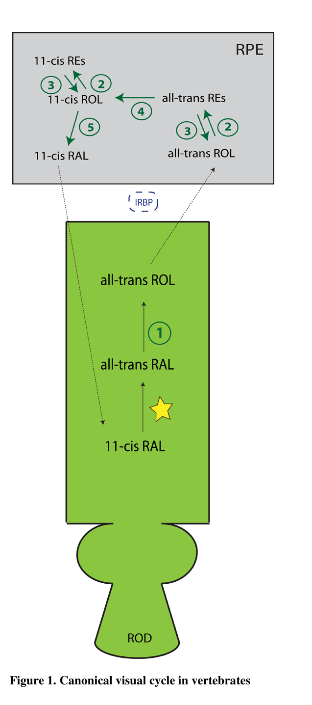

## Question

# Gene Research for Functional Annotation

## ⚠️ CRITICAL: Gene/Protein Identification Context

**BEFORE YOU BEGIN RESEARCH:** You MUST verify you are researching the CORRECT gene/protein. Gene symbols can be ambiguous, especially for less well-characterized genes from non-model organisms.

### Target Gene/Protein Identity (from UniProt):
- **UniProt Accession:** Q6PBW5
- **Protein Description:** RecName: Full=Retinoid isomerohydrolase; EC=3.1.1.64 {ECO:0000250|UniProtKB:Q28175}; AltName: Full=All-trans-retinylester 11-cis isomerohydrolase A; AltName: Full=Lutein isomerase; AltName: Full=Meso-zeaxanthin isomerase; EC=5.3.3.22 {ECO:0000250|UniProtKB:Q16518}; AltName: Full=Retinal pigment epithelium-specific 65 kDa protein homolog A; Short=RPE56a;
- **Gene Information:** Name=rpe65a; Synonyms=rpepa;
- **Organism (full):** Danio rerio (Zebrafish) (Brachydanio rerio).
- **Protein Family:** Belongs to the carotenoid oxygenase family. .
- **Key Domains:** Carotenoid_Oase. (IPR004294); RPE65 (PF03055)

### MANDATORY VERIFICATION STEPS:

1. **Check if the gene symbol "rpe65a" matches the protein description above**
2. **Verify the organism is correct:** Danio rerio (Zebrafish) (Brachydanio rerio).
3. **Check if protein family/domains align with what you find in literature**
4. **If you find literature for a DIFFERENT gene with the same or similar symbol, STOP**

### If Gene Symbol is Ambiguous or You Cannot Find Relevant Literature:

**DO NOT PROCEED WITH RESEARCH ON A DIFFERENT GENE.** Instead:
- State clearly: "The gene symbol 'rpe65a' is ambiguous or literature is limited for this specific protein"
- Explain what you found (e.g., "Found extensive literature on a different gene with the same symbol in a different organism")
- Describe the protein based ONLY on the UniProt information provided above
- Suggest that the protein function can be inferred from domain/family information

### Research Target:

Please provide a comprehensive research report on the gene **rpe65a** (gene ID: rpe65a, UniProt: Q6PBW5) in DANRE.

The research report should be a detailed narrative explaining the function, biological processes, and localization of the gene product. Citations should be given for all claims.

You should prioritize authoritative reviews and primary scientific literature when conducting research. You can supplement
this with annotations you find in gene/protein databases, but these can be outdated or inaccurate.

We are specifically interested in the primary function of the gene - for enzymes, what reaction is catalyzed, and what is the substrate specificity? For transporters, what is the substrate? For structural proteins or adapters, what is the broader structural role? For signaling molecules, what is the role in the pathway.

We are interested in where in or outside the cell the gene product carries out its function.

We are also interested in the signaling or biochemical pathways in which the gene functions. We are less interested in broad pleiotropic effects, except where these elucidate the precise role.

Include evidence where possible. We are interested in both experimental evidence as well as inference from structure, evolution, or bioinformatic analysis. Precise studies should be prioritized over high-throughput, where available.

## Output

Question: You are an expert researcher providing comprehensive, well-cited information.

Provide detailed information focusing on:
1. Key concepts and definitions with current understanding
2. Recent developments and latest research (prioritize 2023-2024 sources)
3. Current applications and real-world implementations
4. Expert opinions and analysis from authoritative sources
5. Relevant statistics and data from recent studies

Format as a comprehensive research report with proper citations. Include URLs and publication dates where available.
Always prioritize recent, authoritative sources and provide specific citations for all major claims.

# Gene Research for Functional Annotation

## ⚠️ CRITICAL: Gene/Protein Identification Context

**BEFORE YOU BEGIN RESEARCH:** You MUST verify you are researching the CORRECT gene/protein. Gene symbols can be ambiguous, especially for less well-characterized genes from non-model organisms.

### Target Gene/Protein Identity (from UniProt):
- **UniProt Accession:** Q6PBW5
- **Protein Description:** RecName: Full=Retinoid isomerohydrolase; EC=3.1.1.64 {ECO:0000250|UniProtKB:Q28175}; AltName: Full=All-trans-retinylester 11-cis isomerohydrolase A; AltName: Full=Lutein isomerase; AltName: Full=Meso-zeaxanthin isomerase; EC=5.3.3.22 {ECO:0000250|UniProtKB:Q16518}; AltName: Full=Retinal pigment epithelium-specific 65 kDa protein homolog A; Short=RPE56a;
- **Gene Information:** Name=rpe65a; Synonyms=rpepa;
- **Organism (full):** Danio rerio (Zebrafish) (Brachydanio rerio).
- **Protein Family:** Belongs to the carotenoid oxygenase family. .
- **Key Domains:** Carotenoid_Oase. (IPR004294); RPE65 (PF03055)

### MANDATORY VERIFICATION STEPS:

1. **Check if the gene symbol "rpe65a" matches the protein description above**
2. **Verify the organism is correct:** Danio rerio (Zebrafish) (Brachydanio rerio).
3. **Check if protein family/domains align with what you find in literature**
4. **If you find literature for a DIFFERENT gene with the same or similar symbol, STOP**

### If Gene Symbol is Ambiguous or You Cannot Find Relevant Literature:

**DO NOT PROCEED WITH RESEARCH ON A DIFFERENT GENE.** Instead:
- State clearly: "The gene symbol 'rpe65a' is ambiguous or literature is limited for this specific protein"
- Explain what you found (e.g., "Found extensive literature on a different gene with the same symbol in a different organism")
- Describe the protein based ONLY on the UniProt information provided above
- Suggest that the protein function can be inferred from domain/family information

### Research Target:

Please provide a comprehensive research report on the gene **rpe65a** (gene ID: rpe65a, UniProt: Q6PBW5) in DANRE.

The research report should be a detailed narrative explaining the function, biological processes, and localization of the gene product. Citations should be given for all claims.

You should prioritize authoritative reviews and primary scientific literature when conducting research. You can supplement
this with annotations you find in gene/protein databases, but these can be outdated or inaccurate.

We are specifically interested in the primary function of the gene - for enzymes, what reaction is catalyzed, and what is the substrate specificity? For transporters, what is the substrate? For structural proteins or adapters, what is the broader structural role? For signaling molecules, what is the role in the pathway.

We are interested in where in or outside the cell the gene product carries out its function.

We are also interested in the signaling or biochemical pathways in which the gene functions. We are less interested in broad pleiotropic effects, except where these elucidate the precise role.

Include evidence where possible. We are interested in both experimental evidence as well as inference from structure, evolution, or bioinformatic analysis. Precise studies should be prioritized over high-throughput, where available.

## Comprehensive Functional Annotation Research Report: **Danio rerio rpe65a** (UniProt **Q6PBW5**)

### Executive summary
* **Identity verified:** **rpe65a** is the **ocular/RPE-expressed** zebrafish RPE65 paralog; **rpe65b** is expressed in non-ocular tissues during early development, so literature on zebrafish eye visual-cycle RPE65 pertains to **rpe65a** (matching UniProt Q6PBW5 context). (c2010parallelvisualcycles pages 9-13)
* **Primary molecular function:** Rpe65a is the **retinoid isomerohydrolase** of the canonical RPE visual cycle that converts **all-trans-retinyl esters → 11-cis-retinol + fatty acid**, enabling regeneration of **11-cis-retinal** chromophore for opsins. (daruwalla2018structuralbiologyof pages 6-8, c2010parallelvisualcycles pages 5-9, fischer2024realworldsafetyand pages 1-2)
* **Cellular/tissue localization:** Predominantly **retinal pigment epithelium (RPE)**; RPE retinoid storage (retinosomes/retinyl ester pools) is RPE-enriched in zebrafish, consistent with rpe65a function. (babino2016biologyandchemistry pages 140-144)
* **Zebrafish-specific physiology:** Larval zebrafish are functionally cone-dominant; rpe65a knockdown reduces baseline 11-cis retinal and affects rods, but larval cone-driven behavior can persist due to **parallel intra-retinal/photopic pathways**. (c2010parallelvisualcycles pages 9-13, ward2020nonphotopicandphotopic pages 1-2)
* **Recent 2023–2024 developments:** Adult zebrafish scRNA-seq uses **rpe65a as an RPE marker** (2023), and 2024 high-impact structural/mechanistic studies refine understanding of the **CCD fold, iron cofactor role, and convergent evolution** of isomerization chemistry in RPE65-like enzymes. (santhanam2023molecularbasisof pages 8-11, solano2024carotenoidcleavageenzymes pages 1-2, solano2024carotenoidcleavageenzymes pages 2-3)

---

## 1) Key concepts and definitions (current understanding)

### 1.1 The vertebrate (classical) visual cycle and where rpe65a fits
In vertebrates, light converts the opsin chromophore **11-cis-retinal (11cRAL)** to **all-trans-retinal (atRAL)**; restoration of photosensitivity requires **chromophore regeneration**. A canonical pathway in the **RPE** converts all-trans retinoids back to 11-cis retinoids and returns them to photoreceptors. In this pathway, **RPE65** is the hallmark **isomerase/isomerohydrolase step** producing **11-cis-retinol (11cROL)** from **all-trans-retinyl esters**, and 11cROL is then oxidized to 11cRAL for delivery to opsins. (c2010parallelvisualcycles pages 5-9, c2010parallelvisualcycles pages 34-44)

The canonical pathway is depicted in the Fleisch & Neuhauss review figure of the vertebrate visual cycle. (c2010parallelvisualcycles media 71b28198, c2010parallelvisualcycles media fc691c45)

### 1.2 Molecular function: “retinoid isomerohydrolase”
RPE65 is now widely understood as a single-active-site enzyme that **couples hydrolysis with trans–cis isomerization**. A structural biology synthesis of the classical visual cycle describes RPE65 as catalyzing the **hydrolytic cleavage and isomerization of all-trans-retinyl esters** to yield **11-cis-retinol and a fatty acid** as secondary product. (daruwalla2018structuralbiologyof pages 6-8)

A 2024 enzymology review frames RPE65 as one of two “double-duty” isomerases in vision, where energetically uphill trans→cis isomerization is enabled by being obligately coupled to a second reaction class (hydrolysis), and further notes that iron promotes O-alkyl cleavage leading to a **retinyl cation intermediate** critical for isomerization. (solano2024doubledutyisomerasesa pages 1-3)

### 1.3 Cofactor and protein family context
RPE65 belongs to the **carotenoid cleavage dioxygenase (CCD) superfamily**, which shares a **seven-bladed β-propeller fold** and an **iron center** at the propeller axis. A 2024 Nature Chemical Biology paper emphasizes that CCD enzymes are typically **iron-dependent and membrane-associated**, and explicitly describes RPE65 as converting **all-trans-retinyl esters → 11-cis-retinol** via coupled ester hydrolysis and C11–C12 alkene isomerization. (solano2024carotenoidcleavageenzymes pages 1-2)

Mechanistically, RPE65 differs from oxygenase CCDs: in oxygenase reactions (e.g., NinaB), iron activates dioxygen, whereas in RPE65 the iron is understood as functioning as a **Lewis acid** supporting O-alkyl cleavage and isomerization. (solano2024carotenoidcleavageenzymes pages 2-3, daruwalla2018structuralbiologyof pages 6-8)

---

## 2) Gene/protein identification and verification (MANDATORY)

### 2.1 Verified target: zebrafish **rpe65a** is the ocular paralog
A zebrafish-focused review of visual cycles reports that two RPE65 paralogs were identified in zebrafish and that **only one paralog, RPE65a, is expressed in the zebrafish eye (in the RPE)**, whereas **RPE65b** is localized to the ventricular zone and craniofacial/fin structures during early development. (c2010parallelvisualcycles pages 9-13)

This directly supports the UniProt identity constraint: your target **rpe65a (Q6PBW5)** corresponds to the RPE-expressed visual-cycle enzyme (not the extra-ocular paralog). (c2010parallelvisualcycles pages 9-13)

### 2.2 Avoiding symbol ambiguity
Because the literature may refer to “rpe65” generically, zebrafish paralogy must be checked. The paralog distinction above provides the key guardrail: **eye/RPE visual-cycle RPE65 in zebrafish corresponds to rpe65a**. (c2010parallelvisualcycles pages 9-13)

---

## 3) Zebrafish rpe65a: expression, localization, and cellular context

### 3.1 Tissue and cellular localization: RPE enrichment
Zebrafish evidence supports that RPE65 activity and retinoid storage structures are concentrated in the **RPE**. Retinosomes and accumulated 11-cis and all-trans retinyl esters are described as **exclusively detected in the RPE** by imaging and fractionation approaches; HPLC of dissected retina vs RPE fractions shows retinyl ester pools mainly in the RPE. (babino2016biologyandchemistry pages 140-144)

### 3.2 Expression as an RPE marker in adult zebrafish (2023)
In adult zebrafish retinal single-cell transcriptome analysis, **rpe65a** is listed among canonical RPE marker genes and is expressed in both RPE subclusters detected by scRNA-seq, supporting adult RPE expression specificity. (santhanam2023molecularbasisof pages 8-11)

### 3.3 Developmental physiology relevant to interpreting phenotypes
Larval zebrafish vision is functionally cone-dominant: retinal synaptic function and robust visual behaviors are present by **~5 dpf**, whereas rod-driven responses are detectable later (reported around **~15 dpf**). This developmental staging influences how rpe65a perturbation manifests (cone behavior can be preserved despite canonical RPE-cycle impairment). (c2010parallelvisualcycles pages 9-13)

---

## 4) Molecular function in zebrafish visual cycle: pathway role and phenotypes

### 4.1 Role in canonical (RPE-based) chromophore regeneration
RPE65 is described as a key enzyme in the vertebrate visual cycle, highly expressed in the RPE, and vital for regenerating 11-cis retinal chromophore. In zebrafish, rpe65a is the RPE-expressed paralog supporting this canonical RPE cycle. (c2010parallelvisualcycles pages 9-13, c2010parallelvisualcycles pages 5-9)

### 4.2 Loss-of-function / inhibition studies in zebrafish
A zebrafish study summary reports that morpholino knockdown of **rpe65a** reduced Rpe65a protein levels by **≥88%** and decreased baseline ocular **11-cis retinal (11-cis RAL)**. Rod outer segments showed deterioration, consistent with rods’ reliance on the canonical RPE cycle. (c2010parallelvisualcycles pages 9-13)

Despite reduced baseline 11-cis retinal, rpe65a-deficient larvae were reported to regenerate full 11-cis retinal after bleaching and show no clear deficit in optokinetic response (OKR), consistent with parallel chromophore pathways in a cone-dominant larval retina. (c2010parallelvisualcycles pages 9-13)

The biochemical phenotype of retinoid-cycle impairment in zebrafish larvae (reduced 11-cis retinal after bleaching/dark adaptation under rpe65 knockdown or retinylamine inhibition) is summarized visually in a review figure depicting HPLC results. (c2010parallelvisualcycles media 50402e80, c2010parallelvisualcycles pages 34-44)

### 4.3 Parallel pathways: intra-retinal / photopic cycles and cone support
The zebrafish visual system is widely discussed as containing **parallel visual cycles**: cones can utilize both the canonical RPE cycle and an intra-retinal pathway involving Müller glia. (c2010parallelvisualcycles pages 34-44)

A zebrafish cone-vision study notes that **rpe65a knockdown significantly reduced but did not completely attenuate 11-cis retinal synthesis**, supporting alternative chromophore sources in zebrafish retina. (ward2020nonphotopicandphotopic pages 1-2)

---

## 5) Enzyme mechanism, substrate specificity, and cofactors (with evidence strength)

### 5.1 Reaction chemistry and substrate specificity
**Strong cross-species consensus** (vertebrate RPE65 biochemistry/structure) supports that the *direct substrate* of RPE65 is **all-trans-retinyl ester** (membrane-associated), and the primary product is **11-cis-retinol** (then oxidized to 11-cis retinal by dehydrogenases). (daruwalla2018structuralbiologyof pages 6-8, c2010parallelvisualcycles pages 5-9)

This substrate choice is also important for distinguishing RPE65 from hypothesized retina-based isomerases that may act on **all-trans-retinol** rather than esters. (c2010parallelvisualcycles pages 5-9)

### 5.2 Iron cofactor and membrane dependence
A structural biology review reports that RPE65 contains a **4-His coordinated Fe(II)** center and that enzyme activity **critically depends on phospholipid membranes**, consistent with its role in acting on membrane-associated retinyl esters. (daruwalla2018structuralbiologyof pages 6-8)

A 2024 enzymology review further states that structures of RPE65 with ligands support a model where iron coordinates the palmitate (fatty acid) moiety to promote O-alkyl cleavage and formation of a retinyl cation intermediate that underpins isomerization. (solano2024doubledutyisomerasesa pages 1-3)

### 5.3 2024 structural/evolutionary refinement: CCD fold and convergent isomerization
A 2024 Nature Chemical Biology study resolves an invertebrate NinaB structure and uses it to highlight that both NinaB and RPE65 share an iron-centered CCD fold and membrane-binding features, but their **isomerization activities are mediated by distinct active-site regions**, implying **convergent evolution** of the isomerization solution within a shared scaffold. (solano2024carotenoidcleavageenzymes pages 1-2, solano2024carotenoidcleavageenzymes pages 2-3)

---

## 6) Current applications and real-world implementations

### 6.1 Approved gene therapy targeting RPE65 biology validates functional necessity
RPE65 is a clinically validated target: voretigene neparvovec (VN; Luxturna) is an AAV2-based gene augmentation therapy delivering functional RPE65 cDNA to RPE cells, restoring visual-cycle function in patients with biallelic RPE65-associated inherited retinal dystrophy. (fischer2024realworldsafetyand pages 1-2, testa2024voretigeneneparvovecfor pages 1-2)

Although this application is human-specific, it reinforces the core functional annotation of zebrafish **rpe65a** as an essential RPE visual-cycle enzyme. (fischer2024realworldsafetyand pages 1-2)

### 6.2 Pharmacological modulation in zebrafish as a functional probe and translational bridge
Zebrafish vision studies use inhibitors and bypass strategies relevant to RPE65 function:
* **Emixustat** is described as a competitive Rpe65 inhibitor/retinaldehyde scavenger; zebrafish larval OKR assays show emixustat reduces immediate photopic vision. (ward2020nonphotopicandphotopic pages 1-2, ward2020nonphotopicandphotopic pages 4-5)
* **Retinylamine (Ret-NH2)** is described as a potent RPE65 inhibitor used to block the canonical cycle in zebrafish experiments. (c2010parallelvisualcycles pages 9-13)
* **9-cis-retinal** supplementation can bypass visual-cycle deficits (chromophore replacement concept), restoring function in experimental settings. (ward2020nonphotopicandphotopic pages 1-2, ward2020nonphotopicandphotopic pages 12-13)

---

## 7) Recent statistics and quantitative data (emphasis on 2023–2024 where available)

### 7.1 Zebrafish quantitative findings
* **≥88% reduction** of Rpe65a protein following morpholino knockdown (larvae). (c2010parallelvisualcycles pages 9-13)
* Retinoid pool dynamics in zebrafish larvae: under light exposure, **11-cis retinyl esters decrease from ~1.4 to ~0.24 pmol/head**; retinylamine blocks regeneration of 11-cis retinyl esters in dark adaptation; supplying 11-cis retinol increases 11-cis retinyl esters **>5-fold** and rescues production even under inhibition. (babino2016biologyandchemistry pages 140-144)
* Pharmacologic perturbation of visual cycles in zebrafish larvae (OKR):
  * Emixustat 50 μM: **7.1 ± 4.6** saccades vs control **20.9 ± 5** (p < 0.001). (ward2020nonphotopicandphotopic pages 4-5)
  * Combined emixustat + fenretinide: **1.2** saccades/min vs control **26.8** (p < 0.001). (ward2020nonphotopicandphotopic pages 4-5)

### 7.2 Human real-world VN outcomes (2024) and epidemiologic proportions
* Scoping review (2024): biallelic RPE65 mutations affect **nearly 8% of Leber Congenital Amaurosis** and **2% of Retinitis Pigmentosa** cases. (testa2024voretigeneneparvovecfor pages 1-2)
* PERCEIVE registry (2024, n=103): **34%** experienced ocular treatment-emergent adverse events; mean full-field light sensitivity threshold changes (white light) included **−16.59 dB** at month 1 and **−18.24 dB** at month 6; visual acuity change was not clinically significant. (fischer2024realworldsafetyand pages 1-2)

---

## 8) Expert opinions and analysis (authoritative synthesis)

### 8.1 Why rpe65a perturbation has modest larval behavioral impact
The zebrafish literature emphasizes that larvae are cone-dominant and can maintain visually guided behavior despite reduced canonical RPE-cycle activity, consistent with “parallel visual cycles” and light-dependent/retina-based chromophore regeneration. This interpretation is explicitly supported by the observation that rpe65a knockdown reduces but does not eliminate 11-cis-retinal synthesis and by the lack of OKR deficit in some rpe65 perturbation contexts. (c2010parallelvisualcycles pages 9-13, ward2020nonphotopicandphotopic pages 1-2)

### 8.2 Mechanistic consensus: iron’s role is not oxygenation but Lewis acid catalysis
2024 mechanistic reviews and structural comparisons emphasize that, unlike oxygenase CCDs, RPE65 uses its iron cofactor in support of ester cleavage and cation intermediate formation, reinforcing the current mechanistic consensus for RPE65’s unusual “isomerohydrolase” activity. (solano2024doubledutyisomerasesa pages 1-3, solano2024carotenoidcleavageenzymes pages 2-3)

---

## Summary table
The following table consolidates the above findings into an annotation-ready format.

| Annotation aspect | Key details | Evidence type | Quantitative data (if available) | Primary citations with year and DOI/URL |
|---|---|---|---|---|
| Molecular function / reaction | Danio rerio **rpe65a** corresponds to the RPE-expressed vertebrate visual-cycle isomerohydrolase RPE65. Canonical RPE65 chemistry is conversion of **all-trans-retinyl esters** to **11-cis-retinol** plus a fatty acid, the hallmark trans–cis isomerization step of the classical visual cycle; some clinical/review sources phrase the overall consequence as regeneration of 11-cis-retinal for opsin reloading. | Zebrafish experimental + cross-species inference | In zebrafish larvae, rpe65a knockdown significantly reduced 11-cis-retinal synthesis but did not abolish it, implying partial dependence plus parallel pathways. | Fleisch & Neuhauss 2010, Prog Retin Eye Res, DOI: https://doi.org/10.1016/j.preteyeres.2010.05.001; Daruwalla et al. 2018, Biochem J, DOI: https://doi.org/10.1042/BCJ20180193; Fischer et al. 2024, Biomolecules, DOI: https://doi.org/10.3390/biom14010122 (c2010parallelvisualcycles pages 9-13, c2010parallelvisualcycles pages 34-44, daruwalla2018structuralbiologyof pages 6-8, fischer2024realworldsafetyand pages 1-2, ward2020nonphotopicandphotopic pages 1-2) |
| Substrate specificity | The direct enzymatic substrate of RPE65 is **all-trans-retinyl ester** in the RPE membrane, not free all-trans-retinol; product is **11-cis-retinol**, later oxidized to 11-cis-retinal. In contrast, proposed retina/Müller-cell alternative isomerase pathways use different substrates, helping distinguish rpe65a from noncanonical cycles. | Cross-species inference + zebrafish pathway context | Ret-NH2–treated cells supplied with all-trans-retinol failed to synthesize 11-cis-retinol in cell-based assays summarized for zebrafish work. | Fleisch & Neuhauss 2010, DOI: https://doi.org/10.1016/j.preteyeres.2010.05.001; Daruwalla et al. 2018, DOI: https://doi.org/10.1042/BCJ20180193 (c2010parallelvisualcycles pages 5-9, c2010parallelvisualcycles pages 9-13, daruwalla2018structuralbiologyof pages 6-8) |
| Cofactors / catalytic mechanism | RPE65 is an iron-dependent member of the carotenoid cleavage dioxygenase family with a **4-His coordinated Fe(II)** center. Current mechanistic model: iron acts as a **Lewis acid** to promote atypical O-alkyl ester cleavage and formation of a retinyl cation intermediate that enables C11–C12 trans–cis isomerization. Activity depends strongly on phospholipid membranes. | Cross-species inference (strong vertebrate consensus) | Structural reviews describe a hydrophobic cavity to the Fe(II) center and membrane dependence, but zebrafish-specific kinetic constants were not located. | Solano & Kiser 2024, Trends Biochem Sci, DOI: https://doi.org/10.1016/j.tibs.2024.04.007; Solano et al. 2024, Nat Chem Biol, DOI: https://doi.org/10.1038/s41589-024-01554-z; Daruwalla et al. 2018, DOI: https://doi.org/10.1042/BCJ20180193 (solano2024doubledutyisomerasesa pages 1-3, solano2024carotenoidcleavageenzymes pages 2-3, solano2024carotenoidcleavageenzymes pages 1-2, solano2024carotenoidcleavageenzymes pages 4-5, solano2024carotenoidcleavageenzymes pages 8-9, daruwalla2018structuralbiologyof pages 6-8) |
| Localization | **rpe65a** is the ocular paralog and localizes to the **retinal pigment epithelium (RPE)**. Retinoid storage structures (retinosomes) and 11-/all-trans-retinyl esters are concentrated in the zebrafish RPE, consistent with rpe65a function there. | Zebrafish experimental | Retinosomes exclusively detected in RPE; retinyl esters mainly in RPE fraction. | Fleisch & Neuhauss 2010, DOI: https://doi.org/10.1016/j.preteyeres.2010.05.001; Babino 2016 summary of zebrafish experiments (URL/DOI not available in context) (c2010parallelvisualcycles pages 9-13, c2010parallelvisualcycles pages 34-44, babino2016biologyandchemistry pages 140-144, babino2016biologyandchemistry pages 134-140) |
| Expression / paralog distinction | Identity verification supports that **rpe65a** is the correct zebrafish gene for UniProt Q6PBW5. Zebrafish possess at least two RPE65 paralogs discussed here: **rpe65a** is expressed in the eye/RPE, whereas **rpe65b** is reported in non-ocular tissues during early development (ventricular zone, jaws, pectoral fins). Adult single-cell RNA-seq also identifies **rpe65a** as a canonical RPE marker in adult zebrafish. | Zebrafish experimental | Morpholino knockdown reduced RPE65 protein by **≥88%** in larvae; adult scRNA-seq identified rpe65a in both RPE subclusters. | Fleisch & Neuhauss 2010, DOI: https://doi.org/10.1016/j.preteyeres.2010.05.001; Santhanam et al. 2023, DOI: https://doi.org/10.1007/s00018-023-05021-1 (c2010parallelvisualcycles pages 9-13, santhanam2023molecularbasisof pages 8-11) |
| Pathway role | rpe65a functions in the **canonical RPE visual cycle** that supplies chromophore to photoreceptors. In zebrafish, rods depend strongly on this pathway, whereas larval cones can also use **parallel intra-retinal / photopic pathways** involving Müller glia and/or light-dependent mechanisms, explaining incomplete loss of vision after rpe65a perturbation. | Zebrafish experimental + cross-species inference | Larval zebrafish are functionally cone-dominant until rod responses emerge around **~15 dpf**; at **5 dpf** the visual system is behaviorally functional. | Fleisch & Neuhauss 2010, DOI: https://doi.org/10.1016/j.preteyeres.2010.05.001; Ward et al. 2020, DOI: https://doi.org/10.1074/jbc.ra119.011374; Andreazzoli et al. 2024, DOI: https://doi.org/10.3390/cells13100871 (c2010parallelvisualcycles pages 9-13, c2010parallelvisualcycles pages 34-44, ward2020nonphotopicandphotopic pages 1-2, andreazzoli2024retinoidsynthesisregulation pages 1-2) |
| Perturbation phenotypes | rpe65a loss-of-function in zebrafish lowers baseline 11-cis-retinal and is associated with deterioration of rod outer segments, but larval OKR is largely preserved because cones can access alternative chromophore-regeneration pathways. Pharmacologic RPE65 inhibition similarly lowers chromophore regeneration after bleach/dark adaptation. | Zebrafish experimental | rpe65a morpholino reduced protein by **≥88%**; Ret-NH2 and morpholino caused similar 11-cis-retinal reduction after bleaching/dark adaptation; no synergistic effect when combined. | Fleisch & Neuhauss 2010, DOI: https://doi.org/10.1016/j.preteyeres.2010.05.001 (c2010parallelvisualcycles pages 9-13, c2010parallelvisualcycles pages 34-44) |
| Inhibitors / modulators | Zebrafish and broader visual-cycle studies use **retinylamine (Ret-NH2)** and **emixustat** as RPE65 inhibitors. **Fenretinide** primarily targets DES1/RBP4-related pathways rather than RPE65 directly. **9-cis-retinal** can bypass chromophore shortage as replacement therapy in experimental systems. | Zebrafish experimental + cross-species translational | Emixustat 50 μM caused OKR saccades **7.1 ± 4.6** vs control **20.9 ± 5**; fenretinide 10 μM caused **7.7 ± 5** vs control **24.2 ± 8.2**; combined emixustat+fenretinide reduced immediate photopic vision to **1.2 saccades/min** vs **26.8** in controls; three biological replicates used **105 larval heads/replicate** for retinoid quantification. | Ward et al. 2020, DOI: https://doi.org/10.1074/jbc.ra119.011374; Fleisch & Neuhauss 2010, DOI: https://doi.org/10.1016/j.preteyeres.2010.05.001 (ward2020nonphotopicandphotopic pages 4-5, ward2020nonphotopicandphotopic pages 12-13, ward2020nonphotopicandphotopic pages 2-3, ward2020nonphotopicandphotopic pages 13-14, c2010parallelvisualcycles pages 9-13) |
| Recent 2023–2024 developments | 2023 adult zebrafish single-cell transcriptomics reinforced **rpe65a as an adult RPE marker**. 2024 mechanistic work on CCD enzymes clarified that RPE65 and invertebrate NinaB use the same CCD fold but evolved **distinct active-site solutions for isomerization**, strengthening current understanding of iron usage, membrane interaction, and substrate-channel architecture. 2024 retinal reviews also emphasize regulation of retinoid synthesis as central to cone viability. | Zebrafish experimental + cross-species inference | Adult scRNA-seq resolved **2 RPE subclusters** both expressing rpe65a; 2024 structural work reported ~**1.9 Å r.m.s.d.** structural superposition between NinaB and RPE65 folds. | Santhanam et al. 2023, DOI: https://doi.org/10.1007/s00018-023-05021-1; Solano et al. 2024, DOI: https://doi.org/10.1038/s41589-024-01554-z; Solano & Kiser 2024, DOI: https://doi.org/10.1016/j.tibs.2024.04.007; Andreazzoli et al. 2024, DOI: https://doi.org/10.3390/cells13100871 (santhanam2023molecularbasisof pages 8-11, solano2024carotenoidcleavageenzymes pages 2-3, solano2024carotenoidcleavageenzymes pages 1-2, solano2024carotenoidcleavageenzymes pages 4-5, solano2024carotenoidcleavageenzymes pages 8-9, solano2024doubledutyisomerasesa pages 1-3, andreazzoli2024retinoidsynthesisregulation pages 1-2) |
| Real-world applications | Although not zebrafish-specific, RPE65 biology underpins the approved human gene therapy **voretigene neparvovec (Luxturna)** for biallelic RPE65-associated inherited retinal dystrophy. This is the clearest real-world implementation relevant to rpe65a functional annotation because it validates RPE65 as an essential visual-cycle enzyme in vivo. | Clinical | RPE65 variants account for nearly **8% of Leber congenital amaurosis** and **2% of retinitis pigmentosa** cases in one 2024 review; PERCEIVE real-world registry included **103 patients**, with **34%** ocular TEAEs and **17.5%** TEAEs of special interest; full-field light sensitivity improved by **−16.59 dB** at month 1 and **−18.24 dB** at month 6. | Testa et al. 2024, Eye, DOI: https://doi.org/10.1038/s41433-024-03065-6; Fischer et al. 2024, Biomolecules, DOI: https://doi.org/10.3390/biom14010122; Han et al. 2023, Korean J Ophthalmol, DOI: https://doi.org/10.3341/kjo.2023.0008 (testa2024voretigeneneparvovecfor pages 1-2, fischer2024realworldsafetyand pages 1-2) |

*Table: This table summarizes the most relevant functional-annotation evidence for Danio rerio rpe65a (UniProt Q6PBW5), distinguishing zebrafish-specific findings from cross-species mechanistic inference and clinical translation. It is useful for mapping molecular function, localization, pathway role, perturbation phenotypes, and current applications to the correct zebrafish paralog.*

---

## Key figure/table evidence (visual)
* Canonical vertebrate visual cycle pathway placement (RPE65 step): (c2010parallelvisualcycles media 71b28198, c2010parallelvisualcycles media fc691c45)
* Zebrafish HPLC retinoid effects of rpe65 perturbation and retinylamine inhibition summarized: (c2010parallelvisualcycles media 50402e80)

---

## Source URLs and publication dates (selected, prioritized)
* Solano YJ, Kiser PD. **Double-duty isomerases**. *Trends Biochem Sci*. **Aug 2024**. https://doi.org/10.1016/j.tibs.2024.04.007 (solano2024doubledutyisomerasesa pages 1-3)
* Solano YJ et al. **Carotenoid cleavage enzymes evolved convergently…** *Nat Chem Biol*. **Feb 2024**. https://doi.org/10.1038/s41589-024-01554-z (solano2024carotenoidcleavageenzymes pages 1-2)
* Andreazzoli M et al. **Retinoid Synthesis Regulation…** *Cells*. **18 May 2024**. https://doi.org/10.3390/cells13100871 (andreazzoli2024retinoidsynthesisregulation pages 1-2)
* Santhanam A et al. **Retinal remodeling scRNA-seq atlas**. *Cell Mol Life Sci*. **Nov 2023**. https://doi.org/10.1007/s00018-023-05021-1 (santhanam2023molecularbasisof pages 8-11)
* Fischer MD et al. **PERCEIVE real-world VN outcomes**. *Biomolecules*. **Jan 2024**. https://doi.org/10.3390/biom14010122 (fischer2024realworldsafetyand pages 1-2)
* Testa F et al. **VN scoping review**. *Eye*. **Apr 2024**. https://doi.org/10.1038/s41433-024-03065-6 (testa2024voretigeneneparvovecfor pages 1-2)
* Fleisch VC, Neuhauss SCF. **Parallel visual cycles in zebrafish retina**. *Prog Retin Eye Res*. **Nov 2010**. https://doi.org/10.1016/j.preteyeres.2010.05.001 (c2010parallelvisualcycles pages 9-13)

References

1. (c2010parallelvisualcycles pages 9-13): V C Fleisch and S C F Neuhauss. Parallel visual cycles in the zebrafish retina. Progress in Retinal and Eye Research, 29:476-486, Nov 2010. URL: https://doi.org/10.1016/j.preteyeres.2010.05.001, doi:10.1016/j.preteyeres.2010.05.001. This article has 53 citations and is from a highest quality peer-reviewed journal.

2. (daruwalla2018structuralbiologyof pages 6-8): Anahita Daruwalla, Elliot H. Choi, Krzysztof Palczewski, and Philip D. Kiser. Structural biology of 11-<i>cis-</i>retinaldehyde production in the classical visual cycle. Oct 2018. URL: https://doi.org/10.1042/bcj20180193, doi:10.1042/bcj20180193. This article has 37 citations and is from a domain leading peer-reviewed journal.

3. (c2010parallelvisualcycles pages 5-9): V C Fleisch and S C F Neuhauss. Parallel visual cycles in the zebrafish retina. Progress in Retinal and Eye Research, 29:476-486, Nov 2010. URL: https://doi.org/10.1016/j.preteyeres.2010.05.001, doi:10.1016/j.preteyeres.2010.05.001. This article has 53 citations and is from a highest quality peer-reviewed journal.

4. (fischer2024realworldsafetyand pages 1-2): M. Dominik Fischer, Francesca Simonelli, Jayashree Sahni, Frank G. Holz, Rainer Maier, Christina Fasser, Andrea Suhner, Daniel P. Stiehl, Bee Chen, Isabelle Audo, and Bart P. Leroy. Real-world safety and effectiveness of voretigene neparvovec: results up to 2 years from the prospective, registry-based perceive study. Biomolecules, 14:122, Jan 2024. URL: https://doi.org/10.3390/biom14010122, doi:10.3390/biom14010122. This article has 62 citations.

5. (babino2016biologyandchemistry pages 140-144): DO Babino. Biology and chemistry of carotenoid cleavage enzymes in vision. Unknown journal, 2016.

6. (ward2020nonphotopicandphotopic pages 1-2): Rebecca Ward, Joanna J. Kaylor, Diego F. Cobice, Dionissia A. Pepe, Eoghan M. McGarrigle, Susan E. Brockerhoff, James B. Hurley, Gabriel H. Travis, and Breandán N. Kennedy. Non-photopic and photopic visual cycles differentially regulate immediate, early, and late phases of cone photoreceptor-mediated vision. Journal of Biological Chemistry, 295:6482-6497, May 2020. URL: https://doi.org/10.1074/jbc.ra119.011374, doi:10.1074/jbc.ra119.011374. This article has 31 citations and is from a domain leading peer-reviewed journal.

7. (santhanam2023molecularbasisof pages 8-11): Abirami Santhanam, Eyad Shihabeddin, Haichao Wei, Jiaqian Wu, and John O’Brien. Molecular basis of retinal remodeling in a zebrafish model of retinitis pigmentosa. Cellular and Molecular Life Sciences: CMLS, Nov 2023. URL: https://doi.org/10.1007/s00018-023-05021-1, doi:10.1007/s00018-023-05021-1. This article has 16 citations.

8. (solano2024carotenoidcleavageenzymes pages 1-2): Yasmeen J. Solano, Michael P. Everett, Kelly S. Dang, Jude Abueg, and Philip D. Kiser. Carotenoid cleavage enzymes evolved convergently to generate the visual chromophore. Nature Chemical Biology, 20:779-788, Feb 2024. URL: https://doi.org/10.1038/s41589-024-01554-z, doi:10.1038/s41589-024-01554-z. This article has 19 citations and is from a highest quality peer-reviewed journal.

9. (solano2024carotenoidcleavageenzymes pages 2-3): Yasmeen J. Solano, Michael P. Everett, Kelly S. Dang, Jude Abueg, and Philip D. Kiser. Carotenoid cleavage enzymes evolved convergently to generate the visual chromophore. Nature Chemical Biology, 20:779-788, Feb 2024. URL: https://doi.org/10.1038/s41589-024-01554-z, doi:10.1038/s41589-024-01554-z. This article has 19 citations and is from a highest quality peer-reviewed journal.

10. (c2010parallelvisualcycles pages 34-44): V C Fleisch and S C F Neuhauss. Parallel visual cycles in the zebrafish retina. Progress in Retinal and Eye Research, 29:476-486, Nov 2010. URL: https://doi.org/10.1016/j.preteyeres.2010.05.001, doi:10.1016/j.preteyeres.2010.05.001. This article has 53 citations and is from a highest quality peer-reviewed journal.

11. (c2010parallelvisualcycles media 71b28198): V C Fleisch and S C F Neuhauss. Parallel visual cycles in the zebrafish retina. Progress in Retinal and Eye Research, 29:476-486, Nov 2010. URL: https://doi.org/10.1016/j.preteyeres.2010.05.001, doi:10.1016/j.preteyeres.2010.05.001. This article has 53 citations and is from a highest quality peer-reviewed journal.

12. (c2010parallelvisualcycles media fc691c45): V C Fleisch and S C F Neuhauss. Parallel visual cycles in the zebrafish retina. Progress in Retinal and Eye Research, 29:476-486, Nov 2010. URL: https://doi.org/10.1016/j.preteyeres.2010.05.001, doi:10.1016/j.preteyeres.2010.05.001. This article has 53 citations and is from a highest quality peer-reviewed journal.

13. (solano2024doubledutyisomerasesa pages 1-3): Yasmeen J. Solano and Philip D. Kiser. Double-duty isomerases: a case study of isomerization-coupled enzymatic catalysis. Trends in Biochemical Sciences, 49:703-716, Aug 2024. URL: https://doi.org/10.1016/j.tibs.2024.04.007, doi:10.1016/j.tibs.2024.04.007. This article has 2 citations and is from a domain leading peer-reviewed journal.

14. (c2010parallelvisualcycles media 50402e80): V C Fleisch and S C F Neuhauss. Parallel visual cycles in the zebrafish retina. Progress in Retinal and Eye Research, 29:476-486, Nov 2010. URL: https://doi.org/10.1016/j.preteyeres.2010.05.001, doi:10.1016/j.preteyeres.2010.05.001. This article has 53 citations and is from a highest quality peer-reviewed journal.

15. (testa2024voretigeneneparvovecfor pages 1-2): Francesco Testa, Giacomo Bacci, Benedetto Falsini, Giancarlo Iarossi, Paolo Melillo, Dario Pasquale Mucciolo, Vittoria Murro, Anna Paola Salvetti, Andrea Sodi, Giovanni Staurenghi, and Francesca Simonelli. Voretigene neparvovec for inherited retinal dystrophy due to rpe65 mutations: a scoping review of eligibility and treatment challenges from clinical trials to real practice. Eye, 38:2504-2515, Apr 2024. URL: https://doi.org/10.1038/s41433-024-03065-6, doi:10.1038/s41433-024-03065-6. This article has 36 citations and is from a peer-reviewed journal.

16. (ward2020nonphotopicandphotopic pages 4-5): Rebecca Ward, Joanna J. Kaylor, Diego F. Cobice, Dionissia A. Pepe, Eoghan M. McGarrigle, Susan E. Brockerhoff, James B. Hurley, Gabriel H. Travis, and Breandán N. Kennedy. Non-photopic and photopic visual cycles differentially regulate immediate, early, and late phases of cone photoreceptor-mediated vision. Journal of Biological Chemistry, 295:6482-6497, May 2020. URL: https://doi.org/10.1074/jbc.ra119.011374, doi:10.1074/jbc.ra119.011374. This article has 31 citations and is from a domain leading peer-reviewed journal.

17. (ward2020nonphotopicandphotopic pages 12-13): Rebecca Ward, Joanna J. Kaylor, Diego F. Cobice, Dionissia A. Pepe, Eoghan M. McGarrigle, Susan E. Brockerhoff, James B. Hurley, Gabriel H. Travis, and Breandán N. Kennedy. Non-photopic and photopic visual cycles differentially regulate immediate, early, and late phases of cone photoreceptor-mediated vision. Journal of Biological Chemistry, 295:6482-6497, May 2020. URL: https://doi.org/10.1074/jbc.ra119.011374, doi:10.1074/jbc.ra119.011374. This article has 31 citations and is from a domain leading peer-reviewed journal.

18. (solano2024carotenoidcleavageenzymes pages 4-5): Yasmeen J. Solano, Michael P. Everett, Kelly S. Dang, Jude Abueg, and Philip D. Kiser. Carotenoid cleavage enzymes evolved convergently to generate the visual chromophore. Nature Chemical Biology, 20:779-788, Feb 2024. URL: https://doi.org/10.1038/s41589-024-01554-z, doi:10.1038/s41589-024-01554-z. This article has 19 citations and is from a highest quality peer-reviewed journal.

19. (solano2024carotenoidcleavageenzymes pages 8-9): Yasmeen J. Solano, Michael P. Everett, Kelly S. Dang, Jude Abueg, and Philip D. Kiser. Carotenoid cleavage enzymes evolved convergently to generate the visual chromophore. Nature Chemical Biology, 20:779-788, Feb 2024. URL: https://doi.org/10.1038/s41589-024-01554-z, doi:10.1038/s41589-024-01554-z. This article has 19 citations and is from a highest quality peer-reviewed journal.

20. (babino2016biologyandchemistry pages 134-140): DO Babino. Biology and chemistry of carotenoid cleavage enzymes in vision. Unknown journal, 2016.

21. (andreazzoli2024retinoidsynthesisregulation pages 1-2): Massimiliano Andreazzoli, Biancamaria Longoni, Debora Angeloni, and Gian Carlo Demontis. Retinoid synthesis regulation by retinal cells in health and disease. Cells, 13:871, May 2024. URL: https://doi.org/10.3390/cells13100871, doi:10.3390/cells13100871. This article has 6 citations.

22. (ward2020nonphotopicandphotopic pages 2-3): Rebecca Ward, Joanna J. Kaylor, Diego F. Cobice, Dionissia A. Pepe, Eoghan M. McGarrigle, Susan E. Brockerhoff, James B. Hurley, Gabriel H. Travis, and Breandán N. Kennedy. Non-photopic and photopic visual cycles differentially regulate immediate, early, and late phases of cone photoreceptor-mediated vision. Journal of Biological Chemistry, 295:6482-6497, May 2020. URL: https://doi.org/10.1074/jbc.ra119.011374, doi:10.1074/jbc.ra119.011374. This article has 31 citations and is from a domain leading peer-reviewed journal.

23. (ward2020nonphotopicandphotopic pages 13-14): Rebecca Ward, Joanna J. Kaylor, Diego F. Cobice, Dionissia A. Pepe, Eoghan M. McGarrigle, Susan E. Brockerhoff, James B. Hurley, Gabriel H. Travis, and Breandán N. Kennedy. Non-photopic and photopic visual cycles differentially regulate immediate, early, and late phases of cone photoreceptor-mediated vision. Journal of Biological Chemistry, 295:6482-6497, May 2020. URL: https://doi.org/10.1074/jbc.ra119.011374, doi:10.1074/jbc.ra119.011374. This article has 31 citations and is from a domain leading peer-reviewed journal.

## Artifacts

- [Edison artifact artifact-00](rpe65a-deep-research-falcon_artifacts/artifact-00.md)

## Citations

1. c2010parallelvisualcycles pages 9-13
2. babino2016biologyandchemistry pages 140-144
3. daruwalla2018structuralbiologyof pages 6-8
4. solano2024doubledutyisomerasesa pages 1-3
5. solano2024carotenoidcleavageenzymes pages 1-2
6. santhanam2023molecularbasisof pages 8-11
7. c2010parallelvisualcycles pages 34-44
8. ward2020nonphotopicandphotopic pages 1-2
9. c2010parallelvisualcycles pages 5-9
10. fischer2024realworldsafetyand pages 1-2
11. ward2020nonphotopicandphotopic pages 4-5
12. testa2024voretigeneneparvovecfor pages 1-2
13. andreazzoli2024retinoidsynthesisregulation pages 1-2
14. solano2024carotenoidcleavageenzymes pages 2-3
15. ward2020nonphotopicandphotopic pages 12-13
16. solano2024carotenoidcleavageenzymes pages 4-5
17. solano2024carotenoidcleavageenzymes pages 8-9
18. babino2016biologyandchemistry pages 134-140
19. ward2020nonphotopicandphotopic pages 2-3
20. ward2020nonphotopicandphotopic pages 13-14
21. https://doi.org/10.1016/j.preteyeres.2010.05.001;
22. https://doi.org/10.1042/BCJ20180193;
23. https://doi.org/10.3390/biom14010122
24. https://doi.org/10.1042/BCJ20180193
25. https://doi.org/10.1016/j.tibs.2024.04.007;
26. https://doi.org/10.1038/s41589-024-01554-z;
27. https://doi.org/10.1007/s00018-023-05021-1
28. https://doi.org/10.1074/jbc.ra119.011374;
29. https://doi.org/10.3390/cells13100871
30. https://doi.org/10.1016/j.preteyeres.2010.05.001
31. https://doi.org/10.1007/s00018-023-05021-1;
32. https://doi.org/10.1038/s41433-024-03065-6;
33. https://doi.org/10.3390/biom14010122;
34. https://doi.org/10.3341/kjo.2023.0008
35. https://doi.org/10.1016/j.tibs.2024.04.007
36. https://doi.org/10.1038/s41589-024-01554-z
37. https://doi.org/10.1038/s41433-024-03065-6
38. https://doi.org/10.1016/j.preteyeres.2010.05.001,
39. https://doi.org/10.1042/bcj20180193,
40. https://doi.org/10.3390/biom14010122,
41. https://doi.org/10.1074/jbc.ra119.011374,
42. https://doi.org/10.1007/s00018-023-05021-1,
43. https://doi.org/10.1038/s41589-024-01554-z,
44. https://doi.org/10.1016/j.tibs.2024.04.007,
45. https://doi.org/10.1038/s41433-024-03065-6,
46. https://doi.org/10.3390/cells13100871,