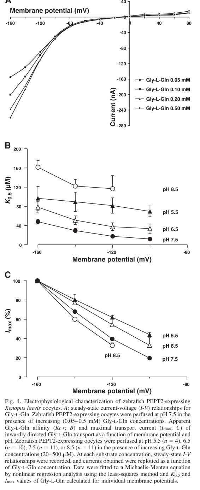

## Question

# Gene Research for Functional Annotation

## ⚠️ CRITICAL: Gene/Protein Identification Context

**BEFORE YOU BEGIN RESEARCH:** You MUST verify you are researching the CORRECT gene/protein. Gene symbols can be ambiguous, especially for less well-characterized genes from non-model organisms.

### Target Gene/Protein Identity (from UniProt):
- **UniProt Accession:** B0S6T2
- **Protein Description:** RecName: Full=Solute carrier family 15 member 2 {ECO:0000303|PubMed:16317081}; AltName: Full=Peptide transporter 2 {ECO:0000303|PubMed:16317081}; Short=PEPT2 {ECO:0000303|PubMed:16317081};
- **Gene Information:** Name=slc15a2 {ECO:0000303|PubMed:16317081, ECO:0000312|ZFIN:ZDB-GENE-030131-5866};
- **Organism (full):** Danio rerio (Zebrafish) (Brachydanio rerio).
- **Protein Family:** Belongs to the major facilitator superfamily. Proton-
- **Key Domains:** MFS_trans_sf. (IPR036259); POT_fam. (IPR000109); PTR2_symporter_CS. (IPR018456); PTR2 (PF00854)

### MANDATORY VERIFICATION STEPS:

1. **Check if the gene symbol "slc15a2" matches the protein description above**
2. **Verify the organism is correct:** Danio rerio (Zebrafish) (Brachydanio rerio).
3. **Check if protein family/domains align with what you find in literature**
4. **If you find literature for a DIFFERENT gene with the same or similar symbol, STOP**

### If Gene Symbol is Ambiguous or You Cannot Find Relevant Literature:

**DO NOT PROCEED WITH RESEARCH ON A DIFFERENT GENE.** Instead:
- State clearly: "The gene symbol 'slc15a2' is ambiguous or literature is limited for this specific protein"
- Explain what you found (e.g., "Found extensive literature on a different gene with the same symbol in a different organism")
- Describe the protein based ONLY on the UniProt information provided above
- Suggest that the protein function can be inferred from domain/family information

### Research Target:

Please provide a comprehensive research report on the gene **slc15a2** (gene ID: slc15a2, UniProt: B0S6T2) in DANRE.

The research report should be a detailed narrative explaining the function, biological processes, and localization of the gene product. Citations should be given for all claims.

You should prioritize authoritative reviews and primary scientific literature when conducting research. You can supplement
this with annotations you find in gene/protein databases, but these can be outdated or inaccurate.

We are specifically interested in the primary function of the gene - for enzymes, what reaction is catalyzed, and what is the substrate specificity? For transporters, what is the substrate? For structural proteins or adapters, what is the broader structural role? For signaling molecules, what is the role in the pathway.

We are interested in where in or outside the cell the gene product carries out its function.

We are also interested in the signaling or biochemical pathways in which the gene functions. We are less interested in broad pleiotropic effects, except where these elucidate the precise role.

Include evidence where possible. We are interested in both experimental evidence as well as inference from structure, evolution, or bioinformatic analysis. Precise studies should be prioritized over high-throughput, where available.

## Output

Question: You are an expert researcher providing comprehensive, well-cited information.

Provide detailed information focusing on:
1. Key concepts and definitions with current understanding
2. Recent developments and latest research (prioritize 2023-2024 sources)
3. Current applications and real-world implementations
4. Expert opinions and analysis from authoritative sources
5. Relevant statistics and data from recent studies

Format as a comprehensive research report with proper citations. Include URLs and publication dates where available.
Always prioritize recent, authoritative sources and provide specific citations for all major claims.

# Gene Research for Functional Annotation

## ⚠️ CRITICAL: Gene/Protein Identification Context

**BEFORE YOU BEGIN RESEARCH:** You MUST verify you are researching the CORRECT gene/protein. Gene symbols can be ambiguous, especially for less well-characterized genes from non-model organisms.

### Target Gene/Protein Identity (from UniProt):
- **UniProt Accession:** B0S6T2
- **Protein Description:** RecName: Full=Solute carrier family 15 member 2 {ECO:0000303|PubMed:16317081}; AltName: Full=Peptide transporter 2 {ECO:0000303|PubMed:16317081}; Short=PEPT2 {ECO:0000303|PubMed:16317081};
- **Gene Information:** Name=slc15a2 {ECO:0000303|PubMed:16317081, ECO:0000312|ZFIN:ZDB-GENE-030131-5866};
- **Organism (full):** Danio rerio (Zebrafish) (Brachydanio rerio).
- **Protein Family:** Belongs to the major facilitator superfamily. Proton-
- **Key Domains:** MFS_trans_sf. (IPR036259); POT_fam. (IPR000109); PTR2_symporter_CS. (IPR018456); PTR2 (PF00854)

### MANDATORY VERIFICATION STEPS:

1. **Check if the gene symbol "slc15a2" matches the protein description above**
2. **Verify the organism is correct:** Danio rerio (Zebrafish) (Brachydanio rerio).
3. **Check if protein family/domains align with what you find in literature**
4. **If you find literature for a DIFFERENT gene with the same or similar symbol, STOP**

### If Gene Symbol is Ambiguous or You Cannot Find Relevant Literature:

**DO NOT PROCEED WITH RESEARCH ON A DIFFERENT GENE.** Instead:
- State clearly: "The gene symbol 'slc15a2' is ambiguous or literature is limited for this specific protein"
- Explain what you found (e.g., "Found extensive literature on a different gene with the same symbol in a different organism")
- Describe the protein based ONLY on the UniProt information provided above
- Suggest that the protein function can be inferred from domain/family information

### Research Target:

Please provide a comprehensive research report on the gene **slc15a2** (gene ID: slc15a2, UniProt: B0S6T2) in DANRE.

The research report should be a detailed narrative explaining the function, biological processes, and localization of the gene product. Citations should be given for all claims.

You should prioritize authoritative reviews and primary scientific literature when conducting research. You can supplement
this with annotations you find in gene/protein databases, but these can be outdated or inaccurate.

We are specifically interested in the primary function of the gene - for enzymes, what reaction is catalyzed, and what is the substrate specificity? For transporters, what is the substrate? For structural proteins or adapters, what is the broader structural role? For signaling molecules, what is the role in the pathway.

We are interested in where in or outside the cell the gene product carries out its function.

We are also interested in the signaling or biochemical pathways in which the gene functions. We are less interested in broad pleiotropic effects, except where these elucidate the precise role.

Include evidence where possible. We are interested in both experimental evidence as well as inference from structure, evolution, or bioinformatic analysis. Precise studies should be prioritized over high-throughput, where available.

## Research Report: Functional Annotation of zebrafish *slc15a2* (PEPT2) — UniProt B0S6T2

### 0) Identity verification (critical disambiguation)
The target gene is **zebrafish (*Danio rerio*) *slc15a2*** encoding **peptide transporter 2 (PEPT2)**, a **proton-coupled oligopeptide transporter (POT) family** member within the **major facilitator superfamily (MFS)**, with a predicted **12-transmembrane (TM) helix** architecture consistent with canonical SLC15 transporters. This identity is supported by zebrafish-specific cloning and functional characterization of *pept2/slc15a2* yielding a **719-aa** predicted membrane transporter and phylogenetic placement among vertebrate PEPT transporters. (maffia2006highaffinitypeptidetransportera pages 2-3, maffia2006highaffinitypeptidetransportera pages 3-5, maffia2006highaffinitypeptidetransporter pages 1-2)

### 1) Key concepts and definitions (current understanding)

#### 1.1 Proton-coupled oligopeptide transporters (POT/SLC15 family)
PEPT2 (SLC15A2) is a **secondary active symporter** that uses the inwardly directed **electrochemical proton gradient (ΔμH⁺)** to drive **concentrative uptake** of **di- and tripeptides** and a broad set of **peptidomimetic drugs**. Transport is **electrogenic** (movement of net charge across the membrane) and follows **alternating-access** principles typical of MFS transporters. (maffia2006highaffinitypeptidetransportera pages 1-2, parker2024structuralbasisfor pages 1-2, lichtinger2024themechanismof pages 1-2)

#### 1.2 “High-affinity/low-capacity” vs “low-affinity/high-capacity” transport
A core concept in SLC15 biology is the functional specialization of PEPT isoforms: **PEPT2 is typically higher affinity and lower capacity** than PEPT1, supporting efficient uptake/reuptake at lower substrate concentrations (notably in renal and barrier epithelia in mammals). Zebrafish PEPT2 was experimentally described as a **classical high-affinity/low-capacity** transporter based on its kinetic behavior and comparison to mammalian counterparts. (maffia2006highaffinitypeptidetransportera pages 8-10, maffia2006highaffinitypeptidetransportera pages 7-8)

### 2) Zebrafish-specific molecular function (substrate specificity, mechanism, kinetics)

#### 2.1 Transported substrates and transport mode
Zebrafish PEPT2 (Slc15a2) transports dipeptides via **H⁺-coupled electrogenic symport**, demonstrated by heterologous expression and electrophysiological recording in *Xenopus laevis* oocytes using the model dipeptide **Gly-L-Gln**. Transport currents obey **Michaelis–Menten** saturation kinetics over tested substrate ranges, supporting a carrier-mediated mechanism. (maffia2006highaffinitypeptidetransportera pages 7-8, maffia2006highaffinitypeptidetransportera pages 6-7)

#### 2.2 Quantitative kinetics (zebrafish)
The zebrafish PEPT2 study reported apparent affinity (**K0.5**) and maximal current (**Imax**) as functions of membrane voltage and extracellular pH. A representative value reported is an apparent affinity for Gly-L-Gln of **K0.5 ≈ 18 µM at −120 mV and pH 7.5**, consistent with high-affinity transport. (maffia2006highaffinitypeptidetransportera pages 2-3)

#### 2.3 Proton coupling and pH dependence (zebrafish)
Zebrafish PEPT2 shows strong **pH dependence** of transport, consistent with H⁺ coupling. Lowering extracellular pH increases transport capacity and alters voltage dependence of Imax, supporting the conclusion that the **transmembrane proton gradient contributes substantially to driving transport**. The assay conditions also emphasize that Gly-L-Gln remains largely **zwitterionic** at acidic-to-neutral pH, aligning with canonical PEPT substrate behavior. (maffia2006highaffinitypeptidetransportera pages 8-10, maffia2006highaffinitypeptidetransportera pages 7-8)

#### 2.4 Mechanistic interpretation using recent (2023–2024) structural knowledge (ortholog-based inference)
While direct zebrafish PEPT2 structures are not in the retrieved corpus, high-confidence inference is possible because PEPT2 is strongly conserved across vertebrates and shares the POT/MFS fold. Recent mammalian PEPT2 work identifies key residues organizing peptide recognition, including a conserved binding network involving **E622, N192, N348, R57** and additional residues that engage peptide termini and backbone. These structural determinants provide a mechanistic rationale for zebrafish PEPT2’s measured high affinity for Gly-L-Gln and its proton-gradient dependence. (lichtinger2024themechanismof pages 2-4)

### 3) Expression patterns and localization in zebrafish (adult tissues, development, cellular context)

#### 3.1 Adult tissue expression (zebrafish)
Adult zebrafish *pept2/slc15a2* mRNA was detected primarily in **gut, kidney, and brain**, with weaker signals in **gill, eye, and skeletal muscle**, and not detected in spleen under the reported RT-PCR conditions. This distribution supports roles in epithelial nutrient/peptide handling and renal peptide salvage, with additional CNS-associated functions. (maffia2006highaffinitypeptidetransportera pages 7-8, maffia2006highaffinitypeptidetransporter media a6bdd02f)

#### 3.2 Developmental expression and inner-ear association (zebrafish)
During development, *pept2* expression is present from **1–7 days post-fertilization (dpf)**, and whole-mount in situ hybridization showed prominent expression in the **brain ventricular/ependymal layers** (from ~1 dpf) and strong expression in the **otic vesicle / developing semicircular canals** (reported particularly from ~2–5 dpf). The original zebrafish report highlighted this as the **first experimental link between *pept2* expression and vertebrate inner ear structures**, suggesting a specialized developmental/epithelial role beyond canonical renal handling. (maffia2006highaffinitypeptidetransportera pages 2-3, maffia2006highaffinitypeptidetransportera pages 7-8, maffia2006highaffinitypeptidetransporter media a6bdd02f)

#### 3.3 Subcellular localization (limitations)
The zebrafish primary study supports that PEPT2 is a **plasma-membrane** transporter (by function in oocytes and epithelial expression), but the retrieved zebrafish evidence does **not** resolve polarized localization (e.g., apical vs basolateral membrane) within zebrafish kidney tubule or intestinal epithelia. Accordingly, polarity assignments should be treated as **ortholog-based inference** rather than zebrafish-demonstrated fact. (maffia2006highaffinitypeptidetransportera pages 7-8, maffia2006highaffinitypeptidetransporter media a6bdd02f)

### 4) Biological roles, pathways, and expert interpretation

#### 4.1 Physiological roles implied by zebrafish data
The strong expression in **kidney, gut, and brain** indicates that zebrafish PEPT2 likely supports **peptide uptake and/or salvage** in epithelia exposed to peptide-containing fluids (e.g., luminal or filtrate environments) and may contribute to **neural/ependymal peptide homeostasis**. The distinctive **otic vesicle/semicircular canal expression** implies a potential role in inner-ear epithelial physiology (e.g., peptide supply, peptide signaling homeostasis, or barrier transport during morphogenesis), though the specific transported endogenous substrates in the otic system remain to be demonstrated experimentally. (maffia2006highaffinitypeptidetransportera pages 2-3, maffia2006highaffinitypeptidetransportera pages 7-8)

#### 4.2 Drug disposition and translational relevance (real-world implementations; ortholog-based)
PEPT2 is a major determinant of **uptake and tissue exposure for peptide-like drugs**, including certain **β-lactam antibiotics**. A central translational application is **structure-guided optimization of drug pharmacokinetics** (e.g., improving uptake via PEPT transporters or avoiding unwanted renal retention). High-resolution cryo-EM structures of mammalian PepT2 in complex with **cefadroxil, amoxicillin, and cloxacillin** explicitly map antibiotic binding and distinguish transported substrates from competitive inhibitors. (parker2024structuralbasisfor pages 1-2)

### 5) Recent developments (prioritize 2023–2024): structures, mechanism, and quantitative pharmacology

#### 5.1 2024 cryo-EM structures of PepT2 with antibiotics (Nature Communications; October 2024)
A 2024 study reported cryo-EM structures of rat PepT2 bound to **cefadroxil**, **amoxicillin**, and **cloxacillin**, integrated with functional assays and computation to establish that **protonation state is integral to drug binding and transport**. Reported quantitative inhibition/competition data in reconstituted systems included:
- **cefadroxil IC50 19 ± 3 µM**
- **amoxicillin IC50 270 ± 39 µM**
- **cloxacillin IC50 203 ± 21 µM**
- comparator **di-alanine IC50 32 ± 3 µM**
The same work cited cell-based Ki estimates (cefadroxil ~3 µM; amoxicillin ~0.2–0.43 mM; cloxacillin ~1 mM) and mechanistically framed why cefadroxil behaves most “dipeptide-like,” while cloxacillin can act as a competitive inhibitor without productive transport. (parker2024structuralbasisfor pages 1-2)

These data are directly actionable for functional annotation because they define PEPT2’s **ligand class preference** and provide quantitative benchmarks for substrate-like vs inhibitor-like behavior. Although generated in a mammalian ortholog, the conclusions are relevant to zebrafish Slc15a2 because the drug-binding site is conserved at the fold and key-residue level across vertebrate PEPT2 proteins. (parker2024structuralbasisfor pages 1-2)

#### 5.2 2024 mechanistic model for proton-coupled alternating access (eLife; April 2024)
A 2024 mechanistic study combined structural models with extensive molecular dynamics to map the PepT2 conformational cycle and identify residue networks governing gating and proton coupling. Key substrate-binding residues highlighted include **E622, N192, N348, R57**, while gating/coupling involves networks including **H87, E53/E56, D317, D342, R206**, and intracellular interactions such as **D170–K642** plus a hydrophobic intracellular gate cluster. The authors further discuss protonation-dependent conformational free-energy landscapes and propose a possible **2 H⁺ : 1 neutral dipeptide** coupling stoichiometry under modeled conditions. (lichtinger2024themechanismof pages 2-4, lichtinger2024themechanismof pages 1-2)

For zebrafish annotation, this provides an updated expert-level framework for interpreting older voltage- and pH-dependent kinetics as a manifestation of coupled proton binding and gating transitions. (maffia2006highaffinitypeptidetransportera pages 7-8, lichtinger2024themechanismof pages 1-2)

#### 5.3 2023 expert synthesis of structure–interaction relationships (Pharmaceutics; October 2023)
A 2023 review synthesizes determinants of PepT substrate recognition and highlights that PepT2 can transport **hundreds to thousands** of di/tripeptides and multiple drug classes. For β-lactams, it emphasizes that **α-amino–containing** molecules (e.g., aminocephalosporins) are more likely to be PepT2 substrates, and that factors including a **free N-terminus**, favorable **carbonyl/carboxylate geometry**, and **hydrophobic/aromatic substituents** influence affinity. (luo2023molecularinsightsto pages 2-4)

### 6) Statistics and data highlights (from recent and primary studies)

- **Zebrafish kinetic benchmark:** Gly-L-Gln apparent affinity reported at **~18 µM (K0.5) at −120 mV, pH 7.5** (TEVC, *Xenopus* oocytes). (maffia2006highaffinitypeptidetransportera pages 2-3)
- **Antibiotic interaction benchmarks (rat PepT2, 2024):** cefadroxil **19 ± 3 µM**, amoxicillin **270 ± 39 µM**, cloxacillin **203 ± 21 µM** (IC50, reconstituted liposomes), vs di-alanine **32 ± 3 µM**. (parker2024structuralbasisfor pages 1-2)
- **Developmental expression window in zebrafish:** detectable **1–7 dpf** by RT-PCR; prominent WISH signal in brain ventricular/ependymal regions and otic vesicle/semicircular canals. (maffia2006highaffinitypeptidetransportera pages 7-8, maffia2006highaffinitypeptidetransporter media a6bdd02f)

### 7) Practical applications and real-world implementations

1. **Drug delivery and prodrug strategies (ortholog-based but broadly implemented):** PEPT2’s promiscuous but structured binding site is exploited to enhance uptake and tissue exposure of peptide-like drugs; the 2024 cryo-EM antibiotic complexes provide concrete templates for rational design to bias toward transport vs inhibition. (parker2024structuralbasisfor pages 1-2)
2. **Zebrafish as a model for peptide transporter biology:** zebrafish-specific *slc15a2* expression in kidney/gut/brain plus robust developmental expression (including otic structures) supports use in studies of epithelial peptide handling and developmental biology, with potential relevance to environmental/nutritional and pharmacologic exposures in aquatic models. (maffia2006highaffinitypeptidetransportera pages 2-3, maffia2006highaffinitypeptidetransportera pages 7-8)

### 8) Limitations and evidence gaps (important for annotation quality)
- **Zebrafish-specific polarity and protein-level localization** (apical vs basolateral; specific cell types) were not resolved in the retrieved zebrafish report; future work would ideally include immunolocalization or tagged knock-in lines to establish membrane orientation in kidney tubules, gut epithelia, brain barriers, and otic epithelium. (maffia2006highaffinitypeptidetransporter media a6bdd02f)
- **Endogenous physiological substrates in brain/inner ear** remain unvalidated in zebrafish; current functional evidence is based on model dipeptides and ortholog-based inference for broader substrate space. (maffia2006highaffinitypeptidetransportera pages 7-8, luo2023molecularinsightsto pages 2-4)

### Summary artifact
The following table consolidates zebrafish-specific evidence and recent (2023–2024) mechanistic/structural evidence relevant to annotating zebrafish Slc15a2.

| Evidence type | Key finding | Quantitative details | Experimental system | Source (author year journal) | URL |
|---|---|---|---|---|---|
| Function | **Zebrafish-specific:** slc15a2 encodes PEPT2, a **high-affinity, low-capacity, electrogenic H\+-coupled di/tripeptide transporter** in the SLC15/POT family; predicted 12-TM MFS transporter, consistent with UniProt B0S6T2 identity. (maffia2006highaffinitypeptidetransportera pages 2-3, maffia2006highaffinitypeptidetransporter pages 1-2, maffia2006highaffinitypeptidetransportera pages 6-7) | ORF 2,160 bp; protein 719 aa; gene reported as very compact (~19.4 kb); 23 exons; tested with Gly-L-Gln. (maffia2006highaffinitypeptidetransportera pages 2-3, maffia2006highaffinitypeptidetransporter pages 1-2, maffia2006highaffinitypeptidetransportera pages 6-7) | Zebrafish cDNA/genomic cloning; heterologous expression in *Xenopus laevis* oocytes; TEVC electrophysiology. (maffia2006highaffinitypeptidetransportera pages 2-3, maffia2006highaffinitypeptidetransportera pages 6-7) | Maffia et al. 2006, *Physiological Genomics* / review summary of same study. (maffia2006highaffinitypeptidetransportera pages 2-3, maffia2006highaffinitypeptidetransporter pages 1-2) | https://doi.org/10.1152/physiolgenomics.00227.2005 |
| Kinetics | **Zebrafish-specific:** PEPT2 shows Michaelis-Menten transport of Gly-L-Gln with strong **voltage- and pH-dependence**; inward currents rise steeply at hyperpolarized potentials. (maffia2006highaffinitypeptidetransportera pages 7-8, maffia2006highaffinitypeptidetransportera pages 6-7, maffia2006highaffinitypeptidetransporter media a6bdd02f) | Substrate range 20–500 µM Gly-L-Gln; representative reported apparent affinity **K0.5 ~18 µM at -120 mV, pH 7.5**; I-V and K0.5/Imax profiled across **pH 5.5–8.5** and negative voltages including **-120 to -160 mV**. (maffia2006highaffinitypeptidetransportera pages 2-3, maffia2006highaffinitypeptidetransportera pages 7-8, maffia2006highaffinitypeptidetransportera pages 6-7, maffia2006highaffinitypeptidetransporter media a6bdd02f) | *Xenopus* oocyte TEVC with concentration-response and I-V analysis. (maffia2006highaffinitypeptidetransportera pages 7-8, maffia2006highaffinitypeptidetransportera pages 6-7, maffia2006highaffinitypeptidetransporter media a6bdd02f) | Maffia et al. 2006, *Physiological Genomics*. (maffia2006highaffinitypeptidetransportera pages 2-3, maffia2006highaffinitypeptidetransportera pages 7-8, maffia2006highaffinitypeptidetransporter media a6bdd02f) | https://doi.org/10.1152/physiolgenomics.00227.2005 |
| Mechanism | **Zebrafish-specific:** transport is driven by the **transmembrane proton gradient**; pH shifts alter Imax and apparent affinity, supporting classical H\+-symport. Neutral/zwitterionic peptide species are favored in assays. (maffia2006highaffinitypeptidetransportera pages 8-10, maffia2006highaffinitypeptidetransportera pages 7-8, maffia2006highaffinitypeptidetransporter pages 6-7) | Lowering extracellular pH from **8.5 to 5.5** increases transport and reduces voltage dependence of Imax; Gly-L-Gln largely zwitterionic at assay pH values. (maffia2006highaffinitypeptidetransportera pages 8-10, maffia2006highaffinitypeptidetransportera pages 7-8) | *Xenopus* oocyte TEVC under varying extracellular pH. (maffia2006highaffinitypeptidetransportera pages 7-8, maffia2006highaffinitypeptidetransporter pages 6-7) | Maffia et al. 2006, *Physiological Genomics*. (maffia2006highaffinitypeptidetransportera pages 8-10, maffia2006highaffinitypeptidetransportera pages 7-8) | https://doi.org/10.1152/physiolgenomics.00227.2005 |
| Expression | **Zebrafish-specific:** adult **brain, kidney, and gut** are principal expression sites; weaker expression in gill, eye, skeletal muscle; absent/undetected in spleen in the reported assay. (maffia2006highaffinitypeptidetransportera pages 7-8, maffia2006highaffinitypeptidetransporter media a6bdd02f) | Adult tissue RT-PCR pattern; strong bands in gut/kidney/brain. (maffia2006highaffinitypeptidetransporter media a6bdd02f) | Adult zebrafish RT-PCR. (maffia2006highaffinitypeptidetransportera pages 7-8, maffia2006highaffinitypeptidetransporter media a6bdd02f) | Maffia et al. 2006, *Physiological Genomics*. (maffia2006highaffinitypeptidetransportera pages 7-8, maffia2006highaffinitypeptidetransporter media a6bdd02f) | https://doi.org/10.1152/physiolgenomics.00227.2005 |
| Localization | **Zebrafish-specific:** embryonic expression is prominent in **brain ventricular/ependymal layers** and **otic vesicle/semicircular canal epithelium**, supporting roles in neural and inner-ear peptide handling. Direct apical/basolateral membrane polarity was not resolved in zebrafish in this study. (maffia2006highaffinitypeptidetransportera pages 7-8, maffia2006highaffinitypeptidetransporter media a6bdd02f) | Expression detected from **1–7 dpf**; brain signal from **1 dpf**; otic vesicle signal strong from **2–5 dpf**. (maffia2006highaffinitypeptidetransportera pages 8-10, maffia2006highaffinitypeptidetransportera pages 7-8, maffia2006highaffinitypeptidetransporter media a6bdd02f) | Whole-mount in situ hybridization; developmental RT-PCR. (maffia2006highaffinitypeptidetransportera pages 2-3, maffia2006highaffinitypeptidetransporter media a6bdd02f) | Maffia et al. 2006, *Physiological Genomics*. (maffia2006highaffinitypeptidetransportera pages 2-3, maffia2006highaffinitypeptidetransporter media a6bdd02f) | https://doi.org/10.1152/physiolgenomics.00227.2005 |
| Physiological role | **Inference from zebrafish expression + vertebrate PEPT2 biology:** likely mediates **renal peptide reabsorption**, **brain/extracellular peptide homeostasis**, and peptide uptake in selected epithelial tissues; developmental otic expression suggests a specialized role in the inner ear. (maffia2006highaffinitypeptidetransportera pages 8-10, maffia2006highaffinitypeptidetransportera pages 7-8, newstead2024structuralbasisfor pages 1-4) | Mammalian PEPT2 generally high-affinity/low-capacity; zebrafish tissue distribution matches kidney/brain-centered physiology. (maffia2006highaffinitypeptidetransportera pages 8-10, newstead2024structuralbasisfor pages 1-4) | Zebrafish expression data integrated with vertebrate ortholog literature. (maffia2006highaffinitypeptidetransportera pages 8-10, newstead2024structuralbasisfor pages 1-4) | Maffia et al. 2006; Newstead/Parker et al. 2024. (maffia2006highaffinitypeptidetransportera pages 8-10, newstead2024structuralbasisfor pages 1-4) | https://doi.org/10.1152/physiolgenomics.00227.2005 ; https://doi.org/10.1038/s41467-024-53096-6 |
| Structure | **Ortholog-based inference:** mammalian PepT2 cryo-EM confirms the expected **MFS/POT fold** and explains broad peptide/drug recognition relevant to zebrafish family annotation. (parker2024structuralbasisfor pages 1-2, luo2023molecularinsightsto pages 8-9) | 12-TM fold; alternating-access conformations; charged central cavity for ligand binding. (lichtinger2024themechanismof pages 2-4, luo2023molecularinsightsto pages 8-9) | Rat/human PepT2 structural biology, cryo-EM, MD, biochemical assays. (parker2024structuralbasisfor pages 1-2, lichtinger2024themechanismof pages 2-4, luo2023molecularinsightsto pages 8-9) | Parker et al. 2024, *Nature Communications*; Luo et al. 2023, *Pharmaceutics*. (parker2024structuralbasisfor pages 1-2, luo2023molecularinsightsto pages 8-9) | https://doi.org/10.1038/s41467-024-53096-6 ; https://doi.org/10.3390/pharmaceutics15102517 |
| Drug substrate recognition | **Ortholog-based inference:** PepT2 recognizes some **beta-lactam antibiotics** by mimicking dipeptide pharmacophores; cefadroxil behaves most substrate-like, cloxacillin more inhibitor-like. (newstead2024structuralbasisfor pages 10-12, parker2024structuralbasisfor pages 1-2, luo2023molecularinsightsto pages 2-4) | Rat PepT2 liposome IC50: **cefadroxil 19 ± 3 µM**, **amoxicillin 270 ± 39 µM**, **cloxacillin 203 ± 21 µM**; comparator **di-alanine 32 ± 3 µM**. Literature Ki values cited: cefadroxil ~3 µM, amoxicillin ~0.2–0.43 mM, cloxacillin ~1 mM. (newstead2024structuralbasisfor pages 10-12, parker2024structuralbasisfor pages 1-2) | Rat PepT2 cryo-EM, reconstituted liposome uptake, counterflow, MD/pharmacophore mapping. (newstead2024structuralbasisfor pages 1-4, parker2024structuralbasisfor pages 1-2) | Parker et al. 2024, *Nature Communications*. (parker2024structuralbasisfor pages 1-2) | https://doi.org/10.1038/s41467-024-53096-6 |
| Binding determinants | **Ortholog-based inference:** substrate binding depends on a conserved polar network including **Arg57, Asn192, Asn348, Glu622**; cefadroxil preserves dipeptide-like contacts better than amoxicillin/cloxacillin. (newstead2024structuralbasisfor pages 10-12, lichtinger2024themechanismof pages 2-4) | Cefadroxil aligns with dipeptide carbonyl/amide geometry; amoxicillin loses optimal Asn192 contact; cloxacillin poorly engages transport-enabling contacts and acts competitively. (newstead2024structuralbasisfor pages 10-12) | Cryo-EM + MD + biochemical assays in mammalian PepT2. (newstead2024structuralbasisfor pages 10-12, lichtinger2024themechanismof pages 2-4) | Parker et al. 2024, *Nature Communications*; Lichtinger et al. 2024, *eLife*. (newstead2024structuralbasisfor pages 10-12, lichtinger2024themechanismof pages 2-4) | https://doi.org/10.1038/s41467-024-53096-6 ; https://doi.org/10.1101/2024.02.04.578827 |
| Proton-coupling/gating | **Ortholog-based inference:** recent MD maps the proton-coupled alternating-access cycle and implicates **H87, E53/E56, D317, D342, R206, D170, K642, E622** in coupling and gating. (lichtinger2024themechanismof pages 2-4, lichtinger2024themechanismof pages 1-2, parker2024structuralbasisfor pages 11-12) | 2024 study modeled nearly **1 ms** aggregate MD and proposed a **2:1 H\+:neutral dipeptide stoichiometry** under some conditions; protonation of **Glu56** changes binding energetics by ~**4 kcal/mol** in antibiotic-binding calculations. (newstead2024structuralbasisfor pages 10-12, lichtinger2024themechanismof pages 1-2, parker2024structuralbasisfor pages 11-12) | Cryo-EM/AlphaFold-guided molecular dynamics; cell-based transport assays; ABFE calculations. (lichtinger2024themechanismof pages 2-4, lichtinger2024themechanismof pages 1-2, parker2024structuralbasisfor pages 11-12) | Lichtinger et al. 2024, *eLife*; Parker et al. 2024, *Nature Communications*. (lichtinger2024themechanismof pages 2-4, parker2024structuralbasisfor pages 11-12) | https://doi.org/10.1101/2024.02.04.578827 ; https://doi.org/10.1038/s41467-024-53096-6 |
| Expert review synthesis | **Ortholog-based inference:** 2023 review emphasizes PEPT2 as a **high-affinity/low-capacity** member with unusually broad substrate scope (hundreds to thousands of di/tripeptides and peptide-like drugs), where free N-termini, carbonyl/carboxyl geometry, and hydrophobic/aromatic substituents shape affinity. (luo2023molecularinsightsto pages 8-9, luo2023molecularinsightsto pages 2-4) | Review notes select beta-lactams with an **α-amino group** are favored substrates; peptide bond presence is not strictly required. (luo2023molecularinsightsto pages 2-4) | Review synthesis of structural, mutational, and pharmacological literature. (luo2023molecularinsightsto pages 8-9, luo2023molecularinsightsto pages 2-4) | Luo et al. 2023, *Pharmaceutics*. (luo2023molecularinsightsto pages 8-9, luo2023molecularinsightsto pages 2-4) | https://doi.org/10.3390/pharmaceutics15102517 |

*Table: This table compiles zebrafish-specific functional annotation evidence for Danio rerio slc15a2/PEPT2 together with 2023-2024 mechanistic and structural studies from mammalian orthologs. It is useful for separating direct zebrafish data from higher-confidence ortholog-based inference relevant to substrate specificity, localization, and transport mechanism.*

### Key references with publication dates and URLs
- Parker JL et al. **Structural basis for antibiotic transport and inhibition in PepT2.** *Nature Communications* (Oct 2024). https://doi.org/10.1038/s41467-024-53096-6 (parker2024structuralbasisfor pages 1-2)
- Lichtinger SM et al. **The mechanism of mammalian proton-coupled peptide transporters.** *eLife* preprint DOI posted Apr 2024. https://doi.org/10.1101/2024.02.04.578827 (lichtinger2024themechanismof pages 2-4, lichtinger2024themechanismof pages 1-2)
- Luo Y et al. **Molecular Insights to the Structure-Interaction Relationships of Human Proton-Coupled Oligopeptide Transporters (PepTs).** *Pharmaceutics* (Oct 2023). https://doi.org/10.3390/pharmaceutics15102517 (luo2023molecularinsightsto pages 8-9, luo2023molecularinsightsto pages 2-4)
- Maffia FA et al. **High-affinity peptide transporter pept2 (*slc15a2*) of the zebrafish (*Danio rerio*): functional properties, genomic organization, and expression analysis.** *Physiological Genomics* (2006). https://doi.org/10.1152/physiolgenomics.00227.2005 (maffia2006highaffinitypeptidetransportera pages 2-3, maffia2006highaffinitypeptidetransportera pages 7-8, maffia2006highaffinitypeptidetransporter media a6bdd02f)

References

1. (maffia2006highaffinitypeptidetransportera pages 2-3): FA Maffia, H Daniel, C Storelli, and T Verri. High-affinity peptide transporter pept2 (slc15a2). Unknown journal, 2006.

2. (maffia2006highaffinitypeptidetransportera pages 3-5): FA Maffia, H Daniel, C Storelli, and T Verri. High-affinity peptide transporter pept2 (slc15a2). Unknown journal, 2006.

3. (maffia2006highaffinitypeptidetransporter pages 1-2): FA Maffia, H Daniel, C Storelli, and T Verri. High-affinity peptide transporter pept2 (slc15a2). Unknown journal, 2006.

4. (maffia2006highaffinitypeptidetransportera pages 1-2): FA Maffia, H Daniel, C Storelli, and T Verri. High-affinity peptide transporter pept2 (slc15a2). Unknown journal, 2006.

5. (parker2024structuralbasisfor pages 1-2): Joanne L. Parker, Justin C. Deme, Simon M. Lichtinger, Gabriel Kuteyi, Philip C. Biggin, Susan M. Lea, and Simon Newstead. Structural basis for antibiotic transport and inhibition in pept2. Nature Communications, Oct 2024. URL: https://doi.org/10.1038/s41467-024-53096-6, doi:10.1038/s41467-024-53096-6. This article has 8 citations and is from a highest quality peer-reviewed journal.

6. (lichtinger2024themechanismof pages 1-2): Simon M Lichtinger, Joanne L Parker, Simon Newstead, and Philip C Biggin. The mechanism of mammalian proton-coupled peptide transporters. eLife, Apr 2024. URL: https://doi.org/10.1101/2024.02.04.578827, doi:10.1101/2024.02.04.578827. This article has 13 citations and is from a domain leading peer-reviewed journal.

7. (maffia2006highaffinitypeptidetransportera pages 8-10): FA Maffia, H Daniel, C Storelli, and T Verri. High-affinity peptide transporter pept2 (slc15a2). Unknown journal, 2006.

8. (maffia2006highaffinitypeptidetransportera pages 7-8): FA Maffia, H Daniel, C Storelli, and T Verri. High-affinity peptide transporter pept2 (slc15a2). Unknown journal, 2006.

9. (maffia2006highaffinitypeptidetransportera pages 6-7): FA Maffia, H Daniel, C Storelli, and T Verri. High-affinity peptide transporter pept2 (slc15a2). Unknown journal, 2006.

10. (lichtinger2024themechanismof pages 2-4): Simon M Lichtinger, Joanne L Parker, Simon Newstead, and Philip C Biggin. The mechanism of mammalian proton-coupled peptide transporters. eLife, Apr 2024. URL: https://doi.org/10.1101/2024.02.04.578827, doi:10.1101/2024.02.04.578827. This article has 13 citations and is from a domain leading peer-reviewed journal.

11. (maffia2006highaffinitypeptidetransporter media a6bdd02f): FA Maffia, H Daniel, C Storelli, and T Verri. High-affinity peptide transporter pept2 (slc15a2). Unknown journal, 2006.

12. (luo2023molecularinsightsto pages 2-4): Yining Luo, Jingchun Gao, Xukai Jiang, Ling Zhu, Qi Tony Zhou, Michael Murray, Jian Li, and Fanfan Zhou. Molecular insights to the structure-interaction relationships of human proton-coupled oligopeptide transporters (pepts). Pharmaceutics, 15:2517, Oct 2023. URL: https://doi.org/10.3390/pharmaceutics15102517, doi:10.3390/pharmaceutics15102517. This article has 13 citations.

13. (maffia2006highaffinitypeptidetransporter pages 6-7): FA Maffia, H Daniel, C Storelli, and T Verri. High-affinity peptide transporter pept2 (slc15a2). Unknown journal, 2006.

14. (newstead2024structuralbasisfor pages 1-4): Simon Newstead, Joanne L Parker, Justin C. Deme, Simon M. Lichtinger, Gabriel Kuteyi, P. Biggin, and Susan M. Lea. Structural basis for antibiotic transport and inhibition in pept2, the mammalian proton-coupled peptide transporter. Research Square, May 2024. URL: https://doi.org/10.21203/rs.3.rs-4435259/v1, doi:10.21203/rs.3.rs-4435259/v1. This article has 1 citations.

15. (luo2023molecularinsightsto pages 8-9): Yining Luo, Jingchun Gao, Xukai Jiang, Ling Zhu, Qi Tony Zhou, Michael Murray, Jian Li, and Fanfan Zhou. Molecular insights to the structure-interaction relationships of human proton-coupled oligopeptide transporters (pepts). Pharmaceutics, 15:2517, Oct 2023. URL: https://doi.org/10.3390/pharmaceutics15102517, doi:10.3390/pharmaceutics15102517. This article has 13 citations.

16. (newstead2024structuralbasisfor pages 10-12): Simon Newstead, Joanne L Parker, Justin C. Deme, Simon M. Lichtinger, Gabriel Kuteyi, P. Biggin, and Susan M. Lea. Structural basis for antibiotic transport and inhibition in pept2, the mammalian proton-coupled peptide transporter. Research Square, May 2024. URL: https://doi.org/10.21203/rs.3.rs-4435259/v1, doi:10.21203/rs.3.rs-4435259/v1. This article has 1 citations.

17. (parker2024structuralbasisfor pages 11-12): Joanne L. Parker, Justin C. Deme, Simon M. Lichtinger, Gabriel Kuteyi, Philip C. Biggin, Susan M. Lea, and Simon Newstead. Structural basis for antibiotic transport and inhibition in pept2. Nature Communications, Oct 2024. URL: https://doi.org/10.1038/s41467-024-53096-6, doi:10.1038/s41467-024-53096-6. This article has 8 citations and is from a highest quality peer-reviewed journal.

## Artifacts

- [Edison artifact artifact-00](slc15a2-deep-research-falcon_artifacts/artifact-00.md)

## Citations

1. maffia2006highaffinitypeptidetransportera pages 2-3
2. lichtinger2024themechanismof pages 2-4
3. parker2024structuralbasisfor pages 1-2
4. luo2023molecularinsightsto pages 2-4
5. newstead2024structuralbasisfor pages 10-12
6. maffia2006highaffinitypeptidetransportera pages 3-5
7. maffia2006highaffinitypeptidetransporter pages 1-2
8. maffia2006highaffinitypeptidetransportera pages 1-2
9. lichtinger2024themechanismof pages 1-2
10. maffia2006highaffinitypeptidetransportera pages 8-10
11. maffia2006highaffinitypeptidetransportera pages 7-8
12. maffia2006highaffinitypeptidetransportera pages 6-7
13. maffia2006highaffinitypeptidetransporter pages 6-7
14. newstead2024structuralbasisfor pages 1-4
15. luo2023molecularinsightsto pages 8-9
16. parker2024structuralbasisfor pages 11-12
17. https://doi.org/10.1152/physiolgenomics.00227.2005
18. https://doi.org/10.1038/s41467-024-53096-6
19. https://doi.org/10.3390/pharmaceutics15102517
20. https://doi.org/10.1101/2024.02.04.578827
21. https://doi.org/10.1038/s41467-024-53096-6,
22. https://doi.org/10.1101/2024.02.04.578827,
23. https://doi.org/10.3390/pharmaceutics15102517,
24. https://doi.org/10.21203/rs.3.rs-4435259/v1,