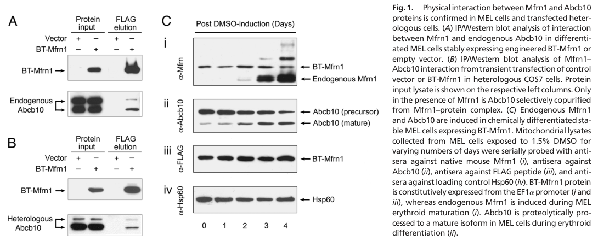

## Question

# Gene Research for Functional Annotation

## ⚠️ CRITICAL: Gene/Protein Identification Context

**BEFORE YOU BEGIN RESEARCH:** You MUST verify you are researching the CORRECT gene/protein. Gene symbols can be ambiguous, especially for less well-characterized genes from non-model organisms.

### Target Gene/Protein Identity (from UniProt):
- **UniProt Accession:** Q287T7
- **Protein Description:** RecName: Full=Mitoferrin-1; AltName: Full=Mitochondrial iron transporter 1; AltName: Full=Protein frascati; AltName: Full=Solute carrier family 25 member 37;
- **Gene Information:** Name=slc25a37; Synonyms=frs, mfrn;
- **Organism (full):** Danio rerio (Zebrafish) (Brachydanio rerio).
- **Protein Family:** Belongs to the mitochondrial carrier (TC 2.A.29) family.
- **Key Domains:** MCP. (IPR002067); MCP_dom_sf. (IPR023395); MCP_transmembrane. (IPR018108); Mito_carr (PF00153)

### MANDATORY VERIFICATION STEPS:

1. **Check if the gene symbol "slc25a37" matches the protein description above**
2. **Verify the organism is correct:** Danio rerio (Zebrafish) (Brachydanio rerio).
3. **Check if protein family/domains align with what you find in literature**
4. **If you find literature for a DIFFERENT gene with the same or similar symbol, STOP**

### If Gene Symbol is Ambiguous or You Cannot Find Relevant Literature:

**DO NOT PROCEED WITH RESEARCH ON A DIFFERENT GENE.** Instead:
- State clearly: "The gene symbol 'slc25a37' is ambiguous or literature is limited for this specific protein"
- Explain what you found (e.g., "Found extensive literature on a different gene with the same symbol in a different organism")
- Describe the protein based ONLY on the UniProt information provided above
- Suggest that the protein function can be inferred from domain/family information

### Research Target:

Please provide a comprehensive research report on the gene **slc25a37** (gene ID: slc25a37, UniProt: Q287T7) in DANRE.

The research report should be a detailed narrative explaining the function, biological processes, and localization of the gene product. Citations should be given for all claims.

You should prioritize authoritative reviews and primary scientific literature when conducting research. You can supplement
this with annotations you find in gene/protein databases, but these can be outdated or inaccurate.

We are specifically interested in the primary function of the gene - for enzymes, what reaction is catalyzed, and what is the substrate specificity? For transporters, what is the substrate? For structural proteins or adapters, what is the broader structural role? For signaling molecules, what is the role in the pathway.

We are interested in where in or outside the cell the gene product carries out its function.

We are also interested in the signaling or biochemical pathways in which the gene functions. We are less interested in broad pleiotropic effects, except where these elucidate the precise role.

Include evidence where possible. We are interested in both experimental evidence as well as inference from structure, evolution, or bioinformatic analysis. Precise studies should be prioritized over high-throughput, where available.

## Output

Question: You are an expert researcher providing comprehensive, well-cited information.

Provide detailed information focusing on:
1. Key concepts and definitions with current understanding
2. Recent developments and latest research (prioritize 2023-2024 sources)
3. Current applications and real-world implementations
4. Expert opinions and analysis from authoritative sources
5. Relevant statistics and data from recent studies

Format as a comprehensive research report with proper citations. Include URLs and publication dates where available.
Always prioritize recent, authoritative sources and provide specific citations for all major claims.

# Gene Research for Functional Annotation

## ⚠️ CRITICAL: Gene/Protein Identification Context

**BEFORE YOU BEGIN RESEARCH:** You MUST verify you are researching the CORRECT gene/protein. Gene symbols can be ambiguous, especially for less well-characterized genes from non-model organisms.

### Target Gene/Protein Identity (from UniProt):
- **UniProt Accession:** Q287T7
- **Protein Description:** RecName: Full=Mitoferrin-1; AltName: Full=Mitochondrial iron transporter 1; AltName: Full=Protein frascati; AltName: Full=Solute carrier family 25 member 37;
- **Gene Information:** Name=slc25a37; Synonyms=frs, mfrn;
- **Organism (full):** Danio rerio (Zebrafish) (Brachydanio rerio).
- **Protein Family:** Belongs to the mitochondrial carrier (TC 2.A.29) family.
- **Key Domains:** MCP. (IPR002067); MCP_dom_sf. (IPR023395); MCP_transmembrane. (IPR018108); Mito_carr (PF00153)

### MANDATORY VERIFICATION STEPS:

1. **Check if the gene symbol "slc25a37" matches the protein description above**
2. **Verify the organism is correct:** Danio rerio (Zebrafish) (Brachydanio rerio).
3. **Check if protein family/domains align with what you find in literature**
4. **If you find literature for a DIFFERENT gene with the same or similar symbol, STOP**

### If Gene Symbol is Ambiguous or You Cannot Find Relevant Literature:

**DO NOT PROCEED WITH RESEARCH ON A DIFFERENT GENE.** Instead:
- State clearly: "The gene symbol 'slc25a37' is ambiguous or literature is limited for this specific protein"
- Explain what you found (e.g., "Found extensive literature on a different gene with the same symbol in a different organism")
- Describe the protein based ONLY on the UniProt information provided above
- Suggest that the protein function can be inferred from domain/family information

### Research Target:

Please provide a comprehensive research report on the gene **slc25a37** (gene ID: slc25a37, UniProt: Q287T7) in DANRE.

The research report should be a detailed narrative explaining the function, biological processes, and localization of the gene product. Citations should be given for all claims.

You should prioritize authoritative reviews and primary scientific literature when conducting research. You can supplement
this with annotations you find in gene/protein databases, but these can be outdated or inaccurate.

We are specifically interested in the primary function of the gene - for enzymes, what reaction is catalyzed, and what is the substrate specificity? For transporters, what is the substrate? For structural proteins or adapters, what is the broader structural role? For signaling molecules, what is the role in the pathway.

We are interested in where in or outside the cell the gene product carries out its function.

We are also interested in the signaling or biochemical pathways in which the gene functions. We are less interested in broad pleiotropic effects, except where these elucidate the precise role.

Include evidence where possible. We are interested in both experimental evidence as well as inference from structure, evolution, or bioinformatic analysis. Precise studies should be prioritized over high-throughput, where available.

# Research Report: Functional Annotation of **slc25a37 / mitoferrin-1 (mfrn1)** in **Danio rerio** (UniProt **Q287T7**)

## 1. Target verification (critical identity check)
The UniProt accession **Q287T7** corresponds to **Danio rerio slc25a37**, annotated as **Mitoferrin-1 (Mfrn1)**, also known historically as **frascati (frs)** in zebrafish genetics. Independent literature explicitly links **slc25a37** to **mitoferrin-1** and identifies it as the gene mutated in the **frascati** hypochromic anemia mutant, confirming that the discussed function is for the correct gene/protein and organism (zebrafish). (chen2009abcb10physicallyinteracts pages 1-1, ali2022mitoferrincellularand pages 3-4, zhang2019zebrafishasa pages 9-11)

## 2. Key concepts and current definitions
### 2.1 Mitoferrin-1 as a mitochondrial iron importer
Mitoferrin-1 (SLC25A37/Mfrn1) is currently understood as a **mitochondrial inner membrane (IMM) transporter** of the **SLC25/mitochondrial carrier family** that imports iron into mitochondria, especially in erythroid cells where mitochondrial iron demand is high for **heme biosynthesis** and **iron–sulfur (Fe–S) cluster biogenesis**. (chen2009abcb10physicallyinteracts pages 1-1, pasquadibisceglie2023membranetransportersinvolved pages 11-13, zhang2019zebrafishasa pages 17-21)

### 2.2 Pathway context: heme synthesis and Fe–S clusters
In erythroid cells, mitochondrial iron is needed for the final step of heme synthesis catalyzed by **ferrochelatase (FECH)**, which inserts **ferrous iron (Fe2+)** into protoporphyrin IX. Mfrn1 is described in zebrafish-focused erythropoiesis literature as a key component supplying iron to this mitochondrial pathway; the same mitochondrial iron pool also supports Fe–S cluster assembly pathways. (zhang2019zebrafishasa pages 17-21, zhang2019zebrafishasa pages 9-11)

## 3. Molecular function, substrate specificity, and mechanism
### 3.1 Substrate and directionality
The primary molecular function is **iron transport into mitochondria** (import across the mitochondrial inner membrane into the matrix-facing compartment) to supply iron for heme and Fe–S cluster synthesis. (chen2009abcb10physicallyinteracts pages 1-1, pasquadibisceglie2023membranetransportersinvolved pages 11-13, zhang2019zebrafishasa pages 17-21)

While many studies describe the substrate as “iron” generically, multiple sources frame this in the context of **Fe2+ utilization** for heme synthesis, and a mitoferrin review summarizes **Fe2+ binding/affinity** (reported as ~**102 µM**) and notes pH dependence consistent with mitochondrial physiology. (zhang2019zebrafishasa pages 17-21, ali2022mitoferrincellularand pages 4-7)

### 3.2 Transporter family mechanism (SLC25/Mitochondrial Carrier Family)
Mitoferrin-1 belongs to the **mitochondrial carrier family** and is described as operating via a canonical **alternating-access carrier mechanism** (the standard mechanistic paradigm for SLC25 carriers). Structure–function summaries highlight conserved residues (notably conserved histidines) implicated in metal translocation. (pasquadibisceglie2023membranetransportersinvolved pages 11-13)

A 2023 review further notes that mitoferrin-mediated iron transport is reported not to require an iron chelator, and that mitoferrins may transport (or at least accommodate transport of) additional first-row transition metals besides iron in some experimental systems—important to interpret cautiously when functionally annotating the zebrafish ortholog, whose established physiological role is mitochondrial iron import for erythropoiesis. (pasquadibisceglie2023membranetransportersinvolved pages 11-13)

## 4. Subcellular localization and interacting partners
### 4.1 Localization
Mitoferrin-1 is consistently described as a **mitochondrial inner membrane** protein in erythroid mitochondria. (chen2009abcb10physicallyinteracts pages 1-1, pasquadibisceglie2023membranetransportersinvolved pages 11-13)

### 4.2 ABCB10–Mfrn1 interaction and functional consequence
A key mechanistic insight is that **ABCB10** (an inner mitochondrial membrane ABC transporter induced in erythroid maturation) **physically interacts** with mitoferrin-1 and **stabilizes** it, thereby enhancing mitoferrin-1 function (mitochondrial iron import). This interaction maps to the **N-terminus** of Mfrn1 (reported interaction region around amino acids 26–50), and the paper presents a model of an erythroid mitochondrial complex that promotes iron import. (chen2009abcb10physicallyinteracts pages 1-1, chen2009abcb10physicallyinteracts media 9a077aa5, chen2009abcb10physicallyinteracts media cc293880)

This ABCB10-dependent stabilization is considered a major post-translational regulatory layer controlling effective mitochondrial iron uptake during erythroid differentiation. (chen2009abcb10physicallyinteracts pages 1-1, pasquadibisceglie2023membranetransportersinvolved pages 11-13, chen2009abcb10physicallyinteracts media d198278b)

## 5. Zebrafish biology: erythropoiesis phenotypes and functional evidence
### 5.1 frascati (frs) mutant phenotype
Zebrafish **frascati (frs)** mutants—caused by mutation in **mfrn1/slc25a37**—exhibit **hypochromic anemia** and **erythroid maturation arrest**, a canonical phenotype supporting Mfrn1’s essential role in erythroid mitochondrial iron assimilation. (chen2009abcb10physicallyinteracts pages 1-1, ali2022mitoferrincellularand pages 3-4, zhang2019zebrafishasa pages 9-11)

Cross-species complementation experiments reported in the PNAS study show that **mouse Mfrn1 can complement** the zebrafish frascati anemia phenotype, supporting deep functional conservation and strengthening inference for the zebrafish protein’s biochemical role. (chen2009abcb10physicallyinteracts pages 1-1, zhang2019zebrafishasa pages 9-11)

### 5.2 Mitochondrial iron import is required for terminal erythroid proliferation/cell cycle
A zebrafish mfrn1 study (preprint) reports that mfrn1 mutants have **severely decreased erythroid cell numbers** due to **cell-cycle arrest at G2/M**, with rescue by iron supplementation strategies, consistent with mitochondrial iron deficiency as a proximal cause. Experimental conditions reported include rescue treatment with **ferric ammonium citrate (FAC)** plus **hinokitiol** (e.g., **10 µM FAC + 1 µM hinokitiol** or **20 µM FAC + 15 µM hinokitiol**), mitochondrial iron measurement dye **RPA at 10 µM**, and **EdU at 1.5 mM** for cell-cycle analysis. (perfetto2025mitochondrialirontransport pages 1-3)

## 6. Regulation of slc25a37 expression in erythropoiesis
A mitoferrin review summarizes erythroid transcriptional control in which **GATA1** induces mitoferrin-1 expression during erythroid maturation (including zebrafish gata1 dependence of mitoferrin expression in developmental contexts). (ali2022mitoferrincellularand pages 4-7)

A 2024 whole-blood transcriptome study of congenital anemia patients reports a **correlation** between expression of **GATA1, SLC25A37, and ABCB10** in a transfusion-independent group, consistent with coordinated regulation of an erythroid mitochondrial heme/iron module. (sanchezvillalobos2024wholebloodtranscriptome pages 11-12)

## 7. Recent developments (prioritizing 2023–2024) and expert synthesis
### 7.1 Updated reviews of mitoferrin and iron trafficking (2023)
A 2023 review of iron-trafficking membrane transporters provides an updated synthesis: mitoferrin-1 is emphasized as an erythroid-enriched SLC25 family iron importer; it discusses mechanistic motifs (carrier alternating-access framework, conserved residues), and reiterates the zebrafish frascati anemia phenotype as genetic evidence for physiological importance. (Published Jul 2023; https://doi.org/10.3390/biom13081172) (pasquadibisceglie2023membranetransportersinvolved pages 11-13)

### 7.2 SLC25A37 in 2024 disease- and systems-biology contexts
A 2024 review on SLC25 carriers in cancer metabolism highlights SLC25A37 as part of mitochondrial iron handling implicated in cancer metabolic reprogramming and notes emerging transcript/splice-variant associations in hematologic disease contexts. (Published Dec 2024; https://doi.org/10.3390/ijms26010092) (ahmed2024theroleof pages 33-34)

## 8. Current applications and real-world implementations
Although the user’s target is zebrafish slc25a37, recent applications frequently use SLC25A37 biology in vertebrate disease and systems contexts to infer mechanism and identify biomarkers.

### 8.1 Human congenital anemia transcriptomics (2024)
Whole-blood transcriptome profiling in congenital anemia patients identifies coordinated erythroid differentiation programs and reports correlation between **GATA1, SLC25A37, and ABCB10** expression in transfusion-independent patients, supporting use of this axis as a molecular readout of erythroid activity and mitochondrial heme/iron programs in clinical transcriptomics. (Published Oct 2024; https://doi.org/10.3390/ijms252111706) (sanchezvillalobos2024wholebloodtranscriptome pages 11-12)

### 8.2 Cancer metabolism and oxidative stress modulation (2023)
In glioblastoma models, MFRN1 upregulation is analyzed as a driver of mitochondrial iron homeostasis changes and tumor phenotypes, including altered glutathione pathway dependence and oxidative damage protection mechanisms. (Published Feb 2023; https://doi.org/10.3390/antiox12020349) (ali2023mitoferrin1promotesproliferation pages 8-10)

### 8.3 Metabolic phenotyping / obesity resistance biomarker (2024)
In a mouse model of obesity resistance, Slc25a37/mitoferrin-1 is reported as a **biomarker of metabolic adaptation**, linking mitochondrial oxidative phenotype and iron handling to obesity-resistant physiology. (Published Jan 2024; https://doi.org/10.3390/metabo14010069) (milhem2024biomarkersofmetabolic pages 1-2)

### 8.4 Mitochondrial transporter networks (ABCB10 axis) in cardiac dysfunction (2024)
A 2024 cardiomyocyte-specific Abcb10 knockout study frames ABCB10 as important for mitochondrial homeostasis and references ABCB10’s known role in stabilizing mitoferrin-1; it provides a disease-model context in which the ABCB10–MFRN1 axis is mechanistically relevant to oxidative stress and organelle dysfunction. (Published May 2024; https://doi.org/10.1042/BSR20231992) (do2024cardiomyocytespecificdeletionof pages 9-11)

## 9. Quantitative statistics and data points (from available sources)
*Note:* Quantitative zebrafish frascati phenotype magnitudes (e.g., RBC counts/hemoglobin concentrations) were not present in the retrieved excerpts; below are the quantitative values available.

1. **Mitoferrin iron binding/affinity (reviewed)**: Fe2+ affinity reported as ~**102 µM**, with transport faster at alkaline external pH. (Ali et al., Cells, Nov 2022; https://doi.org/10.3390/cells11213464) (ali2022mitoferrincellularand pages 4-7)
2. **Zebrafish mfrn1 functional rescue assay conditions (preprint)**: iron supplementation rescue via **10 µM FAC + 1 µM hinokitiol** or **20 µM FAC + 15 µM hinokitiol**; mitochondrial iron dye **RPA 10 µM**; proliferation/cell cycle assay **EdU 1.5 mM**. (Perfetto et al., bioRxiv; https://doi.org/10.1101/2022.08.22.504833) (perfetto2025mitochondrialirontransport pages 1-3)
3. **Obesity resistance model (mouse)**: obesity-resistant mice had healthier fat/lean ratio **0.43 ± 0.05** vs obesity-prone **0.69 ± 0.07** (p < 0.0001) and showed **4.9-fold upregulated Slc25a37**. (Milhem et al., Metabolites, Published 20 Jan 2024; https://doi.org/10.3390/metabo14010069) (milhem2024biomarkersofmetabolic pages 1-2)
4. **GBM oxidative stress interventions (MFRN1-overexpressing cells)**: **5 mM BSO for 24 h** caused a **3.5-fold decrease** in intracellular GSH; **20 µM erastin for 24 h** reduced GSH by **<30-fold** (as reported) and increased 4-HNE-induced protein adduction. (Ali et al., Antioxidants, Published Feb 2023; https://doi.org/10.3390/antiox12020349) (ali2023mitoferrin1promotesproliferation pages 8-10)
5. **Abcb10 cardiac KO lysosomal damage marker**: galectin-3 levels increased **~2-fold** in Abcb10 cKO hearts. (Do et al., Bioscience Reports, Published May 2024; https://doi.org/10.1042/BSR20231992) (do2024cardiomyocytespecificdeletionof pages 9-11)

## 10. Expert interpretation and evidence-weighted conclusion
Across zebrafish genetics, mammalian erythroid biochemistry, and modern reviews, the most strongly supported functional annotation for **Danio rerio slc25a37 (UniProt Q287T7)** is:

- **Protein class:** SLC25 family mitochondrial carrier on the **inner mitochondrial membrane**. (chen2009abcb10physicallyinteracts pages 1-1, pasquadibisceglie2023membranetransportersinvolved pages 11-13)
- **Primary molecular function:** **mitochondrial iron import** to supply iron for **heme biosynthesis** (including FECH-dependent terminal step) and **Fe–S cluster assembly**, particularly critical in erythroid cells. (zhang2019zebrafishasa pages 17-21, chen2009abcb10physicallyinteracts pages 1-1, pasquadibisceglie2023membranetransportersinvolved pages 11-13)
- **Core biological process:** **primitive and definitive erythropoiesis**, where loss leads to **hypochromic anemia** and **erythroid maturation arrest** (frascati). (chen2009abcb10physicallyinteracts pages 1-1, zhang2019zebrafishasa pages 9-11)
- **Key regulatory/partner module:** **ABCB10–MFRN1** interaction stabilizes MFRN1 to enhance mitochondrial iron uptake during erythroid maturation; this is supported by direct interaction evidence and schematic model figures in the foundational study. (chen2009abcb10physicallyinteracts pages 1-1, chen2009abcb10physicallyinteracts media 9a077aa5, chen2009abcb10physicallyinteracts media cc293880)

## Summary table of functional annotation
| Annotation topic | Key conclusion | Evidence type | Key citations |
|---|---|---|---|
| Identity | UniProt Q287T7 matches **Danio rerio slc25a37 / mfrn1 / frascati**, encoding **mitoferrin-1**, the zebrafish ortholog of vertebrate mitochondrial iron importer MFRN1; literature directly links the **frascati (frs)** anemia mutant to **mfrn1/slc25a37**, consistent with UniProt family assignment to the mitochondrial carrier/SLC25 family. | Zebrafish genetics, review synthesis | (chen2009abcb10physicallyinteracts pages 1-1, ali2022mitoferrincellularand pages 3-4, zhang2019zebrafishasa pages 9-11, zhang2017functionalcharacterizationof pages 37-41) |
| Localization | slc25a37 product localizes to the **mitochondrial inner membrane** and functions in **erythroid mitochondria**. | Biochemical/transport, review synthesis | (chen2009abcb10physicallyinteracts pages 1-1, pasquadibisceglie2023membranetransportersinvolved pages 11-13) |
| Molecular function / substrate | Primary function is **mitochondrial iron import** for **heme synthesis** and **Fe-S cluster biogenesis**; current consensus is that the transported substrate is **iron**, with reviews specifically noting **Fe2+** handling and use in ferrochelatase-dependent heme synthesis. | Biochemical/transport, zebrafish genetics, review synthesis | (zhang2019zebrafishasa pages 17-21, chen2009abcb10physicallyinteracts pages 1-1, pasquadibisceglie2023membranetransportersinvolved pages 11-13, ali2022mitoferrincellularand pages 4-7) |
| Mechanism / structure notes | MFRN1 is an **SLC25/mitochondrial carrier family** transporter that likely operates by the canonical **alternating-access** carrier mechanism. Conserved residues important for transport include **three histidines**; broader comparative work also implicates cysteine/methionine residues and intact N/C termini. Reported **Fe2+ affinity ~102 µM**; transport is faster at **alkaline external pH**. MFRN transport can occur **without a chelator**, and some reviews note transport of other first-row transition metals besides iron. | Biochemical/transport, review synthesis | (pasquadibisceglie2023membranetransportersinvolved pages 11-13, ali2022mitoferrincellularand pages 4-7) |
| Key partners / regulation | **ABCB10** physically interacts with MFRN1, especially via the **MFRN1 N-terminus**, increasing its **stability/half-life** and enhancing mitochondrial iron import in erythroid cells. **GATA1** positively regulates erythroid MFRN1 expression during maturation; zebrafish gata1 deficiency reduces mitoferrin expression. Human congenital anemia transcriptomics also found correlated expression of **GATA1, SLC25A37, and ABCB10**. | Biochemical interaction, transcriptional regulation, human disease association | (chen2009abcb10physicallyinteracts pages 1-1, ali2022mitoferrincellularand pages 4-7, sanchezvillalobos2024wholebloodtranscriptome pages 11-12, do2024cardiomyocytespecificdeletionof pages 9-11) |
| Zebrafish phenotype | Loss of zebrafish **mfrn1/slc25a37 (frascati)** causes **hypochromic anemia** and **erythroid maturation arrest**. Mouse Mfrn1 can rescue the zebrafish mutant, supporting functional conservation. Newer zebrafish work further indicates a requirement for Mfrn1 in **terminal erythroid proliferation/cell-cycle progression**. | Zebrafish genetics, cross-species complementation | (chen2009abcb10physicallyinteracts pages 1-1, ali2022mitoferrincellularand pages 3-4, zhang2019zebrafishasa pages 9-11, zhang2017functionalcharacterizationof pages 37-41, perfetto2025mitochondrialirontransport pages 1-3) |
| Pathway context | slc25a37 acts upstream of mitochondrial **heme biosynthesis** and **Fe-S cluster assembly**, supplying iron needed for **ferrochelatase (FECH)** and iron-sulfur machinery; ABCB10 and FECH are discussed as part of an erythroid mitochondrial iron/heme module. | Pathway synthesis, zebrafish erythropoiesis review | (zhang2019zebrafishasa pages 17-21, chen2009abcb10physicallyinteracts pages 1-1, pasquadibisceglie2023membranetransportersinvolved pages 11-13) |
| Recent 2023-2024 developments / applications | Recent reviews emphasize MFRN1 as a key node linking mitochondrial iron trafficking to **ferroptosis**, cancer metabolism, and disease-associated iron dysregulation. 2023-2024 application-oriented studies use SLC25A37 as a **biomarker/target candidate** in glioblastoma, congenital anemia transcriptomics, obesity-resistance metabolic profiling, osteoarthritis multi-omics, and Abcb10-related cardiac dysfunction models. Evidence remains stronger for conserved vertebrate function than for zebrafish-specific translational applications. | Recent review synthesis, human/mouse disease association | (pasquadibisceglie2023membranetransportersinvolved pages 18-19, ali2022mitoferrincellularand pages 10-11, ahmed2024theroleof pages 33-34, sanchezvillalobos2024wholebloodtranscriptome pages 11-12, ali2023mitoferrin1promotesproliferation pages 8-10, do2024cardiomyocytespecificdeletionof pages 9-11, milhem2024biomarkersofmetabolic pages 1-2) |
| Quantitative findings | Reported quantitative values include **Fe2+ affinity ~102 µM** for mitoferrin, erythroid rescue conditions in zebrafish of **10 µM FAC + 1 µM hinokitiol** or **20 µM FAC + 15 µM hinokitiol**, mitochondrial iron dye **RPA at 10 µM**, and **EdU 1.5 mM** in cell-cycle assays. In 2024 mouse metabolic profiling, obesity-resistant mice showed **4.9-fold upregulated Slc25a37** and a healthier **fat/lean ratio 0.43 ± 0.05 vs 0.69 ± 0.07** in obesity-prone mice. In Abcb10 cKO hearts, lysosomal damage marker **galectin-3 increased ~2-fold**. In glioma cells, glutathione depletion conditions included **5 mM BSO for 24 h** causing **3.5-fold** GSH decrease and **20 µM erastin for 24 h** causing **<30-fold** GSH reduction in MFRN1-overexpressing cells. | Quantitative primary-study data, review synthesis | (perfetto2025mitochondrialirontransport pages 1-3, ali2022mitoferrincellularand pages 4-7, ali2023mitoferrin1promotesproliferation pages 8-10, do2024cardiomyocytespecificdeletionof pages 9-11, milhem2024biomarkersofmetabolic pages 1-2) |

*Table: This table summarizes the verified identity, molecular function, localization, pathway role, phenotype, and recent disease-related developments for zebrafish slc25a37/mitoferrin-1. It also captures quantitative findings useful for functional annotation and evidence grading.*

## Key visual evidence (interaction and stabilization)
Cropped figure panels supporting the ABCB10–MFRN1 interaction, stabilization, and model of function are available from the foundational study. (chen2009abcb10physicallyinteracts media 9a077aa5, chen2009abcb10physicallyinteracts media d198278b, chen2009abcb10physicallyinteracts media cc293880)

## Limitations of the retrieved evidence
The tool-accessible excerpts did not include (i) explicit transport stoichiometry/coupling mode (uniport vs exchange) measured for zebrafish Mfrn1, or (ii) numeric zebrafish hematologic phenotype values (e.g., hemoglobin, RBC counts) for frascati. Claims about transporter family mechanism and residue-level determinants are therefore largely inferred from SLC25 carrier paradigms and cross-species biochemical literature summarized in reviews. (pasquadibisceglie2023membranetransportersinvolved pages 11-13, ali2022mitoferrincellularand pages 4-7)

References

1. (chen2009abcb10physicallyinteracts pages 1-1): Wen Chen, Prasad N. Paradkar, Liangtao Li, Eric L. Pierce, Nathaniel B. Langer, Naoko Takahashi-Makise, Brigham B. Hyde, Orian S. Shirihai, Diane M. Ward, Jerry Kaplan, and Barry H. Paw. Abcb10 physically interacts with mitoferrin-1 (slc25a37) to enhance its stability and function in the erythroid mitochondria. Proceedings of the National Academy of Sciences, 106:16263-16268, Sep 2009. URL: https://doi.org/10.1073/pnas.0904519106, doi:10.1073/pnas.0904519106. This article has 267 citations and is from a highest quality peer-reviewed journal.

2. (ali2022mitoferrincellularand pages 3-4): Md Yousuf Ali, Claudia R. Oliva, Susanne Flor, and Corinne E. Griguer. Mitoferrin, cellular and mitochondrial iron homeostasis. Cells, 11:3464, Nov 2022. URL: https://doi.org/10.3390/cells11213464, doi:10.3390/cells11213464. This article has 62 citations.

3. (zhang2019zebrafishasa pages 9-11): Jianbing Zhang and Iqbal Hamza. Zebrafish as a model system to delineate the role of heme and iron metabolism during erythropoiesis. Molecular genetics and metabolism, 128:204-212, Nov 2019. URL: https://doi.org/10.1016/j.ymgme.2018.12.007, doi:10.1016/j.ymgme.2018.12.007. This article has 25 citations and is from a peer-reviewed journal.

4. (pasquadibisceglie2023membranetransportersinvolved pages 11-13): Andrea Pasquadibisceglie, Maria Carmela Bonaccorsi di Patti, Giovanni Musci, and Fabio Polticelli. Membrane transporters involved in iron trafficking: physiological and pathological aspects. Biomolecules, 13:1172, Jul 2023. URL: https://doi.org/10.3390/biom13081172, doi:10.3390/biom13081172. This article has 20 citations.

5. (zhang2019zebrafishasa pages 17-21): Jianbing Zhang and Iqbal Hamza. Zebrafish as a model system to delineate the role of heme and iron metabolism during erythropoiesis. Molecular genetics and metabolism, 128:204-212, Nov 2019. URL: https://doi.org/10.1016/j.ymgme.2018.12.007, doi:10.1016/j.ymgme.2018.12.007. This article has 25 citations and is from a peer-reviewed journal.

6. (ali2022mitoferrincellularand pages 4-7): Md Yousuf Ali, Claudia R. Oliva, Susanne Flor, and Corinne E. Griguer. Mitoferrin, cellular and mitochondrial iron homeostasis. Cells, 11:3464, Nov 2022. URL: https://doi.org/10.3390/cells11213464, doi:10.3390/cells11213464. This article has 62 citations.

7. (chen2009abcb10physicallyinteracts media 9a077aa5): Wen Chen, Prasad N. Paradkar, Liangtao Li, Eric L. Pierce, Nathaniel B. Langer, Naoko Takahashi-Makise, Brigham B. Hyde, Orian S. Shirihai, Diane M. Ward, Jerry Kaplan, and Barry H. Paw. Abcb10 physically interacts with mitoferrin-1 (slc25a37) to enhance its stability and function in the erythroid mitochondria. Proceedings of the National Academy of Sciences, 106:16263-16268, Sep 2009. URL: https://doi.org/10.1073/pnas.0904519106, doi:10.1073/pnas.0904519106. This article has 267 citations and is from a highest quality peer-reviewed journal.

8. (chen2009abcb10physicallyinteracts media cc293880): Wen Chen, Prasad N. Paradkar, Liangtao Li, Eric L. Pierce, Nathaniel B. Langer, Naoko Takahashi-Makise, Brigham B. Hyde, Orian S. Shirihai, Diane M. Ward, Jerry Kaplan, and Barry H. Paw. Abcb10 physically interacts with mitoferrin-1 (slc25a37) to enhance its stability and function in the erythroid mitochondria. Proceedings of the National Academy of Sciences, 106:16263-16268, Sep 2009. URL: https://doi.org/10.1073/pnas.0904519106, doi:10.1073/pnas.0904519106. This article has 267 citations and is from a highest quality peer-reviewed journal.

9. (chen2009abcb10physicallyinteracts media d198278b): Wen Chen, Prasad N. Paradkar, Liangtao Li, Eric L. Pierce, Nathaniel B. Langer, Naoko Takahashi-Makise, Brigham B. Hyde, Orian S. Shirihai, Diane M. Ward, Jerry Kaplan, and Barry H. Paw. Abcb10 physically interacts with mitoferrin-1 (slc25a37) to enhance its stability and function in the erythroid mitochondria. Proceedings of the National Academy of Sciences, 106:16263-16268, Sep 2009. URL: https://doi.org/10.1073/pnas.0904519106, doi:10.1073/pnas.0904519106. This article has 267 citations and is from a highest quality peer-reviewed journal.

10. (perfetto2025mitochondrialirontransport pages 1-3): Mark Perfetto, Aidan Danoff, Muhammad Ishfaq, Heidi Monroe, Aiden Mohideen, Meilin Chen, Amber N. Stratman, S. Okawa, and Yvette Y. Yien. Mitochondrial iron transport via mfrn1 is required for erythroid cell cycle progression. bioRxiv, Apr 2025. URL: https://doi.org/10.1101/2022.08.22.504833, doi:10.1101/2022.08.22.504833. This article has 1 citations.

11. (sanchezvillalobos2024wholebloodtranscriptome pages 11-12): Maria Sanchez-Villalobos, Eulalia Campos Baños, Elena Martínez-Balsalobre, Veronica Navarro-Ramirez, María Asunción Beltrán Videla, Miriam Pinilla, Encarna Guillén-Navarro, Eduardo Salido-Fierrez, and Ana Belén Pérez-Oliva. Whole blood transcriptome analysis in congenital anemia patients. International Journal of Molecular Sciences, 25:11706, Oct 2024. URL: https://doi.org/10.3390/ijms252111706, doi:10.3390/ijms252111706. This article has 3 citations.

12. (ahmed2024theroleof pages 33-34): Amer Ahmed, Giorgia Natalia Iaconisi, Daria Di Molfetta, Vincenzo Coppola, Antonello Caponio, Ansu Singh, Aasia Bibi, Loredana Capobianco, Luigi Palmieri, Vincenza Dolce, and Giuseppe Fiermonte. The role of mitochondrial solute carriers slc25 in cancer metabolic reprogramming: current insights and future perspectives. International Journal of Molecular Sciences, 26:92, Dec 2024. URL: https://doi.org/10.3390/ijms26010092, doi:10.3390/ijms26010092. This article has 15 citations.

13. (ali2023mitoferrin1promotesproliferation pages 8-10): Md Yousuf Ali, Corinne E. Griguer, Susanne Flor, and Claudia R. Oliva. Mitoferrin-1 promotes proliferation and abrogates protein oxidation via the glutathione pathway in glioblastoma. Antioxidants, 12:349, Feb 2023. URL: https://doi.org/10.3390/antiox12020349, doi:10.3390/antiox12020349. This article has 11 citations.

14. (milhem2024biomarkersofmetabolic pages 1-2): Fadia Milhem, Leah M. Hamilton, Emily Skates, Mickey Wilson, Suzanne D. Johanningsmeier, and Slavko Komarnytsky. Biomarkers of metabolic adaptation to high dietary fats in a mouse model of obesity resistance. Metabolites, 14:69, Jan 2024. URL: https://doi.org/10.3390/metabo14010069, doi:10.3390/metabo14010069. This article has 5 citations.

15. (do2024cardiomyocytespecificdeletionof pages 9-11): Yura Do, Mikako Yagi, Haruka Hirai, Kenji Miki, Yukina Fukahori, Daiki Setoyama, Masatatsu Yamamoto, Tatsuhiko Furukawa, Yuya Kunisaki, Dongchon Kang, and Takeshi Uchiumi. Cardiomyocyte-specific deletion of the mitochondrial transporter abcb10 causes cardiac dysfunction via lysosomal-mediated ferroptosis. Bioscience Reports, May 2024. URL: https://doi.org/10.1042/bsr20231992, doi:10.1042/bsr20231992. This article has 16 citations and is from a peer-reviewed journal.

16. (zhang2017functionalcharacterizationof pages 37-41): Jianbing Zhang. Functional characterization of heme transporters in zebrafish. ArXiv, Jan 2017. URL: https://doi.org/10.13016/m2pr7mv17, doi:10.13016/m2pr7mv17. This article has 0 citations.

17. (pasquadibisceglie2023membranetransportersinvolved pages 18-19): Andrea Pasquadibisceglie, Maria Carmela Bonaccorsi di Patti, Giovanni Musci, and Fabio Polticelli. Membrane transporters involved in iron trafficking: physiological and pathological aspects. Biomolecules, 13:1172, Jul 2023. URL: https://doi.org/10.3390/biom13081172, doi:10.3390/biom13081172. This article has 20 citations.

18. (ali2022mitoferrincellularand pages 10-11): Md Yousuf Ali, Claudia R. Oliva, Susanne Flor, and Corinne E. Griguer. Mitoferrin, cellular and mitochondrial iron homeostasis. Cells, 11:3464, Nov 2022. URL: https://doi.org/10.3390/cells11213464, doi:10.3390/cells11213464. This article has 62 citations.

## Artifacts

- [Edison artifact artifact-00](slc25a37-deep-research-falcon_artifacts/artifact-00.md)

## Citations

1. pasquadibisceglie2023membranetransportersinvolved pages 11-13
2. perfetto2025mitochondrialirontransport pages 1-3
3. ali2022mitoferrincellularand pages 4-7
4. sanchezvillalobos2024wholebloodtranscriptome pages 11-12
5. ahmed2024theroleof pages 33-34
6. milhem2024biomarkersofmetabolic pages 1-2
7. do2024cardiomyocytespecificdeletionof pages 9-11
8. ali2022mitoferrincellularand pages 3-4
9. zhang2019zebrafishasa pages 9-11
10. zhang2019zebrafishasa pages 17-21
11. zhang2017functionalcharacterizationof pages 37-41
12. pasquadibisceglie2023membranetransportersinvolved pages 18-19
13. ali2022mitoferrincellularand pages 10-11
14. https://doi.org/10.3390/biom13081172
15. https://doi.org/10.3390/ijms26010092
16. https://doi.org/10.3390/ijms252111706
17. https://doi.org/10.3390/antiox12020349
18. https://doi.org/10.3390/metabo14010069
19. https://doi.org/10.1042/BSR20231992
20. https://doi.org/10.3390/cells11213464
21. https://doi.org/10.1101/2022.08.22.504833
22. https://doi.org/10.1073/pnas.0904519106,
23. https://doi.org/10.3390/cells11213464,
24. https://doi.org/10.1016/j.ymgme.2018.12.007,
25. https://doi.org/10.3390/biom13081172,
26. https://doi.org/10.1101/2022.08.22.504833,
27. https://doi.org/10.3390/ijms252111706,
28. https://doi.org/10.3390/ijms26010092,
29. https://doi.org/10.3390/antiox12020349,
30. https://doi.org/10.3390/metabo14010069,
31. https://doi.org/10.1042/bsr20231992,
32. https://doi.org/10.13016/m2pr7mv17,