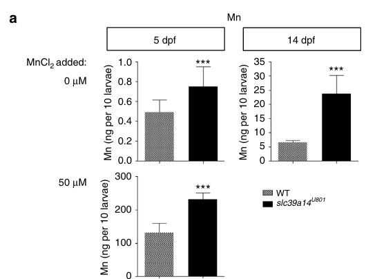

## Question

# Gene Research for Functional Annotation

## ⚠️ CRITICAL: Gene/Protein Identification Context

**BEFORE YOU BEGIN RESEARCH:** You MUST verify you are researching the CORRECT gene/protein. Gene symbols can be ambiguous, especially for less well-characterized genes from non-model organisms.

### Target Gene/Protein Identity (from UniProt):
- **UniProt Accession:** A0A0G2KQY6
- **Protein Description:** RecName: Full=Metal cation symporter ZIP14 {ECO:0000250|UniProtKB:Q15043}; AltName: Full=Solute carrier family 39 member 14 {ECO:0000250|UniProtKB:Q15043}; AltName: Full=Zrt- and Irt-like protein 14 {ECO:0000303|PubMed:27231142}; Short=ZIP-14 {ECO:0000303|PubMed:27231142}; Flags: Precursor;
- **Gene Information:** Name=slc39a14 {ECO:0000303|PubMed:27231142}; Synonyms=zip14 {ECO:0000303|PubMed:27231142};
- **Organism (full):** Danio rerio (Zebrafish) (Brachydanio rerio).
- **Protein Family:** Belongs to the ZIP transporter (TC 2.A.5) family.
- **Key Domains:** ZIP. (IPR003689); ZIP_Transporter. (IPR050799); Zip (PF02535)

### MANDATORY VERIFICATION STEPS:

1. **Check if the gene symbol "slc39a14" matches the protein description above**
2. **Verify the organism is correct:** Danio rerio (Zebrafish) (Brachydanio rerio).
3. **Check if protein family/domains align with what you find in literature**
4. **If you find literature for a DIFFERENT gene with the same or similar symbol, STOP**

### If Gene Symbol is Ambiguous or You Cannot Find Relevant Literature:

**DO NOT PROCEED WITH RESEARCH ON A DIFFERENT GENE.** Instead:
- State clearly: "The gene symbol 'slc39a14' is ambiguous or literature is limited for this specific protein"
- Explain what you found (e.g., "Found extensive literature on a different gene with the same symbol in a different organism")
- Describe the protein based ONLY on the UniProt information provided above
- Suggest that the protein function can be inferred from domain/family information

### Research Target:

Please provide a comprehensive research report on the gene **slc39a14** (gene ID: slc39a14, UniProt: A0A0G2KQY6) in DANRE.

The research report should be a detailed narrative explaining the function, biological processes, and localization of the gene product. Citations should be given for all claims.

You should prioritize authoritative reviews and primary scientific literature when conducting research. You can supplement
this with annotations you find in gene/protein databases, but these can be outdated or inaccurate.

We are specifically interested in the primary function of the gene - for enzymes, what reaction is catalyzed, and what is the substrate specificity? For transporters, what is the substrate? For structural proteins or adapters, what is the broader structural role? For signaling molecules, what is the role in the pathway.

We are interested in where in or outside the cell the gene product carries out its function.

We are also interested in the signaling or biochemical pathways in which the gene functions. We are less interested in broad pleiotropic effects, except where these elucidate the precise role.

Include evidence where possible. We are interested in both experimental evidence as well as inference from structure, evolution, or bioinformatic analysis. Precise studies should be prioritized over high-throughput, where available.

## Output

Question: You are an expert researcher providing comprehensive, well-cited information.

Provide detailed information focusing on:
1. Key concepts and definitions with current understanding
2. Recent developments and latest research (prioritize 2023-2024 sources)
3. Current applications and real-world implementations
4. Expert opinions and analysis from authoritative sources
5. Relevant statistics and data from recent studies

Format as a comprehensive research report with proper citations. Include URLs and publication dates where available.
Always prioritize recent, authoritative sources and provide specific citations for all major claims.

# Gene Research for Functional Annotation

## ⚠️ CRITICAL: Gene/Protein Identification Context

**BEFORE YOU BEGIN RESEARCH:** You MUST verify you are researching the CORRECT gene/protein. Gene symbols can be ambiguous, especially for less well-characterized genes from non-model organisms.

### Target Gene/Protein Identity (from UniProt):
- **UniProt Accession:** A0A0G2KQY6
- **Protein Description:** RecName: Full=Metal cation symporter ZIP14 {ECO:0000250|UniProtKB:Q15043}; AltName: Full=Solute carrier family 39 member 14 {ECO:0000250|UniProtKB:Q15043}; AltName: Full=Zrt- and Irt-like protein 14 {ECO:0000303|PubMed:27231142}; Short=ZIP-14 {ECO:0000303|PubMed:27231142}; Flags: Precursor;
- **Gene Information:** Name=slc39a14 {ECO:0000303|PubMed:27231142}; Synonyms=zip14 {ECO:0000303|PubMed:27231142};
- **Organism (full):** Danio rerio (Zebrafish) (Brachydanio rerio).
- **Protein Family:** Belongs to the ZIP transporter (TC 2.A.5) family.
- **Key Domains:** ZIP. (IPR003689); ZIP_Transporter. (IPR050799); Zip (PF02535)

### MANDATORY VERIFICATION STEPS:

1. **Check if the gene symbol "slc39a14" matches the protein description above**
2. **Verify the organism is correct:** Danio rerio (Zebrafish) (Brachydanio rerio).
3. **Check if protein family/domains align with what you find in literature**
4. **If you find literature for a DIFFERENT gene with the same or similar symbol, STOP**

### If Gene Symbol is Ambiguous or You Cannot Find Relevant Literature:

**DO NOT PROCEED WITH RESEARCH ON A DIFFERENT GENE.** Instead:
- State clearly: "The gene symbol 'slc39a14' is ambiguous or literature is limited for this specific protein"
- Explain what you found (e.g., "Found extensive literature on a different gene with the same symbol in a different organism")
- Describe the protein based ONLY on the UniProt information provided above
- Suggest that the protein function can be inferred from domain/family information

### Research Target:

Please provide a comprehensive research report on the gene **slc39a14** (gene ID: slc39a14, UniProt: A0A0G2KQY6) in DANRE.

The research report should be a detailed narrative explaining the function, biological processes, and localization of the gene product. Citations should be given for all claims.

You should prioritize authoritative reviews and primary scientific literature when conducting research. You can supplement
this with annotations you find in gene/protein databases, but these can be outdated or inaccurate.

We are specifically interested in the primary function of the gene - for enzymes, what reaction is catalyzed, and what is the substrate specificity? For transporters, what is the substrate? For structural proteins or adapters, what is the broader structural role? For signaling molecules, what is the role in the pathway.

We are interested in where in or outside the cell the gene product carries out its function.

We are also interested in the signaling or biochemical pathways in which the gene functions. We are less interested in broad pleiotropic effects, except where these elucidate the precise role.

Include evidence where possible. We are interested in both experimental evidence as well as inference from structure, evolution, or bioinformatic analysis. Precise studies should be prioritized over high-throughput, where available.

## Comprehensive Research Report: Functional Annotation of **slc39a14 / ZIP14** in *Danio rerio* (UniProt: **A0A0G2KQY6**)

### Executive summary
The zebrafish gene **slc39a14** encodes **ZIP14 (SLC39 family metal cation symporter)**, a multi-pass ZIP-family divalent metal transporter. The strongest in vivo evidence across vertebrates supports **manganese (Mn2+) transport** as a central physiological role, with loss-of-function producing **systemic Mn dysregulation and brain Mn accumulation** associated with neurobehavioral impairment; zebrafish **slc39a14U801** mutants reproduce key manganese-overload phenotypes and provide a translational model for **SLC39A14-deficiency hypermanganesemia (HMNDYT2)** and chelation testing. (tuschl2016mutationsinslc39a14 pages 10-11, tuschl2016mutationsinslc39a14 pages 5-6, tuschl2016mutationsinslc39a14 pages 1-2)

---

## 1) Key concepts and definitions (current understanding)

### 1.1 ZIP transporters and ZIP14
**ZIP transporters (SLC39 family)** are broadly conserved divalent d-block metal transporters that commonly move **Zn2+** and (for multiple members) also transport **Mn2+** and **Fe2+**, contributing to uptake, distribution, and excretion of these metals. Structurally, ZIPs typically have **eight transmembrane helices** and characteristic metal-binding motifs, with substantial sequence divergence across paralogs that underlies distinct substrate preferences and regulation. (hu2024evolutionclassificationand pages 1-3)

Within this family, **ZIP14/SLC39A14** is repeatedly implicated as a **key Mn homeostasis factor** in vertebrates; in humans, biallelic loss-of-function causes a childhood-onset parkinsonism–dystonia syndrome with **hypermanganesemia** and characteristic brain Mn accumulation. (tuschl2016mutationsinslc39a14 pages 1-2)

### 1.2 Substrate, directionality, and coupling
**Substrate(s):** The most consistent evidence identifies **manganese** as the primary substrate relevant to disease and zebrafish phenotypes; zebrafish mutants show strong Mn changes with comparatively little evidence for changes in other metals in the same experimental context. (tuschl2016mutationsinslc39a14 pages 5-6, tuschl2016mutationsinslc39a14 pages 1-2)

**Directionality:** ZIP14 is generally characterized as mediating **cellular import into the cytosol** from extracellular space and/or organellar lumens, consistent with typical ZIP “influx” behavior. (tuschl2016mutationsinslc39a14 pages 1-2, oliveirapaula2024theimpactof pages 9-10)

**Coupling:** Recent expert synthesis describes ZIP14 (and the closely related ZIP8) as consistent with a **metal/bicarbonate symport** paradigm, implying that transport may depend on bicarbonate and related electrochemical conditions rather than being simple diffusion. (hu2024evolutionclassificationand pages 18-19)

---

## 2) Verified gene/protein identity and zebrafish context

### 2.1 Identity check (mandatory verification)
The queried target—**UniProt A0A0G2KQY6** annotated as **Metal cation symporter ZIP14 / SLC39 family member 14** in **zebrafish (*Danio rerio*)**—matches the organism and gene name used in the key zebrafish functional genetics literature, including the CRISPR **slc39a14U801** null model explicitly positioned as orthologous to human SLC39A14. (tuschl2016mutationsinslc39a14 pages 5-6, tuschl2016mutationsinslc39a14 pages 1-2)

### 2.2 Zebrafish expression and anatomical localization
In zebrafish embryos/larvae, **slc39a14** is expressed during early development and localizes by in situ hybridization to the **proximal pronephric ducts at 4 dpf**, implicating epithelial/renal contributions to manganese handling (in addition to systemic roles). (tuschl2016mutationsinslc39a14 pages 5-6)

---

## 3) Core biological function of slc39a14/ZIP14 (what it does)

### 3.1 Primary function: manganese transport supporting systemic Mn homeostasis
The most strongly supported primary function of ZIP14 in vertebrates is **manganese transport** that is required for maintaining appropriate systemic Mn distribution and preventing neurotoxic accumulation. Human genetics, in vitro transport assays, and zebrafish loss-of-function converge on impaired Mn transport as causal. (tuschl2016mutationsinslc39a14 pages 1-2)

### 3.2 Physiological role inferred from disease and model systems
In the foundational vertebrate model framing, SLC39A14/ZIP14 is described as important for **hepatic Mn uptake from blood** that supports downstream excretory handling (and thereby detoxification), while mutant phenotypes show that loss of this pathway paradoxically results in **elevated Mn in blood and brain**. (tuschl2016mutationsinslc39a14 pages 10-11)

Importantly, zebrafish transcriptomic and phenotypic evidence suggests that SLC39A14 loss can produce a mixed state where **systemic Mn overload coexists with tissue/cell-type or subcellular Mn deficiency**, complicating therapeutic approaches (e.g., chelation may worsen deficiency in specific compartments). (tuschl2020lossofslc39a14 pages 1-3)

---

## 4) Cellular and subcellular localization (where it acts)

### 4.1 General localization
ZIP14 is described as localized to the **plasma membrane** and also **intracellular compartments** (including endosome-like pools), supporting a role in metal influx into the cytosol from multiple sources. (tuschl2016mutationsinslc39a14 pages 10-11)

### 4.2 Brain barrier/endothelial context (2024 synthesis)
A 2024 authoritative toxicology review summarizes evidence that **ZIP14 (SLC39A14)** and **ZIP8 (SLC39A8)** contribute to manganese accumulation in **human brain microvascular endothelial cells**, with Mn transport showing dependencies on **pH, lipopolysaccharide, and bicarbonate** and localization across **apical and basolateral endothelial membranes**—a configuration compatible with vectorial Mn movement across the BBB depending on gradients and trafficking state. (oliveirapaula2024theimpactof pages 9-10)

The same review highlights regulation by the Golgi Ca2+ pump **SPCA1 (ATP2C1)**, where SPCA1-dependent cytosolic Ca2+ changes modulate membrane trafficking of ZIP8/ZIP14 and thereby Mn uptake. (oliveirapaula2024theimpactof pages 9-10, oliveirapaula2024theimpactof pages 10-11)

---

## 5) Zebrafish mutant phenotypes and mechanistic interpretation

### 5.1 slc39a14U801 null allele and manganese phenotypes
A CRISPR/Cas9 **slc39a14U801** loss-of-function allele truncates the protein and is consistent with nonsense-mediated decay; homozygous mutants show robust Mn dyshomeostasis. (tuschl2016mutationsinslc39a14 pages 5-6)

**Quantitative Mn accumulation:** mutants show **~35% higher whole-larval Mn at 5 dpf** and **~72% higher at 14 dpf** compared to wild-type, and adult mutants show **~8-fold higher brain Mn** relative to controls. (tuschl2016mutationsinslc39a14 pages 5-6, tuschl2016mutationsinslc39a14 media 19e42c38)

### 5.2 Behavioral and sensory phenotypes
Zebrafish slc39a14 loss-of-function is associated with **abnormal locomotor behavior** and **visual dysfunction** (e.g., impaired visual background adaptation and reduced optokinetic reflex), consistent with manganese neurotoxicity affecting CNS and sensory circuits. (tuschl2016mutationsinslc39a14 pages 1-2, tuschl2020lossofslc39a14 pages 1-3)

### 5.3 Systems-level pathways downstream of Mn dysregulation
Transcriptomic analysis in slc39a14 mutant larvae supports downstream processes characteristic of Mn neurotoxicity, including **calcium dyshomeostasis**, **unfolded protein response**, **oxidative stress**, **mitochondrial dysfunction**, **lysosomal disruption**, and **apoptosis/autophagy**, with enrichment for CNS and eye gene sets. (tuschl2020lossofslc39a14 pages 1-3)

---

## 6) Recent developments and latest research (emphasis 2023–2024)

### 6.1 2023 structural mechanism: elevator-type transport in ZIP family
A 2023 *Nature Communications* primary study of a bacterial ZIP homolog provides high-confidence mechanistic insight applicable to the ZIP family: ZIP transport can occur via an **elevator-type mechanism** in which a transport-domain bundle undergoes a **~8 Å rigid-body slide** relative to a scaffold domain to achieve alternating access. The study also identifies interface residues critical for function (mutations in conserved small residues markedly reduce transport). While not ZIP14-specific, this work is widely used to support a shared mechanistic framework for ZIP transporters. (zhang2023structuralinsightsinto pages 5-6)

### 6.2 2024 critical review: evolving views on ZIP mechanism and ZIP14 coupling
A 2024 critical review emphasizes that ZIP transport properties (substrate specificity and regulation) are **subfamily-dependent** due to low sequence conservation, and highlights regulatory features (e.g., metal sites and variable intracellular loops) and the need for better functional assays to enable ZIP-targeted drug discovery. Importantly for ZIP14, the review frames ZIP14/ZIP8 as consistent with **metal/bicarbonate symport**. (hu2024evolutionclassificationand pages 18-19, hu2024evolutionclassificationand pages 14-15)

### 6.3 2024 zebrafish Mn neurotoxicity endpoints relevant to ZIP14 biology
A 2024 zebrafish Mn exposure study provides quantitative phenotypes and molecular readouts relevant to manganese neurotoxicity that complement slc39a14 genetic models. In embryos exposed from **2.5 hpf**, survival decreases with increasing MnCl2: **94% at 200 µM**, **80% at 300 µM**, and **64% at 500 µM** by 5 dpf; Mn exposure reduces synaptic marker **neurogranin** at protein and transcript levels (nrgna p=0.026; nrgnb p=5.51×10−5) and causes locomotor and light-preference behavioral deficits, with partial reversibility after Mn removal. The paper explicitly notes that inherited transporter defects including **SLC39A14** can produce Mn overload phenotypes. (albagonzalez2024manganeseoverexposurealters pages 2-5, albagonzalez2024manganeseoverexposurealters pages 1-2)

A translational modeling review further provides zebrafish tissue Mn burdens and genotype-specific susceptibility: exposures of **50–100 µM MnCl2 during 0–5 dpf** yield tissue Mn of ~**49 µg/g** (50 µM) and ~**82 µg/g** (100 µM), and slc39a14 mutants show a much lower median lethal dose (**376 µM**) compared with wild-type (**680 µM**), consistent with heightened vulnerability to Mn. (taylor2020maintainingtranslationalrelevance pages 7-7)

---

## 7) Current applications and real-world implementations

### 7.1 Disease modeling and therapeutic testing
**Zebrafish slc39a14 loss-of-function** is an established vertebrate model for **SLC39A14-deficiency hypermanganesemia** (HMNDYT2-like phenotypes), enabling mechanistic dissection of Mn neurotoxicity and rapid testing of interventions. (tuschl2016mutationsinslc39a14 pages 1-2, tuschl2020lossofslc39a14 pages 1-3)

### 7.2 Chelation as a real-world implementation (with zebrafish evidence)
In affected patients, chelation with **disodium calcium edetate (Na2CaEDTA)** is reported to **lower blood Mn** and can yield clinical improvement. (tuschl2016mutationsinslc39a14 pages 1-2)

In zebrafish, Na2CaEDTA provides direct experimental support for Mn as the relevant toxic species: **intracardiac Na2CaEDTA injections (5 ng or 50 ng)** significantly **reduced elevated Mn levels in slc39a14U801 mutant larvae**, consistent with a translationally relevant biomarker endpoint for therapy testing. (tuschl2016mutationsinslc39a14 media 19e42c38, tuschl2016mutationsinslc39a14 media 1e24d2d3)

A key expert-level caveat emerging from zebrafish transcriptomic analyses is that chelation strategies may risk exacerbating **cell-type/subcellular Mn deficiency** that can co-occur with systemic overload in ZIP14 deficiency, motivating careful biomarker design and stratified dosing strategies. (tuschl2020lossofslc39a14 pages 1-3)

---

## 8) Expert opinions and authoritative synthesis

### 8.1 Endothelial/BBB transport consensus (2024)
An authoritative 2024 review positions ZIP14 among transport mechanisms supporting Mn movement into BBB endothelial cells, but also emphasizes that **in vivo transporter-specific evidence is still relatively scarce** and that Mn accumulation at the BBB is shaped by transporter trafficking/regulation (not just expression). (oliveirapaula2024theimpactof pages 10-11)

### 8.2 Systems toxicology view of Mn injury mechanisms
The 2024 endothelial review synthesizes mechanistic pathways by which Mn impairs barrier function—**oxidative stress, mitochondrial dysfunction, apoptosis, and junctional protein disruption**—and notes signaling pathways (e.g., **Smad2/3–Snail**) implicated in barrier compromise. These processes align with CNS-enriched stress signatures seen in zebrafish slc39a14 mutant transcriptomes. (oliveirapaula2024theimpactof pages 1-3, tuschl2020lossofslc39a14 pages 1-3)

---

## 9) Key statistics and data points (compiled)

- **slc39a14U801 mutants:** ~**+35%** whole-larval Mn (5 dpf), ~**+72%** (14 dpf), and **~8×** adult brain Mn vs WT. (tuschl2016mutationsinslc39a14 pages 5-6, tuschl2016mutationsinslc39a14 media 19e42c38)
- **Chelation response:** Na2CaEDTA **5 ng or 50 ng** injections reduce mutant larval Mn burden (visualized in figure panels). (tuschl2016mutationsinslc39a14 media 19e42c38, tuschl2016mutationsinslc39a14 media 1e24d2d3)
- **Mn exposure survival (wild-type):** **94% (200 µM)**, **80% (300 µM)**, **64% (500 µM)** survival to 5 dpf under 2.5 hpf–5 dpf exposure. (albagonzalez2024manganeseoverexposurealters pages 2-5)
- **Mn tissue burden benchmarks:** ~**49 µg/g** at **50 µM** exposure and ~**82 µg/g** at **100 µM** exposure (0–5 dpf). (taylor2020maintainingtranslationalrelevance pages 7-7)
- **Genotype-dependent susceptibility:** median lethal dose **376 µM** (slc39a14 mutant) vs **680 µM** (WT). (taylor2020maintainingtranslationalrelevance pages 7-7)

---

## Summary evidence table
The following evidence-map table consolidates functional annotation elements for **slc39a14/ZIP14**.

| Aspect | Key findings |
|---|---|
| identity/orthology | Zebrafish **slc39a14** is the ortholog of human **SLC39A14/ZIP14**, a ZIP-family multi-pass metal transporter; the retrieved zebrafish literature explicitly studies **slc39a14U801** mutants and identifies the gene as a pivotal Mn transporter relevant to HMNDYT2-like disease biology (tuschl2016mutationsinslc39a14 pages 10-11, tuschl2016mutationsinslc39a14 pages 1-2). |
| substrates | The strongest direct evidence supports **manganese (Mn)** as the primary physiological substrate; ZIP14 is also discussed as a broader divalent metal transporter capable of handling **Zn** and **non-transferrin-bound Fe**, but zebrafish mutant studies found Mn changes most prominently while Fe/Zn/Cd were not significantly altered in the key mutant analysis (tuschl2016mutationsinslc39a14 pages 5-6, tuschl2016mutationsinslc39a14 pages 1-2, hu2024evolutionclassificationand pages 22-23). |
| transport direction & coupling | ZIP14 is generally interpreted as an **uptake transporter into the cytosol** from extracellular or organellar spaces; family-level reviews further describe ZIP14/ZIP8 as likely **metal/bicarbonate symporters**, although direct coupling stoichiometry for zebrafish slc39a14 is not established. Newer barrier studies suggest directional roles can generate net **brain-to-blood Mn clearance** at endothelial interfaces while still relying on cellular import into endothelial cells (tuschl2020lossofslc39a14 pages 1-3, hu2024evolutionclassificationand pages 18-19, oliveirapaula2024theimpactof pages 9-10, zou2025theinsand pages 1-5). |
| localization | ZIP14 localizes to the **plasma membrane** and also intracellular compartments/endosome-like structures in vertebrate studies; at the BBB, ZIP14 has been reported on **apical and basolateral endothelial membranes** with Mn-responsive redistribution. For LIV-1 subfamily ZIPs including ZIP14, an N-terminal extracellular domain and conserved disulfide-linked architecture are noted (tuschl2016mutationsinslc39a14 pages 10-11, hu2024evolutionclassificationand pages 9-11, oliveirapaula2024theimpactof pages 9-10, zou2025theinsand pages 1-5). |
| zebrafish expression | In zebrafish, **slc39a14** is expressed during embryonic/early larval stages and was localized by in situ hybridization to the **proximal pronephric ducts** at 4 dpf, suggesting a role in renal/epithelial Mn handling in addition to systemic homeostasis (tuschl2016mutationsinslc39a14 pages 5-6). |
| zebrafish phenotypes | **slc39a14U801/U801** null zebrafish show elevated whole-larval Mn, marked **brain Mn accumulation**, abnormal locomotor behavior, and visual system defects including impaired visual background adaptation and reduced optokinetic reflex; mutants are also **hypersensitive to Mn exposure** (tuschl2016mutationsinslc39a14 pages 5-6, tuschl2020lossofslc39a14 pages 8-9, tuschl2020lossofslc39a14 pages 1-3, tuschl2016mutationsinslc39a14 media 19e42c38). |
| mechanistic pathways downstream of Mn dysregulation | Transcriptomic analysis in mutant larvae links Mn dyshomeostasis to **calcium dyshomeostasis**, **unfolded protein response**, **oxidative stress**, **mitochondrial dysfunction**, **lysosomal disruption**, **apoptosis/autophagy**, and disturbed proteostasis; CNS and eye tissues are enriched among affected gene sets. A notable nuance is evidence for simultaneous **Mn hypersensitivity and localized/subcellular Mn deficiency** in the mutant (tuschl2020lossofslc39a14 pages 8-9, tuschl2020lossofslc39a14 pages 1-3, oliveirapaula2024theimpactof pages 1-3). |
| therapeutic/application notes | The zebrafish mutant is a useful **disease model** for SLC39A14-related hypermanganesemia and for testing chelation. **Na2CaEDTA** lowered Mn in mutant larvae toward wild-type levels, paralleling human reports that disodium calcium edetate can reduce blood Mn and improve symptoms, though later work warns chelation may worsen deficits if localized Mn deficiency is also present (tuschl2016mutationsinslc39a14 pages 10-11, tuschl2016mutationsinslc39a14 pages 1-2, tuschl2020lossofslc39a14 pages 1-3, tuschl2016mutationsinslc39a14 media 19e42c38). |
| key quantitative data | Reported zebrafish metrics include **~35% higher whole-larval Mn at 5 dpf**, **~72% higher Mn at 14 dpf**, and **~8-fold higher brain Mn in 1-year-old adults**; image evidence also shows significant reduction of mutant Mn burden after **5 ng or 50 ng Na2CaEDTA** injections. Structural ZIP-family work further supports an elevator-like mechanism with an ~**8 Å** transport-domain slide in the bacterial model used to infer ZIP transport principles (tuschl2016mutationsinslc39a14 pages 5-6, zhang2023structuralinsightsinto pages 5-6, tuschl2016mutationsinslc39a14 media 19e42c38). |

*Table: This table summarizes the functional annotation of zebrafish slc39a14/ZIP14, emphasizing manganese transport, localization, mutant phenotypes, and mechanistic pathways. It is useful as a compact evidence map linking zebrafish findings to broader ZIP14 biology and recent mechanistic literature.*

---

## References (URLs and publication dates)

- Tuschl K. et al. **“Mutations in SLC39A14 disrupt manganese homeostasis and cause childhood-onset parkinsonism–dystonia.”** *Nature Communications* (Publication date: **May 2016**). https://doi.org/10.1038/ncomms11601 (tuschl2016mutationsinslc39a14 pages 1-2)
- Tuschl K. et al. **“Loss of slc39a14 causes simultaneous manganese deficiency and hypersensitivity in zebrafish.”** *bioRxiv* (Posted: **Jan 2020**). https://doi.org/10.1101/2020.01.31.921130 (tuschl2020lossofslc39a14 pages 1-3)
- Zhang Y. et al. **“Structural insights into the elevator-type transport mechanism of a bacterial ZIP metal transporter.”** *Nature Communications* (Publication date: **Sep 2023**). https://doi.org/10.1038/s41467-023-36048-4 (zhang2023structuralinsightsinto pages 5-6)
- Hu J., Jiang Y. **“Evolution, classification, and mechanisms of transport, activity regulation, and substrate specificity of ZIP metal transporters.”** *Critical Reviews in Biochemistry and Molecular Biology* (Publication date: **Sep 2024**). https://doi.org/10.1080/10409238.2024.2405476 (hu2024evolutionclassificationand pages 18-19)
- Oliveira-Paula G.H. et al. **“The impact of manganese on vascular endothelium.”** *Toxicological Research* (Publication date: **Aug 2024**). https://doi.org/10.1007/s43188-024-00260-1 (oliveirapaula2024theimpactof pages 1-3)
- Alba-González A. et al. **“Manganese Overexposure Alters Neurogranin Expression and Causes Behavioral Deficits in Larval Zebrafish.”** *International Journal of Molecular Sciences* (Publication date: **Apr 2024**). https://doi.org/10.3390/ijms25094933 (albagonzalez2024manganeseoverexposurealters pages 2-5)
- Taylor C.A. et al. **“Maintaining Translational Relevance in Animal Models of Manganese Neurotoxicity.”** *The Journal of Nutrition* (Publication date: **Jun 2020**). https://doi.org/10.1093/jn/nxaa066 (taylor2020maintainingtranslationalrelevance pages 7-7)

References

1. (tuschl2016mutationsinslc39a14 pages 10-11): Karin Tuschl, Esther Meyer, Leonardo E. Valdivia, Ningning Zhao, Chris Dadswell, Alaa Abdul-Sada, Christina Y. Hung, Michael A. Simpson, W. K. Chong, Thomas S. Jacques, Randy L. Woltjer, Simon Eaton, Allison Gregory, Lynn Sanford, Eleanna Kara, Henry Houlden, Stephan M. Cuno, Holger Prokisch, Lorella Valletta, Valeria Tiranti, Rasha Younis, Eamonn R. Maher, John Spencer, Ania Straatman-Iwanowska, Paul Gissen, Laila A. M. Selim, Guillem Pintos-Morell, Wifredo Coroleu-Lletget, Shekeeb S. Mohammad, Sangeetha Yoganathan, Russell C. Dale, Maya Thomas, Jason Rihel, Olaf A. Bodamer, Caroline A. Enns, Susan J. Hayflick, Peter T. Clayton, Philippa B. Mills, Manju A. Kurian, and Stephen W. Wilson. Mutations in slc39a14 disrupt manganese homeostasis and cause childhood-onset parkinsonism–dystonia. Nature Communications, May 2016. URL: https://doi.org/10.1038/ncomms11601, doi:10.1038/ncomms11601. This article has 356 citations and is from a highest quality peer-reviewed journal.

2. (tuschl2016mutationsinslc39a14 pages 5-6): Karin Tuschl, Esther Meyer, Leonardo E. Valdivia, Ningning Zhao, Chris Dadswell, Alaa Abdul-Sada, Christina Y. Hung, Michael A. Simpson, W. K. Chong, Thomas S. Jacques, Randy L. Woltjer, Simon Eaton, Allison Gregory, Lynn Sanford, Eleanna Kara, Henry Houlden, Stephan M. Cuno, Holger Prokisch, Lorella Valletta, Valeria Tiranti, Rasha Younis, Eamonn R. Maher, John Spencer, Ania Straatman-Iwanowska, Paul Gissen, Laila A. M. Selim, Guillem Pintos-Morell, Wifredo Coroleu-Lletget, Shekeeb S. Mohammad, Sangeetha Yoganathan, Russell C. Dale, Maya Thomas, Jason Rihel, Olaf A. Bodamer, Caroline A. Enns, Susan J. Hayflick, Peter T. Clayton, Philippa B. Mills, Manju A. Kurian, and Stephen W. Wilson. Mutations in slc39a14 disrupt manganese homeostasis and cause childhood-onset parkinsonism–dystonia. Nature Communications, May 2016. URL: https://doi.org/10.1038/ncomms11601, doi:10.1038/ncomms11601. This article has 356 citations and is from a highest quality peer-reviewed journal.

3. (tuschl2016mutationsinslc39a14 pages 1-2): Karin Tuschl, Esther Meyer, Leonardo E. Valdivia, Ningning Zhao, Chris Dadswell, Alaa Abdul-Sada, Christina Y. Hung, Michael A. Simpson, W. K. Chong, Thomas S. Jacques, Randy L. Woltjer, Simon Eaton, Allison Gregory, Lynn Sanford, Eleanna Kara, Henry Houlden, Stephan M. Cuno, Holger Prokisch, Lorella Valletta, Valeria Tiranti, Rasha Younis, Eamonn R. Maher, John Spencer, Ania Straatman-Iwanowska, Paul Gissen, Laila A. M. Selim, Guillem Pintos-Morell, Wifredo Coroleu-Lletget, Shekeeb S. Mohammad, Sangeetha Yoganathan, Russell C. Dale, Maya Thomas, Jason Rihel, Olaf A. Bodamer, Caroline A. Enns, Susan J. Hayflick, Peter T. Clayton, Philippa B. Mills, Manju A. Kurian, and Stephen W. Wilson. Mutations in slc39a14 disrupt manganese homeostasis and cause childhood-onset parkinsonism–dystonia. Nature Communications, May 2016. URL: https://doi.org/10.1038/ncomms11601, doi:10.1038/ncomms11601. This article has 356 citations and is from a highest quality peer-reviewed journal.

4. (hu2024evolutionclassificationand pages 1-3): Jian Hu and Yuhan Jiang. Evolution, classification, and mechanisms of transport, activity regulation, and substrate specificity of zip metal transporters. Critical Reviews in Biochemistry and Molecular Biology, 59:245-266, Sep 2024. URL: https://doi.org/10.1080/10409238.2024.2405476, doi:10.1080/10409238.2024.2405476. This article has 13 citations and is from a peer-reviewed journal.

5. (oliveirapaula2024theimpactof pages 9-10): Gustavo H. Oliveira-Paula, Airton C. Martins, Beatriz Ferrer, Alexey A. Tinkov, Anatoly V. Skalny, and Michael Aschner. The impact of manganese on vascular endothelium. Toxicological Research, 40:501-517, Aug 2024. URL: https://doi.org/10.1007/s43188-024-00260-1, doi:10.1007/s43188-024-00260-1. This article has 21 citations.

6. (hu2024evolutionclassificationand pages 18-19): Jian Hu and Yuhan Jiang. Evolution, classification, and mechanisms of transport, activity regulation, and substrate specificity of zip metal transporters. Critical Reviews in Biochemistry and Molecular Biology, 59:245-266, Sep 2024. URL: https://doi.org/10.1080/10409238.2024.2405476, doi:10.1080/10409238.2024.2405476. This article has 13 citations and is from a peer-reviewed journal.

7. (tuschl2020lossofslc39a14 pages 1-3): Karin Tuschl, Richard J White, Leonardo E Valdivia, Stephanie Niklaus, Isaac H Bianco, Ian M Sealy, Stephan CF Neuhauss, Corinne Houart, Stephen W Wilson, and Elisabeth M Busch-Nentwich. Loss of slc39a14 causes simultaneous manganese deficiency and hypersensitivity in zebrafish. bioRxiv, Jan 2020. URL: https://doi.org/10.1101/2020.01.31.921130, doi:10.1101/2020.01.31.921130. This article has 2 citations.

8. (oliveirapaula2024theimpactof pages 10-11): Gustavo H. Oliveira-Paula, Airton C. Martins, Beatriz Ferrer, Alexey A. Tinkov, Anatoly V. Skalny, and Michael Aschner. The impact of manganese on vascular endothelium. Toxicological Research, 40:501-517, Aug 2024. URL: https://doi.org/10.1007/s43188-024-00260-1, doi:10.1007/s43188-024-00260-1. This article has 21 citations.

9. (tuschl2016mutationsinslc39a14 media 19e42c38): Karin Tuschl, Esther Meyer, Leonardo E. Valdivia, Ningning Zhao, Chris Dadswell, Alaa Abdul-Sada, Christina Y. Hung, Michael A. Simpson, W. K. Chong, Thomas S. Jacques, Randy L. Woltjer, Simon Eaton, Allison Gregory, Lynn Sanford, Eleanna Kara, Henry Houlden, Stephan M. Cuno, Holger Prokisch, Lorella Valletta, Valeria Tiranti, Rasha Younis, Eamonn R. Maher, John Spencer, Ania Straatman-Iwanowska, Paul Gissen, Laila A. M. Selim, Guillem Pintos-Morell, Wifredo Coroleu-Lletget, Shekeeb S. Mohammad, Sangeetha Yoganathan, Russell C. Dale, Maya Thomas, Jason Rihel, Olaf A. Bodamer, Caroline A. Enns, Susan J. Hayflick, Peter T. Clayton, Philippa B. Mills, Manju A. Kurian, and Stephen W. Wilson. Mutations in slc39a14 disrupt manganese homeostasis and cause childhood-onset parkinsonism–dystonia. Nature Communications, May 2016. URL: https://doi.org/10.1038/ncomms11601, doi:10.1038/ncomms11601. This article has 356 citations and is from a highest quality peer-reviewed journal.

10. (zhang2023structuralinsightsinto pages 5-6): Yao Zhang, Yuhan Jiang, Kaifu Gao, Dexin Sui, Peixuan Yu, Min Su, Guowei Wei, and Jian Hu. Structural insights into the elevator-type transport mechanism of a bacterial zip metal transporter. Nature Communications, Sep 2023. URL: https://doi.org/10.1038/s41467-023-36048-4, doi:10.1038/s41467-023-36048-4. This article has 42 citations and is from a highest quality peer-reviewed journal.

11. (hu2024evolutionclassificationand pages 14-15): Jian Hu and Yuhan Jiang. Evolution, classification, and mechanisms of transport, activity regulation, and substrate specificity of zip metal transporters. Critical Reviews in Biochemistry and Molecular Biology, 59:245-266, Sep 2024. URL: https://doi.org/10.1080/10409238.2024.2405476, doi:10.1080/10409238.2024.2405476. This article has 13 citations and is from a peer-reviewed journal.

12. (albagonzalez2024manganeseoverexposurealters pages 2-5): Anabel Alba-González, Elena I. Dragomir, Golsana Haghdousti, Julián Yáñez, Chris Dadswell, Ramón González-Méndez, Stephen W. Wilson, Karin Tuschl, and Mónica Folgueira. Manganese overexposure alters neurogranin expression and causes behavioral deficits in larval zebrafish. International Journal of Molecular Sciences, 25:4933, Apr 2024. URL: https://doi.org/10.3390/ijms25094933, doi:10.3390/ijms25094933. This article has 15 citations.

13. (albagonzalez2024manganeseoverexposurealters pages 1-2): Anabel Alba-González, Elena I. Dragomir, Golsana Haghdousti, Julián Yáñez, Chris Dadswell, Ramón González-Méndez, Stephen W. Wilson, Karin Tuschl, and Mónica Folgueira. Manganese overexposure alters neurogranin expression and causes behavioral deficits in larval zebrafish. International Journal of Molecular Sciences, 25:4933, Apr 2024. URL: https://doi.org/10.3390/ijms25094933, doi:10.3390/ijms25094933. This article has 15 citations.

14. (taylor2020maintainingtranslationalrelevance pages 7-7): Cherish A Taylor, Karin Tuschl, Merle M Nicolai, Julia Bornhorst, Priscila Gubert, Alexandre M Varão, Michael Aschner, Donald R Smith, and Somshuvra Mukhopadhyay. Maintaining translational relevance in animal models of manganese neurotoxicity. The Journal of Nutrition, 150:1360-1369, Jun 2020. URL: https://doi.org/10.1093/jn/nxaa066, doi:10.1093/jn/nxaa066. This article has 48 citations.

15. (tuschl2016mutationsinslc39a14 media 1e24d2d3): Karin Tuschl, Esther Meyer, Leonardo E. Valdivia, Ningning Zhao, Chris Dadswell, Alaa Abdul-Sada, Christina Y. Hung, Michael A. Simpson, W. K. Chong, Thomas S. Jacques, Randy L. Woltjer, Simon Eaton, Allison Gregory, Lynn Sanford, Eleanna Kara, Henry Houlden, Stephan M. Cuno, Holger Prokisch, Lorella Valletta, Valeria Tiranti, Rasha Younis, Eamonn R. Maher, John Spencer, Ania Straatman-Iwanowska, Paul Gissen, Laila A. M. Selim, Guillem Pintos-Morell, Wifredo Coroleu-Lletget, Shekeeb S. Mohammad, Sangeetha Yoganathan, Russell C. Dale, Maya Thomas, Jason Rihel, Olaf A. Bodamer, Caroline A. Enns, Susan J. Hayflick, Peter T. Clayton, Philippa B. Mills, Manju A. Kurian, and Stephen W. Wilson. Mutations in slc39a14 disrupt manganese homeostasis and cause childhood-onset parkinsonism–dystonia. Nature Communications, May 2016. URL: https://doi.org/10.1038/ncomms11601, doi:10.1038/ncomms11601. This article has 356 citations and is from a highest quality peer-reviewed journal.

16. (oliveirapaula2024theimpactof pages 1-3): Gustavo H. Oliveira-Paula, Airton C. Martins, Beatriz Ferrer, Alexey A. Tinkov, Anatoly V. Skalny, and Michael Aschner. The impact of manganese on vascular endothelium. Toxicological Research, 40:501-517, Aug 2024. URL: https://doi.org/10.1007/s43188-024-00260-1, doi:10.1007/s43188-024-00260-1. This article has 21 citations.

17. (hu2024evolutionclassificationand pages 22-23): Jian Hu and Yuhan Jiang. Evolution, classification, and mechanisms of transport, activity regulation, and substrate specificity of zip metal transporters. Critical Reviews in Biochemistry and Molecular Biology, 59:245-266, Sep 2024. URL: https://doi.org/10.1080/10409238.2024.2405476, doi:10.1080/10409238.2024.2405476. This article has 13 citations and is from a peer-reviewed journal.

18. (zou2025theinsand pages 1-5): J. Zou, TL Thorn, Z. Wang, Y. Wang, and TB Aydemir. The ins and outs of manganese: zip14 facilitates the efflux of excess manganese from the brain. bioRxiv, Jul 2025. URL: https://doi.org/10.1101/2025.07.02.662898, doi:10.1101/2025.07.02.662898. This article has 1 citations.

19. (hu2024evolutionclassificationand pages 9-11): Jian Hu and Yuhan Jiang. Evolution, classification, and mechanisms of transport, activity regulation, and substrate specificity of zip metal transporters. Critical Reviews in Biochemistry and Molecular Biology, 59:245-266, Sep 2024. URL: https://doi.org/10.1080/10409238.2024.2405476, doi:10.1080/10409238.2024.2405476. This article has 13 citations and is from a peer-reviewed journal.

20. (tuschl2020lossofslc39a14 pages 8-9): Karin Tuschl, Richard J White, Leonardo E Valdivia, Stephanie Niklaus, Isaac H Bianco, Ian M Sealy, Stephan CF Neuhauss, Corinne Houart, Stephen W Wilson, and Elisabeth M Busch-Nentwich. Loss of slc39a14 causes simultaneous manganese deficiency and hypersensitivity in zebrafish. bioRxiv, Jan 2020. URL: https://doi.org/10.1101/2020.01.31.921130, doi:10.1101/2020.01.31.921130. This article has 2 citations.

## Artifacts

- [Edison artifact artifact-00](slc39a14-deep-research-falcon_artifacts/artifact-00.md)

## Citations

1. hu2024evolutionclassificationand pages 1-3
2. hu2024evolutionclassificationand pages 18-19
3. oliveirapaula2024theimpactof pages 9-10
4. zhang2023structuralinsightsinto pages 5-6
5. taylor2020maintainingtranslationalrelevance pages 7-7
6. oliveirapaula2024theimpactof pages 10-11
7. albagonzalez2024manganeseoverexposurealters pages 2-5
8. oliveirapaula2024theimpactof pages 1-3
9. hu2024evolutionclassificationand pages 14-15
10. albagonzalez2024manganeseoverexposurealters pages 1-2
11. hu2024evolutionclassificationand pages 22-23
12. zou2025theinsand pages 1-5
13. hu2024evolutionclassificationand pages 9-11
14. https://doi.org/10.1038/ncomms11601
15. https://doi.org/10.1101/2020.01.31.921130
16. https://doi.org/10.1038/s41467-023-36048-4
17. https://doi.org/10.1080/10409238.2024.2405476
18. https://doi.org/10.1007/s43188-024-00260-1
19. https://doi.org/10.3390/ijms25094933
20. https://doi.org/10.1093/jn/nxaa066
21. https://doi.org/10.1038/ncomms11601,
22. https://doi.org/10.1080/10409238.2024.2405476,
23. https://doi.org/10.1007/s43188-024-00260-1,
24. https://doi.org/10.1101/2020.01.31.921130,
25. https://doi.org/10.1038/s41467-023-36048-4,
26. https://doi.org/10.3390/ijms25094933,
27. https://doi.org/10.1093/jn/nxaa066,
28. https://doi.org/10.1101/2025.07.02.662898,