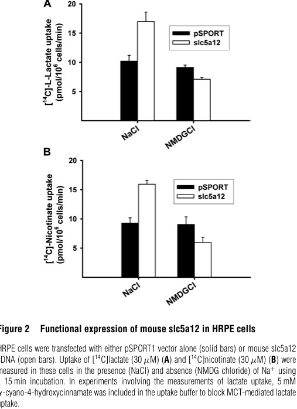

## Question

# Gene Research for Functional Annotation

## ⚠️ CRITICAL: Gene/Protein Identification Context

**BEFORE YOU BEGIN RESEARCH:** You MUST verify you are researching the CORRECT gene/protein. Gene symbols can be ambiguous, especially for less well-characterized genes from non-model organisms.

### Target Gene/Protein Identity (from UniProt):
- **UniProt Accession:** Q7T384
- **Protein Description:** RecName: Full=Sodium-coupled monocarboxylate transporter 2; AltName: Full=Electroneutral sodium monocarboxylate cotransporter {ECO:0000303|PubMed:17255103}; Short=zSMCTn {ECO:0000303|PubMed:17255103}; AltName: Full=Low-affinity sodium-lactate cotransporter; AltName: Full=Solute carrier family 5 member 12; Short=zSLC5A12;
- **Gene Information:** Name=slc5a12; Synonyms=smctn;
- **Organism (full):** Danio rerio (Zebrafish) (Brachydanio rerio).
- **Protein Family:** Belongs to the sodium:solute symporter (SSF) (TC 2.A.21)
- **Key Domains:** Na/Glc_symporter_sf. (IPR038377); Na/solute_symporter. (IPR001734); SMCT2_SLC5sbd. (IPR042700); Sodium:Solute_Symporter_SSF. (IPR051163); SSF (PF00474)

### MANDATORY VERIFICATION STEPS:

1. **Check if the gene symbol "slc5a12" matches the protein description above**
2. **Verify the organism is correct:** Danio rerio (Zebrafish) (Brachydanio rerio).
3. **Check if protein family/domains align with what you find in literature**
4. **If you find literature for a DIFFERENT gene with the same or similar symbol, STOP**

### If Gene Symbol is Ambiguous or You Cannot Find Relevant Literature:

**DO NOT PROCEED WITH RESEARCH ON A DIFFERENT GENE.** Instead:
- State clearly: "The gene symbol 'slc5a12' is ambiguous or literature is limited for this specific protein"
- Explain what you found (e.g., "Found extensive literature on a different gene with the same symbol in a different organism")
- Describe the protein based ONLY on the UniProt information provided above
- Suggest that the protein function can be inferred from domain/family information

### Research Target:

Please provide a comprehensive research report on the gene **slc5a12** (gene ID: slc5a12, UniProt: Q7T384) in DANRE.

The research report should be a detailed narrative explaining the function, biological processes, and localization of the gene product. Citations should be given for all claims.

You should prioritize authoritative reviews and primary scientific literature when conducting research. You can supplement
this with annotations you find in gene/protein databases, but these can be outdated or inaccurate.

We are specifically interested in the primary function of the gene - for enzymes, what reaction is catalyzed, and what is the substrate specificity? For transporters, what is the substrate? For structural proteins or adapters, what is the broader structural role? For signaling molecules, what is the role in the pathway.

We are interested in where in or outside the cell the gene product carries out its function.

We are also interested in the signaling or biochemical pathways in which the gene functions. We are less interested in broad pleiotropic effects, except where these elucidate the precise role.

Include evidence where possible. We are interested in both experimental evidence as well as inference from structure, evolution, or bioinformatic analysis. Precise studies should be prioritized over high-throughput, where available.

## Output

Question: You are an expert researcher providing comprehensive, well-cited information.

Provide detailed information focusing on:
1. Key concepts and definitions with current understanding
2. Recent developments and latest research (prioritize 2023-2024 sources)
3. Current applications and real-world implementations
4. Expert opinions and analysis from authoritative sources
5. Relevant statistics and data from recent studies

Format as a comprehensive research report with proper citations. Include URLs and publication dates where available.
Always prioritize recent, authoritative sources and provide specific citations for all major claims.

# Gene Research for Functional Annotation

## ⚠️ CRITICAL: Gene/Protein Identification Context

**BEFORE YOU BEGIN RESEARCH:** You MUST verify you are researching the CORRECT gene/protein. Gene symbols can be ambiguous, especially for less well-characterized genes from non-model organisms.

### Target Gene/Protein Identity (from UniProt):
- **UniProt Accession:** Q7T384
- **Protein Description:** RecName: Full=Sodium-coupled monocarboxylate transporter 2; AltName: Full=Electroneutral sodium monocarboxylate cotransporter {ECO:0000303|PubMed:17255103}; Short=zSMCTn {ECO:0000303|PubMed:17255103}; AltName: Full=Low-affinity sodium-lactate cotransporter; AltName: Full=Solute carrier family 5 member 12; Short=zSLC5A12;
- **Gene Information:** Name=slc5a12; Synonyms=smctn;
- **Organism (full):** Danio rerio (Zebrafish) (Brachydanio rerio).
- **Protein Family:** Belongs to the sodium:solute symporter (SSF) (TC 2.A.21)
- **Key Domains:** Na/Glc_symporter_sf. (IPR038377); Na/solute_symporter. (IPR001734); SMCT2_SLC5sbd. (IPR042700); Sodium:Solute_Symporter_SSF. (IPR051163); SSF (PF00474)

### MANDATORY VERIFICATION STEPS:

1. **Check if the gene symbol "slc5a12" matches the protein description above**
2. **Verify the organism is correct:** Danio rerio (Zebrafish) (Brachydanio rerio).
3. **Check if protein family/domains align with what you find in literature**
4. **If you find literature for a DIFFERENT gene with the same or similar symbol, STOP**

### If Gene Symbol is Ambiguous or You Cannot Find Relevant Literature:

**DO NOT PROCEED WITH RESEARCH ON A DIFFERENT GENE.** Instead:
- State clearly: "The gene symbol 'slc5a12' is ambiguous or literature is limited for this specific protein"
- Explain what you found (e.g., "Found extensive literature on a different gene with the same symbol in a different organism")
- Describe the protein based ONLY on the UniProt information provided above
- Suggest that the protein function can be inferred from domain/family information

### Research Target:

Please provide a comprehensive research report on the gene **slc5a12** (gene ID: slc5a12, UniProt: Q7T384) in DANRE.

The research report should be a detailed narrative explaining the function, biological processes, and localization of the gene product. Citations should be given for all claims.

You should prioritize authoritative reviews and primary scientific literature when conducting research. You can supplement
this with annotations you find in gene/protein databases, but these can be outdated or inaccurate.

We are specifically interested in the primary function of the gene - for enzymes, what reaction is catalyzed, and what is the substrate specificity? For transporters, what is the substrate? For structural proteins or adapters, what is the broader structural role? For signaling molecules, what is the role in the pathway.

We are interested in where in or outside the cell the gene product carries out its function.

We are also interested in the signaling or biochemical pathways in which the gene functions. We are less interested in broad pleiotropic effects, except where these elucidate the precise role.

Include evidence where possible. We are interested in both experimental evidence as well as inference from structure, evolution, or bioinformatic analysis. Precise studies should be prioritized over high-throughput, where available.

## Research Report: Functional Annotation of zebrafish **slc5a12** (UniProt Q7T384)

### 0) Executive summary
The zebrafish gene **slc5a12** (UniProt **Q7T384**) encodes a **sodium-coupled monocarboxylate transporter** in the **SLC5 (sodium:solute symporter; SSF)** family, consistent with the UniProt description “Sodium-coupled monocarboxylate transporter 2 / SLC5A12”. Zebrafish-specific functional characterization could not be retrieved as full text in this run, but the zebrafish protein is cited as an **electroneutral** sodium-monocarboxylate cotransporter (**SMCTn**) that is distinct from **Slc5a8/SMCTe** (electrogenic) in zebrafish. (meng2025genomewideanalysisreveals pages 14-16)

Given limited directly retrievable zebrafish primary data, the most defensible functional annotation is a **conserved orthology-based** assignment supported by detailed mammalian SMCT2/SLC5A12 transport physiology, substrate scope, and renal/intestine localization measured experimentally, alongside modern (2023–2024) literature extending SLC5A12 relevance into **immunometabolism** (B cells and CD4+ T cells). (srinivas2005cloningandfunctional pages 1-2, gopal2007cloningandfunctional pages 3-5, romero2024immunometaboliceffectsof pages 6-8)

### 1) Target verification and gene/protein identity (critical disambiguation)
**Identity check (matches user-provided UniProt record):**
- **Gene symbol:** slc5a12; synonym “smctn” (zSMCTn) is consistent with zebrafish nomenclature for the *electroneutral* sodium monocarboxylate transporter described in the literature. (meng2025genomewideanalysisreveals pages 14-16)
- **Family:** SLC5/SSF sodium:solute symporter family context is supported by vertebrate comparative genomics of SLC5A family members (NIS clade vs SGLT clade) that includes **slc5a12**. (petersen2022evolutionanddevelopmental pages 6-8, petersen2022evolutionanddevelopmental pages 5-6)

**Orthology/retention in zebrafish:**
Comparative genomic work indicates that teleost genome duplication (TGD) duplicates of **slc5a12** were lost in some teleost lineages (e.g., stickleback), but a slc5a12 ortholog persists in zebrafish and other non-percomorph teleosts. (petersen2022evolutionanddevelopmental pages 6-8, petersen2022evolutionanddevelopmental pages 5-6)

**Distinguishing from paralogs:**
- **slc5a8 (SMCT1)** encodes a related SMCT family transporter typically described as higher-affinity; zebrafish literature (as cited) distinguishes zebrafish **Slc5a12 = SMCTn (electroneutral)** from **Slc5a8 = SMCTe (electrogenic)**. (meng2025genomewideanalysisreveals pages 14-16)

### 2) Key concepts and definitions (current understanding)
#### 2.1 Sodium-coupled monocarboxylate transporters (SMCTs)
SMCTs are **Na+-coupled uptake transporters** for **monocarboxylates** such as lactate, pyruvate, nicotinate, and short-chain fatty acids. SMCTs are part of the **SLC5** transporter family (which includes, e.g., sodium/glucose cotransporters and sodium/iodide symporter-like transporters), but SMCTs specialize in monocarboxylate anions. (srinivas2005cloningandfunctional pages 1-2, petersen2022evolutionanddevelopmental pages 6-8)

#### 2.2 SMCT1 vs SMCT2 vs “electroneutral/electrogenic”
- In mammals, **SMCT2 = SLC5A12** is generally described as a **low-affinity** Na+-coupled monocarboxylate transporter compared with **SMCT1 = SLC5A8**, which has higher affinity (e.g., lactate Km ~0.25 mM reported for SMCT1). (srinivas2005cloningandfunctional pages 1-2, gopal2007cloningandfunctional pages 1-2)
- In zebrafish, a key functional distinction is reported as **Slc5a12 = SMCTn (electroneutral)** vs **Slc5a8 = SMCTe (electrogenic)**. (meng2025genomewideanalysisreveals pages 14-16)
- Even within mammals, electrogenicity can be assay/species dependent: mouse SMCT2 was reported with electrogenic behavior in oocytes and “transfer of one positive charge” descriptions, whereas human SMCT2 showed very small currents under tested conditions. (srinivas2005cloningandfunctional pages 7-8, gopal2007cloningandfunctional pages 5-6)

**Implication for zebrafish annotation:** the safest statement is that zebrafish Slc5a12 is a **Na+-coupled monocarboxylate cotransporter**, with zebrafish-specific literature indicating **electroneutral** transport (SMCTn), while acknowledging mammalian SMCT2 has been described as weakly/electrogenic depending on system. (meng2025genomewideanalysisreveals pages 14-16, gopal2007cloningandfunctional pages 5-6)

### 3) Primary function: substrates and transport mechanism
#### 3.1 Substrate scope (core annotation)
**Best-supported substrates (direct transport/competition evidence in vertebrates):**
- **L-lactate** (major focus; “lactate transporter” usage in immunometabolism literature). (srinivas2005cloningandfunctional pages 1-2, gopal2007cloningandfunctional pages 3-5, romero2024immunometaboliceffectsof pages 6-8)
- **Nicotinate (niacin)** (robust radiotracer assays; inhibition curves). (srinivas2005cloningandfunctional pages 5-6, gopal2007cloningandfunctional pages 3-5)
- **Pyruvate**. (gopal2007cloningandfunctional pages 3-5, gopal2007cloningandfunctional pages 1-2)
- **Short-chain fatty acids (SCFAs)** including **propionate** and **butyrate**. (srinivas2005cloningandfunctional pages 1-2, gopal2007cloningandfunctional pages 3-5)
- **β-hydroxybutyrate (ketone body)** is listed among mouse SMCT2 substrates and is consistent with proximal tubular and intestinal monocarboxylate handling. (srinivas2005cloningandfunctional pages 7-8)

**Negative substrate evidence (helps define specificity):**
Mouse SMCT2 did **not** transport glucose, biotin, pantothenate, mannose, myo-inositol, choline, or iodide in the tests described. (srinivas2005cloningandfunctional pages 7-8)

#### 3.2 Na+ coupling and stoichiometry-related evidence
Human SMCT2 exhibits **obligate Na+ dependence** (replacement of Na+ with K+ or Li+ abolished transport in the cited assays). (gopal2007cloningandfunctional pages 3-5)

A Na+-activation analysis reported a **Hill coefficient 1.4 ± 0.2**, consistent with >1 Na+ involvement/cooperativity in the transport process. (gopal2007cloningandfunctional pages 5-6)

### 4) Subcellular localization and tissue expression
#### 4.1 Kidney localization (mammalian evidence; strong inference for vertebrates)
SMCTs are described as localized to the **apical membrane of renal proximal tubules**, consistent with a role in **reabsorption** of filtered monocarboxylates from tubular lumen. (wei2023ghbtoxicokineticsand pages 1-2)

Segment distribution described in a 2023 toxicology/pharmacology study:
- **SMCT1 (SLC5A8)**: S3 segment
- **SMCT2 (SLC5A12)**: “entire length” of proximal tubule
These distributions align with the low-affinity/high-capacity role for SMCT2 under high luminal substrate concentrations. (wei2023ghbtoxicokineticsand pages 1-2)

#### 4.2 Intestinal localization (mammalian evidence)
Mouse SMCT2 (slc5a12) mRNA expression is described in **proximal small intestine** with declining expression distally, consistent with absorption of monocarboxylates (including dietary lactate and SCFAs) in early intestine; SMCT1 is described as more distal/colon-enriched in contrast. (srinivas2005cloningandfunctional pages 9-9, srinivas2005cloningandfunctional pages 7-8)

#### 4.3 Immune-cell expression (2023–2024; direct evidence)
A 2024 Nature Communications study reports **B cells express SLC5A12**, with **higher baseline expression in elderly** vs young donors and **upregulation after lactate exposure** in stimulated B cells from young donors. Functional blockade using a **polyclonal anti-SLC5A12 antibody** reduced lactate-driven inflammatory outputs (cytokines and pathogenic IgG) in their in vitro systems. (romero2024immunometaboliceffectsof pages 6-8, romero2024immunometaboliceffectsof pages 8-10)

A 2023 immunology review discusses SLC5A12 (SMCT2) in the context of immune cells in tumor microenvironment, citing that lactate accumulation may upregulate SMCT2 in **CD4+ T cells**, affecting IL-17 and migration/activation phenotypes (reviewed; dependent on underlying primary studies). (chen2023unveilingtumorimmune pages 6-7)

### 5) Quantitative transport properties and statistics
Because zebrafish kinetic constants were not directly retrieved here, the quantitative values below are **from mammalian SMCT2 (SLC5A12)** studies and should be treated as **orthology-based expectations** for substrate class and low-affinity character.

#### 5.1 Mouse SMCT2 (Srinivas et al., 2005; primary transport assays)
- **Nicotinate IC50 (competition in uptake assays):** **9.5 ± 3 mM**. (srinivas2005cloningandfunctional pages 5-6)
- **Na+-dependent uptake rate example (transfected mammalian cells):** lactate uptake increased from **10.2 ± 1.0** to **17.0 ± 1.6 pmol·(10^6 cells)−1·min−1** in Na+-containing buffer with slc5a12 cDNA. (srinivas2005cloningandfunctional pages 5-6)
- Competition/inhibition behavior: modest inhibition at **5 mM** and stronger inhibition at **40 mM** for multiple monocarboxylates, consistent with low-affinity characteristics. (srinivas2005cloningandfunctional pages 5-6)

Visual evidence for these assays and the transporter’s functional expression is present in the retrieved figure/table images from the 2005 paper (Figures 2–4; Table 2). (srinivas2005cloningandfunctional media d668980f, srinivas2005cloningandfunctional media e1a5cf84, srinivas2005cloningandfunctional media 9908aaff, srinivas2005cloningandfunctional media 778d02e2)

#### 5.2 Human SMCT2 (Gopal et al., 2007; primary transport assays)
IC50-like affinity estimates reported from competition vs radiolabeled nicotinate uptake:
- **Butyrate:** **2.6 ± 0.4 mM**
- **Nicotinate:** **3.7 ± 0.6 mM**
- **Lactate:** **16.9 ± 3.7 mM** (gopal2007cloningandfunctional pages 3-5)

Na+ activation:
- **Hill coefficient:** **1.4 ± 0.2** (gopal2007cloningandfunctional pages 5-6)

Drug interactions (NSAID inhibition at 200 µM):
- **Ibuprofen:** **76 ± 1%** inhibition
- **Fenoprofen:** **67 ± 3%** inhibition
- **Ketoprofen:** **45 ± 6%** inhibition (gopal2007cloningandfunctional pages 5-6)

A Km-scale estimate mentioned for mouse SMCT2 lactate transport is **~35 mM** (reported in the human paper’s discussion of mouse data). (gopal2007cloningandfunctional pages 1-2)

### 6) Biological processes and pathways (interpretive synthesis)
#### 6.1 Core biological role: monocarboxylate flux and metabolic coupling
The most defensible functional assignment for zebrafish Slc5a12 is that it mediates **Na+-driven uptake of monocarboxylates** (especially lactate/SCFAs/ketone bodies), supporting:
- **Nutrient absorption** (intestinal lumen → epithelium)
- **Metabolite reabsorption** (renal tubular lumen → proximal-tubule cell)
- **Systemic metabolic homeostasis** during physiologic states with elevated lactate (exercise, hypoxia), consistent with the rationale for low-affinity transport capacity. (srinivas2005cloningandfunctional pages 9-9, srinivas2005cloningandfunctional pages 8-9)

#### 6.2 Immunometabolism: lactate as signal/metabolite transported via SLC5A12
Recent work and reviews treat lactate not just as a “waste” metabolite but as a driver of immune phenotypes. In B cells, lactate exposure and SLC5A12-mediated lactate handling were linked to inflammatory cytokines and autoantibody production, and SLC5A12 blockade reduced these outputs. (romero2024immunometaboliceffectsof pages 6-8, romero2024immunometaboliceffectsof pages 5-6)

In tumor microenvironments, lactate accumulation is proposed to induce SLC5A12 expression in CD4+ T cells, modulating migration/activation and IL-17-related outputs. (chen2023unveilingtumorimmune pages 6-7)

**Relevance to zebrafish:** this immune role is currently best established in mammals; however, it suggests a plausible conserved function of Slc5a12 in lactate handling in immune-like cell types if expression occurs in zebrafish immune tissues.

### 7) Recent developments (prioritizing 2023–2024)
#### 7.1 2024: Direct functional targeting of SLC5A12 in human B-cell immunometabolism
Romero et al. (Nature Communications, published Aug 2024) directly measured SLC5A12 expression in B cells, showed lactate-dependent regulation, and used a blocking antibody (ThermoFisher PA5-110389; **1:500**) to reduce lactate-driven inflammatory responses. This is a concrete example of SLC5A12 as an experimentally actionable node in immunometabolism. (romero2024immunometaboliceffectsof pages 6-8, romero2024immunometaboliceffectsof pages 8-10)

#### 7.2 2023: Transporter-centric view of tumor immune evasion includes SLC5A12
A 2023 Frontiers in Immunology review integrates transporter expression changes in immune cells within the tumor microenvironment; it specifically includes SLC5A12/SMCT2 as a lactate transporter with potentially important effects in CD4+ T cells, while also noting gaps in direct immune-cell transporter expression/function mapping. (chen2023unveilingtumorimmune pages 6-7)

#### 7.3 2023: Clinical/toxicological framing of SMCTs in kidney handling of xenobiotics
A 2023 BMC Pharmacology & Toxicology study focuses on GHB toxicokinetics and reports segment/apical localization logic for SMCT1 vs SMCT2 in the proximal tubule, reinforcing real-world relevance of SLC5A12/SMCT2 to renal clearance and drug/toxin handling. (wei2023ghbtoxicokineticsand pages 1-2)

### 8) Current applications and real-world implementations
1. **Therapeutic concept: immunometabolic modulation** – blocking SLC5A12-mediated lactate transport in immune cells as a strategy to reduce pro-inflammatory cytokine programs and autoantibody responses is supported by direct antibody-blockade experiments in vitro (2024). (romero2024immunometaboliceffectsof pages 6-8, romero2024immunometaboliceffectsof pages 5-6)
2. **Pharmacology/toxicology: renal drug/toxin disposition** – SMCT transporters contribute to GHB handling and may influence exposure/toxicity; SMCT localization and sex-hormone-linked transporter expression changes are relevant for pharmacokinetic variability discussions (2023). (wei2023ghbtoxicokineticsand pages 1-2)
3. **Drug-transporter interactions** – common NSAIDs can inhibit human SMCT2-mediated transport in vitro, highlighting potential drug–transporter interactions that could modulate monocarboxylate handling. (gopal2007cloningandfunctional pages 5-6)

**Zebrafish implementation note:** no zebrafish model application papers were retrieved here; therefore, applications are described in the broader vertebrate/mammalian context and should not be over-interpreted as zebrafish-specific without direct evidence.

### 9) Expert synthesis and annotation recommendations for DANRE slc5a12 (Q7T384)
**Most likely molecular function (GO-style):**
- **Sodium ion–dependent monocarboxylate transmembrane transporter activity**, with substrate scope including lactate, pyruvate, nicotinate, SCFAs (propionate/butyrate), and ketone bodies (β-hydroxybutyrate). (srinivas2005cloningandfunctional pages 7-8, gopal2007cloningandfunctional pages 3-5)

**Biological process:**
- Monocarboxylate uptake contributing to **metabolite absorption** (gut) and **metabolite reabsorption** (kidney), and potentially **lactate-dependent immune modulation** where expressed. (srinivas2005cloningandfunctional pages 7-8, romero2024immunometaboliceffectsof pages 6-8)

**Cellular component:**
- Strong vertebrate evidence supports **apical plasma membrane** localization in proximal tubule epithelium for SMCTs. (wei2023ghbtoxicokineticsand pages 1-2)

**Critical caveat (mandatory):**
The key zebrafish primary functional paper (Plata et al., 2007; PubMed:17255103) could not be retrieved for direct quotation in this run. Therefore, the zebrafish-specific biophysical claim (electroneutral SMCTn) is supported as a **secondary citation**, and quantitative transport kinetics are **inferred** from mammalian ortholog studies. (meng2025genomewideanalysisreveals pages 14-16)

### 10) Evidence map table
The following table summarizes the evidence supporting the functional annotation and indicates where evidence is zebrafish-specific vs orthology-based.

| Claim/feature | Evidence summary | Key quantitative data | Primary sources with year + URL |
|---|---|---|---|
| Gene/protein identity & family/domains | **Verified target:** zebrafish **slc5a12** (UniProt **Q7T384**) corresponds to a sodium-coupled monocarboxylate transporter in the **SLC5/SSF** family; comparative literature distinguishes zebrafish **Slc5a12/SMCTn** from **Slc5a8/SMCTe** and supports orthology of zebrafish slc5a12 to vertebrate **SLC5A12/SMCT2**. Family/domain assignment is consistent with SLC5 sodium:solute symporters and UniProt-listed Na/solute symporter domains. (meng2025genomewideanalysisreveals pages 14-16, petersen2022evolutionanddevelopmental pages 6-8, petersen2022evolutionanddevelopmental pages 5-6) | SMCT1 vs SMCT2 share ~**57% identity** and ~**73% similarity** at the amino-acid level in comparative analyses. (meng2025genomewideanalysisreveals pages 2-4) | Meng et al., **2025**, https://doi.org/10.3390/ani15060795; Petersen et al., **2022**, https://doi.org/10.1111/eva.13424 |
| Transport mechanism (Na+ coupling; electrogenic vs electroneutral) | Zebrafish literature cited in comparative work identifies **zebrafish Slc5a12 as an electroneutral sodium monocarboxylate transporter (SMCTn)**, explicitly contrasted with **electrogenic Slc5a8/SMCTe**. Mammalian SLC5A12/SMCT2 is consistently **Na+-coupled**; mouse SMCT2 was reported as electrogenic/weakly electrogenic in heterologous systems, while human SMCT2 showed only barely detectable inward currents, underscoring species-dependent transport behavior and supporting caution when inferring zebrafish biophysics. (meng2025genomewideanalysisreveals pages 14-16, srinivas2005cloningandfunctional pages 1-2, gopal2007cloningandfunctional pages 1-2, gopal2007cloningandfunctional pages 5-6) | Human SMCT2 Na+ activation Hill coefficient **1.4 ± 0.2**; nicotinate uptake in SMCT2-expressing oocytes ~**20-fold** above water-injected controls; human inward currents reported as **<~5 nA** under tested conditions. (gopal2007cloningandfunctional pages 5-6) | Srinivas et al., **2005**, https://doi.org/10.1042/bj20050927; Gopal et al., **2007**, https://doi.org/10.1016/j.bbamem.2007.06.031; comparative zebrafish citation via Meng et al., **2025**, https://doi.org/10.3390/ani15060795 |
| Substrates | Across primary mammalian studies and recent reviews, SMCT2/SLC5A12 transports **lactate**, **nicotinate**, **pyruvate**, **propionate**, **butyrate**, other **short-chain fatty acids**, and **β-hydroxybutyrate/ketone bodies**; recent reviews also note transport of **branched-chain keto acids (BCKAs)**. These substrate classes are the strongest basis for inferring zebrafish Slc5a12 function when direct zebrafish assays are sparse. Immune-focused reviews also treat SLC5A12 as a **lactate transporter** in lymphocytes. (srinivas2005cloningandfunctional pages 1-2, srinivas2005cloningandfunctional pages 7-8, srinivas2005cloningandfunctional pages 5-6, gopal2007cloningandfunctional pages 3-5, romero2024immunometaboliceffectsof pages 6-8) | Mouse SMCT2 substrates explicitly include lactate, nicotinate, pyruvate, propionate, butyrate, β-hydroxybutyrate; human SMCT2 transport shown for lactate, pyruvate, nicotinate, butyrate. (srinivas2005cloningandfunctional pages 5-6, gopal2007cloningandfunctional pages 3-5, gopal2007cloningandfunctional pages 1-2, gopal2007cloningandfunctional pages 5-6) | Srinivas et al., **2005**, https://doi.org/10.1042/bj20050927; Gopal et al., **2007**, https://doi.org/10.1016/j.bbamem.2007.06.031; Romero et al., **2024**, https://doi.org/10.1038/s41467-024-51207-x |
| Kinetic/affinity data (species specified) | SMCT2 is consistently described as a **low-affinity** monocarboxylate transporter relative to SMCT1/SLC5A8. Direct quantitative data are best established in mouse/human rather than zebrafish. Mouse work reported low-affinity behavior and competition by monocarboxylates; human work provided IC50-like estimates from nicotinate competition assays. (srinivas2005cloningandfunctional pages 5-6, gopal2007cloningandfunctional pages 3-5, gopal2007cloningandfunctional pages 1-2) | **Mouse SMCT2:** lactate **Km ≈35 mM** (reported in human paper summarizing mouse data); nicotinate IC50 **9.5 ± 3 mM**; lactate uptake increased from **10.2 ± 1.0** to **17.0 ± 1.6 pmol·10^6 cells^-1·min^-1** in transfected cells. **Human SMCT2:** butyrate IC50 **2.6 ± 0.4 mM**; nicotinate IC50 **3.7 ± 0.6 mM**; lactate IC50 **16.9 ± 3.7 mM**. For comparison, SMCT1 lactate **Km ≈0.25 mM**. (srinivas2005cloningandfunctional pages 5-6, gopal2007cloningandfunctional pages 3-5, srinivas2005cloningandfunctional pages 1-2, gopal2007cloningandfunctional pages 1-2) | Srinivas et al., **2005**, https://doi.org/10.1042/bj20050927; Gopal et al., **2007**, https://doi.org/10.1016/j.bbamem.2007.06.031 |
| Tissue/cellular localization | Mammalian SMCT2 localizes to the **apical membrane of renal proximal tubule** and is reported across the **entire proximal tubule**; intestinal expression is strongest in **proximal small intestine** and declines distally, unlike SMCT1 which is enriched more distally/colon. Immune-cell work now also supports **SLC5A12 expression on B cells** and prior reviews implicate **CD4+ T cells**. For zebrafish, genomic evidence confirms retention of slc5a12 in non-percomorph teleosts including zebrafish, but direct zebrafish tissue localization remains limited in the retrieved full texts. (srinivas2005cloningandfunctional pages 7-8, wei2023ghbtoxicokineticsand pages 1-2, romero2024immunometaboliceffectsof pages 6-8, chen2023unveilingtumorimmune pages 6-7, petersen2022evolutionanddevelopmental pages 6-8) | Kidney: SMCT2 across **entire proximal tubule**; intestine: highest in **proximal small intestine**; B cells from older donors show higher baseline SLC5A12 than young donors, and lactate upregulates SLC5A12 on stimulated young B cells. (wei2023ghbtoxicokineticsand pages 1-2, romero2024immunometaboliceffectsof pages 6-8) | Srinivas et al., **2005**, https://doi.org/10.1042/bj20050927; Wei et al., **2023**, https://doi.org/10.1186/s40360-023-00700-y; Romero et al., **2024**, https://doi.org/10.1038/s41467-024-51207-x; Petersen et al., **2022**, https://doi.org/10.1111/eva.13424 |
| Pathophysiological roles/applications | Current applications center on **immunometabolism**, **kidney metabolism/reabsorption**, and **drug interactions**. In immune contexts, lactate/SLC5A12 signaling is linked to **CD4+ T-cell IL-17 biology** and, more recently, **B-cell pro-inflammatory responses**; antibody blockade of SLC5A12 reduced cytokines and pathogenic IgG in a 2024 Nature Communications study. In kidney physiology, SMCT2 participates in proximal tubular monocarboxylate handling and is discussed in metabolic acidosis/CKD contexts. Pharmacologically, **NSAIDs inhibit SMCT2**, and SMCTs contribute to **GHB** renal handling. (chen2023unveilingtumorimmune pages 6-7, romero2024immunometaboliceffectsof pages 6-8, romero2024immunometaboliceffectsof pages 8-10, romero2024immunometaboliceffectsof pages 5-6, wei2023ghbtoxicokineticsand pages 1-2, gopal2007cloningandfunctional pages 3-5, gopal2007cloningandfunctional pages 5-6) | Anti-SLC5A12 antibody at **1:500** reduced lactate-driven B-cell effects; FX11 used at **10 mM/10^6 cells** in related assays; NSAID inhibition of human SMCT2-mediated nicotinate transport: **ibuprofen 76 ± 1%**, **fenoprofen 67 ± 3%**, **ketoprofen 45 ± 6%** at **200 μM**. (gopal2007cloningandfunctional pages 5-6, romero2024immunometaboliceffectsof pages 6-8, romero2024immunometaboliceffectsof pages 8-10, romero2024immunometaboliceffectsof pages 5-6) | Chen et al., **2023**, https://doi.org/10.3389/fimmu.2023.1225948; Wei et al., **2023**, https://doi.org/10.1186/s40360-023-00700-y; Romero et al., **2024**, https://doi.org/10.1038/s41467-024-51207-x; Gopal et al., **2007**, https://doi.org/10.1016/j.bbamem.2007.06.031 |

*Table: This table summarizes the strongest evidence gathered for functional annotation of zebrafish slc5a12/UniProt Q7T384, separating direct zebrafish evidence from orthology-based inference from mammalian SMCT2 studies. It is useful as a concise evidence map for identity, transport function, substrates, localization, and biomedical relevance.*

### Appendix: Key cited sources with publication dates and URLs (subset)
- Srinivas SR et al. **Dec 2005**. “Cloning and functional identification of slc5a12 as a sodium-coupled low-affinity transporter for monocarboxylates (SMCT2).” *Biochemical Journal*. https://doi.org/10.1042/bj20050927 (srinivas2005cloningandfunctional pages 1-2)
- Gopal E et al. **Nov 2007**. “Cloning and functional characterization of human SMCT2 (SLC5A12) and expression pattern of the transporter in kidney.” *BBA Biomembranes*. https://doi.org/10.1016/j.bbamem.2007.06.031 (gopal2007cloningandfunctional pages 3-5)
- Wei H et al. **Nov 2023**. “GHB toxicokinetics and renal monocarboxylate transporter expression are influenced by the estrus cycle in rats.” *BMC Pharmacology & Toxicology*. https://doi.org/10.1186/s40360-023-00700-y (wei2023ghbtoxicokineticsand pages 1-2)
- Chen L et al. **Jul 2023**. “Unveiling tumor immune evasion mechanisms: abnormal expression of transporters on immune cells in the tumor microenvironment.” *Frontiers in Immunology*. https://doi.org/10.3389/fimmu.2023.1225948 (chen2023unveilingtumorimmune pages 6-7)
- Romero M et al. **Aug 2024**. “Immunometabolic effects of lactate on humoral immunity in healthy individuals of different ages.” *Nature Communications*. https://doi.org/10.1038/s41467-024-51207-x (romero2024immunometaboliceffectsof pages 6-8)
- Petersen AM et al. **Jul 2022**. “Evolution and developmental expression of the sodium–iodide symporter (NIS, slc5a5) gene family…” *Evolutionary Applications*. https://doi.org/10.1111/eva.13424 (petersen2022evolutionanddevelopmental pages 6-8)
- Meng Y et al. **Mar 2025**. “Genome-wide analysis reveals expansion and positive selection of monocarboxylate transporter genes…” *Animals*. https://doi.org/10.3390/ani15060795 (contains secondary citation to zebrafish SMCTn paper). (meng2025genomewideanalysisreveals pages 14-16)

References

1. (meng2025genomewideanalysisreveals pages 14-16): Yiping Meng, Liyuan Lv, Hanhan Yao, Zhihua Lin, and Yinghui Dong. Genome-wide analysis reveals expansion and positive selection of monocarboxylate transporter genes linked to enhanced salinity and ammonia tolerance in sinonovacula constricta. Animals, 15:795, Mar 2025. URL: https://doi.org/10.3390/ani15060795, doi:10.3390/ani15060795. This article has 2 citations and is from a peer-reviewed journal.

2. (srinivas2005cloningandfunctional pages 1-2): Sonne R. Srinivas, Elangovan Gopal, Lina Zhuang, Shirou Itagaki, Pamela M. Martin, You-Jun Fei, Vadivel Ganapathy, and Puttur D. Prasad. Cloning and functional identification of slc5a12 as a sodium-coupled low-affinity transporter for monocarboxylates (smct2). The Biochemical journal, 392 Pt 3:655-64, Dec 2005. URL: https://doi.org/10.1042/bj20050927, doi:10.1042/bj20050927. This article has 183 citations.

3. (gopal2007cloningandfunctional pages 3-5): E. Gopal, N. S. Umapathy, Pamela M. Martin, S. Ananth, Jaya P. Gnana-Prakasam, Helen M. Becker, Carsten A. Wagner, Vadivel Ganapathy, and P. Prasad. Cloning and functional characterization of human smct2 (slc5a12) and expression pattern of the transporter in kidney. Biochimica et biophysica acta, 1768 11:2690-7, Nov 2007. URL: https://doi.org/10.1016/j.bbamem.2007.06.031, doi:10.1016/j.bbamem.2007.06.031. This article has 130 citations.

4. (romero2024immunometaboliceffectsof pages 6-8): Maria Romero, Kate Miller, Andrew Gelsomini, Denisse Garcia, Kevin Li, Dhananjay Suresh, and Daniela Frasca. Immunometabolic effects of lactate on humoral immunity in healthy individuals of different ages. Nature Communications, Aug 2024. URL: https://doi.org/10.1038/s41467-024-51207-x, doi:10.1038/s41467-024-51207-x. This article has 36 citations and is from a highest quality peer-reviewed journal.

5. (petersen2022evolutionanddevelopmental pages 6-8): Ann M. Petersen, Clayton M. Small, Yi‐Lin Yan, Catherine Wilson, Peter Batzel, Ruth A. Bremiller, C. Loren Buck, Frank A. von Hippel, William A. Cresko, and John H. Postlethwait. Evolution and developmental expression of the sodium–iodide symporter ( nis , slc5a5) gene family: implications for perchlorate toxicology. Evolutionary Applications, 15:1079-1098, Jul 2022. URL: https://doi.org/10.1111/eva.13424, doi:10.1111/eva.13424. This article has 14 citations and is from a domain leading peer-reviewed journal.

6. (petersen2022evolutionanddevelopmental pages 5-6): Ann M. Petersen, Clayton M. Small, Yi‐Lin Yan, Catherine Wilson, Peter Batzel, Ruth A. Bremiller, C. Loren Buck, Frank A. von Hippel, William A. Cresko, and John H. Postlethwait. Evolution and developmental expression of the sodium–iodide symporter ( nis , slc5a5) gene family: implications for perchlorate toxicology. Evolutionary Applications, 15:1079-1098, Jul 2022. URL: https://doi.org/10.1111/eva.13424, doi:10.1111/eva.13424. This article has 14 citations and is from a domain leading peer-reviewed journal.

7. (gopal2007cloningandfunctional pages 1-2): E. Gopal, N. S. Umapathy, Pamela M. Martin, S. Ananth, Jaya P. Gnana-Prakasam, Helen M. Becker, Carsten A. Wagner, Vadivel Ganapathy, and P. Prasad. Cloning and functional characterization of human smct2 (slc5a12) and expression pattern of the transporter in kidney. Biochimica et biophysica acta, 1768 11:2690-7, Nov 2007. URL: https://doi.org/10.1016/j.bbamem.2007.06.031, doi:10.1016/j.bbamem.2007.06.031. This article has 130 citations.

8. (srinivas2005cloningandfunctional pages 7-8): Sonne R. Srinivas, Elangovan Gopal, Lina Zhuang, Shirou Itagaki, Pamela M. Martin, You-Jun Fei, Vadivel Ganapathy, and Puttur D. Prasad. Cloning and functional identification of slc5a12 as a sodium-coupled low-affinity transporter for monocarboxylates (smct2). The Biochemical journal, 392 Pt 3:655-64, Dec 2005. URL: https://doi.org/10.1042/bj20050927, doi:10.1042/bj20050927. This article has 183 citations.

9. (gopal2007cloningandfunctional pages 5-6): E. Gopal, N. S. Umapathy, Pamela M. Martin, S. Ananth, Jaya P. Gnana-Prakasam, Helen M. Becker, Carsten A. Wagner, Vadivel Ganapathy, and P. Prasad. Cloning and functional characterization of human smct2 (slc5a12) and expression pattern of the transporter in kidney. Biochimica et biophysica acta, 1768 11:2690-7, Nov 2007. URL: https://doi.org/10.1016/j.bbamem.2007.06.031, doi:10.1016/j.bbamem.2007.06.031. This article has 130 citations.

10. (srinivas2005cloningandfunctional pages 5-6): Sonne R. Srinivas, Elangovan Gopal, Lina Zhuang, Shirou Itagaki, Pamela M. Martin, You-Jun Fei, Vadivel Ganapathy, and Puttur D. Prasad. Cloning and functional identification of slc5a12 as a sodium-coupled low-affinity transporter for monocarboxylates (smct2). The Biochemical journal, 392 Pt 3:655-64, Dec 2005. URL: https://doi.org/10.1042/bj20050927, doi:10.1042/bj20050927. This article has 183 citations.

11. (wei2023ghbtoxicokineticsand pages 1-2): Hao Wei, Jieyun Cao, Tyler Fallert, Su Yeo, and Melanie A. Felmlee. Ghb toxicokinetics and renal monocarboxylate transporter expression are influenced by the estrus cycle in rats. BMC Pharmacology & Toxicology, Nov 2023. URL: https://doi.org/10.1186/s40360-023-00700-y, doi:10.1186/s40360-023-00700-y. This article has 4 citations and is from a peer-reviewed journal.

12. (srinivas2005cloningandfunctional pages 9-9): Sonne R. Srinivas, Elangovan Gopal, Lina Zhuang, Shirou Itagaki, Pamela M. Martin, You-Jun Fei, Vadivel Ganapathy, and Puttur D. Prasad. Cloning and functional identification of slc5a12 as a sodium-coupled low-affinity transporter for monocarboxylates (smct2). The Biochemical journal, 392 Pt 3:655-64, Dec 2005. URL: https://doi.org/10.1042/bj20050927, doi:10.1042/bj20050927. This article has 183 citations.

13. (romero2024immunometaboliceffectsof pages 8-10): Maria Romero, Kate Miller, Andrew Gelsomini, Denisse Garcia, Kevin Li, Dhananjay Suresh, and Daniela Frasca. Immunometabolic effects of lactate on humoral immunity in healthy individuals of different ages. Nature Communications, Aug 2024. URL: https://doi.org/10.1038/s41467-024-51207-x, doi:10.1038/s41467-024-51207-x. This article has 36 citations and is from a highest quality peer-reviewed journal.

14. (chen2023unveilingtumorimmune pages 6-7): Lu Chen, Yuchen Wang, Qingqing Hu, Yuxi Liu, Xuchen Qi, Zhihua Tang, Haihong Hu, Nengming Lin, Su Zeng, and Lushan Yu. Unveiling tumor immune evasion mechanisms: abnormal expression of transporters on immune cells in the tumor microenvironment. Frontiers in Immunology, Jul 2023. URL: https://doi.org/10.3389/fimmu.2023.1225948, doi:10.3389/fimmu.2023.1225948. This article has 21 citations and is from a peer-reviewed journal.

15. (srinivas2005cloningandfunctional media d668980f): Sonne R. Srinivas, Elangovan Gopal, Lina Zhuang, Shirou Itagaki, Pamela M. Martin, You-Jun Fei, Vadivel Ganapathy, and Puttur D. Prasad. Cloning and functional identification of slc5a12 as a sodium-coupled low-affinity transporter for monocarboxylates (smct2). The Biochemical journal, 392 Pt 3:655-64, Dec 2005. URL: https://doi.org/10.1042/bj20050927, doi:10.1042/bj20050927. This article has 183 citations.

16. (srinivas2005cloningandfunctional media e1a5cf84): Sonne R. Srinivas, Elangovan Gopal, Lina Zhuang, Shirou Itagaki, Pamela M. Martin, You-Jun Fei, Vadivel Ganapathy, and Puttur D. Prasad. Cloning and functional identification of slc5a12 as a sodium-coupled low-affinity transporter for monocarboxylates (smct2). The Biochemical journal, 392 Pt 3:655-64, Dec 2005. URL: https://doi.org/10.1042/bj20050927, doi:10.1042/bj20050927. This article has 183 citations.

17. (srinivas2005cloningandfunctional media 9908aaff): Sonne R. Srinivas, Elangovan Gopal, Lina Zhuang, Shirou Itagaki, Pamela M. Martin, You-Jun Fei, Vadivel Ganapathy, and Puttur D. Prasad. Cloning and functional identification of slc5a12 as a sodium-coupled low-affinity transporter for monocarboxylates (smct2). The Biochemical journal, 392 Pt 3:655-64, Dec 2005. URL: https://doi.org/10.1042/bj20050927, doi:10.1042/bj20050927. This article has 183 citations.

18. (srinivas2005cloningandfunctional media 778d02e2): Sonne R. Srinivas, Elangovan Gopal, Lina Zhuang, Shirou Itagaki, Pamela M. Martin, You-Jun Fei, Vadivel Ganapathy, and Puttur D. Prasad. Cloning and functional identification of slc5a12 as a sodium-coupled low-affinity transporter for monocarboxylates (smct2). The Biochemical journal, 392 Pt 3:655-64, Dec 2005. URL: https://doi.org/10.1042/bj20050927, doi:10.1042/bj20050927. This article has 183 citations.

19. (srinivas2005cloningandfunctional pages 8-9): Sonne R. Srinivas, Elangovan Gopal, Lina Zhuang, Shirou Itagaki, Pamela M. Martin, You-Jun Fei, Vadivel Ganapathy, and Puttur D. Prasad. Cloning and functional identification of slc5a12 as a sodium-coupled low-affinity transporter for monocarboxylates (smct2). The Biochemical journal, 392 Pt 3:655-64, Dec 2005. URL: https://doi.org/10.1042/bj20050927, doi:10.1042/bj20050927. This article has 183 citations.

20. (romero2024immunometaboliceffectsof pages 5-6): Maria Romero, Kate Miller, Andrew Gelsomini, Denisse Garcia, Kevin Li, Dhananjay Suresh, and Daniela Frasca. Immunometabolic effects of lactate on humoral immunity in healthy individuals of different ages. Nature Communications, Aug 2024. URL: https://doi.org/10.1038/s41467-024-51207-x, doi:10.1038/s41467-024-51207-x. This article has 36 citations and is from a highest quality peer-reviewed journal.

21. (meng2025genomewideanalysisreveals pages 2-4): Yiping Meng, Liyuan Lv, Hanhan Yao, Zhihua Lin, and Yinghui Dong. Genome-wide analysis reveals expansion and positive selection of monocarboxylate transporter genes linked to enhanced salinity and ammonia tolerance in sinonovacula constricta. Animals, 15:795, Mar 2025. URL: https://doi.org/10.3390/ani15060795, doi:10.3390/ani15060795. This article has 2 citations and is from a peer-reviewed journal.

## Artifacts

- [Edison artifact artifact-00](slc5a12-deep-research-falcon_artifacts/artifact-00.md)

## Citations

1. meng2025genomewideanalysisreveals pages 14-16
2. srinivas2005cloningandfunctional pages 7-8
3. gopal2007cloningandfunctional pages 3-5
4. gopal2007cloningandfunctional pages 5-6
5. wei2023ghbtoxicokineticsand pages 1-2
6. chen2023unveilingtumorimmune pages 6-7
7. srinivas2005cloningandfunctional pages 5-6
8. gopal2007cloningandfunctional pages 1-2
9. meng2025genomewideanalysisreveals pages 2-4
10. srinivas2005cloningandfunctional pages 1-2
11. romero2024immunometaboliceffectsof pages 6-8
12. petersen2022evolutionanddevelopmental pages 6-8
13. petersen2022evolutionanddevelopmental pages 5-6
14. srinivas2005cloningandfunctional pages 9-9
15. romero2024immunometaboliceffectsof pages 8-10
16. srinivas2005cloningandfunctional pages 8-9
17. romero2024immunometaboliceffectsof pages 5-6
18. https://doi.org/10.3390/ani15060795;
19. https://doi.org/10.1111/eva.13424
20. https://doi.org/10.1042/bj20050927;
21. https://doi.org/10.1016/j.bbamem.2007.06.031;
22. https://doi.org/10.3390/ani15060795
23. https://doi.org/10.1038/s41467-024-51207-x
24. https://doi.org/10.1016/j.bbamem.2007.06.031
25. https://doi.org/10.1186/s40360-023-00700-y;
26. https://doi.org/10.1038/s41467-024-51207-x;
27. https://doi.org/10.3389/fimmu.2023.1225948;
28. https://doi.org/10.1042/bj20050927
29. https://doi.org/10.1186/s40360-023-00700-y
30. https://doi.org/10.3389/fimmu.2023.1225948
31. https://doi.org/10.3390/ani15060795,
32. https://doi.org/10.1042/bj20050927,
33. https://doi.org/10.1016/j.bbamem.2007.06.031,
34. https://doi.org/10.1038/s41467-024-51207-x,
35. https://doi.org/10.1111/eva.13424,
36. https://doi.org/10.1186/s40360-023-00700-y,
37. https://doi.org/10.3389/fimmu.2023.1225948,