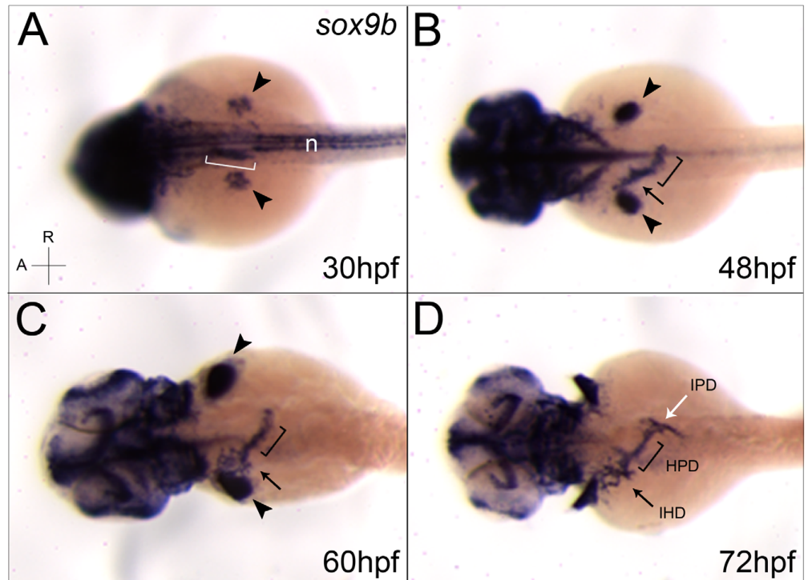

## Question

# Gene Research for Functional Annotation

## ⚠️ CRITICAL: Gene/Protein Identification Context

**BEFORE YOU BEGIN RESEARCH:** You MUST verify you are researching the CORRECT gene/protein. Gene symbols can be ambiguous, especially for less well-characterized genes from non-model organisms.

### Target Gene/Protein Identity (from UniProt):
- **UniProt Accession:** Q9DFH1
- **Protein Description:** SubName: Full=HMG box transcription factor Sox9b {ECO:0000313|EMBL:AAG09815.1};
- **Gene Information:** Name=sox9b {ECO:0000313|EMBL:AAG09815.1, ECO:0000313|ZFIN:ZDB-GENE-001103-2};
- **Organism (full):** Danio rerio (Zebrafish) (Brachydanio rerio).
- **Protein Family:** Not specified in UniProt
- **Key Domains:** HMG_box_dom. (IPR009071); HMG_box_dom_sf. (IPR036910); Sox_N. (IPR022151); SOX_TF. (IPR050917); HMG_box (PF00505)

### MANDATORY VERIFICATION STEPS:

1. **Check if the gene symbol "sox9b" matches the protein description above**
2. **Verify the organism is correct:** Danio rerio (Zebrafish) (Brachydanio rerio).
3. **Check if protein family/domains align with what you find in literature**
4. **If you find literature for a DIFFERENT gene with the same or similar symbol, STOP**

### If Gene Symbol is Ambiguous or You Cannot Find Relevant Literature:

**DO NOT PROCEED WITH RESEARCH ON A DIFFERENT GENE.** Instead:
- State clearly: "The gene symbol 'sox9b' is ambiguous or literature is limited for this specific protein"
- Explain what you found (e.g., "Found extensive literature on a different gene with the same symbol in a different organism")
- Describe the protein based ONLY on the UniProt information provided above
- Suggest that the protein function can be inferred from domain/family information

### Research Target:

Please provide a comprehensive research report on the gene **sox9b** (gene ID: sox9b, UniProt: Q9DFH1) in DANRE.

The research report should be a detailed narrative explaining the function, biological processes, and localization of the gene product. Citations should be given for all claims.

You should prioritize authoritative reviews and primary scientific literature when conducting research. You can supplement
this with annotations you find in gene/protein databases, but these can be outdated or inaccurate.

We are specifically interested in the primary function of the gene - for enzymes, what reaction is catalyzed, and what is the substrate specificity? For transporters, what is the substrate? For structural proteins or adapters, what is the broader structural role? For signaling molecules, what is the role in the pathway.

We are interested in where in or outside the cell the gene product carries out its function.

We are also interested in the signaling or biochemical pathways in which the gene functions. We are less interested in broad pleiotropic effects, except where these elucidate the precise role.

Include evidence where possible. We are interested in both experimental evidence as well as inference from structure, evolution, or bioinformatic analysis. Precise studies should be prioritized over high-throughput, where available.

## Output

Question: You are an expert researcher providing comprehensive, well-cited information.

Provide detailed information focusing on:
1. Key concepts and definitions with current understanding
2. Recent developments and latest research (prioritize 2023-2024 sources)
3. Current applications and real-world implementations
4. Expert opinions and analysis from authoritative sources
5. Relevant statistics and data from recent studies

Format as a comprehensive research report with proper citations. Include URLs and publication dates where available.
Always prioritize recent, authoritative sources and provide specific citations for all major claims.

# Gene Research for Functional Annotation

## ⚠️ CRITICAL: Gene/Protein Identification Context

**BEFORE YOU BEGIN RESEARCH:** You MUST verify you are researching the CORRECT gene/protein. Gene symbols can be ambiguous, especially for less well-characterized genes from non-model organisms.

### Target Gene/Protein Identity (from UniProt):
- **UniProt Accession:** Q9DFH1
- **Protein Description:** SubName: Full=HMG box transcription factor Sox9b {ECO:0000313|EMBL:AAG09815.1};
- **Gene Information:** Name=sox9b {ECO:0000313|EMBL:AAG09815.1, ECO:0000313|ZFIN:ZDB-GENE-001103-2};
- **Organism (full):** Danio rerio (Zebrafish) (Brachydanio rerio).
- **Protein Family:** Not specified in UniProt
- **Key Domains:** HMG_box_dom. (IPR009071); HMG_box_dom_sf. (IPR036910); Sox_N. (IPR022151); SOX_TF. (IPR050917); HMG_box (PF00505)

### MANDATORY VERIFICATION STEPS:

1. **Check if the gene symbol "sox9b" matches the protein description above**
2. **Verify the organism is correct:** Danio rerio (Zebrafish) (Brachydanio rerio).
3. **Check if protein family/domains align with what you find in literature**
4. **If you find literature for a DIFFERENT gene with the same or similar symbol, STOP**

### If Gene Symbol is Ambiguous or You Cannot Find Relevant Literature:

**DO NOT PROCEED WITH RESEARCH ON A DIFFERENT GENE.** Instead:
- State clearly: "The gene symbol 'sox9b' is ambiguous or literature is limited for this specific protein"
- Explain what you found (e.g., "Found extensive literature on a different gene with the same symbol in a different organism")
- Describe the protein based ONLY on the UniProt information provided above
- Suggest that the protein function can be inferred from domain/family information

### Research Target:

Please provide a comprehensive research report on the gene **sox9b** (gene ID: sox9b, UniProt: Q9DFH1) in DANRE.

The research report should be a detailed narrative explaining the function, biological processes, and localization of the gene product. Citations should be given for all claims.

You should prioritize authoritative reviews and primary scientific literature when conducting research. You can supplement
this with annotations you find in gene/protein databases, but these can be outdated or inaccurate.

We are specifically interested in the primary function of the gene - for enzymes, what reaction is catalyzed, and what is the substrate specificity? For transporters, what is the substrate? For structural proteins or adapters, what is the broader structural role? For signaling molecules, what is the role in the pathway.

We are interested in where in or outside the cell the gene product carries out its function.

We are also interested in the signaling or biochemical pathways in which the gene functions. We are less interested in broad pleiotropic effects, except where these elucidate the precise role.

Include evidence where possible. We are interested in both experimental evidence as well as inference from structure, evolution, or bioinformatic analysis. Precise studies should be prioritized over high-throughput, where available.

# Functional annotation report: zebrafish **sox9b** (UniProt Q9DFH1)

## Executive summary

The requested target is correctly identified as **Danio rerio sox9b**, not a similarly named gene from another organism. Zebrafish carry two teleost-duplication-derived SOX9 co-orthologs, **sox9a** and **sox9b**. The literature distinguishes them experimentally and shows substantial subfunctionalization: sox9b has especially strong roles in pancreaticobiliary ducts, heart, retina, and pharyngeal signaling, whereas sox9a has the dominant requirement for gross cartilage formation in recent CRISPR mutants. (vining2021diverseregulationbut pages 7-9, lin2021sox9anotsox9b pages 5-6, delous2012sox9bisa pages 2-4)

Sox9b is best annotated as a **nuclear, sequence-specific HMG-box developmental transcription factor of the SOXE group**. It is not an enzyme or transporter and therefore has no catalytic reaction or transported substrate. Its primary molecular activity is DNA-dependent transcriptional regulation; its most rigorously established organism-level function is controlling cell differentiation, spatial segregation, and branching morphogenesis in the pancreaticobiliary ductal epithelium, partly through reciprocal positive feedback with Notch signaling. (delous2012sox9bisa pages 1-2, delous2012sox9bisa pages 8-10)

The direct mechanistic literature is concentrated in 2008–2021. Recent 2023–2024 work mainly extends Sox9b into computational retinal regulatory networks and review-level liver-regeneration models rather than providing new gene-specific biochemical validation. (mo2024usingdifferentzebrafish pages 12-13, zeng2023comparativesinglecelltranscriptomic pages 28-31)

## 1. Identity and domain verification

### Target verification

- **Gene:** sox9b
- **Protein:** HMG-box transcription factor Sox9b
- **Organism:** *Danio rerio* (zebrafish; formerly *Brachydanio rerio*)
- **UniProt accession supplied:** Q9DFH1
- **Paralog that must not be conflated with it:** sox9a

Teleost genome duplication generated the two zebrafish SOX9 co-orthologs. Their expression and developmental requirements subsequently partitioned: both retain conserved SOX architecture, but they are not functionally interchangeable in every tissue. (vining2021diverseregulationbut pages 7-9, lin2021sox9anotsox9b pages 1-3)

The supplied UniProt annotations—HMG_box, HMG-box superfamily, Sox_N and SOX transcription-factor signatures—are fully consistent with the literature. Delous et al. depicted a 407-residue zebrafish Sox9b protein with its HMG DNA-binding box approximately at residues 91–159. Their *sox9b*^fh313^ allele introduces an A→T transversion at coding position 302 and a K68 stop, truncating the protein before the HMG box; the severe ductal phenotype therefore independently validates the functional importance of this domain. (delous2012sox9bisa pages 2-4, delous2012sox9bisa pages 4-4, delous2012sox9bisa media 63390d74)

The apparent 407-versus-462-amino-acid discrepancy among retrieved sources likely reflects transcript/protein-record or comparative-table differences and should be resolved against the current Q9DFH1 sequence before designing residue-specific reagents. It does not alter the gene identity or HMG-box classification. (vining2021diverseregulationbut pages 7-9, delous2012sox9bisa media 63390d74)

## 2. Molecular function and cellular localization

### Primary molecular function

Sox9b is a **transcriptional regulator**, not a metabolic catalyst. Its HMG box mediates sequence-specific DNA recognition and DNA bending, while the less-conserved terminal portions of SOX9-family proteins contain transcription-regulatory regions. The HMG box is highly conserved across vertebrate SOX9 proteins, whereas greater divergence occurs toward the C-terminal transactivation region. (vining2021diverseregulationbut pages 7-9, delous2012sox9bisa pages 1-2)

The evidence strongly supports transcriptional regulation as the molecular activity: a dominant-negative Sox9b construct reduced Sox9b-dependent reporter transcription by approximately **64%**, and tissue-restricted expression of this construct altered developmental-gene transcription and organ morphogenesis. (gawdzik2018sox9bisrequired pages 2-3)

### Where the protein acts

Because Sox9b controls transcription through an HMG DNA-binding domain, its functional compartment is the **cell nucleus**. The retrieved zebrafish studies generally measured RNA expression, transcriptional reporters, or tissue phenotypes rather than performing direct protein-localization microscopy; nuclear localization is therefore a high-confidence inference from molecular class and transcriptional activity, rather than a Q9DFH1-specific immunolocalization result.

Its activity is **cell-intrinsic in some contexts**—notably ductal epithelial cells and cardiomyocytes—but can produce non-cell-autonomous consequences. For example, Sox9b activity in pharyngeal endoderm changes Follistatin/BMP signaling received by adjacent neural-crest-derived cartilage precursors, and cardiomyocyte-restricted inhibition disrupts epicardial coverage and endocardial-cushion development. (dalcq2012runx3egr1and pages 1-2, gawdzik2018sox9bisrequired pages 10-11)

## 3. Expression and principal biological functions

### 3.1 Pancreaticobiliary ductal system: strongest direct annotation

This is the clearest loss-of-function-defined role. During development, *sox9b* RNA occurs in foregut endoderm by **30 hpf**, the liver bud and hepatopancreatic-duct primordium at **48 hpf**, intra- and extrahepatic ducts at **60 hpf**, and intrapancreatic ducts by **72 hpf**. In contrast, *sox9a* was not detectably expressed in this system. (delous2012sox9bisa pages 2-4, delous2012sox9bisa media 8ee2991a)

Homozygous *fh313* mutants specify intrahepatic biliary cells, but those cells fail to segregate and interconnect into a functional branched network. The hepatopancreatic duct becomes dysmorphic, gallbladder development is frequently defective, intrapancreatic secondary branches fail to form, and distal bile/pancreatic-fluid transport is impaired. Embryonic endocrine and acinar compartments are initially comparatively preserved, indicating that the primary defect is ductal rather than a general failure of pancreatic specification. (delous2012sox9bisa pages 1-2, delous2012sox9bisa pages 4-6, delous2012sox9bisa pages 8-10)

The defects persist and worsen. Adult mutants survive but develop cholestasis, dilated and proliferative hepatic and pancreatic ducts, cystic changes, fibrosis, and reduced pancreatic acinar tissue. This survival is experimentally useful because it links an embryonic transcription-factor defect to progressive adult organ pathology. (delous2012sox9bisa pages 4-4, delous2012sox9bisa pages 1-2)

Quantitative observations include mutant bile ducts at least approximately **3.5 µm** wide versus no more than approximately **2.5 µm** in wild type; significantly fewer isolated biliary cells and more clusters of four or more; and an approximately **50%** and **80%** reduction in secondary endocrine cells/clusters at three and four weeks, respectively. The latter probably reflects failure to expand the duct-associated progenitor compartment rather than a primary embryonic endocrine-specification defect. (delous2012sox9bisa pages 6-8, delous2012sox9bisa pages 4-6)

### 3.2 Notch pathway

Notch and Sox9b form a reciprocal developmental circuit in intrahepatic biliary cells:

1. Partial γ-secretase inhibition with DAPT reduces *sox9b* expression.
2. Heat-shock-induced Notch intracellular domain increases *sox9b* throughout the liver, pancreas, and hepatopancreatic ducts.
3. Sox9b loss allows biliary cells to switch off Notch prematurely, increasing cell clustering and proliferation and impairing duct morphogenesis. (delous2012sox9bisa pages 6-8, delous2012sox9bisa pages 8-10)

At 123 hpf, the proportion of biliary cells that had recently lost Notch activity was significantly increased in mutants; approximately **30%** of the corresponding Notch-off wild-type population incorporated EdU, with increased incorporation in mutant reporter populations. These experiments establish pathway reciprocity, although they do not by themselves demonstrate direct Sox9b occupancy at Notch-pathway genes. (delous2012sox9bisa pages 10-12, delous2012sox9bisa pages 12-14, delous2012sox9bisa pages 8-10)

### 3.3 Heart and cardiomyocytes

Sox9b is expressed in the embryonic heart. Cardiomyocyte-specific dominant-negative inhibition caused altered chamber composition, abnormal cardiac morphology, hypoplastic endocardial cushions, defective epicardial coverage, and reduced cardiac performance. Global loss also interfered with proepicardial progenitor formation, whereas cardiomyocyte-restricted inhibition allowed progenitors to form but impeded their subsequent migration over the myocardium, probably partly because migration depends on normal cardiac mechanics. (gawdzik2018sox9bisrequired pages 10-11, gawdzik2018sox9bisrequired pages 2-3)

Isolated heart tissue showed reduced *nkx2.5*, *nkx2.7*, *myl7*, *c-fos*, and *capns1a*. These genes plausibly account for impaired cardiomyocyte specification, differentiation, sarcomere function, and migration. SOXE motifs were found near some regulatory regions, but direct Sox9b binding was not demonstrated; these should be described as **candidate downstream genes**, not confirmed direct targets. The RT-qPCR experiment used four biological groups/samples per condition and thresholds of *p*<0.05 and FDR<0.25. (gawdzik2018sox9bisrequired pages 10-11, gawdzik2018sox9bisrequired pages 11-12)

### 3.4 Pharyngeal endoderm, BMP signaling, and craniofacial development

A proposed regulatory cascade places Runx3 upstream of Egr1 and Sox9b in pharyngeal endoderm. Sox9b-dependent repression of *fsta*, encoding the BMP antagonist Follistatin A, permits BMP signaling in adjacent cranial neural-crest cells at about **30 hpf** and supports *runx2b* expression and cartilage maturation. The intervention data support the pathway relationship, but direct binding of Sox9b to the *fsta* locus was not established. (dalcq2012runx3egr1and pages 1-2)

This role should not be generalized to “Sox9b is globally required for cartilage.” CRISPR *sox9b* Δ11 and Δ20 alleles deleting the HMG and Q/S domains produced grossly normal maxillary, mandibular, and pectoral-fin cartilage, whereas *sox9a* mutants had misshapen pectoral fins and lacked scapulocoracoid cartilage. Earlier ENU, deletion, or morpholino phenotypes may reflect allele context, deletion of neighboring genes, acute knockdown effects, or genetic compensation in stable mutants. Current evidence therefore favors a **tissue- and context-specific Sox9b role**, with Sox9a carrying the dominant autonomous chondrogenic function. (lin2021sox9anotsox9b pages 5-6, delous2012sox9bisa pages 2-4, lin2021sox9anotsox9b pages 1-3)

### 3.5 Retina

Mutant and expression-profiling studies associate Sox9b with retinal differentiation, including photoreceptor and Müller-glial development. Candidate affected retinal genes include *calb2a/b, crx, neurod, rs1, sox4a,* and *vsx1*, but the retrieved evidence does not establish these as direct Sox9b-bound targets. (ahmadifar2021acomparativestudy pages 8-9)

A 2024 comparative single-cell analysis incorporated zebrafish retinal data into regulatory-network and RNA-velocity analyses. Across species, it analyzed approximately **240,000 cells**, reconstructed **690 regulons** governed by **530 regulators**, and treated Sox9b as a validated or putative differentiation regulator. This is useful contemporary support for a retinal regulatory role, but it is computational reanalysis of existing data—not a new *sox9b* perturbation. (zeng2023comparativesinglecelltranscriptomic pages 28-31)

### 3.6 Gonads

Both zebrafish paralogs occur in brain and eye, but comparative literature reports differential gonadal expression, with *sox9a* associated more strongly with testis and *sox9b* with ovary in zebrafish. This should not be converted into a claim that zebrafish Sox9b is a conserved male-determining switch: strong male-pathway evidence for a gene called *sox9b* in medaka or other fishes does not automatically apply to *D. rerio*. (vining2021diverseregulationbut pages 7-9, vining2021diverseregulationbut pages 9-11)

## 4. Environmental signaling and toxicology

TCDD activates zebrafish AHR2 and represses *sox9b* in developing jaw, heart, and brain tissues. Sox9b depletion phenocopies important TCDD-induced craniofacial and cardiac abnormalities, while injected *sox9b* mRNA rescues craniofacial or proepicardial defects. This perturbation-plus-rescue design supplies strong causal evidence that reduced Sox9b is a mediator—not merely a biomarker—of AHR2 developmental toxicity. (shankar2020areviewof pages 20-20, gawdzik2018sox9bisrequired pages 2-3)

An AHR2-induced long noncoding RNA, *slincR*, lies near *sox9b* and is proposed to repress its transcription. Reducing *slincR* increases *sox9b* expression during normal development and AHR2 activation. The working pathway is therefore **TCDD → AHR2 → slincR induction → reduced sox9b → organ malformation**, although the detailed chromatin mechanism remains incompletely resolved. (shankar2020areviewof pages 20-20)

This biology has produced practical tools: *sox9b* promoter–fluorescent reporter lines, tissue-specific dominant-negative constructs, and rescue assays are used to dissect developmental toxicants and distinguish direct tissue susceptibility from secondary organ dysfunction. (gawdzik2018sox9bisrequired pages 13-14, shankar2020areviewof pages 20-20, gawdzik2018sox9bisrequired pages 11-12)

## 5. Recent developments, 2023–2024

Recent gene-specific mechanistic evidence is limited, but three developments refine current interpretation:

1. **Retinal systems biology (2023 preprint; peer-reviewed 2024):** comparative single-cell transcriptomics places Sox9b within conserved retinal differentiation networks. Its value is hypothesis generation—candidate cell states and regulons—not proof of direct binding or necessity. DOI: https://doi.org/10.1093/nargab/lqae149. (zeng2023comparativesinglecelltranscriptomic pages 28-31)
2. **Duplicated-gene interpretation (July 2024):** a review emphasizes that zebrafish duplicate pairs have evolved distinct identities and should be studied together. This is especially important for sox9a/sox9b, where assigning mammalian SOX9 functions to one paralog without tissue-specific evidence is unsafe. DOI: https://doi.org/10.1007/s00427-024-00720-6. (tasnim2024zebrafishunravelinggenetic pages 17-18)
3. **Liver regeneration (October 2024):** a review cites earlier experimental work placing Sox9b and Cdk8 downstream of Hdac1 in bipotent liver-progenitor differentiation. Severe hepatocyte-ablation models can regenerate largely through biliary-derived cells within about **48 hours**, but that timing is a property of the model and cannot be attributed uniquely to Sox9b. DOI: https://doi.org/10.3389/fcell.2024.1485773. (mo2024usingdifferentzebrafish pages 12-13, mo2024usingdifferentzebrafish pages 1-2, mo2024usingdifferentzebrafish pages 10-11)

## 6. Evidence map

The following table separates direct genetic evidence from pathway inference, computational prediction, and review-level synthesis.

| Biological context | Expression / cellular site | Perturbation / evidence | Mechanistic conclusion / pathway | Evidence strength and key quantitative result | Source / year / DOI |
|---|---|---|---|---|---|
| Pancreaticobiliary development | Foregut endoderm at 30 hpf; liver bud and hepatopancreatic-duct primordium at 48 hpf; intra- and extrahepatic ducts at 60 hpf; intrapancreatic ducts by 72 hpf. *sox9a* was not detected in this system. | The *sox9b* fh313 A-to-T mutation creates K68X before the HMG box. Mutants survive to adulthood but develop malformed ducts, cholestasis, cysts, and fibrosis. DAPT and activated-Notch experiments tested pathway reciprocity. | Sox9b controls duct-cell differentiation, segregation, and branching. Notch promotes *sox9b* expression, whereas Sox9b maintains Notch activity in biliary cells, forming a positive-feedback circuit. | **Direct, strong loss- and gain-of-function evidence.** Mutant ducts were at least 3.5 micrometers wide versus no more than 2.5 micrometers in wild type; secondary endocrine cells or clusters fell about 50% at 3 weeks and 80% at 4 weeks. At 123 hpf, loss of Notch activity increased significantly, *p* less than 0.0005. (delous2012sox9bisa pages 2-4, delous2012sox9bisa pages 4-6, delous2012sox9bisa pages 6-8, delous2012sox9bisa pages 8-10, delous2012sox9bisa media 8ee2991a) | Delous et al.; 14 June 2012; [DOI](https://doi.org/10.1371/journal.pgen.1002754) |
| Craniofacial cartilage signaling | Migratory cranial neural crest initially expresses both paralogs; after migration, Sox9b is reported in pharyngeal endoderm rather than neural-crest cartilage precursors. | Morpholino depletion, a dominant-negative BMP receptor, and dorsomorphin experiments evaluated Runx3, Egr1, Sox9b, Follistatin A, and BMP signaling near 30 hpf. | Proposed cascade: Runx3 to Egr1 to Sox9b represses *fsta*, reducing BMP antagonism and permitting BMP-dependent *runx2b* expression and cartilage maturation. Direct Sox9b binding to *fsta* was not established. | **Direct pathway-perturbation evidence, with a partly inferred target relationship.** BMP activity around 30 hpf was required for neural-crest differentiation and cartilage formation. (dalcq2012runx3egr1and pages 1-2) | Dalcq et al.; 27 November 2012; [DOI](https://doi.org/10.1371/journal.pone.0050140) |
| Cardiomyocyte and heart development | *sox9b* is expressed in the embryonic heart; cell-restricted experiments place an essential activity in cardiomyocytes, with secondary effects on endocardial cushions and epicardial migration. | Cardiomyocyte-specific Gal4/UAS expression of dominant-negative Sox9b, isolated-heart RT-qPCR, global loss or morpholino experiments, and rescue evidence. The construct reduced Sox9b-dependent reporter transcription by about 64%. | Cardiomyocyte Sox9b supports chamber patterning, myocardial performance, cushion development, and epicardial coverage. *nkx2.5*, *nkx2.7*, *myl7*, *c-fos*, and *capns1a* decreased, but predicted SOXE sites do not prove direct binding. | **Direct cell-specific functional evidence; direct targets remain unconfirmed.** RT-qPCR used *n* = 4 per group, with *p* less than 0.05 and FDR less than 0.25. Sox9b mRNA also rescued dioxin-associated proepicardial defects. (gawdzik2018sox9bisrequired pages 10-11, gawdzik2018sox9bisrequired pages 11-12, gawdzik2018sox9bisrequired pages 2-3) | Gawdzik et al.; September 2018; [DOI](https://doi.org/10.1038/s41598-018-32125-7) |
| AHR2 and TCDD developmental toxicology | TCDD-associated repression occurs in the developing jaw, heart, and brain; *slincR* overlaps tissues requiring Sox9 activity, including the jaw or snout, otic vesicle, eye, and brain. | TCDD and AHR2 activation reduce *sox9b*. *sox9b* knockdown phenocopies jaw and cardiac defects, whereas *sox9b* mRNA restoration prevents craniofacial malformation. Antisense depletion of AHR2-induced lncRNA *slincR* raises *sox9b* expression. | AHR2 activation induces *slincR*, which is proposed to repress *sox9b* transcription. Rescue supports causal involvement in toxicity, although the complete repression mechanism remains unresolved. | **Direct perturbation and rescue evidence; the placement of *slincR* is supported but not fully resolved.** No robust effect size was available in the retrieved evidence. (shankar2020areviewof pages 20-20) | Xiong et al.; December 2008; [DOI](https://doi.org/10.1124/mol.108.050435). Garcia et al.; June 2017; [DOI](https://doi.org/10.1124/mol.117.108233). Garcia et al.; November 2018; [DOI](https://doi.org/10.1289/EHP3281) |
| Retinal differentiation | Developmental evidence associates *sox9b* with photoreceptor and Müller-glial differentiation; recent single-cell datasets include zebrafish retinal trajectories. | Earlier mutant and expression profiling identified retinal changes. A 2024 comparative study reconstructed regulons and RNA-velocity trajectories from existing single-cell data rather than perturbing *sox9b*. | Sox9b is implicated as a retinal differentiation regulator, but the recent result is a predicted regulatory or driver association, not proof of direct targets or necessity in the analyzed single-cell dataset. | **Mixed evidence:** earlier mutant evidence is functional; **2024 evidence is computational.** The comparative study examined approximately 240,000 retinal cells, 690 regulons, and 530 regulators across species; zebrafish data came from GEO GSE122680. (ahmadifar2021acomparativestudy pages 8-9, zeng2023comparativesinglecelltranscriptomic pages 28-31) | Yokoi et al.; May 2009; [DOI](https://doi.org/10.1016/j.ydbio.2009.01.002). Zeng et al.; July 2024; [DOI](https://doi.org/10.1093/nargab/lqae149) |
| Cartilage paralog specificity | Sox9a is prominent in the scapulocoracoid; Sox9b is absent or weak there. Both genes can occur in other chondrogenic contexts, but expression and requirement are partitioned. | CRISPR/Cas9 generated *sox9b* delta-11 and delta-20 alleles lacking the HMG and Q/S domains; homozygous larvae were compared with *sox9a* mutants and wild type. | Isolated *sox9b* disruption was not required for gross maxillary, mandibular, or pectoral-fin cartilage development under the tested conditions. Sox9a carries the dominant requirement, potentially with genetic compensation after *sox9b* mutation. | **Direct CRISPR loss-of-function evidence.** Sox9b mutants showed morphologically normal cartilage, whereas Sox9a mutants had misshapen pectoral fins and lacked scapulocoracoid cartilage. This negative evidence cautions against assigning all SOX9-like cartilage functions to Sox9b. (lin2021sox9anotsox9b pages 5-6, lin2021sox9anotsox9b pages 1-3) | Lin et al.; May 2021; [DOI](https://doi.org/10.1016/j.aaf.2019.12.009) |
| Liver regeneration and progenitor plasticity | Sox9b-related activity is associated with bipotent liver progenitor or biliary epithelial populations during regeneration after severe hepatocyte injury. | A 2024 review synthesizes zebrafish injury models and cites experiments in which Hdac1 regulates progenitor differentiation through Sox9b and Cdk8. | Sox9b is positioned within an Hdac1-dependent program governing liver-progenitor differentiation. Its direct genomic targets and necessity in newer transitional-progenitor studies require gene-specific validation. | **Review-level evidence**, anchored to earlier primary experiments rather than a new 2024 Sox9b perturbation. In extreme hepatocyte-ablation models, biliary-derived hepatocyte regeneration can be largely completed within approximately 48 hours, but this statistic is not uniquely attributable to Sox9b. (mo2024usingdifferentzebrafish pages 12-13, mo2024usingdifferentzebrafish pages 1-2, mo2024usingdifferentzebrafish pages 10-11) | Mo et al.; October 2024; [DOI](https://doi.org/10.3389/fcell.2024.1485773) |

*Table: Evidence for Danio rerio sox9b/Q9DFH1 across developmental, signaling, toxicological, and regenerative contexts. The table distinguishes direct perturbation studies from computational inference and review-level evidence.*

## 7. Current applications and real-world relevance

- **Congenital duct-disease modeling:** Adult-surviving *sox9b* mutants model progressive cholestasis, duct dilation, cyst formation, and fibrosis and identify human SOX9 as a candidate locus in pancreaticobiliary malformations. (delous2012sox9bisa pages 1-2)
- **Developmental toxicology:** The AHR2–*slincR*–Sox9b axis provides an experimentally tractable adverse-outcome mechanism for dioxin-like compounds; rescue assays can test whether altered Sox9b is causally responsible for a toxic phenotype. (shankar2020areviewof pages 20-20)
- **Cardiac-development assays:** Cardiomyocyte-restricted inhibition separates myocardial Sox9b activity from functions in proepicardial or other tissues, enabling cell-specific analysis of congenital-heart and toxicant phenotypes. (gawdzik2018sox9bisrequired pages 10-11, gawdzik2018sox9bisrequired pages 2-3)
- **Regeneration and progenitor biology:** Sox9b-associated biliary and retinal progenitor states make reporter and conditional perturbation lines potentially useful for studying epithelial plasticity, but recent regeneration claims remain less directly validated than its developmental duct function. (mo2024usingdifferentzebrafish pages 12-13, zeng2023comparativesinglecelltranscriptomic pages 28-31)
- **Functional-genomics caution:** Stable CRISPR nulls can produce milder cartilage phenotypes than morpholinos or large chromosomal deletions. Orthogonal alleles, rescue, and paralog-double perturbations are therefore essential controls. (lin2021sox9anotsox9b pages 5-6, delous2012sox9bisa pages 2-4)

## 8. Confidence assessment and unresolved questions

**High confidence:** identity as zebrafish Sox9b; SOXE/HMG-box transcription-factor class; nuclear transcriptional role; pancreaticobiliary expression; requirement for ductal branching and bile transport; reciprocal functional interaction with Notch; roles in cardiomyocytes and AHR2-mediated developmental toxicity. (delous2012sox9bisa pages 2-4, delous2012sox9bisa pages 1-2, delous2012sox9bisa pages 8-10, shankar2020areviewof pages 20-20, gawdzik2018sox9bisrequired pages 2-3)

**Moderate confidence:** Sox9b-mediated regulation of the Runx3–Egr1–Fsta–BMP cascade and specific cardiac genes. Perturbation evidence is good, but direct chromatin occupancy has not been shown. (dalcq2012runx3egr1and pages 1-2, gawdzik2018sox9bisrequired pages 10-11)

**Emerging or indirect:** Sox9b regulons in retinal single-cell trajectories and its precise role in regenerative liver progenitors. These are supported computationally or through reviews of earlier studies and require Sox9b-specific conditional genetics, CUT&RUN/ChIP-seq, and rescue experiments. (mo2024usingdifferentzebrafish pages 12-13, zeng2023comparativesinglecelltranscriptomic pages 28-31)

The most important remaining molecular gap is a rigorously validated, tissue-resolved set of **direct Sox9b genomic targets**. Present evidence defines several compelling pathway relationships and candidate targets, but only limited evidence demonstrates physical Sox9b binding to endogenous regulatory elements. Consequently, the most defensible primary annotation is: **a nuclear SOXE transcription factor that interprets and stabilizes developmental gene programs, with a particularly well-supported role in Notch-dependent pancreaticobiliary duct morphogenesis.**

References

1. (vining2021diverseregulationbut pages 7-9): Brittany Vining, Zhenhua Ming, Stefan Bagheri-Fam, and Vincent Harley. Diverse regulation but conserved function: sox9 in vertebrate sex determination. Genes, 12:486, Mar 2021. URL: https://doi.org/10.3390/genes12040486, doi:10.3390/genes12040486. This article has 82 citations.

2. (lin2021sox9anotsox9b pages 5-6): Qiaohong Lin, Yan He, Jian-Fang Gui, and Jie Mei. Sox9a, not sox9b is required for normal cartilage development in zebrafish. Aquaculture and Fisheries, 6:254-259, May 2021. URL: https://doi.org/10.1016/j.aaf.2019.12.009, doi:10.1016/j.aaf.2019.12.009. This article has 10 citations and is from a peer-reviewed journal.

3. (delous2012sox9bisa pages 2-4): Marion Delous, Chunyue Yin, Donghun Shin, Nikolay Ninov, Juliana Debrito Carten, Luyuan Pan, Taylur P. Ma, Steven A. Farber, Cecilia B. Moens, and Didier Y. R. Stainier. Sox9b is a key regulator of pancreaticobiliary ductal system development. PLoS Genetics, 8:e1002754, Jun 2012. URL: https://doi.org/10.1371/journal.pgen.1002754, doi:10.1371/journal.pgen.1002754. This article has 142 citations and is from a domain leading peer-reviewed journal.

4. (delous2012sox9bisa pages 1-2): Marion Delous, Chunyue Yin, Donghun Shin, Nikolay Ninov, Juliana Debrito Carten, Luyuan Pan, Taylur P. Ma, Steven A. Farber, Cecilia B. Moens, and Didier Y. R. Stainier. Sox9b is a key regulator of pancreaticobiliary ductal system development. PLoS Genetics, 8:e1002754, Jun 2012. URL: https://doi.org/10.1371/journal.pgen.1002754, doi:10.1371/journal.pgen.1002754. This article has 142 citations and is from a domain leading peer-reviewed journal.

5. (delous2012sox9bisa pages 8-10): Marion Delous, Chunyue Yin, Donghun Shin, Nikolay Ninov, Juliana Debrito Carten, Luyuan Pan, Taylur P. Ma, Steven A. Farber, Cecilia B. Moens, and Didier Y. R. Stainier. Sox9b is a key regulator of pancreaticobiliary ductal system development. PLoS Genetics, 8:e1002754, Jun 2012. URL: https://doi.org/10.1371/journal.pgen.1002754, doi:10.1371/journal.pgen.1002754. This article has 142 citations and is from a domain leading peer-reviewed journal.

6. (mo2024usingdifferentzebrafish pages 12-13): Dashuang Mo, Mengzhu Lv, and Xiaoyu Mao. Using different zebrafish models to explore liver regeneration. Frontiers in Cell and Developmental Biology, Oct 2024. URL: https://doi.org/10.3389/fcell.2024.1485773, doi:10.3389/fcell.2024.1485773. This article has 12 citations.

7. (zeng2023comparativesinglecelltranscriptomic pages 28-31): Xin Zeng, Fuki Gyoja, Yang Cui, Matin Loza, Takehiro G Kusakabe, and Kenta Nakai. Comparative single-cell transcriptomic analysis reveals putative differentiation drivers and potential origin of vertebrate retina. BioRxiv, Dec 2023. URL: https://doi.org/10.1101/2023.12.03.569795, doi:10.1101/2023.12.03.569795. This article has 1 citations.

8. (lin2021sox9anotsox9b pages 1-3): Qiaohong Lin, Yan He, Jian-Fang Gui, and Jie Mei. Sox9a, not sox9b is required for normal cartilage development in zebrafish. Aquaculture and Fisheries, 6:254-259, May 2021. URL: https://doi.org/10.1016/j.aaf.2019.12.009, doi:10.1016/j.aaf.2019.12.009. This article has 10 citations and is from a peer-reviewed journal.

9. (delous2012sox9bisa pages 4-4): Marion Delous, Chunyue Yin, Donghun Shin, Nikolay Ninov, Juliana Debrito Carten, Luyuan Pan, Taylur P. Ma, Steven A. Farber, Cecilia B. Moens, and Didier Y. R. Stainier. Sox9b is a key regulator of pancreaticobiliary ductal system development. PLoS Genetics, 8:e1002754, Jun 2012. URL: https://doi.org/10.1371/journal.pgen.1002754, doi:10.1371/journal.pgen.1002754. This article has 142 citations and is from a domain leading peer-reviewed journal.

10. (delous2012sox9bisa media 63390d74): Marion Delous, Chunyue Yin, Donghun Shin, Nikolay Ninov, Juliana Debrito Carten, Luyuan Pan, Taylur P. Ma, Steven A. Farber, Cecilia B. Moens, and Didier Y. R. Stainier. Sox9b is a key regulator of pancreaticobiliary ductal system development. PLoS Genetics, 8:e1002754, Jun 2012. URL: https://doi.org/10.1371/journal.pgen.1002754, doi:10.1371/journal.pgen.1002754. This article has 142 citations and is from a domain leading peer-reviewed journal.

11. (gawdzik2018sox9bisrequired pages 2-3): Joseph C. Gawdzik, Monica S. Yue, Nathan R. Martin, Loes M. H. Elemans, Kevin A. Lanham, Warren Heideman, Ryan Rezendes, Tracie R. Baker, Michael R. Taylor, and Jessica S. Plavicki. Sox9b is required in cardiomyocytes for cardiac morphogenesis and function. Scientific Reports, Sep 2018. URL: https://doi.org/10.1038/s41598-018-32125-7, doi:10.1038/s41598-018-32125-7. This article has 42 citations and is from a peer-reviewed journal.

12. (dalcq2012runx3egr1and pages 1-2): Julia Dalcq, Vincent Pasque, Aurélie Ghaye, Arnaud Larbuisson, Patrick Motte, Joseph A. Martial, and Marc Muller. Runx3, egr1 and sox9b form a regulatory cascade required to modulate bmp-signaling during cranial cartilage development in zebrafish. PLoS ONE, 7:e50140, Nov 2012. URL: https://doi.org/10.1371/journal.pone.0050140, doi:10.1371/journal.pone.0050140. This article has 65 citations and is from a peer-reviewed journal.

13. (gawdzik2018sox9bisrequired pages 10-11): Joseph C. Gawdzik, Monica S. Yue, Nathan R. Martin, Loes M. H. Elemans, Kevin A. Lanham, Warren Heideman, Ryan Rezendes, Tracie R. Baker, Michael R. Taylor, and Jessica S. Plavicki. Sox9b is required in cardiomyocytes for cardiac morphogenesis and function. Scientific Reports, Sep 2018. URL: https://doi.org/10.1038/s41598-018-32125-7, doi:10.1038/s41598-018-32125-7. This article has 42 citations and is from a peer-reviewed journal.

14. (delous2012sox9bisa media 8ee2991a): Marion Delous, Chunyue Yin, Donghun Shin, Nikolay Ninov, Juliana Debrito Carten, Luyuan Pan, Taylur P. Ma, Steven A. Farber, Cecilia B. Moens, and Didier Y. R. Stainier. Sox9b is a key regulator of pancreaticobiliary ductal system development. PLoS Genetics, 8:e1002754, Jun 2012. URL: https://doi.org/10.1371/journal.pgen.1002754, doi:10.1371/journal.pgen.1002754. This article has 142 citations and is from a domain leading peer-reviewed journal.

15. (delous2012sox9bisa pages 4-6): Marion Delous, Chunyue Yin, Donghun Shin, Nikolay Ninov, Juliana Debrito Carten, Luyuan Pan, Taylur P. Ma, Steven A. Farber, Cecilia B. Moens, and Didier Y. R. Stainier. Sox9b is a key regulator of pancreaticobiliary ductal system development. PLoS Genetics, 8:e1002754, Jun 2012. URL: https://doi.org/10.1371/journal.pgen.1002754, doi:10.1371/journal.pgen.1002754. This article has 142 citations and is from a domain leading peer-reviewed journal.

16. (delous2012sox9bisa pages 6-8): Marion Delous, Chunyue Yin, Donghun Shin, Nikolay Ninov, Juliana Debrito Carten, Luyuan Pan, Taylur P. Ma, Steven A. Farber, Cecilia B. Moens, and Didier Y. R. Stainier. Sox9b is a key regulator of pancreaticobiliary ductal system development. PLoS Genetics, 8:e1002754, Jun 2012. URL: https://doi.org/10.1371/journal.pgen.1002754, doi:10.1371/journal.pgen.1002754. This article has 142 citations and is from a domain leading peer-reviewed journal.

17. (delous2012sox9bisa pages 10-12): Marion Delous, Chunyue Yin, Donghun Shin, Nikolay Ninov, Juliana Debrito Carten, Luyuan Pan, Taylur P. Ma, Steven A. Farber, Cecilia B. Moens, and Didier Y. R. Stainier. Sox9b is a key regulator of pancreaticobiliary ductal system development. PLoS Genetics, 8:e1002754, Jun 2012. URL: https://doi.org/10.1371/journal.pgen.1002754, doi:10.1371/journal.pgen.1002754. This article has 142 citations and is from a domain leading peer-reviewed journal.

18. (delous2012sox9bisa pages 12-14): Marion Delous, Chunyue Yin, Donghun Shin, Nikolay Ninov, Juliana Debrito Carten, Luyuan Pan, Taylur P. Ma, Steven A. Farber, Cecilia B. Moens, and Didier Y. R. Stainier. Sox9b is a key regulator of pancreaticobiliary ductal system development. PLoS Genetics, 8:e1002754, Jun 2012. URL: https://doi.org/10.1371/journal.pgen.1002754, doi:10.1371/journal.pgen.1002754. This article has 142 citations and is from a domain leading peer-reviewed journal.

19. (gawdzik2018sox9bisrequired pages 11-12): Joseph C. Gawdzik, Monica S. Yue, Nathan R. Martin, Loes M. H. Elemans, Kevin A. Lanham, Warren Heideman, Ryan Rezendes, Tracie R. Baker, Michael R. Taylor, and Jessica S. Plavicki. Sox9b is required in cardiomyocytes for cardiac morphogenesis and function. Scientific Reports, Sep 2018. URL: https://doi.org/10.1038/s41598-018-32125-7, doi:10.1038/s41598-018-32125-7. This article has 42 citations and is from a peer-reviewed journal.

20. (ahmadifar2021acomparativestudy pages 8-9): Mehdi Ahmadifar, Zeinab Jarban, Mohammad Mahdi Gordan, and Sadaf Reihani. A comparative study of sox9, hoxa10 and oct4 gene expression in human and zebrafish reproduction and embryogenesis. Modern Medical Laboratory Journal, 4:1-15, Nov 2021. URL: https://doi.org/10.30699/mmlj17.4.2.1, doi:10.30699/mmlj17.4.2.1. This article has 0 citations.

21. (vining2021diverseregulationbut pages 9-11): Brittany Vining, Zhenhua Ming, Stefan Bagheri-Fam, and Vincent Harley. Diverse regulation but conserved function: sox9 in vertebrate sex determination. Genes, 12:486, Mar 2021. URL: https://doi.org/10.3390/genes12040486, doi:10.3390/genes12040486. This article has 82 citations.

22. (shankar2020areviewof pages 20-20): Prarthana Shankar, Subham Dasgupta, Mark E Hahn, and Robyn L Tanguay. A review of the functional roles of the zebrafish aryl hydrocarbon receptors. Toxicological sciences : an official journal of the Society of Toxicology, 178:215-238, Sep 2020. URL: https://doi.org/10.1093/toxsci/kfaa143, doi:10.1093/toxsci/kfaa143. This article has 81 citations.

23. (gawdzik2018sox9bisrequired pages 13-14): Joseph C. Gawdzik, Monica S. Yue, Nathan R. Martin, Loes M. H. Elemans, Kevin A. Lanham, Warren Heideman, Ryan Rezendes, Tracie R. Baker, Michael R. Taylor, and Jessica S. Plavicki. Sox9b is required in cardiomyocytes for cardiac morphogenesis and function. Scientific Reports, Sep 2018. URL: https://doi.org/10.1038/s41598-018-32125-7, doi:10.1038/s41598-018-32125-7. This article has 42 citations and is from a peer-reviewed journal.

24. (tasnim2024zebrafishunravelinggenetic pages 17-18): Maliha Tasnim, Preston Wahlquist, and Jonathon T. Hill. Zebrafish: unraveling genetic complexity through duplicated genes. Development Genes and Evolution, 234:99-116, Jul 2024. URL: https://doi.org/10.1007/s00427-024-00720-6, doi:10.1007/s00427-024-00720-6. This article has 47 citations and is from a peer-reviewed journal.

25. (mo2024usingdifferentzebrafish pages 1-2): Dashuang Mo, Mengzhu Lv, and Xiaoyu Mao. Using different zebrafish models to explore liver regeneration. Frontiers in Cell and Developmental Biology, Oct 2024. URL: https://doi.org/10.3389/fcell.2024.1485773, doi:10.3389/fcell.2024.1485773. This article has 12 citations.

26. (mo2024usingdifferentzebrafish pages 10-11): Dashuang Mo, Mengzhu Lv, and Xiaoyu Mao. Using different zebrafish models to explore liver regeneration. Frontiers in Cell and Developmental Biology, Oct 2024. URL: https://doi.org/10.3389/fcell.2024.1485773, doi:10.3389/fcell.2024.1485773. This article has 12 citations.

## Artifacts

- [Edison artifact artifact-00](sox9b-deep-research-falcon_artifacts/artifact-00.md)

## Citations

1. ahmadifar2021acomparativestudy pages 8-9
2. zeng2023comparativesinglecelltranscriptomic pages 28-31
3. shankar2020areviewof pages 20-20
4. tasnim2024zebrafishunravelinggenetic pages 17-18
5. vining2021diverseregulationbut pages 7-9
6. mo2024usingdifferentzebrafish pages 12-13
7. vining2021diverseregulationbut pages 9-11
8. mo2024usingdifferentzebrafish pages 1-2
9. mo2024usingdifferentzebrafish pages 10-11
10. DOI
11. https://doi.org/10.1093/nargab/lqae149.
12. https://doi.org/10.1007/s00427-024-00720-6.
13. https://doi.org/10.3389/fcell.2024.1485773.
14. https://doi.org/10.1371/journal.pgen.1002754
15. https://doi.org/10.1371/journal.pone.0050140
16. https://doi.org/10.1038/s41598-018-32125-7
17. https://doi.org/10.1124/mol.108.050435
18. https://doi.org/10.1124/mol.117.108233
19. https://doi.org/10.1289/EHP3281
20. https://doi.org/10.1016/j.ydbio.2009.01.002
21. https://doi.org/10.1093/nargab/lqae149
22. https://doi.org/10.1016/j.aaf.2019.12.009
23. https://doi.org/10.3389/fcell.2024.1485773
24. https://doi.org/10.3390/genes12040486,
25. https://doi.org/10.1016/j.aaf.2019.12.009,
26. https://doi.org/10.1371/journal.pgen.1002754,
27. https://doi.org/10.3389/fcell.2024.1485773,
28. https://doi.org/10.1101/2023.12.03.569795,
29. https://doi.org/10.1038/s41598-018-32125-7,
30. https://doi.org/10.1371/journal.pone.0050140,
31. https://doi.org/10.30699/mmlj17.4.2.1,
32. https://doi.org/10.1093/toxsci/kfaa143,
33. https://doi.org/10.1007/s00427-024-00720-6,