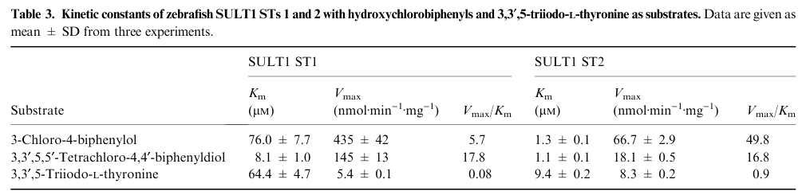

## Question

# Gene Research for Functional Annotation

## ⚠️ CRITICAL: Gene/Protein Identification Context

**BEFORE YOU BEGIN RESEARCH:** You MUST verify you are researching the CORRECT gene/protein. Gene symbols can be ambiguous, especially for less well-characterized genes from non-model organisms.

### Target Gene/Protein Identity (from UniProt):
- **UniProt Accession:** Q7ZUS4
- **Protein Description:** RecName: Full=Cytosolic sulfotransferase 2; EC=2.8.2.-; AltName: Full=SULT1 ST2;
- **Gene Information:** Name=sult1st2 {ECO:0000312|EMBL:AAH47850.1};
- **Organism (full):** Danio rerio (Zebrafish) (Brachydanio rerio).
- **Protein Family:** Belongs to the sulfotransferase 1 family. .
- **Key Domains:** P-loop_NTPase. (IPR027417); Sulfotransferase_dom. (IPR000863); Sulfotransfer_1 (PF00685)

### MANDATORY VERIFICATION STEPS:

1. **Check if the gene symbol "sult1st2" matches the protein description above**
2. **Verify the organism is correct:** Danio rerio (Zebrafish) (Brachydanio rerio).
3. **Check if protein family/domains align with what you find in literature**
4. **If you find literature for a DIFFERENT gene with the same or similar symbol, STOP**

### If Gene Symbol is Ambiguous or You Cannot Find Relevant Literature:

**DO NOT PROCEED WITH RESEARCH ON A DIFFERENT GENE.** Instead:
- State clearly: "The gene symbol 'sult1st2' is ambiguous or literature is limited for this specific protein"
- Explain what you found (e.g., "Found extensive literature on a different gene with the same symbol in a different organism")
- Describe the protein based ONLY on the UniProt information provided above
- Suggest that the protein function can be inferred from domain/family information

### Research Target:

Please provide a comprehensive research report on the gene **sult1st2** (gene ID: sult1st2, UniProt: Q7ZUS4) in DANRE.

The research report should be a detailed narrative explaining the function, biological processes, and localization of the gene product. Citations should be given for all claims.

You should prioritize authoritative reviews and primary scientific literature when conducting research. You can supplement
this with annotations you find in gene/protein databases, but these can be outdated or inaccurate.

We are specifically interested in the primary function of the gene - for enzymes, what reaction is catalyzed, and what is the substrate specificity? For transporters, what is the substrate? For structural proteins or adapters, what is the broader structural role? For signaling molecules, what is the role in the pathway.

We are interested in where in or outside the cell the gene product carries out its function.

We are also interested in the signaling or biochemical pathways in which the gene functions. We are less interested in broad pleiotropic effects, except where these elucidate the precise role.

Include evidence where possible. We are interested in both experimental evidence as well as inference from structure, evolution, or bioinformatic analysis. Precise studies should be prioritized over high-throughput, where available.

## Output

Question: You are an expert researcher providing comprehensive, well-cited information.

Provide detailed information focusing on:
1. Key concepts and definitions with current understanding
2. Recent developments and latest research (prioritize 2023-2024 sources)
3. Current applications and real-world implementations
4. Expert opinions and analysis from authoritative sources
5. Relevant statistics and data from recent studies

Format as a comprehensive research report with proper citations. Include URLs and publication dates where available.
Always prioritize recent, authoritative sources and provide specific citations for all major claims.

# Gene Research for Functional Annotation

## ⚠️ CRITICAL: Gene/Protein Identification Context

**BEFORE YOU BEGIN RESEARCH:** You MUST verify you are researching the CORRECT gene/protein. Gene symbols can be ambiguous, especially for less well-characterized genes from non-model organisms.

### Target Gene/Protein Identity (from UniProt):
- **UniProt Accession:** Q7ZUS4
- **Protein Description:** RecName: Full=Cytosolic sulfotransferase 2; EC=2.8.2.-; AltName: Full=SULT1 ST2;
- **Gene Information:** Name=sult1st2 {ECO:0000312|EMBL:AAH47850.1};
- **Organism (full):** Danio rerio (Zebrafish) (Brachydanio rerio).
- **Protein Family:** Belongs to the sulfotransferase 1 family. .
- **Key Domains:** P-loop_NTPase. (IPR027417); Sulfotransferase_dom. (IPR000863); Sulfotransfer_1 (PF00685)

### MANDATORY VERIFICATION STEPS:

1. **Check if the gene symbol "sult1st2" matches the protein description above**
2. **Verify the organism is correct:** Danio rerio (Zebrafish) (Brachydanio rerio).
3. **Check if protein family/domains align with what you find in literature**
4. **If you find literature for a DIFFERENT gene with the same or similar symbol, STOP**

### If Gene Symbol is Ambiguous or You Cannot Find Relevant Literature:

**DO NOT PROCEED WITH RESEARCH ON A DIFFERENT GENE.** Instead:
- State clearly: "The gene symbol 'sult1st2' is ambiguous or literature is limited for this specific protein"
- Explain what you found (e.g., "Found extensive literature on a different gene with the same symbol in a different organism")
- Describe the protein based ONLY on the UniProt information provided above
- Suggest that the protein function can be inferred from domain/family information

### Research Target:

Please provide a comprehensive research report on the gene **sult1st2** (gene ID: sult1st2, UniProt: Q7ZUS4) in DANRE.

The research report should be a detailed narrative explaining the function, biological processes, and localization of the gene product. Citations should be given for all claims.

You should prioritize authoritative reviews and primary scientific literature when conducting research. You can supplement
this with annotations you find in gene/protein databases, but these can be outdated or inaccurate.

We are specifically interested in the primary function of the gene - for enzymes, what reaction is catalyzed, and what is the substrate specificity? For transporters, what is the substrate? For structural proteins or adapters, what is the broader structural role? For signaling molecules, what is the role in the pathway.

We are interested in where in or outside the cell the gene product carries out its function.

We are also interested in the signaling or biochemical pathways in which the gene functions. We are less interested in broad pleiotropic effects, except where these elucidate the precise role.

Include evidence where possible. We are interested in both experimental evidence as well as inference from structure, evolution, or bioinformatic analysis. Precise studies should be prioritized over high-throughput, where available.

## Research report: Functional annotation of zebrafish **sult1st2** (UniProt **Q7ZUS4**) — Cytosolic sulfotransferase (SULT1 family)

### 1) Target verification (critical disambiguation)
The requested target is **Danio rerio sult1st2 / SULT1 ST2**, a **cytosolic** sulfotransferase in the **SULT1** family (UniProt Q7ZUS4). In the zebrafish sulfotransferase literature, a common pitfall is confusing this gene with **SULT2 ST2** (a different family member that sulfates hydroxysteroids such as DHEA). The retrieved sources include both enzymes; only **SULT1 ST2** evidence is used for functional claims about **sult1st2/Q7ZUS4**. (sugahara2003sulfationofhydroxychlorobiphenyls. pages 3-5, sugahara2003sulfationofhydroxychlorobiphenyls. pages 5-7)

### 2) Key concepts & current understanding

#### 2.1 Cytosolic sulfotransferases (SULTs): definition and core reaction
Cytosolic sulfotransferases (SULTs) are phase II conjugation enzymes that catalyze transfer of a sulfonyl group from the universal sulfate donor **PAPS (3′-phosphoadenosine-5′-phosphosulfate)** to small molecules containing hydroxyl or amino groups. This can inactivate/activate signaling molecules and typically increases water solubility, promoting excretion. (sugahara2003sulfationofhydroxychlorobiphenyls. pages 1-2)

#### 2.2 Molecular features that anchor annotation of zebrafish SULT1 ST2
Zebrafish SULT1 ST2 was cloned and sequence-analyzed, showing canonical SULT sequence motifs linked to PAPS binding:
- **5′-phosphosulfate-binding (5′-PSB) motif**: **YPKSGTxW**
- **3′-phosphate-binding (3′-PB) motif**: mapped to **residues 137–145** in SULT1 ST2
These motifs provide mechanistic evidence that sult1st2 encodes a functional PAPS-dependent cytosolic SULT enzyme. (sugahara2003sulfationofhydroxychlorobiphenyls. pages 3-5)

### 3) Primary function: enzymatic activity and substrate specificity

#### 3.1 Reaction catalyzed
**SULT1 ST2 (sult1st2)** catalyzes **PAPS-dependent O-sulfation** of diverse phenolic and related substrates, including endocrine hormones and xenobiotic phenols. (sugahara2003sulfationofhydroxychlorobiphenyls. pages 1-2, sugahara2003sulfationofhydroxychlorobiphenyls. pages 3-5)

#### 3.2 Substrate profile (in vitro recombinant enzyme data)
Using purified recombinant zebrafish SULT1 ST2, Sugahara et al. quantified specific activities (nmol substrate sulfated/min/mg enzyme) for a panel of endogenous and xenobiotic substrates. Notable activities for **SULT1 ST2** include:
- **Estrone**: **83.9 ± 3.8**
- **Thyroid hormone T3 (3,3′,5-triiodo-L-thyronine)**: **17.4 ± 1.4**
- **Thyroxine T4**: **3.2 ± 0.5**
- **2-naphthol**: **155 ± 4**
- **Flavonoids/plant polyphenols**: e.g., **genistein 101 ± 3**, **daidzein 82.9 ± 3.5**, **kaempferol 91.2 ± 6.4**
- **Catecholamine-related substrates**: low activity toward **dopamine (0.3 ± 0.2)**, but detectable sulfation of **L-Dopa (1.5 ± 0.3)** and **D-Dopa (2.6 ± 0.7)**
- **Hydroxychlorobiphenyls (xenobiotics)**: activity toward **3-chloro-4-biphenylol (29.1 ± 0.6)** and **3,3′,5,5′-tetrachloro-4,4′-biphenyldiol (11.1 ± 0.2)**
Together, these data support a central role for sult1st2 in **phenolic xenobiotic sulfation** and in modulating endocrine molecules including **estrogens and thyroid hormones**. (sugahara2003sulfationofhydroxychlorobiphenyls. pages 5-7, sugahara2003sulfationofhydroxychlorobiphenyls. pages 3-5)

#### 3.3 Quantitative kinetics (Km, Vmax) for selected substrates
Kinetic constants for **SULT1 ST2** were reported for representative substrates (Table 3 in Sugahara et al. 2003), providing quantitative evidence of substrate affinity and catalytic capacity:
- **3-chloro-4-biphenylol**: **Km = 1.3 ± 0.1 µM**, **Vmax = 66.7 ± 2.9 nmol·min⁻¹·mg⁻¹**
- **3,3′,5,5′-tetrachloro-4,4′-biphenyldiol**: **Km = 1.1 ± 0.1 µM**, **Vmax = 18.1 ± 0.5**
- **T3**: **Km = 9.4 ± 0.2 µM**, **Vmax = 8.3 ± 0.2**
These kinetics particularly strengthen the annotation of sult1st2 as relevant to **thyroid hormone sulfation** and **xenobiotic phenol detoxification**. (sugahara2003sulfationofhydroxychlorobiphenyls. pages 5-7, sugahara2003sulfationofhydroxychlorobiphenyls. media 4f9847ab, sugahara2003sulfationofhydroxychlorobiphenyls. media 842139bb)

#### 3.4 Biochemical modulation relevant to aquatic toxicology
SULT1 ST2 displayed unusual pH dependence (two apparent optima around ~4.75 and ~10.5 in the study) and strong sensitivity to divalent metals; notably **Hg2+ and Cu2+** rendered the enzymes nearly inactive under the tested conditions. This supports the plausibility that **environmental metal contamination could influence sulfation capacity** in fish. (sugahara2003sulfationofhydroxychlorobiphenyls. pages 5-7)

### 4) Cellular localization and where the enzyme acts
Direct subcellular fractionation was not retrieved, but multiple lines of evidence support a **cytosolic intracellular localization**:
- The enzyme is explicitly characterized as a **cytosolic SULT1** in the cloning/biochemistry study.
- The presence of canonical cytosolic SULT PAPS-binding motifs and soluble recombinant expression (~35 kDa) is consistent with typical cytosolic SULT architecture.
Therefore, the current best-supported localization is **intracellular cytosol**, plausibly in metabolically active tissues such as liver. (sugahara2003sulfationofhydroxychlorobiphenyls. pages 1-2, sugahara2003sulfationofhydroxychlorobiphenyls. pages 3-5)

### 5) Expression evidence (developmental/tissue context)

#### 5.1 Liver and whole-organism expression
RT-PCR detected **SULT1 ST2 mRNA** in both **cultured zebrafish liver cells** and **whole zebrafish** samples. In the liver cell line, SULT1 ST2 mRNA was reported as **considerably lower** than SULT1 ST1 mRNA. (sugahara2003sulfationofhydroxychlorobiphenyls. pages 7-8)

#### 5.2 In situ metabolic evidence in liver cells
A key piece of functional “real-world” expression evidence is that zebrafish liver cells, metabolically labeled with **[35S]sulfate**, generated and released **[35S]-sulfated hydroxychlorobiphenyl conjugates** when incubated with hydroxychlorobiphenyl substrates (TLC evidence). This demonstrates that sulfation of these xenobiotics occurs in a cellular context consistent with liver metabolism. (sugahara2003sulfationofhydroxychlorobiphenyls. pages 7-8)

### 6) Pathways and biological roles

#### 6.1 Endocrine hormone metabolism: estrogen and thyroid hormone homeostasis
The high in vitro specific activity toward **estrone** and measurable activity/kinetics toward **T3/T4** support a role for sult1st2 in **endogenous endocrine hormone clearance and regulation**, especially via sulfation-dependent inactivation/transport forms that can influence signaling availability. (sugahara2003sulfationofhydroxychlorobiphenyls. pages 5-7, sugahara2003sulfationofhydroxychlorobiphenyls. pages 3-5)

#### 6.2 Xenobiotic detoxification: hydroxychlorobiphenyl sulfation
SULT1 ST2 sulfates hydroxychlorobiphenyls with low-micromolar Km values, and liver cells can form sulfated products from these substrates, supporting a role in **detoxification/inactivation and elimination** of environmental phenolic pollutants. The authors explicitly interpret hydroxychlorobiphenyl sulfation as a potential route of disposal/inactivation in zebrafish. (sugahara2003sulfationofhydroxychlorobiphenyls. pages 5-7, sugahara2003sulfationofhydroxychlorobiphenyls. pages 7-8)

#### 6.3 Dietary polyphenol metabolism
Strong activity toward multiple flavonoids (e.g., genistein, daidzein, kaempferol) suggests a role in handling plant-derived phenolics and diet/environment-derived small molecules. (sugahara2003sulfationofhydroxychlorobiphenyls. pages 5-7)

### 7) In vivo phenotypes and developmental roles
No direct gene-perturbation phenotype for **sult1st2/SULT1 ST2 (Q7ZUS4)** was retrieved in the available corpus. A morpholino knockdown phenotype was found for **SULT2 ST2**, but this is a **different gene family member** and cannot be transferred to sult1st2. (bhuyan2010theroleof pages 1-10)

### 8) Recent developments (2023–2024 emphasis) and evidence gap
Within the retrieved sources, **no 2023–2024 primary study explicitly focused on zebrafish sult1st2**. The most relevant recent item in 2024 is a review emphasizing zebrafish as a cost-effective and powerful model for **metabolic profiling**, with “mammalian-like metabolic enzymes” and substantial overlap with human metabolism—supporting continued adoption of zebrafish for metabolism and toxicology, including phase II processes such as sulfation. (mukherjee2024zebrafishacosteffective pages 1-2)

A 2025 toxicogenomics study (outside the requested 2023–2024 window, included for completeness) reported **sult1st2** among genes associated with estrogen-signaling disruption in zebrafish embryos and noted **downregulation by BPA**, suggesting emerging use of sult1st2 as a potential endocrine-disruption biomarker. (almarghalani2016molecularcloningexpression pages 25-31)

### 9) Current applications and real-world implementations

1. **Environmental toxicology / endocrine disruptor research:** The original characterization work was explicitly motivated by building a zebrafish model to study sulfation in counteracting environmental estrogenic chemicals, and it demonstrates cellular sulfation of hydroxychlorobiphenyls in a liver cell line. (sugahara2003sulfationofhydroxychlorobiphenyls. pages 1-2, sugahara2003sulfationofhydroxychlorobiphenyls. pages 7-8)
2. **Zebrafish embryo assays for chemical screening:** Zebrafish embryo assays are used for endocrine disruptor assessment, and phase II conjugation is already functional in embryos; adults can show substantial sulfation capacity for estrogenic contaminants (e.g., BP2). This supports the practical relevance of SULT enzymes (including SULT1 members) in screening outcomes even if the isoform is not resolved. (fol2017comparisonofthe pages 1-3)
3. **Systems pharmacology and hepatic metabolism modeling:** Reviews describe zebrafish larvae as useful for systems pharmacology of hepatic metabolism and stress the need to quantify internal exposure for translational exposure–response modeling. (wijk2016systemspharmacologyof pages 1-2)
4. **Forensic toxicology and metabolite discovery (2024):** A 2024 review highlights zebrafish for metabolic profiling and metabolite discovery with overlap to human metabolism, providing a contemporary rationale for leveraging zebrafish metabolic enzymes in applied contexts. (mukherjee2024zebrafishacosteffective pages 1-2)

### 10) Expert interpretation and synthesis (evidence-weighted)

**Most defensible primary functional annotation:** sult1st2 encodes a **cytosolic, PAPS-dependent SULT1-family sulfotransferase** capable of sulfating diverse phenolic substrates, with particularly strong activity toward **estrone** and measurable activity/kinetics toward **thyroid hormones (T3/T4)** and **environmental phenolic xenobiotics** such as hydroxychlorobiphenyls. This places sult1st2 at the intersection of **endocrine regulation (estrogen/thyroid hormone metabolism)** and **xenobiotic detoxification**, with liver expression supporting a metabolic role. (sugahara2003sulfationofhydroxychlorobiphenyls. pages 5-7, sugahara2003sulfationofhydroxychlorobiphenyls. pages 3-5, sugahara2003sulfationofhydroxychlorobiphenyls. pages 7-8)

**Key limitations:** available evidence is dominated by one detailed biochemical characterization study (2003) and lacks modern zebrafish genetic perturbation (CRISPR/knockout) phenotypes or tissue-resolved expression atlases for sult1st2 in the retrieved set. (sugahara2003sulfationofhydroxychlorobiphenyls. pages 7-8)

---

### Evidence summary table
| Evidence type | Key finding | Quantitative data (Km/Vmax/specific activity etc.) | Biological implication (substrates/pathways) | Source (authors, year, journal) | URL | Notes/limitations |
|---|---|---|---|---|---|---|
| Biochemistry | Zebrafish SULT1 ST2 was cloned as a cytosolic sulfotransferase in the SULT1 family; sequence contains conserved 5′-phosphosulfate-binding and 3′-phosphate-binding motifs for the sulfate donor PAPS. Recombinant enzyme migrated at ~35 kDa. (sugahara2003sulfationofhydroxychlorobiphenyls. pages 1-2, sugahara2003sulfationofhydroxychlorobiphenyls. pages 3-5) | Protein size ~35 kDa; sequence identity ~51% to human SULT1A1, ~51% to rat SULT1A1, ~47% to mouse SULT1C1. (sugahara2003sulfationofhydroxychlorobiphenyls. pages 3-5) | Supports assignment as a PAPS-dependent cytosolic phase II sulfotransferase acting on phenolic/iodothyronine-type substrates. (sugahara2003sulfationofhydroxychlorobiphenyls. pages 1-2, sugahara2003sulfationofhydroxychlorobiphenyls. pages 3-5) | Sugahara et al., 2003, *European Journal of Biochemistry* | https://doi.org/10.1046/j.1432-1033.2003.03608.x | Family/domain inference is strong, but this paper predates UniProt naming and does not directly discuss Q7ZUS4 accession. |
| Biochemistry | SULT1 ST2 shows broad sulfation activity toward endogenous and xenobiotic compounds, with especially high activity toward estrone, flavonoids, 2-naphthol, and thyroid hormones compared with zebrafish SULT1 ST1. (sugahara2003sulfationofhydroxychlorobiphenyls. pages 5-7, sugahara2003sulfationofhydroxychlorobiphenyls. pages 3-5) | Specific activities (nmol/min/mg): estrone 83.9 ± 3.8; T3 17.4 ± 1.4; T4 3.2 ± 0.5; 2-naphthol 155 ± 4; daidzein 82.9 ± 3.5; kaempferol 91.2 ± 6.4; genistein 101 ± 3; 3-chloro-4-biphenylol 29.1 ± 0.6; 3,3′,5,5′-tetrachloro-4,4′-biphenyldiol 11.1 ± 0.2. (sugahara2003sulfationofhydroxychlorobiphenyls. pages 5-7, sugahara2003sulfationofhydroxychlorobiphenyls. pages 3-5) | Indicates likely roles in estrogen metabolism, thyroid hormone metabolism, plant polyphenol/xenobiotic sulfation, and detoxification of hydroxychlorobiphenyls. (sugahara2003sulfationofhydroxychlorobiphenyls. pages 5-7, sugahara2003sulfationofhydroxychlorobiphenyls. pages 1-2) | Sugahara et al., 2003, *European Journal of Biochemistry* | https://doi.org/10.1046/j.1432-1033.2003.03608.x | Activities were measured with purified recombinant enzyme in vitro; physiological primary substrate remains uncertain. |
| Biochemistry | Kinetic analysis showed SULT1 ST2 has high affinity for tested hydroxychlorobiphenyls and T3. (sugahara2003sulfationofhydroxychlorobiphenyls. pages 5-7) | Km / Vmax: 3-chloro-4-biphenylol 1.3 ± 0.1 µM / 66.7 ± 2.9 nmol·min⁻¹·mg⁻¹; 3,3′,5,5′-tetrachloro-4,4′-biphenyldiol 1.1 ± 0.1 µM / 18.1 ± 0.5; T3 9.4 ± 0.2 µM / 8.3 ± 0.2; catalytic efficiency (Vmax/Km) 49.8, 16.8, and 0.9, respectively. (sugahara2003sulfationofhydroxychlorobiphenyls. pages 5-7) | Strongest quantitative support for roles in xenobiotic detoxification and thyroid hormone sulfation. (sugahara2003sulfationofhydroxychlorobiphenyls. pages 5-7, sugahara2003sulfationofhydroxychlorobiphenyls. pages 1-2) | Sugahara et al., 2003, *European Journal of Biochemistry* | https://doi.org/10.1046/j.1432-1033.2003.03608.x | Kinetics reported only for selected substrates, not for estrone or many other high-activity compounds. |
| Biochemistry | SULT1 ST2 has unusual pH dependence and is sensitive to metal ions. (sugahara2003sulfationofhydroxychlorobiphenyls. pages 5-7, sugahara2003sulfationofhydroxychlorobiphenyls. pages 3-5) | pH optima at ~4.75 and ~10.5; stable from 20–43 °C, virtually inactive after 15 min at 48 °C; Co²⁺, Zn²⁺, Cd²⁺, Pb²⁺ inhibitory; Hg²⁺ and Cu²⁺ nearly abolish activity at 5 mM. (sugahara2003sulfationofhydroxychlorobiphenyls. pages 5-7) | Suggests enzyme function may be perturbed by environmental heavy metals; relevant for aquatic toxicology. (sugahara2003sulfationofhydroxychlorobiphenyls. pages 5-7, sugahara2003sulfationofhydroxychlorobiphenyls. pages 1-2) | Sugahara et al., 2003, *European Journal of Biochemistry* | https://doi.org/10.1046/j.1432-1033.2003.03608.x | Metal effects were measured in vitro and may not reflect free-ion exposure conditions in vivo. |
| Expression | sult1st2 mRNA was detected by RT-PCR in cultured zebrafish liver cells and in whole zebrafish; expression in liver cells was lower than sult1st1. (sugahara2003sulfationofhydroxychlorobiphenyls. pages 7-8) | ~900 bp RT-PCR product detected for SULT1 ST2 in liver cells and whole fish; no quantitative transcript abundance beyond relative statement. (sugahara2003sulfationofhydroxychlorobiphenyls. pages 7-8) | Supports hepatic and organismal expression consistent with metabolic/detoxification functions. (sugahara2003sulfationofhydroxychlorobiphenyls. pages 7-8, sugahara2003sulfationofhydroxychlorobiphenyls. pages 1-2) | Sugahara et al., 2003, *European Journal of Biochemistry* | https://doi.org/10.1046/j.1432-1033.2003.03608.x | Tissue-specific distribution was explicitly left unresolved; protein-level evidence was shown for SULT1 ST1, not directly for ST2. |
| Expression / recent development | In a recent zebrafish embryo transcriptomic study of estrogen-related modes of action, sult1st2 was identified among top differentially expressed genes; BPA downregulated sult1st2. (bhuyan2010theroleof pages 1-10) | No kinetic data; transcriptomic differential-expression signal highlighted among top genes linked to estrogen signaling disruption. (bhuyan2010theroleof pages 1-10) | Supports current use of sult1st2 as a candidate biomarker for endocrine-disrupting chemical responses, especially estrogenic modes of action. (bhuyan2010theroleof pages 1-10) | Frelih et al., 2025, *Environmental Toxicology and Chemistry* | https://doi.org/10.1093/etojnl/vgae059 | This is 2025, not 2023–2024; evidence is transcriptional association rather than direct enzyme-function validation. |
| In vivo phenotype | Morpholino knockdown of zebrafish SULT2 ST2 (a different sulfotransferase family member, not sult1st2/Q7ZUS4) caused edema, cardiovascular and axial defects in embryos/larvae. (bhuyan2010theroleof pages 1-10) | Injection doses 0.5, 1.0, 2.0 ng/nL; defects scored through 144 hpf; cardiac edema especially evident at 2.0 ng/nL. (bhuyan2010theroleof pages 1-10) | Demonstrates that some zebrafish SULT enzymes influence development, but this evidence should **not** be transferred directly to sult1st2/SULT1 ST2. (bhuyan2010theroleof pages 1-10) | Bhuyan, 2010, thesis / unpublished journal metadata | N/A | Included only as a cautionary comparator: this study concerns **SULT2 ST2**, not the target **SULT1 ST2 (Q7ZUS4)**. No direct in vivo phenotype was found for sult1st2. |

*Table: This table summarizes the main functional annotation evidence retrieved for zebrafish sult1st2 / SULT1 ST2 (UniProt Q7ZUS4), including biochemical activity, expression, and limits of available in vivo evidence. It highlights where direct evidence exists and where caution is needed to avoid confusion with the distinct zebrafish SULT2 ST2 enzyme.*

### Key cited sources (with publication dates and URLs)
- Sugahara T. et al. **2003-06**. *European Journal of Biochemistry*. “Sulfation of hydroxychlorobiphenyls… zebrafish SULT1 sulfotransferases.” https://doi.org/10.1046/j.1432-1033.2003.03608.x (sugahara2003sulfationofhydroxychlorobiphenyls. pages 1-2, sugahara2003sulfationofhydroxychlorobiphenyls. pages 3-5, sugahara2003sulfationofhydroxychlorobiphenyls. pages 5-7, sugahara2003sulfationofhydroxychlorobiphenyls. pages 7-8)
- Le Fol V. et al. **2017-03**. *International Journal of Molecular Sciences*. “Biotransformation of BP2 and BPS in zebrafish embryos and adults.” https://doi.org/10.3390/ijms18040704 (fol2017comparisonofthe pages 1-3)
- van Wijk R.C. et al. **2016-12**. *Drug Discovery Today: Disease Models*. “Systems pharmacology of hepatic metabolism in zebrafish larvae.” https://doi.org/10.1016/j.ddmod.2017.04.003 (wijk2016systemspharmacologyof pages 1-2)
- Mukherjee S. et al. **2024**. Review on zebrafish in forensic toxicology and metabolism. (bibliographic metadata in retrieved text; journal not captured) (mukherjee2024zebrafishacosteffective pages 1-2)
- Frelih M. et al. **2025-01**. *Environmental Toxicology and Chemistry*. “Toxicogenomic signatures… estrogen-related modes of action in zebrafish embryo.” https://doi.org/10.1093/etojnl/vgae059 (almarghalani2016molecularcloningexpression pages 25-31)

References

1. (sugahara2003sulfationofhydroxychlorobiphenyls. pages 3-5): Takuya Sugahara, Chau‐Ching Liu, T. Govind Pai, Paul Collodi, Masahito Suiko, Yoichi Sakakibara, Kazuo Nishiyama, and Ming‐Cheh Liu. Sulfation of hydroxychlorobiphenyls. molecular cloning, expression, and functional characterization of zebrafish sult1 sulfotransferases. European journal of biochemistry, 270 11:2404-11, Jun 2003. URL: https://doi.org/10.1046/j.1432-1033.2003.03608.x, doi:10.1046/j.1432-1033.2003.03608.x. This article has 37 citations.

2. (sugahara2003sulfationofhydroxychlorobiphenyls. pages 5-7): Takuya Sugahara, Chau‐Ching Liu, T. Govind Pai, Paul Collodi, Masahito Suiko, Yoichi Sakakibara, Kazuo Nishiyama, and Ming‐Cheh Liu. Sulfation of hydroxychlorobiphenyls. molecular cloning, expression, and functional characterization of zebrafish sult1 sulfotransferases. European journal of biochemistry, 270 11:2404-11, Jun 2003. URL: https://doi.org/10.1046/j.1432-1033.2003.03608.x, doi:10.1046/j.1432-1033.2003.03608.x. This article has 37 citations.

3. (sugahara2003sulfationofhydroxychlorobiphenyls. pages 1-2): Takuya Sugahara, Chau‐Ching Liu, T. Govind Pai, Paul Collodi, Masahito Suiko, Yoichi Sakakibara, Kazuo Nishiyama, and Ming‐Cheh Liu. Sulfation of hydroxychlorobiphenyls. molecular cloning, expression, and functional characterization of zebrafish sult1 sulfotransferases. European journal of biochemistry, 270 11:2404-11, Jun 2003. URL: https://doi.org/10.1046/j.1432-1033.2003.03608.x, doi:10.1046/j.1432-1033.2003.03608.x. This article has 37 citations.

4. (sugahara2003sulfationofhydroxychlorobiphenyls. media 4f9847ab): Takuya Sugahara, Chau‐Ching Liu, T. Govind Pai, Paul Collodi, Masahito Suiko, Yoichi Sakakibara, Kazuo Nishiyama, and Ming‐Cheh Liu. Sulfation of hydroxychlorobiphenyls. molecular cloning, expression, and functional characterization of zebrafish sult1 sulfotransferases. European journal of biochemistry, 270 11:2404-11, Jun 2003. URL: https://doi.org/10.1046/j.1432-1033.2003.03608.x, doi:10.1046/j.1432-1033.2003.03608.x. This article has 37 citations.

5. (sugahara2003sulfationofhydroxychlorobiphenyls. media 842139bb): Takuya Sugahara, Chau‐Ching Liu, T. Govind Pai, Paul Collodi, Masahito Suiko, Yoichi Sakakibara, Kazuo Nishiyama, and Ming‐Cheh Liu. Sulfation of hydroxychlorobiphenyls. molecular cloning, expression, and functional characterization of zebrafish sult1 sulfotransferases. European journal of biochemistry, 270 11:2404-11, Jun 2003. URL: https://doi.org/10.1046/j.1432-1033.2003.03608.x, doi:10.1046/j.1432-1033.2003.03608.x. This article has 37 citations.

6. (sugahara2003sulfationofhydroxychlorobiphenyls. pages 7-8): Takuya Sugahara, Chau‐Ching Liu, T. Govind Pai, Paul Collodi, Masahito Suiko, Yoichi Sakakibara, Kazuo Nishiyama, and Ming‐Cheh Liu. Sulfation of hydroxychlorobiphenyls. molecular cloning, expression, and functional characterization of zebrafish sult1 sulfotransferases. European journal of biochemistry, 270 11:2404-11, Jun 2003. URL: https://doi.org/10.1046/j.1432-1033.2003.03608.x, doi:10.1046/j.1432-1033.2003.03608.x. This article has 37 citations.

7. (bhuyan2010theroleof pages 1-10): P Bhuyan. The role of the cytosolic sulfotransferase sult2 st2 in zebrafish development. Unknown journal, 2010.

8. (mukherjee2024zebrafishacosteffective pages 1-2): S Mukherjee, AK Mohanty, and RK Chinnadurai. Zebrafish: a cost-effective model for enhanced forensic toxicology capabilities in low-and middle-income countries. Unknown journal, 2024.

9. (almarghalani2016molecularcloningexpression pages 25-31): DA Almarghalani. Molecular cloning, expression, and characterization of a novel zebrafish cytosolic sulfotransferase, sult5a1. Unknown journal, 2016.

10. (fol2017comparisonofthe pages 1-3): Vincent Le Fol, François Brion, Anne Hillenweck, Elisabeth Perdu, Sandrine Bruel, Selim Aït-Aïssa, Jean-Pierre Cravedi, and Daniel Zalko. Comparison of the in vivo biotransformation of two emerging estrogenic contaminants, bp2 and bps, in zebrafish embryos and adults. International Journal of Molecular Sciences, 18:704, Mar 2017. URL: https://doi.org/10.3390/ijms18040704, doi:10.3390/ijms18040704. This article has 47 citations.

11. (wijk2016systemspharmacologyof pages 1-2): Rob C. van Wijk, Elke H.J. Krekels, Thomas Hankemeier, Herman P. Spaink, and Piet H. van der Graaf. Systems pharmacology of hepatic metabolism in zebrafish larvae. Drug Discovery Today: Disease Models, 22:27-34, Dec 2016. URL: https://doi.org/10.1016/j.ddmod.2017.04.003, doi:10.1016/j.ddmod.2017.04.003. This article has 67 citations and is from a peer-reviewed journal.

## Artifacts

- [Edison artifact artifact-00](sult1st2-deep-research-falcon_artifacts/artifact-00.md)

## Citations

1. bhuyan2010theroleof pages 1-10
2. mukherjee2024zebrafishacosteffective pages 1-2
3. almarghalani2016molecularcloningexpression pages 25-31
4. fol2017comparisonofthe pages 1-3
5. wijk2016systemspharmacologyof pages 1-2
6. 35S
7. https://doi.org/10.1046/j.1432-1033.2003.03608.x
8. https://doi.org/10.1093/etojnl/vgae059
9. https://doi.org/10.3390/ijms18040704
10. https://doi.org/10.1016/j.ddmod.2017.04.003
11. https://doi.org/10.1046/j.1432-1033.2003.03608.x,
12. https://doi.org/10.3390/ijms18040704,
13. https://doi.org/10.1016/j.ddmod.2017.04.003,